cola Report for Consensus Partitioning
==================

**Date**: 2019-12-03 10:52:09 CET, **cola version**: 1.3.2

----------------------------------------------------------------

<style type='text/css'>

body, td, th {
   font-family: Arial,Helvetica,sans-serif;
   background-color: white;
   font-size: 13px;
  max-width: 800px;
  margin: auto;
  margin-left:210px;
  padding: 0px 10px 0px 10px;
  border-left: 1px solid #EEEEEE;
  line-height: 150%;
}

tt, code, pre {
   font-family: 'DejaVu Sans Mono', 'Droid Sans Mono', 'Lucida Console', Consolas, Monaco, 

monospace;
}

h1 {
   font-size:2.2em;
}

h2 {
   font-size:1.8em;
}

h3 {
   font-size:1.4em;
}

h4 {
   font-size:1.0em;
}

h5 {
   font-size:0.9em;
}

h6 {
   font-size:0.8em;
}

a {
  text-decoration: none;
  color: #0366d6;
}

a:hover {
  text-decoration: underline;
}

a:visited {
   color: #0366d6;
}

pre, img {
  max-width: 100%;
}
pre {
  overflow-x: auto;
}
pre code {
   display: block; padding: 0.5em;
}

code {
  font-size: 92%;
  border: 1px solid #ccc;
}

code[class] {
  background-color: #F8F8F8;
}

table, td, th {
  border: 1px solid #ccc;
}

blockquote {
   color:#666666;
   margin:0;
   padding-left: 1em;
   border-left: 0.5em #EEE solid;
}

hr {
   height: 0px;
   border-bottom: none;
   border-top-width: thin;
   border-top-style: dotted;
   border-top-color: #999999;
}

@media print {
   * {
      background: transparent !important;
      color: black !important;
      filter:none !important;
      -ms-filter: none !important;
   }

   body {
      font-size:12pt;
      max-width:100%;
   }

   a, a:visited {
      text-decoration: underline;
   }

   hr {
      visibility: hidden;
      page-break-before: always;
   }

   pre, blockquote {
      padding-right: 1em;
      page-break-inside: avoid;
   }

   tr, img {
      page-break-inside: avoid;
   }

   img {
      max-width: 100% !important;
   }

   @page :left {
      margin: 15mm 20mm 15mm 10mm;
   }

   @page :right {
      margin: 15mm 10mm 15mm 20mm;
   }

   p, h2, h3 {
      orphans: 3; widows: 3;
   }

   h2, h3 {
      page-break-after: avoid;
   }
}
</style>


## Summary


All available functions which can be applied to this `res_list` object:


```r
res_list
```

```
#> A 'ConsensusPartitionList' object with 24 methods.
#>   On a matrix with 16250 rows and 98 columns.
#>   Top rows are extracted by 'SD, CV, MAD, ATC' methods.
#>   Subgroups are detected by 'hclust, kmeans, skmeans, pam, mclust, NMF' method.
#>   Number of partitions are tried for k = 2, 3, 4, 5, 6.
#>   Performed in total 30000 partitions by row resampling.
#> 
#> Following methods can be applied to this 'ConsensusPartitionList' object:
#>  [1] "cola_report"           "collect_classes"       "collect_plots"         "collect_stats"        
#>  [5] "colnames"              "functional_enrichment" "get_anno_col"          "get_anno"             
#>  [9] "get_classes"           "get_matrix"            "get_membership"        "get_stats"            
#> [13] "is_best_k"             "is_stable_k"           "ncol"                  "nrow"                 
#> [17] "rownames"              "show"                  "suggest_best_k"        "test_to_known_factors"
#> [21] "top_rows_heatmap"      "top_rows_overlap"     
#> 
#> You can get result for a single method by, e.g. object["SD", "hclust"] or object["SD:hclust"]
#> or a subset of methods by object[c("SD", "CV")], c("hclust", "kmeans")]
```

The call of `run_all_consensus_partition_methods()` was:


```
#> run_all_consensus_partition_methods(data = mat, mc.cores = 4, anno = anno)
```

Dimension of the input matrix:


```r
mat = get_matrix(res_list)
dim(mat)
```

```
#> [1] 16250    98
```

### Density distribution

The density distribution for each sample is visualized as in one column in the
following heatmap. The clustering is based on the distance which is the
Kolmogorov-Smirnov statistic between two distributions.


```r
library(ComplexHeatmap)
densityHeatmap(mat, top_annotation = HeatmapAnnotation(df = get_anno(res_list), 
    col = get_anno_col(res_list)), ylab = "value", cluster_columns = TRUE, show_column_names = FALSE,
    mc.cores = 4)
```


### Suggest the best k


Folowing table shows the best `k` (number of partitions) for each combination
of top-value methods and partition methods. Clicking on the method name in
the table goes to the section for a single combination of methods.

[The cola vignette](http://bioconductor.org/packages/devel/bioc/vignettes/cola/inst/doc/cola.html#toc_13)
explains the definition of the metrics used for determining the best
number of partitions.


```r
suggest_best_k(res_list)
```


|                            | The best k| 1-PAC| Mean silhouette| Concordance|   |Optional k |
|:---------------------------|----------:|-----:|---------------:|-----------:|:--|:----------|
|[CV:kmeans](#CV-kmeans)     |          2| 1.000|           0.989|       0.996|** |           |
|[MAD:hclust](#MAD-hclust)   |          2| 1.000|           0.992|       0.997|** |           |
|[MAD:kmeans](#MAD-kmeans)   |          2| 1.000|           0.990|       0.991|** |           |
|[MAD:pam](#MAD-pam)         |          3| 1.000|           0.973|       0.990|** |2          |
|[ATC:kmeans](#ATC-kmeans)   |          2| 1.000|           0.976|       0.989|** |           |
|[SD:NMF](#SD-NMF)           |          4| 0.969|           0.931|       0.964|** |3          |
|[MAD:skmeans](#MAD-skmeans) |          6| 0.955|           0.880|       0.932|** |2,3,4,5    |
|[MAD:NMF](#MAD-NMF)         |          3| 0.947|           0.948|       0.977|*  |2          |
|[ATC:hclust](#ATC-hclust)   |          3| 0.946|           0.933|       0.968|*  |2          |
|[CV:skmeans](#CV-skmeans)   |          4| 0.946|           0.962|       0.978|*  |2          |
|[MAD:mclust](#MAD-mclust)   |          6| 0.935|           0.903|       0.949|*  |2,3,4,5    |
|[ATC:pam](#ATC-pam)         |          6| 0.922|           0.879|       0.934|*  |2,3,4      |
|[SD:pam](#SD-pam)           |          6| 0.920|           0.879|       0.947|*  |5          |
|[CV:hclust](#CV-hclust)     |          2| 0.917|           0.956|       0.978|*  |           |
|[ATC:NMF](#ATC-NMF)         |          3| 0.914|           0.907|       0.958|*  |2          |
|[SD:skmeans](#SD-skmeans)   |          6| 0.910|           0.837|       0.906|*  |2,3        |
|[CV:mclust](#CV-mclust)     |          3| 0.907|           0.911|       0.940|*  |           |
|[ATC:skmeans](#ATC-skmeans) |          6| 0.906|           0.910|       0.922|*  |2,3,4      |
|[SD:mclust](#SD-mclust)     |          3| 0.901|           0.913|       0.963|*  |           |
|[CV:NMF](#CV-NMF)           |          4| 0.837|           0.876|       0.938|   |           |
|[ATC:mclust](#ATC-mclust)   |          3| 0.812|           0.900|       0.955|   |           |
|[CV:pam](#CV-pam)           |          2| 0.719|           0.910|       0.954|   |           |
|[SD:kmeans](#SD-kmeans)     |          3| 0.672|           0.868|       0.894|   |           |
|[SD:hclust](#SD-hclust)     |          2| 0.600|           0.825|       0.889|   |           |

\*\*: 1-PAC > 0.95, \*: 1-PAC > 0.9


### CDF of consensus matrices

Cumulative distribution function curves of consensus matrix for all methods.


```r
collect_plots(res_list, fun = plot_ecdf)
```

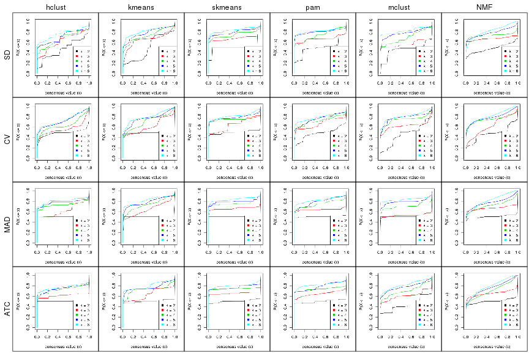


### Consensus heatmap

Consensus heatmaps for all methods. ([What is a consensus heatmap?](http://bioconductor.org/packages/devel/bioc/vignettes/cola/inst/doc/cola.html#toc_9))


<style type='text/css'>


.ui-helper-hidden {
	display: none;
}
.ui-helper-hidden-accessible {
	border: 0;
	clip: rect(0 0 0 0);
	height: 1px;
	margin: -1px;
	overflow: hidden;
	padding: 0;
	position: absolute;
	width: 1px;
}
.ui-helper-reset {
	margin: 0;
	padding: 0;
	border: 0;
	outline: 0;
	line-height: 1.3;
	text-decoration: none;
	font-size: 100%;
	list-style: none;
}
.ui-helper-clearfix:before,
.ui-helper-clearfix:after {
	content: "";
	display: table;
	border-collapse: collapse;
}
.ui-helper-clearfix:after {
	clear: both;
}
.ui-helper-zfix {
	width: 100%;
	height: 100%;
	top: 0;
	left: 0;
	position: absolute;
	opacity: 0;
	filter:Alpha(Opacity=0); 
}

.ui-front {
	z-index: 100;
}


.ui-state-disabled {
	cursor: default !important;
	pointer-events: none;
}


.ui-icon {
	display: inline-block;
	vertical-align: middle;
	margin-top: -.25em;
	position: relative;
	text-indent: -99999px;
	overflow: hidden;
	background-repeat: no-repeat;
}

.ui-widget-icon-block {
	left: 50%;
	margin-left: -8px;
	display: block;
}


.ui-widget-overlay {
	position: fixed;
	top: 0;
	left: 0;
	width: 100%;
	height: 100%;
}
.ui-accordion .ui-accordion-header {
	display: block;
	cursor: pointer;
	position: relative;
	margin: 2px 0 0 0;
	padding: .5em .5em .5em .7em;
	font-size: 100%;
}
.ui-accordion .ui-accordion-content {
	padding: 1em 2.2em;
	border-top: 0;
	overflow: auto;
}
.ui-autocomplete {
	position: absolute;
	top: 0;
	left: 0;
	cursor: default;
}
.ui-menu {
	list-style: none;
	padding: 0;
	margin: 0;
	display: block;
	outline: 0;
}
.ui-menu .ui-menu {
	position: absolute;
}
.ui-menu .ui-menu-item {
	margin: 0;
	cursor: pointer;
	
	list-style-image: url("data:image/gif;base64,R0lGODlhAQABAIAAAAAAAP///yH5BAEAAAAALAAAAAABAAEAAAIBRAA7");
}
.ui-menu .ui-menu-item-wrapper {
	position: relative;
	padding: 3px 1em 3px .4em;
}
.ui-menu .ui-menu-divider {
	margin: 5px 0;
	height: 0;
	font-size: 0;
	line-height: 0;
	border-width: 1px 0 0 0;
}
.ui-menu .ui-state-focus,
.ui-menu .ui-state-active {
	margin: -1px;
}


.ui-menu-icons {
	position: relative;
}
.ui-menu-icons .ui-menu-item-wrapper {
	padding-left: 2em;
}


.ui-menu .ui-icon {
	position: absolute;
	top: 0;
	bottom: 0;
	left: .2em;
	margin: auto 0;
}


.ui-menu .ui-menu-icon {
	left: auto;
	right: 0;
}
.ui-button {
	padding: .4em 1em;
	display: inline-block;
	position: relative;
	line-height: normal;
	margin-right: .1em;
	cursor: pointer;
	vertical-align: middle;
	text-align: center;
	-webkit-user-select: none;
	-moz-user-select: none;
	-ms-user-select: none;
	user-select: none;

	
	overflow: visible;
}

.ui-button,
.ui-button:link,
.ui-button:visited,
.ui-button:hover,
.ui-button:active {
	text-decoration: none;
}


.ui-button-icon-only {
	width: 2em;
	box-sizing: border-box;
	text-indent: -9999px;
	white-space: nowrap;
}


input.ui-button.ui-button-icon-only {
	text-indent: 0;
}


.ui-button-icon-only .ui-icon {
	position: absolute;
	top: 50%;
	left: 50%;
	margin-top: -8px;
	margin-left: -8px;
}

.ui-button.ui-icon-notext .ui-icon {
	padding: 0;
	width: 2.1em;
	height: 2.1em;
	text-indent: -9999px;
	white-space: nowrap;

}

input.ui-button.ui-icon-notext .ui-icon {
	width: auto;
	height: auto;
	text-indent: 0;
	white-space: normal;
	padding: .4em 1em;
}


input.ui-button::-moz-focus-inner,
button.ui-button::-moz-focus-inner {
	border: 0;
	padding: 0;
}
.ui-controlgroup {
	vertical-align: middle;
	display: inline-block;
}
.ui-controlgroup > .ui-controlgroup-item {
	float: left;
	margin-left: 0;
	margin-right: 0;
}
.ui-controlgroup > .ui-controlgroup-item:focus,
.ui-controlgroup > .ui-controlgroup-item.ui-visual-focus {
	z-index: 9999;
}
.ui-controlgroup-vertical > .ui-controlgroup-item {
	display: block;
	float: none;
	width: 100%;
	margin-top: 0;
	margin-bottom: 0;
	text-align: left;
}
.ui-controlgroup-vertical .ui-controlgroup-item {
	box-sizing: border-box;
}
.ui-controlgroup .ui-controlgroup-label {
	padding: .4em 1em;
}
.ui-controlgroup .ui-controlgroup-label span {
	font-size: 80%;
}
.ui-controlgroup-horizontal .ui-controlgroup-label + .ui-controlgroup-item {
	border-left: none;
}
.ui-controlgroup-vertical .ui-controlgroup-label + .ui-controlgroup-item {
	border-top: none;
}
.ui-controlgroup-horizontal .ui-controlgroup-label.ui-widget-content {
	border-right: none;
}
.ui-controlgroup-vertical .ui-controlgroup-label.ui-widget-content {
	border-bottom: none;
}


.ui-controlgroup-vertical .ui-spinner-input {

	
	width: 75%;
	width: calc( 100% - 2.4em );
}
.ui-controlgroup-vertical .ui-spinner .ui-spinner-up {
	border-top-style: solid;
}

.ui-checkboxradio-label .ui-icon-background {
	box-shadow: inset 1px 1px 1px #ccc;
	border-radius: .12em;
	border: none;
}
.ui-checkboxradio-radio-label .ui-icon-background {
	width: 16px;
	height: 16px;
	border-radius: 1em;
	overflow: visible;
	border: none;
}
.ui-checkboxradio-radio-label.ui-checkboxradio-checked .ui-icon,
.ui-checkboxradio-radio-label.ui-checkboxradio-checked:hover .ui-icon {
	background-image: none;
	width: 8px;
	height: 8px;
	border-width: 4px;
	border-style: solid;
}
.ui-checkboxradio-disabled {
	pointer-events: none;
}
.ui-datepicker {
	width: 17em;
	padding: .2em .2em 0;
	display: none;
}
.ui-datepicker .ui-datepicker-header {
	position: relative;
	padding: .2em 0;
}
.ui-datepicker .ui-datepicker-prev,
.ui-datepicker .ui-datepicker-next {
	position: absolute;
	top: 2px;
	width: 1.8em;
	height: 1.8em;
}
.ui-datepicker .ui-datepicker-prev-hover,
.ui-datepicker .ui-datepicker-next-hover {
	top: 1px;
}
.ui-datepicker .ui-datepicker-prev {
	left: 2px;
}
.ui-datepicker .ui-datepicker-next {
	right: 2px;
}
.ui-datepicker .ui-datepicker-prev-hover {
	left: 1px;
}
.ui-datepicker .ui-datepicker-next-hover {
	right: 1px;
}
.ui-datepicker .ui-datepicker-prev span,
.ui-datepicker .ui-datepicker-next span {
	display: block;
	position: absolute;
	left: 50%;
	margin-left: -8px;
	top: 50%;
	margin-top: -8px;
}
.ui-datepicker .ui-datepicker-title {
	margin: 0 2.3em;
	line-height: 1.8em;
	text-align: center;
}
.ui-datepicker .ui-datepicker-title select {
	font-size: 1em;
	margin: 1px 0;
}
.ui-datepicker select.ui-datepicker-month,
.ui-datepicker select.ui-datepicker-year {
	width: 45%;
}
.ui-datepicker table {
	width: 100%;
	font-size: .9em;
	border-collapse: collapse;
	margin: 0 0 .4em;
}
.ui-datepicker th {
	padding: .7em .3em;
	text-align: center;
	font-weight: bold;
	border: 0;
}
.ui-datepicker td {
	border: 0;
	padding: 1px;
}
.ui-datepicker td span,
.ui-datepicker td a {
	display: block;
	padding: .2em;
	text-align: right;
	text-decoration: none;
}
.ui-datepicker .ui-datepicker-buttonpane {
	background-image: none;
	margin: .7em 0 0 0;
	padding: 0 .2em;
	border-left: 0;
	border-right: 0;
	border-bottom: 0;
}
.ui-datepicker .ui-datepicker-buttonpane button {
	float: right;
	margin: .5em .2em .4em;
	cursor: pointer;
	padding: .2em .6em .3em .6em;
	width: auto;
	overflow: visible;
}
.ui-datepicker .ui-datepicker-buttonpane button.ui-datepicker-current {
	float: left;
}


.ui-datepicker.ui-datepicker-multi {
	width: auto;
}
.ui-datepicker-multi .ui-datepicker-group {
	float: left;
}
.ui-datepicker-multi .ui-datepicker-group table {
	width: 95%;
	margin: 0 auto .4em;
}
.ui-datepicker-multi-2 .ui-datepicker-group {
	width: 50%;
}
.ui-datepicker-multi-3 .ui-datepicker-group {
	width: 33.3%;
}
.ui-datepicker-multi-4 .ui-datepicker-group {
	width: 25%;
}
.ui-datepicker-multi .ui-datepicker-group-last .ui-datepicker-header,
.ui-datepicker-multi .ui-datepicker-group-middle .ui-datepicker-header {
	border-left-width: 0;
}
.ui-datepicker-multi .ui-datepicker-buttonpane {
	clear: left;
}
.ui-datepicker-row-break {
	clear: both;
	width: 100%;
	font-size: 0;
}


.ui-datepicker-rtl {
	direction: rtl;
}
.ui-datepicker-rtl .ui-datepicker-prev {
	right: 2px;
	left: auto;
}
.ui-datepicker-rtl .ui-datepicker-next {
	left: 2px;
	right: auto;
}
.ui-datepicker-rtl .ui-datepicker-prev:hover {
	right: 1px;
	left: auto;
}
.ui-datepicker-rtl .ui-datepicker-next:hover {
	left: 1px;
	right: auto;
}
.ui-datepicker-rtl .ui-datepicker-buttonpane {
	clear: right;
}
.ui-datepicker-rtl .ui-datepicker-buttonpane button {
	float: left;
}
.ui-datepicker-rtl .ui-datepicker-buttonpane button.ui-datepicker-current,
.ui-datepicker-rtl .ui-datepicker-group {
	float: right;
}
.ui-datepicker-rtl .ui-datepicker-group-last .ui-datepicker-header,
.ui-datepicker-rtl .ui-datepicker-group-middle .ui-datepicker-header {
	border-right-width: 0;
	border-left-width: 1px;
}


.ui-datepicker .ui-icon {
	display: block;
	text-indent: -99999px;
	overflow: hidden;
	background-repeat: no-repeat;
	left: .5em;
	top: .3em;
}
.ui-dialog {
	position: absolute;
	top: 0;
	left: 0;
	padding: .2em;
	outline: 0;
}
.ui-dialog .ui-dialog-titlebar {
	padding: .4em 1em;
	position: relative;
}
.ui-dialog .ui-dialog-title {
	float: left;
	margin: .1em 0;
	white-space: nowrap;
	width: 90%;
	overflow: hidden;
	text-overflow: ellipsis;
}
.ui-dialog .ui-dialog-titlebar-close {
	position: absolute;
	right: .3em;
	top: 50%;
	width: 20px;
	margin: -10px 0 0 0;
	padding: 1px;
	height: 20px;
}
.ui-dialog .ui-dialog-content {
	position: relative;
	border: 0;
	padding: .5em 1em;
	background: none;
	overflow: auto;
}
.ui-dialog .ui-dialog-buttonpane {
	text-align: left;
	border-width: 1px 0 0 0;
	background-image: none;
	margin-top: .5em;
	padding: .3em 1em .5em .4em;
}
.ui-dialog .ui-dialog-buttonpane .ui-dialog-buttonset {
	float: right;
}
.ui-dialog .ui-dialog-buttonpane button {
	margin: .5em .4em .5em 0;
	cursor: pointer;
}
.ui-dialog .ui-resizable-n {
	height: 2px;
	top: 0;
}
.ui-dialog .ui-resizable-e {
	width: 2px;
	right: 0;
}
.ui-dialog .ui-resizable-s {
	height: 2px;
	bottom: 0;
}
.ui-dialog .ui-resizable-w {
	width: 2px;
	left: 0;
}
.ui-dialog .ui-resizable-se,
.ui-dialog .ui-resizable-sw,
.ui-dialog .ui-resizable-ne,
.ui-dialog .ui-resizable-nw {
	width: 7px;
	height: 7px;
}
.ui-dialog .ui-resizable-se {
	right: 0;
	bottom: 0;
}
.ui-dialog .ui-resizable-sw {
	left: 0;
	bottom: 0;
}
.ui-dialog .ui-resizable-ne {
	right: 0;
	top: 0;
}
.ui-dialog .ui-resizable-nw {
	left: 0;
	top: 0;
}
.ui-draggable .ui-dialog-titlebar {
	cursor: move;
}
.ui-draggable-handle {
	-ms-touch-action: none;
	touch-action: none;
}
.ui-resizable {
	position: relative;
}
.ui-resizable-handle {
	position: absolute;
	font-size: 0.1px;
	display: block;
	-ms-touch-action: none;
	touch-action: none;
}
.ui-resizable-disabled .ui-resizable-handle,
.ui-resizable-autohide .ui-resizable-handle {
	display: none;
}
.ui-resizable-n {
	cursor: n-resize;
	height: 7px;
	width: 100%;
	top: -5px;
	left: 0;
}
.ui-resizable-s {
	cursor: s-resize;
	height: 7px;
	width: 100%;
	bottom: -5px;
	left: 0;
}
.ui-resizable-e {
	cursor: e-resize;
	width: 7px;
	right: -5px;
	top: 0;
	height: 100%;
}
.ui-resizable-w {
	cursor: w-resize;
	width: 7px;
	left: -5px;
	top: 0;
	height: 100%;
}
.ui-resizable-se {
	cursor: se-resize;
	width: 12px;
	height: 12px;
	right: 1px;
	bottom: 1px;
}
.ui-resizable-sw {
	cursor: sw-resize;
	width: 9px;
	height: 9px;
	left: -5px;
	bottom: -5px;
}
.ui-resizable-nw {
	cursor: nw-resize;
	width: 9px;
	height: 9px;
	left: -5px;
	top: -5px;
}
.ui-resizable-ne {
	cursor: ne-resize;
	width: 9px;
	height: 9px;
	right: -5px;
	top: -5px;
}
.ui-progressbar {
	height: 2em;
	text-align: left;
	overflow: hidden;
}
.ui-progressbar .ui-progressbar-value {
	margin: -1px;
	height: 100%;
}
.ui-progressbar .ui-progressbar-overlay {
	background: url("data:image/gif;base64,R0lGODlhKAAoAIABAAAAAP///yH/C05FVFNDQVBFMi4wAwEAAAAh+QQJAQABACwAAAAAKAAoAAACkYwNqXrdC52DS06a7MFZI+4FHBCKoDeWKXqymPqGqxvJrXZbMx7Ttc+w9XgU2FB3lOyQRWET2IFGiU9m1frDVpxZZc6bfHwv4c1YXP6k1Vdy292Fb6UkuvFtXpvWSzA+HycXJHUXiGYIiMg2R6W459gnWGfHNdjIqDWVqemH2ekpObkpOlppWUqZiqr6edqqWQAAIfkECQEAAQAsAAAAACgAKAAAApSMgZnGfaqcg1E2uuzDmmHUBR8Qil95hiPKqWn3aqtLsS18y7G1SzNeowWBENtQd+T1JktP05nzPTdJZlR6vUxNWWjV+vUWhWNkWFwxl9VpZRedYcflIOLafaa28XdsH/ynlcc1uPVDZxQIR0K25+cICCmoqCe5mGhZOfeYSUh5yJcJyrkZWWpaR8doJ2o4NYq62lAAACH5BAkBAAEALAAAAAAoACgAAAKVDI4Yy22ZnINRNqosw0Bv7i1gyHUkFj7oSaWlu3ovC8GxNso5fluz3qLVhBVeT/Lz7ZTHyxL5dDalQWPVOsQWtRnuwXaFTj9jVVh8pma9JjZ4zYSj5ZOyma7uuolffh+IR5aW97cHuBUXKGKXlKjn+DiHWMcYJah4N0lYCMlJOXipGRr5qdgoSTrqWSq6WFl2ypoaUAAAIfkECQEAAQAsAAAAACgAKAAAApaEb6HLgd/iO7FNWtcFWe+ufODGjRfoiJ2akShbueb0wtI50zm02pbvwfWEMWBQ1zKGlLIhskiEPm9R6vRXxV4ZzWT2yHOGpWMyorblKlNp8HmHEb/lCXjcW7bmtXP8Xt229OVWR1fod2eWqNfHuMjXCPkIGNileOiImVmCOEmoSfn3yXlJWmoHGhqp6ilYuWYpmTqKUgAAIfkECQEAAQAsAAAAACgAKAAAApiEH6kb58biQ3FNWtMFWW3eNVcojuFGfqnZqSebuS06w5V80/X02pKe8zFwP6EFWOT1lDFk8rGERh1TTNOocQ61Hm4Xm2VexUHpzjymViHrFbiELsefVrn6XKfnt2Q9G/+Xdie499XHd2g4h7ioOGhXGJboGAnXSBnoBwKYyfioubZJ2Hn0RuRZaflZOil56Zp6iioKSXpUAAAh+QQJAQABACwAAAAAKAAoAAACkoQRqRvnxuI7kU1a1UU5bd5tnSeOZXhmn5lWK3qNTWvRdQxP8qvaC+/yaYQzXO7BMvaUEmJRd3TsiMAgswmNYrSgZdYrTX6tSHGZO73ezuAw2uxuQ+BbeZfMxsexY35+/Qe4J1inV0g4x3WHuMhIl2jXOKT2Q+VU5fgoSUI52VfZyfkJGkha6jmY+aaYdirq+lQAACH5BAkBAAEALAAAAAAoACgAAAKWBIKpYe0L3YNKToqswUlvznigd4wiR4KhZrKt9Upqip61i9E3vMvxRdHlbEFiEXfk9YARYxOZZD6VQ2pUunBmtRXo1Lf8hMVVcNl8JafV38aM2/Fu5V16Bn63r6xt97j09+MXSFi4BniGFae3hzbH9+hYBzkpuUh5aZmHuanZOZgIuvbGiNeomCnaxxap2upaCZsq+1kAACH5BAkBAAEALAAAAAAoACgAAAKXjI8By5zf4kOxTVrXNVlv1X0d8IGZGKLnNpYtm8Lr9cqVeuOSvfOW79D9aDHizNhDJidFZhNydEahOaDH6nomtJjp1tutKoNWkvA6JqfRVLHU/QUfau9l2x7G54d1fl995xcIGAdXqMfBNadoYrhH+Mg2KBlpVpbluCiXmMnZ2Sh4GBqJ+ckIOqqJ6LmKSllZmsoq6wpQAAAh+QQJAQABACwAAAAAKAAoAAAClYx/oLvoxuJDkU1a1YUZbJ59nSd2ZXhWqbRa2/gF8Gu2DY3iqs7yrq+xBYEkYvFSM8aSSObE+ZgRl1BHFZNr7pRCavZ5BW2142hY3AN/zWtsmf12p9XxxFl2lpLn1rseztfXZjdIWIf2s5dItwjYKBgo9yg5pHgzJXTEeGlZuenpyPmpGQoKOWkYmSpaSnqKileI2FAAACH5BAkBAAEALAAAAAAoACgAAAKVjB+gu+jG4kORTVrVhRlsnn2dJ3ZleFaptFrb+CXmO9OozeL5VfP99HvAWhpiUdcwkpBH3825AwYdU8xTqlLGhtCosArKMpvfa1mMRae9VvWZfeB2XfPkeLmm18lUcBj+p5dnN8jXZ3YIGEhYuOUn45aoCDkp16hl5IjYJvjWKcnoGQpqyPlpOhr3aElaqrq56Bq7VAAAOw==");
	height: 100%;
	filter: alpha(opacity=25); 
	opacity: 0.25;
}
.ui-progressbar-indeterminate .ui-progressbar-value {
	background-image: none;
}
.ui-selectable {
	-ms-touch-action: none;
	touch-action: none;
}
.ui-selectable-helper {
	position: absolute;
	z-index: 100;
	border: 1px dotted black;
}
.ui-selectmenu-menu {
	padding: 0;
	margin: 0;
	position: absolute;
	top: 0;
	left: 0;
	display: none;
}
.ui-selectmenu-menu .ui-menu {
	overflow: auto;
	overflow-x: hidden;
	padding-bottom: 1px;
}
.ui-selectmenu-menu .ui-menu .ui-selectmenu-optgroup {
	font-size: 1em;
	font-weight: bold;
	line-height: 1.5;
	padding: 2px 0.4em;
	margin: 0.5em 0 0 0;
	height: auto;
	border: 0;
}
.ui-selectmenu-open {
	display: block;
}
.ui-selectmenu-text {
	display: block;
	margin-right: 20px;
	overflow: hidden;
	text-overflow: ellipsis;
}
.ui-selectmenu-button.ui-button {
	text-align: left;
	white-space: nowrap;
	width: 14em;
}
.ui-selectmenu-icon.ui-icon {
	float: right;
	margin-top: 0;
}
.ui-slider {
	position: relative;
	text-align: left;
}
.ui-slider .ui-slider-handle {
	position: absolute;
	z-index: 2;
	width: 1.2em;
	height: 1.2em;
	cursor: default;
	-ms-touch-action: none;
	touch-action: none;
}
.ui-slider .ui-slider-range {
	position: absolute;
	z-index: 1;
	font-size: .7em;
	display: block;
	border: 0;
	background-position: 0 0;
}


.ui-slider.ui-state-disabled .ui-slider-handle,
.ui-slider.ui-state-disabled .ui-slider-range {
	filter: inherit;
}

.ui-slider-horizontal {
	height: .8em;
}
.ui-slider-horizontal .ui-slider-handle {
	top: -.3em;
	margin-left: -.6em;
}
.ui-slider-horizontal .ui-slider-range {
	top: 0;
	height: 100%;
}
.ui-slider-horizontal .ui-slider-range-min {
	left: 0;
}
.ui-slider-horizontal .ui-slider-range-max {
	right: 0;
}

.ui-slider-vertical {
	width: .8em;
	height: 100px;
}
.ui-slider-vertical .ui-slider-handle {
	left: -.3em;
	margin-left: 0;
	margin-bottom: -.6em;
}
.ui-slider-vertical .ui-slider-range {
	left: 0;
	width: 100%;
}
.ui-slider-vertical .ui-slider-range-min {
	bottom: 0;
}
.ui-slider-vertical .ui-slider-range-max {
	top: 0;
}
.ui-sortable-handle {
	-ms-touch-action: none;
	touch-action: none;
}
.ui-spinner {
	position: relative;
	display: inline-block;
	overflow: hidden;
	padding: 0;
	vertical-align: middle;
}
.ui-spinner-input {
	border: none;
	background: none;
	color: inherit;
	padding: .222em 0;
	margin: .2em 0;
	vertical-align: middle;
	margin-left: .4em;
	margin-right: 2em;
}
.ui-spinner-button {
	width: 1.6em;
	height: 50%;
	font-size: .5em;
	padding: 0;
	margin: 0;
	text-align: center;
	position: absolute;
	cursor: default;
	display: block;
	overflow: hidden;
	right: 0;
}

.ui-spinner a.ui-spinner-button {
	border-top-style: none;
	border-bottom-style: none;
	border-right-style: none;
}
.ui-spinner-up {
	top: 0;
}
.ui-spinner-down {
	bottom: 0;
}
.ui-tabs {
	position: relative;
	padding: .2em;
}
.ui-tabs .ui-tabs-nav {
	margin: 0;
	padding: .2em .2em 0;
}
.ui-tabs .ui-tabs-nav li {
	list-style: none;
	float: left;
	position: relative;
	top: 0;
	margin: 1px .2em 0 0;
	border-bottom-width: 0;
	padding: 0;
	white-space: nowrap;
}
.ui-tabs .ui-tabs-nav .ui-tabs-anchor {
	float: left;
	padding: .5em 1em;
	text-decoration: none;
}
.ui-tabs .ui-tabs-nav li.ui-tabs-active {
	margin-bottom: -1px;
	padding-bottom: 1px;
}
.ui-tabs .ui-tabs-nav li.ui-tabs-active .ui-tabs-anchor,
.ui-tabs .ui-tabs-nav li.ui-state-disabled .ui-tabs-anchor,
.ui-tabs .ui-tabs-nav li.ui-tabs-loading .ui-tabs-anchor {
	cursor: text;
}
.ui-tabs-collapsible .ui-tabs-nav li.ui-tabs-active .ui-tabs-anchor {
	cursor: pointer;
}
.ui-tabs .ui-tabs-panel {
	display: block;
	border-width: 0;
	padding: 1em 1.4em;
	background: none;
}
.ui-tooltip {
	padding: 8px;
	position: absolute;
	z-index: 9999;
	max-width: 300px;
}
body .ui-tooltip {
	border-width: 2px;
}

.ui-widget {
	font-family: Arial,Helvetica,sans-serif;
	font-size: 1em;
}
.ui-widget .ui-widget {
	font-size: 1em;
}
.ui-widget input,
.ui-widget select,
.ui-widget textarea,
.ui-widget button {
	font-family: Arial,Helvetica,sans-serif;
	font-size: 1em;
}
.ui-widget.ui-widget-content {
	border: 1px solid #c5c5c5;
}
.ui-widget-content {
	border: 1px solid #dddddd;
	background: #ffffff;
	color: #333333;
}
.ui-widget-content a {
	color: #333333;
}
.ui-widget-header {
	border: 1px solid #dddddd;
	background: #e9e9e9;
	color: #333333;
	font-weight: bold;
}
.ui-widget-header a {
	color: #333333;
}


.ui-state-default,
.ui-widget-content .ui-state-default,
.ui-widget-header .ui-state-default,
.ui-button,


html .ui-button.ui-state-disabled:hover,
html .ui-button.ui-state-disabled:active {
	border: 1px solid #c5c5c5;
	background: #f6f6f6;
	font-weight: normal;
	color: #454545;
}
.ui-state-default a,
.ui-state-default a:link,
.ui-state-default a:visited,
a.ui-button,
a:link.ui-button,
a:visited.ui-button,
.ui-button {
	color: #454545;
	text-decoration: none;
}
.ui-state-hover,
.ui-widget-content .ui-state-hover,
.ui-widget-header .ui-state-hover,
.ui-state-focus,
.ui-widget-content .ui-state-focus,
.ui-widget-header .ui-state-focus,
.ui-button:hover,
.ui-button:focus {
	border: 1px solid #cccccc;
	background: #ededed;
	font-weight: normal;
	color: #2b2b2b;
}
.ui-state-hover a,
.ui-state-hover a:hover,
.ui-state-hover a:link,
.ui-state-hover a:visited,
.ui-state-focus a,
.ui-state-focus a:hover,
.ui-state-focus a:link,
.ui-state-focus a:visited,
a.ui-button:hover,
a.ui-button:focus {
	color: #2b2b2b;
	text-decoration: none;
}

.ui-visual-focus {
	box-shadow: 0 0 3px 1px rgb(94, 158, 214);
}
.ui-state-active,
.ui-widget-content .ui-state-active,
.ui-widget-header .ui-state-active,
a.ui-button:active,
.ui-button:active,
.ui-button.ui-state-active:hover {
	border: 1px solid #003eff;
	background: #007fff;
	font-weight: normal;
	color: #ffffff;
}
.ui-icon-background,
.ui-state-active .ui-icon-background {
	border: #003eff;
	background-color: #ffffff;
}
.ui-state-active a,
.ui-state-active a:link,
.ui-state-active a:visited {
	color: #ffffff;
	text-decoration: none;
}


.ui-state-highlight,
.ui-widget-content .ui-state-highlight,
.ui-widget-header .ui-state-highlight {
	border: 1px solid #dad55e;
	background: #fffa90;
	color: #777620;
}
.ui-state-checked {
	border: 1px solid #dad55e;
	background: #fffa90;
}
.ui-state-highlight a,
.ui-widget-content .ui-state-highlight a,
.ui-widget-header .ui-state-highlight a {
	color: #777620;
}
.ui-state-error,
.ui-widget-content .ui-state-error,
.ui-widget-header .ui-state-error {
	border: 1px solid #f1a899;
	background: #fddfdf;
	color: #5f3f3f;
}
.ui-state-error a,
.ui-widget-content .ui-state-error a,
.ui-widget-header .ui-state-error a {
	color: #5f3f3f;
}
.ui-state-error-text,
.ui-widget-content .ui-state-error-text,
.ui-widget-header .ui-state-error-text {
	color: #5f3f3f;
}
.ui-priority-primary,
.ui-widget-content .ui-priority-primary,
.ui-widget-header .ui-priority-primary {
	font-weight: bold;
}
.ui-priority-secondary,
.ui-widget-content .ui-priority-secondary,
.ui-widget-header .ui-priority-secondary {
	opacity: .7;
	filter:Alpha(Opacity=70); 
	font-weight: normal;
}
.ui-state-disabled,
.ui-widget-content .ui-state-disabled,
.ui-widget-header .ui-state-disabled {
	opacity: .35;
	filter:Alpha(Opacity=35); 
	background-image: none;
}
.ui-state-disabled .ui-icon {
	filter:Alpha(Opacity=35); 
}


.ui-icon {
	width: 16px;
	height: 16px;
}
.ui-icon,
.ui-widget-content .ui-icon {
	background-image: url("images/ui-icons_444444_256x240.png");
}
.ui-widget-header .ui-icon {
	background-image: url("images/ui-icons_444444_256x240.png");
}
.ui-state-hover .ui-icon,
.ui-state-focus .ui-icon,
.ui-button:hover .ui-icon,
.ui-button:focus .ui-icon {
	background-image: url("images/ui-icons_555555_256x240.png");
}
.ui-state-active .ui-icon,
.ui-button:active .ui-icon {
	background-image: url("images/ui-icons_ffffff_256x240.png");
}
.ui-state-highlight .ui-icon,
.ui-button .ui-state-highlight.ui-icon {
	background-image: url("images/ui-icons_777620_256x240.png");
}
.ui-state-error .ui-icon,
.ui-state-error-text .ui-icon {
	background-image: url("images/ui-icons_cc0000_256x240.png");
}
.ui-button .ui-icon {
	background-image: url("images/ui-icons_777777_256x240.png");
}


.ui-icon-blank { background-position: 16px 16px; }
.ui-icon-caret-1-n { background-position: 0 0; }
.ui-icon-caret-1-ne { background-position: -16px 0; }
.ui-icon-caret-1-e { background-position: -32px 0; }
.ui-icon-caret-1-se { background-position: -48px 0; }
.ui-icon-caret-1-s { background-position: -65px 0; }
.ui-icon-caret-1-sw { background-position: -80px 0; }
.ui-icon-caret-1-w { background-position: -96px 0; }
.ui-icon-caret-1-nw { background-position: -112px 0; }
.ui-icon-caret-2-n-s { background-position: -128px 0; }
.ui-icon-caret-2-e-w { background-position: -144px 0; }
.ui-icon-triangle-1-n { background-position: 0 -16px; }
.ui-icon-triangle-1-ne { background-position: -16px -16px; }
.ui-icon-triangle-1-e { background-position: -32px -16px; }
.ui-icon-triangle-1-se { background-position: -48px -16px; }
.ui-icon-triangle-1-s { background-position: -65px -16px; }
.ui-icon-triangle-1-sw { background-position: -80px -16px; }
.ui-icon-triangle-1-w { background-position: -96px -16px; }
.ui-icon-triangle-1-nw { background-position: -112px -16px; }
.ui-icon-triangle-2-n-s { background-position: -128px -16px; }
.ui-icon-triangle-2-e-w { background-position: -144px -16px; }
.ui-icon-arrow-1-n { background-position: 0 -32px; }
.ui-icon-arrow-1-ne { background-position: -16px -32px; }
.ui-icon-arrow-1-e { background-position: -32px -32px; }
.ui-icon-arrow-1-se { background-position: -48px -32px; }
.ui-icon-arrow-1-s { background-position: -65px -32px; }
.ui-icon-arrow-1-sw { background-position: -80px -32px; }
.ui-icon-arrow-1-w { background-position: -96px -32px; }
.ui-icon-arrow-1-nw { background-position: -112px -32px; }
.ui-icon-arrow-2-n-s { background-position: -128px -32px; }
.ui-icon-arrow-2-ne-sw { background-position: -144px -32px; }
.ui-icon-arrow-2-e-w { background-position: -160px -32px; }
.ui-icon-arrow-2-se-nw { background-position: -176px -32px; }
.ui-icon-arrowstop-1-n { background-position: -192px -32px; }
.ui-icon-arrowstop-1-e { background-position: -208px -32px; }
.ui-icon-arrowstop-1-s { background-position: -224px -32px; }
.ui-icon-arrowstop-1-w { background-position: -240px -32px; }
.ui-icon-arrowthick-1-n { background-position: 1px -48px; }
.ui-icon-arrowthick-1-ne { background-position: -16px -48px; }
.ui-icon-arrowthick-1-e { background-position: -32px -48px; }
.ui-icon-arrowthick-1-se { background-position: -48px -48px; }
.ui-icon-arrowthick-1-s { background-position: -64px -48px; }
.ui-icon-arrowthick-1-sw { background-position: -80px -48px; }
.ui-icon-arrowthick-1-w { background-position: -96px -48px; }
.ui-icon-arrowthick-1-nw { background-position: -112px -48px; }
.ui-icon-arrowthick-2-n-s { background-position: -128px -48px; }
.ui-icon-arrowthick-2-ne-sw { background-position: -144px -48px; }
.ui-icon-arrowthick-2-e-w { background-position: -160px -48px; }
.ui-icon-arrowthick-2-se-nw { background-position: -176px -48px; }
.ui-icon-arrowthickstop-1-n { background-position: -192px -48px; }
.ui-icon-arrowthickstop-1-e { background-position: -208px -48px; }
.ui-icon-arrowthickstop-1-s { background-position: -224px -48px; }
.ui-icon-arrowthickstop-1-w { background-position: -240px -48px; }
.ui-icon-arrowreturnthick-1-w { background-position: 0 -64px; }
.ui-icon-arrowreturnthick-1-n { background-position: -16px -64px; }
.ui-icon-arrowreturnthick-1-e { background-position: -32px -64px; }
.ui-icon-arrowreturnthick-1-s { background-position: -48px -64px; }
.ui-icon-arrowreturn-1-w { background-position: -64px -64px; }
.ui-icon-arrowreturn-1-n { background-position: -80px -64px; }
.ui-icon-arrowreturn-1-e { background-position: -96px -64px; }
.ui-icon-arrowreturn-1-s { background-position: -112px -64px; }
.ui-icon-arrowrefresh-1-w { background-position: -128px -64px; }
.ui-icon-arrowrefresh-1-n { background-position: -144px -64px; }
.ui-icon-arrowrefresh-1-e { background-position: -160px -64px; }
.ui-icon-arrowrefresh-1-s { background-position: -176px -64px; }
.ui-icon-arrow-4 { background-position: 0 -80px; }
.ui-icon-arrow-4-diag { background-position: -16px -80px; }
.ui-icon-extlink { background-position: -32px -80px; }
.ui-icon-newwin { background-position: -48px -80px; }
.ui-icon-refresh { background-position: -64px -80px; }
.ui-icon-shuffle { background-position: -80px -80px; }
.ui-icon-transfer-e-w { background-position: -96px -80px; }
.ui-icon-transferthick-e-w { background-position: -112px -80px; }
.ui-icon-folder-collapsed { background-position: 0 -96px; }
.ui-icon-folder-open { background-position: -16px -96px; }
.ui-icon-document { background-position: -32px -96px; }
.ui-icon-document-b { background-position: -48px -96px; }
.ui-icon-note { background-position: -64px -96px; }
.ui-icon-mail-closed { background-position: -80px -96px; }
.ui-icon-mail-open { background-position: -96px -96px; }
.ui-icon-suitcase { background-position: -112px -96px; }
.ui-icon-comment { background-position: -128px -96px; }
.ui-icon-person { background-position: -144px -96px; }
.ui-icon-print { background-position: -160px -96px; }
.ui-icon-trash { background-position: -176px -96px; }
.ui-icon-locked { background-position: -192px -96px; }
.ui-icon-unlocked { background-position: -208px -96px; }
.ui-icon-bookmark { background-position: -224px -96px; }
.ui-icon-tag { background-position: -240px -96px; }
.ui-icon-home { background-position: 0 -112px; }
.ui-icon-flag { background-position: -16px -112px; }
.ui-icon-calendar { background-position: -32px -112px; }
.ui-icon-cart { background-position: -48px -112px; }
.ui-icon-pencil { background-position: -64px -112px; }
.ui-icon-clock { background-position: -80px -112px; }
.ui-icon-disk { background-position: -96px -112px; }
.ui-icon-calculator { background-position: -112px -112px; }
.ui-icon-zoomin { background-position: -128px -112px; }
.ui-icon-zoomout { background-position: -144px -112px; }
.ui-icon-search { background-position: -160px -112px; }
.ui-icon-wrench { background-position: -176px -112px; }
.ui-icon-gear { background-position: -192px -112px; }
.ui-icon-heart { background-position: -208px -112px; }
.ui-icon-star { background-position: -224px -112px; }
.ui-icon-link { background-position: -240px -112px; }
.ui-icon-cancel { background-position: 0 -128px; }
.ui-icon-plus { background-position: -16px -128px; }
.ui-icon-plusthick { background-position: -32px -128px; }
.ui-icon-minus { background-position: -48px -128px; }
.ui-icon-minusthick { background-position: -64px -128px; }
.ui-icon-close { background-position: -80px -128px; }
.ui-icon-closethick { background-position: -96px -128px; }
.ui-icon-key { background-position: -112px -128px; }
.ui-icon-lightbulb { background-position: -128px -128px; }
.ui-icon-scissors { background-position: -144px -128px; }
.ui-icon-clipboard { background-position: -160px -128px; }
.ui-icon-copy { background-position: -176px -128px; }
.ui-icon-contact { background-position: -192px -128px; }
.ui-icon-image { background-position: -208px -128px; }
.ui-icon-video { background-position: -224px -128px; }
.ui-icon-script { background-position: -240px -128px; }
.ui-icon-alert { background-position: 0 -144px; }
.ui-icon-info { background-position: -16px -144px; }
.ui-icon-notice { background-position: -32px -144px; }
.ui-icon-help { background-position: -48px -144px; }
.ui-icon-check { background-position: -64px -144px; }
.ui-icon-bullet { background-position: -80px -144px; }
.ui-icon-radio-on { background-position: -96px -144px; }
.ui-icon-radio-off { background-position: -112px -144px; }
.ui-icon-pin-w { background-position: -128px -144px; }
.ui-icon-pin-s { background-position: -144px -144px; }
.ui-icon-play { background-position: 0 -160px; }
.ui-icon-pause { background-position: -16px -160px; }
.ui-icon-seek-next { background-position: -32px -160px; }
.ui-icon-seek-prev { background-position: -48px -160px; }
.ui-icon-seek-end { background-position: -64px -160px; }
.ui-icon-seek-start { background-position: -80px -160px; }

.ui-icon-seek-first { background-position: -80px -160px; }
.ui-icon-stop { background-position: -96px -160px; }
.ui-icon-eject { background-position: -112px -160px; }
.ui-icon-volume-off { background-position: -128px -160px; }
.ui-icon-volume-on { background-position: -144px -160px; }
.ui-icon-power { background-position: 0 -176px; }
.ui-icon-signal-diag { background-position: -16px -176px; }
.ui-icon-signal { background-position: -32px -176px; }
.ui-icon-battery-0 { background-position: -48px -176px; }
.ui-icon-battery-1 { background-position: -64px -176px; }
.ui-icon-battery-2 { background-position: -80px -176px; }
.ui-icon-battery-3 { background-position: -96px -176px; }
.ui-icon-circle-plus { background-position: 0 -192px; }
.ui-icon-circle-minus { background-position: -16px -192px; }
.ui-icon-circle-close { background-position: -32px -192px; }
.ui-icon-circle-triangle-e { background-position: -48px -192px; }
.ui-icon-circle-triangle-s { background-position: -64px -192px; }
.ui-icon-circle-triangle-w { background-position: -80px -192px; }
.ui-icon-circle-triangle-n { background-position: -96px -192px; }
.ui-icon-circle-arrow-e { background-position: -112px -192px; }
.ui-icon-circle-arrow-s { background-position: -128px -192px; }
.ui-icon-circle-arrow-w { background-position: -144px -192px; }
.ui-icon-circle-arrow-n { background-position: -160px -192px; }
.ui-icon-circle-zoomin { background-position: -176px -192px; }
.ui-icon-circle-zoomout { background-position: -192px -192px; }
.ui-icon-circle-check { background-position: -208px -192px; }
.ui-icon-circlesmall-plus { background-position: 0 -208px; }
.ui-icon-circlesmall-minus { background-position: -16px -208px; }
.ui-icon-circlesmall-close { background-position: -32px -208px; }
.ui-icon-squaresmall-plus { background-position: -48px -208px; }
.ui-icon-squaresmall-minus { background-position: -64px -208px; }
.ui-icon-squaresmall-close { background-position: -80px -208px; }
.ui-icon-grip-dotted-vertical { background-position: 0 -224px; }
.ui-icon-grip-dotted-horizontal { background-position: -16px -224px; }
.ui-icon-grip-solid-vertical { background-position: -32px -224px; }
.ui-icon-grip-solid-horizontal { background-position: -48px -224px; }
.ui-icon-gripsmall-diagonal-se { background-position: -64px -224px; }
.ui-icon-grip-diagonal-se { background-position: -80px -224px; }


.ui-corner-all,
.ui-corner-top,
.ui-corner-left,
.ui-corner-tl {
	border-top-left-radius: 3px;
}
.ui-corner-all,
.ui-corner-top,
.ui-corner-right,
.ui-corner-tr {
	border-top-right-radius: 3px;
}
.ui-corner-all,
.ui-corner-bottom,
.ui-corner-left,
.ui-corner-bl {
	border-bottom-left-radius: 3px;
}
.ui-corner-all,
.ui-corner-bottom,
.ui-corner-right,
.ui-corner-br {
	border-bottom-right-radius: 3px;
}


.ui-widget-overlay {
	background: #aaaaaa;
	opacity: .3;
	filter: Alpha(Opacity=30); 
}
.ui-widget-shadow {
	-webkit-box-shadow: 0px 0px 5px #666666;
	box-shadow: 0px 0px 5px #666666;
} 
</style>
<script src='js/jquery-1.12.4.js'></script>
<script src='js/jquery-ui.js'></script>

<script>
$( function() {
	$( '#tabs-collect-consensus-heatmap' ).tabs();
} );
</script>
<div id='tabs-collect-consensus-heatmap'>
<ul>
<li><a href='#tab-collect-consensus-heatmap-1'>k = 2</a></li>
<li><a href='#tab-collect-consensus-heatmap-2'>k = 3</a></li>
<li><a href='#tab-collect-consensus-heatmap-3'>k = 4</a></li>
<li><a href='#tab-collect-consensus-heatmap-4'>k = 5</a></li>
<li><a href='#tab-collect-consensus-heatmap-5'>k = 6</a></li>
</ul>
<div id='tab-collect-consensus-heatmap-1'>
<pre><code class="r">collect_plots(res_list, k = 2, fun = consensus_heatmap, mc.cores = 4)
</code></pre>

<p></p>

</div>
<div id='tab-collect-consensus-heatmap-2'>
<pre><code class="r">collect_plots(res_list, k = 3, fun = consensus_heatmap, mc.cores = 4)
</code></pre>

<p></p>

</div>
<div id='tab-collect-consensus-heatmap-3'>
<pre><code class="r">collect_plots(res_list, k = 4, fun = consensus_heatmap, mc.cores = 4)
</code></pre>

<p></p>

</div>
<div id='tab-collect-consensus-heatmap-4'>
<pre><code class="r">collect_plots(res_list, k = 5, fun = consensus_heatmap, mc.cores = 4)
</code></pre>

<p></p>

</div>
<div id='tab-collect-consensus-heatmap-5'>
<pre><code class="r">collect_plots(res_list, k = 6, fun = consensus_heatmap, mc.cores = 4)
</code></pre>

<p></p>

</div>
</div>


### Membership heatmap

Membership heatmaps for all methods. ([What is a membership heatmap?](http://bioconductor.org/packages/devel/bioc/vignettes/cola/inst/doc/cola.html#toc_12))


<script>
$( function() {
	$( '#tabs-collect-membership-heatmap' ).tabs();
} );
</script>
<div id='tabs-collect-membership-heatmap'>
<ul>
<li><a href='#tab-collect-membership-heatmap-1'>k = 2</a></li>
<li><a href='#tab-collect-membership-heatmap-2'>k = 3</a></li>
<li><a href='#tab-collect-membership-heatmap-3'>k = 4</a></li>
<li><a href='#tab-collect-membership-heatmap-4'>k = 5</a></li>
<li><a href='#tab-collect-membership-heatmap-5'>k = 6</a></li>
</ul>
<div id='tab-collect-membership-heatmap-1'>
<pre><code class="r">collect_plots(res_list, k = 2, fun = membership_heatmap, mc.cores = 4)
</code></pre>

<p></p>

</div>
<div id='tab-collect-membership-heatmap-2'>
<pre><code class="r">collect_plots(res_list, k = 3, fun = membership_heatmap, mc.cores = 4)
</code></pre>

<p></p>

</div>
<div id='tab-collect-membership-heatmap-3'>
<pre><code class="r">collect_plots(res_list, k = 4, fun = membership_heatmap, mc.cores = 4)
</code></pre>

<p></p>

</div>
<div id='tab-collect-membership-heatmap-4'>
<pre><code class="r">collect_plots(res_list, k = 5, fun = membership_heatmap, mc.cores = 4)
</code></pre>

<p></p>

</div>
<div id='tab-collect-membership-heatmap-5'>
<pre><code class="r">collect_plots(res_list, k = 6, fun = membership_heatmap, mc.cores = 4)
</code></pre>

<p>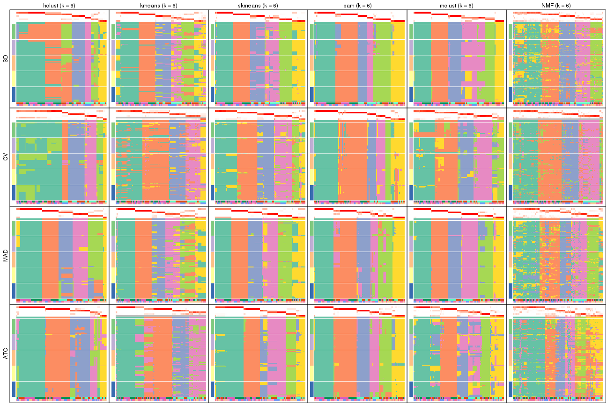</p>

</div>
</div>


### Signature heatmap

Signature heatmaps for all methods. ([What is a signature heatmap?](http://bioconductor.org/packages/devel/bioc/vignettes/cola/inst/doc/cola.html#toc_22))


Note in following heatmaps, rows are scaled.


<script>
$( function() {
	$( '#tabs-collect-get-signatures' ).tabs();
} );
</script>
<div id='tabs-collect-get-signatures'>
<ul>
<li><a href='#tab-collect-get-signatures-1'>k = 2</a></li>
<li><a href='#tab-collect-get-signatures-2'>k = 3</a></li>
<li><a href='#tab-collect-get-signatures-3'>k = 4</a></li>
<li><a href='#tab-collect-get-signatures-4'>k = 5</a></li>
<li><a href='#tab-collect-get-signatures-5'>k = 6</a></li>
</ul>
<div id='tab-collect-get-signatures-1'>
<pre><code class="r">collect_plots(res_list, k = 2, fun = get_signatures, mc.cores = 4)
</code></pre>

<p></p>

</div>
<div id='tab-collect-get-signatures-2'>
<pre><code class="r">collect_plots(res_list, k = 3, fun = get_signatures, mc.cores = 4)
</code></pre>

<p></p>

</div>
<div id='tab-collect-get-signatures-3'>
<pre><code class="r">collect_plots(res_list, k = 4, fun = get_signatures, mc.cores = 4)
</code></pre>

<p></p>

</div>
<div id='tab-collect-get-signatures-4'>
<pre><code class="r">collect_plots(res_list, k = 5, fun = get_signatures, mc.cores = 4)
</code></pre>

<p>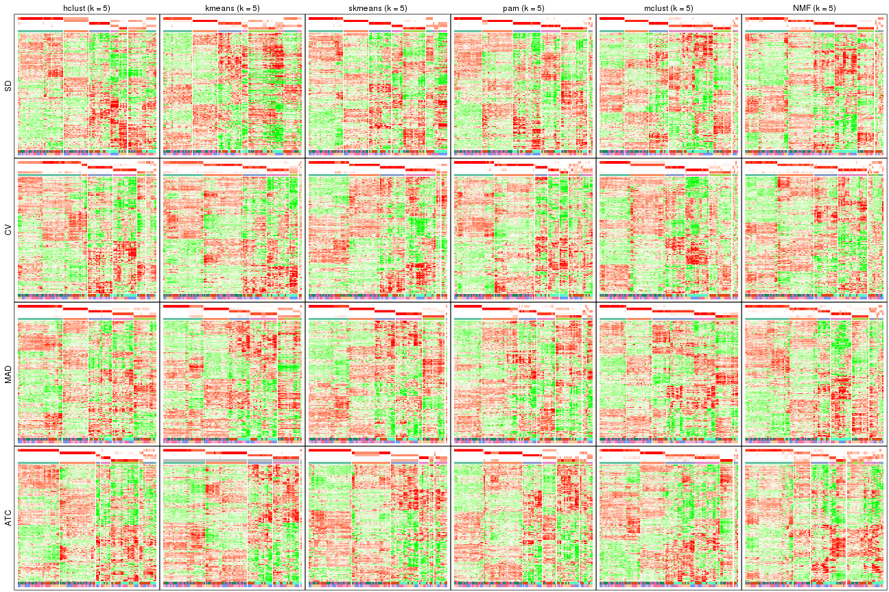</p>

</div>
<div id='tab-collect-get-signatures-5'>
<pre><code class="r">collect_plots(res_list, k = 6, fun = get_signatures, mc.cores = 4)
</code></pre>

<p></p>

</div>
</div>


### Statistics table

The statistics used for measuring the stability of consensus partitioning.
([How are they
defined?](http://bioconductor.org/packages/devel/bioc/vignettes/cola/inst/doc/cola.html#toc_13))


<script>
$( function() {
	$( '#tabs-get-stats-from-consensus-partition-list' ).tabs();
} );
</script>
<div id='tabs-get-stats-from-consensus-partition-list'>
<ul>
<li><a href='#tab-get-stats-from-consensus-partition-list-1'>k = 2</a></li>
<li><a href='#tab-get-stats-from-consensus-partition-list-2'>k = 3</a></li>
<li><a href='#tab-get-stats-from-consensus-partition-list-3'>k = 4</a></li>
<li><a href='#tab-get-stats-from-consensus-partition-list-4'>k = 5</a></li>
<li><a href='#tab-get-stats-from-consensus-partition-list-5'>k = 6</a></li>
</ul>
<div id='tab-get-stats-from-consensus-partition-list-1'>
<pre><code class="r">get_stats(res_list, k = 2)
</code></pre>

<pre><code>#&gt;             k 1-PAC mean_silhouette concordance area_increased  Rand Jaccard
#&gt; SD:NMF      2 0.854           0.909       0.961          0.486 0.525   0.525
#&gt; CV:NMF      2 0.607           0.883       0.937          0.478 0.520   0.520
#&gt; MAD:NMF     2 1.000           0.976       0.990          0.504 0.497   0.497
#&gt; ATC:NMF     2 0.979           0.964       0.984          0.504 0.497   0.497
#&gt; SD:skmeans  2 1.000           0.964       0.970          0.505 0.495   0.495
#&gt; CV:skmeans  2 1.000           0.974       0.989          0.495 0.505   0.505
#&gt; MAD:skmeans 2 1.000           1.000       1.000          0.506 0.495   0.495
#&gt; ATC:skmeans 2 1.000           0.978       0.990          0.505 0.495   0.495
#&gt; SD:mclust   2 0.580           0.937       0.951          0.463 0.512   0.512
#&gt; CV:mclust   2 0.408           0.853       0.900          0.461 0.495   0.495
#&gt; MAD:mclust  2 1.000           0.998       0.997          0.504 0.495   0.495
#&gt; ATC:mclust  2 0.667           0.900       0.943          0.430 0.597   0.597
#&gt; SD:kmeans   2 0.406           0.413       0.788          0.498 0.502   0.502
#&gt; CV:kmeans   2 1.000           0.989       0.996          0.487 0.512   0.512
#&gt; MAD:kmeans  2 1.000           0.990       0.991          0.505 0.495   0.495
#&gt; ATC:kmeans  2 1.000           0.976       0.989          0.502 0.500   0.500
#&gt; SD:pam      2 0.547           0.886       0.930          0.502 0.497   0.497
#&gt; CV:pam      2 0.719           0.910       0.954          0.480 0.508   0.508
#&gt; MAD:pam     2 1.000           0.993       0.997          0.505 0.495   0.495
#&gt; ATC:pam     2 1.000           0.967       0.987          0.502 0.500   0.500
#&gt; SD:hclust   2 0.600           0.825       0.889          0.469 0.512   0.512
#&gt; CV:hclust   2 0.917           0.956       0.978          0.486 0.508   0.508
#&gt; MAD:hclust  2 1.000           0.992       0.997          0.506 0.495   0.495
#&gt; ATC:hclust  2 1.000           0.999       1.000          0.506 0.495   0.495
</code></pre>

</div>
<div id='tab-get-stats-from-consensus-partition-list-2'>
<pre><code class="r">get_stats(res_list, k = 3)
</code></pre>

<pre><code>#&gt;             k 1-PAC mean_silhouette concordance area_increased  Rand Jaccard
#&gt; SD:NMF      3 0.957           0.954       0.981         0.3837 0.650   0.418
#&gt; CV:NMF      3 0.537           0.632       0.786         0.3068 0.854   0.728
#&gt; MAD:NMF     3 0.947           0.948       0.977         0.3269 0.778   0.579
#&gt; ATC:NMF     3 0.914           0.907       0.958         0.3020 0.801   0.617
#&gt; SD:skmeans  3 0.985           0.937       0.976         0.3310 0.713   0.482
#&gt; CV:skmeans  3 0.683           0.846       0.827         0.3055 0.793   0.603
#&gt; MAD:skmeans 3 1.000           0.953       0.981         0.3090 0.787   0.593
#&gt; ATC:skmeans 3 1.000           0.971       0.988         0.2961 0.817   0.643
#&gt; SD:mclust   3 0.901           0.913       0.963         0.2355 0.823   0.688
#&gt; CV:mclust   3 0.907           0.911       0.940         0.3508 0.863   0.730
#&gt; MAD:mclust  3 1.000           0.971       0.989         0.0503 0.559   0.374
#&gt; ATC:mclust  3 0.812           0.900       0.955         0.4178 0.783   0.639
#&gt; SD:kmeans   3 0.672           0.868       0.894         0.3193 0.695   0.463
#&gt; CV:kmeans   3 0.671           0.595       0.747         0.2582 0.972   0.945
#&gt; MAD:kmeans  3 0.692           0.704       0.860         0.2831 0.815   0.641
#&gt; ATC:kmeans  3 0.753           0.789       0.856         0.2738 0.838   0.679
#&gt; SD:pam      3 0.885           0.941       0.970         0.3303 0.743   0.527
#&gt; CV:pam      3 0.823           0.783       0.907         0.3846 0.642   0.403
#&gt; MAD:pam     3 1.000           0.973       0.990         0.2618 0.842   0.689
#&gt; ATC:pam     3 0.921           0.915       0.964         0.2889 0.852   0.704
#&gt; SD:hclust   3 0.514           0.743       0.840         0.3219 0.828   0.665
#&gt; CV:hclust   3 0.747           0.818       0.852         0.1555 0.969   0.939
#&gt; MAD:hclust  3 0.706           0.820       0.853         0.2288 0.879   0.758
#&gt; ATC:hclust  3 0.946           0.933       0.968         0.2132 0.886   0.769
</code></pre>

</div>
<div id='tab-get-stats-from-consensus-partition-list-3'>
<pre><code class="r">get_stats(res_list, k = 4)
</code></pre>

<pre><code>#&gt;             k 1-PAC mean_silhouette concordance area_increased  Rand Jaccard
#&gt; SD:NMF      4 0.969           0.931       0.964         0.0951 0.900   0.711
#&gt; CV:NMF      4 0.837           0.876       0.938         0.1957 0.791   0.521
#&gt; MAD:NMF     4 0.797           0.831       0.867         0.0843 0.913   0.751
#&gt; ATC:NMF     4 0.619           0.532       0.775         0.0834 0.968   0.911
#&gt; SD:skmeans  4 0.900           0.739       0.810         0.1096 0.890   0.681
#&gt; CV:skmeans  4 0.946           0.962       0.978         0.1598 0.901   0.710
#&gt; MAD:skmeans 4 0.953           0.965       0.984         0.1318 0.877   0.657
#&gt; ATC:skmeans 4 1.000           0.979       0.991         0.1386 0.870   0.645
#&gt; SD:mclust   4 0.667           0.761       0.850         0.2141 0.887   0.745
#&gt; CV:mclust   4 0.781           0.923       0.913         0.1870 0.854   0.620
#&gt; MAD:mclust  4 0.901           0.929       0.965         0.3318 0.816   0.615
#&gt; ATC:mclust  4 0.709           0.822       0.888         0.1608 0.904   0.759
#&gt; SD:kmeans   4 0.635           0.633       0.744         0.1148 0.941   0.825
#&gt; CV:kmeans   4 0.675           0.790       0.791         0.1542 0.742   0.481
#&gt; MAD:kmeans  4 0.697           0.771       0.824         0.1379 0.821   0.544
#&gt; ATC:kmeans  4 0.805           0.924       0.916         0.1438 0.865   0.636
#&gt; SD:pam      4 0.685           0.787       0.828         0.1062 0.902   0.713
#&gt; CV:pam      4 0.822           0.812       0.914         0.0849 0.927   0.791
#&gt; MAD:pam     4 0.861           0.839       0.905         0.1709 0.868   0.644
#&gt; ATC:pam     4 0.951           0.935       0.973         0.1425 0.879   0.670
#&gt; SD:hclust   4 0.636           0.723       0.842         0.0735 0.972   0.917
#&gt; CV:hclust   4 0.673           0.833       0.865         0.1383 0.928   0.849
#&gt; MAD:hclust  4 0.846           0.929       0.953         0.1787 0.886   0.702
#&gt; ATC:hclust  4 0.854           0.882       0.939         0.1914 0.875   0.671
</code></pre>

</div>
<div id='tab-get-stats-from-consensus-partition-list-4'>
<pre><code class="r">get_stats(res_list, k = 5)
</code></pre>

<pre><code>#&gt;             k 1-PAC mean_silhouette concordance area_increased  Rand Jaccard
#&gt; SD:NMF      5 0.799           0.809       0.882         0.0669 0.928   0.742
#&gt; CV:NMF      5 0.734           0.735       0.855         0.0540 0.951   0.817
#&gt; MAD:NMF     5 0.756           0.778       0.838         0.0731 0.905   0.683
#&gt; ATC:NMF     5 0.598           0.595       0.748         0.0690 0.848   0.574
#&gt; SD:skmeans  5 0.898           0.811       0.909         0.0671 0.882   0.592
#&gt; CV:skmeans  5 0.897           0.847       0.916         0.0464 0.974   0.898
#&gt; MAD:skmeans 5 0.925           0.949       0.955         0.0597 0.931   0.739
#&gt; ATC:skmeans 5 0.930           0.804       0.909         0.0378 0.991   0.963
#&gt; SD:mclust   5 0.820           0.865       0.916         0.1224 0.854   0.581
#&gt; CV:mclust   5 0.782           0.868       0.863         0.0533 0.922   0.701
#&gt; MAD:mclust  5 0.906           0.930       0.947         0.1218 0.905   0.686
#&gt; ATC:mclust  5 0.776           0.807       0.856         0.1044 0.870   0.606
#&gt; SD:kmeans   5 0.683           0.623       0.758         0.0688 0.855   0.548
#&gt; CV:kmeans   5 0.655           0.812       0.803         0.0800 0.970   0.884
#&gt; MAD:kmeans  5 0.794           0.689       0.816         0.0672 0.954   0.821
#&gt; ATC:kmeans  5 0.857           0.852       0.875         0.0577 1.000   1.000
#&gt; SD:pam      5 0.920           0.902       0.955         0.0872 0.922   0.701
#&gt; CV:pam      5 0.738           0.700       0.869         0.0479 0.962   0.871
#&gt; MAD:pam     5 0.802           0.786       0.873         0.0552 0.919   0.697
#&gt; ATC:pam     5 0.823           0.779       0.854         0.0613 0.926   0.726
#&gt; SD:hclust   5 0.699           0.706       0.805         0.0627 0.939   0.810
#&gt; CV:hclust   5 0.700           0.721       0.838         0.1300 0.918   0.796
#&gt; MAD:hclust  5 0.852           0.931       0.910         0.0624 0.939   0.778
#&gt; ATC:hclust  5 0.857           0.840       0.920         0.0258 0.985   0.942
</code></pre>

</div>
<div id='tab-get-stats-from-consensus-partition-list-5'>
<pre><code class="r">get_stats(res_list, k = 6)
</code></pre>

<pre><code>#&gt;             k 1-PAC mean_silhouette concordance area_increased  Rand Jaccard
#&gt; SD:NMF      6 0.673           0.566       0.766         0.0426 0.963   0.839
#&gt; CV:NMF      6 0.697           0.612       0.766         0.0364 0.975   0.894
#&gt; MAD:NMF     6 0.631           0.530       0.736         0.0508 0.969   0.865
#&gt; ATC:NMF     6 0.576           0.507       0.694         0.0455 0.930   0.723
#&gt; SD:skmeans  6 0.910           0.837       0.906         0.0504 0.922   0.648
#&gt; CV:skmeans  6 0.841           0.822       0.886         0.0406 0.953   0.796
#&gt; MAD:skmeans 6 0.955           0.880       0.932         0.0522 0.932   0.686
#&gt; ATC:skmeans 6 0.906           0.910       0.922         0.0407 0.942   0.768
#&gt; SD:mclust   6 0.892           0.841       0.909         0.0571 0.920   0.666
#&gt; CV:mclust   6 0.830           0.762       0.831         0.0362 0.968   0.852
#&gt; MAD:mclust  6 0.935           0.903       0.949         0.0536 0.955   0.780
#&gt; ATC:mclust  6 0.776           0.721       0.812         0.0468 0.935   0.719
#&gt; SD:kmeans   6 0.805           0.683       0.799         0.0422 0.932   0.697
#&gt; CV:kmeans   6 0.707           0.762       0.793         0.0476 0.990   0.959
#&gt; MAD:kmeans  6 0.826           0.765       0.823         0.0391 0.909   0.614
#&gt; ATC:kmeans  6 0.840           0.747       0.798         0.0384 1.000   1.000
#&gt; SD:pam      6 0.920           0.879       0.947         0.0217 0.944   0.741
#&gt; CV:pam      6 0.869           0.814       0.922         0.0384 0.918   0.705
#&gt; MAD:pam     6 0.876           0.804       0.909         0.0480 0.965   0.834
#&gt; ATC:pam     6 0.922           0.879       0.934         0.0482 0.924   0.671
#&gt; SD:hclust   6 0.706           0.748       0.828         0.0772 0.908   0.680
#&gt; CV:hclust   6 0.712           0.734       0.825         0.0213 0.972   0.915
#&gt; MAD:hclust  6 0.862           0.899       0.908         0.0369 0.976   0.889
#&gt; ATC:hclust  6 0.892           0.806       0.895         0.0342 0.990   0.957
</code></pre>

</div>
</div>

Following heatmap plots the partition for each combination of methods and the
lightness correspond to the silhouette scores for samples in each method. On
top the consensus subgroup is inferred from all methods by taking the mean
silhouette scores as weight.


<script>
$( function() {
	$( '#tabs-collect-stats-from-consensus-partition-list' ).tabs();
} );
</script>
<div id='tabs-collect-stats-from-consensus-partition-list'>
<ul>
<li><a href='#tab-collect-stats-from-consensus-partition-list-1'>k = 2</a></li>
<li><a href='#tab-collect-stats-from-consensus-partition-list-2'>k = 3</a></li>
<li><a href='#tab-collect-stats-from-consensus-partition-list-3'>k = 4</a></li>
<li><a href='#tab-collect-stats-from-consensus-partition-list-4'>k = 5</a></li>
<li><a href='#tab-collect-stats-from-consensus-partition-list-5'>k = 6</a></li>
</ul>
<div id='tab-collect-stats-from-consensus-partition-list-1'>
<pre><code class="r">collect_stats(res_list, k = 2)
</code></pre>

<p></p>

</div>
<div id='tab-collect-stats-from-consensus-partition-list-2'>
<pre><code class="r">collect_stats(res_list, k = 3)
</code></pre>

<p></p>

</div>
<div id='tab-collect-stats-from-consensus-partition-list-3'>
<pre><code class="r">collect_stats(res_list, k = 4)
</code></pre>

<p></p>

</div>
<div id='tab-collect-stats-from-consensus-partition-list-4'>
<pre><code class="r">collect_stats(res_list, k = 5)
</code></pre>

<p></p>

</div>
<div id='tab-collect-stats-from-consensus-partition-list-5'>
<pre><code class="r">collect_stats(res_list, k = 6)
</code></pre>

<p></p>

</div>
</div>

### Partition from all methods


Collect partitions from all methods:


<script>
$( function() {
	$( '#tabs-collect-classes-from-consensus-partition-list' ).tabs();
} );
</script>
<div id='tabs-collect-classes-from-consensus-partition-list'>
<ul>
<li><a href='#tab-collect-classes-from-consensus-partition-list-1'>k = 2</a></li>
<li><a href='#tab-collect-classes-from-consensus-partition-list-2'>k = 3</a></li>
<li><a href='#tab-collect-classes-from-consensus-partition-list-3'>k = 4</a></li>
<li><a href='#tab-collect-classes-from-consensus-partition-list-4'>k = 5</a></li>
<li><a href='#tab-collect-classes-from-consensus-partition-list-5'>k = 6</a></li>
</ul>
<div id='tab-collect-classes-from-consensus-partition-list-1'>
<pre><code class="r">collect_classes(res_list, k = 2)
</code></pre>

<p></p>

</div>
<div id='tab-collect-classes-from-consensus-partition-list-2'>
<pre><code class="r">collect_classes(res_list, k = 3)
</code></pre>

<p></p>

</div>
<div id='tab-collect-classes-from-consensus-partition-list-3'>
<pre><code class="r">collect_classes(res_list, k = 4)
</code></pre>

<p></p>

</div>
<div id='tab-collect-classes-from-consensus-partition-list-4'>
<pre><code class="r">collect_classes(res_list, k = 5)
</code></pre>

<p></p>

</div>
<div id='tab-collect-classes-from-consensus-partition-list-5'>
<pre><code class="r">collect_classes(res_list, k = 6)
</code></pre>

<p></p>

</div>
</div>


### Top rows overlap


Overlap of top rows from different top-row methods:


<script>
$( function() {
	$( '#tabs-top-rows-overlap-by-euler' ).tabs();
} );
</script>
<div id='tabs-top-rows-overlap-by-euler'>
<ul>
<li><a href='#tab-top-rows-overlap-by-euler-1'>top_n = 1000</a></li>
<li><a href='#tab-top-rows-overlap-by-euler-2'>top_n = 2000</a></li>
<li><a href='#tab-top-rows-overlap-by-euler-3'>top_n = 3000</a></li>
<li><a href='#tab-top-rows-overlap-by-euler-4'>top_n = 4000</a></li>
<li><a href='#tab-top-rows-overlap-by-euler-5'>top_n = 5000</a></li>
</ul>
<div id='tab-top-rows-overlap-by-euler-1'>
<pre><code class="r">top_rows_overlap(res_list, top_n = 1000, method = &quot;euler&quot;)
</code></pre>

<p></p>

</div>
<div id='tab-top-rows-overlap-by-euler-2'>
<pre><code class="r">top_rows_overlap(res_list, top_n = 2000, method = &quot;euler&quot;)
</code></pre>

<p></p>

</div>
<div id='tab-top-rows-overlap-by-euler-3'>
<pre><code class="r">top_rows_overlap(res_list, top_n = 3000, method = &quot;euler&quot;)
</code></pre>

<p>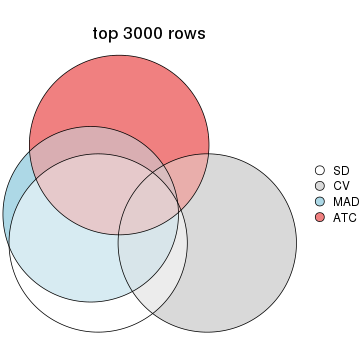</p>

</div>
<div id='tab-top-rows-overlap-by-euler-4'>
<pre><code class="r">top_rows_overlap(res_list, top_n = 4000, method = &quot;euler&quot;)
</code></pre>

<p></p>

</div>
<div id='tab-top-rows-overlap-by-euler-5'>
<pre><code class="r">top_rows_overlap(res_list, top_n = 5000, method = &quot;euler&quot;)
</code></pre>

<p></p>

</div>
</div>

Also visualize the correspondance of rankings between different top-row methods:


<script>
$( function() {
	$( '#tabs-top-rows-overlap-by-correspondance' ).tabs();
} );
</script>
<div id='tabs-top-rows-overlap-by-correspondance'>
<ul>
<li><a href='#tab-top-rows-overlap-by-correspondance-1'>top_n = 1000</a></li>
<li><a href='#tab-top-rows-overlap-by-correspondance-2'>top_n = 2000</a></li>
<li><a href='#tab-top-rows-overlap-by-correspondance-3'>top_n = 3000</a></li>
<li><a href='#tab-top-rows-overlap-by-correspondance-4'>top_n = 4000</a></li>
<li><a href='#tab-top-rows-overlap-by-correspondance-5'>top_n = 5000</a></li>
</ul>
<div id='tab-top-rows-overlap-by-correspondance-1'>
<pre><code class="r">top_rows_overlap(res_list, top_n = 1000, method = &quot;correspondance&quot;)
</code></pre>

<p></p>

</div>
<div id='tab-top-rows-overlap-by-correspondance-2'>
<pre><code class="r">top_rows_overlap(res_list, top_n = 2000, method = &quot;correspondance&quot;)
</code></pre>

<p></p>

</div>
<div id='tab-top-rows-overlap-by-correspondance-3'>
<pre><code class="r">top_rows_overlap(res_list, top_n = 3000, method = &quot;correspondance&quot;)
</code></pre>

<p></p>

</div>
<div id='tab-top-rows-overlap-by-correspondance-4'>
<pre><code class="r">top_rows_overlap(res_list, top_n = 4000, method = &quot;correspondance&quot;)
</code></pre>

<p>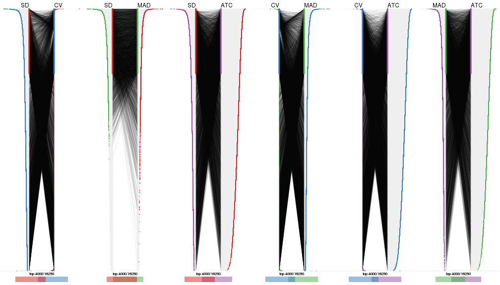</p>

</div>
<div id='tab-top-rows-overlap-by-correspondance-5'>
<pre><code class="r">top_rows_overlap(res_list, top_n = 5000, method = &quot;correspondance&quot;)
</code></pre>

<p></p>

</div>
</div>


Heatmaps of the top rows:


<script>
$( function() {
	$( '#tabs-top-rows-heatmap' ).tabs();
} );
</script>
<div id='tabs-top-rows-heatmap'>
<ul>
<li><a href='#tab-top-rows-heatmap-1'>top_n = 1000</a></li>
<li><a href='#tab-top-rows-heatmap-2'>top_n = 2000</a></li>
<li><a href='#tab-top-rows-heatmap-3'>top_n = 3000</a></li>
<li><a href='#tab-top-rows-heatmap-4'>top_n = 4000</a></li>
<li><a href='#tab-top-rows-heatmap-5'>top_n = 5000</a></li>
</ul>
<div id='tab-top-rows-heatmap-1'>
<pre><code class="r">top_rows_heatmap(res_list, top_n = 1000)
</code></pre>

<p></p>

</div>
<div id='tab-top-rows-heatmap-2'>
<pre><code class="r">top_rows_heatmap(res_list, top_n = 2000)
</code></pre>

<p></p>

</div>
<div id='tab-top-rows-heatmap-3'>
<pre><code class="r">top_rows_heatmap(res_list, top_n = 3000)
</code></pre>

<p></p>

</div>
<div id='tab-top-rows-heatmap-4'>
<pre><code class="r">top_rows_heatmap(res_list, top_n = 4000)
</code></pre>

<p>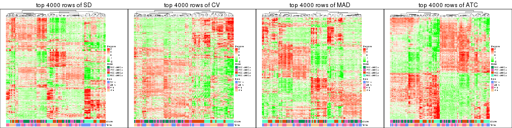</p>

</div>
<div id='tab-top-rows-heatmap-5'>
<pre><code class="r">top_rows_heatmap(res_list, top_n = 5000)
</code></pre>

<p></p>

</div>
</div>


### Test to known annotations


Test correlation between subgroups and known annotations. If the known
annotation is numeric, one-way ANOVA test is applied, and if the known
annotation is discrete, chi-squared contingency table test is applied.


<script>
$( function() {
	$( '#tabs-test-to-known-factors-from-consensus-partition-list' ).tabs();
} );
</script>
<div id='tabs-test-to-known-factors-from-consensus-partition-list'>
<ul>
<li><a href='#tab-test-to-known-factors-from-consensus-partition-list-1'>k = 2</a></li>
<li><a href='#tab-test-to-known-factors-from-consensus-partition-list-2'>k = 3</a></li>
<li><a href='#tab-test-to-known-factors-from-consensus-partition-list-3'>k = 4</a></li>
<li><a href='#tab-test-to-known-factors-from-consensus-partition-list-4'>k = 5</a></li>
<li><a href='#tab-test-to-known-factors-from-consensus-partition-list-5'>k = 6</a></li>
</ul>
<div id='tab-test-to-known-factors-from-consensus-partition-list-1'>
<pre><code class="r">test_to_known_factors(res_list, k = 2)
</code></pre>

<pre><code>#&gt;              n  dose(p) time(p) k
#&gt; SD:NMF      93 1.10e-10   0.826 2
#&gt; CV:NMF      97 3.25e-15   0.254 2
#&gt; MAD:NMF     97 6.52e-01   0.974 2
#&gt; ATC:NMF     98 4.80e-01   0.988 2
#&gt; SD:skmeans  98 1.00e+00   1.000 2
#&gt; CV:skmeans  98 3.00e-16   0.464 2
#&gt; MAD:skmeans 98 1.00e+00   1.000 2
#&gt; ATC:skmeans 98 9.89e-01   0.989 2
#&gt; SD:mclust   98 2.95e-15   0.303 2
#&gt; CV:mclust   98 4.18e-21   0.990 2
#&gt; MAD:mclust  98 1.00e+00   1.000 2
#&gt; ATC:mclust  97 1.02e-03   0.390 2
#&gt; SD:kmeans   51 7.00e-08   0.492 2
#&gt; CV:kmeans   98 1.23e-15   0.167 2
#&gt; MAD:kmeans  98 1.00e+00   1.000 2
#&gt; ATC:kmeans  97 5.96e-01   0.899 2
#&gt; SD:pam      95 7.61e-01   0.935 2
#&gt; CV:pam      95 3.58e-16   0.248 2
#&gt; MAD:pam     98 9.89e-01   0.989 2
#&gt; ATC:pam     95 7.61e-01   0.935 2
#&gt; SD:hclust   98 2.39e-01   0.302 2
#&gt; CV:hclust   98 6.50e-16   0.156 2
#&gt; MAD:hclust  98 1.00e+00   1.000 2
#&gt; ATC:hclust  98 1.00e+00   1.000 2
</code></pre>

</div>
<div id='tab-test-to-known-factors-from-consensus-partition-list-2'>
<pre><code class="r">test_to_known_factors(res_list, k = 3)
</code></pre>

<pre><code>#&gt;              n  dose(p)  time(p) k
#&gt; SD:NMF      97 1.47e-11 3.18e-01 3
#&gt; CV:NMF      89 8.74e-17 1.51e-05 3
#&gt; MAD:NMF     96 7.14e-11 3.77e-01 3
#&gt; ATC:NMF     94 8.47e-10 4.44e-01 3
#&gt; SD:skmeans  93 3.00e-11 2.30e-01 3
#&gt; CV:skmeans  96 1.11e-13 6.38e-01 3
#&gt; MAD:skmeans 95 4.45e-09 4.81e-01 3
#&gt; ATC:skmeans 96 2.70e-08 5.05e-01 3
#&gt; SD:mclust   97 7.93e-12 4.87e-02 3
#&gt; CV:mclust   95 2.54e-18 1.00e+00 3
#&gt; MAD:mclust  98 1.95e-10 2.33e-02 3
#&gt; ATC:mclust  97 1.28e-10 1.14e-01 3
#&gt; SD:kmeans   96 2.11e-10 9.85e-02 3
#&gt; CV:kmeans   73 6.01e-14 1.00e-01 3
#&gt; MAD:kmeans  81 5.94e-08 2.80e-02 3
#&gt; ATC:kmeans  95 1.44e-08 5.71e-01 3
#&gt; SD:pam      98 2.49e-10 2.57e-01 3
#&gt; CV:pam      82 6.67e-13 9.16e-01 3
#&gt; MAD:pam     97 7.77e-07 7.73e-01 3
#&gt; ATC:pam     95 1.66e-07 7.73e-01 3
#&gt; SD:hclust   92 3.20e-08 6.56e-03 3
#&gt; CV:hclust   95 8.79e-14 2.04e-03 3
#&gt; MAD:hclust  91 1.32e-05 2.77e-01 3
#&gt; ATC:hclust  94 4.39e-06 8.38e-01 3
</code></pre>

</div>
<div id='tab-test-to-known-factors-from-consensus-partition-list-3'>
<pre><code class="r">test_to_known_factors(res_list, k = 4)
</code></pre>

<pre><code>#&gt;              n  dose(p)  time(p) k
#&gt; SD:NMF      96 4.30e-15 7.01e-04 4
#&gt; CV:NMF      95 1.31e-14 2.22e-04 4
#&gt; MAD:NMF     94 1.30e-12 6.22e-04 4
#&gt; ATC:NMF     58 3.19e-06 1.11e-01 4
#&gt; SD:skmeans  83 4.27e-11 7.65e-01 4
#&gt; CV:skmeans  98 1.71e-15 1.05e-04 4
#&gt; MAD:skmeans 97 5.84e-12 8.53e-01 4
#&gt; ATC:skmeans 98 2.56e-11 6.85e-01 4
#&gt; SD:mclust   85 1.51e-12 1.27e-03 4
#&gt; CV:mclust   97 5.56e-20 4.34e-03 4
#&gt; MAD:mclust  98 4.66e-11 6.70e-05 4
#&gt; ATC:mclust  94 9.40e-13 1.33e-02 4
#&gt; SD:kmeans   76 1.59e-06 1.26e-02 4
#&gt; CV:kmeans   89 3.37e-13 1.89e-05 4
#&gt; MAD:kmeans  94 4.28e-11 6.68e-01 4
#&gt; ATC:kmeans  98 7.21e-11 6.91e-01 4
#&gt; SD:pam      98 1.01e-09 2.31e-05 4
#&gt; CV:pam      89 1.99e-13 2.02e-04 4
#&gt; MAD:pam     95 6.03e-08 4.44e-05 4
#&gt; ATC:pam     95 1.70e-10 8.35e-01 4
#&gt; SD:hclust   82 2.98e-10 1.96e-05 4
#&gt; CV:hclust   96 7.53e-17 1.58e-06 4
#&gt; MAD:hclust  98 8.37e-08 9.47e-02 4
#&gt; ATC:hclust  91 3.30e-12 8.68e-01 4
</code></pre>

</div>
<div id='tab-test-to-known-factors-from-consensus-partition-list-4'>
<pre><code class="r">test_to_known_factors(res_list, k = 5)
</code></pre>

<pre><code>#&gt;              n  dose(p)  time(p) k
#&gt; SD:NMF      92 7.04e-16 1.61e-06 5
#&gt; CV:NMF      88 2.84e-13 5.84e-04 5
#&gt; MAD:NMF     88 2.00e-12 1.60e-05 5
#&gt; ATC:NMF     72 2.29e-06 9.24e-05 5
#&gt; SD:skmeans  83 8.01e-11 2.19e-07 5
#&gt; CV:skmeans  94 3.12e-17 3.55e-05 5
#&gt; MAD:skmeans 97 7.57e-11 9.09e-05 5
#&gt; ATC:skmeans 89 5.33e-09 4.12e-01 5
#&gt; SD:mclust   94 6.73e-12 3.99e-08 5
#&gt; CV:mclust   94 9.28e-24 1.65e-05 5
#&gt; MAD:mclust  98 3.52e-10 1.85e-05 5
#&gt; ATC:mclust  95 1.32e-11 5.67e-02 5
#&gt; SD:kmeans   60 9.57e-12 1.95e-03 5
#&gt; CV:kmeans   96 2.48e-14 4.08e-08 5
#&gt; MAD:kmeans  81 3.18e-11 1.52e-01 5
#&gt; ATC:kmeans  97 1.79e-11 7.43e-01 5
#&gt; SD:pam      95 2.34e-08 3.46e-09 5
#&gt; CV:pam      81 1.86e-10 1.54e-07 5
#&gt; MAD:pam     91 8.91e-06 5.35e-08 5
#&gt; ATC:pam     89 4.85e-10 5.26e-02 5
#&gt; SD:hclust   78 5.51e-11 4.05e-09 5
#&gt; CV:hclust   91 4.70e-16 1.90e-06 5
#&gt; MAD:hclust  98 3.14e-09 3.05e-05 5
#&gt; ATC:hclust  86 1.47e-10 2.13e-01 5
</code></pre>

</div>
<div id='tab-test-to-known-factors-from-consensus-partition-list-5'>
<pre><code class="r">test_to_known_factors(res_list, k = 6)
</code></pre>

<pre><code>#&gt;              n  dose(p)  time(p) k
#&gt; SD:NMF      74 1.20e-15 1.90e-07 6
#&gt; CV:NMF      78 1.46e-12 2.22e-04 6
#&gt; MAD:NMF     64 2.43e-11 2.00e-06 6
#&gt; ATC:NMF     62 3.10e-07 1.74e-05 6
#&gt; SD:skmeans  94 1.02e-15 5.91e-11 6
#&gt; CV:skmeans  95 3.71e-20 1.18e-04 6
#&gt; MAD:skmeans 96 2.97e-10 1.38e-08 6
#&gt; ATC:skmeans 98 3.11e-11 1.68e-03 6
#&gt; SD:mclust   92 1.71e-13 5.56e-08 6
#&gt; CV:mclust   88 2.09e-23 1.96e-05 6
#&gt; MAD:mclust  95 6.18e-11 6.10e-07 6
#&gt; ATC:mclust  87 7.28e-11 1.11e-03 6
#&gt; SD:kmeans   73 1.15e-13 2.91e-08 6
#&gt; CV:kmeans   96 2.48e-14 4.08e-08 6
#&gt; MAD:kmeans  88 1.56e-11 6.03e-05 6
#&gt; ATC:kmeans  95 1.54e-11 7.89e-01 6
#&gt; SD:pam      95 1.62e-08 1.39e-11 6
#&gt; CV:pam      86 4.23e-14 3.89e-09 6
#&gt; MAD:pam     91 5.86e-11 2.93e-06 6
#&gt; ATC:pam     93 1.39e-07 1.84e-04 6
#&gt; SD:hclust   86 6.60e-12 3.88e-08 6
#&gt; CV:hclust   93 1.06e-15 7.65e-10 6
#&gt; MAD:hclust  98 5.27e-10 2.58e-06 6
#&gt; ATC:hclust  87 8.71e-10 2.01e-01 6
</code></pre>

</div>
</div>


 
## Results for each method


---------------------------------------------------


### SD:hclust


The object with results only for a single top-value method and a single partition method 
can be extracted as:

```r
res = res_list["SD", "hclust"]
# you can also extract it by
# res = res_list["SD:hclust"]
```

A summary of `res` and all the functions that can be applied to it:

```r
res
```

```
#> A 'ConsensusPartition' object with k = 2, 3, 4, 5, 6.
#>   On a matrix with 16250 rows and 98 columns.
#>   Top rows (1000, 2000, 3000, 4000, 5000) are extracted by 'SD' method.
#>   Subgroups are detected by 'hclust' method.
#>   Performed in total 1250 partitions by row resampling.
#>   Best k for subgroups seems to be 2.
#> 
#> Following methods can be applied to this 'ConsensusPartition' object:
#>  [1] "cola_report"             "collect_classes"         "collect_plots"          
#>  [4] "collect_stats"           "colnames"                "compare_signatures"     
#>  [7] "consensus_heatmap"       "dimension_reduction"     "functional_enrichment"  
#> [10] "get_anno_col"            "get_anno"                "get_classes"            
#> [13] "get_consensus"           "get_matrix"              "get_membership"         
#> [16] "get_param"               "get_signatures"          "get_stats"              
#> [19] "is_best_k"               "is_stable_k"             "membership_heatmap"     
#> [22] "ncol"                    "nrow"                    "plot_ecdf"              
#> [25] "rownames"                "select_partition_number" "show"                   
#> [28] "suggest_best_k"          "test_to_known_factors"
```

`collect_plots()` function collects all the plots made from `res` for all `k` (number of partitions)
into one single page to provide an easy and fast comparison between different `k`.

```r
collect_plots(res)
```


The plots are:

- The first row: a plot of the ECDF (Empirical cumulative distribution
  function) curves of the consensus matrix for each `k` and the heatmap of
  predicted classes for each `k`.
- The second row: heatmaps of the consensus matrix for each `k`.
- The third row: heatmaps of the membership matrix for each `k`.
- The fouth row: heatmaps of the signatures for each `k`.

All the plots in panels can be made by individual functions and they are
plotted later in this section.

`select_partition_number()` produces several plots showing different
statistics for choosing "optimized" `k`. There are following statistics:

- ECDF curves of the consensus matrix for each `k`;
- 1-PAC. [The PAC
  score](https://en.wikipedia.org/wiki/Consensus_clustering#Over-interpretation_potential_of_consensus_clustering)
  measures the proportion of the ambiguous subgrouping.
- Mean silhouette score.
- Concordance. The mean probability of fiting the consensus class ids in all
  partitions.
- Area increased. Denote $A_k$ as the area under the ECDF curve for current
  `k`, the area increased is defined as $A_k - A_{k-1}$.
- Rand index. The percent of pairs of samples that are both in a same cluster
  or both are not in a same cluster in the partition of k and k-1.
- Jaccard index. The ratio of pairs of samples are both in a same cluster in
  the partition of k and k-1 and the pairs of samples are both in a same
  cluster in the partition k or k-1.

The detailed explanations of these statistics can be found in [the cola
vignette](http://bioconductor.org/packages/devel/bioc/vignettes/cola/inst/doc/cola.html#toc_13).

Generally speaking, lower PAC score, higher mean silhouette score or higher
concordance corresponds to better partition. Rand index and Jaccard index
measure how similar the current partition is compared to partition with `k-1`.
If they are too similar, we won't accept `k` is better than `k-1`.

```r
select_partition_number(res)
```


The numeric values for all these statistics can be obtained by `get_stats()`.

```r
get_stats(res)
```

```
#>   k 1-PAC mean_silhouette concordance area_increased  Rand Jaccard
#> 2 2 0.600           0.825       0.889         0.4688 0.512   0.512
#> 3 3 0.514           0.743       0.840         0.3219 0.828   0.665
#> 4 4 0.636           0.723       0.842         0.0735 0.972   0.917
#> 5 5 0.699           0.706       0.805         0.0627 0.939   0.810
#> 6 6 0.706           0.748       0.828         0.0772 0.908   0.680
```

`suggest_best_k()` suggests the best $k$ based on these statistics. The rules are as follows:

- All $k$ with Jaccard index larger than 0.95 are removed because the increase of
  the partition number does not provides enough extra information. If all $k$ are removed,
  the best $k$ is assigned by `NA`.
- For $k$ with 1-PAC larger than 0.9, the maximal $k$ is taken as the "best k". Other $k$ is called "optional k".
- If it does not fit the second rule. The $k$ with the highest vote of highest
  1-PAC, mean silhouette and concordance is taken as the "best k".

```r
suggest_best_k(res)
```

```
#> [1] 2
```


Following shows the table of the partitions (You need to click the **show/hide
code output** link to see it). The membership matrix (columns with name `p*`)
is inferred by
[`clue::cl_consensus()`](https://www.rdocumentation.org/link/cl_consensus?package=clue)
function with the `SE` method. Basically the value in the membership matrix
represents the probability to belong to a certain group. The finall class
label for an item is determined with the group with highest probability it
belongs to.

In `get_classes()` function, the entropy is calculated from the membership
matrix and the silhouette score is calculated from the consensus matrix.


<script>
$( function() {
	$( '#tabs-SD-hclust-get-classes' ).tabs();
} );
</script>
<div id='tabs-SD-hclust-get-classes'>
<ul>
<li><a href='#tab-SD-hclust-get-classes-1'>k = 2</a></li>
<li><a href='#tab-SD-hclust-get-classes-2'>k = 3</a></li>
<li><a href='#tab-SD-hclust-get-classes-3'>k = 4</a></li>
<li><a href='#tab-SD-hclust-get-classes-4'>k = 5</a></li>
<li><a href='#tab-SD-hclust-get-classes-5'>k = 6</a></li>
</ul>

<div id='tab-SD-hclust-get-classes-1'>
<p><a id='tab-SD-hclust-get-classes-1-a' style='color:#0366d6' href='#'>show/hide code output</a></p>
<pre><code class="r">cbind(get_classes(res, k = 2), get_membership(res, k = 2))
</code></pre>

<pre><code>#&gt;           class entropy silhouette    p1    p2
#&gt; GSM241451     2  0.9866      0.549 0.432 0.568
#&gt; GSM241452     1  0.0376      0.974 0.996 0.004
#&gt; GSM241453     2  0.9866      0.549 0.432 0.568
#&gt; GSM241454     1  0.0376      0.974 0.996 0.004
#&gt; GSM241455     2  0.9866      0.549 0.432 0.568
#&gt; GSM241456     1  0.0376      0.974 0.996 0.004
#&gt; GSM241457     2  0.0000      0.805 0.000 1.000
#&gt; GSM241458     1  0.0000      0.973 1.000 0.000
#&gt; GSM241459     2  0.0000      0.805 0.000 1.000
#&gt; GSM241460     1  0.0000      0.973 1.000 0.000
#&gt; GSM241461     2  0.0000      0.805 0.000 1.000
#&gt; GSM241462     1  0.0000      0.973 1.000 0.000
#&gt; GSM241463     2  0.9866      0.549 0.432 0.568
#&gt; GSM241464     1  0.0376      0.974 0.996 0.004
#&gt; GSM241465     2  0.9866      0.549 0.432 0.568
#&gt; GSM241466     1  0.0376      0.974 0.996 0.004
#&gt; GSM241467     1  0.0376      0.974 0.996 0.004
#&gt; GSM241468     2  0.9866      0.549 0.432 0.568
#&gt; GSM241469     1  0.0376      0.974 0.996 0.004
#&gt; GSM241470     2  0.9866      0.549 0.432 0.568
#&gt; GSM241471     2  0.9866      0.549 0.432 0.568
#&gt; GSM241472     1  0.0376      0.974 0.996 0.004
#&gt; GSM241473     2  0.9866      0.549 0.432 0.568
#&gt; GSM241474     1  0.0376      0.974 0.996 0.004
#&gt; GSM241475     2  0.9866      0.549 0.432 0.568
#&gt; GSM241476     1  0.0376      0.974 0.996 0.004
#&gt; GSM241477     2  0.9866      0.549 0.432 0.568
#&gt; GSM241478     2  0.9866      0.549 0.432 0.568
#&gt; GSM241479     1  0.0376      0.974 0.996 0.004
#&gt; GSM241480     1  0.0376      0.974 0.996 0.004
#&gt; GSM241481     2  0.0000      0.805 0.000 1.000
#&gt; GSM241482     1  0.0000      0.973 1.000 0.000
#&gt; GSM241483     2  0.0000      0.805 0.000 1.000
#&gt; GSM241484     1  0.0000      0.973 1.000 0.000
#&gt; GSM241485     1  0.0000      0.973 1.000 0.000
#&gt; GSM241486     2  0.0000      0.805 0.000 1.000
#&gt; GSM241487     2  0.9866      0.549 0.432 0.568
#&gt; GSM241488     2  0.9866      0.549 0.432 0.568
#&gt; GSM241489     1  0.0376      0.974 0.996 0.004
#&gt; GSM241490     1  0.0376      0.974 0.996 0.004
#&gt; GSM241491     2  0.9866      0.549 0.432 0.568
#&gt; GSM241492     1  0.0376      0.974 0.996 0.004
#&gt; GSM241493     2  0.9866      0.549 0.432 0.568
#&gt; GSM241494     1  0.0376      0.974 0.996 0.004
#&gt; GSM241495     2  0.9866      0.549 0.432 0.568
#&gt; GSM241496     2  0.9866      0.549 0.432 0.568
#&gt; GSM241497     1  0.0376      0.974 0.996 0.004
#&gt; GSM241498     1  0.0376      0.974 0.996 0.004
#&gt; GSM241499     1  0.0000      0.973 1.000 0.000
#&gt; GSM241500     2  0.0000      0.805 0.000 1.000
#&gt; GSM241501     2  0.0000      0.805 0.000 1.000
#&gt; GSM241502     2  0.0000      0.805 0.000 1.000
#&gt; GSM241503     1  0.0000      0.973 1.000 0.000
#&gt; GSM241504     1  0.0000      0.973 1.000 0.000
#&gt; GSM241505     1  0.0000      0.973 1.000 0.000
#&gt; GSM241506     2  0.0000      0.805 0.000 1.000
#&gt; GSM241507     1  0.0000      0.973 1.000 0.000
#&gt; GSM241508     2  0.0000      0.805 0.000 1.000
#&gt; GSM241509     2  0.0000      0.805 0.000 1.000
#&gt; GSM241510     2  0.0000      0.805 0.000 1.000
#&gt; GSM241511     1  0.0000      0.973 1.000 0.000
#&gt; GSM241512     1  0.2603      0.937 0.956 0.044
#&gt; GSM241513     2  0.4431      0.835 0.092 0.908
#&gt; GSM241514     1  0.6438      0.770 0.836 0.164
#&gt; GSM241515     2  0.4431      0.835 0.092 0.908
#&gt; GSM241516     1  0.6438      0.770 0.836 0.164
#&gt; GSM241517     2  0.4431      0.835 0.092 0.908
#&gt; GSM241518     2  0.4431      0.835 0.092 0.908
#&gt; GSM241519     2  0.4431      0.835 0.092 0.908
#&gt; GSM241520     2  0.4431      0.835 0.092 0.908
#&gt; GSM241521     2  0.4431      0.835 0.092 0.908
#&gt; GSM241522     1  0.6247      0.781 0.844 0.156
#&gt; GSM241523     2  0.4431      0.835 0.092 0.908
#&gt; GSM241524     2  0.4431      0.835 0.092 0.908
#&gt; GSM241525     1  0.3431      0.922 0.936 0.064
#&gt; GSM241526     2  0.4431      0.835 0.092 0.908
#&gt; GSM241527     1  0.3431      0.922 0.936 0.064
#&gt; GSM241528     2  0.4431      0.835 0.092 0.908
#&gt; GSM241529     2  0.4431      0.835 0.092 0.908
#&gt; GSM241530     1  0.3431      0.922 0.936 0.064
#&gt; GSM241531     1  0.0000      0.973 1.000 0.000
#&gt; GSM241532     2  0.0000      0.805 0.000 1.000
#&gt; GSM241533     2  0.0000      0.805 0.000 1.000
#&gt; GSM241534     2  0.0000      0.805 0.000 1.000
#&gt; GSM241535     1  0.2603      0.937 0.956 0.044
#&gt; GSM241536     1  0.0000      0.973 1.000 0.000
#&gt; GSM241537     2  0.4562      0.833 0.096 0.904
#&gt; GSM241538     2  0.4562      0.833 0.096 0.904
#&gt; GSM241539     2  0.4562      0.833 0.096 0.904
#&gt; GSM241540     2  0.4562      0.833 0.096 0.904
#&gt; GSM241541     2  0.4562      0.833 0.096 0.904
#&gt; GSM241542     2  0.4562      0.833 0.096 0.904
#&gt; GSM241543     2  0.4431      0.835 0.092 0.908
#&gt; GSM241544     2  0.4431      0.835 0.092 0.908
#&gt; GSM241545     2  0.4431      0.835 0.092 0.908
#&gt; GSM241546     2  0.4431      0.835 0.092 0.908
#&gt; GSM241547     2  0.4431      0.835 0.092 0.908
#&gt; GSM241548     2  0.4431      0.835 0.092 0.908
</code></pre>

<script>
$('#tab-SD-hclust-get-classes-1-a').parent().next().next().hide();
$('#tab-SD-hclust-get-classes-1-a').click(function(){
  $('#tab-SD-hclust-get-classes-1-a').parent().next().next().toggle();
  return(false);
});
</script>
</div>

<div id='tab-SD-hclust-get-classes-2'>
<p><a id='tab-SD-hclust-get-classes-2-a' style='color:#0366d6' href='#'>show/hide code output</a></p>
<pre><code class="r">cbind(get_classes(res, k = 3), get_membership(res, k = 3))
</code></pre>

<pre><code>#&gt;           class entropy silhouette    p1    p2    p3
#&gt; GSM241451     2  0.7807     0.5735 0.432 0.516 0.052
#&gt; GSM241452     1  0.0237     0.9380 0.996 0.004 0.000
#&gt; GSM241453     2  0.7807     0.5735 0.432 0.516 0.052
#&gt; GSM241454     1  0.0237     0.9380 0.996 0.004 0.000
#&gt; GSM241455     2  0.7807     0.5735 0.432 0.516 0.052
#&gt; GSM241456     1  0.0237     0.9380 0.996 0.004 0.000
#&gt; GSM241457     2  0.0000     0.5236 0.000 1.000 0.000
#&gt; GSM241458     1  0.0000     0.9374 1.000 0.000 0.000
#&gt; GSM241459     2  0.0000     0.5236 0.000 1.000 0.000
#&gt; GSM241460     1  0.0000     0.9374 1.000 0.000 0.000
#&gt; GSM241461     2  0.0000     0.5236 0.000 1.000 0.000
#&gt; GSM241462     1  0.0000     0.9374 1.000 0.000 0.000
#&gt; GSM241463     2  0.7807     0.5735 0.432 0.516 0.052
#&gt; GSM241464     1  0.0237     0.9380 0.996 0.004 0.000
#&gt; GSM241465     2  0.7807     0.5735 0.432 0.516 0.052
#&gt; GSM241466     1  0.0237     0.9380 0.996 0.004 0.000
#&gt; GSM241467     1  0.0237     0.9380 0.996 0.004 0.000
#&gt; GSM241468     2  0.7807     0.5735 0.432 0.516 0.052
#&gt; GSM241469     1  0.0237     0.9380 0.996 0.004 0.000
#&gt; GSM241470     2  0.7807     0.5735 0.432 0.516 0.052
#&gt; GSM241471     2  0.7807     0.5735 0.432 0.516 0.052
#&gt; GSM241472     1  0.0237     0.9380 0.996 0.004 0.000
#&gt; GSM241473     2  0.7807     0.5735 0.432 0.516 0.052
#&gt; GSM241474     1  0.0237     0.9380 0.996 0.004 0.000
#&gt; GSM241475     2  0.7807     0.5735 0.432 0.516 0.052
#&gt; GSM241476     1  0.0237     0.9380 0.996 0.004 0.000
#&gt; GSM241477     2  0.7807     0.5735 0.432 0.516 0.052
#&gt; GSM241478     2  0.7807     0.5735 0.432 0.516 0.052
#&gt; GSM241479     1  0.0237     0.9380 0.996 0.004 0.000
#&gt; GSM241480     1  0.0237     0.9380 0.996 0.004 0.000
#&gt; GSM241481     2  0.0000     0.5236 0.000 1.000 0.000
#&gt; GSM241482     1  0.0000     0.9374 1.000 0.000 0.000
#&gt; GSM241483     2  0.0000     0.5236 0.000 1.000 0.000
#&gt; GSM241484     1  0.0000     0.9374 1.000 0.000 0.000
#&gt; GSM241485     1  0.0000     0.9374 1.000 0.000 0.000
#&gt; GSM241486     2  0.0000     0.5236 0.000 1.000 0.000
#&gt; GSM241487     2  0.7807     0.5735 0.432 0.516 0.052
#&gt; GSM241488     2  0.7807     0.5735 0.432 0.516 0.052
#&gt; GSM241489     1  0.0237     0.9380 0.996 0.004 0.000
#&gt; GSM241490     1  0.0237     0.9380 0.996 0.004 0.000
#&gt; GSM241491     2  0.7807     0.5735 0.432 0.516 0.052
#&gt; GSM241492     1  0.0237     0.9380 0.996 0.004 0.000
#&gt; GSM241493     2  0.7807     0.5735 0.432 0.516 0.052
#&gt; GSM241494     1  0.0237     0.9380 0.996 0.004 0.000
#&gt; GSM241495     2  0.7807     0.5735 0.432 0.516 0.052
#&gt; GSM241496     2  0.7807     0.5735 0.432 0.516 0.052
#&gt; GSM241497     1  0.0237     0.9380 0.996 0.004 0.000
#&gt; GSM241498     1  0.0237     0.9380 0.996 0.004 0.000
#&gt; GSM241499     1  0.0000     0.9374 1.000 0.000 0.000
#&gt; GSM241500     2  0.0000     0.5236 0.000 1.000 0.000
#&gt; GSM241501     2  0.0000     0.5236 0.000 1.000 0.000
#&gt; GSM241502     2  0.0237     0.5204 0.000 0.996 0.004
#&gt; GSM241503     1  0.0000     0.9374 1.000 0.000 0.000
#&gt; GSM241504     1  0.0000     0.9374 1.000 0.000 0.000
#&gt; GSM241505     1  0.0000     0.9374 1.000 0.000 0.000
#&gt; GSM241506     2  0.0237     0.5204 0.000 0.996 0.004
#&gt; GSM241507     1  0.0000     0.9374 1.000 0.000 0.000
#&gt; GSM241508     2  0.2066     0.4791 0.000 0.940 0.060
#&gt; GSM241509     2  0.4931     0.2863 0.000 0.768 0.232
#&gt; GSM241510     2  0.4346     0.3620 0.000 0.816 0.184
#&gt; GSM241511     1  0.1031     0.9214 0.976 0.000 0.024
#&gt; GSM241512     1  0.3851     0.8282 0.860 0.004 0.136
#&gt; GSM241513     3  0.4002     0.8973 0.000 0.160 0.840
#&gt; GSM241514     1  0.4974     0.6777 0.764 0.000 0.236
#&gt; GSM241515     3  0.4002     0.8973 0.000 0.160 0.840
#&gt; GSM241516     1  0.4974     0.6777 0.764 0.000 0.236
#&gt; GSM241517     3  0.4002     0.8973 0.000 0.160 0.840
#&gt; GSM241518     3  0.4002     0.8973 0.000 0.160 0.840
#&gt; GSM241519     3  0.4002     0.8973 0.000 0.160 0.840
#&gt; GSM241520     3  0.4002     0.8973 0.000 0.160 0.840
#&gt; GSM241521     3  0.4002     0.8973 0.000 0.160 0.840
#&gt; GSM241522     1  0.4887     0.6888 0.772 0.000 0.228
#&gt; GSM241523     3  0.4002     0.8973 0.000 0.160 0.840
#&gt; GSM241524     3  0.4002     0.8973 0.000 0.160 0.840
#&gt; GSM241525     1  0.4172     0.8061 0.840 0.004 0.156
#&gt; GSM241526     3  0.5882     0.5368 0.000 0.348 0.652
#&gt; GSM241527     1  0.4172     0.8061 0.840 0.004 0.156
#&gt; GSM241528     3  0.5882     0.5368 0.000 0.348 0.652
#&gt; GSM241529     3  0.5882     0.5368 0.000 0.348 0.652
#&gt; GSM241530     1  0.4172     0.8061 0.840 0.004 0.156
#&gt; GSM241531     1  0.2878     0.8587 0.904 0.000 0.096
#&gt; GSM241532     2  0.5835     0.0536 0.000 0.660 0.340
#&gt; GSM241533     2  0.5835     0.0536 0.000 0.660 0.340
#&gt; GSM241534     2  0.5835     0.0536 0.000 0.660 0.340
#&gt; GSM241535     1  0.3851     0.8282 0.860 0.004 0.136
#&gt; GSM241536     1  0.2878     0.8587 0.904 0.000 0.096
#&gt; GSM241537     3  0.0000     0.8273 0.000 0.000 1.000
#&gt; GSM241538     3  0.0000     0.8273 0.000 0.000 1.000
#&gt; GSM241539     3  0.0000     0.8273 0.000 0.000 1.000
#&gt; GSM241540     3  0.0000     0.8273 0.000 0.000 1.000
#&gt; GSM241541     3  0.0000     0.8273 0.000 0.000 1.000
#&gt; GSM241542     3  0.0000     0.8273 0.000 0.000 1.000
#&gt; GSM241543     3  0.4002     0.8973 0.000 0.160 0.840
#&gt; GSM241544     3  0.4002     0.8973 0.000 0.160 0.840
#&gt; GSM241545     3  0.4002     0.8973 0.000 0.160 0.840
#&gt; GSM241546     3  0.4002     0.8973 0.000 0.160 0.840
#&gt; GSM241547     3  0.4002     0.8973 0.000 0.160 0.840
#&gt; GSM241548     3  0.4002     0.8973 0.000 0.160 0.840
</code></pre>

<script>
$('#tab-SD-hclust-get-classes-2-a').parent().next().next().hide();
$('#tab-SD-hclust-get-classes-2-a').click(function(){
  $('#tab-SD-hclust-get-classes-2-a').parent().next().next().toggle();
  return(false);
});
</script>
</div>

<div id='tab-SD-hclust-get-classes-3'>
<p><a id='tab-SD-hclust-get-classes-3-a' style='color:#0366d6' href='#'>show/hide code output</a></p>
<pre><code class="r">cbind(get_classes(res, k = 4), get_membership(res, k = 4))
</code></pre>

<pre><code>#&gt;           class entropy silhouette    p1    p2    p3    p4
#&gt; GSM241451     2  0.6257     0.5714 0.436 0.508 0.056 0.000
#&gt; GSM241452     1  0.0000     0.9242 1.000 0.000 0.000 0.000
#&gt; GSM241453     2  0.6257     0.5714 0.436 0.508 0.056 0.000
#&gt; GSM241454     1  0.0000     0.9242 1.000 0.000 0.000 0.000
#&gt; GSM241455     2  0.6257     0.5714 0.436 0.508 0.056 0.000
#&gt; GSM241456     1  0.0000     0.9242 1.000 0.000 0.000 0.000
#&gt; GSM241457     2  0.0000     0.4407 0.000 1.000 0.000 0.000
#&gt; GSM241458     1  0.0336     0.9235 0.992 0.000 0.000 0.008
#&gt; GSM241459     2  0.0000     0.4407 0.000 1.000 0.000 0.000
#&gt; GSM241460     1  0.0336     0.9235 0.992 0.000 0.000 0.008
#&gt; GSM241461     2  0.0000     0.4407 0.000 1.000 0.000 0.000
#&gt; GSM241462     1  0.0336     0.9235 0.992 0.000 0.000 0.008
#&gt; GSM241463     2  0.6257     0.5714 0.436 0.508 0.056 0.000
#&gt; GSM241464     1  0.0000     0.9242 1.000 0.000 0.000 0.000
#&gt; GSM241465     2  0.6257     0.5714 0.436 0.508 0.056 0.000
#&gt; GSM241466     1  0.0000     0.9242 1.000 0.000 0.000 0.000
#&gt; GSM241467     1  0.0000     0.9242 1.000 0.000 0.000 0.000
#&gt; GSM241468     2  0.6257     0.5714 0.436 0.508 0.056 0.000
#&gt; GSM241469     1  0.0000     0.9242 1.000 0.000 0.000 0.000
#&gt; GSM241470     2  0.6257     0.5714 0.436 0.508 0.056 0.000
#&gt; GSM241471     2  0.6257     0.5714 0.436 0.508 0.056 0.000
#&gt; GSM241472     1  0.0000     0.9242 1.000 0.000 0.000 0.000
#&gt; GSM241473     2  0.6257     0.5714 0.436 0.508 0.056 0.000
#&gt; GSM241474     1  0.0000     0.9242 1.000 0.000 0.000 0.000
#&gt; GSM241475     2  0.6257     0.5714 0.436 0.508 0.056 0.000
#&gt; GSM241476     1  0.0000     0.9242 1.000 0.000 0.000 0.000
#&gt; GSM241477     2  0.6257     0.5714 0.436 0.508 0.056 0.000
#&gt; GSM241478     2  0.6257     0.5714 0.436 0.508 0.056 0.000
#&gt; GSM241479     1  0.0000     0.9242 1.000 0.000 0.000 0.000
#&gt; GSM241480     1  0.0000     0.9242 1.000 0.000 0.000 0.000
#&gt; GSM241481     2  0.0000     0.4407 0.000 1.000 0.000 0.000
#&gt; GSM241482     1  0.0336     0.9235 0.992 0.000 0.000 0.008
#&gt; GSM241483     2  0.0000     0.4407 0.000 1.000 0.000 0.000
#&gt; GSM241484     1  0.0336     0.9235 0.992 0.000 0.000 0.008
#&gt; GSM241485     1  0.0336     0.9235 0.992 0.000 0.000 0.008
#&gt; GSM241486     2  0.0000     0.4407 0.000 1.000 0.000 0.000
#&gt; GSM241487     2  0.6257     0.5714 0.436 0.508 0.056 0.000
#&gt; GSM241488     2  0.6257     0.5714 0.436 0.508 0.056 0.000
#&gt; GSM241489     1  0.0000     0.9242 1.000 0.000 0.000 0.000
#&gt; GSM241490     1  0.0000     0.9242 1.000 0.000 0.000 0.000
#&gt; GSM241491     2  0.6257     0.5714 0.436 0.508 0.056 0.000
#&gt; GSM241492     1  0.0000     0.9242 1.000 0.000 0.000 0.000
#&gt; GSM241493     2  0.6257     0.5714 0.436 0.508 0.056 0.000
#&gt; GSM241494     1  0.0000     0.9242 1.000 0.000 0.000 0.000
#&gt; GSM241495     2  0.6257     0.5714 0.436 0.508 0.056 0.000
#&gt; GSM241496     2  0.6257     0.5714 0.436 0.508 0.056 0.000
#&gt; GSM241497     1  0.0000     0.9242 1.000 0.000 0.000 0.000
#&gt; GSM241498     1  0.0000     0.9242 1.000 0.000 0.000 0.000
#&gt; GSM241499     1  0.0336     0.9235 0.992 0.000 0.000 0.008
#&gt; GSM241500     2  0.0000     0.4407 0.000 1.000 0.000 0.000
#&gt; GSM241501     2  0.0000     0.4407 0.000 1.000 0.000 0.000
#&gt; GSM241502     2  0.0188     0.4372 0.000 0.996 0.000 0.004
#&gt; GSM241503     1  0.0336     0.9235 0.992 0.000 0.000 0.008
#&gt; GSM241504     1  0.0336     0.9235 0.992 0.000 0.000 0.008
#&gt; GSM241505     1  0.0336     0.9235 0.992 0.000 0.000 0.008
#&gt; GSM241506     2  0.0188     0.4372 0.000 0.996 0.000 0.004
#&gt; GSM241507     1  0.0336     0.9235 0.992 0.000 0.000 0.008
#&gt; GSM241508     2  0.1637     0.3723 0.000 0.940 0.000 0.060
#&gt; GSM241509     2  0.3907     0.0764 0.000 0.768 0.000 0.232
#&gt; GSM241510     2  0.3444     0.1755 0.000 0.816 0.000 0.184
#&gt; GSM241511     1  0.1302     0.9013 0.956 0.000 0.000 0.044
#&gt; GSM241512     1  0.4595     0.7646 0.776 0.000 0.040 0.184
#&gt; GSM241513     3  0.0707     0.9745 0.000 0.000 0.980 0.020
#&gt; GSM241514     1  0.3942     0.6822 0.764 0.000 0.236 0.000
#&gt; GSM241515     3  0.0707     0.9745 0.000 0.000 0.980 0.020
#&gt; GSM241516     1  0.3942     0.6822 0.764 0.000 0.236 0.000
#&gt; GSM241517     3  0.0000     0.9962 0.000 0.000 1.000 0.000
#&gt; GSM241518     3  0.0000     0.9962 0.000 0.000 1.000 0.000
#&gt; GSM241519     3  0.0000     0.9962 0.000 0.000 1.000 0.000
#&gt; GSM241520     3  0.0000     0.9962 0.000 0.000 1.000 0.000
#&gt; GSM241521     3  0.0000     0.9962 0.000 0.000 1.000 0.000
#&gt; GSM241522     1  0.3873     0.6934 0.772 0.000 0.228 0.000
#&gt; GSM241523     3  0.0000     0.9962 0.000 0.000 1.000 0.000
#&gt; GSM241524     3  0.0000     0.9962 0.000 0.000 1.000 0.000
#&gt; GSM241525     1  0.4776     0.7634 0.776 0.000 0.060 0.164
#&gt; GSM241526     4  0.7895     0.5000 0.004 0.316 0.248 0.432
#&gt; GSM241527     1  0.4776     0.7634 0.776 0.000 0.060 0.164
#&gt; GSM241528     4  0.7895     0.5000 0.004 0.316 0.248 0.432
#&gt; GSM241529     4  0.7895     0.5000 0.004 0.316 0.248 0.432
#&gt; GSM241530     1  0.4776     0.7634 0.776 0.000 0.060 0.164
#&gt; GSM241531     1  0.3528     0.7831 0.808 0.000 0.000 0.192
#&gt; GSM241532     2  0.4624    -0.1685 0.000 0.660 0.000 0.340
#&gt; GSM241533     2  0.4624    -0.1685 0.000 0.660 0.000 0.340
#&gt; GSM241534     2  0.4624    -0.1685 0.000 0.660 0.000 0.340
#&gt; GSM241535     1  0.4595     0.7646 0.776 0.000 0.040 0.184
#&gt; GSM241536     1  0.3528     0.7831 0.808 0.000 0.000 0.192
#&gt; GSM241537     4  0.3266     0.7588 0.000 0.000 0.168 0.832
#&gt; GSM241538     4  0.3266     0.7588 0.000 0.000 0.168 0.832
#&gt; GSM241539     4  0.3266     0.7588 0.000 0.000 0.168 0.832
#&gt; GSM241540     4  0.3266     0.7588 0.000 0.000 0.168 0.832
#&gt; GSM241541     4  0.3266     0.7588 0.000 0.000 0.168 0.832
#&gt; GSM241542     4  0.3266     0.7588 0.000 0.000 0.168 0.832
#&gt; GSM241543     3  0.0000     0.9962 0.000 0.000 1.000 0.000
#&gt; GSM241544     3  0.0000     0.9962 0.000 0.000 1.000 0.000
#&gt; GSM241545     3  0.0000     0.9962 0.000 0.000 1.000 0.000
#&gt; GSM241546     3  0.0000     0.9962 0.000 0.000 1.000 0.000
#&gt; GSM241547     3  0.0000     0.9962 0.000 0.000 1.000 0.000
#&gt; GSM241548     3  0.0000     0.9962 0.000 0.000 1.000 0.000
</code></pre>

<script>
$('#tab-SD-hclust-get-classes-3-a').parent().next().next().hide();
$('#tab-SD-hclust-get-classes-3-a').click(function(){
  $('#tab-SD-hclust-get-classes-3-a').parent().next().next().toggle();
  return(false);
});
</script>
</div>

<div id='tab-SD-hclust-get-classes-4'>
<p><a id='tab-SD-hclust-get-classes-4-a' style='color:#0366d6' href='#'>show/hide code output</a></p>
<pre><code class="r">cbind(get_classes(res, k = 5), get_membership(res, k = 5))
</code></pre>

<pre><code>#&gt;           class entropy silhouette    p1    p2    p3    p4    p5
#&gt; GSM241451     2  0.4256      0.792 0.436 0.564 0.000 0.000 0.000
#&gt; GSM241452     1  0.0000      0.843 1.000 0.000 0.000 0.000 0.000
#&gt; GSM241453     2  0.4256      0.792 0.436 0.564 0.000 0.000 0.000
#&gt; GSM241454     1  0.0000      0.843 1.000 0.000 0.000 0.000 0.000
#&gt; GSM241455     2  0.4256      0.792 0.436 0.564 0.000 0.000 0.000
#&gt; GSM241456     1  0.0000      0.843 1.000 0.000 0.000 0.000 0.000
#&gt; GSM241457     2  0.4306     -0.294 0.000 0.508 0.000 0.000 0.492
#&gt; GSM241458     1  0.0324      0.842 0.992 0.004 0.000 0.004 0.000
#&gt; GSM241459     2  0.4306     -0.294 0.000 0.508 0.000 0.000 0.492
#&gt; GSM241460     1  0.0324      0.842 0.992 0.004 0.000 0.004 0.000
#&gt; GSM241461     2  0.4306     -0.294 0.000 0.508 0.000 0.000 0.492
#&gt; GSM241462     1  0.0324      0.842 0.992 0.004 0.000 0.004 0.000
#&gt; GSM241463     2  0.4256      0.792 0.436 0.564 0.000 0.000 0.000
#&gt; GSM241464     1  0.0000      0.843 1.000 0.000 0.000 0.000 0.000
#&gt; GSM241465     2  0.4256      0.792 0.436 0.564 0.000 0.000 0.000
#&gt; GSM241466     1  0.0000      0.843 1.000 0.000 0.000 0.000 0.000
#&gt; GSM241467     1  0.0000      0.843 1.000 0.000 0.000 0.000 0.000
#&gt; GSM241468     2  0.4256      0.792 0.436 0.564 0.000 0.000 0.000
#&gt; GSM241469     1  0.0000      0.843 1.000 0.000 0.000 0.000 0.000
#&gt; GSM241470     2  0.4256      0.792 0.436 0.564 0.000 0.000 0.000
#&gt; GSM241471     2  0.4256      0.792 0.436 0.564 0.000 0.000 0.000
#&gt; GSM241472     1  0.0000      0.843 1.000 0.000 0.000 0.000 0.000
#&gt; GSM241473     2  0.4256      0.792 0.436 0.564 0.000 0.000 0.000
#&gt; GSM241474     1  0.0000      0.843 1.000 0.000 0.000 0.000 0.000
#&gt; GSM241475     2  0.4256      0.792 0.436 0.564 0.000 0.000 0.000
#&gt; GSM241476     1  0.0000      0.843 1.000 0.000 0.000 0.000 0.000
#&gt; GSM241477     2  0.4256      0.792 0.436 0.564 0.000 0.000 0.000
#&gt; GSM241478     2  0.4256      0.792 0.436 0.564 0.000 0.000 0.000
#&gt; GSM241479     1  0.0000      0.843 1.000 0.000 0.000 0.000 0.000
#&gt; GSM241480     1  0.0000      0.843 1.000 0.000 0.000 0.000 0.000
#&gt; GSM241481     2  0.4306     -0.294 0.000 0.508 0.000 0.000 0.492
#&gt; GSM241482     1  0.0324      0.842 0.992 0.004 0.000 0.004 0.000
#&gt; GSM241483     2  0.4306     -0.294 0.000 0.508 0.000 0.000 0.492
#&gt; GSM241484     1  0.0324      0.842 0.992 0.004 0.000 0.004 0.000
#&gt; GSM241485     1  0.0324      0.842 0.992 0.004 0.000 0.004 0.000
#&gt; GSM241486     2  0.4306     -0.294 0.000 0.508 0.000 0.000 0.492
#&gt; GSM241487     2  0.4256      0.792 0.436 0.564 0.000 0.000 0.000
#&gt; GSM241488     2  0.4256      0.792 0.436 0.564 0.000 0.000 0.000
#&gt; GSM241489     1  0.0000      0.843 1.000 0.000 0.000 0.000 0.000
#&gt; GSM241490     1  0.0000      0.843 1.000 0.000 0.000 0.000 0.000
#&gt; GSM241491     2  0.4256      0.792 0.436 0.564 0.000 0.000 0.000
#&gt; GSM241492     1  0.0000      0.843 1.000 0.000 0.000 0.000 0.000
#&gt; GSM241493     2  0.4256      0.792 0.436 0.564 0.000 0.000 0.000
#&gt; GSM241494     1  0.0000      0.843 1.000 0.000 0.000 0.000 0.000
#&gt; GSM241495     2  0.4256      0.792 0.436 0.564 0.000 0.000 0.000
#&gt; GSM241496     2  0.4256      0.792 0.436 0.564 0.000 0.000 0.000
#&gt; GSM241497     1  0.0000      0.843 1.000 0.000 0.000 0.000 0.000
#&gt; GSM241498     1  0.0000      0.843 1.000 0.000 0.000 0.000 0.000
#&gt; GSM241499     1  0.0324      0.842 0.992 0.004 0.000 0.004 0.000
#&gt; GSM241500     5  0.4262      0.373 0.000 0.440 0.000 0.000 0.560
#&gt; GSM241501     5  0.4287      0.337 0.000 0.460 0.000 0.000 0.540
#&gt; GSM241502     5  0.4283      0.346 0.000 0.456 0.000 0.000 0.544
#&gt; GSM241503     1  0.0324      0.842 0.992 0.004 0.000 0.004 0.000
#&gt; GSM241504     1  0.0324      0.842 0.992 0.004 0.000 0.004 0.000
#&gt; GSM241505     1  0.0324      0.842 0.992 0.004 0.000 0.004 0.000
#&gt; GSM241506     5  0.4283      0.346 0.000 0.456 0.000 0.000 0.544
#&gt; GSM241507     1  0.2389      0.764 0.880 0.004 0.000 0.116 0.000
#&gt; GSM241508     5  0.3684      0.564 0.000 0.280 0.000 0.000 0.720
#&gt; GSM241509     5  0.2127      0.632 0.000 0.108 0.000 0.000 0.892
#&gt; GSM241510     5  0.2690      0.639 0.000 0.156 0.000 0.000 0.844
#&gt; GSM241511     1  0.3086      0.716 0.816 0.004 0.000 0.180 0.000
#&gt; GSM241512     1  0.5365      0.435 0.528 0.056 0.000 0.416 0.000
#&gt; GSM241513     3  0.1877      0.918 0.000 0.064 0.924 0.012 0.000
#&gt; GSM241514     1  0.3395      0.635 0.764 0.000 0.236 0.000 0.000
#&gt; GSM241515     3  0.1877      0.918 0.000 0.064 0.924 0.012 0.000
#&gt; GSM241516     1  0.3395      0.635 0.764 0.000 0.236 0.000 0.000
#&gt; GSM241517     3  0.0000      0.984 0.000 0.000 1.000 0.000 0.000
#&gt; GSM241518     3  0.0000      0.984 0.000 0.000 1.000 0.000 0.000
#&gt; GSM241519     3  0.0000      0.984 0.000 0.000 1.000 0.000 0.000
#&gt; GSM241520     3  0.0000      0.984 0.000 0.000 1.000 0.000 0.000
#&gt; GSM241521     3  0.0609      0.970 0.000 0.020 0.980 0.000 0.000
#&gt; GSM241522     1  0.3336      0.644 0.772 0.000 0.228 0.000 0.000
#&gt; GSM241523     3  0.0609      0.970 0.000 0.020 0.980 0.000 0.000
#&gt; GSM241524     3  0.0000      0.984 0.000 0.000 1.000 0.000 0.000
#&gt; GSM241525     1  0.5088      0.432 0.528 0.036 0.000 0.436 0.000
#&gt; GSM241526     5  0.6304      0.359 0.004 0.064 0.168 0.108 0.656
#&gt; GSM241527     1  0.5088      0.432 0.528 0.036 0.000 0.436 0.000
#&gt; GSM241528     5  0.6304      0.359 0.004 0.064 0.168 0.108 0.656
#&gt; GSM241529     5  0.6304      0.359 0.004 0.064 0.168 0.108 0.656
#&gt; GSM241530     1  0.5088      0.432 0.528 0.036 0.000 0.436 0.000
#&gt; GSM241531     1  0.4841      0.460 0.560 0.024 0.000 0.416 0.000
#&gt; GSM241532     5  0.0000      0.588 0.000 0.000 0.000 0.000 1.000
#&gt; GSM241533     5  0.0000      0.588 0.000 0.000 0.000 0.000 1.000
#&gt; GSM241534     5  0.0000      0.588 0.000 0.000 0.000 0.000 1.000
#&gt; GSM241535     1  0.5365      0.435 0.528 0.056 0.000 0.416 0.000
#&gt; GSM241536     1  0.4841      0.460 0.560 0.024 0.000 0.416 0.000
#&gt; GSM241537     4  0.4359      1.000 0.000 0.412 0.000 0.584 0.004
#&gt; GSM241538     4  0.4359      1.000 0.000 0.412 0.000 0.584 0.004
#&gt; GSM241539     4  0.4359      1.000 0.000 0.412 0.000 0.584 0.004
#&gt; GSM241540     4  0.4359      1.000 0.000 0.412 0.000 0.584 0.004
#&gt; GSM241541     4  0.4359      1.000 0.000 0.412 0.000 0.584 0.004
#&gt; GSM241542     4  0.4359      1.000 0.000 0.412 0.000 0.584 0.004
#&gt; GSM241543     3  0.0000      0.984 0.000 0.000 1.000 0.000 0.000
#&gt; GSM241544     3  0.0000      0.984 0.000 0.000 1.000 0.000 0.000
#&gt; GSM241545     3  0.0000      0.984 0.000 0.000 1.000 0.000 0.000
#&gt; GSM241546     3  0.0000      0.984 0.000 0.000 1.000 0.000 0.000
#&gt; GSM241547     3  0.0000      0.984 0.000 0.000 1.000 0.000 0.000
#&gt; GSM241548     3  0.0000      0.984 0.000 0.000 1.000 0.000 0.000
</code></pre>

<script>
$('#tab-SD-hclust-get-classes-4-a').parent().next().next().hide();
$('#tab-SD-hclust-get-classes-4-a').click(function(){
  $('#tab-SD-hclust-get-classes-4-a').parent().next().next().toggle();
  return(false);
});
</script>
</div>

<div id='tab-SD-hclust-get-classes-5'>
<p><a id='tab-SD-hclust-get-classes-5-a' style='color:#0366d6' href='#'>show/hide code output</a></p>
<pre><code class="r">cbind(get_classes(res, k = 6), get_membership(res, k = 6))
</code></pre>

<pre><code>#&gt;           class entropy silhouette    p1    p2    p3    p4    p5    p6
#&gt; GSM241451     2  0.3634     0.7228 0.356 0.644 0.000 0.000 0.000 0.000
#&gt; GSM241452     1  0.0000     0.9087 1.000 0.000 0.000 0.000 0.000 0.000
#&gt; GSM241453     2  0.3634     0.7228 0.356 0.644 0.000 0.000 0.000 0.000
#&gt; GSM241454     1  0.0000     0.9087 1.000 0.000 0.000 0.000 0.000 0.000
#&gt; GSM241455     2  0.3634     0.7228 0.356 0.644 0.000 0.000 0.000 0.000
#&gt; GSM241456     1  0.0000     0.9087 1.000 0.000 0.000 0.000 0.000 0.000
#&gt; GSM241457     2  0.2219     0.2747 0.000 0.864 0.000 0.000 0.136 0.000
#&gt; GSM241458     1  0.2219     0.8626 0.864 0.000 0.000 0.000 0.136 0.000
#&gt; GSM241459     2  0.2219     0.2747 0.000 0.864 0.000 0.000 0.136 0.000
#&gt; GSM241460     1  0.2219     0.8626 0.864 0.000 0.000 0.000 0.136 0.000
#&gt; GSM241461     2  0.2219     0.2747 0.000 0.864 0.000 0.000 0.136 0.000
#&gt; GSM241462     1  0.2219     0.8626 0.864 0.000 0.000 0.000 0.136 0.000
#&gt; GSM241463     2  0.3634     0.7228 0.356 0.644 0.000 0.000 0.000 0.000
#&gt; GSM241464     1  0.0146     0.9053 0.996 0.004 0.000 0.000 0.000 0.000
#&gt; GSM241465     2  0.3634     0.7228 0.356 0.644 0.000 0.000 0.000 0.000
#&gt; GSM241466     1  0.0000     0.9087 1.000 0.000 0.000 0.000 0.000 0.000
#&gt; GSM241467     1  0.0000     0.9087 1.000 0.000 0.000 0.000 0.000 0.000
#&gt; GSM241468     2  0.3634     0.7228 0.356 0.644 0.000 0.000 0.000 0.000
#&gt; GSM241469     1  0.0000     0.9087 1.000 0.000 0.000 0.000 0.000 0.000
#&gt; GSM241470     2  0.3634     0.7228 0.356 0.644 0.000 0.000 0.000 0.000
#&gt; GSM241471     2  0.3634     0.7228 0.356 0.644 0.000 0.000 0.000 0.000
#&gt; GSM241472     1  0.0000     0.9087 1.000 0.000 0.000 0.000 0.000 0.000
#&gt; GSM241473     2  0.3634     0.7228 0.356 0.644 0.000 0.000 0.000 0.000
#&gt; GSM241474     1  0.0000     0.9087 1.000 0.000 0.000 0.000 0.000 0.000
#&gt; GSM241475     2  0.3634     0.7228 0.356 0.644 0.000 0.000 0.000 0.000
#&gt; GSM241476     1  0.0000     0.9087 1.000 0.000 0.000 0.000 0.000 0.000
#&gt; GSM241477     2  0.3634     0.7228 0.356 0.644 0.000 0.000 0.000 0.000
#&gt; GSM241478     2  0.3634     0.7228 0.356 0.644 0.000 0.000 0.000 0.000
#&gt; GSM241479     1  0.0000     0.9087 1.000 0.000 0.000 0.000 0.000 0.000
#&gt; GSM241480     1  0.0000     0.9087 1.000 0.000 0.000 0.000 0.000 0.000
#&gt; GSM241481     2  0.2219     0.2747 0.000 0.864 0.000 0.000 0.136 0.000
#&gt; GSM241482     1  0.2219     0.8626 0.864 0.000 0.000 0.000 0.136 0.000
#&gt; GSM241483     2  0.2219     0.2747 0.000 0.864 0.000 0.000 0.136 0.000
#&gt; GSM241484     1  0.2219     0.8626 0.864 0.000 0.000 0.000 0.136 0.000
#&gt; GSM241485     1  0.2219     0.8626 0.864 0.000 0.000 0.000 0.136 0.000
#&gt; GSM241486     2  0.2219     0.2747 0.000 0.864 0.000 0.000 0.136 0.000
#&gt; GSM241487     2  0.3634     0.7228 0.356 0.644 0.000 0.000 0.000 0.000
#&gt; GSM241488     2  0.3634     0.7228 0.356 0.644 0.000 0.000 0.000 0.000
#&gt; GSM241489     1  0.0000     0.9087 1.000 0.000 0.000 0.000 0.000 0.000
#&gt; GSM241490     1  0.0000     0.9087 1.000 0.000 0.000 0.000 0.000 0.000
#&gt; GSM241491     2  0.3634     0.7228 0.356 0.644 0.000 0.000 0.000 0.000
#&gt; GSM241492     1  0.0146     0.9053 0.996 0.004 0.000 0.000 0.000 0.000
#&gt; GSM241493     2  0.3634     0.7228 0.356 0.644 0.000 0.000 0.000 0.000
#&gt; GSM241494     1  0.0000     0.9087 1.000 0.000 0.000 0.000 0.000 0.000
#&gt; GSM241495     2  0.3634     0.7228 0.356 0.644 0.000 0.000 0.000 0.000
#&gt; GSM241496     2  0.3634     0.7228 0.356 0.644 0.000 0.000 0.000 0.000
#&gt; GSM241497     1  0.0000     0.9087 1.000 0.000 0.000 0.000 0.000 0.000
#&gt; GSM241498     1  0.0000     0.9087 1.000 0.000 0.000 0.000 0.000 0.000
#&gt; GSM241499     1  0.2219     0.8626 0.864 0.000 0.000 0.000 0.136 0.000
#&gt; GSM241500     2  0.2823     0.1280 0.000 0.796 0.000 0.000 0.204 0.000
#&gt; GSM241501     2  0.2664     0.1810 0.000 0.816 0.000 0.000 0.184 0.000
#&gt; GSM241502     2  0.2697     0.1720 0.000 0.812 0.000 0.000 0.188 0.000
#&gt; GSM241503     1  0.2219     0.8626 0.864 0.000 0.000 0.000 0.136 0.000
#&gt; GSM241504     1  0.2219     0.8626 0.864 0.000 0.000 0.000 0.136 0.000
#&gt; GSM241505     1  0.2219     0.8626 0.864 0.000 0.000 0.000 0.136 0.000
#&gt; GSM241506     2  0.2697     0.1720 0.000 0.812 0.000 0.000 0.188 0.000
#&gt; GSM241507     6  0.5561     0.0811 0.428 0.000 0.000 0.000 0.136 0.436
#&gt; GSM241508     2  0.3684    -0.3833 0.000 0.628 0.000 0.000 0.372 0.000
#&gt; GSM241509     5  0.3843     0.6787 0.000 0.452 0.000 0.000 0.548 0.000
#&gt; GSM241510     5  0.3869     0.6023 0.000 0.500 0.000 0.000 0.500 0.000
#&gt; GSM241511     6  0.4934     0.5043 0.256 0.000 0.000 0.000 0.112 0.632
#&gt; GSM241512     6  0.0260     0.7787 0.000 0.008 0.000 0.000 0.000 0.992
#&gt; GSM241513     3  0.1901     0.8984 0.000 0.028 0.924 0.008 0.000 0.040
#&gt; GSM241514     1  0.3050     0.6751 0.764 0.000 0.236 0.000 0.000 0.000
#&gt; GSM241515     3  0.1901     0.8984 0.000 0.028 0.924 0.008 0.000 0.040
#&gt; GSM241516     1  0.3050     0.6751 0.764 0.000 0.236 0.000 0.000 0.000
#&gt; GSM241517     3  0.0000     0.9431 0.000 0.000 1.000 0.000 0.000 0.000
#&gt; GSM241518     3  0.1814     0.9297 0.000 0.000 0.900 0.000 0.100 0.000
#&gt; GSM241519     3  0.0000     0.9431 0.000 0.000 1.000 0.000 0.000 0.000
#&gt; GSM241520     3  0.1814     0.9297 0.000 0.000 0.900 0.000 0.100 0.000
#&gt; GSM241521     3  0.0547     0.9344 0.000 0.020 0.980 0.000 0.000 0.000
#&gt; GSM241522     1  0.2996     0.6848 0.772 0.000 0.228 0.000 0.000 0.000
#&gt; GSM241523     3  0.0547     0.9344 0.000 0.020 0.980 0.000 0.000 0.000
#&gt; GSM241524     3  0.1814     0.9297 0.000 0.000 0.900 0.000 0.100 0.000
#&gt; GSM241525     6  0.1918     0.7737 0.000 0.008 0.000 0.000 0.088 0.904
#&gt; GSM241526     5  0.5998     0.6124 0.000 0.152 0.168 0.008 0.620 0.052
#&gt; GSM241527     6  0.1918     0.7737 0.000 0.008 0.000 0.000 0.088 0.904
#&gt; GSM241528     5  0.5998     0.6124 0.000 0.152 0.168 0.008 0.620 0.052
#&gt; GSM241529     5  0.5998     0.6124 0.000 0.152 0.168 0.008 0.620 0.052
#&gt; GSM241530     6  0.1918     0.7737 0.000 0.008 0.000 0.000 0.088 0.904
#&gt; GSM241531     6  0.1257     0.7711 0.028 0.000 0.000 0.000 0.020 0.952
#&gt; GSM241532     5  0.3563     0.7551 0.000 0.336 0.000 0.000 0.664 0.000
#&gt; GSM241533     5  0.3563     0.7551 0.000 0.336 0.000 0.000 0.664 0.000
#&gt; GSM241534     5  0.3563     0.7551 0.000 0.336 0.000 0.000 0.664 0.000
#&gt; GSM241535     6  0.0260     0.7787 0.000 0.008 0.000 0.000 0.000 0.992
#&gt; GSM241536     6  0.1257     0.7711 0.028 0.000 0.000 0.000 0.020 0.952
#&gt; GSM241537     4  0.0000     1.0000 0.000 0.000 0.000 1.000 0.000 0.000
#&gt; GSM241538     4  0.0000     1.0000 0.000 0.000 0.000 1.000 0.000 0.000
#&gt; GSM241539     4  0.0000     1.0000 0.000 0.000 0.000 1.000 0.000 0.000
#&gt; GSM241540     4  0.0000     1.0000 0.000 0.000 0.000 1.000 0.000 0.000
#&gt; GSM241541     4  0.0000     1.0000 0.000 0.000 0.000 1.000 0.000 0.000
#&gt; GSM241542     4  0.0000     1.0000 0.000 0.000 0.000 1.000 0.000 0.000
#&gt; GSM241543     3  0.0000     0.9431 0.000 0.000 1.000 0.000 0.000 0.000
#&gt; GSM241544     3  0.1814     0.9297 0.000 0.000 0.900 0.000 0.100 0.000
#&gt; GSM241545     3  0.0000     0.9431 0.000 0.000 1.000 0.000 0.000 0.000
#&gt; GSM241546     3  0.1814     0.9297 0.000 0.000 0.900 0.000 0.100 0.000
#&gt; GSM241547     3  0.0000     0.9431 0.000 0.000 1.000 0.000 0.000 0.000
#&gt; GSM241548     3  0.1814     0.9297 0.000 0.000 0.900 0.000 0.100 0.000
</code></pre>

<script>
$('#tab-SD-hclust-get-classes-5-a').parent().next().next().hide();
$('#tab-SD-hclust-get-classes-5-a').click(function(){
  $('#tab-SD-hclust-get-classes-5-a').parent().next().next().toggle();
  return(false);
});
</script>
</div>
</div>

Heatmaps for the consensus matrix. It visualizes the probability of two
samples to be in a same group.


<script>
$( function() {
	$( '#tabs-SD-hclust-consensus-heatmap' ).tabs();
} );
</script>
<div id='tabs-SD-hclust-consensus-heatmap'>
<ul>
<li><a href='#tab-SD-hclust-consensus-heatmap-1'>k = 2</a></li>
<li><a href='#tab-SD-hclust-consensus-heatmap-2'>k = 3</a></li>
<li><a href='#tab-SD-hclust-consensus-heatmap-3'>k = 4</a></li>
<li><a href='#tab-SD-hclust-consensus-heatmap-4'>k = 5</a></li>
<li><a href='#tab-SD-hclust-consensus-heatmap-5'>k = 6</a></li>
</ul>
<div id='tab-SD-hclust-consensus-heatmap-1'>
<pre><code class="r">consensus_heatmap(res, k = 2)
</code></pre>

<p></p>

</div>
<div id='tab-SD-hclust-consensus-heatmap-2'>
<pre><code class="r">consensus_heatmap(res, k = 3)
</code></pre>

<p></p>

</div>
<div id='tab-SD-hclust-consensus-heatmap-3'>
<pre><code class="r">consensus_heatmap(res, k = 4)
</code></pre>

<p></p>

</div>
<div id='tab-SD-hclust-consensus-heatmap-4'>
<pre><code class="r">consensus_heatmap(res, k = 5)
</code></pre>

<p></p>

</div>
<div id='tab-SD-hclust-consensus-heatmap-5'>
<pre><code class="r">consensus_heatmap(res, k = 6)
</code></pre>

<p></p>

</div>
</div>

Heatmaps for the membership of samples in all partitions to see how consistent they are:


<script>
$( function() {
	$( '#tabs-SD-hclust-membership-heatmap' ).tabs();
} );
</script>
<div id='tabs-SD-hclust-membership-heatmap'>
<ul>
<li><a href='#tab-SD-hclust-membership-heatmap-1'>k = 2</a></li>
<li><a href='#tab-SD-hclust-membership-heatmap-2'>k = 3</a></li>
<li><a href='#tab-SD-hclust-membership-heatmap-3'>k = 4</a></li>
<li><a href='#tab-SD-hclust-membership-heatmap-4'>k = 5</a></li>
<li><a href='#tab-SD-hclust-membership-heatmap-5'>k = 6</a></li>
</ul>
<div id='tab-SD-hclust-membership-heatmap-1'>
<pre><code class="r">membership_heatmap(res, k = 2)
</code></pre>

<p></p>

</div>
<div id='tab-SD-hclust-membership-heatmap-2'>
<pre><code class="r">membership_heatmap(res, k = 3)
</code></pre>

<p></p>

</div>
<div id='tab-SD-hclust-membership-heatmap-3'>
<pre><code class="r">membership_heatmap(res, k = 4)
</code></pre>

<p></p>

</div>
<div id='tab-SD-hclust-membership-heatmap-4'>
<pre><code class="r">membership_heatmap(res, k = 5)
</code></pre>

<p></p>

</div>
<div id='tab-SD-hclust-membership-heatmap-5'>
<pre><code class="r">membership_heatmap(res, k = 6)
</code></pre>

<p></p>

</div>
</div>

As soon as we have had the classes for columns, we can look for signatures
which are significantly different between classes which can be candidate marks
for certain classes. Following are the heatmaps for signatures.


Signature heatmaps where rows are scaled:


<script>
$( function() {
	$( '#tabs-SD-hclust-get-signatures' ).tabs();
} );
</script>
<div id='tabs-SD-hclust-get-signatures'>
<ul>
<li><a href='#tab-SD-hclust-get-signatures-1'>k = 2</a></li>
<li><a href='#tab-SD-hclust-get-signatures-2'>k = 3</a></li>
<li><a href='#tab-SD-hclust-get-signatures-3'>k = 4</a></li>
<li><a href='#tab-SD-hclust-get-signatures-4'>k = 5</a></li>
<li><a href='#tab-SD-hclust-get-signatures-5'>k = 6</a></li>
</ul>
<div id='tab-SD-hclust-get-signatures-1'>
<pre><code class="r">get_signatures(res, k = 2)
</code></pre>

<p></p>

</div>
<div id='tab-SD-hclust-get-signatures-2'>
<pre><code class="r">get_signatures(res, k = 3)
</code></pre>

<p></p>

</div>
<div id='tab-SD-hclust-get-signatures-3'>
<pre><code class="r">get_signatures(res, k = 4)
</code></pre>

<p></p>

</div>
<div id='tab-SD-hclust-get-signatures-4'>
<pre><code class="r">get_signatures(res, k = 5)
</code></pre>

<p></p>

</div>
<div id='tab-SD-hclust-get-signatures-5'>
<pre><code class="r">get_signatures(res, k = 6)
</code></pre>

<p></p>

</div>
</div>


Signature heatmaps where rows are not scaled:


<script>
$( function() {
	$( '#tabs-SD-hclust-get-signatures-no-scale' ).tabs();
} );
</script>
<div id='tabs-SD-hclust-get-signatures-no-scale'>
<ul>
<li><a href='#tab-SD-hclust-get-signatures-no-scale-1'>k = 2</a></li>
<li><a href='#tab-SD-hclust-get-signatures-no-scale-2'>k = 3</a></li>
<li><a href='#tab-SD-hclust-get-signatures-no-scale-3'>k = 4</a></li>
<li><a href='#tab-SD-hclust-get-signatures-no-scale-4'>k = 5</a></li>
<li><a href='#tab-SD-hclust-get-signatures-no-scale-5'>k = 6</a></li>
</ul>
<div id='tab-SD-hclust-get-signatures-no-scale-1'>
<pre><code class="r">get_signatures(res, k = 2, scale_rows = FALSE)
</code></pre>

<p></p>

</div>
<div id='tab-SD-hclust-get-signatures-no-scale-2'>
<pre><code class="r">get_signatures(res, k = 3, scale_rows = FALSE)
</code></pre>

<p></p>

</div>
<div id='tab-SD-hclust-get-signatures-no-scale-3'>
<pre><code class="r">get_signatures(res, k = 4, scale_rows = FALSE)
</code></pre>

<p></p>

</div>
<div id='tab-SD-hclust-get-signatures-no-scale-4'>
<pre><code class="r">get_signatures(res, k = 5, scale_rows = FALSE)
</code></pre>

<p></p>

</div>
<div id='tab-SD-hclust-get-signatures-no-scale-5'>
<pre><code class="r">get_signatures(res, k = 6, scale_rows = FALSE)
</code></pre>

<p></p>

</div>
</div>


Compare the overlap of signatures from different k:

```r
compare_signatures(res)
```


`get_signature()` returns a data frame invisibly. TO get the list of signatures, the function
call should be assigned to a variable explicitly. In following code, if `plot` argument is set
to `FALSE`, no heatmap is plotted while only the differential analysis is performed.

```r
# code only for demonstration
tb = get_signature(res, k = ..., plot = FALSE)
```

An example of the output of `tb` is:

```
#>   which_row         fdr    mean_1    mean_2 scaled_mean_1 scaled_mean_2 km
#> 1        38 0.042760348  8.373488  9.131774    -0.5533452     0.5164555  1
#> 2        40 0.018707592  7.106213  8.469186    -0.6173731     0.5762149  1
#> 3        55 0.019134737 10.221463 11.207825    -0.6159697     0.5749050  1
#> 4        59 0.006059896  5.921854  7.869574    -0.6899429     0.6439467  1
#> 5        60 0.018055526  8.928898 10.211722    -0.6204761     0.5791110  1
#> 6        98 0.009384629 15.714769 14.887706     0.6635654    -0.6193277  2
...
```

The columns in `tb` are:

1. `which_row`: row indices corresponding to the input matrix.
2. `fdr`: FDR for the differential test. 
3. `mean_x`: The mean value in group x.
4. `scaled_mean_x`: The mean value in group x after rows are scaled.
5. `km`: Row groups if k-means clustering is applied to rows.


UMAP plot which shows how samples are separated.


<script>
$( function() {
	$( '#tabs-SD-hclust-dimension-reduction' ).tabs();
} );
</script>
<div id='tabs-SD-hclust-dimension-reduction'>
<ul>
<li><a href='#tab-SD-hclust-dimension-reduction-1'>k = 2</a></li>
<li><a href='#tab-SD-hclust-dimension-reduction-2'>k = 3</a></li>
<li><a href='#tab-SD-hclust-dimension-reduction-3'>k = 4</a></li>
<li><a href='#tab-SD-hclust-dimension-reduction-4'>k = 5</a></li>
<li><a href='#tab-SD-hclust-dimension-reduction-5'>k = 6</a></li>
</ul>
<div id='tab-SD-hclust-dimension-reduction-1'>
<pre><code class="r">dimension_reduction(res, k = 2, method = &quot;UMAP&quot;)
</code></pre>

<p></p>

</div>
<div id='tab-SD-hclust-dimension-reduction-2'>
<pre><code class="r">dimension_reduction(res, k = 3, method = &quot;UMAP&quot;)
</code></pre>

<p></p>

</div>
<div id='tab-SD-hclust-dimension-reduction-3'>
<pre><code class="r">dimension_reduction(res, k = 4, method = &quot;UMAP&quot;)
</code></pre>

<p></p>

</div>
<div id='tab-SD-hclust-dimension-reduction-4'>
<pre><code class="r">dimension_reduction(res, k = 5, method = &quot;UMAP&quot;)
</code></pre>

<p></p>

</div>
<div id='tab-SD-hclust-dimension-reduction-5'>
<pre><code class="r">dimension_reduction(res, k = 6, method = &quot;UMAP&quot;)
</code></pre>

<p></p>

</div>
</div>


Following heatmap shows how subgroups are split when increasing `k`:

```r
collect_classes(res)
```


Test correlation between subgroups and known annotations. If the known
annotation is numeric, one-way ANOVA test is applied, and if the known
annotation is discrete, chi-squared contingency table test is applied.

```r
test_to_known_factors(res)
```

```
#>            n  dose(p)  time(p) k
#> SD:hclust 98 2.39e-01 3.02e-01 2
#> SD:hclust 92 3.20e-08 6.56e-03 3
#> SD:hclust 82 2.98e-10 1.96e-05 4
#> SD:hclust 78 5.51e-11 4.05e-09 5
#> SD:hclust 86 6.60e-12 3.88e-08 6
```


If matrix rows can be associated to genes, consider to use `GO_Enrichment(res,
...)` to perform function enrichment for the signature genes.


 

---------------------------------------------------


### SD:kmeans


The object with results only for a single top-value method and a single partition method 
can be extracted as:

```r
res = res_list["SD", "kmeans"]
# you can also extract it by
# res = res_list["SD:kmeans"]
```

A summary of `res` and all the functions that can be applied to it:

```r
res
```

```
#> A 'ConsensusPartition' object with k = 2, 3, 4, 5, 6.
#>   On a matrix with 16250 rows and 98 columns.
#>   Top rows (1000, 2000, 3000, 4000, 5000) are extracted by 'SD' method.
#>   Subgroups are detected by 'kmeans' method.
#>   Performed in total 1250 partitions by row resampling.
#>   Best k for subgroups seems to be 3.
#> 
#> Following methods can be applied to this 'ConsensusPartition' object:
#>  [1] "cola_report"             "collect_classes"         "collect_plots"          
#>  [4] "collect_stats"           "colnames"                "compare_signatures"     
#>  [7] "consensus_heatmap"       "dimension_reduction"     "functional_enrichment"  
#> [10] "get_anno_col"            "get_anno"                "get_classes"            
#> [13] "get_consensus"           "get_matrix"              "get_membership"         
#> [16] "get_param"               "get_signatures"          "get_stats"              
#> [19] "is_best_k"               "is_stable_k"             "membership_heatmap"     
#> [22] "ncol"                    "nrow"                    "plot_ecdf"              
#> [25] "rownames"                "select_partition_number" "show"                   
#> [28] "suggest_best_k"          "test_to_known_factors"
```

`collect_plots()` function collects all the plots made from `res` for all `k` (number of partitions)
into one single page to provide an easy and fast comparison between different `k`.

```r
collect_plots(res)
```


The plots are:

- The first row: a plot of the ECDF (Empirical cumulative distribution
  function) curves of the consensus matrix for each `k` and the heatmap of
  predicted classes for each `k`.
- The second row: heatmaps of the consensus matrix for each `k`.
- The third row: heatmaps of the membership matrix for each `k`.
- The fouth row: heatmaps of the signatures for each `k`.

All the plots in panels can be made by individual functions and they are
plotted later in this section.

`select_partition_number()` produces several plots showing different
statistics for choosing "optimized" `k`. There are following statistics:

- ECDF curves of the consensus matrix for each `k`;
- 1-PAC. [The PAC
  score](https://en.wikipedia.org/wiki/Consensus_clustering#Over-interpretation_potential_of_consensus_clustering)
  measures the proportion of the ambiguous subgrouping.
- Mean silhouette score.
- Concordance. The mean probability of fiting the consensus class ids in all
  partitions.
- Area increased. Denote $A_k$ as the area under the ECDF curve for current
  `k`, the area increased is defined as $A_k - A_{k-1}$.
- Rand index. The percent of pairs of samples that are both in a same cluster
  or both are not in a same cluster in the partition of k and k-1.
- Jaccard index. The ratio of pairs of samples are both in a same cluster in
  the partition of k and k-1 and the pairs of samples are both in a same
  cluster in the partition k or k-1.

The detailed explanations of these statistics can be found in [the cola
vignette](http://bioconductor.org/packages/devel/bioc/vignettes/cola/inst/doc/cola.html#toc_13).

Generally speaking, lower PAC score, higher mean silhouette score or higher
concordance corresponds to better partition. Rand index and Jaccard index
measure how similar the current partition is compared to partition with `k-1`.
If they are too similar, we won't accept `k` is better than `k-1`.

```r
select_partition_number(res)
```


The numeric values for all these statistics can be obtained by `get_stats()`.

```r
get_stats(res)
```

```
#>   k 1-PAC mean_silhouette concordance area_increased  Rand Jaccard
#> 2 2 0.406           0.413       0.788         0.4981 0.502   0.502
#> 3 3 0.672           0.868       0.894         0.3193 0.695   0.463
#> 4 4 0.635           0.633       0.744         0.1148 0.941   0.825
#> 5 5 0.683           0.623       0.758         0.0688 0.855   0.548
#> 6 6 0.805           0.683       0.799         0.0422 0.932   0.697
```

`suggest_best_k()` suggests the best $k$ based on these statistics. The rules are as follows:

- All $k$ with Jaccard index larger than 0.95 are removed because the increase of
  the partition number does not provides enough extra information. If all $k$ are removed,
  the best $k$ is assigned by `NA`.
- For $k$ with 1-PAC larger than 0.9, the maximal $k$ is taken as the "best k". Other $k$ is called "optional k".
- If it does not fit the second rule. The $k$ with the highest vote of highest
  1-PAC, mean silhouette and concordance is taken as the "best k".

```r
suggest_best_k(res)
```

```
#> [1] 3
```


Following shows the table of the partitions (You need to click the **show/hide
code output** link to see it). The membership matrix (columns with name `p*`)
is inferred by
[`clue::cl_consensus()`](https://www.rdocumentation.org/link/cl_consensus?package=clue)
function with the `SE` method. Basically the value in the membership matrix
represents the probability to belong to a certain group. The finall class
label for an item is determined with the group with highest probability it
belongs to.

In `get_classes()` function, the entropy is calculated from the membership
matrix and the silhouette score is calculated from the consensus matrix.


<script>
$( function() {
	$( '#tabs-SD-kmeans-get-classes' ).tabs();
} );
</script>
<div id='tabs-SD-kmeans-get-classes'>
<ul>
<li><a href='#tab-SD-kmeans-get-classes-1'>k = 2</a></li>
<li><a href='#tab-SD-kmeans-get-classes-2'>k = 3</a></li>
<li><a href='#tab-SD-kmeans-get-classes-3'>k = 4</a></li>
<li><a href='#tab-SD-kmeans-get-classes-4'>k = 5</a></li>
<li><a href='#tab-SD-kmeans-get-classes-5'>k = 6</a></li>
</ul>

<div id='tab-SD-kmeans-get-classes-1'>
<p><a id='tab-SD-kmeans-get-classes-1-a' style='color:#0366d6' href='#'>show/hide code output</a></p>
<pre><code class="r">cbind(get_classes(res, k = 2), get_membership(res, k = 2))
</code></pre>

<pre><code>#&gt;           class entropy silhouette    p1    p2
#&gt; GSM241451     1   0.998    0.18826 0.528 0.472
#&gt; GSM241452     1   0.000    0.66305 1.000 0.000
#&gt; GSM241453     1   0.998    0.18826 0.528 0.472
#&gt; GSM241454     1   0.000    0.66305 1.000 0.000
#&gt; GSM241455     1   0.997    0.19543 0.532 0.468
#&gt; GSM241456     1   0.000    0.66305 1.000 0.000
#&gt; GSM241457     2   0.983    0.07657 0.424 0.576
#&gt; GSM241458     1   0.000    0.66305 1.000 0.000
#&gt; GSM241459     2   0.983    0.07657 0.424 0.576
#&gt; GSM241460     1   0.000    0.66305 1.000 0.000
#&gt; GSM241461     2   0.971    0.13310 0.400 0.600
#&gt; GSM241462     1   0.000    0.66305 1.000 0.000
#&gt; GSM241463     1   0.997    0.19543 0.532 0.468
#&gt; GSM241464     1   0.000    0.66305 1.000 0.000
#&gt; GSM241465     1   0.998    0.18826 0.528 0.472
#&gt; GSM241466     1   0.000    0.66305 1.000 0.000
#&gt; GSM241467     1   0.000    0.66305 1.000 0.000
#&gt; GSM241468     1   0.997    0.19543 0.532 0.468
#&gt; GSM241469     1   0.000    0.66305 1.000 0.000
#&gt; GSM241470     1   0.998    0.18826 0.528 0.472
#&gt; GSM241471     1   0.998    0.18826 0.528 0.472
#&gt; GSM241472     1   0.000    0.66305 1.000 0.000
#&gt; GSM241473     1   0.997    0.19543 0.532 0.468
#&gt; GSM241474     1   0.000    0.66305 1.000 0.000
#&gt; GSM241475     1   0.997    0.19543 0.532 0.468
#&gt; GSM241476     1   0.000    0.66305 1.000 0.000
#&gt; GSM241477     1   0.998    0.18826 0.528 0.472
#&gt; GSM241478     1   0.997    0.19543 0.532 0.468
#&gt; GSM241479     1   0.000    0.66305 1.000 0.000
#&gt; GSM241480     1   0.000    0.66305 1.000 0.000
#&gt; GSM241481     2   0.983    0.07657 0.424 0.576
#&gt; GSM241482     1   0.000    0.66305 1.000 0.000
#&gt; GSM241483     2   0.978    0.10583 0.412 0.588
#&gt; GSM241484     1   0.000    0.66305 1.000 0.000
#&gt; GSM241485     1   0.000    0.66305 1.000 0.000
#&gt; GSM241486     2   0.971    0.13310 0.400 0.600
#&gt; GSM241487     2   0.983    0.07657 0.424 0.576
#&gt; GSM241488     1   0.997    0.19543 0.532 0.468
#&gt; GSM241489     1   0.000    0.66305 1.000 0.000
#&gt; GSM241490     1   0.000    0.66305 1.000 0.000
#&gt; GSM241491     1   0.998    0.18826 0.528 0.472
#&gt; GSM241492     1   0.000    0.66305 1.000 0.000
#&gt; GSM241493     1   0.997    0.19543 0.532 0.468
#&gt; GSM241494     1   0.000    0.66305 1.000 0.000
#&gt; GSM241495     1   0.998    0.18826 0.528 0.472
#&gt; GSM241496     1   0.997    0.19543 0.532 0.468
#&gt; GSM241497     1   0.000    0.66305 1.000 0.000
#&gt; GSM241498     1   0.000    0.66305 1.000 0.000
#&gt; GSM241499     1   0.000    0.66305 1.000 0.000
#&gt; GSM241500     2   0.895    0.28788 0.312 0.688
#&gt; GSM241501     2   0.958    0.17328 0.380 0.620
#&gt; GSM241502     2   0.958    0.17328 0.380 0.620
#&gt; GSM241503     1   0.000    0.66305 1.000 0.000
#&gt; GSM241504     1   0.000    0.66305 1.000 0.000
#&gt; GSM241505     1   0.000    0.66305 1.000 0.000
#&gt; GSM241506     2   0.929    0.23646 0.344 0.656
#&gt; GSM241507     1   0.000    0.66305 1.000 0.000
#&gt; GSM241508     2   0.163    0.62540 0.024 0.976
#&gt; GSM241509     2   0.000    0.64263 0.000 1.000
#&gt; GSM241510     2   0.000    0.64263 0.000 1.000
#&gt; GSM241511     1   0.952    0.12188 0.628 0.372
#&gt; GSM241512     1   0.978    0.04642 0.588 0.412
#&gt; GSM241513     2   0.000    0.64263 0.000 1.000
#&gt; GSM241514     1   0.999   -0.11579 0.516 0.484
#&gt; GSM241515     2   0.000    0.64263 0.000 1.000
#&gt; GSM241516     2   0.998    0.16746 0.476 0.524
#&gt; GSM241517     2   0.000    0.64263 0.000 1.000
#&gt; GSM241518     2   0.995    0.19786 0.460 0.540
#&gt; GSM241519     2   0.000    0.64263 0.000 1.000
#&gt; GSM241520     2   0.998    0.17557 0.472 0.528
#&gt; GSM241521     2   0.000    0.64263 0.000 1.000
#&gt; GSM241522     1   0.000    0.66305 1.000 0.000
#&gt; GSM241523     2   0.000    0.64263 0.000 1.000
#&gt; GSM241524     1   0.988   -0.00422 0.564 0.436
#&gt; GSM241525     1   0.973    0.06271 0.596 0.404
#&gt; GSM241526     2   0.000    0.64263 0.000 1.000
#&gt; GSM241527     2   0.995    0.19786 0.460 0.540
#&gt; GSM241528     2   0.000    0.64263 0.000 1.000
#&gt; GSM241529     2   0.000    0.64263 0.000 1.000
#&gt; GSM241530     1   0.994   -0.05501 0.544 0.456
#&gt; GSM241531     1   0.978    0.04642 0.588 0.412
#&gt; GSM241532     2   0.000    0.64263 0.000 1.000
#&gt; GSM241533     2   0.000    0.64263 0.000 1.000
#&gt; GSM241534     2   0.000    0.64263 0.000 1.000
#&gt; GSM241535     2   0.995    0.19786 0.460 0.540
#&gt; GSM241536     1   0.971    0.07046 0.600 0.400
#&gt; GSM241537     2   0.000    0.64263 0.000 1.000
#&gt; GSM241538     2   0.995    0.19786 0.460 0.540
#&gt; GSM241539     2   0.000    0.64263 0.000 1.000
#&gt; GSM241540     2   0.995    0.19786 0.460 0.540
#&gt; GSM241541     2   0.000    0.64263 0.000 1.000
#&gt; GSM241542     2   0.995    0.19786 0.460 0.540
#&gt; GSM241543     2   0.000    0.64263 0.000 1.000
#&gt; GSM241544     2   0.995    0.19786 0.460 0.540
#&gt; GSM241545     2   0.000    0.64263 0.000 1.000
#&gt; GSM241546     2   0.995    0.19786 0.460 0.540
#&gt; GSM241547     2   0.000    0.64263 0.000 1.000
#&gt; GSM241548     2   0.995    0.19786 0.460 0.540
</code></pre>

<script>
$('#tab-SD-kmeans-get-classes-1-a').parent().next().next().hide();
$('#tab-SD-kmeans-get-classes-1-a').click(function(){
  $('#tab-SD-kmeans-get-classes-1-a').parent().next().next().toggle();
  return(false);
});
</script>
</div>

<div id='tab-SD-kmeans-get-classes-2'>
<p><a id='tab-SD-kmeans-get-classes-2-a' style='color:#0366d6' href='#'>show/hide code output</a></p>
<pre><code class="r">cbind(get_classes(res, k = 3), get_membership(res, k = 3))
</code></pre>

<pre><code>#&gt;           class entropy silhouette    p1    p2    p3
#&gt; GSM241451     2  0.5635      0.887 0.180 0.784 0.036
#&gt; GSM241452     1  0.1751      0.929 0.960 0.012 0.028
#&gt; GSM241453     2  0.5635      0.887 0.180 0.784 0.036
#&gt; GSM241454     1  0.1751      0.929 0.960 0.012 0.028
#&gt; GSM241455     2  0.5635      0.887 0.180 0.784 0.036
#&gt; GSM241456     1  0.1751      0.929 0.960 0.012 0.028
#&gt; GSM241457     2  0.1774      0.849 0.024 0.960 0.016
#&gt; GSM241458     1  0.0424      0.920 0.992 0.000 0.008
#&gt; GSM241459     2  0.1774      0.849 0.024 0.960 0.016
#&gt; GSM241460     1  0.0592      0.920 0.988 0.012 0.000
#&gt; GSM241461     2  0.1774      0.849 0.024 0.960 0.016
#&gt; GSM241462     1  0.0424      0.920 0.992 0.000 0.008
#&gt; GSM241463     2  0.5635      0.887 0.180 0.784 0.036
#&gt; GSM241464     1  0.1751      0.929 0.960 0.012 0.028
#&gt; GSM241465     2  0.5635      0.887 0.180 0.784 0.036
#&gt; GSM241466     1  0.1751      0.929 0.960 0.012 0.028
#&gt; GSM241467     1  0.1751      0.929 0.960 0.012 0.028
#&gt; GSM241468     2  0.5635      0.887 0.180 0.784 0.036
#&gt; GSM241469     1  0.1751      0.929 0.960 0.012 0.028
#&gt; GSM241470     2  0.5635      0.887 0.180 0.784 0.036
#&gt; GSM241471     2  0.5635      0.887 0.180 0.784 0.036
#&gt; GSM241472     1  0.1751      0.929 0.960 0.012 0.028
#&gt; GSM241473     2  0.5635      0.887 0.180 0.784 0.036
#&gt; GSM241474     1  0.1751      0.929 0.960 0.012 0.028
#&gt; GSM241475     2  0.5635      0.887 0.180 0.784 0.036
#&gt; GSM241476     1  0.1751      0.929 0.960 0.012 0.028
#&gt; GSM241477     2  0.5635      0.887 0.180 0.784 0.036
#&gt; GSM241478     2  0.5635      0.887 0.180 0.784 0.036
#&gt; GSM241479     1  0.1751      0.929 0.960 0.012 0.028
#&gt; GSM241480     1  0.1751      0.929 0.960 0.012 0.028
#&gt; GSM241481     2  0.1774      0.849 0.024 0.960 0.016
#&gt; GSM241482     1  0.0000      0.921 1.000 0.000 0.000
#&gt; GSM241483     2  0.1774      0.849 0.024 0.960 0.016
#&gt; GSM241484     1  0.0424      0.920 0.992 0.000 0.008
#&gt; GSM241485     1  0.0661      0.920 0.988 0.004 0.008
#&gt; GSM241486     2  0.1774      0.849 0.024 0.960 0.016
#&gt; GSM241487     2  0.5413      0.884 0.164 0.800 0.036
#&gt; GSM241488     2  0.5635      0.887 0.180 0.784 0.036
#&gt; GSM241489     1  0.1751      0.929 0.960 0.012 0.028
#&gt; GSM241490     1  0.1751      0.929 0.960 0.012 0.028
#&gt; GSM241491     2  0.5635      0.887 0.180 0.784 0.036
#&gt; GSM241492     1  0.1751      0.929 0.960 0.012 0.028
#&gt; GSM241493     2  0.5635      0.887 0.180 0.784 0.036
#&gt; GSM241494     1  0.1751      0.929 0.960 0.012 0.028
#&gt; GSM241495     2  0.5635      0.887 0.180 0.784 0.036
#&gt; GSM241496     2  0.5635      0.887 0.180 0.784 0.036
#&gt; GSM241497     1  0.1751      0.929 0.960 0.012 0.028
#&gt; GSM241498     1  0.1751      0.929 0.960 0.012 0.028
#&gt; GSM241499     1  0.1163      0.915 0.972 0.000 0.028
#&gt; GSM241500     2  0.1905      0.835 0.016 0.956 0.028
#&gt; GSM241501     2  0.1781      0.844 0.020 0.960 0.020
#&gt; GSM241502     2  0.1919      0.847 0.024 0.956 0.020
#&gt; GSM241503     1  0.1163      0.915 0.972 0.000 0.028
#&gt; GSM241504     1  0.1163      0.915 0.972 0.000 0.028
#&gt; GSM241505     1  0.1163      0.915 0.972 0.000 0.028
#&gt; GSM241506     2  0.1919      0.847 0.024 0.956 0.020
#&gt; GSM241507     1  0.1163      0.915 0.972 0.000 0.028
#&gt; GSM241508     2  0.1905      0.835 0.016 0.956 0.028
#&gt; GSM241509     2  0.1163      0.819 0.000 0.972 0.028
#&gt; GSM241510     2  0.1163      0.819 0.000 0.972 0.028
#&gt; GSM241511     1  0.4411      0.800 0.844 0.016 0.140
#&gt; GSM241512     1  0.6422      0.582 0.660 0.016 0.324
#&gt; GSM241513     3  0.2448      0.906 0.000 0.076 0.924
#&gt; GSM241514     3  0.2096      0.901 0.052 0.004 0.944
#&gt; GSM241515     3  0.2448      0.906 0.000 0.076 0.924
#&gt; GSM241516     3  0.2096      0.901 0.052 0.004 0.944
#&gt; GSM241517     3  0.4346      0.822 0.000 0.184 0.816
#&gt; GSM241518     3  0.1765      0.905 0.040 0.004 0.956
#&gt; GSM241519     3  0.4346      0.822 0.000 0.184 0.816
#&gt; GSM241520     3  0.1765      0.905 0.040 0.004 0.956
#&gt; GSM241521     2  0.6008      0.388 0.000 0.628 0.372
#&gt; GSM241522     1  0.2356      0.905 0.928 0.000 0.072
#&gt; GSM241523     3  0.4291      0.826 0.000 0.180 0.820
#&gt; GSM241524     3  0.2096      0.901 0.052 0.004 0.944
#&gt; GSM241525     1  0.5356      0.762 0.784 0.020 0.196
#&gt; GSM241526     3  0.2711      0.903 0.000 0.088 0.912
#&gt; GSM241527     3  0.2527      0.899 0.044 0.020 0.936
#&gt; GSM241528     3  0.3412      0.884 0.000 0.124 0.876
#&gt; GSM241529     3  0.3412      0.884 0.000 0.124 0.876
#&gt; GSM241530     1  0.7069      0.177 0.508 0.020 0.472
#&gt; GSM241531     1  0.6161      0.617 0.708 0.020 0.272
#&gt; GSM241532     3  0.5497      0.743 0.000 0.292 0.708
#&gt; GSM241533     3  0.5497      0.743 0.000 0.292 0.708
#&gt; GSM241534     3  0.5497      0.743 0.000 0.292 0.708
#&gt; GSM241535     3  0.2527      0.899 0.044 0.020 0.936
#&gt; GSM241536     1  0.4921      0.765 0.816 0.020 0.164
#&gt; GSM241537     3  0.2537      0.906 0.000 0.080 0.920
#&gt; GSM241538     3  0.1919      0.906 0.024 0.020 0.956
#&gt; GSM241539     3  0.2537      0.906 0.000 0.080 0.920
#&gt; GSM241540     3  0.2527      0.899 0.044 0.020 0.936
#&gt; GSM241541     3  0.2537      0.906 0.000 0.080 0.920
#&gt; GSM241542     3  0.1919      0.906 0.024 0.020 0.956
#&gt; GSM241543     3  0.2448      0.906 0.000 0.076 0.924
#&gt; GSM241544     3  0.1878      0.904 0.044 0.004 0.952
#&gt; GSM241545     3  0.2448      0.906 0.000 0.076 0.924
#&gt; GSM241546     3  0.2096      0.901 0.052 0.004 0.944
#&gt; GSM241547     3  0.2448      0.906 0.000 0.076 0.924
#&gt; GSM241548     3  0.1399      0.906 0.028 0.004 0.968
</code></pre>

<script>
$('#tab-SD-kmeans-get-classes-2-a').parent().next().next().hide();
$('#tab-SD-kmeans-get-classes-2-a').click(function(){
  $('#tab-SD-kmeans-get-classes-2-a').parent().next().next().toggle();
  return(false);
});
</script>
</div>

<div id='tab-SD-kmeans-get-classes-3'>
<p><a id='tab-SD-kmeans-get-classes-3-a' style='color:#0366d6' href='#'>show/hide code output</a></p>
<pre><code class="r">cbind(get_classes(res, k = 4), get_membership(res, k = 4))
</code></pre>

<pre><code>#&gt;           class entropy silhouette    p1    p2    p3    p4
#&gt; GSM241451     2  0.1474      0.814 0.052 0.948 0.000 0.000
#&gt; GSM241452     1  0.2466      0.851 0.900 0.096 0.004 0.000
#&gt; GSM241453     2  0.1474      0.814 0.052 0.948 0.000 0.000
#&gt; GSM241454     1  0.2466      0.851 0.900 0.096 0.004 0.000
#&gt; GSM241455     2  0.1557      0.813 0.056 0.944 0.000 0.000
#&gt; GSM241456     1  0.2466      0.851 0.900 0.096 0.004 0.000
#&gt; GSM241457     2  0.4331      0.710 0.000 0.712 0.000 0.288
#&gt; GSM241458     1  0.3402      0.780 0.832 0.000 0.004 0.164
#&gt; GSM241459     2  0.4331      0.710 0.000 0.712 0.000 0.288
#&gt; GSM241460     1  0.2773      0.839 0.900 0.072 0.000 0.028
#&gt; GSM241461     2  0.4431      0.702 0.000 0.696 0.000 0.304
#&gt; GSM241462     1  0.3402      0.780 0.832 0.000 0.004 0.164
#&gt; GSM241463     2  0.1557      0.813 0.056 0.944 0.000 0.000
#&gt; GSM241464     1  0.2466      0.851 0.900 0.096 0.004 0.000
#&gt; GSM241465     2  0.1474      0.814 0.052 0.948 0.000 0.000
#&gt; GSM241466     1  0.2466      0.851 0.900 0.096 0.004 0.000
#&gt; GSM241467     1  0.2466      0.851 0.900 0.096 0.004 0.000
#&gt; GSM241468     2  0.1557      0.813 0.056 0.944 0.000 0.000
#&gt; GSM241469     1  0.2466      0.851 0.900 0.096 0.004 0.000
#&gt; GSM241470     2  0.1474      0.814 0.052 0.948 0.000 0.000
#&gt; GSM241471     2  0.1474      0.814 0.052 0.948 0.000 0.000
#&gt; GSM241472     1  0.2466      0.851 0.900 0.096 0.004 0.000
#&gt; GSM241473     2  0.1557      0.813 0.056 0.944 0.000 0.000
#&gt; GSM241474     1  0.2466      0.851 0.900 0.096 0.004 0.000
#&gt; GSM241475     2  0.1557      0.813 0.056 0.944 0.000 0.000
#&gt; GSM241476     1  0.2466      0.851 0.900 0.096 0.004 0.000
#&gt; GSM241477     2  0.1474      0.814 0.052 0.948 0.000 0.000
#&gt; GSM241478     2  0.1557      0.813 0.056 0.944 0.000 0.000
#&gt; GSM241479     1  0.2466      0.851 0.900 0.096 0.004 0.000
#&gt; GSM241480     1  0.2466      0.851 0.900 0.096 0.004 0.000
#&gt; GSM241481     2  0.4331      0.710 0.000 0.712 0.000 0.288
#&gt; GSM241482     1  0.2973      0.789 0.856 0.000 0.000 0.144
#&gt; GSM241483     2  0.4331      0.710 0.000 0.712 0.000 0.288
#&gt; GSM241484     1  0.3402      0.780 0.832 0.000 0.004 0.164
#&gt; GSM241485     1  0.3380      0.794 0.852 0.008 0.004 0.136
#&gt; GSM241486     2  0.4431      0.702 0.000 0.696 0.000 0.304
#&gt; GSM241487     2  0.1474      0.814 0.052 0.948 0.000 0.000
#&gt; GSM241488     2  0.1557      0.813 0.056 0.944 0.000 0.000
#&gt; GSM241489     1  0.2466      0.851 0.900 0.096 0.004 0.000
#&gt; GSM241490     1  0.2466      0.851 0.900 0.096 0.004 0.000
#&gt; GSM241491     2  0.1474      0.814 0.052 0.948 0.000 0.000
#&gt; GSM241492     1  0.2466      0.851 0.900 0.096 0.004 0.000
#&gt; GSM241493     2  0.1557      0.813 0.056 0.944 0.000 0.000
#&gt; GSM241494     1  0.2466      0.851 0.900 0.096 0.004 0.000
#&gt; GSM241495     2  0.1474      0.814 0.052 0.948 0.000 0.000
#&gt; GSM241496     2  0.1557      0.813 0.056 0.944 0.000 0.000
#&gt; GSM241497     1  0.2466      0.851 0.900 0.096 0.004 0.000
#&gt; GSM241498     1  0.2466      0.851 0.900 0.096 0.004 0.000
#&gt; GSM241499     1  0.3831      0.759 0.792 0.000 0.004 0.204
#&gt; GSM241500     2  0.4585      0.682 0.000 0.668 0.000 0.332
#&gt; GSM241501     2  0.4564      0.685 0.000 0.672 0.000 0.328
#&gt; GSM241502     2  0.4564      0.685 0.000 0.672 0.000 0.328
#&gt; GSM241503     1  0.3831      0.759 0.792 0.000 0.004 0.204
#&gt; GSM241504     1  0.3831      0.759 0.792 0.000 0.004 0.204
#&gt; GSM241505     1  0.3831      0.759 0.792 0.000 0.004 0.204
#&gt; GSM241506     2  0.4585      0.682 0.000 0.668 0.000 0.332
#&gt; GSM241507     1  0.3831      0.759 0.792 0.000 0.004 0.204
#&gt; GSM241508     2  0.4585      0.682 0.000 0.668 0.000 0.332
#&gt; GSM241509     2  0.4955      0.534 0.000 0.556 0.000 0.444
#&gt; GSM241510     2  0.4967      0.520 0.000 0.548 0.000 0.452
#&gt; GSM241511     1  0.6474      0.575 0.624 0.000 0.120 0.256
#&gt; GSM241512     1  0.7351      0.326 0.524 0.000 0.264 0.212
#&gt; GSM241513     3  0.3088      0.576 0.000 0.008 0.864 0.128
#&gt; GSM241514     3  0.1706      0.587 0.036 0.000 0.948 0.016
#&gt; GSM241515     3  0.3088      0.576 0.000 0.008 0.864 0.128
#&gt; GSM241516     3  0.2227      0.580 0.036 0.000 0.928 0.036
#&gt; GSM241517     3  0.5763      0.437 0.000 0.156 0.712 0.132
#&gt; GSM241518     3  0.0524      0.603 0.004 0.000 0.988 0.008
#&gt; GSM241519     3  0.6478      0.350 0.000 0.236 0.632 0.132
#&gt; GSM241520     3  0.1356      0.594 0.032 0.000 0.960 0.008
#&gt; GSM241521     3  0.6875      0.178 0.000 0.368 0.520 0.112
#&gt; GSM241522     1  0.2586      0.785 0.900 0.004 0.092 0.004
#&gt; GSM241523     3  0.6478      0.350 0.000 0.236 0.632 0.132
#&gt; GSM241524     3  0.1677      0.586 0.040 0.000 0.948 0.012
#&gt; GSM241525     1  0.6881      0.485 0.592 0.000 0.172 0.236
#&gt; GSM241526     4  0.5657      0.111 0.000 0.024 0.436 0.540
#&gt; GSM241527     3  0.6155     -0.030 0.052 0.000 0.536 0.412
#&gt; GSM241528     4  0.6953      0.231 0.000 0.128 0.336 0.536
#&gt; GSM241529     4  0.6024      0.173 0.000 0.044 0.416 0.540
#&gt; GSM241530     4  0.7402      0.195 0.192 0.000 0.308 0.500
#&gt; GSM241531     4  0.7200      0.221 0.220 0.000 0.228 0.552
#&gt; GSM241532     4  0.5352      0.478 0.000 0.092 0.168 0.740
#&gt; GSM241533     4  0.5352      0.478 0.000 0.092 0.168 0.740
#&gt; GSM241534     4  0.5352      0.478 0.000 0.092 0.168 0.740
#&gt; GSM241535     3  0.6155     -0.030 0.052 0.000 0.536 0.412
#&gt; GSM241536     1  0.6474      0.575 0.624 0.000 0.120 0.256
#&gt; GSM241537     3  0.5277      0.073 0.000 0.008 0.532 0.460
#&gt; GSM241538     3  0.4624      0.186 0.000 0.000 0.660 0.340
#&gt; GSM241539     3  0.5277      0.073 0.000 0.008 0.532 0.460
#&gt; GSM241540     3  0.4624      0.186 0.000 0.000 0.660 0.340
#&gt; GSM241541     3  0.5277      0.073 0.000 0.008 0.532 0.460
#&gt; GSM241542     3  0.4605      0.188 0.000 0.000 0.664 0.336
#&gt; GSM241543     3  0.2976      0.577 0.000 0.008 0.872 0.120
#&gt; GSM241544     3  0.0188      0.604 0.004 0.000 0.996 0.000
#&gt; GSM241545     3  0.2976      0.577 0.000 0.008 0.872 0.120
#&gt; GSM241546     3  0.0188      0.604 0.004 0.000 0.996 0.000
#&gt; GSM241547     3  0.2976      0.577 0.000 0.008 0.872 0.120
#&gt; GSM241548     3  0.0188      0.604 0.004 0.000 0.996 0.000
</code></pre>

<script>
$('#tab-SD-kmeans-get-classes-3-a').parent().next().next().hide();
$('#tab-SD-kmeans-get-classes-3-a').click(function(){
  $('#tab-SD-kmeans-get-classes-3-a').parent().next().next().toggle();
  return(false);
});
</script>
</div>

<div id='tab-SD-kmeans-get-classes-4'>
<p><a id='tab-SD-kmeans-get-classes-4-a' style='color:#0366d6' href='#'>show/hide code output</a></p>
<pre><code class="r">cbind(get_classes(res, k = 5), get_membership(res, k = 5))
</code></pre>

<pre><code>#&gt;           class entropy silhouette    p1    p2    p3    p4    p5
#&gt; GSM241451     2  0.0162      0.996 0.004 0.996 0.000 0.000 0.000
#&gt; GSM241452     1  0.2280      0.791 0.880 0.120 0.000 0.000 0.000
#&gt; GSM241453     2  0.0162      0.996 0.004 0.996 0.000 0.000 0.000
#&gt; GSM241454     1  0.2230      0.789 0.884 0.116 0.000 0.000 0.000
#&gt; GSM241455     2  0.0290      0.996 0.008 0.992 0.000 0.000 0.000
#&gt; GSM241456     1  0.2280      0.791 0.880 0.120 0.000 0.000 0.000
#&gt; GSM241457     5  0.4305      0.310 0.000 0.488 0.000 0.000 0.512
#&gt; GSM241458     1  0.3999      0.486 0.656 0.000 0.000 0.344 0.000
#&gt; GSM241459     5  0.4305      0.310 0.000 0.488 0.000 0.000 0.512
#&gt; GSM241460     1  0.1043      0.744 0.960 0.040 0.000 0.000 0.000
#&gt; GSM241461     5  0.4283      0.363 0.000 0.456 0.000 0.000 0.544
#&gt; GSM241462     1  0.3999      0.486 0.656 0.000 0.000 0.344 0.000
#&gt; GSM241463     2  0.0451      0.993 0.008 0.988 0.000 0.004 0.000
#&gt; GSM241464     1  0.2439      0.788 0.876 0.120 0.000 0.004 0.000
#&gt; GSM241465     2  0.0162      0.996 0.004 0.996 0.000 0.000 0.000
#&gt; GSM241466     1  0.2280      0.791 0.880 0.120 0.000 0.000 0.000
#&gt; GSM241467     1  0.2280      0.791 0.880 0.120 0.000 0.000 0.000
#&gt; GSM241468     2  0.0290      0.996 0.008 0.992 0.000 0.000 0.000
#&gt; GSM241469     1  0.2280      0.791 0.880 0.120 0.000 0.000 0.000
#&gt; GSM241470     2  0.0162      0.996 0.004 0.996 0.000 0.000 0.000
#&gt; GSM241471     2  0.0162      0.996 0.004 0.996 0.000 0.000 0.000
#&gt; GSM241472     1  0.2280      0.791 0.880 0.120 0.000 0.000 0.000
#&gt; GSM241473     2  0.0290      0.996 0.008 0.992 0.000 0.000 0.000
#&gt; GSM241474     1  0.2280      0.791 0.880 0.120 0.000 0.000 0.000
#&gt; GSM241475     2  0.0290      0.996 0.008 0.992 0.000 0.000 0.000
#&gt; GSM241476     1  0.2280      0.791 0.880 0.120 0.000 0.000 0.000
#&gt; GSM241477     2  0.0162      0.996 0.004 0.996 0.000 0.000 0.000
#&gt; GSM241478     2  0.0290      0.996 0.008 0.992 0.000 0.000 0.000
#&gt; GSM241479     1  0.2280      0.791 0.880 0.120 0.000 0.000 0.000
#&gt; GSM241480     1  0.2230      0.789 0.884 0.116 0.000 0.000 0.000
#&gt; GSM241481     5  0.4305      0.310 0.000 0.488 0.000 0.000 0.512
#&gt; GSM241482     1  0.3949      0.498 0.668 0.000 0.000 0.332 0.000
#&gt; GSM241483     5  0.4304      0.317 0.000 0.484 0.000 0.000 0.516
#&gt; GSM241484     1  0.3999      0.486 0.656 0.000 0.000 0.344 0.000
#&gt; GSM241485     1  0.3752      0.530 0.708 0.000 0.000 0.292 0.000
#&gt; GSM241486     5  0.4283      0.363 0.000 0.456 0.000 0.000 0.544
#&gt; GSM241487     2  0.0162      0.996 0.004 0.996 0.000 0.000 0.000
#&gt; GSM241488     2  0.0290      0.996 0.008 0.992 0.000 0.000 0.000
#&gt; GSM241489     1  0.2280      0.791 0.880 0.120 0.000 0.000 0.000
#&gt; GSM241490     1  0.2280      0.791 0.880 0.120 0.000 0.000 0.000
#&gt; GSM241491     2  0.0162      0.996 0.004 0.996 0.000 0.000 0.000
#&gt; GSM241492     1  0.2439      0.788 0.876 0.120 0.000 0.004 0.000
#&gt; GSM241493     2  0.0290      0.996 0.008 0.992 0.000 0.000 0.000
#&gt; GSM241494     1  0.2280      0.791 0.880 0.120 0.000 0.000 0.000
#&gt; GSM241495     2  0.0162      0.996 0.004 0.996 0.000 0.000 0.000
#&gt; GSM241496     2  0.0290      0.996 0.008 0.992 0.000 0.000 0.000
#&gt; GSM241497     1  0.2280      0.791 0.880 0.120 0.000 0.000 0.000
#&gt; GSM241498     1  0.2280      0.791 0.880 0.120 0.000 0.000 0.000
#&gt; GSM241499     1  0.4192      0.407 0.596 0.000 0.000 0.404 0.000
#&gt; GSM241500     5  0.4249      0.390 0.000 0.432 0.000 0.000 0.568
#&gt; GSM241501     5  0.4256      0.387 0.000 0.436 0.000 0.000 0.564
#&gt; GSM241502     5  0.4256      0.387 0.000 0.436 0.000 0.000 0.564
#&gt; GSM241503     1  0.4192      0.407 0.596 0.000 0.000 0.404 0.000
#&gt; GSM241504     1  0.4192      0.407 0.596 0.000 0.000 0.404 0.000
#&gt; GSM241505     1  0.4192      0.407 0.596 0.000 0.000 0.404 0.000
#&gt; GSM241506     5  0.4249      0.390 0.000 0.432 0.000 0.000 0.568
#&gt; GSM241507     1  0.4192      0.407 0.596 0.000 0.000 0.404 0.000
#&gt; GSM241508     5  0.4249      0.390 0.000 0.432 0.000 0.000 0.568
#&gt; GSM241509     5  0.3086      0.486 0.000 0.180 0.000 0.004 0.816
#&gt; GSM241510     5  0.3318      0.485 0.000 0.180 0.000 0.012 0.808
#&gt; GSM241511     4  0.4196      0.204 0.356 0.000 0.004 0.640 0.000
#&gt; GSM241512     4  0.5382      0.481 0.260 0.000 0.100 0.640 0.000
#&gt; GSM241513     3  0.1732      0.818 0.000 0.000 0.920 0.000 0.080
#&gt; GSM241514     3  0.2597      0.797 0.000 0.004 0.872 0.120 0.004
#&gt; GSM241515     3  0.1732      0.818 0.000 0.000 0.920 0.000 0.080
#&gt; GSM241516     3  0.3817      0.619 0.000 0.004 0.740 0.252 0.004
#&gt; GSM241517     3  0.3535      0.778 0.000 0.088 0.832 0.000 0.080
#&gt; GSM241518     3  0.2339      0.812 0.000 0.004 0.892 0.100 0.004
#&gt; GSM241519     3  0.3898      0.756 0.000 0.116 0.804 0.000 0.080
#&gt; GSM241520     3  0.2339      0.812 0.000 0.004 0.892 0.100 0.004
#&gt; GSM241521     3  0.4444      0.688 0.000 0.180 0.748 0.000 0.072
#&gt; GSM241522     1  0.4986      0.554 0.744 0.024 0.144 0.088 0.000
#&gt; GSM241523     3  0.3849      0.760 0.000 0.112 0.808 0.000 0.080
#&gt; GSM241524     3  0.2445      0.808 0.000 0.004 0.884 0.108 0.004
#&gt; GSM241525     4  0.5254      0.479 0.272 0.000 0.084 0.644 0.000
#&gt; GSM241526     5  0.6421     -0.140 0.000 0.004 0.180 0.300 0.516
#&gt; GSM241527     4  0.5879      0.560 0.004 0.000 0.176 0.620 0.200
#&gt; GSM241528     5  0.6899     -0.119 0.000 0.040 0.144 0.300 0.516
#&gt; GSM241529     5  0.6505     -0.137 0.000 0.008 0.176 0.300 0.516
#&gt; GSM241530     4  0.5082      0.584 0.008 0.000 0.108 0.716 0.168
#&gt; GSM241531     4  0.3935      0.559 0.140 0.000 0.016 0.808 0.036
#&gt; GSM241532     5  0.1173      0.329 0.000 0.004 0.012 0.020 0.964
#&gt; GSM241533     5  0.3511      0.181 0.000 0.004 0.012 0.184 0.800
#&gt; GSM241534     5  0.2166      0.293 0.000 0.004 0.012 0.072 0.912
#&gt; GSM241535     4  0.5880      0.553 0.000 0.000 0.172 0.600 0.228
#&gt; GSM241536     4  0.3861      0.379 0.284 0.000 0.004 0.712 0.000
#&gt; GSM241537     5  0.6742     -0.248 0.000 0.000 0.288 0.300 0.412
#&gt; GSM241538     4  0.6402      0.465 0.000 0.000 0.276 0.508 0.216
#&gt; GSM241539     5  0.6742     -0.248 0.000 0.000 0.288 0.300 0.412
#&gt; GSM241540     4  0.6371      0.474 0.000 0.000 0.268 0.516 0.216
#&gt; GSM241541     5  0.6742     -0.241 0.000 0.000 0.300 0.288 0.412
#&gt; GSM241542     4  0.6445      0.448 0.000 0.000 0.288 0.496 0.216
#&gt; GSM241543     3  0.2130      0.817 0.000 0.000 0.908 0.012 0.080
#&gt; GSM241544     3  0.2439      0.806 0.000 0.004 0.876 0.120 0.000
#&gt; GSM241545     3  0.2130      0.817 0.000 0.000 0.908 0.012 0.080
#&gt; GSM241546     3  0.2439      0.806 0.000 0.004 0.876 0.120 0.000
#&gt; GSM241547     3  0.2130      0.817 0.000 0.000 0.908 0.012 0.080
#&gt; GSM241548     3  0.2497      0.810 0.000 0.004 0.880 0.112 0.004
</code></pre>

<script>
$('#tab-SD-kmeans-get-classes-4-a').parent().next().next().hide();
$('#tab-SD-kmeans-get-classes-4-a').click(function(){
  $('#tab-SD-kmeans-get-classes-4-a').parent().next().next().toggle();
  return(false);
});
</script>
</div>

<div id='tab-SD-kmeans-get-classes-5'>
<p><a id='tab-SD-kmeans-get-classes-5-a' style='color:#0366d6' href='#'>show/hide code output</a></p>
<pre><code class="r">cbind(get_classes(res, k = 6), get_membership(res, k = 6))
</code></pre>

<pre><code>#&gt;           class entropy silhouette    p1    p2    p3    p4    p5    p6
#&gt; GSM241451     2  0.0937    0.99855 0.040 0.960 0.000 0.000 0.000 0.000
#&gt; GSM241452     1  0.0547    0.84078 0.980 0.020 0.000 0.000 0.000 0.000
#&gt; GSM241453     2  0.0937    0.99855 0.040 0.960 0.000 0.000 0.000 0.000
#&gt; GSM241454     1  0.0547    0.84078 0.980 0.020 0.000 0.000 0.000 0.000
#&gt; GSM241455     2  0.0937    0.99855 0.040 0.960 0.000 0.000 0.000 0.000
#&gt; GSM241456     1  0.0547    0.84078 0.980 0.020 0.000 0.000 0.000 0.000
#&gt; GSM241457     5  0.3482    0.81840 0.000 0.316 0.000 0.000 0.684 0.000
#&gt; GSM241458     1  0.3867    0.00319 0.512 0.000 0.000 0.000 0.000 0.488
#&gt; GSM241459     5  0.3482    0.81840 0.000 0.316 0.000 0.000 0.684 0.000
#&gt; GSM241460     1  0.0858    0.79336 0.968 0.000 0.000 0.004 0.000 0.028
#&gt; GSM241461     5  0.3288    0.84691 0.000 0.276 0.000 0.000 0.724 0.000
#&gt; GSM241462     1  0.3867    0.00319 0.512 0.000 0.000 0.000 0.000 0.488
#&gt; GSM241463     2  0.1340    0.98641 0.040 0.948 0.000 0.004 0.008 0.000
#&gt; GSM241464     1  0.1210    0.82961 0.960 0.020 0.000 0.008 0.008 0.004
#&gt; GSM241465     2  0.0937    0.99855 0.040 0.960 0.000 0.000 0.000 0.000
#&gt; GSM241466     1  0.0547    0.84078 0.980 0.020 0.000 0.000 0.000 0.000
#&gt; GSM241467     1  0.0692    0.83996 0.976 0.020 0.000 0.004 0.000 0.000
#&gt; GSM241468     2  0.0937    0.99855 0.040 0.960 0.000 0.000 0.000 0.000
#&gt; GSM241469     1  0.0547    0.84078 0.980 0.020 0.000 0.000 0.000 0.000
#&gt; GSM241470     2  0.0937    0.99855 0.040 0.960 0.000 0.000 0.000 0.000
#&gt; GSM241471     2  0.0937    0.99855 0.040 0.960 0.000 0.000 0.000 0.000
#&gt; GSM241472     1  0.0692    0.83996 0.976 0.020 0.000 0.004 0.000 0.000
#&gt; GSM241473     2  0.0937    0.99855 0.040 0.960 0.000 0.000 0.000 0.000
#&gt; GSM241474     1  0.0692    0.83996 0.976 0.020 0.000 0.004 0.000 0.000
#&gt; GSM241475     2  0.0937    0.99855 0.040 0.960 0.000 0.000 0.000 0.000
#&gt; GSM241476     1  0.0547    0.84078 0.980 0.020 0.000 0.000 0.000 0.000
#&gt; GSM241477     2  0.0937    0.99855 0.040 0.960 0.000 0.000 0.000 0.000
#&gt; GSM241478     2  0.0937    0.99855 0.040 0.960 0.000 0.000 0.000 0.000
#&gt; GSM241479     1  0.0547    0.84078 0.980 0.020 0.000 0.000 0.000 0.000
#&gt; GSM241480     1  0.0547    0.84078 0.980 0.020 0.000 0.000 0.000 0.000
#&gt; GSM241481     5  0.3482    0.81840 0.000 0.316 0.000 0.000 0.684 0.000
#&gt; GSM241482     1  0.3867    0.00319 0.512 0.000 0.000 0.000 0.000 0.488
#&gt; GSM241483     5  0.3482    0.81840 0.000 0.316 0.000 0.000 0.684 0.000
#&gt; GSM241484     1  0.3867    0.00319 0.512 0.000 0.000 0.000 0.000 0.488
#&gt; GSM241485     1  0.3823    0.13401 0.564 0.000 0.000 0.000 0.000 0.436
#&gt; GSM241486     5  0.3288    0.84691 0.000 0.276 0.000 0.000 0.724 0.000
#&gt; GSM241487     2  0.0937    0.99855 0.040 0.960 0.000 0.000 0.000 0.000
#&gt; GSM241488     2  0.0937    0.99855 0.040 0.960 0.000 0.000 0.000 0.000
#&gt; GSM241489     1  0.0692    0.83996 0.976 0.020 0.000 0.004 0.000 0.000
#&gt; GSM241490     1  0.0547    0.84078 0.980 0.020 0.000 0.000 0.000 0.000
#&gt; GSM241491     2  0.1196    0.98973 0.040 0.952 0.000 0.000 0.008 0.000
#&gt; GSM241492     1  0.1210    0.82961 0.960 0.020 0.000 0.008 0.008 0.004
#&gt; GSM241493     2  0.0937    0.99855 0.040 0.960 0.000 0.000 0.000 0.000
#&gt; GSM241494     1  0.0692    0.83996 0.976 0.020 0.000 0.004 0.000 0.000
#&gt; GSM241495     2  0.0937    0.99855 0.040 0.960 0.000 0.000 0.000 0.000
#&gt; GSM241496     2  0.0937    0.99855 0.040 0.960 0.000 0.000 0.000 0.000
#&gt; GSM241497     1  0.0547    0.84078 0.980 0.020 0.000 0.000 0.000 0.000
#&gt; GSM241498     1  0.0547    0.84078 0.980 0.020 0.000 0.000 0.000 0.000
#&gt; GSM241499     6  0.3737    0.29879 0.392 0.000 0.000 0.000 0.000 0.608
#&gt; GSM241500     5  0.2883    0.83496 0.000 0.212 0.000 0.000 0.788 0.000
#&gt; GSM241501     5  0.3126    0.84880 0.000 0.248 0.000 0.000 0.752 0.000
#&gt; GSM241502     5  0.3126    0.84880 0.000 0.248 0.000 0.000 0.752 0.000
#&gt; GSM241503     6  0.3737    0.29879 0.392 0.000 0.000 0.000 0.000 0.608
#&gt; GSM241504     6  0.3737    0.29879 0.392 0.000 0.000 0.000 0.000 0.608
#&gt; GSM241505     6  0.3737    0.29879 0.392 0.000 0.000 0.000 0.000 0.608
#&gt; GSM241506     5  0.2912    0.83728 0.000 0.216 0.000 0.000 0.784 0.000
#&gt; GSM241507     6  0.3737    0.29879 0.392 0.000 0.000 0.000 0.000 0.608
#&gt; GSM241508     5  0.2883    0.83496 0.000 0.212 0.000 0.000 0.788 0.000
#&gt; GSM241509     5  0.3805    0.56529 0.000 0.040 0.000 0.136 0.796 0.028
#&gt; GSM241510     5  0.3883    0.55703 0.000 0.040 0.000 0.144 0.788 0.028
#&gt; GSM241511     6  0.2170    0.49796 0.100 0.000 0.000 0.000 0.012 0.888
#&gt; GSM241512     6  0.5973    0.38254 0.056 0.024 0.088 0.052 0.080 0.700
#&gt; GSM241513     3  0.4630    0.82702 0.000 0.012 0.752 0.124 0.088 0.024
#&gt; GSM241514     3  0.0622    0.80906 0.000 0.000 0.980 0.008 0.000 0.012
#&gt; GSM241515     3  0.4630    0.82702 0.000 0.012 0.752 0.124 0.088 0.024
#&gt; GSM241516     3  0.4248    0.52725 0.000 0.000 0.752 0.020 0.060 0.168
#&gt; GSM241517     3  0.5027    0.82185 0.000 0.032 0.732 0.124 0.088 0.024
#&gt; GSM241518     3  0.0508    0.81423 0.000 0.000 0.984 0.004 0.000 0.012
#&gt; GSM241519     3  0.5185    0.81799 0.000 0.044 0.724 0.120 0.088 0.024
#&gt; GSM241520     3  0.0363    0.81278 0.000 0.000 0.988 0.000 0.000 0.012
#&gt; GSM241521     3  0.5225    0.81473 0.000 0.052 0.724 0.112 0.088 0.024
#&gt; GSM241522     1  0.3903    0.43987 0.680 0.004 0.304 0.000 0.000 0.012
#&gt; GSM241523     3  0.5185    0.81799 0.000 0.044 0.724 0.120 0.088 0.024
#&gt; GSM241524     3  0.0508    0.81104 0.000 0.000 0.984 0.004 0.000 0.012
#&gt; GSM241525     6  0.7758    0.24300 0.160 0.024 0.072 0.112 0.104 0.528
#&gt; GSM241526     4  0.5147    0.64794 0.000 0.024 0.040 0.708 0.176 0.052
#&gt; GSM241527     6  0.7169   -0.18814 0.000 0.024 0.092 0.324 0.116 0.444
#&gt; GSM241528     4  0.5147    0.64794 0.000 0.024 0.040 0.708 0.176 0.052
#&gt; GSM241529     4  0.5147    0.64794 0.000 0.024 0.040 0.708 0.176 0.052
#&gt; GSM241530     6  0.7014   -0.13323 0.000 0.024 0.080 0.304 0.116 0.476
#&gt; GSM241531     6  0.3317    0.40062 0.012 0.000 0.000 0.072 0.080 0.836
#&gt; GSM241532     5  0.4579    0.02745 0.000 0.008 0.000 0.380 0.584 0.028
#&gt; GSM241533     4  0.4607    0.40752 0.000 0.008 0.000 0.572 0.392 0.028
#&gt; GSM241534     4  0.4697    0.23730 0.000 0.008 0.000 0.500 0.464 0.028
#&gt; GSM241535     6  0.6839   -0.30589 0.000 0.024 0.052 0.400 0.116 0.408
#&gt; GSM241536     6  0.2326    0.47290 0.060 0.000 0.000 0.028 0.012 0.900
#&gt; GSM241537     4  0.1921    0.65061 0.000 0.000 0.032 0.916 0.000 0.052
#&gt; GSM241538     4  0.6191    0.41575 0.000 0.000 0.116 0.556 0.068 0.260
#&gt; GSM241539     4  0.1921    0.65061 0.000 0.000 0.032 0.916 0.000 0.052
#&gt; GSM241540     4  0.6332    0.39498 0.000 0.000 0.120 0.540 0.076 0.264
#&gt; GSM241541     4  0.1408    0.64513 0.000 0.000 0.036 0.944 0.000 0.020
#&gt; GSM241542     4  0.6156    0.41795 0.000 0.000 0.112 0.560 0.068 0.260
#&gt; GSM241543     3  0.4975    0.82249 0.000 0.008 0.720 0.148 0.088 0.036
#&gt; GSM241544     3  0.1485    0.80539 0.000 0.000 0.944 0.028 0.004 0.024
#&gt; GSM241545     3  0.4975    0.82249 0.000 0.008 0.720 0.148 0.088 0.036
#&gt; GSM241546     3  0.1485    0.80539 0.000 0.000 0.944 0.028 0.004 0.024
#&gt; GSM241547     3  0.4975    0.82249 0.000 0.008 0.720 0.148 0.088 0.036
#&gt; GSM241548     3  0.1552    0.80683 0.000 0.000 0.940 0.036 0.004 0.020
</code></pre>

<script>
$('#tab-SD-kmeans-get-classes-5-a').parent().next().next().hide();
$('#tab-SD-kmeans-get-classes-5-a').click(function(){
  $('#tab-SD-kmeans-get-classes-5-a').parent().next().next().toggle();
  return(false);
});
</script>
</div>
</div>

Heatmaps for the consensus matrix. It visualizes the probability of two
samples to be in a same group.


<script>
$( function() {
	$( '#tabs-SD-kmeans-consensus-heatmap' ).tabs();
} );
</script>
<div id='tabs-SD-kmeans-consensus-heatmap'>
<ul>
<li><a href='#tab-SD-kmeans-consensus-heatmap-1'>k = 2</a></li>
<li><a href='#tab-SD-kmeans-consensus-heatmap-2'>k = 3</a></li>
<li><a href='#tab-SD-kmeans-consensus-heatmap-3'>k = 4</a></li>
<li><a href='#tab-SD-kmeans-consensus-heatmap-4'>k = 5</a></li>
<li><a href='#tab-SD-kmeans-consensus-heatmap-5'>k = 6</a></li>
</ul>
<div id='tab-SD-kmeans-consensus-heatmap-1'>
<pre><code class="r">consensus_heatmap(res, k = 2)
</code></pre>

<p>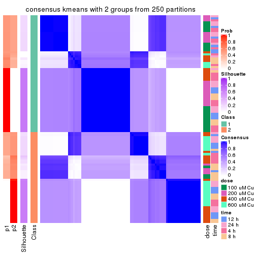</p>

</div>
<div id='tab-SD-kmeans-consensus-heatmap-2'>
<pre><code class="r">consensus_heatmap(res, k = 3)
</code></pre>

<p></p>

</div>
<div id='tab-SD-kmeans-consensus-heatmap-3'>
<pre><code class="r">consensus_heatmap(res, k = 4)
</code></pre>

<p>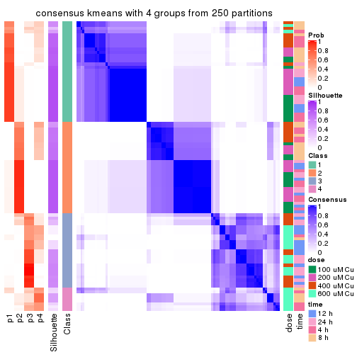</p>

</div>
<div id='tab-SD-kmeans-consensus-heatmap-4'>
<pre><code class="r">consensus_heatmap(res, k = 5)
</code></pre>

<p></p>

</div>
<div id='tab-SD-kmeans-consensus-heatmap-5'>
<pre><code class="r">consensus_heatmap(res, k = 6)
</code></pre>

<p></p>

</div>
</div>

Heatmaps for the membership of samples in all partitions to see how consistent they are:


<script>
$( function() {
	$( '#tabs-SD-kmeans-membership-heatmap' ).tabs();
} );
</script>
<div id='tabs-SD-kmeans-membership-heatmap'>
<ul>
<li><a href='#tab-SD-kmeans-membership-heatmap-1'>k = 2</a></li>
<li><a href='#tab-SD-kmeans-membership-heatmap-2'>k = 3</a></li>
<li><a href='#tab-SD-kmeans-membership-heatmap-3'>k = 4</a></li>
<li><a href='#tab-SD-kmeans-membership-heatmap-4'>k = 5</a></li>
<li><a href='#tab-SD-kmeans-membership-heatmap-5'>k = 6</a></li>
</ul>
<div id='tab-SD-kmeans-membership-heatmap-1'>
<pre><code class="r">membership_heatmap(res, k = 2)
</code></pre>

<p></p>

</div>
<div id='tab-SD-kmeans-membership-heatmap-2'>
<pre><code class="r">membership_heatmap(res, k = 3)
</code></pre>

<p></p>

</div>
<div id='tab-SD-kmeans-membership-heatmap-3'>
<pre><code class="r">membership_heatmap(res, k = 4)
</code></pre>

<p></p>

</div>
<div id='tab-SD-kmeans-membership-heatmap-4'>
<pre><code class="r">membership_heatmap(res, k = 5)
</code></pre>

<p></p>

</div>
<div id='tab-SD-kmeans-membership-heatmap-5'>
<pre><code class="r">membership_heatmap(res, k = 6)
</code></pre>

<p></p>

</div>
</div>

As soon as we have had the classes for columns, we can look for signatures
which are significantly different between classes which can be candidate marks
for certain classes. Following are the heatmaps for signatures.


Signature heatmaps where rows are scaled:


<script>
$( function() {
	$( '#tabs-SD-kmeans-get-signatures' ).tabs();
} );
</script>
<div id='tabs-SD-kmeans-get-signatures'>
<ul>
<li><a href='#tab-SD-kmeans-get-signatures-1'>k = 2</a></li>
<li><a href='#tab-SD-kmeans-get-signatures-2'>k = 3</a></li>
<li><a href='#tab-SD-kmeans-get-signatures-3'>k = 4</a></li>
<li><a href='#tab-SD-kmeans-get-signatures-4'>k = 5</a></li>
<li><a href='#tab-SD-kmeans-get-signatures-5'>k = 6</a></li>
</ul>
<div id='tab-SD-kmeans-get-signatures-1'>
<pre><code class="r">get_signatures(res, k = 2)
</code></pre>

<p></p>

</div>
<div id='tab-SD-kmeans-get-signatures-2'>
<pre><code class="r">get_signatures(res, k = 3)
</code></pre>

<p></p>

</div>
<div id='tab-SD-kmeans-get-signatures-3'>
<pre><code class="r">get_signatures(res, k = 4)
</code></pre>

<p></p>

</div>
<div id='tab-SD-kmeans-get-signatures-4'>
<pre><code class="r">get_signatures(res, k = 5)
</code></pre>

<p></p>

</div>
<div id='tab-SD-kmeans-get-signatures-5'>
<pre><code class="r">get_signatures(res, k = 6)
</code></pre>

<p></p>

</div>
</div>


Signature heatmaps where rows are not scaled:


<script>
$( function() {
	$( '#tabs-SD-kmeans-get-signatures-no-scale' ).tabs();
} );
</script>
<div id='tabs-SD-kmeans-get-signatures-no-scale'>
<ul>
<li><a href='#tab-SD-kmeans-get-signatures-no-scale-1'>k = 2</a></li>
<li><a href='#tab-SD-kmeans-get-signatures-no-scale-2'>k = 3</a></li>
<li><a href='#tab-SD-kmeans-get-signatures-no-scale-3'>k = 4</a></li>
<li><a href='#tab-SD-kmeans-get-signatures-no-scale-4'>k = 5</a></li>
<li><a href='#tab-SD-kmeans-get-signatures-no-scale-5'>k = 6</a></li>
</ul>
<div id='tab-SD-kmeans-get-signatures-no-scale-1'>
<pre><code class="r">get_signatures(res, k = 2, scale_rows = FALSE)
</code></pre>

<p></p>

</div>
<div id='tab-SD-kmeans-get-signatures-no-scale-2'>
<pre><code class="r">get_signatures(res, k = 3, scale_rows = FALSE)
</code></pre>

<p></p>

</div>
<div id='tab-SD-kmeans-get-signatures-no-scale-3'>
<pre><code class="r">get_signatures(res, k = 4, scale_rows = FALSE)
</code></pre>

<pre><code>#&gt; Error in mat[ceiling(1:nr/h_ratio), ceiling(1:nc/w_ratio), drop = FALSE]: subscript out of bounds
</code></pre>

<p></p>

</div>
<div id='tab-SD-kmeans-get-signatures-no-scale-4'>
<pre><code class="r">get_signatures(res, k = 5, scale_rows = FALSE)
</code></pre>

<p></p>

</div>
<div id='tab-SD-kmeans-get-signatures-no-scale-5'>
<pre><code class="r">get_signatures(res, k = 6, scale_rows = FALSE)
</code></pre>

<p></p>

</div>
</div>


Compare the overlap of signatures from different k:

```r
compare_signatures(res)
```


`get_signature()` returns a data frame invisibly. TO get the list of signatures, the function
call should be assigned to a variable explicitly. In following code, if `plot` argument is set
to `FALSE`, no heatmap is plotted while only the differential analysis is performed.

```r
# code only for demonstration
tb = get_signature(res, k = ..., plot = FALSE)
```

An example of the output of `tb` is:

```
#>   which_row         fdr    mean_1    mean_2 scaled_mean_1 scaled_mean_2 km
#> 1        38 0.042760348  8.373488  9.131774    -0.5533452     0.5164555  1
#> 2        40 0.018707592  7.106213  8.469186    -0.6173731     0.5762149  1
#> 3        55 0.019134737 10.221463 11.207825    -0.6159697     0.5749050  1
#> 4        59 0.006059896  5.921854  7.869574    -0.6899429     0.6439467  1
#> 5        60 0.018055526  8.928898 10.211722    -0.6204761     0.5791110  1
#> 6        98 0.009384629 15.714769 14.887706     0.6635654    -0.6193277  2
...
```

The columns in `tb` are:

1. `which_row`: row indices corresponding to the input matrix.
2. `fdr`: FDR for the differential test. 
3. `mean_x`: The mean value in group x.
4. `scaled_mean_x`: The mean value in group x after rows are scaled.
5. `km`: Row groups if k-means clustering is applied to rows.


UMAP plot which shows how samples are separated.


<script>
$( function() {
	$( '#tabs-SD-kmeans-dimension-reduction' ).tabs();
} );
</script>
<div id='tabs-SD-kmeans-dimension-reduction'>
<ul>
<li><a href='#tab-SD-kmeans-dimension-reduction-1'>k = 2</a></li>
<li><a href='#tab-SD-kmeans-dimension-reduction-2'>k = 3</a></li>
<li><a href='#tab-SD-kmeans-dimension-reduction-3'>k = 4</a></li>
<li><a href='#tab-SD-kmeans-dimension-reduction-4'>k = 5</a></li>
<li><a href='#tab-SD-kmeans-dimension-reduction-5'>k = 6</a></li>
</ul>
<div id='tab-SD-kmeans-dimension-reduction-1'>
<pre><code class="r">dimension_reduction(res, k = 2, method = &quot;UMAP&quot;)
</code></pre>

<p></p>

</div>
<div id='tab-SD-kmeans-dimension-reduction-2'>
<pre><code class="r">dimension_reduction(res, k = 3, method = &quot;UMAP&quot;)
</code></pre>

<p></p>

</div>
<div id='tab-SD-kmeans-dimension-reduction-3'>
<pre><code class="r">dimension_reduction(res, k = 4, method = &quot;UMAP&quot;)
</code></pre>

<p></p>

</div>
<div id='tab-SD-kmeans-dimension-reduction-4'>
<pre><code class="r">dimension_reduction(res, k = 5, method = &quot;UMAP&quot;)
</code></pre>

<p></p>

</div>
<div id='tab-SD-kmeans-dimension-reduction-5'>
<pre><code class="r">dimension_reduction(res, k = 6, method = &quot;UMAP&quot;)
</code></pre>

<p></p>

</div>
</div>


Following heatmap shows how subgroups are split when increasing `k`:

```r
collect_classes(res)
```


Test correlation between subgroups and known annotations. If the known
annotation is numeric, one-way ANOVA test is applied, and if the known
annotation is discrete, chi-squared contingency table test is applied.

```r
test_to_known_factors(res)
```

```
#>            n  dose(p)  time(p) k
#> SD:kmeans 51 7.00e-08 4.92e-01 2
#> SD:kmeans 96 2.11e-10 9.85e-02 3
#> SD:kmeans 76 1.59e-06 1.26e-02 4
#> SD:kmeans 60 9.57e-12 1.95e-03 5
#> SD:kmeans 73 1.15e-13 2.91e-08 6
```


If matrix rows can be associated to genes, consider to use `GO_Enrichment(res,
...)` to perform function enrichment for the signature genes.


 

---------------------------------------------------


### SD:skmeans*


The object with results only for a single top-value method and a single partition method 
can be extracted as:

```r
res = res_list["SD", "skmeans"]
# you can also extract it by
# res = res_list["SD:skmeans"]
```

A summary of `res` and all the functions that can be applied to it:

```r
res
```

```
#> A 'ConsensusPartition' object with k = 2, 3, 4, 5, 6.
#>   On a matrix with 16250 rows and 98 columns.
#>   Top rows (1000, 2000, 3000, 4000, 5000) are extracted by 'SD' method.
#>   Subgroups are detected by 'skmeans' method.
#>   Performed in total 1250 partitions by row resampling.
#>   Best k for subgroups seems to be 6.
#> 
#> Following methods can be applied to this 'ConsensusPartition' object:
#>  [1] "cola_report"             "collect_classes"         "collect_plots"          
#>  [4] "collect_stats"           "colnames"                "compare_signatures"     
#>  [7] "consensus_heatmap"       "dimension_reduction"     "functional_enrichment"  
#> [10] "get_anno_col"            "get_anno"                "get_classes"            
#> [13] "get_consensus"           "get_matrix"              "get_membership"         
#> [16] "get_param"               "get_signatures"          "get_stats"              
#> [19] "is_best_k"               "is_stable_k"             "membership_heatmap"     
#> [22] "ncol"                    "nrow"                    "plot_ecdf"              
#> [25] "rownames"                "select_partition_number" "show"                   
#> [28] "suggest_best_k"          "test_to_known_factors"
```

`collect_plots()` function collects all the plots made from `res` for all `k` (number of partitions)
into one single page to provide an easy and fast comparison between different `k`.

```r
collect_plots(res)
```


The plots are:

- The first row: a plot of the ECDF (Empirical cumulative distribution
  function) curves of the consensus matrix for each `k` and the heatmap of
  predicted classes for each `k`.
- The second row: heatmaps of the consensus matrix for each `k`.
- The third row: heatmaps of the membership matrix for each `k`.
- The fouth row: heatmaps of the signatures for each `k`.

All the plots in panels can be made by individual functions and they are
plotted later in this section.

`select_partition_number()` produces several plots showing different
statistics for choosing "optimized" `k`. There are following statistics:

- ECDF curves of the consensus matrix for each `k`;
- 1-PAC. [The PAC
  score](https://en.wikipedia.org/wiki/Consensus_clustering#Over-interpretation_potential_of_consensus_clustering)
  measures the proportion of the ambiguous subgrouping.
- Mean silhouette score.
- Concordance. The mean probability of fiting the consensus class ids in all
  partitions.
- Area increased. Denote $A_k$ as the area under the ECDF curve for current
  `k`, the area increased is defined as $A_k - A_{k-1}$.
- Rand index. The percent of pairs of samples that are both in a same cluster
  or both are not in a same cluster in the partition of k and k-1.
- Jaccard index. The ratio of pairs of samples are both in a same cluster in
  the partition of k and k-1 and the pairs of samples are both in a same
  cluster in the partition k or k-1.

The detailed explanations of these statistics can be found in [the cola
vignette](http://bioconductor.org/packages/devel/bioc/vignettes/cola/inst/doc/cola.html#toc_13).

Generally speaking, lower PAC score, higher mean silhouette score or higher
concordance corresponds to better partition. Rand index and Jaccard index
measure how similar the current partition is compared to partition with `k-1`.
If they are too similar, we won't accept `k` is better than `k-1`.

```r
select_partition_number(res)
```


The numeric values for all these statistics can be obtained by `get_stats()`.

```r
get_stats(res)
```

```
#>   k 1-PAC mean_silhouette concordance area_increased  Rand Jaccard
#> 2 2 1.000           0.964       0.970         0.5054 0.495   0.495
#> 3 3 0.985           0.937       0.976         0.3310 0.713   0.482
#> 4 4 0.900           0.739       0.810         0.1096 0.890   0.681
#> 5 5 0.898           0.811       0.909         0.0671 0.882   0.592
#> 6 6 0.910           0.837       0.906         0.0504 0.922   0.648
```

`suggest_best_k()` suggests the best $k$ based on these statistics. The rules are as follows:

- All $k$ with Jaccard index larger than 0.95 are removed because the increase of
  the partition number does not provides enough extra information. If all $k$ are removed,
  the best $k$ is assigned by `NA`.
- For $k$ with 1-PAC larger than 0.9, the maximal $k$ is taken as the "best k". Other $k$ is called "optional k".
- If it does not fit the second rule. The $k$ with the highest vote of highest
  1-PAC, mean silhouette and concordance is taken as the "best k".

```r
suggest_best_k(res)
```

```
#> [1] 6
#> attr(,"optional")
#> [1] 2 3
```

There is also optional best $k$ = 2 3 that is worth to check.

Following shows the table of the partitions (You need to click the **show/hide
code output** link to see it). The membership matrix (columns with name `p*`)
is inferred by
[`clue::cl_consensus()`](https://www.rdocumentation.org/link/cl_consensus?package=clue)
function with the `SE` method. Basically the value in the membership matrix
represents the probability to belong to a certain group. The finall class
label for an item is determined with the group with highest probability it
belongs to.

In `get_classes()` function, the entropy is calculated from the membership
matrix and the silhouette score is calculated from the consensus matrix.


<script>
$( function() {
	$( '#tabs-SD-skmeans-get-classes' ).tabs();
} );
</script>
<div id='tabs-SD-skmeans-get-classes'>
<ul>
<li><a href='#tab-SD-skmeans-get-classes-1'>k = 2</a></li>
<li><a href='#tab-SD-skmeans-get-classes-2'>k = 3</a></li>
<li><a href='#tab-SD-skmeans-get-classes-3'>k = 4</a></li>
<li><a href='#tab-SD-skmeans-get-classes-4'>k = 5</a></li>
<li><a href='#tab-SD-skmeans-get-classes-5'>k = 6</a></li>
</ul>

<div id='tab-SD-skmeans-get-classes-1'>
<p><a id='tab-SD-skmeans-get-classes-1-a' style='color:#0366d6' href='#'>show/hide code output</a></p>
<pre><code class="r">cbind(get_classes(res, k = 2), get_membership(res, k = 2))
</code></pre>

<pre><code>#&gt;           class entropy silhouette    p1    p2
#&gt; GSM241451     2   0.358      0.962 0.068 0.932
#&gt; GSM241452     1   0.000      0.970 1.000 0.000
#&gt; GSM241453     2   0.358      0.962 0.068 0.932
#&gt; GSM241454     1   0.000      0.970 1.000 0.000
#&gt; GSM241455     2   0.358      0.962 0.068 0.932
#&gt; GSM241456     1   0.000      0.970 1.000 0.000
#&gt; GSM241457     2   0.358      0.962 0.068 0.932
#&gt; GSM241458     1   0.000      0.970 1.000 0.000
#&gt; GSM241459     2   0.358      0.962 0.068 0.932
#&gt; GSM241460     1   0.000      0.970 1.000 0.000
#&gt; GSM241461     2   0.358      0.962 0.068 0.932
#&gt; GSM241462     1   0.000      0.970 1.000 0.000
#&gt; GSM241463     2   0.358      0.962 0.068 0.932
#&gt; GSM241464     1   0.000      0.970 1.000 0.000
#&gt; GSM241465     2   0.358      0.962 0.068 0.932
#&gt; GSM241466     1   0.000      0.970 1.000 0.000
#&gt; GSM241467     1   0.000      0.970 1.000 0.000
#&gt; GSM241468     2   0.358      0.962 0.068 0.932
#&gt; GSM241469     1   0.000      0.970 1.000 0.000
#&gt; GSM241470     2   0.358      0.962 0.068 0.932
#&gt; GSM241471     2   0.358      0.962 0.068 0.932
#&gt; GSM241472     1   0.000      0.970 1.000 0.000
#&gt; GSM241473     2   0.358      0.962 0.068 0.932
#&gt; GSM241474     1   0.000      0.970 1.000 0.000
#&gt; GSM241475     2   0.358      0.962 0.068 0.932
#&gt; GSM241476     1   0.000      0.970 1.000 0.000
#&gt; GSM241477     2   0.358      0.962 0.068 0.932
#&gt; GSM241478     2   0.358      0.962 0.068 0.932
#&gt; GSM241479     1   0.000      0.970 1.000 0.000
#&gt; GSM241480     1   0.000      0.970 1.000 0.000
#&gt; GSM241481     2   0.358      0.962 0.068 0.932
#&gt; GSM241482     1   0.000      0.970 1.000 0.000
#&gt; GSM241483     2   0.358      0.962 0.068 0.932
#&gt; GSM241484     1   0.000      0.970 1.000 0.000
#&gt; GSM241485     1   0.000      0.970 1.000 0.000
#&gt; GSM241486     2   0.358      0.962 0.068 0.932
#&gt; GSM241487     2   0.358      0.962 0.068 0.932
#&gt; GSM241488     2   0.358      0.962 0.068 0.932
#&gt; GSM241489     1   0.000      0.970 1.000 0.000
#&gt; GSM241490     1   0.000      0.970 1.000 0.000
#&gt; GSM241491     2   0.358      0.962 0.068 0.932
#&gt; GSM241492     1   0.000      0.970 1.000 0.000
#&gt; GSM241493     2   0.358      0.962 0.068 0.932
#&gt; GSM241494     1   0.000      0.970 1.000 0.000
#&gt; GSM241495     2   0.358      0.962 0.068 0.932
#&gt; GSM241496     2   0.358      0.962 0.068 0.932
#&gt; GSM241497     1   0.000      0.970 1.000 0.000
#&gt; GSM241498     1   0.000      0.970 1.000 0.000
#&gt; GSM241499     1   0.000      0.970 1.000 0.000
#&gt; GSM241500     2   0.000      0.964 0.000 1.000
#&gt; GSM241501     2   0.000      0.964 0.000 1.000
#&gt; GSM241502     2   0.000      0.964 0.000 1.000
#&gt; GSM241503     1   0.000      0.970 1.000 0.000
#&gt; GSM241504     1   0.000      0.970 1.000 0.000
#&gt; GSM241505     1   0.000      0.970 1.000 0.000
#&gt; GSM241506     2   0.000      0.964 0.000 1.000
#&gt; GSM241507     1   0.000      0.970 1.000 0.000
#&gt; GSM241508     2   0.000      0.964 0.000 1.000
#&gt; GSM241509     2   0.000      0.964 0.000 1.000
#&gt; GSM241510     2   0.000      0.964 0.000 1.000
#&gt; GSM241511     1   0.358      0.956 0.932 0.068
#&gt; GSM241512     1   0.358      0.956 0.932 0.068
#&gt; GSM241513     2   0.000      0.964 0.000 1.000
#&gt; GSM241514     1   0.358      0.956 0.932 0.068
#&gt; GSM241515     2   0.000      0.964 0.000 1.000
#&gt; GSM241516     1   0.358      0.956 0.932 0.068
#&gt; GSM241517     2   0.000      0.964 0.000 1.000
#&gt; GSM241518     1   0.358      0.956 0.932 0.068
#&gt; GSM241519     2   0.000      0.964 0.000 1.000
#&gt; GSM241520     1   0.358      0.956 0.932 0.068
#&gt; GSM241521     2   0.000      0.964 0.000 1.000
#&gt; GSM241522     1   0.327      0.958 0.940 0.060
#&gt; GSM241523     2   0.000      0.964 0.000 1.000
#&gt; GSM241524     1   0.358      0.956 0.932 0.068
#&gt; GSM241525     1   0.358      0.956 0.932 0.068
#&gt; GSM241526     2   0.000      0.964 0.000 1.000
#&gt; GSM241527     1   0.358      0.956 0.932 0.068
#&gt; GSM241528     2   0.000      0.964 0.000 1.000
#&gt; GSM241529     2   0.000      0.964 0.000 1.000
#&gt; GSM241530     1   0.358      0.956 0.932 0.068
#&gt; GSM241531     1   0.358      0.956 0.932 0.068
#&gt; GSM241532     2   0.000      0.964 0.000 1.000
#&gt; GSM241533     2   0.000      0.964 0.000 1.000
#&gt; GSM241534     2   0.000      0.964 0.000 1.000
#&gt; GSM241535     1   0.358      0.956 0.932 0.068
#&gt; GSM241536     1   0.358      0.956 0.932 0.068
#&gt; GSM241537     2   0.000      0.964 0.000 1.000
#&gt; GSM241538     1   0.358      0.956 0.932 0.068
#&gt; GSM241539     2   0.000      0.964 0.000 1.000
#&gt; GSM241540     1   0.358      0.956 0.932 0.068
#&gt; GSM241541     2   0.000      0.964 0.000 1.000
#&gt; GSM241542     1   0.358      0.956 0.932 0.068
#&gt; GSM241543     2   0.000      0.964 0.000 1.000
#&gt; GSM241544     1   0.358      0.956 0.932 0.068
#&gt; GSM241545     2   0.000      0.964 0.000 1.000
#&gt; GSM241546     1   0.358      0.956 0.932 0.068
#&gt; GSM241547     2   0.000      0.964 0.000 1.000
#&gt; GSM241548     1   0.358      0.956 0.932 0.068
</code></pre>

<script>
$('#tab-SD-skmeans-get-classes-1-a').parent().next().next().hide();
$('#tab-SD-skmeans-get-classes-1-a').click(function(){
  $('#tab-SD-skmeans-get-classes-1-a').parent().next().next().toggle();
  return(false);
});
</script>
</div>

<div id='tab-SD-skmeans-get-classes-2'>
<p><a id='tab-SD-skmeans-get-classes-2-a' style='color:#0366d6' href='#'>show/hide code output</a></p>
<pre><code class="r">cbind(get_classes(res, k = 3), get_membership(res, k = 3))
</code></pre>

<pre><code>#&gt;           class entropy silhouette    p1    p2    p3
#&gt; GSM241451     2  0.0000     0.9874 0.000 1.000 0.000
#&gt; GSM241452     1  0.0000     0.9868 1.000 0.000 0.000
#&gt; GSM241453     2  0.0000     0.9874 0.000 1.000 0.000
#&gt; GSM241454     1  0.0000     0.9868 1.000 0.000 0.000
#&gt; GSM241455     2  0.0000     0.9874 0.000 1.000 0.000
#&gt; GSM241456     1  0.0000     0.9868 1.000 0.000 0.000
#&gt; GSM241457     2  0.0000     0.9874 0.000 1.000 0.000
#&gt; GSM241458     1  0.0000     0.9868 1.000 0.000 0.000
#&gt; GSM241459     2  0.0000     0.9874 0.000 1.000 0.000
#&gt; GSM241460     1  0.0000     0.9868 1.000 0.000 0.000
#&gt; GSM241461     2  0.0000     0.9874 0.000 1.000 0.000
#&gt; GSM241462     1  0.0000     0.9868 1.000 0.000 0.000
#&gt; GSM241463     2  0.0000     0.9874 0.000 1.000 0.000
#&gt; GSM241464     1  0.0000     0.9868 1.000 0.000 0.000
#&gt; GSM241465     2  0.0000     0.9874 0.000 1.000 0.000
#&gt; GSM241466     1  0.0000     0.9868 1.000 0.000 0.000
#&gt; GSM241467     1  0.0000     0.9868 1.000 0.000 0.000
#&gt; GSM241468     2  0.0000     0.9874 0.000 1.000 0.000
#&gt; GSM241469     1  0.0000     0.9868 1.000 0.000 0.000
#&gt; GSM241470     2  0.0000     0.9874 0.000 1.000 0.000
#&gt; GSM241471     2  0.0000     0.9874 0.000 1.000 0.000
#&gt; GSM241472     1  0.0000     0.9868 1.000 0.000 0.000
#&gt; GSM241473     2  0.0000     0.9874 0.000 1.000 0.000
#&gt; GSM241474     1  0.0000     0.9868 1.000 0.000 0.000
#&gt; GSM241475     2  0.0000     0.9874 0.000 1.000 0.000
#&gt; GSM241476     1  0.0000     0.9868 1.000 0.000 0.000
#&gt; GSM241477     2  0.0000     0.9874 0.000 1.000 0.000
#&gt; GSM241478     2  0.0000     0.9874 0.000 1.000 0.000
#&gt; GSM241479     1  0.0000     0.9868 1.000 0.000 0.000
#&gt; GSM241480     1  0.0000     0.9868 1.000 0.000 0.000
#&gt; GSM241481     2  0.0000     0.9874 0.000 1.000 0.000
#&gt; GSM241482     1  0.0000     0.9868 1.000 0.000 0.000
#&gt; GSM241483     2  0.0000     0.9874 0.000 1.000 0.000
#&gt; GSM241484     1  0.0000     0.9868 1.000 0.000 0.000
#&gt; GSM241485     1  0.0000     0.9868 1.000 0.000 0.000
#&gt; GSM241486     2  0.0000     0.9874 0.000 1.000 0.000
#&gt; GSM241487     2  0.0000     0.9874 0.000 1.000 0.000
#&gt; GSM241488     2  0.0000     0.9874 0.000 1.000 0.000
#&gt; GSM241489     1  0.0000     0.9868 1.000 0.000 0.000
#&gt; GSM241490     1  0.0000     0.9868 1.000 0.000 0.000
#&gt; GSM241491     2  0.0000     0.9874 0.000 1.000 0.000
#&gt; GSM241492     1  0.0000     0.9868 1.000 0.000 0.000
#&gt; GSM241493     2  0.0000     0.9874 0.000 1.000 0.000
#&gt; GSM241494     1  0.0000     0.9868 1.000 0.000 0.000
#&gt; GSM241495     2  0.0000     0.9874 0.000 1.000 0.000
#&gt; GSM241496     2  0.0000     0.9874 0.000 1.000 0.000
#&gt; GSM241497     1  0.0000     0.9868 1.000 0.000 0.000
#&gt; GSM241498     1  0.0000     0.9868 1.000 0.000 0.000
#&gt; GSM241499     1  0.0000     0.9868 1.000 0.000 0.000
#&gt; GSM241500     2  0.0000     0.9874 0.000 1.000 0.000
#&gt; GSM241501     2  0.0000     0.9874 0.000 1.000 0.000
#&gt; GSM241502     2  0.0000     0.9874 0.000 1.000 0.000
#&gt; GSM241503     1  0.0000     0.9868 1.000 0.000 0.000
#&gt; GSM241504     1  0.0000     0.9868 1.000 0.000 0.000
#&gt; GSM241505     1  0.0000     0.9868 1.000 0.000 0.000
#&gt; GSM241506     2  0.0000     0.9874 0.000 1.000 0.000
#&gt; GSM241507     1  0.0000     0.9868 1.000 0.000 0.000
#&gt; GSM241508     2  0.0000     0.9874 0.000 1.000 0.000
#&gt; GSM241509     2  0.5882     0.4432 0.000 0.652 0.348
#&gt; GSM241510     3  0.6045     0.3727 0.000 0.380 0.620
#&gt; GSM241511     1  0.0000     0.9868 1.000 0.000 0.000
#&gt; GSM241512     3  0.6252     0.1910 0.444 0.000 0.556
#&gt; GSM241513     3  0.0000     0.9499 0.000 0.000 1.000
#&gt; GSM241514     3  0.0000     0.9499 0.000 0.000 1.000
#&gt; GSM241515     3  0.0000     0.9499 0.000 0.000 1.000
#&gt; GSM241516     3  0.0000     0.9499 0.000 0.000 1.000
#&gt; GSM241517     3  0.0000     0.9499 0.000 0.000 1.000
#&gt; GSM241518     3  0.0000     0.9499 0.000 0.000 1.000
#&gt; GSM241519     3  0.0237     0.9465 0.000 0.004 0.996
#&gt; GSM241520     3  0.0000     0.9499 0.000 0.000 1.000
#&gt; GSM241521     3  0.6302     0.0854 0.000 0.480 0.520
#&gt; GSM241522     1  0.0000     0.9868 1.000 0.000 0.000
#&gt; GSM241523     3  0.0000     0.9499 0.000 0.000 1.000
#&gt; GSM241524     3  0.0000     0.9499 0.000 0.000 1.000
#&gt; GSM241525     1  0.2625     0.8978 0.916 0.000 0.084
#&gt; GSM241526     3  0.0000     0.9499 0.000 0.000 1.000
#&gt; GSM241527     3  0.0000     0.9499 0.000 0.000 1.000
#&gt; GSM241528     3  0.0000     0.9499 0.000 0.000 1.000
#&gt; GSM241529     3  0.0000     0.9499 0.000 0.000 1.000
#&gt; GSM241530     3  0.5363     0.5993 0.276 0.000 0.724
#&gt; GSM241531     1  0.5785     0.4856 0.668 0.000 0.332
#&gt; GSM241532     3  0.0000     0.9499 0.000 0.000 1.000
#&gt; GSM241533     3  0.0000     0.9499 0.000 0.000 1.000
#&gt; GSM241534     3  0.0000     0.9499 0.000 0.000 1.000
#&gt; GSM241535     3  0.0000     0.9499 0.000 0.000 1.000
#&gt; GSM241536     1  0.0000     0.9868 1.000 0.000 0.000
#&gt; GSM241537     3  0.0000     0.9499 0.000 0.000 1.000
#&gt; GSM241538     3  0.0000     0.9499 0.000 0.000 1.000
#&gt; GSM241539     3  0.0000     0.9499 0.000 0.000 1.000
#&gt; GSM241540     3  0.0000     0.9499 0.000 0.000 1.000
#&gt; GSM241541     3  0.0000     0.9499 0.000 0.000 1.000
#&gt; GSM241542     3  0.0000     0.9499 0.000 0.000 1.000
#&gt; GSM241543     3  0.0000     0.9499 0.000 0.000 1.000
#&gt; GSM241544     3  0.0000     0.9499 0.000 0.000 1.000
#&gt; GSM241545     3  0.0000     0.9499 0.000 0.000 1.000
#&gt; GSM241546     3  0.0000     0.9499 0.000 0.000 1.000
#&gt; GSM241547     3  0.0000     0.9499 0.000 0.000 1.000
#&gt; GSM241548     3  0.0000     0.9499 0.000 0.000 1.000
</code></pre>

<script>
$('#tab-SD-skmeans-get-classes-2-a').parent().next().next().hide();
$('#tab-SD-skmeans-get-classes-2-a').click(function(){
  $('#tab-SD-skmeans-get-classes-2-a').parent().next().next().toggle();
  return(false);
});
</script>
</div>

<div id='tab-SD-skmeans-get-classes-3'>
<p><a id='tab-SD-skmeans-get-classes-3-a' style='color:#0366d6' href='#'>show/hide code output</a></p>
<pre><code class="r">cbind(get_classes(res, k = 4), get_membership(res, k = 4))
</code></pre>

<pre><code>#&gt;           class entropy silhouette    p1    p2    p3    p4
#&gt; GSM241451     2  0.0000   0.966340 0.000 1.000 0.000 0.000
#&gt; GSM241452     1  0.0000   0.979453 1.000 0.000 0.000 0.000
#&gt; GSM241453     2  0.0000   0.966340 0.000 1.000 0.000 0.000
#&gt; GSM241454     1  0.0000   0.979453 1.000 0.000 0.000 0.000
#&gt; GSM241455     2  0.0000   0.966340 0.000 1.000 0.000 0.000
#&gt; GSM241456     1  0.0000   0.979453 1.000 0.000 0.000 0.000
#&gt; GSM241457     2  0.1867   0.945045 0.000 0.928 0.000 0.072
#&gt; GSM241458     1  0.0000   0.979453 1.000 0.000 0.000 0.000
#&gt; GSM241459     2  0.1867   0.945045 0.000 0.928 0.000 0.072
#&gt; GSM241460     1  0.0000   0.979453 1.000 0.000 0.000 0.000
#&gt; GSM241461     2  0.1867   0.945045 0.000 0.928 0.000 0.072
#&gt; GSM241462     1  0.0000   0.979453 1.000 0.000 0.000 0.000
#&gt; GSM241463     2  0.0000   0.966340 0.000 1.000 0.000 0.000
#&gt; GSM241464     1  0.0000   0.979453 1.000 0.000 0.000 0.000
#&gt; GSM241465     2  0.0000   0.966340 0.000 1.000 0.000 0.000
#&gt; GSM241466     1  0.0000   0.979453 1.000 0.000 0.000 0.000
#&gt; GSM241467     1  0.0000   0.979453 1.000 0.000 0.000 0.000
#&gt; GSM241468     2  0.0000   0.966340 0.000 1.000 0.000 0.000
#&gt; GSM241469     1  0.0000   0.979453 1.000 0.000 0.000 0.000
#&gt; GSM241470     2  0.0000   0.966340 0.000 1.000 0.000 0.000
#&gt; GSM241471     2  0.0000   0.966340 0.000 1.000 0.000 0.000
#&gt; GSM241472     1  0.0000   0.979453 1.000 0.000 0.000 0.000
#&gt; GSM241473     2  0.0000   0.966340 0.000 1.000 0.000 0.000
#&gt; GSM241474     1  0.0000   0.979453 1.000 0.000 0.000 0.000
#&gt; GSM241475     2  0.0000   0.966340 0.000 1.000 0.000 0.000
#&gt; GSM241476     1  0.0000   0.979453 1.000 0.000 0.000 0.000
#&gt; GSM241477     2  0.0000   0.966340 0.000 1.000 0.000 0.000
#&gt; GSM241478     2  0.0000   0.966340 0.000 1.000 0.000 0.000
#&gt; GSM241479     1  0.0000   0.979453 1.000 0.000 0.000 0.000
#&gt; GSM241480     1  0.0000   0.979453 1.000 0.000 0.000 0.000
#&gt; GSM241481     2  0.1867   0.945045 0.000 0.928 0.000 0.072
#&gt; GSM241482     1  0.0000   0.979453 1.000 0.000 0.000 0.000
#&gt; GSM241483     2  0.1867   0.945045 0.000 0.928 0.000 0.072
#&gt; GSM241484     1  0.0000   0.979453 1.000 0.000 0.000 0.000
#&gt; GSM241485     1  0.0000   0.979453 1.000 0.000 0.000 0.000
#&gt; GSM241486     2  0.1867   0.945045 0.000 0.928 0.000 0.072
#&gt; GSM241487     2  0.0000   0.966340 0.000 1.000 0.000 0.000
#&gt; GSM241488     2  0.0000   0.966340 0.000 1.000 0.000 0.000
#&gt; GSM241489     1  0.0000   0.979453 1.000 0.000 0.000 0.000
#&gt; GSM241490     1  0.0000   0.979453 1.000 0.000 0.000 0.000
#&gt; GSM241491     2  0.0000   0.966340 0.000 1.000 0.000 0.000
#&gt; GSM241492     1  0.0000   0.979453 1.000 0.000 0.000 0.000
#&gt; GSM241493     2  0.0000   0.966340 0.000 1.000 0.000 0.000
#&gt; GSM241494     1  0.0000   0.979453 1.000 0.000 0.000 0.000
#&gt; GSM241495     2  0.0000   0.966340 0.000 1.000 0.000 0.000
#&gt; GSM241496     2  0.0000   0.966340 0.000 1.000 0.000 0.000
#&gt; GSM241497     1  0.0000   0.979453 1.000 0.000 0.000 0.000
#&gt; GSM241498     1  0.0000   0.979453 1.000 0.000 0.000 0.000
#&gt; GSM241499     1  0.0336   0.974109 0.992 0.000 0.008 0.000
#&gt; GSM241500     2  0.2868   0.894714 0.000 0.864 0.000 0.136
#&gt; GSM241501     2  0.2011   0.940920 0.000 0.920 0.000 0.080
#&gt; GSM241502     2  0.2011   0.940920 0.000 0.920 0.000 0.080
#&gt; GSM241503     1  0.0336   0.974109 0.992 0.000 0.008 0.000
#&gt; GSM241504     1  0.0336   0.974109 0.992 0.000 0.008 0.000
#&gt; GSM241505     1  0.0336   0.974109 0.992 0.000 0.008 0.000
#&gt; GSM241506     2  0.2868   0.894714 0.000 0.864 0.000 0.136
#&gt; GSM241507     1  0.0336   0.974109 0.992 0.000 0.008 0.000
#&gt; GSM241508     2  0.2921   0.890461 0.000 0.860 0.000 0.140
#&gt; GSM241509     4  0.6520   0.470962 0.000 0.084 0.364 0.552
#&gt; GSM241510     4  0.4948   0.505242 0.000 0.000 0.440 0.560
#&gt; GSM241511     3  0.4996   0.000763 0.484 0.000 0.516 0.000
#&gt; GSM241512     3  0.0336   0.529242 0.008 0.000 0.992 0.000
#&gt; GSM241513     4  0.2011   0.574382 0.000 0.000 0.080 0.920
#&gt; GSM241514     3  0.4948   0.440520 0.000 0.000 0.560 0.440
#&gt; GSM241515     4  0.2011   0.574382 0.000 0.000 0.080 0.920
#&gt; GSM241516     3  0.4916   0.446076 0.000 0.000 0.576 0.424
#&gt; GSM241517     4  0.2224   0.581227 0.000 0.032 0.040 0.928
#&gt; GSM241518     3  0.4961   0.437507 0.000 0.000 0.552 0.448
#&gt; GSM241519     4  0.2224   0.581227 0.000 0.032 0.040 0.928
#&gt; GSM241520     3  0.4961   0.437507 0.000 0.000 0.552 0.448
#&gt; GSM241521     4  0.2227   0.579200 0.000 0.036 0.036 0.928
#&gt; GSM241522     1  0.5512  -0.027777 0.496 0.000 0.488 0.016
#&gt; GSM241523     4  0.2224   0.581227 0.000 0.032 0.040 0.928
#&gt; GSM241524     3  0.4948   0.440520 0.000 0.000 0.560 0.440
#&gt; GSM241525     3  0.1792   0.501710 0.068 0.000 0.932 0.000
#&gt; GSM241526     4  0.4948   0.505242 0.000 0.000 0.440 0.560
#&gt; GSM241527     3  0.0000   0.529421 0.000 0.000 1.000 0.000
#&gt; GSM241528     4  0.4948   0.505242 0.000 0.000 0.440 0.560
#&gt; GSM241529     4  0.4948   0.505242 0.000 0.000 0.440 0.560
#&gt; GSM241530     3  0.1211   0.520332 0.040 0.000 0.960 0.000
#&gt; GSM241531     3  0.1211   0.520332 0.040 0.000 0.960 0.000
#&gt; GSM241532     4  0.4948   0.505242 0.000 0.000 0.440 0.560
#&gt; GSM241533     4  0.4948   0.505242 0.000 0.000 0.440 0.560
#&gt; GSM241534     4  0.4948   0.505242 0.000 0.000 0.440 0.560
#&gt; GSM241535     3  0.0000   0.529421 0.000 0.000 1.000 0.000
#&gt; GSM241536     3  0.3569   0.454653 0.196 0.000 0.804 0.000
#&gt; GSM241537     3  0.4994  -0.475691 0.000 0.000 0.520 0.480
#&gt; GSM241538     3  0.0336   0.525198 0.000 0.000 0.992 0.008
#&gt; GSM241539     3  0.4994  -0.475691 0.000 0.000 0.520 0.480
#&gt; GSM241540     3  0.0000   0.529421 0.000 0.000 1.000 0.000
#&gt; GSM241541     3  0.4994  -0.475691 0.000 0.000 0.520 0.480
#&gt; GSM241542     3  0.0336   0.525198 0.000 0.000 0.992 0.008
#&gt; GSM241543     4  0.2011   0.574382 0.000 0.000 0.080 0.920
#&gt; GSM241544     3  0.4961   0.437507 0.000 0.000 0.552 0.448
#&gt; GSM241545     4  0.2011   0.574382 0.000 0.000 0.080 0.920
#&gt; GSM241546     3  0.4961   0.437507 0.000 0.000 0.552 0.448
#&gt; GSM241547     4  0.2011   0.574382 0.000 0.000 0.080 0.920
#&gt; GSM241548     3  0.4961   0.437507 0.000 0.000 0.552 0.448
</code></pre>

<script>
$('#tab-SD-skmeans-get-classes-3-a').parent().next().next().hide();
$('#tab-SD-skmeans-get-classes-3-a').click(function(){
  $('#tab-SD-skmeans-get-classes-3-a').parent().next().next().toggle();
  return(false);
});
</script>
</div>

<div id='tab-SD-skmeans-get-classes-4'>
<p><a id='tab-SD-skmeans-get-classes-4-a' style='color:#0366d6' href='#'>show/hide code output</a></p>
<pre><code class="r">cbind(get_classes(res, k = 5), get_membership(res, k = 5))
</code></pre>

<pre><code>#&gt;           class entropy silhouette    p1    p2    p3    p4    p5
#&gt; GSM241451     2  0.0000      1.000 0.000 1.000 0.000 0.000 0.000
#&gt; GSM241452     1  0.0000      0.905 1.000 0.000 0.000 0.000 0.000
#&gt; GSM241453     2  0.0000      1.000 0.000 1.000 0.000 0.000 0.000
#&gt; GSM241454     1  0.0000      0.905 1.000 0.000 0.000 0.000 0.000
#&gt; GSM241455     2  0.0000      1.000 0.000 1.000 0.000 0.000 0.000
#&gt; GSM241456     1  0.0000      0.905 1.000 0.000 0.000 0.000 0.000
#&gt; GSM241457     5  0.3109      0.796 0.000 0.200 0.000 0.000 0.800
#&gt; GSM241458     1  0.1732      0.869 0.920 0.000 0.000 0.080 0.000
#&gt; GSM241459     5  0.3109      0.796 0.000 0.200 0.000 0.000 0.800
#&gt; GSM241460     1  0.0000      0.905 1.000 0.000 0.000 0.000 0.000
#&gt; GSM241461     5  0.1908      0.871 0.000 0.092 0.000 0.000 0.908
#&gt; GSM241462     1  0.1965      0.860 0.904 0.000 0.000 0.096 0.000
#&gt; GSM241463     2  0.0000      1.000 0.000 1.000 0.000 0.000 0.000
#&gt; GSM241464     1  0.0000      0.905 1.000 0.000 0.000 0.000 0.000
#&gt; GSM241465     2  0.0000      1.000 0.000 1.000 0.000 0.000 0.000
#&gt; GSM241466     1  0.0000      0.905 1.000 0.000 0.000 0.000 0.000
#&gt; GSM241467     1  0.0000      0.905 1.000 0.000 0.000 0.000 0.000
#&gt; GSM241468     2  0.0000      1.000 0.000 1.000 0.000 0.000 0.000
#&gt; GSM241469     1  0.0000      0.905 1.000 0.000 0.000 0.000 0.000
#&gt; GSM241470     2  0.0000      1.000 0.000 1.000 0.000 0.000 0.000
#&gt; GSM241471     2  0.0000      1.000 0.000 1.000 0.000 0.000 0.000
#&gt; GSM241472     1  0.0000      0.905 1.000 0.000 0.000 0.000 0.000
#&gt; GSM241473     2  0.0000      1.000 0.000 1.000 0.000 0.000 0.000
#&gt; GSM241474     1  0.0000      0.905 1.000 0.000 0.000 0.000 0.000
#&gt; GSM241475     2  0.0000      1.000 0.000 1.000 0.000 0.000 0.000
#&gt; GSM241476     1  0.0000      0.905 1.000 0.000 0.000 0.000 0.000
#&gt; GSM241477     2  0.0000      1.000 0.000 1.000 0.000 0.000 0.000
#&gt; GSM241478     2  0.0000      1.000 0.000 1.000 0.000 0.000 0.000
#&gt; GSM241479     1  0.0000      0.905 1.000 0.000 0.000 0.000 0.000
#&gt; GSM241480     1  0.0000      0.905 1.000 0.000 0.000 0.000 0.000
#&gt; GSM241481     5  0.3109      0.796 0.000 0.200 0.000 0.000 0.800
#&gt; GSM241482     1  0.0703      0.895 0.976 0.000 0.000 0.024 0.000
#&gt; GSM241483     5  0.2561      0.840 0.000 0.144 0.000 0.000 0.856
#&gt; GSM241484     1  0.1908      0.862 0.908 0.000 0.000 0.092 0.000
#&gt; GSM241485     1  0.1908      0.862 0.908 0.000 0.000 0.092 0.000
#&gt; GSM241486     5  0.1908      0.871 0.000 0.092 0.000 0.000 0.908
#&gt; GSM241487     2  0.0000      1.000 0.000 1.000 0.000 0.000 0.000
#&gt; GSM241488     2  0.0000      1.000 0.000 1.000 0.000 0.000 0.000
#&gt; GSM241489     1  0.0000      0.905 1.000 0.000 0.000 0.000 0.000
#&gt; GSM241490     1  0.0000      0.905 1.000 0.000 0.000 0.000 0.000
#&gt; GSM241491     2  0.0000      1.000 0.000 1.000 0.000 0.000 0.000
#&gt; GSM241492     1  0.0000      0.905 1.000 0.000 0.000 0.000 0.000
#&gt; GSM241493     2  0.0000      1.000 0.000 1.000 0.000 0.000 0.000
#&gt; GSM241494     1  0.0000      0.905 1.000 0.000 0.000 0.000 0.000
#&gt; GSM241495     2  0.0000      1.000 0.000 1.000 0.000 0.000 0.000
#&gt; GSM241496     2  0.0000      1.000 0.000 1.000 0.000 0.000 0.000
#&gt; GSM241497     1  0.0000      0.905 1.000 0.000 0.000 0.000 0.000
#&gt; GSM241498     1  0.0000      0.905 1.000 0.000 0.000 0.000 0.000
#&gt; GSM241499     1  0.4273      0.498 0.552 0.000 0.000 0.448 0.000
#&gt; GSM241500     5  0.0794      0.890 0.000 0.028 0.000 0.000 0.972
#&gt; GSM241501     5  0.0880      0.890 0.000 0.032 0.000 0.000 0.968
#&gt; GSM241502     5  0.0880      0.890 0.000 0.032 0.000 0.000 0.968
#&gt; GSM241503     1  0.4273      0.498 0.552 0.000 0.000 0.448 0.000
#&gt; GSM241504     1  0.4273      0.498 0.552 0.000 0.000 0.448 0.000
#&gt; GSM241505     1  0.4273      0.498 0.552 0.000 0.000 0.448 0.000
#&gt; GSM241506     5  0.0794      0.890 0.000 0.028 0.000 0.000 0.972
#&gt; GSM241507     1  0.4273      0.498 0.552 0.000 0.000 0.448 0.000
#&gt; GSM241508     5  0.0794      0.890 0.000 0.028 0.000 0.000 0.972
#&gt; GSM241509     5  0.0000      0.879 0.000 0.000 0.000 0.000 1.000
#&gt; GSM241510     5  0.0000      0.879 0.000 0.000 0.000 0.000 1.000
#&gt; GSM241511     4  0.0000      0.711 0.000 0.000 0.000 1.000 0.000
#&gt; GSM241512     4  0.0000      0.711 0.000 0.000 0.000 1.000 0.000
#&gt; GSM241513     3  0.0162      0.939 0.000 0.000 0.996 0.000 0.004
#&gt; GSM241514     3  0.1341      0.902 0.000 0.000 0.944 0.056 0.000
#&gt; GSM241515     3  0.0162      0.939 0.000 0.000 0.996 0.000 0.004
#&gt; GSM241516     4  0.4278      0.355 0.000 0.000 0.452 0.548 0.000
#&gt; GSM241517     3  0.0290      0.937 0.000 0.000 0.992 0.000 0.008
#&gt; GSM241518     3  0.0609      0.936 0.000 0.000 0.980 0.020 0.000
#&gt; GSM241519     3  0.0162      0.939 0.000 0.000 0.996 0.000 0.004
#&gt; GSM241520     3  0.0609      0.936 0.000 0.000 0.980 0.020 0.000
#&gt; GSM241521     3  0.1502      0.877 0.000 0.056 0.940 0.000 0.004
#&gt; GSM241522     1  0.3355      0.768 0.804 0.000 0.012 0.184 0.000
#&gt; GSM241523     3  0.0162      0.939 0.000 0.000 0.996 0.000 0.004
#&gt; GSM241524     3  0.0609      0.936 0.000 0.000 0.980 0.020 0.000
#&gt; GSM241525     4  0.0000      0.711 0.000 0.000 0.000 1.000 0.000
#&gt; GSM241526     4  0.4829      0.142 0.000 0.000 0.020 0.496 0.484
#&gt; GSM241527     4  0.0703      0.713 0.000 0.000 0.000 0.976 0.024
#&gt; GSM241528     5  0.4829     -0.209 0.000 0.000 0.020 0.484 0.496
#&gt; GSM241529     4  0.4829      0.142 0.000 0.000 0.020 0.496 0.484
#&gt; GSM241530     4  0.0703      0.713 0.000 0.000 0.000 0.976 0.024
#&gt; GSM241531     4  0.0000      0.711 0.000 0.000 0.000 1.000 0.000
#&gt; GSM241532     5  0.0000      0.879 0.000 0.000 0.000 0.000 1.000
#&gt; GSM241533     5  0.0000      0.879 0.000 0.000 0.000 0.000 1.000
#&gt; GSM241534     5  0.0000      0.879 0.000 0.000 0.000 0.000 1.000
#&gt; GSM241535     4  0.0703      0.713 0.000 0.000 0.000 0.976 0.024
#&gt; GSM241536     4  0.0000      0.711 0.000 0.000 0.000 1.000 0.000
#&gt; GSM241537     4  0.5019      0.398 0.000 0.000 0.436 0.532 0.032
#&gt; GSM241538     4  0.4855      0.409 0.000 0.000 0.424 0.552 0.024
#&gt; GSM241539     4  0.5019      0.398 0.000 0.000 0.436 0.532 0.032
#&gt; GSM241540     4  0.4768      0.462 0.000 0.000 0.384 0.592 0.024
#&gt; GSM241541     3  0.5019     -0.227 0.000 0.000 0.532 0.436 0.032
#&gt; GSM241542     4  0.4855      0.409 0.000 0.000 0.424 0.552 0.024
#&gt; GSM241543     3  0.0162      0.939 0.000 0.000 0.996 0.000 0.004
#&gt; GSM241544     3  0.0609      0.936 0.000 0.000 0.980 0.020 0.000
#&gt; GSM241545     3  0.0162      0.939 0.000 0.000 0.996 0.000 0.004
#&gt; GSM241546     3  0.0609      0.936 0.000 0.000 0.980 0.020 0.000
#&gt; GSM241547     3  0.0162      0.939 0.000 0.000 0.996 0.000 0.004
#&gt; GSM241548     3  0.0609      0.936 0.000 0.000 0.980 0.020 0.000
</code></pre>

<script>
$('#tab-SD-skmeans-get-classes-4-a').parent().next().next().hide();
$('#tab-SD-skmeans-get-classes-4-a').click(function(){
  $('#tab-SD-skmeans-get-classes-4-a').parent().next().next().toggle();
  return(false);
});
</script>
</div>

<div id='tab-SD-skmeans-get-classes-5'>
<p><a id='tab-SD-skmeans-get-classes-5-a' style='color:#0366d6' href='#'>show/hide code output</a></p>
<pre><code class="r">cbind(get_classes(res, k = 6), get_membership(res, k = 6))
</code></pre>

<pre><code>#&gt;           class entropy silhouette    p1    p2    p3    p4    p5    p6
#&gt; GSM241451     2  0.0000      1.000 0.000 1.000 0.000 0.000 0.000 0.000
#&gt; GSM241452     1  0.0000      0.962 1.000 0.000 0.000 0.000 0.000 0.000
#&gt; GSM241453     2  0.0000      1.000 0.000 1.000 0.000 0.000 0.000 0.000
#&gt; GSM241454     1  0.0000      0.962 1.000 0.000 0.000 0.000 0.000 0.000
#&gt; GSM241455     2  0.0000      1.000 0.000 1.000 0.000 0.000 0.000 0.000
#&gt; GSM241456     1  0.0000      0.962 1.000 0.000 0.000 0.000 0.000 0.000
#&gt; GSM241457     5  0.0632      0.949 0.000 0.024 0.000 0.000 0.976 0.000
#&gt; GSM241458     6  0.3288      0.737 0.276 0.000 0.000 0.000 0.000 0.724
#&gt; GSM241459     5  0.0632      0.949 0.000 0.024 0.000 0.000 0.976 0.000
#&gt; GSM241460     1  0.2969      0.635 0.776 0.000 0.000 0.000 0.000 0.224
#&gt; GSM241461     5  0.0458      0.954 0.000 0.016 0.000 0.000 0.984 0.000
#&gt; GSM241462     6  0.3221      0.751 0.264 0.000 0.000 0.000 0.000 0.736
#&gt; GSM241463     2  0.0000      1.000 0.000 1.000 0.000 0.000 0.000 0.000
#&gt; GSM241464     1  0.0000      0.962 1.000 0.000 0.000 0.000 0.000 0.000
#&gt; GSM241465     2  0.0000      1.000 0.000 1.000 0.000 0.000 0.000 0.000
#&gt; GSM241466     1  0.0000      0.962 1.000 0.000 0.000 0.000 0.000 0.000
#&gt; GSM241467     1  0.0000      0.962 1.000 0.000 0.000 0.000 0.000 0.000
#&gt; GSM241468     2  0.0000      1.000 0.000 1.000 0.000 0.000 0.000 0.000
#&gt; GSM241469     1  0.0000      0.962 1.000 0.000 0.000 0.000 0.000 0.000
#&gt; GSM241470     2  0.0000      1.000 0.000 1.000 0.000 0.000 0.000 0.000
#&gt; GSM241471     2  0.0000      1.000 0.000 1.000 0.000 0.000 0.000 0.000
#&gt; GSM241472     1  0.0000      0.962 1.000 0.000 0.000 0.000 0.000 0.000
#&gt; GSM241473     2  0.0000      1.000 0.000 1.000 0.000 0.000 0.000 0.000
#&gt; GSM241474     1  0.0000      0.962 1.000 0.000 0.000 0.000 0.000 0.000
#&gt; GSM241475     2  0.0000      1.000 0.000 1.000 0.000 0.000 0.000 0.000
#&gt; GSM241476     1  0.0000      0.962 1.000 0.000 0.000 0.000 0.000 0.000
#&gt; GSM241477     2  0.0000      1.000 0.000 1.000 0.000 0.000 0.000 0.000
#&gt; GSM241478     2  0.0000      1.000 0.000 1.000 0.000 0.000 0.000 0.000
#&gt; GSM241479     1  0.0000      0.962 1.000 0.000 0.000 0.000 0.000 0.000
#&gt; GSM241480     1  0.0000      0.962 1.000 0.000 0.000 0.000 0.000 0.000
#&gt; GSM241481     5  0.0632      0.949 0.000 0.024 0.000 0.000 0.976 0.000
#&gt; GSM241482     6  0.3371      0.712 0.292 0.000 0.000 0.000 0.000 0.708
#&gt; GSM241483     5  0.0458      0.954 0.000 0.016 0.000 0.000 0.984 0.000
#&gt; GSM241484     6  0.3221      0.750 0.264 0.000 0.000 0.000 0.000 0.736
#&gt; GSM241485     6  0.3266      0.742 0.272 0.000 0.000 0.000 0.000 0.728
#&gt; GSM241486     5  0.0458      0.954 0.000 0.016 0.000 0.000 0.984 0.000
#&gt; GSM241487     2  0.0000      1.000 0.000 1.000 0.000 0.000 0.000 0.000
#&gt; GSM241488     2  0.0000      1.000 0.000 1.000 0.000 0.000 0.000 0.000
#&gt; GSM241489     1  0.0000      0.962 1.000 0.000 0.000 0.000 0.000 0.000
#&gt; GSM241490     1  0.0000      0.962 1.000 0.000 0.000 0.000 0.000 0.000
#&gt; GSM241491     2  0.0000      1.000 0.000 1.000 0.000 0.000 0.000 0.000
#&gt; GSM241492     1  0.0000      0.962 1.000 0.000 0.000 0.000 0.000 0.000
#&gt; GSM241493     2  0.0000      1.000 0.000 1.000 0.000 0.000 0.000 0.000
#&gt; GSM241494     1  0.0000      0.962 1.000 0.000 0.000 0.000 0.000 0.000
#&gt; GSM241495     2  0.0000      1.000 0.000 1.000 0.000 0.000 0.000 0.000
#&gt; GSM241496     2  0.0000      1.000 0.000 1.000 0.000 0.000 0.000 0.000
#&gt; GSM241497     1  0.0000      0.962 1.000 0.000 0.000 0.000 0.000 0.000
#&gt; GSM241498     1  0.0000      0.962 1.000 0.000 0.000 0.000 0.000 0.000
#&gt; GSM241499     6  0.1007      0.847 0.044 0.000 0.000 0.000 0.000 0.956
#&gt; GSM241500     5  0.0000      0.956 0.000 0.000 0.000 0.000 1.000 0.000
#&gt; GSM241501     5  0.0000      0.956 0.000 0.000 0.000 0.000 1.000 0.000
#&gt; GSM241502     5  0.0000      0.956 0.000 0.000 0.000 0.000 1.000 0.000
#&gt; GSM241503     6  0.1007      0.847 0.044 0.000 0.000 0.000 0.000 0.956
#&gt; GSM241504     6  0.1007      0.847 0.044 0.000 0.000 0.000 0.000 0.956
#&gt; GSM241505     6  0.1007      0.847 0.044 0.000 0.000 0.000 0.000 0.956
#&gt; GSM241506     5  0.0000      0.956 0.000 0.000 0.000 0.000 1.000 0.000
#&gt; GSM241507     6  0.1007      0.847 0.044 0.000 0.000 0.000 0.000 0.956
#&gt; GSM241508     5  0.0000      0.956 0.000 0.000 0.000 0.000 1.000 0.000
#&gt; GSM241509     5  0.0000      0.956 0.000 0.000 0.000 0.000 1.000 0.000
#&gt; GSM241510     5  0.0146      0.955 0.000 0.000 0.000 0.004 0.996 0.000
#&gt; GSM241511     6  0.0458      0.816 0.000 0.000 0.000 0.016 0.000 0.984
#&gt; GSM241512     6  0.1714      0.749 0.000 0.000 0.000 0.092 0.000 0.908
#&gt; GSM241513     3  0.0000      0.805 0.000 0.000 1.000 0.000 0.000 0.000
#&gt; GSM241514     3  0.3974      0.745 0.000 0.000 0.680 0.296 0.000 0.024
#&gt; GSM241515     3  0.1714      0.709 0.000 0.000 0.908 0.092 0.000 0.000
#&gt; GSM241516     4  0.4602     -0.259 0.000 0.000 0.384 0.572 0.000 0.044
#&gt; GSM241517     3  0.0458      0.791 0.000 0.000 0.984 0.016 0.000 0.000
#&gt; GSM241518     3  0.3778      0.759 0.000 0.000 0.696 0.288 0.000 0.016
#&gt; GSM241519     3  0.0000      0.805 0.000 0.000 1.000 0.000 0.000 0.000
#&gt; GSM241520     3  0.3778      0.759 0.000 0.000 0.696 0.288 0.000 0.016
#&gt; GSM241521     3  0.0000      0.805 0.000 0.000 1.000 0.000 0.000 0.000
#&gt; GSM241522     1  0.5593      0.443 0.592 0.000 0.044 0.288 0.000 0.076
#&gt; GSM241523     3  0.0000      0.805 0.000 0.000 1.000 0.000 0.000 0.000
#&gt; GSM241524     3  0.3778      0.759 0.000 0.000 0.696 0.288 0.000 0.016
#&gt; GSM241525     4  0.3684      0.516 0.000 0.000 0.000 0.628 0.000 0.372
#&gt; GSM241526     4  0.4130      0.698 0.000 0.000 0.264 0.700 0.028 0.008
#&gt; GSM241527     4  0.3266      0.644 0.000 0.000 0.000 0.728 0.000 0.272
#&gt; GSM241528     4  0.4130      0.698 0.000 0.000 0.264 0.700 0.028 0.008
#&gt; GSM241529     4  0.4130      0.698 0.000 0.000 0.264 0.700 0.028 0.008
#&gt; GSM241530     4  0.3330      0.634 0.000 0.000 0.000 0.716 0.000 0.284
#&gt; GSM241531     6  0.0865      0.804 0.000 0.000 0.000 0.036 0.000 0.964
#&gt; GSM241532     5  0.1204      0.913 0.000 0.000 0.000 0.056 0.944 0.000
#&gt; GSM241533     4  0.3864      0.040 0.000 0.000 0.000 0.520 0.480 0.000
#&gt; GSM241534     5  0.3607      0.415 0.000 0.000 0.000 0.348 0.652 0.000
#&gt; GSM241535     4  0.3101      0.663 0.000 0.000 0.000 0.756 0.000 0.244
#&gt; GSM241536     6  0.0458      0.816 0.000 0.000 0.000 0.016 0.000 0.984
#&gt; GSM241537     4  0.3351      0.689 0.000 0.000 0.288 0.712 0.000 0.000
#&gt; GSM241538     4  0.0547      0.656 0.000 0.000 0.000 0.980 0.000 0.020
#&gt; GSM241539     4  0.3351      0.689 0.000 0.000 0.288 0.712 0.000 0.000
#&gt; GSM241540     4  0.0547      0.656 0.000 0.000 0.000 0.980 0.000 0.020
#&gt; GSM241541     4  0.3446      0.673 0.000 0.000 0.308 0.692 0.000 0.000
#&gt; GSM241542     4  0.0547      0.656 0.000 0.000 0.000 0.980 0.000 0.020
#&gt; GSM241543     3  0.0000      0.805 0.000 0.000 1.000 0.000 0.000 0.000
#&gt; GSM241544     3  0.3778      0.759 0.000 0.000 0.696 0.288 0.000 0.016
#&gt; GSM241545     3  0.0000      0.805 0.000 0.000 1.000 0.000 0.000 0.000
#&gt; GSM241546     3  0.3778      0.759 0.000 0.000 0.696 0.288 0.000 0.016
#&gt; GSM241547     3  0.0000      0.805 0.000 0.000 1.000 0.000 0.000 0.000
#&gt; GSM241548     3  0.3778      0.759 0.000 0.000 0.696 0.288 0.000 0.016
</code></pre>

<script>
$('#tab-SD-skmeans-get-classes-5-a').parent().next().next().hide();
$('#tab-SD-skmeans-get-classes-5-a').click(function(){
  $('#tab-SD-skmeans-get-classes-5-a').parent().next().next().toggle();
  return(false);
});
</script>
</div>
</div>

Heatmaps for the consensus matrix. It visualizes the probability of two
samples to be in a same group.


<script>
$( function() {
	$( '#tabs-SD-skmeans-consensus-heatmap' ).tabs();
} );
</script>
<div id='tabs-SD-skmeans-consensus-heatmap'>
<ul>
<li><a href='#tab-SD-skmeans-consensus-heatmap-1'>k = 2</a></li>
<li><a href='#tab-SD-skmeans-consensus-heatmap-2'>k = 3</a></li>
<li><a href='#tab-SD-skmeans-consensus-heatmap-3'>k = 4</a></li>
<li><a href='#tab-SD-skmeans-consensus-heatmap-4'>k = 5</a></li>
<li><a href='#tab-SD-skmeans-consensus-heatmap-5'>k = 6</a></li>
</ul>
<div id='tab-SD-skmeans-consensus-heatmap-1'>
<pre><code class="r">consensus_heatmap(res, k = 2)
</code></pre>

<p></p>

</div>
<div id='tab-SD-skmeans-consensus-heatmap-2'>
<pre><code class="r">consensus_heatmap(res, k = 3)
</code></pre>

<p></p>

</div>
<div id='tab-SD-skmeans-consensus-heatmap-3'>
<pre><code class="r">consensus_heatmap(res, k = 4)
</code></pre>

<p>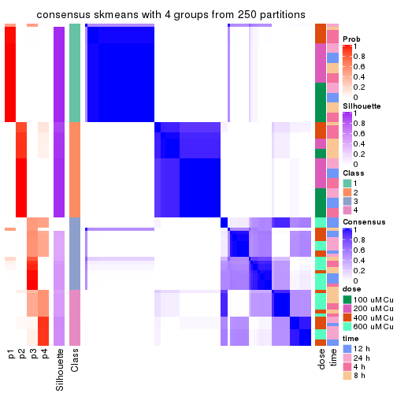</p>

</div>
<div id='tab-SD-skmeans-consensus-heatmap-4'>
<pre><code class="r">consensus_heatmap(res, k = 5)
</code></pre>

<p></p>

</div>
<div id='tab-SD-skmeans-consensus-heatmap-5'>
<pre><code class="r">consensus_heatmap(res, k = 6)
</code></pre>

<p>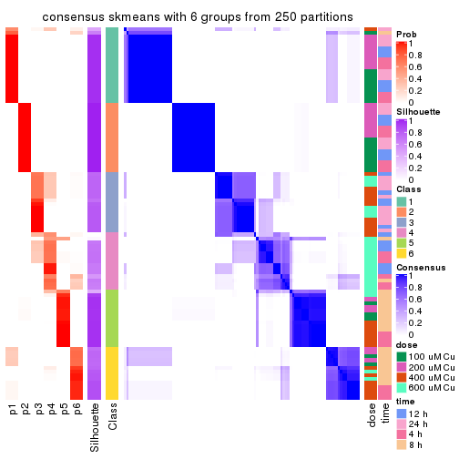</p>

</div>
</div>

Heatmaps for the membership of samples in all partitions to see how consistent they are:


<script>
$( function() {
	$( '#tabs-SD-skmeans-membership-heatmap' ).tabs();
} );
</script>
<div id='tabs-SD-skmeans-membership-heatmap'>
<ul>
<li><a href='#tab-SD-skmeans-membership-heatmap-1'>k = 2</a></li>
<li><a href='#tab-SD-skmeans-membership-heatmap-2'>k = 3</a></li>
<li><a href='#tab-SD-skmeans-membership-heatmap-3'>k = 4</a></li>
<li><a href='#tab-SD-skmeans-membership-heatmap-4'>k = 5</a></li>
<li><a href='#tab-SD-skmeans-membership-heatmap-5'>k = 6</a></li>
</ul>
<div id='tab-SD-skmeans-membership-heatmap-1'>
<pre><code class="r">membership_heatmap(res, k = 2)
</code></pre>

<p></p>

</div>
<div id='tab-SD-skmeans-membership-heatmap-2'>
<pre><code class="r">membership_heatmap(res, k = 3)
</code></pre>

<p></p>

</div>
<div id='tab-SD-skmeans-membership-heatmap-3'>
<pre><code class="r">membership_heatmap(res, k = 4)
</code></pre>

<p></p>

</div>
<div id='tab-SD-skmeans-membership-heatmap-4'>
<pre><code class="r">membership_heatmap(res, k = 5)
</code></pre>

<p></p>

</div>
<div id='tab-SD-skmeans-membership-heatmap-5'>
<pre><code class="r">membership_heatmap(res, k = 6)
</code></pre>

<p></p>

</div>
</div>

As soon as we have had the classes for columns, we can look for signatures
which are significantly different between classes which can be candidate marks
for certain classes. Following are the heatmaps for signatures.


Signature heatmaps where rows are scaled:


<script>
$( function() {
	$( '#tabs-SD-skmeans-get-signatures' ).tabs();
} );
</script>
<div id='tabs-SD-skmeans-get-signatures'>
<ul>
<li><a href='#tab-SD-skmeans-get-signatures-1'>k = 2</a></li>
<li><a href='#tab-SD-skmeans-get-signatures-2'>k = 3</a></li>
<li><a href='#tab-SD-skmeans-get-signatures-3'>k = 4</a></li>
<li><a href='#tab-SD-skmeans-get-signatures-4'>k = 5</a></li>
<li><a href='#tab-SD-skmeans-get-signatures-5'>k = 6</a></li>
</ul>
<div id='tab-SD-skmeans-get-signatures-1'>
<pre><code class="r">get_signatures(res, k = 2)
</code></pre>

<p></p>

</div>
<div id='tab-SD-skmeans-get-signatures-2'>
<pre><code class="r">get_signatures(res, k = 3)
</code></pre>

<p></p>

</div>
<div id='tab-SD-skmeans-get-signatures-3'>
<pre><code class="r">get_signatures(res, k = 4)
</code></pre>

<p></p>

</div>
<div id='tab-SD-skmeans-get-signatures-4'>
<pre><code class="r">get_signatures(res, k = 5)
</code></pre>

<p></p>

</div>
<div id='tab-SD-skmeans-get-signatures-5'>
<pre><code class="r">get_signatures(res, k = 6)
</code></pre>

<p></p>

</div>
</div>


Signature heatmaps where rows are not scaled:


<script>
$( function() {
	$( '#tabs-SD-skmeans-get-signatures-no-scale' ).tabs();
} );
</script>
<div id='tabs-SD-skmeans-get-signatures-no-scale'>
<ul>
<li><a href='#tab-SD-skmeans-get-signatures-no-scale-1'>k = 2</a></li>
<li><a href='#tab-SD-skmeans-get-signatures-no-scale-2'>k = 3</a></li>
<li><a href='#tab-SD-skmeans-get-signatures-no-scale-3'>k = 4</a></li>
<li><a href='#tab-SD-skmeans-get-signatures-no-scale-4'>k = 5</a></li>
<li><a href='#tab-SD-skmeans-get-signatures-no-scale-5'>k = 6</a></li>
</ul>
<div id='tab-SD-skmeans-get-signatures-no-scale-1'>
<pre><code class="r">get_signatures(res, k = 2, scale_rows = FALSE)
</code></pre>

<p></p>

</div>
<div id='tab-SD-skmeans-get-signatures-no-scale-2'>
<pre><code class="r">get_signatures(res, k = 3, scale_rows = FALSE)
</code></pre>

<p></p>

</div>
<div id='tab-SD-skmeans-get-signatures-no-scale-3'>
<pre><code class="r">get_signatures(res, k = 4, scale_rows = FALSE)
</code></pre>

<p></p>

</div>
<div id='tab-SD-skmeans-get-signatures-no-scale-4'>
<pre><code class="r">get_signatures(res, k = 5, scale_rows = FALSE)
</code></pre>

<p></p>

</div>
<div id='tab-SD-skmeans-get-signatures-no-scale-5'>
<pre><code class="r">get_signatures(res, k = 6, scale_rows = FALSE)
</code></pre>

<p></p>

</div>
</div>


Compare the overlap of signatures from different k:

```r
compare_signatures(res)
```


`get_signature()` returns a data frame invisibly. TO get the list of signatures, the function
call should be assigned to a variable explicitly. In following code, if `plot` argument is set
to `FALSE`, no heatmap is plotted while only the differential analysis is performed.

```r
# code only for demonstration
tb = get_signature(res, k = ..., plot = FALSE)
```

An example of the output of `tb` is:

```
#>   which_row         fdr    mean_1    mean_2 scaled_mean_1 scaled_mean_2 km
#> 1        38 0.042760348  8.373488  9.131774    -0.5533452     0.5164555  1
#> 2        40 0.018707592  7.106213  8.469186    -0.6173731     0.5762149  1
#> 3        55 0.019134737 10.221463 11.207825    -0.6159697     0.5749050  1
#> 4        59 0.006059896  5.921854  7.869574    -0.6899429     0.6439467  1
#> 5        60 0.018055526  8.928898 10.211722    -0.6204761     0.5791110  1
#> 6        98 0.009384629 15.714769 14.887706     0.6635654    -0.6193277  2
...
```

The columns in `tb` are:

1. `which_row`: row indices corresponding to the input matrix.
2. `fdr`: FDR for the differential test. 
3. `mean_x`: The mean value in group x.
4. `scaled_mean_x`: The mean value in group x after rows are scaled.
5. `km`: Row groups if k-means clustering is applied to rows.


UMAP plot which shows how samples are separated.


<script>
$( function() {
	$( '#tabs-SD-skmeans-dimension-reduction' ).tabs();
} );
</script>
<div id='tabs-SD-skmeans-dimension-reduction'>
<ul>
<li><a href='#tab-SD-skmeans-dimension-reduction-1'>k = 2</a></li>
<li><a href='#tab-SD-skmeans-dimension-reduction-2'>k = 3</a></li>
<li><a href='#tab-SD-skmeans-dimension-reduction-3'>k = 4</a></li>
<li><a href='#tab-SD-skmeans-dimension-reduction-4'>k = 5</a></li>
<li><a href='#tab-SD-skmeans-dimension-reduction-5'>k = 6</a></li>
</ul>
<div id='tab-SD-skmeans-dimension-reduction-1'>
<pre><code class="r">dimension_reduction(res, k = 2, method = &quot;UMAP&quot;)
</code></pre>

<p></p>

</div>
<div id='tab-SD-skmeans-dimension-reduction-2'>
<pre><code class="r">dimension_reduction(res, k = 3, method = &quot;UMAP&quot;)
</code></pre>

<p></p>

</div>
<div id='tab-SD-skmeans-dimension-reduction-3'>
<pre><code class="r">dimension_reduction(res, k = 4, method = &quot;UMAP&quot;)
</code></pre>

<p></p>

</div>
<div id='tab-SD-skmeans-dimension-reduction-4'>
<pre><code class="r">dimension_reduction(res, k = 5, method = &quot;UMAP&quot;)
</code></pre>

<p></p>

</div>
<div id='tab-SD-skmeans-dimension-reduction-5'>
<pre><code class="r">dimension_reduction(res, k = 6, method = &quot;UMAP&quot;)
</code></pre>

<p></p>

</div>
</div>


Following heatmap shows how subgroups are split when increasing `k`:

```r
collect_classes(res)
```


Test correlation between subgroups and known annotations. If the known
annotation is numeric, one-way ANOVA test is applied, and if the known
annotation is discrete, chi-squared contingency table test is applied.

```r
test_to_known_factors(res)
```

```
#>             n  dose(p)  time(p) k
#> SD:skmeans 98 1.00e+00 1.00e+00 2
#> SD:skmeans 93 3.00e-11 2.30e-01 3
#> SD:skmeans 83 4.27e-11 7.65e-01 4
#> SD:skmeans 83 8.01e-11 2.19e-07 5
#> SD:skmeans 94 1.02e-15 5.91e-11 6
```


If matrix rows can be associated to genes, consider to use `GO_Enrichment(res,
...)` to perform function enrichment for the signature genes.


 

---------------------------------------------------


### SD:pam*


The object with results only for a single top-value method and a single partition method 
can be extracted as:

```r
res = res_list["SD", "pam"]
# you can also extract it by
# res = res_list["SD:pam"]
```

A summary of `res` and all the functions that can be applied to it:

```r
res
```

```
#> A 'ConsensusPartition' object with k = 2, 3, 4, 5, 6.
#>   On a matrix with 16250 rows and 98 columns.
#>   Top rows (1000, 2000, 3000, 4000, 5000) are extracted by 'SD' method.
#>   Subgroups are detected by 'pam' method.
#>   Performed in total 1250 partitions by row resampling.
#>   Best k for subgroups seems to be 6.
#> 
#> Following methods can be applied to this 'ConsensusPartition' object:
#>  [1] "cola_report"             "collect_classes"         "collect_plots"          
#>  [4] "collect_stats"           "colnames"                "compare_signatures"     
#>  [7] "consensus_heatmap"       "dimension_reduction"     "functional_enrichment"  
#> [10] "get_anno_col"            "get_anno"                "get_classes"            
#> [13] "get_consensus"           "get_matrix"              "get_membership"         
#> [16] "get_param"               "get_signatures"          "get_stats"              
#> [19] "is_best_k"               "is_stable_k"             "membership_heatmap"     
#> [22] "ncol"                    "nrow"                    "plot_ecdf"              
#> [25] "rownames"                "select_partition_number" "show"                   
#> [28] "suggest_best_k"          "test_to_known_factors"
```

`collect_plots()` function collects all the plots made from `res` for all `k` (number of partitions)
into one single page to provide an easy and fast comparison between different `k`.

```r
collect_plots(res)
```


The plots are:

- The first row: a plot of the ECDF (Empirical cumulative distribution
  function) curves of the consensus matrix for each `k` and the heatmap of
  predicted classes for each `k`.
- The second row: heatmaps of the consensus matrix for each `k`.
- The third row: heatmaps of the membership matrix for each `k`.
- The fouth row: heatmaps of the signatures for each `k`.

All the plots in panels can be made by individual functions and they are
plotted later in this section.

`select_partition_number()` produces several plots showing different
statistics for choosing "optimized" `k`. There are following statistics:

- ECDF curves of the consensus matrix for each `k`;
- 1-PAC. [The PAC
  score](https://en.wikipedia.org/wiki/Consensus_clustering#Over-interpretation_potential_of_consensus_clustering)
  measures the proportion of the ambiguous subgrouping.
- Mean silhouette score.
- Concordance. The mean probability of fiting the consensus class ids in all
  partitions.
- Area increased. Denote $A_k$ as the area under the ECDF curve for current
  `k`, the area increased is defined as $A_k - A_{k-1}$.
- Rand index. The percent of pairs of samples that are both in a same cluster
  or both are not in a same cluster in the partition of k and k-1.
- Jaccard index. The ratio of pairs of samples are both in a same cluster in
  the partition of k and k-1 and the pairs of samples are both in a same
  cluster in the partition k or k-1.

The detailed explanations of these statistics can be found in [the cola
vignette](http://bioconductor.org/packages/devel/bioc/vignettes/cola/inst/doc/cola.html#toc_13).

Generally speaking, lower PAC score, higher mean silhouette score or higher
concordance corresponds to better partition. Rand index and Jaccard index
measure how similar the current partition is compared to partition with `k-1`.
If they are too similar, we won't accept `k` is better than `k-1`.

```r
select_partition_number(res)
```


The numeric values for all these statistics can be obtained by `get_stats()`.

```r
get_stats(res)
```

```
#>   k 1-PAC mean_silhouette concordance area_increased  Rand Jaccard
#> 2 2 0.547           0.886       0.930         0.5016 0.497   0.497
#> 3 3 0.885           0.941       0.970         0.3303 0.743   0.527
#> 4 4 0.685           0.787       0.828         0.1062 0.902   0.713
#> 5 5 0.920           0.902       0.955         0.0872 0.922   0.701
#> 6 6 0.920           0.879       0.947         0.0217 0.944   0.741
```

`suggest_best_k()` suggests the best $k$ based on these statistics. The rules are as follows:

- All $k$ with Jaccard index larger than 0.95 are removed because the increase of
  the partition number does not provides enough extra information. If all $k$ are removed,
  the best $k$ is assigned by `NA`.
- For $k$ with 1-PAC larger than 0.9, the maximal $k$ is taken as the "best k". Other $k$ is called "optional k".
- If it does not fit the second rule. The $k$ with the highest vote of highest
  1-PAC, mean silhouette and concordance is taken as the "best k".

```r
suggest_best_k(res)
```

```
#> [1] 6
#> attr(,"optional")
#> [1] 5
```

There is also optional best $k$ = 5 that is worth to check.

Following shows the table of the partitions (You need to click the **show/hide
code output** link to see it). The membership matrix (columns with name `p*`)
is inferred by
[`clue::cl_consensus()`](https://www.rdocumentation.org/link/cl_consensus?package=clue)
function with the `SE` method. Basically the value in the membership matrix
represents the probability to belong to a certain group. The finall class
label for an item is determined with the group with highest probability it
belongs to.

In `get_classes()` function, the entropy is calculated from the membership
matrix and the silhouette score is calculated from the consensus matrix.


<script>
$( function() {
	$( '#tabs-SD-pam-get-classes' ).tabs();
} );
</script>
<div id='tabs-SD-pam-get-classes'>
<ul>
<li><a href='#tab-SD-pam-get-classes-1'>k = 2</a></li>
<li><a href='#tab-SD-pam-get-classes-2'>k = 3</a></li>
<li><a href='#tab-SD-pam-get-classes-3'>k = 4</a></li>
<li><a href='#tab-SD-pam-get-classes-4'>k = 5</a></li>
<li><a href='#tab-SD-pam-get-classes-5'>k = 6</a></li>
</ul>

<div id='tab-SD-pam-get-classes-1'>
<p><a id='tab-SD-pam-get-classes-1-a' style='color:#0366d6' href='#'>show/hide code output</a></p>
<pre><code class="r">cbind(get_classes(res, k = 2), get_membership(res, k = 2))
</code></pre>

<pre><code>#&gt;           class entropy silhouette    p1    p2
#&gt; GSM241451     2  0.6343      0.885 0.160 0.840
#&gt; GSM241452     1  0.0000      0.937 1.000 0.000
#&gt; GSM241453     2  0.6343      0.885 0.160 0.840
#&gt; GSM241454     1  0.0000      0.937 1.000 0.000
#&gt; GSM241455     2  0.6343      0.885 0.160 0.840
#&gt; GSM241456     1  0.0000      0.937 1.000 0.000
#&gt; GSM241457     2  0.6343      0.885 0.160 0.840
#&gt; GSM241458     1  0.0000      0.937 1.000 0.000
#&gt; GSM241459     2  0.6343      0.885 0.160 0.840
#&gt; GSM241460     1  0.0000      0.937 1.000 0.000
#&gt; GSM241461     2  0.6343      0.885 0.160 0.840
#&gt; GSM241462     1  0.0000      0.937 1.000 0.000
#&gt; GSM241463     2  0.6343      0.885 0.160 0.840
#&gt; GSM241464     1  0.0000      0.937 1.000 0.000
#&gt; GSM241465     2  0.6343      0.885 0.160 0.840
#&gt; GSM241466     1  0.0000      0.937 1.000 0.000
#&gt; GSM241467     1  0.0000      0.937 1.000 0.000
#&gt; GSM241468     2  0.6343      0.885 0.160 0.840
#&gt; GSM241469     1  0.0000      0.937 1.000 0.000
#&gt; GSM241470     2  0.6343      0.885 0.160 0.840
#&gt; GSM241471     2  0.6343      0.885 0.160 0.840
#&gt; GSM241472     1  0.0000      0.937 1.000 0.000
#&gt; GSM241473     2  0.6343      0.885 0.160 0.840
#&gt; GSM241474     1  0.0000      0.937 1.000 0.000
#&gt; GSM241475     2  0.6343      0.885 0.160 0.840
#&gt; GSM241476     1  0.0000      0.937 1.000 0.000
#&gt; GSM241477     2  0.6343      0.885 0.160 0.840
#&gt; GSM241478     2  0.6343      0.885 0.160 0.840
#&gt; GSM241479     1  0.0000      0.937 1.000 0.000
#&gt; GSM241480     1  0.0000      0.937 1.000 0.000
#&gt; GSM241481     2  0.6343      0.885 0.160 0.840
#&gt; GSM241482     1  0.0000      0.937 1.000 0.000
#&gt; GSM241483     2  0.6343      0.885 0.160 0.840
#&gt; GSM241484     1  0.0000      0.937 1.000 0.000
#&gt; GSM241485     1  0.0000      0.937 1.000 0.000
#&gt; GSM241486     2  0.6343      0.885 0.160 0.840
#&gt; GSM241487     2  0.0000      0.904 0.000 1.000
#&gt; GSM241488     2  0.6343      0.885 0.160 0.840
#&gt; GSM241489     1  0.0000      0.937 1.000 0.000
#&gt; GSM241490     1  0.0000      0.937 1.000 0.000
#&gt; GSM241491     2  0.6343      0.885 0.160 0.840
#&gt; GSM241492     1  0.0000      0.937 1.000 0.000
#&gt; GSM241493     2  0.6343      0.885 0.160 0.840
#&gt; GSM241494     1  0.0000      0.937 1.000 0.000
#&gt; GSM241495     2  0.6343      0.885 0.160 0.840
#&gt; GSM241496     2  0.6343      0.885 0.160 0.840
#&gt; GSM241497     1  0.0000      0.937 1.000 0.000
#&gt; GSM241498     1  0.0000      0.937 1.000 0.000
#&gt; GSM241499     1  0.0000      0.937 1.000 0.000
#&gt; GSM241500     2  0.0000      0.904 0.000 1.000
#&gt; GSM241501     2  0.0000      0.904 0.000 1.000
#&gt; GSM241502     2  0.3879      0.897 0.076 0.924
#&gt; GSM241503     1  0.0000      0.937 1.000 0.000
#&gt; GSM241504     1  0.0000      0.937 1.000 0.000
#&gt; GSM241505     1  0.0000      0.937 1.000 0.000
#&gt; GSM241506     2  0.0000      0.904 0.000 1.000
#&gt; GSM241507     1  0.0000      0.937 1.000 0.000
#&gt; GSM241508     2  0.0000      0.904 0.000 1.000
#&gt; GSM241509     2  0.0000      0.904 0.000 1.000
#&gt; GSM241510     2  0.0000      0.904 0.000 1.000
#&gt; GSM241511     1  0.5059      0.872 0.888 0.112
#&gt; GSM241512     1  0.7219      0.809 0.800 0.200
#&gt; GSM241513     2  0.0000      0.904 0.000 1.000
#&gt; GSM241514     1  0.6343      0.840 0.840 0.160
#&gt; GSM241515     2  0.0000      0.904 0.000 1.000
#&gt; GSM241516     1  0.6343      0.840 0.840 0.160
#&gt; GSM241517     2  0.0000      0.904 0.000 1.000
#&gt; GSM241518     1  0.9850      0.417 0.572 0.428
#&gt; GSM241519     2  0.0000      0.904 0.000 1.000
#&gt; GSM241520     1  0.0672      0.934 0.992 0.008
#&gt; GSM241521     2  0.0000      0.904 0.000 1.000
#&gt; GSM241522     1  0.0000      0.937 1.000 0.000
#&gt; GSM241523     2  0.0000      0.904 0.000 1.000
#&gt; GSM241524     1  0.0672      0.934 0.992 0.008
#&gt; GSM241525     1  0.0376      0.936 0.996 0.004
#&gt; GSM241526     2  0.0000      0.904 0.000 1.000
#&gt; GSM241527     1  0.6343      0.840 0.840 0.160
#&gt; GSM241528     2  0.0000      0.904 0.000 1.000
#&gt; GSM241529     2  0.0000      0.904 0.000 1.000
#&gt; GSM241530     1  0.6247      0.843 0.844 0.156
#&gt; GSM241531     1  0.6343      0.840 0.840 0.160
#&gt; GSM241532     2  0.0000      0.904 0.000 1.000
#&gt; GSM241533     2  0.0000      0.904 0.000 1.000
#&gt; GSM241534     2  0.0000      0.904 0.000 1.000
#&gt; GSM241535     2  0.2043      0.886 0.032 0.968
#&gt; GSM241536     1  0.6247      0.843 0.844 0.156
#&gt; GSM241537     2  0.0000      0.904 0.000 1.000
#&gt; GSM241538     2  0.9775      0.121 0.412 0.588
#&gt; GSM241539     2  0.0000      0.904 0.000 1.000
#&gt; GSM241540     1  0.6343      0.840 0.840 0.160
#&gt; GSM241541     2  0.0000      0.904 0.000 1.000
#&gt; GSM241542     2  0.2043      0.886 0.032 0.968
#&gt; GSM241543     2  0.0000      0.904 0.000 1.000
#&gt; GSM241544     1  0.6343      0.840 0.840 0.160
#&gt; GSM241545     2  0.0000      0.904 0.000 1.000
#&gt; GSM241546     1  0.6343      0.840 0.840 0.160
#&gt; GSM241547     2  0.0000      0.904 0.000 1.000
#&gt; GSM241548     1  0.9710      0.487 0.600 0.400
</code></pre>

<script>
$('#tab-SD-pam-get-classes-1-a').parent().next().next().hide();
$('#tab-SD-pam-get-classes-1-a').click(function(){
  $('#tab-SD-pam-get-classes-1-a').parent().next().next().toggle();
  return(false);
});
</script>
</div>

<div id='tab-SD-pam-get-classes-2'>
<p><a id='tab-SD-pam-get-classes-2-a' style='color:#0366d6' href='#'>show/hide code output</a></p>
<pre><code class="r">cbind(get_classes(res, k = 3), get_membership(res, k = 3))
</code></pre>

<pre><code>#&gt;           class entropy silhouette    p1    p2    p3
#&gt; GSM241451     2  0.0000      0.951 0.000 1.000 0.000
#&gt; GSM241452     1  0.0000      1.000 1.000 0.000 0.000
#&gt; GSM241453     2  0.0000      0.951 0.000 1.000 0.000
#&gt; GSM241454     1  0.0000      1.000 1.000 0.000 0.000
#&gt; GSM241455     2  0.0000      0.951 0.000 1.000 0.000
#&gt; GSM241456     1  0.0000      1.000 1.000 0.000 0.000
#&gt; GSM241457     2  0.0000      0.951 0.000 1.000 0.000
#&gt; GSM241458     1  0.0000      1.000 1.000 0.000 0.000
#&gt; GSM241459     2  0.0000      0.951 0.000 1.000 0.000
#&gt; GSM241460     1  0.0000      1.000 1.000 0.000 0.000
#&gt; GSM241461     2  0.0000      0.951 0.000 1.000 0.000
#&gt; GSM241462     1  0.0000      1.000 1.000 0.000 0.000
#&gt; GSM241463     2  0.0000      0.951 0.000 1.000 0.000
#&gt; GSM241464     1  0.0000      1.000 1.000 0.000 0.000
#&gt; GSM241465     2  0.0000      0.951 0.000 1.000 0.000
#&gt; GSM241466     1  0.0000      1.000 1.000 0.000 0.000
#&gt; GSM241467     1  0.0000      1.000 1.000 0.000 0.000
#&gt; GSM241468     2  0.0000      0.951 0.000 1.000 0.000
#&gt; GSM241469     1  0.0000      1.000 1.000 0.000 0.000
#&gt; GSM241470     2  0.0000      0.951 0.000 1.000 0.000
#&gt; GSM241471     2  0.0000      0.951 0.000 1.000 0.000
#&gt; GSM241472     1  0.0000      1.000 1.000 0.000 0.000
#&gt; GSM241473     2  0.0000      0.951 0.000 1.000 0.000
#&gt; GSM241474     1  0.0000      1.000 1.000 0.000 0.000
#&gt; GSM241475     2  0.0000      0.951 0.000 1.000 0.000
#&gt; GSM241476     1  0.0000      1.000 1.000 0.000 0.000
#&gt; GSM241477     2  0.0000      0.951 0.000 1.000 0.000
#&gt; GSM241478     2  0.0000      0.951 0.000 1.000 0.000
#&gt; GSM241479     1  0.0000      1.000 1.000 0.000 0.000
#&gt; GSM241480     1  0.0000      1.000 1.000 0.000 0.000
#&gt; GSM241481     2  0.0000      0.951 0.000 1.000 0.000
#&gt; GSM241482     1  0.0000      1.000 1.000 0.000 0.000
#&gt; GSM241483     2  0.0000      0.951 0.000 1.000 0.000
#&gt; GSM241484     1  0.0000      1.000 1.000 0.000 0.000
#&gt; GSM241485     1  0.0000      1.000 1.000 0.000 0.000
#&gt; GSM241486     2  0.0000      0.951 0.000 1.000 0.000
#&gt; GSM241487     2  0.0000      0.951 0.000 1.000 0.000
#&gt; GSM241488     2  0.0000      0.951 0.000 1.000 0.000
#&gt; GSM241489     1  0.0000      1.000 1.000 0.000 0.000
#&gt; GSM241490     1  0.0000      1.000 1.000 0.000 0.000
#&gt; GSM241491     2  0.0000      0.951 0.000 1.000 0.000
#&gt; GSM241492     1  0.0000      1.000 1.000 0.000 0.000
#&gt; GSM241493     2  0.0000      0.951 0.000 1.000 0.000
#&gt; GSM241494     1  0.0000      1.000 1.000 0.000 0.000
#&gt; GSM241495     2  0.0000      0.951 0.000 1.000 0.000
#&gt; GSM241496     2  0.0000      0.951 0.000 1.000 0.000
#&gt; GSM241497     1  0.0000      1.000 1.000 0.000 0.000
#&gt; GSM241498     1  0.0000      1.000 1.000 0.000 0.000
#&gt; GSM241499     1  0.0000      1.000 1.000 0.000 0.000
#&gt; GSM241500     2  0.0000      0.951 0.000 1.000 0.000
#&gt; GSM241501     2  0.0000      0.951 0.000 1.000 0.000
#&gt; GSM241502     2  0.0000      0.951 0.000 1.000 0.000
#&gt; GSM241503     1  0.0000      1.000 1.000 0.000 0.000
#&gt; GSM241504     1  0.0000      1.000 1.000 0.000 0.000
#&gt; GSM241505     1  0.0000      1.000 1.000 0.000 0.000
#&gt; GSM241506     2  0.0000      0.951 0.000 1.000 0.000
#&gt; GSM241507     1  0.0000      1.000 1.000 0.000 0.000
#&gt; GSM241508     2  0.0000      0.951 0.000 1.000 0.000
#&gt; GSM241509     2  0.1643      0.925 0.000 0.956 0.044
#&gt; GSM241510     2  0.4842      0.769 0.000 0.776 0.224
#&gt; GSM241511     3  0.4002      0.798 0.160 0.000 0.840
#&gt; GSM241512     3  0.0000      0.958 0.000 0.000 1.000
#&gt; GSM241513     3  0.0000      0.958 0.000 0.000 1.000
#&gt; GSM241514     3  0.0000      0.958 0.000 0.000 1.000
#&gt; GSM241515     3  0.1163      0.936 0.000 0.028 0.972
#&gt; GSM241516     3  0.0000      0.958 0.000 0.000 1.000
#&gt; GSM241517     2  0.4605      0.795 0.000 0.796 0.204
#&gt; GSM241518     3  0.0000      0.958 0.000 0.000 1.000
#&gt; GSM241519     2  0.4235      0.825 0.000 0.824 0.176
#&gt; GSM241520     3  0.0000      0.958 0.000 0.000 1.000
#&gt; GSM241521     2  0.4235      0.825 0.000 0.824 0.176
#&gt; GSM241522     3  0.4974      0.696 0.236 0.000 0.764
#&gt; GSM241523     2  0.4235      0.825 0.000 0.824 0.176
#&gt; GSM241524     3  0.0747      0.948 0.016 0.000 0.984
#&gt; GSM241525     3  0.4605      0.743 0.204 0.000 0.796
#&gt; GSM241526     2  0.5016      0.745 0.000 0.760 0.240
#&gt; GSM241527     3  0.0000      0.958 0.000 0.000 1.000
#&gt; GSM241528     2  0.4062      0.835 0.000 0.836 0.164
#&gt; GSM241529     2  0.4399      0.813 0.000 0.812 0.188
#&gt; GSM241530     3  0.0592      0.951 0.012 0.000 0.988
#&gt; GSM241531     3  0.0592      0.951 0.012 0.000 0.988
#&gt; GSM241532     2  0.4555      0.799 0.000 0.800 0.200
#&gt; GSM241533     3  0.4842      0.685 0.000 0.224 0.776
#&gt; GSM241534     3  0.4796      0.692 0.000 0.220 0.780
#&gt; GSM241535     3  0.0000      0.958 0.000 0.000 1.000
#&gt; GSM241536     3  0.0592      0.951 0.012 0.000 0.988
#&gt; GSM241537     3  0.0000      0.958 0.000 0.000 1.000
#&gt; GSM241538     3  0.0000      0.958 0.000 0.000 1.000
#&gt; GSM241539     3  0.0000      0.958 0.000 0.000 1.000
#&gt; GSM241540     3  0.0000      0.958 0.000 0.000 1.000
#&gt; GSM241541     3  0.0000      0.958 0.000 0.000 1.000
#&gt; GSM241542     3  0.0000      0.958 0.000 0.000 1.000
#&gt; GSM241543     3  0.0000      0.958 0.000 0.000 1.000
#&gt; GSM241544     3  0.0000      0.958 0.000 0.000 1.000
#&gt; GSM241545     3  0.0237      0.955 0.000 0.004 0.996
#&gt; GSM241546     3  0.0000      0.958 0.000 0.000 1.000
#&gt; GSM241547     3  0.0424      0.953 0.000 0.008 0.992
#&gt; GSM241548     3  0.0000      0.958 0.000 0.000 1.000
</code></pre>

<script>
$('#tab-SD-pam-get-classes-2-a').parent().next().next().hide();
$('#tab-SD-pam-get-classes-2-a').click(function(){
  $('#tab-SD-pam-get-classes-2-a').parent().next().next().toggle();
  return(false);
});
</script>
</div>

<div id='tab-SD-pam-get-classes-3'>
<p><a id='tab-SD-pam-get-classes-3-a' style='color:#0366d6' href='#'>show/hide code output</a></p>
<pre><code class="r">cbind(get_classes(res, k = 4), get_membership(res, k = 4))
</code></pre>

<pre><code>#&gt;           class entropy silhouette    p1    p2    p3    p4
#&gt; GSM241451     2  0.0000      0.935 0.000 1.000 0.000 0.000
#&gt; GSM241452     1  0.0000      0.886 1.000 0.000 0.000 0.000
#&gt; GSM241453     2  0.0000      0.935 0.000 1.000 0.000 0.000
#&gt; GSM241454     1  0.0000      0.886 1.000 0.000 0.000 0.000
#&gt; GSM241455     2  0.0000      0.935 0.000 1.000 0.000 0.000
#&gt; GSM241456     1  0.0000      0.886 1.000 0.000 0.000 0.000
#&gt; GSM241457     4  0.4898      0.780 0.000 0.416 0.000 0.584
#&gt; GSM241458     1  0.4522      0.718 0.680 0.000 0.000 0.320
#&gt; GSM241459     4  0.4898      0.780 0.000 0.416 0.000 0.584
#&gt; GSM241460     1  0.0000      0.886 1.000 0.000 0.000 0.000
#&gt; GSM241461     4  0.4898      0.780 0.000 0.416 0.000 0.584
#&gt; GSM241462     1  0.4040      0.760 0.752 0.000 0.000 0.248
#&gt; GSM241463     2  0.0000      0.935 0.000 1.000 0.000 0.000
#&gt; GSM241464     1  0.0000      0.886 1.000 0.000 0.000 0.000
#&gt; GSM241465     2  0.0000      0.935 0.000 1.000 0.000 0.000
#&gt; GSM241466     1  0.0000      0.886 1.000 0.000 0.000 0.000
#&gt; GSM241467     1  0.0000      0.886 1.000 0.000 0.000 0.000
#&gt; GSM241468     2  0.0000      0.935 0.000 1.000 0.000 0.000
#&gt; GSM241469     1  0.0000      0.886 1.000 0.000 0.000 0.000
#&gt; GSM241470     2  0.0000      0.935 0.000 1.000 0.000 0.000
#&gt; GSM241471     2  0.0000      0.935 0.000 1.000 0.000 0.000
#&gt; GSM241472     1  0.0000      0.886 1.000 0.000 0.000 0.000
#&gt; GSM241473     2  0.0000      0.935 0.000 1.000 0.000 0.000
#&gt; GSM241474     1  0.0000      0.886 1.000 0.000 0.000 0.000
#&gt; GSM241475     2  0.0000      0.935 0.000 1.000 0.000 0.000
#&gt; GSM241476     1  0.0000      0.886 1.000 0.000 0.000 0.000
#&gt; GSM241477     2  0.0000      0.935 0.000 1.000 0.000 0.000
#&gt; GSM241478     2  0.0000      0.935 0.000 1.000 0.000 0.000
#&gt; GSM241479     1  0.0000      0.886 1.000 0.000 0.000 0.000
#&gt; GSM241480     1  0.0000      0.886 1.000 0.000 0.000 0.000
#&gt; GSM241481     4  0.4916      0.770 0.000 0.424 0.000 0.576
#&gt; GSM241482     1  0.0188      0.885 0.996 0.000 0.000 0.004
#&gt; GSM241483     4  0.4898      0.780 0.000 0.416 0.000 0.584
#&gt; GSM241484     1  0.4790      0.676 0.620 0.000 0.000 0.380
#&gt; GSM241485     1  0.4040      0.760 0.752 0.000 0.000 0.248
#&gt; GSM241486     4  0.4898      0.780 0.000 0.416 0.000 0.584
#&gt; GSM241487     2  0.0000      0.935 0.000 1.000 0.000 0.000
#&gt; GSM241488     2  0.0000      0.935 0.000 1.000 0.000 0.000
#&gt; GSM241489     1  0.0000      0.886 1.000 0.000 0.000 0.000
#&gt; GSM241490     1  0.0000      0.886 1.000 0.000 0.000 0.000
#&gt; GSM241491     2  0.0000      0.935 0.000 1.000 0.000 0.000
#&gt; GSM241492     1  0.0000      0.886 1.000 0.000 0.000 0.000
#&gt; GSM241493     2  0.0000      0.935 0.000 1.000 0.000 0.000
#&gt; GSM241494     1  0.0000      0.886 1.000 0.000 0.000 0.000
#&gt; GSM241495     2  0.0000      0.935 0.000 1.000 0.000 0.000
#&gt; GSM241496     2  0.0000      0.935 0.000 1.000 0.000 0.000
#&gt; GSM241497     1  0.0000      0.886 1.000 0.000 0.000 0.000
#&gt; GSM241498     1  0.0000      0.886 1.000 0.000 0.000 0.000
#&gt; GSM241499     1  0.4790      0.676 0.620 0.000 0.000 0.380
#&gt; GSM241500     4  0.4888      0.780 0.000 0.412 0.000 0.588
#&gt; GSM241501     4  0.4898      0.780 0.000 0.416 0.000 0.584
#&gt; GSM241502     4  0.4898      0.780 0.000 0.416 0.000 0.584
#&gt; GSM241503     1  0.4790      0.676 0.620 0.000 0.000 0.380
#&gt; GSM241504     1  0.4790      0.676 0.620 0.000 0.000 0.380
#&gt; GSM241505     1  0.4790      0.676 0.620 0.000 0.000 0.380
#&gt; GSM241506     4  0.4898      0.780 0.000 0.416 0.000 0.584
#&gt; GSM241507     1  0.4790      0.676 0.620 0.000 0.000 0.380
#&gt; GSM241508     4  0.4888      0.780 0.000 0.412 0.000 0.588
#&gt; GSM241509     4  0.5527      0.764 0.000 0.356 0.028 0.616
#&gt; GSM241510     4  0.6709      0.671 0.000 0.212 0.172 0.616
#&gt; GSM241511     3  0.4804      0.692 0.000 0.000 0.616 0.384
#&gt; GSM241512     3  0.4454      0.727 0.000 0.000 0.692 0.308
#&gt; GSM241513     3  0.3726      0.639 0.000 0.212 0.788 0.000
#&gt; GSM241514     3  0.3726      0.758 0.212 0.000 0.788 0.000
#&gt; GSM241515     3  0.3726      0.639 0.000 0.212 0.788 0.000
#&gt; GSM241516     3  0.3764      0.756 0.216 0.000 0.784 0.000
#&gt; GSM241517     2  0.3649      0.657 0.000 0.796 0.204 0.000
#&gt; GSM241518     3  0.3726      0.758 0.212 0.000 0.788 0.000
#&gt; GSM241519     2  0.3311      0.703 0.000 0.828 0.172 0.000
#&gt; GSM241520     3  0.3726      0.758 0.212 0.000 0.788 0.000
#&gt; GSM241521     2  0.3311      0.703 0.000 0.828 0.172 0.000
#&gt; GSM241522     3  0.4804      0.555 0.384 0.000 0.616 0.000
#&gt; GSM241523     2  0.3400      0.693 0.000 0.820 0.180 0.000
#&gt; GSM241524     3  0.3942      0.743 0.236 0.000 0.764 0.000
#&gt; GSM241525     3  0.4804      0.692 0.000 0.000 0.616 0.384
#&gt; GSM241526     4  0.5573      0.519 0.000 0.028 0.368 0.604
#&gt; GSM241527     3  0.4804      0.692 0.000 0.000 0.616 0.384
#&gt; GSM241528     4  0.6591      0.649 0.000 0.424 0.080 0.496
#&gt; GSM241529     4  0.6933      0.662 0.000 0.300 0.140 0.560
#&gt; GSM241530     3  0.4804      0.692 0.000 0.000 0.616 0.384
#&gt; GSM241531     3  0.4804      0.692 0.000 0.000 0.616 0.384
#&gt; GSM241532     4  0.5189      0.519 0.000 0.012 0.372 0.616
#&gt; GSM241533     4  0.5174      0.520 0.000 0.012 0.368 0.620
#&gt; GSM241534     4  0.4790      0.501 0.000 0.000 0.380 0.620
#&gt; GSM241535     3  0.2647      0.753 0.000 0.000 0.880 0.120
#&gt; GSM241536     3  0.4804      0.692 0.000 0.000 0.616 0.384
#&gt; GSM241537     3  0.1022      0.756 0.000 0.000 0.968 0.032
#&gt; GSM241538     3  0.0188      0.768 0.000 0.000 0.996 0.004
#&gt; GSM241539     3  0.1022      0.756 0.000 0.000 0.968 0.032
#&gt; GSM241540     3  0.0921      0.770 0.000 0.000 0.972 0.028
#&gt; GSM241541     3  0.1022      0.756 0.000 0.000 0.968 0.032
#&gt; GSM241542     3  0.0188      0.768 0.000 0.000 0.996 0.004
#&gt; GSM241543     3  0.3726      0.639 0.000 0.212 0.788 0.000
#&gt; GSM241544     3  0.3610      0.762 0.200 0.000 0.800 0.000
#&gt; GSM241545     3  0.3726      0.639 0.000 0.212 0.788 0.000
#&gt; GSM241546     3  0.3610      0.762 0.200 0.000 0.800 0.000
#&gt; GSM241547     3  0.0469      0.766 0.000 0.012 0.988 0.000
#&gt; GSM241548     3  0.0000      0.768 0.000 0.000 1.000 0.000
</code></pre>

<script>
$('#tab-SD-pam-get-classes-3-a').parent().next().next().hide();
$('#tab-SD-pam-get-classes-3-a').click(function(){
  $('#tab-SD-pam-get-classes-3-a').parent().next().next().toggle();
  return(false);
});
</script>
</div>

<div id='tab-SD-pam-get-classes-4'>
<p><a id='tab-SD-pam-get-classes-4-a' style='color:#0366d6' href='#'>show/hide code output</a></p>
<pre><code class="r">cbind(get_classes(res, k = 5), get_membership(res, k = 5))
</code></pre>

<pre><code>#&gt;           class entropy silhouette    p1    p2    p3    p4    p5
#&gt; GSM241451     2  0.0000      0.940 0.000 1.000 0.000 0.000 0.000
#&gt; GSM241452     1  0.0000      0.973 1.000 0.000 0.000 0.000 0.000
#&gt; GSM241453     2  0.0000      0.940 0.000 1.000 0.000 0.000 0.000
#&gt; GSM241454     1  0.0000      0.973 1.000 0.000 0.000 0.000 0.000
#&gt; GSM241455     2  0.0000      0.940 0.000 1.000 0.000 0.000 0.000
#&gt; GSM241456     1  0.0000      0.973 1.000 0.000 0.000 0.000 0.000
#&gt; GSM241457     5  0.0404      0.942 0.000 0.012 0.000 0.000 0.988
#&gt; GSM241458     4  0.2605      0.806 0.148 0.000 0.000 0.852 0.000
#&gt; GSM241459     5  0.0404      0.942 0.000 0.012 0.000 0.000 0.988
#&gt; GSM241460     1  0.0000      0.973 1.000 0.000 0.000 0.000 0.000
#&gt; GSM241461     5  0.0290      0.944 0.000 0.008 0.000 0.000 0.992
#&gt; GSM241462     4  0.3109      0.739 0.200 0.000 0.000 0.800 0.000
#&gt; GSM241463     2  0.0000      0.940 0.000 1.000 0.000 0.000 0.000
#&gt; GSM241464     1  0.0000      0.973 1.000 0.000 0.000 0.000 0.000
#&gt; GSM241465     2  0.0000      0.940 0.000 1.000 0.000 0.000 0.000
#&gt; GSM241466     1  0.0000      0.973 1.000 0.000 0.000 0.000 0.000
#&gt; GSM241467     1  0.0000      0.973 1.000 0.000 0.000 0.000 0.000
#&gt; GSM241468     2  0.0000      0.940 0.000 1.000 0.000 0.000 0.000
#&gt; GSM241469     1  0.0000      0.973 1.000 0.000 0.000 0.000 0.000
#&gt; GSM241470     2  0.0000      0.940 0.000 1.000 0.000 0.000 0.000
#&gt; GSM241471     2  0.0000      0.940 0.000 1.000 0.000 0.000 0.000
#&gt; GSM241472     1  0.0000      0.973 1.000 0.000 0.000 0.000 0.000
#&gt; GSM241473     2  0.0000      0.940 0.000 1.000 0.000 0.000 0.000
#&gt; GSM241474     1  0.0000      0.973 1.000 0.000 0.000 0.000 0.000
#&gt; GSM241475     2  0.0000      0.940 0.000 1.000 0.000 0.000 0.000
#&gt; GSM241476     1  0.0000      0.973 1.000 0.000 0.000 0.000 0.000
#&gt; GSM241477     2  0.0000      0.940 0.000 1.000 0.000 0.000 0.000
#&gt; GSM241478     2  0.0000      0.940 0.000 1.000 0.000 0.000 0.000
#&gt; GSM241479     1  0.0000      0.973 1.000 0.000 0.000 0.000 0.000
#&gt; GSM241480     1  0.0000      0.973 1.000 0.000 0.000 0.000 0.000
#&gt; GSM241481     5  0.1732      0.889 0.000 0.080 0.000 0.000 0.920
#&gt; GSM241482     1  0.2179      0.855 0.888 0.000 0.000 0.112 0.000
#&gt; GSM241483     5  0.0290      0.944 0.000 0.008 0.000 0.000 0.992
#&gt; GSM241484     4  0.0510      0.927 0.016 0.000 0.000 0.984 0.000
#&gt; GSM241485     1  0.4161      0.296 0.608 0.000 0.000 0.392 0.000
#&gt; GSM241486     5  0.0290      0.944 0.000 0.008 0.000 0.000 0.992
#&gt; GSM241487     2  0.0000      0.940 0.000 1.000 0.000 0.000 0.000
#&gt; GSM241488     2  0.0000      0.940 0.000 1.000 0.000 0.000 0.000
#&gt; GSM241489     1  0.0000      0.973 1.000 0.000 0.000 0.000 0.000
#&gt; GSM241490     1  0.0000      0.973 1.000 0.000 0.000 0.000 0.000
#&gt; GSM241491     2  0.0000      0.940 0.000 1.000 0.000 0.000 0.000
#&gt; GSM241492     1  0.0000      0.973 1.000 0.000 0.000 0.000 0.000
#&gt; GSM241493     2  0.0000      0.940 0.000 1.000 0.000 0.000 0.000
#&gt; GSM241494     1  0.0000      0.973 1.000 0.000 0.000 0.000 0.000
#&gt; GSM241495     2  0.0000      0.940 0.000 1.000 0.000 0.000 0.000
#&gt; GSM241496     2  0.0000      0.940 0.000 1.000 0.000 0.000 0.000
#&gt; GSM241497     1  0.0000      0.973 1.000 0.000 0.000 0.000 0.000
#&gt; GSM241498     1  0.0000      0.973 1.000 0.000 0.000 0.000 0.000
#&gt; GSM241499     4  0.0510      0.927 0.016 0.000 0.000 0.984 0.000
#&gt; GSM241500     5  0.0290      0.944 0.000 0.008 0.000 0.000 0.992
#&gt; GSM241501     5  0.0290      0.944 0.000 0.008 0.000 0.000 0.992
#&gt; GSM241502     5  0.0290      0.944 0.000 0.008 0.000 0.000 0.992
#&gt; GSM241503     4  0.0510      0.927 0.016 0.000 0.000 0.984 0.000
#&gt; GSM241504     4  0.0510      0.927 0.016 0.000 0.000 0.984 0.000
#&gt; GSM241505     4  0.0510      0.927 0.016 0.000 0.000 0.984 0.000
#&gt; GSM241506     5  0.0290      0.944 0.000 0.008 0.000 0.000 0.992
#&gt; GSM241507     4  0.0510      0.927 0.016 0.000 0.000 0.984 0.000
#&gt; GSM241508     5  0.0290      0.944 0.000 0.008 0.000 0.000 0.992
#&gt; GSM241509     5  0.0290      0.944 0.000 0.008 0.000 0.000 0.992
#&gt; GSM241510     5  0.0290      0.944 0.000 0.008 0.000 0.000 0.992
#&gt; GSM241511     4  0.0000      0.925 0.000 0.000 0.000 1.000 0.000
#&gt; GSM241512     3  0.3336      0.672 0.000 0.000 0.772 0.228 0.000
#&gt; GSM241513     3  0.0404      0.954 0.000 0.012 0.988 0.000 0.000
#&gt; GSM241514     3  0.0404      0.955 0.012 0.000 0.988 0.000 0.000
#&gt; GSM241515     3  0.0404      0.954 0.000 0.012 0.988 0.000 0.000
#&gt; GSM241516     3  0.0510      0.953 0.016 0.000 0.984 0.000 0.000
#&gt; GSM241517     2  0.3684      0.665 0.000 0.720 0.280 0.000 0.000
#&gt; GSM241518     3  0.0404      0.955 0.012 0.000 0.988 0.000 0.000
#&gt; GSM241519     2  0.3684      0.665 0.000 0.720 0.280 0.000 0.000
#&gt; GSM241520     3  0.0290      0.957 0.008 0.000 0.992 0.000 0.000
#&gt; GSM241521     2  0.3684      0.665 0.000 0.720 0.280 0.000 0.000
#&gt; GSM241522     3  0.3999      0.465 0.344 0.000 0.656 0.000 0.000
#&gt; GSM241523     2  0.3684      0.665 0.000 0.720 0.280 0.000 0.000
#&gt; GSM241524     3  0.0290      0.957 0.008 0.000 0.992 0.000 0.000
#&gt; GSM241525     4  0.0000      0.925 0.000 0.000 0.000 1.000 0.000
#&gt; GSM241526     5  0.4444      0.633 0.000 0.012 0.264 0.016 0.708
#&gt; GSM241527     4  0.2230      0.830 0.000 0.000 0.116 0.884 0.000
#&gt; GSM241528     5  0.4901      0.727 0.000 0.184 0.068 0.016 0.732
#&gt; GSM241529     5  0.5154      0.626 0.000 0.052 0.252 0.016 0.680
#&gt; GSM241530     4  0.0000      0.925 0.000 0.000 0.000 1.000 0.000
#&gt; GSM241531     4  0.0000      0.925 0.000 0.000 0.000 1.000 0.000
#&gt; GSM241532     5  0.0000      0.939 0.000 0.000 0.000 0.000 1.000
#&gt; GSM241533     5  0.0000      0.939 0.000 0.000 0.000 0.000 1.000
#&gt; GSM241534     5  0.0000      0.939 0.000 0.000 0.000 0.000 1.000
#&gt; GSM241535     4  0.4446      0.307 0.000 0.000 0.400 0.592 0.008
#&gt; GSM241536     4  0.0000      0.925 0.000 0.000 0.000 1.000 0.000
#&gt; GSM241537     3  0.0290      0.956 0.000 0.000 0.992 0.000 0.008
#&gt; GSM241538     3  0.0798      0.949 0.000 0.000 0.976 0.016 0.008
#&gt; GSM241539     3  0.0290      0.956 0.000 0.000 0.992 0.000 0.008
#&gt; GSM241540     3  0.0798      0.949 0.000 0.000 0.976 0.016 0.008
#&gt; GSM241541     3  0.0290      0.956 0.000 0.000 0.992 0.000 0.008
#&gt; GSM241542     3  0.0798      0.949 0.000 0.000 0.976 0.016 0.008
#&gt; GSM241543     3  0.0290      0.956 0.000 0.008 0.992 0.000 0.000
#&gt; GSM241544     3  0.0000      0.957 0.000 0.000 1.000 0.000 0.000
#&gt; GSM241545     3  0.0290      0.956 0.000 0.008 0.992 0.000 0.000
#&gt; GSM241546     3  0.0162      0.957 0.004 0.000 0.996 0.000 0.000
#&gt; GSM241547     3  0.0290      0.956 0.000 0.008 0.992 0.000 0.000
#&gt; GSM241548     3  0.0000      0.957 0.000 0.000 1.000 0.000 0.000
</code></pre>

<script>
$('#tab-SD-pam-get-classes-4-a').parent().next().next().hide();
$('#tab-SD-pam-get-classes-4-a').click(function(){
  $('#tab-SD-pam-get-classes-4-a').parent().next().next().toggle();
  return(false);
});
</script>
</div>

<div id='tab-SD-pam-get-classes-5'>
<p><a id='tab-SD-pam-get-classes-5-a' style='color:#0366d6' href='#'>show/hide code output</a></p>
<pre><code class="r">cbind(get_classes(res, k = 6), get_membership(res, k = 6))
</code></pre>

<pre><code>#&gt;           class entropy silhouette    p1    p2    p3    p4    p5    p6
#&gt; GSM241451     2  0.0000      0.916 0.000 1.000 0.000 0.000 0.000 0.000
#&gt; GSM241452     1  0.0000      0.947 1.000 0.000 0.000 0.000 0.000 0.000
#&gt; GSM241453     2  0.0000      0.916 0.000 1.000 0.000 0.000 0.000 0.000
#&gt; GSM241454     1  0.0000      0.947 1.000 0.000 0.000 0.000 0.000 0.000
#&gt; GSM241455     2  0.0000      0.916 0.000 1.000 0.000 0.000 0.000 0.000
#&gt; GSM241456     1  0.0000      0.947 1.000 0.000 0.000 0.000 0.000 0.000
#&gt; GSM241457     5  0.0146      0.931 0.000 0.004 0.000 0.000 0.996 0.000
#&gt; GSM241458     6  0.1714      0.857 0.092 0.000 0.000 0.000 0.000 0.908
#&gt; GSM241459     5  0.0146      0.931 0.000 0.004 0.000 0.000 0.996 0.000
#&gt; GSM241460     1  0.0000      0.947 1.000 0.000 0.000 0.000 0.000 0.000
#&gt; GSM241461     5  0.0000      0.933 0.000 0.000 0.000 0.000 1.000 0.000
#&gt; GSM241462     6  0.2793      0.727 0.200 0.000 0.000 0.000 0.000 0.800
#&gt; GSM241463     2  0.0000      0.916 0.000 1.000 0.000 0.000 0.000 0.000
#&gt; GSM241464     1  0.0000      0.947 1.000 0.000 0.000 0.000 0.000 0.000
#&gt; GSM241465     2  0.0000      0.916 0.000 1.000 0.000 0.000 0.000 0.000
#&gt; GSM241466     1  0.0000      0.947 1.000 0.000 0.000 0.000 0.000 0.000
#&gt; GSM241467     1  0.0000      0.947 1.000 0.000 0.000 0.000 0.000 0.000
#&gt; GSM241468     2  0.0000      0.916 0.000 1.000 0.000 0.000 0.000 0.000
#&gt; GSM241469     1  0.0000      0.947 1.000 0.000 0.000 0.000 0.000 0.000
#&gt; GSM241470     2  0.0000      0.916 0.000 1.000 0.000 0.000 0.000 0.000
#&gt; GSM241471     2  0.0000      0.916 0.000 1.000 0.000 0.000 0.000 0.000
#&gt; GSM241472     1  0.0000      0.947 1.000 0.000 0.000 0.000 0.000 0.000
#&gt; GSM241473     2  0.0000      0.916 0.000 1.000 0.000 0.000 0.000 0.000
#&gt; GSM241474     1  0.0000      0.947 1.000 0.000 0.000 0.000 0.000 0.000
#&gt; GSM241475     2  0.0000      0.916 0.000 1.000 0.000 0.000 0.000 0.000
#&gt; GSM241476     1  0.0000      0.947 1.000 0.000 0.000 0.000 0.000 0.000
#&gt; GSM241477     2  0.0000      0.916 0.000 1.000 0.000 0.000 0.000 0.000
#&gt; GSM241478     2  0.0000      0.916 0.000 1.000 0.000 0.000 0.000 0.000
#&gt; GSM241479     1  0.0000      0.947 1.000 0.000 0.000 0.000 0.000 0.000
#&gt; GSM241480     1  0.0000      0.947 1.000 0.000 0.000 0.000 0.000 0.000
#&gt; GSM241481     5  0.1075      0.899 0.000 0.048 0.000 0.000 0.952 0.000
#&gt; GSM241482     1  0.2048      0.833 0.880 0.000 0.000 0.000 0.000 0.120
#&gt; GSM241483     5  0.0000      0.933 0.000 0.000 0.000 0.000 1.000 0.000
#&gt; GSM241484     6  0.0000      0.944 0.000 0.000 0.000 0.000 0.000 1.000
#&gt; GSM241485     1  0.3737      0.290 0.608 0.000 0.000 0.000 0.000 0.392
#&gt; GSM241486     5  0.0000      0.933 0.000 0.000 0.000 0.000 1.000 0.000
#&gt; GSM241487     2  0.0000      0.916 0.000 1.000 0.000 0.000 0.000 0.000
#&gt; GSM241488     2  0.0000      0.916 0.000 1.000 0.000 0.000 0.000 0.000
#&gt; GSM241489     1  0.0000      0.947 1.000 0.000 0.000 0.000 0.000 0.000
#&gt; GSM241490     1  0.0000      0.947 1.000 0.000 0.000 0.000 0.000 0.000
#&gt; GSM241491     2  0.0000      0.916 0.000 1.000 0.000 0.000 0.000 0.000
#&gt; GSM241492     1  0.0000      0.947 1.000 0.000 0.000 0.000 0.000 0.000
#&gt; GSM241493     2  0.0000      0.916 0.000 1.000 0.000 0.000 0.000 0.000
#&gt; GSM241494     1  0.0000      0.947 1.000 0.000 0.000 0.000 0.000 0.000
#&gt; GSM241495     2  0.0000      0.916 0.000 1.000 0.000 0.000 0.000 0.000
#&gt; GSM241496     2  0.0000      0.916 0.000 1.000 0.000 0.000 0.000 0.000
#&gt; GSM241497     1  0.0000      0.947 1.000 0.000 0.000 0.000 0.000 0.000
#&gt; GSM241498     1  0.0000      0.947 1.000 0.000 0.000 0.000 0.000 0.000
#&gt; GSM241499     6  0.0000      0.944 0.000 0.000 0.000 0.000 0.000 1.000
#&gt; GSM241500     5  0.0000      0.933 0.000 0.000 0.000 0.000 1.000 0.000
#&gt; GSM241501     5  0.0000      0.933 0.000 0.000 0.000 0.000 1.000 0.000
#&gt; GSM241502     5  0.0000      0.933 0.000 0.000 0.000 0.000 1.000 0.000
#&gt; GSM241503     6  0.0000      0.944 0.000 0.000 0.000 0.000 0.000 1.000
#&gt; GSM241504     6  0.0000      0.944 0.000 0.000 0.000 0.000 0.000 1.000
#&gt; GSM241505     6  0.0000      0.944 0.000 0.000 0.000 0.000 0.000 1.000
#&gt; GSM241506     5  0.0000      0.933 0.000 0.000 0.000 0.000 1.000 0.000
#&gt; GSM241507     6  0.0000      0.944 0.000 0.000 0.000 0.000 0.000 1.000
#&gt; GSM241508     5  0.0000      0.933 0.000 0.000 0.000 0.000 1.000 0.000
#&gt; GSM241509     5  0.0000      0.933 0.000 0.000 0.000 0.000 1.000 0.000
#&gt; GSM241510     5  0.0000      0.933 0.000 0.000 0.000 0.000 1.000 0.000
#&gt; GSM241511     6  0.0000      0.944 0.000 0.000 0.000 0.000 0.000 1.000
#&gt; GSM241512     6  0.2912      0.711 0.000 0.000 0.216 0.000 0.000 0.784
#&gt; GSM241513     2  0.3672      0.513 0.000 0.632 0.368 0.000 0.000 0.000
#&gt; GSM241514     3  0.0000      0.931 0.000 0.000 1.000 0.000 0.000 0.000
#&gt; GSM241515     2  0.3672      0.513 0.000 0.632 0.368 0.000 0.000 0.000
#&gt; GSM241516     1  0.3672      0.332 0.632 0.000 0.368 0.000 0.000 0.000
#&gt; GSM241517     2  0.3240      0.710 0.000 0.752 0.244 0.004 0.000 0.000
#&gt; GSM241518     3  0.3737      0.335 0.392 0.000 0.608 0.000 0.000 0.000
#&gt; GSM241519     2  0.3101      0.713 0.000 0.756 0.244 0.000 0.000 0.000
#&gt; GSM241520     3  0.0000      0.931 0.000 0.000 1.000 0.000 0.000 0.000
#&gt; GSM241521     2  0.3101      0.713 0.000 0.756 0.244 0.000 0.000 0.000
#&gt; GSM241522     1  0.2092      0.819 0.876 0.000 0.124 0.000 0.000 0.000
#&gt; GSM241523     2  0.3101      0.713 0.000 0.756 0.244 0.000 0.000 0.000
#&gt; GSM241524     3  0.0000      0.931 0.000 0.000 1.000 0.000 0.000 0.000
#&gt; GSM241525     6  0.0000      0.944 0.000 0.000 0.000 0.000 0.000 1.000
#&gt; GSM241526     5  0.4619      0.587 0.000 0.000 0.244 0.088 0.668 0.000
#&gt; GSM241527     6  0.3103      0.816 0.000 0.000 0.064 0.100 0.000 0.836
#&gt; GSM241528     5  0.4704      0.693 0.000 0.172 0.060 0.044 0.724 0.000
#&gt; GSM241529     5  0.5268      0.559 0.000 0.068 0.240 0.044 0.648 0.000
#&gt; GSM241530     6  0.0000      0.944 0.000 0.000 0.000 0.000 0.000 1.000
#&gt; GSM241531     6  0.0000      0.944 0.000 0.000 0.000 0.000 0.000 1.000
#&gt; GSM241532     5  0.0937      0.914 0.000 0.000 0.000 0.040 0.960 0.000
#&gt; GSM241533     5  0.1141      0.908 0.000 0.000 0.000 0.052 0.948 0.000
#&gt; GSM241534     5  0.1141      0.908 0.000 0.000 0.000 0.052 0.948 0.000
#&gt; GSM241535     4  0.0547      0.958 0.000 0.000 0.020 0.980 0.000 0.000
#&gt; GSM241536     6  0.0000      0.944 0.000 0.000 0.000 0.000 0.000 1.000
#&gt; GSM241537     4  0.0000      0.961 0.000 0.000 0.000 1.000 0.000 0.000
#&gt; GSM241538     4  0.1007      0.953 0.000 0.000 0.044 0.956 0.000 0.000
#&gt; GSM241539     4  0.0000      0.961 0.000 0.000 0.000 1.000 0.000 0.000
#&gt; GSM241540     4  0.1556      0.924 0.000 0.000 0.080 0.920 0.000 0.000
#&gt; GSM241541     4  0.0000      0.961 0.000 0.000 0.000 1.000 0.000 0.000
#&gt; GSM241542     4  0.1007      0.953 0.000 0.000 0.044 0.956 0.000 0.000
#&gt; GSM241543     3  0.0000      0.931 0.000 0.000 1.000 0.000 0.000 0.000
#&gt; GSM241544     3  0.0000      0.931 0.000 0.000 1.000 0.000 0.000 0.000
#&gt; GSM241545     3  0.0000      0.931 0.000 0.000 1.000 0.000 0.000 0.000
#&gt; GSM241546     3  0.0000      0.931 0.000 0.000 1.000 0.000 0.000 0.000
#&gt; GSM241547     3  0.0865      0.897 0.000 0.000 0.964 0.036 0.000 0.000
#&gt; GSM241548     3  0.0363      0.921 0.000 0.000 0.988 0.012 0.000 0.000
</code></pre>

<script>
$('#tab-SD-pam-get-classes-5-a').parent().next().next().hide();
$('#tab-SD-pam-get-classes-5-a').click(function(){
  $('#tab-SD-pam-get-classes-5-a').parent().next().next().toggle();
  return(false);
});
</script>
</div>
</div>

Heatmaps for the consensus matrix. It visualizes the probability of two
samples to be in a same group.


<script>
$( function() {
	$( '#tabs-SD-pam-consensus-heatmap' ).tabs();
} );
</script>
<div id='tabs-SD-pam-consensus-heatmap'>
<ul>
<li><a href='#tab-SD-pam-consensus-heatmap-1'>k = 2</a></li>
<li><a href='#tab-SD-pam-consensus-heatmap-2'>k = 3</a></li>
<li><a href='#tab-SD-pam-consensus-heatmap-3'>k = 4</a></li>
<li><a href='#tab-SD-pam-consensus-heatmap-4'>k = 5</a></li>
<li><a href='#tab-SD-pam-consensus-heatmap-5'>k = 6</a></li>
</ul>
<div id='tab-SD-pam-consensus-heatmap-1'>
<pre><code class="r">consensus_heatmap(res, k = 2)
</code></pre>

<p></p>

</div>
<div id='tab-SD-pam-consensus-heatmap-2'>
<pre><code class="r">consensus_heatmap(res, k = 3)
</code></pre>

<p></p>

</div>
<div id='tab-SD-pam-consensus-heatmap-3'>
<pre><code class="r">consensus_heatmap(res, k = 4)
</code></pre>

<p></p>

</div>
<div id='tab-SD-pam-consensus-heatmap-4'>
<pre><code class="r">consensus_heatmap(res, k = 5)
</code></pre>

<p></p>

</div>
<div id='tab-SD-pam-consensus-heatmap-5'>
<pre><code class="r">consensus_heatmap(res, k = 6)
</code></pre>

<p></p>

</div>
</div>

Heatmaps for the membership of samples in all partitions to see how consistent they are:


<script>
$( function() {
	$( '#tabs-SD-pam-membership-heatmap' ).tabs();
} );
</script>
<div id='tabs-SD-pam-membership-heatmap'>
<ul>
<li><a href='#tab-SD-pam-membership-heatmap-1'>k = 2</a></li>
<li><a href='#tab-SD-pam-membership-heatmap-2'>k = 3</a></li>
<li><a href='#tab-SD-pam-membership-heatmap-3'>k = 4</a></li>
<li><a href='#tab-SD-pam-membership-heatmap-4'>k = 5</a></li>
<li><a href='#tab-SD-pam-membership-heatmap-5'>k = 6</a></li>
</ul>
<div id='tab-SD-pam-membership-heatmap-1'>
<pre><code class="r">membership_heatmap(res, k = 2)
</code></pre>

<p></p>

</div>
<div id='tab-SD-pam-membership-heatmap-2'>
<pre><code class="r">membership_heatmap(res, k = 3)
</code></pre>

<p></p>

</div>
<div id='tab-SD-pam-membership-heatmap-3'>
<pre><code class="r">membership_heatmap(res, k = 4)
</code></pre>

<p></p>

</div>
<div id='tab-SD-pam-membership-heatmap-4'>
<pre><code class="r">membership_heatmap(res, k = 5)
</code></pre>

<p></p>

</div>
<div id='tab-SD-pam-membership-heatmap-5'>
<pre><code class="r">membership_heatmap(res, k = 6)
</code></pre>

<p></p>

</div>
</div>

As soon as we have had the classes for columns, we can look for signatures
which are significantly different between classes which can be candidate marks
for certain classes. Following are the heatmaps for signatures.


Signature heatmaps where rows are scaled:


<script>
$( function() {
	$( '#tabs-SD-pam-get-signatures' ).tabs();
} );
</script>
<div id='tabs-SD-pam-get-signatures'>
<ul>
<li><a href='#tab-SD-pam-get-signatures-1'>k = 2</a></li>
<li><a href='#tab-SD-pam-get-signatures-2'>k = 3</a></li>
<li><a href='#tab-SD-pam-get-signatures-3'>k = 4</a></li>
<li><a href='#tab-SD-pam-get-signatures-4'>k = 5</a></li>
<li><a href='#tab-SD-pam-get-signatures-5'>k = 6</a></li>
</ul>
<div id='tab-SD-pam-get-signatures-1'>
<pre><code class="r">get_signatures(res, k = 2)
</code></pre>

<p></p>

</div>
<div id='tab-SD-pam-get-signatures-2'>
<pre><code class="r">get_signatures(res, k = 3)
</code></pre>

<p></p>

</div>
<div id='tab-SD-pam-get-signatures-3'>
<pre><code class="r">get_signatures(res, k = 4)
</code></pre>

<p></p>

</div>
<div id='tab-SD-pam-get-signatures-4'>
<pre><code class="r">get_signatures(res, k = 5)
</code></pre>

<p></p>

</div>
<div id='tab-SD-pam-get-signatures-5'>
<pre><code class="r">get_signatures(res, k = 6)
</code></pre>

<p></p>

</div>
</div>


Signature heatmaps where rows are not scaled:


<script>
$( function() {
	$( '#tabs-SD-pam-get-signatures-no-scale' ).tabs();
} );
</script>
<div id='tabs-SD-pam-get-signatures-no-scale'>
<ul>
<li><a href='#tab-SD-pam-get-signatures-no-scale-1'>k = 2</a></li>
<li><a href='#tab-SD-pam-get-signatures-no-scale-2'>k = 3</a></li>
<li><a href='#tab-SD-pam-get-signatures-no-scale-3'>k = 4</a></li>
<li><a href='#tab-SD-pam-get-signatures-no-scale-4'>k = 5</a></li>
<li><a href='#tab-SD-pam-get-signatures-no-scale-5'>k = 6</a></li>
</ul>
<div id='tab-SD-pam-get-signatures-no-scale-1'>
<pre><code class="r">get_signatures(res, k = 2, scale_rows = FALSE)
</code></pre>

<p>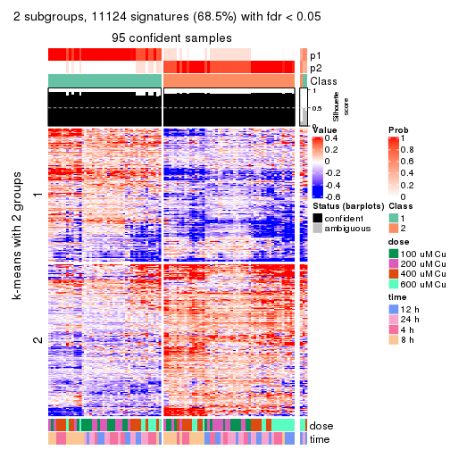</p>

</div>
<div id='tab-SD-pam-get-signatures-no-scale-2'>
<pre><code class="r">get_signatures(res, k = 3, scale_rows = FALSE)
</code></pre>

<p></p>

</div>
<div id='tab-SD-pam-get-signatures-no-scale-3'>
<pre><code class="r">get_signatures(res, k = 4, scale_rows = FALSE)
</code></pre>

<p></p>

</div>
<div id='tab-SD-pam-get-signatures-no-scale-4'>
<pre><code class="r">get_signatures(res, k = 5, scale_rows = FALSE)
</code></pre>

<p></p>

</div>
<div id='tab-SD-pam-get-signatures-no-scale-5'>
<pre><code class="r">get_signatures(res, k = 6, scale_rows = FALSE)
</code></pre>

<p></p>

</div>
</div>


Compare the overlap of signatures from different k:

```r
compare_signatures(res)
```


`get_signature()` returns a data frame invisibly. TO get the list of signatures, the function
call should be assigned to a variable explicitly. In following code, if `plot` argument is set
to `FALSE`, no heatmap is plotted while only the differential analysis is performed.

```r
# code only for demonstration
tb = get_signature(res, k = ..., plot = FALSE)
```

An example of the output of `tb` is:

```
#>   which_row         fdr    mean_1    mean_2 scaled_mean_1 scaled_mean_2 km
#> 1        38 0.042760348  8.373488  9.131774    -0.5533452     0.5164555  1
#> 2        40 0.018707592  7.106213  8.469186    -0.6173731     0.5762149  1
#> 3        55 0.019134737 10.221463 11.207825    -0.6159697     0.5749050  1
#> 4        59 0.006059896  5.921854  7.869574    -0.6899429     0.6439467  1
#> 5        60 0.018055526  8.928898 10.211722    -0.6204761     0.5791110  1
#> 6        98 0.009384629 15.714769 14.887706     0.6635654    -0.6193277  2
...
```

The columns in `tb` are:

1. `which_row`: row indices corresponding to the input matrix.
2. `fdr`: FDR for the differential test. 
3. `mean_x`: The mean value in group x.
4. `scaled_mean_x`: The mean value in group x after rows are scaled.
5. `km`: Row groups if k-means clustering is applied to rows.


UMAP plot which shows how samples are separated.


<script>
$( function() {
	$( '#tabs-SD-pam-dimension-reduction' ).tabs();
} );
</script>
<div id='tabs-SD-pam-dimension-reduction'>
<ul>
<li><a href='#tab-SD-pam-dimension-reduction-1'>k = 2</a></li>
<li><a href='#tab-SD-pam-dimension-reduction-2'>k = 3</a></li>
<li><a href='#tab-SD-pam-dimension-reduction-3'>k = 4</a></li>
<li><a href='#tab-SD-pam-dimension-reduction-4'>k = 5</a></li>
<li><a href='#tab-SD-pam-dimension-reduction-5'>k = 6</a></li>
</ul>
<div id='tab-SD-pam-dimension-reduction-1'>
<pre><code class="r">dimension_reduction(res, k = 2, method = &quot;UMAP&quot;)
</code></pre>

<p></p>

</div>
<div id='tab-SD-pam-dimension-reduction-2'>
<pre><code class="r">dimension_reduction(res, k = 3, method = &quot;UMAP&quot;)
</code></pre>

<p></p>

</div>
<div id='tab-SD-pam-dimension-reduction-3'>
<pre><code class="r">dimension_reduction(res, k = 4, method = &quot;UMAP&quot;)
</code></pre>

<p></p>

</div>
<div id='tab-SD-pam-dimension-reduction-4'>
<pre><code class="r">dimension_reduction(res, k = 5, method = &quot;UMAP&quot;)
</code></pre>

<p></p>

</div>
<div id='tab-SD-pam-dimension-reduction-5'>
<pre><code class="r">dimension_reduction(res, k = 6, method = &quot;UMAP&quot;)
</code></pre>

<p></p>

</div>
</div>


Following heatmap shows how subgroups are split when increasing `k`:

```r
collect_classes(res)
```


Test correlation between subgroups and known annotations. If the known
annotation is numeric, one-way ANOVA test is applied, and if the known
annotation is discrete, chi-squared contingency table test is applied.

```r
test_to_known_factors(res)
```

```
#>         n  dose(p)  time(p) k
#> SD:pam 95 7.61e-01 9.35e-01 2
#> SD:pam 98 2.49e-10 2.57e-01 3
#> SD:pam 98 1.01e-09 2.31e-05 4
#> SD:pam 95 2.34e-08 3.46e-09 5
#> SD:pam 95 1.62e-08 1.39e-11 6
```


If matrix rows can be associated to genes, consider to use `GO_Enrichment(res,
...)` to perform function enrichment for the signature genes.


 

---------------------------------------------------


### SD:mclust*


The object with results only for a single top-value method and a single partition method 
can be extracted as:

```r
res = res_list["SD", "mclust"]
# you can also extract it by
# res = res_list["SD:mclust"]
```

A summary of `res` and all the functions that can be applied to it:

```r
res
```

```
#> A 'ConsensusPartition' object with k = 2, 3, 4, 5, 6.
#>   On a matrix with 16250 rows and 98 columns.
#>   Top rows (1000, 2000, 3000, 4000, 5000) are extracted by 'SD' method.
#>   Subgroups are detected by 'mclust' method.
#>   Performed in total 1250 partitions by row resampling.
#>   Best k for subgroups seems to be 3.
#> 
#> Following methods can be applied to this 'ConsensusPartition' object:
#>  [1] "cola_report"             "collect_classes"         "collect_plots"          
#>  [4] "collect_stats"           "colnames"                "compare_signatures"     
#>  [7] "consensus_heatmap"       "dimension_reduction"     "functional_enrichment"  
#> [10] "get_anno_col"            "get_anno"                "get_classes"            
#> [13] "get_consensus"           "get_matrix"              "get_membership"         
#> [16] "get_param"               "get_signatures"          "get_stats"              
#> [19] "is_best_k"               "is_stable_k"             "membership_heatmap"     
#> [22] "ncol"                    "nrow"                    "plot_ecdf"              
#> [25] "rownames"                "select_partition_number" "show"                   
#> [28] "suggest_best_k"          "test_to_known_factors"
```

`collect_plots()` function collects all the plots made from `res` for all `k` (number of partitions)
into one single page to provide an easy and fast comparison between different `k`.

```r
collect_plots(res)
```


The plots are:

- The first row: a plot of the ECDF (Empirical cumulative distribution
  function) curves of the consensus matrix for each `k` and the heatmap of
  predicted classes for each `k`.
- The second row: heatmaps of the consensus matrix for each `k`.
- The third row: heatmaps of the membership matrix for each `k`.
- The fouth row: heatmaps of the signatures for each `k`.

All the plots in panels can be made by individual functions and they are
plotted later in this section.

`select_partition_number()` produces several plots showing different
statistics for choosing "optimized" `k`. There are following statistics:

- ECDF curves of the consensus matrix for each `k`;
- 1-PAC. [The PAC
  score](https://en.wikipedia.org/wiki/Consensus_clustering#Over-interpretation_potential_of_consensus_clustering)
  measures the proportion of the ambiguous subgrouping.
- Mean silhouette score.
- Concordance. The mean probability of fiting the consensus class ids in all
  partitions.
- Area increased. Denote $A_k$ as the area under the ECDF curve for current
  `k`, the area increased is defined as $A_k - A_{k-1}$.
- Rand index. The percent of pairs of samples that are both in a same cluster
  or both are not in a same cluster in the partition of k and k-1.
- Jaccard index. The ratio of pairs of samples are both in a same cluster in
  the partition of k and k-1 and the pairs of samples are both in a same
  cluster in the partition k or k-1.

The detailed explanations of these statistics can be found in [the cola
vignette](http://bioconductor.org/packages/devel/bioc/vignettes/cola/inst/doc/cola.html#toc_13).

Generally speaking, lower PAC score, higher mean silhouette score or higher
concordance corresponds to better partition. Rand index and Jaccard index
measure how similar the current partition is compared to partition with `k-1`.
If they are too similar, we won't accept `k` is better than `k-1`.

```r
select_partition_number(res)
```


The numeric values for all these statistics can be obtained by `get_stats()`.

```r
get_stats(res)
```

```
#>   k 1-PAC mean_silhouette concordance area_increased  Rand Jaccard
#> 2 2 0.580           0.937       0.951         0.4625 0.512   0.512
#> 3 3 0.901           0.913       0.963         0.2355 0.823   0.688
#> 4 4 0.667           0.761       0.850         0.2141 0.887   0.745
#> 5 5 0.820           0.865       0.916         0.1224 0.854   0.581
#> 6 6 0.892           0.841       0.909         0.0571 0.920   0.666
```

`suggest_best_k()` suggests the best $k$ based on these statistics. The rules are as follows:

- All $k$ with Jaccard index larger than 0.95 are removed because the increase of
  the partition number does not provides enough extra information. If all $k$ are removed,
  the best $k$ is assigned by `NA`.
- For $k$ with 1-PAC larger than 0.9, the maximal $k$ is taken as the "best k". Other $k$ is called "optional k".
- If it does not fit the second rule. The $k$ with the highest vote of highest
  1-PAC, mean silhouette and concordance is taken as the "best k".

```r
suggest_best_k(res)
```

```
#> [1] 3
```


Following shows the table of the partitions (You need to click the **show/hide
code output** link to see it). The membership matrix (columns with name `p*`)
is inferred by
[`clue::cl_consensus()`](https://www.rdocumentation.org/link/cl_consensus?package=clue)
function with the `SE` method. Basically the value in the membership matrix
represents the probability to belong to a certain group. The finall class
label for an item is determined with the group with highest probability it
belongs to.

In `get_classes()` function, the entropy is calculated from the membership
matrix and the silhouette score is calculated from the consensus matrix.


<script>
$( function() {
	$( '#tabs-SD-mclust-get-classes' ).tabs();
} );
</script>
<div id='tabs-SD-mclust-get-classes'>
<ul>
<li><a href='#tab-SD-mclust-get-classes-1'>k = 2</a></li>
<li><a href='#tab-SD-mclust-get-classes-2'>k = 3</a></li>
<li><a href='#tab-SD-mclust-get-classes-3'>k = 4</a></li>
<li><a href='#tab-SD-mclust-get-classes-4'>k = 5</a></li>
<li><a href='#tab-SD-mclust-get-classes-5'>k = 6</a></li>
</ul>

<div id='tab-SD-mclust-get-classes-1'>
<p><a id='tab-SD-mclust-get-classes-1-a' style='color:#0366d6' href='#'>show/hide code output</a></p>
<pre><code class="r">cbind(get_classes(res, k = 2), get_membership(res, k = 2))
</code></pre>

<pre><code>#&gt;           class entropy silhouette    p1    p2
#&gt; GSM241451     1  0.1414      0.911 0.980 0.020
#&gt; GSM241452     1  0.5737      0.925 0.864 0.136
#&gt; GSM241453     1  0.1414      0.911 0.980 0.020
#&gt; GSM241454     1  0.5737      0.925 0.864 0.136
#&gt; GSM241455     1  0.1414      0.911 0.980 0.020
#&gt; GSM241456     1  0.5737      0.925 0.864 0.136
#&gt; GSM241457     2  0.7602      0.694 0.220 0.780
#&gt; GSM241458     1  0.6148      0.919 0.848 0.152
#&gt; GSM241459     2  0.7453      0.708 0.212 0.788
#&gt; GSM241460     1  0.5737      0.925 0.864 0.136
#&gt; GSM241461     2  0.5519      0.837 0.128 0.872
#&gt; GSM241462     1  0.6623      0.900 0.828 0.172
#&gt; GSM241463     1  0.1414      0.911 0.980 0.020
#&gt; GSM241464     1  0.6148      0.919 0.848 0.152
#&gt; GSM241465     1  0.1414      0.911 0.980 0.020
#&gt; GSM241466     1  0.5737      0.925 0.864 0.136
#&gt; GSM241467     1  0.5737      0.925 0.864 0.136
#&gt; GSM241468     1  0.1414      0.911 0.980 0.020
#&gt; GSM241469     1  0.5737      0.925 0.864 0.136
#&gt; GSM241470     1  0.1414      0.911 0.980 0.020
#&gt; GSM241471     1  0.1414      0.911 0.980 0.020
#&gt; GSM241472     1  0.5737      0.925 0.864 0.136
#&gt; GSM241473     1  0.1414      0.911 0.980 0.020
#&gt; GSM241474     1  0.5737      0.925 0.864 0.136
#&gt; GSM241475     1  0.1414      0.911 0.980 0.020
#&gt; GSM241476     1  0.5737      0.925 0.864 0.136
#&gt; GSM241477     1  0.1414      0.911 0.980 0.020
#&gt; GSM241478     1  0.1414      0.911 0.980 0.020
#&gt; GSM241479     1  0.5737      0.925 0.864 0.136
#&gt; GSM241480     1  0.5737      0.925 0.864 0.136
#&gt; GSM241481     2  0.7674      0.687 0.224 0.776
#&gt; GSM241482     1  0.6148      0.919 0.848 0.152
#&gt; GSM241483     2  0.5519      0.837 0.128 0.872
#&gt; GSM241484     1  0.6148      0.919 0.848 0.152
#&gt; GSM241485     1  0.6148      0.919 0.848 0.152
#&gt; GSM241486     2  0.5294      0.847 0.120 0.880
#&gt; GSM241487     2  0.5737      0.825 0.136 0.864
#&gt; GSM241488     1  0.1414      0.911 0.980 0.020
#&gt; GSM241489     1  0.6148      0.919 0.848 0.152
#&gt; GSM241490     2  0.1414      0.958 0.020 0.980
#&gt; GSM241491     1  0.1414      0.911 0.980 0.020
#&gt; GSM241492     1  0.6148      0.919 0.848 0.152
#&gt; GSM241493     1  0.1414      0.911 0.980 0.020
#&gt; GSM241494     1  0.5737      0.925 0.864 0.136
#&gt; GSM241495     1  0.1414      0.911 0.980 0.020
#&gt; GSM241496     1  0.1414      0.911 0.980 0.020
#&gt; GSM241497     1  0.6148      0.919 0.848 0.152
#&gt; GSM241498     1  0.5737      0.925 0.864 0.136
#&gt; GSM241499     2  0.0376      0.973 0.004 0.996
#&gt; GSM241500     2  0.0000      0.976 0.000 1.000
#&gt; GSM241501     2  0.0000      0.976 0.000 1.000
#&gt; GSM241502     2  0.0000      0.976 0.000 1.000
#&gt; GSM241503     2  0.0376      0.973 0.004 0.996
#&gt; GSM241504     2  0.0376      0.973 0.004 0.996
#&gt; GSM241505     2  0.0376      0.973 0.004 0.996
#&gt; GSM241506     2  0.0000      0.976 0.000 1.000
#&gt; GSM241507     2  0.0376      0.973 0.004 0.996
#&gt; GSM241508     2  0.0000      0.976 0.000 1.000
#&gt; GSM241509     2  0.0000      0.976 0.000 1.000
#&gt; GSM241510     2  0.0000      0.976 0.000 1.000
#&gt; GSM241511     2  0.0000      0.976 0.000 1.000
#&gt; GSM241512     2  0.0000      0.976 0.000 1.000
#&gt; GSM241513     2  0.0000      0.976 0.000 1.000
#&gt; GSM241514     2  0.0000      0.976 0.000 1.000
#&gt; GSM241515     2  0.0000      0.976 0.000 1.000
#&gt; GSM241516     2  0.0000      0.976 0.000 1.000
#&gt; GSM241517     2  0.0000      0.976 0.000 1.000
#&gt; GSM241518     2  0.0000      0.976 0.000 1.000
#&gt; GSM241519     2  0.0000      0.976 0.000 1.000
#&gt; GSM241520     2  0.0000      0.976 0.000 1.000
#&gt; GSM241521     2  0.0000      0.976 0.000 1.000
#&gt; GSM241522     2  0.0376      0.973 0.004 0.996
#&gt; GSM241523     2  0.0000      0.976 0.000 1.000
#&gt; GSM241524     2  0.0000      0.976 0.000 1.000
#&gt; GSM241525     2  0.0000      0.976 0.000 1.000
#&gt; GSM241526     2  0.0000      0.976 0.000 1.000
#&gt; GSM241527     2  0.0000      0.976 0.000 1.000
#&gt; GSM241528     2  0.0000      0.976 0.000 1.000
#&gt; GSM241529     2  0.0000      0.976 0.000 1.000
#&gt; GSM241530     2  0.0000      0.976 0.000 1.000
#&gt; GSM241531     2  0.0000      0.976 0.000 1.000
#&gt; GSM241532     2  0.0000      0.976 0.000 1.000
#&gt; GSM241533     2  0.0000      0.976 0.000 1.000
#&gt; GSM241534     2  0.0000      0.976 0.000 1.000
#&gt; GSM241535     2  0.0000      0.976 0.000 1.000
#&gt; GSM241536     2  0.0000      0.976 0.000 1.000
#&gt; GSM241537     2  0.0000      0.976 0.000 1.000
#&gt; GSM241538     2  0.0000      0.976 0.000 1.000
#&gt; GSM241539     2  0.0000      0.976 0.000 1.000
#&gt; GSM241540     2  0.0000      0.976 0.000 1.000
#&gt; GSM241541     2  0.0000      0.976 0.000 1.000
#&gt; GSM241542     2  0.0000      0.976 0.000 1.000
#&gt; GSM241543     2  0.0000      0.976 0.000 1.000
#&gt; GSM241544     2  0.0000      0.976 0.000 1.000
#&gt; GSM241545     2  0.0000      0.976 0.000 1.000
#&gt; GSM241546     2  0.0000      0.976 0.000 1.000
#&gt; GSM241547     2  0.0000      0.976 0.000 1.000
#&gt; GSM241548     2  0.0000      0.976 0.000 1.000
</code></pre>

<script>
$('#tab-SD-mclust-get-classes-1-a').parent().next().next().hide();
$('#tab-SD-mclust-get-classes-1-a').click(function(){
  $('#tab-SD-mclust-get-classes-1-a').parent().next().next().toggle();
  return(false);
});
</script>
</div>

<div id='tab-SD-mclust-get-classes-2'>
<p><a id='tab-SD-mclust-get-classes-2-a' style='color:#0366d6' href='#'>show/hide code output</a></p>
<pre><code class="r">cbind(get_classes(res, k = 3), get_membership(res, k = 3))
</code></pre>

<pre><code>#&gt;           class entropy silhouette    p1    p2    p3
#&gt; GSM241451     2  0.0000      0.969 0.000 1.000 0.000
#&gt; GSM241452     1  0.0000      0.987 1.000 0.000 0.000
#&gt; GSM241453     2  0.0000      0.969 0.000 1.000 0.000
#&gt; GSM241454     1  0.0000      0.987 1.000 0.000 0.000
#&gt; GSM241455     2  0.0000      0.969 0.000 1.000 0.000
#&gt; GSM241456     1  0.0000      0.987 1.000 0.000 0.000
#&gt; GSM241457     3  0.0000      0.945 0.000 0.000 1.000
#&gt; GSM241458     3  0.5948      0.503 0.360 0.000 0.640
#&gt; GSM241459     3  0.0000      0.945 0.000 0.000 1.000
#&gt; GSM241460     1  0.0000      0.987 1.000 0.000 0.000
#&gt; GSM241461     3  0.0000      0.945 0.000 0.000 1.000
#&gt; GSM241462     3  0.5948      0.503 0.360 0.000 0.640
#&gt; GSM241463     2  0.0000      0.969 0.000 1.000 0.000
#&gt; GSM241464     1  0.0000      0.987 1.000 0.000 0.000
#&gt; GSM241465     2  0.0000      0.969 0.000 1.000 0.000
#&gt; GSM241466     1  0.0000      0.987 1.000 0.000 0.000
#&gt; GSM241467     1  0.0000      0.987 1.000 0.000 0.000
#&gt; GSM241468     2  0.0000      0.969 0.000 1.000 0.000
#&gt; GSM241469     1  0.0000      0.987 1.000 0.000 0.000
#&gt; GSM241470     2  0.0000      0.969 0.000 1.000 0.000
#&gt; GSM241471     2  0.0000      0.969 0.000 1.000 0.000
#&gt; GSM241472     1  0.0000      0.987 1.000 0.000 0.000
#&gt; GSM241473     2  0.0000      0.969 0.000 1.000 0.000
#&gt; GSM241474     1  0.0000      0.987 1.000 0.000 0.000
#&gt; GSM241475     2  0.0000      0.969 0.000 1.000 0.000
#&gt; GSM241476     1  0.0000      0.987 1.000 0.000 0.000
#&gt; GSM241477     2  0.0000      0.969 0.000 1.000 0.000
#&gt; GSM241478     2  0.0000      0.969 0.000 1.000 0.000
#&gt; GSM241479     1  0.0000      0.987 1.000 0.000 0.000
#&gt; GSM241480     1  0.0000      0.987 1.000 0.000 0.000
#&gt; GSM241481     3  0.0000      0.945 0.000 0.000 1.000
#&gt; GSM241482     3  0.5948      0.503 0.360 0.000 0.640
#&gt; GSM241483     3  0.0000      0.945 0.000 0.000 1.000
#&gt; GSM241484     3  0.5948      0.503 0.360 0.000 0.640
#&gt; GSM241485     1  0.4002      0.758 0.840 0.000 0.160
#&gt; GSM241486     3  0.0000      0.945 0.000 0.000 1.000
#&gt; GSM241487     2  0.6062      0.398 0.000 0.616 0.384
#&gt; GSM241488     2  0.0000      0.969 0.000 1.000 0.000
#&gt; GSM241489     1  0.0000      0.987 1.000 0.000 0.000
#&gt; GSM241490     1  0.0000      0.987 1.000 0.000 0.000
#&gt; GSM241491     2  0.0424      0.960 0.000 0.992 0.008
#&gt; GSM241492     1  0.0424      0.977 0.992 0.000 0.008
#&gt; GSM241493     2  0.0000      0.969 0.000 1.000 0.000
#&gt; GSM241494     1  0.0000      0.987 1.000 0.000 0.000
#&gt; GSM241495     2  0.0000      0.969 0.000 1.000 0.000
#&gt; GSM241496     2  0.0000      0.969 0.000 1.000 0.000
#&gt; GSM241497     1  0.0000      0.987 1.000 0.000 0.000
#&gt; GSM241498     1  0.0000      0.987 1.000 0.000 0.000
#&gt; GSM241499     3  0.5882      0.527 0.348 0.000 0.652
#&gt; GSM241500     3  0.0000      0.945 0.000 0.000 1.000
#&gt; GSM241501     3  0.0000      0.945 0.000 0.000 1.000
#&gt; GSM241502     3  0.0000      0.945 0.000 0.000 1.000
#&gt; GSM241503     3  0.5882      0.527 0.348 0.000 0.652
#&gt; GSM241504     3  0.5497      0.622 0.292 0.000 0.708
#&gt; GSM241505     3  0.5497      0.622 0.292 0.000 0.708
#&gt; GSM241506     3  0.0000      0.945 0.000 0.000 1.000
#&gt; GSM241507     3  0.5497      0.622 0.292 0.000 0.708
#&gt; GSM241508     3  0.0000      0.945 0.000 0.000 1.000
#&gt; GSM241509     3  0.0000      0.945 0.000 0.000 1.000
#&gt; GSM241510     3  0.0000      0.945 0.000 0.000 1.000
#&gt; GSM241511     3  0.0000      0.945 0.000 0.000 1.000
#&gt; GSM241512     3  0.0000      0.945 0.000 0.000 1.000
#&gt; GSM241513     3  0.0000      0.945 0.000 0.000 1.000
#&gt; GSM241514     3  0.0000      0.945 0.000 0.000 1.000
#&gt; GSM241515     3  0.0000      0.945 0.000 0.000 1.000
#&gt; GSM241516     3  0.0000      0.945 0.000 0.000 1.000
#&gt; GSM241517     3  0.0000      0.945 0.000 0.000 1.000
#&gt; GSM241518     3  0.0000      0.945 0.000 0.000 1.000
#&gt; GSM241519     3  0.0000      0.945 0.000 0.000 1.000
#&gt; GSM241520     3  0.0000      0.945 0.000 0.000 1.000
#&gt; GSM241521     3  0.0000      0.945 0.000 0.000 1.000
#&gt; GSM241522     3  0.0592      0.936 0.012 0.000 0.988
#&gt; GSM241523     3  0.0000      0.945 0.000 0.000 1.000
#&gt; GSM241524     3  0.0000      0.945 0.000 0.000 1.000
#&gt; GSM241525     3  0.0000      0.945 0.000 0.000 1.000
#&gt; GSM241526     3  0.0000      0.945 0.000 0.000 1.000
#&gt; GSM241527     3  0.0000      0.945 0.000 0.000 1.000
#&gt; GSM241528     3  0.0000      0.945 0.000 0.000 1.000
#&gt; GSM241529     3  0.0000      0.945 0.000 0.000 1.000
#&gt; GSM241530     3  0.0000      0.945 0.000 0.000 1.000
#&gt; GSM241531     3  0.0000      0.945 0.000 0.000 1.000
#&gt; GSM241532     3  0.0000      0.945 0.000 0.000 1.000
#&gt; GSM241533     3  0.0000      0.945 0.000 0.000 1.000
#&gt; GSM241534     3  0.0000      0.945 0.000 0.000 1.000
#&gt; GSM241535     3  0.0000      0.945 0.000 0.000 1.000
#&gt; GSM241536     3  0.0000      0.945 0.000 0.000 1.000
#&gt; GSM241537     3  0.0000      0.945 0.000 0.000 1.000
#&gt; GSM241538     3  0.0000      0.945 0.000 0.000 1.000
#&gt; GSM241539     3  0.0000      0.945 0.000 0.000 1.000
#&gt; GSM241540     3  0.0000      0.945 0.000 0.000 1.000
#&gt; GSM241541     3  0.0000      0.945 0.000 0.000 1.000
#&gt; GSM241542     3  0.0000      0.945 0.000 0.000 1.000
#&gt; GSM241543     3  0.0000      0.945 0.000 0.000 1.000
#&gt; GSM241544     3  0.0000      0.945 0.000 0.000 1.000
#&gt; GSM241545     3  0.0000      0.945 0.000 0.000 1.000
#&gt; GSM241546     3  0.0000      0.945 0.000 0.000 1.000
#&gt; GSM241547     3  0.0000      0.945 0.000 0.000 1.000
#&gt; GSM241548     3  0.0000      0.945 0.000 0.000 1.000
</code></pre>

<script>
$('#tab-SD-mclust-get-classes-2-a').parent().next().next().hide();
$('#tab-SD-mclust-get-classes-2-a').click(function(){
  $('#tab-SD-mclust-get-classes-2-a').parent().next().next().toggle();
  return(false);
});
</script>
</div>

<div id='tab-SD-mclust-get-classes-3'>
<p><a id='tab-SD-mclust-get-classes-3-a' style='color:#0366d6' href='#'>show/hide code output</a></p>
<pre><code class="r">cbind(get_classes(res, k = 4), get_membership(res, k = 4))
</code></pre>

<pre><code>#&gt;           class entropy silhouette    p1    p2    p3    p4
#&gt; GSM241451     2   0.000     0.9718 0.000 1.000 0.000 0.000
#&gt; GSM241452     1   0.000     0.9487 1.000 0.000 0.000 0.000
#&gt; GSM241453     2   0.000     0.9718 0.000 1.000 0.000 0.000
#&gt; GSM241454     1   0.000     0.9487 1.000 0.000 0.000 0.000
#&gt; GSM241455     2   0.000     0.9718 0.000 1.000 0.000 0.000
#&gt; GSM241456     1   0.000     0.9487 1.000 0.000 0.000 0.000
#&gt; GSM241457     4   0.000     0.9249 0.000 0.000 0.000 1.000
#&gt; GSM241458     3   0.728     0.5283 0.236 0.000 0.540 0.224
#&gt; GSM241459     4   0.000     0.9249 0.000 0.000 0.000 1.000
#&gt; GSM241460     1   0.000     0.9487 1.000 0.000 0.000 0.000
#&gt; GSM241461     4   0.000     0.9249 0.000 0.000 0.000 1.000
#&gt; GSM241462     3   0.671     0.4721 0.360 0.000 0.540 0.100
#&gt; GSM241463     2   0.000     0.9718 0.000 1.000 0.000 0.000
#&gt; GSM241464     1   0.000     0.9487 1.000 0.000 0.000 0.000
#&gt; GSM241465     2   0.000     0.9718 0.000 1.000 0.000 0.000
#&gt; GSM241466     1   0.000     0.9487 1.000 0.000 0.000 0.000
#&gt; GSM241467     1   0.000     0.9487 1.000 0.000 0.000 0.000
#&gt; GSM241468     2   0.000     0.9718 0.000 1.000 0.000 0.000
#&gt; GSM241469     1   0.000     0.9487 1.000 0.000 0.000 0.000
#&gt; GSM241470     2   0.000     0.9718 0.000 1.000 0.000 0.000
#&gt; GSM241471     2   0.000     0.9718 0.000 1.000 0.000 0.000
#&gt; GSM241472     1   0.000     0.9487 1.000 0.000 0.000 0.000
#&gt; GSM241473     2   0.000     0.9718 0.000 1.000 0.000 0.000
#&gt; GSM241474     1   0.000     0.9487 1.000 0.000 0.000 0.000
#&gt; GSM241475     2   0.000     0.9718 0.000 1.000 0.000 0.000
#&gt; GSM241476     1   0.000     0.9487 1.000 0.000 0.000 0.000
#&gt; GSM241477     2   0.000     0.9718 0.000 1.000 0.000 0.000
#&gt; GSM241478     2   0.000     0.9718 0.000 1.000 0.000 0.000
#&gt; GSM241479     1   0.000     0.9487 1.000 0.000 0.000 0.000
#&gt; GSM241480     1   0.000     0.9487 1.000 0.000 0.000 0.000
#&gt; GSM241481     4   0.000     0.9249 0.000 0.000 0.000 1.000
#&gt; GSM241482     3   0.671     0.4721 0.360 0.000 0.540 0.100
#&gt; GSM241483     4   0.000     0.9249 0.000 0.000 0.000 1.000
#&gt; GSM241484     3   0.679     0.4765 0.352 0.000 0.540 0.108
#&gt; GSM241485     1   0.591     0.4733 0.680 0.000 0.228 0.092
#&gt; GSM241486     4   0.000     0.9249 0.000 0.000 0.000 1.000
#&gt; GSM241487     2   0.733     0.2842 0.000 0.532 0.236 0.232
#&gt; GSM241488     2   0.000     0.9718 0.000 1.000 0.000 0.000
#&gt; GSM241489     1   0.000     0.9487 1.000 0.000 0.000 0.000
#&gt; GSM241490     1   0.692     0.0767 0.528 0.000 0.120 0.352
#&gt; GSM241491     2   0.000     0.9718 0.000 1.000 0.000 0.000
#&gt; GSM241492     1   0.000     0.9487 1.000 0.000 0.000 0.000
#&gt; GSM241493     2   0.000     0.9718 0.000 1.000 0.000 0.000
#&gt; GSM241494     1   0.000     0.9487 1.000 0.000 0.000 0.000
#&gt; GSM241495     2   0.000     0.9718 0.000 1.000 0.000 0.000
#&gt; GSM241496     2   0.000     0.9718 0.000 1.000 0.000 0.000
#&gt; GSM241497     1   0.000     0.9487 1.000 0.000 0.000 0.000
#&gt; GSM241498     1   0.000     0.9487 1.000 0.000 0.000 0.000
#&gt; GSM241499     3   0.674     0.5679 0.104 0.000 0.544 0.352
#&gt; GSM241500     4   0.000     0.9249 0.000 0.000 0.000 1.000
#&gt; GSM241501     4   0.000     0.9249 0.000 0.000 0.000 1.000
#&gt; GSM241502     4   0.000     0.9249 0.000 0.000 0.000 1.000
#&gt; GSM241503     3   0.674     0.5679 0.104 0.000 0.544 0.352
#&gt; GSM241504     3   0.674     0.5679 0.104 0.000 0.544 0.352
#&gt; GSM241505     3   0.674     0.5679 0.104 0.000 0.544 0.352
#&gt; GSM241506     3   0.499     0.4748 0.000 0.000 0.524 0.476
#&gt; GSM241507     3   0.674     0.5679 0.104 0.000 0.544 0.352
#&gt; GSM241508     4   0.000     0.9249 0.000 0.000 0.000 1.000
#&gt; GSM241509     4   0.500    -0.4729 0.000 0.000 0.496 0.504
#&gt; GSM241510     3   0.499     0.4748 0.000 0.000 0.524 0.476
#&gt; GSM241511     3   0.470     0.6401 0.000 0.000 0.644 0.356
#&gt; GSM241512     3   0.470     0.6401 0.000 0.000 0.644 0.356
#&gt; GSM241513     3   0.000     0.7165 0.000 0.000 1.000 0.000
#&gt; GSM241514     3   0.000     0.7165 0.000 0.000 1.000 0.000
#&gt; GSM241515     3   0.265     0.7342 0.000 0.000 0.880 0.120
#&gt; GSM241516     3   0.265     0.7342 0.000 0.000 0.880 0.120
#&gt; GSM241517     3   0.000     0.7165 0.000 0.000 1.000 0.000
#&gt; GSM241518     3   0.000     0.7165 0.000 0.000 1.000 0.000
#&gt; GSM241519     3   0.000     0.7165 0.000 0.000 1.000 0.000
#&gt; GSM241520     3   0.000     0.7165 0.000 0.000 1.000 0.000
#&gt; GSM241521     3   0.000     0.7165 0.000 0.000 1.000 0.000
#&gt; GSM241522     3   0.467     0.6893 0.104 0.000 0.796 0.100
#&gt; GSM241523     3   0.000     0.7165 0.000 0.000 1.000 0.000
#&gt; GSM241524     3   0.000     0.7165 0.000 0.000 1.000 0.000
#&gt; GSM241525     3   0.470     0.6401 0.000 0.000 0.644 0.356
#&gt; GSM241526     3   0.410     0.6507 0.000 0.000 0.744 0.256
#&gt; GSM241527     3   0.470     0.6401 0.000 0.000 0.644 0.356
#&gt; GSM241528     3   0.445     0.6307 0.000 0.000 0.692 0.308
#&gt; GSM241529     3   0.499     0.4748 0.000 0.000 0.524 0.476
#&gt; GSM241530     3   0.470     0.6401 0.000 0.000 0.644 0.356
#&gt; GSM241531     3   0.470     0.6401 0.000 0.000 0.644 0.356
#&gt; GSM241532     3   0.499     0.4748 0.000 0.000 0.524 0.476
#&gt; GSM241533     3   0.499     0.4748 0.000 0.000 0.524 0.476
#&gt; GSM241534     3   0.499     0.4748 0.000 0.000 0.524 0.476
#&gt; GSM241535     3   0.470     0.6401 0.000 0.000 0.644 0.356
#&gt; GSM241536     3   0.470     0.6401 0.000 0.000 0.644 0.356
#&gt; GSM241537     3   0.265     0.7342 0.000 0.000 0.880 0.120
#&gt; GSM241538     3   0.265     0.7342 0.000 0.000 0.880 0.120
#&gt; GSM241539     3   0.265     0.7342 0.000 0.000 0.880 0.120
#&gt; GSM241540     3   0.312     0.7297 0.000 0.000 0.844 0.156
#&gt; GSM241541     3   0.265     0.7342 0.000 0.000 0.880 0.120
#&gt; GSM241542     3   0.265     0.7342 0.000 0.000 0.880 0.120
#&gt; GSM241543     3   0.000     0.7165 0.000 0.000 1.000 0.000
#&gt; GSM241544     3   0.000     0.7165 0.000 0.000 1.000 0.000
#&gt; GSM241545     3   0.000     0.7165 0.000 0.000 1.000 0.000
#&gt; GSM241546     3   0.000     0.7165 0.000 0.000 1.000 0.000
#&gt; GSM241547     3   0.000     0.7165 0.000 0.000 1.000 0.000
#&gt; GSM241548     3   0.000     0.7165 0.000 0.000 1.000 0.000
</code></pre>

<script>
$('#tab-SD-mclust-get-classes-3-a').parent().next().next().hide();
$('#tab-SD-mclust-get-classes-3-a').click(function(){
  $('#tab-SD-mclust-get-classes-3-a').parent().next().next().toggle();
  return(false);
});
</script>
</div>

<div id='tab-SD-mclust-get-classes-4'>
<p><a id='tab-SD-mclust-get-classes-4-a' style='color:#0366d6' href='#'>show/hide code output</a></p>
<pre><code class="r">cbind(get_classes(res, k = 5), get_membership(res, k = 5))
</code></pre>

<pre><code>#&gt;           class entropy silhouette    p1    p2    p3    p4    p5
#&gt; GSM241451     2  0.0963     0.9650 0.036 0.964 0.000 0.000 0.000
#&gt; GSM241452     1  0.0000     0.9995 1.000 0.000 0.000 0.000 0.000
#&gt; GSM241453     2  0.0963     0.9650 0.036 0.964 0.000 0.000 0.000
#&gt; GSM241454     1  0.0000     0.9995 1.000 0.000 0.000 0.000 0.000
#&gt; GSM241455     2  0.0963     0.9650 0.036 0.964 0.000 0.000 0.000
#&gt; GSM241456     1  0.0000     0.9995 1.000 0.000 0.000 0.000 0.000
#&gt; GSM241457     5  0.0963     0.9032 0.036 0.000 0.000 0.000 0.964
#&gt; GSM241458     4  0.3274     0.7556 0.220 0.000 0.000 0.780 0.000
#&gt; GSM241459     5  0.0963     0.9032 0.036 0.000 0.000 0.000 0.964
#&gt; GSM241460     1  0.0000     0.9995 1.000 0.000 0.000 0.000 0.000
#&gt; GSM241461     5  0.0963     0.9032 0.036 0.000 0.000 0.000 0.964
#&gt; GSM241462     4  0.3305     0.7521 0.224 0.000 0.000 0.776 0.000
#&gt; GSM241463     2  0.0963     0.9650 0.036 0.964 0.000 0.000 0.000
#&gt; GSM241464     1  0.0000     0.9995 1.000 0.000 0.000 0.000 0.000
#&gt; GSM241465     2  0.0963     0.9650 0.036 0.964 0.000 0.000 0.000
#&gt; GSM241466     1  0.0000     0.9995 1.000 0.000 0.000 0.000 0.000
#&gt; GSM241467     1  0.0000     0.9995 1.000 0.000 0.000 0.000 0.000
#&gt; GSM241468     2  0.0963     0.9650 0.036 0.964 0.000 0.000 0.000
#&gt; GSM241469     1  0.0000     0.9995 1.000 0.000 0.000 0.000 0.000
#&gt; GSM241470     2  0.0963     0.9650 0.036 0.964 0.000 0.000 0.000
#&gt; GSM241471     2  0.0963     0.9650 0.036 0.964 0.000 0.000 0.000
#&gt; GSM241472     1  0.0000     0.9995 1.000 0.000 0.000 0.000 0.000
#&gt; GSM241473     2  0.0963     0.9650 0.036 0.964 0.000 0.000 0.000
#&gt; GSM241474     1  0.0000     0.9995 1.000 0.000 0.000 0.000 0.000
#&gt; GSM241475     2  0.0963     0.9650 0.036 0.964 0.000 0.000 0.000
#&gt; GSM241476     1  0.0324     0.9914 0.992 0.000 0.004 0.004 0.000
#&gt; GSM241477     2  0.0963     0.9650 0.036 0.964 0.000 0.000 0.000
#&gt; GSM241478     2  0.0963     0.9650 0.036 0.964 0.000 0.000 0.000
#&gt; GSM241479     1  0.0000     0.9995 1.000 0.000 0.000 0.000 0.000
#&gt; GSM241480     1  0.0000     0.9995 1.000 0.000 0.000 0.000 0.000
#&gt; GSM241481     5  0.0963     0.9032 0.036 0.000 0.000 0.000 0.964
#&gt; GSM241482     4  0.3305     0.7521 0.224 0.000 0.000 0.776 0.000
#&gt; GSM241483     5  0.0963     0.9032 0.036 0.000 0.000 0.000 0.964
#&gt; GSM241484     4  0.3519     0.7567 0.216 0.008 0.000 0.776 0.000
#&gt; GSM241485     4  0.4294     0.3155 0.468 0.000 0.000 0.532 0.000
#&gt; GSM241486     5  0.0963     0.9032 0.036 0.000 0.000 0.000 0.964
#&gt; GSM241487     2  0.7652     0.0723 0.036 0.464 0.060 0.348 0.092
#&gt; GSM241488     2  0.0963     0.9650 0.036 0.964 0.000 0.000 0.000
#&gt; GSM241489     1  0.0000     0.9995 1.000 0.000 0.000 0.000 0.000
#&gt; GSM241490     4  0.5230     0.2950 0.452 0.000 0.044 0.504 0.000
#&gt; GSM241491     2  0.0963     0.9650 0.036 0.964 0.000 0.000 0.000
#&gt; GSM241492     1  0.0000     0.9995 1.000 0.000 0.000 0.000 0.000
#&gt; GSM241493     2  0.0963     0.9650 0.036 0.964 0.000 0.000 0.000
#&gt; GSM241494     1  0.0000     0.9995 1.000 0.000 0.000 0.000 0.000
#&gt; GSM241495     2  0.0963     0.9650 0.036 0.964 0.000 0.000 0.000
#&gt; GSM241496     2  0.0963     0.9650 0.036 0.964 0.000 0.000 0.000
#&gt; GSM241497     1  0.0000     0.9995 1.000 0.000 0.000 0.000 0.000
#&gt; GSM241498     1  0.0000     0.9995 1.000 0.000 0.000 0.000 0.000
#&gt; GSM241499     4  0.3920     0.7845 0.148 0.012 0.036 0.804 0.000
#&gt; GSM241500     5  0.0000     0.8976 0.000 0.000 0.000 0.000 1.000
#&gt; GSM241501     5  0.0000     0.8976 0.000 0.000 0.000 0.000 1.000
#&gt; GSM241502     5  0.0000     0.8976 0.000 0.000 0.000 0.000 1.000
#&gt; GSM241503     4  0.3920     0.7845 0.148 0.012 0.036 0.804 0.000
#&gt; GSM241504     4  0.3920     0.7845 0.148 0.012 0.036 0.804 0.000
#&gt; GSM241505     4  0.3920     0.7845 0.148 0.012 0.036 0.804 0.000
#&gt; GSM241506     5  0.3551     0.7034 0.000 0.000 0.008 0.220 0.772
#&gt; GSM241507     4  0.3920     0.7845 0.148 0.012 0.036 0.804 0.000
#&gt; GSM241508     5  0.0000     0.8976 0.000 0.000 0.000 0.000 1.000
#&gt; GSM241509     5  0.3388     0.7534 0.000 0.000 0.008 0.200 0.792
#&gt; GSM241510     5  0.4183     0.5505 0.000 0.000 0.008 0.324 0.668
#&gt; GSM241511     4  0.1522     0.8252 0.000 0.012 0.044 0.944 0.000
#&gt; GSM241512     4  0.1410     0.8256 0.000 0.000 0.060 0.940 0.000
#&gt; GSM241513     3  0.0510     0.9433 0.000 0.000 0.984 0.016 0.000
#&gt; GSM241514     3  0.4242     0.1943 0.000 0.000 0.572 0.428 0.000
#&gt; GSM241515     4  0.3550     0.7219 0.000 0.000 0.236 0.760 0.004
#&gt; GSM241516     4  0.2561     0.7981 0.000 0.000 0.144 0.856 0.000
#&gt; GSM241517     3  0.0000     0.9553 0.000 0.000 1.000 0.000 0.000
#&gt; GSM241518     3  0.0404     0.9545 0.000 0.000 0.988 0.012 0.000
#&gt; GSM241519     3  0.0000     0.9553 0.000 0.000 1.000 0.000 0.000
#&gt; GSM241520     3  0.0404     0.9545 0.000 0.000 0.988 0.012 0.000
#&gt; GSM241521     3  0.0000     0.9553 0.000 0.000 1.000 0.000 0.000
#&gt; GSM241522     4  0.5460     0.7046 0.148 0.000 0.196 0.656 0.000
#&gt; GSM241523     3  0.0000     0.9553 0.000 0.000 1.000 0.000 0.000
#&gt; GSM241524     3  0.0404     0.9545 0.000 0.000 0.988 0.012 0.000
#&gt; GSM241525     4  0.0404     0.8251 0.000 0.000 0.012 0.988 0.000
#&gt; GSM241526     4  0.3359     0.7547 0.000 0.000 0.020 0.816 0.164
#&gt; GSM241527     4  0.0609     0.8255 0.000 0.000 0.020 0.980 0.000
#&gt; GSM241528     4  0.3476     0.7435 0.000 0.000 0.020 0.804 0.176
#&gt; GSM241529     4  0.3242     0.7486 0.000 0.000 0.012 0.816 0.172
#&gt; GSM241530     4  0.0404     0.8251 0.000 0.000 0.012 0.988 0.000
#&gt; GSM241531     4  0.0693     0.8237 0.000 0.012 0.008 0.980 0.000
#&gt; GSM241532     4  0.2798     0.7664 0.000 0.000 0.008 0.852 0.140
#&gt; GSM241533     4  0.2798     0.7664 0.000 0.000 0.008 0.852 0.140
#&gt; GSM241534     4  0.2798     0.7664 0.000 0.000 0.008 0.852 0.140
#&gt; GSM241535     4  0.0703     0.8254 0.000 0.000 0.024 0.976 0.000
#&gt; GSM241536     4  0.0693     0.8237 0.000 0.012 0.008 0.980 0.000
#&gt; GSM241537     4  0.2812     0.8112 0.000 0.024 0.096 0.876 0.004
#&gt; GSM241538     4  0.2642     0.8114 0.000 0.024 0.084 0.888 0.004
#&gt; GSM241539     4  0.2812     0.8112 0.000 0.024 0.096 0.876 0.004
#&gt; GSM241540     4  0.2482     0.8124 0.000 0.024 0.084 0.892 0.000
#&gt; GSM241541     4  0.3606     0.7631 0.000 0.024 0.164 0.808 0.004
#&gt; GSM241542     4  0.2812     0.8068 0.000 0.024 0.096 0.876 0.004
#&gt; GSM241543     3  0.0000     0.9553 0.000 0.000 1.000 0.000 0.000
#&gt; GSM241544     3  0.0404     0.9545 0.000 0.000 0.988 0.012 0.000
#&gt; GSM241545     3  0.0000     0.9553 0.000 0.000 1.000 0.000 0.000
#&gt; GSM241546     3  0.0404     0.9545 0.000 0.000 0.988 0.012 0.000
#&gt; GSM241547     3  0.0000     0.9553 0.000 0.000 1.000 0.000 0.000
#&gt; GSM241548     3  0.0404     0.9545 0.000 0.000 0.988 0.012 0.000
</code></pre>

<script>
$('#tab-SD-mclust-get-classes-4-a').parent().next().next().hide();
$('#tab-SD-mclust-get-classes-4-a').click(function(){
  $('#tab-SD-mclust-get-classes-4-a').parent().next().next().toggle();
  return(false);
});
</script>
</div>

<div id='tab-SD-mclust-get-classes-5'>
<p><a id='tab-SD-mclust-get-classes-5-a' style='color:#0366d6' href='#'>show/hide code output</a></p>
<pre><code class="r">cbind(get_classes(res, k = 6), get_membership(res, k = 6))
</code></pre>

<pre><code>#&gt;           class entropy silhouette    p1    p2    p3    p4    p5    p6
#&gt; GSM241451     2  0.0000     0.9755 0.000 1.000 0.000 0.000 0.000 0.000
#&gt; GSM241452     1  0.0000     0.9791 1.000 0.000 0.000 0.000 0.000 0.000
#&gt; GSM241453     2  0.0000     0.9755 0.000 1.000 0.000 0.000 0.000 0.000
#&gt; GSM241454     1  0.0000     0.9791 1.000 0.000 0.000 0.000 0.000 0.000
#&gt; GSM241455     2  0.0000     0.9755 0.000 1.000 0.000 0.000 0.000 0.000
#&gt; GSM241456     1  0.0000     0.9791 1.000 0.000 0.000 0.000 0.000 0.000
#&gt; GSM241457     5  0.3351     1.0000 0.000 0.000 0.000 0.288 0.712 0.000
#&gt; GSM241458     6  0.0000     0.9537 0.000 0.000 0.000 0.000 0.000 1.000
#&gt; GSM241459     5  0.3351     1.0000 0.000 0.000 0.000 0.288 0.712 0.000
#&gt; GSM241460     1  0.0000     0.9791 1.000 0.000 0.000 0.000 0.000 0.000
#&gt; GSM241461     5  0.3351     1.0000 0.000 0.000 0.000 0.288 0.712 0.000
#&gt; GSM241462     6  0.0000     0.9537 0.000 0.000 0.000 0.000 0.000 1.000
#&gt; GSM241463     2  0.0000     0.9755 0.000 1.000 0.000 0.000 0.000 0.000
#&gt; GSM241464     1  0.0000     0.9791 1.000 0.000 0.000 0.000 0.000 0.000
#&gt; GSM241465     2  0.0603     0.9564 0.000 0.980 0.000 0.004 0.016 0.000
#&gt; GSM241466     1  0.0000     0.9791 1.000 0.000 0.000 0.000 0.000 0.000
#&gt; GSM241467     1  0.0000     0.9791 1.000 0.000 0.000 0.000 0.000 0.000
#&gt; GSM241468     2  0.0000     0.9755 0.000 1.000 0.000 0.000 0.000 0.000
#&gt; GSM241469     1  0.0000     0.9791 1.000 0.000 0.000 0.000 0.000 0.000
#&gt; GSM241470     2  0.0000     0.9755 0.000 1.000 0.000 0.000 0.000 0.000
#&gt; GSM241471     2  0.0000     0.9755 0.000 1.000 0.000 0.000 0.000 0.000
#&gt; GSM241472     1  0.0000     0.9791 1.000 0.000 0.000 0.000 0.000 0.000
#&gt; GSM241473     2  0.0000     0.9755 0.000 1.000 0.000 0.000 0.000 0.000
#&gt; GSM241474     1  0.0000     0.9791 1.000 0.000 0.000 0.000 0.000 0.000
#&gt; GSM241475     2  0.0000     0.9755 0.000 1.000 0.000 0.000 0.000 0.000
#&gt; GSM241476     1  0.0000     0.9791 1.000 0.000 0.000 0.000 0.000 0.000
#&gt; GSM241477     2  0.0000     0.9755 0.000 1.000 0.000 0.000 0.000 0.000
#&gt; GSM241478     2  0.0000     0.9755 0.000 1.000 0.000 0.000 0.000 0.000
#&gt; GSM241479     1  0.0000     0.9791 1.000 0.000 0.000 0.000 0.000 0.000
#&gt; GSM241480     1  0.0000     0.9791 1.000 0.000 0.000 0.000 0.000 0.000
#&gt; GSM241481     5  0.3351     1.0000 0.000 0.000 0.000 0.288 0.712 0.000
#&gt; GSM241482     6  0.0000     0.9537 0.000 0.000 0.000 0.000 0.000 1.000
#&gt; GSM241483     5  0.3351     1.0000 0.000 0.000 0.000 0.288 0.712 0.000
#&gt; GSM241484     6  0.0000     0.9537 0.000 0.000 0.000 0.000 0.000 1.000
#&gt; GSM241485     6  0.3563     0.4867 0.336 0.000 0.000 0.000 0.000 0.664
#&gt; GSM241486     5  0.3351     1.0000 0.000 0.000 0.000 0.288 0.712 0.000
#&gt; GSM241487     2  0.4445     0.4076 0.000 0.656 0.000 0.288 0.056 0.000
#&gt; GSM241488     2  0.0000     0.9755 0.000 1.000 0.000 0.000 0.000 0.000
#&gt; GSM241489     1  0.0000     0.9791 1.000 0.000 0.000 0.000 0.000 0.000
#&gt; GSM241490     1  0.3844     0.4367 0.676 0.000 0.008 0.004 0.000 0.312
#&gt; GSM241491     2  0.0000     0.9755 0.000 1.000 0.000 0.000 0.000 0.000
#&gt; GSM241492     1  0.0000     0.9791 1.000 0.000 0.000 0.000 0.000 0.000
#&gt; GSM241493     2  0.0000     0.9755 0.000 1.000 0.000 0.000 0.000 0.000
#&gt; GSM241494     1  0.0000     0.9791 1.000 0.000 0.000 0.000 0.000 0.000
#&gt; GSM241495     2  0.0000     0.9755 0.000 1.000 0.000 0.000 0.000 0.000
#&gt; GSM241496     2  0.0000     0.9755 0.000 1.000 0.000 0.000 0.000 0.000
#&gt; GSM241497     1  0.0000     0.9791 1.000 0.000 0.000 0.000 0.000 0.000
#&gt; GSM241498     1  0.0000     0.9791 1.000 0.000 0.000 0.000 0.000 0.000
#&gt; GSM241499     6  0.0000     0.9537 0.000 0.000 0.000 0.000 0.000 1.000
#&gt; GSM241500     5  0.3351     1.0000 0.000 0.000 0.000 0.288 0.712 0.000
#&gt; GSM241501     5  0.3351     1.0000 0.000 0.000 0.000 0.288 0.712 0.000
#&gt; GSM241502     5  0.3351     1.0000 0.000 0.000 0.000 0.288 0.712 0.000
#&gt; GSM241503     6  0.0000     0.9537 0.000 0.000 0.000 0.000 0.000 1.000
#&gt; GSM241504     6  0.0146     0.9521 0.000 0.000 0.000 0.004 0.000 0.996
#&gt; GSM241505     6  0.0146     0.9521 0.000 0.000 0.000 0.004 0.000 0.996
#&gt; GSM241506     4  0.2003     0.5531 0.000 0.000 0.000 0.884 0.116 0.000
#&gt; GSM241507     6  0.0146     0.9521 0.000 0.000 0.000 0.004 0.000 0.996
#&gt; GSM241508     5  0.3351     1.0000 0.000 0.000 0.000 0.288 0.712 0.000
#&gt; GSM241509     4  0.3175     0.2391 0.000 0.000 0.000 0.744 0.256 0.000
#&gt; GSM241510     4  0.1204     0.6314 0.000 0.000 0.000 0.944 0.056 0.000
#&gt; GSM241511     4  0.3578     0.6107 0.000 0.000 0.000 0.660 0.000 0.340
#&gt; GSM241512     4  0.4265     0.5743 0.000 0.000 0.300 0.660 0.000 0.040
#&gt; GSM241513     3  0.0000     0.9341 0.000 0.000 1.000 0.000 0.000 0.000
#&gt; GSM241514     3  0.3847    -0.0724 0.000 0.000 0.544 0.456 0.000 0.000
#&gt; GSM241515     4  0.3634     0.5040 0.000 0.000 0.356 0.644 0.000 0.000
#&gt; GSM241516     4  0.3578     0.5298 0.000 0.000 0.340 0.660 0.000 0.000
#&gt; GSM241517     3  0.0000     0.9341 0.000 0.000 1.000 0.000 0.000 0.000
#&gt; GSM241518     3  0.0000     0.9341 0.000 0.000 1.000 0.000 0.000 0.000
#&gt; GSM241519     3  0.0000     0.9341 0.000 0.000 1.000 0.000 0.000 0.000
#&gt; GSM241520     3  0.0000     0.9341 0.000 0.000 1.000 0.000 0.000 0.000
#&gt; GSM241521     3  0.0000     0.9341 0.000 0.000 1.000 0.000 0.000 0.000
#&gt; GSM241522     4  0.5324     0.2574 0.000 0.000 0.428 0.468 0.000 0.104
#&gt; GSM241523     3  0.0000     0.9341 0.000 0.000 1.000 0.000 0.000 0.000
#&gt; GSM241524     3  0.0547     0.9165 0.000 0.000 0.980 0.020 0.000 0.000
#&gt; GSM241525     4  0.4118     0.6301 0.000 0.000 0.028 0.660 0.000 0.312
#&gt; GSM241526     4  0.1204     0.6314 0.000 0.000 0.000 0.944 0.056 0.000
#&gt; GSM241527     4  0.4118     0.6301 0.000 0.000 0.028 0.660 0.000 0.312
#&gt; GSM241528     4  0.1204     0.6314 0.000 0.000 0.000 0.944 0.056 0.000
#&gt; GSM241529     4  0.1204     0.6314 0.000 0.000 0.000 0.944 0.056 0.000
#&gt; GSM241530     4  0.4118     0.6301 0.000 0.000 0.028 0.660 0.000 0.312
#&gt; GSM241531     4  0.3578     0.6107 0.000 0.000 0.000 0.660 0.000 0.340
#&gt; GSM241532     4  0.0790     0.6454 0.000 0.000 0.000 0.968 0.032 0.000
#&gt; GSM241533     4  0.0146     0.6594 0.000 0.000 0.000 0.996 0.004 0.000
#&gt; GSM241534     4  0.0146     0.6594 0.000 0.000 0.000 0.996 0.004 0.000
#&gt; GSM241535     4  0.4118     0.6301 0.000 0.000 0.028 0.660 0.000 0.312
#&gt; GSM241536     4  0.3578     0.6107 0.000 0.000 0.000 0.660 0.000 0.340
#&gt; GSM241537     4  0.3351     0.7027 0.000 0.000 0.000 0.712 0.288 0.000
#&gt; GSM241538     4  0.3351     0.7027 0.000 0.000 0.000 0.712 0.288 0.000
#&gt; GSM241539     4  0.3351     0.7027 0.000 0.000 0.000 0.712 0.288 0.000
#&gt; GSM241540     4  0.3936     0.7021 0.000 0.000 0.000 0.688 0.288 0.024
#&gt; GSM241541     4  0.3351     0.7027 0.000 0.000 0.000 0.712 0.288 0.000
#&gt; GSM241542     4  0.3351     0.7027 0.000 0.000 0.000 0.712 0.288 0.000
#&gt; GSM241543     3  0.0000     0.9341 0.000 0.000 1.000 0.000 0.000 0.000
#&gt; GSM241544     3  0.0000     0.9341 0.000 0.000 1.000 0.000 0.000 0.000
#&gt; GSM241545     3  0.0000     0.9341 0.000 0.000 1.000 0.000 0.000 0.000
#&gt; GSM241546     3  0.3076     0.5894 0.000 0.000 0.760 0.240 0.000 0.000
#&gt; GSM241547     3  0.0000     0.9341 0.000 0.000 1.000 0.000 0.000 0.000
#&gt; GSM241548     3  0.0000     0.9341 0.000 0.000 1.000 0.000 0.000 0.000
</code></pre>

<script>
$('#tab-SD-mclust-get-classes-5-a').parent().next().next().hide();
$('#tab-SD-mclust-get-classes-5-a').click(function(){
  $('#tab-SD-mclust-get-classes-5-a').parent().next().next().toggle();
  return(false);
});
</script>
</div>
</div>

Heatmaps for the consensus matrix. It visualizes the probability of two
samples to be in a same group.


<script>
$( function() {
	$( '#tabs-SD-mclust-consensus-heatmap' ).tabs();
} );
</script>
<div id='tabs-SD-mclust-consensus-heatmap'>
<ul>
<li><a href='#tab-SD-mclust-consensus-heatmap-1'>k = 2</a></li>
<li><a href='#tab-SD-mclust-consensus-heatmap-2'>k = 3</a></li>
<li><a href='#tab-SD-mclust-consensus-heatmap-3'>k = 4</a></li>
<li><a href='#tab-SD-mclust-consensus-heatmap-4'>k = 5</a></li>
<li><a href='#tab-SD-mclust-consensus-heatmap-5'>k = 6</a></li>
</ul>
<div id='tab-SD-mclust-consensus-heatmap-1'>
<pre><code class="r">consensus_heatmap(res, k = 2)
</code></pre>

<p></p>

</div>
<div id='tab-SD-mclust-consensus-heatmap-2'>
<pre><code class="r">consensus_heatmap(res, k = 3)
</code></pre>

<p></p>

</div>
<div id='tab-SD-mclust-consensus-heatmap-3'>
<pre><code class="r">consensus_heatmap(res, k = 4)
</code></pre>

<p></p>

</div>
<div id='tab-SD-mclust-consensus-heatmap-4'>
<pre><code class="r">consensus_heatmap(res, k = 5)
</code></pre>

<p></p>

</div>
<div id='tab-SD-mclust-consensus-heatmap-5'>
<pre><code class="r">consensus_heatmap(res, k = 6)
</code></pre>

<p></p>

</div>
</div>

Heatmaps for the membership of samples in all partitions to see how consistent they are:


<script>
$( function() {
	$( '#tabs-SD-mclust-membership-heatmap' ).tabs();
} );
</script>
<div id='tabs-SD-mclust-membership-heatmap'>
<ul>
<li><a href='#tab-SD-mclust-membership-heatmap-1'>k = 2</a></li>
<li><a href='#tab-SD-mclust-membership-heatmap-2'>k = 3</a></li>
<li><a href='#tab-SD-mclust-membership-heatmap-3'>k = 4</a></li>
<li><a href='#tab-SD-mclust-membership-heatmap-4'>k = 5</a></li>
<li><a href='#tab-SD-mclust-membership-heatmap-5'>k = 6</a></li>
</ul>
<div id='tab-SD-mclust-membership-heatmap-1'>
<pre><code class="r">membership_heatmap(res, k = 2)
</code></pre>

<p></p>

</div>
<div id='tab-SD-mclust-membership-heatmap-2'>
<pre><code class="r">membership_heatmap(res, k = 3)
</code></pre>

<p></p>

</div>
<div id='tab-SD-mclust-membership-heatmap-3'>
<pre><code class="r">membership_heatmap(res, k = 4)
</code></pre>

<p></p>

</div>
<div id='tab-SD-mclust-membership-heatmap-4'>
<pre><code class="r">membership_heatmap(res, k = 5)
</code></pre>

<p></p>

</div>
<div id='tab-SD-mclust-membership-heatmap-5'>
<pre><code class="r">membership_heatmap(res, k = 6)
</code></pre>

<p></p>

</div>
</div>

As soon as we have had the classes for columns, we can look for signatures
which are significantly different between classes which can be candidate marks
for certain classes. Following are the heatmaps for signatures.


Signature heatmaps where rows are scaled:


<script>
$( function() {
	$( '#tabs-SD-mclust-get-signatures' ).tabs();
} );
</script>
<div id='tabs-SD-mclust-get-signatures'>
<ul>
<li><a href='#tab-SD-mclust-get-signatures-1'>k = 2</a></li>
<li><a href='#tab-SD-mclust-get-signatures-2'>k = 3</a></li>
<li><a href='#tab-SD-mclust-get-signatures-3'>k = 4</a></li>
<li><a href='#tab-SD-mclust-get-signatures-4'>k = 5</a></li>
<li><a href='#tab-SD-mclust-get-signatures-5'>k = 6</a></li>
</ul>
<div id='tab-SD-mclust-get-signatures-1'>
<pre><code class="r">get_signatures(res, k = 2)
</code></pre>

<p></p>

</div>
<div id='tab-SD-mclust-get-signatures-2'>
<pre><code class="r">get_signatures(res, k = 3)
</code></pre>

<p></p>

</div>
<div id='tab-SD-mclust-get-signatures-3'>
<pre><code class="r">get_signatures(res, k = 4)
</code></pre>

<p></p>

</div>
<div id='tab-SD-mclust-get-signatures-4'>
<pre><code class="r">get_signatures(res, k = 5)
</code></pre>

<p></p>

</div>
<div id='tab-SD-mclust-get-signatures-5'>
<pre><code class="r">get_signatures(res, k = 6)
</code></pre>

<p></p>

</div>
</div>


Signature heatmaps where rows are not scaled:


<script>
$( function() {
	$( '#tabs-SD-mclust-get-signatures-no-scale' ).tabs();
} );
</script>
<div id='tabs-SD-mclust-get-signatures-no-scale'>
<ul>
<li><a href='#tab-SD-mclust-get-signatures-no-scale-1'>k = 2</a></li>
<li><a href='#tab-SD-mclust-get-signatures-no-scale-2'>k = 3</a></li>
<li><a href='#tab-SD-mclust-get-signatures-no-scale-3'>k = 4</a></li>
<li><a href='#tab-SD-mclust-get-signatures-no-scale-4'>k = 5</a></li>
<li><a href='#tab-SD-mclust-get-signatures-no-scale-5'>k = 6</a></li>
</ul>
<div id='tab-SD-mclust-get-signatures-no-scale-1'>
<pre><code class="r">get_signatures(res, k = 2, scale_rows = FALSE)
</code></pre>

<p></p>

</div>
<div id='tab-SD-mclust-get-signatures-no-scale-2'>
<pre><code class="r">get_signatures(res, k = 3, scale_rows = FALSE)
</code></pre>

<p></p>

</div>
<div id='tab-SD-mclust-get-signatures-no-scale-3'>
<pre><code class="r">get_signatures(res, k = 4, scale_rows = FALSE)
</code></pre>

<p></p>

</div>
<div id='tab-SD-mclust-get-signatures-no-scale-4'>
<pre><code class="r">get_signatures(res, k = 5, scale_rows = FALSE)
</code></pre>

<p></p>

</div>
<div id='tab-SD-mclust-get-signatures-no-scale-5'>
<pre><code class="r">get_signatures(res, k = 6, scale_rows = FALSE)
</code></pre>

<p></p>

</div>
</div>


Compare the overlap of signatures from different k:

```r
compare_signatures(res)
```


`get_signature()` returns a data frame invisibly. TO get the list of signatures, the function
call should be assigned to a variable explicitly. In following code, if `plot` argument is set
to `FALSE`, no heatmap is plotted while only the differential analysis is performed.

```r
# code only for demonstration
tb = get_signature(res, k = ..., plot = FALSE)
```

An example of the output of `tb` is:

```
#>   which_row         fdr    mean_1    mean_2 scaled_mean_1 scaled_mean_2 km
#> 1        38 0.042760348  8.373488  9.131774    -0.5533452     0.5164555  1
#> 2        40 0.018707592  7.106213  8.469186    -0.6173731     0.5762149  1
#> 3        55 0.019134737 10.221463 11.207825    -0.6159697     0.5749050  1
#> 4        59 0.006059896  5.921854  7.869574    -0.6899429     0.6439467  1
#> 5        60 0.018055526  8.928898 10.211722    -0.6204761     0.5791110  1
#> 6        98 0.009384629 15.714769 14.887706     0.6635654    -0.6193277  2
...
```

The columns in `tb` are:

1. `which_row`: row indices corresponding to the input matrix.
2. `fdr`: FDR for the differential test. 
3. `mean_x`: The mean value in group x.
4. `scaled_mean_x`: The mean value in group x after rows are scaled.
5. `km`: Row groups if k-means clustering is applied to rows.


UMAP plot which shows how samples are separated.


<script>
$( function() {
	$( '#tabs-SD-mclust-dimension-reduction' ).tabs();
} );
</script>
<div id='tabs-SD-mclust-dimension-reduction'>
<ul>
<li><a href='#tab-SD-mclust-dimension-reduction-1'>k = 2</a></li>
<li><a href='#tab-SD-mclust-dimension-reduction-2'>k = 3</a></li>
<li><a href='#tab-SD-mclust-dimension-reduction-3'>k = 4</a></li>
<li><a href='#tab-SD-mclust-dimension-reduction-4'>k = 5</a></li>
<li><a href='#tab-SD-mclust-dimension-reduction-5'>k = 6</a></li>
</ul>
<div id='tab-SD-mclust-dimension-reduction-1'>
<pre><code class="r">dimension_reduction(res, k = 2, method = &quot;UMAP&quot;)
</code></pre>

<p></p>

</div>
<div id='tab-SD-mclust-dimension-reduction-2'>
<pre><code class="r">dimension_reduction(res, k = 3, method = &quot;UMAP&quot;)
</code></pre>

<p></p>

</div>
<div id='tab-SD-mclust-dimension-reduction-3'>
<pre><code class="r">dimension_reduction(res, k = 4, method = &quot;UMAP&quot;)
</code></pre>

<p></p>

</div>
<div id='tab-SD-mclust-dimension-reduction-4'>
<pre><code class="r">dimension_reduction(res, k = 5, method = &quot;UMAP&quot;)
</code></pre>

<p></p>

</div>
<div id='tab-SD-mclust-dimension-reduction-5'>
<pre><code class="r">dimension_reduction(res, k = 6, method = &quot;UMAP&quot;)
</code></pre>

<p></p>

</div>
</div>


Following heatmap shows how subgroups are split when increasing `k`:

```r
collect_classes(res)
```


Test correlation between subgroups and known annotations. If the known
annotation is numeric, one-way ANOVA test is applied, and if the known
annotation is discrete, chi-squared contingency table test is applied.

```r
test_to_known_factors(res)
```

```
#>            n  dose(p)  time(p) k
#> SD:mclust 98 2.95e-15 3.03e-01 2
#> SD:mclust 97 7.93e-12 4.87e-02 3
#> SD:mclust 85 1.51e-12 1.27e-03 4
#> SD:mclust 94 6.73e-12 3.99e-08 5
#> SD:mclust 92 1.71e-13 5.56e-08 6
```


If matrix rows can be associated to genes, consider to use `GO_Enrichment(res,
...)` to perform function enrichment for the signature genes.


 

---------------------------------------------------


### SD:NMF**


The object with results only for a single top-value method and a single partition method 
can be extracted as:

```r
res = res_list["SD", "NMF"]
# you can also extract it by
# res = res_list["SD:NMF"]
```

A summary of `res` and all the functions that can be applied to it:

```r
res
```

```
#> A 'ConsensusPartition' object with k = 2, 3, 4, 5, 6.
#>   On a matrix with 16250 rows and 98 columns.
#>   Top rows (1000, 2000, 3000, 4000, 5000) are extracted by 'SD' method.
#>   Subgroups are detected by 'NMF' method.
#>   Performed in total 1250 partitions by row resampling.
#>   Best k for subgroups seems to be 4.
#> 
#> Following methods can be applied to this 'ConsensusPartition' object:
#>  [1] "cola_report"             "collect_classes"         "collect_plots"          
#>  [4] "collect_stats"           "colnames"                "compare_signatures"     
#>  [7] "consensus_heatmap"       "dimension_reduction"     "functional_enrichment"  
#> [10] "get_anno_col"            "get_anno"                "get_classes"            
#> [13] "get_consensus"           "get_matrix"              "get_membership"         
#> [16] "get_param"               "get_signatures"          "get_stats"              
#> [19] "is_best_k"               "is_stable_k"             "membership_heatmap"     
#> [22] "ncol"                    "nrow"                    "plot_ecdf"              
#> [25] "rownames"                "select_partition_number" "show"                   
#> [28] "suggest_best_k"          "test_to_known_factors"
```

`collect_plots()` function collects all the plots made from `res` for all `k` (number of partitions)
into one single page to provide an easy and fast comparison between different `k`.

```r
collect_plots(res)
```


The plots are:

- The first row: a plot of the ECDF (Empirical cumulative distribution
  function) curves of the consensus matrix for each `k` and the heatmap of
  predicted classes for each `k`.
- The second row: heatmaps of the consensus matrix for each `k`.
- The third row: heatmaps of the membership matrix for each `k`.
- The fouth row: heatmaps of the signatures for each `k`.

All the plots in panels can be made by individual functions and they are
plotted later in this section.

`select_partition_number()` produces several plots showing different
statistics for choosing "optimized" `k`. There are following statistics:

- ECDF curves of the consensus matrix for each `k`;
- 1-PAC. [The PAC
  score](https://en.wikipedia.org/wiki/Consensus_clustering#Over-interpretation_potential_of_consensus_clustering)
  measures the proportion of the ambiguous subgrouping.
- Mean silhouette score.
- Concordance. The mean probability of fiting the consensus class ids in all
  partitions.
- Area increased. Denote $A_k$ as the area under the ECDF curve for current
  `k`, the area increased is defined as $A_k - A_{k-1}$.
- Rand index. The percent of pairs of samples that are both in a same cluster
  or both are not in a same cluster in the partition of k and k-1.
- Jaccard index. The ratio of pairs of samples are both in a same cluster in
  the partition of k and k-1 and the pairs of samples are both in a same
  cluster in the partition k or k-1.

The detailed explanations of these statistics can be found in [the cola
vignette](http://bioconductor.org/packages/devel/bioc/vignettes/cola/inst/doc/cola.html#toc_13).

Generally speaking, lower PAC score, higher mean silhouette score or higher
concordance corresponds to better partition. Rand index and Jaccard index
measure how similar the current partition is compared to partition with `k-1`.
If they are too similar, we won't accept `k` is better than `k-1`.

```r
select_partition_number(res)
```


The numeric values for all these statistics can be obtained by `get_stats()`.

```r
get_stats(res)
```

```
#>   k 1-PAC mean_silhouette concordance area_increased  Rand Jaccard
#> 2 2 0.854           0.909       0.961         0.4860 0.525   0.525
#> 3 3 0.957           0.954       0.981         0.3837 0.650   0.418
#> 4 4 0.969           0.931       0.964         0.0951 0.900   0.711
#> 5 5 0.799           0.809       0.882         0.0669 0.928   0.742
#> 6 6 0.673           0.566       0.766         0.0426 0.963   0.839
```

`suggest_best_k()` suggests the best $k$ based on these statistics. The rules are as follows:

- All $k$ with Jaccard index larger than 0.95 are removed because the increase of
  the partition number does not provides enough extra information. If all $k$ are removed,
  the best $k$ is assigned by `NA`.
- For $k$ with 1-PAC larger than 0.9, the maximal $k$ is taken as the "best k". Other $k$ is called "optional k".
- If it does not fit the second rule. The $k$ with the highest vote of highest
  1-PAC, mean silhouette and concordance is taken as the "best k".

```r
suggest_best_k(res)
```

```
#> [1] 4
#> attr(,"optional")
#> [1] 3
```

There is also optional best $k$ = 3 that is worth to check.

Following shows the table of the partitions (You need to click the **show/hide
code output** link to see it). The membership matrix (columns with name `p*`)
is inferred by
[`clue::cl_consensus()`](https://www.rdocumentation.org/link/cl_consensus?package=clue)
function with the `SE` method. Basically the value in the membership matrix
represents the probability to belong to a certain group. The finall class
label for an item is determined with the group with highest probability it
belongs to.

In `get_classes()` function, the entropy is calculated from the membership
matrix and the silhouette score is calculated from the consensus matrix.


<script>
$( function() {
	$( '#tabs-SD-NMF-get-classes' ).tabs();
} );
</script>
<div id='tabs-SD-NMF-get-classes'>
<ul>
<li><a href='#tab-SD-NMF-get-classes-1'>k = 2</a></li>
<li><a href='#tab-SD-NMF-get-classes-2'>k = 3</a></li>
<li><a href='#tab-SD-NMF-get-classes-3'>k = 4</a></li>
<li><a href='#tab-SD-NMF-get-classes-4'>k = 5</a></li>
<li><a href='#tab-SD-NMF-get-classes-5'>k = 6</a></li>
</ul>

<div id='tab-SD-NMF-get-classes-1'>
<p><a id='tab-SD-NMF-get-classes-1-a' style='color:#0366d6' href='#'>show/hide code output</a></p>
<pre><code class="r">cbind(get_classes(res, k = 2), get_membership(res, k = 2))
</code></pre>

<pre><code>#&gt;           class entropy silhouette    p1    p2
#&gt; GSM241451     1  0.0938      0.937 0.988 0.012
#&gt; GSM241452     1  0.0000      0.944 1.000 0.000
#&gt; GSM241453     1  0.0938      0.937 0.988 0.012
#&gt; GSM241454     1  0.0000      0.944 1.000 0.000
#&gt; GSM241455     1  0.0000      0.944 1.000 0.000
#&gt; GSM241456     1  0.0000      0.944 1.000 0.000
#&gt; GSM241457     1  0.8955      0.574 0.688 0.312
#&gt; GSM241458     1  0.0000      0.944 1.000 0.000
#&gt; GSM241459     1  0.6623      0.790 0.828 0.172
#&gt; GSM241460     1  0.0000      0.944 1.000 0.000
#&gt; GSM241461     2  0.4939      0.868 0.108 0.892
#&gt; GSM241462     1  0.0000      0.944 1.000 0.000
#&gt; GSM241463     1  0.0000      0.944 1.000 0.000
#&gt; GSM241464     1  0.0000      0.944 1.000 0.000
#&gt; GSM241465     1  0.3431      0.899 0.936 0.064
#&gt; GSM241466     1  0.0000      0.944 1.000 0.000
#&gt; GSM241467     1  0.0000      0.944 1.000 0.000
#&gt; GSM241468     1  0.0000      0.944 1.000 0.000
#&gt; GSM241469     1  0.0000      0.944 1.000 0.000
#&gt; GSM241470     1  0.0376      0.941 0.996 0.004
#&gt; GSM241471     1  0.0000      0.944 1.000 0.000
#&gt; GSM241472     1  0.0000      0.944 1.000 0.000
#&gt; GSM241473     1  0.0000      0.944 1.000 0.000
#&gt; GSM241474     1  0.0000      0.944 1.000 0.000
#&gt; GSM241475     1  0.0000      0.944 1.000 0.000
#&gt; GSM241476     1  0.0000      0.944 1.000 0.000
#&gt; GSM241477     1  0.0938      0.937 0.988 0.012
#&gt; GSM241478     1  0.0000      0.944 1.000 0.000
#&gt; GSM241479     1  0.0000      0.944 1.000 0.000
#&gt; GSM241480     1  0.0000      0.944 1.000 0.000
#&gt; GSM241481     1  0.6712      0.785 0.824 0.176
#&gt; GSM241482     1  0.0000      0.944 1.000 0.000
#&gt; GSM241483     2  0.9393      0.407 0.356 0.644
#&gt; GSM241484     1  0.0000      0.944 1.000 0.000
#&gt; GSM241485     1  0.0000      0.944 1.000 0.000
#&gt; GSM241486     2  0.3114      0.929 0.056 0.944
#&gt; GSM241487     1  0.9552      0.437 0.624 0.376
#&gt; GSM241488     1  0.0000      0.944 1.000 0.000
#&gt; GSM241489     1  0.0000      0.944 1.000 0.000
#&gt; GSM241490     1  0.0000      0.944 1.000 0.000
#&gt; GSM241491     1  0.3431      0.899 0.936 0.064
#&gt; GSM241492     1  0.0000      0.944 1.000 0.000
#&gt; GSM241493     1  0.0000      0.944 1.000 0.000
#&gt; GSM241494     1  0.0000      0.944 1.000 0.000
#&gt; GSM241495     1  0.3114      0.906 0.944 0.056
#&gt; GSM241496     1  0.0000      0.944 1.000 0.000
#&gt; GSM241497     1  0.0000      0.944 1.000 0.000
#&gt; GSM241498     1  0.0000      0.944 1.000 0.000
#&gt; GSM241499     1  0.0000      0.944 1.000 0.000
#&gt; GSM241500     2  0.0000      0.983 0.000 1.000
#&gt; GSM241501     2  0.0000      0.983 0.000 1.000
#&gt; GSM241502     2  0.0000      0.983 0.000 1.000
#&gt; GSM241503     1  0.0000      0.944 1.000 0.000
#&gt; GSM241504     1  0.0000      0.944 1.000 0.000
#&gt; GSM241505     1  0.0000      0.944 1.000 0.000
#&gt; GSM241506     2  0.0000      0.983 0.000 1.000
#&gt; GSM241507     1  0.0000      0.944 1.000 0.000
#&gt; GSM241508     2  0.0000      0.983 0.000 1.000
#&gt; GSM241509     2  0.0000      0.983 0.000 1.000
#&gt; GSM241510     2  0.0000      0.983 0.000 1.000
#&gt; GSM241511     1  0.0000      0.944 1.000 0.000
#&gt; GSM241512     1  0.4690      0.865 0.900 0.100
#&gt; GSM241513     2  0.0000      0.983 0.000 1.000
#&gt; GSM241514     1  0.7950      0.695 0.760 0.240
#&gt; GSM241515     2  0.0000      0.983 0.000 1.000
#&gt; GSM241516     1  0.9850      0.313 0.572 0.428
#&gt; GSM241517     2  0.0000      0.983 0.000 1.000
#&gt; GSM241518     2  0.0376      0.980 0.004 0.996
#&gt; GSM241519     2  0.0000      0.983 0.000 1.000
#&gt; GSM241520     1  0.9427      0.486 0.640 0.360
#&gt; GSM241521     2  0.0000      0.983 0.000 1.000
#&gt; GSM241522     1  0.0000      0.944 1.000 0.000
#&gt; GSM241523     2  0.0000      0.983 0.000 1.000
#&gt; GSM241524     1  0.0000      0.944 1.000 0.000
#&gt; GSM241525     1  0.3114      0.904 0.944 0.056
#&gt; GSM241526     2  0.0000      0.983 0.000 1.000
#&gt; GSM241527     2  0.0376      0.980 0.004 0.996
#&gt; GSM241528     2  0.0000      0.983 0.000 1.000
#&gt; GSM241529     2  0.0000      0.983 0.000 1.000
#&gt; GSM241530     1  0.9988      0.144 0.520 0.480
#&gt; GSM241531     1  0.9129      0.545 0.672 0.328
#&gt; GSM241532     2  0.0000      0.983 0.000 1.000
#&gt; GSM241533     2  0.0000      0.983 0.000 1.000
#&gt; GSM241534     2  0.0000      0.983 0.000 1.000
#&gt; GSM241535     2  0.0000      0.983 0.000 1.000
#&gt; GSM241536     1  0.1414      0.931 0.980 0.020
#&gt; GSM241537     2  0.0000      0.983 0.000 1.000
#&gt; GSM241538     2  0.0000      0.983 0.000 1.000
#&gt; GSM241539     2  0.0000      0.983 0.000 1.000
#&gt; GSM241540     2  0.0000      0.983 0.000 1.000
#&gt; GSM241541     2  0.0000      0.983 0.000 1.000
#&gt; GSM241542     2  0.0000      0.983 0.000 1.000
#&gt; GSM241543     2  0.0000      0.983 0.000 1.000
#&gt; GSM241544     2  0.0000      0.983 0.000 1.000
#&gt; GSM241545     2  0.0000      0.983 0.000 1.000
#&gt; GSM241546     2  0.2603      0.941 0.044 0.956
#&gt; GSM241547     2  0.0000      0.983 0.000 1.000
#&gt; GSM241548     2  0.0000      0.983 0.000 1.000
</code></pre>

<script>
$('#tab-SD-NMF-get-classes-1-a').parent().next().next().hide();
$('#tab-SD-NMF-get-classes-1-a').click(function(){
  $('#tab-SD-NMF-get-classes-1-a').parent().next().next().toggle();
  return(false);
});
</script>
</div>

<div id='tab-SD-NMF-get-classes-2'>
<p><a id='tab-SD-NMF-get-classes-2-a' style='color:#0366d6' href='#'>show/hide code output</a></p>
<pre><code class="r">cbind(get_classes(res, k = 3), get_membership(res, k = 3))
</code></pre>

<pre><code>#&gt;           class entropy silhouette    p1    p2    p3
#&gt; GSM241451     2  0.0000      0.986 0.000 1.000 0.000
#&gt; GSM241452     1  0.0000      0.978 1.000 0.000 0.000
#&gt; GSM241453     2  0.0000      0.986 0.000 1.000 0.000
#&gt; GSM241454     1  0.0000      0.978 1.000 0.000 0.000
#&gt; GSM241455     2  0.0000      0.986 0.000 1.000 0.000
#&gt; GSM241456     1  0.0000      0.978 1.000 0.000 0.000
#&gt; GSM241457     2  0.0000      0.986 0.000 1.000 0.000
#&gt; GSM241458     1  0.0000      0.978 1.000 0.000 0.000
#&gt; GSM241459     2  0.0000      0.986 0.000 1.000 0.000
#&gt; GSM241460     1  0.0000      0.978 1.000 0.000 0.000
#&gt; GSM241461     2  0.0000      0.986 0.000 1.000 0.000
#&gt; GSM241462     1  0.0000      0.978 1.000 0.000 0.000
#&gt; GSM241463     2  0.0000      0.986 0.000 1.000 0.000
#&gt; GSM241464     1  0.0000      0.978 1.000 0.000 0.000
#&gt; GSM241465     2  0.0000      0.986 0.000 1.000 0.000
#&gt; GSM241466     1  0.0000      0.978 1.000 0.000 0.000
#&gt; GSM241467     1  0.0000      0.978 1.000 0.000 0.000
#&gt; GSM241468     2  0.0000      0.986 0.000 1.000 0.000
#&gt; GSM241469     1  0.0000      0.978 1.000 0.000 0.000
#&gt; GSM241470     2  0.0000      0.986 0.000 1.000 0.000
#&gt; GSM241471     2  0.0000      0.986 0.000 1.000 0.000
#&gt; GSM241472     1  0.0000      0.978 1.000 0.000 0.000
#&gt; GSM241473     2  0.0000      0.986 0.000 1.000 0.000
#&gt; GSM241474     1  0.0000      0.978 1.000 0.000 0.000
#&gt; GSM241475     2  0.0000      0.986 0.000 1.000 0.000
#&gt; GSM241476     1  0.0000      0.978 1.000 0.000 0.000
#&gt; GSM241477     2  0.0000      0.986 0.000 1.000 0.000
#&gt; GSM241478     2  0.0000      0.986 0.000 1.000 0.000
#&gt; GSM241479     1  0.0000      0.978 1.000 0.000 0.000
#&gt; GSM241480     1  0.0000      0.978 1.000 0.000 0.000
#&gt; GSM241481     2  0.0000      0.986 0.000 1.000 0.000
#&gt; GSM241482     1  0.0000      0.978 1.000 0.000 0.000
#&gt; GSM241483     2  0.0000      0.986 0.000 1.000 0.000
#&gt; GSM241484     1  0.0000      0.978 1.000 0.000 0.000
#&gt; GSM241485     1  0.0000      0.978 1.000 0.000 0.000
#&gt; GSM241486     2  0.0000      0.986 0.000 1.000 0.000
#&gt; GSM241487     2  0.0000      0.986 0.000 1.000 0.000
#&gt; GSM241488     2  0.0000      0.986 0.000 1.000 0.000
#&gt; GSM241489     1  0.0000      0.978 1.000 0.000 0.000
#&gt; GSM241490     1  0.0000      0.978 1.000 0.000 0.000
#&gt; GSM241491     2  0.0000      0.986 0.000 1.000 0.000
#&gt; GSM241492     1  0.0000      0.978 1.000 0.000 0.000
#&gt; GSM241493     2  0.0000      0.986 0.000 1.000 0.000
#&gt; GSM241494     1  0.0000      0.978 1.000 0.000 0.000
#&gt; GSM241495     2  0.0000      0.986 0.000 1.000 0.000
#&gt; GSM241496     2  0.0000      0.986 0.000 1.000 0.000
#&gt; GSM241497     1  0.0000      0.978 1.000 0.000 0.000
#&gt; GSM241498     1  0.0000      0.978 1.000 0.000 0.000
#&gt; GSM241499     1  0.0000      0.978 1.000 0.000 0.000
#&gt; GSM241500     2  0.0000      0.986 0.000 1.000 0.000
#&gt; GSM241501     2  0.0000      0.986 0.000 1.000 0.000
#&gt; GSM241502     2  0.0000      0.986 0.000 1.000 0.000
#&gt; GSM241503     1  0.0000      0.978 1.000 0.000 0.000
#&gt; GSM241504     1  0.0000      0.978 1.000 0.000 0.000
#&gt; GSM241505     1  0.0000      0.978 1.000 0.000 0.000
#&gt; GSM241506     2  0.0000      0.986 0.000 1.000 0.000
#&gt; GSM241507     1  0.0000      0.978 1.000 0.000 0.000
#&gt; GSM241508     2  0.0000      0.986 0.000 1.000 0.000
#&gt; GSM241509     2  0.0000      0.986 0.000 1.000 0.000
#&gt; GSM241510     2  0.4291      0.773 0.000 0.820 0.180
#&gt; GSM241511     1  0.0000      0.978 1.000 0.000 0.000
#&gt; GSM241512     1  0.6204      0.271 0.576 0.000 0.424
#&gt; GSM241513     3  0.0000      0.975 0.000 0.000 1.000
#&gt; GSM241514     3  0.0424      0.968 0.008 0.000 0.992
#&gt; GSM241515     3  0.0000      0.975 0.000 0.000 1.000
#&gt; GSM241516     3  0.0000      0.975 0.000 0.000 1.000
#&gt; GSM241517     3  0.0424      0.968 0.000 0.008 0.992
#&gt; GSM241518     3  0.0000      0.975 0.000 0.000 1.000
#&gt; GSM241519     3  0.5497      0.590 0.000 0.292 0.708
#&gt; GSM241520     3  0.0000      0.975 0.000 0.000 1.000
#&gt; GSM241521     2  0.4974      0.684 0.000 0.764 0.236
#&gt; GSM241522     1  0.0000      0.978 1.000 0.000 0.000
#&gt; GSM241523     3  0.5621      0.558 0.000 0.308 0.692
#&gt; GSM241524     1  0.4002      0.805 0.840 0.000 0.160
#&gt; GSM241525     1  0.3816      0.820 0.852 0.000 0.148
#&gt; GSM241526     3  0.0000      0.975 0.000 0.000 1.000
#&gt; GSM241527     3  0.0000      0.975 0.000 0.000 1.000
#&gt; GSM241528     3  0.0000      0.975 0.000 0.000 1.000
#&gt; GSM241529     3  0.0000      0.975 0.000 0.000 1.000
#&gt; GSM241530     3  0.0000      0.975 0.000 0.000 1.000
#&gt; GSM241531     3  0.3192      0.856 0.112 0.000 0.888
#&gt; GSM241532     3  0.0237      0.972 0.000 0.004 0.996
#&gt; GSM241533     3  0.0000      0.975 0.000 0.000 1.000
#&gt; GSM241534     3  0.0000      0.975 0.000 0.000 1.000
#&gt; GSM241535     3  0.0000      0.975 0.000 0.000 1.000
#&gt; GSM241536     1  0.0000      0.978 1.000 0.000 0.000
#&gt; GSM241537     3  0.0000      0.975 0.000 0.000 1.000
#&gt; GSM241538     3  0.0000      0.975 0.000 0.000 1.000
#&gt; GSM241539     3  0.0000      0.975 0.000 0.000 1.000
#&gt; GSM241540     3  0.0000      0.975 0.000 0.000 1.000
#&gt; GSM241541     3  0.0000      0.975 0.000 0.000 1.000
#&gt; GSM241542     3  0.0000      0.975 0.000 0.000 1.000
#&gt; GSM241543     3  0.0000      0.975 0.000 0.000 1.000
#&gt; GSM241544     3  0.0000      0.975 0.000 0.000 1.000
#&gt; GSM241545     3  0.0000      0.975 0.000 0.000 1.000
#&gt; GSM241546     3  0.0000      0.975 0.000 0.000 1.000
#&gt; GSM241547     3  0.0000      0.975 0.000 0.000 1.000
#&gt; GSM241548     3  0.0000      0.975 0.000 0.000 1.000
</code></pre>

<script>
$('#tab-SD-NMF-get-classes-2-a').parent().next().next().hide();
$('#tab-SD-NMF-get-classes-2-a').click(function(){
  $('#tab-SD-NMF-get-classes-2-a').parent().next().next().toggle();
  return(false);
});
</script>
</div>

<div id='tab-SD-NMF-get-classes-3'>
<p><a id='tab-SD-NMF-get-classes-3-a' style='color:#0366d6' href='#'>show/hide code output</a></p>
<pre><code class="r">cbind(get_classes(res, k = 4), get_membership(res, k = 4))
</code></pre>

<pre><code>#&gt;           class entropy silhouette    p1    p2    p3    p4
#&gt; GSM241451     2  0.0469      0.975 0.000 0.988 0.012 0.000
#&gt; GSM241452     1  0.0188      0.960 0.996 0.000 0.004 0.000
#&gt; GSM241453     2  0.0000      0.975 0.000 1.000 0.000 0.000
#&gt; GSM241454     1  0.0000      0.961 1.000 0.000 0.000 0.000
#&gt; GSM241455     2  0.0921      0.971 0.000 0.972 0.028 0.000
#&gt; GSM241456     1  0.0000      0.961 1.000 0.000 0.000 0.000
#&gt; GSM241457     2  0.0524      0.974 0.000 0.988 0.004 0.008
#&gt; GSM241458     1  0.0188      0.959 0.996 0.000 0.004 0.000
#&gt; GSM241459     2  0.0524      0.974 0.000 0.988 0.004 0.008
#&gt; GSM241460     1  0.0188      0.959 0.996 0.000 0.004 0.000
#&gt; GSM241461     2  0.0524      0.974 0.000 0.988 0.004 0.008
#&gt; GSM241462     1  0.0657      0.950 0.984 0.004 0.012 0.000
#&gt; GSM241463     2  0.1474      0.960 0.000 0.948 0.052 0.000
#&gt; GSM241464     1  0.0000      0.961 1.000 0.000 0.000 0.000
#&gt; GSM241465     2  0.0469      0.975 0.000 0.988 0.012 0.000
#&gt; GSM241466     1  0.0000      0.961 1.000 0.000 0.000 0.000
#&gt; GSM241467     1  0.0000      0.961 1.000 0.000 0.000 0.000
#&gt; GSM241468     2  0.0000      0.975 0.000 1.000 0.000 0.000
#&gt; GSM241469     1  0.0188      0.960 0.996 0.000 0.004 0.000
#&gt; GSM241470     2  0.1211      0.966 0.000 0.960 0.040 0.000
#&gt; GSM241471     2  0.0000      0.975 0.000 1.000 0.000 0.000
#&gt; GSM241472     1  0.0000      0.961 1.000 0.000 0.000 0.000
#&gt; GSM241473     2  0.0469      0.975 0.000 0.988 0.012 0.000
#&gt; GSM241474     1  0.0000      0.961 1.000 0.000 0.000 0.000
#&gt; GSM241475     2  0.0469      0.975 0.000 0.988 0.012 0.000
#&gt; GSM241476     1  0.0000      0.961 1.000 0.000 0.000 0.000
#&gt; GSM241477     2  0.0000      0.975 0.000 1.000 0.000 0.000
#&gt; GSM241478     2  0.1557      0.957 0.000 0.944 0.056 0.000
#&gt; GSM241479     1  0.0000      0.961 1.000 0.000 0.000 0.000
#&gt; GSM241480     1  0.0000      0.961 1.000 0.000 0.000 0.000
#&gt; GSM241481     2  0.0524      0.974 0.000 0.988 0.004 0.008
#&gt; GSM241482     1  0.0000      0.961 1.000 0.000 0.000 0.000
#&gt; GSM241483     2  0.0524      0.974 0.000 0.988 0.004 0.008
#&gt; GSM241484     1  0.0000      0.961 1.000 0.000 0.000 0.000
#&gt; GSM241485     1  0.0469      0.953 0.988 0.000 0.012 0.000
#&gt; GSM241486     2  0.0524      0.974 0.000 0.988 0.004 0.008
#&gt; GSM241487     2  0.0921      0.971 0.000 0.972 0.028 0.000
#&gt; GSM241488     2  0.1474      0.960 0.000 0.948 0.052 0.000
#&gt; GSM241489     1  0.0188      0.960 0.996 0.000 0.004 0.000
#&gt; GSM241490     1  0.0188      0.960 0.996 0.000 0.004 0.000
#&gt; GSM241491     2  0.1474      0.960 0.000 0.948 0.052 0.000
#&gt; GSM241492     1  0.0188      0.959 0.996 0.000 0.004 0.000
#&gt; GSM241493     2  0.0817      0.972 0.000 0.976 0.024 0.000
#&gt; GSM241494     1  0.0188      0.960 0.996 0.000 0.004 0.000
#&gt; GSM241495     2  0.1302      0.964 0.000 0.956 0.044 0.000
#&gt; GSM241496     2  0.2149      0.930 0.000 0.912 0.088 0.000
#&gt; GSM241497     1  0.0188      0.960 0.996 0.000 0.004 0.000
#&gt; GSM241498     1  0.0000      0.961 1.000 0.000 0.000 0.000
#&gt; GSM241499     1  0.0000      0.961 1.000 0.000 0.000 0.000
#&gt; GSM241500     2  0.0779      0.971 0.000 0.980 0.004 0.016
#&gt; GSM241501     2  0.0524      0.974 0.000 0.988 0.004 0.008
#&gt; GSM241502     2  0.0524      0.974 0.000 0.988 0.004 0.008
#&gt; GSM241503     1  0.0000      0.961 1.000 0.000 0.000 0.000
#&gt; GSM241504     1  0.0000      0.961 1.000 0.000 0.000 0.000
#&gt; GSM241505     1  0.0000      0.961 1.000 0.000 0.000 0.000
#&gt; GSM241506     2  0.1398      0.956 0.000 0.956 0.004 0.040
#&gt; GSM241507     1  0.0000      0.961 1.000 0.000 0.000 0.000
#&gt; GSM241508     2  0.0779      0.971 0.000 0.980 0.004 0.016
#&gt; GSM241509     2  0.2831      0.871 0.000 0.876 0.004 0.120
#&gt; GSM241510     4  0.2216      0.866 0.000 0.092 0.000 0.908
#&gt; GSM241511     1  0.0188      0.959 0.996 0.000 0.000 0.004
#&gt; GSM241512     1  0.4998      0.037 0.512 0.000 0.000 0.488
#&gt; GSM241513     3  0.0817      0.963 0.000 0.000 0.976 0.024
#&gt; GSM241514     3  0.2943      0.887 0.076 0.000 0.892 0.032
#&gt; GSM241515     3  0.3649      0.773 0.000 0.000 0.796 0.204
#&gt; GSM241516     1  0.7253      0.250 0.520 0.000 0.172 0.308
#&gt; GSM241517     3  0.1042      0.961 0.000 0.008 0.972 0.020
#&gt; GSM241518     3  0.0707      0.964 0.000 0.000 0.980 0.020
#&gt; GSM241519     3  0.1059      0.957 0.000 0.016 0.972 0.012
#&gt; GSM241520     3  0.0592      0.963 0.000 0.000 0.984 0.016
#&gt; GSM241521     3  0.0895      0.948 0.000 0.020 0.976 0.004
#&gt; GSM241522     1  0.3873      0.693 0.772 0.000 0.228 0.000
#&gt; GSM241523     3  0.0657      0.953 0.000 0.012 0.984 0.004
#&gt; GSM241524     3  0.0895      0.951 0.020 0.000 0.976 0.004
#&gt; GSM241525     4  0.4193      0.625 0.268 0.000 0.000 0.732
#&gt; GSM241526     4  0.0336      0.952 0.000 0.000 0.008 0.992
#&gt; GSM241527     4  0.0336      0.952 0.000 0.000 0.008 0.992
#&gt; GSM241528     4  0.0336      0.952 0.000 0.000 0.008 0.992
#&gt; GSM241529     4  0.0336      0.952 0.000 0.000 0.008 0.992
#&gt; GSM241530     4  0.0804      0.946 0.012 0.000 0.008 0.980
#&gt; GSM241531     4  0.1452      0.926 0.036 0.000 0.008 0.956
#&gt; GSM241532     4  0.0188      0.948 0.000 0.004 0.000 0.996
#&gt; GSM241533     4  0.0000      0.950 0.000 0.000 0.000 1.000
#&gt; GSM241534     4  0.0000      0.950 0.000 0.000 0.000 1.000
#&gt; GSM241535     4  0.0336      0.952 0.000 0.000 0.008 0.992
#&gt; GSM241536     1  0.0336      0.956 0.992 0.000 0.000 0.008
#&gt; GSM241537     4  0.0592      0.950 0.000 0.000 0.016 0.984
#&gt; GSM241538     4  0.0592      0.950 0.000 0.000 0.016 0.984
#&gt; GSM241539     4  0.0469      0.952 0.000 0.000 0.012 0.988
#&gt; GSM241540     4  0.0592      0.950 0.000 0.000 0.016 0.984
#&gt; GSM241541     4  0.2760      0.843 0.000 0.000 0.128 0.872
#&gt; GSM241542     4  0.2149      0.889 0.000 0.000 0.088 0.912
#&gt; GSM241543     3  0.0707      0.964 0.000 0.000 0.980 0.020
#&gt; GSM241544     3  0.1211      0.956 0.000 0.000 0.960 0.040
#&gt; GSM241545     3  0.0707      0.964 0.000 0.000 0.980 0.020
#&gt; GSM241546     3  0.1637      0.942 0.000 0.000 0.940 0.060
#&gt; GSM241547     3  0.0921      0.962 0.000 0.000 0.972 0.028
#&gt; GSM241548     3  0.1389      0.951 0.000 0.000 0.952 0.048
</code></pre>

<script>
$('#tab-SD-NMF-get-classes-3-a').parent().next().next().hide();
$('#tab-SD-NMF-get-classes-3-a').click(function(){
  $('#tab-SD-NMF-get-classes-3-a').parent().next().next().toggle();
  return(false);
});
</script>
</div>

<div id='tab-SD-NMF-get-classes-4'>
<p><a id='tab-SD-NMF-get-classes-4-a' style='color:#0366d6' href='#'>show/hide code output</a></p>
<pre><code class="r">cbind(get_classes(res, k = 5), get_membership(res, k = 5))
</code></pre>

<pre><code>#&gt;           class entropy silhouette    p1    p2    p3    p4    p5
#&gt; GSM241451     2  0.4060     0.6391 0.000 0.640 0.000 0.000 0.360
#&gt; GSM241452     1  0.0960     0.8514 0.972 0.004 0.008 0.000 0.016
#&gt; GSM241453     2  0.4074     0.6329 0.000 0.636 0.000 0.000 0.364
#&gt; GSM241454     1  0.0162     0.8554 0.996 0.004 0.000 0.000 0.000
#&gt; GSM241455     2  0.0963     0.7997 0.000 0.964 0.000 0.000 0.036
#&gt; GSM241456     1  0.0693     0.8553 0.980 0.008 0.000 0.000 0.012
#&gt; GSM241457     5  0.1965     0.9330 0.000 0.096 0.000 0.000 0.904
#&gt; GSM241458     1  0.3857     0.7032 0.688 0.312 0.000 0.000 0.000
#&gt; GSM241459     5  0.1851     0.9341 0.000 0.088 0.000 0.000 0.912
#&gt; GSM241460     1  0.3983     0.6747 0.660 0.340 0.000 0.000 0.000
#&gt; GSM241461     5  0.1608     0.9254 0.000 0.072 0.000 0.000 0.928
#&gt; GSM241462     1  0.4150     0.6093 0.612 0.388 0.000 0.000 0.000
#&gt; GSM241463     2  0.0566     0.7586 0.012 0.984 0.000 0.000 0.004
#&gt; GSM241464     1  0.3561     0.7397 0.740 0.260 0.000 0.000 0.000
#&gt; GSM241465     2  0.3039     0.8055 0.000 0.808 0.000 0.000 0.192
#&gt; GSM241466     1  0.0671     0.8532 0.980 0.004 0.000 0.000 0.016
#&gt; GSM241467     1  0.0324     0.8555 0.992 0.004 0.000 0.000 0.004
#&gt; GSM241468     2  0.3949     0.6868 0.000 0.668 0.000 0.000 0.332
#&gt; GSM241469     1  0.1569     0.8445 0.944 0.004 0.008 0.000 0.044
#&gt; GSM241470     2  0.3039     0.8062 0.000 0.808 0.000 0.000 0.192
#&gt; GSM241471     2  0.4015     0.6604 0.000 0.652 0.000 0.000 0.348
#&gt; GSM241472     1  0.0290     0.8558 0.992 0.008 0.000 0.000 0.000
#&gt; GSM241473     2  0.2230     0.8176 0.000 0.884 0.000 0.000 0.116
#&gt; GSM241474     1  0.3861     0.7237 0.712 0.284 0.000 0.000 0.004
#&gt; GSM241475     2  0.2280     0.8190 0.000 0.880 0.000 0.000 0.120
#&gt; GSM241476     1  0.0771     0.8528 0.976 0.004 0.000 0.000 0.020
#&gt; GSM241477     2  0.3895     0.6967 0.000 0.680 0.000 0.000 0.320
#&gt; GSM241478     2  0.0613     0.7796 0.004 0.984 0.004 0.000 0.008
#&gt; GSM241479     1  0.1116     0.8497 0.964 0.004 0.004 0.000 0.028
#&gt; GSM241480     1  0.0566     0.8551 0.984 0.004 0.000 0.000 0.012
#&gt; GSM241481     5  0.1908     0.9348 0.000 0.092 0.000 0.000 0.908
#&gt; GSM241482     1  0.3774     0.7174 0.704 0.296 0.000 0.000 0.000
#&gt; GSM241483     5  0.1908     0.9348 0.000 0.092 0.000 0.000 0.908
#&gt; GSM241484     1  0.2648     0.8113 0.848 0.152 0.000 0.000 0.000
#&gt; GSM241485     1  0.4126     0.6217 0.620 0.380 0.000 0.000 0.000
#&gt; GSM241486     5  0.1270     0.9090 0.000 0.052 0.000 0.000 0.948
#&gt; GSM241487     2  0.3480     0.7706 0.000 0.752 0.000 0.000 0.248
#&gt; GSM241488     2  0.1282     0.8018 0.004 0.952 0.000 0.000 0.044
#&gt; GSM241489     1  0.0932     0.8565 0.972 0.020 0.004 0.000 0.004
#&gt; GSM241490     1  0.1243     0.8481 0.960 0.004 0.008 0.000 0.028
#&gt; GSM241491     2  0.1043     0.8028 0.000 0.960 0.000 0.000 0.040
#&gt; GSM241492     1  0.3913     0.6909 0.676 0.324 0.000 0.000 0.000
#&gt; GSM241493     2  0.1671     0.8141 0.000 0.924 0.000 0.000 0.076
#&gt; GSM241494     1  0.0960     0.8514 0.972 0.004 0.008 0.000 0.016
#&gt; GSM241495     2  0.3305     0.7888 0.000 0.776 0.000 0.000 0.224
#&gt; GSM241496     2  0.1281     0.7962 0.000 0.956 0.012 0.000 0.032
#&gt; GSM241497     1  0.1087     0.8525 0.968 0.008 0.008 0.000 0.016
#&gt; GSM241498     1  0.0693     0.8548 0.980 0.008 0.000 0.000 0.012
#&gt; GSM241499     1  0.1965     0.8357 0.904 0.096 0.000 0.000 0.000
#&gt; GSM241500     5  0.1792     0.9329 0.000 0.084 0.000 0.000 0.916
#&gt; GSM241501     5  0.2020     0.9299 0.000 0.100 0.000 0.000 0.900
#&gt; GSM241502     5  0.1908     0.9348 0.000 0.092 0.000 0.000 0.908
#&gt; GSM241503     1  0.0609     0.8547 0.980 0.020 0.000 0.000 0.000
#&gt; GSM241504     1  0.0703     0.8546 0.976 0.024 0.000 0.000 0.000
#&gt; GSM241505     1  0.0609     0.8547 0.980 0.020 0.000 0.000 0.000
#&gt; GSM241506     5  0.2124     0.9312 0.000 0.096 0.000 0.004 0.900
#&gt; GSM241507     1  0.0703     0.8543 0.976 0.024 0.000 0.000 0.000
#&gt; GSM241508     5  0.2020     0.9299 0.000 0.100 0.000 0.000 0.900
#&gt; GSM241509     5  0.1012     0.8675 0.000 0.012 0.000 0.020 0.968
#&gt; GSM241510     5  0.4182     0.4523 0.000 0.004 0.000 0.352 0.644
#&gt; GSM241511     1  0.2921     0.7907 0.856 0.020 0.000 0.124 0.000
#&gt; GSM241512     4  0.4300    -0.0695 0.476 0.000 0.000 0.524 0.000
#&gt; GSM241513     3  0.1012     0.9128 0.000 0.020 0.968 0.012 0.000
#&gt; GSM241514     3  0.2670     0.8399 0.088 0.004 0.888 0.004 0.016
#&gt; GSM241515     3  0.3579     0.8326 0.000 0.072 0.828 0.100 0.000
#&gt; GSM241516     1  0.4854     0.4262 0.636 0.004 0.336 0.008 0.016
#&gt; GSM241517     3  0.4547     0.3767 0.000 0.400 0.588 0.012 0.000
#&gt; GSM241518     3  0.0566     0.9132 0.000 0.004 0.984 0.012 0.000
#&gt; GSM241519     3  0.3336     0.7190 0.000 0.228 0.772 0.000 0.000
#&gt; GSM241520     3  0.0324     0.9130 0.004 0.004 0.992 0.000 0.000
#&gt; GSM241521     3  0.2852     0.7921 0.000 0.172 0.828 0.000 0.000
#&gt; GSM241522     1  0.5271     0.2854 0.568 0.004 0.384 0.000 0.044
#&gt; GSM241523     3  0.0794     0.9094 0.000 0.028 0.972 0.000 0.000
#&gt; GSM241524     3  0.0771     0.9068 0.020 0.000 0.976 0.000 0.004
#&gt; GSM241525     1  0.4587     0.3688 0.604 0.004 0.004 0.384 0.004
#&gt; GSM241526     4  0.0000     0.9422 0.000 0.000 0.000 1.000 0.000
#&gt; GSM241527     4  0.0000     0.9422 0.000 0.000 0.000 1.000 0.000
#&gt; GSM241528     4  0.0609     0.9298 0.000 0.020 0.000 0.980 0.000
#&gt; GSM241529     4  0.0000     0.9422 0.000 0.000 0.000 1.000 0.000
#&gt; GSM241530     4  0.0671     0.9318 0.016 0.000 0.000 0.980 0.004
#&gt; GSM241531     4  0.0290     0.9382 0.008 0.000 0.000 0.992 0.000
#&gt; GSM241532     4  0.0510     0.9354 0.000 0.000 0.000 0.984 0.016
#&gt; GSM241533     4  0.0290     0.9398 0.000 0.000 0.000 0.992 0.008
#&gt; GSM241534     4  0.0609     0.9341 0.000 0.000 0.000 0.980 0.020
#&gt; GSM241535     4  0.0000     0.9422 0.000 0.000 0.000 1.000 0.000
#&gt; GSM241536     1  0.4555     0.5051 0.636 0.020 0.000 0.344 0.000
#&gt; GSM241537     4  0.0000     0.9422 0.000 0.000 0.000 1.000 0.000
#&gt; GSM241538     4  0.0000     0.9422 0.000 0.000 0.000 1.000 0.000
#&gt; GSM241539     4  0.0000     0.9422 0.000 0.000 0.000 1.000 0.000
#&gt; GSM241540     4  0.0000     0.9422 0.000 0.000 0.000 1.000 0.000
#&gt; GSM241541     4  0.2179     0.8361 0.000 0.000 0.112 0.888 0.000
#&gt; GSM241542     4  0.1732     0.8765 0.000 0.000 0.080 0.920 0.000
#&gt; GSM241543     3  0.0451     0.9140 0.000 0.008 0.988 0.004 0.000
#&gt; GSM241544     3  0.0510     0.9099 0.016 0.000 0.984 0.000 0.000
#&gt; GSM241545     3  0.0451     0.9140 0.000 0.008 0.988 0.004 0.000
#&gt; GSM241546     3  0.1173     0.9011 0.020 0.004 0.964 0.000 0.012
#&gt; GSM241547     3  0.0807     0.9137 0.000 0.012 0.976 0.012 0.000
#&gt; GSM241548     3  0.0404     0.9129 0.000 0.000 0.988 0.012 0.000
</code></pre>

<script>
$('#tab-SD-NMF-get-classes-4-a').parent().next().next().hide();
$('#tab-SD-NMF-get-classes-4-a').click(function(){
  $('#tab-SD-NMF-get-classes-4-a').parent().next().next().toggle();
  return(false);
});
</script>
</div>

<div id='tab-SD-NMF-get-classes-5'>
<p><a id='tab-SD-NMF-get-classes-5-a' style='color:#0366d6' href='#'>show/hide code output</a></p>
<pre><code class="r">cbind(get_classes(res, k = 6), get_membership(res, k = 6))
</code></pre>

<pre><code>#&gt;           class entropy silhouette    p1    p2    p3    p4    p5    p6
#&gt; GSM241451     2  0.4288    0.63872 0.000 0.716 0.004 0.000 0.216 0.064
#&gt; GSM241452     1  0.3103    0.50421 0.836 0.008 0.004 0.000 0.020 0.132
#&gt; GSM241453     2  0.4085    0.62705 0.000 0.704 0.000 0.000 0.252 0.044
#&gt; GSM241454     1  0.1814    0.46671 0.900 0.000 0.000 0.000 0.000 0.100
#&gt; GSM241455     2  0.1124    0.78920 0.000 0.956 0.000 0.000 0.008 0.036
#&gt; GSM241456     1  0.3626    0.50457 0.812 0.012 0.000 0.000 0.092 0.084
#&gt; GSM241457     5  0.3959    0.85340 0.040 0.112 0.000 0.000 0.796 0.052
#&gt; GSM241458     1  0.5983    0.00697 0.432 0.324 0.000 0.000 0.000 0.244
#&gt; GSM241459     5  0.2169    0.90172 0.008 0.080 0.000 0.000 0.900 0.012
#&gt; GSM241460     1  0.5917    0.00383 0.404 0.388 0.000 0.000 0.000 0.208
#&gt; GSM241461     5  0.3231    0.88081 0.052 0.076 0.000 0.000 0.848 0.024
#&gt; GSM241462     2  0.5883   -0.17659 0.360 0.436 0.000 0.000 0.000 0.204
#&gt; GSM241463     2  0.1802    0.78437 0.000 0.916 0.000 0.000 0.012 0.072
#&gt; GSM241464     1  0.6331    0.30429 0.544 0.180 0.000 0.000 0.056 0.220
#&gt; GSM241465     2  0.2983    0.76781 0.000 0.832 0.000 0.000 0.136 0.032
#&gt; GSM241466     1  0.1926    0.51239 0.912 0.000 0.000 0.000 0.020 0.068
#&gt; GSM241467     1  0.2282    0.52230 0.888 0.000 0.000 0.000 0.024 0.088
#&gt; GSM241468     2  0.5649    0.65043 0.036 0.620 0.000 0.000 0.212 0.132
#&gt; GSM241469     1  0.4298    0.45526 0.740 0.000 0.004 0.000 0.116 0.140
#&gt; GSM241470     2  0.1888    0.78662 0.000 0.916 0.004 0.000 0.068 0.012
#&gt; GSM241471     2  0.3950    0.67064 0.000 0.720 0.000 0.000 0.240 0.040
#&gt; GSM241472     1  0.3381    0.51136 0.828 0.024 0.000 0.000 0.032 0.116
#&gt; GSM241473     2  0.3752    0.76187 0.008 0.796 0.000 0.000 0.080 0.116
#&gt; GSM241474     1  0.6289    0.28532 0.572 0.176 0.000 0.000 0.076 0.176
#&gt; GSM241475     2  0.3022    0.78516 0.016 0.864 0.004 0.000 0.044 0.072
#&gt; GSM241476     1  0.3250    0.51643 0.840 0.004 0.004 0.000 0.076 0.076
#&gt; GSM241477     2  0.3014    0.72436 0.000 0.804 0.000 0.000 0.184 0.012
#&gt; GSM241478     2  0.1555    0.78384 0.012 0.940 0.008 0.000 0.000 0.040
#&gt; GSM241479     1  0.2968    0.51040 0.852 0.000 0.004 0.000 0.052 0.092
#&gt; GSM241480     1  0.1501    0.48238 0.924 0.000 0.000 0.000 0.000 0.076
#&gt; GSM241481     5  0.3469    0.87801 0.032 0.104 0.000 0.000 0.828 0.036
#&gt; GSM241482     1  0.5987    0.01109 0.436 0.312 0.000 0.000 0.000 0.252
#&gt; GSM241483     5  0.1908    0.89823 0.000 0.096 0.000 0.000 0.900 0.004
#&gt; GSM241484     1  0.5691    0.05900 0.520 0.204 0.000 0.000 0.000 0.276
#&gt; GSM241485     2  0.5878   -0.16565 0.356 0.440 0.000 0.000 0.000 0.204
#&gt; GSM241486     5  0.2475    0.89239 0.036 0.060 0.000 0.000 0.892 0.012
#&gt; GSM241487     2  0.2826    0.77260 0.000 0.856 0.008 0.000 0.112 0.024
#&gt; GSM241488     2  0.2957    0.75839 0.028 0.868 0.008 0.000 0.016 0.080
#&gt; GSM241489     1  0.4656    0.48408 0.740 0.048 0.004 0.000 0.052 0.156
#&gt; GSM241490     1  0.2747    0.51002 0.860 0.000 0.004 0.000 0.028 0.108
#&gt; GSM241491     2  0.3023    0.76109 0.000 0.836 0.000 0.000 0.044 0.120
#&gt; GSM241492     1  0.6625    0.20270 0.468 0.256 0.000 0.000 0.048 0.228
#&gt; GSM241493     2  0.1829    0.79275 0.008 0.928 0.000 0.000 0.028 0.036
#&gt; GSM241494     1  0.1788    0.51666 0.916 0.000 0.004 0.000 0.004 0.076
#&gt; GSM241495     2  0.3497    0.76121 0.000 0.832 0.036 0.000 0.084 0.048
#&gt; GSM241496     2  0.2586    0.78244 0.016 0.892 0.016 0.000 0.012 0.064
#&gt; GSM241497     1  0.2940    0.51236 0.856 0.012 0.004 0.000 0.020 0.108
#&gt; GSM241498     1  0.2620    0.51813 0.884 0.012 0.004 0.000 0.024 0.076
#&gt; GSM241499     1  0.5366    0.08897 0.568 0.148 0.000 0.000 0.000 0.284
#&gt; GSM241500     5  0.2314    0.90187 0.008 0.072 0.000 0.012 0.900 0.008
#&gt; GSM241501     5  0.2275    0.89960 0.008 0.096 0.000 0.000 0.888 0.008
#&gt; GSM241502     5  0.3192    0.89052 0.000 0.088 0.000 0.024 0.848 0.040
#&gt; GSM241503     1  0.3936    0.21643 0.688 0.024 0.000 0.000 0.000 0.288
#&gt; GSM241504     1  0.4883   -0.06211 0.588 0.016 0.000 0.040 0.000 0.356
#&gt; GSM241505     1  0.4291    0.03541 0.620 0.008 0.000 0.016 0.000 0.356
#&gt; GSM241506     5  0.4580    0.82683 0.004 0.080 0.000 0.068 0.764 0.084
#&gt; GSM241507     1  0.4186    0.19020 0.656 0.032 0.000 0.000 0.000 0.312
#&gt; GSM241508     5  0.2361    0.89543 0.000 0.088 0.000 0.000 0.884 0.028
#&gt; GSM241509     5  0.2294    0.81076 0.000 0.000 0.000 0.072 0.892 0.036
#&gt; GSM241510     5  0.3947    0.64450 0.000 0.004 0.000 0.228 0.732 0.036
#&gt; GSM241511     1  0.6251   -0.31649 0.532 0.052 0.000 0.140 0.000 0.276
#&gt; GSM241512     4  0.6783   -0.67804 0.268 0.044 0.000 0.400 0.000 0.288
#&gt; GSM241513     3  0.1268    0.83950 0.000 0.008 0.952 0.004 0.000 0.036
#&gt; GSM241514     3  0.3416    0.74766 0.140 0.000 0.804 0.000 0.000 0.056
#&gt; GSM241515     3  0.5628    0.68857 0.000 0.116 0.672 0.092 0.004 0.116
#&gt; GSM241516     3  0.7101    0.00394 0.328 0.000 0.368 0.064 0.004 0.236
#&gt; GSM241517     3  0.3522    0.76023 0.000 0.172 0.784 0.000 0.000 0.044
#&gt; GSM241518     3  0.2956    0.81039 0.052 0.004 0.860 0.000 0.004 0.080
#&gt; GSM241519     3  0.3686    0.71084 0.000 0.220 0.748 0.000 0.000 0.032
#&gt; GSM241520     3  0.0972    0.84367 0.008 0.000 0.964 0.000 0.000 0.028
#&gt; GSM241521     3  0.3892    0.71058 0.000 0.212 0.740 0.000 0.000 0.048
#&gt; GSM241522     1  0.5841    0.11945 0.532 0.000 0.200 0.000 0.008 0.260
#&gt; GSM241523     3  0.3481    0.76594 0.000 0.160 0.792 0.000 0.000 0.048
#&gt; GSM241524     3  0.2563    0.81838 0.052 0.000 0.876 0.000 0.000 0.072
#&gt; GSM241525     1  0.5898   -0.37876 0.416 0.000 0.000 0.380 0.000 0.204
#&gt; GSM241526     4  0.1700    0.73045 0.000 0.004 0.000 0.916 0.000 0.080
#&gt; GSM241527     4  0.1910    0.72325 0.000 0.000 0.000 0.892 0.000 0.108
#&gt; GSM241528     4  0.3649    0.66020 0.000 0.112 0.000 0.800 0.004 0.084
#&gt; GSM241529     4  0.2485    0.72361 0.000 0.024 0.000 0.884 0.008 0.084
#&gt; GSM241530     4  0.3235    0.67187 0.052 0.000 0.000 0.820 0.000 0.128
#&gt; GSM241531     4  0.3042    0.67328 0.032 0.000 0.000 0.836 0.004 0.128
#&gt; GSM241532     4  0.3602    0.64717 0.000 0.000 0.000 0.784 0.160 0.056
#&gt; GSM241533     4  0.1863    0.73520 0.000 0.000 0.000 0.920 0.044 0.036
#&gt; GSM241534     4  0.3864    0.60624 0.000 0.000 0.000 0.744 0.208 0.048
#&gt; GSM241535     4  0.1075    0.73719 0.000 0.000 0.000 0.952 0.000 0.048
#&gt; GSM241536     6  0.6606    0.00000 0.328 0.024 0.000 0.300 0.000 0.348
#&gt; GSM241537     4  0.2196    0.72965 0.000 0.000 0.004 0.884 0.004 0.108
#&gt; GSM241538     4  0.3065    0.71301 0.000 0.000 0.052 0.844 0.004 0.100
#&gt; GSM241539     4  0.2053    0.73030 0.000 0.000 0.000 0.888 0.004 0.108
#&gt; GSM241540     4  0.4010    0.69170 0.016 0.000 0.052 0.780 0.004 0.148
#&gt; GSM241541     4  0.4770    0.55509 0.000 0.000 0.224 0.672 0.004 0.100
#&gt; GSM241542     4  0.4844    0.56756 0.000 0.000 0.204 0.672 0.004 0.120
#&gt; GSM241543     3  0.1003    0.84264 0.000 0.016 0.964 0.000 0.000 0.020
#&gt; GSM241544     3  0.0972    0.84332 0.008 0.000 0.964 0.000 0.000 0.028
#&gt; GSM241545     3  0.1003    0.84264 0.000 0.016 0.964 0.000 0.000 0.020
#&gt; GSM241546     3  0.1713    0.83744 0.028 0.000 0.928 0.000 0.000 0.044
#&gt; GSM241547     3  0.1116    0.84239 0.000 0.008 0.960 0.004 0.000 0.028
#&gt; GSM241548     3  0.1010    0.83984 0.004 0.000 0.960 0.000 0.000 0.036
</code></pre>

<script>
$('#tab-SD-NMF-get-classes-5-a').parent().next().next().hide();
$('#tab-SD-NMF-get-classes-5-a').click(function(){
  $('#tab-SD-NMF-get-classes-5-a').parent().next().next().toggle();
  return(false);
});
</script>
</div>
</div>

Heatmaps for the consensus matrix. It visualizes the probability of two
samples to be in a same group.


<script>
$( function() {
	$( '#tabs-SD-NMF-consensus-heatmap' ).tabs();
} );
</script>
<div id='tabs-SD-NMF-consensus-heatmap'>
<ul>
<li><a href='#tab-SD-NMF-consensus-heatmap-1'>k = 2</a></li>
<li><a href='#tab-SD-NMF-consensus-heatmap-2'>k = 3</a></li>
<li><a href='#tab-SD-NMF-consensus-heatmap-3'>k = 4</a></li>
<li><a href='#tab-SD-NMF-consensus-heatmap-4'>k = 5</a></li>
<li><a href='#tab-SD-NMF-consensus-heatmap-5'>k = 6</a></li>
</ul>
<div id='tab-SD-NMF-consensus-heatmap-1'>
<pre><code class="r">consensus_heatmap(res, k = 2)
</code></pre>

<p></p>

</div>
<div id='tab-SD-NMF-consensus-heatmap-2'>
<pre><code class="r">consensus_heatmap(res, k = 3)
</code></pre>

<p></p>

</div>
<div id='tab-SD-NMF-consensus-heatmap-3'>
<pre><code class="r">consensus_heatmap(res, k = 4)
</code></pre>

<p></p>

</div>
<div id='tab-SD-NMF-consensus-heatmap-4'>
<pre><code class="r">consensus_heatmap(res, k = 5)
</code></pre>

<p></p>

</div>
<div id='tab-SD-NMF-consensus-heatmap-5'>
<pre><code class="r">consensus_heatmap(res, k = 6)
</code></pre>

<p></p>

</div>
</div>

Heatmaps for the membership of samples in all partitions to see how consistent they are:


<script>
$( function() {
	$( '#tabs-SD-NMF-membership-heatmap' ).tabs();
} );
</script>
<div id='tabs-SD-NMF-membership-heatmap'>
<ul>
<li><a href='#tab-SD-NMF-membership-heatmap-1'>k = 2</a></li>
<li><a href='#tab-SD-NMF-membership-heatmap-2'>k = 3</a></li>
<li><a href='#tab-SD-NMF-membership-heatmap-3'>k = 4</a></li>
<li><a href='#tab-SD-NMF-membership-heatmap-4'>k = 5</a></li>
<li><a href='#tab-SD-NMF-membership-heatmap-5'>k = 6</a></li>
</ul>
<div id='tab-SD-NMF-membership-heatmap-1'>
<pre><code class="r">membership_heatmap(res, k = 2)
</code></pre>

<p></p>

</div>
<div id='tab-SD-NMF-membership-heatmap-2'>
<pre><code class="r">membership_heatmap(res, k = 3)
</code></pre>

<p></p>

</div>
<div id='tab-SD-NMF-membership-heatmap-3'>
<pre><code class="r">membership_heatmap(res, k = 4)
</code></pre>

<p></p>

</div>
<div id='tab-SD-NMF-membership-heatmap-4'>
<pre><code class="r">membership_heatmap(res, k = 5)
</code></pre>

<p></p>

</div>
<div id='tab-SD-NMF-membership-heatmap-5'>
<pre><code class="r">membership_heatmap(res, k = 6)
</code></pre>

<p></p>

</div>
</div>

As soon as we have had the classes for columns, we can look for signatures
which are significantly different between classes which can be candidate marks
for certain classes. Following are the heatmaps for signatures.


Signature heatmaps where rows are scaled:


<script>
$( function() {
	$( '#tabs-SD-NMF-get-signatures' ).tabs();
} );
</script>
<div id='tabs-SD-NMF-get-signatures'>
<ul>
<li><a href='#tab-SD-NMF-get-signatures-1'>k = 2</a></li>
<li><a href='#tab-SD-NMF-get-signatures-2'>k = 3</a></li>
<li><a href='#tab-SD-NMF-get-signatures-3'>k = 4</a></li>
<li><a href='#tab-SD-NMF-get-signatures-4'>k = 5</a></li>
<li><a href='#tab-SD-NMF-get-signatures-5'>k = 6</a></li>
</ul>
<div id='tab-SD-NMF-get-signatures-1'>
<pre><code class="r">get_signatures(res, k = 2)
</code></pre>

<p></p>

</div>
<div id='tab-SD-NMF-get-signatures-2'>
<pre><code class="r">get_signatures(res, k = 3)
</code></pre>

<p>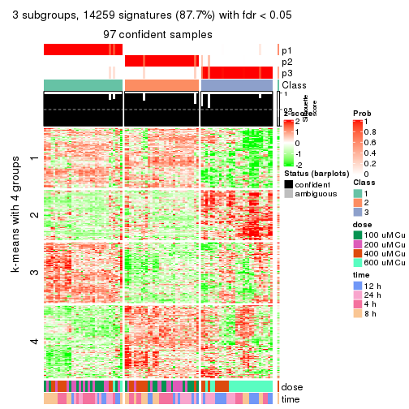</p>

</div>
<div id='tab-SD-NMF-get-signatures-3'>
<pre><code class="r">get_signatures(res, k = 4)
</code></pre>

<p></p>

</div>
<div id='tab-SD-NMF-get-signatures-4'>
<pre><code class="r">get_signatures(res, k = 5)
</code></pre>

<p></p>

</div>
<div id='tab-SD-NMF-get-signatures-5'>
<pre><code class="r">get_signatures(res, k = 6)
</code></pre>

<p></p>

</div>
</div>


Signature heatmaps where rows are not scaled:


<script>
$( function() {
	$( '#tabs-SD-NMF-get-signatures-no-scale' ).tabs();
} );
</script>
<div id='tabs-SD-NMF-get-signatures-no-scale'>
<ul>
<li><a href='#tab-SD-NMF-get-signatures-no-scale-1'>k = 2</a></li>
<li><a href='#tab-SD-NMF-get-signatures-no-scale-2'>k = 3</a></li>
<li><a href='#tab-SD-NMF-get-signatures-no-scale-3'>k = 4</a></li>
<li><a href='#tab-SD-NMF-get-signatures-no-scale-4'>k = 5</a></li>
<li><a href='#tab-SD-NMF-get-signatures-no-scale-5'>k = 6</a></li>
</ul>
<div id='tab-SD-NMF-get-signatures-no-scale-1'>
<pre><code class="r">get_signatures(res, k = 2, scale_rows = FALSE)
</code></pre>

<p></p>

</div>
<div id='tab-SD-NMF-get-signatures-no-scale-2'>
<pre><code class="r">get_signatures(res, k = 3, scale_rows = FALSE)
</code></pre>

<p></p>

</div>
<div id='tab-SD-NMF-get-signatures-no-scale-3'>
<pre><code class="r">get_signatures(res, k = 4, scale_rows = FALSE)
</code></pre>

<p></p>

</div>
<div id='tab-SD-NMF-get-signatures-no-scale-4'>
<pre><code class="r">get_signatures(res, k = 5, scale_rows = FALSE)
</code></pre>

<p></p>

</div>
<div id='tab-SD-NMF-get-signatures-no-scale-5'>
<pre><code class="r">get_signatures(res, k = 6, scale_rows = FALSE)
</code></pre>

<p></p>

</div>
</div>


Compare the overlap of signatures from different k:

```r
compare_signatures(res)
```


`get_signature()` returns a data frame invisibly. TO get the list of signatures, the function
call should be assigned to a variable explicitly. In following code, if `plot` argument is set
to `FALSE`, no heatmap is plotted while only the differential analysis is performed.

```r
# code only for demonstration
tb = get_signature(res, k = ..., plot = FALSE)
```

An example of the output of `tb` is:

```
#>   which_row         fdr    mean_1    mean_2 scaled_mean_1 scaled_mean_2 km
#> 1        38 0.042760348  8.373488  9.131774    -0.5533452     0.5164555  1
#> 2        40 0.018707592  7.106213  8.469186    -0.6173731     0.5762149  1
#> 3        55 0.019134737 10.221463 11.207825    -0.6159697     0.5749050  1
#> 4        59 0.006059896  5.921854  7.869574    -0.6899429     0.6439467  1
#> 5        60 0.018055526  8.928898 10.211722    -0.6204761     0.5791110  1
#> 6        98 0.009384629 15.714769 14.887706     0.6635654    -0.6193277  2
...
```

The columns in `tb` are:

1. `which_row`: row indices corresponding to the input matrix.
2. `fdr`: FDR for the differential test. 
3. `mean_x`: The mean value in group x.
4. `scaled_mean_x`: The mean value in group x after rows are scaled.
5. `km`: Row groups if k-means clustering is applied to rows.


UMAP plot which shows how samples are separated.


<script>
$( function() {
	$( '#tabs-SD-NMF-dimension-reduction' ).tabs();
} );
</script>
<div id='tabs-SD-NMF-dimension-reduction'>
<ul>
<li><a href='#tab-SD-NMF-dimension-reduction-1'>k = 2</a></li>
<li><a href='#tab-SD-NMF-dimension-reduction-2'>k = 3</a></li>
<li><a href='#tab-SD-NMF-dimension-reduction-3'>k = 4</a></li>
<li><a href='#tab-SD-NMF-dimension-reduction-4'>k = 5</a></li>
<li><a href='#tab-SD-NMF-dimension-reduction-5'>k = 6</a></li>
</ul>
<div id='tab-SD-NMF-dimension-reduction-1'>
<pre><code class="r">dimension_reduction(res, k = 2, method = &quot;UMAP&quot;)
</code></pre>

<p></p>

</div>
<div id='tab-SD-NMF-dimension-reduction-2'>
<pre><code class="r">dimension_reduction(res, k = 3, method = &quot;UMAP&quot;)
</code></pre>

<p></p>

</div>
<div id='tab-SD-NMF-dimension-reduction-3'>
<pre><code class="r">dimension_reduction(res, k = 4, method = &quot;UMAP&quot;)
</code></pre>

<p></p>

</div>
<div id='tab-SD-NMF-dimension-reduction-4'>
<pre><code class="r">dimension_reduction(res, k = 5, method = &quot;UMAP&quot;)
</code></pre>

<p></p>

</div>
<div id='tab-SD-NMF-dimension-reduction-5'>
<pre><code class="r">dimension_reduction(res, k = 6, method = &quot;UMAP&quot;)
</code></pre>

<p></p>

</div>
</div>


Following heatmap shows how subgroups are split when increasing `k`:

```r
collect_classes(res)
```


Test correlation between subgroups and known annotations. If the known
annotation is numeric, one-way ANOVA test is applied, and if the known
annotation is discrete, chi-squared contingency table test is applied.

```r
test_to_known_factors(res)
```

```
#>         n  dose(p)  time(p) k
#> SD:NMF 93 1.10e-10 8.26e-01 2
#> SD:NMF 97 1.47e-11 3.18e-01 3
#> SD:NMF 96 4.30e-15 7.01e-04 4
#> SD:NMF 92 7.04e-16 1.61e-06 5
#> SD:NMF 74 1.20e-15 1.90e-07 6
```


If matrix rows can be associated to genes, consider to use `GO_Enrichment(res,
...)` to perform function enrichment for the signature genes.


 

---------------------------------------------------


### CV:hclust*


The object with results only for a single top-value method and a single partition method 
can be extracted as:

```r
res = res_list["CV", "hclust"]
# you can also extract it by
# res = res_list["CV:hclust"]
```

A summary of `res` and all the functions that can be applied to it:

```r
res
```

```
#> A 'ConsensusPartition' object with k = 2, 3, 4, 5, 6.
#>   On a matrix with 16250 rows and 98 columns.
#>   Top rows (1000, 2000, 3000, 4000, 5000) are extracted by 'CV' method.
#>   Subgroups are detected by 'hclust' method.
#>   Performed in total 1250 partitions by row resampling.
#>   Best k for subgroups seems to be 2.
#> 
#> Following methods can be applied to this 'ConsensusPartition' object:
#>  [1] "cola_report"             "collect_classes"         "collect_plots"          
#>  [4] "collect_stats"           "colnames"                "compare_signatures"     
#>  [7] "consensus_heatmap"       "dimension_reduction"     "functional_enrichment"  
#> [10] "get_anno_col"            "get_anno"                "get_classes"            
#> [13] "get_consensus"           "get_matrix"              "get_membership"         
#> [16] "get_param"               "get_signatures"          "get_stats"              
#> [19] "is_best_k"               "is_stable_k"             "membership_heatmap"     
#> [22] "ncol"                    "nrow"                    "plot_ecdf"              
#> [25] "rownames"                "select_partition_number" "show"                   
#> [28] "suggest_best_k"          "test_to_known_factors"
```

`collect_plots()` function collects all the plots made from `res` for all `k` (number of partitions)
into one single page to provide an easy and fast comparison between different `k`.

```r
collect_plots(res)
```


The plots are:

- The first row: a plot of the ECDF (Empirical cumulative distribution
  function) curves of the consensus matrix for each `k` and the heatmap of
  predicted classes for each `k`.
- The second row: heatmaps of the consensus matrix for each `k`.
- The third row: heatmaps of the membership matrix for each `k`.
- The fouth row: heatmaps of the signatures for each `k`.

All the plots in panels can be made by individual functions and they are
plotted later in this section.

`select_partition_number()` produces several plots showing different
statistics for choosing "optimized" `k`. There are following statistics:

- ECDF curves of the consensus matrix for each `k`;
- 1-PAC. [The PAC
  score](https://en.wikipedia.org/wiki/Consensus_clustering#Over-interpretation_potential_of_consensus_clustering)
  measures the proportion of the ambiguous subgrouping.
- Mean silhouette score.
- Concordance. The mean probability of fiting the consensus class ids in all
  partitions.
- Area increased. Denote $A_k$ as the area under the ECDF curve for current
  `k`, the area increased is defined as $A_k - A_{k-1}$.
- Rand index. The percent of pairs of samples that are both in a same cluster
  or both are not in a same cluster in the partition of k and k-1.
- Jaccard index. The ratio of pairs of samples are both in a same cluster in
  the partition of k and k-1 and the pairs of samples are both in a same
  cluster in the partition k or k-1.

The detailed explanations of these statistics can be found in [the cola
vignette](http://bioconductor.org/packages/devel/bioc/vignettes/cola/inst/doc/cola.html#toc_13).

Generally speaking, lower PAC score, higher mean silhouette score or higher
concordance corresponds to better partition. Rand index and Jaccard index
measure how similar the current partition is compared to partition with `k-1`.
If they are too similar, we won't accept `k` is better than `k-1`.

```r
select_partition_number(res)
```


The numeric values for all these statistics can be obtained by `get_stats()`.

```r
get_stats(res)
```

```
#>   k 1-PAC mean_silhouette concordance area_increased  Rand Jaccard
#> 2 2 0.917           0.956       0.978         0.4863 0.508   0.508
#> 3 3 0.747           0.818       0.852         0.1555 0.969   0.939
#> 4 4 0.673           0.833       0.865         0.1383 0.928   0.849
#> 5 5 0.700           0.721       0.838         0.1300 0.918   0.796
#> 6 6 0.712           0.734       0.825         0.0213 0.972   0.915
```

`suggest_best_k()` suggests the best $k$ based on these statistics. The rules are as follows:

- All $k$ with Jaccard index larger than 0.95 are removed because the increase of
  the partition number does not provides enough extra information. If all $k$ are removed,
  the best $k$ is assigned by `NA`.
- For $k$ with 1-PAC larger than 0.9, the maximal $k$ is taken as the "best k". Other $k$ is called "optional k".
- If it does not fit the second rule. The $k$ with the highest vote of highest
  1-PAC, mean silhouette and concordance is taken as the "best k".

```r
suggest_best_k(res)
```

```
#> [1] 2
```


Following shows the table of the partitions (You need to click the **show/hide
code output** link to see it). The membership matrix (columns with name `p*`)
is inferred by
[`clue::cl_consensus()`](https://www.rdocumentation.org/link/cl_consensus?package=clue)
function with the `SE` method. Basically the value in the membership matrix
represents the probability to belong to a certain group. The finall class
label for an item is determined with the group with highest probability it
belongs to.

In `get_classes()` function, the entropy is calculated from the membership
matrix and the silhouette score is calculated from the consensus matrix.


<script>
$( function() {
	$( '#tabs-CV-hclust-get-classes' ).tabs();
} );
</script>
<div id='tabs-CV-hclust-get-classes'>
<ul>
<li><a href='#tab-CV-hclust-get-classes-1'>k = 2</a></li>
<li><a href='#tab-CV-hclust-get-classes-2'>k = 3</a></li>
<li><a href='#tab-CV-hclust-get-classes-3'>k = 4</a></li>
<li><a href='#tab-CV-hclust-get-classes-4'>k = 5</a></li>
<li><a href='#tab-CV-hclust-get-classes-5'>k = 6</a></li>
</ul>

<div id='tab-CV-hclust-get-classes-1'>
<p><a id='tab-CV-hclust-get-classes-1-a' style='color:#0366d6' href='#'>show/hide code output</a></p>
<pre><code class="r">cbind(get_classes(res, k = 2), get_membership(res, k = 2))
</code></pre>

<pre><code>#&gt;           class entropy silhouette    p1    p2
#&gt; GSM241451     1  0.0000      0.990 1.000 0.000
#&gt; GSM241452     1  0.0000      0.990 1.000 0.000
#&gt; GSM241453     1  0.0000      0.990 1.000 0.000
#&gt; GSM241454     1  0.0000      0.990 1.000 0.000
#&gt; GSM241455     1  0.0000      0.990 1.000 0.000
#&gt; GSM241456     1  0.0000      0.990 1.000 0.000
#&gt; GSM241457     1  0.0000      0.990 1.000 0.000
#&gt; GSM241458     1  0.0000      0.990 1.000 0.000
#&gt; GSM241459     1  0.0000      0.990 1.000 0.000
#&gt; GSM241460     1  0.0000      0.990 1.000 0.000
#&gt; GSM241461     1  0.0000      0.990 1.000 0.000
#&gt; GSM241462     1  0.0000      0.990 1.000 0.000
#&gt; GSM241463     1  0.0000      0.990 1.000 0.000
#&gt; GSM241464     1  0.0000      0.990 1.000 0.000
#&gt; GSM241465     1  0.0000      0.990 1.000 0.000
#&gt; GSM241466     1  0.0000      0.990 1.000 0.000
#&gt; GSM241467     1  0.0000      0.990 1.000 0.000
#&gt; GSM241468     1  0.0000      0.990 1.000 0.000
#&gt; GSM241469     1  0.0000      0.990 1.000 0.000
#&gt; GSM241470     1  0.0000      0.990 1.000 0.000
#&gt; GSM241471     1  0.0000      0.990 1.000 0.000
#&gt; GSM241472     1  0.0000      0.990 1.000 0.000
#&gt; GSM241473     1  0.0000      0.990 1.000 0.000
#&gt; GSM241474     1  0.0000      0.990 1.000 0.000
#&gt; GSM241475     1  0.0000      0.990 1.000 0.000
#&gt; GSM241476     1  0.0000      0.990 1.000 0.000
#&gt; GSM241477     1  0.0000      0.990 1.000 0.000
#&gt; GSM241478     1  0.0000      0.990 1.000 0.000
#&gt; GSM241479     1  0.0000      0.990 1.000 0.000
#&gt; GSM241480     1  0.0000      0.990 1.000 0.000
#&gt; GSM241481     1  0.0000      0.990 1.000 0.000
#&gt; GSM241482     1  0.0000      0.990 1.000 0.000
#&gt; GSM241483     1  0.0376      0.987 0.996 0.004
#&gt; GSM241484     1  0.0000      0.990 1.000 0.000
#&gt; GSM241485     1  0.0000      0.990 1.000 0.000
#&gt; GSM241486     1  0.0000      0.990 1.000 0.000
#&gt; GSM241487     1  0.0000      0.990 1.000 0.000
#&gt; GSM241488     1  0.0938      0.982 0.988 0.012
#&gt; GSM241489     1  0.0000      0.990 1.000 0.000
#&gt; GSM241490     1  0.0000      0.990 1.000 0.000
#&gt; GSM241491     1  0.0000      0.990 1.000 0.000
#&gt; GSM241492     1  0.0000      0.990 1.000 0.000
#&gt; GSM241493     1  0.0000      0.990 1.000 0.000
#&gt; GSM241494     1  0.0000      0.990 1.000 0.000
#&gt; GSM241495     1  0.0000      0.990 1.000 0.000
#&gt; GSM241496     1  0.0938      0.982 0.988 0.012
#&gt; GSM241497     1  0.0938      0.982 0.988 0.012
#&gt; GSM241498     1  0.0000      0.990 1.000 0.000
#&gt; GSM241499     1  0.2778      0.949 0.952 0.048
#&gt; GSM241500     1  0.0938      0.982 0.988 0.012
#&gt; GSM241501     1  0.0938      0.982 0.988 0.012
#&gt; GSM241502     1  0.0938      0.982 0.988 0.012
#&gt; GSM241503     1  0.2778      0.949 0.952 0.048
#&gt; GSM241504     1  0.2778      0.949 0.952 0.048
#&gt; GSM241505     1  0.2778      0.949 0.952 0.048
#&gt; GSM241506     1  0.0938      0.982 0.988 0.012
#&gt; GSM241507     2  0.7883      0.726 0.236 0.764
#&gt; GSM241508     1  0.8207      0.635 0.744 0.256
#&gt; GSM241509     2  0.0376      0.957 0.004 0.996
#&gt; GSM241510     2  0.9000      0.573 0.316 0.684
#&gt; GSM241511     2  0.7883      0.726 0.236 0.764
#&gt; GSM241512     2  0.0376      0.957 0.004 0.996
#&gt; GSM241513     2  0.2948      0.934 0.052 0.948
#&gt; GSM241514     2  0.2948      0.934 0.052 0.948
#&gt; GSM241515     2  0.2948      0.934 0.052 0.948
#&gt; GSM241516     2  0.2948      0.934 0.052 0.948
#&gt; GSM241517     2  0.0672      0.956 0.008 0.992
#&gt; GSM241518     2  0.0672      0.956 0.008 0.992
#&gt; GSM241519     2  0.0000      0.958 0.000 1.000
#&gt; GSM241520     2  0.0000      0.958 0.000 1.000
#&gt; GSM241521     2  0.4815      0.893 0.104 0.896
#&gt; GSM241522     2  0.4815      0.893 0.104 0.896
#&gt; GSM241523     2  0.2423      0.941 0.040 0.960
#&gt; GSM241524     2  0.2423      0.941 0.040 0.960
#&gt; GSM241525     2  0.0000      0.958 0.000 1.000
#&gt; GSM241526     2  0.0000      0.958 0.000 1.000
#&gt; GSM241527     2  0.0000      0.958 0.000 1.000
#&gt; GSM241528     2  0.0000      0.958 0.000 1.000
#&gt; GSM241529     2  0.0000      0.958 0.000 1.000
#&gt; GSM241530     2  0.0000      0.958 0.000 1.000
#&gt; GSM241531     2  0.6438      0.822 0.164 0.836
#&gt; GSM241532     2  0.0938      0.954 0.012 0.988
#&gt; GSM241533     2  0.0000      0.958 0.000 1.000
#&gt; GSM241534     2  0.0000      0.958 0.000 1.000
#&gt; GSM241535     2  0.0000      0.958 0.000 1.000
#&gt; GSM241536     2  0.6438      0.822 0.164 0.836
#&gt; GSM241537     2  0.0000      0.958 0.000 1.000
#&gt; GSM241538     2  0.0000      0.958 0.000 1.000
#&gt; GSM241539     2  0.0000      0.958 0.000 1.000
#&gt; GSM241540     2  0.0000      0.958 0.000 1.000
#&gt; GSM241541     2  0.0000      0.958 0.000 1.000
#&gt; GSM241542     2  0.0000      0.958 0.000 1.000
#&gt; GSM241543     2  0.0000      0.958 0.000 1.000
#&gt; GSM241544     2  0.0000      0.958 0.000 1.000
#&gt; GSM241545     2  0.0000      0.958 0.000 1.000
#&gt; GSM241546     2  0.0000      0.958 0.000 1.000
#&gt; GSM241547     2  0.0000      0.958 0.000 1.000
#&gt; GSM241548     2  0.0000      0.958 0.000 1.000
</code></pre>

<script>
$('#tab-CV-hclust-get-classes-1-a').parent().next().next().hide();
$('#tab-CV-hclust-get-classes-1-a').click(function(){
  $('#tab-CV-hclust-get-classes-1-a').parent().next().next().toggle();
  return(false);
});
</script>
</div>

<div id='tab-CV-hclust-get-classes-2'>
<p><a id='tab-CV-hclust-get-classes-2-a' style='color:#0366d6' href='#'>show/hide code output</a></p>
<pre><code class="r">cbind(get_classes(res, k = 3), get_membership(res, k = 3))
</code></pre>

<pre><code>#&gt;           class entropy silhouette    p1    p2    p3
#&gt; GSM241451     2  0.1411      0.928 0.036 0.964 0.000
#&gt; GSM241452     2  0.1860      0.932 0.052 0.948 0.000
#&gt; GSM241453     2  0.1411      0.928 0.036 0.964 0.000
#&gt; GSM241454     2  0.1860      0.932 0.052 0.948 0.000
#&gt; GSM241455     2  0.1411      0.928 0.036 0.964 0.000
#&gt; GSM241456     2  0.1860      0.932 0.052 0.948 0.000
#&gt; GSM241457     2  0.2448      0.904 0.076 0.924 0.000
#&gt; GSM241458     2  0.1964      0.932 0.056 0.944 0.000
#&gt; GSM241459     2  0.2448      0.904 0.076 0.924 0.000
#&gt; GSM241460     2  0.1964      0.932 0.056 0.944 0.000
#&gt; GSM241461     2  0.3267      0.875 0.116 0.884 0.000
#&gt; GSM241462     2  0.1964      0.932 0.056 0.944 0.000
#&gt; GSM241463     2  0.0237      0.933 0.004 0.996 0.000
#&gt; GSM241464     2  0.0237      0.933 0.004 0.996 0.000
#&gt; GSM241465     2  0.2165      0.911 0.064 0.936 0.000
#&gt; GSM241466     2  0.1860      0.932 0.052 0.948 0.000
#&gt; GSM241467     2  0.1860      0.932 0.052 0.948 0.000
#&gt; GSM241468     2  0.2711      0.898 0.088 0.912 0.000
#&gt; GSM241469     2  0.1860      0.932 0.052 0.948 0.000
#&gt; GSM241470     2  0.1411      0.928 0.036 0.964 0.000
#&gt; GSM241471     2  0.2448      0.904 0.076 0.924 0.000
#&gt; GSM241472     2  0.1964      0.932 0.056 0.944 0.000
#&gt; GSM241473     2  0.2448      0.904 0.076 0.924 0.000
#&gt; GSM241474     2  0.1964      0.932 0.056 0.944 0.000
#&gt; GSM241475     2  0.1411      0.928 0.036 0.964 0.000
#&gt; GSM241476     2  0.1860      0.932 0.052 0.948 0.000
#&gt; GSM241477     2  0.1411      0.928 0.036 0.964 0.000
#&gt; GSM241478     2  0.1411      0.928 0.036 0.964 0.000
#&gt; GSM241479     2  0.1860      0.932 0.052 0.948 0.000
#&gt; GSM241480     2  0.1860      0.932 0.052 0.948 0.000
#&gt; GSM241481     2  0.2448      0.904 0.076 0.924 0.000
#&gt; GSM241482     2  0.1964      0.932 0.056 0.944 0.000
#&gt; GSM241483     2  0.1289      0.930 0.032 0.968 0.000
#&gt; GSM241484     2  0.1964      0.932 0.056 0.944 0.000
#&gt; GSM241485     2  0.1964      0.932 0.056 0.944 0.000
#&gt; GSM241486     2  0.3267      0.875 0.116 0.884 0.000
#&gt; GSM241487     2  0.2165      0.911 0.064 0.936 0.000
#&gt; GSM241488     2  0.1031      0.931 0.024 0.976 0.000
#&gt; GSM241489     2  0.1860      0.932 0.052 0.948 0.000
#&gt; GSM241490     2  0.1860      0.932 0.052 0.948 0.000
#&gt; GSM241491     2  0.0237      0.933 0.004 0.996 0.000
#&gt; GSM241492     2  0.0237      0.933 0.004 0.996 0.000
#&gt; GSM241493     2  0.1411      0.928 0.036 0.964 0.000
#&gt; GSM241494     2  0.1964      0.932 0.056 0.944 0.000
#&gt; GSM241495     2  0.1411      0.928 0.036 0.964 0.000
#&gt; GSM241496     2  0.1031      0.931 0.024 0.976 0.000
#&gt; GSM241497     2  0.2165      0.927 0.064 0.936 0.000
#&gt; GSM241498     2  0.1860      0.932 0.052 0.948 0.000
#&gt; GSM241499     2  0.2959      0.903 0.100 0.900 0.000
#&gt; GSM241500     2  0.2537      0.907 0.080 0.920 0.000
#&gt; GSM241501     2  0.2537      0.907 0.080 0.920 0.000
#&gt; GSM241502     2  0.2165      0.914 0.064 0.936 0.000
#&gt; GSM241503     2  0.2959      0.903 0.100 0.900 0.000
#&gt; GSM241504     2  0.2959      0.903 0.100 0.900 0.000
#&gt; GSM241505     2  0.2959      0.903 0.100 0.900 0.000
#&gt; GSM241506     2  0.2537      0.907 0.080 0.920 0.000
#&gt; GSM241507     1  0.9042      0.907 0.544 0.176 0.280
#&gt; GSM241508     2  0.8265      0.422 0.180 0.636 0.184
#&gt; GSM241509     3  0.1289      0.710 0.032 0.000 0.968
#&gt; GSM241510     3  0.9187     -0.423 0.196 0.272 0.532
#&gt; GSM241511     1  0.9042      0.907 0.544 0.176 0.280
#&gt; GSM241512     3  0.1289      0.710 0.032 0.000 0.968
#&gt; GSM241513     3  0.7442      0.691 0.348 0.048 0.604
#&gt; GSM241514     3  0.7442      0.691 0.348 0.048 0.604
#&gt; GSM241515     3  0.7442      0.691 0.348 0.048 0.604
#&gt; GSM241516     3  0.7442      0.691 0.348 0.048 0.604
#&gt; GSM241517     3  0.6033      0.726 0.336 0.004 0.660
#&gt; GSM241518     3  0.6033      0.726 0.336 0.004 0.660
#&gt; GSM241519     3  0.5760      0.730 0.328 0.000 0.672
#&gt; GSM241520     3  0.5760      0.730 0.328 0.000 0.672
#&gt; GSM241521     3  0.8408      0.618 0.344 0.100 0.556
#&gt; GSM241522     3  0.8408      0.618 0.344 0.100 0.556
#&gt; GSM241523     3  0.7128      0.703 0.344 0.036 0.620
#&gt; GSM241524     3  0.7128      0.703 0.344 0.036 0.620
#&gt; GSM241525     3  0.0000      0.705 0.000 0.000 1.000
#&gt; GSM241526     3  0.0000      0.705 0.000 0.000 1.000
#&gt; GSM241527     3  0.0000      0.705 0.000 0.000 1.000
#&gt; GSM241528     3  0.0000      0.705 0.000 0.000 1.000
#&gt; GSM241529     3  0.0000      0.705 0.000 0.000 1.000
#&gt; GSM241530     3  0.0000      0.705 0.000 0.000 1.000
#&gt; GSM241531     1  0.8470      0.902 0.552 0.104 0.344
#&gt; GSM241532     3  0.4784      0.380 0.200 0.004 0.796
#&gt; GSM241533     3  0.3482      0.540 0.128 0.000 0.872
#&gt; GSM241534     3  0.0000      0.705 0.000 0.000 1.000
#&gt; GSM241535     3  0.0000      0.705 0.000 0.000 1.000
#&gt; GSM241536     1  0.8470      0.902 0.552 0.104 0.344
#&gt; GSM241537     3  0.0000      0.705 0.000 0.000 1.000
#&gt; GSM241538     3  0.0000      0.705 0.000 0.000 1.000
#&gt; GSM241539     3  0.0000      0.705 0.000 0.000 1.000
#&gt; GSM241540     3  0.0000      0.705 0.000 0.000 1.000
#&gt; GSM241541     3  0.0000      0.705 0.000 0.000 1.000
#&gt; GSM241542     3  0.0000      0.705 0.000 0.000 1.000
#&gt; GSM241543     3  0.5760      0.730 0.328 0.000 0.672
#&gt; GSM241544     3  0.5760      0.730 0.328 0.000 0.672
#&gt; GSM241545     3  0.5760      0.730 0.328 0.000 0.672
#&gt; GSM241546     3  0.5760      0.730 0.328 0.000 0.672
#&gt; GSM241547     3  0.5760      0.730 0.328 0.000 0.672
#&gt; GSM241548     3  0.5760      0.730 0.328 0.000 0.672
</code></pre>

<script>
$('#tab-CV-hclust-get-classes-2-a').parent().next().next().hide();
$('#tab-CV-hclust-get-classes-2-a').click(function(){
  $('#tab-CV-hclust-get-classes-2-a').parent().next().next().toggle();
  return(false);
});
</script>
</div>

<div id='tab-CV-hclust-get-classes-3'>
<p><a id='tab-CV-hclust-get-classes-3-a' style='color:#0366d6' href='#'>show/hide code output</a></p>
<pre><code class="r">cbind(get_classes(res, k = 4), get_membership(res, k = 4))
</code></pre>

<pre><code>#&gt;           class entropy silhouette    p1    p2    p3    p4
#&gt; GSM241451     2  0.2814      0.808 0.132 0.868 0.000 0.000
#&gt; GSM241452     2  0.2704      0.839 0.124 0.876 0.000 0.000
#&gt; GSM241453     2  0.2814      0.808 0.132 0.868 0.000 0.000
#&gt; GSM241454     2  0.2704      0.839 0.124 0.876 0.000 0.000
#&gt; GSM241455     2  0.2814      0.808 0.132 0.868 0.000 0.000
#&gt; GSM241456     2  0.2704      0.839 0.124 0.876 0.000 0.000
#&gt; GSM241457     2  0.2281      0.816 0.096 0.904 0.000 0.000
#&gt; GSM241458     2  0.2281      0.839 0.096 0.904 0.000 0.000
#&gt; GSM241459     2  0.2281      0.816 0.096 0.904 0.000 0.000
#&gt; GSM241460     2  0.2281      0.839 0.096 0.904 0.000 0.000
#&gt; GSM241461     2  0.5252      0.634 0.336 0.644 0.020 0.000
#&gt; GSM241462     2  0.2281      0.839 0.096 0.904 0.000 0.000
#&gt; GSM241463     2  0.0188      0.843 0.004 0.996 0.000 0.000
#&gt; GSM241464     2  0.0188      0.843 0.004 0.996 0.000 0.000
#&gt; GSM241465     2  0.1940      0.824 0.076 0.924 0.000 0.000
#&gt; GSM241466     2  0.2704      0.839 0.124 0.876 0.000 0.000
#&gt; GSM241467     2  0.2704      0.839 0.124 0.876 0.000 0.000
#&gt; GSM241468     2  0.3688      0.768 0.208 0.792 0.000 0.000
#&gt; GSM241469     2  0.2704      0.839 0.124 0.876 0.000 0.000
#&gt; GSM241470     2  0.2814      0.808 0.132 0.868 0.000 0.000
#&gt; GSM241471     2  0.2345      0.815 0.100 0.900 0.000 0.000
#&gt; GSM241472     2  0.2281      0.839 0.096 0.904 0.000 0.000
#&gt; GSM241473     2  0.2345      0.815 0.100 0.900 0.000 0.000
#&gt; GSM241474     2  0.2281      0.839 0.096 0.904 0.000 0.000
#&gt; GSM241475     2  0.2814      0.808 0.132 0.868 0.000 0.000
#&gt; GSM241476     2  0.2704      0.839 0.124 0.876 0.000 0.000
#&gt; GSM241477     2  0.2814      0.808 0.132 0.868 0.000 0.000
#&gt; GSM241478     2  0.2814      0.808 0.132 0.868 0.000 0.000
#&gt; GSM241479     2  0.2704      0.839 0.124 0.876 0.000 0.000
#&gt; GSM241480     2  0.2704      0.839 0.124 0.876 0.000 0.000
#&gt; GSM241481     2  0.2281      0.816 0.096 0.904 0.000 0.000
#&gt; GSM241482     2  0.2281      0.839 0.096 0.904 0.000 0.000
#&gt; GSM241483     2  0.4095      0.781 0.192 0.792 0.016 0.000
#&gt; GSM241484     2  0.2408      0.840 0.104 0.896 0.000 0.000
#&gt; GSM241485     2  0.2281      0.839 0.096 0.904 0.000 0.000
#&gt; GSM241486     2  0.5252      0.634 0.336 0.644 0.020 0.000
#&gt; GSM241487     2  0.1940      0.824 0.076 0.924 0.000 0.000
#&gt; GSM241488     2  0.3763      0.802 0.144 0.832 0.024 0.000
#&gt; GSM241489     2  0.2704      0.839 0.124 0.876 0.000 0.000
#&gt; GSM241490     2  0.2704      0.839 0.124 0.876 0.000 0.000
#&gt; GSM241491     2  0.0188      0.843 0.004 0.996 0.000 0.000
#&gt; GSM241492     2  0.0188      0.843 0.004 0.996 0.000 0.000
#&gt; GSM241493     2  0.2814      0.808 0.132 0.868 0.000 0.000
#&gt; GSM241494     2  0.2408      0.840 0.104 0.896 0.000 0.000
#&gt; GSM241495     2  0.2814      0.808 0.132 0.868 0.000 0.000
#&gt; GSM241496     2  0.3763      0.802 0.144 0.832 0.024 0.000
#&gt; GSM241497     2  0.3552      0.829 0.128 0.848 0.024 0.000
#&gt; GSM241498     2  0.2704      0.839 0.124 0.876 0.000 0.000
#&gt; GSM241499     2  0.4004      0.806 0.164 0.812 0.024 0.000
#&gt; GSM241500     2  0.4993      0.706 0.260 0.712 0.028 0.000
#&gt; GSM241501     2  0.4993      0.706 0.260 0.712 0.028 0.000
#&gt; GSM241502     2  0.4775      0.729 0.232 0.740 0.028 0.000
#&gt; GSM241503     2  0.4004      0.806 0.164 0.812 0.024 0.000
#&gt; GSM241504     2  0.4004      0.806 0.164 0.812 0.024 0.000
#&gt; GSM241505     2  0.4004      0.806 0.164 0.812 0.024 0.000
#&gt; GSM241506     2  0.4993      0.706 0.260 0.712 0.028 0.000
#&gt; GSM241507     1  0.7097      0.902 0.596 0.168 0.008 0.228
#&gt; GSM241508     2  0.7705      0.323 0.248 0.536 0.016 0.200
#&gt; GSM241509     4  0.3024      0.841 0.000 0.000 0.148 0.852
#&gt; GSM241510     4  0.7154     -0.188 0.160 0.248 0.008 0.584
#&gt; GSM241511     1  0.7097      0.902 0.596 0.168 0.008 0.228
#&gt; GSM241512     4  0.3024      0.841 0.000 0.000 0.148 0.852
#&gt; GSM241513     3  0.1843      0.932 0.016 0.028 0.948 0.008
#&gt; GSM241514     3  0.1843      0.932 0.016 0.028 0.948 0.008
#&gt; GSM241515     3  0.1843      0.932 0.016 0.028 0.948 0.008
#&gt; GSM241516     3  0.1843      0.932 0.016 0.028 0.948 0.008
#&gt; GSM241517     3  0.1488      0.943 0.012 0.000 0.956 0.032
#&gt; GSM241518     3  0.1488      0.943 0.012 0.000 0.956 0.032
#&gt; GSM241519     3  0.0921      0.946 0.000 0.000 0.972 0.028
#&gt; GSM241520     3  0.0921      0.946 0.000 0.000 0.972 0.028
#&gt; GSM241521     3  0.2706      0.858 0.020 0.080 0.900 0.000
#&gt; GSM241522     3  0.2706      0.858 0.020 0.080 0.900 0.000
#&gt; GSM241523     3  0.1191      0.938 0.004 0.024 0.968 0.004
#&gt; GSM241524     3  0.1191      0.938 0.004 0.024 0.968 0.004
#&gt; GSM241525     4  0.1867      0.911 0.000 0.000 0.072 0.928
#&gt; GSM241526     4  0.1867      0.911 0.000 0.000 0.072 0.928
#&gt; GSM241527     4  0.1867      0.911 0.000 0.000 0.072 0.928
#&gt; GSM241528     4  0.1867      0.911 0.000 0.000 0.072 0.928
#&gt; GSM241529     4  0.1867      0.911 0.000 0.000 0.072 0.928
#&gt; GSM241530     4  0.1867      0.911 0.000 0.000 0.072 0.928
#&gt; GSM241531     1  0.6764      0.893 0.596 0.100 0.008 0.296
#&gt; GSM241532     4  0.3142      0.649 0.132 0.000 0.008 0.860
#&gt; GSM241533     4  0.2773      0.762 0.072 0.000 0.028 0.900
#&gt; GSM241534     4  0.1867      0.911 0.000 0.000 0.072 0.928
#&gt; GSM241535     4  0.1867      0.911 0.000 0.000 0.072 0.928
#&gt; GSM241536     1  0.6764      0.893 0.596 0.100 0.008 0.296
#&gt; GSM241537     4  0.2596      0.907 0.024 0.000 0.068 0.908
#&gt; GSM241538     4  0.2596      0.907 0.024 0.000 0.068 0.908
#&gt; GSM241539     4  0.2596      0.907 0.024 0.000 0.068 0.908
#&gt; GSM241540     4  0.2596      0.907 0.024 0.000 0.068 0.908
#&gt; GSM241541     4  0.2596      0.907 0.024 0.000 0.068 0.908
#&gt; GSM241542     4  0.2596      0.907 0.024 0.000 0.068 0.908
#&gt; GSM241543     3  0.1022      0.946 0.000 0.000 0.968 0.032
#&gt; GSM241544     3  0.1022      0.946 0.000 0.000 0.968 0.032
#&gt; GSM241545     3  0.1022      0.946 0.000 0.000 0.968 0.032
#&gt; GSM241546     3  0.1022      0.946 0.000 0.000 0.968 0.032
#&gt; GSM241547     3  0.1022      0.946 0.000 0.000 0.968 0.032
#&gt; GSM241548     3  0.1022      0.946 0.000 0.000 0.968 0.032
</code></pre>

<script>
$('#tab-CV-hclust-get-classes-3-a').parent().next().next().hide();
$('#tab-CV-hclust-get-classes-3-a').click(function(){
  $('#tab-CV-hclust-get-classes-3-a').parent().next().next().toggle();
  return(false);
});
</script>
</div>

<div id='tab-CV-hclust-get-classes-4'>
<p><a id='tab-CV-hclust-get-classes-4-a' style='color:#0366d6' href='#'>show/hide code output</a></p>
<pre><code class="r">cbind(get_classes(res, k = 5), get_membership(res, k = 5))
</code></pre>

<pre><code>#&gt;           class entropy silhouette    p1    p2    p3    p4    p5
#&gt; GSM241451     1  0.4227      0.586 0.580 0.000 0.000 0.000 0.420
#&gt; GSM241452     1  0.0609      0.637 0.980 0.000 0.000 0.000 0.020
#&gt; GSM241453     1  0.4227      0.586 0.580 0.000 0.000 0.000 0.420
#&gt; GSM241454     1  0.0000      0.643 1.000 0.000 0.000 0.000 0.000
#&gt; GSM241455     1  0.4227      0.588 0.580 0.000 0.000 0.000 0.420
#&gt; GSM241456     1  0.0609      0.637 0.980 0.000 0.000 0.000 0.020
#&gt; GSM241457     1  0.4297      0.574 0.528 0.000 0.000 0.000 0.472
#&gt; GSM241458     1  0.3480      0.684 0.752 0.000 0.000 0.000 0.248
#&gt; GSM241459     1  0.4297      0.574 0.528 0.000 0.000 0.000 0.472
#&gt; GSM241460     1  0.3480      0.684 0.752 0.000 0.000 0.000 0.248
#&gt; GSM241461     5  0.3480      0.777 0.248 0.000 0.000 0.000 0.752
#&gt; GSM241462     1  0.3480      0.684 0.752 0.000 0.000 0.000 0.248
#&gt; GSM241463     1  0.3983      0.674 0.660 0.000 0.000 0.000 0.340
#&gt; GSM241464     1  0.3983      0.674 0.660 0.000 0.000 0.000 0.340
#&gt; GSM241465     1  0.4242      0.628 0.572 0.000 0.000 0.000 0.428
#&gt; GSM241466     1  0.0000      0.643 1.000 0.000 0.000 0.000 0.000
#&gt; GSM241467     1  0.0162      0.644 0.996 0.000 0.000 0.000 0.004
#&gt; GSM241468     1  0.4210      0.407 0.588 0.000 0.000 0.000 0.412
#&gt; GSM241469     1  0.0609      0.637 0.980 0.000 0.000 0.000 0.020
#&gt; GSM241470     1  0.4227      0.586 0.580 0.000 0.000 0.000 0.420
#&gt; GSM241471     1  0.4300      0.570 0.524 0.000 0.000 0.000 0.476
#&gt; GSM241472     1  0.3336      0.690 0.772 0.000 0.000 0.000 0.228
#&gt; GSM241473     1  0.4300      0.570 0.524 0.000 0.000 0.000 0.476
#&gt; GSM241474     1  0.3336      0.690 0.772 0.000 0.000 0.000 0.228
#&gt; GSM241475     1  0.4227      0.586 0.580 0.000 0.000 0.000 0.420
#&gt; GSM241476     1  0.0609      0.637 0.980 0.000 0.000 0.000 0.020
#&gt; GSM241477     1  0.4227      0.586 0.580 0.000 0.000 0.000 0.420
#&gt; GSM241478     1  0.4227      0.588 0.580 0.000 0.000 0.000 0.420
#&gt; GSM241479     1  0.0609      0.637 0.980 0.000 0.000 0.000 0.020
#&gt; GSM241480     1  0.0000      0.643 1.000 0.000 0.000 0.000 0.000
#&gt; GSM241481     1  0.4297      0.574 0.528 0.000 0.000 0.000 0.472
#&gt; GSM241482     1  0.3480      0.684 0.752 0.000 0.000 0.000 0.248
#&gt; GSM241483     5  0.4449      0.390 0.484 0.004 0.000 0.000 0.512
#&gt; GSM241484     1  0.2280      0.678 0.880 0.000 0.000 0.000 0.120
#&gt; GSM241485     1  0.3480      0.684 0.752 0.000 0.000 0.000 0.248
#&gt; GSM241486     5  0.3480      0.777 0.248 0.000 0.000 0.000 0.752
#&gt; GSM241487     1  0.4242      0.628 0.572 0.000 0.000 0.000 0.428
#&gt; GSM241488     1  0.4016      0.327 0.716 0.012 0.000 0.000 0.272
#&gt; GSM241489     1  0.0609      0.641 0.980 0.000 0.000 0.000 0.020
#&gt; GSM241490     1  0.0404      0.641 0.988 0.000 0.000 0.000 0.012
#&gt; GSM241491     1  0.3983      0.674 0.660 0.000 0.000 0.000 0.340
#&gt; GSM241492     1  0.3983      0.674 0.660 0.000 0.000 0.000 0.340
#&gt; GSM241493     1  0.4227      0.586 0.580 0.000 0.000 0.000 0.420
#&gt; GSM241494     1  0.2377      0.682 0.872 0.000 0.000 0.000 0.128
#&gt; GSM241495     1  0.4227      0.586 0.580 0.000 0.000 0.000 0.420
#&gt; GSM241496     1  0.4016      0.327 0.716 0.012 0.000 0.000 0.272
#&gt; GSM241497     1  0.2006      0.557 0.916 0.012 0.000 0.000 0.072
#&gt; GSM241498     1  0.0609      0.637 0.980 0.000 0.000 0.000 0.020
#&gt; GSM241499     1  0.2654      0.521 0.888 0.048 0.000 0.000 0.064
#&gt; GSM241500     5  0.4288      0.836 0.324 0.012 0.000 0.000 0.664
#&gt; GSM241501     5  0.4288      0.836 0.324 0.012 0.000 0.000 0.664
#&gt; GSM241502     5  0.4444      0.807 0.364 0.012 0.000 0.000 0.624
#&gt; GSM241503     1  0.2654      0.521 0.888 0.048 0.000 0.000 0.064
#&gt; GSM241504     1  0.2654      0.521 0.888 0.048 0.000 0.000 0.064
#&gt; GSM241505     1  0.2654      0.521 0.888 0.048 0.000 0.000 0.064
#&gt; GSM241506     5  0.4288      0.836 0.324 0.012 0.000 0.000 0.664
#&gt; GSM241507     2  0.2249      0.911 0.096 0.896 0.000 0.000 0.008
#&gt; GSM241508     5  0.7234      0.454 0.276 0.236 0.000 0.032 0.456
#&gt; GSM241509     4  0.3073      0.832 0.000 0.052 0.076 0.868 0.004
#&gt; GSM241510     4  0.8043     -0.139 0.196 0.344 0.000 0.352 0.108
#&gt; GSM241511     2  0.2249      0.911 0.096 0.896 0.000 0.000 0.008
#&gt; GSM241512     4  0.3073      0.832 0.000 0.052 0.076 0.868 0.004
#&gt; GSM241513     3  0.2374      0.934 0.000 0.020 0.912 0.016 0.052
#&gt; GSM241514     3  0.2374      0.934 0.000 0.020 0.912 0.016 0.052
#&gt; GSM241515     3  0.2374      0.934 0.000 0.020 0.912 0.016 0.052
#&gt; GSM241516     3  0.2374      0.934 0.000 0.020 0.912 0.016 0.052
#&gt; GSM241517     3  0.1087      0.945 0.000 0.008 0.968 0.016 0.008
#&gt; GSM241518     3  0.1087      0.945 0.000 0.008 0.968 0.016 0.008
#&gt; GSM241519     3  0.0000      0.949 0.000 0.000 1.000 0.000 0.000
#&gt; GSM241520     3  0.0000      0.949 0.000 0.000 1.000 0.000 0.000
#&gt; GSM241521     3  0.3209      0.879 0.052 0.024 0.872 0.000 0.052
#&gt; GSM241522     3  0.3209      0.879 0.052 0.024 0.872 0.000 0.052
#&gt; GSM241523     3  0.1444      0.943 0.000 0.012 0.948 0.000 0.040
#&gt; GSM241524     3  0.1444      0.943 0.000 0.012 0.948 0.000 0.040
#&gt; GSM241525     4  0.2011      0.874 0.000 0.088 0.004 0.908 0.000
#&gt; GSM241526     4  0.2011      0.874 0.000 0.088 0.004 0.908 0.000
#&gt; GSM241527     4  0.2011      0.874 0.000 0.088 0.004 0.908 0.000
#&gt; GSM241528     4  0.2011      0.874 0.000 0.088 0.004 0.908 0.000
#&gt; GSM241529     4  0.2011      0.874 0.000 0.088 0.004 0.908 0.000
#&gt; GSM241530     4  0.2011      0.874 0.000 0.088 0.004 0.908 0.000
#&gt; GSM241531     2  0.0880      0.916 0.032 0.968 0.000 0.000 0.000
#&gt; GSM241532     4  0.4235      0.446 0.000 0.424 0.000 0.576 0.000
#&gt; GSM241533     4  0.3741      0.717 0.000 0.264 0.004 0.732 0.000
#&gt; GSM241534     4  0.1892      0.874 0.000 0.080 0.004 0.916 0.000
#&gt; GSM241535     4  0.1892      0.874 0.000 0.080 0.004 0.916 0.000
#&gt; GSM241536     2  0.0880      0.916 0.032 0.968 0.000 0.000 0.000
#&gt; GSM241537     4  0.0880      0.851 0.000 0.032 0.000 0.968 0.000
#&gt; GSM241538     4  0.0880      0.851 0.000 0.032 0.000 0.968 0.000
#&gt; GSM241539     4  0.0880      0.851 0.000 0.032 0.000 0.968 0.000
#&gt; GSM241540     4  0.0880      0.851 0.000 0.032 0.000 0.968 0.000
#&gt; GSM241541     4  0.0880      0.851 0.000 0.032 0.000 0.968 0.000
#&gt; GSM241542     4  0.0880      0.851 0.000 0.032 0.000 0.968 0.000
#&gt; GSM241543     3  0.0162      0.949 0.000 0.000 0.996 0.004 0.000
#&gt; GSM241544     3  0.0162      0.949 0.000 0.000 0.996 0.004 0.000
#&gt; GSM241545     3  0.0162      0.949 0.000 0.000 0.996 0.004 0.000
#&gt; GSM241546     3  0.0162      0.949 0.000 0.000 0.996 0.004 0.000
#&gt; GSM241547     3  0.0162      0.949 0.000 0.000 0.996 0.004 0.000
#&gt; GSM241548     3  0.0162      0.949 0.000 0.000 0.996 0.004 0.000
</code></pre>

<script>
$('#tab-CV-hclust-get-classes-4-a').parent().next().next().hide();
$('#tab-CV-hclust-get-classes-4-a').click(function(){
  $('#tab-CV-hclust-get-classes-4-a').parent().next().next().toggle();
  return(false);
});
</script>
</div>

<div id='tab-CV-hclust-get-classes-5'>
<p><a id='tab-CV-hclust-get-classes-5-a' style='color:#0366d6' href='#'>show/hide code output</a></p>
<pre><code class="r">cbind(get_classes(res, k = 6), get_membership(res, k = 6))
</code></pre>

<pre><code>#&gt;           class entropy silhouette    p1    p2    p3    p4    p5    p6
#&gt; GSM241451     1  0.3797     0.6015 0.580 0.000 0.000 0.000 0.420 0.000
#&gt; GSM241452     1  0.0547     0.6477 0.980 0.000 0.000 0.000 0.020 0.000
#&gt; GSM241453     1  0.3797     0.6015 0.580 0.000 0.000 0.000 0.420 0.000
#&gt; GSM241454     1  0.0000     0.6532 1.000 0.000 0.000 0.000 0.000 0.000
#&gt; GSM241455     1  0.3797     0.6030 0.580 0.000 0.000 0.000 0.420 0.000
#&gt; GSM241456     1  0.0547     0.6477 0.980 0.000 0.000 0.000 0.020 0.000
#&gt; GSM241457     1  0.3860     0.5846 0.528 0.000 0.000 0.000 0.472 0.000
#&gt; GSM241458     1  0.3126     0.6891 0.752 0.000 0.000 0.000 0.248 0.000
#&gt; GSM241459     1  0.3860     0.5846 0.528 0.000 0.000 0.000 0.472 0.000
#&gt; GSM241460     1  0.3126     0.6891 0.752 0.000 0.000 0.000 0.248 0.000
#&gt; GSM241461     5  0.3126     0.8231 0.248 0.000 0.000 0.000 0.752 0.000
#&gt; GSM241462     1  0.3126     0.6891 0.752 0.000 0.000 0.000 0.248 0.000
#&gt; GSM241463     1  0.3578     0.6802 0.660 0.000 0.000 0.000 0.340 0.000
#&gt; GSM241464     1  0.3578     0.6802 0.660 0.000 0.000 0.000 0.340 0.000
#&gt; GSM241465     1  0.3810     0.6366 0.572 0.000 0.000 0.000 0.428 0.000
#&gt; GSM241466     1  0.0000     0.6532 1.000 0.000 0.000 0.000 0.000 0.000
#&gt; GSM241467     1  0.0146     0.6541 0.996 0.000 0.000 0.000 0.004 0.000
#&gt; GSM241468     1  0.3782     0.4435 0.588 0.000 0.000 0.000 0.412 0.000
#&gt; GSM241469     1  0.0547     0.6477 0.980 0.000 0.000 0.000 0.020 0.000
#&gt; GSM241470     1  0.3797     0.6015 0.580 0.000 0.000 0.000 0.420 0.000
#&gt; GSM241471     1  0.3862     0.5817 0.524 0.000 0.000 0.000 0.476 0.000
#&gt; GSM241472     1  0.2996     0.6949 0.772 0.000 0.000 0.000 0.228 0.000
#&gt; GSM241473     1  0.3862     0.5817 0.524 0.000 0.000 0.000 0.476 0.000
#&gt; GSM241474     1  0.2996     0.6949 0.772 0.000 0.000 0.000 0.228 0.000
#&gt; GSM241475     1  0.3797     0.6015 0.580 0.000 0.000 0.000 0.420 0.000
#&gt; GSM241476     1  0.0547     0.6477 0.980 0.000 0.000 0.000 0.020 0.000
#&gt; GSM241477     1  0.3797     0.6015 0.580 0.000 0.000 0.000 0.420 0.000
#&gt; GSM241478     1  0.3797     0.6030 0.580 0.000 0.000 0.000 0.420 0.000
#&gt; GSM241479     1  0.0547     0.6477 0.980 0.000 0.000 0.000 0.020 0.000
#&gt; GSM241480     1  0.0000     0.6532 1.000 0.000 0.000 0.000 0.000 0.000
#&gt; GSM241481     1  0.3860     0.5846 0.528 0.000 0.000 0.000 0.472 0.000
#&gt; GSM241482     1  0.3126     0.6891 0.752 0.000 0.000 0.000 0.248 0.000
#&gt; GSM241483     1  0.4757    -0.3561 0.484 0.048 0.000 0.000 0.468 0.000
#&gt; GSM241484     1  0.2048     0.6856 0.880 0.000 0.000 0.000 0.120 0.000
#&gt; GSM241485     1  0.3126     0.6891 0.752 0.000 0.000 0.000 0.248 0.000
#&gt; GSM241486     5  0.3126     0.8231 0.248 0.000 0.000 0.000 0.752 0.000
#&gt; GSM241487     1  0.3810     0.6366 0.572 0.000 0.000 0.000 0.428 0.000
#&gt; GSM241488     1  0.4117     0.3970 0.716 0.056 0.000 0.000 0.228 0.000
#&gt; GSM241489     1  0.0547     0.6513 0.980 0.000 0.000 0.000 0.020 0.000
#&gt; GSM241490     1  0.0363     0.6513 0.988 0.000 0.000 0.000 0.012 0.000
#&gt; GSM241491     1  0.3578     0.6802 0.660 0.000 0.000 0.000 0.340 0.000
#&gt; GSM241492     1  0.3578     0.6802 0.660 0.000 0.000 0.000 0.340 0.000
#&gt; GSM241493     1  0.3797     0.6015 0.580 0.000 0.000 0.000 0.420 0.000
#&gt; GSM241494     1  0.2135     0.6888 0.872 0.000 0.000 0.000 0.128 0.000
#&gt; GSM241495     1  0.3797     0.6015 0.580 0.000 0.000 0.000 0.420 0.000
#&gt; GSM241496     1  0.4117     0.3970 0.716 0.056 0.000 0.000 0.228 0.000
#&gt; GSM241497     1  0.1908     0.5840 0.916 0.056 0.000 0.000 0.028 0.000
#&gt; GSM241498     1  0.0547     0.6477 0.980 0.000 0.000 0.000 0.020 0.000
#&gt; GSM241499     1  0.2594     0.5507 0.888 0.056 0.000 0.000 0.020 0.036
#&gt; GSM241500     5  0.3852     0.8701 0.324 0.012 0.000 0.000 0.664 0.000
#&gt; GSM241501     5  0.3852     0.8701 0.324 0.012 0.000 0.000 0.664 0.000
#&gt; GSM241502     5  0.4717     0.7956 0.364 0.056 0.000 0.000 0.580 0.000
#&gt; GSM241503     1  0.2594     0.5507 0.888 0.056 0.000 0.000 0.020 0.036
#&gt; GSM241504     1  0.2594     0.5507 0.888 0.056 0.000 0.000 0.020 0.036
#&gt; GSM241505     1  0.2594     0.5507 0.888 0.056 0.000 0.000 0.020 0.036
#&gt; GSM241506     5  0.3852     0.8701 0.324 0.012 0.000 0.000 0.664 0.000
#&gt; GSM241507     6  0.1584     0.9038 0.064 0.000 0.000 0.000 0.008 0.928
#&gt; GSM241508     5  0.6950     0.5268 0.276 0.000 0.000 0.104 0.456 0.164
#&gt; GSM241509     4  0.2044     0.8233 0.000 0.004 0.076 0.908 0.004 0.008
#&gt; GSM241510     4  0.7131     0.0495 0.196 0.000 0.000 0.424 0.108 0.272
#&gt; GSM241511     6  0.1584     0.9038 0.064 0.000 0.000 0.000 0.008 0.928
#&gt; GSM241512     4  0.2044     0.8233 0.000 0.004 0.076 0.908 0.004 0.008
#&gt; GSM241513     3  0.2170     0.9281 0.000 0.056 0.912 0.016 0.008 0.008
#&gt; GSM241514     3  0.2170     0.9281 0.000 0.056 0.912 0.016 0.008 0.008
#&gt; GSM241515     3  0.2170     0.9281 0.000 0.056 0.912 0.016 0.008 0.008
#&gt; GSM241516     3  0.2170     0.9281 0.000 0.056 0.912 0.016 0.008 0.008
#&gt; GSM241517     3  0.0976     0.9381 0.000 0.000 0.968 0.016 0.008 0.008
#&gt; GSM241518     3  0.0976     0.9381 0.000 0.000 0.968 0.016 0.008 0.008
#&gt; GSM241519     3  0.0632     0.9416 0.000 0.000 0.976 0.000 0.000 0.024
#&gt; GSM241520     3  0.0632     0.9416 0.000 0.000 0.976 0.000 0.000 0.024
#&gt; GSM241521     3  0.2937     0.8759 0.052 0.056 0.872 0.000 0.008 0.012
#&gt; GSM241522     3  0.2937     0.8759 0.052 0.056 0.872 0.000 0.008 0.012
#&gt; GSM241523     3  0.1219     0.9370 0.000 0.048 0.948 0.000 0.004 0.000
#&gt; GSM241524     3  0.1219     0.9370 0.000 0.048 0.948 0.000 0.004 0.000
#&gt; GSM241525     4  0.0000     0.8806 0.000 0.000 0.000 1.000 0.000 0.000
#&gt; GSM241526     4  0.0000     0.8806 0.000 0.000 0.000 1.000 0.000 0.000
#&gt; GSM241527     4  0.0000     0.8806 0.000 0.000 0.000 1.000 0.000 0.000
#&gt; GSM241528     4  0.0000     0.8806 0.000 0.000 0.000 1.000 0.000 0.000
#&gt; GSM241529     4  0.0000     0.8806 0.000 0.000 0.000 1.000 0.000 0.000
#&gt; GSM241530     4  0.0000     0.8806 0.000 0.000 0.000 1.000 0.000 0.000
#&gt; GSM241531     6  0.0790     0.9030 0.000 0.000 0.000 0.032 0.000 0.968
#&gt; GSM241532     4  0.3578     0.5135 0.000 0.000 0.000 0.660 0.000 0.340
#&gt; GSM241533     4  0.2597     0.7412 0.000 0.000 0.000 0.824 0.000 0.176
#&gt; GSM241534     4  0.0405     0.8773 0.000 0.004 0.000 0.988 0.000 0.008
#&gt; GSM241535     4  0.0405     0.8773 0.000 0.004 0.000 0.988 0.000 0.008
#&gt; GSM241536     6  0.0790     0.9030 0.000 0.000 0.000 0.032 0.000 0.968
#&gt; GSM241537     2  0.1204     1.0000 0.000 0.944 0.000 0.056 0.000 0.000
#&gt; GSM241538     2  0.1204     1.0000 0.000 0.944 0.000 0.056 0.000 0.000
#&gt; GSM241539     2  0.1204     1.0000 0.000 0.944 0.000 0.056 0.000 0.000
#&gt; GSM241540     2  0.1204     1.0000 0.000 0.944 0.000 0.056 0.000 0.000
#&gt; GSM241541     2  0.1204     1.0000 0.000 0.944 0.000 0.056 0.000 0.000
#&gt; GSM241542     2  0.1204     1.0000 0.000 0.944 0.000 0.056 0.000 0.000
#&gt; GSM241543     3  0.0777     0.9412 0.000 0.004 0.972 0.000 0.000 0.024
#&gt; GSM241544     3  0.0777     0.9412 0.000 0.004 0.972 0.000 0.000 0.024
#&gt; GSM241545     3  0.0777     0.9412 0.000 0.004 0.972 0.000 0.000 0.024
#&gt; GSM241546     3  0.0777     0.9412 0.000 0.004 0.972 0.000 0.000 0.024
#&gt; GSM241547     3  0.0777     0.9412 0.000 0.004 0.972 0.000 0.000 0.024
#&gt; GSM241548     3  0.0777     0.9412 0.000 0.004 0.972 0.000 0.000 0.024
</code></pre>

<script>
$('#tab-CV-hclust-get-classes-5-a').parent().next().next().hide();
$('#tab-CV-hclust-get-classes-5-a').click(function(){
  $('#tab-CV-hclust-get-classes-5-a').parent().next().next().toggle();
  return(false);
});
</script>
</div>
</div>

Heatmaps for the consensus matrix. It visualizes the probability of two
samples to be in a same group.


<script>
$( function() {
	$( '#tabs-CV-hclust-consensus-heatmap' ).tabs();
} );
</script>
<div id='tabs-CV-hclust-consensus-heatmap'>
<ul>
<li><a href='#tab-CV-hclust-consensus-heatmap-1'>k = 2</a></li>
<li><a href='#tab-CV-hclust-consensus-heatmap-2'>k = 3</a></li>
<li><a href='#tab-CV-hclust-consensus-heatmap-3'>k = 4</a></li>
<li><a href='#tab-CV-hclust-consensus-heatmap-4'>k = 5</a></li>
<li><a href='#tab-CV-hclust-consensus-heatmap-5'>k = 6</a></li>
</ul>
<div id='tab-CV-hclust-consensus-heatmap-1'>
<pre><code class="r">consensus_heatmap(res, k = 2)
</code></pre>

<p></p>

</div>
<div id='tab-CV-hclust-consensus-heatmap-2'>
<pre><code class="r">consensus_heatmap(res, k = 3)
</code></pre>

<p></p>

</div>
<div id='tab-CV-hclust-consensus-heatmap-3'>
<pre><code class="r">consensus_heatmap(res, k = 4)
</code></pre>

<p>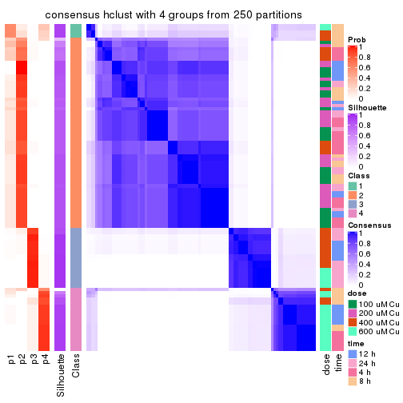</p>

</div>
<div id='tab-CV-hclust-consensus-heatmap-4'>
<pre><code class="r">consensus_heatmap(res, k = 5)
</code></pre>

<p></p>

</div>
<div id='tab-CV-hclust-consensus-heatmap-5'>
<pre><code class="r">consensus_heatmap(res, k = 6)
</code></pre>

<p></p>

</div>
</div>

Heatmaps for the membership of samples in all partitions to see how consistent they are:


<script>
$( function() {
	$( '#tabs-CV-hclust-membership-heatmap' ).tabs();
} );
</script>
<div id='tabs-CV-hclust-membership-heatmap'>
<ul>
<li><a href='#tab-CV-hclust-membership-heatmap-1'>k = 2</a></li>
<li><a href='#tab-CV-hclust-membership-heatmap-2'>k = 3</a></li>
<li><a href='#tab-CV-hclust-membership-heatmap-3'>k = 4</a></li>
<li><a href='#tab-CV-hclust-membership-heatmap-4'>k = 5</a></li>
<li><a href='#tab-CV-hclust-membership-heatmap-5'>k = 6</a></li>
</ul>
<div id='tab-CV-hclust-membership-heatmap-1'>
<pre><code class="r">membership_heatmap(res, k = 2)
</code></pre>

<p></p>

</div>
<div id='tab-CV-hclust-membership-heatmap-2'>
<pre><code class="r">membership_heatmap(res, k = 3)
</code></pre>

<p></p>

</div>
<div id='tab-CV-hclust-membership-heatmap-3'>
<pre><code class="r">membership_heatmap(res, k = 4)
</code></pre>

<p></p>

</div>
<div id='tab-CV-hclust-membership-heatmap-4'>
<pre><code class="r">membership_heatmap(res, k = 5)
</code></pre>

<p></p>

</div>
<div id='tab-CV-hclust-membership-heatmap-5'>
<pre><code class="r">membership_heatmap(res, k = 6)
</code></pre>

<p></p>

</div>
</div>

As soon as we have had the classes for columns, we can look for signatures
which are significantly different between classes which can be candidate marks
for certain classes. Following are the heatmaps for signatures.


Signature heatmaps where rows are scaled:


<script>
$( function() {
	$( '#tabs-CV-hclust-get-signatures' ).tabs();
} );
</script>
<div id='tabs-CV-hclust-get-signatures'>
<ul>
<li><a href='#tab-CV-hclust-get-signatures-1'>k = 2</a></li>
<li><a href='#tab-CV-hclust-get-signatures-2'>k = 3</a></li>
<li><a href='#tab-CV-hclust-get-signatures-3'>k = 4</a></li>
<li><a href='#tab-CV-hclust-get-signatures-4'>k = 5</a></li>
<li><a href='#tab-CV-hclust-get-signatures-5'>k = 6</a></li>
</ul>
<div id='tab-CV-hclust-get-signatures-1'>
<pre><code class="r">get_signatures(res, k = 2)
</code></pre>

<p></p>

</div>
<div id='tab-CV-hclust-get-signatures-2'>
<pre><code class="r">get_signatures(res, k = 3)
</code></pre>

<p></p>

</div>
<div id='tab-CV-hclust-get-signatures-3'>
<pre><code class="r">get_signatures(res, k = 4)
</code></pre>

<p></p>

</div>
<div id='tab-CV-hclust-get-signatures-4'>
<pre><code class="r">get_signatures(res, k = 5)
</code></pre>

<p></p>

</div>
<div id='tab-CV-hclust-get-signatures-5'>
<pre><code class="r">get_signatures(res, k = 6)
</code></pre>

<p></p>

</div>
</div>


Signature heatmaps where rows are not scaled:


<script>
$( function() {
	$( '#tabs-CV-hclust-get-signatures-no-scale' ).tabs();
} );
</script>
<div id='tabs-CV-hclust-get-signatures-no-scale'>
<ul>
<li><a href='#tab-CV-hclust-get-signatures-no-scale-1'>k = 2</a></li>
<li><a href='#tab-CV-hclust-get-signatures-no-scale-2'>k = 3</a></li>
<li><a href='#tab-CV-hclust-get-signatures-no-scale-3'>k = 4</a></li>
<li><a href='#tab-CV-hclust-get-signatures-no-scale-4'>k = 5</a></li>
<li><a href='#tab-CV-hclust-get-signatures-no-scale-5'>k = 6</a></li>
</ul>
<div id='tab-CV-hclust-get-signatures-no-scale-1'>
<pre><code class="r">get_signatures(res, k = 2, scale_rows = FALSE)
</code></pre>

<p></p>

</div>
<div id='tab-CV-hclust-get-signatures-no-scale-2'>
<pre><code class="r">get_signatures(res, k = 3, scale_rows = FALSE)
</code></pre>

<p></p>

</div>
<div id='tab-CV-hclust-get-signatures-no-scale-3'>
<pre><code class="r">get_signatures(res, k = 4, scale_rows = FALSE)
</code></pre>

<p></p>

</div>
<div id='tab-CV-hclust-get-signatures-no-scale-4'>
<pre><code class="r">get_signatures(res, k = 5, scale_rows = FALSE)
</code></pre>

<p></p>

</div>
<div id='tab-CV-hclust-get-signatures-no-scale-5'>
<pre><code class="r">get_signatures(res, k = 6, scale_rows = FALSE)
</code></pre>

<p></p>

</div>
</div>


Compare the overlap of signatures from different k:

```r
compare_signatures(res)
```


`get_signature()` returns a data frame invisibly. TO get the list of signatures, the function
call should be assigned to a variable explicitly. In following code, if `plot` argument is set
to `FALSE`, no heatmap is plotted while only the differential analysis is performed.

```r
# code only for demonstration
tb = get_signature(res, k = ..., plot = FALSE)
```

An example of the output of `tb` is:

```
#>   which_row         fdr    mean_1    mean_2 scaled_mean_1 scaled_mean_2 km
#> 1        38 0.042760348  8.373488  9.131774    -0.5533452     0.5164555  1
#> 2        40 0.018707592  7.106213  8.469186    -0.6173731     0.5762149  1
#> 3        55 0.019134737 10.221463 11.207825    -0.6159697     0.5749050  1
#> 4        59 0.006059896  5.921854  7.869574    -0.6899429     0.6439467  1
#> 5        60 0.018055526  8.928898 10.211722    -0.6204761     0.5791110  1
#> 6        98 0.009384629 15.714769 14.887706     0.6635654    -0.6193277  2
...
```

The columns in `tb` are:

1. `which_row`: row indices corresponding to the input matrix.
2. `fdr`: FDR for the differential test. 
3. `mean_x`: The mean value in group x.
4. `scaled_mean_x`: The mean value in group x after rows are scaled.
5. `km`: Row groups if k-means clustering is applied to rows.


UMAP plot which shows how samples are separated.


<script>
$( function() {
	$( '#tabs-CV-hclust-dimension-reduction' ).tabs();
} );
</script>
<div id='tabs-CV-hclust-dimension-reduction'>
<ul>
<li><a href='#tab-CV-hclust-dimension-reduction-1'>k = 2</a></li>
<li><a href='#tab-CV-hclust-dimension-reduction-2'>k = 3</a></li>
<li><a href='#tab-CV-hclust-dimension-reduction-3'>k = 4</a></li>
<li><a href='#tab-CV-hclust-dimension-reduction-4'>k = 5</a></li>
<li><a href='#tab-CV-hclust-dimension-reduction-5'>k = 6</a></li>
</ul>
<div id='tab-CV-hclust-dimension-reduction-1'>
<pre><code class="r">dimension_reduction(res, k = 2, method = &quot;UMAP&quot;)
</code></pre>

<p></p>

</div>
<div id='tab-CV-hclust-dimension-reduction-2'>
<pre><code class="r">dimension_reduction(res, k = 3, method = &quot;UMAP&quot;)
</code></pre>

<p></p>

</div>
<div id='tab-CV-hclust-dimension-reduction-3'>
<pre><code class="r">dimension_reduction(res, k = 4, method = &quot;UMAP&quot;)
</code></pre>

<p></p>

</div>
<div id='tab-CV-hclust-dimension-reduction-4'>
<pre><code class="r">dimension_reduction(res, k = 5, method = &quot;UMAP&quot;)
</code></pre>

<p></p>

</div>
<div id='tab-CV-hclust-dimension-reduction-5'>
<pre><code class="r">dimension_reduction(res, k = 6, method = &quot;UMAP&quot;)
</code></pre>

<p></p>

</div>
</div>


Following heatmap shows how subgroups are split when increasing `k`:

```r
collect_classes(res)
```


Test correlation between subgroups and known annotations. If the known
annotation is numeric, one-way ANOVA test is applied, and if the known
annotation is discrete, chi-squared contingency table test is applied.

```r
test_to_known_factors(res)
```

```
#>            n  dose(p)  time(p) k
#> CV:hclust 98 6.50e-16 1.56e-01 2
#> CV:hclust 95 8.79e-14 2.04e-03 3
#> CV:hclust 96 7.53e-17 1.58e-06 4
#> CV:hclust 91 4.70e-16 1.90e-06 5
#> CV:hclust 93 1.06e-15 7.65e-10 6
```


If matrix rows can be associated to genes, consider to use `GO_Enrichment(res,
...)` to perform function enrichment for the signature genes.


 

---------------------------------------------------


### CV:kmeans**


The object with results only for a single top-value method and a single partition method 
can be extracted as:

```r
res = res_list["CV", "kmeans"]
# you can also extract it by
# res = res_list["CV:kmeans"]
```

A summary of `res` and all the functions that can be applied to it:

```r
res
```

```
#> A 'ConsensusPartition' object with k = 2, 3, 4, 5, 6.
#>   On a matrix with 16250 rows and 98 columns.
#>   Top rows (1000, 2000, 3000, 4000, 5000) are extracted by 'CV' method.
#>   Subgroups are detected by 'kmeans' method.
#>   Performed in total 1250 partitions by row resampling.
#>   Best k for subgroups seems to be 2.
#> 
#> Following methods can be applied to this 'ConsensusPartition' object:
#>  [1] "cola_report"             "collect_classes"         "collect_plots"          
#>  [4] "collect_stats"           "colnames"                "compare_signatures"     
#>  [7] "consensus_heatmap"       "dimension_reduction"     "functional_enrichment"  
#> [10] "get_anno_col"            "get_anno"                "get_classes"            
#> [13] "get_consensus"           "get_matrix"              "get_membership"         
#> [16] "get_param"               "get_signatures"          "get_stats"              
#> [19] "is_best_k"               "is_stable_k"             "membership_heatmap"     
#> [22] "ncol"                    "nrow"                    "plot_ecdf"              
#> [25] "rownames"                "select_partition_number" "show"                   
#> [28] "suggest_best_k"          "test_to_known_factors"
```

`collect_plots()` function collects all the plots made from `res` for all `k` (number of partitions)
into one single page to provide an easy and fast comparison between different `k`.

```r
collect_plots(res)
```


The plots are:

- The first row: a plot of the ECDF (Empirical cumulative distribution
  function) curves of the consensus matrix for each `k` and the heatmap of
  predicted classes for each `k`.
- The second row: heatmaps of the consensus matrix for each `k`.
- The third row: heatmaps of the membership matrix for each `k`.
- The fouth row: heatmaps of the signatures for each `k`.

All the plots in panels can be made by individual functions and they are
plotted later in this section.

`select_partition_number()` produces several plots showing different
statistics for choosing "optimized" `k`. There are following statistics:

- ECDF curves of the consensus matrix for each `k`;
- 1-PAC. [The PAC
  score](https://en.wikipedia.org/wiki/Consensus_clustering#Over-interpretation_potential_of_consensus_clustering)
  measures the proportion of the ambiguous subgrouping.
- Mean silhouette score.
- Concordance. The mean probability of fiting the consensus class ids in all
  partitions.
- Area increased. Denote $A_k$ as the area under the ECDF curve for current
  `k`, the area increased is defined as $A_k - A_{k-1}$.
- Rand index. The percent of pairs of samples that are both in a same cluster
  or both are not in a same cluster in the partition of k and k-1.
- Jaccard index. The ratio of pairs of samples are both in a same cluster in
  the partition of k and k-1 and the pairs of samples are both in a same
  cluster in the partition k or k-1.

The detailed explanations of these statistics can be found in [the cola
vignette](http://bioconductor.org/packages/devel/bioc/vignettes/cola/inst/doc/cola.html#toc_13).

Generally speaking, lower PAC score, higher mean silhouette score or higher
concordance corresponds to better partition. Rand index and Jaccard index
measure how similar the current partition is compared to partition with `k-1`.
If they are too similar, we won't accept `k` is better than `k-1`.

```r
select_partition_number(res)
```


The numeric values for all these statistics can be obtained by `get_stats()`.

```r
get_stats(res)
```

```
#>   k 1-PAC mean_silhouette concordance area_increased  Rand Jaccard
#> 2 2 1.000           0.989       0.996         0.4868 0.512   0.512
#> 3 3 0.671           0.595       0.747         0.2582 0.972   0.945
#> 4 4 0.675           0.790       0.791         0.1542 0.742   0.481
#> 5 5 0.655           0.812       0.803         0.0800 0.970   0.884
#> 6 6 0.707           0.762       0.793         0.0476 0.990   0.959
```

`suggest_best_k()` suggests the best $k$ based on these statistics. The rules are as follows:

- All $k$ with Jaccard index larger than 0.95 are removed because the increase of
  the partition number does not provides enough extra information. If all $k$ are removed,
  the best $k$ is assigned by `NA`.
- For $k$ with 1-PAC larger than 0.9, the maximal $k$ is taken as the "best k". Other $k$ is called "optional k".
- If it does not fit the second rule. The $k$ with the highest vote of highest
  1-PAC, mean silhouette and concordance is taken as the "best k".

```r
suggest_best_k(res)
```

```
#> [1] 2
```


Following shows the table of the partitions (You need to click the **show/hide
code output** link to see it). The membership matrix (columns with name `p*`)
is inferred by
[`clue::cl_consensus()`](https://www.rdocumentation.org/link/cl_consensus?package=clue)
function with the `SE` method. Basically the value in the membership matrix
represents the probability to belong to a certain group. The finall class
label for an item is determined with the group with highest probability it
belongs to.

In `get_classes()` function, the entropy is calculated from the membership
matrix and the silhouette score is calculated from the consensus matrix.


<script>
$( function() {
	$( '#tabs-CV-kmeans-get-classes' ).tabs();
} );
</script>
<div id='tabs-CV-kmeans-get-classes'>
<ul>
<li><a href='#tab-CV-kmeans-get-classes-1'>k = 2</a></li>
<li><a href='#tab-CV-kmeans-get-classes-2'>k = 3</a></li>
<li><a href='#tab-CV-kmeans-get-classes-3'>k = 4</a></li>
<li><a href='#tab-CV-kmeans-get-classes-4'>k = 5</a></li>
<li><a href='#tab-CV-kmeans-get-classes-5'>k = 6</a></li>
</ul>

<div id='tab-CV-kmeans-get-classes-1'>
<p><a id='tab-CV-kmeans-get-classes-1-a' style='color:#0366d6' href='#'>show/hide code output</a></p>
<pre><code class="r">cbind(get_classes(res, k = 2), get_membership(res, k = 2))
</code></pre>

<pre><code>#&gt;           class entropy silhouette   p1   p2
#&gt; GSM241451     1   0.000      1.000 1.00 0.00
#&gt; GSM241452     1   0.000      1.000 1.00 0.00
#&gt; GSM241453     1   0.000      1.000 1.00 0.00
#&gt; GSM241454     1   0.000      1.000 1.00 0.00
#&gt; GSM241455     1   0.000      1.000 1.00 0.00
#&gt; GSM241456     1   0.000      1.000 1.00 0.00
#&gt; GSM241457     1   0.000      1.000 1.00 0.00
#&gt; GSM241458     1   0.000      1.000 1.00 0.00
#&gt; GSM241459     1   0.000      1.000 1.00 0.00
#&gt; GSM241460     1   0.000      1.000 1.00 0.00
#&gt; GSM241461     1   0.000      1.000 1.00 0.00
#&gt; GSM241462     1   0.000      1.000 1.00 0.00
#&gt; GSM241463     1   0.000      1.000 1.00 0.00
#&gt; GSM241464     1   0.000      1.000 1.00 0.00
#&gt; GSM241465     1   0.000      1.000 1.00 0.00
#&gt; GSM241466     1   0.000      1.000 1.00 0.00
#&gt; GSM241467     1   0.000      1.000 1.00 0.00
#&gt; GSM241468     1   0.000      1.000 1.00 0.00
#&gt; GSM241469     1   0.000      1.000 1.00 0.00
#&gt; GSM241470     1   0.000      1.000 1.00 0.00
#&gt; GSM241471     1   0.000      1.000 1.00 0.00
#&gt; GSM241472     1   0.000      1.000 1.00 0.00
#&gt; GSM241473     1   0.000      1.000 1.00 0.00
#&gt; GSM241474     1   0.000      1.000 1.00 0.00
#&gt; GSM241475     1   0.000      1.000 1.00 0.00
#&gt; GSM241476     1   0.000      1.000 1.00 0.00
#&gt; GSM241477     1   0.000      1.000 1.00 0.00
#&gt; GSM241478     1   0.000      1.000 1.00 0.00
#&gt; GSM241479     1   0.000      1.000 1.00 0.00
#&gt; GSM241480     1   0.000      1.000 1.00 0.00
#&gt; GSM241481     1   0.000      1.000 1.00 0.00
#&gt; GSM241482     1   0.000      1.000 1.00 0.00
#&gt; GSM241483     1   0.000      1.000 1.00 0.00
#&gt; GSM241484     1   0.000      1.000 1.00 0.00
#&gt; GSM241485     1   0.000      1.000 1.00 0.00
#&gt; GSM241486     1   0.000      1.000 1.00 0.00
#&gt; GSM241487     1   0.000      1.000 1.00 0.00
#&gt; GSM241488     1   0.000      1.000 1.00 0.00
#&gt; GSM241489     1   0.000      1.000 1.00 0.00
#&gt; GSM241490     1   0.000      1.000 1.00 0.00
#&gt; GSM241491     1   0.000      1.000 1.00 0.00
#&gt; GSM241492     1   0.000      1.000 1.00 0.00
#&gt; GSM241493     1   0.000      1.000 1.00 0.00
#&gt; GSM241494     1   0.000      1.000 1.00 0.00
#&gt; GSM241495     1   0.000      1.000 1.00 0.00
#&gt; GSM241496     1   0.000      1.000 1.00 0.00
#&gt; GSM241497     1   0.000      1.000 1.00 0.00
#&gt; GSM241498     1   0.000      1.000 1.00 0.00
#&gt; GSM241499     1   0.000      1.000 1.00 0.00
#&gt; GSM241500     1   0.000      1.000 1.00 0.00
#&gt; GSM241501     1   0.000      1.000 1.00 0.00
#&gt; GSM241502     1   0.000      1.000 1.00 0.00
#&gt; GSM241503     1   0.000      1.000 1.00 0.00
#&gt; GSM241504     1   0.000      1.000 1.00 0.00
#&gt; GSM241505     1   0.000      1.000 1.00 0.00
#&gt; GSM241506     1   0.000      1.000 1.00 0.00
#&gt; GSM241507     1   0.000      1.000 1.00 0.00
#&gt; GSM241508     1   0.000      1.000 1.00 0.00
#&gt; GSM241509     2   0.000      0.989 0.00 1.00
#&gt; GSM241510     2   0.000      0.989 0.00 1.00
#&gt; GSM241511     2   0.000      0.989 0.00 1.00
#&gt; GSM241512     2   0.000      0.989 0.00 1.00
#&gt; GSM241513     2   0.000      0.989 0.00 1.00
#&gt; GSM241514     2   0.000      0.989 0.00 1.00
#&gt; GSM241515     2   0.000      0.989 0.00 1.00
#&gt; GSM241516     2   0.000      0.989 0.00 1.00
#&gt; GSM241517     2   0.000      0.989 0.00 1.00
#&gt; GSM241518     2   0.000      0.989 0.00 1.00
#&gt; GSM241519     2   0.000      0.989 0.00 1.00
#&gt; GSM241520     2   0.000      0.989 0.00 1.00
#&gt; GSM241521     2   0.529      0.861 0.12 0.88
#&gt; GSM241522     2   0.904      0.536 0.32 0.68
#&gt; GSM241523     2   0.000      0.989 0.00 1.00
#&gt; GSM241524     2   0.000      0.989 0.00 1.00
#&gt; GSM241525     2   0.000      0.989 0.00 1.00
#&gt; GSM241526     2   0.000      0.989 0.00 1.00
#&gt; GSM241527     2   0.000      0.989 0.00 1.00
#&gt; GSM241528     2   0.000      0.989 0.00 1.00
#&gt; GSM241529     2   0.000      0.989 0.00 1.00
#&gt; GSM241530     2   0.000      0.989 0.00 1.00
#&gt; GSM241531     2   0.000      0.989 0.00 1.00
#&gt; GSM241532     2   0.000      0.989 0.00 1.00
#&gt; GSM241533     2   0.000      0.989 0.00 1.00
#&gt; GSM241534     2   0.000      0.989 0.00 1.00
#&gt; GSM241535     2   0.000      0.989 0.00 1.00
#&gt; GSM241536     2   0.000      0.989 0.00 1.00
#&gt; GSM241537     2   0.000      0.989 0.00 1.00
#&gt; GSM241538     2   0.000      0.989 0.00 1.00
#&gt; GSM241539     2   0.000      0.989 0.00 1.00
#&gt; GSM241540     2   0.000      0.989 0.00 1.00
#&gt; GSM241541     2   0.000      0.989 0.00 1.00
#&gt; GSM241542     2   0.000      0.989 0.00 1.00
#&gt; GSM241543     2   0.000      0.989 0.00 1.00
#&gt; GSM241544     2   0.000      0.989 0.00 1.00
#&gt; GSM241545     2   0.000      0.989 0.00 1.00
#&gt; GSM241546     2   0.000      0.989 0.00 1.00
#&gt; GSM241547     2   0.000      0.989 0.00 1.00
#&gt; GSM241548     2   0.000      0.989 0.00 1.00
</code></pre>

<script>
$('#tab-CV-kmeans-get-classes-1-a').parent().next().next().hide();
$('#tab-CV-kmeans-get-classes-1-a').click(function(){
  $('#tab-CV-kmeans-get-classes-1-a').parent().next().next().toggle();
  return(false);
});
</script>
</div>

<div id='tab-CV-kmeans-get-classes-2'>
<p><a id='tab-CV-kmeans-get-classes-2-a' style='color:#0366d6' href='#'>show/hide code output</a></p>
<pre><code class="r">cbind(get_classes(res, k = 3), get_membership(res, k = 3))
</code></pre>

<pre><code>#&gt;           class entropy silhouette    p1    p2    p3
#&gt; GSM241451     2  0.1529      0.705 0.040 0.960 0.000
#&gt; GSM241452     2  0.5650      0.694 0.312 0.688 0.000
#&gt; GSM241453     2  0.1411      0.705 0.036 0.964 0.000
#&gt; GSM241454     2  0.5560      0.696 0.300 0.700 0.000
#&gt; GSM241455     2  0.1031      0.710 0.024 0.976 0.000
#&gt; GSM241456     2  0.5497      0.698 0.292 0.708 0.000
#&gt; GSM241457     2  0.0000      0.714 0.000 1.000 0.000
#&gt; GSM241458     2  0.5465      0.699 0.288 0.712 0.000
#&gt; GSM241459     2  0.0000      0.714 0.000 1.000 0.000
#&gt; GSM241460     2  0.5465      0.699 0.288 0.712 0.000
#&gt; GSM241461     2  0.1411      0.705 0.036 0.964 0.000
#&gt; GSM241462     2  0.5497      0.698 0.292 0.708 0.000
#&gt; GSM241463     2  0.0000      0.714 0.000 1.000 0.000
#&gt; GSM241464     2  0.5465      0.699 0.288 0.712 0.000
#&gt; GSM241465     2  0.1411      0.705 0.036 0.964 0.000
#&gt; GSM241466     2  0.5465      0.699 0.288 0.712 0.000
#&gt; GSM241467     2  0.5465      0.699 0.288 0.712 0.000
#&gt; GSM241468     2  0.0000      0.714 0.000 1.000 0.000
#&gt; GSM241469     2  0.5560      0.696 0.300 0.700 0.000
#&gt; GSM241470     2  0.1411      0.705 0.036 0.964 0.000
#&gt; GSM241471     2  0.0000      0.714 0.000 1.000 0.000
#&gt; GSM241472     2  0.5465      0.699 0.288 0.712 0.000
#&gt; GSM241473     2  0.0000      0.714 0.000 1.000 0.000
#&gt; GSM241474     2  0.5465      0.699 0.288 0.712 0.000
#&gt; GSM241475     2  0.1529      0.705 0.040 0.960 0.000
#&gt; GSM241476     2  0.5560      0.696 0.300 0.700 0.000
#&gt; GSM241477     2  0.1411      0.705 0.036 0.964 0.000
#&gt; GSM241478     2  0.1529      0.705 0.040 0.960 0.000
#&gt; GSM241479     2  0.5560      0.696 0.300 0.700 0.000
#&gt; GSM241480     2  0.5560      0.696 0.300 0.700 0.000
#&gt; GSM241481     2  0.0000      0.714 0.000 1.000 0.000
#&gt; GSM241482     2  0.5465      0.699 0.288 0.712 0.000
#&gt; GSM241483     2  0.1163      0.708 0.028 0.972 0.000
#&gt; GSM241484     2  0.5560      0.696 0.300 0.700 0.000
#&gt; GSM241485     2  0.5560      0.696 0.300 0.700 0.000
#&gt; GSM241486     2  0.1411      0.705 0.036 0.964 0.000
#&gt; GSM241487     2  0.1411      0.705 0.036 0.964 0.000
#&gt; GSM241488     2  0.0892      0.712 0.020 0.980 0.000
#&gt; GSM241489     2  0.5560      0.696 0.300 0.700 0.000
#&gt; GSM241490     2  0.5560      0.696 0.300 0.700 0.000
#&gt; GSM241491     2  0.0000      0.714 0.000 1.000 0.000
#&gt; GSM241492     2  0.5465      0.699 0.288 0.712 0.000
#&gt; GSM241493     2  0.1411      0.705 0.036 0.964 0.000
#&gt; GSM241494     2  0.5560      0.696 0.300 0.700 0.000
#&gt; GSM241495     2  0.1411      0.705 0.036 0.964 0.000
#&gt; GSM241496     2  0.1753      0.704 0.048 0.952 0.000
#&gt; GSM241497     2  0.5678      0.692 0.316 0.684 0.000
#&gt; GSM241498     2  0.5560      0.696 0.300 0.700 0.000
#&gt; GSM241499     2  0.5560      0.696 0.300 0.700 0.000
#&gt; GSM241500     2  0.5810      0.232 0.336 0.664 0.000
#&gt; GSM241501     2  0.2959      0.648 0.100 0.900 0.000
#&gt; GSM241502     2  0.5178      0.392 0.256 0.744 0.000
#&gt; GSM241503     2  0.6307      0.416 0.488 0.512 0.000
#&gt; GSM241504     2  0.6308      0.405 0.492 0.508 0.000
#&gt; GSM241505     1  0.6280     -0.515 0.540 0.460 0.000
#&gt; GSM241506     2  0.5810      0.232 0.336 0.664 0.000
#&gt; GSM241507     2  0.5650      0.684 0.312 0.688 0.000
#&gt; GSM241508     2  0.4002      0.547 0.160 0.840 0.000
#&gt; GSM241509     3  0.5465      0.612 0.288 0.000 0.712
#&gt; GSM241510     3  0.7842      0.498 0.328 0.072 0.600
#&gt; GSM241511     3  0.7107      0.530 0.340 0.036 0.624
#&gt; GSM241512     3  0.5650      0.611 0.312 0.000 0.688
#&gt; GSM241513     3  0.6140      0.485 0.404 0.000 0.596
#&gt; GSM241514     3  0.6140      0.485 0.404 0.000 0.596
#&gt; GSM241515     3  0.6168      0.487 0.412 0.000 0.588
#&gt; GSM241516     3  0.6180      0.485 0.416 0.000 0.584
#&gt; GSM241517     3  0.7487      0.418 0.408 0.040 0.552
#&gt; GSM241518     3  0.6140      0.485 0.404 0.000 0.596
#&gt; GSM241519     3  0.6140      0.485 0.404 0.000 0.596
#&gt; GSM241520     3  0.6140      0.485 0.404 0.000 0.596
#&gt; GSM241521     1  0.9615     -0.172 0.456 0.220 0.324
#&gt; GSM241522     1  0.7391      0.185 0.696 0.108 0.196
#&gt; GSM241523     3  0.6140      0.485 0.404 0.000 0.596
#&gt; GSM241524     3  0.6140      0.485 0.404 0.000 0.596
#&gt; GSM241525     3  0.5529      0.609 0.296 0.000 0.704
#&gt; GSM241526     3  0.5431      0.611 0.284 0.000 0.716
#&gt; GSM241527     3  0.5431      0.611 0.284 0.000 0.716
#&gt; GSM241528     3  0.5529      0.609 0.296 0.000 0.704
#&gt; GSM241529     3  0.5529      0.609 0.296 0.000 0.704
#&gt; GSM241530     3  0.5529      0.609 0.296 0.000 0.704
#&gt; GSM241531     3  0.5529      0.609 0.296 0.000 0.704
#&gt; GSM241532     3  0.5529      0.609 0.296 0.000 0.704
#&gt; GSM241533     3  0.5497      0.609 0.292 0.000 0.708
#&gt; GSM241534     3  0.5431      0.611 0.284 0.000 0.716
#&gt; GSM241535     3  0.5431      0.611 0.284 0.000 0.716
#&gt; GSM241536     3  0.5529      0.609 0.296 0.000 0.704
#&gt; GSM241537     3  0.0000      0.604 0.000 0.000 1.000
#&gt; GSM241538     3  0.0000      0.604 0.000 0.000 1.000
#&gt; GSM241539     3  0.0000      0.604 0.000 0.000 1.000
#&gt; GSM241540     3  0.0000      0.604 0.000 0.000 1.000
#&gt; GSM241541     3  0.0000      0.604 0.000 0.000 1.000
#&gt; GSM241542     3  0.0000      0.604 0.000 0.000 1.000
#&gt; GSM241543     3  0.5988      0.473 0.368 0.000 0.632
#&gt; GSM241544     3  0.5988      0.473 0.368 0.000 0.632
#&gt; GSM241545     3  0.5988      0.473 0.368 0.000 0.632
#&gt; GSM241546     3  0.5988      0.473 0.368 0.000 0.632
#&gt; GSM241547     3  0.5988      0.473 0.368 0.000 0.632
#&gt; GSM241548     3  0.5988      0.473 0.368 0.000 0.632
</code></pre>

<script>
$('#tab-CV-kmeans-get-classes-2-a').parent().next().next().hide();
$('#tab-CV-kmeans-get-classes-2-a').click(function(){
  $('#tab-CV-kmeans-get-classes-2-a').parent().next().next().toggle();
  return(false);
});
</script>
</div>

<div id='tab-CV-kmeans-get-classes-3'>
<p><a id='tab-CV-kmeans-get-classes-3-a' style='color:#0366d6' href='#'>show/hide code output</a></p>
<pre><code class="r">cbind(get_classes(res, k = 4), get_membership(res, k = 4))
</code></pre>

<pre><code>#&gt;           class entropy silhouette    p1    p2    p3    p4
#&gt; GSM241451     2  0.5178      0.862 0.392 0.600 0.004 0.004
#&gt; GSM241452     1  0.1545      0.874 0.952 0.040 0.000 0.008
#&gt; GSM241453     2  0.4991      0.864 0.388 0.608 0.004 0.000
#&gt; GSM241454     1  0.0524      0.891 0.988 0.008 0.000 0.004
#&gt; GSM241455     2  0.5183      0.858 0.408 0.584 0.000 0.008
#&gt; GSM241456     1  0.0188      0.891 0.996 0.004 0.000 0.000
#&gt; GSM241457     2  0.5964      0.832 0.424 0.536 0.000 0.040
#&gt; GSM241458     1  0.1388      0.879 0.960 0.012 0.000 0.028
#&gt; GSM241459     2  0.5888      0.835 0.424 0.540 0.000 0.036
#&gt; GSM241460     1  0.1510      0.876 0.956 0.016 0.000 0.028
#&gt; GSM241461     2  0.5400      0.858 0.372 0.608 0.000 0.020
#&gt; GSM241462     1  0.0672      0.889 0.984 0.008 0.000 0.008
#&gt; GSM241463     2  0.5901      0.828 0.432 0.532 0.000 0.036
#&gt; GSM241464     1  0.1610      0.869 0.952 0.016 0.000 0.032
#&gt; GSM241465     2  0.5161      0.859 0.400 0.592 0.000 0.008
#&gt; GSM241466     1  0.0188      0.890 0.996 0.004 0.000 0.000
#&gt; GSM241467     1  0.0657      0.886 0.984 0.004 0.000 0.012
#&gt; GSM241468     2  0.5750      0.827 0.440 0.532 0.000 0.028
#&gt; GSM241469     1  0.1356      0.880 0.960 0.032 0.000 0.008
#&gt; GSM241470     2  0.5165      0.863 0.388 0.604 0.004 0.004
#&gt; GSM241471     2  0.5833      0.824 0.440 0.528 0.000 0.032
#&gt; GSM241472     1  0.1109      0.878 0.968 0.004 0.000 0.028
#&gt; GSM241473     2  0.5833      0.824 0.440 0.528 0.000 0.032
#&gt; GSM241474     1  0.1256      0.875 0.964 0.008 0.000 0.028
#&gt; GSM241475     2  0.5178      0.862 0.392 0.600 0.004 0.004
#&gt; GSM241476     1  0.1151      0.885 0.968 0.024 0.000 0.008
#&gt; GSM241477     2  0.4817      0.864 0.388 0.612 0.000 0.000
#&gt; GSM241478     2  0.5311      0.861 0.392 0.596 0.004 0.008
#&gt; GSM241479     1  0.1151      0.885 0.968 0.024 0.000 0.008
#&gt; GSM241480     1  0.0524      0.891 0.988 0.008 0.000 0.004
#&gt; GSM241481     2  0.5888      0.835 0.424 0.540 0.000 0.036
#&gt; GSM241482     1  0.1388      0.879 0.960 0.012 0.000 0.028
#&gt; GSM241483     2  0.5391      0.862 0.380 0.604 0.004 0.012
#&gt; GSM241484     1  0.0336      0.890 0.992 0.008 0.000 0.000
#&gt; GSM241485     1  0.0336      0.890 0.992 0.008 0.000 0.000
#&gt; GSM241486     2  0.5400      0.858 0.372 0.608 0.000 0.020
#&gt; GSM241487     2  0.4950      0.862 0.376 0.620 0.004 0.000
#&gt; GSM241488     2  0.5212      0.858 0.404 0.588 0.004 0.004
#&gt; GSM241489     1  0.1356      0.880 0.960 0.032 0.000 0.008
#&gt; GSM241490     1  0.1356      0.880 0.960 0.032 0.000 0.008
#&gt; GSM241491     2  0.5901      0.828 0.432 0.532 0.000 0.036
#&gt; GSM241492     1  0.1356      0.873 0.960 0.008 0.000 0.032
#&gt; GSM241493     2  0.5165      0.863 0.388 0.604 0.004 0.004
#&gt; GSM241494     1  0.0188      0.891 0.996 0.000 0.000 0.004
#&gt; GSM241495     2  0.5165      0.863 0.388 0.604 0.004 0.004
#&gt; GSM241496     2  0.5178      0.862 0.392 0.600 0.004 0.004
#&gt; GSM241497     1  0.1545      0.874 0.952 0.040 0.000 0.008
#&gt; GSM241498     1  0.1356      0.880 0.960 0.032 0.000 0.008
#&gt; GSM241499     1  0.3852      0.724 0.808 0.180 0.000 0.012
#&gt; GSM241500     2  0.4239      0.424 0.028 0.808 0.004 0.160
#&gt; GSM241501     2  0.4718      0.694 0.216 0.756 0.004 0.024
#&gt; GSM241502     2  0.4965      0.558 0.100 0.784 0.004 0.112
#&gt; GSM241503     1  0.5496      0.613 0.704 0.232 0.000 0.064
#&gt; GSM241504     1  0.5753      0.579 0.680 0.248 0.000 0.072
#&gt; GSM241505     1  0.6164      0.546 0.656 0.240 0.000 0.104
#&gt; GSM241506     2  0.4886      0.301 0.028 0.744 0.004 0.224
#&gt; GSM241507     1  0.3668      0.698 0.808 0.188 0.000 0.004
#&gt; GSM241508     2  0.4864      0.655 0.172 0.768 0.000 0.060
#&gt; GSM241509     4  0.2635      0.780 0.000 0.020 0.076 0.904
#&gt; GSM241510     4  0.5393      0.702 0.000 0.268 0.044 0.688
#&gt; GSM241511     4  0.6936      0.680 0.076 0.220 0.052 0.652
#&gt; GSM241512     4  0.5293      0.757 0.000 0.152 0.100 0.748
#&gt; GSM241513     3  0.2546      0.892 0.000 0.060 0.912 0.028
#&gt; GSM241514     3  0.2197      0.897 0.000 0.048 0.928 0.024
#&gt; GSM241515     3  0.2546      0.892 0.000 0.060 0.912 0.028
#&gt; GSM241516     3  0.2984      0.875 0.000 0.084 0.888 0.028
#&gt; GSM241517     3  0.2742      0.888 0.000 0.076 0.900 0.024
#&gt; GSM241518     3  0.2546      0.895 0.000 0.060 0.912 0.028
#&gt; GSM241519     3  0.1833      0.900 0.000 0.032 0.944 0.024
#&gt; GSM241520     3  0.1520      0.900 0.000 0.020 0.956 0.024
#&gt; GSM241521     3  0.5215      0.585 0.004 0.296 0.680 0.020
#&gt; GSM241522     3  0.7926      0.296 0.348 0.144 0.480 0.028
#&gt; GSM241523     3  0.1520      0.900 0.000 0.020 0.956 0.024
#&gt; GSM241524     3  0.1406      0.900 0.000 0.016 0.960 0.024
#&gt; GSM241525     4  0.4731      0.766 0.000 0.160 0.060 0.780
#&gt; GSM241526     4  0.2996      0.785 0.000 0.044 0.064 0.892
#&gt; GSM241527     4  0.3164      0.785 0.000 0.052 0.064 0.884
#&gt; GSM241528     4  0.4614      0.774 0.000 0.144 0.064 0.792
#&gt; GSM241529     4  0.3885      0.783 0.000 0.092 0.064 0.844
#&gt; GSM241530     4  0.4440      0.775 0.000 0.136 0.060 0.804
#&gt; GSM241531     4  0.4820      0.765 0.000 0.168 0.060 0.772
#&gt; GSM241532     4  0.2413      0.782 0.000 0.020 0.064 0.916
#&gt; GSM241533     4  0.2179      0.781 0.000 0.012 0.064 0.924
#&gt; GSM241534     4  0.2124      0.774 0.000 0.008 0.068 0.924
#&gt; GSM241535     4  0.2124      0.774 0.000 0.008 0.068 0.924
#&gt; GSM241536     4  0.4907      0.764 0.000 0.176 0.060 0.764
#&gt; GSM241537     4  0.7148      0.437 0.000 0.140 0.364 0.496
#&gt; GSM241538     4  0.7148      0.437 0.000 0.140 0.364 0.496
#&gt; GSM241539     4  0.7148      0.437 0.000 0.140 0.364 0.496
#&gt; GSM241540     4  0.7148      0.437 0.000 0.140 0.364 0.496
#&gt; GSM241541     4  0.7210      0.433 0.000 0.148 0.360 0.492
#&gt; GSM241542     4  0.7210      0.433 0.000 0.148 0.360 0.492
#&gt; GSM241543     3  0.0657      0.892 0.000 0.012 0.984 0.004
#&gt; GSM241544     3  0.0657      0.892 0.000 0.012 0.984 0.004
#&gt; GSM241545     3  0.0657      0.892 0.000 0.012 0.984 0.004
#&gt; GSM241546     3  0.0657      0.892 0.000 0.012 0.984 0.004
#&gt; GSM241547     3  0.0895      0.890 0.000 0.020 0.976 0.004
#&gt; GSM241548     3  0.0779      0.891 0.000 0.016 0.980 0.004
</code></pre>

<script>
$('#tab-CV-kmeans-get-classes-3-a').parent().next().next().hide();
$('#tab-CV-kmeans-get-classes-3-a').click(function(){
  $('#tab-CV-kmeans-get-classes-3-a').parent().next().next().toggle();
  return(false);
});
</script>
</div>

<div id='tab-CV-kmeans-get-classes-4'>
<p><a id='tab-CV-kmeans-get-classes-4-a' style='color:#0366d6' href='#'>show/hide code output</a></p>
<pre><code class="r">cbind(get_classes(res, k = 5), get_membership(res, k = 5))
</code></pre>

<pre><code>#&gt;           class entropy silhouette    p1    p2    p3    p4    p5
#&gt; GSM241451     2  0.0609      0.877 0.020 0.980 0.000 0.000 0.000
#&gt; GSM241452     1  0.3123      0.862 0.812 0.184 0.000 0.004 0.000
#&gt; GSM241453     2  0.0510      0.877 0.016 0.984 0.000 0.000 0.000
#&gt; GSM241454     1  0.3013      0.867 0.832 0.160 0.000 0.000 0.008
#&gt; GSM241455     2  0.2067      0.869 0.032 0.920 0.000 0.000 0.048
#&gt; GSM241456     1  0.3163      0.867 0.824 0.164 0.000 0.000 0.012
#&gt; GSM241457     2  0.3551      0.828 0.044 0.820 0.000 0.000 0.136
#&gt; GSM241458     1  0.5480      0.807 0.656 0.168 0.000 0.000 0.176
#&gt; GSM241459     2  0.3460      0.833 0.044 0.828 0.000 0.000 0.128
#&gt; GSM241460     1  0.5513      0.804 0.652 0.168 0.000 0.000 0.180
#&gt; GSM241461     2  0.2770      0.837 0.008 0.864 0.004 0.000 0.124
#&gt; GSM241462     1  0.4444      0.857 0.756 0.156 0.000 0.000 0.088
#&gt; GSM241463     2  0.4065      0.786 0.048 0.772 0.000 0.000 0.180
#&gt; GSM241464     1  0.5805      0.759 0.612 0.172 0.000 0.000 0.216
#&gt; GSM241465     2  0.1915      0.868 0.032 0.928 0.000 0.000 0.040
#&gt; GSM241466     1  0.3804      0.862 0.796 0.160 0.000 0.000 0.044
#&gt; GSM241467     1  0.4258      0.854 0.768 0.160 0.000 0.000 0.072
#&gt; GSM241468     2  0.2830      0.848 0.044 0.876 0.000 0.000 0.080
#&gt; GSM241469     1  0.3123      0.862 0.812 0.184 0.000 0.004 0.000
#&gt; GSM241470     2  0.0609      0.877 0.020 0.980 0.000 0.000 0.000
#&gt; GSM241471     2  0.3365      0.829 0.044 0.836 0.000 0.000 0.120
#&gt; GSM241472     1  0.5271      0.809 0.680 0.168 0.000 0.000 0.152
#&gt; GSM241473     2  0.3365      0.829 0.044 0.836 0.000 0.000 0.120
#&gt; GSM241474     1  0.5307      0.806 0.676 0.168 0.000 0.000 0.156
#&gt; GSM241475     2  0.0609      0.877 0.020 0.980 0.000 0.000 0.000
#&gt; GSM241476     1  0.2929      0.864 0.820 0.180 0.000 0.000 0.000
#&gt; GSM241477     2  0.0510      0.877 0.016 0.984 0.000 0.000 0.000
#&gt; GSM241478     2  0.0992      0.875 0.024 0.968 0.000 0.000 0.008
#&gt; GSM241479     1  0.3123      0.862 0.812 0.184 0.000 0.004 0.000
#&gt; GSM241480     1  0.3013      0.867 0.832 0.160 0.000 0.000 0.008
#&gt; GSM241481     2  0.3460      0.833 0.044 0.828 0.000 0.000 0.128
#&gt; GSM241482     1  0.5480      0.807 0.656 0.168 0.000 0.000 0.176
#&gt; GSM241483     2  0.1310      0.875 0.020 0.956 0.000 0.000 0.024
#&gt; GSM241484     1  0.3944      0.865 0.788 0.160 0.000 0.000 0.052
#&gt; GSM241485     1  0.4199      0.864 0.772 0.160 0.000 0.000 0.068
#&gt; GSM241486     2  0.2770      0.837 0.008 0.864 0.004 0.000 0.124
#&gt; GSM241487     2  0.0510      0.877 0.016 0.984 0.000 0.000 0.000
#&gt; GSM241488     2  0.0703      0.875 0.024 0.976 0.000 0.000 0.000
#&gt; GSM241489     1  0.2966      0.862 0.816 0.184 0.000 0.000 0.000
#&gt; GSM241490     1  0.3123      0.862 0.812 0.184 0.000 0.004 0.000
#&gt; GSM241491     2  0.3953      0.797 0.048 0.784 0.000 0.000 0.168
#&gt; GSM241492     1  0.5747      0.768 0.620 0.168 0.000 0.000 0.212
#&gt; GSM241493     2  0.0609      0.877 0.020 0.980 0.000 0.000 0.000
#&gt; GSM241494     1  0.3359      0.867 0.816 0.164 0.000 0.000 0.020
#&gt; GSM241495     2  0.0609      0.877 0.020 0.980 0.000 0.000 0.000
#&gt; GSM241496     2  0.0794      0.874 0.028 0.972 0.000 0.000 0.000
#&gt; GSM241497     1  0.3123      0.862 0.812 0.184 0.000 0.004 0.000
#&gt; GSM241498     1  0.3123      0.862 0.812 0.184 0.000 0.004 0.000
#&gt; GSM241499     1  0.3423      0.818 0.844 0.108 0.000 0.008 0.040
#&gt; GSM241500     2  0.5895      0.647 0.104 0.692 0.004 0.052 0.148
#&gt; GSM241501     2  0.4349      0.747 0.088 0.788 0.000 0.012 0.112
#&gt; GSM241502     2  0.5692      0.661 0.108 0.704 0.000 0.056 0.132
#&gt; GSM241503     1  0.4469      0.718 0.796 0.072 0.000 0.040 0.092
#&gt; GSM241504     1  0.4729      0.649 0.780 0.048 0.000 0.080 0.092
#&gt; GSM241505     1  0.4622      0.641 0.784 0.036 0.000 0.088 0.092
#&gt; GSM241506     2  0.7544      0.372 0.112 0.532 0.004 0.184 0.168
#&gt; GSM241507     1  0.4031      0.743 0.796 0.048 0.000 0.008 0.148
#&gt; GSM241508     2  0.5401      0.699 0.100 0.708 0.008 0.012 0.172
#&gt; GSM241509     4  0.2955      0.749 0.004 0.008 0.008 0.864 0.116
#&gt; GSM241510     4  0.5657      0.645 0.084 0.028 0.008 0.696 0.184
#&gt; GSM241511     4  0.6144      0.523 0.200 0.008 0.004 0.612 0.176
#&gt; GSM241512     4  0.3564      0.786 0.040 0.004 0.020 0.852 0.084
#&gt; GSM241513     3  0.4353      0.845 0.052 0.008 0.812 0.036 0.092
#&gt; GSM241514     3  0.3978      0.856 0.044 0.004 0.832 0.036 0.084
#&gt; GSM241515     3  0.4353      0.845 0.052 0.008 0.812 0.036 0.092
#&gt; GSM241516     3  0.4818      0.821 0.056 0.008 0.776 0.036 0.124
#&gt; GSM241517     3  0.4802      0.836 0.056 0.012 0.780 0.032 0.120
#&gt; GSM241518     3  0.4370      0.850 0.048 0.004 0.804 0.036 0.108
#&gt; GSM241519     3  0.2344      0.874 0.020 0.004 0.920 0.028 0.028
#&gt; GSM241520     3  0.1329      0.874 0.008 0.000 0.956 0.032 0.004
#&gt; GSM241521     3  0.6177      0.706 0.052 0.104 0.700 0.032 0.112
#&gt; GSM241522     1  0.6959     -0.208 0.452 0.016 0.396 0.020 0.116
#&gt; GSM241523     3  0.1966      0.875 0.016 0.004 0.936 0.028 0.016
#&gt; GSM241524     3  0.1202      0.874 0.004 0.000 0.960 0.032 0.004
#&gt; GSM241525     4  0.3090      0.794 0.052 0.000 0.000 0.860 0.088
#&gt; GSM241526     4  0.1329      0.793 0.008 0.000 0.004 0.956 0.032
#&gt; GSM241527     4  0.1442      0.794 0.012 0.000 0.004 0.952 0.032
#&gt; GSM241528     4  0.2369      0.808 0.032 0.000 0.004 0.908 0.056
#&gt; GSM241529     4  0.1739      0.803 0.024 0.000 0.004 0.940 0.032
#&gt; GSM241530     4  0.2713      0.804 0.036 0.000 0.004 0.888 0.072
#&gt; GSM241531     4  0.3849      0.772 0.068 0.000 0.008 0.820 0.104
#&gt; GSM241532     4  0.3294      0.756 0.024 0.000 0.008 0.844 0.124
#&gt; GSM241533     4  0.2295      0.753 0.004 0.000 0.008 0.900 0.088
#&gt; GSM241534     4  0.1952      0.737 0.000 0.000 0.004 0.912 0.084
#&gt; GSM241535     4  0.1768      0.748 0.000 0.000 0.004 0.924 0.072
#&gt; GSM241536     4  0.3888      0.770 0.064 0.000 0.008 0.816 0.112
#&gt; GSM241537     5  0.6461      0.989 0.000 0.000 0.184 0.372 0.444
#&gt; GSM241538     5  0.6461      0.989 0.000 0.000 0.184 0.372 0.444
#&gt; GSM241539     5  0.6461      0.989 0.000 0.000 0.184 0.372 0.444
#&gt; GSM241540     5  0.6461      0.989 0.000 0.000 0.184 0.372 0.444
#&gt; GSM241541     5  0.6439      0.979 0.000 0.000 0.184 0.356 0.460
#&gt; GSM241542     5  0.6439      0.979 0.000 0.000 0.184 0.356 0.460
#&gt; GSM241543     3  0.1569      0.857 0.008 0.000 0.944 0.004 0.044
#&gt; GSM241544     3  0.1644      0.856 0.008 0.000 0.940 0.004 0.048
#&gt; GSM241545     3  0.1569      0.857 0.008 0.000 0.944 0.004 0.044
#&gt; GSM241546     3  0.1644      0.856 0.008 0.000 0.940 0.004 0.048
#&gt; GSM241547     3  0.1901      0.852 0.012 0.000 0.928 0.004 0.056
#&gt; GSM241548     3  0.1830      0.854 0.012 0.000 0.932 0.004 0.052
</code></pre>

<script>
$('#tab-CV-kmeans-get-classes-4-a').parent().next().next().hide();
$('#tab-CV-kmeans-get-classes-4-a').click(function(){
  $('#tab-CV-kmeans-get-classes-4-a').parent().next().next().toggle();
  return(false);
});
</script>
</div>

<div id='tab-CV-kmeans-get-classes-5'>
<p><a id='tab-CV-kmeans-get-classes-5-a' style='color:#0366d6' href='#'>show/hide code output</a></p>
<pre><code class="r">cbind(get_classes(res, k = 6), get_membership(res, k = 6))
</code></pre>

<pre><code>#&gt;           class entropy silhouette    p1    p2    p3    p4 p5    p6
#&gt; GSM241451     2  0.1610      0.831 0.084 0.916 0.000 0.000 NA 0.000
#&gt; GSM241452     1  0.1349      0.821 0.940 0.056 0.000 0.000 NA 0.000
#&gt; GSM241453     2  0.1610      0.831 0.084 0.916 0.000 0.000 NA 0.000
#&gt; GSM241454     1  0.0622      0.829 0.980 0.012 0.000 0.000 NA 0.000
#&gt; GSM241455     2  0.3047      0.826 0.080 0.852 0.000 0.000 NA 0.008
#&gt; GSM241456     1  0.1151      0.829 0.956 0.032 0.000 0.000 NA 0.000
#&gt; GSM241457     2  0.5683      0.740 0.116 0.604 0.000 0.000 NA 0.036
#&gt; GSM241458     1  0.3852      0.727 0.664 0.012 0.000 0.000 NA 0.000
#&gt; GSM241459     2  0.5703      0.741 0.116 0.600 0.000 0.000 NA 0.036
#&gt; GSM241460     1  0.3883      0.721 0.656 0.012 0.000 0.000 NA 0.000
#&gt; GSM241461     2  0.4670      0.754 0.036 0.728 0.000 0.000 NA 0.072
#&gt; GSM241462     1  0.3133      0.792 0.780 0.000 0.000 0.000 NA 0.008
#&gt; GSM241463     2  0.6038      0.677 0.120 0.556 0.000 0.000 NA 0.048
#&gt; GSM241464     1  0.5183      0.608 0.540 0.028 0.000 0.000 NA 0.040
#&gt; GSM241465     2  0.3214      0.824 0.084 0.840 0.000 0.000 NA 0.008
#&gt; GSM241466     1  0.2234      0.812 0.872 0.004 0.000 0.000 NA 0.000
#&gt; GSM241467     1  0.2772      0.796 0.816 0.004 0.000 0.000 NA 0.000
#&gt; GSM241468     2  0.4450      0.785 0.128 0.732 0.000 0.000 NA 0.008
#&gt; GSM241469     1  0.1075      0.824 0.952 0.048 0.000 0.000 NA 0.000
#&gt; GSM241470     2  0.1610      0.831 0.084 0.916 0.000 0.000 NA 0.000
#&gt; GSM241471     2  0.5172      0.742 0.128 0.636 0.000 0.000 NA 0.008
#&gt; GSM241472     1  0.3766      0.730 0.684 0.012 0.000 0.000 NA 0.000
#&gt; GSM241473     2  0.5172      0.742 0.128 0.636 0.000 0.000 NA 0.008
#&gt; GSM241474     1  0.3802      0.725 0.676 0.012 0.000 0.000 NA 0.000
#&gt; GSM241475     2  0.1610      0.831 0.084 0.916 0.000 0.000 NA 0.000
#&gt; GSM241476     1  0.0937      0.826 0.960 0.040 0.000 0.000 NA 0.000
#&gt; GSM241477     2  0.1753      0.831 0.084 0.912 0.000 0.000 NA 0.000
#&gt; GSM241478     2  0.2009      0.829 0.084 0.904 0.000 0.000 NA 0.004
#&gt; GSM241479     1  0.0937      0.826 0.960 0.040 0.000 0.000 NA 0.000
#&gt; GSM241480     1  0.0622      0.829 0.980 0.012 0.000 0.000 NA 0.000
#&gt; GSM241481     2  0.5663      0.743 0.116 0.608 0.000 0.000 NA 0.036
#&gt; GSM241482     1  0.3852      0.727 0.664 0.012 0.000 0.000 NA 0.000
#&gt; GSM241483     2  0.3882      0.810 0.084 0.800 0.000 0.000 NA 0.024
#&gt; GSM241484     1  0.1444      0.827 0.928 0.000 0.000 0.000 NA 0.000
#&gt; GSM241485     1  0.3147      0.811 0.816 0.016 0.000 0.000 NA 0.008
#&gt; GSM241486     2  0.4601      0.750 0.032 0.732 0.000 0.000 NA 0.072
#&gt; GSM241487     2  0.1753      0.831 0.084 0.912 0.000 0.000 NA 0.000
#&gt; GSM241488     2  0.2121      0.828 0.096 0.892 0.000 0.000 NA 0.000
#&gt; GSM241489     1  0.1152      0.824 0.952 0.044 0.000 0.000 NA 0.000
#&gt; GSM241490     1  0.1007      0.825 0.956 0.044 0.000 0.000 NA 0.000
#&gt; GSM241491     2  0.5838      0.702 0.120 0.584 0.000 0.000 NA 0.040
#&gt; GSM241492     1  0.4727      0.644 0.580 0.012 0.000 0.000 NA 0.032
#&gt; GSM241493     2  0.1610      0.831 0.084 0.916 0.000 0.000 NA 0.000
#&gt; GSM241494     1  0.1564      0.830 0.936 0.024 0.000 0.000 NA 0.000
#&gt; GSM241495     2  0.1610      0.831 0.084 0.916 0.000 0.000 NA 0.000
#&gt; GSM241496     2  0.1858      0.828 0.092 0.904 0.000 0.000 NA 0.000
#&gt; GSM241497     1  0.1349      0.821 0.940 0.056 0.000 0.000 NA 0.000
#&gt; GSM241498     1  0.1075      0.824 0.952 0.048 0.000 0.000 NA 0.000
#&gt; GSM241499     1  0.3503      0.751 0.820 0.032 0.000 0.012 NA 0.008
#&gt; GSM241500     2  0.4702      0.647 0.000 0.724 0.008 0.032 NA 0.048
#&gt; GSM241501     2  0.3548      0.721 0.008 0.816 0.004 0.004 NA 0.036
#&gt; GSM241502     2  0.4796      0.652 0.016 0.728 0.008 0.024 NA 0.036
#&gt; GSM241503     1  0.5113      0.662 0.708 0.052 0.000 0.068 NA 0.008
#&gt; GSM241504     1  0.5668      0.608 0.664 0.044 0.000 0.108 NA 0.016
#&gt; GSM241505     1  0.5668      0.606 0.664 0.044 0.000 0.108 NA 0.016
#&gt; GSM241506     2  0.6350      0.375 0.000 0.548 0.008 0.152 NA 0.044
#&gt; GSM241507     1  0.5466      0.667 0.612 0.016 0.000 0.064 NA 0.020
#&gt; GSM241508     2  0.5968      0.599 0.012 0.592 0.012 0.024 NA 0.084
#&gt; GSM241509     4  0.4470      0.717 0.000 0.020 0.016 0.760 NA 0.144
#&gt; GSM241510     4  0.5931      0.582 0.000 0.072 0.012 0.616 NA 0.068
#&gt; GSM241511     4  0.6069      0.545 0.040 0.020 0.016 0.608 NA 0.056
#&gt; GSM241512     4  0.2993      0.753 0.000 0.012 0.032 0.876 NA 0.036
#&gt; GSM241513     3  0.3856      0.778 0.000 0.012 0.808 0.020 NA 0.044
#&gt; GSM241514     3  0.3446      0.788 0.000 0.004 0.832 0.020 NA 0.040
#&gt; GSM241515     3  0.3936      0.776 0.000 0.012 0.804 0.024 NA 0.044
#&gt; GSM241516     3  0.4330      0.762 0.000 0.012 0.780 0.040 NA 0.048
#&gt; GSM241517     3  0.4415      0.769 0.000 0.012 0.764 0.020 NA 0.068
#&gt; GSM241518     3  0.4224      0.775 0.000 0.008 0.776 0.020 NA 0.064
#&gt; GSM241519     3  0.1989      0.804 0.000 0.004 0.916 0.000 NA 0.028
#&gt; GSM241520     3  0.1536      0.802 0.000 0.004 0.940 0.000 NA 0.040
#&gt; GSM241521     3  0.4657      0.730 0.000 0.076 0.756 0.012 NA 0.036
#&gt; GSM241522     3  0.7433      0.150 0.372 0.028 0.404 0.040 NA 0.032
#&gt; GSM241523     3  0.1268      0.806 0.000 0.004 0.952 0.000 NA 0.008
#&gt; GSM241524     3  0.0858      0.803 0.000 0.004 0.968 0.000 NA 0.028
#&gt; GSM241525     4  0.3660      0.737 0.016 0.008 0.020 0.832 NA 0.024
#&gt; GSM241526     4  0.3841      0.752 0.000 0.008 0.020 0.812 NA 0.092
#&gt; GSM241527     4  0.3668      0.752 0.000 0.008 0.020 0.824 NA 0.092
#&gt; GSM241528     4  0.3523      0.761 0.000 0.008 0.020 0.836 NA 0.060
#&gt; GSM241529     4  0.3847      0.753 0.000 0.008 0.020 0.812 NA 0.088
#&gt; GSM241530     4  0.2954      0.755 0.000 0.008 0.020 0.872 NA 0.032
#&gt; GSM241531     4  0.4241      0.676 0.004 0.004 0.008 0.748 NA 0.048
#&gt; GSM241532     4  0.4523      0.711 0.000 0.000 0.008 0.724 NA 0.144
#&gt; GSM241533     4  0.3732      0.728 0.000 0.000 0.000 0.780 NA 0.144
#&gt; GSM241534     4  0.3459      0.717 0.000 0.000 0.004 0.792 NA 0.172
#&gt; GSM241535     4  0.2773      0.735 0.000 0.000 0.004 0.836 NA 0.152
#&gt; GSM241536     4  0.4281      0.667 0.000 0.004 0.008 0.732 NA 0.052
#&gt; GSM241537     6  0.3767      0.990 0.000 0.000 0.088 0.132 NA 0.780
#&gt; GSM241538     6  0.3767      0.990 0.000 0.000 0.088 0.132 NA 0.780
#&gt; GSM241539     6  0.4047      0.989 0.000 0.004 0.088 0.132 NA 0.772
#&gt; GSM241540     6  0.4047      0.989 0.000 0.004 0.088 0.132 NA 0.772
#&gt; GSM241541     6  0.3595      0.983 0.000 0.000 0.084 0.120 NA 0.796
#&gt; GSM241542     6  0.3595      0.983 0.000 0.000 0.084 0.120 NA 0.796
#&gt; GSM241543     3  0.2538      0.767 0.000 0.000 0.860 0.000 NA 0.124
#&gt; GSM241544     3  0.2538      0.767 0.000 0.000 0.860 0.000 NA 0.124
#&gt; GSM241545     3  0.2538      0.767 0.000 0.000 0.860 0.000 NA 0.124
#&gt; GSM241546     3  0.2538      0.767 0.000 0.000 0.860 0.000 NA 0.124
#&gt; GSM241547     3  0.3062      0.758 0.000 0.000 0.824 0.000 NA 0.144
#&gt; GSM241548     3  0.3023      0.760 0.000 0.000 0.828 0.000 NA 0.140
</code></pre>

<script>
$('#tab-CV-kmeans-get-classes-5-a').parent().next().next().hide();
$('#tab-CV-kmeans-get-classes-5-a').click(function(){
  $('#tab-CV-kmeans-get-classes-5-a').parent().next().next().toggle();
  return(false);
});
</script>
</div>
</div>

Heatmaps for the consensus matrix. It visualizes the probability of two
samples to be in a same group.


<script>
$( function() {
	$( '#tabs-CV-kmeans-consensus-heatmap' ).tabs();
} );
</script>
<div id='tabs-CV-kmeans-consensus-heatmap'>
<ul>
<li><a href='#tab-CV-kmeans-consensus-heatmap-1'>k = 2</a></li>
<li><a href='#tab-CV-kmeans-consensus-heatmap-2'>k = 3</a></li>
<li><a href='#tab-CV-kmeans-consensus-heatmap-3'>k = 4</a></li>
<li><a href='#tab-CV-kmeans-consensus-heatmap-4'>k = 5</a></li>
<li><a href='#tab-CV-kmeans-consensus-heatmap-5'>k = 6</a></li>
</ul>
<div id='tab-CV-kmeans-consensus-heatmap-1'>
<pre><code class="r">consensus_heatmap(res, k = 2)
</code></pre>

<p></p>

</div>
<div id='tab-CV-kmeans-consensus-heatmap-2'>
<pre><code class="r">consensus_heatmap(res, k = 3)
</code></pre>

<p></p>

</div>
<div id='tab-CV-kmeans-consensus-heatmap-3'>
<pre><code class="r">consensus_heatmap(res, k = 4)
</code></pre>

<p></p>

</div>
<div id='tab-CV-kmeans-consensus-heatmap-4'>
<pre><code class="r">consensus_heatmap(res, k = 5)
</code></pre>

<p></p>

</div>
<div id='tab-CV-kmeans-consensus-heatmap-5'>
<pre><code class="r">consensus_heatmap(res, k = 6)
</code></pre>

<p>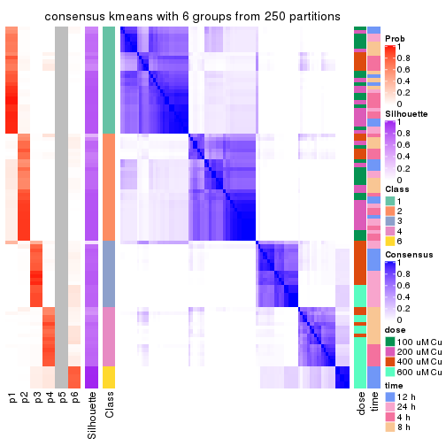</p>

</div>
</div>

Heatmaps for the membership of samples in all partitions to see how consistent they are:


<script>
$( function() {
	$( '#tabs-CV-kmeans-membership-heatmap' ).tabs();
} );
</script>
<div id='tabs-CV-kmeans-membership-heatmap'>
<ul>
<li><a href='#tab-CV-kmeans-membership-heatmap-1'>k = 2</a></li>
<li><a href='#tab-CV-kmeans-membership-heatmap-2'>k = 3</a></li>
<li><a href='#tab-CV-kmeans-membership-heatmap-3'>k = 4</a></li>
<li><a href='#tab-CV-kmeans-membership-heatmap-4'>k = 5</a></li>
<li><a href='#tab-CV-kmeans-membership-heatmap-5'>k = 6</a></li>
</ul>
<div id='tab-CV-kmeans-membership-heatmap-1'>
<pre><code class="r">membership_heatmap(res, k = 2)
</code></pre>

<p></p>

</div>
<div id='tab-CV-kmeans-membership-heatmap-2'>
<pre><code class="r">membership_heatmap(res, k = 3)
</code></pre>

<p></p>

</div>
<div id='tab-CV-kmeans-membership-heatmap-3'>
<pre><code class="r">membership_heatmap(res, k = 4)
</code></pre>

<p></p>

</div>
<div id='tab-CV-kmeans-membership-heatmap-4'>
<pre><code class="r">membership_heatmap(res, k = 5)
</code></pre>

<p></p>

</div>
<div id='tab-CV-kmeans-membership-heatmap-5'>
<pre><code class="r">membership_heatmap(res, k = 6)
</code></pre>

<p></p>

</div>
</div>

As soon as we have had the classes for columns, we can look for signatures
which are significantly different between classes which can be candidate marks
for certain classes. Following are the heatmaps for signatures.


Signature heatmaps where rows are scaled:


<script>
$( function() {
	$( '#tabs-CV-kmeans-get-signatures' ).tabs();
} );
</script>
<div id='tabs-CV-kmeans-get-signatures'>
<ul>
<li><a href='#tab-CV-kmeans-get-signatures-1'>k = 2</a></li>
<li><a href='#tab-CV-kmeans-get-signatures-2'>k = 3</a></li>
<li><a href='#tab-CV-kmeans-get-signatures-3'>k = 4</a></li>
<li><a href='#tab-CV-kmeans-get-signatures-4'>k = 5</a></li>
<li><a href='#tab-CV-kmeans-get-signatures-5'>k = 6</a></li>
</ul>
<div id='tab-CV-kmeans-get-signatures-1'>
<pre><code class="r">get_signatures(res, k = 2)
</code></pre>

<p></p>

</div>
<div id='tab-CV-kmeans-get-signatures-2'>
<pre><code class="r">get_signatures(res, k = 3)
</code></pre>

<p>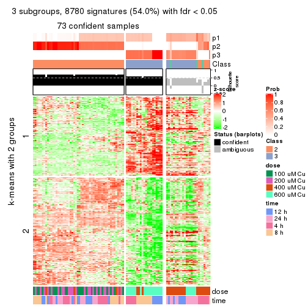</p>

</div>
<div id='tab-CV-kmeans-get-signatures-3'>
<pre><code class="r">get_signatures(res, k = 4)
</code></pre>

<p></p>

</div>
<div id='tab-CV-kmeans-get-signatures-4'>
<pre><code class="r">get_signatures(res, k = 5)
</code></pre>

<p></p>

</div>
<div id='tab-CV-kmeans-get-signatures-5'>
<pre><code class="r">get_signatures(res, k = 6)
</code></pre>

<p></p>

</div>
</div>


Signature heatmaps where rows are not scaled:


<script>
$( function() {
	$( '#tabs-CV-kmeans-get-signatures-no-scale' ).tabs();
} );
</script>
<div id='tabs-CV-kmeans-get-signatures-no-scale'>
<ul>
<li><a href='#tab-CV-kmeans-get-signatures-no-scale-1'>k = 2</a></li>
<li><a href='#tab-CV-kmeans-get-signatures-no-scale-2'>k = 3</a></li>
<li><a href='#tab-CV-kmeans-get-signatures-no-scale-3'>k = 4</a></li>
<li><a href='#tab-CV-kmeans-get-signatures-no-scale-4'>k = 5</a></li>
<li><a href='#tab-CV-kmeans-get-signatures-no-scale-5'>k = 6</a></li>
</ul>
<div id='tab-CV-kmeans-get-signatures-no-scale-1'>
<pre><code class="r">get_signatures(res, k = 2, scale_rows = FALSE)
</code></pre>

<p></p>

</div>
<div id='tab-CV-kmeans-get-signatures-no-scale-2'>
<pre><code class="r">get_signatures(res, k = 3, scale_rows = FALSE)
</code></pre>

<p></p>

</div>
<div id='tab-CV-kmeans-get-signatures-no-scale-3'>
<pre><code class="r">get_signatures(res, k = 4, scale_rows = FALSE)
</code></pre>

<p></p>

</div>
<div id='tab-CV-kmeans-get-signatures-no-scale-4'>
<pre><code class="r">get_signatures(res, k = 5, scale_rows = FALSE)
</code></pre>

<p></p>

</div>
<div id='tab-CV-kmeans-get-signatures-no-scale-5'>
<pre><code class="r">get_signatures(res, k = 6, scale_rows = FALSE)
</code></pre>

<p></p>

</div>
</div>


Compare the overlap of signatures from different k:

```r
compare_signatures(res)
```


`get_signature()` returns a data frame invisibly. TO get the list of signatures, the function
call should be assigned to a variable explicitly. In following code, if `plot` argument is set
to `FALSE`, no heatmap is plotted while only the differential analysis is performed.

```r
# code only for demonstration
tb = get_signature(res, k = ..., plot = FALSE)
```

An example of the output of `tb` is:

```
#>   which_row         fdr    mean_1    mean_2 scaled_mean_1 scaled_mean_2 km
#> 1        38 0.042760348  8.373488  9.131774    -0.5533452     0.5164555  1
#> 2        40 0.018707592  7.106213  8.469186    -0.6173731     0.5762149  1
#> 3        55 0.019134737 10.221463 11.207825    -0.6159697     0.5749050  1
#> 4        59 0.006059896  5.921854  7.869574    -0.6899429     0.6439467  1
#> 5        60 0.018055526  8.928898 10.211722    -0.6204761     0.5791110  1
#> 6        98 0.009384629 15.714769 14.887706     0.6635654    -0.6193277  2
...
```

The columns in `tb` are:

1. `which_row`: row indices corresponding to the input matrix.
2. `fdr`: FDR for the differential test. 
3. `mean_x`: The mean value in group x.
4. `scaled_mean_x`: The mean value in group x after rows are scaled.
5. `km`: Row groups if k-means clustering is applied to rows.


UMAP plot which shows how samples are separated.


<script>
$( function() {
	$( '#tabs-CV-kmeans-dimension-reduction' ).tabs();
} );
</script>
<div id='tabs-CV-kmeans-dimension-reduction'>
<ul>
<li><a href='#tab-CV-kmeans-dimension-reduction-1'>k = 2</a></li>
<li><a href='#tab-CV-kmeans-dimension-reduction-2'>k = 3</a></li>
<li><a href='#tab-CV-kmeans-dimension-reduction-3'>k = 4</a></li>
<li><a href='#tab-CV-kmeans-dimension-reduction-4'>k = 5</a></li>
<li><a href='#tab-CV-kmeans-dimension-reduction-5'>k = 6</a></li>
</ul>
<div id='tab-CV-kmeans-dimension-reduction-1'>
<pre><code class="r">dimension_reduction(res, k = 2, method = &quot;UMAP&quot;)
</code></pre>

<p>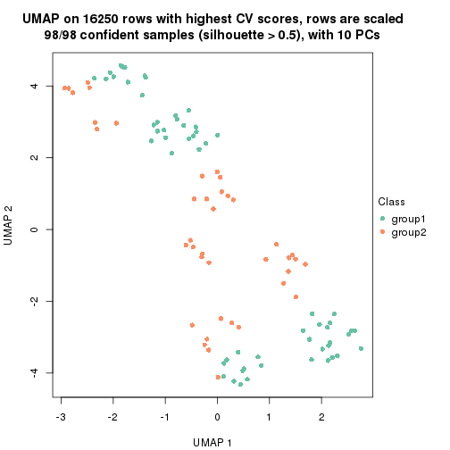</p>

</div>
<div id='tab-CV-kmeans-dimension-reduction-2'>
<pre><code class="r">dimension_reduction(res, k = 3, method = &quot;UMAP&quot;)
</code></pre>

<p></p>

</div>
<div id='tab-CV-kmeans-dimension-reduction-3'>
<pre><code class="r">dimension_reduction(res, k = 4, method = &quot;UMAP&quot;)
</code></pre>

<p></p>

</div>
<div id='tab-CV-kmeans-dimension-reduction-4'>
<pre><code class="r">dimension_reduction(res, k = 5, method = &quot;UMAP&quot;)
</code></pre>

<p></p>

</div>
<div id='tab-CV-kmeans-dimension-reduction-5'>
<pre><code class="r">dimension_reduction(res, k = 6, method = &quot;UMAP&quot;)
</code></pre>

<p></p>

</div>
</div>


Following heatmap shows how subgroups are split when increasing `k`:

```r
collect_classes(res)
```


Test correlation between subgroups and known annotations. If the known
annotation is numeric, one-way ANOVA test is applied, and if the known
annotation is discrete, chi-squared contingency table test is applied.

```r
test_to_known_factors(res)
```

```
#>            n  dose(p)  time(p) k
#> CV:kmeans 98 1.23e-15 1.67e-01 2
#> CV:kmeans 73 6.01e-14 1.00e-01 3
#> CV:kmeans 89 3.37e-13 1.89e-05 4
#> CV:kmeans 96 2.48e-14 4.08e-08 5
#> CV:kmeans 96 2.48e-14 4.08e-08 6
```


If matrix rows can be associated to genes, consider to use `GO_Enrichment(res,
...)` to perform function enrichment for the signature genes.


 

---------------------------------------------------


### CV:skmeans*


The object with results only for a single top-value method and a single partition method 
can be extracted as:

```r
res = res_list["CV", "skmeans"]
# you can also extract it by
# res = res_list["CV:skmeans"]
```

A summary of `res` and all the functions that can be applied to it:

```r
res
```

```
#> A 'ConsensusPartition' object with k = 2, 3, 4, 5, 6.
#>   On a matrix with 16250 rows and 98 columns.
#>   Top rows (1000, 2000, 3000, 4000, 5000) are extracted by 'CV' method.
#>   Subgroups are detected by 'skmeans' method.
#>   Performed in total 1250 partitions by row resampling.
#>   Best k for subgroups seems to be 4.
#> 
#> Following methods can be applied to this 'ConsensusPartition' object:
#>  [1] "cola_report"             "collect_classes"         "collect_plots"          
#>  [4] "collect_stats"           "colnames"                "compare_signatures"     
#>  [7] "consensus_heatmap"       "dimension_reduction"     "functional_enrichment"  
#> [10] "get_anno_col"            "get_anno"                "get_classes"            
#> [13] "get_consensus"           "get_matrix"              "get_membership"         
#> [16] "get_param"               "get_signatures"          "get_stats"              
#> [19] "is_best_k"               "is_stable_k"             "membership_heatmap"     
#> [22] "ncol"                    "nrow"                    "plot_ecdf"              
#> [25] "rownames"                "select_partition_number" "show"                   
#> [28] "suggest_best_k"          "test_to_known_factors"
```

`collect_plots()` function collects all the plots made from `res` for all `k` (number of partitions)
into one single page to provide an easy and fast comparison between different `k`.

```r
collect_plots(res)
```


The plots are:

- The first row: a plot of the ECDF (Empirical cumulative distribution
  function) curves of the consensus matrix for each `k` and the heatmap of
  predicted classes for each `k`.
- The second row: heatmaps of the consensus matrix for each `k`.
- The third row: heatmaps of the membership matrix for each `k`.
- The fouth row: heatmaps of the signatures for each `k`.

All the plots in panels can be made by individual functions and they are
plotted later in this section.

`select_partition_number()` produces several plots showing different
statistics for choosing "optimized" `k`. There are following statistics:

- ECDF curves of the consensus matrix for each `k`;
- 1-PAC. [The PAC
  score](https://en.wikipedia.org/wiki/Consensus_clustering#Over-interpretation_potential_of_consensus_clustering)
  measures the proportion of the ambiguous subgrouping.
- Mean silhouette score.
- Concordance. The mean probability of fiting the consensus class ids in all
  partitions.
- Area increased. Denote $A_k$ as the area under the ECDF curve for current
  `k`, the area increased is defined as $A_k - A_{k-1}$.
- Rand index. The percent of pairs of samples that are both in a same cluster
  or both are not in a same cluster in the partition of k and k-1.
- Jaccard index. The ratio of pairs of samples are both in a same cluster in
  the partition of k and k-1 and the pairs of samples are both in a same
  cluster in the partition k or k-1.

The detailed explanations of these statistics can be found in [the cola
vignette](http://bioconductor.org/packages/devel/bioc/vignettes/cola/inst/doc/cola.html#toc_13).

Generally speaking, lower PAC score, higher mean silhouette score or higher
concordance corresponds to better partition. Rand index and Jaccard index
measure how similar the current partition is compared to partition with `k-1`.
If they are too similar, we won't accept `k` is better than `k-1`.

```r
select_partition_number(res)
```


The numeric values for all these statistics can be obtained by `get_stats()`.

```r
get_stats(res)
```

```
#>   k 1-PAC mean_silhouette concordance area_increased  Rand Jaccard
#> 2 2 1.000           0.974       0.989         0.4952 0.505   0.505
#> 3 3 0.683           0.846       0.827         0.3055 0.793   0.603
#> 4 4 0.946           0.962       0.978         0.1598 0.901   0.710
#> 5 5 0.897           0.847       0.916         0.0464 0.974   0.898
#> 6 6 0.841           0.822       0.886         0.0406 0.953   0.796
```

`suggest_best_k()` suggests the best $k$ based on these statistics. The rules are as follows:

- All $k$ with Jaccard index larger than 0.95 are removed because the increase of
  the partition number does not provides enough extra information. If all $k$ are removed,
  the best $k$ is assigned by `NA`.
- For $k$ with 1-PAC larger than 0.9, the maximal $k$ is taken as the "best k". Other $k$ is called "optional k".
- If it does not fit the second rule. The $k$ with the highest vote of highest
  1-PAC, mean silhouette and concordance is taken as the "best k".

```r
suggest_best_k(res)
```

```
#> [1] 4
#> attr(,"optional")
#> [1] 2
```

There is also optional best $k$ = 2 that is worth to check.

Following shows the table of the partitions (You need to click the **show/hide
code output** link to see it). The membership matrix (columns with name `p*`)
is inferred by
[`clue::cl_consensus()`](https://www.rdocumentation.org/link/cl_consensus?package=clue)
function with the `SE` method. Basically the value in the membership matrix
represents the probability to belong to a certain group. The finall class
label for an item is determined with the group with highest probability it
belongs to.

In `get_classes()` function, the entropy is calculated from the membership
matrix and the silhouette score is calculated from the consensus matrix.


<script>
$( function() {
	$( '#tabs-CV-skmeans-get-classes' ).tabs();
} );
</script>
<div id='tabs-CV-skmeans-get-classes'>
<ul>
<li><a href='#tab-CV-skmeans-get-classes-1'>k = 2</a></li>
<li><a href='#tab-CV-skmeans-get-classes-2'>k = 3</a></li>
<li><a href='#tab-CV-skmeans-get-classes-3'>k = 4</a></li>
<li><a href='#tab-CV-skmeans-get-classes-4'>k = 5</a></li>
<li><a href='#tab-CV-skmeans-get-classes-5'>k = 6</a></li>
</ul>

<div id='tab-CV-skmeans-get-classes-1'>
<p><a id='tab-CV-skmeans-get-classes-1-a' style='color:#0366d6' href='#'>show/hide code output</a></p>
<pre><code class="r">cbind(get_classes(res, k = 2), get_membership(res, k = 2))
</code></pre>

<pre><code>#&gt;           class entropy silhouette    p1    p2
#&gt; GSM241451     1  0.0000      0.989 1.000 0.000
#&gt; GSM241452     1  0.0000      0.989 1.000 0.000
#&gt; GSM241453     1  0.0000      0.989 1.000 0.000
#&gt; GSM241454     1  0.0000      0.989 1.000 0.000
#&gt; GSM241455     1  0.0000      0.989 1.000 0.000
#&gt; GSM241456     1  0.0000      0.989 1.000 0.000
#&gt; GSM241457     1  0.0000      0.989 1.000 0.000
#&gt; GSM241458     1  0.0000      0.989 1.000 0.000
#&gt; GSM241459     1  0.0000      0.989 1.000 0.000
#&gt; GSM241460     1  0.0000      0.989 1.000 0.000
#&gt; GSM241461     1  0.0000      0.989 1.000 0.000
#&gt; GSM241462     1  0.0000      0.989 1.000 0.000
#&gt; GSM241463     1  0.0000      0.989 1.000 0.000
#&gt; GSM241464     1  0.0000      0.989 1.000 0.000
#&gt; GSM241465     1  0.0000      0.989 1.000 0.000
#&gt; GSM241466     1  0.0000      0.989 1.000 0.000
#&gt; GSM241467     1  0.0000      0.989 1.000 0.000
#&gt; GSM241468     1  0.0000      0.989 1.000 0.000
#&gt; GSM241469     1  0.0000      0.989 1.000 0.000
#&gt; GSM241470     1  0.0000      0.989 1.000 0.000
#&gt; GSM241471     1  0.0000      0.989 1.000 0.000
#&gt; GSM241472     1  0.0000      0.989 1.000 0.000
#&gt; GSM241473     1  0.0000      0.989 1.000 0.000
#&gt; GSM241474     1  0.0000      0.989 1.000 0.000
#&gt; GSM241475     1  0.0000      0.989 1.000 0.000
#&gt; GSM241476     1  0.0000      0.989 1.000 0.000
#&gt; GSM241477     1  0.0000      0.989 1.000 0.000
#&gt; GSM241478     1  0.0000      0.989 1.000 0.000
#&gt; GSM241479     1  0.0000      0.989 1.000 0.000
#&gt; GSM241480     1  0.0000      0.989 1.000 0.000
#&gt; GSM241481     1  0.0000      0.989 1.000 0.000
#&gt; GSM241482     1  0.0000      0.989 1.000 0.000
#&gt; GSM241483     1  0.0000      0.989 1.000 0.000
#&gt; GSM241484     1  0.0000      0.989 1.000 0.000
#&gt; GSM241485     1  0.0000      0.989 1.000 0.000
#&gt; GSM241486     1  0.0000      0.989 1.000 0.000
#&gt; GSM241487     1  0.0000      0.989 1.000 0.000
#&gt; GSM241488     1  0.0000      0.989 1.000 0.000
#&gt; GSM241489     1  0.0000      0.989 1.000 0.000
#&gt; GSM241490     1  0.0000      0.989 1.000 0.000
#&gt; GSM241491     1  0.0000      0.989 1.000 0.000
#&gt; GSM241492     1  0.0000      0.989 1.000 0.000
#&gt; GSM241493     1  0.0000      0.989 1.000 0.000
#&gt; GSM241494     1  0.0000      0.989 1.000 0.000
#&gt; GSM241495     1  0.0000      0.989 1.000 0.000
#&gt; GSM241496     1  0.0000      0.989 1.000 0.000
#&gt; GSM241497     1  0.0000      0.989 1.000 0.000
#&gt; GSM241498     1  0.0000      0.989 1.000 0.000
#&gt; GSM241499     1  0.0000      0.989 1.000 0.000
#&gt; GSM241500     2  0.8207      0.656 0.256 0.744
#&gt; GSM241501     1  0.0000      0.989 1.000 0.000
#&gt; GSM241502     1  0.7883      0.690 0.764 0.236
#&gt; GSM241503     1  0.0938      0.979 0.988 0.012
#&gt; GSM241504     1  0.1184      0.975 0.984 0.016
#&gt; GSM241505     1  0.1843      0.963 0.972 0.028
#&gt; GSM241506     2  0.8016      0.677 0.244 0.756
#&gt; GSM241507     1  0.0000      0.989 1.000 0.000
#&gt; GSM241508     1  0.8713      0.584 0.708 0.292
#&gt; GSM241509     2  0.0000      0.987 0.000 1.000
#&gt; GSM241510     2  0.0000      0.987 0.000 1.000
#&gt; GSM241511     2  0.0000      0.987 0.000 1.000
#&gt; GSM241512     2  0.0000      0.987 0.000 1.000
#&gt; GSM241513     2  0.0000      0.987 0.000 1.000
#&gt; GSM241514     2  0.0000      0.987 0.000 1.000
#&gt; GSM241515     2  0.0000      0.987 0.000 1.000
#&gt; GSM241516     2  0.0000      0.987 0.000 1.000
#&gt; GSM241517     2  0.0000      0.987 0.000 1.000
#&gt; GSM241518     2  0.0000      0.987 0.000 1.000
#&gt; GSM241519     2  0.0000      0.987 0.000 1.000
#&gt; GSM241520     2  0.0000      0.987 0.000 1.000
#&gt; GSM241521     2  0.0000      0.987 0.000 1.000
#&gt; GSM241522     2  0.0000      0.987 0.000 1.000
#&gt; GSM241523     2  0.0000      0.987 0.000 1.000
#&gt; GSM241524     2  0.0000      0.987 0.000 1.000
#&gt; GSM241525     2  0.0000      0.987 0.000 1.000
#&gt; GSM241526     2  0.0000      0.987 0.000 1.000
#&gt; GSM241527     2  0.0000      0.987 0.000 1.000
#&gt; GSM241528     2  0.0000      0.987 0.000 1.000
#&gt; GSM241529     2  0.0000      0.987 0.000 1.000
#&gt; GSM241530     2  0.0000      0.987 0.000 1.000
#&gt; GSM241531     2  0.0000      0.987 0.000 1.000
#&gt; GSM241532     2  0.0000      0.987 0.000 1.000
#&gt; GSM241533     2  0.0000      0.987 0.000 1.000
#&gt; GSM241534     2  0.0000      0.987 0.000 1.000
#&gt; GSM241535     2  0.0000      0.987 0.000 1.000
#&gt; GSM241536     2  0.0000      0.987 0.000 1.000
#&gt; GSM241537     2  0.0000      0.987 0.000 1.000
#&gt; GSM241538     2  0.0000      0.987 0.000 1.000
#&gt; GSM241539     2  0.0000      0.987 0.000 1.000
#&gt; GSM241540     2  0.0000      0.987 0.000 1.000
#&gt; GSM241541     2  0.0000      0.987 0.000 1.000
#&gt; GSM241542     2  0.0000      0.987 0.000 1.000
#&gt; GSM241543     2  0.0000      0.987 0.000 1.000
#&gt; GSM241544     2  0.0000      0.987 0.000 1.000
#&gt; GSM241545     2  0.0000      0.987 0.000 1.000
#&gt; GSM241546     2  0.0000      0.987 0.000 1.000
#&gt; GSM241547     2  0.0000      0.987 0.000 1.000
#&gt; GSM241548     2  0.0000      0.987 0.000 1.000
</code></pre>

<script>
$('#tab-CV-skmeans-get-classes-1-a').parent().next().next().hide();
$('#tab-CV-skmeans-get-classes-1-a').click(function(){
  $('#tab-CV-skmeans-get-classes-1-a').parent().next().next().toggle();
  return(false);
});
</script>
</div>

<div id='tab-CV-skmeans-get-classes-2'>
<p><a id='tab-CV-skmeans-get-classes-2-a' style='color:#0366d6' href='#'>show/hide code output</a></p>
<pre><code class="r">cbind(get_classes(res, k = 3), get_membership(res, k = 3))
</code></pre>

<pre><code>#&gt;           class entropy silhouette    p1    p2    p3
#&gt; GSM241451     2   0.000      0.909 0.000 1.000 0.000
#&gt; GSM241452     1   0.601      0.921 0.628 0.372 0.000
#&gt; GSM241453     2   0.000      0.909 0.000 1.000 0.000
#&gt; GSM241454     1   0.601      0.921 0.628 0.372 0.000
#&gt; GSM241455     2   0.000      0.909 0.000 1.000 0.000
#&gt; GSM241456     1   0.601      0.921 0.628 0.372 0.000
#&gt; GSM241457     2   0.000      0.909 0.000 1.000 0.000
#&gt; GSM241458     1   0.601      0.921 0.628 0.372 0.000
#&gt; GSM241459     2   0.000      0.909 0.000 1.000 0.000
#&gt; GSM241460     1   0.601      0.921 0.628 0.372 0.000
#&gt; GSM241461     2   0.000      0.909 0.000 1.000 0.000
#&gt; GSM241462     1   0.601      0.921 0.628 0.372 0.000
#&gt; GSM241463     2   0.000      0.909 0.000 1.000 0.000
#&gt; GSM241464     1   0.601      0.921 0.628 0.372 0.000
#&gt; GSM241465     2   0.000      0.909 0.000 1.000 0.000
#&gt; GSM241466     1   0.601      0.921 0.628 0.372 0.000
#&gt; GSM241467     1   0.601      0.921 0.628 0.372 0.000
#&gt; GSM241468     2   0.000      0.909 0.000 1.000 0.000
#&gt; GSM241469     1   0.601      0.921 0.628 0.372 0.000
#&gt; GSM241470     2   0.000      0.909 0.000 1.000 0.000
#&gt; GSM241471     2   0.000      0.909 0.000 1.000 0.000
#&gt; GSM241472     1   0.601      0.921 0.628 0.372 0.000
#&gt; GSM241473     2   0.000      0.909 0.000 1.000 0.000
#&gt; GSM241474     1   0.601      0.921 0.628 0.372 0.000
#&gt; GSM241475     2   0.000      0.909 0.000 1.000 0.000
#&gt; GSM241476     1   0.601      0.921 0.628 0.372 0.000
#&gt; GSM241477     2   0.000      0.909 0.000 1.000 0.000
#&gt; GSM241478     2   0.000      0.909 0.000 1.000 0.000
#&gt; GSM241479     1   0.601      0.921 0.628 0.372 0.000
#&gt; GSM241480     1   0.601      0.921 0.628 0.372 0.000
#&gt; GSM241481     2   0.000      0.909 0.000 1.000 0.000
#&gt; GSM241482     1   0.601      0.921 0.628 0.372 0.000
#&gt; GSM241483     2   0.000      0.909 0.000 1.000 0.000
#&gt; GSM241484     1   0.601      0.921 0.628 0.372 0.000
#&gt; GSM241485     1   0.601      0.921 0.628 0.372 0.000
#&gt; GSM241486     2   0.000      0.909 0.000 1.000 0.000
#&gt; GSM241487     2   0.000      0.909 0.000 1.000 0.000
#&gt; GSM241488     2   0.000      0.909 0.000 1.000 0.000
#&gt; GSM241489     1   0.601      0.921 0.628 0.372 0.000
#&gt; GSM241490     1   0.601      0.921 0.628 0.372 0.000
#&gt; GSM241491     2   0.000      0.909 0.000 1.000 0.000
#&gt; GSM241492     1   0.601      0.921 0.628 0.372 0.000
#&gt; GSM241493     2   0.000      0.909 0.000 1.000 0.000
#&gt; GSM241494     1   0.601      0.921 0.628 0.372 0.000
#&gt; GSM241495     2   0.000      0.909 0.000 1.000 0.000
#&gt; GSM241496     2   0.000      0.909 0.000 1.000 0.000
#&gt; GSM241497     1   0.601      0.921 0.628 0.372 0.000
#&gt; GSM241498     1   0.601      0.921 0.628 0.372 0.000
#&gt; GSM241499     1   0.601      0.921 0.628 0.372 0.000
#&gt; GSM241500     2   0.601      0.510 0.000 0.628 0.372
#&gt; GSM241501     2   0.412      0.718 0.000 0.832 0.168
#&gt; GSM241502     2   0.440      0.696 0.000 0.812 0.188
#&gt; GSM241503     1   0.835      0.675 0.628 0.188 0.184
#&gt; GSM241504     1   0.786      0.558 0.628 0.088 0.284
#&gt; GSM241505     1   0.786      0.558 0.628 0.088 0.284
#&gt; GSM241506     2   0.604      0.498 0.000 0.620 0.380
#&gt; GSM241507     1   0.601      0.921 0.628 0.372 0.000
#&gt; GSM241508     2   0.601      0.510 0.000 0.628 0.372
#&gt; GSM241509     3   0.271      0.831 0.088 0.000 0.912
#&gt; GSM241510     3   0.000      0.810 0.000 0.000 1.000
#&gt; GSM241511     3   0.000      0.810 0.000 0.000 1.000
#&gt; GSM241512     3   0.280      0.832 0.092 0.000 0.908
#&gt; GSM241513     3   0.601      0.858 0.372 0.000 0.628
#&gt; GSM241514     3   0.601      0.858 0.372 0.000 0.628
#&gt; GSM241515     3   0.601      0.858 0.372 0.000 0.628
#&gt; GSM241516     3   0.601      0.858 0.372 0.000 0.628
#&gt; GSM241517     3   0.601      0.858 0.372 0.000 0.628
#&gt; GSM241518     3   0.601      0.858 0.372 0.000 0.628
#&gt; GSM241519     3   0.601      0.858 0.372 0.000 0.628
#&gt; GSM241520     3   0.601      0.858 0.372 0.000 0.628
#&gt; GSM241521     3   0.601      0.858 0.372 0.000 0.628
#&gt; GSM241522     1   0.525     -0.323 0.736 0.000 0.264
#&gt; GSM241523     3   0.601      0.858 0.372 0.000 0.628
#&gt; GSM241524     3   0.601      0.858 0.372 0.000 0.628
#&gt; GSM241525     3   0.000      0.810 0.000 0.000 1.000
#&gt; GSM241526     3   0.000      0.810 0.000 0.000 1.000
#&gt; GSM241527     3   0.000      0.810 0.000 0.000 1.000
#&gt; GSM241528     3   0.000      0.810 0.000 0.000 1.000
#&gt; GSM241529     3   0.000      0.810 0.000 0.000 1.000
#&gt; GSM241530     3   0.000      0.810 0.000 0.000 1.000
#&gt; GSM241531     3   0.000      0.810 0.000 0.000 1.000
#&gt; GSM241532     3   0.000      0.810 0.000 0.000 1.000
#&gt; GSM241533     3   0.000      0.810 0.000 0.000 1.000
#&gt; GSM241534     3   0.000      0.810 0.000 0.000 1.000
#&gt; GSM241535     3   0.000      0.810 0.000 0.000 1.000
#&gt; GSM241536     3   0.000      0.810 0.000 0.000 1.000
#&gt; GSM241537     3   0.525      0.861 0.264 0.000 0.736
#&gt; GSM241538     3   0.525      0.861 0.264 0.000 0.736
#&gt; GSM241539     3   0.525      0.861 0.264 0.000 0.736
#&gt; GSM241540     3   0.525      0.861 0.264 0.000 0.736
#&gt; GSM241541     3   0.525      0.861 0.264 0.000 0.736
#&gt; GSM241542     3   0.525      0.861 0.264 0.000 0.736
#&gt; GSM241543     3   0.601      0.858 0.372 0.000 0.628
#&gt; GSM241544     3   0.601      0.858 0.372 0.000 0.628
#&gt; GSM241545     3   0.601      0.858 0.372 0.000 0.628
#&gt; GSM241546     3   0.601      0.858 0.372 0.000 0.628
#&gt; GSM241547     3   0.601      0.858 0.372 0.000 0.628
#&gt; GSM241548     3   0.601      0.858 0.372 0.000 0.628
</code></pre>

<script>
$('#tab-CV-skmeans-get-classes-2-a').parent().next().next().hide();
$('#tab-CV-skmeans-get-classes-2-a').click(function(){
  $('#tab-CV-skmeans-get-classes-2-a').parent().next().next().toggle();
  return(false);
});
</script>
</div>

<div id='tab-CV-skmeans-get-classes-3'>
<p><a id='tab-CV-skmeans-get-classes-3-a' style='color:#0366d6' href='#'>show/hide code output</a></p>
<pre><code class="r">cbind(get_classes(res, k = 4), get_membership(res, k = 4))
</code></pre>

<pre><code>#&gt;           class entropy silhouette    p1    p2    p3    p4
#&gt; GSM241451     2  0.0000      0.982 0.000 1.000 0.000 0.000
#&gt; GSM241452     1  0.0336      0.992 0.992 0.008 0.000 0.000
#&gt; GSM241453     2  0.0000      0.982 0.000 1.000 0.000 0.000
#&gt; GSM241454     1  0.0336      0.992 0.992 0.008 0.000 0.000
#&gt; GSM241455     2  0.0000      0.982 0.000 1.000 0.000 0.000
#&gt; GSM241456     1  0.0336      0.992 0.992 0.008 0.000 0.000
#&gt; GSM241457     2  0.0000      0.982 0.000 1.000 0.000 0.000
#&gt; GSM241458     1  0.0188      0.991 0.996 0.004 0.000 0.000
#&gt; GSM241459     2  0.0000      0.982 0.000 1.000 0.000 0.000
#&gt; GSM241460     1  0.0188      0.991 0.996 0.004 0.000 0.000
#&gt; GSM241461     2  0.0000      0.982 0.000 1.000 0.000 0.000
#&gt; GSM241462     1  0.0188      0.991 0.996 0.004 0.000 0.000
#&gt; GSM241463     2  0.0000      0.982 0.000 1.000 0.000 0.000
#&gt; GSM241464     1  0.0336      0.992 0.992 0.008 0.000 0.000
#&gt; GSM241465     2  0.0000      0.982 0.000 1.000 0.000 0.000
#&gt; GSM241466     1  0.0336      0.992 0.992 0.008 0.000 0.000
#&gt; GSM241467     1  0.0336      0.992 0.992 0.008 0.000 0.000
#&gt; GSM241468     2  0.0000      0.982 0.000 1.000 0.000 0.000
#&gt; GSM241469     1  0.0336      0.992 0.992 0.008 0.000 0.000
#&gt; GSM241470     2  0.0000      0.982 0.000 1.000 0.000 0.000
#&gt; GSM241471     2  0.0000      0.982 0.000 1.000 0.000 0.000
#&gt; GSM241472     1  0.0336      0.992 0.992 0.008 0.000 0.000
#&gt; GSM241473     2  0.0000      0.982 0.000 1.000 0.000 0.000
#&gt; GSM241474     1  0.0336      0.992 0.992 0.008 0.000 0.000
#&gt; GSM241475     2  0.0000      0.982 0.000 1.000 0.000 0.000
#&gt; GSM241476     1  0.0336      0.992 0.992 0.008 0.000 0.000
#&gt; GSM241477     2  0.0000      0.982 0.000 1.000 0.000 0.000
#&gt; GSM241478     2  0.0000      0.982 0.000 1.000 0.000 0.000
#&gt; GSM241479     1  0.0336      0.992 0.992 0.008 0.000 0.000
#&gt; GSM241480     1  0.0336      0.992 0.992 0.008 0.000 0.000
#&gt; GSM241481     2  0.0000      0.982 0.000 1.000 0.000 0.000
#&gt; GSM241482     1  0.0188      0.991 0.996 0.004 0.000 0.000
#&gt; GSM241483     2  0.0000      0.982 0.000 1.000 0.000 0.000
#&gt; GSM241484     1  0.0188      0.991 0.996 0.004 0.000 0.000
#&gt; GSM241485     1  0.0188      0.991 0.996 0.004 0.000 0.000
#&gt; GSM241486     2  0.0000      0.982 0.000 1.000 0.000 0.000
#&gt; GSM241487     2  0.0000      0.982 0.000 1.000 0.000 0.000
#&gt; GSM241488     2  0.0000      0.982 0.000 1.000 0.000 0.000
#&gt; GSM241489     1  0.0336      0.992 0.992 0.008 0.000 0.000
#&gt; GSM241490     1  0.0336      0.992 0.992 0.008 0.000 0.000
#&gt; GSM241491     2  0.0000      0.982 0.000 1.000 0.000 0.000
#&gt; GSM241492     1  0.0336      0.992 0.992 0.008 0.000 0.000
#&gt; GSM241493     2  0.0000      0.982 0.000 1.000 0.000 0.000
#&gt; GSM241494     1  0.0336      0.992 0.992 0.008 0.000 0.000
#&gt; GSM241495     2  0.0000      0.982 0.000 1.000 0.000 0.000
#&gt; GSM241496     2  0.0000      0.982 0.000 1.000 0.000 0.000
#&gt; GSM241497     1  0.0336      0.992 0.992 0.008 0.000 0.000
#&gt; GSM241498     1  0.0336      0.992 0.992 0.008 0.000 0.000
#&gt; GSM241499     1  0.0188      0.986 0.996 0.000 0.000 0.004
#&gt; GSM241500     2  0.4356      0.616 0.000 0.708 0.000 0.292
#&gt; GSM241501     2  0.0188      0.978 0.000 0.996 0.000 0.004
#&gt; GSM241502     2  0.2469      0.880 0.000 0.892 0.000 0.108
#&gt; GSM241503     1  0.0592      0.978 0.984 0.000 0.000 0.016
#&gt; GSM241504     1  0.1867      0.926 0.928 0.000 0.000 0.072
#&gt; GSM241505     1  0.1867      0.926 0.928 0.000 0.000 0.072
#&gt; GSM241506     4  0.3610      0.721 0.000 0.200 0.000 0.800
#&gt; GSM241507     1  0.0188      0.986 0.996 0.000 0.000 0.004
#&gt; GSM241508     2  0.2081      0.908 0.000 0.916 0.000 0.084
#&gt; GSM241509     4  0.0336      0.937 0.000 0.000 0.008 0.992
#&gt; GSM241510     4  0.0188      0.938 0.000 0.000 0.004 0.996
#&gt; GSM241511     4  0.0336      0.934 0.008 0.000 0.000 0.992
#&gt; GSM241512     4  0.1474      0.917 0.000 0.000 0.052 0.948
#&gt; GSM241513     3  0.0000      1.000 0.000 0.000 1.000 0.000
#&gt; GSM241514     3  0.0000      1.000 0.000 0.000 1.000 0.000
#&gt; GSM241515     3  0.0000      1.000 0.000 0.000 1.000 0.000
#&gt; GSM241516     3  0.0000      1.000 0.000 0.000 1.000 0.000
#&gt; GSM241517     3  0.0000      1.000 0.000 0.000 1.000 0.000
#&gt; GSM241518     3  0.0000      1.000 0.000 0.000 1.000 0.000
#&gt; GSM241519     3  0.0000      1.000 0.000 0.000 1.000 0.000
#&gt; GSM241520     3  0.0000      1.000 0.000 0.000 1.000 0.000
#&gt; GSM241521     3  0.0000      1.000 0.000 0.000 1.000 0.000
#&gt; GSM241522     3  0.0188      0.995 0.000 0.000 0.996 0.004
#&gt; GSM241523     3  0.0000      1.000 0.000 0.000 1.000 0.000
#&gt; GSM241524     3  0.0000      1.000 0.000 0.000 1.000 0.000
#&gt; GSM241525     4  0.0000      0.936 0.000 0.000 0.000 1.000
#&gt; GSM241526     4  0.0188      0.938 0.000 0.000 0.004 0.996
#&gt; GSM241527     4  0.0188      0.938 0.000 0.000 0.004 0.996
#&gt; GSM241528     4  0.0188      0.938 0.000 0.000 0.004 0.996
#&gt; GSM241529     4  0.0188      0.938 0.000 0.000 0.004 0.996
#&gt; GSM241530     4  0.0000      0.936 0.000 0.000 0.000 1.000
#&gt; GSM241531     4  0.0188      0.935 0.004 0.000 0.000 0.996
#&gt; GSM241532     4  0.0188      0.938 0.000 0.000 0.004 0.996
#&gt; GSM241533     4  0.0188      0.938 0.000 0.000 0.004 0.996
#&gt; GSM241534     4  0.0188      0.938 0.000 0.000 0.004 0.996
#&gt; GSM241535     4  0.0188      0.938 0.000 0.000 0.004 0.996
#&gt; GSM241536     4  0.0336      0.934 0.008 0.000 0.000 0.992
#&gt; GSM241537     4  0.3266      0.842 0.000 0.000 0.168 0.832
#&gt; GSM241538     4  0.3266      0.842 0.000 0.000 0.168 0.832
#&gt; GSM241539     4  0.3266      0.842 0.000 0.000 0.168 0.832
#&gt; GSM241540     4  0.3266      0.842 0.000 0.000 0.168 0.832
#&gt; GSM241541     4  0.3266      0.842 0.000 0.000 0.168 0.832
#&gt; GSM241542     4  0.3266      0.842 0.000 0.000 0.168 0.832
#&gt; GSM241543     3  0.0000      1.000 0.000 0.000 1.000 0.000
#&gt; GSM241544     3  0.0000      1.000 0.000 0.000 1.000 0.000
#&gt; GSM241545     3  0.0000      1.000 0.000 0.000 1.000 0.000
#&gt; GSM241546     3  0.0000      1.000 0.000 0.000 1.000 0.000
#&gt; GSM241547     3  0.0000      1.000 0.000 0.000 1.000 0.000
#&gt; GSM241548     3  0.0000      1.000 0.000 0.000 1.000 0.000
</code></pre>

<script>
$('#tab-CV-skmeans-get-classes-3-a').parent().next().next().hide();
$('#tab-CV-skmeans-get-classes-3-a').click(function(){
  $('#tab-CV-skmeans-get-classes-3-a').parent().next().next().toggle();
  return(false);
});
</script>
</div>

<div id='tab-CV-skmeans-get-classes-4'>
<p><a id='tab-CV-skmeans-get-classes-4-a' style='color:#0366d6' href='#'>show/hide code output</a></p>
<pre><code class="r">cbind(get_classes(res, k = 5), get_membership(res, k = 5))
</code></pre>

<pre><code>#&gt;           class entropy silhouette    p1    p2    p3    p4    p5
#&gt; GSM241451     2  0.0404      0.904 0.000 0.988 0.000 0.000 0.012
#&gt; GSM241452     1  0.0404      0.930 0.988 0.012 0.000 0.000 0.000
#&gt; GSM241453     2  0.0404      0.904 0.000 0.988 0.000 0.000 0.012
#&gt; GSM241454     1  0.0290      0.931 0.992 0.008 0.000 0.000 0.000
#&gt; GSM241455     2  0.0162      0.903 0.000 0.996 0.000 0.000 0.004
#&gt; GSM241456     1  0.0290      0.931 0.992 0.008 0.000 0.000 0.000
#&gt; GSM241457     2  0.1792      0.838 0.000 0.916 0.000 0.000 0.084
#&gt; GSM241458     1  0.0798      0.929 0.976 0.008 0.000 0.000 0.016
#&gt; GSM241459     2  0.1792      0.838 0.000 0.916 0.000 0.000 0.084
#&gt; GSM241460     1  0.1018      0.927 0.968 0.016 0.000 0.000 0.016
#&gt; GSM241461     2  0.4305     -0.352 0.000 0.512 0.000 0.000 0.488
#&gt; GSM241462     1  0.1168      0.926 0.960 0.008 0.000 0.000 0.032
#&gt; GSM241463     2  0.0290      0.901 0.000 0.992 0.000 0.000 0.008
#&gt; GSM241464     1  0.1300      0.919 0.956 0.028 0.000 0.000 0.016
#&gt; GSM241465     2  0.0404      0.900 0.000 0.988 0.000 0.000 0.012
#&gt; GSM241466     1  0.0798      0.929 0.976 0.008 0.000 0.000 0.016
#&gt; GSM241467     1  0.0798      0.929 0.976 0.008 0.000 0.000 0.016
#&gt; GSM241468     2  0.0404      0.900 0.000 0.988 0.000 0.000 0.012
#&gt; GSM241469     1  0.0290      0.931 0.992 0.008 0.000 0.000 0.000
#&gt; GSM241470     2  0.0404      0.904 0.000 0.988 0.000 0.000 0.012
#&gt; GSM241471     2  0.0404      0.900 0.000 0.988 0.000 0.000 0.012
#&gt; GSM241472     1  0.0798      0.929 0.976 0.008 0.000 0.000 0.016
#&gt; GSM241473     2  0.0404      0.900 0.000 0.988 0.000 0.000 0.012
#&gt; GSM241474     1  0.1018      0.927 0.968 0.016 0.000 0.000 0.016
#&gt; GSM241475     2  0.0404      0.904 0.000 0.988 0.000 0.000 0.012
#&gt; GSM241476     1  0.0290      0.931 0.992 0.008 0.000 0.000 0.000
#&gt; GSM241477     2  0.0404      0.904 0.000 0.988 0.000 0.000 0.012
#&gt; GSM241478     2  0.0404      0.904 0.000 0.988 0.000 0.000 0.012
#&gt; GSM241479     1  0.0290      0.931 0.992 0.008 0.000 0.000 0.000
#&gt; GSM241480     1  0.0290      0.931 0.992 0.008 0.000 0.000 0.000
#&gt; GSM241481     2  0.1792      0.838 0.000 0.916 0.000 0.000 0.084
#&gt; GSM241482     1  0.0798      0.929 0.976 0.008 0.000 0.000 0.016
#&gt; GSM241483     2  0.3242      0.631 0.000 0.784 0.000 0.000 0.216
#&gt; GSM241484     1  0.0579      0.929 0.984 0.008 0.000 0.000 0.008
#&gt; GSM241485     1  0.1168      0.926 0.960 0.008 0.000 0.000 0.032
#&gt; GSM241486     2  0.4306     -0.353 0.000 0.508 0.000 0.000 0.492
#&gt; GSM241487     2  0.0290      0.903 0.000 0.992 0.000 0.000 0.008
#&gt; GSM241488     2  0.0290      0.904 0.000 0.992 0.000 0.000 0.008
#&gt; GSM241489     1  0.0290      0.931 0.992 0.008 0.000 0.000 0.000
#&gt; GSM241490     1  0.0290      0.931 0.992 0.008 0.000 0.000 0.000
#&gt; GSM241491     2  0.0290      0.901 0.000 0.992 0.000 0.000 0.008
#&gt; GSM241492     1  0.1117      0.925 0.964 0.020 0.000 0.000 0.016
#&gt; GSM241493     2  0.0404      0.904 0.000 0.988 0.000 0.000 0.012
#&gt; GSM241494     1  0.0798      0.929 0.976 0.008 0.000 0.000 0.016
#&gt; GSM241495     2  0.0404      0.904 0.000 0.988 0.000 0.000 0.012
#&gt; GSM241496     2  0.0404      0.904 0.000 0.988 0.000 0.000 0.012
#&gt; GSM241497     1  0.0290      0.931 0.992 0.008 0.000 0.000 0.000
#&gt; GSM241498     1  0.0290      0.931 0.992 0.008 0.000 0.000 0.000
#&gt; GSM241499     1  0.3707      0.695 0.716 0.000 0.000 0.000 0.284
#&gt; GSM241500     5  0.5480      0.731 0.000 0.176 0.000 0.168 0.656
#&gt; GSM241501     5  0.4375      0.491 0.000 0.420 0.000 0.004 0.576
#&gt; GSM241502     5  0.5210      0.731 0.000 0.184 0.000 0.132 0.684
#&gt; GSM241503     1  0.4367      0.581 0.620 0.000 0.000 0.008 0.372
#&gt; GSM241504     1  0.4505      0.558 0.604 0.000 0.000 0.012 0.384
#&gt; GSM241505     1  0.4482      0.570 0.612 0.000 0.000 0.012 0.376
#&gt; GSM241506     5  0.4302      0.576 0.000 0.048 0.000 0.208 0.744
#&gt; GSM241507     1  0.3816      0.691 0.696 0.000 0.000 0.000 0.304
#&gt; GSM241508     5  0.4708      0.458 0.000 0.436 0.000 0.016 0.548
#&gt; GSM241509     4  0.0404      0.871 0.000 0.000 0.000 0.988 0.012
#&gt; GSM241510     4  0.2966      0.739 0.000 0.000 0.000 0.816 0.184
#&gt; GSM241511     4  0.4046      0.668 0.008 0.000 0.000 0.696 0.296
#&gt; GSM241512     4  0.0324      0.872 0.000 0.000 0.004 0.992 0.004
#&gt; GSM241513     3  0.0703      0.981 0.000 0.000 0.976 0.000 0.024
#&gt; GSM241514     3  0.0703      0.981 0.000 0.000 0.976 0.000 0.024
#&gt; GSM241515     3  0.0865      0.979 0.000 0.000 0.972 0.004 0.024
#&gt; GSM241516     3  0.0865      0.979 0.000 0.000 0.972 0.004 0.024
#&gt; GSM241517     3  0.0703      0.981 0.000 0.000 0.976 0.000 0.024
#&gt; GSM241518     3  0.0703      0.981 0.000 0.000 0.976 0.000 0.024
#&gt; GSM241519     3  0.0000      0.989 0.000 0.000 1.000 0.000 0.000
#&gt; GSM241520     3  0.0000      0.989 0.000 0.000 1.000 0.000 0.000
#&gt; GSM241521     3  0.0000      0.989 0.000 0.000 1.000 0.000 0.000
#&gt; GSM241522     3  0.1168      0.958 0.008 0.000 0.960 0.000 0.032
#&gt; GSM241523     3  0.0000      0.989 0.000 0.000 1.000 0.000 0.000
#&gt; GSM241524     3  0.0000      0.989 0.000 0.000 1.000 0.000 0.000
#&gt; GSM241525     4  0.2471      0.830 0.000 0.000 0.000 0.864 0.136
#&gt; GSM241526     4  0.1792      0.855 0.000 0.000 0.000 0.916 0.084
#&gt; GSM241527     4  0.1792      0.855 0.000 0.000 0.000 0.916 0.084
#&gt; GSM241528     4  0.1851      0.853 0.000 0.000 0.000 0.912 0.088
#&gt; GSM241529     4  0.1851      0.853 0.000 0.000 0.000 0.912 0.088
#&gt; GSM241530     4  0.2127      0.844 0.000 0.000 0.000 0.892 0.108
#&gt; GSM241531     4  0.3582      0.748 0.008 0.000 0.000 0.768 0.224
#&gt; GSM241532     4  0.1410      0.859 0.000 0.000 0.000 0.940 0.060
#&gt; GSM241533     4  0.0404      0.871 0.000 0.000 0.000 0.988 0.012
#&gt; GSM241534     4  0.0000      0.871 0.000 0.000 0.000 1.000 0.000
#&gt; GSM241535     4  0.0000      0.871 0.000 0.000 0.000 1.000 0.000
#&gt; GSM241536     4  0.3700      0.731 0.008 0.000 0.000 0.752 0.240
#&gt; GSM241537     4  0.2597      0.845 0.000 0.000 0.092 0.884 0.024
#&gt; GSM241538     4  0.2597      0.845 0.000 0.000 0.092 0.884 0.024
#&gt; GSM241539     4  0.2597      0.845 0.000 0.000 0.092 0.884 0.024
#&gt; GSM241540     4  0.2597      0.845 0.000 0.000 0.092 0.884 0.024
#&gt; GSM241541     4  0.2597      0.845 0.000 0.000 0.092 0.884 0.024
#&gt; GSM241542     4  0.2597      0.845 0.000 0.000 0.092 0.884 0.024
#&gt; GSM241543     3  0.0000      0.989 0.000 0.000 1.000 0.000 0.000
#&gt; GSM241544     3  0.0000      0.989 0.000 0.000 1.000 0.000 0.000
#&gt; GSM241545     3  0.0000      0.989 0.000 0.000 1.000 0.000 0.000
#&gt; GSM241546     3  0.0000      0.989 0.000 0.000 1.000 0.000 0.000
#&gt; GSM241547     3  0.0000      0.989 0.000 0.000 1.000 0.000 0.000
#&gt; GSM241548     3  0.0000      0.989 0.000 0.000 1.000 0.000 0.000
</code></pre>

<script>
$('#tab-CV-skmeans-get-classes-4-a').parent().next().next().hide();
$('#tab-CV-skmeans-get-classes-4-a').click(function(){
  $('#tab-CV-skmeans-get-classes-4-a').parent().next().next().toggle();
  return(false);
});
</script>
</div>

<div id='tab-CV-skmeans-get-classes-5'>
<p><a id='tab-CV-skmeans-get-classes-5-a' style='color:#0366d6' href='#'>show/hide code output</a></p>
<pre><code class="r">cbind(get_classes(res, k = 6), get_membership(res, k = 6))
</code></pre>

<pre><code>#&gt;           class entropy silhouette    p1    p2    p3    p4    p5    p6
#&gt; GSM241451     2  0.0405    0.93286 0.000 0.988 0.000 0.000 0.004 0.008
#&gt; GSM241452     1  0.2020    0.91559 0.896 0.008 0.000 0.000 0.000 0.096
#&gt; GSM241453     2  0.0260    0.93330 0.000 0.992 0.000 0.000 0.000 0.008
#&gt; GSM241454     1  0.1714    0.92080 0.908 0.000 0.000 0.000 0.000 0.092
#&gt; GSM241455     2  0.0622    0.93317 0.000 0.980 0.000 0.000 0.008 0.012
#&gt; GSM241456     1  0.1714    0.92080 0.908 0.000 0.000 0.000 0.000 0.092
#&gt; GSM241457     2  0.3141    0.83880 0.004 0.836 0.000 0.000 0.112 0.048
#&gt; GSM241458     1  0.0632    0.91084 0.976 0.000 0.000 0.000 0.000 0.024
#&gt; GSM241459     2  0.3185    0.83428 0.004 0.832 0.000 0.000 0.116 0.048
#&gt; GSM241460     1  0.1003    0.90425 0.964 0.004 0.000 0.000 0.004 0.028
#&gt; GSM241461     5  0.3789    0.58665 0.000 0.332 0.000 0.000 0.660 0.008
#&gt; GSM241462     1  0.1444    0.87821 0.928 0.000 0.000 0.000 0.000 0.072
#&gt; GSM241463     2  0.1760    0.91767 0.004 0.928 0.000 0.000 0.020 0.048
#&gt; GSM241464     1  0.1760    0.86962 0.928 0.020 0.000 0.000 0.004 0.048
#&gt; GSM241465     2  0.1092    0.92847 0.000 0.960 0.000 0.000 0.020 0.020
#&gt; GSM241466     1  0.0146    0.91568 0.996 0.000 0.000 0.000 0.000 0.004
#&gt; GSM241467     1  0.0363    0.91370 0.988 0.000 0.000 0.000 0.000 0.012
#&gt; GSM241468     2  0.1218    0.92700 0.004 0.956 0.000 0.000 0.012 0.028
#&gt; GSM241469     1  0.1765    0.91975 0.904 0.000 0.000 0.000 0.000 0.096
#&gt; GSM241470     2  0.0405    0.93286 0.000 0.988 0.000 0.000 0.004 0.008
#&gt; GSM241471     2  0.1693    0.91842 0.004 0.932 0.000 0.000 0.020 0.044
#&gt; GSM241472     1  0.0547    0.91116 0.980 0.000 0.000 0.000 0.000 0.020
#&gt; GSM241473     2  0.1693    0.91842 0.004 0.932 0.000 0.000 0.020 0.044
#&gt; GSM241474     1  0.0922    0.90486 0.968 0.004 0.000 0.000 0.004 0.024
#&gt; GSM241475     2  0.0405    0.93286 0.000 0.988 0.000 0.000 0.004 0.008
#&gt; GSM241476     1  0.1714    0.92080 0.908 0.000 0.000 0.000 0.000 0.092
#&gt; GSM241477     2  0.0146    0.93385 0.000 0.996 0.000 0.000 0.000 0.004
#&gt; GSM241478     2  0.0508    0.93195 0.000 0.984 0.000 0.000 0.004 0.012
#&gt; GSM241479     1  0.1714    0.92080 0.908 0.000 0.000 0.000 0.000 0.092
#&gt; GSM241480     1  0.1714    0.92080 0.908 0.000 0.000 0.000 0.000 0.092
#&gt; GSM241481     2  0.3141    0.83880 0.004 0.836 0.000 0.000 0.112 0.048
#&gt; GSM241482     1  0.0632    0.91084 0.976 0.000 0.000 0.000 0.000 0.024
#&gt; GSM241483     2  0.4020    0.56705 0.000 0.692 0.000 0.000 0.276 0.032
#&gt; GSM241484     1  0.2048    0.89585 0.880 0.000 0.000 0.000 0.000 0.120
#&gt; GSM241485     1  0.1387    0.88221 0.932 0.000 0.000 0.000 0.000 0.068
#&gt; GSM241486     5  0.3758    0.60173 0.000 0.324 0.000 0.000 0.668 0.008
#&gt; GSM241487     2  0.0717    0.93174 0.000 0.976 0.000 0.000 0.016 0.008
#&gt; GSM241488     2  0.0405    0.93386 0.000 0.988 0.000 0.000 0.004 0.008
#&gt; GSM241489     1  0.1714    0.92080 0.908 0.000 0.000 0.000 0.000 0.092
#&gt; GSM241490     1  0.1714    0.92080 0.908 0.000 0.000 0.000 0.000 0.092
#&gt; GSM241491     2  0.1760    0.91767 0.004 0.928 0.000 0.000 0.020 0.048
#&gt; GSM241492     1  0.1410    0.88645 0.944 0.008 0.000 0.000 0.004 0.044
#&gt; GSM241493     2  0.0405    0.93286 0.000 0.988 0.000 0.000 0.004 0.008
#&gt; GSM241494     1  0.0000    0.91633 1.000 0.000 0.000 0.000 0.000 0.000
#&gt; GSM241495     2  0.0405    0.93286 0.000 0.988 0.000 0.000 0.004 0.008
#&gt; GSM241496     2  0.0405    0.93286 0.000 0.988 0.000 0.000 0.004 0.008
#&gt; GSM241497     1  0.1765    0.91975 0.904 0.000 0.000 0.000 0.000 0.096
#&gt; GSM241498     1  0.1765    0.91975 0.904 0.000 0.000 0.000 0.000 0.096
#&gt; GSM241499     6  0.3266    0.66752 0.272 0.000 0.000 0.000 0.000 0.728
#&gt; GSM241500     5  0.1958    0.72703 0.000 0.004 0.000 0.100 0.896 0.000
#&gt; GSM241501     5  0.2178    0.77129 0.000 0.132 0.000 0.000 0.868 0.000
#&gt; GSM241502     5  0.2563    0.74802 0.000 0.040 0.000 0.068 0.884 0.008
#&gt; GSM241503     6  0.3977    0.73056 0.200 0.000 0.000 0.016 0.032 0.752
#&gt; GSM241504     6  0.3906    0.73221 0.180 0.000 0.000 0.020 0.032 0.768
#&gt; GSM241505     6  0.3906    0.73221 0.180 0.000 0.000 0.020 0.032 0.768
#&gt; GSM241506     5  0.2586    0.70671 0.000 0.000 0.000 0.100 0.868 0.032
#&gt; GSM241507     6  0.3652    0.65535 0.324 0.000 0.000 0.000 0.004 0.672
#&gt; GSM241508     5  0.3771    0.75649 0.000 0.132 0.000 0.032 0.800 0.036
#&gt; GSM241509     4  0.0790    0.80534 0.000 0.000 0.000 0.968 0.032 0.000
#&gt; GSM241510     4  0.4150    0.50262 0.000 0.000 0.000 0.652 0.320 0.028
#&gt; GSM241511     6  0.3714    0.37129 0.000 0.000 0.000 0.340 0.004 0.656
#&gt; GSM241512     4  0.0820    0.80310 0.000 0.000 0.000 0.972 0.012 0.016
#&gt; GSM241513     3  0.3942    0.83277 0.000 0.000 0.780 0.008 0.092 0.120
#&gt; GSM241514     3  0.3808    0.83607 0.000 0.000 0.792 0.008 0.088 0.112
#&gt; GSM241515     3  0.4294    0.81795 0.000 0.000 0.760 0.020 0.092 0.128
#&gt; GSM241516     3  0.4401    0.81034 0.000 0.000 0.756 0.028 0.088 0.128
#&gt; GSM241517     3  0.3984    0.83014 0.000 0.000 0.776 0.008 0.092 0.124
#&gt; GSM241518     3  0.3900    0.83497 0.000 0.000 0.784 0.008 0.092 0.116
#&gt; GSM241519     3  0.0291    0.91209 0.000 0.000 0.992 0.000 0.004 0.004
#&gt; GSM241520     3  0.0000    0.91261 0.000 0.000 1.000 0.000 0.000 0.000
#&gt; GSM241521     3  0.0291    0.91209 0.000 0.000 0.992 0.000 0.004 0.004
#&gt; GSM241522     3  0.2006    0.82901 0.004 0.000 0.892 0.000 0.000 0.104
#&gt; GSM241523     3  0.0291    0.91209 0.000 0.000 0.992 0.000 0.004 0.004
#&gt; GSM241524     3  0.0000    0.91261 0.000 0.000 1.000 0.000 0.000 0.000
#&gt; GSM241525     4  0.3563    0.73029 0.000 0.000 0.000 0.796 0.072 0.132
#&gt; GSM241526     4  0.2776    0.78240 0.000 0.000 0.000 0.860 0.088 0.052
#&gt; GSM241527     4  0.2685    0.78279 0.000 0.000 0.000 0.868 0.072 0.060
#&gt; GSM241528     4  0.2776    0.78240 0.000 0.000 0.000 0.860 0.088 0.052
#&gt; GSM241529     4  0.2776    0.78240 0.000 0.000 0.000 0.860 0.088 0.052
#&gt; GSM241530     4  0.3017    0.77084 0.000 0.000 0.000 0.844 0.072 0.084
#&gt; GSM241531     4  0.3997   -0.13218 0.000 0.000 0.000 0.508 0.004 0.488
#&gt; GSM241532     4  0.2983    0.74161 0.000 0.000 0.000 0.832 0.136 0.032
#&gt; GSM241533     4  0.0790    0.80514 0.000 0.000 0.000 0.968 0.032 0.000
#&gt; GSM241534     4  0.0713    0.80547 0.000 0.000 0.000 0.972 0.028 0.000
#&gt; GSM241535     4  0.0363    0.80305 0.000 0.000 0.000 0.988 0.000 0.012
#&gt; GSM241536     6  0.3999   -0.00996 0.000 0.000 0.000 0.496 0.004 0.500
#&gt; GSM241537     4  0.3656    0.75947 0.000 0.000 0.008 0.804 0.076 0.112
#&gt; GSM241538     4  0.3656    0.75947 0.000 0.000 0.008 0.804 0.076 0.112
#&gt; GSM241539     4  0.3656    0.75947 0.000 0.000 0.008 0.804 0.076 0.112
#&gt; GSM241540     4  0.3656    0.75947 0.000 0.000 0.008 0.804 0.076 0.112
#&gt; GSM241541     4  0.3708    0.75666 0.000 0.000 0.008 0.800 0.080 0.112
#&gt; GSM241542     4  0.3708    0.75666 0.000 0.000 0.008 0.800 0.080 0.112
#&gt; GSM241543     3  0.0000    0.91261 0.000 0.000 1.000 0.000 0.000 0.000
#&gt; GSM241544     3  0.0000    0.91261 0.000 0.000 1.000 0.000 0.000 0.000
#&gt; GSM241545     3  0.0000    0.91261 0.000 0.000 1.000 0.000 0.000 0.000
#&gt; GSM241546     3  0.0000    0.91261 0.000 0.000 1.000 0.000 0.000 0.000
#&gt; GSM241547     3  0.0291    0.91209 0.000 0.000 0.992 0.000 0.004 0.004
#&gt; GSM241548     3  0.0000    0.91261 0.000 0.000 1.000 0.000 0.000 0.000
</code></pre>

<script>
$('#tab-CV-skmeans-get-classes-5-a').parent().next().next().hide();
$('#tab-CV-skmeans-get-classes-5-a').click(function(){
  $('#tab-CV-skmeans-get-classes-5-a').parent().next().next().toggle();
  return(false);
});
</script>
</div>
</div>

Heatmaps for the consensus matrix. It visualizes the probability of two
samples to be in a same group.


<script>
$( function() {
	$( '#tabs-CV-skmeans-consensus-heatmap' ).tabs();
} );
</script>
<div id='tabs-CV-skmeans-consensus-heatmap'>
<ul>
<li><a href='#tab-CV-skmeans-consensus-heatmap-1'>k = 2</a></li>
<li><a href='#tab-CV-skmeans-consensus-heatmap-2'>k = 3</a></li>
<li><a href='#tab-CV-skmeans-consensus-heatmap-3'>k = 4</a></li>
<li><a href='#tab-CV-skmeans-consensus-heatmap-4'>k = 5</a></li>
<li><a href='#tab-CV-skmeans-consensus-heatmap-5'>k = 6</a></li>
</ul>
<div id='tab-CV-skmeans-consensus-heatmap-1'>
<pre><code class="r">consensus_heatmap(res, k = 2)
</code></pre>

<p></p>

</div>
<div id='tab-CV-skmeans-consensus-heatmap-2'>
<pre><code class="r">consensus_heatmap(res, k = 3)
</code></pre>

<p></p>

</div>
<div id='tab-CV-skmeans-consensus-heatmap-3'>
<pre><code class="r">consensus_heatmap(res, k = 4)
</code></pre>

<p></p>

</div>
<div id='tab-CV-skmeans-consensus-heatmap-4'>
<pre><code class="r">consensus_heatmap(res, k = 5)
</code></pre>

<p></p>

</div>
<div id='tab-CV-skmeans-consensus-heatmap-5'>
<pre><code class="r">consensus_heatmap(res, k = 6)
</code></pre>

<p></p>

</div>
</div>

Heatmaps for the membership of samples in all partitions to see how consistent they are:


<script>
$( function() {
	$( '#tabs-CV-skmeans-membership-heatmap' ).tabs();
} );
</script>
<div id='tabs-CV-skmeans-membership-heatmap'>
<ul>
<li><a href='#tab-CV-skmeans-membership-heatmap-1'>k = 2</a></li>
<li><a href='#tab-CV-skmeans-membership-heatmap-2'>k = 3</a></li>
<li><a href='#tab-CV-skmeans-membership-heatmap-3'>k = 4</a></li>
<li><a href='#tab-CV-skmeans-membership-heatmap-4'>k = 5</a></li>
<li><a href='#tab-CV-skmeans-membership-heatmap-5'>k = 6</a></li>
</ul>
<div id='tab-CV-skmeans-membership-heatmap-1'>
<pre><code class="r">membership_heatmap(res, k = 2)
</code></pre>

<p></p>

</div>
<div id='tab-CV-skmeans-membership-heatmap-2'>
<pre><code class="r">membership_heatmap(res, k = 3)
</code></pre>

<p></p>

</div>
<div id='tab-CV-skmeans-membership-heatmap-3'>
<pre><code class="r">membership_heatmap(res, k = 4)
</code></pre>

<p></p>

</div>
<div id='tab-CV-skmeans-membership-heatmap-4'>
<pre><code class="r">membership_heatmap(res, k = 5)
</code></pre>

<p></p>

</div>
<div id='tab-CV-skmeans-membership-heatmap-5'>
<pre><code class="r">membership_heatmap(res, k = 6)
</code></pre>

<p></p>

</div>
</div>

As soon as we have had the classes for columns, we can look for signatures
which are significantly different between classes which can be candidate marks
for certain classes. Following are the heatmaps for signatures.


Signature heatmaps where rows are scaled:


<script>
$( function() {
	$( '#tabs-CV-skmeans-get-signatures' ).tabs();
} );
</script>
<div id='tabs-CV-skmeans-get-signatures'>
<ul>
<li><a href='#tab-CV-skmeans-get-signatures-1'>k = 2</a></li>
<li><a href='#tab-CV-skmeans-get-signatures-2'>k = 3</a></li>
<li><a href='#tab-CV-skmeans-get-signatures-3'>k = 4</a></li>
<li><a href='#tab-CV-skmeans-get-signatures-4'>k = 5</a></li>
<li><a href='#tab-CV-skmeans-get-signatures-5'>k = 6</a></li>
</ul>
<div id='tab-CV-skmeans-get-signatures-1'>
<pre><code class="r">get_signatures(res, k = 2)
</code></pre>

<p></p>

</div>
<div id='tab-CV-skmeans-get-signatures-2'>
<pre><code class="r">get_signatures(res, k = 3)
</code></pre>

<p></p>

</div>
<div id='tab-CV-skmeans-get-signatures-3'>
<pre><code class="r">get_signatures(res, k = 4)
</code></pre>

<p></p>

</div>
<div id='tab-CV-skmeans-get-signatures-4'>
<pre><code class="r">get_signatures(res, k = 5)
</code></pre>

<p></p>

</div>
<div id='tab-CV-skmeans-get-signatures-5'>
<pre><code class="r">get_signatures(res, k = 6)
</code></pre>

<p></p>

</div>
</div>


Signature heatmaps where rows are not scaled:


<script>
$( function() {
	$( '#tabs-CV-skmeans-get-signatures-no-scale' ).tabs();
} );
</script>
<div id='tabs-CV-skmeans-get-signatures-no-scale'>
<ul>
<li><a href='#tab-CV-skmeans-get-signatures-no-scale-1'>k = 2</a></li>
<li><a href='#tab-CV-skmeans-get-signatures-no-scale-2'>k = 3</a></li>
<li><a href='#tab-CV-skmeans-get-signatures-no-scale-3'>k = 4</a></li>
<li><a href='#tab-CV-skmeans-get-signatures-no-scale-4'>k = 5</a></li>
<li><a href='#tab-CV-skmeans-get-signatures-no-scale-5'>k = 6</a></li>
</ul>
<div id='tab-CV-skmeans-get-signatures-no-scale-1'>
<pre><code class="r">get_signatures(res, k = 2, scale_rows = FALSE)
</code></pre>

<p></p>

</div>
<div id='tab-CV-skmeans-get-signatures-no-scale-2'>
<pre><code class="r">get_signatures(res, k = 3, scale_rows = FALSE)
</code></pre>

<p></p>

</div>
<div id='tab-CV-skmeans-get-signatures-no-scale-3'>
<pre><code class="r">get_signatures(res, k = 4, scale_rows = FALSE)
</code></pre>

<p></p>

</div>
<div id='tab-CV-skmeans-get-signatures-no-scale-4'>
<pre><code class="r">get_signatures(res, k = 5, scale_rows = FALSE)
</code></pre>

<p>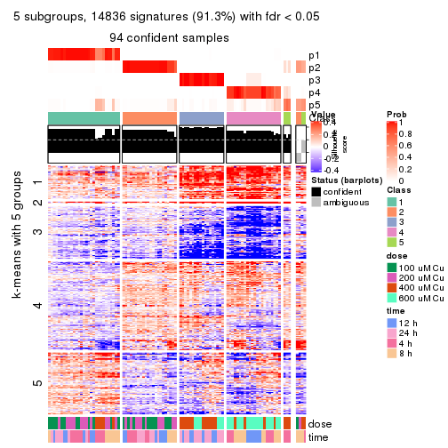</p>

</div>
<div id='tab-CV-skmeans-get-signatures-no-scale-5'>
<pre><code class="r">get_signatures(res, k = 6, scale_rows = FALSE)
</code></pre>

<p></p>

</div>
</div>


Compare the overlap of signatures from different k:

```r
compare_signatures(res)
```


`get_signature()` returns a data frame invisibly. TO get the list of signatures, the function
call should be assigned to a variable explicitly. In following code, if `plot` argument is set
to `FALSE`, no heatmap is plotted while only the differential analysis is performed.

```r
# code only for demonstration
tb = get_signature(res, k = ..., plot = FALSE)
```

An example of the output of `tb` is:

```
#>   which_row         fdr    mean_1    mean_2 scaled_mean_1 scaled_mean_2 km
#> 1        38 0.042760348  8.373488  9.131774    -0.5533452     0.5164555  1
#> 2        40 0.018707592  7.106213  8.469186    -0.6173731     0.5762149  1
#> 3        55 0.019134737 10.221463 11.207825    -0.6159697     0.5749050  1
#> 4        59 0.006059896  5.921854  7.869574    -0.6899429     0.6439467  1
#> 5        60 0.018055526  8.928898 10.211722    -0.6204761     0.5791110  1
#> 6        98 0.009384629 15.714769 14.887706     0.6635654    -0.6193277  2
...
```

The columns in `tb` are:

1. `which_row`: row indices corresponding to the input matrix.
2. `fdr`: FDR for the differential test. 
3. `mean_x`: The mean value in group x.
4. `scaled_mean_x`: The mean value in group x after rows are scaled.
5. `km`: Row groups if k-means clustering is applied to rows.


UMAP plot which shows how samples are separated.


<script>
$( function() {
	$( '#tabs-CV-skmeans-dimension-reduction' ).tabs();
} );
</script>
<div id='tabs-CV-skmeans-dimension-reduction'>
<ul>
<li><a href='#tab-CV-skmeans-dimension-reduction-1'>k = 2</a></li>
<li><a href='#tab-CV-skmeans-dimension-reduction-2'>k = 3</a></li>
<li><a href='#tab-CV-skmeans-dimension-reduction-3'>k = 4</a></li>
<li><a href='#tab-CV-skmeans-dimension-reduction-4'>k = 5</a></li>
<li><a href='#tab-CV-skmeans-dimension-reduction-5'>k = 6</a></li>
</ul>
<div id='tab-CV-skmeans-dimension-reduction-1'>
<pre><code class="r">dimension_reduction(res, k = 2, method = &quot;UMAP&quot;)
</code></pre>

<p></p>

</div>
<div id='tab-CV-skmeans-dimension-reduction-2'>
<pre><code class="r">dimension_reduction(res, k = 3, method = &quot;UMAP&quot;)
</code></pre>

<p></p>

</div>
<div id='tab-CV-skmeans-dimension-reduction-3'>
<pre><code class="r">dimension_reduction(res, k = 4, method = &quot;UMAP&quot;)
</code></pre>

<p></p>

</div>
<div id='tab-CV-skmeans-dimension-reduction-4'>
<pre><code class="r">dimension_reduction(res, k = 5, method = &quot;UMAP&quot;)
</code></pre>

<p></p>

</div>
<div id='tab-CV-skmeans-dimension-reduction-5'>
<pre><code class="r">dimension_reduction(res, k = 6, method = &quot;UMAP&quot;)
</code></pre>

<p></p>

</div>
</div>


Following heatmap shows how subgroups are split when increasing `k`:

```r
collect_classes(res)
```


Test correlation between subgroups and known annotations. If the known
annotation is numeric, one-way ANOVA test is applied, and if the known
annotation is discrete, chi-squared contingency table test is applied.

```r
test_to_known_factors(res)
```

```
#>             n  dose(p)  time(p) k
#> CV:skmeans 98 3.00e-16 4.64e-01 2
#> CV:skmeans 96 1.11e-13 6.38e-01 3
#> CV:skmeans 98 1.71e-15 1.05e-04 4
#> CV:skmeans 94 3.12e-17 3.55e-05 5
#> CV:skmeans 95 3.71e-20 1.18e-04 6
```


If matrix rows can be associated to genes, consider to use `GO_Enrichment(res,
...)` to perform function enrichment for the signature genes.


 

---------------------------------------------------


### CV:pam


The object with results only for a single top-value method and a single partition method 
can be extracted as:

```r
res = res_list["CV", "pam"]
# you can also extract it by
# res = res_list["CV:pam"]
```

A summary of `res` and all the functions that can be applied to it:

```r
res
```

```
#> A 'ConsensusPartition' object with k = 2, 3, 4, 5, 6.
#>   On a matrix with 16250 rows and 98 columns.
#>   Top rows (1000, 2000, 3000, 4000, 5000) are extracted by 'CV' method.
#>   Subgroups are detected by 'pam' method.
#>   Performed in total 1250 partitions by row resampling.
#>   Best k for subgroups seems to be 2.
#> 
#> Following methods can be applied to this 'ConsensusPartition' object:
#>  [1] "cola_report"             "collect_classes"         "collect_plots"          
#>  [4] "collect_stats"           "colnames"                "compare_signatures"     
#>  [7] "consensus_heatmap"       "dimension_reduction"     "functional_enrichment"  
#> [10] "get_anno_col"            "get_anno"                "get_classes"            
#> [13] "get_consensus"           "get_matrix"              "get_membership"         
#> [16] "get_param"               "get_signatures"          "get_stats"              
#> [19] "is_best_k"               "is_stable_k"             "membership_heatmap"     
#> [22] "ncol"                    "nrow"                    "plot_ecdf"              
#> [25] "rownames"                "select_partition_number" "show"                   
#> [28] "suggest_best_k"          "test_to_known_factors"
```

`collect_plots()` function collects all the plots made from `res` for all `k` (number of partitions)
into one single page to provide an easy and fast comparison between different `k`.

```r
collect_plots(res)
```


The plots are:

- The first row: a plot of the ECDF (Empirical cumulative distribution
  function) curves of the consensus matrix for each `k` and the heatmap of
  predicted classes for each `k`.
- The second row: heatmaps of the consensus matrix for each `k`.
- The third row: heatmaps of the membership matrix for each `k`.
- The fouth row: heatmaps of the signatures for each `k`.

All the plots in panels can be made by individual functions and they are
plotted later in this section.

`select_partition_number()` produces several plots showing different
statistics for choosing "optimized" `k`. There are following statistics:

- ECDF curves of the consensus matrix for each `k`;
- 1-PAC. [The PAC
  score](https://en.wikipedia.org/wiki/Consensus_clustering#Over-interpretation_potential_of_consensus_clustering)
  measures the proportion of the ambiguous subgrouping.
- Mean silhouette score.
- Concordance. The mean probability of fiting the consensus class ids in all
  partitions.
- Area increased. Denote $A_k$ as the area under the ECDF curve for current
  `k`, the area increased is defined as $A_k - A_{k-1}$.
- Rand index. The percent of pairs of samples that are both in a same cluster
  or both are not in a same cluster in the partition of k and k-1.
- Jaccard index. The ratio of pairs of samples are both in a same cluster in
  the partition of k and k-1 and the pairs of samples are both in a same
  cluster in the partition k or k-1.

The detailed explanations of these statistics can be found in [the cola
vignette](http://bioconductor.org/packages/devel/bioc/vignettes/cola/inst/doc/cola.html#toc_13).

Generally speaking, lower PAC score, higher mean silhouette score or higher
concordance corresponds to better partition. Rand index and Jaccard index
measure how similar the current partition is compared to partition with `k-1`.
If they are too similar, we won't accept `k` is better than `k-1`.

```r
select_partition_number(res)
```


The numeric values for all these statistics can be obtained by `get_stats()`.

```r
get_stats(res)
```

```
#>   k 1-PAC mean_silhouette concordance area_increased  Rand Jaccard
#> 2 2 0.719           0.910       0.954         0.4798 0.508   0.508
#> 3 3 0.823           0.783       0.907         0.3846 0.642   0.403
#> 4 4 0.822           0.812       0.914         0.0849 0.927   0.791
#> 5 5 0.738           0.700       0.869         0.0479 0.962   0.871
#> 6 6 0.869           0.814       0.922         0.0384 0.918   0.705
```

`suggest_best_k()` suggests the best $k$ based on these statistics. The rules are as follows:

- All $k$ with Jaccard index larger than 0.95 are removed because the increase of
  the partition number does not provides enough extra information. If all $k$ are removed,
  the best $k$ is assigned by `NA`.
- For $k$ with 1-PAC larger than 0.9, the maximal $k$ is taken as the "best k". Other $k$ is called "optional k".
- If it does not fit the second rule. The $k$ with the highest vote of highest
  1-PAC, mean silhouette and concordance is taken as the "best k".

```r
suggest_best_k(res)
```

```
#> [1] 2
```


Following shows the table of the partitions (You need to click the **show/hide
code output** link to see it). The membership matrix (columns with name `p*`)
is inferred by
[`clue::cl_consensus()`](https://www.rdocumentation.org/link/cl_consensus?package=clue)
function with the `SE` method. Basically the value in the membership matrix
represents the probability to belong to a certain group. The finall class
label for an item is determined with the group with highest probability it
belongs to.

In `get_classes()` function, the entropy is calculated from the membership
matrix and the silhouette score is calculated from the consensus matrix.


<script>
$( function() {
	$( '#tabs-CV-pam-get-classes' ).tabs();
} );
</script>
<div id='tabs-CV-pam-get-classes'>
<ul>
<li><a href='#tab-CV-pam-get-classes-1'>k = 2</a></li>
<li><a href='#tab-CV-pam-get-classes-2'>k = 3</a></li>
<li><a href='#tab-CV-pam-get-classes-3'>k = 4</a></li>
<li><a href='#tab-CV-pam-get-classes-4'>k = 5</a></li>
<li><a href='#tab-CV-pam-get-classes-5'>k = 6</a></li>
</ul>

<div id='tab-CV-pam-get-classes-1'>
<p><a id='tab-CV-pam-get-classes-1-a' style='color:#0366d6' href='#'>show/hide code output</a></p>
<pre><code class="r">cbind(get_classes(res, k = 2), get_membership(res, k = 2))
</code></pre>

<pre><code>#&gt;           class entropy silhouette    p1    p2
#&gt; GSM241451     1   0.000      0.972 1.000 0.000
#&gt; GSM241452     1   0.000      0.972 1.000 0.000
#&gt; GSM241453     1   0.000      0.972 1.000 0.000
#&gt; GSM241454     1   0.000      0.972 1.000 0.000
#&gt; GSM241455     1   0.000      0.972 1.000 0.000
#&gt; GSM241456     1   0.000      0.972 1.000 0.000
#&gt; GSM241457     1   0.000      0.972 1.000 0.000
#&gt; GSM241458     1   0.000      0.972 1.000 0.000
#&gt; GSM241459     1   0.000      0.972 1.000 0.000
#&gt; GSM241460     1   0.000      0.972 1.000 0.000
#&gt; GSM241461     1   0.000      0.972 1.000 0.000
#&gt; GSM241462     1   0.000      0.972 1.000 0.000
#&gt; GSM241463     1   0.000      0.972 1.000 0.000
#&gt; GSM241464     1   0.000      0.972 1.000 0.000
#&gt; GSM241465     1   0.000      0.972 1.000 0.000
#&gt; GSM241466     1   0.000      0.972 1.000 0.000
#&gt; GSM241467     1   0.000      0.972 1.000 0.000
#&gt; GSM241468     1   0.000      0.972 1.000 0.000
#&gt; GSM241469     1   0.000      0.972 1.000 0.000
#&gt; GSM241470     1   0.000      0.972 1.000 0.000
#&gt; GSM241471     1   0.000      0.972 1.000 0.000
#&gt; GSM241472     1   0.000      0.972 1.000 0.000
#&gt; GSM241473     1   0.000      0.972 1.000 0.000
#&gt; GSM241474     1   0.000      0.972 1.000 0.000
#&gt; GSM241475     1   0.000      0.972 1.000 0.000
#&gt; GSM241476     1   0.000      0.972 1.000 0.000
#&gt; GSM241477     1   0.000      0.972 1.000 0.000
#&gt; GSM241478     1   0.000      0.972 1.000 0.000
#&gt; GSM241479     1   0.000      0.972 1.000 0.000
#&gt; GSM241480     1   0.000      0.972 1.000 0.000
#&gt; GSM241481     1   0.000      0.972 1.000 0.000
#&gt; GSM241482     1   0.000      0.972 1.000 0.000
#&gt; GSM241483     1   0.000      0.972 1.000 0.000
#&gt; GSM241484     1   0.000      0.972 1.000 0.000
#&gt; GSM241485     1   0.000      0.972 1.000 0.000
#&gt; GSM241486     1   0.000      0.972 1.000 0.000
#&gt; GSM241487     1   0.000      0.972 1.000 0.000
#&gt; GSM241488     1   0.000      0.972 1.000 0.000
#&gt; GSM241489     1   0.000      0.972 1.000 0.000
#&gt; GSM241490     1   0.443      0.877 0.908 0.092
#&gt; GSM241491     1   0.000      0.972 1.000 0.000
#&gt; GSM241492     1   0.000      0.972 1.000 0.000
#&gt; GSM241493     1   0.000      0.972 1.000 0.000
#&gt; GSM241494     1   0.000      0.972 1.000 0.000
#&gt; GSM241495     1   0.000      0.972 1.000 0.000
#&gt; GSM241496     1   0.000      0.972 1.000 0.000
#&gt; GSM241497     1   0.000      0.972 1.000 0.000
#&gt; GSM241498     1   0.000      0.972 1.000 0.000
#&gt; GSM241499     1   0.000      0.972 1.000 0.000
#&gt; GSM241500     1   0.662      0.758 0.828 0.172
#&gt; GSM241501     1   0.000      0.972 1.000 0.000
#&gt; GSM241502     1   0.000      0.972 1.000 0.000
#&gt; GSM241503     1   0.000      0.972 1.000 0.000
#&gt; GSM241504     1   0.563      0.822 0.868 0.132
#&gt; GSM241505     1   0.929      0.480 0.656 0.344
#&gt; GSM241506     1   0.985      0.104 0.572 0.428
#&gt; GSM241507     1   0.814      0.636 0.748 0.252
#&gt; GSM241508     2   0.980      0.421 0.416 0.584
#&gt; GSM241509     2   0.000      0.919 0.000 1.000
#&gt; GSM241510     2   0.644      0.849 0.164 0.836
#&gt; GSM241511     2   0.644      0.849 0.164 0.836
#&gt; GSM241512     2   0.000      0.919 0.000 1.000
#&gt; GSM241513     2   0.644      0.849 0.164 0.836
#&gt; GSM241514     2   0.000      0.919 0.000 1.000
#&gt; GSM241515     2   0.644      0.849 0.164 0.836
#&gt; GSM241516     2   0.644      0.849 0.164 0.836
#&gt; GSM241517     2   0.714      0.819 0.196 0.804
#&gt; GSM241518     2   0.644      0.849 0.164 0.836
#&gt; GSM241519     2   0.753      0.796 0.216 0.784
#&gt; GSM241520     2   0.482      0.884 0.104 0.896
#&gt; GSM241521     2   0.886      0.664 0.304 0.696
#&gt; GSM241522     2   0.644      0.849 0.164 0.836
#&gt; GSM241523     2   0.753      0.796 0.216 0.784
#&gt; GSM241524     2   0.000      0.919 0.000 1.000
#&gt; GSM241525     2   0.163      0.911 0.024 0.976
#&gt; GSM241526     2   0.260      0.905 0.044 0.956
#&gt; GSM241527     2   0.000      0.919 0.000 1.000
#&gt; GSM241528     2   0.311      0.899 0.056 0.944
#&gt; GSM241529     2   0.278      0.903 0.048 0.952
#&gt; GSM241530     2   0.000      0.919 0.000 1.000
#&gt; GSM241531     2   0.000      0.919 0.000 1.000
#&gt; GSM241532     2   0.000      0.919 0.000 1.000
#&gt; GSM241533     2   0.000      0.919 0.000 1.000
#&gt; GSM241534     2   0.000      0.919 0.000 1.000
#&gt; GSM241535     2   0.000      0.919 0.000 1.000
#&gt; GSM241536     2   0.000      0.919 0.000 1.000
#&gt; GSM241537     2   0.000      0.919 0.000 1.000
#&gt; GSM241538     2   0.000      0.919 0.000 1.000
#&gt; GSM241539     2   0.000      0.919 0.000 1.000
#&gt; GSM241540     2   0.000      0.919 0.000 1.000
#&gt; GSM241541     2   0.000      0.919 0.000 1.000
#&gt; GSM241542     2   0.000      0.919 0.000 1.000
#&gt; GSM241543     2   0.000      0.919 0.000 1.000
#&gt; GSM241544     2   0.000      0.919 0.000 1.000
#&gt; GSM241545     2   0.644      0.849 0.164 0.836
#&gt; GSM241546     2   0.000      0.919 0.000 1.000
#&gt; GSM241547     2   0.506      0.880 0.112 0.888
#&gt; GSM241548     2   0.000      0.919 0.000 1.000
</code></pre>

<script>
$('#tab-CV-pam-get-classes-1-a').parent().next().next().hide();
$('#tab-CV-pam-get-classes-1-a').click(function(){
  $('#tab-CV-pam-get-classes-1-a').parent().next().next().toggle();
  return(false);
});
</script>
</div>

<div id='tab-CV-pam-get-classes-2'>
<p><a id='tab-CV-pam-get-classes-2-a' style='color:#0366d6' href='#'>show/hide code output</a></p>
<pre><code class="r">cbind(get_classes(res, k = 3), get_membership(res, k = 3))
</code></pre>

<pre><code>#&gt;           class entropy silhouette    p1    p2    p3
#&gt; GSM241451     2  0.6919      0.823 0.016 0.536 0.448
#&gt; GSM241452     1  0.0747      0.935 0.984 0.000 0.016
#&gt; GSM241453     2  0.6919      0.823 0.016 0.536 0.448
#&gt; GSM241454     1  0.0000      0.947 1.000 0.000 0.000
#&gt; GSM241455     2  0.6919      0.823 0.016 0.536 0.448
#&gt; GSM241456     1  0.0000      0.947 1.000 0.000 0.000
#&gt; GSM241457     3  0.9707     -0.664 0.228 0.340 0.432
#&gt; GSM241458     1  0.0000      0.947 1.000 0.000 0.000
#&gt; GSM241459     2  0.9910      0.445 0.344 0.384 0.272
#&gt; GSM241460     1  0.0829      0.935 0.984 0.004 0.012
#&gt; GSM241461     2  0.6919      0.823 0.016 0.536 0.448
#&gt; GSM241462     1  0.0000      0.947 1.000 0.000 0.000
#&gt; GSM241463     2  0.6919      0.823 0.016 0.536 0.448
#&gt; GSM241464     1  0.0424      0.942 0.992 0.000 0.008
#&gt; GSM241465     2  0.6919      0.823 0.016 0.536 0.448
#&gt; GSM241466     1  0.0000      0.947 1.000 0.000 0.000
#&gt; GSM241467     1  0.0000      0.947 1.000 0.000 0.000
#&gt; GSM241468     2  0.9182      0.676 0.204 0.536 0.260
#&gt; GSM241469     1  0.0000      0.947 1.000 0.000 0.000
#&gt; GSM241470     2  0.6919      0.823 0.016 0.536 0.448
#&gt; GSM241471     2  0.7248      0.818 0.028 0.536 0.436
#&gt; GSM241472     1  0.0000      0.947 1.000 0.000 0.000
#&gt; GSM241473     2  0.7346      0.816 0.032 0.536 0.432
#&gt; GSM241474     1  0.0237      0.944 0.996 0.004 0.000
#&gt; GSM241475     2  0.6919      0.823 0.016 0.536 0.448
#&gt; GSM241476     1  0.0000      0.947 1.000 0.000 0.000
#&gt; GSM241477     2  0.6919      0.823 0.016 0.536 0.448
#&gt; GSM241478     2  0.6919      0.823 0.016 0.536 0.448
#&gt; GSM241479     1  0.0000      0.947 1.000 0.000 0.000
#&gt; GSM241480     1  0.0000      0.947 1.000 0.000 0.000
#&gt; GSM241481     2  0.7542      0.811 0.040 0.528 0.432
#&gt; GSM241482     1  0.0000      0.947 1.000 0.000 0.000
#&gt; GSM241483     2  0.6919      0.823 0.016 0.536 0.448
#&gt; GSM241484     1  0.0000      0.947 1.000 0.000 0.000
#&gt; GSM241485     1  0.0000      0.947 1.000 0.000 0.000
#&gt; GSM241486     2  0.6919      0.823 0.016 0.536 0.448
#&gt; GSM241487     2  0.6919      0.823 0.016 0.536 0.448
#&gt; GSM241488     2  0.7438      0.814 0.036 0.536 0.428
#&gt; GSM241489     1  0.0000      0.947 1.000 0.000 0.000
#&gt; GSM241490     1  0.0000      0.947 1.000 0.000 0.000
#&gt; GSM241491     2  0.6919      0.823 0.016 0.536 0.448
#&gt; GSM241492     1  0.0000      0.947 1.000 0.000 0.000
#&gt; GSM241493     2  0.6919      0.823 0.016 0.536 0.448
#&gt; GSM241494     1  0.0000      0.947 1.000 0.000 0.000
#&gt; GSM241495     2  0.6919      0.823 0.016 0.536 0.448
#&gt; GSM241496     2  0.6919      0.823 0.016 0.536 0.448
#&gt; GSM241497     1  0.0237      0.944 0.996 0.004 0.000
#&gt; GSM241498     1  0.0000      0.947 1.000 0.000 0.000
#&gt; GSM241499     1  0.0000      0.947 1.000 0.000 0.000
#&gt; GSM241500     2  0.6641      0.819 0.008 0.544 0.448
#&gt; GSM241501     2  0.6786      0.821 0.012 0.540 0.448
#&gt; GSM241502     2  0.6786      0.821 0.012 0.540 0.448
#&gt; GSM241503     1  0.0000      0.947 1.000 0.000 0.000
#&gt; GSM241504     1  0.1031      0.928 0.976 0.000 0.024
#&gt; GSM241505     1  0.0000      0.947 1.000 0.000 0.000
#&gt; GSM241506     2  0.6260      0.814 0.000 0.552 0.448
#&gt; GSM241507     1  0.0000      0.947 1.000 0.000 0.000
#&gt; GSM241508     2  0.6225      0.808 0.000 0.568 0.432
#&gt; GSM241509     3  0.6280      0.948 0.000 0.460 0.540
#&gt; GSM241510     2  0.0237      0.326 0.004 0.996 0.000
#&gt; GSM241511     1  0.6286      0.136 0.536 0.464 0.000
#&gt; GSM241512     3  0.6286      0.947 0.000 0.464 0.536
#&gt; GSM241513     2  0.0237      0.326 0.004 0.996 0.000
#&gt; GSM241514     3  0.6500      0.946 0.004 0.464 0.532
#&gt; GSM241515     2  0.0237      0.326 0.004 0.996 0.000
#&gt; GSM241516     1  0.6286      0.136 0.536 0.464 0.000
#&gt; GSM241517     2  0.0000      0.331 0.000 1.000 0.000
#&gt; GSM241518     2  0.0237      0.326 0.004 0.996 0.000
#&gt; GSM241519     2  0.0000      0.331 0.000 1.000 0.000
#&gt; GSM241520     2  0.4784     -0.323 0.004 0.796 0.200
#&gt; GSM241521     2  0.2448      0.451 0.000 0.924 0.076
#&gt; GSM241522     1  0.6286      0.136 0.536 0.464 0.000
#&gt; GSM241523     2  0.0237      0.323 0.000 0.996 0.004
#&gt; GSM241524     3  0.6505      0.943 0.004 0.468 0.528
#&gt; GSM241525     3  0.6912      0.938 0.016 0.444 0.540
#&gt; GSM241526     3  0.6260      0.947 0.000 0.448 0.552
#&gt; GSM241527     3  0.6280      0.948 0.000 0.460 0.540
#&gt; GSM241528     3  0.6095      0.870 0.000 0.392 0.608
#&gt; GSM241529     3  0.6260      0.941 0.000 0.448 0.552
#&gt; GSM241530     3  0.6280      0.948 0.000 0.460 0.540
#&gt; GSM241531     3  0.6495      0.947 0.004 0.460 0.536
#&gt; GSM241532     3  0.6280      0.948 0.000 0.460 0.540
#&gt; GSM241533     3  0.6280      0.948 0.000 0.460 0.540
#&gt; GSM241534     3  0.6260      0.947 0.000 0.448 0.552
#&gt; GSM241535     3  0.6260      0.947 0.000 0.448 0.552
#&gt; GSM241536     3  0.6280      0.948 0.000 0.460 0.540
#&gt; GSM241537     3  0.6260      0.947 0.000 0.448 0.552
#&gt; GSM241538     3  0.6260      0.947 0.000 0.448 0.552
#&gt; GSM241539     3  0.6260      0.947 0.000 0.448 0.552
#&gt; GSM241540     3  0.6260      0.947 0.000 0.448 0.552
#&gt; GSM241541     3  0.6260      0.947 0.000 0.448 0.552
#&gt; GSM241542     3  0.6260      0.947 0.000 0.448 0.552
#&gt; GSM241543     3  0.6286      0.947 0.000 0.464 0.536
#&gt; GSM241544     3  0.6286      0.947 0.000 0.464 0.536
#&gt; GSM241545     2  0.0237      0.323 0.000 0.996 0.004
#&gt; GSM241546     3  0.6500      0.946 0.004 0.464 0.532
#&gt; GSM241547     2  0.3816     -0.139 0.000 0.852 0.148
#&gt; GSM241548     3  0.6286      0.947 0.000 0.464 0.536
</code></pre>

<script>
$('#tab-CV-pam-get-classes-2-a').parent().next().next().hide();
$('#tab-CV-pam-get-classes-2-a').click(function(){
  $('#tab-CV-pam-get-classes-2-a').parent().next().next().toggle();
  return(false);
});
</script>
</div>

<div id='tab-CV-pam-get-classes-3'>
<p><a id='tab-CV-pam-get-classes-3-a' style='color:#0366d6' href='#'>show/hide code output</a></p>
<pre><code class="r">cbind(get_classes(res, k = 4), get_membership(res, k = 4))
</code></pre>

<pre><code>#&gt;           class entropy silhouette    p1    p2    p3    p4
#&gt; GSM241451     2  0.0000     0.8764 0.000 1.000 0.000 0.000
#&gt; GSM241452     1  0.0592     0.9431 0.984 0.016 0.000 0.000
#&gt; GSM241453     2  0.0000     0.8764 0.000 1.000 0.000 0.000
#&gt; GSM241454     1  0.0000     0.9575 1.000 0.000 0.000 0.000
#&gt; GSM241455     2  0.0000     0.8764 0.000 1.000 0.000 0.000
#&gt; GSM241456     1  0.0000     0.9575 1.000 0.000 0.000 0.000
#&gt; GSM241457     2  0.4008     0.6111 0.244 0.756 0.000 0.000
#&gt; GSM241458     1  0.0000     0.9575 1.000 0.000 0.000 0.000
#&gt; GSM241459     2  0.4746     0.4436 0.368 0.632 0.000 0.000
#&gt; GSM241460     1  0.0336     0.9506 0.992 0.008 0.000 0.000
#&gt; GSM241461     2  0.0000     0.8764 0.000 1.000 0.000 0.000
#&gt; GSM241462     1  0.0000     0.9575 1.000 0.000 0.000 0.000
#&gt; GSM241463     2  0.0000     0.8764 0.000 1.000 0.000 0.000
#&gt; GSM241464     1  0.0000     0.9575 1.000 0.000 0.000 0.000
#&gt; GSM241465     2  0.0000     0.8764 0.000 1.000 0.000 0.000
#&gt; GSM241466     1  0.0000     0.9575 1.000 0.000 0.000 0.000
#&gt; GSM241467     1  0.0000     0.9575 1.000 0.000 0.000 0.000
#&gt; GSM241468     2  0.3610     0.6970 0.200 0.800 0.000 0.000
#&gt; GSM241469     1  0.0000     0.9575 1.000 0.000 0.000 0.000
#&gt; GSM241470     2  0.0000     0.8764 0.000 1.000 0.000 0.000
#&gt; GSM241471     2  0.0469     0.8701 0.012 0.988 0.000 0.000
#&gt; GSM241472     1  0.0000     0.9575 1.000 0.000 0.000 0.000
#&gt; GSM241473     2  0.0592     0.8677 0.016 0.984 0.000 0.000
#&gt; GSM241474     1  0.0000     0.9575 1.000 0.000 0.000 0.000
#&gt; GSM241475     2  0.0000     0.8764 0.000 1.000 0.000 0.000
#&gt; GSM241476     1  0.0000     0.9575 1.000 0.000 0.000 0.000
#&gt; GSM241477     2  0.0000     0.8764 0.000 1.000 0.000 0.000
#&gt; GSM241478     2  0.0000     0.8764 0.000 1.000 0.000 0.000
#&gt; GSM241479     1  0.0000     0.9575 1.000 0.000 0.000 0.000
#&gt; GSM241480     1  0.0000     0.9575 1.000 0.000 0.000 0.000
#&gt; GSM241481     2  0.0921     0.8594 0.028 0.972 0.000 0.000
#&gt; GSM241482     1  0.0000     0.9575 1.000 0.000 0.000 0.000
#&gt; GSM241483     2  0.0000     0.8764 0.000 1.000 0.000 0.000
#&gt; GSM241484     1  0.0000     0.9575 1.000 0.000 0.000 0.000
#&gt; GSM241485     1  0.0000     0.9575 1.000 0.000 0.000 0.000
#&gt; GSM241486     2  0.0000     0.8764 0.000 1.000 0.000 0.000
#&gt; GSM241487     2  0.0000     0.8764 0.000 1.000 0.000 0.000
#&gt; GSM241488     2  0.1022     0.8564 0.032 0.968 0.000 0.000
#&gt; GSM241489     1  0.0000     0.9575 1.000 0.000 0.000 0.000
#&gt; GSM241490     1  0.0000     0.9575 1.000 0.000 0.000 0.000
#&gt; GSM241491     2  0.0000     0.8764 0.000 1.000 0.000 0.000
#&gt; GSM241492     1  0.0000     0.9575 1.000 0.000 0.000 0.000
#&gt; GSM241493     2  0.0000     0.8764 0.000 1.000 0.000 0.000
#&gt; GSM241494     1  0.0000     0.9575 1.000 0.000 0.000 0.000
#&gt; GSM241495     2  0.0000     0.8764 0.000 1.000 0.000 0.000
#&gt; GSM241496     2  0.0000     0.8764 0.000 1.000 0.000 0.000
#&gt; GSM241497     1  0.0188     0.9540 0.996 0.004 0.000 0.000
#&gt; GSM241498     1  0.0000     0.9575 1.000 0.000 0.000 0.000
#&gt; GSM241499     1  0.0000     0.9575 1.000 0.000 0.000 0.000
#&gt; GSM241500     2  0.0000     0.8764 0.000 1.000 0.000 0.000
#&gt; GSM241501     2  0.0000     0.8764 0.000 1.000 0.000 0.000
#&gt; GSM241502     2  0.0000     0.8764 0.000 1.000 0.000 0.000
#&gt; GSM241503     1  0.0000     0.9575 1.000 0.000 0.000 0.000
#&gt; GSM241504     1  0.0817     0.9350 0.976 0.024 0.000 0.000
#&gt; GSM241505     1  0.0000     0.9575 1.000 0.000 0.000 0.000
#&gt; GSM241506     2  0.0000     0.8764 0.000 1.000 0.000 0.000
#&gt; GSM241507     1  0.0000     0.9575 1.000 0.000 0.000 0.000
#&gt; GSM241508     2  0.0592     0.8671 0.000 0.984 0.016 0.000
#&gt; GSM241509     4  0.3610     0.7920 0.000 0.000 0.200 0.800
#&gt; GSM241510     2  0.5327     0.5999 0.000 0.720 0.220 0.060
#&gt; GSM241511     1  0.3801     0.6616 0.780 0.000 0.220 0.000
#&gt; GSM241512     4  0.4967     0.4127 0.000 0.000 0.452 0.548
#&gt; GSM241513     2  0.4999     0.1138 0.000 0.508 0.492 0.000
#&gt; GSM241514     3  0.0000     0.9558 0.000 0.000 1.000 0.000
#&gt; GSM241515     2  0.4999     0.1138 0.000 0.508 0.492 0.000
#&gt; GSM241516     1  0.4989     0.0849 0.528 0.000 0.472 0.000
#&gt; GSM241517     2  0.3801     0.6578 0.000 0.780 0.220 0.000
#&gt; GSM241518     2  0.4999     0.1138 0.000 0.508 0.492 0.000
#&gt; GSM241519     2  0.4933     0.2806 0.000 0.568 0.432 0.000
#&gt; GSM241520     3  0.0000     0.9558 0.000 0.000 1.000 0.000
#&gt; GSM241521     2  0.4817     0.3802 0.000 0.612 0.388 0.000
#&gt; GSM241522     1  0.4933     0.2095 0.568 0.000 0.432 0.000
#&gt; GSM241523     3  0.4072     0.5967 0.000 0.252 0.748 0.000
#&gt; GSM241524     3  0.0000     0.9558 0.000 0.000 1.000 0.000
#&gt; GSM241525     4  0.6823     0.5808 0.196 0.000 0.200 0.604
#&gt; GSM241526     4  0.0000     0.7967 0.000 0.000 0.000 1.000
#&gt; GSM241527     4  0.4134     0.7576 0.000 0.000 0.260 0.740
#&gt; GSM241528     4  0.6823     0.5505 0.000 0.196 0.200 0.604
#&gt; GSM241529     4  0.4755     0.7654 0.000 0.040 0.200 0.760
#&gt; GSM241530     4  0.5147     0.7620 0.060 0.000 0.200 0.740
#&gt; GSM241531     4  0.3801     0.7833 0.000 0.000 0.220 0.780
#&gt; GSM241532     4  0.3649     0.7908 0.000 0.000 0.204 0.796
#&gt; GSM241533     4  0.3610     0.7920 0.000 0.000 0.200 0.800
#&gt; GSM241534     4  0.0000     0.7967 0.000 0.000 0.000 1.000
#&gt; GSM241535     4  0.0592     0.8027 0.000 0.000 0.016 0.984
#&gt; GSM241536     4  0.3764     0.7855 0.000 0.000 0.216 0.784
#&gt; GSM241537     4  0.0000     0.7967 0.000 0.000 0.000 1.000
#&gt; GSM241538     4  0.1792     0.7898 0.000 0.000 0.068 0.932
#&gt; GSM241539     4  0.0707     0.7982 0.000 0.000 0.020 0.980
#&gt; GSM241540     4  0.2011     0.7886 0.000 0.000 0.080 0.920
#&gt; GSM241541     4  0.0000     0.7967 0.000 0.000 0.000 1.000
#&gt; GSM241542     4  0.2011     0.7886 0.000 0.000 0.080 0.920
#&gt; GSM241543     3  0.0000     0.9558 0.000 0.000 1.000 0.000
#&gt; GSM241544     3  0.0000     0.9558 0.000 0.000 1.000 0.000
#&gt; GSM241545     3  0.0000     0.9558 0.000 0.000 1.000 0.000
#&gt; GSM241546     3  0.0000     0.9558 0.000 0.000 1.000 0.000
#&gt; GSM241547     3  0.0000     0.9558 0.000 0.000 1.000 0.000
#&gt; GSM241548     3  0.0000     0.9558 0.000 0.000 1.000 0.000
</code></pre>

<script>
$('#tab-CV-pam-get-classes-3-a').parent().next().next().hide();
$('#tab-CV-pam-get-classes-3-a').click(function(){
  $('#tab-CV-pam-get-classes-3-a').parent().next().next().toggle();
  return(false);
});
</script>
</div>

<div id='tab-CV-pam-get-classes-4'>
<p><a id='tab-CV-pam-get-classes-4-a' style='color:#0366d6' href='#'>show/hide code output</a></p>
<pre><code class="r">cbind(get_classes(res, k = 5), get_membership(res, k = 5))
</code></pre>

<pre><code>#&gt;           class entropy silhouette    p1    p2    p3    p4    p5
#&gt; GSM241451     2  0.0000   0.823045 0.000 1.000 0.000 0.000 0.000
#&gt; GSM241452     1  0.0510   0.918977 0.984 0.016 0.000 0.000 0.000
#&gt; GSM241453     2  0.0000   0.823045 0.000 1.000 0.000 0.000 0.000
#&gt; GSM241454     1  0.0000   0.933587 1.000 0.000 0.000 0.000 0.000
#&gt; GSM241455     2  0.0000   0.823045 0.000 1.000 0.000 0.000 0.000
#&gt; GSM241456     1  0.0000   0.933587 1.000 0.000 0.000 0.000 0.000
#&gt; GSM241457     2  0.1908   0.759555 0.092 0.908 0.000 0.000 0.000
#&gt; GSM241458     1  0.0000   0.933587 1.000 0.000 0.000 0.000 0.000
#&gt; GSM241459     2  0.3424   0.603496 0.240 0.760 0.000 0.000 0.000
#&gt; GSM241460     1  0.0290   0.927025 0.992 0.008 0.000 0.000 0.000
#&gt; GSM241461     2  0.0000   0.823045 0.000 1.000 0.000 0.000 0.000
#&gt; GSM241462     1  0.0000   0.933587 1.000 0.000 0.000 0.000 0.000
#&gt; GSM241463     2  0.0000   0.823045 0.000 1.000 0.000 0.000 0.000
#&gt; GSM241464     1  0.0290   0.927025 0.992 0.008 0.000 0.000 0.000
#&gt; GSM241465     2  0.0000   0.823045 0.000 1.000 0.000 0.000 0.000
#&gt; GSM241466     1  0.0000   0.933587 1.000 0.000 0.000 0.000 0.000
#&gt; GSM241467     1  0.0000   0.933587 1.000 0.000 0.000 0.000 0.000
#&gt; GSM241468     2  0.3109   0.651851 0.200 0.800 0.000 0.000 0.000
#&gt; GSM241469     1  0.0000   0.933587 1.000 0.000 0.000 0.000 0.000
#&gt; GSM241470     2  0.0000   0.823045 0.000 1.000 0.000 0.000 0.000
#&gt; GSM241471     2  0.0404   0.818216 0.012 0.988 0.000 0.000 0.000
#&gt; GSM241472     1  0.0000   0.933587 1.000 0.000 0.000 0.000 0.000
#&gt; GSM241473     2  0.0510   0.816314 0.016 0.984 0.000 0.000 0.000
#&gt; GSM241474     1  0.0000   0.933587 1.000 0.000 0.000 0.000 0.000
#&gt; GSM241475     2  0.0000   0.823045 0.000 1.000 0.000 0.000 0.000
#&gt; GSM241476     1  0.0000   0.933587 1.000 0.000 0.000 0.000 0.000
#&gt; GSM241477     2  0.0000   0.823045 0.000 1.000 0.000 0.000 0.000
#&gt; GSM241478     2  0.0000   0.823045 0.000 1.000 0.000 0.000 0.000
#&gt; GSM241479     1  0.0000   0.933587 1.000 0.000 0.000 0.000 0.000
#&gt; GSM241480     1  0.0000   0.933587 1.000 0.000 0.000 0.000 0.000
#&gt; GSM241481     2  0.0510   0.816314 0.016 0.984 0.000 0.000 0.000
#&gt; GSM241482     1  0.0000   0.933587 1.000 0.000 0.000 0.000 0.000
#&gt; GSM241483     2  0.0000   0.823045 0.000 1.000 0.000 0.000 0.000
#&gt; GSM241484     1  0.0000   0.933587 1.000 0.000 0.000 0.000 0.000
#&gt; GSM241485     1  0.0000   0.933587 1.000 0.000 0.000 0.000 0.000
#&gt; GSM241486     2  0.0000   0.823045 0.000 1.000 0.000 0.000 0.000
#&gt; GSM241487     2  0.0000   0.823045 0.000 1.000 0.000 0.000 0.000
#&gt; GSM241488     2  0.0880   0.806327 0.032 0.968 0.000 0.000 0.000
#&gt; GSM241489     1  0.0000   0.933587 1.000 0.000 0.000 0.000 0.000
#&gt; GSM241490     1  0.0000   0.933587 1.000 0.000 0.000 0.000 0.000
#&gt; GSM241491     2  0.0000   0.823045 0.000 1.000 0.000 0.000 0.000
#&gt; GSM241492     1  0.0000   0.933587 1.000 0.000 0.000 0.000 0.000
#&gt; GSM241493     2  0.0000   0.823045 0.000 1.000 0.000 0.000 0.000
#&gt; GSM241494     1  0.0000   0.933587 1.000 0.000 0.000 0.000 0.000
#&gt; GSM241495     2  0.0000   0.823045 0.000 1.000 0.000 0.000 0.000
#&gt; GSM241496     2  0.0000   0.823045 0.000 1.000 0.000 0.000 0.000
#&gt; GSM241497     1  0.0162   0.930466 0.996 0.004 0.000 0.000 0.000
#&gt; GSM241498     1  0.0000   0.933587 1.000 0.000 0.000 0.000 0.000
#&gt; GSM241499     1  0.0000   0.933587 1.000 0.000 0.000 0.000 0.000
#&gt; GSM241500     2  0.3534   0.611209 0.000 0.744 0.000 0.256 0.000
#&gt; GSM241501     2  0.3480   0.620404 0.000 0.752 0.000 0.248 0.000
#&gt; GSM241502     2  0.3508   0.615956 0.000 0.748 0.000 0.252 0.000
#&gt; GSM241503     1  0.2230   0.809740 0.884 0.000 0.000 0.116 0.000
#&gt; GSM241504     1  0.4114   0.585384 0.732 0.024 0.000 0.244 0.000
#&gt; GSM241505     1  0.3452   0.617120 0.756 0.000 0.000 0.244 0.000
#&gt; GSM241506     2  0.3480   0.620404 0.000 0.752 0.000 0.248 0.000
#&gt; GSM241507     1  0.0000   0.933587 1.000 0.000 0.000 0.000 0.000
#&gt; GSM241508     2  0.3861   0.597078 0.000 0.728 0.008 0.264 0.000
#&gt; GSM241509     4  0.2280   0.581650 0.000 0.000 0.120 0.880 0.000
#&gt; GSM241510     4  0.7640   0.346000 0.000 0.136 0.120 0.480 0.264
#&gt; GSM241511     4  0.8257   0.278216 0.280 0.000 0.120 0.336 0.264
#&gt; GSM241512     4  0.7735   0.407040 0.144 0.000 0.124 0.468 0.264
#&gt; GSM241513     2  0.8097   0.097357 0.000 0.404 0.208 0.124 0.264
#&gt; GSM241514     3  0.5158   0.476525 0.000 0.000 0.656 0.080 0.264
#&gt; GSM241515     2  0.8296  -0.193787 0.000 0.308 0.124 0.304 0.264
#&gt; GSM241516     1  0.7542   0.065858 0.492 0.000 0.120 0.124 0.264
#&gt; GSM241517     2  0.7098   0.308285 0.000 0.536 0.120 0.080 0.264
#&gt; GSM241518     2  0.8780   0.078185 0.052 0.388 0.208 0.088 0.264
#&gt; GSM241519     2  0.7383   0.030707 0.000 0.408 0.344 0.040 0.208
#&gt; GSM241520     3  0.0000   0.903062 0.000 0.000 1.000 0.000 0.000
#&gt; GSM241521     2  0.7752   0.255527 0.000 0.492 0.172 0.192 0.144
#&gt; GSM241522     1  0.7704   0.000173 0.448 0.000 0.208 0.080 0.264
#&gt; GSM241523     3  0.3395   0.568347 0.000 0.236 0.764 0.000 0.000
#&gt; GSM241524     3  0.0609   0.885656 0.000 0.000 0.980 0.020 0.000
#&gt; GSM241525     4  0.2648   0.524679 0.152 0.000 0.000 0.848 0.000
#&gt; GSM241526     4  0.1732   0.504672 0.000 0.000 0.000 0.920 0.080
#&gt; GSM241527     4  0.2020   0.531585 0.000 0.000 0.000 0.900 0.100
#&gt; GSM241528     4  0.2561   0.498086 0.000 0.144 0.000 0.856 0.000
#&gt; GSM241529     4  0.0000   0.574604 0.000 0.000 0.000 1.000 0.000
#&gt; GSM241530     4  0.2648   0.524679 0.152 0.000 0.000 0.848 0.000
#&gt; GSM241531     4  0.5620   0.460717 0.000 0.000 0.120 0.616 0.264
#&gt; GSM241532     4  0.3134   0.577474 0.000 0.000 0.120 0.848 0.032
#&gt; GSM241533     4  0.0000   0.574604 0.000 0.000 0.000 1.000 0.000
#&gt; GSM241534     4  0.3932  -0.043254 0.000 0.000 0.000 0.672 0.328
#&gt; GSM241535     4  0.3895  -0.020879 0.000 0.000 0.000 0.680 0.320
#&gt; GSM241536     4  0.5620   0.460717 0.000 0.000 0.120 0.616 0.264
#&gt; GSM241537     5  0.3586   0.706006 0.000 0.000 0.000 0.264 0.736
#&gt; GSM241538     5  0.3561   0.708754 0.000 0.000 0.000 0.260 0.740
#&gt; GSM241539     5  0.0000   0.728757 0.000 0.000 0.000 0.000 1.000
#&gt; GSM241540     5  0.0000   0.728757 0.000 0.000 0.000 0.000 1.000
#&gt; GSM241541     5  0.3586   0.706006 0.000 0.000 0.000 0.264 0.736
#&gt; GSM241542     5  0.0000   0.728757 0.000 0.000 0.000 0.000 1.000
#&gt; GSM241543     3  0.0000   0.903062 0.000 0.000 1.000 0.000 0.000
#&gt; GSM241544     3  0.0000   0.903062 0.000 0.000 1.000 0.000 0.000
#&gt; GSM241545     3  0.0000   0.903062 0.000 0.000 1.000 0.000 0.000
#&gt; GSM241546     3  0.0000   0.903062 0.000 0.000 1.000 0.000 0.000
#&gt; GSM241547     3  0.0000   0.903062 0.000 0.000 1.000 0.000 0.000
#&gt; GSM241548     3  0.0000   0.903062 0.000 0.000 1.000 0.000 0.000
</code></pre>

<script>
$('#tab-CV-pam-get-classes-4-a').parent().next().next().hide();
$('#tab-CV-pam-get-classes-4-a').click(function(){
  $('#tab-CV-pam-get-classes-4-a').parent().next().next().toggle();
  return(false);
});
</script>
</div>

<div id='tab-CV-pam-get-classes-5'>
<p><a id='tab-CV-pam-get-classes-5-a' style='color:#0366d6' href='#'>show/hide code output</a></p>
<pre><code class="r">cbind(get_classes(res, k = 6), get_membership(res, k = 6))
</code></pre>

<pre><code>#&gt;           class entropy silhouette    p1    p2    p3    p4 p5    p6
#&gt; GSM241451     2  0.0000      0.922 0.000 1.000 0.000 0.000  0 0.000
#&gt; GSM241452     1  0.0458      0.950 0.984 0.016 0.000 0.000  0 0.000
#&gt; GSM241453     2  0.0000      0.922 0.000 1.000 0.000 0.000  0 0.000
#&gt; GSM241454     1  0.0000      0.970 1.000 0.000 0.000 0.000  0 0.000
#&gt; GSM241455     2  0.0000      0.922 0.000 1.000 0.000 0.000  0 0.000
#&gt; GSM241456     1  0.0000      0.970 1.000 0.000 0.000 0.000  0 0.000
#&gt; GSM241457     2  0.1204      0.879 0.056 0.944 0.000 0.000  0 0.000
#&gt; GSM241458     1  0.0000      0.970 1.000 0.000 0.000 0.000  0 0.000
#&gt; GSM241459     2  0.2969      0.659 0.224 0.776 0.000 0.000  0 0.000
#&gt; GSM241460     1  0.0146      0.965 0.996 0.004 0.000 0.000  0 0.000
#&gt; GSM241461     2  0.0000      0.922 0.000 1.000 0.000 0.000  0 0.000
#&gt; GSM241462     1  0.0000      0.970 1.000 0.000 0.000 0.000  0 0.000
#&gt; GSM241463     2  0.0000      0.922 0.000 1.000 0.000 0.000  0 0.000
#&gt; GSM241464     1  0.0000      0.970 1.000 0.000 0.000 0.000  0 0.000
#&gt; GSM241465     2  0.0000      0.922 0.000 1.000 0.000 0.000  0 0.000
#&gt; GSM241466     1  0.0000      0.970 1.000 0.000 0.000 0.000  0 0.000
#&gt; GSM241467     1  0.0000      0.970 1.000 0.000 0.000 0.000  0 0.000
#&gt; GSM241468     2  0.2793      0.685 0.200 0.800 0.000 0.000  0 0.000
#&gt; GSM241469     1  0.0000      0.970 1.000 0.000 0.000 0.000  0 0.000
#&gt; GSM241470     2  0.0000      0.922 0.000 1.000 0.000 0.000  0 0.000
#&gt; GSM241471     2  0.0363      0.915 0.012 0.988 0.000 0.000  0 0.000
#&gt; GSM241472     1  0.0000      0.970 1.000 0.000 0.000 0.000  0 0.000
#&gt; GSM241473     2  0.0458      0.913 0.016 0.984 0.000 0.000  0 0.000
#&gt; GSM241474     1  0.0000      0.970 1.000 0.000 0.000 0.000  0 0.000
#&gt; GSM241475     2  0.0000      0.922 0.000 1.000 0.000 0.000  0 0.000
#&gt; GSM241476     1  0.0000      0.970 1.000 0.000 0.000 0.000  0 0.000
#&gt; GSM241477     2  0.0000      0.922 0.000 1.000 0.000 0.000  0 0.000
#&gt; GSM241478     2  0.0000      0.922 0.000 1.000 0.000 0.000  0 0.000
#&gt; GSM241479     1  0.0000      0.970 1.000 0.000 0.000 0.000  0 0.000
#&gt; GSM241480     1  0.0000      0.970 1.000 0.000 0.000 0.000  0 0.000
#&gt; GSM241481     2  0.0458      0.913 0.016 0.984 0.000 0.000  0 0.000
#&gt; GSM241482     1  0.0000      0.970 1.000 0.000 0.000 0.000  0 0.000
#&gt; GSM241483     2  0.0000      0.922 0.000 1.000 0.000 0.000  0 0.000
#&gt; GSM241484     1  0.0000      0.970 1.000 0.000 0.000 0.000  0 0.000
#&gt; GSM241485     1  0.0000      0.970 1.000 0.000 0.000 0.000  0 0.000
#&gt; GSM241486     2  0.0000      0.922 0.000 1.000 0.000 0.000  0 0.000
#&gt; GSM241487     2  0.0000      0.922 0.000 1.000 0.000 0.000  0 0.000
#&gt; GSM241488     2  0.0790      0.899 0.032 0.968 0.000 0.000  0 0.000
#&gt; GSM241489     1  0.0000      0.970 1.000 0.000 0.000 0.000  0 0.000
#&gt; GSM241490     1  0.0000      0.970 1.000 0.000 0.000 0.000  0 0.000
#&gt; GSM241491     2  0.0000      0.922 0.000 1.000 0.000 0.000  0 0.000
#&gt; GSM241492     1  0.0000      0.970 1.000 0.000 0.000 0.000  0 0.000
#&gt; GSM241493     2  0.0000      0.922 0.000 1.000 0.000 0.000  0 0.000
#&gt; GSM241494     1  0.0000      0.970 1.000 0.000 0.000 0.000  0 0.000
#&gt; GSM241495     2  0.0000      0.922 0.000 1.000 0.000 0.000  0 0.000
#&gt; GSM241496     2  0.0000      0.922 0.000 1.000 0.000 0.000  0 0.000
#&gt; GSM241497     1  0.0146      0.966 0.996 0.004 0.000 0.000  0 0.000
#&gt; GSM241498     1  0.0000      0.970 1.000 0.000 0.000 0.000  0 0.000
#&gt; GSM241499     1  0.2793      0.709 0.800 0.000 0.000 0.000  0 0.200
#&gt; GSM241500     2  0.1910      0.821 0.000 0.892 0.000 0.000  0 0.108
#&gt; GSM241501     2  0.0000      0.922 0.000 1.000 0.000 0.000  0 0.000
#&gt; GSM241502     2  0.0547      0.910 0.000 0.980 0.000 0.000  0 0.020
#&gt; GSM241503     6  0.3774      0.349 0.408 0.000 0.000 0.000  0 0.592
#&gt; GSM241504     6  0.4263      0.408 0.376 0.024 0.000 0.000  0 0.600
#&gt; GSM241505     6  0.3747      0.376 0.396 0.000 0.000 0.000  0 0.604
#&gt; GSM241506     2  0.1267      0.874 0.000 0.940 0.000 0.000  0 0.060
#&gt; GSM241507     6  0.3446      0.513 0.308 0.000 0.000 0.000  0 0.692
#&gt; GSM241508     2  0.3765      0.268 0.000 0.596 0.000 0.000  0 0.404
#&gt; GSM241509     4  0.3446      0.612 0.000 0.000 0.000 0.692  0 0.308
#&gt; GSM241510     6  0.0713      0.626 0.000 0.000 0.000 0.028  0 0.972
#&gt; GSM241511     6  0.0000      0.633 0.000 0.000 0.000 0.000  0 1.000
#&gt; GSM241512     6  0.0000      0.633 0.000 0.000 0.000 0.000  0 1.000
#&gt; GSM241513     6  0.4829      0.216 0.000 0.424 0.056 0.000  0 0.520
#&gt; GSM241514     3  0.3607      0.453 0.000 0.000 0.652 0.000  0 0.348
#&gt; GSM241515     6  0.3890      0.316 0.000 0.400 0.004 0.000  0 0.596
#&gt; GSM241516     6  0.0632      0.633 0.024 0.000 0.000 0.000  0 0.976
#&gt; GSM241517     6  0.3833      0.208 0.000 0.444 0.000 0.000  0 0.556
#&gt; GSM241518     6  0.4062      0.561 0.160 0.064 0.012 0.000  0 0.764
#&gt; GSM241519     2  0.4258      0.122 0.000 0.516 0.468 0.016  0 0.000
#&gt; GSM241520     3  0.0000      0.897 0.000 0.000 1.000 0.000  0 0.000
#&gt; GSM241521     2  0.5123      0.459 0.000 0.628 0.184 0.000  0 0.188
#&gt; GSM241522     1  0.4524      0.201 0.560 0.000 0.036 0.000  0 0.404
#&gt; GSM241523     3  0.3126      0.561 0.000 0.248 0.752 0.000  0 0.000
#&gt; GSM241524     3  0.1387      0.844 0.000 0.000 0.932 0.000  0 0.068
#&gt; GSM241525     4  0.3867      0.686 0.052 0.000 0.000 0.748  0 0.200
#&gt; GSM241526     4  0.0000      0.886 0.000 0.000 0.000 1.000  0 0.000
#&gt; GSM241527     4  0.0713      0.892 0.000 0.000 0.000 0.972  0 0.028
#&gt; GSM241528     4  0.0713      0.892 0.000 0.000 0.000 0.972  0 0.028
#&gt; GSM241529     4  0.0632      0.892 0.000 0.000 0.000 0.976  0 0.024
#&gt; GSM241530     4  0.0713      0.892 0.000 0.000 0.000 0.972  0 0.028
#&gt; GSM241531     6  0.0000      0.633 0.000 0.000 0.000 0.000  0 1.000
#&gt; GSM241532     6  0.2793      0.464 0.000 0.000 0.000 0.200  0 0.800
#&gt; GSM241533     4  0.1910      0.848 0.000 0.000 0.000 0.892  0 0.108
#&gt; GSM241534     4  0.1910      0.848 0.000 0.000 0.000 0.892  0 0.108
#&gt; GSM241535     4  0.0000      0.886 0.000 0.000 0.000 1.000  0 0.000
#&gt; GSM241536     6  0.0632      0.628 0.000 0.000 0.000 0.024  0 0.976
#&gt; GSM241537     5  0.0000      1.000 0.000 0.000 0.000 0.000  1 0.000
#&gt; GSM241538     5  0.0000      1.000 0.000 0.000 0.000 0.000  1 0.000
#&gt; GSM241539     5  0.0000      1.000 0.000 0.000 0.000 0.000  1 0.000
#&gt; GSM241540     5  0.0000      1.000 0.000 0.000 0.000 0.000  1 0.000
#&gt; GSM241541     5  0.0000      1.000 0.000 0.000 0.000 0.000  1 0.000
#&gt; GSM241542     5  0.0000      1.000 0.000 0.000 0.000 0.000  1 0.000
#&gt; GSM241543     3  0.0000      0.897 0.000 0.000 1.000 0.000  0 0.000
#&gt; GSM241544     3  0.0000      0.897 0.000 0.000 1.000 0.000  0 0.000
#&gt; GSM241545     3  0.0000      0.897 0.000 0.000 1.000 0.000  0 0.000
#&gt; GSM241546     3  0.0000      0.897 0.000 0.000 1.000 0.000  0 0.000
#&gt; GSM241547     3  0.0000      0.897 0.000 0.000 1.000 0.000  0 0.000
#&gt; GSM241548     3  0.0000      0.897 0.000 0.000 1.000 0.000  0 0.000
</code></pre>

<script>
$('#tab-CV-pam-get-classes-5-a').parent().next().next().hide();
$('#tab-CV-pam-get-classes-5-a').click(function(){
  $('#tab-CV-pam-get-classes-5-a').parent().next().next().toggle();
  return(false);
});
</script>
</div>
</div>

Heatmaps for the consensus matrix. It visualizes the probability of two
samples to be in a same group.


<script>
$( function() {
	$( '#tabs-CV-pam-consensus-heatmap' ).tabs();
} );
</script>
<div id='tabs-CV-pam-consensus-heatmap'>
<ul>
<li><a href='#tab-CV-pam-consensus-heatmap-1'>k = 2</a></li>
<li><a href='#tab-CV-pam-consensus-heatmap-2'>k = 3</a></li>
<li><a href='#tab-CV-pam-consensus-heatmap-3'>k = 4</a></li>
<li><a href='#tab-CV-pam-consensus-heatmap-4'>k = 5</a></li>
<li><a href='#tab-CV-pam-consensus-heatmap-5'>k = 6</a></li>
</ul>
<div id='tab-CV-pam-consensus-heatmap-1'>
<pre><code class="r">consensus_heatmap(res, k = 2)
</code></pre>

<p></p>

</div>
<div id='tab-CV-pam-consensus-heatmap-2'>
<pre><code class="r">consensus_heatmap(res, k = 3)
</code></pre>

<p></p>

</div>
<div id='tab-CV-pam-consensus-heatmap-3'>
<pre><code class="r">consensus_heatmap(res, k = 4)
</code></pre>

<p></p>

</div>
<div id='tab-CV-pam-consensus-heatmap-4'>
<pre><code class="r">consensus_heatmap(res, k = 5)
</code></pre>

<p></p>

</div>
<div id='tab-CV-pam-consensus-heatmap-5'>
<pre><code class="r">consensus_heatmap(res, k = 6)
</code></pre>

<p></p>

</div>
</div>

Heatmaps for the membership of samples in all partitions to see how consistent they are:


<script>
$( function() {
	$( '#tabs-CV-pam-membership-heatmap' ).tabs();
} );
</script>
<div id='tabs-CV-pam-membership-heatmap'>
<ul>
<li><a href='#tab-CV-pam-membership-heatmap-1'>k = 2</a></li>
<li><a href='#tab-CV-pam-membership-heatmap-2'>k = 3</a></li>
<li><a href='#tab-CV-pam-membership-heatmap-3'>k = 4</a></li>
<li><a href='#tab-CV-pam-membership-heatmap-4'>k = 5</a></li>
<li><a href='#tab-CV-pam-membership-heatmap-5'>k = 6</a></li>
</ul>
<div id='tab-CV-pam-membership-heatmap-1'>
<pre><code class="r">membership_heatmap(res, k = 2)
</code></pre>

<p></p>

</div>
<div id='tab-CV-pam-membership-heatmap-2'>
<pre><code class="r">membership_heatmap(res, k = 3)
</code></pre>

<p></p>

</div>
<div id='tab-CV-pam-membership-heatmap-3'>
<pre><code class="r">membership_heatmap(res, k = 4)
</code></pre>

<p></p>

</div>
<div id='tab-CV-pam-membership-heatmap-4'>
<pre><code class="r">membership_heatmap(res, k = 5)
</code></pre>

<p>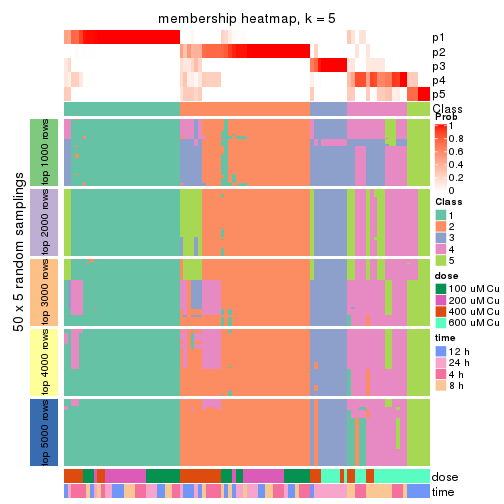</p>

</div>
<div id='tab-CV-pam-membership-heatmap-5'>
<pre><code class="r">membership_heatmap(res, k = 6)
</code></pre>

<p></p>

</div>
</div>

As soon as we have had the classes for columns, we can look for signatures
which are significantly different between classes which can be candidate marks
for certain classes. Following are the heatmaps for signatures.


Signature heatmaps where rows are scaled:


<script>
$( function() {
	$( '#tabs-CV-pam-get-signatures' ).tabs();
} );
</script>
<div id='tabs-CV-pam-get-signatures'>
<ul>
<li><a href='#tab-CV-pam-get-signatures-1'>k = 2</a></li>
<li><a href='#tab-CV-pam-get-signatures-2'>k = 3</a></li>
<li><a href='#tab-CV-pam-get-signatures-3'>k = 4</a></li>
<li><a href='#tab-CV-pam-get-signatures-4'>k = 5</a></li>
<li><a href='#tab-CV-pam-get-signatures-5'>k = 6</a></li>
</ul>
<div id='tab-CV-pam-get-signatures-1'>
<pre><code class="r">get_signatures(res, k = 2)
</code></pre>

<p></p>

</div>
<div id='tab-CV-pam-get-signatures-2'>
<pre><code class="r">get_signatures(res, k = 3)
</code></pre>

<p></p>

</div>
<div id='tab-CV-pam-get-signatures-3'>
<pre><code class="r">get_signatures(res, k = 4)
</code></pre>

<p></p>

</div>
<div id='tab-CV-pam-get-signatures-4'>
<pre><code class="r">get_signatures(res, k = 5)
</code></pre>

<p></p>

</div>
<div id='tab-CV-pam-get-signatures-5'>
<pre><code class="r">get_signatures(res, k = 6)
</code></pre>

<p></p>

</div>
</div>


Signature heatmaps where rows are not scaled:


<script>
$( function() {
	$( '#tabs-CV-pam-get-signatures-no-scale' ).tabs();
} );
</script>
<div id='tabs-CV-pam-get-signatures-no-scale'>
<ul>
<li><a href='#tab-CV-pam-get-signatures-no-scale-1'>k = 2</a></li>
<li><a href='#tab-CV-pam-get-signatures-no-scale-2'>k = 3</a></li>
<li><a href='#tab-CV-pam-get-signatures-no-scale-3'>k = 4</a></li>
<li><a href='#tab-CV-pam-get-signatures-no-scale-4'>k = 5</a></li>
<li><a href='#tab-CV-pam-get-signatures-no-scale-5'>k = 6</a></li>
</ul>
<div id='tab-CV-pam-get-signatures-no-scale-1'>
<pre><code class="r">get_signatures(res, k = 2, scale_rows = FALSE)
</code></pre>

<p></p>

</div>
<div id='tab-CV-pam-get-signatures-no-scale-2'>
<pre><code class="r">get_signatures(res, k = 3, scale_rows = FALSE)
</code></pre>

<p></p>

</div>
<div id='tab-CV-pam-get-signatures-no-scale-3'>
<pre><code class="r">get_signatures(res, k = 4, scale_rows = FALSE)
</code></pre>

<p></p>

</div>
<div id='tab-CV-pam-get-signatures-no-scale-4'>
<pre><code class="r">get_signatures(res, k = 5, scale_rows = FALSE)
</code></pre>

<p></p>

</div>
<div id='tab-CV-pam-get-signatures-no-scale-5'>
<pre><code class="r">get_signatures(res, k = 6, scale_rows = FALSE)
</code></pre>

<p></p>

</div>
</div>


Compare the overlap of signatures from different k:

```r
compare_signatures(res)
```


`get_signature()` returns a data frame invisibly. TO get the list of signatures, the function
call should be assigned to a variable explicitly. In following code, if `plot` argument is set
to `FALSE`, no heatmap is plotted while only the differential analysis is performed.

```r
# code only for demonstration
tb = get_signature(res, k = ..., plot = FALSE)
```

An example of the output of `tb` is:

```
#>   which_row         fdr    mean_1    mean_2 scaled_mean_1 scaled_mean_2 km
#> 1        38 0.042760348  8.373488  9.131774    -0.5533452     0.5164555  1
#> 2        40 0.018707592  7.106213  8.469186    -0.6173731     0.5762149  1
#> 3        55 0.019134737 10.221463 11.207825    -0.6159697     0.5749050  1
#> 4        59 0.006059896  5.921854  7.869574    -0.6899429     0.6439467  1
#> 5        60 0.018055526  8.928898 10.211722    -0.6204761     0.5791110  1
#> 6        98 0.009384629 15.714769 14.887706     0.6635654    -0.6193277  2
...
```

The columns in `tb` are:

1. `which_row`: row indices corresponding to the input matrix.
2. `fdr`: FDR for the differential test. 
3. `mean_x`: The mean value in group x.
4. `scaled_mean_x`: The mean value in group x after rows are scaled.
5. `km`: Row groups if k-means clustering is applied to rows.


UMAP plot which shows how samples are separated.


<script>
$( function() {
	$( '#tabs-CV-pam-dimension-reduction' ).tabs();
} );
</script>
<div id='tabs-CV-pam-dimension-reduction'>
<ul>
<li><a href='#tab-CV-pam-dimension-reduction-1'>k = 2</a></li>
<li><a href='#tab-CV-pam-dimension-reduction-2'>k = 3</a></li>
<li><a href='#tab-CV-pam-dimension-reduction-3'>k = 4</a></li>
<li><a href='#tab-CV-pam-dimension-reduction-4'>k = 5</a></li>
<li><a href='#tab-CV-pam-dimension-reduction-5'>k = 6</a></li>
</ul>
<div id='tab-CV-pam-dimension-reduction-1'>
<pre><code class="r">dimension_reduction(res, k = 2, method = &quot;UMAP&quot;)
</code></pre>

<p></p>

</div>
<div id='tab-CV-pam-dimension-reduction-2'>
<pre><code class="r">dimension_reduction(res, k = 3, method = &quot;UMAP&quot;)
</code></pre>

<p></p>

</div>
<div id='tab-CV-pam-dimension-reduction-3'>
<pre><code class="r">dimension_reduction(res, k = 4, method = &quot;UMAP&quot;)
</code></pre>

<p></p>

</div>
<div id='tab-CV-pam-dimension-reduction-4'>
<pre><code class="r">dimension_reduction(res, k = 5, method = &quot;UMAP&quot;)
</code></pre>

<p></p>

</div>
<div id='tab-CV-pam-dimension-reduction-5'>
<pre><code class="r">dimension_reduction(res, k = 6, method = &quot;UMAP&quot;)
</code></pre>

<p></p>

</div>
</div>


Following heatmap shows how subgroups are split when increasing `k`:

```r
collect_classes(res)
```


Test correlation between subgroups and known annotations. If the known
annotation is numeric, one-way ANOVA test is applied, and if the known
annotation is discrete, chi-squared contingency table test is applied.

```r
test_to_known_factors(res)
```

```
#>         n  dose(p)  time(p) k
#> CV:pam 95 3.58e-16 2.48e-01 2
#> CV:pam 82 6.67e-13 9.16e-01 3
#> CV:pam 89 1.99e-13 2.02e-04 4
#> CV:pam 81 1.86e-10 1.54e-07 5
#> CV:pam 86 4.23e-14 3.89e-09 6
```


If matrix rows can be associated to genes, consider to use `GO_Enrichment(res,
...)` to perform function enrichment for the signature genes.


 

---------------------------------------------------


### CV:mclust*


The object with results only for a single top-value method and a single partition method 
can be extracted as:

```r
res = res_list["CV", "mclust"]
# you can also extract it by
# res = res_list["CV:mclust"]
```

A summary of `res` and all the functions that can be applied to it:

```r
res
```

```
#> A 'ConsensusPartition' object with k = 2, 3, 4, 5, 6.
#>   On a matrix with 16250 rows and 98 columns.
#>   Top rows (1000, 2000, 3000, 4000, 5000) are extracted by 'CV' method.
#>   Subgroups are detected by 'mclust' method.
#>   Performed in total 1250 partitions by row resampling.
#>   Best k for subgroups seems to be 3.
#> 
#> Following methods can be applied to this 'ConsensusPartition' object:
#>  [1] "cola_report"             "collect_classes"         "collect_plots"          
#>  [4] "collect_stats"           "colnames"                "compare_signatures"     
#>  [7] "consensus_heatmap"       "dimension_reduction"     "functional_enrichment"  
#> [10] "get_anno_col"            "get_anno"                "get_classes"            
#> [13] "get_consensus"           "get_matrix"              "get_membership"         
#> [16] "get_param"               "get_signatures"          "get_stats"              
#> [19] "is_best_k"               "is_stable_k"             "membership_heatmap"     
#> [22] "ncol"                    "nrow"                    "plot_ecdf"              
#> [25] "rownames"                "select_partition_number" "show"                   
#> [28] "suggest_best_k"          "test_to_known_factors"
```

`collect_plots()` function collects all the plots made from `res` for all `k` (number of partitions)
into one single page to provide an easy and fast comparison between different `k`.

```r
collect_plots(res)
```


The plots are:

- The first row: a plot of the ECDF (Empirical cumulative distribution
  function) curves of the consensus matrix for each `k` and the heatmap of
  predicted classes for each `k`.
- The second row: heatmaps of the consensus matrix for each `k`.
- The third row: heatmaps of the membership matrix for each `k`.
- The fouth row: heatmaps of the signatures for each `k`.

All the plots in panels can be made by individual functions and they are
plotted later in this section.

`select_partition_number()` produces several plots showing different
statistics for choosing "optimized" `k`. There are following statistics:

- ECDF curves of the consensus matrix for each `k`;
- 1-PAC. [The PAC
  score](https://en.wikipedia.org/wiki/Consensus_clustering#Over-interpretation_potential_of_consensus_clustering)
  measures the proportion of the ambiguous subgrouping.
- Mean silhouette score.
- Concordance. The mean probability of fiting the consensus class ids in all
  partitions.
- Area increased. Denote $A_k$ as the area under the ECDF curve for current
  `k`, the area increased is defined as $A_k - A_{k-1}$.
- Rand index. The percent of pairs of samples that are both in a same cluster
  or both are not in a same cluster in the partition of k and k-1.
- Jaccard index. The ratio of pairs of samples are both in a same cluster in
  the partition of k and k-1 and the pairs of samples are both in a same
  cluster in the partition k or k-1.

The detailed explanations of these statistics can be found in [the cola
vignette](http://bioconductor.org/packages/devel/bioc/vignettes/cola/inst/doc/cola.html#toc_13).

Generally speaking, lower PAC score, higher mean silhouette score or higher
concordance corresponds to better partition. Rand index and Jaccard index
measure how similar the current partition is compared to partition with `k-1`.
If they are too similar, we won't accept `k` is better than `k-1`.

```r
select_partition_number(res)
```


The numeric values for all these statistics can be obtained by `get_stats()`.

```r
get_stats(res)
```

```
#>   k 1-PAC mean_silhouette concordance area_increased  Rand Jaccard
#> 2 2 0.408           0.853       0.900         0.4614 0.495   0.495
#> 3 3 0.907           0.911       0.940         0.3508 0.863   0.730
#> 4 4 0.781           0.923       0.913         0.1870 0.854   0.620
#> 5 5 0.782           0.868       0.863         0.0533 0.922   0.701
#> 6 6 0.830           0.762       0.831         0.0362 0.968   0.852
```

`suggest_best_k()` suggests the best $k$ based on these statistics. The rules are as follows:

- All $k$ with Jaccard index larger than 0.95 are removed because the increase of
  the partition number does not provides enough extra information. If all $k$ are removed,
  the best $k$ is assigned by `NA`.
- For $k$ with 1-PAC larger than 0.9, the maximal $k$ is taken as the "best k". Other $k$ is called "optional k".
- If it does not fit the second rule. The $k$ with the highest vote of highest
  1-PAC, mean silhouette and concordance is taken as the "best k".

```r
suggest_best_k(res)
```

```
#> [1] 3
```


Following shows the table of the partitions (You need to click the **show/hide
code output** link to see it). The membership matrix (columns with name `p*`)
is inferred by
[`clue::cl_consensus()`](https://www.rdocumentation.org/link/cl_consensus?package=clue)
function with the `SE` method. Basically the value in the membership matrix
represents the probability to belong to a certain group. The finall class
label for an item is determined with the group with highest probability it
belongs to.

In `get_classes()` function, the entropy is calculated from the membership
matrix and the silhouette score is calculated from the consensus matrix.


<script>
$( function() {
	$( '#tabs-CV-mclust-get-classes' ).tabs();
} );
</script>
<div id='tabs-CV-mclust-get-classes'>
<ul>
<li><a href='#tab-CV-mclust-get-classes-1'>k = 2</a></li>
<li><a href='#tab-CV-mclust-get-classes-2'>k = 3</a></li>
<li><a href='#tab-CV-mclust-get-classes-3'>k = 4</a></li>
<li><a href='#tab-CV-mclust-get-classes-4'>k = 5</a></li>
<li><a href='#tab-CV-mclust-get-classes-5'>k = 6</a></li>
</ul>

<div id='tab-CV-mclust-get-classes-1'>
<p><a id='tab-CV-mclust-get-classes-1-a' style='color:#0366d6' href='#'>show/hide code output</a></p>
<pre><code class="r">cbind(get_classes(res, k = 2), get_membership(res, k = 2))
</code></pre>

<pre><code>#&gt;           class entropy silhouette    p1    p2
#&gt; GSM241451     1  0.0000      0.814 1.000 0.000
#&gt; GSM241452     1  0.8081      0.825 0.752 0.248
#&gt; GSM241453     1  0.0000      0.814 1.000 0.000
#&gt; GSM241454     1  0.8081      0.825 0.752 0.248
#&gt; GSM241455     1  0.0000      0.814 1.000 0.000
#&gt; GSM241456     1  0.8081      0.825 0.752 0.248
#&gt; GSM241457     1  0.0938      0.816 0.988 0.012
#&gt; GSM241458     1  0.8081      0.825 0.752 0.248
#&gt; GSM241459     1  0.0000      0.814 1.000 0.000
#&gt; GSM241460     1  0.8081      0.825 0.752 0.248
#&gt; GSM241461     1  0.6531      0.690 0.832 0.168
#&gt; GSM241462     1  0.8081      0.825 0.752 0.248
#&gt; GSM241463     1  0.0000      0.814 1.000 0.000
#&gt; GSM241464     1  0.7883      0.825 0.764 0.236
#&gt; GSM241465     1  0.0000      0.814 1.000 0.000
#&gt; GSM241466     1  0.8081      0.825 0.752 0.248
#&gt; GSM241467     1  0.8081      0.825 0.752 0.248
#&gt; GSM241468     1  0.0000      0.814 1.000 0.000
#&gt; GSM241469     1  0.8081      0.825 0.752 0.248
#&gt; GSM241470     1  0.0000      0.814 1.000 0.000
#&gt; GSM241471     1  0.0000      0.814 1.000 0.000
#&gt; GSM241472     1  0.8081      0.825 0.752 0.248
#&gt; GSM241473     1  0.0000      0.814 1.000 0.000
#&gt; GSM241474     1  0.8081      0.825 0.752 0.248
#&gt; GSM241475     1  0.0000      0.814 1.000 0.000
#&gt; GSM241476     1  0.8081      0.825 0.752 0.248
#&gt; GSM241477     1  0.0000      0.814 1.000 0.000
#&gt; GSM241478     1  0.0000      0.814 1.000 0.000
#&gt; GSM241479     1  0.8081      0.825 0.752 0.248
#&gt; GSM241480     1  0.8081      0.825 0.752 0.248
#&gt; GSM241481     1  0.0000      0.814 1.000 0.000
#&gt; GSM241482     1  0.8081      0.825 0.752 0.248
#&gt; GSM241483     1  0.0000      0.814 1.000 0.000
#&gt; GSM241484     1  0.8081      0.825 0.752 0.248
#&gt; GSM241485     1  0.8081      0.825 0.752 0.248
#&gt; GSM241486     1  0.6973      0.664 0.812 0.188
#&gt; GSM241487     1  0.7219      0.646 0.800 0.200
#&gt; GSM241488     1  0.7528      0.825 0.784 0.216
#&gt; GSM241489     1  0.8081      0.825 0.752 0.248
#&gt; GSM241490     1  0.8081      0.825 0.752 0.248
#&gt; GSM241491     1  0.0000      0.814 1.000 0.000
#&gt; GSM241492     1  0.8081      0.825 0.752 0.248
#&gt; GSM241493     1  0.0000      0.814 1.000 0.000
#&gt; GSM241494     1  0.8081      0.825 0.752 0.248
#&gt; GSM241495     1  0.0000      0.814 1.000 0.000
#&gt; GSM241496     1  0.8081      0.825 0.752 0.248
#&gt; GSM241497     1  0.8081      0.825 0.752 0.248
#&gt; GSM241498     1  0.8081      0.825 0.752 0.248
#&gt; GSM241499     2  0.2423      0.906 0.040 0.960
#&gt; GSM241500     2  0.0376      0.925 0.004 0.996
#&gt; GSM241501     2  0.9580      0.513 0.380 0.620
#&gt; GSM241502     2  0.2423      0.906 0.040 0.960
#&gt; GSM241503     2  0.1414      0.922 0.020 0.980
#&gt; GSM241504     2  0.1184      0.920 0.016 0.984
#&gt; GSM241505     2  0.0376      0.925 0.004 0.996
#&gt; GSM241506     2  0.0672      0.924 0.008 0.992
#&gt; GSM241507     2  0.2423      0.906 0.040 0.960
#&gt; GSM241508     2  0.0376      0.925 0.004 0.996
#&gt; GSM241509     2  0.0000      0.926 0.000 1.000
#&gt; GSM241510     2  0.0000      0.926 0.000 1.000
#&gt; GSM241511     2  0.0000      0.926 0.000 1.000
#&gt; GSM241512     2  0.0000      0.926 0.000 1.000
#&gt; GSM241513     2  0.5737      0.860 0.136 0.864
#&gt; GSM241514     2  0.5737      0.860 0.136 0.864
#&gt; GSM241515     2  0.4022      0.894 0.080 0.920
#&gt; GSM241516     2  0.0000      0.926 0.000 1.000
#&gt; GSM241517     2  0.5842      0.856 0.140 0.860
#&gt; GSM241518     2  0.5737      0.860 0.136 0.864
#&gt; GSM241519     2  0.5737      0.860 0.136 0.864
#&gt; GSM241520     2  0.5737      0.860 0.136 0.864
#&gt; GSM241521     2  0.5842      0.856 0.140 0.860
#&gt; GSM241522     2  0.5842      0.856 0.140 0.860
#&gt; GSM241523     2  0.5737      0.860 0.136 0.864
#&gt; GSM241524     2  0.5737      0.860 0.136 0.864
#&gt; GSM241525     2  0.0000      0.926 0.000 1.000
#&gt; GSM241526     2  0.0000      0.926 0.000 1.000
#&gt; GSM241527     2  0.0000      0.926 0.000 1.000
#&gt; GSM241528     2  0.0000      0.926 0.000 1.000
#&gt; GSM241529     2  0.0000      0.926 0.000 1.000
#&gt; GSM241530     2  0.0000      0.926 0.000 1.000
#&gt; GSM241531     2  0.0000      0.926 0.000 1.000
#&gt; GSM241532     2  0.0000      0.926 0.000 1.000
#&gt; GSM241533     2  0.0000      0.926 0.000 1.000
#&gt; GSM241534     2  0.0000      0.926 0.000 1.000
#&gt; GSM241535     2  0.0000      0.926 0.000 1.000
#&gt; GSM241536     2  0.0000      0.926 0.000 1.000
#&gt; GSM241537     2  0.0000      0.926 0.000 1.000
#&gt; GSM241538     2  0.0000      0.926 0.000 1.000
#&gt; GSM241539     2  0.0000      0.926 0.000 1.000
#&gt; GSM241540     2  0.0000      0.926 0.000 1.000
#&gt; GSM241541     2  0.0000      0.926 0.000 1.000
#&gt; GSM241542     2  0.0000      0.926 0.000 1.000
#&gt; GSM241543     2  0.5737      0.860 0.136 0.864
#&gt; GSM241544     2  0.5737      0.860 0.136 0.864
#&gt; GSM241545     2  0.5737      0.860 0.136 0.864
#&gt; GSM241546     2  0.5737      0.860 0.136 0.864
#&gt; GSM241547     2  0.5737      0.860 0.136 0.864
#&gt; GSM241548     2  0.5737      0.860 0.136 0.864
</code></pre>

<script>
$('#tab-CV-mclust-get-classes-1-a').parent().next().next().hide();
$('#tab-CV-mclust-get-classes-1-a').click(function(){
  $('#tab-CV-mclust-get-classes-1-a').parent().next().next().toggle();
  return(false);
});
</script>
</div>

<div id='tab-CV-mclust-get-classes-2'>
<p><a id='tab-CV-mclust-get-classes-2-a' style='color:#0366d6' href='#'>show/hide code output</a></p>
<pre><code class="r">cbind(get_classes(res, k = 3), get_membership(res, k = 3))
</code></pre>

<pre><code>#&gt;           class entropy silhouette    p1    p2    p3
#&gt; GSM241451     2  0.3116      0.918 0.108 0.892 0.000
#&gt; GSM241452     1  0.1753      0.955 0.952 0.048 0.000
#&gt; GSM241453     2  0.1964      0.947 0.056 0.944 0.000
#&gt; GSM241454     1  0.1289      0.959 0.968 0.032 0.000
#&gt; GSM241455     2  0.2066      0.947 0.060 0.940 0.000
#&gt; GSM241456     1  0.1289      0.959 0.968 0.032 0.000
#&gt; GSM241457     2  0.2384      0.944 0.056 0.936 0.008
#&gt; GSM241458     1  0.1529      0.941 0.960 0.040 0.000
#&gt; GSM241459     2  0.1964      0.947 0.056 0.944 0.000
#&gt; GSM241460     1  0.1878      0.938 0.952 0.044 0.004
#&gt; GSM241461     2  0.2846      0.934 0.056 0.924 0.020
#&gt; GSM241462     1  0.0237      0.941 0.996 0.004 0.000
#&gt; GSM241463     2  0.2066      0.947 0.060 0.940 0.000
#&gt; GSM241464     2  0.6305      0.119 0.484 0.516 0.000
#&gt; GSM241465     2  0.2200      0.946 0.056 0.940 0.004
#&gt; GSM241466     1  0.1289      0.959 0.968 0.032 0.000
#&gt; GSM241467     1  0.2261      0.946 0.932 0.068 0.000
#&gt; GSM241468     2  0.3619      0.890 0.136 0.864 0.000
#&gt; GSM241469     1  0.1753      0.956 0.952 0.048 0.000
#&gt; GSM241470     2  0.3038      0.921 0.104 0.896 0.000
#&gt; GSM241471     2  0.1964      0.947 0.056 0.944 0.000
#&gt; GSM241472     1  0.2356      0.944 0.928 0.072 0.000
#&gt; GSM241473     2  0.2066      0.947 0.060 0.940 0.000
#&gt; GSM241474     1  0.2356      0.944 0.928 0.072 0.000
#&gt; GSM241475     2  0.2165      0.947 0.064 0.936 0.000
#&gt; GSM241476     1  0.1289      0.959 0.968 0.032 0.000
#&gt; GSM241477     2  0.1964      0.947 0.056 0.944 0.000
#&gt; GSM241478     2  0.2711      0.933 0.088 0.912 0.000
#&gt; GSM241479     1  0.1289      0.959 0.968 0.032 0.000
#&gt; GSM241480     1  0.1289      0.959 0.968 0.032 0.000
#&gt; GSM241481     2  0.1964      0.947 0.056 0.944 0.000
#&gt; GSM241482     1  0.1529      0.941 0.960 0.040 0.000
#&gt; GSM241483     2  0.1964      0.947 0.056 0.944 0.000
#&gt; GSM241484     1  0.0000      0.937 1.000 0.000 0.000
#&gt; GSM241485     1  0.1289      0.959 0.968 0.032 0.000
#&gt; GSM241486     2  0.2846      0.934 0.056 0.924 0.020
#&gt; GSM241487     2  0.3500      0.809 0.004 0.880 0.116
#&gt; GSM241488     2  0.5070      0.770 0.224 0.772 0.004
#&gt; GSM241489     1  0.1860      0.955 0.948 0.052 0.000
#&gt; GSM241490     1  0.6393      0.716 0.764 0.088 0.148
#&gt; GSM241491     2  0.2066      0.947 0.060 0.940 0.000
#&gt; GSM241492     1  0.4291      0.813 0.820 0.180 0.000
#&gt; GSM241493     2  0.2165      0.947 0.064 0.936 0.000
#&gt; GSM241494     1  0.1289      0.959 0.968 0.032 0.000
#&gt; GSM241495     2  0.2261      0.945 0.068 0.932 0.000
#&gt; GSM241496     3  0.9713     -0.172 0.220 0.376 0.404
#&gt; GSM241497     1  0.2902      0.944 0.920 0.064 0.016
#&gt; GSM241498     1  0.1411      0.958 0.964 0.036 0.000
#&gt; GSM241499     3  0.7890      0.189 0.432 0.056 0.512
#&gt; GSM241500     3  0.1964      0.921 0.000 0.056 0.944
#&gt; GSM241501     3  0.2261      0.911 0.000 0.068 0.932
#&gt; GSM241502     3  0.2356      0.908 0.000 0.072 0.928
#&gt; GSM241503     3  0.3237      0.922 0.032 0.056 0.912
#&gt; GSM241504     3  0.3237      0.922 0.032 0.056 0.912
#&gt; GSM241505     3  0.3237      0.922 0.032 0.056 0.912
#&gt; GSM241506     3  0.1860      0.924 0.000 0.052 0.948
#&gt; GSM241507     3  0.3237      0.922 0.032 0.056 0.912
#&gt; GSM241508     3  0.1964      0.921 0.000 0.056 0.944
#&gt; GSM241509     3  0.0000      0.957 0.000 0.000 1.000
#&gt; GSM241510     3  0.0424      0.954 0.000 0.008 0.992
#&gt; GSM241511     3  0.3237      0.922 0.032 0.056 0.912
#&gt; GSM241512     3  0.1411      0.947 0.000 0.036 0.964
#&gt; GSM241513     3  0.0000      0.957 0.000 0.000 1.000
#&gt; GSM241514     3  0.1411      0.947 0.000 0.036 0.964
#&gt; GSM241515     3  0.0000      0.957 0.000 0.000 1.000
#&gt; GSM241516     3  0.1411      0.947 0.000 0.036 0.964
#&gt; GSM241517     3  0.0000      0.957 0.000 0.000 1.000
#&gt; GSM241518     3  0.0000      0.957 0.000 0.000 1.000
#&gt; GSM241519     3  0.0000      0.957 0.000 0.000 1.000
#&gt; GSM241520     3  0.0000      0.957 0.000 0.000 1.000
#&gt; GSM241521     3  0.0000      0.957 0.000 0.000 1.000
#&gt; GSM241522     3  0.1411      0.947 0.000 0.036 0.964
#&gt; GSM241523     3  0.0000      0.957 0.000 0.000 1.000
#&gt; GSM241524     3  0.0000      0.957 0.000 0.000 1.000
#&gt; GSM241525     3  0.2446      0.935 0.012 0.052 0.936
#&gt; GSM241526     3  0.0000      0.957 0.000 0.000 1.000
#&gt; GSM241527     3  0.1411      0.947 0.000 0.036 0.964
#&gt; GSM241528     3  0.0000      0.957 0.000 0.000 1.000
#&gt; GSM241529     3  0.0000      0.957 0.000 0.000 1.000
#&gt; GSM241530     3  0.2280      0.937 0.008 0.052 0.940
#&gt; GSM241531     3  0.2446      0.935 0.012 0.052 0.936
#&gt; GSM241532     3  0.0000      0.957 0.000 0.000 1.000
#&gt; GSM241533     3  0.0000      0.957 0.000 0.000 1.000
#&gt; GSM241534     3  0.0000      0.957 0.000 0.000 1.000
#&gt; GSM241535     3  0.1411      0.947 0.000 0.036 0.964
#&gt; GSM241536     3  0.3112      0.924 0.028 0.056 0.916
#&gt; GSM241537     3  0.0000      0.957 0.000 0.000 1.000
#&gt; GSM241538     3  0.0000      0.957 0.000 0.000 1.000
#&gt; GSM241539     3  0.0000      0.957 0.000 0.000 1.000
#&gt; GSM241540     3  0.0000      0.957 0.000 0.000 1.000
#&gt; GSM241541     3  0.0000      0.957 0.000 0.000 1.000
#&gt; GSM241542     3  0.0000      0.957 0.000 0.000 1.000
#&gt; GSM241543     3  0.0000      0.957 0.000 0.000 1.000
#&gt; GSM241544     3  0.0000      0.957 0.000 0.000 1.000
#&gt; GSM241545     3  0.0000      0.957 0.000 0.000 1.000
#&gt; GSM241546     3  0.0000      0.957 0.000 0.000 1.000
#&gt; GSM241547     3  0.0000      0.957 0.000 0.000 1.000
#&gt; GSM241548     3  0.0000      0.957 0.000 0.000 1.000
</code></pre>

<script>
$('#tab-CV-mclust-get-classes-2-a').parent().next().next().hide();
$('#tab-CV-mclust-get-classes-2-a').click(function(){
  $('#tab-CV-mclust-get-classes-2-a').parent().next().next().toggle();
  return(false);
});
</script>
</div>

<div id='tab-CV-mclust-get-classes-3'>
<p><a id='tab-CV-mclust-get-classes-3-a' style='color:#0366d6' href='#'>show/hide code output</a></p>
<pre><code class="r">cbind(get_classes(res, k = 4), get_membership(res, k = 4))
</code></pre>

<pre><code>#&gt;           class entropy silhouette    p1    p2    p3    p4
#&gt; GSM241451     2  0.0000      0.977 0.000 1.000 0.000 0.000
#&gt; GSM241452     1  0.3801      0.945 0.780 0.220 0.000 0.000
#&gt; GSM241453     2  0.0000      0.977 0.000 1.000 0.000 0.000
#&gt; GSM241454     1  0.3266      0.950 0.832 0.168 0.000 0.000
#&gt; GSM241455     2  0.0000      0.977 0.000 1.000 0.000 0.000
#&gt; GSM241456     1  0.3444      0.952 0.816 0.184 0.000 0.000
#&gt; GSM241457     2  0.1022      0.964 0.032 0.968 0.000 0.000
#&gt; GSM241458     1  0.3342      0.885 0.868 0.100 0.000 0.032
#&gt; GSM241459     2  0.1022      0.964 0.032 0.968 0.000 0.000
#&gt; GSM241460     1  0.2408      0.909 0.896 0.104 0.000 0.000
#&gt; GSM241461     2  0.1302      0.938 0.000 0.956 0.000 0.044
#&gt; GSM241462     1  0.2589      0.919 0.884 0.116 0.000 0.000
#&gt; GSM241463     2  0.0188      0.976 0.004 0.996 0.000 0.000
#&gt; GSM241464     2  0.1022      0.955 0.032 0.968 0.000 0.000
#&gt; GSM241465     2  0.0000      0.977 0.000 1.000 0.000 0.000
#&gt; GSM241466     1  0.3400      0.952 0.820 0.180 0.000 0.000
#&gt; GSM241467     1  0.3444      0.952 0.816 0.184 0.000 0.000
#&gt; GSM241468     2  0.1022      0.964 0.032 0.968 0.000 0.000
#&gt; GSM241469     1  0.3764      0.947 0.784 0.216 0.000 0.000
#&gt; GSM241470     2  0.0000      0.977 0.000 1.000 0.000 0.000
#&gt; GSM241471     2  0.1022      0.964 0.032 0.968 0.000 0.000
#&gt; GSM241472     1  0.3444      0.952 0.816 0.184 0.000 0.000
#&gt; GSM241473     2  0.1022      0.964 0.032 0.968 0.000 0.000
#&gt; GSM241474     1  0.3444      0.952 0.816 0.184 0.000 0.000
#&gt; GSM241475     2  0.0000      0.977 0.000 1.000 0.000 0.000
#&gt; GSM241476     1  0.3726      0.948 0.788 0.212 0.000 0.000
#&gt; GSM241477     2  0.0000      0.977 0.000 1.000 0.000 0.000
#&gt; GSM241478     2  0.0000      0.977 0.000 1.000 0.000 0.000
#&gt; GSM241479     1  0.3444      0.952 0.816 0.184 0.000 0.000
#&gt; GSM241480     1  0.3266      0.950 0.832 0.168 0.000 0.000
#&gt; GSM241481     2  0.1022      0.964 0.032 0.968 0.000 0.000
#&gt; GSM241482     1  0.2345      0.906 0.900 0.100 0.000 0.000
#&gt; GSM241483     2  0.0188      0.976 0.004 0.996 0.000 0.000
#&gt; GSM241484     1  0.2345      0.906 0.900 0.100 0.000 0.000
#&gt; GSM241485     1  0.3219      0.949 0.836 0.164 0.000 0.000
#&gt; GSM241486     2  0.1302      0.938 0.000 0.956 0.000 0.044
#&gt; GSM241487     2  0.2926      0.866 0.000 0.896 0.056 0.048
#&gt; GSM241488     2  0.0000      0.977 0.000 1.000 0.000 0.000
#&gt; GSM241489     1  0.3764      0.947 0.784 0.216 0.000 0.000
#&gt; GSM241490     1  0.3831      0.946 0.792 0.204 0.000 0.004
#&gt; GSM241491     2  0.0000      0.977 0.000 1.000 0.000 0.000
#&gt; GSM241492     1  0.4277      0.846 0.720 0.280 0.000 0.000
#&gt; GSM241493     2  0.0000      0.977 0.000 1.000 0.000 0.000
#&gt; GSM241494     1  0.3764      0.947 0.784 0.216 0.000 0.000
#&gt; GSM241495     2  0.0000      0.977 0.000 1.000 0.000 0.000
#&gt; GSM241496     2  0.0000      0.977 0.000 1.000 0.000 0.000
#&gt; GSM241497     1  0.3801      0.945 0.780 0.220 0.000 0.000
#&gt; GSM241498     1  0.3764      0.947 0.784 0.216 0.000 0.000
#&gt; GSM241499     4  0.5054      0.724 0.328 0.008 0.004 0.660
#&gt; GSM241500     3  0.3301      0.906 0.048 0.000 0.876 0.076
#&gt; GSM241501     3  0.3521      0.907 0.032 0.016 0.876 0.076
#&gt; GSM241502     3  0.3521      0.907 0.032 0.016 0.876 0.076
#&gt; GSM241503     4  0.4761      0.737 0.332 0.000 0.004 0.664
#&gt; GSM241504     4  0.3626      0.876 0.184 0.000 0.004 0.812
#&gt; GSM241505     4  0.3626      0.876 0.184 0.000 0.004 0.812
#&gt; GSM241506     3  0.5898      0.432 0.048 0.000 0.604 0.348
#&gt; GSM241507     4  0.3626      0.876 0.184 0.000 0.004 0.812
#&gt; GSM241508     3  0.3370      0.903 0.048 0.000 0.872 0.080
#&gt; GSM241509     4  0.4206      0.826 0.048 0.000 0.136 0.816
#&gt; GSM241510     4  0.4257      0.822 0.048 0.000 0.140 0.812
#&gt; GSM241511     4  0.4004      0.876 0.164 0.000 0.024 0.812
#&gt; GSM241512     4  0.4356      0.836 0.064 0.000 0.124 0.812
#&gt; GSM241513     3  0.1854      0.934 0.012 0.000 0.940 0.048
#&gt; GSM241514     3  0.1975      0.933 0.016 0.000 0.936 0.048
#&gt; GSM241515     3  0.2926      0.919 0.048 0.000 0.896 0.056
#&gt; GSM241516     3  0.4010      0.871 0.064 0.000 0.836 0.100
#&gt; GSM241517     3  0.1854      0.934 0.012 0.000 0.940 0.048
#&gt; GSM241518     3  0.1854      0.934 0.012 0.000 0.940 0.048
#&gt; GSM241519     3  0.0000      0.933 0.000 0.000 1.000 0.000
#&gt; GSM241520     3  0.0000      0.933 0.000 0.000 1.000 0.000
#&gt; GSM241521     3  0.1854      0.931 0.000 0.012 0.940 0.048
#&gt; GSM241522     3  0.2287      0.928 0.004 0.012 0.924 0.060
#&gt; GSM241523     3  0.0000      0.933 0.000 0.000 1.000 0.000
#&gt; GSM241524     3  0.0000      0.933 0.000 0.000 1.000 0.000
#&gt; GSM241525     4  0.3082      0.902 0.084 0.000 0.032 0.884
#&gt; GSM241526     4  0.0000      0.926 0.000 0.000 0.000 1.000
#&gt; GSM241527     4  0.0469      0.925 0.012 0.000 0.000 0.988
#&gt; GSM241528     4  0.2840      0.896 0.044 0.000 0.056 0.900
#&gt; GSM241529     4  0.0000      0.926 0.000 0.000 0.000 1.000
#&gt; GSM241530     4  0.1305      0.923 0.036 0.000 0.004 0.960
#&gt; GSM241531     4  0.1118      0.923 0.036 0.000 0.000 0.964
#&gt; GSM241532     4  0.0000      0.926 0.000 0.000 0.000 1.000
#&gt; GSM241533     4  0.0000      0.926 0.000 0.000 0.000 1.000
#&gt; GSM241534     4  0.0000      0.926 0.000 0.000 0.000 1.000
#&gt; GSM241535     4  0.0469      0.925 0.012 0.000 0.000 0.988
#&gt; GSM241536     4  0.1474      0.921 0.052 0.000 0.000 0.948
#&gt; GSM241537     4  0.0000      0.926 0.000 0.000 0.000 1.000
#&gt; GSM241538     4  0.0000      0.926 0.000 0.000 0.000 1.000
#&gt; GSM241539     4  0.0000      0.926 0.000 0.000 0.000 1.000
#&gt; GSM241540     4  0.0000      0.926 0.000 0.000 0.000 1.000
#&gt; GSM241541     4  0.0000      0.926 0.000 0.000 0.000 1.000
#&gt; GSM241542     4  0.0000      0.926 0.000 0.000 0.000 1.000
#&gt; GSM241543     3  0.0000      0.933 0.000 0.000 1.000 0.000
#&gt; GSM241544     3  0.0000      0.933 0.000 0.000 1.000 0.000
#&gt; GSM241545     3  0.0000      0.933 0.000 0.000 1.000 0.000
#&gt; GSM241546     3  0.0000      0.933 0.000 0.000 1.000 0.000
#&gt; GSM241547     3  0.0000      0.933 0.000 0.000 1.000 0.000
#&gt; GSM241548     3  0.0000      0.933 0.000 0.000 1.000 0.000
</code></pre>

<script>
$('#tab-CV-mclust-get-classes-3-a').parent().next().next().hide();
$('#tab-CV-mclust-get-classes-3-a').click(function(){
  $('#tab-CV-mclust-get-classes-3-a').parent().next().next().toggle();
  return(false);
});
</script>
</div>

<div id='tab-CV-mclust-get-classes-4'>
<p><a id='tab-CV-mclust-get-classes-4-a' style='color:#0366d6' href='#'>show/hide code output</a></p>
<pre><code class="r">cbind(get_classes(res, k = 5), get_membership(res, k = 5))
</code></pre>

<pre><code>#&gt;           class entropy silhouette    p1    p2    p3    p4    p5
#&gt; GSM241451     2  0.2629      0.979 0.136 0.860 0.000 0.000 0.004
#&gt; GSM241452     1  0.0000      0.965 1.000 0.000 0.000 0.000 0.000
#&gt; GSM241453     2  0.2629      0.979 0.136 0.860 0.000 0.000 0.004
#&gt; GSM241454     1  0.0162      0.964 0.996 0.000 0.000 0.000 0.004
#&gt; GSM241455     2  0.2629      0.979 0.136 0.860 0.000 0.000 0.004
#&gt; GSM241456     1  0.0000      0.965 1.000 0.000 0.000 0.000 0.000
#&gt; GSM241457     2  0.3653      0.944 0.124 0.828 0.000 0.036 0.012
#&gt; GSM241458     1  0.1410      0.941 0.940 0.000 0.000 0.000 0.060
#&gt; GSM241459     2  0.2865      0.976 0.132 0.856 0.000 0.004 0.008
#&gt; GSM241460     1  0.1410      0.941 0.940 0.000 0.000 0.000 0.060
#&gt; GSM241461     2  0.4218      0.933 0.128 0.804 0.004 0.040 0.024
#&gt; GSM241462     1  0.1341      0.942 0.944 0.000 0.000 0.000 0.056
#&gt; GSM241463     2  0.2583      0.979 0.132 0.864 0.000 0.000 0.004
#&gt; GSM241464     2  0.3521      0.882 0.232 0.764 0.000 0.000 0.004
#&gt; GSM241465     2  0.2818      0.977 0.132 0.856 0.000 0.000 0.012
#&gt; GSM241466     1  0.0000      0.965 1.000 0.000 0.000 0.000 0.000
#&gt; GSM241467     1  0.0000      0.965 1.000 0.000 0.000 0.000 0.000
#&gt; GSM241468     2  0.2629      0.979 0.136 0.860 0.000 0.000 0.004
#&gt; GSM241469     1  0.0000      0.965 1.000 0.000 0.000 0.000 0.000
#&gt; GSM241470     2  0.2629      0.979 0.136 0.860 0.000 0.000 0.004
#&gt; GSM241471     2  0.2583      0.979 0.132 0.864 0.000 0.000 0.004
#&gt; GSM241472     1  0.0162      0.964 0.996 0.000 0.000 0.000 0.004
#&gt; GSM241473     2  0.2583      0.979 0.132 0.864 0.000 0.000 0.004
#&gt; GSM241474     1  0.0324      0.962 0.992 0.004 0.000 0.000 0.004
#&gt; GSM241475     2  0.2629      0.979 0.136 0.860 0.000 0.000 0.004
#&gt; GSM241476     1  0.0000      0.965 1.000 0.000 0.000 0.000 0.000
#&gt; GSM241477     2  0.2629      0.979 0.136 0.860 0.000 0.000 0.004
#&gt; GSM241478     2  0.2629      0.979 0.136 0.860 0.000 0.000 0.004
#&gt; GSM241479     1  0.0000      0.965 1.000 0.000 0.000 0.000 0.000
#&gt; GSM241480     1  0.0000      0.965 1.000 0.000 0.000 0.000 0.000
#&gt; GSM241481     2  0.2976      0.976 0.132 0.852 0.000 0.004 0.012
#&gt; GSM241482     1  0.1410      0.941 0.940 0.000 0.000 0.000 0.060
#&gt; GSM241483     2  0.2753      0.978 0.136 0.856 0.000 0.000 0.008
#&gt; GSM241484     1  0.1341      0.942 0.944 0.000 0.000 0.000 0.056
#&gt; GSM241485     1  0.1270      0.945 0.948 0.000 0.000 0.000 0.052
#&gt; GSM241486     2  0.4263      0.934 0.132 0.800 0.004 0.040 0.024
#&gt; GSM241487     2  0.3972      0.943 0.124 0.820 0.024 0.008 0.024
#&gt; GSM241488     2  0.2629      0.979 0.136 0.860 0.000 0.000 0.004
#&gt; GSM241489     1  0.0000      0.965 1.000 0.000 0.000 0.000 0.000
#&gt; GSM241490     1  0.0579      0.959 0.984 0.000 0.000 0.008 0.008
#&gt; GSM241491     2  0.2583      0.979 0.132 0.864 0.000 0.000 0.004
#&gt; GSM241492     1  0.4268      0.303 0.648 0.344 0.000 0.000 0.008
#&gt; GSM241493     2  0.2629      0.979 0.136 0.860 0.000 0.000 0.004
#&gt; GSM241494     1  0.0000      0.965 1.000 0.000 0.000 0.000 0.000
#&gt; GSM241495     2  0.2629      0.979 0.136 0.860 0.000 0.000 0.004
#&gt; GSM241496     2  0.3124      0.970 0.136 0.844 0.016 0.000 0.004
#&gt; GSM241497     1  0.0000      0.965 1.000 0.000 0.000 0.000 0.000
#&gt; GSM241498     1  0.0000      0.965 1.000 0.000 0.000 0.000 0.000
#&gt; GSM241499     5  0.3386      0.710 0.020 0.084 0.016 0.016 0.864
#&gt; GSM241500     5  0.5389      0.694 0.000 0.044 0.224 0.044 0.688
#&gt; GSM241501     5  0.6157      0.684 0.036 0.052 0.220 0.032 0.660
#&gt; GSM241502     5  0.6272      0.662 0.056 0.068 0.216 0.012 0.648
#&gt; GSM241503     5  0.3386      0.710 0.020 0.084 0.016 0.016 0.864
#&gt; GSM241504     5  0.3164      0.714 0.012 0.076 0.016 0.020 0.876
#&gt; GSM241505     5  0.3164      0.714 0.012 0.076 0.016 0.020 0.876
#&gt; GSM241506     5  0.5211      0.709 0.000 0.044 0.200 0.044 0.712
#&gt; GSM241507     5  0.3164      0.714 0.012 0.076 0.016 0.020 0.876
#&gt; GSM241508     5  0.5389      0.694 0.000 0.044 0.224 0.044 0.688
#&gt; GSM241509     4  0.5329      0.514 0.000 0.036 0.044 0.684 0.236
#&gt; GSM241510     5  0.5862      0.448 0.000 0.044 0.032 0.372 0.552
#&gt; GSM241511     5  0.5484      0.689 0.000 0.076 0.032 0.200 0.692
#&gt; GSM241512     5  0.4865      0.656 0.000 0.004 0.048 0.268 0.680
#&gt; GSM241513     3  0.3301      0.829 0.000 0.008 0.856 0.048 0.088
#&gt; GSM241514     5  0.5187      0.586 0.000 0.004 0.336 0.048 0.612
#&gt; GSM241515     3  0.5466      0.148 0.000 0.008 0.572 0.052 0.368
#&gt; GSM241516     5  0.5154      0.679 0.000 0.016 0.252 0.052 0.680
#&gt; GSM241517     3  0.3412      0.826 0.000 0.012 0.852 0.048 0.088
#&gt; GSM241518     3  0.3062      0.838 0.000 0.004 0.868 0.048 0.080
#&gt; GSM241519     3  0.0404      0.911 0.000 0.000 0.988 0.012 0.000
#&gt; GSM241520     3  0.0000      0.918 0.000 0.000 1.000 0.000 0.000
#&gt; GSM241521     3  0.2744      0.855 0.024 0.004 0.900 0.048 0.024
#&gt; GSM241522     5  0.6208      0.354 0.044 0.000 0.432 0.048 0.476
#&gt; GSM241523     3  0.0000      0.918 0.000 0.000 1.000 0.000 0.000
#&gt; GSM241524     3  0.0000      0.918 0.000 0.000 1.000 0.000 0.000
#&gt; GSM241525     5  0.5701      0.624 0.000 0.060 0.032 0.268 0.640
#&gt; GSM241526     4  0.0451      0.938 0.000 0.008 0.000 0.988 0.004
#&gt; GSM241527     4  0.0404      0.937 0.000 0.000 0.000 0.988 0.012
#&gt; GSM241528     5  0.5880      0.716 0.000 0.036 0.104 0.196 0.664
#&gt; GSM241529     4  0.0671      0.936 0.000 0.016 0.000 0.980 0.004
#&gt; GSM241530     4  0.3906      0.605 0.000 0.016 0.000 0.744 0.240
#&gt; GSM241531     4  0.2036      0.894 0.000 0.056 0.000 0.920 0.024
#&gt; GSM241532     4  0.0579      0.936 0.000 0.008 0.000 0.984 0.008
#&gt; GSM241533     4  0.0579      0.936 0.000 0.008 0.000 0.984 0.008
#&gt; GSM241534     4  0.0579      0.936 0.000 0.008 0.000 0.984 0.008
#&gt; GSM241535     4  0.0510      0.935 0.000 0.000 0.000 0.984 0.016
#&gt; GSM241536     4  0.2554      0.871 0.000 0.072 0.000 0.892 0.036
#&gt; GSM241537     4  0.0000      0.940 0.000 0.000 0.000 1.000 0.000
#&gt; GSM241538     4  0.0000      0.940 0.000 0.000 0.000 1.000 0.000
#&gt; GSM241539     4  0.0000      0.940 0.000 0.000 0.000 1.000 0.000
#&gt; GSM241540     4  0.0000      0.940 0.000 0.000 0.000 1.000 0.000
#&gt; GSM241541     4  0.0000      0.940 0.000 0.000 0.000 1.000 0.000
#&gt; GSM241542     4  0.0000      0.940 0.000 0.000 0.000 1.000 0.000
#&gt; GSM241543     3  0.0000      0.918 0.000 0.000 1.000 0.000 0.000
#&gt; GSM241544     3  0.0000      0.918 0.000 0.000 1.000 0.000 0.000
#&gt; GSM241545     3  0.0000      0.918 0.000 0.000 1.000 0.000 0.000
#&gt; GSM241546     3  0.0000      0.918 0.000 0.000 1.000 0.000 0.000
#&gt; GSM241547     3  0.0000      0.918 0.000 0.000 1.000 0.000 0.000
#&gt; GSM241548     3  0.0000      0.918 0.000 0.000 1.000 0.000 0.000
</code></pre>

<script>
$('#tab-CV-mclust-get-classes-4-a').parent().next().next().hide();
$('#tab-CV-mclust-get-classes-4-a').click(function(){
  $('#tab-CV-mclust-get-classes-4-a').parent().next().next().toggle();
  return(false);
});
</script>
</div>

<div id='tab-CV-mclust-get-classes-5'>
<p><a id='tab-CV-mclust-get-classes-5-a' style='color:#0366d6' href='#'>show/hide code output</a></p>
<pre><code class="r">cbind(get_classes(res, k = 6), get_membership(res, k = 6))
</code></pre>

<pre><code>#&gt;           class entropy silhouette    p1    p2    p3    p4    p5    p6
#&gt; GSM241451     2  0.4060     0.7830 0.032 0.684 0.000 0.000 0.000 0.284
#&gt; GSM241452     1  0.1367     0.9332 0.944 0.044 0.000 0.000 0.000 0.012
#&gt; GSM241453     2  0.0935     0.8733 0.032 0.964 0.000 0.000 0.000 0.004
#&gt; GSM241454     1  0.1333     0.9330 0.944 0.048 0.000 0.000 0.000 0.008
#&gt; GSM241455     2  0.0935     0.8733 0.032 0.964 0.000 0.000 0.000 0.004
#&gt; GSM241456     1  0.1349     0.9336 0.940 0.056 0.000 0.000 0.000 0.004
#&gt; GSM241457     2  0.2630     0.8478 0.032 0.872 0.000 0.000 0.092 0.004
#&gt; GSM241458     1  0.3861     0.8611 0.756 0.060 0.000 0.000 0.000 0.184
#&gt; GSM241459     2  0.2630     0.8478 0.032 0.872 0.000 0.000 0.092 0.004
#&gt; GSM241460     1  0.3819     0.8751 0.764 0.064 0.000 0.000 0.000 0.172
#&gt; GSM241461     2  0.2544     0.8017 0.004 0.852 0.000 0.000 0.140 0.004
#&gt; GSM241462     1  0.3295     0.8797 0.816 0.056 0.000 0.000 0.000 0.128
#&gt; GSM241463     2  0.0935     0.8733 0.032 0.964 0.000 0.000 0.000 0.004
#&gt; GSM241464     2  0.5088     0.7218 0.168 0.632 0.000 0.000 0.000 0.200
#&gt; GSM241465     2  0.1116     0.8717 0.028 0.960 0.000 0.000 0.008 0.004
#&gt; GSM241466     1  0.1349     0.9336 0.940 0.056 0.000 0.000 0.000 0.004
#&gt; GSM241467     1  0.2389     0.9243 0.888 0.060 0.000 0.000 0.000 0.052
#&gt; GSM241468     2  0.3427     0.8440 0.032 0.804 0.000 0.000 0.008 0.156
#&gt; GSM241469     1  0.1434     0.9338 0.940 0.048 0.000 0.000 0.000 0.012
#&gt; GSM241470     2  0.4060     0.7830 0.032 0.684 0.000 0.000 0.000 0.284
#&gt; GSM241471     2  0.1049     0.8726 0.032 0.960 0.000 0.000 0.008 0.000
#&gt; GSM241472     1  0.2740     0.9164 0.864 0.060 0.000 0.000 0.000 0.076
#&gt; GSM241473     2  0.1049     0.8726 0.032 0.960 0.000 0.000 0.008 0.000
#&gt; GSM241474     1  0.2799     0.9146 0.860 0.064 0.000 0.000 0.000 0.076
#&gt; GSM241475     2  0.2384     0.8624 0.032 0.884 0.000 0.000 0.000 0.084
#&gt; GSM241476     1  0.1333     0.9330 0.944 0.048 0.000 0.000 0.000 0.008
#&gt; GSM241477     2  0.1194     0.8720 0.032 0.956 0.000 0.000 0.008 0.004
#&gt; GSM241478     2  0.3888     0.8007 0.032 0.716 0.000 0.000 0.000 0.252
#&gt; GSM241479     1  0.1196     0.9302 0.952 0.040 0.000 0.000 0.000 0.008
#&gt; GSM241480     1  0.1333     0.9330 0.944 0.048 0.000 0.000 0.000 0.008
#&gt; GSM241481     2  0.2630     0.8478 0.032 0.872 0.000 0.000 0.092 0.004
#&gt; GSM241482     1  0.3803     0.8626 0.760 0.056 0.000 0.000 0.000 0.184
#&gt; GSM241483     2  0.2630     0.8478 0.032 0.872 0.000 0.000 0.092 0.004
#&gt; GSM241484     1  0.3083     0.8745 0.828 0.040 0.000 0.000 0.000 0.132
#&gt; GSM241485     1  0.2999     0.8900 0.840 0.048 0.000 0.000 0.000 0.112
#&gt; GSM241486     2  0.2402     0.7977 0.000 0.856 0.000 0.000 0.140 0.004
#&gt; GSM241487     2  0.1531     0.8350 0.000 0.928 0.000 0.000 0.068 0.004
#&gt; GSM241488     2  0.4344     0.7301 0.032 0.612 0.000 0.000 0.000 0.356
#&gt; GSM241489     1  0.2325     0.9257 0.892 0.060 0.000 0.000 0.000 0.048
#&gt; GSM241490     1  0.1075     0.9336 0.952 0.048 0.000 0.000 0.000 0.000
#&gt; GSM241491     2  0.0935     0.8733 0.032 0.964 0.000 0.000 0.000 0.004
#&gt; GSM241492     1  0.4757     0.6942 0.676 0.144 0.000 0.000 0.000 0.180
#&gt; GSM241493     2  0.3062     0.8456 0.032 0.824 0.000 0.000 0.000 0.144
#&gt; GSM241494     1  0.1829     0.9310 0.920 0.056 0.000 0.000 0.000 0.024
#&gt; GSM241495     2  0.4020     0.7877 0.032 0.692 0.000 0.000 0.000 0.276
#&gt; GSM241496     2  0.4582     0.7218 0.032 0.604 0.000 0.000 0.008 0.356
#&gt; GSM241497     1  0.2257     0.9227 0.904 0.040 0.000 0.000 0.008 0.048
#&gt; GSM241498     1  0.1265     0.9318 0.948 0.044 0.000 0.000 0.000 0.008
#&gt; GSM241499     5  0.3860     0.6448 0.000 0.000 0.000 0.000 0.528 0.472
#&gt; GSM241500     5  0.3236     0.5057 0.000 0.024 0.180 0.000 0.796 0.000
#&gt; GSM241501     5  0.3071     0.5012 0.000 0.016 0.180 0.000 0.804 0.000
#&gt; GSM241502     5  0.3523     0.4970 0.000 0.040 0.180 0.000 0.780 0.000
#&gt; GSM241503     5  0.3860     0.6448 0.000 0.000 0.000 0.000 0.528 0.472
#&gt; GSM241504     5  0.3860     0.6444 0.000 0.000 0.000 0.000 0.528 0.472
#&gt; GSM241505     5  0.3860     0.6444 0.000 0.000 0.000 0.000 0.528 0.472
#&gt; GSM241506     5  0.4398     0.5248 0.004 0.024 0.152 0.048 0.764 0.008
#&gt; GSM241507     5  0.3857     0.6448 0.000 0.000 0.000 0.000 0.532 0.468
#&gt; GSM241508     5  0.3236     0.5057 0.000 0.024 0.180 0.000 0.796 0.000
#&gt; GSM241509     4  0.5239     0.6488 0.024 0.012 0.040 0.712 0.176 0.036
#&gt; GSM241510     4  0.5510     0.2444 0.004 0.024 0.012 0.532 0.392 0.036
#&gt; GSM241511     5  0.6348     0.4270 0.012 0.000 0.000 0.260 0.388 0.340
#&gt; GSM241512     4  0.6324     0.0939 0.008 0.004 0.088 0.476 0.380 0.044
#&gt; GSM241513     3  0.3706     0.7670 0.008 0.004 0.808 0.048 0.128 0.004
#&gt; GSM241514     3  0.4946     0.4203 0.008 0.004 0.624 0.048 0.312 0.004
#&gt; GSM241515     3  0.5351     0.2266 0.008 0.004 0.516 0.060 0.408 0.004
#&gt; GSM241516     5  0.6626     0.1770 0.008 0.004 0.360 0.072 0.468 0.088
#&gt; GSM241517     3  0.3664     0.7697 0.008 0.004 0.812 0.048 0.124 0.004
#&gt; GSM241518     3  0.3664     0.7697 0.008 0.004 0.812 0.048 0.124 0.004
#&gt; GSM241519     3  0.1285     0.8230 0.000 0.004 0.944 0.000 0.052 0.000
#&gt; GSM241520     3  0.1152     0.8171 0.000 0.004 0.952 0.000 0.000 0.044
#&gt; GSM241521     3  0.3309     0.7886 0.008 0.008 0.848 0.048 0.084 0.004
#&gt; GSM241522     3  0.7219    -0.1905 0.008 0.008 0.396 0.048 0.300 0.240
#&gt; GSM241523     3  0.1152     0.8241 0.000 0.004 0.952 0.000 0.044 0.000
#&gt; GSM241524     3  0.1152     0.8171 0.000 0.004 0.952 0.000 0.000 0.044
#&gt; GSM241525     5  0.6398     0.3662 0.012 0.000 0.000 0.296 0.368 0.324
#&gt; GSM241526     4  0.0862     0.8713 0.008 0.000 0.000 0.972 0.016 0.004
#&gt; GSM241527     4  0.0870     0.8707 0.004 0.000 0.000 0.972 0.012 0.012
#&gt; GSM241528     4  0.6686    -0.0498 0.024 0.012 0.084 0.436 0.408 0.036
#&gt; GSM241529     4  0.0862     0.8713 0.008 0.000 0.000 0.972 0.016 0.004
#&gt; GSM241530     4  0.3275     0.7680 0.012 0.000 0.000 0.836 0.100 0.052
#&gt; GSM241531     4  0.1836     0.8505 0.012 0.004 0.000 0.928 0.008 0.048
#&gt; GSM241532     4  0.0777     0.8706 0.004 0.000 0.000 0.972 0.024 0.000
#&gt; GSM241533     4  0.0777     0.8706 0.004 0.000 0.000 0.972 0.024 0.000
#&gt; GSM241534     4  0.0363     0.8715 0.012 0.000 0.000 0.988 0.000 0.000
#&gt; GSM241535     4  0.0653     0.8719 0.004 0.000 0.000 0.980 0.012 0.004
#&gt; GSM241536     4  0.2002     0.8477 0.012 0.004 0.000 0.920 0.012 0.052
#&gt; GSM241537     4  0.0146     0.8708 0.004 0.000 0.000 0.996 0.000 0.000
#&gt; GSM241538     4  0.0146     0.8708 0.004 0.000 0.000 0.996 0.000 0.000
#&gt; GSM241539     4  0.0146     0.8708 0.004 0.000 0.000 0.996 0.000 0.000
#&gt; GSM241540     4  0.0146     0.8708 0.004 0.000 0.000 0.996 0.000 0.000
#&gt; GSM241541     4  0.0146     0.8708 0.004 0.000 0.000 0.996 0.000 0.000
#&gt; GSM241542     4  0.0146     0.8708 0.004 0.000 0.000 0.996 0.000 0.000
#&gt; GSM241543     3  0.0000     0.8250 0.000 0.000 1.000 0.000 0.000 0.000
#&gt; GSM241544     3  0.1007     0.8176 0.000 0.000 0.956 0.000 0.000 0.044
#&gt; GSM241545     3  0.0000     0.8250 0.000 0.000 1.000 0.000 0.000 0.000
#&gt; GSM241546     3  0.1007     0.8176 0.000 0.000 0.956 0.000 0.000 0.044
#&gt; GSM241547     3  0.1075     0.8235 0.000 0.000 0.952 0.000 0.048 0.000
#&gt; GSM241548     3  0.0000     0.8250 0.000 0.000 1.000 0.000 0.000 0.000
</code></pre>

<script>
$('#tab-CV-mclust-get-classes-5-a').parent().next().next().hide();
$('#tab-CV-mclust-get-classes-5-a').click(function(){
  $('#tab-CV-mclust-get-classes-5-a').parent().next().next().toggle();
  return(false);
});
</script>
</div>
</div>

Heatmaps for the consensus matrix. It visualizes the probability of two
samples to be in a same group.


<script>
$( function() {
	$( '#tabs-CV-mclust-consensus-heatmap' ).tabs();
} );
</script>
<div id='tabs-CV-mclust-consensus-heatmap'>
<ul>
<li><a href='#tab-CV-mclust-consensus-heatmap-1'>k = 2</a></li>
<li><a href='#tab-CV-mclust-consensus-heatmap-2'>k = 3</a></li>
<li><a href='#tab-CV-mclust-consensus-heatmap-3'>k = 4</a></li>
<li><a href='#tab-CV-mclust-consensus-heatmap-4'>k = 5</a></li>
<li><a href='#tab-CV-mclust-consensus-heatmap-5'>k = 6</a></li>
</ul>
<div id='tab-CV-mclust-consensus-heatmap-1'>
<pre><code class="r">consensus_heatmap(res, k = 2)
</code></pre>

<p></p>

</div>
<div id='tab-CV-mclust-consensus-heatmap-2'>
<pre><code class="r">consensus_heatmap(res, k = 3)
</code></pre>

<p></p>

</div>
<div id='tab-CV-mclust-consensus-heatmap-3'>
<pre><code class="r">consensus_heatmap(res, k = 4)
</code></pre>

<p></p>

</div>
<div id='tab-CV-mclust-consensus-heatmap-4'>
<pre><code class="r">consensus_heatmap(res, k = 5)
</code></pre>

<p></p>

</div>
<div id='tab-CV-mclust-consensus-heatmap-5'>
<pre><code class="r">consensus_heatmap(res, k = 6)
</code></pre>

<p>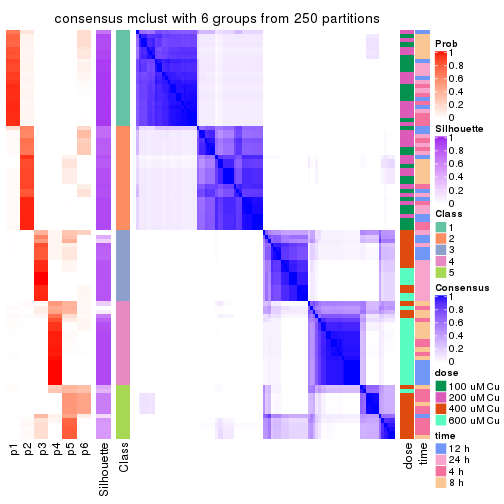</p>

</div>
</div>

Heatmaps for the membership of samples in all partitions to see how consistent they are:


<script>
$( function() {
	$( '#tabs-CV-mclust-membership-heatmap' ).tabs();
} );
</script>
<div id='tabs-CV-mclust-membership-heatmap'>
<ul>
<li><a href='#tab-CV-mclust-membership-heatmap-1'>k = 2</a></li>
<li><a href='#tab-CV-mclust-membership-heatmap-2'>k = 3</a></li>
<li><a href='#tab-CV-mclust-membership-heatmap-3'>k = 4</a></li>
<li><a href='#tab-CV-mclust-membership-heatmap-4'>k = 5</a></li>
<li><a href='#tab-CV-mclust-membership-heatmap-5'>k = 6</a></li>
</ul>
<div id='tab-CV-mclust-membership-heatmap-1'>
<pre><code class="r">membership_heatmap(res, k = 2)
</code></pre>

<p></p>

</div>
<div id='tab-CV-mclust-membership-heatmap-2'>
<pre><code class="r">membership_heatmap(res, k = 3)
</code></pre>

<p></p>

</div>
<div id='tab-CV-mclust-membership-heatmap-3'>
<pre><code class="r">membership_heatmap(res, k = 4)
</code></pre>

<p>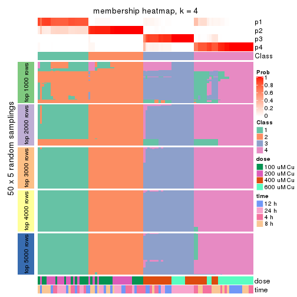</p>

</div>
<div id='tab-CV-mclust-membership-heatmap-4'>
<pre><code class="r">membership_heatmap(res, k = 5)
</code></pre>

<p></p>

</div>
<div id='tab-CV-mclust-membership-heatmap-5'>
<pre><code class="r">membership_heatmap(res, k = 6)
</code></pre>

<p></p>

</div>
</div>

As soon as we have had the classes for columns, we can look for signatures
which are significantly different between classes which can be candidate marks
for certain classes. Following are the heatmaps for signatures.


Signature heatmaps where rows are scaled:


<script>
$( function() {
	$( '#tabs-CV-mclust-get-signatures' ).tabs();
} );
</script>
<div id='tabs-CV-mclust-get-signatures'>
<ul>
<li><a href='#tab-CV-mclust-get-signatures-1'>k = 2</a></li>
<li><a href='#tab-CV-mclust-get-signatures-2'>k = 3</a></li>
<li><a href='#tab-CV-mclust-get-signatures-3'>k = 4</a></li>
<li><a href='#tab-CV-mclust-get-signatures-4'>k = 5</a></li>
<li><a href='#tab-CV-mclust-get-signatures-5'>k = 6</a></li>
</ul>
<div id='tab-CV-mclust-get-signatures-1'>
<pre><code class="r">get_signatures(res, k = 2)
</code></pre>

<p></p>

</div>
<div id='tab-CV-mclust-get-signatures-2'>
<pre><code class="r">get_signatures(res, k = 3)
</code></pre>

<p></p>

</div>
<div id='tab-CV-mclust-get-signatures-3'>
<pre><code class="r">get_signatures(res, k = 4)
</code></pre>

<p></p>

</div>
<div id='tab-CV-mclust-get-signatures-4'>
<pre><code class="r">get_signatures(res, k = 5)
</code></pre>

<p></p>

</div>
<div id='tab-CV-mclust-get-signatures-5'>
<pre><code class="r">get_signatures(res, k = 6)
</code></pre>

<p></p>

</div>
</div>


Signature heatmaps where rows are not scaled:


<script>
$( function() {
	$( '#tabs-CV-mclust-get-signatures-no-scale' ).tabs();
} );
</script>
<div id='tabs-CV-mclust-get-signatures-no-scale'>
<ul>
<li><a href='#tab-CV-mclust-get-signatures-no-scale-1'>k = 2</a></li>
<li><a href='#tab-CV-mclust-get-signatures-no-scale-2'>k = 3</a></li>
<li><a href='#tab-CV-mclust-get-signatures-no-scale-3'>k = 4</a></li>
<li><a href='#tab-CV-mclust-get-signatures-no-scale-4'>k = 5</a></li>
<li><a href='#tab-CV-mclust-get-signatures-no-scale-5'>k = 6</a></li>
</ul>
<div id='tab-CV-mclust-get-signatures-no-scale-1'>
<pre><code class="r">get_signatures(res, k = 2, scale_rows = FALSE)
</code></pre>

<p></p>

</div>
<div id='tab-CV-mclust-get-signatures-no-scale-2'>
<pre><code class="r">get_signatures(res, k = 3, scale_rows = FALSE)
</code></pre>

<p></p>

</div>
<div id='tab-CV-mclust-get-signatures-no-scale-3'>
<pre><code class="r">get_signatures(res, k = 4, scale_rows = FALSE)
</code></pre>

<p></p>

</div>
<div id='tab-CV-mclust-get-signatures-no-scale-4'>
<pre><code class="r">get_signatures(res, k = 5, scale_rows = FALSE)
</code></pre>

<p></p>

</div>
<div id='tab-CV-mclust-get-signatures-no-scale-5'>
<pre><code class="r">get_signatures(res, k = 6, scale_rows = FALSE)
</code></pre>

<p></p>

</div>
</div>


Compare the overlap of signatures from different k:

```r
compare_signatures(res)
```


`get_signature()` returns a data frame invisibly. TO get the list of signatures, the function
call should be assigned to a variable explicitly. In following code, if `plot` argument is set
to `FALSE`, no heatmap is plotted while only the differential analysis is performed.

```r
# code only for demonstration
tb = get_signature(res, k = ..., plot = FALSE)
```

An example of the output of `tb` is:

```
#>   which_row         fdr    mean_1    mean_2 scaled_mean_1 scaled_mean_2 km
#> 1        38 0.042760348  8.373488  9.131774    -0.5533452     0.5164555  1
#> 2        40 0.018707592  7.106213  8.469186    -0.6173731     0.5762149  1
#> 3        55 0.019134737 10.221463 11.207825    -0.6159697     0.5749050  1
#> 4        59 0.006059896  5.921854  7.869574    -0.6899429     0.6439467  1
#> 5        60 0.018055526  8.928898 10.211722    -0.6204761     0.5791110  1
#> 6        98 0.009384629 15.714769 14.887706     0.6635654    -0.6193277  2
...
```

The columns in `tb` are:

1. `which_row`: row indices corresponding to the input matrix.
2. `fdr`: FDR for the differential test. 
3. `mean_x`: The mean value in group x.
4. `scaled_mean_x`: The mean value in group x after rows are scaled.
5. `km`: Row groups if k-means clustering is applied to rows.


UMAP plot which shows how samples are separated.


<script>
$( function() {
	$( '#tabs-CV-mclust-dimension-reduction' ).tabs();
} );
</script>
<div id='tabs-CV-mclust-dimension-reduction'>
<ul>
<li><a href='#tab-CV-mclust-dimension-reduction-1'>k = 2</a></li>
<li><a href='#tab-CV-mclust-dimension-reduction-2'>k = 3</a></li>
<li><a href='#tab-CV-mclust-dimension-reduction-3'>k = 4</a></li>
<li><a href='#tab-CV-mclust-dimension-reduction-4'>k = 5</a></li>
<li><a href='#tab-CV-mclust-dimension-reduction-5'>k = 6</a></li>
</ul>
<div id='tab-CV-mclust-dimension-reduction-1'>
<pre><code class="r">dimension_reduction(res, k = 2, method = &quot;UMAP&quot;)
</code></pre>

<p></p>

</div>
<div id='tab-CV-mclust-dimension-reduction-2'>
<pre><code class="r">dimension_reduction(res, k = 3, method = &quot;UMAP&quot;)
</code></pre>

<p></p>

</div>
<div id='tab-CV-mclust-dimension-reduction-3'>
<pre><code class="r">dimension_reduction(res, k = 4, method = &quot;UMAP&quot;)
</code></pre>

<p></p>

</div>
<div id='tab-CV-mclust-dimension-reduction-4'>
<pre><code class="r">dimension_reduction(res, k = 5, method = &quot;UMAP&quot;)
</code></pre>

<p></p>

</div>
<div id='tab-CV-mclust-dimension-reduction-5'>
<pre><code class="r">dimension_reduction(res, k = 6, method = &quot;UMAP&quot;)
</code></pre>

<p></p>

</div>
</div>


Following heatmap shows how subgroups are split when increasing `k`:

```r
collect_classes(res)
```


Test correlation between subgroups and known annotations. If the known
annotation is numeric, one-way ANOVA test is applied, and if the known
annotation is discrete, chi-squared contingency table test is applied.

```r
test_to_known_factors(res)
```

```
#>            n  dose(p)  time(p) k
#> CV:mclust 98 4.18e-21 9.90e-01 2
#> CV:mclust 95 2.54e-18 1.00e+00 3
#> CV:mclust 97 5.56e-20 4.34e-03 4
#> CV:mclust 94 9.28e-24 1.65e-05 5
#> CV:mclust 88 2.09e-23 1.96e-05 6
```


If matrix rows can be associated to genes, consider to use `GO_Enrichment(res,
...)` to perform function enrichment for the signature genes.


 

---------------------------------------------------


### CV:NMF


The object with results only for a single top-value method and a single partition method 
can be extracted as:

```r
res = res_list["CV", "NMF"]
# you can also extract it by
# res = res_list["CV:NMF"]
```

A summary of `res` and all the functions that can be applied to it:

```r
res
```

```
#> A 'ConsensusPartition' object with k = 2, 3, 4, 5, 6.
#>   On a matrix with 16250 rows and 98 columns.
#>   Top rows (1000, 2000, 3000, 4000, 5000) are extracted by 'CV' method.
#>   Subgroups are detected by 'NMF' method.
#>   Performed in total 1250 partitions by row resampling.
#>   Best k for subgroups seems to be 4.
#> 
#> Following methods can be applied to this 'ConsensusPartition' object:
#>  [1] "cola_report"             "collect_classes"         "collect_plots"          
#>  [4] "collect_stats"           "colnames"                "compare_signatures"     
#>  [7] "consensus_heatmap"       "dimension_reduction"     "functional_enrichment"  
#> [10] "get_anno_col"            "get_anno"                "get_classes"            
#> [13] "get_consensus"           "get_matrix"              "get_membership"         
#> [16] "get_param"               "get_signatures"          "get_stats"              
#> [19] "is_best_k"               "is_stable_k"             "membership_heatmap"     
#> [22] "ncol"                    "nrow"                    "plot_ecdf"              
#> [25] "rownames"                "select_partition_number" "show"                   
#> [28] "suggest_best_k"          "test_to_known_factors"
```

`collect_plots()` function collects all the plots made from `res` for all `k` (number of partitions)
into one single page to provide an easy and fast comparison between different `k`.

```r
collect_plots(res)
```


The plots are:

- The first row: a plot of the ECDF (Empirical cumulative distribution
  function) curves of the consensus matrix for each `k` and the heatmap of
  predicted classes for each `k`.
- The second row: heatmaps of the consensus matrix for each `k`.
- The third row: heatmaps of the membership matrix for each `k`.
- The fouth row: heatmaps of the signatures for each `k`.

All the plots in panels can be made by individual functions and they are
plotted later in this section.

`select_partition_number()` produces several plots showing different
statistics for choosing "optimized" `k`. There are following statistics:

- ECDF curves of the consensus matrix for each `k`;
- 1-PAC. [The PAC
  score](https://en.wikipedia.org/wiki/Consensus_clustering#Over-interpretation_potential_of_consensus_clustering)
  measures the proportion of the ambiguous subgrouping.
- Mean silhouette score.
- Concordance. The mean probability of fiting the consensus class ids in all
  partitions.
- Area increased. Denote $A_k$ as the area under the ECDF curve for current
  `k`, the area increased is defined as $A_k - A_{k-1}$.
- Rand index. The percent of pairs of samples that are both in a same cluster
  or both are not in a same cluster in the partition of k and k-1.
- Jaccard index. The ratio of pairs of samples are both in a same cluster in
  the partition of k and k-1 and the pairs of samples are both in a same
  cluster in the partition k or k-1.

The detailed explanations of these statistics can be found in [the cola
vignette](http://bioconductor.org/packages/devel/bioc/vignettes/cola/inst/doc/cola.html#toc_13).

Generally speaking, lower PAC score, higher mean silhouette score or higher
concordance corresponds to better partition. Rand index and Jaccard index
measure how similar the current partition is compared to partition with `k-1`.
If they are too similar, we won't accept `k` is better than `k-1`.

```r
select_partition_number(res)
```


The numeric values for all these statistics can be obtained by `get_stats()`.

```r
get_stats(res)
```

```
#>   k 1-PAC mean_silhouette concordance area_increased  Rand Jaccard
#> 2 2 0.607           0.883       0.937         0.4779 0.520   0.520
#> 3 3 0.537           0.632       0.786         0.3068 0.854   0.728
#> 4 4 0.837           0.876       0.938         0.1957 0.791   0.521
#> 5 5 0.734           0.735       0.855         0.0540 0.951   0.817
#> 6 6 0.697           0.612       0.766         0.0364 0.975   0.894
```

`suggest_best_k()` suggests the best $k$ based on these statistics. The rules are as follows:

- All $k$ with Jaccard index larger than 0.95 are removed because the increase of
  the partition number does not provides enough extra information. If all $k$ are removed,
  the best $k$ is assigned by `NA`.
- For $k$ with 1-PAC larger than 0.9, the maximal $k$ is taken as the "best k". Other $k$ is called "optional k".
- If it does not fit the second rule. The $k$ with the highest vote of highest
  1-PAC, mean silhouette and concordance is taken as the "best k".

```r
suggest_best_k(res)
```

```
#> [1] 4
```


Following shows the table of the partitions (You need to click the **show/hide
code output** link to see it). The membership matrix (columns with name `p*`)
is inferred by
[`clue::cl_consensus()`](https://www.rdocumentation.org/link/cl_consensus?package=clue)
function with the `SE` method. Basically the value in the membership matrix
represents the probability to belong to a certain group. The finall class
label for an item is determined with the group with highest probability it
belongs to.

In `get_classes()` function, the entropy is calculated from the membership
matrix and the silhouette score is calculated from the consensus matrix.


<script>
$( function() {
	$( '#tabs-CV-NMF-get-classes' ).tabs();
} );
</script>
<div id='tabs-CV-NMF-get-classes'>
<ul>
<li><a href='#tab-CV-NMF-get-classes-1'>k = 2</a></li>
<li><a href='#tab-CV-NMF-get-classes-2'>k = 3</a></li>
<li><a href='#tab-CV-NMF-get-classes-3'>k = 4</a></li>
<li><a href='#tab-CV-NMF-get-classes-4'>k = 5</a></li>
<li><a href='#tab-CV-NMF-get-classes-5'>k = 6</a></li>
</ul>

<div id='tab-CV-NMF-get-classes-1'>
<p><a id='tab-CV-NMF-get-classes-1-a' style='color:#0366d6' href='#'>show/hide code output</a></p>
<pre><code class="r">cbind(get_classes(res, k = 2), get_membership(res, k = 2))
</code></pre>

<pre><code>#&gt;           class entropy silhouette    p1    p2
#&gt; GSM241451     1  0.0000      0.944 1.000 0.000
#&gt; GSM241452     1  0.0000      0.944 1.000 0.000
#&gt; GSM241453     1  0.0000      0.944 1.000 0.000
#&gt; GSM241454     1  0.0000      0.944 1.000 0.000
#&gt; GSM241455     1  0.0000      0.944 1.000 0.000
#&gt; GSM241456     1  0.0000      0.944 1.000 0.000
#&gt; GSM241457     1  0.7219      0.777 0.800 0.200
#&gt; GSM241458     1  0.5629      0.846 0.868 0.132
#&gt; GSM241459     1  0.7219      0.777 0.800 0.200
#&gt; GSM241460     1  0.7219      0.777 0.800 0.200
#&gt; GSM241461     1  0.6343      0.820 0.840 0.160
#&gt; GSM241462     1  0.0000      0.944 1.000 0.000
#&gt; GSM241463     1  0.0000      0.944 1.000 0.000
#&gt; GSM241464     1  0.0000      0.944 1.000 0.000
#&gt; GSM241465     1  0.0672      0.940 0.992 0.008
#&gt; GSM241466     1  0.0000      0.944 1.000 0.000
#&gt; GSM241467     1  0.0000      0.944 1.000 0.000
#&gt; GSM241468     1  0.0000      0.944 1.000 0.000
#&gt; GSM241469     1  0.0000      0.944 1.000 0.000
#&gt; GSM241470     1  0.0000      0.944 1.000 0.000
#&gt; GSM241471     1  0.0376      0.943 0.996 0.004
#&gt; GSM241472     1  0.0000      0.944 1.000 0.000
#&gt; GSM241473     1  0.0376      0.943 0.996 0.004
#&gt; GSM241474     1  0.0000      0.944 1.000 0.000
#&gt; GSM241475     1  0.0000      0.944 1.000 0.000
#&gt; GSM241476     1  0.0000      0.944 1.000 0.000
#&gt; GSM241477     1  0.0000      0.944 1.000 0.000
#&gt; GSM241478     1  0.0000      0.944 1.000 0.000
#&gt; GSM241479     1  0.0000      0.944 1.000 0.000
#&gt; GSM241480     1  0.0000      0.944 1.000 0.000
#&gt; GSM241481     1  0.6148      0.828 0.848 0.152
#&gt; GSM241482     1  0.0376      0.942 0.996 0.004
#&gt; GSM241483     1  0.0376      0.943 0.996 0.004
#&gt; GSM241484     1  0.0000      0.944 1.000 0.000
#&gt; GSM241485     1  0.0000      0.944 1.000 0.000
#&gt; GSM241486     1  0.0376      0.943 0.996 0.004
#&gt; GSM241487     1  0.0376      0.943 0.996 0.004
#&gt; GSM241488     1  0.0000      0.944 1.000 0.000
#&gt; GSM241489     1  0.0000      0.944 1.000 0.000
#&gt; GSM241490     1  0.0000      0.944 1.000 0.000
#&gt; GSM241491     1  0.0000      0.944 1.000 0.000
#&gt; GSM241492     1  0.0000      0.944 1.000 0.000
#&gt; GSM241493     1  0.0000      0.944 1.000 0.000
#&gt; GSM241494     1  0.0000      0.944 1.000 0.000
#&gt; GSM241495     1  0.0000      0.944 1.000 0.000
#&gt; GSM241496     1  0.0000      0.944 1.000 0.000
#&gt; GSM241497     1  0.0000      0.944 1.000 0.000
#&gt; GSM241498     1  0.0000      0.944 1.000 0.000
#&gt; GSM241499     1  0.0000      0.944 1.000 0.000
#&gt; GSM241500     1  0.8955      0.633 0.688 0.312
#&gt; GSM241501     1  0.2603      0.917 0.956 0.044
#&gt; GSM241502     1  0.3431      0.892 0.936 0.064
#&gt; GSM241503     1  0.0376      0.942 0.996 0.004
#&gt; GSM241504     1  0.6438      0.818 0.836 0.164
#&gt; GSM241505     1  0.5519      0.857 0.872 0.128
#&gt; GSM241506     1  0.9522      0.517 0.628 0.372
#&gt; GSM241507     1  0.7219      0.777 0.800 0.200
#&gt; GSM241508     1  0.7219      0.777 0.800 0.200
#&gt; GSM241509     2  0.6148      0.850 0.152 0.848
#&gt; GSM241510     2  0.0000      0.904 0.000 1.000
#&gt; GSM241511     2  0.9795      0.159 0.416 0.584
#&gt; GSM241512     2  0.7219      0.826 0.200 0.800
#&gt; GSM241513     2  0.0000      0.904 0.000 1.000
#&gt; GSM241514     2  0.7219      0.826 0.200 0.800
#&gt; GSM241515     2  0.0000      0.904 0.000 1.000
#&gt; GSM241516     2  0.0000      0.904 0.000 1.000
#&gt; GSM241517     2  0.2236      0.884 0.036 0.964
#&gt; GSM241518     2  0.6148      0.850 0.152 0.848
#&gt; GSM241519     2  0.7219      0.826 0.200 0.800
#&gt; GSM241520     2  0.7219      0.826 0.200 0.800
#&gt; GSM241521     1  0.7219      0.715 0.800 0.200
#&gt; GSM241522     1  0.7219      0.715 0.800 0.200
#&gt; GSM241523     2  0.7219      0.826 0.200 0.800
#&gt; GSM241524     2  0.7219      0.826 0.200 0.800
#&gt; GSM241525     2  0.1184      0.896 0.016 0.984
#&gt; GSM241526     2  0.0000      0.904 0.000 1.000
#&gt; GSM241527     2  0.0000      0.904 0.000 1.000
#&gt; GSM241528     2  0.0000      0.904 0.000 1.000
#&gt; GSM241529     2  0.0000      0.904 0.000 1.000
#&gt; GSM241530     2  0.0000      0.904 0.000 1.000
#&gt; GSM241531     2  0.0000      0.904 0.000 1.000
#&gt; GSM241532     2  0.0000      0.904 0.000 1.000
#&gt; GSM241533     2  0.0000      0.904 0.000 1.000
#&gt; GSM241534     2  0.0000      0.904 0.000 1.000
#&gt; GSM241535     2  0.0000      0.904 0.000 1.000
#&gt; GSM241536     2  0.0000      0.904 0.000 1.000
#&gt; GSM241537     2  0.0000      0.904 0.000 1.000
#&gt; GSM241538     2  0.0000      0.904 0.000 1.000
#&gt; GSM241539     2  0.0000      0.904 0.000 1.000
#&gt; GSM241540     2  0.0000      0.904 0.000 1.000
#&gt; GSM241541     2  0.0000      0.904 0.000 1.000
#&gt; GSM241542     2  0.0000      0.904 0.000 1.000
#&gt; GSM241543     2  0.7219      0.826 0.200 0.800
#&gt; GSM241544     2  0.7219      0.826 0.200 0.800
#&gt; GSM241545     2  0.7219      0.826 0.200 0.800
#&gt; GSM241546     2  0.7219      0.826 0.200 0.800
#&gt; GSM241547     2  0.7219      0.826 0.200 0.800
#&gt; GSM241548     2  0.7219      0.826 0.200 0.800
</code></pre>

<script>
$('#tab-CV-NMF-get-classes-1-a').parent().next().next().hide();
$('#tab-CV-NMF-get-classes-1-a').click(function(){
  $('#tab-CV-NMF-get-classes-1-a').parent().next().next().toggle();
  return(false);
});
</script>
</div>

<div id='tab-CV-NMF-get-classes-2'>
<p><a id='tab-CV-NMF-get-classes-2-a' style='color:#0366d6' href='#'>show/hide code output</a></p>
<pre><code class="r">cbind(get_classes(res, k = 3), get_membership(res, k = 3))
</code></pre>

<pre><code>#&gt;           class entropy silhouette    p1    p2    p3
#&gt; GSM241451     1  0.6235     0.6348 0.564 0.436 0.000
#&gt; GSM241452     1  0.0237     0.6841 0.996 0.004 0.000
#&gt; GSM241453     1  0.6244     0.6355 0.560 0.440 0.000
#&gt; GSM241454     1  0.0000     0.6834 1.000 0.000 0.000
#&gt; GSM241455     1  0.6225     0.6413 0.568 0.432 0.000
#&gt; GSM241456     1  0.0237     0.6841 0.996 0.004 0.000
#&gt; GSM241457     1  0.6451     0.6415 0.560 0.436 0.004
#&gt; GSM241458     1  0.2749     0.6663 0.924 0.012 0.064
#&gt; GSM241459     1  0.6398     0.6487 0.580 0.416 0.004
#&gt; GSM241460     1  0.5470     0.6153 0.796 0.036 0.168
#&gt; GSM241461     1  0.6476     0.6341 0.548 0.448 0.004
#&gt; GSM241462     1  0.0661     0.6832 0.988 0.004 0.008
#&gt; GSM241463     1  0.6260     0.6375 0.552 0.448 0.000
#&gt; GSM241464     1  0.3116     0.6850 0.892 0.108 0.000
#&gt; GSM241465     1  0.6267     0.6347 0.548 0.452 0.000
#&gt; GSM241466     1  0.0237     0.6846 0.996 0.004 0.000
#&gt; GSM241467     1  0.0237     0.6846 0.996 0.004 0.000
#&gt; GSM241468     1  0.6111     0.6542 0.604 0.396 0.000
#&gt; GSM241469     1  0.0237     0.6841 0.996 0.004 0.000
#&gt; GSM241470     1  0.6235     0.6348 0.564 0.436 0.000
#&gt; GSM241471     1  0.6244     0.6424 0.560 0.440 0.000
#&gt; GSM241472     1  0.0424     0.6857 0.992 0.008 0.000
#&gt; GSM241473     1  0.6244     0.6424 0.560 0.440 0.000
#&gt; GSM241474     1  0.1411     0.6880 0.964 0.036 0.000
#&gt; GSM241475     1  0.6192     0.6455 0.580 0.420 0.000
#&gt; GSM241476     1  0.0000     0.6834 1.000 0.000 0.000
#&gt; GSM241477     1  0.6252     0.6394 0.556 0.444 0.000
#&gt; GSM241478     1  0.6180     0.6392 0.584 0.416 0.000
#&gt; GSM241479     1  0.0000     0.6834 1.000 0.000 0.000
#&gt; GSM241480     1  0.0000     0.6834 1.000 0.000 0.000
#&gt; GSM241481     1  0.6244     0.6424 0.560 0.440 0.000
#&gt; GSM241482     1  0.1267     0.6777 0.972 0.004 0.024
#&gt; GSM241483     1  0.6260     0.6375 0.552 0.448 0.000
#&gt; GSM241484     1  0.1031     0.6763 0.976 0.000 0.024
#&gt; GSM241485     1  0.0000     0.6834 1.000 0.000 0.000
#&gt; GSM241486     1  0.6280     0.6280 0.540 0.460 0.000
#&gt; GSM241487     1  0.6286     0.6239 0.536 0.464 0.000
#&gt; GSM241488     1  0.6215     0.6384 0.572 0.428 0.000
#&gt; GSM241489     1  0.0237     0.6841 0.996 0.004 0.000
#&gt; GSM241490     1  0.0000     0.6834 1.000 0.000 0.000
#&gt; GSM241491     1  0.6267     0.6347 0.548 0.452 0.000
#&gt; GSM241492     1  0.1753     0.6878 0.952 0.048 0.000
#&gt; GSM241493     1  0.6204     0.6434 0.576 0.424 0.000
#&gt; GSM241494     1  0.0000     0.6834 1.000 0.000 0.000
#&gt; GSM241495     1  0.6252     0.6300 0.556 0.444 0.000
#&gt; GSM241496     2  0.6267    -0.3780 0.452 0.548 0.000
#&gt; GSM241497     1  0.1289     0.6618 0.968 0.032 0.000
#&gt; GSM241498     1  0.0237     0.6841 0.996 0.004 0.000
#&gt; GSM241499     1  0.1031     0.6763 0.976 0.000 0.024
#&gt; GSM241500     2  0.9544    -0.3972 0.364 0.440 0.196
#&gt; GSM241501     1  0.6274     0.6314 0.544 0.456 0.000
#&gt; GSM241502     1  0.8363     0.5661 0.504 0.412 0.084
#&gt; GSM241503     1  0.0424     0.6816 0.992 0.000 0.008
#&gt; GSM241504     1  0.5560     0.3965 0.700 0.000 0.300
#&gt; GSM241505     1  0.5291     0.3755 0.732 0.000 0.268
#&gt; GSM241506     3  0.9690    -0.0706 0.324 0.232 0.444
#&gt; GSM241507     1  0.5623     0.4810 0.716 0.004 0.280
#&gt; GSM241508     1  0.9959     0.3007 0.376 0.324 0.300
#&gt; GSM241509     3  0.4555     0.6101 0.000 0.200 0.800
#&gt; GSM241510     3  0.3551     0.7444 0.000 0.132 0.868
#&gt; GSM241511     3  0.4702     0.6335 0.212 0.000 0.788
#&gt; GSM241512     3  0.4399     0.6352 0.188 0.000 0.812
#&gt; GSM241513     2  0.5138     0.5698 0.000 0.748 0.252
#&gt; GSM241514     2  0.9258     0.5315 0.204 0.524 0.272
#&gt; GSM241515     3  0.6192     0.1238 0.000 0.420 0.580
#&gt; GSM241516     3  0.4521     0.6591 0.004 0.180 0.816
#&gt; GSM241517     2  0.2066     0.5725 0.000 0.940 0.060
#&gt; GSM241518     2  0.7034     0.5715 0.048 0.668 0.284
#&gt; GSM241519     2  0.2297     0.5961 0.020 0.944 0.036
#&gt; GSM241520     2  0.8728     0.5932 0.200 0.592 0.208
#&gt; GSM241521     2  0.1170     0.5812 0.008 0.976 0.016
#&gt; GSM241522     2  0.6305     0.3917 0.484 0.516 0.000
#&gt; GSM241523     2  0.3590     0.6128 0.028 0.896 0.076
#&gt; GSM241524     2  0.8749     0.5404 0.300 0.560 0.140
#&gt; GSM241525     3  0.4750     0.6297 0.216 0.000 0.784
#&gt; GSM241526     3  0.0000     0.8608 0.000 0.000 1.000
#&gt; GSM241527     3  0.0000     0.8608 0.000 0.000 1.000
#&gt; GSM241528     3  0.2448     0.8038 0.000 0.076 0.924
#&gt; GSM241529     3  0.0000     0.8608 0.000 0.000 1.000
#&gt; GSM241530     3  0.1411     0.8381 0.036 0.000 0.964
#&gt; GSM241531     3  0.0000     0.8608 0.000 0.000 1.000
#&gt; GSM241532     3  0.1031     0.8522 0.000 0.024 0.976
#&gt; GSM241533     3  0.0237     0.8605 0.000 0.004 0.996
#&gt; GSM241534     3  0.0592     0.8580 0.000 0.012 0.988
#&gt; GSM241535     3  0.0000     0.8608 0.000 0.000 1.000
#&gt; GSM241536     3  0.0237     0.8590 0.004 0.000 0.996
#&gt; GSM241537     3  0.0424     0.8599 0.000 0.008 0.992
#&gt; GSM241538     3  0.0000     0.8608 0.000 0.000 1.000
#&gt; GSM241539     3  0.0424     0.8599 0.000 0.008 0.992
#&gt; GSM241540     3  0.0000     0.8608 0.000 0.000 1.000
#&gt; GSM241541     3  0.1031     0.8505 0.000 0.024 0.976
#&gt; GSM241542     3  0.0424     0.8599 0.000 0.008 0.992
#&gt; GSM241543     2  0.7145     0.6268 0.072 0.692 0.236
#&gt; GSM241544     2  0.8987     0.5640 0.192 0.560 0.248
#&gt; GSM241545     2  0.6025     0.6202 0.028 0.740 0.232
#&gt; GSM241546     2  0.9125     0.5457 0.192 0.540 0.268
#&gt; GSM241547     2  0.4931     0.6046 0.000 0.768 0.232
#&gt; GSM241548     2  0.7295     0.6140 0.072 0.676 0.252
</code></pre>

<script>
$('#tab-CV-NMF-get-classes-2-a').parent().next().next().hide();
$('#tab-CV-NMF-get-classes-2-a').click(function(){
  $('#tab-CV-NMF-get-classes-2-a').parent().next().next().toggle();
  return(false);
});
</script>
</div>

<div id='tab-CV-NMF-get-classes-3'>
<p><a id='tab-CV-NMF-get-classes-3-a' style='color:#0366d6' href='#'>show/hide code output</a></p>
<pre><code class="r">cbind(get_classes(res, k = 4), get_membership(res, k = 4))
</code></pre>

<pre><code>#&gt;           class entropy silhouette    p1    p2    p3    p4
#&gt; GSM241451     2  0.1022      0.931 0.032 0.968 0.000 0.000
#&gt; GSM241452     1  0.0524      0.907 0.988 0.004 0.008 0.000
#&gt; GSM241453     2  0.0000      0.944 0.000 1.000 0.000 0.000
#&gt; GSM241454     1  0.0000      0.908 1.000 0.000 0.000 0.000
#&gt; GSM241455     2  0.0188      0.943 0.004 0.996 0.000 0.000
#&gt; GSM241456     1  0.0469      0.907 0.988 0.012 0.000 0.000
#&gt; GSM241457     2  0.0000      0.944 0.000 1.000 0.000 0.000
#&gt; GSM241458     1  0.4731      0.804 0.800 0.100 0.004 0.096
#&gt; GSM241459     2  0.0000      0.944 0.000 1.000 0.000 0.000
#&gt; GSM241460     1  0.6686      0.612 0.620 0.200 0.000 0.180
#&gt; GSM241461     2  0.0000      0.944 0.000 1.000 0.000 0.000
#&gt; GSM241462     1  0.0336      0.907 0.992 0.000 0.008 0.000
#&gt; GSM241463     2  0.2760      0.842 0.000 0.872 0.128 0.000
#&gt; GSM241464     1  0.7448      0.196 0.452 0.372 0.176 0.000
#&gt; GSM241465     2  0.0000      0.944 0.000 1.000 0.000 0.000
#&gt; GSM241466     1  0.0469      0.906 0.988 0.012 0.000 0.000
#&gt; GSM241467     1  0.1211      0.893 0.960 0.040 0.000 0.000
#&gt; GSM241468     2  0.0592      0.938 0.016 0.984 0.000 0.000
#&gt; GSM241469     1  0.0376      0.908 0.992 0.004 0.004 0.000
#&gt; GSM241470     2  0.0779      0.939 0.016 0.980 0.004 0.000
#&gt; GSM241471     2  0.0000      0.944 0.000 1.000 0.000 0.000
#&gt; GSM241472     1  0.2216      0.856 0.908 0.092 0.000 0.000
#&gt; GSM241473     2  0.0188      0.943 0.004 0.996 0.000 0.000
#&gt; GSM241474     1  0.3610      0.748 0.800 0.200 0.000 0.000
#&gt; GSM241475     2  0.0336      0.942 0.008 0.992 0.000 0.000
#&gt; GSM241476     1  0.0000      0.908 1.000 0.000 0.000 0.000
#&gt; GSM241477     2  0.0000      0.944 0.000 1.000 0.000 0.000
#&gt; GSM241478     2  0.1118      0.928 0.036 0.964 0.000 0.000
#&gt; GSM241479     1  0.0188      0.908 0.996 0.000 0.004 0.000
#&gt; GSM241480     1  0.0000      0.908 1.000 0.000 0.000 0.000
#&gt; GSM241481     2  0.0000      0.944 0.000 1.000 0.000 0.000
#&gt; GSM241482     1  0.1610      0.896 0.952 0.032 0.000 0.016
#&gt; GSM241483     2  0.0000      0.944 0.000 1.000 0.000 0.000
#&gt; GSM241484     1  0.0336      0.906 0.992 0.000 0.000 0.008
#&gt; GSM241485     1  0.0000      0.908 1.000 0.000 0.000 0.000
#&gt; GSM241486     2  0.0000      0.944 0.000 1.000 0.000 0.000
#&gt; GSM241487     2  0.0000      0.944 0.000 1.000 0.000 0.000
#&gt; GSM241488     2  0.3842      0.824 0.036 0.836 0.128 0.000
#&gt; GSM241489     1  0.0336      0.907 0.992 0.000 0.008 0.000
#&gt; GSM241490     1  0.0188      0.908 0.996 0.000 0.004 0.000
#&gt; GSM241491     2  0.3311      0.792 0.000 0.828 0.172 0.000
#&gt; GSM241492     1  0.7058      0.502 0.572 0.228 0.200 0.000
#&gt; GSM241493     2  0.0707      0.938 0.020 0.980 0.000 0.000
#&gt; GSM241494     1  0.0188      0.908 0.996 0.000 0.004 0.000
#&gt; GSM241495     2  0.0336      0.942 0.008 0.992 0.000 0.000
#&gt; GSM241496     2  0.4444      0.799 0.120 0.808 0.072 0.000
#&gt; GSM241497     1  0.0469      0.906 0.988 0.000 0.012 0.000
#&gt; GSM241498     1  0.0188      0.908 0.996 0.000 0.004 0.000
#&gt; GSM241499     1  0.0336      0.906 0.992 0.000 0.000 0.008
#&gt; GSM241500     2  0.0921      0.927 0.000 0.972 0.000 0.028
#&gt; GSM241501     2  0.0000      0.944 0.000 1.000 0.000 0.000
#&gt; GSM241502     2  0.2593      0.852 0.004 0.892 0.000 0.104
#&gt; GSM241503     1  0.0188      0.908 0.996 0.000 0.004 0.000
#&gt; GSM241504     1  0.2011      0.867 0.920 0.000 0.000 0.080
#&gt; GSM241505     1  0.1302      0.890 0.956 0.000 0.000 0.044
#&gt; GSM241506     4  0.5212      0.319 0.008 0.420 0.000 0.572
#&gt; GSM241507     1  0.3831      0.745 0.792 0.004 0.000 0.204
#&gt; GSM241508     2  0.2469      0.863 0.000 0.892 0.000 0.108
#&gt; GSM241509     4  0.3610      0.766 0.000 0.200 0.000 0.800
#&gt; GSM241510     4  0.1022      0.913 0.000 0.032 0.000 0.968
#&gt; GSM241511     4  0.0592      0.918 0.016 0.000 0.000 0.984
#&gt; GSM241512     4  0.3649      0.746 0.204 0.000 0.000 0.796
#&gt; GSM241513     3  0.0524      0.974 0.000 0.004 0.988 0.008
#&gt; GSM241514     3  0.0188      0.975 0.000 0.000 0.996 0.004
#&gt; GSM241515     3  0.1474      0.940 0.000 0.000 0.948 0.052
#&gt; GSM241516     3  0.3681      0.781 0.008 0.000 0.816 0.176
#&gt; GSM241517     2  0.4992      0.153 0.000 0.524 0.476 0.000
#&gt; GSM241518     3  0.0336      0.974 0.000 0.000 0.992 0.008
#&gt; GSM241519     3  0.0592      0.968 0.000 0.016 0.984 0.000
#&gt; GSM241520     3  0.0188      0.973 0.004 0.000 0.996 0.000
#&gt; GSM241521     3  0.0707      0.965 0.000 0.020 0.980 0.000
#&gt; GSM241522     1  0.4500      0.546 0.684 0.000 0.316 0.000
#&gt; GSM241523     3  0.0188      0.974 0.000 0.004 0.996 0.000
#&gt; GSM241524     3  0.1302      0.937 0.044 0.000 0.956 0.000
#&gt; GSM241525     4  0.1940      0.870 0.076 0.000 0.000 0.924
#&gt; GSM241526     4  0.0000      0.926 0.000 0.000 0.000 1.000
#&gt; GSM241527     4  0.0000      0.926 0.000 0.000 0.000 1.000
#&gt; GSM241528     4  0.2281      0.865 0.000 0.096 0.000 0.904
#&gt; GSM241529     4  0.0000      0.926 0.000 0.000 0.000 1.000
#&gt; GSM241530     4  0.0000      0.926 0.000 0.000 0.000 1.000
#&gt; GSM241531     4  0.0188      0.925 0.004 0.000 0.000 0.996
#&gt; GSM241532     4  0.0469      0.922 0.000 0.012 0.000 0.988
#&gt; GSM241533     4  0.0000      0.926 0.000 0.000 0.000 1.000
#&gt; GSM241534     4  0.0707      0.919 0.000 0.020 0.000 0.980
#&gt; GSM241535     4  0.0000      0.926 0.000 0.000 0.000 1.000
#&gt; GSM241536     4  0.0188      0.925 0.004 0.000 0.000 0.996
#&gt; GSM241537     4  0.0000      0.926 0.000 0.000 0.000 1.000
#&gt; GSM241538     4  0.0000      0.926 0.000 0.000 0.000 1.000
#&gt; GSM241539     4  0.0000      0.926 0.000 0.000 0.000 1.000
#&gt; GSM241540     4  0.0000      0.926 0.000 0.000 0.000 1.000
#&gt; GSM241541     4  0.3400      0.759 0.000 0.000 0.180 0.820
#&gt; GSM241542     4  0.3486      0.749 0.000 0.000 0.188 0.812
#&gt; GSM241543     3  0.0188      0.975 0.000 0.000 0.996 0.004
#&gt; GSM241544     3  0.0000      0.974 0.000 0.000 1.000 0.000
#&gt; GSM241545     3  0.0188      0.975 0.000 0.000 0.996 0.004
#&gt; GSM241546     3  0.0000      0.974 0.000 0.000 1.000 0.000
#&gt; GSM241547     3  0.0336      0.974 0.000 0.000 0.992 0.008
#&gt; GSM241548     3  0.0188      0.975 0.000 0.000 0.996 0.004
</code></pre>

<script>
$('#tab-CV-NMF-get-classes-3-a').parent().next().next().hide();
$('#tab-CV-NMF-get-classes-3-a').click(function(){
  $('#tab-CV-NMF-get-classes-3-a').parent().next().next().toggle();
  return(false);
});
</script>
</div>

<div id='tab-CV-NMF-get-classes-4'>
<p><a id='tab-CV-NMF-get-classes-4-a' style='color:#0366d6' href='#'>show/hide code output</a></p>
<pre><code class="r">cbind(get_classes(res, k = 5), get_membership(res, k = 5))
</code></pre>

<pre><code>#&gt;           class entropy silhouette    p1    p2    p3    p4    p5
#&gt; GSM241451     2  0.3895     0.7086 0.000 0.680 0.000 0.000 0.320
#&gt; GSM241452     5  0.3913     0.5181 0.324 0.000 0.000 0.000 0.676
#&gt; GSM241453     2  0.2424     0.8100 0.000 0.868 0.000 0.000 0.132
#&gt; GSM241454     1  0.0880     0.7897 0.968 0.000 0.000 0.000 0.032
#&gt; GSM241455     2  0.3521     0.7593 0.004 0.764 0.000 0.000 0.232
#&gt; GSM241456     1  0.3039     0.7017 0.836 0.012 0.000 0.000 0.152
#&gt; GSM241457     2  0.2077     0.8076 0.040 0.920 0.000 0.000 0.040
#&gt; GSM241458     1  0.2046     0.7648 0.916 0.068 0.000 0.000 0.016
#&gt; GSM241459     2  0.1893     0.8122 0.048 0.928 0.000 0.000 0.024
#&gt; GSM241460     1  0.3115     0.6931 0.852 0.112 0.000 0.000 0.036
#&gt; GSM241461     2  0.1671     0.8042 0.000 0.924 0.000 0.000 0.076
#&gt; GSM241462     1  0.0992     0.7989 0.968 0.024 0.000 0.000 0.008
#&gt; GSM241463     2  0.5499     0.7171 0.040 0.712 0.104 0.000 0.144
#&gt; GSM241464     1  0.7076     0.2869 0.576 0.180 0.132 0.000 0.112
#&gt; GSM241465     2  0.1444     0.8179 0.012 0.948 0.000 0.000 0.040
#&gt; GSM241466     1  0.0703     0.7983 0.976 0.024 0.000 0.000 0.000
#&gt; GSM241467     1  0.0703     0.7983 0.976 0.024 0.000 0.000 0.000
#&gt; GSM241468     2  0.2439     0.7588 0.120 0.876 0.000 0.000 0.004
#&gt; GSM241469     1  0.3074     0.6549 0.804 0.000 0.000 0.000 0.196
#&gt; GSM241470     2  0.3242     0.7656 0.000 0.784 0.000 0.000 0.216
#&gt; GSM241471     2  0.2209     0.8031 0.056 0.912 0.000 0.000 0.032
#&gt; GSM241472     1  0.1197     0.7891 0.952 0.048 0.000 0.000 0.000
#&gt; GSM241473     2  0.2569     0.7921 0.068 0.892 0.000 0.000 0.040
#&gt; GSM241474     1  0.2470     0.7281 0.884 0.104 0.000 0.000 0.012
#&gt; GSM241475     2  0.3480     0.7548 0.000 0.752 0.000 0.000 0.248
#&gt; GSM241476     1  0.2230     0.7461 0.884 0.000 0.000 0.000 0.116
#&gt; GSM241477     2  0.0963     0.8203 0.000 0.964 0.000 0.000 0.036
#&gt; GSM241478     2  0.3534     0.7514 0.000 0.744 0.000 0.000 0.256
#&gt; GSM241479     1  0.3837     0.4104 0.692 0.000 0.000 0.000 0.308
#&gt; GSM241480     1  0.0880     0.7897 0.968 0.000 0.000 0.000 0.032
#&gt; GSM241481     2  0.1216     0.8180 0.020 0.960 0.000 0.000 0.020
#&gt; GSM241482     1  0.1043     0.7930 0.960 0.040 0.000 0.000 0.000
#&gt; GSM241483     2  0.1410     0.8101 0.000 0.940 0.000 0.000 0.060
#&gt; GSM241484     1  0.0162     0.7968 0.996 0.000 0.000 0.000 0.004
#&gt; GSM241485     1  0.1671     0.7761 0.924 0.000 0.000 0.000 0.076
#&gt; GSM241486     2  0.2338     0.7848 0.000 0.884 0.000 0.004 0.112
#&gt; GSM241487     2  0.3002     0.8091 0.004 0.872 0.048 0.000 0.076
#&gt; GSM241488     2  0.6324     0.5692 0.024 0.596 0.144 0.000 0.236
#&gt; GSM241489     1  0.1410     0.7804 0.940 0.000 0.000 0.000 0.060
#&gt; GSM241490     1  0.0162     0.7968 0.996 0.000 0.000 0.000 0.004
#&gt; GSM241491     2  0.5328     0.6933 0.036 0.720 0.160 0.000 0.084
#&gt; GSM241492     1  0.6247     0.3776 0.624 0.144 0.200 0.000 0.032
#&gt; GSM241493     2  0.2773     0.7983 0.000 0.836 0.000 0.000 0.164
#&gt; GSM241494     1  0.0451     0.7984 0.988 0.008 0.000 0.000 0.004
#&gt; GSM241495     2  0.1908     0.8197 0.000 0.908 0.000 0.000 0.092
#&gt; GSM241496     5  0.3586     0.4689 0.000 0.076 0.096 0.000 0.828
#&gt; GSM241497     5  0.4713     0.3991 0.440 0.000 0.016 0.000 0.544
#&gt; GSM241498     1  0.3508     0.5756 0.748 0.000 0.000 0.000 0.252
#&gt; GSM241499     1  0.1197     0.7823 0.952 0.000 0.000 0.000 0.048
#&gt; GSM241500     2  0.4219     0.6872 0.000 0.780 0.000 0.104 0.116
#&gt; GSM241501     2  0.3276     0.7571 0.000 0.836 0.000 0.032 0.132
#&gt; GSM241502     5  0.5651     0.3007 0.000 0.248 0.000 0.132 0.620
#&gt; GSM241503     5  0.4552     0.3326 0.468 0.000 0.000 0.008 0.524
#&gt; GSM241504     1  0.2426     0.7454 0.900 0.000 0.000 0.064 0.036
#&gt; GSM241505     1  0.2946     0.7095 0.868 0.000 0.000 0.088 0.044
#&gt; GSM241506     2  0.5964     0.0619 0.000 0.464 0.000 0.428 0.108
#&gt; GSM241507     1  0.3061     0.6742 0.844 0.020 0.000 0.136 0.000
#&gt; GSM241508     2  0.1522     0.8160 0.012 0.944 0.000 0.000 0.044
#&gt; GSM241509     4  0.5567     0.5121 0.000 0.160 0.000 0.644 0.196
#&gt; GSM241510     4  0.2006     0.8176 0.000 0.072 0.000 0.916 0.012
#&gt; GSM241511     4  0.4607     0.5940 0.228 0.004 0.000 0.720 0.048
#&gt; GSM241512     4  0.3783     0.6407 0.008 0.000 0.000 0.740 0.252
#&gt; GSM241513     3  0.1341     0.8902 0.000 0.000 0.944 0.000 0.056
#&gt; GSM241514     3  0.1121     0.9019 0.000 0.000 0.956 0.000 0.044
#&gt; GSM241515     3  0.2423     0.8619 0.000 0.000 0.896 0.024 0.080
#&gt; GSM241516     3  0.3071     0.8458 0.012 0.000 0.872 0.036 0.080
#&gt; GSM241517     3  0.4428     0.5787 0.000 0.268 0.700 0.000 0.032
#&gt; GSM241518     3  0.1991     0.8773 0.000 0.004 0.916 0.004 0.076
#&gt; GSM241519     3  0.2661     0.8652 0.000 0.056 0.888 0.000 0.056
#&gt; GSM241520     3  0.2280     0.8685 0.000 0.000 0.880 0.000 0.120
#&gt; GSM241521     3  0.2193     0.8778 0.000 0.060 0.912 0.000 0.028
#&gt; GSM241522     1  0.5399    -0.0549 0.496 0.000 0.448 0.000 0.056
#&gt; GSM241523     3  0.1831     0.8885 0.000 0.004 0.920 0.000 0.076
#&gt; GSM241524     3  0.3669     0.7934 0.056 0.000 0.816 0.000 0.128
#&gt; GSM241525     4  0.3731     0.7090 0.040 0.000 0.000 0.800 0.160
#&gt; GSM241526     4  0.0794     0.8522 0.000 0.000 0.000 0.972 0.028
#&gt; GSM241527     4  0.0290     0.8558 0.000 0.000 0.000 0.992 0.008
#&gt; GSM241528     4  0.1043     0.8491 0.000 0.000 0.000 0.960 0.040
#&gt; GSM241529     4  0.0703     0.8531 0.000 0.000 0.000 0.976 0.024
#&gt; GSM241530     4  0.0404     0.8554 0.000 0.000 0.000 0.988 0.012
#&gt; GSM241531     4  0.1430     0.8469 0.004 0.000 0.000 0.944 0.052
#&gt; GSM241532     4  0.0451     0.8564 0.000 0.004 0.000 0.988 0.008
#&gt; GSM241533     4  0.0404     0.8556 0.000 0.000 0.000 0.988 0.012
#&gt; GSM241534     4  0.0703     0.8536 0.000 0.000 0.000 0.976 0.024
#&gt; GSM241535     4  0.0162     0.8559 0.000 0.000 0.000 0.996 0.004
#&gt; GSM241536     4  0.0609     0.8546 0.000 0.000 0.000 0.980 0.020
#&gt; GSM241537     4  0.3239     0.8109 0.000 0.000 0.068 0.852 0.080
#&gt; GSM241538     4  0.3301     0.8089 0.000 0.000 0.072 0.848 0.080
#&gt; GSM241539     4  0.3301     0.8089 0.000 0.000 0.072 0.848 0.080
#&gt; GSM241540     4  0.3301     0.8089 0.000 0.000 0.072 0.848 0.080
#&gt; GSM241541     4  0.5547     0.4264 0.000 0.000 0.356 0.564 0.080
#&gt; GSM241542     4  0.4987     0.6515 0.000 0.000 0.236 0.684 0.080
#&gt; GSM241543     3  0.1270     0.8987 0.000 0.000 0.948 0.000 0.052
#&gt; GSM241544     3  0.1270     0.8986 0.000 0.000 0.948 0.000 0.052
#&gt; GSM241545     3  0.0880     0.9035 0.000 0.000 0.968 0.000 0.032
#&gt; GSM241546     3  0.0794     0.9041 0.000 0.000 0.972 0.000 0.028
#&gt; GSM241547     3  0.0794     0.9002 0.000 0.000 0.972 0.000 0.028
#&gt; GSM241548     3  0.0162     0.9041 0.000 0.000 0.996 0.000 0.004
</code></pre>

<script>
$('#tab-CV-NMF-get-classes-4-a').parent().next().next().hide();
$('#tab-CV-NMF-get-classes-4-a').click(function(){
  $('#tab-CV-NMF-get-classes-4-a').parent().next().next().toggle();
  return(false);
});
</script>
</div>

<div id='tab-CV-NMF-get-classes-5'>
<p><a id='tab-CV-NMF-get-classes-5-a' style='color:#0366d6' href='#'>show/hide code output</a></p>
<pre><code class="r">cbind(get_classes(res, k = 6), get_membership(res, k = 6))
</code></pre>

<pre><code>#&gt;           class entropy silhouette    p1    p2    p3    p4    p5 p6
#&gt; GSM241451     2  0.4648    0.39360 0.004 0.584 0.000 0.000 0.372 NA
#&gt; GSM241452     5  0.4452    0.20964 0.312 0.004 0.000 0.000 0.644 NA
#&gt; GSM241453     2  0.2658    0.65705 0.000 0.864 0.000 0.000 0.100 NA
#&gt; GSM241454     1  0.2030    0.71903 0.908 0.000 0.000 0.000 0.064 NA
#&gt; GSM241455     2  0.4415    0.57430 0.004 0.724 0.000 0.000 0.104 NA
#&gt; GSM241456     1  0.4078    0.61782 0.748 0.004 0.000 0.000 0.180 NA
#&gt; GSM241457     2  0.3766    0.66597 0.040 0.748 0.000 0.000 0.000 NA
#&gt; GSM241458     1  0.3235    0.70013 0.848 0.060 0.004 0.000 0.012 NA
#&gt; GSM241459     2  0.4684    0.61564 0.052 0.640 0.000 0.000 0.008 NA
#&gt; GSM241460     1  0.4167    0.63315 0.776 0.096 0.000 0.000 0.024 NA
#&gt; GSM241461     2  0.4850    0.51858 0.024 0.524 0.000 0.000 0.020 NA
#&gt; GSM241462     1  0.4085    0.66777 0.784 0.076 0.000 0.000 0.028 NA
#&gt; GSM241463     2  0.5477    0.46454 0.032 0.596 0.008 0.000 0.056 NA
#&gt; GSM241464     1  0.7411    0.13129 0.436 0.192 0.024 0.000 0.084 NA
#&gt; GSM241465     2  0.2302    0.68873 0.008 0.872 0.000 0.000 0.000 NA
#&gt; GSM241466     1  0.1167    0.73884 0.960 0.008 0.000 0.000 0.020 NA
#&gt; GSM241467     1  0.1138    0.73932 0.960 0.024 0.000 0.000 0.012 NA
#&gt; GSM241468     2  0.4986    0.63363 0.108 0.700 0.000 0.000 0.032 NA
#&gt; GSM241469     1  0.4651    0.48635 0.652 0.004 0.000 0.000 0.280 NA
#&gt; GSM241470     2  0.3094    0.63128 0.000 0.824 0.000 0.000 0.140 NA
#&gt; GSM241471     2  0.3530    0.67323 0.056 0.792 0.000 0.000 0.000 NA
#&gt; GSM241472     1  0.1168    0.73602 0.956 0.028 0.000 0.000 0.000 NA
#&gt; GSM241473     2  0.4022    0.65664 0.088 0.764 0.000 0.000 0.004 NA
#&gt; GSM241474     1  0.2862    0.69907 0.864 0.080 0.000 0.000 0.008 NA
#&gt; GSM241475     2  0.4033    0.56515 0.000 0.724 0.000 0.000 0.224 NA
#&gt; GSM241476     1  0.3450    0.63837 0.780 0.000 0.000 0.000 0.188 NA
#&gt; GSM241477     2  0.0909    0.68283 0.000 0.968 0.000 0.000 0.020 NA
#&gt; GSM241478     2  0.5324    0.38158 0.000 0.540 0.000 0.000 0.340 NA
#&gt; GSM241479     1  0.4711    0.38955 0.608 0.000 0.000 0.000 0.328 NA
#&gt; GSM241480     1  0.2145    0.71624 0.900 0.000 0.000 0.000 0.072 NA
#&gt; GSM241481     2  0.3766    0.66331 0.040 0.748 0.000 0.000 0.000 NA
#&gt; GSM241482     1  0.2119    0.72805 0.912 0.036 0.000 0.000 0.008 NA
#&gt; GSM241483     2  0.4004    0.59537 0.000 0.620 0.000 0.000 0.012 NA
#&gt; GSM241484     1  0.1225    0.73482 0.952 0.000 0.000 0.000 0.012 NA
#&gt; GSM241485     1  0.3562    0.71258 0.828 0.032 0.000 0.000 0.064 NA
#&gt; GSM241486     2  0.5043    0.45880 0.016 0.476 0.000 0.000 0.040 NA
#&gt; GSM241487     2  0.1552    0.68257 0.000 0.940 0.020 0.000 0.004 NA
#&gt; GSM241488     2  0.6469    0.33743 0.024 0.556 0.100 0.000 0.264 NA
#&gt; GSM241489     1  0.4008    0.65036 0.768 0.012 0.004 0.000 0.172 NA
#&gt; GSM241490     1  0.2179    0.72267 0.900 0.000 0.000 0.000 0.064 NA
#&gt; GSM241491     2  0.5762    0.49613 0.028 0.612 0.060 0.000 0.032 NA
#&gt; GSM241492     1  0.6907    0.34376 0.548 0.128 0.084 0.000 0.032 NA
#&gt; GSM241493     2  0.2624    0.64425 0.000 0.856 0.000 0.000 0.124 NA
#&gt; GSM241494     1  0.0363    0.73559 0.988 0.000 0.000 0.000 0.012 NA
#&gt; GSM241495     2  0.2094    0.66436 0.000 0.900 0.000 0.000 0.080 NA
#&gt; GSM241496     5  0.5124    0.10616 0.004 0.288 0.044 0.000 0.632 NA
#&gt; GSM241497     5  0.4691   -0.14600 0.464 0.008 0.004 0.000 0.504 NA
#&gt; GSM241498     1  0.4738    0.39089 0.600 0.000 0.000 0.000 0.336 NA
#&gt; GSM241499     1  0.3328    0.70311 0.832 0.004 0.000 0.008 0.112 NA
#&gt; GSM241500     2  0.5282    0.50142 0.000 0.528 0.000 0.064 0.016 NA
#&gt; GSM241501     2  0.4686    0.62164 0.000 0.676 0.000 0.016 0.056 NA
#&gt; GSM241502     5  0.7077    0.04845 0.000 0.220 0.000 0.092 0.424 NA
#&gt; GSM241503     1  0.4708    0.00157 0.496 0.004 0.000 0.016 0.472 NA
#&gt; GSM241504     1  0.4186    0.61278 0.772 0.000 0.000 0.132 0.068 NA
#&gt; GSM241505     1  0.4866    0.55192 0.716 0.000 0.000 0.160 0.080 NA
#&gt; GSM241506     4  0.6139    0.33724 0.000 0.260 0.000 0.548 0.044 NA
#&gt; GSM241507     1  0.3039    0.71688 0.868 0.008 0.000 0.040 0.020 NA
#&gt; GSM241508     2  0.3957    0.65328 0.004 0.696 0.000 0.020 0.000 NA
#&gt; GSM241509     4  0.6783    0.24999 0.000 0.088 0.000 0.444 0.140 NA
#&gt; GSM241510     4  0.4444    0.62903 0.000 0.072 0.000 0.700 0.004 NA
#&gt; GSM241511     4  0.4640    0.55576 0.240 0.000 0.000 0.684 0.012 NA
#&gt; GSM241512     4  0.5099    0.55472 0.008 0.000 0.000 0.644 0.228 NA
#&gt; GSM241513     3  0.1995    0.81324 0.000 0.000 0.912 0.000 0.036 NA
#&gt; GSM241514     3  0.2767    0.79960 0.004 0.000 0.868 0.000 0.072 NA
#&gt; GSM241515     3  0.4022    0.77031 0.000 0.020 0.804 0.016 0.064 NA
#&gt; GSM241516     3  0.4589    0.73163 0.028 0.000 0.768 0.024 0.072 NA
#&gt; GSM241517     3  0.5998    0.29470 0.000 0.316 0.492 0.000 0.012 NA
#&gt; GSM241518     3  0.3206    0.77543 0.000 0.000 0.816 0.004 0.028 NA
#&gt; GSM241519     3  0.5073    0.62923 0.000 0.180 0.692 0.000 0.044 NA
#&gt; GSM241520     3  0.2022    0.81163 0.000 0.008 0.916 0.000 0.052 NA
#&gt; GSM241521     3  0.2215    0.79803 0.000 0.076 0.900 0.000 0.012 NA
#&gt; GSM241522     3  0.5740    0.07219 0.408 0.000 0.484 0.000 0.068 NA
#&gt; GSM241523     3  0.4381    0.67999 0.000 0.136 0.748 0.000 0.100 NA
#&gt; GSM241524     3  0.3080    0.76930 0.024 0.008 0.848 0.000 0.112 NA
#&gt; GSM241525     4  0.3889    0.67313 0.028 0.004 0.000 0.772 0.180 NA
#&gt; GSM241526     4  0.1577    0.77751 0.000 0.008 0.000 0.940 0.036 NA
#&gt; GSM241527     4  0.1092    0.78348 0.000 0.000 0.000 0.960 0.020 NA
#&gt; GSM241528     4  0.3726    0.71240 0.000 0.072 0.000 0.812 0.092 NA
#&gt; GSM241529     4  0.1887    0.77382 0.000 0.012 0.000 0.924 0.048 NA
#&gt; GSM241530     4  0.1644    0.77636 0.000 0.004 0.000 0.932 0.052 NA
#&gt; GSM241531     4  0.1913    0.78223 0.016 0.000 0.000 0.924 0.016 NA
#&gt; GSM241532     4  0.1007    0.78536 0.000 0.000 0.000 0.956 0.000 NA
#&gt; GSM241533     4  0.0547    0.78491 0.000 0.000 0.000 0.980 0.000 NA
#&gt; GSM241534     4  0.1471    0.77956 0.000 0.000 0.000 0.932 0.004 NA
#&gt; GSM241535     4  0.0520    0.78449 0.000 0.000 0.000 0.984 0.008 NA
#&gt; GSM241536     4  0.1483    0.78249 0.012 0.000 0.000 0.944 0.008 NA
#&gt; GSM241537     4  0.3982    0.73623 0.000 0.000 0.032 0.792 0.060 NA
#&gt; GSM241538     4  0.4425    0.72355 0.000 0.000 0.056 0.764 0.064 NA
#&gt; GSM241539     4  0.4242    0.72925 0.000 0.000 0.044 0.776 0.064 NA
#&gt; GSM241540     4  0.4483    0.72153 0.000 0.000 0.060 0.760 0.064 NA
#&gt; GSM241541     4  0.6151    0.53044 0.000 0.000 0.220 0.576 0.064 NA
#&gt; GSM241542     4  0.6084    0.55442 0.000 0.000 0.208 0.588 0.064 NA
#&gt; GSM241543     3  0.0870    0.82471 0.000 0.012 0.972 0.000 0.012 NA
#&gt; GSM241544     3  0.0717    0.82628 0.000 0.000 0.976 0.000 0.016 NA
#&gt; GSM241545     3  0.0146    0.82697 0.000 0.000 0.996 0.000 0.004 NA
#&gt; GSM241546     3  0.0717    0.82894 0.000 0.000 0.976 0.000 0.016 NA
#&gt; GSM241547     3  0.0622    0.82800 0.000 0.000 0.980 0.000 0.008 NA
#&gt; GSM241548     3  0.0405    0.82822 0.000 0.000 0.988 0.000 0.004 NA
</code></pre>

<script>
$('#tab-CV-NMF-get-classes-5-a').parent().next().next().hide();
$('#tab-CV-NMF-get-classes-5-a').click(function(){
  $('#tab-CV-NMF-get-classes-5-a').parent().next().next().toggle();
  return(false);
});
</script>
</div>
</div>

Heatmaps for the consensus matrix. It visualizes the probability of two
samples to be in a same group.


<script>
$( function() {
	$( '#tabs-CV-NMF-consensus-heatmap' ).tabs();
} );
</script>
<div id='tabs-CV-NMF-consensus-heatmap'>
<ul>
<li><a href='#tab-CV-NMF-consensus-heatmap-1'>k = 2</a></li>
<li><a href='#tab-CV-NMF-consensus-heatmap-2'>k = 3</a></li>
<li><a href='#tab-CV-NMF-consensus-heatmap-3'>k = 4</a></li>
<li><a href='#tab-CV-NMF-consensus-heatmap-4'>k = 5</a></li>
<li><a href='#tab-CV-NMF-consensus-heatmap-5'>k = 6</a></li>
</ul>
<div id='tab-CV-NMF-consensus-heatmap-1'>
<pre><code class="r">consensus_heatmap(res, k = 2)
</code></pre>

<p></p>

</div>
<div id='tab-CV-NMF-consensus-heatmap-2'>
<pre><code class="r">consensus_heatmap(res, k = 3)
</code></pre>

<p></p>

</div>
<div id='tab-CV-NMF-consensus-heatmap-3'>
<pre><code class="r">consensus_heatmap(res, k = 4)
</code></pre>

<p></p>

</div>
<div id='tab-CV-NMF-consensus-heatmap-4'>
<pre><code class="r">consensus_heatmap(res, k = 5)
</code></pre>

<p></p>

</div>
<div id='tab-CV-NMF-consensus-heatmap-5'>
<pre><code class="r">consensus_heatmap(res, k = 6)
</code></pre>

<p></p>

</div>
</div>

Heatmaps for the membership of samples in all partitions to see how consistent they are:


<script>
$( function() {
	$( '#tabs-CV-NMF-membership-heatmap' ).tabs();
} );
</script>
<div id='tabs-CV-NMF-membership-heatmap'>
<ul>
<li><a href='#tab-CV-NMF-membership-heatmap-1'>k = 2</a></li>
<li><a href='#tab-CV-NMF-membership-heatmap-2'>k = 3</a></li>
<li><a href='#tab-CV-NMF-membership-heatmap-3'>k = 4</a></li>
<li><a href='#tab-CV-NMF-membership-heatmap-4'>k = 5</a></li>
<li><a href='#tab-CV-NMF-membership-heatmap-5'>k = 6</a></li>
</ul>
<div id='tab-CV-NMF-membership-heatmap-1'>
<pre><code class="r">membership_heatmap(res, k = 2)
</code></pre>

<p></p>

</div>
<div id='tab-CV-NMF-membership-heatmap-2'>
<pre><code class="r">membership_heatmap(res, k = 3)
</code></pre>

<p></p>

</div>
<div id='tab-CV-NMF-membership-heatmap-3'>
<pre><code class="r">membership_heatmap(res, k = 4)
</code></pre>

<p></p>

</div>
<div id='tab-CV-NMF-membership-heatmap-4'>
<pre><code class="r">membership_heatmap(res, k = 5)
</code></pre>

<p></p>

</div>
<div id='tab-CV-NMF-membership-heatmap-5'>
<pre><code class="r">membership_heatmap(res, k = 6)
</code></pre>

<p></p>

</div>
</div>

As soon as we have had the classes for columns, we can look for signatures
which are significantly different between classes which can be candidate marks
for certain classes. Following are the heatmaps for signatures.


Signature heatmaps where rows are scaled:


<script>
$( function() {
	$( '#tabs-CV-NMF-get-signatures' ).tabs();
} );
</script>
<div id='tabs-CV-NMF-get-signatures'>
<ul>
<li><a href='#tab-CV-NMF-get-signatures-1'>k = 2</a></li>
<li><a href='#tab-CV-NMF-get-signatures-2'>k = 3</a></li>
<li><a href='#tab-CV-NMF-get-signatures-3'>k = 4</a></li>
<li><a href='#tab-CV-NMF-get-signatures-4'>k = 5</a></li>
<li><a href='#tab-CV-NMF-get-signatures-5'>k = 6</a></li>
</ul>
<div id='tab-CV-NMF-get-signatures-1'>
<pre><code class="r">get_signatures(res, k = 2)
</code></pre>

<p></p>

</div>
<div id='tab-CV-NMF-get-signatures-2'>
<pre><code class="r">get_signatures(res, k = 3)
</code></pre>

<p></p>

</div>
<div id='tab-CV-NMF-get-signatures-3'>
<pre><code class="r">get_signatures(res, k = 4)
</code></pre>

<p></p>

</div>
<div id='tab-CV-NMF-get-signatures-4'>
<pre><code class="r">get_signatures(res, k = 5)
</code></pre>

<p></p>

</div>
<div id='tab-CV-NMF-get-signatures-5'>
<pre><code class="r">get_signatures(res, k = 6)
</code></pre>

<p></p>

</div>
</div>


Signature heatmaps where rows are not scaled:


<script>
$( function() {
	$( '#tabs-CV-NMF-get-signatures-no-scale' ).tabs();
} );
</script>
<div id='tabs-CV-NMF-get-signatures-no-scale'>
<ul>
<li><a href='#tab-CV-NMF-get-signatures-no-scale-1'>k = 2</a></li>
<li><a href='#tab-CV-NMF-get-signatures-no-scale-2'>k = 3</a></li>
<li><a href='#tab-CV-NMF-get-signatures-no-scale-3'>k = 4</a></li>
<li><a href='#tab-CV-NMF-get-signatures-no-scale-4'>k = 5</a></li>
<li><a href='#tab-CV-NMF-get-signatures-no-scale-5'>k = 6</a></li>
</ul>
<div id='tab-CV-NMF-get-signatures-no-scale-1'>
<pre><code class="r">get_signatures(res, k = 2, scale_rows = FALSE)
</code></pre>

<p></p>

</div>
<div id='tab-CV-NMF-get-signatures-no-scale-2'>
<pre><code class="r">get_signatures(res, k = 3, scale_rows = FALSE)
</code></pre>

<p></p>

</div>
<div id='tab-CV-NMF-get-signatures-no-scale-3'>
<pre><code class="r">get_signatures(res, k = 4, scale_rows = FALSE)
</code></pre>

<p></p>

</div>
<div id='tab-CV-NMF-get-signatures-no-scale-4'>
<pre><code class="r">get_signatures(res, k = 5, scale_rows = FALSE)
</code></pre>

<p></p>

</div>
<div id='tab-CV-NMF-get-signatures-no-scale-5'>
<pre><code class="r">get_signatures(res, k = 6, scale_rows = FALSE)
</code></pre>

<p></p>

</div>
</div>


Compare the overlap of signatures from different k:

```r
compare_signatures(res)
```


`get_signature()` returns a data frame invisibly. TO get the list of signatures, the function
call should be assigned to a variable explicitly. In following code, if `plot` argument is set
to `FALSE`, no heatmap is plotted while only the differential analysis is performed.

```r
# code only for demonstration
tb = get_signature(res, k = ..., plot = FALSE)
```

An example of the output of `tb` is:

```
#>   which_row         fdr    mean_1    mean_2 scaled_mean_1 scaled_mean_2 km
#> 1        38 0.042760348  8.373488  9.131774    -0.5533452     0.5164555  1
#> 2        40 0.018707592  7.106213  8.469186    -0.6173731     0.5762149  1
#> 3        55 0.019134737 10.221463 11.207825    -0.6159697     0.5749050  1
#> 4        59 0.006059896  5.921854  7.869574    -0.6899429     0.6439467  1
#> 5        60 0.018055526  8.928898 10.211722    -0.6204761     0.5791110  1
#> 6        98 0.009384629 15.714769 14.887706     0.6635654    -0.6193277  2
...
```

The columns in `tb` are:

1. `which_row`: row indices corresponding to the input matrix.
2. `fdr`: FDR for the differential test. 
3. `mean_x`: The mean value in group x.
4. `scaled_mean_x`: The mean value in group x after rows are scaled.
5. `km`: Row groups if k-means clustering is applied to rows.


UMAP plot which shows how samples are separated.


<script>
$( function() {
	$( '#tabs-CV-NMF-dimension-reduction' ).tabs();
} );
</script>
<div id='tabs-CV-NMF-dimension-reduction'>
<ul>
<li><a href='#tab-CV-NMF-dimension-reduction-1'>k = 2</a></li>
<li><a href='#tab-CV-NMF-dimension-reduction-2'>k = 3</a></li>
<li><a href='#tab-CV-NMF-dimension-reduction-3'>k = 4</a></li>
<li><a href='#tab-CV-NMF-dimension-reduction-4'>k = 5</a></li>
<li><a href='#tab-CV-NMF-dimension-reduction-5'>k = 6</a></li>
</ul>
<div id='tab-CV-NMF-dimension-reduction-1'>
<pre><code class="r">dimension_reduction(res, k = 2, method = &quot;UMAP&quot;)
</code></pre>

<p></p>

</div>
<div id='tab-CV-NMF-dimension-reduction-2'>
<pre><code class="r">dimension_reduction(res, k = 3, method = &quot;UMAP&quot;)
</code></pre>

<p></p>

</div>
<div id='tab-CV-NMF-dimension-reduction-3'>
<pre><code class="r">dimension_reduction(res, k = 4, method = &quot;UMAP&quot;)
</code></pre>

<p></p>

</div>
<div id='tab-CV-NMF-dimension-reduction-4'>
<pre><code class="r">dimension_reduction(res, k = 5, method = &quot;UMAP&quot;)
</code></pre>

<p></p>

</div>
<div id='tab-CV-NMF-dimension-reduction-5'>
<pre><code class="r">dimension_reduction(res, k = 6, method = &quot;UMAP&quot;)
</code></pre>

<p></p>

</div>
</div>


Following heatmap shows how subgroups are split when increasing `k`:

```r
collect_classes(res)
```


Test correlation between subgroups and known annotations. If the known
annotation is numeric, one-way ANOVA test is applied, and if the known
annotation is discrete, chi-squared contingency table test is applied.

```r
test_to_known_factors(res)
```

```
#>         n  dose(p)  time(p) k
#> CV:NMF 97 3.25e-15 2.54e-01 2
#> CV:NMF 89 8.74e-17 1.51e-05 3
#> CV:NMF 95 1.31e-14 2.22e-04 4
#> CV:NMF 88 2.84e-13 5.84e-04 5
#> CV:NMF 78 1.46e-12 2.22e-04 6
```


If matrix rows can be associated to genes, consider to use `GO_Enrichment(res,
...)` to perform function enrichment for the signature genes.


 

---------------------------------------------------


### MAD:hclust**


The object with results only for a single top-value method and a single partition method 
can be extracted as:

```r
res = res_list["MAD", "hclust"]
# you can also extract it by
# res = res_list["MAD:hclust"]
```

A summary of `res` and all the functions that can be applied to it:

```r
res
```

```
#> A 'ConsensusPartition' object with k = 2, 3, 4, 5, 6.
#>   On a matrix with 16250 rows and 98 columns.
#>   Top rows (1000, 2000, 3000, 4000, 5000) are extracted by 'MAD' method.
#>   Subgroups are detected by 'hclust' method.
#>   Performed in total 1250 partitions by row resampling.
#>   Best k for subgroups seems to be 2.
#> 
#> Following methods can be applied to this 'ConsensusPartition' object:
#>  [1] "cola_report"             "collect_classes"         "collect_plots"          
#>  [4] "collect_stats"           "colnames"                "compare_signatures"     
#>  [7] "consensus_heatmap"       "dimension_reduction"     "functional_enrichment"  
#> [10] "get_anno_col"            "get_anno"                "get_classes"            
#> [13] "get_consensus"           "get_matrix"              "get_membership"         
#> [16] "get_param"               "get_signatures"          "get_stats"              
#> [19] "is_best_k"               "is_stable_k"             "membership_heatmap"     
#> [22] "ncol"                    "nrow"                    "plot_ecdf"              
#> [25] "rownames"                "select_partition_number" "show"                   
#> [28] "suggest_best_k"          "test_to_known_factors"
```

`collect_plots()` function collects all the plots made from `res` for all `k` (number of partitions)
into one single page to provide an easy and fast comparison between different `k`.

```r
collect_plots(res)
```


The plots are:

- The first row: a plot of the ECDF (Empirical cumulative distribution
  function) curves of the consensus matrix for each `k` and the heatmap of
  predicted classes for each `k`.
- The second row: heatmaps of the consensus matrix for each `k`.
- The third row: heatmaps of the membership matrix for each `k`.
- The fouth row: heatmaps of the signatures for each `k`.

All the plots in panels can be made by individual functions and they are
plotted later in this section.

`select_partition_number()` produces several plots showing different
statistics for choosing "optimized" `k`. There are following statistics:

- ECDF curves of the consensus matrix for each `k`;
- 1-PAC. [The PAC
  score](https://en.wikipedia.org/wiki/Consensus_clustering#Over-interpretation_potential_of_consensus_clustering)
  measures the proportion of the ambiguous subgrouping.
- Mean silhouette score.
- Concordance. The mean probability of fiting the consensus class ids in all
  partitions.
- Area increased. Denote $A_k$ as the area under the ECDF curve for current
  `k`, the area increased is defined as $A_k - A_{k-1}$.
- Rand index. The percent of pairs of samples that are both in a same cluster
  or both are not in a same cluster in the partition of k and k-1.
- Jaccard index. The ratio of pairs of samples are both in a same cluster in
  the partition of k and k-1 and the pairs of samples are both in a same
  cluster in the partition k or k-1.

The detailed explanations of these statistics can be found in [the cola
vignette](http://bioconductor.org/packages/devel/bioc/vignettes/cola/inst/doc/cola.html#toc_13).

Generally speaking, lower PAC score, higher mean silhouette score or higher
concordance corresponds to better partition. Rand index and Jaccard index
measure how similar the current partition is compared to partition with `k-1`.
If they are too similar, we won't accept `k` is better than `k-1`.

```r
select_partition_number(res)
```


The numeric values for all these statistics can be obtained by `get_stats()`.

```r
get_stats(res)
```

```
#>   k 1-PAC mean_silhouette concordance area_increased  Rand Jaccard
#> 2 2 1.000           0.992       0.997         0.5056 0.495   0.495
#> 3 3 0.706           0.820       0.853         0.2288 0.879   0.758
#> 4 4 0.846           0.929       0.953         0.1787 0.886   0.702
#> 5 5 0.852           0.931       0.910         0.0624 0.939   0.778
#> 6 6 0.862           0.899       0.908         0.0369 0.976   0.889
```

`suggest_best_k()` suggests the best $k$ based on these statistics. The rules are as follows:

- All $k$ with Jaccard index larger than 0.95 are removed because the increase of
  the partition number does not provides enough extra information. If all $k$ are removed,
  the best $k$ is assigned by `NA`.
- For $k$ with 1-PAC larger than 0.9, the maximal $k$ is taken as the "best k". Other $k$ is called "optional k".
- If it does not fit the second rule. The $k$ with the highest vote of highest
  1-PAC, mean silhouette and concordance is taken as the "best k".

```r
suggest_best_k(res)
```

```
#> [1] 2
```


Following shows the table of the partitions (You need to click the **show/hide
code output** link to see it). The membership matrix (columns with name `p*`)
is inferred by
[`clue::cl_consensus()`](https://www.rdocumentation.org/link/cl_consensus?package=clue)
function with the `SE` method. Basically the value in the membership matrix
represents the probability to belong to a certain group. The finall class
label for an item is determined with the group with highest probability it
belongs to.

In `get_classes()` function, the entropy is calculated from the membership
matrix and the silhouette score is calculated from the consensus matrix.


<script>
$( function() {
	$( '#tabs-MAD-hclust-get-classes' ).tabs();
} );
</script>
<div id='tabs-MAD-hclust-get-classes'>
<ul>
<li><a href='#tab-MAD-hclust-get-classes-1'>k = 2</a></li>
<li><a href='#tab-MAD-hclust-get-classes-2'>k = 3</a></li>
<li><a href='#tab-MAD-hclust-get-classes-3'>k = 4</a></li>
<li><a href='#tab-MAD-hclust-get-classes-4'>k = 5</a></li>
<li><a href='#tab-MAD-hclust-get-classes-5'>k = 6</a></li>
</ul>

<div id='tab-MAD-hclust-get-classes-1'>
<p><a id='tab-MAD-hclust-get-classes-1-a' style='color:#0366d6' href='#'>show/hide code output</a></p>
<pre><code class="r">cbind(get_classes(res, k = 2), get_membership(res, k = 2))
</code></pre>

<pre><code>#&gt;           class entropy silhouette    p1    p2
#&gt; GSM241451     2   0.000      1.000 0.000 1.000
#&gt; GSM241452     1   0.000      0.994 1.000 0.000
#&gt; GSM241453     2   0.000      1.000 0.000 1.000
#&gt; GSM241454     1   0.000      0.994 1.000 0.000
#&gt; GSM241455     2   0.000      1.000 0.000 1.000
#&gt; GSM241456     1   0.000      0.994 1.000 0.000
#&gt; GSM241457     2   0.000      1.000 0.000 1.000
#&gt; GSM241458     1   0.000      0.994 1.000 0.000
#&gt; GSM241459     2   0.000      1.000 0.000 1.000
#&gt; GSM241460     1   0.000      0.994 1.000 0.000
#&gt; GSM241461     2   0.000      1.000 0.000 1.000
#&gt; GSM241462     1   0.000      0.994 1.000 0.000
#&gt; GSM241463     2   0.000      1.000 0.000 1.000
#&gt; GSM241464     1   0.000      0.994 1.000 0.000
#&gt; GSM241465     2   0.000      1.000 0.000 1.000
#&gt; GSM241466     1   0.000      0.994 1.000 0.000
#&gt; GSM241467     1   0.000      0.994 1.000 0.000
#&gt; GSM241468     2   0.000      1.000 0.000 1.000
#&gt; GSM241469     1   0.000      0.994 1.000 0.000
#&gt; GSM241470     2   0.000      1.000 0.000 1.000
#&gt; GSM241471     2   0.000      1.000 0.000 1.000
#&gt; GSM241472     1   0.000      0.994 1.000 0.000
#&gt; GSM241473     2   0.000      1.000 0.000 1.000
#&gt; GSM241474     1   0.000      0.994 1.000 0.000
#&gt; GSM241475     2   0.000      1.000 0.000 1.000
#&gt; GSM241476     1   0.000      0.994 1.000 0.000
#&gt; GSM241477     2   0.000      1.000 0.000 1.000
#&gt; GSM241478     2   0.000      1.000 0.000 1.000
#&gt; GSM241479     1   0.000      0.994 1.000 0.000
#&gt; GSM241480     1   0.000      0.994 1.000 0.000
#&gt; GSM241481     2   0.000      1.000 0.000 1.000
#&gt; GSM241482     1   0.000      0.994 1.000 0.000
#&gt; GSM241483     2   0.000      1.000 0.000 1.000
#&gt; GSM241484     1   0.000      0.994 1.000 0.000
#&gt; GSM241485     1   0.000      0.994 1.000 0.000
#&gt; GSM241486     2   0.000      1.000 0.000 1.000
#&gt; GSM241487     2   0.000      1.000 0.000 1.000
#&gt; GSM241488     2   0.000      1.000 0.000 1.000
#&gt; GSM241489     1   0.000      0.994 1.000 0.000
#&gt; GSM241490     1   0.000      0.994 1.000 0.000
#&gt; GSM241491     2   0.000      1.000 0.000 1.000
#&gt; GSM241492     1   0.000      0.994 1.000 0.000
#&gt; GSM241493     2   0.000      1.000 0.000 1.000
#&gt; GSM241494     1   0.000      0.994 1.000 0.000
#&gt; GSM241495     2   0.000      1.000 0.000 1.000
#&gt; GSM241496     2   0.000      1.000 0.000 1.000
#&gt; GSM241497     1   0.000      0.994 1.000 0.000
#&gt; GSM241498     1   0.000      0.994 1.000 0.000
#&gt; GSM241499     1   0.000      0.994 1.000 0.000
#&gt; GSM241500     2   0.000      1.000 0.000 1.000
#&gt; GSM241501     2   0.000      1.000 0.000 1.000
#&gt; GSM241502     2   0.000      1.000 0.000 1.000
#&gt; GSM241503     1   0.000      0.994 1.000 0.000
#&gt; GSM241504     1   0.000      0.994 1.000 0.000
#&gt; GSM241505     1   0.000      0.994 1.000 0.000
#&gt; GSM241506     2   0.000      1.000 0.000 1.000
#&gt; GSM241507     1   0.000      0.994 1.000 0.000
#&gt; GSM241508     2   0.000      1.000 0.000 1.000
#&gt; GSM241509     2   0.000      1.000 0.000 1.000
#&gt; GSM241510     2   0.000      1.000 0.000 1.000
#&gt; GSM241511     1   0.000      0.994 1.000 0.000
#&gt; GSM241512     1   0.000      0.994 1.000 0.000
#&gt; GSM241513     2   0.000      1.000 0.000 1.000
#&gt; GSM241514     1   0.000      0.994 1.000 0.000
#&gt; GSM241515     2   0.000      1.000 0.000 1.000
#&gt; GSM241516     1   0.000      0.994 1.000 0.000
#&gt; GSM241517     2   0.000      1.000 0.000 1.000
#&gt; GSM241518     1   0.000      0.994 1.000 0.000
#&gt; GSM241519     2   0.000      1.000 0.000 1.000
#&gt; GSM241520     1   0.000      0.994 1.000 0.000
#&gt; GSM241521     2   0.000      1.000 0.000 1.000
#&gt; GSM241522     1   0.000      0.994 1.000 0.000
#&gt; GSM241523     2   0.000      1.000 0.000 1.000
#&gt; GSM241524     1   0.000      0.994 1.000 0.000
#&gt; GSM241525     1   0.000      0.994 1.000 0.000
#&gt; GSM241526     2   0.000      1.000 0.000 1.000
#&gt; GSM241527     1   0.000      0.994 1.000 0.000
#&gt; GSM241528     2   0.000      1.000 0.000 1.000
#&gt; GSM241529     2   0.000      1.000 0.000 1.000
#&gt; GSM241530     1   0.000      0.994 1.000 0.000
#&gt; GSM241531     1   0.000      0.994 1.000 0.000
#&gt; GSM241532     2   0.000      1.000 0.000 1.000
#&gt; GSM241533     2   0.000      1.000 0.000 1.000
#&gt; GSM241534     2   0.000      1.000 0.000 1.000
#&gt; GSM241535     1   0.000      0.994 1.000 0.000
#&gt; GSM241536     1   0.000      0.994 1.000 0.000
#&gt; GSM241537     2   0.000      1.000 0.000 1.000
#&gt; GSM241538     1   0.000      0.994 1.000 0.000
#&gt; GSM241539     2   0.000      1.000 0.000 1.000
#&gt; GSM241540     1   0.000      0.994 1.000 0.000
#&gt; GSM241541     2   0.000      1.000 0.000 1.000
#&gt; GSM241542     1   0.886      0.563 0.696 0.304
#&gt; GSM241543     2   0.000      1.000 0.000 1.000
#&gt; GSM241544     1   0.000      0.994 1.000 0.000
#&gt; GSM241545     2   0.000      1.000 0.000 1.000
#&gt; GSM241546     1   0.000      0.994 1.000 0.000
#&gt; GSM241547     2   0.000      1.000 0.000 1.000
#&gt; GSM241548     1   0.000      0.994 1.000 0.000
</code></pre>

<script>
$('#tab-MAD-hclust-get-classes-1-a').parent().next().next().hide();
$('#tab-MAD-hclust-get-classes-1-a').click(function(){
  $('#tab-MAD-hclust-get-classes-1-a').parent().next().next().toggle();
  return(false);
});
</script>
</div>

<div id='tab-MAD-hclust-get-classes-2'>
<p><a id='tab-MAD-hclust-get-classes-2-a' style='color:#0366d6' href='#'>show/hide code output</a></p>
<pre><code class="r">cbind(get_classes(res, k = 3), get_membership(res, k = 3))
</code></pre>

<pre><code>#&gt;           class entropy silhouette    p1    p2    p3
#&gt; GSM241451     2   0.334      0.846 0.000 0.880 0.120
#&gt; GSM241452     1   0.000      0.895 1.000 0.000 0.000
#&gt; GSM241453     2   0.334      0.846 0.000 0.880 0.120
#&gt; GSM241454     1   0.000      0.895 1.000 0.000 0.000
#&gt; GSM241455     2   0.334      0.846 0.000 0.880 0.120
#&gt; GSM241456     1   0.000      0.895 1.000 0.000 0.000
#&gt; GSM241457     2   0.000      0.811 0.000 1.000 0.000
#&gt; GSM241458     1   0.000      0.895 1.000 0.000 0.000
#&gt; GSM241459     2   0.000      0.811 0.000 1.000 0.000
#&gt; GSM241460     1   0.000      0.895 1.000 0.000 0.000
#&gt; GSM241461     2   0.000      0.811 0.000 1.000 0.000
#&gt; GSM241462     1   0.000      0.895 1.000 0.000 0.000
#&gt; GSM241463     2   0.334      0.846 0.000 0.880 0.120
#&gt; GSM241464     1   0.000      0.895 1.000 0.000 0.000
#&gt; GSM241465     2   0.334      0.846 0.000 0.880 0.120
#&gt; GSM241466     1   0.000      0.895 1.000 0.000 0.000
#&gt; GSM241467     1   0.000      0.895 1.000 0.000 0.000
#&gt; GSM241468     2   0.334      0.846 0.000 0.880 0.120
#&gt; GSM241469     1   0.000      0.895 1.000 0.000 0.000
#&gt; GSM241470     2   0.334      0.846 0.000 0.880 0.120
#&gt; GSM241471     2   0.334      0.846 0.000 0.880 0.120
#&gt; GSM241472     1   0.000      0.895 1.000 0.000 0.000
#&gt; GSM241473     2   0.334      0.846 0.000 0.880 0.120
#&gt; GSM241474     1   0.000      0.895 1.000 0.000 0.000
#&gt; GSM241475     2   0.334      0.846 0.000 0.880 0.120
#&gt; GSM241476     1   0.000      0.895 1.000 0.000 0.000
#&gt; GSM241477     2   0.334      0.846 0.000 0.880 0.120
#&gt; GSM241478     2   0.334      0.846 0.000 0.880 0.120
#&gt; GSM241479     1   0.000      0.895 1.000 0.000 0.000
#&gt; GSM241480     1   0.000      0.895 1.000 0.000 0.000
#&gt; GSM241481     2   0.000      0.811 0.000 1.000 0.000
#&gt; GSM241482     1   0.000      0.895 1.000 0.000 0.000
#&gt; GSM241483     2   0.000      0.811 0.000 1.000 0.000
#&gt; GSM241484     1   0.000      0.895 1.000 0.000 0.000
#&gt; GSM241485     1   0.000      0.895 1.000 0.000 0.000
#&gt; GSM241486     2   0.000      0.811 0.000 1.000 0.000
#&gt; GSM241487     2   0.334      0.846 0.000 0.880 0.120
#&gt; GSM241488     2   0.334      0.846 0.000 0.880 0.120
#&gt; GSM241489     1   0.000      0.895 1.000 0.000 0.000
#&gt; GSM241490     1   0.000      0.895 1.000 0.000 0.000
#&gt; GSM241491     2   0.334      0.846 0.000 0.880 0.120
#&gt; GSM241492     1   0.000      0.895 1.000 0.000 0.000
#&gt; GSM241493     2   0.334      0.846 0.000 0.880 0.120
#&gt; GSM241494     1   0.000      0.895 1.000 0.000 0.000
#&gt; GSM241495     2   0.334      0.846 0.000 0.880 0.120
#&gt; GSM241496     2   0.334      0.846 0.000 0.880 0.120
#&gt; GSM241497     1   0.000      0.895 1.000 0.000 0.000
#&gt; GSM241498     1   0.000      0.895 1.000 0.000 0.000
#&gt; GSM241499     1   0.000      0.895 1.000 0.000 0.000
#&gt; GSM241500     2   0.000      0.811 0.000 1.000 0.000
#&gt; GSM241501     2   0.000      0.811 0.000 1.000 0.000
#&gt; GSM241502     2   0.000      0.811 0.000 1.000 0.000
#&gt; GSM241503     1   0.000      0.895 1.000 0.000 0.000
#&gt; GSM241504     1   0.000      0.895 1.000 0.000 0.000
#&gt; GSM241505     1   0.000      0.895 1.000 0.000 0.000
#&gt; GSM241506     2   0.000      0.811 0.000 1.000 0.000
#&gt; GSM241507     1   0.000      0.895 1.000 0.000 0.000
#&gt; GSM241508     2   0.484      0.479 0.000 0.776 0.224
#&gt; GSM241509     2   0.493      0.460 0.000 0.768 0.232
#&gt; GSM241510     2   0.493      0.460 0.000 0.768 0.232
#&gt; GSM241511     1   0.186      0.881 0.948 0.000 0.052
#&gt; GSM241512     1   0.576      0.781 0.672 0.000 0.328
#&gt; GSM241513     3   0.576      0.903 0.000 0.328 0.672
#&gt; GSM241514     1   0.576      0.781 0.672 0.000 0.328
#&gt; GSM241515     3   0.576      0.903 0.000 0.328 0.672
#&gt; GSM241516     1   0.576      0.781 0.672 0.000 0.328
#&gt; GSM241517     3   0.576      0.903 0.000 0.328 0.672
#&gt; GSM241518     1   0.576      0.781 0.672 0.000 0.328
#&gt; GSM241519     3   0.576      0.903 0.000 0.328 0.672
#&gt; GSM241520     1   0.576      0.781 0.672 0.000 0.328
#&gt; GSM241521     3   0.576      0.903 0.000 0.328 0.672
#&gt; GSM241522     1   0.576      0.781 0.672 0.000 0.328
#&gt; GSM241523     3   0.576      0.903 0.000 0.328 0.672
#&gt; GSM241524     1   0.576      0.781 0.672 0.000 0.328
#&gt; GSM241525     1   0.576      0.781 0.672 0.000 0.328
#&gt; GSM241526     3   0.583      0.888 0.000 0.340 0.660
#&gt; GSM241527     1   0.576      0.781 0.672 0.000 0.328
#&gt; GSM241528     3   0.583      0.888 0.000 0.340 0.660
#&gt; GSM241529     3   0.583      0.888 0.000 0.340 0.660
#&gt; GSM241530     1   0.576      0.781 0.672 0.000 0.328
#&gt; GSM241531     1   0.186      0.881 0.948 0.000 0.052
#&gt; GSM241532     2   0.493      0.460 0.000 0.768 0.232
#&gt; GSM241533     2   0.493      0.460 0.000 0.768 0.232
#&gt; GSM241534     2   0.493      0.460 0.000 0.768 0.232
#&gt; GSM241535     1   0.576      0.781 0.672 0.000 0.328
#&gt; GSM241536     1   0.186      0.881 0.948 0.000 0.052
#&gt; GSM241537     3   0.576      0.903 0.000 0.328 0.672
#&gt; GSM241538     1   0.576      0.781 0.672 0.000 0.328
#&gt; GSM241539     3   0.576      0.903 0.000 0.328 0.672
#&gt; GSM241540     1   0.576      0.781 0.672 0.000 0.328
#&gt; GSM241541     3   0.576      0.903 0.000 0.328 0.672
#&gt; GSM241542     3   0.599     -0.307 0.368 0.000 0.632
#&gt; GSM241543     3   0.576      0.903 0.000 0.328 0.672
#&gt; GSM241544     1   0.576      0.781 0.672 0.000 0.328
#&gt; GSM241545     3   0.576      0.903 0.000 0.328 0.672
#&gt; GSM241546     1   0.576      0.781 0.672 0.000 0.328
#&gt; GSM241547     3   0.576      0.903 0.000 0.328 0.672
#&gt; GSM241548     1   0.576      0.781 0.672 0.000 0.328
</code></pre>

<script>
$('#tab-MAD-hclust-get-classes-2-a').parent().next().next().hide();
$('#tab-MAD-hclust-get-classes-2-a').click(function(){
  $('#tab-MAD-hclust-get-classes-2-a').parent().next().next().toggle();
  return(false);
});
</script>
</div>

<div id='tab-MAD-hclust-get-classes-3'>
<p><a id='tab-MAD-hclust-get-classes-3-a' style='color:#0366d6' href='#'>show/hide code output</a></p>
<pre><code class="r">cbind(get_classes(res, k = 4), get_membership(res, k = 4))
</code></pre>

<pre><code>#&gt;           class entropy silhouette    p1    p2    p3    p4
#&gt; GSM241451     2  0.2647      0.892 0.000 0.880 0.000 0.120
#&gt; GSM241452     1  0.0000      0.990 1.000 0.000 0.000 0.000
#&gt; GSM241453     2  0.2647      0.892 0.000 0.880 0.000 0.120
#&gt; GSM241454     1  0.0000      0.990 1.000 0.000 0.000 0.000
#&gt; GSM241455     2  0.2647      0.892 0.000 0.880 0.000 0.120
#&gt; GSM241456     1  0.0000      0.990 1.000 0.000 0.000 0.000
#&gt; GSM241457     2  0.0000      0.865 0.000 1.000 0.000 0.000
#&gt; GSM241458     1  0.0000      0.990 1.000 0.000 0.000 0.000
#&gt; GSM241459     2  0.0000      0.865 0.000 1.000 0.000 0.000
#&gt; GSM241460     1  0.0000      0.990 1.000 0.000 0.000 0.000
#&gt; GSM241461     2  0.0000      0.865 0.000 1.000 0.000 0.000
#&gt; GSM241462     1  0.0000      0.990 1.000 0.000 0.000 0.000
#&gt; GSM241463     2  0.2647      0.892 0.000 0.880 0.000 0.120
#&gt; GSM241464     1  0.0000      0.990 1.000 0.000 0.000 0.000
#&gt; GSM241465     2  0.2647      0.892 0.000 0.880 0.000 0.120
#&gt; GSM241466     1  0.0000      0.990 1.000 0.000 0.000 0.000
#&gt; GSM241467     1  0.0000      0.990 1.000 0.000 0.000 0.000
#&gt; GSM241468     2  0.2647      0.892 0.000 0.880 0.000 0.120
#&gt; GSM241469     1  0.0000      0.990 1.000 0.000 0.000 0.000
#&gt; GSM241470     2  0.2647      0.892 0.000 0.880 0.000 0.120
#&gt; GSM241471     2  0.2647      0.892 0.000 0.880 0.000 0.120
#&gt; GSM241472     1  0.0000      0.990 1.000 0.000 0.000 0.000
#&gt; GSM241473     2  0.2647      0.892 0.000 0.880 0.000 0.120
#&gt; GSM241474     1  0.0000      0.990 1.000 0.000 0.000 0.000
#&gt; GSM241475     2  0.2647      0.892 0.000 0.880 0.000 0.120
#&gt; GSM241476     1  0.0000      0.990 1.000 0.000 0.000 0.000
#&gt; GSM241477     2  0.2647      0.892 0.000 0.880 0.000 0.120
#&gt; GSM241478     2  0.2647      0.892 0.000 0.880 0.000 0.120
#&gt; GSM241479     1  0.0000      0.990 1.000 0.000 0.000 0.000
#&gt; GSM241480     1  0.0000      0.990 1.000 0.000 0.000 0.000
#&gt; GSM241481     2  0.0000      0.865 0.000 1.000 0.000 0.000
#&gt; GSM241482     1  0.0000      0.990 1.000 0.000 0.000 0.000
#&gt; GSM241483     2  0.0000      0.865 0.000 1.000 0.000 0.000
#&gt; GSM241484     1  0.0000      0.990 1.000 0.000 0.000 0.000
#&gt; GSM241485     1  0.0000      0.990 1.000 0.000 0.000 0.000
#&gt; GSM241486     2  0.0000      0.865 0.000 1.000 0.000 0.000
#&gt; GSM241487     2  0.2647      0.892 0.000 0.880 0.000 0.120
#&gt; GSM241488     2  0.2647      0.892 0.000 0.880 0.000 0.120
#&gt; GSM241489     1  0.0000      0.990 1.000 0.000 0.000 0.000
#&gt; GSM241490     1  0.0000      0.990 1.000 0.000 0.000 0.000
#&gt; GSM241491     2  0.2647      0.892 0.000 0.880 0.000 0.120
#&gt; GSM241492     1  0.0000      0.990 1.000 0.000 0.000 0.000
#&gt; GSM241493     2  0.2647      0.892 0.000 0.880 0.000 0.120
#&gt; GSM241494     1  0.0000      0.990 1.000 0.000 0.000 0.000
#&gt; GSM241495     2  0.2647      0.892 0.000 0.880 0.000 0.120
#&gt; GSM241496     2  0.2647      0.892 0.000 0.880 0.000 0.120
#&gt; GSM241497     1  0.0000      0.990 1.000 0.000 0.000 0.000
#&gt; GSM241498     1  0.0000      0.990 1.000 0.000 0.000 0.000
#&gt; GSM241499     1  0.0000      0.990 1.000 0.000 0.000 0.000
#&gt; GSM241500     2  0.1022      0.859 0.000 0.968 0.000 0.032
#&gt; GSM241501     2  0.1022      0.859 0.000 0.968 0.000 0.032
#&gt; GSM241502     2  0.1022      0.859 0.000 0.968 0.000 0.032
#&gt; GSM241503     1  0.0000      0.990 1.000 0.000 0.000 0.000
#&gt; GSM241504     1  0.0000      0.990 1.000 0.000 0.000 0.000
#&gt; GSM241505     1  0.0000      0.990 1.000 0.000 0.000 0.000
#&gt; GSM241506     2  0.1022      0.859 0.000 0.968 0.000 0.032
#&gt; GSM241507     1  0.0921      0.967 0.972 0.000 0.028 0.000
#&gt; GSM241508     2  0.4103      0.657 0.000 0.744 0.000 0.256
#&gt; GSM241509     2  0.4164      0.646 0.000 0.736 0.000 0.264
#&gt; GSM241510     2  0.4164      0.646 0.000 0.736 0.000 0.264
#&gt; GSM241511     1  0.2281      0.902 0.904 0.000 0.096 0.000
#&gt; GSM241512     3  0.0000      0.979 0.000 0.000 1.000 0.000
#&gt; GSM241513     4  0.0000      0.997 0.000 0.000 0.000 1.000
#&gt; GSM241514     3  0.0188      0.976 0.004 0.000 0.996 0.000
#&gt; GSM241515     4  0.0000      0.997 0.000 0.000 0.000 1.000
#&gt; GSM241516     3  0.0188      0.976 0.004 0.000 0.996 0.000
#&gt; GSM241517     4  0.0000      0.997 0.000 0.000 0.000 1.000
#&gt; GSM241518     3  0.0000      0.979 0.000 0.000 1.000 0.000
#&gt; GSM241519     4  0.0000      0.997 0.000 0.000 0.000 1.000
#&gt; GSM241520     3  0.0000      0.979 0.000 0.000 1.000 0.000
#&gt; GSM241521     4  0.0000      0.997 0.000 0.000 0.000 1.000
#&gt; GSM241522     3  0.0188      0.976 0.004 0.000 0.996 0.000
#&gt; GSM241523     4  0.0000      0.997 0.000 0.000 0.000 1.000
#&gt; GSM241524     3  0.0000      0.979 0.000 0.000 1.000 0.000
#&gt; GSM241525     3  0.0000      0.979 0.000 0.000 1.000 0.000
#&gt; GSM241526     4  0.0469      0.987 0.000 0.012 0.000 0.988
#&gt; GSM241527     3  0.0000      0.979 0.000 0.000 1.000 0.000
#&gt; GSM241528     4  0.0469      0.987 0.000 0.012 0.000 0.988
#&gt; GSM241529     4  0.0469      0.987 0.000 0.012 0.000 0.988
#&gt; GSM241530     3  0.0000      0.979 0.000 0.000 1.000 0.000
#&gt; GSM241531     1  0.2281      0.902 0.904 0.000 0.096 0.000
#&gt; GSM241532     2  0.4164      0.646 0.000 0.736 0.000 0.264
#&gt; GSM241533     2  0.4164      0.646 0.000 0.736 0.000 0.264
#&gt; GSM241534     2  0.4164      0.646 0.000 0.736 0.000 0.264
#&gt; GSM241535     3  0.0000      0.979 0.000 0.000 1.000 0.000
#&gt; GSM241536     1  0.2281      0.902 0.904 0.000 0.096 0.000
#&gt; GSM241537     4  0.0000      0.997 0.000 0.000 0.000 1.000
#&gt; GSM241538     3  0.0000      0.979 0.000 0.000 1.000 0.000
#&gt; GSM241539     4  0.0000      0.997 0.000 0.000 0.000 1.000
#&gt; GSM241540     3  0.0000      0.979 0.000 0.000 1.000 0.000
#&gt; GSM241541     4  0.0000      0.997 0.000 0.000 0.000 1.000
#&gt; GSM241542     3  0.4431      0.532 0.000 0.000 0.696 0.304
#&gt; GSM241543     4  0.0000      0.997 0.000 0.000 0.000 1.000
#&gt; GSM241544     3  0.0000      0.979 0.000 0.000 1.000 0.000
#&gt; GSM241545     4  0.0000      0.997 0.000 0.000 0.000 1.000
#&gt; GSM241546     3  0.0000      0.979 0.000 0.000 1.000 0.000
#&gt; GSM241547     4  0.0000      0.997 0.000 0.000 0.000 1.000
#&gt; GSM241548     3  0.0000      0.979 0.000 0.000 1.000 0.000
</code></pre>

<script>
$('#tab-MAD-hclust-get-classes-3-a').parent().next().next().hide();
$('#tab-MAD-hclust-get-classes-3-a').click(function(){
  $('#tab-MAD-hclust-get-classes-3-a').parent().next().next().toggle();
  return(false);
});
</script>
</div>

<div id='tab-MAD-hclust-get-classes-4'>
<p><a id='tab-MAD-hclust-get-classes-4-a' style='color:#0366d6' href='#'>show/hide code output</a></p>
<pre><code class="r">cbind(get_classes(res, k = 5), get_membership(res, k = 5))
</code></pre>

<pre><code>#&gt;           class entropy silhouette    p1    p2    p3    p4    p5
#&gt; GSM241451     2  0.0000      1.000 0.000 1.000 0.000 0.000 0.000
#&gt; GSM241452     1  0.0000      0.980 1.000 0.000 0.000 0.000 0.000
#&gt; GSM241453     2  0.0000      1.000 0.000 1.000 0.000 0.000 0.000
#&gt; GSM241454     1  0.0000      0.980 1.000 0.000 0.000 0.000 0.000
#&gt; GSM241455     2  0.0000      1.000 0.000 1.000 0.000 0.000 0.000
#&gt; GSM241456     1  0.0000      0.980 1.000 0.000 0.000 0.000 0.000
#&gt; GSM241457     5  0.3586      0.825 0.000 0.264 0.000 0.000 0.736
#&gt; GSM241458     1  0.0000      0.980 1.000 0.000 0.000 0.000 0.000
#&gt; GSM241459     5  0.3586      0.825 0.000 0.264 0.000 0.000 0.736
#&gt; GSM241460     1  0.0000      0.980 1.000 0.000 0.000 0.000 0.000
#&gt; GSM241461     5  0.3586      0.825 0.000 0.264 0.000 0.000 0.736
#&gt; GSM241462     1  0.0000      0.980 1.000 0.000 0.000 0.000 0.000
#&gt; GSM241463     2  0.0000      1.000 0.000 1.000 0.000 0.000 0.000
#&gt; GSM241464     1  0.0000      0.980 1.000 0.000 0.000 0.000 0.000
#&gt; GSM241465     2  0.0000      1.000 0.000 1.000 0.000 0.000 0.000
#&gt; GSM241466     1  0.0000      0.980 1.000 0.000 0.000 0.000 0.000
#&gt; GSM241467     1  0.0000      0.980 1.000 0.000 0.000 0.000 0.000
#&gt; GSM241468     2  0.0000      1.000 0.000 1.000 0.000 0.000 0.000
#&gt; GSM241469     1  0.0000      0.980 1.000 0.000 0.000 0.000 0.000
#&gt; GSM241470     2  0.0000      1.000 0.000 1.000 0.000 0.000 0.000
#&gt; GSM241471     2  0.0000      1.000 0.000 1.000 0.000 0.000 0.000
#&gt; GSM241472     1  0.0000      0.980 1.000 0.000 0.000 0.000 0.000
#&gt; GSM241473     2  0.0000      1.000 0.000 1.000 0.000 0.000 0.000
#&gt; GSM241474     1  0.0000      0.980 1.000 0.000 0.000 0.000 0.000
#&gt; GSM241475     2  0.0000      1.000 0.000 1.000 0.000 0.000 0.000
#&gt; GSM241476     1  0.0000      0.980 1.000 0.000 0.000 0.000 0.000
#&gt; GSM241477     2  0.0000      1.000 0.000 1.000 0.000 0.000 0.000
#&gt; GSM241478     2  0.0000      1.000 0.000 1.000 0.000 0.000 0.000
#&gt; GSM241479     1  0.0000      0.980 1.000 0.000 0.000 0.000 0.000
#&gt; GSM241480     1  0.0000      0.980 1.000 0.000 0.000 0.000 0.000
#&gt; GSM241481     5  0.3586      0.825 0.000 0.264 0.000 0.000 0.736
#&gt; GSM241482     1  0.0000      0.980 1.000 0.000 0.000 0.000 0.000
#&gt; GSM241483     5  0.3586      0.825 0.000 0.264 0.000 0.000 0.736
#&gt; GSM241484     1  0.0000      0.980 1.000 0.000 0.000 0.000 0.000
#&gt; GSM241485     1  0.0000      0.980 1.000 0.000 0.000 0.000 0.000
#&gt; GSM241486     5  0.3586      0.825 0.000 0.264 0.000 0.000 0.736
#&gt; GSM241487     2  0.0000      1.000 0.000 1.000 0.000 0.000 0.000
#&gt; GSM241488     2  0.0000      1.000 0.000 1.000 0.000 0.000 0.000
#&gt; GSM241489     1  0.0000      0.980 1.000 0.000 0.000 0.000 0.000
#&gt; GSM241490     1  0.0000      0.980 1.000 0.000 0.000 0.000 0.000
#&gt; GSM241491     2  0.0000      1.000 0.000 1.000 0.000 0.000 0.000
#&gt; GSM241492     1  0.0000      0.980 1.000 0.000 0.000 0.000 0.000
#&gt; GSM241493     2  0.0000      1.000 0.000 1.000 0.000 0.000 0.000
#&gt; GSM241494     1  0.0000      0.980 1.000 0.000 0.000 0.000 0.000
#&gt; GSM241495     2  0.0000      1.000 0.000 1.000 0.000 0.000 0.000
#&gt; GSM241496     2  0.0000      1.000 0.000 1.000 0.000 0.000 0.000
#&gt; GSM241497     1  0.0000      0.980 1.000 0.000 0.000 0.000 0.000
#&gt; GSM241498     1  0.0000      0.980 1.000 0.000 0.000 0.000 0.000
#&gt; GSM241499     1  0.0794      0.966 0.972 0.000 0.000 0.000 0.028
#&gt; GSM241500     5  0.4192      0.839 0.000 0.232 0.000 0.032 0.736
#&gt; GSM241501     5  0.4192      0.839 0.000 0.232 0.000 0.032 0.736
#&gt; GSM241502     5  0.4192      0.839 0.000 0.232 0.000 0.032 0.736
#&gt; GSM241503     1  0.0794      0.966 0.972 0.000 0.000 0.000 0.028
#&gt; GSM241504     1  0.0794      0.966 0.972 0.000 0.000 0.000 0.028
#&gt; GSM241505     1  0.0794      0.966 0.972 0.000 0.000 0.000 0.028
#&gt; GSM241506     5  0.4192      0.839 0.000 0.232 0.000 0.032 0.736
#&gt; GSM241507     1  0.2305      0.914 0.896 0.000 0.012 0.000 0.092
#&gt; GSM241508     5  0.3728      0.730 0.000 0.008 0.000 0.244 0.748
#&gt; GSM241509     5  0.3508      0.723 0.000 0.000 0.000 0.252 0.748
#&gt; GSM241510     5  0.3508      0.723 0.000 0.000 0.000 0.252 0.748
#&gt; GSM241511     1  0.3579      0.852 0.828 0.000 0.072 0.000 0.100
#&gt; GSM241512     3  0.0703      0.973 0.000 0.000 0.976 0.000 0.024
#&gt; GSM241513     4  0.2280      0.937 0.000 0.120 0.000 0.880 0.000
#&gt; GSM241514     3  0.0162      0.974 0.004 0.000 0.996 0.000 0.000
#&gt; GSM241515     4  0.2280      0.937 0.000 0.120 0.000 0.880 0.000
#&gt; GSM241516     3  0.0162      0.974 0.004 0.000 0.996 0.000 0.000
#&gt; GSM241517     4  0.2280      0.937 0.000 0.120 0.000 0.880 0.000
#&gt; GSM241518     3  0.0162      0.974 0.000 0.000 0.996 0.000 0.004
#&gt; GSM241519     4  0.2280      0.937 0.000 0.120 0.000 0.880 0.000
#&gt; GSM241520     3  0.0162      0.974 0.000 0.000 0.996 0.000 0.004
#&gt; GSM241521     4  0.2280      0.937 0.000 0.120 0.000 0.880 0.000
#&gt; GSM241522     3  0.0162      0.974 0.004 0.000 0.996 0.000 0.000
#&gt; GSM241523     4  0.2280      0.937 0.000 0.120 0.000 0.880 0.000
#&gt; GSM241524     3  0.0162      0.974 0.000 0.000 0.996 0.000 0.004
#&gt; GSM241525     3  0.0703      0.973 0.000 0.000 0.976 0.000 0.024
#&gt; GSM241526     4  0.2813      0.925 0.000 0.108 0.000 0.868 0.024
#&gt; GSM241527     3  0.0703      0.973 0.000 0.000 0.976 0.000 0.024
#&gt; GSM241528     4  0.2813      0.925 0.000 0.108 0.000 0.868 0.024
#&gt; GSM241529     4  0.2813      0.925 0.000 0.108 0.000 0.868 0.024
#&gt; GSM241530     3  0.0703      0.973 0.000 0.000 0.976 0.000 0.024
#&gt; GSM241531     1  0.3579      0.852 0.828 0.000 0.072 0.000 0.100
#&gt; GSM241532     5  0.3508      0.723 0.000 0.000 0.000 0.252 0.748
#&gt; GSM241533     5  0.3508      0.723 0.000 0.000 0.000 0.252 0.748
#&gt; GSM241534     5  0.3508      0.723 0.000 0.000 0.000 0.252 0.748
#&gt; GSM241535     3  0.0703      0.973 0.000 0.000 0.976 0.000 0.024
#&gt; GSM241536     1  0.3579      0.852 0.828 0.000 0.072 0.000 0.100
#&gt; GSM241537     4  0.2605      0.762 0.000 0.000 0.000 0.852 0.148
#&gt; GSM241538     3  0.0609      0.973 0.000 0.000 0.980 0.000 0.020
#&gt; GSM241539     4  0.2605      0.762 0.000 0.000 0.000 0.852 0.148
#&gt; GSM241540     3  0.0609      0.973 0.000 0.000 0.980 0.000 0.020
#&gt; GSM241541     4  0.2605      0.762 0.000 0.000 0.000 0.852 0.148
#&gt; GSM241542     3  0.5125      0.702 0.000 0.000 0.696 0.156 0.148
#&gt; GSM241543     4  0.2280      0.937 0.000 0.120 0.000 0.880 0.000
#&gt; GSM241544     3  0.0162      0.974 0.000 0.000 0.996 0.000 0.004
#&gt; GSM241545     4  0.2280      0.937 0.000 0.120 0.000 0.880 0.000
#&gt; GSM241546     3  0.0162      0.974 0.000 0.000 0.996 0.000 0.004
#&gt; GSM241547     4  0.2280      0.937 0.000 0.120 0.000 0.880 0.000
#&gt; GSM241548     3  0.0162      0.974 0.000 0.000 0.996 0.000 0.004
</code></pre>

<script>
$('#tab-MAD-hclust-get-classes-4-a').parent().next().next().hide();
$('#tab-MAD-hclust-get-classes-4-a').click(function(){
  $('#tab-MAD-hclust-get-classes-4-a').parent().next().next().toggle();
  return(false);
});
</script>
</div>

<div id='tab-MAD-hclust-get-classes-5'>
<p><a id='tab-MAD-hclust-get-classes-5-a' style='color:#0366d6' href='#'>show/hide code output</a></p>
<pre><code class="r">cbind(get_classes(res, k = 6), get_membership(res, k = 6))
</code></pre>

<pre><code>#&gt;           class entropy silhouette    p1    p2    p3    p4    p5    p6
#&gt; GSM241451     2  0.0000      1.000 0.000 1.000 0.000 0.000 0.000 0.000
#&gt; GSM241452     1  0.0000      0.946 1.000 0.000 0.000 0.000 0.000 0.000
#&gt; GSM241453     2  0.0000      1.000 0.000 1.000 0.000 0.000 0.000 0.000
#&gt; GSM241454     1  0.0000      0.946 1.000 0.000 0.000 0.000 0.000 0.000
#&gt; GSM241455     2  0.0000      1.000 0.000 1.000 0.000 0.000 0.000 0.000
#&gt; GSM241456     1  0.0000      0.946 1.000 0.000 0.000 0.000 0.000 0.000
#&gt; GSM241457     5  0.3023      0.841 0.000 0.232 0.000 0.000 0.768 0.000
#&gt; GSM241458     1  0.0000      0.946 1.000 0.000 0.000 0.000 0.000 0.000
#&gt; GSM241459     5  0.3023      0.841 0.000 0.232 0.000 0.000 0.768 0.000
#&gt; GSM241460     1  0.0000      0.946 1.000 0.000 0.000 0.000 0.000 0.000
#&gt; GSM241461     5  0.3023      0.841 0.000 0.232 0.000 0.000 0.768 0.000
#&gt; GSM241462     1  0.0000      0.946 1.000 0.000 0.000 0.000 0.000 0.000
#&gt; GSM241463     2  0.0000      1.000 0.000 1.000 0.000 0.000 0.000 0.000
#&gt; GSM241464     1  0.0000      0.946 1.000 0.000 0.000 0.000 0.000 0.000
#&gt; GSM241465     2  0.0000      1.000 0.000 1.000 0.000 0.000 0.000 0.000
#&gt; GSM241466     1  0.0000      0.946 1.000 0.000 0.000 0.000 0.000 0.000
#&gt; GSM241467     1  0.0000      0.946 1.000 0.000 0.000 0.000 0.000 0.000
#&gt; GSM241468     2  0.0000      1.000 0.000 1.000 0.000 0.000 0.000 0.000
#&gt; GSM241469     1  0.0000      0.946 1.000 0.000 0.000 0.000 0.000 0.000
#&gt; GSM241470     2  0.0000      1.000 0.000 1.000 0.000 0.000 0.000 0.000
#&gt; GSM241471     2  0.0000      1.000 0.000 1.000 0.000 0.000 0.000 0.000
#&gt; GSM241472     1  0.0000      0.946 1.000 0.000 0.000 0.000 0.000 0.000
#&gt; GSM241473     2  0.0000      1.000 0.000 1.000 0.000 0.000 0.000 0.000
#&gt; GSM241474     1  0.0000      0.946 1.000 0.000 0.000 0.000 0.000 0.000
#&gt; GSM241475     2  0.0000      1.000 0.000 1.000 0.000 0.000 0.000 0.000
#&gt; GSM241476     1  0.0000      0.946 1.000 0.000 0.000 0.000 0.000 0.000
#&gt; GSM241477     2  0.0000      1.000 0.000 1.000 0.000 0.000 0.000 0.000
#&gt; GSM241478     2  0.0000      1.000 0.000 1.000 0.000 0.000 0.000 0.000
#&gt; GSM241479     1  0.0000      0.946 1.000 0.000 0.000 0.000 0.000 0.000
#&gt; GSM241480     1  0.0000      0.946 1.000 0.000 0.000 0.000 0.000 0.000
#&gt; GSM241481     5  0.3023      0.841 0.000 0.232 0.000 0.000 0.768 0.000
#&gt; GSM241482     1  0.0000      0.946 1.000 0.000 0.000 0.000 0.000 0.000
#&gt; GSM241483     5  0.3023      0.841 0.000 0.232 0.000 0.000 0.768 0.000
#&gt; GSM241484     1  0.0000      0.946 1.000 0.000 0.000 0.000 0.000 0.000
#&gt; GSM241485     1  0.0000      0.946 1.000 0.000 0.000 0.000 0.000 0.000
#&gt; GSM241486     5  0.3023      0.841 0.000 0.232 0.000 0.000 0.768 0.000
#&gt; GSM241487     2  0.0000      1.000 0.000 1.000 0.000 0.000 0.000 0.000
#&gt; GSM241488     2  0.0000      1.000 0.000 1.000 0.000 0.000 0.000 0.000
#&gt; GSM241489     1  0.0000      0.946 1.000 0.000 0.000 0.000 0.000 0.000
#&gt; GSM241490     1  0.0000      0.946 1.000 0.000 0.000 0.000 0.000 0.000
#&gt; GSM241491     2  0.0000      1.000 0.000 1.000 0.000 0.000 0.000 0.000
#&gt; GSM241492     1  0.0000      0.946 1.000 0.000 0.000 0.000 0.000 0.000
#&gt; GSM241493     2  0.0000      1.000 0.000 1.000 0.000 0.000 0.000 0.000
#&gt; GSM241494     1  0.0000      0.946 1.000 0.000 0.000 0.000 0.000 0.000
#&gt; GSM241495     2  0.0000      1.000 0.000 1.000 0.000 0.000 0.000 0.000
#&gt; GSM241496     2  0.0000      1.000 0.000 1.000 0.000 0.000 0.000 0.000
#&gt; GSM241497     1  0.0000      0.946 1.000 0.000 0.000 0.000 0.000 0.000
#&gt; GSM241498     1  0.0000      0.946 1.000 0.000 0.000 0.000 0.000 0.000
#&gt; GSM241499     1  0.3547      0.537 0.668 0.000 0.000 0.000 0.000 0.332
#&gt; GSM241500     5  0.2793      0.847 0.000 0.200 0.000 0.000 0.800 0.000
#&gt; GSM241501     5  0.2793      0.847 0.000 0.200 0.000 0.000 0.800 0.000
#&gt; GSM241502     5  0.2793      0.847 0.000 0.200 0.000 0.000 0.800 0.000
#&gt; GSM241503     1  0.3547      0.537 0.668 0.000 0.000 0.000 0.000 0.332
#&gt; GSM241504     1  0.3547      0.537 0.668 0.000 0.000 0.000 0.000 0.332
#&gt; GSM241505     1  0.3547      0.537 0.668 0.000 0.000 0.000 0.000 0.332
#&gt; GSM241506     5  0.2793      0.847 0.000 0.200 0.000 0.000 0.800 0.000
#&gt; GSM241507     6  0.2100      0.841 0.112 0.000 0.000 0.004 0.000 0.884
#&gt; GSM241508     5  0.2762      0.750 0.000 0.000 0.196 0.000 0.804 0.000
#&gt; GSM241509     5  0.2823      0.748 0.000 0.000 0.204 0.000 0.796 0.000
#&gt; GSM241510     5  0.2823      0.748 0.000 0.000 0.204 0.000 0.796 0.000
#&gt; GSM241511     6  0.1141      0.947 0.000 0.000 0.000 0.052 0.000 0.948
#&gt; GSM241512     4  0.1007      0.935 0.000 0.000 0.000 0.956 0.000 0.044
#&gt; GSM241513     3  0.2048      0.923 0.000 0.120 0.880 0.000 0.000 0.000
#&gt; GSM241514     4  0.0146      0.942 0.004 0.000 0.000 0.996 0.000 0.000
#&gt; GSM241515     3  0.2048      0.923 0.000 0.120 0.880 0.000 0.000 0.000
#&gt; GSM241516     4  0.0146      0.942 0.004 0.000 0.000 0.996 0.000 0.000
#&gt; GSM241517     3  0.2048      0.923 0.000 0.120 0.880 0.000 0.000 0.000
#&gt; GSM241518     4  0.1141      0.934 0.000 0.000 0.000 0.948 0.000 0.052
#&gt; GSM241519     3  0.2048      0.923 0.000 0.120 0.880 0.000 0.000 0.000
#&gt; GSM241520     4  0.1141      0.934 0.000 0.000 0.000 0.948 0.000 0.052
#&gt; GSM241521     3  0.2048      0.923 0.000 0.120 0.880 0.000 0.000 0.000
#&gt; GSM241522     4  0.0146      0.942 0.004 0.000 0.000 0.996 0.000 0.000
#&gt; GSM241523     3  0.2048      0.923 0.000 0.120 0.880 0.000 0.000 0.000
#&gt; GSM241524     4  0.1141      0.934 0.000 0.000 0.000 0.948 0.000 0.052
#&gt; GSM241525     4  0.0865      0.939 0.000 0.000 0.000 0.964 0.000 0.036
#&gt; GSM241526     3  0.2822      0.903 0.000 0.108 0.852 0.000 0.040 0.000
#&gt; GSM241527     4  0.0865      0.939 0.000 0.000 0.000 0.964 0.000 0.036
#&gt; GSM241528     3  0.2822      0.903 0.000 0.108 0.852 0.000 0.040 0.000
#&gt; GSM241529     3  0.2822      0.903 0.000 0.108 0.852 0.000 0.040 0.000
#&gt; GSM241530     4  0.0865      0.939 0.000 0.000 0.000 0.964 0.000 0.036
#&gt; GSM241531     6  0.1141      0.947 0.000 0.000 0.000 0.052 0.000 0.948
#&gt; GSM241532     5  0.2823      0.748 0.000 0.000 0.204 0.000 0.796 0.000
#&gt; GSM241533     5  0.2823      0.748 0.000 0.000 0.204 0.000 0.796 0.000
#&gt; GSM241534     5  0.2823      0.748 0.000 0.000 0.204 0.000 0.796 0.000
#&gt; GSM241535     4  0.1007      0.935 0.000 0.000 0.000 0.956 0.000 0.044
#&gt; GSM241536     6  0.1141      0.947 0.000 0.000 0.000 0.052 0.000 0.948
#&gt; GSM241537     3  0.2562      0.687 0.000 0.000 0.828 0.000 0.172 0.000
#&gt; GSM241538     4  0.0790      0.940 0.000 0.000 0.000 0.968 0.000 0.032
#&gt; GSM241539     3  0.2562      0.687 0.000 0.000 0.828 0.000 0.172 0.000
#&gt; GSM241540     4  0.0790      0.940 0.000 0.000 0.000 0.968 0.000 0.032
#&gt; GSM241541     3  0.2562      0.687 0.000 0.000 0.828 0.000 0.172 0.000
#&gt; GSM241542     4  0.5564      0.607 0.000 0.000 0.132 0.648 0.172 0.048
#&gt; GSM241543     3  0.2048      0.923 0.000 0.120 0.880 0.000 0.000 0.000
#&gt; GSM241544     4  0.1141      0.934 0.000 0.000 0.000 0.948 0.000 0.052
#&gt; GSM241545     3  0.2048      0.923 0.000 0.120 0.880 0.000 0.000 0.000
#&gt; GSM241546     4  0.1141      0.934 0.000 0.000 0.000 0.948 0.000 0.052
#&gt; GSM241547     3  0.2048      0.923 0.000 0.120 0.880 0.000 0.000 0.000
#&gt; GSM241548     4  0.1141      0.934 0.000 0.000 0.000 0.948 0.000 0.052
</code></pre>

<script>
$('#tab-MAD-hclust-get-classes-5-a').parent().next().next().hide();
$('#tab-MAD-hclust-get-classes-5-a').click(function(){
  $('#tab-MAD-hclust-get-classes-5-a').parent().next().next().toggle();
  return(false);
});
</script>
</div>
</div>

Heatmaps for the consensus matrix. It visualizes the probability of two
samples to be in a same group.


<script>
$( function() {
	$( '#tabs-MAD-hclust-consensus-heatmap' ).tabs();
} );
</script>
<div id='tabs-MAD-hclust-consensus-heatmap'>
<ul>
<li><a href='#tab-MAD-hclust-consensus-heatmap-1'>k = 2</a></li>
<li><a href='#tab-MAD-hclust-consensus-heatmap-2'>k = 3</a></li>
<li><a href='#tab-MAD-hclust-consensus-heatmap-3'>k = 4</a></li>
<li><a href='#tab-MAD-hclust-consensus-heatmap-4'>k = 5</a></li>
<li><a href='#tab-MAD-hclust-consensus-heatmap-5'>k = 6</a></li>
</ul>
<div id='tab-MAD-hclust-consensus-heatmap-1'>
<pre><code class="r">consensus_heatmap(res, k = 2)
</code></pre>

<p></p>

</div>
<div id='tab-MAD-hclust-consensus-heatmap-2'>
<pre><code class="r">consensus_heatmap(res, k = 3)
</code></pre>

<p></p>

</div>
<div id='tab-MAD-hclust-consensus-heatmap-3'>
<pre><code class="r">consensus_heatmap(res, k = 4)
</code></pre>

<p></p>

</div>
<div id='tab-MAD-hclust-consensus-heatmap-4'>
<pre><code class="r">consensus_heatmap(res, k = 5)
</code></pre>

<p></p>

</div>
<div id='tab-MAD-hclust-consensus-heatmap-5'>
<pre><code class="r">consensus_heatmap(res, k = 6)
</code></pre>

<p></p>

</div>
</div>

Heatmaps for the membership of samples in all partitions to see how consistent they are:


<script>
$( function() {
	$( '#tabs-MAD-hclust-membership-heatmap' ).tabs();
} );
</script>
<div id='tabs-MAD-hclust-membership-heatmap'>
<ul>
<li><a href='#tab-MAD-hclust-membership-heatmap-1'>k = 2</a></li>
<li><a href='#tab-MAD-hclust-membership-heatmap-2'>k = 3</a></li>
<li><a href='#tab-MAD-hclust-membership-heatmap-3'>k = 4</a></li>
<li><a href='#tab-MAD-hclust-membership-heatmap-4'>k = 5</a></li>
<li><a href='#tab-MAD-hclust-membership-heatmap-5'>k = 6</a></li>
</ul>
<div id='tab-MAD-hclust-membership-heatmap-1'>
<pre><code class="r">membership_heatmap(res, k = 2)
</code></pre>

<p></p>

</div>
<div id='tab-MAD-hclust-membership-heatmap-2'>
<pre><code class="r">membership_heatmap(res, k = 3)
</code></pre>

<p></p>

</div>
<div id='tab-MAD-hclust-membership-heatmap-3'>
<pre><code class="r">membership_heatmap(res, k = 4)
</code></pre>

<p></p>

</div>
<div id='tab-MAD-hclust-membership-heatmap-4'>
<pre><code class="r">membership_heatmap(res, k = 5)
</code></pre>

<p></p>

</div>
<div id='tab-MAD-hclust-membership-heatmap-5'>
<pre><code class="r">membership_heatmap(res, k = 6)
</code></pre>

<p></p>

</div>
</div>

As soon as we have had the classes for columns, we can look for signatures
which are significantly different between classes which can be candidate marks
for certain classes. Following are the heatmaps for signatures.


Signature heatmaps where rows are scaled:


<script>
$( function() {
	$( '#tabs-MAD-hclust-get-signatures' ).tabs();
} );
</script>
<div id='tabs-MAD-hclust-get-signatures'>
<ul>
<li><a href='#tab-MAD-hclust-get-signatures-1'>k = 2</a></li>
<li><a href='#tab-MAD-hclust-get-signatures-2'>k = 3</a></li>
<li><a href='#tab-MAD-hclust-get-signatures-3'>k = 4</a></li>
<li><a href='#tab-MAD-hclust-get-signatures-4'>k = 5</a></li>
<li><a href='#tab-MAD-hclust-get-signatures-5'>k = 6</a></li>
</ul>
<div id='tab-MAD-hclust-get-signatures-1'>
<pre><code class="r">get_signatures(res, k = 2)
</code></pre>

<p></p>

</div>
<div id='tab-MAD-hclust-get-signatures-2'>
<pre><code class="r">get_signatures(res, k = 3)
</code></pre>

<p></p>

</div>
<div id='tab-MAD-hclust-get-signatures-3'>
<pre><code class="r">get_signatures(res, k = 4)
</code></pre>

<p></p>

</div>
<div id='tab-MAD-hclust-get-signatures-4'>
<pre><code class="r">get_signatures(res, k = 5)
</code></pre>

<p></p>

</div>
<div id='tab-MAD-hclust-get-signatures-5'>
<pre><code class="r">get_signatures(res, k = 6)
</code></pre>

<p></p>

</div>
</div>


Signature heatmaps where rows are not scaled:


<script>
$( function() {
	$( '#tabs-MAD-hclust-get-signatures-no-scale' ).tabs();
} );
</script>
<div id='tabs-MAD-hclust-get-signatures-no-scale'>
<ul>
<li><a href='#tab-MAD-hclust-get-signatures-no-scale-1'>k = 2</a></li>
<li><a href='#tab-MAD-hclust-get-signatures-no-scale-2'>k = 3</a></li>
<li><a href='#tab-MAD-hclust-get-signatures-no-scale-3'>k = 4</a></li>
<li><a href='#tab-MAD-hclust-get-signatures-no-scale-4'>k = 5</a></li>
<li><a href='#tab-MAD-hclust-get-signatures-no-scale-5'>k = 6</a></li>
</ul>
<div id='tab-MAD-hclust-get-signatures-no-scale-1'>
<pre><code class="r">get_signatures(res, k = 2, scale_rows = FALSE)
</code></pre>

<p></p>

</div>
<div id='tab-MAD-hclust-get-signatures-no-scale-2'>
<pre><code class="r">get_signatures(res, k = 3, scale_rows = FALSE)
</code></pre>

<p></p>

</div>
<div id='tab-MAD-hclust-get-signatures-no-scale-3'>
<pre><code class="r">get_signatures(res, k = 4, scale_rows = FALSE)
</code></pre>

<p></p>

</div>
<div id='tab-MAD-hclust-get-signatures-no-scale-4'>
<pre><code class="r">get_signatures(res, k = 5, scale_rows = FALSE)
</code></pre>

<p></p>

</div>
<div id='tab-MAD-hclust-get-signatures-no-scale-5'>
<pre><code class="r">get_signatures(res, k = 6, scale_rows = FALSE)
</code></pre>

<p>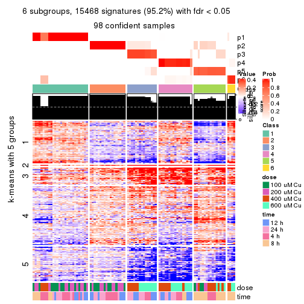</p>

</div>
</div>


Compare the overlap of signatures from different k:

```r
compare_signatures(res)
```


`get_signature()` returns a data frame invisibly. TO get the list of signatures, the function
call should be assigned to a variable explicitly. In following code, if `plot` argument is set
to `FALSE`, no heatmap is plotted while only the differential analysis is performed.

```r
# code only for demonstration
tb = get_signature(res, k = ..., plot = FALSE)
```

An example of the output of `tb` is:

```
#>   which_row         fdr    mean_1    mean_2 scaled_mean_1 scaled_mean_2 km
#> 1        38 0.042760348  8.373488  9.131774    -0.5533452     0.5164555  1
#> 2        40 0.018707592  7.106213  8.469186    -0.6173731     0.5762149  1
#> 3        55 0.019134737 10.221463 11.207825    -0.6159697     0.5749050  1
#> 4        59 0.006059896  5.921854  7.869574    -0.6899429     0.6439467  1
#> 5        60 0.018055526  8.928898 10.211722    -0.6204761     0.5791110  1
#> 6        98 0.009384629 15.714769 14.887706     0.6635654    -0.6193277  2
...
```

The columns in `tb` are:

1. `which_row`: row indices corresponding to the input matrix.
2. `fdr`: FDR for the differential test. 
3. `mean_x`: The mean value in group x.
4. `scaled_mean_x`: The mean value in group x after rows are scaled.
5. `km`: Row groups if k-means clustering is applied to rows.


UMAP plot which shows how samples are separated.


<script>
$( function() {
	$( '#tabs-MAD-hclust-dimension-reduction' ).tabs();
} );
</script>
<div id='tabs-MAD-hclust-dimension-reduction'>
<ul>
<li><a href='#tab-MAD-hclust-dimension-reduction-1'>k = 2</a></li>
<li><a href='#tab-MAD-hclust-dimension-reduction-2'>k = 3</a></li>
<li><a href='#tab-MAD-hclust-dimension-reduction-3'>k = 4</a></li>
<li><a href='#tab-MAD-hclust-dimension-reduction-4'>k = 5</a></li>
<li><a href='#tab-MAD-hclust-dimension-reduction-5'>k = 6</a></li>
</ul>
<div id='tab-MAD-hclust-dimension-reduction-1'>
<pre><code class="r">dimension_reduction(res, k = 2, method = &quot;UMAP&quot;)
</code></pre>

<p></p>

</div>
<div id='tab-MAD-hclust-dimension-reduction-2'>
<pre><code class="r">dimension_reduction(res, k = 3, method = &quot;UMAP&quot;)
</code></pre>

<p></p>

</div>
<div id='tab-MAD-hclust-dimension-reduction-3'>
<pre><code class="r">dimension_reduction(res, k = 4, method = &quot;UMAP&quot;)
</code></pre>

<p></p>

</div>
<div id='tab-MAD-hclust-dimension-reduction-4'>
<pre><code class="r">dimension_reduction(res, k = 5, method = &quot;UMAP&quot;)
</code></pre>

<p></p>

</div>
<div id='tab-MAD-hclust-dimension-reduction-5'>
<pre><code class="r">dimension_reduction(res, k = 6, method = &quot;UMAP&quot;)
</code></pre>

<p></p>

</div>
</div>


Following heatmap shows how subgroups are split when increasing `k`:

```r
collect_classes(res)
```


Test correlation between subgroups and known annotations. If the known
annotation is numeric, one-way ANOVA test is applied, and if the known
annotation is discrete, chi-squared contingency table test is applied.

```r
test_to_known_factors(res)
```

```
#>             n  dose(p)  time(p) k
#> MAD:hclust 98 1.00e+00 1.00e+00 2
#> MAD:hclust 91 1.32e-05 2.77e-01 3
#> MAD:hclust 98 8.37e-08 9.47e-02 4
#> MAD:hclust 98 3.14e-09 3.05e-05 5
#> MAD:hclust 98 5.27e-10 2.58e-06 6
```


If matrix rows can be associated to genes, consider to use `GO_Enrichment(res,
...)` to perform function enrichment for the signature genes.


 

---------------------------------------------------


### MAD:kmeans**


The object with results only for a single top-value method and a single partition method 
can be extracted as:

```r
res = res_list["MAD", "kmeans"]
# you can also extract it by
# res = res_list["MAD:kmeans"]
```

A summary of `res` and all the functions that can be applied to it:

```r
res
```

```
#> A 'ConsensusPartition' object with k = 2, 3, 4, 5, 6.
#>   On a matrix with 16250 rows and 98 columns.
#>   Top rows (1000, 2000, 3000, 4000, 5000) are extracted by 'MAD' method.
#>   Subgroups are detected by 'kmeans' method.
#>   Performed in total 1250 partitions by row resampling.
#>   Best k for subgroups seems to be 2.
#> 
#> Following methods can be applied to this 'ConsensusPartition' object:
#>  [1] "cola_report"             "collect_classes"         "collect_plots"          
#>  [4] "collect_stats"           "colnames"                "compare_signatures"     
#>  [7] "consensus_heatmap"       "dimension_reduction"     "functional_enrichment"  
#> [10] "get_anno_col"            "get_anno"                "get_classes"            
#> [13] "get_consensus"           "get_matrix"              "get_membership"         
#> [16] "get_param"               "get_signatures"          "get_stats"              
#> [19] "is_best_k"               "is_stable_k"             "membership_heatmap"     
#> [22] "ncol"                    "nrow"                    "plot_ecdf"              
#> [25] "rownames"                "select_partition_number" "show"                   
#> [28] "suggest_best_k"          "test_to_known_factors"
```

`collect_plots()` function collects all the plots made from `res` for all `k` (number of partitions)
into one single page to provide an easy and fast comparison between different `k`.

```r
collect_plots(res)
```


The plots are:

- The first row: a plot of the ECDF (Empirical cumulative distribution
  function) curves of the consensus matrix for each `k` and the heatmap of
  predicted classes for each `k`.
- The second row: heatmaps of the consensus matrix for each `k`.
- The third row: heatmaps of the membership matrix for each `k`.
- The fouth row: heatmaps of the signatures for each `k`.

All the plots in panels can be made by individual functions and they are
plotted later in this section.

`select_partition_number()` produces several plots showing different
statistics for choosing "optimized" `k`. There are following statistics:

- ECDF curves of the consensus matrix for each `k`;
- 1-PAC. [The PAC
  score](https://en.wikipedia.org/wiki/Consensus_clustering#Over-interpretation_potential_of_consensus_clustering)
  measures the proportion of the ambiguous subgrouping.
- Mean silhouette score.
- Concordance. The mean probability of fiting the consensus class ids in all
  partitions.
- Area increased. Denote $A_k$ as the area under the ECDF curve for current
  `k`, the area increased is defined as $A_k - A_{k-1}$.
- Rand index. The percent of pairs of samples that are both in a same cluster
  or both are not in a same cluster in the partition of k and k-1.
- Jaccard index. The ratio of pairs of samples are both in a same cluster in
  the partition of k and k-1 and the pairs of samples are both in a same
  cluster in the partition k or k-1.

The detailed explanations of these statistics can be found in [the cola
vignette](http://bioconductor.org/packages/devel/bioc/vignettes/cola/inst/doc/cola.html#toc_13).

Generally speaking, lower PAC score, higher mean silhouette score or higher
concordance corresponds to better partition. Rand index and Jaccard index
measure how similar the current partition is compared to partition with `k-1`.
If they are too similar, we won't accept `k` is better than `k-1`.

```r
select_partition_number(res)
```


The numeric values for all these statistics can be obtained by `get_stats()`.

```r
get_stats(res)
```

```
#>   k 1-PAC mean_silhouette concordance area_increased  Rand Jaccard
#> 2 2 1.000           0.990       0.991         0.5053 0.495   0.495
#> 3 3 0.692           0.704       0.860         0.2831 0.815   0.641
#> 4 4 0.697           0.771       0.824         0.1379 0.821   0.544
#> 5 5 0.794           0.689       0.816         0.0672 0.954   0.821
#> 6 6 0.826           0.765       0.823         0.0391 0.909   0.614
```

`suggest_best_k()` suggests the best $k$ based on these statistics. The rules are as follows:

- All $k$ with Jaccard index larger than 0.95 are removed because the increase of
  the partition number does not provides enough extra information. If all $k$ are removed,
  the best $k$ is assigned by `NA`.
- For $k$ with 1-PAC larger than 0.9, the maximal $k$ is taken as the "best k". Other $k$ is called "optional k".
- If it does not fit the second rule. The $k$ with the highest vote of highest
  1-PAC, mean silhouette and concordance is taken as the "best k".

```r
suggest_best_k(res)
```

```
#> [1] 2
```


Following shows the table of the partitions (You need to click the **show/hide
code output** link to see it). The membership matrix (columns with name `p*`)
is inferred by
[`clue::cl_consensus()`](https://www.rdocumentation.org/link/cl_consensus?package=clue)
function with the `SE` method. Basically the value in the membership matrix
represents the probability to belong to a certain group. The finall class
label for an item is determined with the group with highest probability it
belongs to.

In `get_classes()` function, the entropy is calculated from the membership
matrix and the silhouette score is calculated from the consensus matrix.


<script>
$( function() {
	$( '#tabs-MAD-kmeans-get-classes' ).tabs();
} );
</script>
<div id='tabs-MAD-kmeans-get-classes'>
<ul>
<li><a href='#tab-MAD-kmeans-get-classes-1'>k = 2</a></li>
<li><a href='#tab-MAD-kmeans-get-classes-2'>k = 3</a></li>
<li><a href='#tab-MAD-kmeans-get-classes-3'>k = 4</a></li>
<li><a href='#tab-MAD-kmeans-get-classes-4'>k = 5</a></li>
<li><a href='#tab-MAD-kmeans-get-classes-5'>k = 6</a></li>
</ul>

<div id='tab-MAD-kmeans-get-classes-1'>
<p><a id='tab-MAD-kmeans-get-classes-1-a' style='color:#0366d6' href='#'>show/hide code output</a></p>
<pre><code class="r">cbind(get_classes(res, k = 2), get_membership(res, k = 2))
</code></pre>

<pre><code>#&gt;           class entropy silhouette    p1    p2
#&gt; GSM241451     2  0.1414      0.991 0.020 0.980
#&gt; GSM241452     1  0.0000      0.992 1.000 0.000
#&gt; GSM241453     2  0.1414      0.991 0.020 0.980
#&gt; GSM241454     1  0.0000      0.992 1.000 0.000
#&gt; GSM241455     2  0.1414      0.991 0.020 0.980
#&gt; GSM241456     1  0.0000      0.992 1.000 0.000
#&gt; GSM241457     2  0.1414      0.991 0.020 0.980
#&gt; GSM241458     1  0.0000      0.992 1.000 0.000
#&gt; GSM241459     2  0.1414      0.991 0.020 0.980
#&gt; GSM241460     1  0.0000      0.992 1.000 0.000
#&gt; GSM241461     2  0.1414      0.991 0.020 0.980
#&gt; GSM241462     1  0.0000      0.992 1.000 0.000
#&gt; GSM241463     2  0.1414      0.991 0.020 0.980
#&gt; GSM241464     1  0.0000      0.992 1.000 0.000
#&gt; GSM241465     2  0.1414      0.991 0.020 0.980
#&gt; GSM241466     1  0.0000      0.992 1.000 0.000
#&gt; GSM241467     1  0.0000      0.992 1.000 0.000
#&gt; GSM241468     2  0.1414      0.991 0.020 0.980
#&gt; GSM241469     1  0.0000      0.992 1.000 0.000
#&gt; GSM241470     2  0.1414      0.991 0.020 0.980
#&gt; GSM241471     2  0.1414      0.991 0.020 0.980
#&gt; GSM241472     1  0.0000      0.992 1.000 0.000
#&gt; GSM241473     2  0.1414      0.991 0.020 0.980
#&gt; GSM241474     1  0.0000      0.992 1.000 0.000
#&gt; GSM241475     2  0.1414      0.991 0.020 0.980
#&gt; GSM241476     1  0.0000      0.992 1.000 0.000
#&gt; GSM241477     2  0.1414      0.991 0.020 0.980
#&gt; GSM241478     2  0.1414      0.991 0.020 0.980
#&gt; GSM241479     1  0.0000      0.992 1.000 0.000
#&gt; GSM241480     1  0.0000      0.992 1.000 0.000
#&gt; GSM241481     2  0.1414      0.991 0.020 0.980
#&gt; GSM241482     1  0.0000      0.992 1.000 0.000
#&gt; GSM241483     2  0.1414      0.991 0.020 0.980
#&gt; GSM241484     1  0.0000      0.992 1.000 0.000
#&gt; GSM241485     1  0.0000      0.992 1.000 0.000
#&gt; GSM241486     2  0.1414      0.991 0.020 0.980
#&gt; GSM241487     2  0.1414      0.991 0.020 0.980
#&gt; GSM241488     2  0.1414      0.991 0.020 0.980
#&gt; GSM241489     1  0.0000      0.992 1.000 0.000
#&gt; GSM241490     1  0.0000      0.992 1.000 0.000
#&gt; GSM241491     2  0.1414      0.991 0.020 0.980
#&gt; GSM241492     1  0.0000      0.992 1.000 0.000
#&gt; GSM241493     2  0.1414      0.991 0.020 0.980
#&gt; GSM241494     1  0.0000      0.992 1.000 0.000
#&gt; GSM241495     2  0.1414      0.991 0.020 0.980
#&gt; GSM241496     2  0.1414      0.991 0.020 0.980
#&gt; GSM241497     1  0.0000      0.992 1.000 0.000
#&gt; GSM241498     1  0.0000      0.992 1.000 0.000
#&gt; GSM241499     1  0.0000      0.992 1.000 0.000
#&gt; GSM241500     2  0.1184      0.991 0.016 0.984
#&gt; GSM241501     2  0.1414      0.991 0.020 0.980
#&gt; GSM241502     2  0.1414      0.991 0.020 0.980
#&gt; GSM241503     1  0.0000      0.992 1.000 0.000
#&gt; GSM241504     1  0.0000      0.992 1.000 0.000
#&gt; GSM241505     1  0.0000      0.992 1.000 0.000
#&gt; GSM241506     2  0.1414      0.991 0.020 0.980
#&gt; GSM241507     1  0.0000      0.992 1.000 0.000
#&gt; GSM241508     2  0.0000      0.988 0.000 1.000
#&gt; GSM241509     2  0.0000      0.988 0.000 1.000
#&gt; GSM241510     2  0.0000      0.988 0.000 1.000
#&gt; GSM241511     1  0.1414      0.987 0.980 0.020
#&gt; GSM241512     1  0.1414      0.987 0.980 0.020
#&gt; GSM241513     2  0.0000      0.988 0.000 1.000
#&gt; GSM241514     1  0.1414      0.987 0.980 0.020
#&gt; GSM241515     2  0.0000      0.988 0.000 1.000
#&gt; GSM241516     1  0.1414      0.987 0.980 0.020
#&gt; GSM241517     2  0.0000      0.988 0.000 1.000
#&gt; GSM241518     1  0.1414      0.987 0.980 0.020
#&gt; GSM241519     2  0.0000      0.988 0.000 1.000
#&gt; GSM241520     1  0.1414      0.987 0.980 0.020
#&gt; GSM241521     2  0.0000      0.988 0.000 1.000
#&gt; GSM241522     1  0.0000      0.992 1.000 0.000
#&gt; GSM241523     2  0.0000      0.988 0.000 1.000
#&gt; GSM241524     1  0.1414      0.987 0.980 0.020
#&gt; GSM241525     1  0.0672      0.990 0.992 0.008
#&gt; GSM241526     2  0.0000      0.988 0.000 1.000
#&gt; GSM241527     1  0.1414      0.987 0.980 0.020
#&gt; GSM241528     2  0.0000      0.988 0.000 1.000
#&gt; GSM241529     2  0.0000      0.988 0.000 1.000
#&gt; GSM241530     1  0.1414      0.987 0.980 0.020
#&gt; GSM241531     1  0.1414      0.987 0.980 0.020
#&gt; GSM241532     2  0.0000      0.988 0.000 1.000
#&gt; GSM241533     2  0.0000      0.988 0.000 1.000
#&gt; GSM241534     2  0.0000      0.988 0.000 1.000
#&gt; GSM241535     1  0.1414      0.987 0.980 0.020
#&gt; GSM241536     1  0.1414      0.987 0.980 0.020
#&gt; GSM241537     2  0.0000      0.988 0.000 1.000
#&gt; GSM241538     1  0.1414      0.987 0.980 0.020
#&gt; GSM241539     2  0.0000      0.988 0.000 1.000
#&gt; GSM241540     1  0.1414      0.987 0.980 0.020
#&gt; GSM241541     2  0.0000      0.988 0.000 1.000
#&gt; GSM241542     1  0.1414      0.987 0.980 0.020
#&gt; GSM241543     2  0.0000      0.988 0.000 1.000
#&gt; GSM241544     1  0.1414      0.987 0.980 0.020
#&gt; GSM241545     2  0.0000      0.988 0.000 1.000
#&gt; GSM241546     1  0.1414      0.987 0.980 0.020
#&gt; GSM241547     2  0.0000      0.988 0.000 1.000
#&gt; GSM241548     1  0.1414      0.987 0.980 0.020
</code></pre>

<script>
$('#tab-MAD-kmeans-get-classes-1-a').parent().next().next().hide();
$('#tab-MAD-kmeans-get-classes-1-a').click(function(){
  $('#tab-MAD-kmeans-get-classes-1-a').parent().next().next().toggle();
  return(false);
});
</script>
</div>

<div id='tab-MAD-kmeans-get-classes-2'>
<p><a id='tab-MAD-kmeans-get-classes-2-a' style='color:#0366d6' href='#'>show/hide code output</a></p>
<pre><code class="r">cbind(get_classes(res, k = 3), get_membership(res, k = 3))
</code></pre>

<pre><code>#&gt;           class entropy silhouette    p1    p2    p3
#&gt; GSM241451     2  0.0000     0.8648 0.000 1.000 0.000
#&gt; GSM241452     1  0.0237     0.8909 0.996 0.004 0.000
#&gt; GSM241453     2  0.0000     0.8648 0.000 1.000 0.000
#&gt; GSM241454     1  0.0237     0.8909 0.996 0.004 0.000
#&gt; GSM241455     2  0.0000     0.8648 0.000 1.000 0.000
#&gt; GSM241456     1  0.0237     0.8909 0.996 0.004 0.000
#&gt; GSM241457     2  0.2165     0.8487 0.000 0.936 0.064
#&gt; GSM241458     1  0.2261     0.8725 0.932 0.000 0.068
#&gt; GSM241459     2  0.2165     0.8487 0.000 0.936 0.064
#&gt; GSM241460     1  0.2400     0.8722 0.932 0.004 0.064
#&gt; GSM241461     2  0.2261     0.8491 0.000 0.932 0.068
#&gt; GSM241462     1  0.2261     0.8725 0.932 0.000 0.068
#&gt; GSM241463     2  0.0000     0.8648 0.000 1.000 0.000
#&gt; GSM241464     1  0.0237     0.8909 0.996 0.004 0.000
#&gt; GSM241465     2  0.0000     0.8648 0.000 1.000 0.000
#&gt; GSM241466     1  0.0237     0.8909 0.996 0.004 0.000
#&gt; GSM241467     1  0.0237     0.8909 0.996 0.004 0.000
#&gt; GSM241468     2  0.0000     0.8648 0.000 1.000 0.000
#&gt; GSM241469     1  0.0237     0.8909 0.996 0.004 0.000
#&gt; GSM241470     2  0.0000     0.8648 0.000 1.000 0.000
#&gt; GSM241471     2  0.0000     0.8648 0.000 1.000 0.000
#&gt; GSM241472     1  0.0237     0.8909 0.996 0.004 0.000
#&gt; GSM241473     2  0.0000     0.8648 0.000 1.000 0.000
#&gt; GSM241474     1  0.0237     0.8909 0.996 0.004 0.000
#&gt; GSM241475     2  0.0000     0.8648 0.000 1.000 0.000
#&gt; GSM241476     1  0.0237     0.8909 0.996 0.004 0.000
#&gt; GSM241477     2  0.0000     0.8648 0.000 1.000 0.000
#&gt; GSM241478     2  0.0000     0.8648 0.000 1.000 0.000
#&gt; GSM241479     1  0.0237     0.8909 0.996 0.004 0.000
#&gt; GSM241480     1  0.0237     0.8909 0.996 0.004 0.000
#&gt; GSM241481     2  0.2165     0.8487 0.000 0.936 0.064
#&gt; GSM241482     1  0.2165     0.8729 0.936 0.000 0.064
#&gt; GSM241483     2  0.2261     0.8491 0.000 0.932 0.068
#&gt; GSM241484     1  0.2261     0.8725 0.932 0.000 0.068
#&gt; GSM241485     1  0.2261     0.8725 0.932 0.000 0.068
#&gt; GSM241486     2  0.2261     0.8491 0.000 0.932 0.068
#&gt; GSM241487     2  0.0237     0.8633 0.000 0.996 0.004
#&gt; GSM241488     2  0.0000     0.8648 0.000 1.000 0.000
#&gt; GSM241489     1  0.0237     0.8909 0.996 0.004 0.000
#&gt; GSM241490     1  0.0237     0.8909 0.996 0.004 0.000
#&gt; GSM241491     2  0.0000     0.8648 0.000 1.000 0.000
#&gt; GSM241492     1  0.0237     0.8909 0.996 0.004 0.000
#&gt; GSM241493     2  0.0000     0.8648 0.000 1.000 0.000
#&gt; GSM241494     1  0.0237     0.8909 0.996 0.004 0.000
#&gt; GSM241495     2  0.0000     0.8648 0.000 1.000 0.000
#&gt; GSM241496     2  0.0000     0.8648 0.000 1.000 0.000
#&gt; GSM241497     1  0.0237     0.8909 0.996 0.004 0.000
#&gt; GSM241498     1  0.0237     0.8909 0.996 0.004 0.000
#&gt; GSM241499     1  0.2261     0.8725 0.932 0.000 0.068
#&gt; GSM241500     2  0.2261     0.8491 0.000 0.932 0.068
#&gt; GSM241501     2  0.2261     0.8491 0.000 0.932 0.068
#&gt; GSM241502     2  0.2261     0.8491 0.000 0.932 0.068
#&gt; GSM241503     1  0.2261     0.8725 0.932 0.000 0.068
#&gt; GSM241504     1  0.2261     0.8725 0.932 0.000 0.068
#&gt; GSM241505     1  0.2261     0.8725 0.932 0.000 0.068
#&gt; GSM241506     2  0.2261     0.8491 0.000 0.932 0.068
#&gt; GSM241507     1  0.2261     0.8725 0.932 0.000 0.068
#&gt; GSM241508     2  0.2261     0.8491 0.000 0.932 0.068
#&gt; GSM241509     2  0.4291     0.7718 0.000 0.820 0.180
#&gt; GSM241510     2  0.5397     0.6543 0.000 0.720 0.280
#&gt; GSM241511     1  0.5178     0.7399 0.744 0.000 0.256
#&gt; GSM241512     1  0.6267     0.2416 0.548 0.000 0.452
#&gt; GSM241513     3  0.5733     0.4935 0.000 0.324 0.676
#&gt; GSM241514     1  0.6252     0.2561 0.556 0.000 0.444
#&gt; GSM241515     3  0.5706     0.5013 0.000 0.320 0.680
#&gt; GSM241516     1  0.6252     0.2561 0.556 0.000 0.444
#&gt; GSM241517     2  0.6062     0.3510 0.000 0.616 0.384
#&gt; GSM241518     3  0.4047     0.6640 0.148 0.004 0.848
#&gt; GSM241519     2  0.6008     0.3790 0.000 0.628 0.372
#&gt; GSM241520     3  0.5623     0.5070 0.280 0.004 0.716
#&gt; GSM241521     2  0.2796     0.8015 0.000 0.908 0.092
#&gt; GSM241522     1  0.0424     0.8867 0.992 0.000 0.008
#&gt; GSM241523     2  0.6045     0.3605 0.000 0.620 0.380
#&gt; GSM241524     1  0.6252     0.2561 0.556 0.000 0.444
#&gt; GSM241525     1  0.4504     0.7324 0.804 0.000 0.196
#&gt; GSM241526     2  0.6307     0.0567 0.000 0.512 0.488
#&gt; GSM241527     3  0.6274     0.0308 0.456 0.000 0.544
#&gt; GSM241528     2  0.6252     0.2089 0.000 0.556 0.444
#&gt; GSM241529     2  0.6307     0.0567 0.000 0.512 0.488
#&gt; GSM241530     1  0.4842     0.6977 0.776 0.000 0.224
#&gt; GSM241531     1  0.5216     0.7354 0.740 0.000 0.260
#&gt; GSM241532     2  0.6267     0.3280 0.000 0.548 0.452
#&gt; GSM241533     3  0.6280    -0.1058 0.000 0.460 0.540
#&gt; GSM241534     3  0.6280    -0.1058 0.000 0.460 0.540
#&gt; GSM241535     3  0.3551     0.6726 0.132 0.000 0.868
#&gt; GSM241536     1  0.5178     0.7399 0.744 0.000 0.256
#&gt; GSM241537     3  0.3482     0.6551 0.000 0.128 0.872
#&gt; GSM241538     3  0.3551     0.6726 0.132 0.000 0.868
#&gt; GSM241539     3  0.3482     0.6551 0.000 0.128 0.872
#&gt; GSM241540     3  0.5905     0.3522 0.352 0.000 0.648
#&gt; GSM241541     3  0.4796     0.5966 0.000 0.220 0.780
#&gt; GSM241542     3  0.3715     0.6748 0.128 0.004 0.868
#&gt; GSM241543     3  0.5706     0.5013 0.000 0.320 0.680
#&gt; GSM241544     3  0.5178     0.5441 0.256 0.000 0.744
#&gt; GSM241545     3  0.5706     0.5013 0.000 0.320 0.680
#&gt; GSM241546     3  0.6302    -0.0507 0.480 0.000 0.520
#&gt; GSM241547     3  0.5706     0.5013 0.000 0.320 0.680
#&gt; GSM241548     3  0.3784     0.6744 0.132 0.004 0.864
</code></pre>

<script>
$('#tab-MAD-kmeans-get-classes-2-a').parent().next().next().hide();
$('#tab-MAD-kmeans-get-classes-2-a').click(function(){
  $('#tab-MAD-kmeans-get-classes-2-a').parent().next().next().toggle();
  return(false);
});
</script>
</div>

<div id='tab-MAD-kmeans-get-classes-3'>
<p><a id='tab-MAD-kmeans-get-classes-3-a' style='color:#0366d6' href='#'>show/hide code output</a></p>
<pre><code class="r">cbind(get_classes(res, k = 4), get_membership(res, k = 4))
</code></pre>

<pre><code>#&gt;           class entropy silhouette    p1    p2    p3    p4
#&gt; GSM241451     2  0.5771      0.852 0.004 0.704 0.212 0.080
#&gt; GSM241452     1  0.0000      0.916 1.000 0.000 0.000 0.000
#&gt; GSM241453     2  0.5771      0.852 0.004 0.704 0.212 0.080
#&gt; GSM241454     1  0.0000      0.916 1.000 0.000 0.000 0.000
#&gt; GSM241455     2  0.5771      0.852 0.004 0.704 0.212 0.080
#&gt; GSM241456     1  0.0000      0.916 1.000 0.000 0.000 0.000
#&gt; GSM241457     2  0.0000      0.747 0.000 1.000 0.000 0.000
#&gt; GSM241458     1  0.3444      0.849 0.816 0.000 0.184 0.000
#&gt; GSM241459     2  0.0000      0.747 0.000 1.000 0.000 0.000
#&gt; GSM241460     1  0.1867      0.890 0.928 0.000 0.072 0.000
#&gt; GSM241461     2  0.0376      0.743 0.000 0.992 0.004 0.004
#&gt; GSM241462     1  0.3626      0.848 0.812 0.000 0.184 0.004
#&gt; GSM241463     2  0.5771      0.852 0.004 0.704 0.212 0.080
#&gt; GSM241464     1  0.0188      0.915 0.996 0.000 0.000 0.004
#&gt; GSM241465     2  0.5593      0.850 0.000 0.708 0.212 0.080
#&gt; GSM241466     1  0.0000      0.916 1.000 0.000 0.000 0.000
#&gt; GSM241467     1  0.0000      0.916 1.000 0.000 0.000 0.000
#&gt; GSM241468     2  0.5771      0.852 0.004 0.704 0.212 0.080
#&gt; GSM241469     1  0.0000      0.916 1.000 0.000 0.000 0.000
#&gt; GSM241470     2  0.5771      0.852 0.004 0.704 0.212 0.080
#&gt; GSM241471     2  0.5771      0.852 0.004 0.704 0.212 0.080
#&gt; GSM241472     1  0.0000      0.916 1.000 0.000 0.000 0.000
#&gt; GSM241473     2  0.5771      0.852 0.004 0.704 0.212 0.080
#&gt; GSM241474     1  0.0000      0.916 1.000 0.000 0.000 0.000
#&gt; GSM241475     2  0.5771      0.852 0.004 0.704 0.212 0.080
#&gt; GSM241476     1  0.0000      0.916 1.000 0.000 0.000 0.000
#&gt; GSM241477     2  0.5771      0.852 0.004 0.704 0.212 0.080
#&gt; GSM241478     2  0.5771      0.852 0.004 0.704 0.212 0.080
#&gt; GSM241479     1  0.0000      0.916 1.000 0.000 0.000 0.000
#&gt; GSM241480     1  0.0000      0.916 1.000 0.000 0.000 0.000
#&gt; GSM241481     2  0.0000      0.747 0.000 1.000 0.000 0.000
#&gt; GSM241482     1  0.3444      0.849 0.816 0.000 0.184 0.000
#&gt; GSM241483     2  0.0188      0.745 0.000 0.996 0.004 0.000
#&gt; GSM241484     1  0.3486      0.847 0.812 0.000 0.188 0.000
#&gt; GSM241485     1  0.3306      0.860 0.840 0.000 0.156 0.004
#&gt; GSM241486     2  0.0376      0.743 0.000 0.992 0.004 0.004
#&gt; GSM241487     2  0.5593      0.850 0.000 0.708 0.212 0.080
#&gt; GSM241488     2  0.5771      0.852 0.004 0.704 0.212 0.080
#&gt; GSM241489     1  0.0000      0.916 1.000 0.000 0.000 0.000
#&gt; GSM241490     1  0.0000      0.916 1.000 0.000 0.000 0.000
#&gt; GSM241491     2  0.5771      0.852 0.004 0.704 0.212 0.080
#&gt; GSM241492     1  0.0188      0.915 0.996 0.000 0.000 0.004
#&gt; GSM241493     2  0.5771      0.852 0.004 0.704 0.212 0.080
#&gt; GSM241494     1  0.0000      0.916 1.000 0.000 0.000 0.000
#&gt; GSM241495     2  0.5771      0.852 0.004 0.704 0.212 0.080
#&gt; GSM241496     2  0.5771      0.852 0.004 0.704 0.212 0.080
#&gt; GSM241497     1  0.0000      0.916 1.000 0.000 0.000 0.000
#&gt; GSM241498     1  0.0000      0.916 1.000 0.000 0.000 0.000
#&gt; GSM241499     1  0.3569      0.842 0.804 0.000 0.196 0.000
#&gt; GSM241500     2  0.0895      0.730 0.000 0.976 0.004 0.020
#&gt; GSM241501     2  0.0376      0.743 0.000 0.992 0.004 0.004
#&gt; GSM241502     2  0.0657      0.737 0.000 0.984 0.004 0.012
#&gt; GSM241503     1  0.3569      0.842 0.804 0.000 0.196 0.000
#&gt; GSM241504     1  0.3569      0.842 0.804 0.000 0.196 0.000
#&gt; GSM241505     1  0.3569      0.842 0.804 0.000 0.196 0.000
#&gt; GSM241506     2  0.0895      0.730 0.000 0.976 0.004 0.020
#&gt; GSM241507     1  0.3569      0.842 0.804 0.000 0.196 0.000
#&gt; GSM241508     2  0.0895      0.730 0.000 0.976 0.004 0.020
#&gt; GSM241509     4  0.5137      0.573 0.000 0.452 0.004 0.544
#&gt; GSM241510     4  0.5119      0.588 0.000 0.440 0.004 0.556
#&gt; GSM241511     3  0.4356      0.481 0.292 0.000 0.708 0.000
#&gt; GSM241512     3  0.7085      0.756 0.200 0.000 0.568 0.232
#&gt; GSM241513     4  0.2623      0.694 0.000 0.028 0.064 0.908
#&gt; GSM241514     3  0.7220      0.758 0.212 0.000 0.548 0.240
#&gt; GSM241515     4  0.2623      0.694 0.000 0.028 0.064 0.908
#&gt; GSM241516     3  0.7324      0.754 0.228 0.000 0.532 0.240
#&gt; GSM241517     4  0.5889      0.687 0.000 0.100 0.212 0.688
#&gt; GSM241518     3  0.6121      0.699 0.060 0.000 0.588 0.352
#&gt; GSM241519     4  0.5889      0.687 0.000 0.100 0.212 0.688
#&gt; GSM241520     3  0.6501      0.725 0.096 0.000 0.588 0.316
#&gt; GSM241521     4  0.7026      0.509 0.000 0.180 0.248 0.572
#&gt; GSM241522     1  0.3400      0.668 0.820 0.000 0.180 0.000
#&gt; GSM241523     4  0.5889      0.687 0.000 0.100 0.212 0.688
#&gt; GSM241524     3  0.6897      0.759 0.160 0.000 0.584 0.256
#&gt; GSM241525     3  0.5582      0.496 0.400 0.000 0.576 0.024
#&gt; GSM241526     4  0.2773      0.732 0.000 0.116 0.004 0.880
#&gt; GSM241527     3  0.6801      0.759 0.124 0.000 0.568 0.308
#&gt; GSM241528     4  0.5080      0.701 0.000 0.092 0.144 0.764
#&gt; GSM241529     4  0.4318      0.735 0.000 0.116 0.068 0.816
#&gt; GSM241530     3  0.6280      0.589 0.344 0.000 0.584 0.072
#&gt; GSM241531     3  0.4356      0.481 0.292 0.000 0.708 0.000
#&gt; GSM241532     4  0.4991      0.641 0.000 0.388 0.004 0.608
#&gt; GSM241533     4  0.4978      0.645 0.000 0.384 0.004 0.612
#&gt; GSM241534     4  0.4978      0.645 0.000 0.384 0.004 0.612
#&gt; GSM241535     3  0.5097      0.659 0.004 0.000 0.568 0.428
#&gt; GSM241536     3  0.4356      0.481 0.292 0.000 0.708 0.000
#&gt; GSM241537     4  0.1940      0.570 0.000 0.000 0.076 0.924
#&gt; GSM241538     3  0.5147      0.637 0.004 0.000 0.536 0.460
#&gt; GSM241539     4  0.1940      0.570 0.000 0.000 0.076 0.924
#&gt; GSM241540     3  0.6794      0.756 0.116 0.000 0.556 0.328
#&gt; GSM241541     4  0.1489      0.621 0.000 0.004 0.044 0.952
#&gt; GSM241542     3  0.5151      0.632 0.004 0.000 0.532 0.464
#&gt; GSM241543     4  0.2845      0.687 0.000 0.028 0.076 0.896
#&gt; GSM241544     3  0.6412      0.724 0.088 0.000 0.592 0.320
#&gt; GSM241545     4  0.2845      0.687 0.000 0.028 0.076 0.896
#&gt; GSM241546     3  0.6883      0.759 0.156 0.000 0.584 0.260
#&gt; GSM241547     4  0.2845      0.687 0.000 0.028 0.076 0.896
#&gt; GSM241548     3  0.5172      0.635 0.008 0.000 0.588 0.404
</code></pre>

<script>
$('#tab-MAD-kmeans-get-classes-3-a').parent().next().next().hide();
$('#tab-MAD-kmeans-get-classes-3-a').click(function(){
  $('#tab-MAD-kmeans-get-classes-3-a').parent().next().next().toggle();
  return(false);
});
</script>
</div>

<div id='tab-MAD-kmeans-get-classes-4'>
<p><a id='tab-MAD-kmeans-get-classes-4-a' style='color:#0366d6' href='#'>show/hide code output</a></p>
<pre><code class="r">cbind(get_classes(res, k = 5), get_membership(res, k = 5))
</code></pre>

<pre><code>#&gt;           class entropy silhouette    p1    p2    p3    p4    p5
#&gt; GSM241451     2  0.0000      0.814 0.000 1.000 0.000 0.000 0.000
#&gt; GSM241452     1  0.0162      0.862 0.996 0.004 0.000 0.000 0.000
#&gt; GSM241453     2  0.0000      0.814 0.000 1.000 0.000 0.000 0.000
#&gt; GSM241454     1  0.0162      0.862 0.996 0.004 0.000 0.000 0.000
#&gt; GSM241455     2  0.0000      0.814 0.000 1.000 0.000 0.000 0.000
#&gt; GSM241456     1  0.0162      0.862 0.996 0.004 0.000 0.000 0.000
#&gt; GSM241457     2  0.4302     -0.174 0.000 0.520 0.000 0.000 0.480
#&gt; GSM241458     1  0.5804      0.711 0.648 0.000 0.056 0.048 0.248
#&gt; GSM241459     2  0.4302     -0.174 0.000 0.520 0.000 0.000 0.480
#&gt; GSM241460     1  0.0671      0.854 0.980 0.000 0.000 0.016 0.004
#&gt; GSM241461     2  0.4307     -0.227 0.000 0.504 0.000 0.000 0.496
#&gt; GSM241462     1  0.5879      0.712 0.648 0.000 0.060 0.052 0.240
#&gt; GSM241463     2  0.0000      0.814 0.000 1.000 0.000 0.000 0.000
#&gt; GSM241464     1  0.0162      0.862 0.996 0.004 0.000 0.000 0.000
#&gt; GSM241465     2  0.0162      0.810 0.000 0.996 0.000 0.000 0.004
#&gt; GSM241466     1  0.0162      0.862 0.996 0.004 0.000 0.000 0.000
#&gt; GSM241467     1  0.0162      0.862 0.996 0.004 0.000 0.000 0.000
#&gt; GSM241468     2  0.0000      0.814 0.000 1.000 0.000 0.000 0.000
#&gt; GSM241469     1  0.0162      0.862 0.996 0.004 0.000 0.000 0.000
#&gt; GSM241470     2  0.0000      0.814 0.000 1.000 0.000 0.000 0.000
#&gt; GSM241471     2  0.0000      0.814 0.000 1.000 0.000 0.000 0.000
#&gt; GSM241472     1  0.0162      0.862 0.996 0.004 0.000 0.000 0.000
#&gt; GSM241473     2  0.0000      0.814 0.000 1.000 0.000 0.000 0.000
#&gt; GSM241474     1  0.0162      0.862 0.996 0.004 0.000 0.000 0.000
#&gt; GSM241475     2  0.0000      0.814 0.000 1.000 0.000 0.000 0.000
#&gt; GSM241476     1  0.0162      0.862 0.996 0.004 0.000 0.000 0.000
#&gt; GSM241477     2  0.0000      0.814 0.000 1.000 0.000 0.000 0.000
#&gt; GSM241478     2  0.0000      0.814 0.000 1.000 0.000 0.000 0.000
#&gt; GSM241479     1  0.0162      0.862 0.996 0.004 0.000 0.000 0.000
#&gt; GSM241480     1  0.0162      0.862 0.996 0.004 0.000 0.000 0.000
#&gt; GSM241481     2  0.4302     -0.174 0.000 0.520 0.000 0.000 0.480
#&gt; GSM241482     1  0.5599      0.719 0.660 0.000 0.056 0.036 0.248
#&gt; GSM241483     2  0.4302     -0.174 0.000 0.520 0.000 0.000 0.480
#&gt; GSM241484     1  0.5804      0.711 0.648 0.000 0.056 0.048 0.248
#&gt; GSM241485     1  0.5180      0.750 0.724 0.000 0.044 0.052 0.180
#&gt; GSM241486     2  0.4307     -0.227 0.000 0.504 0.000 0.000 0.496
#&gt; GSM241487     2  0.0162      0.810 0.000 0.996 0.000 0.000 0.004
#&gt; GSM241488     2  0.0000      0.814 0.000 1.000 0.000 0.000 0.000
#&gt; GSM241489     1  0.0162      0.862 0.996 0.004 0.000 0.000 0.000
#&gt; GSM241490     1  0.0162      0.862 0.996 0.004 0.000 0.000 0.000
#&gt; GSM241491     2  0.0000      0.814 0.000 1.000 0.000 0.000 0.000
#&gt; GSM241492     1  0.0162      0.862 0.996 0.004 0.000 0.000 0.000
#&gt; GSM241493     2  0.0000      0.814 0.000 1.000 0.000 0.000 0.000
#&gt; GSM241494     1  0.0162      0.862 0.996 0.004 0.000 0.000 0.000
#&gt; GSM241495     2  0.0000      0.814 0.000 1.000 0.000 0.000 0.000
#&gt; GSM241496     2  0.0000      0.814 0.000 1.000 0.000 0.000 0.000
#&gt; GSM241497     1  0.0162      0.862 0.996 0.004 0.000 0.000 0.000
#&gt; GSM241498     1  0.0162      0.862 0.996 0.004 0.000 0.000 0.000
#&gt; GSM241499     1  0.6171      0.668 0.592 0.000 0.060 0.052 0.296
#&gt; GSM241500     5  0.4818      0.277 0.000 0.460 0.020 0.000 0.520
#&gt; GSM241501     5  0.4650      0.250 0.000 0.468 0.012 0.000 0.520
#&gt; GSM241502     5  0.4738      0.265 0.000 0.464 0.016 0.000 0.520
#&gt; GSM241503     1  0.6171      0.668 0.592 0.000 0.060 0.052 0.296
#&gt; GSM241504     1  0.6171      0.668 0.592 0.000 0.060 0.052 0.296
#&gt; GSM241505     1  0.6171      0.668 0.592 0.000 0.060 0.052 0.296
#&gt; GSM241506     5  0.4818      0.277 0.000 0.460 0.020 0.000 0.520
#&gt; GSM241507     1  0.6171      0.668 0.592 0.000 0.060 0.052 0.296
#&gt; GSM241508     5  0.4818      0.277 0.000 0.460 0.020 0.000 0.520
#&gt; GSM241509     5  0.4733      0.397 0.000 0.028 0.348 0.000 0.624
#&gt; GSM241510     5  0.4733      0.397 0.000 0.028 0.348 0.000 0.624
#&gt; GSM241511     4  0.6191      0.597 0.048 0.000 0.060 0.576 0.316
#&gt; GSM241512     4  0.3428      0.812 0.052 0.000 0.008 0.848 0.092
#&gt; GSM241513     3  0.2846      0.855 0.000 0.052 0.888 0.048 0.012
#&gt; GSM241514     4  0.3673      0.829 0.040 0.000 0.060 0.848 0.052
#&gt; GSM241515     3  0.2450      0.858 0.000 0.052 0.900 0.048 0.000
#&gt; GSM241516     4  0.3388      0.830 0.056 0.000 0.040 0.864 0.040
#&gt; GSM241517     3  0.2424      0.832 0.000 0.132 0.868 0.000 0.000
#&gt; GSM241518     4  0.3567      0.815 0.004 0.000 0.112 0.832 0.052
#&gt; GSM241519     3  0.2424      0.832 0.000 0.132 0.868 0.000 0.000
#&gt; GSM241520     4  0.3640      0.817 0.008 0.000 0.108 0.832 0.052
#&gt; GSM241521     3  0.2813      0.793 0.000 0.168 0.832 0.000 0.000
#&gt; GSM241522     1  0.4644      0.461 0.680 0.000 0.000 0.280 0.040
#&gt; GSM241523     3  0.3101      0.844 0.000 0.100 0.864 0.024 0.012
#&gt; GSM241524     4  0.3714      0.824 0.024 0.000 0.084 0.840 0.052
#&gt; GSM241525     4  0.4086      0.794 0.080 0.000 0.012 0.808 0.100
#&gt; GSM241526     3  0.5218      0.802 0.000 0.072 0.736 0.048 0.144
#&gt; GSM241527     4  0.2925      0.822 0.016 0.000 0.036 0.884 0.064
#&gt; GSM241528     3  0.5325      0.790 0.000 0.112 0.720 0.028 0.140
#&gt; GSM241529     3  0.5262      0.799 0.000 0.080 0.732 0.044 0.144
#&gt; GSM241530     4  0.3576      0.808 0.048 0.000 0.012 0.840 0.100
#&gt; GSM241531     4  0.5979      0.604 0.032 0.000 0.064 0.588 0.316
#&gt; GSM241532     5  0.4607      0.340 0.000 0.004 0.368 0.012 0.616
#&gt; GSM241533     5  0.5024      0.251 0.000 0.004 0.396 0.028 0.572
#&gt; GSM241534     5  0.4644      0.324 0.000 0.004 0.380 0.012 0.604
#&gt; GSM241535     4  0.3055      0.812 0.000 0.000 0.064 0.864 0.072
#&gt; GSM241536     4  0.6152      0.601 0.044 0.000 0.064 0.584 0.308
#&gt; GSM241537     3  0.4221      0.793 0.000 0.000 0.780 0.108 0.112
#&gt; GSM241538     4  0.2450      0.820 0.000 0.000 0.076 0.896 0.028
#&gt; GSM241539     3  0.4221      0.793 0.000 0.000 0.780 0.108 0.112
#&gt; GSM241540     4  0.2590      0.825 0.012 0.000 0.060 0.900 0.028
#&gt; GSM241541     3  0.4221      0.793 0.000 0.000 0.780 0.108 0.112
#&gt; GSM241542     4  0.1956      0.821 0.000 0.000 0.076 0.916 0.008
#&gt; GSM241543     3  0.2766      0.851 0.000 0.040 0.892 0.056 0.012
#&gt; GSM241544     4  0.3536      0.821 0.008 0.000 0.100 0.840 0.052
#&gt; GSM241545     3  0.2766      0.851 0.000 0.040 0.892 0.056 0.012
#&gt; GSM241546     4  0.3597      0.826 0.024 0.000 0.076 0.848 0.052
#&gt; GSM241547     3  0.2370      0.855 0.000 0.040 0.904 0.056 0.000
#&gt; GSM241548     4  0.3459      0.813 0.000 0.000 0.116 0.832 0.052
</code></pre>

<script>
$('#tab-MAD-kmeans-get-classes-4-a').parent().next().next().hide();
$('#tab-MAD-kmeans-get-classes-4-a').click(function(){
  $('#tab-MAD-kmeans-get-classes-4-a').parent().next().next().toggle();
  return(false);
});
</script>
</div>

<div id='tab-MAD-kmeans-get-classes-5'>
<p><a id='tab-MAD-kmeans-get-classes-5-a' style='color:#0366d6' href='#'>show/hide code output</a></p>
<pre><code class="r">cbind(get_classes(res, k = 6), get_membership(res, k = 6))
</code></pre>

<pre><code>#&gt;           class entropy silhouette    p1    p2    p3    p4    p5    p6
#&gt; GSM241451     2  0.0000    0.99607 0.000 1.000 0.000 0.000 0.000 0.000
#&gt; GSM241452     1  0.0000    0.92387 1.000 0.000 0.000 0.000 0.000 0.000
#&gt; GSM241453     2  0.0000    0.99607 0.000 1.000 0.000 0.000 0.000 0.000
#&gt; GSM241454     1  0.0000    0.92387 1.000 0.000 0.000 0.000 0.000 0.000
#&gt; GSM241455     2  0.0363    0.98887 0.000 0.988 0.000 0.000 0.000 0.012
#&gt; GSM241456     1  0.0000    0.92387 1.000 0.000 0.000 0.000 0.000 0.000
#&gt; GSM241457     5  0.4410    0.62233 0.000 0.412 0.000 0.000 0.560 0.028
#&gt; GSM241458     6  0.3979    0.62292 0.456 0.000 0.000 0.000 0.004 0.540
#&gt; GSM241459     5  0.4410    0.62233 0.000 0.412 0.000 0.000 0.560 0.028
#&gt; GSM241460     1  0.0405    0.91838 0.988 0.000 0.004 0.000 0.008 0.000
#&gt; GSM241461     5  0.4300    0.67439 0.000 0.364 0.000 0.000 0.608 0.028
#&gt; GSM241462     6  0.4250    0.61722 0.456 0.000 0.000 0.000 0.016 0.528
#&gt; GSM241463     2  0.0363    0.98887 0.000 0.988 0.000 0.000 0.000 0.012
#&gt; GSM241464     1  0.0665    0.91008 0.980 0.000 0.004 0.000 0.008 0.008
#&gt; GSM241465     2  0.0000    0.99607 0.000 1.000 0.000 0.000 0.000 0.000
#&gt; GSM241466     1  0.0000    0.92387 1.000 0.000 0.000 0.000 0.000 0.000
#&gt; GSM241467     1  0.0291    0.92089 0.992 0.000 0.004 0.000 0.004 0.000
#&gt; GSM241468     2  0.0146    0.99410 0.000 0.996 0.000 0.000 0.000 0.004
#&gt; GSM241469     1  0.0000    0.92387 1.000 0.000 0.000 0.000 0.000 0.000
#&gt; GSM241470     2  0.0000    0.99607 0.000 1.000 0.000 0.000 0.000 0.000
#&gt; GSM241471     2  0.0000    0.99607 0.000 1.000 0.000 0.000 0.000 0.000
#&gt; GSM241472     1  0.0291    0.92089 0.992 0.000 0.004 0.000 0.004 0.000
#&gt; GSM241473     2  0.0000    0.99607 0.000 1.000 0.000 0.000 0.000 0.000
#&gt; GSM241474     1  0.0291    0.92089 0.992 0.000 0.004 0.000 0.004 0.000
#&gt; GSM241475     2  0.0000    0.99607 0.000 1.000 0.000 0.000 0.000 0.000
#&gt; GSM241476     1  0.0000    0.92387 1.000 0.000 0.000 0.000 0.000 0.000
#&gt; GSM241477     2  0.0000    0.99607 0.000 1.000 0.000 0.000 0.000 0.000
#&gt; GSM241478     2  0.0363    0.98887 0.000 0.988 0.000 0.000 0.000 0.012
#&gt; GSM241479     1  0.0000    0.92387 1.000 0.000 0.000 0.000 0.000 0.000
#&gt; GSM241480     1  0.0000    0.92387 1.000 0.000 0.000 0.000 0.000 0.000
#&gt; GSM241481     5  0.4410    0.62233 0.000 0.412 0.000 0.000 0.560 0.028
#&gt; GSM241482     6  0.3979    0.62292 0.456 0.000 0.000 0.000 0.004 0.540
#&gt; GSM241483     5  0.4403    0.62763 0.000 0.408 0.000 0.000 0.564 0.028
#&gt; GSM241484     6  0.3979    0.62292 0.456 0.000 0.000 0.000 0.004 0.540
#&gt; GSM241485     1  0.4199   -0.37415 0.568 0.000 0.000 0.000 0.016 0.416
#&gt; GSM241486     5  0.4300    0.67439 0.000 0.364 0.000 0.000 0.608 0.028
#&gt; GSM241487     2  0.0000    0.99607 0.000 1.000 0.000 0.000 0.000 0.000
#&gt; GSM241488     2  0.0146    0.99410 0.000 0.996 0.000 0.000 0.000 0.004
#&gt; GSM241489     1  0.0291    0.92089 0.992 0.000 0.004 0.000 0.004 0.000
#&gt; GSM241490     1  0.0000    0.92387 1.000 0.000 0.000 0.000 0.000 0.000
#&gt; GSM241491     2  0.0363    0.98887 0.000 0.988 0.000 0.000 0.000 0.012
#&gt; GSM241492     1  0.0665    0.91008 0.980 0.000 0.004 0.000 0.008 0.008
#&gt; GSM241493     2  0.0000    0.99607 0.000 1.000 0.000 0.000 0.000 0.000
#&gt; GSM241494     1  0.0000    0.92387 1.000 0.000 0.000 0.000 0.000 0.000
#&gt; GSM241495     2  0.0000    0.99607 0.000 1.000 0.000 0.000 0.000 0.000
#&gt; GSM241496     2  0.0146    0.99410 0.000 0.996 0.000 0.000 0.000 0.004
#&gt; GSM241497     1  0.0000    0.92387 1.000 0.000 0.000 0.000 0.000 0.000
#&gt; GSM241498     1  0.0000    0.92387 1.000 0.000 0.000 0.000 0.000 0.000
#&gt; GSM241499     6  0.3742    0.73219 0.348 0.000 0.000 0.004 0.000 0.648
#&gt; GSM241500     5  0.3816    0.71755 0.000 0.296 0.016 0.000 0.688 0.000
#&gt; GSM241501     5  0.3672    0.71523 0.000 0.304 0.008 0.000 0.688 0.000
#&gt; GSM241502     5  0.3672    0.71523 0.000 0.304 0.008 0.000 0.688 0.000
#&gt; GSM241503     6  0.3833    0.73339 0.344 0.000 0.000 0.008 0.000 0.648
#&gt; GSM241504     6  0.3969    0.73230 0.344 0.000 0.000 0.008 0.004 0.644
#&gt; GSM241505     6  0.3833    0.73339 0.344 0.000 0.000 0.008 0.000 0.648
#&gt; GSM241506     5  0.4060    0.71621 0.000 0.296 0.016 0.000 0.680 0.008
#&gt; GSM241507     6  0.3742    0.73219 0.348 0.000 0.000 0.004 0.000 0.648
#&gt; GSM241508     5  0.3816    0.71755 0.000 0.296 0.016 0.000 0.688 0.000
#&gt; GSM241509     5  0.3488    0.43644 0.000 0.000 0.216 0.004 0.764 0.016
#&gt; GSM241510     5  0.3488    0.43644 0.000 0.000 0.216 0.004 0.764 0.016
#&gt; GSM241511     6  0.3411    0.29510 0.008 0.000 0.000 0.232 0.004 0.756
#&gt; GSM241512     4  0.3806    0.72629 0.008 0.000 0.004 0.736 0.012 0.240
#&gt; GSM241513     3  0.1148    0.84346 0.000 0.016 0.960 0.004 0.020 0.000
#&gt; GSM241514     4  0.3561    0.79327 0.016 0.000 0.020 0.808 0.148 0.008
#&gt; GSM241515     3  0.0748    0.84668 0.000 0.016 0.976 0.004 0.004 0.000
#&gt; GSM241516     4  0.3322    0.79486 0.024 0.000 0.012 0.836 0.116 0.012
#&gt; GSM241517     3  0.0935    0.84381 0.000 0.032 0.964 0.000 0.004 0.000
#&gt; GSM241518     4  0.4308    0.77548 0.000 0.000 0.088 0.740 0.164 0.008
#&gt; GSM241519     3  0.0935    0.84381 0.000 0.032 0.964 0.000 0.004 0.000
#&gt; GSM241520     4  0.4154    0.77415 0.000 0.000 0.096 0.740 0.164 0.000
#&gt; GSM241521     3  0.1411    0.82299 0.000 0.060 0.936 0.000 0.004 0.000
#&gt; GSM241522     1  0.5432    0.03540 0.500 0.000 0.000 0.376 0.124 0.000
#&gt; GSM241523     3  0.1176    0.84128 0.000 0.020 0.956 0.000 0.024 0.000
#&gt; GSM241524     4  0.3691    0.79145 0.004 0.000 0.060 0.788 0.148 0.000
#&gt; GSM241525     4  0.3861    0.73233 0.028 0.000 0.000 0.744 0.008 0.220
#&gt; GSM241526     3  0.5417    0.73238 0.000 0.004 0.656 0.024 0.168 0.148
#&gt; GSM241527     4  0.3243    0.74546 0.000 0.000 0.004 0.780 0.008 0.208
#&gt; GSM241528     3  0.5540    0.73142 0.000 0.020 0.652 0.012 0.168 0.148
#&gt; GSM241529     3  0.5417    0.73238 0.000 0.004 0.656 0.024 0.168 0.148
#&gt; GSM241530     4  0.3578    0.73849 0.008 0.000 0.004 0.760 0.008 0.220
#&gt; GSM241531     6  0.4090   -0.00768 0.004 0.000 0.000 0.384 0.008 0.604
#&gt; GSM241532     5  0.5477    0.19221 0.000 0.000 0.264 0.004 0.576 0.156
#&gt; GSM241533     5  0.5686    0.16630 0.000 0.000 0.268 0.012 0.564 0.156
#&gt; GSM241534     5  0.5477    0.19221 0.000 0.000 0.264 0.004 0.576 0.156
#&gt; GSM241535     4  0.3806    0.73598 0.000 0.000 0.008 0.752 0.028 0.212
#&gt; GSM241536     6  0.3704    0.28866 0.008 0.000 0.000 0.232 0.016 0.744
#&gt; GSM241537     3  0.5386    0.75633 0.000 0.000 0.664 0.044 0.116 0.176
#&gt; GSM241538     4  0.3178    0.77123 0.000 0.000 0.012 0.832 0.028 0.128
#&gt; GSM241539     3  0.5386    0.75633 0.000 0.000 0.664 0.044 0.116 0.176
#&gt; GSM241540     4  0.2871    0.77619 0.000 0.000 0.008 0.852 0.024 0.116
#&gt; GSM241541     3  0.5203    0.76411 0.000 0.000 0.684 0.044 0.104 0.168
#&gt; GSM241542     4  0.3150    0.77660 0.000 0.000 0.016 0.844 0.036 0.104
#&gt; GSM241543     3  0.1490    0.83861 0.000 0.004 0.948 0.016 0.024 0.008
#&gt; GSM241544     4  0.3608    0.79167 0.000 0.000 0.064 0.788 0.148 0.000
#&gt; GSM241545     3  0.1490    0.83861 0.000 0.004 0.948 0.016 0.024 0.008
#&gt; GSM241546     4  0.3447    0.79520 0.004 0.000 0.044 0.804 0.148 0.000
#&gt; GSM241547     3  0.0767    0.84610 0.000 0.004 0.976 0.012 0.000 0.008
#&gt; GSM241548     4  0.4120    0.77525 0.000 0.000 0.096 0.744 0.160 0.000
</code></pre>

<script>
$('#tab-MAD-kmeans-get-classes-5-a').parent().next().next().hide();
$('#tab-MAD-kmeans-get-classes-5-a').click(function(){
  $('#tab-MAD-kmeans-get-classes-5-a').parent().next().next().toggle();
  return(false);
});
</script>
</div>
</div>

Heatmaps for the consensus matrix. It visualizes the probability of two
samples to be in a same group.


<script>
$( function() {
	$( '#tabs-MAD-kmeans-consensus-heatmap' ).tabs();
} );
</script>
<div id='tabs-MAD-kmeans-consensus-heatmap'>
<ul>
<li><a href='#tab-MAD-kmeans-consensus-heatmap-1'>k = 2</a></li>
<li><a href='#tab-MAD-kmeans-consensus-heatmap-2'>k = 3</a></li>
<li><a href='#tab-MAD-kmeans-consensus-heatmap-3'>k = 4</a></li>
<li><a href='#tab-MAD-kmeans-consensus-heatmap-4'>k = 5</a></li>
<li><a href='#tab-MAD-kmeans-consensus-heatmap-5'>k = 6</a></li>
</ul>
<div id='tab-MAD-kmeans-consensus-heatmap-1'>
<pre><code class="r">consensus_heatmap(res, k = 2)
</code></pre>

<p></p>

</div>
<div id='tab-MAD-kmeans-consensus-heatmap-2'>
<pre><code class="r">consensus_heatmap(res, k = 3)
</code></pre>

<p></p>

</div>
<div id='tab-MAD-kmeans-consensus-heatmap-3'>
<pre><code class="r">consensus_heatmap(res, k = 4)
</code></pre>

<p></p>

</div>
<div id='tab-MAD-kmeans-consensus-heatmap-4'>
<pre><code class="r">consensus_heatmap(res, k = 5)
</code></pre>

<p></p>

</div>
<div id='tab-MAD-kmeans-consensus-heatmap-5'>
<pre><code class="r">consensus_heatmap(res, k = 6)
</code></pre>

<p></p>

</div>
</div>

Heatmaps for the membership of samples in all partitions to see how consistent they are:


<script>
$( function() {
	$( '#tabs-MAD-kmeans-membership-heatmap' ).tabs();
} );
</script>
<div id='tabs-MAD-kmeans-membership-heatmap'>
<ul>
<li><a href='#tab-MAD-kmeans-membership-heatmap-1'>k = 2</a></li>
<li><a href='#tab-MAD-kmeans-membership-heatmap-2'>k = 3</a></li>
<li><a href='#tab-MAD-kmeans-membership-heatmap-3'>k = 4</a></li>
<li><a href='#tab-MAD-kmeans-membership-heatmap-4'>k = 5</a></li>
<li><a href='#tab-MAD-kmeans-membership-heatmap-5'>k = 6</a></li>
</ul>
<div id='tab-MAD-kmeans-membership-heatmap-1'>
<pre><code class="r">membership_heatmap(res, k = 2)
</code></pre>

<p></p>

</div>
<div id='tab-MAD-kmeans-membership-heatmap-2'>
<pre><code class="r">membership_heatmap(res, k = 3)
</code></pre>

<p></p>

</div>
<div id='tab-MAD-kmeans-membership-heatmap-3'>
<pre><code class="r">membership_heatmap(res, k = 4)
</code></pre>

<p></p>

</div>
<div id='tab-MAD-kmeans-membership-heatmap-4'>
<pre><code class="r">membership_heatmap(res, k = 5)
</code></pre>

<p></p>

</div>
<div id='tab-MAD-kmeans-membership-heatmap-5'>
<pre><code class="r">membership_heatmap(res, k = 6)
</code></pre>

<p></p>

</div>
</div>

As soon as we have had the classes for columns, we can look for signatures
which are significantly different between classes which can be candidate marks
for certain classes. Following are the heatmaps for signatures.


Signature heatmaps where rows are scaled:


<script>
$( function() {
	$( '#tabs-MAD-kmeans-get-signatures' ).tabs();
} );
</script>
<div id='tabs-MAD-kmeans-get-signatures'>
<ul>
<li><a href='#tab-MAD-kmeans-get-signatures-1'>k = 2</a></li>
<li><a href='#tab-MAD-kmeans-get-signatures-2'>k = 3</a></li>
<li><a href='#tab-MAD-kmeans-get-signatures-3'>k = 4</a></li>
<li><a href='#tab-MAD-kmeans-get-signatures-4'>k = 5</a></li>
<li><a href='#tab-MAD-kmeans-get-signatures-5'>k = 6</a></li>
</ul>
<div id='tab-MAD-kmeans-get-signatures-1'>
<pre><code class="r">get_signatures(res, k = 2)
</code></pre>

<p></p>

</div>
<div id='tab-MAD-kmeans-get-signatures-2'>
<pre><code class="r">get_signatures(res, k = 3)
</code></pre>

<p></p>

</div>
<div id='tab-MAD-kmeans-get-signatures-3'>
<pre><code class="r">get_signatures(res, k = 4)
</code></pre>

<p></p>

</div>
<div id='tab-MAD-kmeans-get-signatures-4'>
<pre><code class="r">get_signatures(res, k = 5)
</code></pre>

<p></p>

</div>
<div id='tab-MAD-kmeans-get-signatures-5'>
<pre><code class="r">get_signatures(res, k = 6)
</code></pre>

<p></p>

</div>
</div>


Signature heatmaps where rows are not scaled:


<script>
$( function() {
	$( '#tabs-MAD-kmeans-get-signatures-no-scale' ).tabs();
} );
</script>
<div id='tabs-MAD-kmeans-get-signatures-no-scale'>
<ul>
<li><a href='#tab-MAD-kmeans-get-signatures-no-scale-1'>k = 2</a></li>
<li><a href='#tab-MAD-kmeans-get-signatures-no-scale-2'>k = 3</a></li>
<li><a href='#tab-MAD-kmeans-get-signatures-no-scale-3'>k = 4</a></li>
<li><a href='#tab-MAD-kmeans-get-signatures-no-scale-4'>k = 5</a></li>
<li><a href='#tab-MAD-kmeans-get-signatures-no-scale-5'>k = 6</a></li>
</ul>
<div id='tab-MAD-kmeans-get-signatures-no-scale-1'>
<pre><code class="r">get_signatures(res, k = 2, scale_rows = FALSE)
</code></pre>

<p></p>

</div>
<div id='tab-MAD-kmeans-get-signatures-no-scale-2'>
<pre><code class="r">get_signatures(res, k = 3, scale_rows = FALSE)
</code></pre>

<p></p>

</div>
<div id='tab-MAD-kmeans-get-signatures-no-scale-3'>
<pre><code class="r">get_signatures(res, k = 4, scale_rows = FALSE)
</code></pre>

<p></p>

</div>
<div id='tab-MAD-kmeans-get-signatures-no-scale-4'>
<pre><code class="r">get_signatures(res, k = 5, scale_rows = FALSE)
</code></pre>

<p></p>

</div>
<div id='tab-MAD-kmeans-get-signatures-no-scale-5'>
<pre><code class="r">get_signatures(res, k = 6, scale_rows = FALSE)
</code></pre>

<p></p>

</div>
</div>


Compare the overlap of signatures from different k:

```r
compare_signatures(res)
```

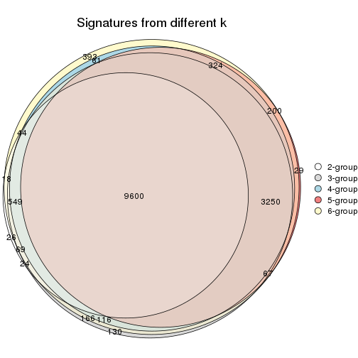

`get_signature()` returns a data frame invisibly. TO get the list of signatures, the function
call should be assigned to a variable explicitly. In following code, if `plot` argument is set
to `FALSE`, no heatmap is plotted while only the differential analysis is performed.

```r
# code only for demonstration
tb = get_signature(res, k = ..., plot = FALSE)
```

An example of the output of `tb` is:

```
#>   which_row         fdr    mean_1    mean_2 scaled_mean_1 scaled_mean_2 km
#> 1        38 0.042760348  8.373488  9.131774    -0.5533452     0.5164555  1
#> 2        40 0.018707592  7.106213  8.469186    -0.6173731     0.5762149  1
#> 3        55 0.019134737 10.221463 11.207825    -0.6159697     0.5749050  1
#> 4        59 0.006059896  5.921854  7.869574    -0.6899429     0.6439467  1
#> 5        60 0.018055526  8.928898 10.211722    -0.6204761     0.5791110  1
#> 6        98 0.009384629 15.714769 14.887706     0.6635654    -0.6193277  2
...
```

The columns in `tb` are:

1. `which_row`: row indices corresponding to the input matrix.
2. `fdr`: FDR for the differential test. 
3. `mean_x`: The mean value in group x.
4. `scaled_mean_x`: The mean value in group x after rows are scaled.
5. `km`: Row groups if k-means clustering is applied to rows.


UMAP plot which shows how samples are separated.


<script>
$( function() {
	$( '#tabs-MAD-kmeans-dimension-reduction' ).tabs();
} );
</script>
<div id='tabs-MAD-kmeans-dimension-reduction'>
<ul>
<li><a href='#tab-MAD-kmeans-dimension-reduction-1'>k = 2</a></li>
<li><a href='#tab-MAD-kmeans-dimension-reduction-2'>k = 3</a></li>
<li><a href='#tab-MAD-kmeans-dimension-reduction-3'>k = 4</a></li>
<li><a href='#tab-MAD-kmeans-dimension-reduction-4'>k = 5</a></li>
<li><a href='#tab-MAD-kmeans-dimension-reduction-5'>k = 6</a></li>
</ul>
<div id='tab-MAD-kmeans-dimension-reduction-1'>
<pre><code class="r">dimension_reduction(res, k = 2, method = &quot;UMAP&quot;)
</code></pre>

<p></p>

</div>
<div id='tab-MAD-kmeans-dimension-reduction-2'>
<pre><code class="r">dimension_reduction(res, k = 3, method = &quot;UMAP&quot;)
</code></pre>

<p></p>

</div>
<div id='tab-MAD-kmeans-dimension-reduction-3'>
<pre><code class="r">dimension_reduction(res, k = 4, method = &quot;UMAP&quot;)
</code></pre>

<p></p>

</div>
<div id='tab-MAD-kmeans-dimension-reduction-4'>
<pre><code class="r">dimension_reduction(res, k = 5, method = &quot;UMAP&quot;)
</code></pre>

<p></p>

</div>
<div id='tab-MAD-kmeans-dimension-reduction-5'>
<pre><code class="r">dimension_reduction(res, k = 6, method = &quot;UMAP&quot;)
</code></pre>

<p></p>

</div>
</div>


Following heatmap shows how subgroups are split when increasing `k`:

```r
collect_classes(res)
```


Test correlation between subgroups and known annotations. If the known
annotation is numeric, one-way ANOVA test is applied, and if the known
annotation is discrete, chi-squared contingency table test is applied.

```r
test_to_known_factors(res)
```

```
#>             n  dose(p)  time(p) k
#> MAD:kmeans 98 1.00e+00 1.00e+00 2
#> MAD:kmeans 81 5.94e-08 2.80e-02 3
#> MAD:kmeans 94 4.28e-11 6.68e-01 4
#> MAD:kmeans 81 3.18e-11 1.52e-01 5
#> MAD:kmeans 88 1.56e-11 6.03e-05 6
```


If matrix rows can be associated to genes, consider to use `GO_Enrichment(res,
...)` to perform function enrichment for the signature genes.


 

---------------------------------------------------


### MAD:skmeans**


The object with results only for a single top-value method and a single partition method 
can be extracted as:

```r
res = res_list["MAD", "skmeans"]
# you can also extract it by
# res = res_list["MAD:skmeans"]
```

A summary of `res` and all the functions that can be applied to it:

```r
res
```

```
#> A 'ConsensusPartition' object with k = 2, 3, 4, 5, 6.
#>   On a matrix with 16250 rows and 98 columns.
#>   Top rows (1000, 2000, 3000, 4000, 5000) are extracted by 'MAD' method.
#>   Subgroups are detected by 'skmeans' method.
#>   Performed in total 1250 partitions by row resampling.
#>   Best k for subgroups seems to be 6.
#> 
#> Following methods can be applied to this 'ConsensusPartition' object:
#>  [1] "cola_report"             "collect_classes"         "collect_plots"          
#>  [4] "collect_stats"           "colnames"                "compare_signatures"     
#>  [7] "consensus_heatmap"       "dimension_reduction"     "functional_enrichment"  
#> [10] "get_anno_col"            "get_anno"                "get_classes"            
#> [13] "get_consensus"           "get_matrix"              "get_membership"         
#> [16] "get_param"               "get_signatures"          "get_stats"              
#> [19] "is_best_k"               "is_stable_k"             "membership_heatmap"     
#> [22] "ncol"                    "nrow"                    "plot_ecdf"              
#> [25] "rownames"                "select_partition_number" "show"                   
#> [28] "suggest_best_k"          "test_to_known_factors"
```

`collect_plots()` function collects all the plots made from `res` for all `k` (number of partitions)
into one single page to provide an easy and fast comparison between different `k`.

```r
collect_plots(res)
```


The plots are:

- The first row: a plot of the ECDF (Empirical cumulative distribution
  function) curves of the consensus matrix for each `k` and the heatmap of
  predicted classes for each `k`.
- The second row: heatmaps of the consensus matrix for each `k`.
- The third row: heatmaps of the membership matrix for each `k`.
- The fouth row: heatmaps of the signatures for each `k`.

All the plots in panels can be made by individual functions and they are
plotted later in this section.

`select_partition_number()` produces several plots showing different
statistics for choosing "optimized" `k`. There are following statistics:

- ECDF curves of the consensus matrix for each `k`;
- 1-PAC. [The PAC
  score](https://en.wikipedia.org/wiki/Consensus_clustering#Over-interpretation_potential_of_consensus_clustering)
  measures the proportion of the ambiguous subgrouping.
- Mean silhouette score.
- Concordance. The mean probability of fiting the consensus class ids in all
  partitions.
- Area increased. Denote $A_k$ as the area under the ECDF curve for current
  `k`, the area increased is defined as $A_k - A_{k-1}$.
- Rand index. The percent of pairs of samples that are both in a same cluster
  or both are not in a same cluster in the partition of k and k-1.
- Jaccard index. The ratio of pairs of samples are both in a same cluster in
  the partition of k and k-1 and the pairs of samples are both in a same
  cluster in the partition k or k-1.

The detailed explanations of these statistics can be found in [the cola
vignette](http://bioconductor.org/packages/devel/bioc/vignettes/cola/inst/doc/cola.html#toc_13).

Generally speaking, lower PAC score, higher mean silhouette score or higher
concordance corresponds to better partition. Rand index and Jaccard index
measure how similar the current partition is compared to partition with `k-1`.
If they are too similar, we won't accept `k` is better than `k-1`.

```r
select_partition_number(res)
```


The numeric values for all these statistics can be obtained by `get_stats()`.

```r
get_stats(res)
```

```
#>   k 1-PAC mean_silhouette concordance area_increased  Rand Jaccard
#> 2 2 1.000           1.000       1.000         0.5056 0.495   0.495
#> 3 3 1.000           0.953       0.981         0.3090 0.787   0.593
#> 4 4 0.953           0.965       0.984         0.1318 0.877   0.657
#> 5 5 0.925           0.949       0.955         0.0597 0.931   0.739
#> 6 6 0.955           0.880       0.932         0.0522 0.932   0.686
```

`suggest_best_k()` suggests the best $k$ based on these statistics. The rules are as follows:

- All $k$ with Jaccard index larger than 0.95 are removed because the increase of
  the partition number does not provides enough extra information. If all $k$ are removed,
  the best $k$ is assigned by `NA`.
- For $k$ with 1-PAC larger than 0.9, the maximal $k$ is taken as the "best k". Other $k$ is called "optional k".
- If it does not fit the second rule. The $k$ with the highest vote of highest
  1-PAC, mean silhouette and concordance is taken as the "best k".

```r
suggest_best_k(res)
```

```
#> [1] 6
#> attr(,"optional")
#> [1] 2 3 4 5
```

There is also optional best $k$ = 2 3 4 5 that is worth to check.

Following shows the table of the partitions (You need to click the **show/hide
code output** link to see it). The membership matrix (columns with name `p*`)
is inferred by
[`clue::cl_consensus()`](https://www.rdocumentation.org/link/cl_consensus?package=clue)
function with the `SE` method. Basically the value in the membership matrix
represents the probability to belong to a certain group. The finall class
label for an item is determined with the group with highest probability it
belongs to.

In `get_classes()` function, the entropy is calculated from the membership
matrix and the silhouette score is calculated from the consensus matrix.


<script>
$( function() {
	$( '#tabs-MAD-skmeans-get-classes' ).tabs();
} );
</script>
<div id='tabs-MAD-skmeans-get-classes'>
<ul>
<li><a href='#tab-MAD-skmeans-get-classes-1'>k = 2</a></li>
<li><a href='#tab-MAD-skmeans-get-classes-2'>k = 3</a></li>
<li><a href='#tab-MAD-skmeans-get-classes-3'>k = 4</a></li>
<li><a href='#tab-MAD-skmeans-get-classes-4'>k = 5</a></li>
<li><a href='#tab-MAD-skmeans-get-classes-5'>k = 6</a></li>
</ul>

<div id='tab-MAD-skmeans-get-classes-1'>
<p><a id='tab-MAD-skmeans-get-classes-1-a' style='color:#0366d6' href='#'>show/hide code output</a></p>
<pre><code class="r">cbind(get_classes(res, k = 2), get_membership(res, k = 2))
</code></pre>

<pre><code>#&gt;           class entropy silhouette p1 p2
#&gt; GSM241451     2       0          1  0  1
#&gt; GSM241452     1       0          1  1  0
#&gt; GSM241453     2       0          1  0  1
#&gt; GSM241454     1       0          1  1  0
#&gt; GSM241455     2       0          1  0  1
#&gt; GSM241456     1       0          1  1  0
#&gt; GSM241457     2       0          1  0  1
#&gt; GSM241458     1       0          1  1  0
#&gt; GSM241459     2       0          1  0  1
#&gt; GSM241460     1       0          1  1  0
#&gt; GSM241461     2       0          1  0  1
#&gt; GSM241462     1       0          1  1  0
#&gt; GSM241463     2       0          1  0  1
#&gt; GSM241464     1       0          1  1  0
#&gt; GSM241465     2       0          1  0  1
#&gt; GSM241466     1       0          1  1  0
#&gt; GSM241467     1       0          1  1  0
#&gt; GSM241468     2       0          1  0  1
#&gt; GSM241469     1       0          1  1  0
#&gt; GSM241470     2       0          1  0  1
#&gt; GSM241471     2       0          1  0  1
#&gt; GSM241472     1       0          1  1  0
#&gt; GSM241473     2       0          1  0  1
#&gt; GSM241474     1       0          1  1  0
#&gt; GSM241475     2       0          1  0  1
#&gt; GSM241476     1       0          1  1  0
#&gt; GSM241477     2       0          1  0  1
#&gt; GSM241478     2       0          1  0  1
#&gt; GSM241479     1       0          1  1  0
#&gt; GSM241480     1       0          1  1  0
#&gt; GSM241481     2       0          1  0  1
#&gt; GSM241482     1       0          1  1  0
#&gt; GSM241483     2       0          1  0  1
#&gt; GSM241484     1       0          1  1  0
#&gt; GSM241485     1       0          1  1  0
#&gt; GSM241486     2       0          1  0  1
#&gt; GSM241487     2       0          1  0  1
#&gt; GSM241488     2       0          1  0  1
#&gt; GSM241489     1       0          1  1  0
#&gt; GSM241490     1       0          1  1  0
#&gt; GSM241491     2       0          1  0  1
#&gt; GSM241492     1       0          1  1  0
#&gt; GSM241493     2       0          1  0  1
#&gt; GSM241494     1       0          1  1  0
#&gt; GSM241495     2       0          1  0  1
#&gt; GSM241496     2       0          1  0  1
#&gt; GSM241497     1       0          1  1  0
#&gt; GSM241498     1       0          1  1  0
#&gt; GSM241499     1       0          1  1  0
#&gt; GSM241500     2       0          1  0  1
#&gt; GSM241501     2       0          1  0  1
#&gt; GSM241502     2       0          1  0  1
#&gt; GSM241503     1       0          1  1  0
#&gt; GSM241504     1       0          1  1  0
#&gt; GSM241505     1       0          1  1  0
#&gt; GSM241506     2       0          1  0  1
#&gt; GSM241507     1       0          1  1  0
#&gt; GSM241508     2       0          1  0  1
#&gt; GSM241509     2       0          1  0  1
#&gt; GSM241510     2       0          1  0  1
#&gt; GSM241511     1       0          1  1  0
#&gt; GSM241512     1       0          1  1  0
#&gt; GSM241513     2       0          1  0  1
#&gt; GSM241514     1       0          1  1  0
#&gt; GSM241515     2       0          1  0  1
#&gt; GSM241516     1       0          1  1  0
#&gt; GSM241517     2       0          1  0  1
#&gt; GSM241518     1       0          1  1  0
#&gt; GSM241519     2       0          1  0  1
#&gt; GSM241520     1       0          1  1  0
#&gt; GSM241521     2       0          1  0  1
#&gt; GSM241522     1       0          1  1  0
#&gt; GSM241523     2       0          1  0  1
#&gt; GSM241524     1       0          1  1  0
#&gt; GSM241525     1       0          1  1  0
#&gt; GSM241526     2       0          1  0  1
#&gt; GSM241527     1       0          1  1  0
#&gt; GSM241528     2       0          1  0  1
#&gt; GSM241529     2       0          1  0  1
#&gt; GSM241530     1       0          1  1  0
#&gt; GSM241531     1       0          1  1  0
#&gt; GSM241532     2       0          1  0  1
#&gt; GSM241533     2       0          1  0  1
#&gt; GSM241534     2       0          1  0  1
#&gt; GSM241535     1       0          1  1  0
#&gt; GSM241536     1       0          1  1  0
#&gt; GSM241537     2       0          1  0  1
#&gt; GSM241538     1       0          1  1  0
#&gt; GSM241539     2       0          1  0  1
#&gt; GSM241540     1       0          1  1  0
#&gt; GSM241541     2       0          1  0  1
#&gt; GSM241542     1       0          1  1  0
#&gt; GSM241543     2       0          1  0  1
#&gt; GSM241544     1       0          1  1  0
#&gt; GSM241545     2       0          1  0  1
#&gt; GSM241546     1       0          1  1  0
#&gt; GSM241547     2       0          1  0  1
#&gt; GSM241548     1       0          1  1  0
</code></pre>

<script>
$('#tab-MAD-skmeans-get-classes-1-a').parent().next().next().hide();
$('#tab-MAD-skmeans-get-classes-1-a').click(function(){
  $('#tab-MAD-skmeans-get-classes-1-a').parent().next().next().toggle();
  return(false);
});
</script>
</div>

<div id='tab-MAD-skmeans-get-classes-2'>
<p><a id='tab-MAD-skmeans-get-classes-2-a' style='color:#0366d6' href='#'>show/hide code output</a></p>
<pre><code class="r">cbind(get_classes(res, k = 3), get_membership(res, k = 3))
</code></pre>

<pre><code>#&gt;           class entropy silhouette    p1    p2    p3
#&gt; GSM241451     2  0.0000     1.0000 0.000 1.000 0.000
#&gt; GSM241452     1  0.0000     0.9748 1.000 0.000 0.000
#&gt; GSM241453     2  0.0000     1.0000 0.000 1.000 0.000
#&gt; GSM241454     1  0.0000     0.9748 1.000 0.000 0.000
#&gt; GSM241455     2  0.0000     1.0000 0.000 1.000 0.000
#&gt; GSM241456     1  0.0000     0.9748 1.000 0.000 0.000
#&gt; GSM241457     2  0.0000     1.0000 0.000 1.000 0.000
#&gt; GSM241458     1  0.0000     0.9748 1.000 0.000 0.000
#&gt; GSM241459     2  0.0000     1.0000 0.000 1.000 0.000
#&gt; GSM241460     1  0.0000     0.9748 1.000 0.000 0.000
#&gt; GSM241461     2  0.0000     1.0000 0.000 1.000 0.000
#&gt; GSM241462     1  0.0000     0.9748 1.000 0.000 0.000
#&gt; GSM241463     2  0.0000     1.0000 0.000 1.000 0.000
#&gt; GSM241464     1  0.0000     0.9748 1.000 0.000 0.000
#&gt; GSM241465     2  0.0000     1.0000 0.000 1.000 0.000
#&gt; GSM241466     1  0.0000     0.9748 1.000 0.000 0.000
#&gt; GSM241467     1  0.0000     0.9748 1.000 0.000 0.000
#&gt; GSM241468     2  0.0000     1.0000 0.000 1.000 0.000
#&gt; GSM241469     1  0.0000     0.9748 1.000 0.000 0.000
#&gt; GSM241470     2  0.0000     1.0000 0.000 1.000 0.000
#&gt; GSM241471     2  0.0000     1.0000 0.000 1.000 0.000
#&gt; GSM241472     1  0.0000     0.9748 1.000 0.000 0.000
#&gt; GSM241473     2  0.0000     1.0000 0.000 1.000 0.000
#&gt; GSM241474     1  0.0000     0.9748 1.000 0.000 0.000
#&gt; GSM241475     2  0.0000     1.0000 0.000 1.000 0.000
#&gt; GSM241476     1  0.0000     0.9748 1.000 0.000 0.000
#&gt; GSM241477     2  0.0000     1.0000 0.000 1.000 0.000
#&gt; GSM241478     2  0.0000     1.0000 0.000 1.000 0.000
#&gt; GSM241479     1  0.0000     0.9748 1.000 0.000 0.000
#&gt; GSM241480     1  0.0000     0.9748 1.000 0.000 0.000
#&gt; GSM241481     2  0.0000     1.0000 0.000 1.000 0.000
#&gt; GSM241482     1  0.0000     0.9748 1.000 0.000 0.000
#&gt; GSM241483     2  0.0000     1.0000 0.000 1.000 0.000
#&gt; GSM241484     1  0.0000     0.9748 1.000 0.000 0.000
#&gt; GSM241485     1  0.0000     0.9748 1.000 0.000 0.000
#&gt; GSM241486     2  0.0000     1.0000 0.000 1.000 0.000
#&gt; GSM241487     2  0.0000     1.0000 0.000 1.000 0.000
#&gt; GSM241488     2  0.0000     1.0000 0.000 1.000 0.000
#&gt; GSM241489     1  0.0000     0.9748 1.000 0.000 0.000
#&gt; GSM241490     1  0.0000     0.9748 1.000 0.000 0.000
#&gt; GSM241491     2  0.0000     1.0000 0.000 1.000 0.000
#&gt; GSM241492     1  0.0000     0.9748 1.000 0.000 0.000
#&gt; GSM241493     2  0.0000     1.0000 0.000 1.000 0.000
#&gt; GSM241494     1  0.0000     0.9748 1.000 0.000 0.000
#&gt; GSM241495     2  0.0000     1.0000 0.000 1.000 0.000
#&gt; GSM241496     2  0.0000     1.0000 0.000 1.000 0.000
#&gt; GSM241497     1  0.0000     0.9748 1.000 0.000 0.000
#&gt; GSM241498     1  0.0000     0.9748 1.000 0.000 0.000
#&gt; GSM241499     1  0.0000     0.9748 1.000 0.000 0.000
#&gt; GSM241500     2  0.0000     1.0000 0.000 1.000 0.000
#&gt; GSM241501     2  0.0000     1.0000 0.000 1.000 0.000
#&gt; GSM241502     2  0.0000     1.0000 0.000 1.000 0.000
#&gt; GSM241503     1  0.0000     0.9748 1.000 0.000 0.000
#&gt; GSM241504     1  0.0000     0.9748 1.000 0.000 0.000
#&gt; GSM241505     1  0.0000     0.9748 1.000 0.000 0.000
#&gt; GSM241506     2  0.0000     1.0000 0.000 1.000 0.000
#&gt; GSM241507     1  0.0000     0.9748 1.000 0.000 0.000
#&gt; GSM241508     2  0.0000     1.0000 0.000 1.000 0.000
#&gt; GSM241509     3  0.2796     0.8957 0.000 0.092 0.908
#&gt; GSM241510     3  0.0747     0.9664 0.000 0.016 0.984
#&gt; GSM241511     1  0.0000     0.9748 1.000 0.000 0.000
#&gt; GSM241512     1  0.0747     0.9639 0.984 0.000 0.016
#&gt; GSM241513     3  0.0000     0.9685 0.000 0.000 1.000
#&gt; GSM241514     1  0.0747     0.9639 0.984 0.000 0.016
#&gt; GSM241515     3  0.0000     0.9685 0.000 0.000 1.000
#&gt; GSM241516     1  0.0747     0.9639 0.984 0.000 0.016
#&gt; GSM241517     3  0.0747     0.9664 0.000 0.016 0.984
#&gt; GSM241518     3  0.0000     0.9685 0.000 0.000 1.000
#&gt; GSM241519     3  0.0747     0.9664 0.000 0.016 0.984
#&gt; GSM241520     3  0.2537     0.8916 0.080 0.000 0.920
#&gt; GSM241521     3  0.6274     0.1682 0.000 0.456 0.544
#&gt; GSM241522     1  0.0000     0.9748 1.000 0.000 0.000
#&gt; GSM241523     3  0.0747     0.9664 0.000 0.016 0.984
#&gt; GSM241524     1  0.0747     0.9639 0.984 0.000 0.016
#&gt; GSM241525     1  0.0000     0.9748 1.000 0.000 0.000
#&gt; GSM241526     3  0.0747     0.9664 0.000 0.016 0.984
#&gt; GSM241527     1  0.6267     0.2016 0.548 0.000 0.452
#&gt; GSM241528     3  0.0747     0.9664 0.000 0.016 0.984
#&gt; GSM241529     3  0.0747     0.9664 0.000 0.016 0.984
#&gt; GSM241530     1  0.0000     0.9748 1.000 0.000 0.000
#&gt; GSM241531     1  0.0000     0.9748 1.000 0.000 0.000
#&gt; GSM241532     3  0.0747     0.9664 0.000 0.016 0.984
#&gt; GSM241533     3  0.0747     0.9664 0.000 0.016 0.984
#&gt; GSM241534     3  0.0747     0.9664 0.000 0.016 0.984
#&gt; GSM241535     3  0.0000     0.9685 0.000 0.000 1.000
#&gt; GSM241536     1  0.0000     0.9748 1.000 0.000 0.000
#&gt; GSM241537     3  0.0000     0.9685 0.000 0.000 1.000
#&gt; GSM241538     3  0.0000     0.9685 0.000 0.000 1.000
#&gt; GSM241539     3  0.0000     0.9685 0.000 0.000 1.000
#&gt; GSM241540     1  0.6305     0.0949 0.516 0.000 0.484
#&gt; GSM241541     3  0.0000     0.9685 0.000 0.000 1.000
#&gt; GSM241542     3  0.0000     0.9685 0.000 0.000 1.000
#&gt; GSM241543     3  0.0000     0.9685 0.000 0.000 1.000
#&gt; GSM241544     3  0.0237     0.9662 0.004 0.000 0.996
#&gt; GSM241545     3  0.0000     0.9685 0.000 0.000 1.000
#&gt; GSM241546     1  0.1031     0.9573 0.976 0.000 0.024
#&gt; GSM241547     3  0.0000     0.9685 0.000 0.000 1.000
#&gt; GSM241548     3  0.0000     0.9685 0.000 0.000 1.000
</code></pre>

<script>
$('#tab-MAD-skmeans-get-classes-2-a').parent().next().next().hide();
$('#tab-MAD-skmeans-get-classes-2-a').click(function(){
  $('#tab-MAD-skmeans-get-classes-2-a').parent().next().next().toggle();
  return(false);
});
</script>
</div>

<div id='tab-MAD-skmeans-get-classes-3'>
<p><a id='tab-MAD-skmeans-get-classes-3-a' style='color:#0366d6' href='#'>show/hide code output</a></p>
<pre><code class="r">cbind(get_classes(res, k = 4), get_membership(res, k = 4))
</code></pre>

<pre><code>#&gt;           class entropy silhouette    p1    p2    p3    p4
#&gt; GSM241451     2  0.0000      0.962 0.000 1.000 0.000 0.000
#&gt; GSM241452     1  0.0000      0.984 1.000 0.000 0.000 0.000
#&gt; GSM241453     2  0.0000      0.962 0.000 1.000 0.000 0.000
#&gt; GSM241454     1  0.0000      0.984 1.000 0.000 0.000 0.000
#&gt; GSM241455     2  0.0000      0.962 0.000 1.000 0.000 0.000
#&gt; GSM241456     1  0.0000      0.984 1.000 0.000 0.000 0.000
#&gt; GSM241457     2  0.0188      0.960 0.000 0.996 0.000 0.004
#&gt; GSM241458     1  0.0000      0.984 1.000 0.000 0.000 0.000
#&gt; GSM241459     2  0.0188      0.960 0.000 0.996 0.000 0.004
#&gt; GSM241460     1  0.0000      0.984 1.000 0.000 0.000 0.000
#&gt; GSM241461     2  0.0188      0.960 0.000 0.996 0.000 0.004
#&gt; GSM241462     1  0.0000      0.984 1.000 0.000 0.000 0.000
#&gt; GSM241463     2  0.0000      0.962 0.000 1.000 0.000 0.000
#&gt; GSM241464     1  0.0000      0.984 1.000 0.000 0.000 0.000
#&gt; GSM241465     2  0.0000      0.962 0.000 1.000 0.000 0.000
#&gt; GSM241466     1  0.0000      0.984 1.000 0.000 0.000 0.000
#&gt; GSM241467     1  0.0000      0.984 1.000 0.000 0.000 0.000
#&gt; GSM241468     2  0.0000      0.962 0.000 1.000 0.000 0.000
#&gt; GSM241469     1  0.0000      0.984 1.000 0.000 0.000 0.000
#&gt; GSM241470     2  0.0000      0.962 0.000 1.000 0.000 0.000
#&gt; GSM241471     2  0.0000      0.962 0.000 1.000 0.000 0.000
#&gt; GSM241472     1  0.0000      0.984 1.000 0.000 0.000 0.000
#&gt; GSM241473     2  0.0000      0.962 0.000 1.000 0.000 0.000
#&gt; GSM241474     1  0.0000      0.984 1.000 0.000 0.000 0.000
#&gt; GSM241475     2  0.0000      0.962 0.000 1.000 0.000 0.000
#&gt; GSM241476     1  0.0000      0.984 1.000 0.000 0.000 0.000
#&gt; GSM241477     2  0.0000      0.962 0.000 1.000 0.000 0.000
#&gt; GSM241478     2  0.0000      0.962 0.000 1.000 0.000 0.000
#&gt; GSM241479     1  0.0000      0.984 1.000 0.000 0.000 0.000
#&gt; GSM241480     1  0.0000      0.984 1.000 0.000 0.000 0.000
#&gt; GSM241481     2  0.0188      0.960 0.000 0.996 0.000 0.004
#&gt; GSM241482     1  0.0000      0.984 1.000 0.000 0.000 0.000
#&gt; GSM241483     2  0.0188      0.960 0.000 0.996 0.000 0.004
#&gt; GSM241484     1  0.0000      0.984 1.000 0.000 0.000 0.000
#&gt; GSM241485     1  0.0000      0.984 1.000 0.000 0.000 0.000
#&gt; GSM241486     2  0.0188      0.960 0.000 0.996 0.000 0.004
#&gt; GSM241487     2  0.0000      0.962 0.000 1.000 0.000 0.000
#&gt; GSM241488     2  0.0000      0.962 0.000 1.000 0.000 0.000
#&gt; GSM241489     1  0.0000      0.984 1.000 0.000 0.000 0.000
#&gt; GSM241490     1  0.0000      0.984 1.000 0.000 0.000 0.000
#&gt; GSM241491     2  0.0000      0.962 0.000 1.000 0.000 0.000
#&gt; GSM241492     1  0.0000      0.984 1.000 0.000 0.000 0.000
#&gt; GSM241493     2  0.0000      0.962 0.000 1.000 0.000 0.000
#&gt; GSM241494     1  0.0000      0.984 1.000 0.000 0.000 0.000
#&gt; GSM241495     2  0.0000      0.962 0.000 1.000 0.000 0.000
#&gt; GSM241496     2  0.0000      0.962 0.000 1.000 0.000 0.000
#&gt; GSM241497     1  0.0000      0.984 1.000 0.000 0.000 0.000
#&gt; GSM241498     1  0.0000      0.984 1.000 0.000 0.000 0.000
#&gt; GSM241499     1  0.0000      0.984 1.000 0.000 0.000 0.000
#&gt; GSM241500     2  0.3649      0.783 0.000 0.796 0.000 0.204
#&gt; GSM241501     2  0.3649      0.783 0.000 0.796 0.000 0.204
#&gt; GSM241502     2  0.3649      0.783 0.000 0.796 0.000 0.204
#&gt; GSM241503     1  0.0000      0.984 1.000 0.000 0.000 0.000
#&gt; GSM241504     1  0.0000      0.984 1.000 0.000 0.000 0.000
#&gt; GSM241505     1  0.0000      0.984 1.000 0.000 0.000 0.000
#&gt; GSM241506     2  0.3649      0.783 0.000 0.796 0.000 0.204
#&gt; GSM241507     1  0.0000      0.984 1.000 0.000 0.000 0.000
#&gt; GSM241508     2  0.3649      0.783 0.000 0.796 0.000 0.204
#&gt; GSM241509     4  0.0000      0.997 0.000 0.000 0.000 1.000
#&gt; GSM241510     4  0.0000      0.997 0.000 0.000 0.000 1.000
#&gt; GSM241511     3  0.0188      0.996 0.004 0.000 0.996 0.000
#&gt; GSM241512     3  0.0000      0.999 0.000 0.000 1.000 0.000
#&gt; GSM241513     4  0.0188      0.997 0.000 0.000 0.004 0.996
#&gt; GSM241514     3  0.0000      0.999 0.000 0.000 1.000 0.000
#&gt; GSM241515     4  0.0188      0.997 0.000 0.000 0.004 0.996
#&gt; GSM241516     3  0.0000      0.999 0.000 0.000 1.000 0.000
#&gt; GSM241517     4  0.0188      0.996 0.000 0.004 0.000 0.996
#&gt; GSM241518     3  0.0000      0.999 0.000 0.000 1.000 0.000
#&gt; GSM241519     4  0.0188      0.996 0.000 0.004 0.000 0.996
#&gt; GSM241520     3  0.0000      0.999 0.000 0.000 1.000 0.000
#&gt; GSM241521     4  0.0188      0.996 0.000 0.004 0.000 0.996
#&gt; GSM241522     1  0.4981      0.132 0.536 0.000 0.464 0.000
#&gt; GSM241523     4  0.0188      0.996 0.000 0.004 0.000 0.996
#&gt; GSM241524     3  0.0000      0.999 0.000 0.000 1.000 0.000
#&gt; GSM241525     3  0.0188      0.996 0.004 0.000 0.996 0.000
#&gt; GSM241526     4  0.0000      0.997 0.000 0.000 0.000 1.000
#&gt; GSM241527     3  0.0000      0.999 0.000 0.000 1.000 0.000
#&gt; GSM241528     4  0.0000      0.997 0.000 0.000 0.000 1.000
#&gt; GSM241529     4  0.0000      0.997 0.000 0.000 0.000 1.000
#&gt; GSM241530     3  0.0188      0.996 0.004 0.000 0.996 0.000
#&gt; GSM241531     3  0.0188      0.996 0.004 0.000 0.996 0.000
#&gt; GSM241532     4  0.0000      0.997 0.000 0.000 0.000 1.000
#&gt; GSM241533     4  0.0000      0.997 0.000 0.000 0.000 1.000
#&gt; GSM241534     4  0.0000      0.997 0.000 0.000 0.000 1.000
#&gt; GSM241535     3  0.0000      0.999 0.000 0.000 1.000 0.000
#&gt; GSM241536     3  0.0188      0.996 0.004 0.000 0.996 0.000
#&gt; GSM241537     4  0.0188      0.997 0.000 0.000 0.004 0.996
#&gt; GSM241538     3  0.0000      0.999 0.000 0.000 1.000 0.000
#&gt; GSM241539     4  0.0188      0.997 0.000 0.000 0.004 0.996
#&gt; GSM241540     3  0.0000      0.999 0.000 0.000 1.000 0.000
#&gt; GSM241541     4  0.0188      0.997 0.000 0.000 0.004 0.996
#&gt; GSM241542     3  0.0000      0.999 0.000 0.000 1.000 0.000
#&gt; GSM241543     4  0.0188      0.997 0.000 0.000 0.004 0.996
#&gt; GSM241544     3  0.0000      0.999 0.000 0.000 1.000 0.000
#&gt; GSM241545     4  0.0188      0.997 0.000 0.000 0.004 0.996
#&gt; GSM241546     3  0.0000      0.999 0.000 0.000 1.000 0.000
#&gt; GSM241547     4  0.0188      0.997 0.000 0.000 0.004 0.996
#&gt; GSM241548     3  0.0000      0.999 0.000 0.000 1.000 0.000
</code></pre>

<script>
$('#tab-MAD-skmeans-get-classes-3-a').parent().next().next().hide();
$('#tab-MAD-skmeans-get-classes-3-a').click(function(){
  $('#tab-MAD-skmeans-get-classes-3-a').parent().next().next().toggle();
  return(false);
});
</script>
</div>

<div id='tab-MAD-skmeans-get-classes-4'>
<p><a id='tab-MAD-skmeans-get-classes-4-a' style='color:#0366d6' href='#'>show/hide code output</a></p>
<pre><code class="r">cbind(get_classes(res, k = 5), get_membership(res, k = 5))
</code></pre>

<pre><code>#&gt;           class entropy silhouette    p1    p2    p3    p4    p5
#&gt; GSM241451     2   0.000     1.0000 0.000 1.000 0.000 0.000 0.000
#&gt; GSM241452     1   0.000     0.9516 1.000 0.000 0.000 0.000 0.000
#&gt; GSM241453     2   0.000     1.0000 0.000 1.000 0.000 0.000 0.000
#&gt; GSM241454     1   0.000     0.9516 1.000 0.000 0.000 0.000 0.000
#&gt; GSM241455     2   0.000     1.0000 0.000 1.000 0.000 0.000 0.000
#&gt; GSM241456     1   0.000     0.9516 1.000 0.000 0.000 0.000 0.000
#&gt; GSM241457     5   0.252     0.9099 0.000 0.140 0.000 0.000 0.860
#&gt; GSM241458     1   0.154     0.9344 0.932 0.000 0.000 0.000 0.068
#&gt; GSM241459     5   0.252     0.9099 0.000 0.140 0.000 0.000 0.860
#&gt; GSM241460     1   0.154     0.9344 0.932 0.000 0.000 0.000 0.068
#&gt; GSM241461     5   0.242     0.9142 0.000 0.132 0.000 0.000 0.868
#&gt; GSM241462     1   0.154     0.9344 0.932 0.000 0.000 0.000 0.068
#&gt; GSM241463     2   0.000     1.0000 0.000 1.000 0.000 0.000 0.000
#&gt; GSM241464     1   0.000     0.9516 1.000 0.000 0.000 0.000 0.000
#&gt; GSM241465     2   0.000     1.0000 0.000 1.000 0.000 0.000 0.000
#&gt; GSM241466     1   0.000     0.9516 1.000 0.000 0.000 0.000 0.000
#&gt; GSM241467     1   0.000     0.9516 1.000 0.000 0.000 0.000 0.000
#&gt; GSM241468     2   0.000     1.0000 0.000 1.000 0.000 0.000 0.000
#&gt; GSM241469     1   0.000     0.9516 1.000 0.000 0.000 0.000 0.000
#&gt; GSM241470     2   0.000     1.0000 0.000 1.000 0.000 0.000 0.000
#&gt; GSM241471     2   0.000     1.0000 0.000 1.000 0.000 0.000 0.000
#&gt; GSM241472     1   0.000     0.9516 1.000 0.000 0.000 0.000 0.000
#&gt; GSM241473     2   0.000     1.0000 0.000 1.000 0.000 0.000 0.000
#&gt; GSM241474     1   0.000     0.9516 1.000 0.000 0.000 0.000 0.000
#&gt; GSM241475     2   0.000     1.0000 0.000 1.000 0.000 0.000 0.000
#&gt; GSM241476     1   0.000     0.9516 1.000 0.000 0.000 0.000 0.000
#&gt; GSM241477     2   0.000     1.0000 0.000 1.000 0.000 0.000 0.000
#&gt; GSM241478     2   0.000     1.0000 0.000 1.000 0.000 0.000 0.000
#&gt; GSM241479     1   0.000     0.9516 1.000 0.000 0.000 0.000 0.000
#&gt; GSM241480     1   0.000     0.9516 1.000 0.000 0.000 0.000 0.000
#&gt; GSM241481     5   0.252     0.9099 0.000 0.140 0.000 0.000 0.860
#&gt; GSM241482     1   0.154     0.9344 0.932 0.000 0.000 0.000 0.068
#&gt; GSM241483     5   0.247     0.9123 0.000 0.136 0.000 0.000 0.864
#&gt; GSM241484     1   0.154     0.9344 0.932 0.000 0.000 0.000 0.068
#&gt; GSM241485     1   0.154     0.9344 0.932 0.000 0.000 0.000 0.068
#&gt; GSM241486     5   0.242     0.9142 0.000 0.132 0.000 0.000 0.868
#&gt; GSM241487     2   0.000     1.0000 0.000 1.000 0.000 0.000 0.000
#&gt; GSM241488     2   0.000     1.0000 0.000 1.000 0.000 0.000 0.000
#&gt; GSM241489     1   0.000     0.9516 1.000 0.000 0.000 0.000 0.000
#&gt; GSM241490     1   0.000     0.9516 1.000 0.000 0.000 0.000 0.000
#&gt; GSM241491     2   0.000     1.0000 0.000 1.000 0.000 0.000 0.000
#&gt; GSM241492     1   0.000     0.9516 1.000 0.000 0.000 0.000 0.000
#&gt; GSM241493     2   0.000     1.0000 0.000 1.000 0.000 0.000 0.000
#&gt; GSM241494     1   0.000     0.9516 1.000 0.000 0.000 0.000 0.000
#&gt; GSM241495     2   0.000     1.0000 0.000 1.000 0.000 0.000 0.000
#&gt; GSM241496     2   0.000     1.0000 0.000 1.000 0.000 0.000 0.000
#&gt; GSM241497     1   0.000     0.9516 1.000 0.000 0.000 0.000 0.000
#&gt; GSM241498     1   0.000     0.9516 1.000 0.000 0.000 0.000 0.000
#&gt; GSM241499     1   0.242     0.9014 0.868 0.000 0.000 0.000 0.132
#&gt; GSM241500     5   0.298     0.9334 0.000 0.076 0.056 0.000 0.868
#&gt; GSM241501     5   0.298     0.9334 0.000 0.076 0.056 0.000 0.868
#&gt; GSM241502     5   0.298     0.9334 0.000 0.076 0.056 0.000 0.868
#&gt; GSM241503     1   0.242     0.9014 0.868 0.000 0.000 0.000 0.132
#&gt; GSM241504     1   0.242     0.9014 0.868 0.000 0.000 0.000 0.132
#&gt; GSM241505     1   0.242     0.9014 0.868 0.000 0.000 0.000 0.132
#&gt; GSM241506     5   0.298     0.9334 0.000 0.076 0.056 0.000 0.868
#&gt; GSM241507     1   0.242     0.9014 0.868 0.000 0.000 0.000 0.132
#&gt; GSM241508     5   0.298     0.9334 0.000 0.076 0.056 0.000 0.868
#&gt; GSM241509     5   0.242     0.8892 0.000 0.000 0.132 0.000 0.868
#&gt; GSM241510     5   0.242     0.8892 0.000 0.000 0.132 0.000 0.868
#&gt; GSM241511     4   0.242     0.9142 0.000 0.000 0.000 0.868 0.132
#&gt; GSM241512     4   0.154     0.9525 0.000 0.000 0.000 0.932 0.068
#&gt; GSM241513     3   0.000     1.0000 0.000 0.000 1.000 0.000 0.000
#&gt; GSM241514     4   0.000     0.9664 0.000 0.000 0.000 1.000 0.000
#&gt; GSM241515     3   0.000     1.0000 0.000 0.000 1.000 0.000 0.000
#&gt; GSM241516     4   0.000     0.9664 0.000 0.000 0.000 1.000 0.000
#&gt; GSM241517     3   0.000     1.0000 0.000 0.000 1.000 0.000 0.000
#&gt; GSM241518     4   0.000     0.9664 0.000 0.000 0.000 1.000 0.000
#&gt; GSM241519     3   0.000     1.0000 0.000 0.000 1.000 0.000 0.000
#&gt; GSM241520     4   0.000     0.9664 0.000 0.000 0.000 1.000 0.000
#&gt; GSM241521     3   0.000     1.0000 0.000 0.000 1.000 0.000 0.000
#&gt; GSM241522     1   0.431     0.0586 0.508 0.000 0.000 0.492 0.000
#&gt; GSM241523     3   0.000     1.0000 0.000 0.000 1.000 0.000 0.000
#&gt; GSM241524     4   0.000     0.9664 0.000 0.000 0.000 1.000 0.000
#&gt; GSM241525     4   0.148     0.9541 0.000 0.000 0.000 0.936 0.064
#&gt; GSM241526     3   0.000     1.0000 0.000 0.000 1.000 0.000 0.000
#&gt; GSM241527     4   0.148     0.9541 0.000 0.000 0.000 0.936 0.064
#&gt; GSM241528     3   0.000     1.0000 0.000 0.000 1.000 0.000 0.000
#&gt; GSM241529     3   0.000     1.0000 0.000 0.000 1.000 0.000 0.000
#&gt; GSM241530     4   0.148     0.9541 0.000 0.000 0.000 0.936 0.064
#&gt; GSM241531     4   0.242     0.9142 0.000 0.000 0.000 0.868 0.132
#&gt; GSM241532     5   0.242     0.8892 0.000 0.000 0.132 0.000 0.868
#&gt; GSM241533     5   0.242     0.8892 0.000 0.000 0.132 0.000 0.868
#&gt; GSM241534     5   0.242     0.8892 0.000 0.000 0.132 0.000 0.868
#&gt; GSM241535     4   0.148     0.9541 0.000 0.000 0.000 0.936 0.064
#&gt; GSM241536     4   0.242     0.9142 0.000 0.000 0.000 0.868 0.132
#&gt; GSM241537     3   0.000     1.0000 0.000 0.000 1.000 0.000 0.000
#&gt; GSM241538     4   0.000     0.9664 0.000 0.000 0.000 1.000 0.000
#&gt; GSM241539     3   0.000     1.0000 0.000 0.000 1.000 0.000 0.000
#&gt; GSM241540     4   0.000     0.9664 0.000 0.000 0.000 1.000 0.000
#&gt; GSM241541     3   0.000     1.0000 0.000 0.000 1.000 0.000 0.000
#&gt; GSM241542     4   0.000     0.9664 0.000 0.000 0.000 1.000 0.000
#&gt; GSM241543     3   0.000     1.0000 0.000 0.000 1.000 0.000 0.000
#&gt; GSM241544     4   0.000     0.9664 0.000 0.000 0.000 1.000 0.000
#&gt; GSM241545     3   0.000     1.0000 0.000 0.000 1.000 0.000 0.000
#&gt; GSM241546     4   0.000     0.9664 0.000 0.000 0.000 1.000 0.000
#&gt; GSM241547     3   0.000     1.0000 0.000 0.000 1.000 0.000 0.000
#&gt; GSM241548     4   0.000     0.9664 0.000 0.000 0.000 1.000 0.000
</code></pre>

<script>
$('#tab-MAD-skmeans-get-classes-4-a').parent().next().next().hide();
$('#tab-MAD-skmeans-get-classes-4-a').click(function(){
  $('#tab-MAD-skmeans-get-classes-4-a').parent().next().next().toggle();
  return(false);
});
</script>
</div>

<div id='tab-MAD-skmeans-get-classes-5'>
<p><a id='tab-MAD-skmeans-get-classes-5-a' style='color:#0366d6' href='#'>show/hide code output</a></p>
<pre><code class="r">cbind(get_classes(res, k = 6), get_membership(res, k = 6))
</code></pre>

<pre><code>#&gt;           class entropy silhouette    p1    p2    p3    p4    p5    p6
#&gt; GSM241451     2  0.0000      1.000 0.000 1.000 0.000 0.000 0.000 0.000
#&gt; GSM241452     1  0.3756      0.999 0.600 0.000 0.000 0.000 0.000 0.400
#&gt; GSM241453     2  0.0000      1.000 0.000 1.000 0.000 0.000 0.000 0.000
#&gt; GSM241454     1  0.3756      0.999 0.600 0.000 0.000 0.000 0.000 0.400
#&gt; GSM241455     2  0.0000      1.000 0.000 1.000 0.000 0.000 0.000 0.000
#&gt; GSM241456     1  0.3756      0.999 0.600 0.000 0.000 0.000 0.000 0.400
#&gt; GSM241457     5  0.1327      0.945 0.000 0.064 0.000 0.000 0.936 0.000
#&gt; GSM241458     6  0.0547      0.529 0.020 0.000 0.000 0.000 0.000 0.980
#&gt; GSM241459     5  0.1327      0.945 0.000 0.064 0.000 0.000 0.936 0.000
#&gt; GSM241460     6  0.2527      0.107 0.168 0.000 0.000 0.000 0.000 0.832
#&gt; GSM241461     5  0.0937      0.958 0.000 0.040 0.000 0.000 0.960 0.000
#&gt; GSM241462     6  0.0000      0.559 0.000 0.000 0.000 0.000 0.000 1.000
#&gt; GSM241463     2  0.0000      1.000 0.000 1.000 0.000 0.000 0.000 0.000
#&gt; GSM241464     1  0.3747      0.995 0.604 0.000 0.000 0.000 0.000 0.396
#&gt; GSM241465     2  0.0000      1.000 0.000 1.000 0.000 0.000 0.000 0.000
#&gt; GSM241466     1  0.3756      0.999 0.600 0.000 0.000 0.000 0.000 0.400
#&gt; GSM241467     1  0.3756      0.999 0.600 0.000 0.000 0.000 0.000 0.400
#&gt; GSM241468     2  0.0000      1.000 0.000 1.000 0.000 0.000 0.000 0.000
#&gt; GSM241469     1  0.3756      0.999 0.600 0.000 0.000 0.000 0.000 0.400
#&gt; GSM241470     2  0.0000      1.000 0.000 1.000 0.000 0.000 0.000 0.000
#&gt; GSM241471     2  0.0000      1.000 0.000 1.000 0.000 0.000 0.000 0.000
#&gt; GSM241472     1  0.3756      0.999 0.600 0.000 0.000 0.000 0.000 0.400
#&gt; GSM241473     2  0.0000      1.000 0.000 1.000 0.000 0.000 0.000 0.000
#&gt; GSM241474     1  0.3756      0.999 0.600 0.000 0.000 0.000 0.000 0.400
#&gt; GSM241475     2  0.0000      1.000 0.000 1.000 0.000 0.000 0.000 0.000
#&gt; GSM241476     1  0.3756      0.999 0.600 0.000 0.000 0.000 0.000 0.400
#&gt; GSM241477     2  0.0000      1.000 0.000 1.000 0.000 0.000 0.000 0.000
#&gt; GSM241478     2  0.0000      1.000 0.000 1.000 0.000 0.000 0.000 0.000
#&gt; GSM241479     1  0.3756      0.999 0.600 0.000 0.000 0.000 0.000 0.400
#&gt; GSM241480     1  0.3756      0.999 0.600 0.000 0.000 0.000 0.000 0.400
#&gt; GSM241481     5  0.1327      0.945 0.000 0.064 0.000 0.000 0.936 0.000
#&gt; GSM241482     6  0.0790      0.505 0.032 0.000 0.000 0.000 0.000 0.968
#&gt; GSM241483     5  0.1141      0.952 0.000 0.052 0.000 0.000 0.948 0.000
#&gt; GSM241484     6  0.0000      0.559 0.000 0.000 0.000 0.000 0.000 1.000
#&gt; GSM241485     6  0.0260      0.549 0.008 0.000 0.000 0.000 0.000 0.992
#&gt; GSM241486     5  0.0937      0.958 0.000 0.040 0.000 0.000 0.960 0.000
#&gt; GSM241487     2  0.0000      1.000 0.000 1.000 0.000 0.000 0.000 0.000
#&gt; GSM241488     2  0.0000      1.000 0.000 1.000 0.000 0.000 0.000 0.000
#&gt; GSM241489     1  0.3756      0.999 0.600 0.000 0.000 0.000 0.000 0.400
#&gt; GSM241490     1  0.3756      0.999 0.600 0.000 0.000 0.000 0.000 0.400
#&gt; GSM241491     2  0.0000      1.000 0.000 1.000 0.000 0.000 0.000 0.000
#&gt; GSM241492     1  0.3747      0.995 0.604 0.000 0.000 0.000 0.000 0.396
#&gt; GSM241493     2  0.0000      1.000 0.000 1.000 0.000 0.000 0.000 0.000
#&gt; GSM241494     1  0.3756      0.999 0.600 0.000 0.000 0.000 0.000 0.400
#&gt; GSM241495     2  0.0000      1.000 0.000 1.000 0.000 0.000 0.000 0.000
#&gt; GSM241496     2  0.0000      1.000 0.000 1.000 0.000 0.000 0.000 0.000
#&gt; GSM241497     1  0.3756      0.999 0.600 0.000 0.000 0.000 0.000 0.400
#&gt; GSM241498     1  0.3756      0.999 0.600 0.000 0.000 0.000 0.000 0.400
#&gt; GSM241499     6  0.3607      0.717 0.348 0.000 0.000 0.000 0.000 0.652
#&gt; GSM241500     5  0.0405      0.965 0.000 0.004 0.008 0.000 0.988 0.000
#&gt; GSM241501     5  0.0520      0.965 0.000 0.008 0.008 0.000 0.984 0.000
#&gt; GSM241502     5  0.0520      0.965 0.000 0.008 0.008 0.000 0.984 0.000
#&gt; GSM241503     6  0.3847      0.714 0.348 0.000 0.000 0.008 0.000 0.644
#&gt; GSM241504     6  0.3861      0.712 0.352 0.000 0.000 0.008 0.000 0.640
#&gt; GSM241505     6  0.3861      0.712 0.352 0.000 0.000 0.008 0.000 0.640
#&gt; GSM241506     5  0.0551      0.964 0.004 0.004 0.008 0.000 0.984 0.000
#&gt; GSM241507     6  0.3607      0.717 0.348 0.000 0.000 0.000 0.000 0.652
#&gt; GSM241508     5  0.0405      0.965 0.000 0.004 0.008 0.000 0.988 0.000
#&gt; GSM241509     5  0.0508      0.962 0.004 0.000 0.012 0.000 0.984 0.000
#&gt; GSM241510     5  0.0508      0.962 0.004 0.000 0.012 0.000 0.984 0.000
#&gt; GSM241511     6  0.4530      0.669 0.356 0.000 0.000 0.044 0.000 0.600
#&gt; GSM241512     4  0.6094      0.286 0.356 0.000 0.000 0.448 0.012 0.184
#&gt; GSM241513     3  0.0000      0.979 0.000 0.000 1.000 0.000 0.000 0.000
#&gt; GSM241514     4  0.0146      0.829 0.000 0.000 0.004 0.996 0.000 0.000
#&gt; GSM241515     3  0.0146      0.978 0.004 0.000 0.996 0.000 0.000 0.000
#&gt; GSM241516     4  0.0405      0.829 0.000 0.000 0.000 0.988 0.008 0.004
#&gt; GSM241517     3  0.0000      0.979 0.000 0.000 1.000 0.000 0.000 0.000
#&gt; GSM241518     4  0.0603      0.824 0.004 0.000 0.016 0.980 0.000 0.000
#&gt; GSM241519     3  0.0000      0.979 0.000 0.000 1.000 0.000 0.000 0.000
#&gt; GSM241520     4  0.0508      0.826 0.004 0.000 0.012 0.984 0.000 0.000
#&gt; GSM241521     3  0.0000      0.979 0.000 0.000 1.000 0.000 0.000 0.000
#&gt; GSM241522     4  0.3743      0.543 0.252 0.000 0.000 0.724 0.000 0.024
#&gt; GSM241523     3  0.0000      0.979 0.000 0.000 1.000 0.000 0.000 0.000
#&gt; GSM241524     4  0.0146      0.829 0.000 0.000 0.004 0.996 0.000 0.000
#&gt; GSM241525     4  0.5171      0.521 0.356 0.000 0.000 0.564 0.012 0.068
#&gt; GSM241526     3  0.1864      0.954 0.040 0.000 0.924 0.004 0.032 0.000
#&gt; GSM241527     4  0.4299      0.581 0.356 0.000 0.000 0.620 0.012 0.012
#&gt; GSM241528     3  0.1864      0.954 0.040 0.000 0.924 0.004 0.032 0.000
#&gt; GSM241529     3  0.1864      0.954 0.040 0.000 0.924 0.004 0.032 0.000
#&gt; GSM241530     4  0.5171      0.521 0.356 0.000 0.000 0.564 0.012 0.068
#&gt; GSM241531     6  0.4858      0.660 0.356 0.000 0.000 0.044 0.012 0.588
#&gt; GSM241532     5  0.1564      0.941 0.040 0.000 0.024 0.000 0.936 0.000
#&gt; GSM241533     5  0.1788      0.936 0.040 0.000 0.028 0.004 0.928 0.000
#&gt; GSM241534     5  0.1708      0.939 0.040 0.000 0.024 0.004 0.932 0.000
#&gt; GSM241535     4  0.5134      0.522 0.360 0.000 0.000 0.564 0.012 0.064
#&gt; GSM241536     6  0.4530      0.669 0.356 0.000 0.000 0.044 0.000 0.600
#&gt; GSM241537     3  0.1226      0.968 0.040 0.000 0.952 0.004 0.004 0.000
#&gt; GSM241538     4  0.0622      0.827 0.008 0.000 0.000 0.980 0.012 0.000
#&gt; GSM241539     3  0.1226      0.968 0.040 0.000 0.952 0.004 0.004 0.000
#&gt; GSM241540     4  0.0622      0.827 0.008 0.000 0.000 0.980 0.012 0.000
#&gt; GSM241541     3  0.1010      0.970 0.036 0.000 0.960 0.004 0.000 0.000
#&gt; GSM241542     4  0.0508      0.828 0.004 0.000 0.000 0.984 0.012 0.000
#&gt; GSM241543     3  0.0000      0.979 0.000 0.000 1.000 0.000 0.000 0.000
#&gt; GSM241544     4  0.0146      0.829 0.000 0.000 0.004 0.996 0.000 0.000
#&gt; GSM241545     3  0.0000      0.979 0.000 0.000 1.000 0.000 0.000 0.000
#&gt; GSM241546     4  0.0146      0.829 0.000 0.000 0.004 0.996 0.000 0.000
#&gt; GSM241547     3  0.0000      0.979 0.000 0.000 1.000 0.000 0.000 0.000
#&gt; GSM241548     4  0.0508      0.826 0.004 0.000 0.012 0.984 0.000 0.000
</code></pre>

<script>
$('#tab-MAD-skmeans-get-classes-5-a').parent().next().next().hide();
$('#tab-MAD-skmeans-get-classes-5-a').click(function(){
  $('#tab-MAD-skmeans-get-classes-5-a').parent().next().next().toggle();
  return(false);
});
</script>
</div>
</div>

Heatmaps for the consensus matrix. It visualizes the probability of two
samples to be in a same group.


<script>
$( function() {
	$( '#tabs-MAD-skmeans-consensus-heatmap' ).tabs();
} );
</script>
<div id='tabs-MAD-skmeans-consensus-heatmap'>
<ul>
<li><a href='#tab-MAD-skmeans-consensus-heatmap-1'>k = 2</a></li>
<li><a href='#tab-MAD-skmeans-consensus-heatmap-2'>k = 3</a></li>
<li><a href='#tab-MAD-skmeans-consensus-heatmap-3'>k = 4</a></li>
<li><a href='#tab-MAD-skmeans-consensus-heatmap-4'>k = 5</a></li>
<li><a href='#tab-MAD-skmeans-consensus-heatmap-5'>k = 6</a></li>
</ul>
<div id='tab-MAD-skmeans-consensus-heatmap-1'>
<pre><code class="r">consensus_heatmap(res, k = 2)
</code></pre>

<p></p>

</div>
<div id='tab-MAD-skmeans-consensus-heatmap-2'>
<pre><code class="r">consensus_heatmap(res, k = 3)
</code></pre>

<p></p>

</div>
<div id='tab-MAD-skmeans-consensus-heatmap-3'>
<pre><code class="r">consensus_heatmap(res, k = 4)
</code></pre>

<p></p>

</div>
<div id='tab-MAD-skmeans-consensus-heatmap-4'>
<pre><code class="r">consensus_heatmap(res, k = 5)
</code></pre>

<p></p>

</div>
<div id='tab-MAD-skmeans-consensus-heatmap-5'>
<pre><code class="r">consensus_heatmap(res, k = 6)
</code></pre>

<p></p>

</div>
</div>

Heatmaps for the membership of samples in all partitions to see how consistent they are:


<script>
$( function() {
	$( '#tabs-MAD-skmeans-membership-heatmap' ).tabs();
} );
</script>
<div id='tabs-MAD-skmeans-membership-heatmap'>
<ul>
<li><a href='#tab-MAD-skmeans-membership-heatmap-1'>k = 2</a></li>
<li><a href='#tab-MAD-skmeans-membership-heatmap-2'>k = 3</a></li>
<li><a href='#tab-MAD-skmeans-membership-heatmap-3'>k = 4</a></li>
<li><a href='#tab-MAD-skmeans-membership-heatmap-4'>k = 5</a></li>
<li><a href='#tab-MAD-skmeans-membership-heatmap-5'>k = 6</a></li>
</ul>
<div id='tab-MAD-skmeans-membership-heatmap-1'>
<pre><code class="r">membership_heatmap(res, k = 2)
</code></pre>

<p></p>

</div>
<div id='tab-MAD-skmeans-membership-heatmap-2'>
<pre><code class="r">membership_heatmap(res, k = 3)
</code></pre>

<p></p>

</div>
<div id='tab-MAD-skmeans-membership-heatmap-3'>
<pre><code class="r">membership_heatmap(res, k = 4)
</code></pre>

<p></p>

</div>
<div id='tab-MAD-skmeans-membership-heatmap-4'>
<pre><code class="r">membership_heatmap(res, k = 5)
</code></pre>

<p></p>

</div>
<div id='tab-MAD-skmeans-membership-heatmap-5'>
<pre><code class="r">membership_heatmap(res, k = 6)
</code></pre>

<p></p>

</div>
</div>

As soon as we have had the classes for columns, we can look for signatures
which are significantly different between classes which can be candidate marks
for certain classes. Following are the heatmaps for signatures.


Signature heatmaps where rows are scaled:


<script>
$( function() {
	$( '#tabs-MAD-skmeans-get-signatures' ).tabs();
} );
</script>
<div id='tabs-MAD-skmeans-get-signatures'>
<ul>
<li><a href='#tab-MAD-skmeans-get-signatures-1'>k = 2</a></li>
<li><a href='#tab-MAD-skmeans-get-signatures-2'>k = 3</a></li>
<li><a href='#tab-MAD-skmeans-get-signatures-3'>k = 4</a></li>
<li><a href='#tab-MAD-skmeans-get-signatures-4'>k = 5</a></li>
<li><a href='#tab-MAD-skmeans-get-signatures-5'>k = 6</a></li>
</ul>
<div id='tab-MAD-skmeans-get-signatures-1'>
<pre><code class="r">get_signatures(res, k = 2)
</code></pre>

<p></p>

</div>
<div id='tab-MAD-skmeans-get-signatures-2'>
<pre><code class="r">get_signatures(res, k = 3)
</code></pre>

<p></p>

</div>
<div id='tab-MAD-skmeans-get-signatures-3'>
<pre><code class="r">get_signatures(res, k = 4)
</code></pre>

<p></p>

</div>
<div id='tab-MAD-skmeans-get-signatures-4'>
<pre><code class="r">get_signatures(res, k = 5)
</code></pre>

<p>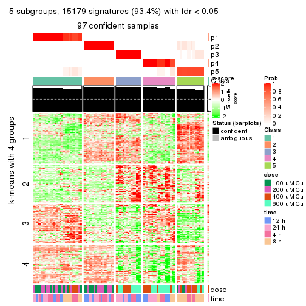</p>

</div>
<div id='tab-MAD-skmeans-get-signatures-5'>
<pre><code class="r">get_signatures(res, k = 6)
</code></pre>

<p></p>

</div>
</div>


Signature heatmaps where rows are not scaled:


<script>
$( function() {
	$( '#tabs-MAD-skmeans-get-signatures-no-scale' ).tabs();
} );
</script>
<div id='tabs-MAD-skmeans-get-signatures-no-scale'>
<ul>
<li><a href='#tab-MAD-skmeans-get-signatures-no-scale-1'>k = 2</a></li>
<li><a href='#tab-MAD-skmeans-get-signatures-no-scale-2'>k = 3</a></li>
<li><a href='#tab-MAD-skmeans-get-signatures-no-scale-3'>k = 4</a></li>
<li><a href='#tab-MAD-skmeans-get-signatures-no-scale-4'>k = 5</a></li>
<li><a href='#tab-MAD-skmeans-get-signatures-no-scale-5'>k = 6</a></li>
</ul>
<div id='tab-MAD-skmeans-get-signatures-no-scale-1'>
<pre><code class="r">get_signatures(res, k = 2, scale_rows = FALSE)
</code></pre>

<p></p>

</div>
<div id='tab-MAD-skmeans-get-signatures-no-scale-2'>
<pre><code class="r">get_signatures(res, k = 3, scale_rows = FALSE)
</code></pre>

<p></p>

</div>
<div id='tab-MAD-skmeans-get-signatures-no-scale-3'>
<pre><code class="r">get_signatures(res, k = 4, scale_rows = FALSE)
</code></pre>

<p></p>

</div>
<div id='tab-MAD-skmeans-get-signatures-no-scale-4'>
<pre><code class="r">get_signatures(res, k = 5, scale_rows = FALSE)
</code></pre>

<p></p>

</div>
<div id='tab-MAD-skmeans-get-signatures-no-scale-5'>
<pre><code class="r">get_signatures(res, k = 6, scale_rows = FALSE)
</code></pre>

<p></p>

</div>
</div>


Compare the overlap of signatures from different k:

```r
compare_signatures(res)
```


`get_signature()` returns a data frame invisibly. TO get the list of signatures, the function
call should be assigned to a variable explicitly. In following code, if `plot` argument is set
to `FALSE`, no heatmap is plotted while only the differential analysis is performed.

```r
# code only for demonstration
tb = get_signature(res, k = ..., plot = FALSE)
```

An example of the output of `tb` is:

```
#>   which_row         fdr    mean_1    mean_2 scaled_mean_1 scaled_mean_2 km
#> 1        38 0.042760348  8.373488  9.131774    -0.5533452     0.5164555  1
#> 2        40 0.018707592  7.106213  8.469186    -0.6173731     0.5762149  1
#> 3        55 0.019134737 10.221463 11.207825    -0.6159697     0.5749050  1
#> 4        59 0.006059896  5.921854  7.869574    -0.6899429     0.6439467  1
#> 5        60 0.018055526  8.928898 10.211722    -0.6204761     0.5791110  1
#> 6        98 0.009384629 15.714769 14.887706     0.6635654    -0.6193277  2
...
```

The columns in `tb` are:

1. `which_row`: row indices corresponding to the input matrix.
2. `fdr`: FDR for the differential test. 
3. `mean_x`: The mean value in group x.
4. `scaled_mean_x`: The mean value in group x after rows are scaled.
5. `km`: Row groups if k-means clustering is applied to rows.


UMAP plot which shows how samples are separated.


<script>
$( function() {
	$( '#tabs-MAD-skmeans-dimension-reduction' ).tabs();
} );
</script>
<div id='tabs-MAD-skmeans-dimension-reduction'>
<ul>
<li><a href='#tab-MAD-skmeans-dimension-reduction-1'>k = 2</a></li>
<li><a href='#tab-MAD-skmeans-dimension-reduction-2'>k = 3</a></li>
<li><a href='#tab-MAD-skmeans-dimension-reduction-3'>k = 4</a></li>
<li><a href='#tab-MAD-skmeans-dimension-reduction-4'>k = 5</a></li>
<li><a href='#tab-MAD-skmeans-dimension-reduction-5'>k = 6</a></li>
</ul>
<div id='tab-MAD-skmeans-dimension-reduction-1'>
<pre><code class="r">dimension_reduction(res, k = 2, method = &quot;UMAP&quot;)
</code></pre>

<p></p>

</div>
<div id='tab-MAD-skmeans-dimension-reduction-2'>
<pre><code class="r">dimension_reduction(res, k = 3, method = &quot;UMAP&quot;)
</code></pre>

<p></p>

</div>
<div id='tab-MAD-skmeans-dimension-reduction-3'>
<pre><code class="r">dimension_reduction(res, k = 4, method = &quot;UMAP&quot;)
</code></pre>

<p></p>

</div>
<div id='tab-MAD-skmeans-dimension-reduction-4'>
<pre><code class="r">dimension_reduction(res, k = 5, method = &quot;UMAP&quot;)
</code></pre>

<p></p>

</div>
<div id='tab-MAD-skmeans-dimension-reduction-5'>
<pre><code class="r">dimension_reduction(res, k = 6, method = &quot;UMAP&quot;)
</code></pre>

<p></p>

</div>
</div>


Following heatmap shows how subgroups are split when increasing `k`:

```r
collect_classes(res)
```


Test correlation between subgroups and known annotations. If the known
annotation is numeric, one-way ANOVA test is applied, and if the known
annotation is discrete, chi-squared contingency table test is applied.

```r
test_to_known_factors(res)
```

```
#>              n  dose(p)  time(p) k
#> MAD:skmeans 98 1.00e+00 1.00e+00 2
#> MAD:skmeans 95 4.45e-09 4.81e-01 3
#> MAD:skmeans 97 5.84e-12 8.53e-01 4
#> MAD:skmeans 97 7.57e-11 9.09e-05 5
#> MAD:skmeans 96 2.97e-10 1.38e-08 6
```


If matrix rows can be associated to genes, consider to use `GO_Enrichment(res,
...)` to perform function enrichment for the signature genes.


 

---------------------------------------------------


### MAD:pam**


The object with results only for a single top-value method and a single partition method 
can be extracted as:

```r
res = res_list["MAD", "pam"]
# you can also extract it by
# res = res_list["MAD:pam"]
```

A summary of `res` and all the functions that can be applied to it:

```r
res
```

```
#> A 'ConsensusPartition' object with k = 2, 3, 4, 5, 6.
#>   On a matrix with 16250 rows and 98 columns.
#>   Top rows (1000, 2000, 3000, 4000, 5000) are extracted by 'MAD' method.
#>   Subgroups are detected by 'pam' method.
#>   Performed in total 1250 partitions by row resampling.
#>   Best k for subgroups seems to be 3.
#> 
#> Following methods can be applied to this 'ConsensusPartition' object:
#>  [1] "cola_report"             "collect_classes"         "collect_plots"          
#>  [4] "collect_stats"           "colnames"                "compare_signatures"     
#>  [7] "consensus_heatmap"       "dimension_reduction"     "functional_enrichment"  
#> [10] "get_anno_col"            "get_anno"                "get_classes"            
#> [13] "get_consensus"           "get_matrix"              "get_membership"         
#> [16] "get_param"               "get_signatures"          "get_stats"              
#> [19] "is_best_k"               "is_stable_k"             "membership_heatmap"     
#> [22] "ncol"                    "nrow"                    "plot_ecdf"              
#> [25] "rownames"                "select_partition_number" "show"                   
#> [28] "suggest_best_k"          "test_to_known_factors"
```

`collect_plots()` function collects all the plots made from `res` for all `k` (number of partitions)
into one single page to provide an easy and fast comparison between different `k`.

```r
collect_plots(res)
```


The plots are:

- The first row: a plot of the ECDF (Empirical cumulative distribution
  function) curves of the consensus matrix for each `k` and the heatmap of
  predicted classes for each `k`.
- The second row: heatmaps of the consensus matrix for each `k`.
- The third row: heatmaps of the membership matrix for each `k`.
- The fouth row: heatmaps of the signatures for each `k`.

All the plots in panels can be made by individual functions and they are
plotted later in this section.

`select_partition_number()` produces several plots showing different
statistics for choosing "optimized" `k`. There are following statistics:

- ECDF curves of the consensus matrix for each `k`;
- 1-PAC. [The PAC
  score](https://en.wikipedia.org/wiki/Consensus_clustering#Over-interpretation_potential_of_consensus_clustering)
  measures the proportion of the ambiguous subgrouping.
- Mean silhouette score.
- Concordance. The mean probability of fiting the consensus class ids in all
  partitions.
- Area increased. Denote $A_k$ as the area under the ECDF curve for current
  `k`, the area increased is defined as $A_k - A_{k-1}$.
- Rand index. The percent of pairs of samples that are both in a same cluster
  or both are not in a same cluster in the partition of k and k-1.
- Jaccard index. The ratio of pairs of samples are both in a same cluster in
  the partition of k and k-1 and the pairs of samples are both in a same
  cluster in the partition k or k-1.

The detailed explanations of these statistics can be found in [the cola
vignette](http://bioconductor.org/packages/devel/bioc/vignettes/cola/inst/doc/cola.html#toc_13).

Generally speaking, lower PAC score, higher mean silhouette score or higher
concordance corresponds to better partition. Rand index and Jaccard index
measure how similar the current partition is compared to partition with `k-1`.
If they are too similar, we won't accept `k` is better than `k-1`.

```r
select_partition_number(res)
```


The numeric values for all these statistics can be obtained by `get_stats()`.

```r
get_stats(res)
```

```
#>   k 1-PAC mean_silhouette concordance area_increased  Rand Jaccard
#> 2 2 1.000           0.993       0.997         0.5054 0.495   0.495
#> 3 3 1.000           0.973       0.990         0.2618 0.842   0.689
#> 4 4 0.861           0.839       0.905         0.1709 0.868   0.644
#> 5 5 0.802           0.786       0.873         0.0552 0.919   0.697
#> 6 6 0.876           0.804       0.909         0.0480 0.965   0.834
```

`suggest_best_k()` suggests the best $k$ based on these statistics. The rules are as follows:

- All $k$ with Jaccard index larger than 0.95 are removed because the increase of
  the partition number does not provides enough extra information. If all $k$ are removed,
  the best $k$ is assigned by `NA`.
- For $k$ with 1-PAC larger than 0.9, the maximal $k$ is taken as the "best k". Other $k$ is called "optional k".
- If it does not fit the second rule. The $k$ with the highest vote of highest
  1-PAC, mean silhouette and concordance is taken as the "best k".

```r
suggest_best_k(res)
```

```
#> [1] 3
#> attr(,"optional")
#> [1] 2
```

There is also optional best $k$ = 2 that is worth to check.

Following shows the table of the partitions (You need to click the **show/hide
code output** link to see it). The membership matrix (columns with name `p*`)
is inferred by
[`clue::cl_consensus()`](https://www.rdocumentation.org/link/cl_consensus?package=clue)
function with the `SE` method. Basically the value in the membership matrix
represents the probability to belong to a certain group. The finall class
label for an item is determined with the group with highest probability it
belongs to.

In `get_classes()` function, the entropy is calculated from the membership
matrix and the silhouette score is calculated from the consensus matrix.


<script>
$( function() {
	$( '#tabs-MAD-pam-get-classes' ).tabs();
} );
</script>
<div id='tabs-MAD-pam-get-classes'>
<ul>
<li><a href='#tab-MAD-pam-get-classes-1'>k = 2</a></li>
<li><a href='#tab-MAD-pam-get-classes-2'>k = 3</a></li>
<li><a href='#tab-MAD-pam-get-classes-3'>k = 4</a></li>
<li><a href='#tab-MAD-pam-get-classes-4'>k = 5</a></li>
<li><a href='#tab-MAD-pam-get-classes-5'>k = 6</a></li>
</ul>

<div id='tab-MAD-pam-get-classes-1'>
<p><a id='tab-MAD-pam-get-classes-1-a' style='color:#0366d6' href='#'>show/hide code output</a></p>
<pre><code class="r">cbind(get_classes(res, k = 2), get_membership(res, k = 2))
</code></pre>

<pre><code>#&gt;           class entropy silhouette    p1    p2
#&gt; GSM241451     2   0.000      0.995 0.000 1.000
#&gt; GSM241452     1   0.000      0.998 1.000 0.000
#&gt; GSM241453     2   0.000      0.995 0.000 1.000
#&gt; GSM241454     1   0.000      0.998 1.000 0.000
#&gt; GSM241455     2   0.000      0.995 0.000 1.000
#&gt; GSM241456     1   0.000      0.998 1.000 0.000
#&gt; GSM241457     2   0.000      0.995 0.000 1.000
#&gt; GSM241458     1   0.000      0.998 1.000 0.000
#&gt; GSM241459     2   0.000      0.995 0.000 1.000
#&gt; GSM241460     1   0.000      0.998 1.000 0.000
#&gt; GSM241461     2   0.000      0.995 0.000 1.000
#&gt; GSM241462     1   0.000      0.998 1.000 0.000
#&gt; GSM241463     2   0.000      0.995 0.000 1.000
#&gt; GSM241464     1   0.000      0.998 1.000 0.000
#&gt; GSM241465     2   0.000      0.995 0.000 1.000
#&gt; GSM241466     1   0.000      0.998 1.000 0.000
#&gt; GSM241467     1   0.000      0.998 1.000 0.000
#&gt; GSM241468     2   0.000      0.995 0.000 1.000
#&gt; GSM241469     1   0.000      0.998 1.000 0.000
#&gt; GSM241470     2   0.000      0.995 0.000 1.000
#&gt; GSM241471     2   0.000      0.995 0.000 1.000
#&gt; GSM241472     1   0.000      0.998 1.000 0.000
#&gt; GSM241473     2   0.000      0.995 0.000 1.000
#&gt; GSM241474     1   0.000      0.998 1.000 0.000
#&gt; GSM241475     2   0.000      0.995 0.000 1.000
#&gt; GSM241476     1   0.000      0.998 1.000 0.000
#&gt; GSM241477     2   0.000      0.995 0.000 1.000
#&gt; GSM241478     2   0.000      0.995 0.000 1.000
#&gt; GSM241479     1   0.000      0.998 1.000 0.000
#&gt; GSM241480     1   0.000      0.998 1.000 0.000
#&gt; GSM241481     2   0.000      0.995 0.000 1.000
#&gt; GSM241482     1   0.000      0.998 1.000 0.000
#&gt; GSM241483     2   0.000      0.995 0.000 1.000
#&gt; GSM241484     1   0.000      0.998 1.000 0.000
#&gt; GSM241485     1   0.000      0.998 1.000 0.000
#&gt; GSM241486     2   0.000      0.995 0.000 1.000
#&gt; GSM241487     2   0.000      0.995 0.000 1.000
#&gt; GSM241488     2   0.000      0.995 0.000 1.000
#&gt; GSM241489     1   0.000      0.998 1.000 0.000
#&gt; GSM241490     1   0.000      0.998 1.000 0.000
#&gt; GSM241491     2   0.000      0.995 0.000 1.000
#&gt; GSM241492     1   0.000      0.998 1.000 0.000
#&gt; GSM241493     2   0.000      0.995 0.000 1.000
#&gt; GSM241494     1   0.000      0.998 1.000 0.000
#&gt; GSM241495     2   0.000      0.995 0.000 1.000
#&gt; GSM241496     2   0.000      0.995 0.000 1.000
#&gt; GSM241497     1   0.000      0.998 1.000 0.000
#&gt; GSM241498     1   0.000      0.998 1.000 0.000
#&gt; GSM241499     1   0.000      0.998 1.000 0.000
#&gt; GSM241500     2   0.000      0.995 0.000 1.000
#&gt; GSM241501     2   0.000      0.995 0.000 1.000
#&gt; GSM241502     2   0.000      0.995 0.000 1.000
#&gt; GSM241503     1   0.000      0.998 1.000 0.000
#&gt; GSM241504     1   0.000      0.998 1.000 0.000
#&gt; GSM241505     1   0.000      0.998 1.000 0.000
#&gt; GSM241506     2   0.000      0.995 0.000 1.000
#&gt; GSM241507     1   0.000      0.998 1.000 0.000
#&gt; GSM241508     2   0.000      0.995 0.000 1.000
#&gt; GSM241509     2   0.000      0.995 0.000 1.000
#&gt; GSM241510     2   0.000      0.995 0.000 1.000
#&gt; GSM241511     1   0.000      0.998 1.000 0.000
#&gt; GSM241512     1   0.000      0.998 1.000 0.000
#&gt; GSM241513     2   0.000      0.995 0.000 1.000
#&gt; GSM241514     1   0.000      0.998 1.000 0.000
#&gt; GSM241515     2   0.000      0.995 0.000 1.000
#&gt; GSM241516     1   0.000      0.998 1.000 0.000
#&gt; GSM241517     2   0.000      0.995 0.000 1.000
#&gt; GSM241518     1   0.000      0.998 1.000 0.000
#&gt; GSM241519     2   0.000      0.995 0.000 1.000
#&gt; GSM241520     1   0.000      0.998 1.000 0.000
#&gt; GSM241521     2   0.000      0.995 0.000 1.000
#&gt; GSM241522     1   0.000      0.998 1.000 0.000
#&gt; GSM241523     2   0.000      0.995 0.000 1.000
#&gt; GSM241524     1   0.000      0.998 1.000 0.000
#&gt; GSM241525     1   0.000      0.998 1.000 0.000
#&gt; GSM241526     2   0.000      0.995 0.000 1.000
#&gt; GSM241527     1   0.000      0.998 1.000 0.000
#&gt; GSM241528     2   0.000      0.995 0.000 1.000
#&gt; GSM241529     2   0.000      0.995 0.000 1.000
#&gt; GSM241530     1   0.000      0.998 1.000 0.000
#&gt; GSM241531     1   0.000      0.998 1.000 0.000
#&gt; GSM241532     2   0.000      0.995 0.000 1.000
#&gt; GSM241533     2   0.000      0.995 0.000 1.000
#&gt; GSM241534     2   0.000      0.995 0.000 1.000
#&gt; GSM241535     2   0.781      0.697 0.232 0.768
#&gt; GSM241536     1   0.000      0.998 1.000 0.000
#&gt; GSM241537     2   0.000      0.995 0.000 1.000
#&gt; GSM241538     1   0.000      0.998 1.000 0.000
#&gt; GSM241539     2   0.000      0.995 0.000 1.000
#&gt; GSM241540     1   0.000      0.998 1.000 0.000
#&gt; GSM241541     2   0.000      0.995 0.000 1.000
#&gt; GSM241542     1   0.373      0.922 0.928 0.072
#&gt; GSM241543     2   0.000      0.995 0.000 1.000
#&gt; GSM241544     1   0.000      0.998 1.000 0.000
#&gt; GSM241545     2   0.000      0.995 0.000 1.000
#&gt; GSM241546     1   0.000      0.998 1.000 0.000
#&gt; GSM241547     2   0.000      0.995 0.000 1.000
#&gt; GSM241548     1   0.000      0.998 1.000 0.000
</code></pre>

<script>
$('#tab-MAD-pam-get-classes-1-a').parent().next().next().hide();
$('#tab-MAD-pam-get-classes-1-a').click(function(){
  $('#tab-MAD-pam-get-classes-1-a').parent().next().next().toggle();
  return(false);
});
</script>
</div>

<div id='tab-MAD-pam-get-classes-2'>
<p><a id='tab-MAD-pam-get-classes-2-a' style='color:#0366d6' href='#'>show/hide code output</a></p>
<pre><code class="r">cbind(get_classes(res, k = 3), get_membership(res, k = 3))
</code></pre>

<pre><code>#&gt;           class entropy silhouette    p1    p2    p3
#&gt; GSM241451     2  0.0000     0.9933 0.000 1.000 0.000
#&gt; GSM241452     1  0.0000     0.9953 1.000 0.000 0.000
#&gt; GSM241453     2  0.0000     0.9933 0.000 1.000 0.000
#&gt; GSM241454     1  0.0000     0.9953 1.000 0.000 0.000
#&gt; GSM241455     2  0.0000     0.9933 0.000 1.000 0.000
#&gt; GSM241456     1  0.0000     0.9953 1.000 0.000 0.000
#&gt; GSM241457     2  0.0000     0.9933 0.000 1.000 0.000
#&gt; GSM241458     1  0.0000     0.9953 1.000 0.000 0.000
#&gt; GSM241459     2  0.0000     0.9933 0.000 1.000 0.000
#&gt; GSM241460     1  0.0000     0.9953 1.000 0.000 0.000
#&gt; GSM241461     2  0.0000     0.9933 0.000 1.000 0.000
#&gt; GSM241462     1  0.0000     0.9953 1.000 0.000 0.000
#&gt; GSM241463     2  0.0000     0.9933 0.000 1.000 0.000
#&gt; GSM241464     1  0.0000     0.9953 1.000 0.000 0.000
#&gt; GSM241465     2  0.0000     0.9933 0.000 1.000 0.000
#&gt; GSM241466     1  0.0000     0.9953 1.000 0.000 0.000
#&gt; GSM241467     1  0.0000     0.9953 1.000 0.000 0.000
#&gt; GSM241468     2  0.0000     0.9933 0.000 1.000 0.000
#&gt; GSM241469     1  0.0000     0.9953 1.000 0.000 0.000
#&gt; GSM241470     2  0.0000     0.9933 0.000 1.000 0.000
#&gt; GSM241471     2  0.0000     0.9933 0.000 1.000 0.000
#&gt; GSM241472     1  0.0000     0.9953 1.000 0.000 0.000
#&gt; GSM241473     2  0.0000     0.9933 0.000 1.000 0.000
#&gt; GSM241474     1  0.0000     0.9953 1.000 0.000 0.000
#&gt; GSM241475     2  0.0000     0.9933 0.000 1.000 0.000
#&gt; GSM241476     1  0.0000     0.9953 1.000 0.000 0.000
#&gt; GSM241477     2  0.0000     0.9933 0.000 1.000 0.000
#&gt; GSM241478     2  0.0000     0.9933 0.000 1.000 0.000
#&gt; GSM241479     1  0.0000     0.9953 1.000 0.000 0.000
#&gt; GSM241480     1  0.0000     0.9953 1.000 0.000 0.000
#&gt; GSM241481     2  0.0000     0.9933 0.000 1.000 0.000
#&gt; GSM241482     1  0.0000     0.9953 1.000 0.000 0.000
#&gt; GSM241483     2  0.0000     0.9933 0.000 1.000 0.000
#&gt; GSM241484     1  0.0000     0.9953 1.000 0.000 0.000
#&gt; GSM241485     1  0.0000     0.9953 1.000 0.000 0.000
#&gt; GSM241486     2  0.0000     0.9933 0.000 1.000 0.000
#&gt; GSM241487     2  0.0000     0.9933 0.000 1.000 0.000
#&gt; GSM241488     2  0.0000     0.9933 0.000 1.000 0.000
#&gt; GSM241489     1  0.0000     0.9953 1.000 0.000 0.000
#&gt; GSM241490     1  0.0000     0.9953 1.000 0.000 0.000
#&gt; GSM241491     2  0.0000     0.9933 0.000 1.000 0.000
#&gt; GSM241492     1  0.0000     0.9953 1.000 0.000 0.000
#&gt; GSM241493     2  0.0000     0.9933 0.000 1.000 0.000
#&gt; GSM241494     1  0.0000     0.9953 1.000 0.000 0.000
#&gt; GSM241495     2  0.0000     0.9933 0.000 1.000 0.000
#&gt; GSM241496     2  0.0000     0.9933 0.000 1.000 0.000
#&gt; GSM241497     1  0.0000     0.9953 1.000 0.000 0.000
#&gt; GSM241498     1  0.0000     0.9953 1.000 0.000 0.000
#&gt; GSM241499     1  0.0000     0.9953 1.000 0.000 0.000
#&gt; GSM241500     2  0.0000     0.9933 0.000 1.000 0.000
#&gt; GSM241501     2  0.0000     0.9933 0.000 1.000 0.000
#&gt; GSM241502     2  0.0000     0.9933 0.000 1.000 0.000
#&gt; GSM241503     1  0.0424     0.9886 0.992 0.000 0.008
#&gt; GSM241504     1  0.2261     0.9290 0.932 0.000 0.068
#&gt; GSM241505     1  0.1964     0.9425 0.944 0.000 0.056
#&gt; GSM241506     2  0.0000     0.9933 0.000 1.000 0.000
#&gt; GSM241507     1  0.0000     0.9953 1.000 0.000 0.000
#&gt; GSM241508     2  0.0000     0.9933 0.000 1.000 0.000
#&gt; GSM241509     2  0.0000     0.9933 0.000 1.000 0.000
#&gt; GSM241510     2  0.0000     0.9933 0.000 1.000 0.000
#&gt; GSM241511     3  0.0000     0.9683 0.000 0.000 1.000
#&gt; GSM241512     3  0.0000     0.9683 0.000 0.000 1.000
#&gt; GSM241513     2  0.0000     0.9933 0.000 1.000 0.000
#&gt; GSM241514     3  0.0000     0.9683 0.000 0.000 1.000
#&gt; GSM241515     2  0.2711     0.9032 0.000 0.912 0.088
#&gt; GSM241516     3  0.0000     0.9683 0.000 0.000 1.000
#&gt; GSM241517     2  0.0000     0.9933 0.000 1.000 0.000
#&gt; GSM241518     3  0.0000     0.9683 0.000 0.000 1.000
#&gt; GSM241519     2  0.0000     0.9933 0.000 1.000 0.000
#&gt; GSM241520     3  0.0000     0.9683 0.000 0.000 1.000
#&gt; GSM241521     2  0.0000     0.9933 0.000 1.000 0.000
#&gt; GSM241522     3  0.2711     0.8769 0.088 0.000 0.912
#&gt; GSM241523     2  0.0000     0.9933 0.000 1.000 0.000
#&gt; GSM241524     3  0.0000     0.9683 0.000 0.000 1.000
#&gt; GSM241525     3  0.0000     0.9683 0.000 0.000 1.000
#&gt; GSM241526     2  0.0000     0.9933 0.000 1.000 0.000
#&gt; GSM241527     3  0.0000     0.9683 0.000 0.000 1.000
#&gt; GSM241528     2  0.0000     0.9933 0.000 1.000 0.000
#&gt; GSM241529     2  0.0000     0.9933 0.000 1.000 0.000
#&gt; GSM241530     3  0.0000     0.9683 0.000 0.000 1.000
#&gt; GSM241531     3  0.0000     0.9683 0.000 0.000 1.000
#&gt; GSM241532     2  0.0000     0.9933 0.000 1.000 0.000
#&gt; GSM241533     2  0.0000     0.9933 0.000 1.000 0.000
#&gt; GSM241534     2  0.0000     0.9933 0.000 1.000 0.000
#&gt; GSM241535     3  0.0000     0.9683 0.000 0.000 1.000
#&gt; GSM241536     3  0.0000     0.9683 0.000 0.000 1.000
#&gt; GSM241537     3  0.0000     0.9683 0.000 0.000 1.000
#&gt; GSM241538     3  0.0000     0.9683 0.000 0.000 1.000
#&gt; GSM241539     3  0.6307     0.0314 0.000 0.488 0.512
#&gt; GSM241540     3  0.0000     0.9683 0.000 0.000 1.000
#&gt; GSM241541     2  0.2959     0.8892 0.000 0.900 0.100
#&gt; GSM241542     3  0.0000     0.9683 0.000 0.000 1.000
#&gt; GSM241543     2  0.3116     0.8769 0.000 0.892 0.108
#&gt; GSM241544     3  0.0000     0.9683 0.000 0.000 1.000
#&gt; GSM241545     2  0.0000     0.9933 0.000 1.000 0.000
#&gt; GSM241546     3  0.0000     0.9683 0.000 0.000 1.000
#&gt; GSM241547     2  0.0000     0.9933 0.000 1.000 0.000
#&gt; GSM241548     3  0.0000     0.9683 0.000 0.000 1.000
</code></pre>

<script>
$('#tab-MAD-pam-get-classes-2-a').parent().next().next().hide();
$('#tab-MAD-pam-get-classes-2-a').click(function(){
  $('#tab-MAD-pam-get-classes-2-a').parent().next().next().toggle();
  return(false);
});
</script>
</div>

<div id='tab-MAD-pam-get-classes-3'>
<p><a id='tab-MAD-pam-get-classes-3-a' style='color:#0366d6' href='#'>show/hide code output</a></p>
<pre><code class="r">cbind(get_classes(res, k = 4), get_membership(res, k = 4))
</code></pre>

<pre><code>#&gt;           class entropy silhouette    p1    p2    p3    p4
#&gt; GSM241451     2  0.4790      0.875 0.000 0.620 0.000 0.380
#&gt; GSM241452     1  0.0000      0.989 1.000 0.000 0.000 0.000
#&gt; GSM241453     2  0.4790      0.875 0.000 0.620 0.000 0.380
#&gt; GSM241454     1  0.0000      0.989 1.000 0.000 0.000 0.000
#&gt; GSM241455     2  0.4790      0.875 0.000 0.620 0.000 0.380
#&gt; GSM241456     1  0.0000      0.989 1.000 0.000 0.000 0.000
#&gt; GSM241457     4  0.1211      0.700 0.000 0.040 0.000 0.960
#&gt; GSM241458     1  0.0921      0.976 0.972 0.000 0.028 0.000
#&gt; GSM241459     4  0.1211      0.700 0.000 0.040 0.000 0.960
#&gt; GSM241460     1  0.0000      0.989 1.000 0.000 0.000 0.000
#&gt; GSM241461     4  0.0707      0.717 0.000 0.020 0.000 0.980
#&gt; GSM241462     1  0.0921      0.976 0.972 0.000 0.028 0.000
#&gt; GSM241463     2  0.4790      0.875 0.000 0.620 0.000 0.380
#&gt; GSM241464     1  0.0000      0.989 1.000 0.000 0.000 0.000
#&gt; GSM241465     2  0.4790      0.875 0.000 0.620 0.000 0.380
#&gt; GSM241466     1  0.0000      0.989 1.000 0.000 0.000 0.000
#&gt; GSM241467     1  0.0000      0.989 1.000 0.000 0.000 0.000
#&gt; GSM241468     2  0.4790      0.875 0.000 0.620 0.000 0.380
#&gt; GSM241469     1  0.0000      0.989 1.000 0.000 0.000 0.000
#&gt; GSM241470     2  0.4790      0.875 0.000 0.620 0.000 0.380
#&gt; GSM241471     2  0.4790      0.875 0.000 0.620 0.000 0.380
#&gt; GSM241472     1  0.0000      0.989 1.000 0.000 0.000 0.000
#&gt; GSM241473     2  0.4790      0.875 0.000 0.620 0.000 0.380
#&gt; GSM241474     1  0.0000      0.989 1.000 0.000 0.000 0.000
#&gt; GSM241475     2  0.4790      0.875 0.000 0.620 0.000 0.380
#&gt; GSM241476     1  0.0000      0.989 1.000 0.000 0.000 0.000
#&gt; GSM241477     2  0.4790      0.875 0.000 0.620 0.000 0.380
#&gt; GSM241478     2  0.4790      0.875 0.000 0.620 0.000 0.380
#&gt; GSM241479     1  0.0000      0.989 1.000 0.000 0.000 0.000
#&gt; GSM241480     1  0.0000      0.989 1.000 0.000 0.000 0.000
#&gt; GSM241481     4  0.1211      0.700 0.000 0.040 0.000 0.960
#&gt; GSM241482     1  0.0000      0.989 1.000 0.000 0.000 0.000
#&gt; GSM241483     4  0.1118      0.704 0.000 0.036 0.000 0.964
#&gt; GSM241484     1  0.0921      0.976 0.972 0.000 0.028 0.000
#&gt; GSM241485     1  0.0921      0.976 0.972 0.000 0.028 0.000
#&gt; GSM241486     4  0.0707      0.717 0.000 0.020 0.000 0.980
#&gt; GSM241487     2  0.4790      0.875 0.000 0.620 0.000 0.380
#&gt; GSM241488     2  0.4790      0.875 0.000 0.620 0.000 0.380
#&gt; GSM241489     1  0.0000      0.989 1.000 0.000 0.000 0.000
#&gt; GSM241490     1  0.0000      0.989 1.000 0.000 0.000 0.000
#&gt; GSM241491     2  0.4790      0.875 0.000 0.620 0.000 0.380
#&gt; GSM241492     1  0.0000      0.989 1.000 0.000 0.000 0.000
#&gt; GSM241493     2  0.4790      0.875 0.000 0.620 0.000 0.380
#&gt; GSM241494     1  0.0000      0.989 1.000 0.000 0.000 0.000
#&gt; GSM241495     2  0.4790      0.875 0.000 0.620 0.000 0.380
#&gt; GSM241496     2  0.4790      0.875 0.000 0.620 0.000 0.380
#&gt; GSM241497     1  0.0000      0.989 1.000 0.000 0.000 0.000
#&gt; GSM241498     1  0.0000      0.989 1.000 0.000 0.000 0.000
#&gt; GSM241499     1  0.0921      0.976 0.972 0.000 0.028 0.000
#&gt; GSM241500     4  0.0000      0.721 0.000 0.000 0.000 1.000
#&gt; GSM241501     4  0.1211      0.700 0.000 0.040 0.000 0.960
#&gt; GSM241502     4  0.0707      0.717 0.000 0.020 0.000 0.980
#&gt; GSM241503     1  0.1118      0.972 0.964 0.000 0.036 0.000
#&gt; GSM241504     1  0.1474      0.960 0.948 0.000 0.052 0.000
#&gt; GSM241505     1  0.2011      0.933 0.920 0.000 0.080 0.000
#&gt; GSM241506     4  0.0707      0.717 0.000 0.020 0.000 0.980
#&gt; GSM241507     1  0.0921      0.976 0.972 0.000 0.028 0.000
#&gt; GSM241508     4  0.0000      0.721 0.000 0.000 0.000 1.000
#&gt; GSM241509     4  0.4605      0.686 0.000 0.336 0.000 0.664
#&gt; GSM241510     4  0.4134      0.700 0.000 0.260 0.000 0.740
#&gt; GSM241511     3  0.0000      0.908 0.000 0.000 1.000 0.000
#&gt; GSM241512     3  0.0000      0.908 0.000 0.000 1.000 0.000
#&gt; GSM241513     2  0.6399      0.555 0.000 0.620 0.276 0.104
#&gt; GSM241514     3  0.0921      0.905 0.028 0.000 0.972 0.000
#&gt; GSM241515     3  0.4617      0.661 0.000 0.204 0.764 0.032
#&gt; GSM241516     3  0.0921      0.905 0.028 0.000 0.972 0.000
#&gt; GSM241517     2  0.1474      0.535 0.000 0.948 0.000 0.052
#&gt; GSM241518     3  0.0921      0.905 0.028 0.000 0.972 0.000
#&gt; GSM241519     2  0.1474      0.536 0.000 0.948 0.000 0.052
#&gt; GSM241520     3  0.0921      0.905 0.028 0.000 0.972 0.000
#&gt; GSM241521     2  0.4790      0.875 0.000 0.620 0.000 0.380
#&gt; GSM241522     3  0.2408      0.841 0.104 0.000 0.896 0.000
#&gt; GSM241523     2  0.4679      0.852 0.000 0.648 0.000 0.352
#&gt; GSM241524     3  0.0921      0.905 0.028 0.000 0.972 0.000
#&gt; GSM241525     3  0.0000      0.908 0.000 0.000 1.000 0.000
#&gt; GSM241526     4  0.4790      0.669 0.000 0.380 0.000 0.620
#&gt; GSM241527     3  0.0000      0.908 0.000 0.000 1.000 0.000
#&gt; GSM241528     4  0.4713      0.679 0.000 0.360 0.000 0.640
#&gt; GSM241529     4  0.4679      0.679 0.000 0.352 0.000 0.648
#&gt; GSM241530     3  0.0000      0.908 0.000 0.000 1.000 0.000
#&gt; GSM241531     3  0.0000      0.908 0.000 0.000 1.000 0.000
#&gt; GSM241532     4  0.4790      0.669 0.000 0.380 0.000 0.620
#&gt; GSM241533     4  0.4790      0.669 0.000 0.380 0.000 0.620
#&gt; GSM241534     4  0.4790      0.669 0.000 0.380 0.000 0.620
#&gt; GSM241535     3  0.2345      0.848 0.000 0.100 0.900 0.000
#&gt; GSM241536     3  0.0000      0.908 0.000 0.000 1.000 0.000
#&gt; GSM241537     3  0.5860      0.514 0.000 0.380 0.580 0.040
#&gt; GSM241538     3  0.0921      0.906 0.000 0.028 0.972 0.000
#&gt; GSM241539     3  0.5860      0.514 0.000 0.380 0.580 0.040
#&gt; GSM241540     3  0.0921      0.906 0.000 0.028 0.972 0.000
#&gt; GSM241541     3  0.7538      0.202 0.000 0.384 0.428 0.188
#&gt; GSM241542     3  0.0921      0.906 0.000 0.028 0.972 0.000
#&gt; GSM241543     2  0.1209      0.463 0.000 0.964 0.032 0.004
#&gt; GSM241544     3  0.0000      0.908 0.000 0.000 1.000 0.000
#&gt; GSM241545     2  0.1510      0.513 0.000 0.956 0.016 0.028
#&gt; GSM241546     3  0.0921      0.905 0.028 0.000 0.972 0.000
#&gt; GSM241547     2  0.0469      0.458 0.000 0.988 0.000 0.012
#&gt; GSM241548     3  0.0921      0.906 0.000 0.028 0.972 0.000
</code></pre>

<script>
$('#tab-MAD-pam-get-classes-3-a').parent().next().next().hide();
$('#tab-MAD-pam-get-classes-3-a').click(function(){
  $('#tab-MAD-pam-get-classes-3-a').parent().next().next().toggle();
  return(false);
});
</script>
</div>

<div id='tab-MAD-pam-get-classes-4'>
<p><a id='tab-MAD-pam-get-classes-4-a' style='color:#0366d6' href='#'>show/hide code output</a></p>
<pre><code class="r">cbind(get_classes(res, k = 5), get_membership(res, k = 5))
</code></pre>

<pre><code>#&gt;           class entropy silhouette    p1    p2    p3    p4    p5
#&gt; GSM241451     2  0.0000      0.891 0.000 1.000 0.000 0.000 0.000
#&gt; GSM241452     1  0.0000      0.977 1.000 0.000 0.000 0.000 0.000
#&gt; GSM241453     2  0.0000      0.891 0.000 1.000 0.000 0.000 0.000
#&gt; GSM241454     1  0.0000      0.977 1.000 0.000 0.000 0.000 0.000
#&gt; GSM241455     2  0.0000      0.891 0.000 1.000 0.000 0.000 0.000
#&gt; GSM241456     1  0.0000      0.977 1.000 0.000 0.000 0.000 0.000
#&gt; GSM241457     5  0.5375      0.690 0.000 0.368 0.000 0.064 0.568
#&gt; GSM241458     4  0.3561      0.726 0.260 0.000 0.000 0.740 0.000
#&gt; GSM241459     5  0.5375      0.690 0.000 0.368 0.000 0.064 0.568
#&gt; GSM241460     1  0.0000      0.977 1.000 0.000 0.000 0.000 0.000
#&gt; GSM241461     5  0.5180      0.738 0.000 0.312 0.000 0.064 0.624
#&gt; GSM241462     4  0.4015      0.574 0.348 0.000 0.000 0.652 0.000
#&gt; GSM241463     2  0.0000      0.891 0.000 1.000 0.000 0.000 0.000
#&gt; GSM241464     1  0.0000      0.977 1.000 0.000 0.000 0.000 0.000
#&gt; GSM241465     2  0.0000      0.891 0.000 1.000 0.000 0.000 0.000
#&gt; GSM241466     1  0.0000      0.977 1.000 0.000 0.000 0.000 0.000
#&gt; GSM241467     1  0.0000      0.977 1.000 0.000 0.000 0.000 0.000
#&gt; GSM241468     2  0.0000      0.891 0.000 1.000 0.000 0.000 0.000
#&gt; GSM241469     1  0.0000      0.977 1.000 0.000 0.000 0.000 0.000
#&gt; GSM241470     2  0.0000      0.891 0.000 1.000 0.000 0.000 0.000
#&gt; GSM241471     2  0.0000      0.891 0.000 1.000 0.000 0.000 0.000
#&gt; GSM241472     1  0.0000      0.977 1.000 0.000 0.000 0.000 0.000
#&gt; GSM241473     2  0.0000      0.891 0.000 1.000 0.000 0.000 0.000
#&gt; GSM241474     1  0.0000      0.977 1.000 0.000 0.000 0.000 0.000
#&gt; GSM241475     2  0.0000      0.891 0.000 1.000 0.000 0.000 0.000
#&gt; GSM241476     1  0.0000      0.977 1.000 0.000 0.000 0.000 0.000
#&gt; GSM241477     2  0.0000      0.891 0.000 1.000 0.000 0.000 0.000
#&gt; GSM241478     2  0.0000      0.891 0.000 1.000 0.000 0.000 0.000
#&gt; GSM241479     1  0.0000      0.977 1.000 0.000 0.000 0.000 0.000
#&gt; GSM241480     1  0.0000      0.977 1.000 0.000 0.000 0.000 0.000
#&gt; GSM241481     5  0.5375      0.690 0.000 0.368 0.000 0.064 0.568
#&gt; GSM241482     1  0.0000      0.977 1.000 0.000 0.000 0.000 0.000
#&gt; GSM241483     5  0.5353      0.698 0.000 0.360 0.000 0.064 0.576
#&gt; GSM241484     4  0.1792      0.891 0.084 0.000 0.000 0.916 0.000
#&gt; GSM241485     1  0.4088      0.244 0.632 0.000 0.000 0.368 0.000
#&gt; GSM241486     5  0.5180      0.738 0.000 0.312 0.000 0.064 0.624
#&gt; GSM241487     2  0.0000      0.891 0.000 1.000 0.000 0.000 0.000
#&gt; GSM241488     2  0.0000      0.891 0.000 1.000 0.000 0.000 0.000
#&gt; GSM241489     1  0.0000      0.977 1.000 0.000 0.000 0.000 0.000
#&gt; GSM241490     1  0.0000      0.977 1.000 0.000 0.000 0.000 0.000
#&gt; GSM241491     2  0.0000      0.891 0.000 1.000 0.000 0.000 0.000
#&gt; GSM241492     1  0.0000      0.977 1.000 0.000 0.000 0.000 0.000
#&gt; GSM241493     2  0.0000      0.891 0.000 1.000 0.000 0.000 0.000
#&gt; GSM241494     1  0.0000      0.977 1.000 0.000 0.000 0.000 0.000
#&gt; GSM241495     2  0.0000      0.891 0.000 1.000 0.000 0.000 0.000
#&gt; GSM241496     2  0.0000      0.891 0.000 1.000 0.000 0.000 0.000
#&gt; GSM241497     1  0.0000      0.977 1.000 0.000 0.000 0.000 0.000
#&gt; GSM241498     1  0.0000      0.977 1.000 0.000 0.000 0.000 0.000
#&gt; GSM241499     4  0.1792      0.891 0.084 0.000 0.000 0.916 0.000
#&gt; GSM241500     5  0.4914      0.749 0.000 0.260 0.000 0.064 0.676
#&gt; GSM241501     5  0.5316      0.709 0.000 0.348 0.000 0.064 0.588
#&gt; GSM241502     5  0.5180      0.738 0.000 0.312 0.000 0.064 0.624
#&gt; GSM241503     4  0.1792      0.891 0.084 0.000 0.000 0.916 0.000
#&gt; GSM241504     4  0.2006      0.892 0.072 0.000 0.012 0.916 0.000
#&gt; GSM241505     4  0.1956      0.892 0.076 0.000 0.008 0.916 0.000
#&gt; GSM241506     5  0.5180      0.738 0.000 0.312 0.000 0.064 0.624
#&gt; GSM241507     4  0.1792      0.891 0.084 0.000 0.000 0.916 0.000
#&gt; GSM241508     5  0.4914      0.749 0.000 0.260 0.000 0.064 0.676
#&gt; GSM241509     5  0.1877      0.700 0.000 0.012 0.000 0.064 0.924
#&gt; GSM241510     5  0.2992      0.724 0.000 0.068 0.000 0.064 0.868
#&gt; GSM241511     4  0.1792      0.861 0.000 0.000 0.084 0.916 0.000
#&gt; GSM241512     3  0.3730      0.493 0.000 0.000 0.712 0.288 0.000
#&gt; GSM241513     2  0.3789      0.686 0.000 0.768 0.212 0.020 0.000
#&gt; GSM241514     3  0.3730      0.675 0.288 0.000 0.712 0.000 0.000
#&gt; GSM241515     2  0.4138      0.590 0.000 0.708 0.276 0.016 0.000
#&gt; GSM241516     3  0.3730      0.675 0.288 0.000 0.712 0.000 0.000
#&gt; GSM241517     2  0.4106      0.645 0.000 0.724 0.000 0.020 0.256
#&gt; GSM241518     3  0.3730      0.675 0.288 0.000 0.712 0.000 0.000
#&gt; GSM241519     2  0.4054      0.654 0.000 0.732 0.000 0.020 0.248
#&gt; GSM241520     3  0.3730      0.675 0.288 0.000 0.712 0.000 0.000
#&gt; GSM241521     2  0.0510      0.882 0.000 0.984 0.000 0.016 0.000
#&gt; GSM241522     3  0.3730      0.675 0.288 0.000 0.712 0.000 0.000
#&gt; GSM241523     2  0.0898      0.875 0.000 0.972 0.000 0.020 0.008
#&gt; GSM241524     3  0.3730      0.675 0.288 0.000 0.712 0.000 0.000
#&gt; GSM241525     4  0.2074      0.849 0.000 0.000 0.104 0.896 0.000
#&gt; GSM241526     5  0.0290      0.676 0.000 0.000 0.000 0.008 0.992
#&gt; GSM241527     3  0.4161      0.280 0.000 0.000 0.608 0.392 0.000
#&gt; GSM241528     5  0.1408      0.683 0.000 0.044 0.000 0.008 0.948
#&gt; GSM241529     5  0.0290      0.676 0.000 0.000 0.000 0.008 0.992
#&gt; GSM241530     4  0.2377      0.827 0.000 0.000 0.128 0.872 0.000
#&gt; GSM241531     4  0.1792      0.861 0.000 0.000 0.084 0.916 0.000
#&gt; GSM241532     5  0.0000      0.679 0.000 0.000 0.000 0.000 1.000
#&gt; GSM241533     5  0.0000      0.679 0.000 0.000 0.000 0.000 1.000
#&gt; GSM241534     5  0.0000      0.679 0.000 0.000 0.000 0.000 1.000
#&gt; GSM241535     3  0.2249      0.688 0.000 0.000 0.896 0.008 0.096
#&gt; GSM241536     4  0.1792      0.861 0.000 0.000 0.084 0.916 0.000
#&gt; GSM241537     3  0.4497      0.339 0.000 0.000 0.568 0.008 0.424
#&gt; GSM241538     3  0.0000      0.738 0.000 0.000 1.000 0.000 0.000
#&gt; GSM241539     3  0.4497      0.339 0.000 0.000 0.568 0.008 0.424
#&gt; GSM241540     3  0.0000      0.738 0.000 0.000 1.000 0.000 0.000
#&gt; GSM241541     5  0.4568      0.291 0.000 0.020 0.288 0.008 0.684
#&gt; GSM241542     3  0.0000      0.738 0.000 0.000 1.000 0.000 0.000
#&gt; GSM241543     2  0.6019      0.470 0.000 0.576 0.084 0.020 0.320
#&gt; GSM241544     3  0.0000      0.738 0.000 0.000 1.000 0.000 0.000
#&gt; GSM241545     2  0.4260      0.642 0.000 0.720 0.004 0.020 0.256
#&gt; GSM241546     3  0.0000      0.738 0.000 0.000 1.000 0.000 0.000
#&gt; GSM241547     2  0.4585      0.522 0.000 0.628 0.000 0.020 0.352
#&gt; GSM241548     3  0.0000      0.738 0.000 0.000 1.000 0.000 0.000
</code></pre>

<script>
$('#tab-MAD-pam-get-classes-4-a').parent().next().next().hide();
$('#tab-MAD-pam-get-classes-4-a').click(function(){
  $('#tab-MAD-pam-get-classes-4-a').parent().next().next().toggle();
  return(false);
});
</script>
</div>

<div id='tab-MAD-pam-get-classes-5'>
<p><a id='tab-MAD-pam-get-classes-5-a' style='color:#0366d6' href='#'>show/hide code output</a></p>
<pre><code class="r">cbind(get_classes(res, k = 6), get_membership(res, k = 6))
</code></pre>

<pre><code>#&gt;           class entropy silhouette    p1    p2    p3    p4    p5    p6
#&gt; GSM241451     2  0.0000     0.8844 0.000 1.000 0.000 0.000 0.000 0.000
#&gt; GSM241452     1  0.0000     0.9794 1.000 0.000 0.000 0.000 0.000 0.000
#&gt; GSM241453     2  0.0000     0.8844 0.000 1.000 0.000 0.000 0.000 0.000
#&gt; GSM241454     1  0.0000     0.9794 1.000 0.000 0.000 0.000 0.000 0.000
#&gt; GSM241455     2  0.0000     0.8844 0.000 1.000 0.000 0.000 0.000 0.000
#&gt; GSM241456     1  0.0000     0.9794 1.000 0.000 0.000 0.000 0.000 0.000
#&gt; GSM241457     5  0.2178     0.7580 0.000 0.132 0.000 0.000 0.868 0.000
#&gt; GSM241458     6  0.2762     0.7377 0.196 0.000 0.000 0.000 0.000 0.804
#&gt; GSM241459     5  0.2631     0.7114 0.000 0.180 0.000 0.000 0.820 0.000
#&gt; GSM241460     1  0.0000     0.9794 1.000 0.000 0.000 0.000 0.000 0.000
#&gt; GSM241461     5  0.0713     0.8117 0.000 0.028 0.000 0.000 0.972 0.000
#&gt; GSM241462     6  0.3531     0.5307 0.328 0.000 0.000 0.000 0.000 0.672
#&gt; GSM241463     2  0.0000     0.8844 0.000 1.000 0.000 0.000 0.000 0.000
#&gt; GSM241464     1  0.0000     0.9794 1.000 0.000 0.000 0.000 0.000 0.000
#&gt; GSM241465     2  0.0000     0.8844 0.000 1.000 0.000 0.000 0.000 0.000
#&gt; GSM241466     1  0.0000     0.9794 1.000 0.000 0.000 0.000 0.000 0.000
#&gt; GSM241467     1  0.0000     0.9794 1.000 0.000 0.000 0.000 0.000 0.000
#&gt; GSM241468     2  0.0000     0.8844 0.000 1.000 0.000 0.000 0.000 0.000
#&gt; GSM241469     1  0.0000     0.9794 1.000 0.000 0.000 0.000 0.000 0.000
#&gt; GSM241470     2  0.0000     0.8844 0.000 1.000 0.000 0.000 0.000 0.000
#&gt; GSM241471     2  0.0000     0.8844 0.000 1.000 0.000 0.000 0.000 0.000
#&gt; GSM241472     1  0.0000     0.9794 1.000 0.000 0.000 0.000 0.000 0.000
#&gt; GSM241473     2  0.0000     0.8844 0.000 1.000 0.000 0.000 0.000 0.000
#&gt; GSM241474     1  0.0000     0.9794 1.000 0.000 0.000 0.000 0.000 0.000
#&gt; GSM241475     2  0.0000     0.8844 0.000 1.000 0.000 0.000 0.000 0.000
#&gt; GSM241476     1  0.0000     0.9794 1.000 0.000 0.000 0.000 0.000 0.000
#&gt; GSM241477     2  0.0000     0.8844 0.000 1.000 0.000 0.000 0.000 0.000
#&gt; GSM241478     2  0.0000     0.8844 0.000 1.000 0.000 0.000 0.000 0.000
#&gt; GSM241479     1  0.0000     0.9794 1.000 0.000 0.000 0.000 0.000 0.000
#&gt; GSM241480     1  0.0000     0.9794 1.000 0.000 0.000 0.000 0.000 0.000
#&gt; GSM241481     5  0.2597     0.7161 0.000 0.176 0.000 0.000 0.824 0.000
#&gt; GSM241482     1  0.0000     0.9794 1.000 0.000 0.000 0.000 0.000 0.000
#&gt; GSM241483     5  0.1501     0.7984 0.000 0.076 0.000 0.000 0.924 0.000
#&gt; GSM241484     6  0.0000     0.9374 0.000 0.000 0.000 0.000 0.000 1.000
#&gt; GSM241485     1  0.3672     0.3477 0.632 0.000 0.000 0.000 0.000 0.368
#&gt; GSM241486     5  0.0713     0.8117 0.000 0.028 0.000 0.000 0.972 0.000
#&gt; GSM241487     2  0.0000     0.8844 0.000 1.000 0.000 0.000 0.000 0.000
#&gt; GSM241488     2  0.0000     0.8844 0.000 1.000 0.000 0.000 0.000 0.000
#&gt; GSM241489     1  0.0000     0.9794 1.000 0.000 0.000 0.000 0.000 0.000
#&gt; GSM241490     1  0.0000     0.9794 1.000 0.000 0.000 0.000 0.000 0.000
#&gt; GSM241491     2  0.0000     0.8844 0.000 1.000 0.000 0.000 0.000 0.000
#&gt; GSM241492     1  0.0000     0.9794 1.000 0.000 0.000 0.000 0.000 0.000
#&gt; GSM241493     2  0.0000     0.8844 0.000 1.000 0.000 0.000 0.000 0.000
#&gt; GSM241494     1  0.0000     0.9794 1.000 0.000 0.000 0.000 0.000 0.000
#&gt; GSM241495     2  0.0000     0.8844 0.000 1.000 0.000 0.000 0.000 0.000
#&gt; GSM241496     2  0.0000     0.8844 0.000 1.000 0.000 0.000 0.000 0.000
#&gt; GSM241497     1  0.0000     0.9794 1.000 0.000 0.000 0.000 0.000 0.000
#&gt; GSM241498     1  0.0000     0.9794 1.000 0.000 0.000 0.000 0.000 0.000
#&gt; GSM241499     6  0.0000     0.9374 0.000 0.000 0.000 0.000 0.000 1.000
#&gt; GSM241500     5  0.0000     0.8012 0.000 0.000 0.000 0.000 1.000 0.000
#&gt; GSM241501     5  0.0713     0.8117 0.000 0.028 0.000 0.000 0.972 0.000
#&gt; GSM241502     5  0.1714     0.7872 0.000 0.092 0.000 0.000 0.908 0.000
#&gt; GSM241503     6  0.0000     0.9374 0.000 0.000 0.000 0.000 0.000 1.000
#&gt; GSM241504     6  0.0000     0.9374 0.000 0.000 0.000 0.000 0.000 1.000
#&gt; GSM241505     6  0.0000     0.9374 0.000 0.000 0.000 0.000 0.000 1.000
#&gt; GSM241506     5  0.1387     0.8034 0.000 0.068 0.000 0.000 0.932 0.000
#&gt; GSM241507     6  0.0000     0.9374 0.000 0.000 0.000 0.000 0.000 1.000
#&gt; GSM241508     5  0.0260     0.8057 0.000 0.008 0.000 0.000 0.992 0.000
#&gt; GSM241509     5  0.0865     0.7905 0.000 0.000 0.000 0.036 0.964 0.000
#&gt; GSM241510     5  0.0865     0.7905 0.000 0.000 0.000 0.036 0.964 0.000
#&gt; GSM241511     6  0.0000     0.9374 0.000 0.000 0.000 0.000 0.000 1.000
#&gt; GSM241512     3  0.2854     0.7321 0.000 0.000 0.792 0.000 0.000 0.208
#&gt; GSM241513     2  0.4493     0.5618 0.000 0.636 0.052 0.312 0.000 0.000
#&gt; GSM241514     3  0.0000     0.8745 0.000 0.000 1.000 0.000 0.000 0.000
#&gt; GSM241515     2  0.4843     0.5342 0.000 0.616 0.084 0.300 0.000 0.000
#&gt; GSM241516     3  0.0260     0.8726 0.008 0.000 0.992 0.000 0.000 0.000
#&gt; GSM241517     2  0.3841     0.5092 0.000 0.616 0.000 0.380 0.004 0.000
#&gt; GSM241518     3  0.0260     0.8726 0.008 0.000 0.992 0.000 0.000 0.000
#&gt; GSM241519     2  0.4319     0.5294 0.000 0.620 0.000 0.348 0.032 0.000
#&gt; GSM241520     3  0.0000     0.8745 0.000 0.000 1.000 0.000 0.000 0.000
#&gt; GSM241521     2  0.3101     0.6935 0.000 0.756 0.000 0.244 0.000 0.000
#&gt; GSM241522     3  0.0632     0.8640 0.024 0.000 0.976 0.000 0.000 0.000
#&gt; GSM241523     2  0.3464     0.6174 0.000 0.688 0.000 0.312 0.000 0.000
#&gt; GSM241524     3  0.0000     0.8745 0.000 0.000 1.000 0.000 0.000 0.000
#&gt; GSM241525     6  0.0547     0.9242 0.000 0.000 0.020 0.000 0.000 0.980
#&gt; GSM241526     4  0.3126     0.6307 0.000 0.000 0.000 0.752 0.248 0.000
#&gt; GSM241527     3  0.3717     0.4288 0.000 0.000 0.616 0.000 0.000 0.384
#&gt; GSM241528     4  0.5672     0.4480 0.000 0.212 0.000 0.528 0.260 0.000
#&gt; GSM241529     4  0.3371     0.5662 0.000 0.000 0.000 0.708 0.292 0.000
#&gt; GSM241530     6  0.1007     0.9035 0.000 0.000 0.044 0.000 0.000 0.956
#&gt; GSM241531     6  0.0000     0.9374 0.000 0.000 0.000 0.000 0.000 1.000
#&gt; GSM241532     5  0.3817     0.1476 0.000 0.000 0.000 0.432 0.568 0.000
#&gt; GSM241533     5  0.3851     0.0674 0.000 0.000 0.000 0.460 0.540 0.000
#&gt; GSM241534     5  0.3851     0.0674 0.000 0.000 0.000 0.460 0.540 0.000
#&gt; GSM241535     3  0.4649     0.5294 0.000 0.000 0.572 0.380 0.000 0.048
#&gt; GSM241536     6  0.0000     0.9374 0.000 0.000 0.000 0.000 0.000 1.000
#&gt; GSM241537     4  0.0713     0.7496 0.000 0.000 0.000 0.972 0.028 0.000
#&gt; GSM241538     3  0.2996     0.7780 0.000 0.000 0.772 0.228 0.000 0.000
#&gt; GSM241539     4  0.0713     0.7496 0.000 0.000 0.000 0.972 0.028 0.000
#&gt; GSM241540     3  0.2823     0.7905 0.000 0.000 0.796 0.204 0.000 0.000
#&gt; GSM241541     4  0.0713     0.7496 0.000 0.000 0.000 0.972 0.028 0.000
#&gt; GSM241542     3  0.2996     0.7780 0.000 0.000 0.772 0.228 0.000 0.000
#&gt; GSM241543     4  0.3349     0.6294 0.000 0.008 0.244 0.748 0.000 0.000
#&gt; GSM241544     3  0.0000     0.8745 0.000 0.000 1.000 0.000 0.000 0.000
#&gt; GSM241545     2  0.3955     0.4958 0.000 0.608 0.008 0.384 0.000 0.000
#&gt; GSM241546     3  0.0000     0.8745 0.000 0.000 1.000 0.000 0.000 0.000
#&gt; GSM241547     4  0.3076     0.5542 0.000 0.240 0.000 0.760 0.000 0.000
#&gt; GSM241548     3  0.0000     0.8745 0.000 0.000 1.000 0.000 0.000 0.000
</code></pre>

<script>
$('#tab-MAD-pam-get-classes-5-a').parent().next().next().hide();
$('#tab-MAD-pam-get-classes-5-a').click(function(){
  $('#tab-MAD-pam-get-classes-5-a').parent().next().next().toggle();
  return(false);
});
</script>
</div>
</div>

Heatmaps for the consensus matrix. It visualizes the probability of two
samples to be in a same group.


<script>
$( function() {
	$( '#tabs-MAD-pam-consensus-heatmap' ).tabs();
} );
</script>
<div id='tabs-MAD-pam-consensus-heatmap'>
<ul>
<li><a href='#tab-MAD-pam-consensus-heatmap-1'>k = 2</a></li>
<li><a href='#tab-MAD-pam-consensus-heatmap-2'>k = 3</a></li>
<li><a href='#tab-MAD-pam-consensus-heatmap-3'>k = 4</a></li>
<li><a href='#tab-MAD-pam-consensus-heatmap-4'>k = 5</a></li>
<li><a href='#tab-MAD-pam-consensus-heatmap-5'>k = 6</a></li>
</ul>
<div id='tab-MAD-pam-consensus-heatmap-1'>
<pre><code class="r">consensus_heatmap(res, k = 2)
</code></pre>

<p></p>

</div>
<div id='tab-MAD-pam-consensus-heatmap-2'>
<pre><code class="r">consensus_heatmap(res, k = 3)
</code></pre>

<p></p>

</div>
<div id='tab-MAD-pam-consensus-heatmap-3'>
<pre><code class="r">consensus_heatmap(res, k = 4)
</code></pre>

<p></p>

</div>
<div id='tab-MAD-pam-consensus-heatmap-4'>
<pre><code class="r">consensus_heatmap(res, k = 5)
</code></pre>

<p></p>

</div>
<div id='tab-MAD-pam-consensus-heatmap-5'>
<pre><code class="r">consensus_heatmap(res, k = 6)
</code></pre>

<p></p>

</div>
</div>

Heatmaps for the membership of samples in all partitions to see how consistent they are:


<script>
$( function() {
	$( '#tabs-MAD-pam-membership-heatmap' ).tabs();
} );
</script>
<div id='tabs-MAD-pam-membership-heatmap'>
<ul>
<li><a href='#tab-MAD-pam-membership-heatmap-1'>k = 2</a></li>
<li><a href='#tab-MAD-pam-membership-heatmap-2'>k = 3</a></li>
<li><a href='#tab-MAD-pam-membership-heatmap-3'>k = 4</a></li>
<li><a href='#tab-MAD-pam-membership-heatmap-4'>k = 5</a></li>
<li><a href='#tab-MAD-pam-membership-heatmap-5'>k = 6</a></li>
</ul>
<div id='tab-MAD-pam-membership-heatmap-1'>
<pre><code class="r">membership_heatmap(res, k = 2)
</code></pre>

<p></p>

</div>
<div id='tab-MAD-pam-membership-heatmap-2'>
<pre><code class="r">membership_heatmap(res, k = 3)
</code></pre>

<p></p>

</div>
<div id='tab-MAD-pam-membership-heatmap-3'>
<pre><code class="r">membership_heatmap(res, k = 4)
</code></pre>

<p></p>

</div>
<div id='tab-MAD-pam-membership-heatmap-4'>
<pre><code class="r">membership_heatmap(res, k = 5)
</code></pre>

<p></p>

</div>
<div id='tab-MAD-pam-membership-heatmap-5'>
<pre><code class="r">membership_heatmap(res, k = 6)
</code></pre>

<p>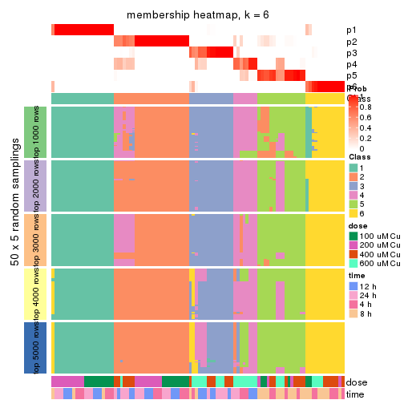</p>

</div>
</div>

As soon as we have had the classes for columns, we can look for signatures
which are significantly different between classes which can be candidate marks
for certain classes. Following are the heatmaps for signatures.


Signature heatmaps where rows are scaled:


<script>
$( function() {
	$( '#tabs-MAD-pam-get-signatures' ).tabs();
} );
</script>
<div id='tabs-MAD-pam-get-signatures'>
<ul>
<li><a href='#tab-MAD-pam-get-signatures-1'>k = 2</a></li>
<li><a href='#tab-MAD-pam-get-signatures-2'>k = 3</a></li>
<li><a href='#tab-MAD-pam-get-signatures-3'>k = 4</a></li>
<li><a href='#tab-MAD-pam-get-signatures-4'>k = 5</a></li>
<li><a href='#tab-MAD-pam-get-signatures-5'>k = 6</a></li>
</ul>
<div id='tab-MAD-pam-get-signatures-1'>
<pre><code class="r">get_signatures(res, k = 2)
</code></pre>

<p></p>

</div>
<div id='tab-MAD-pam-get-signatures-2'>
<pre><code class="r">get_signatures(res, k = 3)
</code></pre>

<p></p>

</div>
<div id='tab-MAD-pam-get-signatures-3'>
<pre><code class="r">get_signatures(res, k = 4)
</code></pre>

<p></p>

</div>
<div id='tab-MAD-pam-get-signatures-4'>
<pre><code class="r">get_signatures(res, k = 5)
</code></pre>

<p></p>

</div>
<div id='tab-MAD-pam-get-signatures-5'>
<pre><code class="r">get_signatures(res, k = 6)
</code></pre>

<p></p>

</div>
</div>


Signature heatmaps where rows are not scaled:


<script>
$( function() {
	$( '#tabs-MAD-pam-get-signatures-no-scale' ).tabs();
} );
</script>
<div id='tabs-MAD-pam-get-signatures-no-scale'>
<ul>
<li><a href='#tab-MAD-pam-get-signatures-no-scale-1'>k = 2</a></li>
<li><a href='#tab-MAD-pam-get-signatures-no-scale-2'>k = 3</a></li>
<li><a href='#tab-MAD-pam-get-signatures-no-scale-3'>k = 4</a></li>
<li><a href='#tab-MAD-pam-get-signatures-no-scale-4'>k = 5</a></li>
<li><a href='#tab-MAD-pam-get-signatures-no-scale-5'>k = 6</a></li>
</ul>
<div id='tab-MAD-pam-get-signatures-no-scale-1'>
<pre><code class="r">get_signatures(res, k = 2, scale_rows = FALSE)
</code></pre>

<p></p>

</div>
<div id='tab-MAD-pam-get-signatures-no-scale-2'>
<pre><code class="r">get_signatures(res, k = 3, scale_rows = FALSE)
</code></pre>

<p></p>

</div>
<div id='tab-MAD-pam-get-signatures-no-scale-3'>
<pre><code class="r">get_signatures(res, k = 4, scale_rows = FALSE)
</code></pre>

<p></p>

</div>
<div id='tab-MAD-pam-get-signatures-no-scale-4'>
<pre><code class="r">get_signatures(res, k = 5, scale_rows = FALSE)
</code></pre>

<p></p>

</div>
<div id='tab-MAD-pam-get-signatures-no-scale-5'>
<pre><code class="r">get_signatures(res, k = 6, scale_rows = FALSE)
</code></pre>

<p>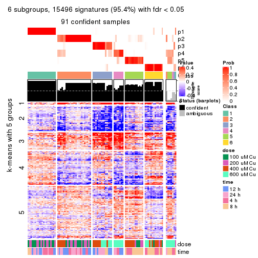</p>

</div>
</div>


Compare the overlap of signatures from different k:

```r
compare_signatures(res)
```


`get_signature()` returns a data frame invisibly. TO get the list of signatures, the function
call should be assigned to a variable explicitly. In following code, if `plot` argument is set
to `FALSE`, no heatmap is plotted while only the differential analysis is performed.

```r
# code only for demonstration
tb = get_signature(res, k = ..., plot = FALSE)
```

An example of the output of `tb` is:

```
#>   which_row         fdr    mean_1    mean_2 scaled_mean_1 scaled_mean_2 km
#> 1        38 0.042760348  8.373488  9.131774    -0.5533452     0.5164555  1
#> 2        40 0.018707592  7.106213  8.469186    -0.6173731     0.5762149  1
#> 3        55 0.019134737 10.221463 11.207825    -0.6159697     0.5749050  1
#> 4        59 0.006059896  5.921854  7.869574    -0.6899429     0.6439467  1
#> 5        60 0.018055526  8.928898 10.211722    -0.6204761     0.5791110  1
#> 6        98 0.009384629 15.714769 14.887706     0.6635654    -0.6193277  2
...
```

The columns in `tb` are:

1. `which_row`: row indices corresponding to the input matrix.
2. `fdr`: FDR for the differential test. 
3. `mean_x`: The mean value in group x.
4. `scaled_mean_x`: The mean value in group x after rows are scaled.
5. `km`: Row groups if k-means clustering is applied to rows.


UMAP plot which shows how samples are separated.


<script>
$( function() {
	$( '#tabs-MAD-pam-dimension-reduction' ).tabs();
} );
</script>
<div id='tabs-MAD-pam-dimension-reduction'>
<ul>
<li><a href='#tab-MAD-pam-dimension-reduction-1'>k = 2</a></li>
<li><a href='#tab-MAD-pam-dimension-reduction-2'>k = 3</a></li>
<li><a href='#tab-MAD-pam-dimension-reduction-3'>k = 4</a></li>
<li><a href='#tab-MAD-pam-dimension-reduction-4'>k = 5</a></li>
<li><a href='#tab-MAD-pam-dimension-reduction-5'>k = 6</a></li>
</ul>
<div id='tab-MAD-pam-dimension-reduction-1'>
<pre><code class="r">dimension_reduction(res, k = 2, method = &quot;UMAP&quot;)
</code></pre>

<p></p>

</div>
<div id='tab-MAD-pam-dimension-reduction-2'>
<pre><code class="r">dimension_reduction(res, k = 3, method = &quot;UMAP&quot;)
</code></pre>

<p></p>

</div>
<div id='tab-MAD-pam-dimension-reduction-3'>
<pre><code class="r">dimension_reduction(res, k = 4, method = &quot;UMAP&quot;)
</code></pre>

<p></p>

</div>
<div id='tab-MAD-pam-dimension-reduction-4'>
<pre><code class="r">dimension_reduction(res, k = 5, method = &quot;UMAP&quot;)
</code></pre>

<p></p>

</div>
<div id='tab-MAD-pam-dimension-reduction-5'>
<pre><code class="r">dimension_reduction(res, k = 6, method = &quot;UMAP&quot;)
</code></pre>

<p></p>

</div>
</div>


Following heatmap shows how subgroups are split when increasing `k`:

```r
collect_classes(res)
```


Test correlation between subgroups and known annotations. If the known
annotation is numeric, one-way ANOVA test is applied, and if the known
annotation is discrete, chi-squared contingency table test is applied.

```r
test_to_known_factors(res)
```

```
#>          n  dose(p)  time(p) k
#> MAD:pam 98 9.89e-01 9.89e-01 2
#> MAD:pam 97 7.77e-07 7.73e-01 3
#> MAD:pam 95 6.03e-08 4.44e-05 4
#> MAD:pam 91 8.91e-06 5.35e-08 5
#> MAD:pam 91 5.86e-11 2.93e-06 6
```


If matrix rows can be associated to genes, consider to use `GO_Enrichment(res,
...)` to perform function enrichment for the signature genes.


 

---------------------------------------------------


### MAD:mclust*


The object with results only for a single top-value method and a single partition method 
can be extracted as:

```r
res = res_list["MAD", "mclust"]
# you can also extract it by
# res = res_list["MAD:mclust"]
```

A summary of `res` and all the functions that can be applied to it:

```r
res
```

```
#> A 'ConsensusPartition' object with k = 2, 3, 4, 5, 6.
#>   On a matrix with 16250 rows and 98 columns.
#>   Top rows (1000, 2000, 3000, 4000, 5000) are extracted by 'MAD' method.
#>   Subgroups are detected by 'mclust' method.
#>   Performed in total 1250 partitions by row resampling.
#>   Best k for subgroups seems to be 6.
#> 
#> Following methods can be applied to this 'ConsensusPartition' object:
#>  [1] "cola_report"             "collect_classes"         "collect_plots"          
#>  [4] "collect_stats"           "colnames"                "compare_signatures"     
#>  [7] "consensus_heatmap"       "dimension_reduction"     "functional_enrichment"  
#> [10] "get_anno_col"            "get_anno"                "get_classes"            
#> [13] "get_consensus"           "get_matrix"              "get_membership"         
#> [16] "get_param"               "get_signatures"          "get_stats"              
#> [19] "is_best_k"               "is_stable_k"             "membership_heatmap"     
#> [22] "ncol"                    "nrow"                    "plot_ecdf"              
#> [25] "rownames"                "select_partition_number" "show"                   
#> [28] "suggest_best_k"          "test_to_known_factors"
```

`collect_plots()` function collects all the plots made from `res` for all `k` (number of partitions)
into one single page to provide an easy and fast comparison between different `k`.

```r
collect_plots(res)
```


The plots are:

- The first row: a plot of the ECDF (Empirical cumulative distribution
  function) curves of the consensus matrix for each `k` and the heatmap of
  predicted classes for each `k`.
- The second row: heatmaps of the consensus matrix for each `k`.
- The third row: heatmaps of the membership matrix for each `k`.
- The fouth row: heatmaps of the signatures for each `k`.

All the plots in panels can be made by individual functions and they are
plotted later in this section.

`select_partition_number()` produces several plots showing different
statistics for choosing "optimized" `k`. There are following statistics:

- ECDF curves of the consensus matrix for each `k`;
- 1-PAC. [The PAC
  score](https://en.wikipedia.org/wiki/Consensus_clustering#Over-interpretation_potential_of_consensus_clustering)
  measures the proportion of the ambiguous subgrouping.
- Mean silhouette score.
- Concordance. The mean probability of fiting the consensus class ids in all
  partitions.
- Area increased. Denote $A_k$ as the area under the ECDF curve for current
  `k`, the area increased is defined as $A_k - A_{k-1}$.
- Rand index. The percent of pairs of samples that are both in a same cluster
  or both are not in a same cluster in the partition of k and k-1.
- Jaccard index. The ratio of pairs of samples are both in a same cluster in
  the partition of k and k-1 and the pairs of samples are both in a same
  cluster in the partition k or k-1.

The detailed explanations of these statistics can be found in [the cola
vignette](http://bioconductor.org/packages/devel/bioc/vignettes/cola/inst/doc/cola.html#toc_13).

Generally speaking, lower PAC score, higher mean silhouette score or higher
concordance corresponds to better partition. Rand index and Jaccard index
measure how similar the current partition is compared to partition with `k-1`.
If they are too similar, we won't accept `k` is better than `k-1`.

```r
select_partition_number(res)
```


The numeric values for all these statistics can be obtained by `get_stats()`.

```r
get_stats(res)
```

```
#>   k 1-PAC mean_silhouette concordance area_increased  Rand Jaccard
#> 2 2 1.000           0.998       0.997         0.5040 0.495   0.495
#> 3 3 1.000           0.971       0.989         0.0503 0.559   0.374
#> 4 4 0.901           0.929       0.965         0.3318 0.816   0.615
#> 5 5 0.906           0.930       0.947         0.1218 0.905   0.686
#> 6 6 0.935           0.903       0.949         0.0536 0.955   0.780
```

`suggest_best_k()` suggests the best $k$ based on these statistics. The rules are as follows:

- All $k$ with Jaccard index larger than 0.95 are removed because the increase of
  the partition number does not provides enough extra information. If all $k$ are removed,
  the best $k$ is assigned by `NA`.
- For $k$ with 1-PAC larger than 0.9, the maximal $k$ is taken as the "best k". Other $k$ is called "optional k".
- If it does not fit the second rule. The $k$ with the highest vote of highest
  1-PAC, mean silhouette and concordance is taken as the "best k".

```r
suggest_best_k(res)
```

```
#> [1] 6
#> attr(,"optional")
#> [1] 2 3 4 5
```

There is also optional best $k$ = 2 3 4 5 that is worth to check.

Following shows the table of the partitions (You need to click the **show/hide
code output** link to see it). The membership matrix (columns with name `p*`)
is inferred by
[`clue::cl_consensus()`](https://www.rdocumentation.org/link/cl_consensus?package=clue)
function with the `SE` method. Basically the value in the membership matrix
represents the probability to belong to a certain group. The finall class
label for an item is determined with the group with highest probability it
belongs to.

In `get_classes()` function, the entropy is calculated from the membership
matrix and the silhouette score is calculated from the consensus matrix.


<script>
$( function() {
	$( '#tabs-MAD-mclust-get-classes' ).tabs();
} );
</script>
<div id='tabs-MAD-mclust-get-classes'>
<ul>
<li><a href='#tab-MAD-mclust-get-classes-1'>k = 2</a></li>
<li><a href='#tab-MAD-mclust-get-classes-2'>k = 3</a></li>
<li><a href='#tab-MAD-mclust-get-classes-3'>k = 4</a></li>
<li><a href='#tab-MAD-mclust-get-classes-4'>k = 5</a></li>
<li><a href='#tab-MAD-mclust-get-classes-5'>k = 6</a></li>
</ul>

<div id='tab-MAD-mclust-get-classes-1'>
<p><a id='tab-MAD-mclust-get-classes-1-a' style='color:#0366d6' href='#'>show/hide code output</a></p>
<pre><code class="r">cbind(get_classes(res, k = 2), get_membership(res, k = 2))
</code></pre>

<pre><code>#&gt;           class entropy silhouette    p1    p2
#&gt; GSM241451     2  0.0000      1.000 0.000 1.000
#&gt; GSM241452     1  0.0000      0.994 1.000 0.000
#&gt; GSM241453     2  0.0000      1.000 0.000 1.000
#&gt; GSM241454     1  0.0000      0.994 1.000 0.000
#&gt; GSM241455     2  0.0000      1.000 0.000 1.000
#&gt; GSM241456     1  0.0000      0.994 1.000 0.000
#&gt; GSM241457     2  0.0000      1.000 0.000 1.000
#&gt; GSM241458     1  0.0672      0.997 0.992 0.008
#&gt; GSM241459     2  0.0000      1.000 0.000 1.000
#&gt; GSM241460     1  0.0000      0.994 1.000 0.000
#&gt; GSM241461     2  0.0000      1.000 0.000 1.000
#&gt; GSM241462     1  0.0672      0.997 0.992 0.008
#&gt; GSM241463     2  0.0000      1.000 0.000 1.000
#&gt; GSM241464     1  0.0672      0.997 0.992 0.008
#&gt; GSM241465     2  0.0000      1.000 0.000 1.000
#&gt; GSM241466     1  0.0000      0.994 1.000 0.000
#&gt; GSM241467     1  0.0000      0.994 1.000 0.000
#&gt; GSM241468     2  0.0000      1.000 0.000 1.000
#&gt; GSM241469     1  0.0000      0.994 1.000 0.000
#&gt; GSM241470     2  0.0000      1.000 0.000 1.000
#&gt; GSM241471     2  0.0000      1.000 0.000 1.000
#&gt; GSM241472     1  0.0000      0.994 1.000 0.000
#&gt; GSM241473     2  0.0000      1.000 0.000 1.000
#&gt; GSM241474     1  0.0000      0.994 1.000 0.000
#&gt; GSM241475     2  0.0000      1.000 0.000 1.000
#&gt; GSM241476     1  0.0000      0.994 1.000 0.000
#&gt; GSM241477     2  0.0000      1.000 0.000 1.000
#&gt; GSM241478     2  0.0000      1.000 0.000 1.000
#&gt; GSM241479     1  0.0000      0.994 1.000 0.000
#&gt; GSM241480     1  0.0000      0.994 1.000 0.000
#&gt; GSM241481     2  0.0000      1.000 0.000 1.000
#&gt; GSM241482     1  0.0672      0.997 0.992 0.008
#&gt; GSM241483     2  0.0000      1.000 0.000 1.000
#&gt; GSM241484     1  0.0672      0.997 0.992 0.008
#&gt; GSM241485     1  0.0672      0.997 0.992 0.008
#&gt; GSM241486     2  0.0000      1.000 0.000 1.000
#&gt; GSM241487     2  0.0000      1.000 0.000 1.000
#&gt; GSM241488     2  0.0000      1.000 0.000 1.000
#&gt; GSM241489     1  0.0672      0.997 0.992 0.008
#&gt; GSM241490     1  0.0000      0.994 1.000 0.000
#&gt; GSM241491     2  0.0000      1.000 0.000 1.000
#&gt; GSM241492     1  0.0672      0.997 0.992 0.008
#&gt; GSM241493     2  0.0000      1.000 0.000 1.000
#&gt; GSM241494     1  0.0000      0.994 1.000 0.000
#&gt; GSM241495     2  0.0000      1.000 0.000 1.000
#&gt; GSM241496     2  0.0000      1.000 0.000 1.000
#&gt; GSM241497     1  0.0376      0.996 0.996 0.004
#&gt; GSM241498     1  0.0000      0.994 1.000 0.000
#&gt; GSM241499     1  0.0672      0.997 0.992 0.008
#&gt; GSM241500     2  0.0000      1.000 0.000 1.000
#&gt; GSM241501     2  0.0000      1.000 0.000 1.000
#&gt; GSM241502     2  0.0000      1.000 0.000 1.000
#&gt; GSM241503     1  0.0672      0.997 0.992 0.008
#&gt; GSM241504     1  0.0672      0.997 0.992 0.008
#&gt; GSM241505     1  0.0672      0.997 0.992 0.008
#&gt; GSM241506     2  0.0000      1.000 0.000 1.000
#&gt; GSM241507     1  0.0672      0.997 0.992 0.008
#&gt; GSM241508     2  0.0000      1.000 0.000 1.000
#&gt; GSM241509     2  0.0000      1.000 0.000 1.000
#&gt; GSM241510     2  0.0000      1.000 0.000 1.000
#&gt; GSM241511     1  0.0672      0.997 0.992 0.008
#&gt; GSM241512     1  0.0672      0.997 0.992 0.008
#&gt; GSM241513     2  0.0000      1.000 0.000 1.000
#&gt; GSM241514     1  0.0672      0.997 0.992 0.008
#&gt; GSM241515     2  0.0000      1.000 0.000 1.000
#&gt; GSM241516     1  0.0672      0.997 0.992 0.008
#&gt; GSM241517     2  0.0000      1.000 0.000 1.000
#&gt; GSM241518     1  0.0672      0.997 0.992 0.008
#&gt; GSM241519     2  0.0000      1.000 0.000 1.000
#&gt; GSM241520     1  0.0672      0.997 0.992 0.008
#&gt; GSM241521     2  0.0000      1.000 0.000 1.000
#&gt; GSM241522     1  0.0672      0.997 0.992 0.008
#&gt; GSM241523     2  0.0000      1.000 0.000 1.000
#&gt; GSM241524     1  0.0672      0.997 0.992 0.008
#&gt; GSM241525     1  0.0672      0.997 0.992 0.008
#&gt; GSM241526     2  0.0000      1.000 0.000 1.000
#&gt; GSM241527     1  0.0672      0.997 0.992 0.008
#&gt; GSM241528     2  0.0000      1.000 0.000 1.000
#&gt; GSM241529     2  0.0000      1.000 0.000 1.000
#&gt; GSM241530     1  0.0672      0.997 0.992 0.008
#&gt; GSM241531     1  0.0672      0.997 0.992 0.008
#&gt; GSM241532     2  0.0000      1.000 0.000 1.000
#&gt; GSM241533     2  0.0000      1.000 0.000 1.000
#&gt; GSM241534     2  0.0000      1.000 0.000 1.000
#&gt; GSM241535     1  0.0672      0.997 0.992 0.008
#&gt; GSM241536     1  0.0672      0.997 0.992 0.008
#&gt; GSM241537     2  0.0000      1.000 0.000 1.000
#&gt; GSM241538     1  0.0672      0.997 0.992 0.008
#&gt; GSM241539     2  0.0000      1.000 0.000 1.000
#&gt; GSM241540     1  0.0672      0.997 0.992 0.008
#&gt; GSM241541     2  0.0000      1.000 0.000 1.000
#&gt; GSM241542     1  0.0672      0.997 0.992 0.008
#&gt; GSM241543     2  0.0000      1.000 0.000 1.000
#&gt; GSM241544     1  0.0672      0.997 0.992 0.008
#&gt; GSM241545     2  0.0000      1.000 0.000 1.000
#&gt; GSM241546     1  0.0672      0.997 0.992 0.008
#&gt; GSM241547     2  0.0000      1.000 0.000 1.000
#&gt; GSM241548     1  0.0672      0.997 0.992 0.008
</code></pre>

<script>
$('#tab-MAD-mclust-get-classes-1-a').parent().next().next().hide();
$('#tab-MAD-mclust-get-classes-1-a').click(function(){
  $('#tab-MAD-mclust-get-classes-1-a').parent().next().next().toggle();
  return(false);
});
</script>
</div>

<div id='tab-MAD-mclust-get-classes-2'>
<p><a id='tab-MAD-mclust-get-classes-2-a' style='color:#0366d6' href='#'>show/hide code output</a></p>
<pre><code class="r">cbind(get_classes(res, k = 3), get_membership(res, k = 3))
</code></pre>

<pre><code>#&gt;           class entropy silhouette    p1    p2    p3
#&gt; GSM241451     2  0.0000      0.984 0.000 1.000 0.000
#&gt; GSM241452     1  0.0000      0.970 1.000 0.000 0.000
#&gt; GSM241453     2  0.0000      0.984 0.000 1.000 0.000
#&gt; GSM241454     1  0.0000      0.970 1.000 0.000 0.000
#&gt; GSM241455     2  0.0000      0.984 0.000 1.000 0.000
#&gt; GSM241456     1  0.0000      0.970 1.000 0.000 0.000
#&gt; GSM241457     3  0.0000      0.990 0.000 0.000 1.000
#&gt; GSM241458     3  0.1031      0.970 0.024 0.000 0.976
#&gt; GSM241459     3  0.0000      0.990 0.000 0.000 1.000
#&gt; GSM241460     1  0.1289      0.931 0.968 0.000 0.032
#&gt; GSM241461     3  0.0000      0.990 0.000 0.000 1.000
#&gt; GSM241462     3  0.0237      0.987 0.004 0.000 0.996
#&gt; GSM241463     2  0.4062      0.732 0.000 0.836 0.164
#&gt; GSM241464     3  0.4002      0.812 0.160 0.000 0.840
#&gt; GSM241465     2  0.0000      0.984 0.000 1.000 0.000
#&gt; GSM241466     1  0.0000      0.970 1.000 0.000 0.000
#&gt; GSM241467     1  0.0000      0.970 1.000 0.000 0.000
#&gt; GSM241468     2  0.0000      0.984 0.000 1.000 0.000
#&gt; GSM241469     1  0.0000      0.970 1.000 0.000 0.000
#&gt; GSM241470     2  0.0000      0.984 0.000 1.000 0.000
#&gt; GSM241471     2  0.0000      0.984 0.000 1.000 0.000
#&gt; GSM241472     1  0.0000      0.970 1.000 0.000 0.000
#&gt; GSM241473     2  0.0000      0.984 0.000 1.000 0.000
#&gt; GSM241474     1  0.0000      0.970 1.000 0.000 0.000
#&gt; GSM241475     2  0.0000      0.984 0.000 1.000 0.000
#&gt; GSM241476     1  0.0000      0.970 1.000 0.000 0.000
#&gt; GSM241477     2  0.0000      0.984 0.000 1.000 0.000
#&gt; GSM241478     2  0.0000      0.984 0.000 1.000 0.000
#&gt; GSM241479     1  0.0000      0.970 1.000 0.000 0.000
#&gt; GSM241480     1  0.0000      0.970 1.000 0.000 0.000
#&gt; GSM241481     3  0.0000      0.990 0.000 0.000 1.000
#&gt; GSM241482     3  0.1163      0.966 0.028 0.000 0.972
#&gt; GSM241483     3  0.0000      0.990 0.000 0.000 1.000
#&gt; GSM241484     3  0.0747      0.977 0.016 0.000 0.984
#&gt; GSM241485     3  0.3340      0.866 0.120 0.000 0.880
#&gt; GSM241486     3  0.0000      0.990 0.000 0.000 1.000
#&gt; GSM241487     2  0.0424      0.975 0.000 0.992 0.008
#&gt; GSM241488     2  0.0000      0.984 0.000 1.000 0.000
#&gt; GSM241489     1  0.5327      0.572 0.728 0.000 0.272
#&gt; GSM241490     1  0.0592      0.956 0.988 0.000 0.012
#&gt; GSM241491     2  0.0424      0.974 0.000 0.992 0.008
#&gt; GSM241492     3  0.5058      0.682 0.244 0.000 0.756
#&gt; GSM241493     2  0.0000      0.984 0.000 1.000 0.000
#&gt; GSM241494     1  0.0000      0.970 1.000 0.000 0.000
#&gt; GSM241495     2  0.0000      0.984 0.000 1.000 0.000
#&gt; GSM241496     2  0.0000      0.984 0.000 1.000 0.000
#&gt; GSM241497     1  0.0000      0.970 1.000 0.000 0.000
#&gt; GSM241498     1  0.0000      0.970 1.000 0.000 0.000
#&gt; GSM241499     3  0.0237      0.987 0.004 0.000 0.996
#&gt; GSM241500     3  0.0000      0.990 0.000 0.000 1.000
#&gt; GSM241501     3  0.0000      0.990 0.000 0.000 1.000
#&gt; GSM241502     3  0.0000      0.990 0.000 0.000 1.000
#&gt; GSM241503     3  0.0237      0.987 0.004 0.000 0.996
#&gt; GSM241504     3  0.0237      0.987 0.004 0.000 0.996
#&gt; GSM241505     3  0.0237      0.987 0.004 0.000 0.996
#&gt; GSM241506     3  0.0000      0.990 0.000 0.000 1.000
#&gt; GSM241507     3  0.0237      0.987 0.004 0.000 0.996
#&gt; GSM241508     3  0.0000      0.990 0.000 0.000 1.000
#&gt; GSM241509     3  0.0000      0.990 0.000 0.000 1.000
#&gt; GSM241510     3  0.0000      0.990 0.000 0.000 1.000
#&gt; GSM241511     3  0.0000      0.990 0.000 0.000 1.000
#&gt; GSM241512     3  0.0000      0.990 0.000 0.000 1.000
#&gt; GSM241513     3  0.0000      0.990 0.000 0.000 1.000
#&gt; GSM241514     3  0.0000      0.990 0.000 0.000 1.000
#&gt; GSM241515     3  0.0000      0.990 0.000 0.000 1.000
#&gt; GSM241516     3  0.0000      0.990 0.000 0.000 1.000
#&gt; GSM241517     3  0.0000      0.990 0.000 0.000 1.000
#&gt; GSM241518     3  0.0000      0.990 0.000 0.000 1.000
#&gt; GSM241519     3  0.0000      0.990 0.000 0.000 1.000
#&gt; GSM241520     3  0.0000      0.990 0.000 0.000 1.000
#&gt; GSM241521     3  0.0000      0.990 0.000 0.000 1.000
#&gt; GSM241522     3  0.0000      0.990 0.000 0.000 1.000
#&gt; GSM241523     3  0.0000      0.990 0.000 0.000 1.000
#&gt; GSM241524     3  0.0000      0.990 0.000 0.000 1.000
#&gt; GSM241525     3  0.0000      0.990 0.000 0.000 1.000
#&gt; GSM241526     3  0.0000      0.990 0.000 0.000 1.000
#&gt; GSM241527     3  0.0000      0.990 0.000 0.000 1.000
#&gt; GSM241528     3  0.0000      0.990 0.000 0.000 1.000
#&gt; GSM241529     3  0.0000      0.990 0.000 0.000 1.000
#&gt; GSM241530     3  0.0000      0.990 0.000 0.000 1.000
#&gt; GSM241531     3  0.0000      0.990 0.000 0.000 1.000
#&gt; GSM241532     3  0.0000      0.990 0.000 0.000 1.000
#&gt; GSM241533     3  0.0000      0.990 0.000 0.000 1.000
#&gt; GSM241534     3  0.0000      0.990 0.000 0.000 1.000
#&gt; GSM241535     3  0.0000      0.990 0.000 0.000 1.000
#&gt; GSM241536     3  0.0000      0.990 0.000 0.000 1.000
#&gt; GSM241537     3  0.0000      0.990 0.000 0.000 1.000
#&gt; GSM241538     3  0.0000      0.990 0.000 0.000 1.000
#&gt; GSM241539     3  0.0000      0.990 0.000 0.000 1.000
#&gt; GSM241540     3  0.0000      0.990 0.000 0.000 1.000
#&gt; GSM241541     3  0.0000      0.990 0.000 0.000 1.000
#&gt; GSM241542     3  0.0000      0.990 0.000 0.000 1.000
#&gt; GSM241543     3  0.0000      0.990 0.000 0.000 1.000
#&gt; GSM241544     3  0.0000      0.990 0.000 0.000 1.000
#&gt; GSM241545     3  0.0000      0.990 0.000 0.000 1.000
#&gt; GSM241546     3  0.0000      0.990 0.000 0.000 1.000
#&gt; GSM241547     3  0.0000      0.990 0.000 0.000 1.000
#&gt; GSM241548     3  0.0000      0.990 0.000 0.000 1.000
</code></pre>

<script>
$('#tab-MAD-mclust-get-classes-2-a').parent().next().next().hide();
$('#tab-MAD-mclust-get-classes-2-a').click(function(){
  $('#tab-MAD-mclust-get-classes-2-a').parent().next().next().toggle();
  return(false);
});
</script>
</div>

<div id='tab-MAD-mclust-get-classes-3'>
<p><a id='tab-MAD-mclust-get-classes-3-a' style='color:#0366d6' href='#'>show/hide code output</a></p>
<pre><code class="r">cbind(get_classes(res, k = 4), get_membership(res, k = 4))
</code></pre>

<pre><code>#&gt;           class entropy silhouette    p1    p2    p3    p4
#&gt; GSM241451     2  0.0000      0.985 0.000 1.000 0.000 0.000
#&gt; GSM241452     1  0.0000      0.977 1.000 0.000 0.000 0.000
#&gt; GSM241453     2  0.0000      0.985 0.000 1.000 0.000 0.000
#&gt; GSM241454     1  0.0000      0.977 1.000 0.000 0.000 0.000
#&gt; GSM241455     2  0.0000      0.985 0.000 1.000 0.000 0.000
#&gt; GSM241456     1  0.0000      0.977 1.000 0.000 0.000 0.000
#&gt; GSM241457     4  0.0000      0.964 0.000 0.000 0.000 1.000
#&gt; GSM241458     3  0.4008      0.694 0.244 0.000 0.756 0.000
#&gt; GSM241459     4  0.0000      0.964 0.000 0.000 0.000 1.000
#&gt; GSM241460     1  0.0000      0.977 1.000 0.000 0.000 0.000
#&gt; GSM241461     4  0.0000      0.964 0.000 0.000 0.000 1.000
#&gt; GSM241462     3  0.3569      0.761 0.196 0.000 0.804 0.000
#&gt; GSM241463     2  0.0000      0.985 0.000 1.000 0.000 0.000
#&gt; GSM241464     1  0.0336      0.969 0.992 0.000 0.008 0.000
#&gt; GSM241465     2  0.0000      0.985 0.000 1.000 0.000 0.000
#&gt; GSM241466     1  0.0000      0.977 1.000 0.000 0.000 0.000
#&gt; GSM241467     1  0.0000      0.977 1.000 0.000 0.000 0.000
#&gt; GSM241468     2  0.0000      0.985 0.000 1.000 0.000 0.000
#&gt; GSM241469     1  0.0000      0.977 1.000 0.000 0.000 0.000
#&gt; GSM241470     2  0.0000      0.985 0.000 1.000 0.000 0.000
#&gt; GSM241471     2  0.0000      0.985 0.000 1.000 0.000 0.000
#&gt; GSM241472     1  0.0000      0.977 1.000 0.000 0.000 0.000
#&gt; GSM241473     2  0.0000      0.985 0.000 1.000 0.000 0.000
#&gt; GSM241474     1  0.0000      0.977 1.000 0.000 0.000 0.000
#&gt; GSM241475     2  0.0000      0.985 0.000 1.000 0.000 0.000
#&gt; GSM241476     1  0.0000      0.977 1.000 0.000 0.000 0.000
#&gt; GSM241477     2  0.0000      0.985 0.000 1.000 0.000 0.000
#&gt; GSM241478     2  0.0000      0.985 0.000 1.000 0.000 0.000
#&gt; GSM241479     1  0.0000      0.977 1.000 0.000 0.000 0.000
#&gt; GSM241480     1  0.0000      0.977 1.000 0.000 0.000 0.000
#&gt; GSM241481     4  0.0000      0.964 0.000 0.000 0.000 1.000
#&gt; GSM241482     3  0.4008      0.694 0.244 0.000 0.756 0.000
#&gt; GSM241483     4  0.0000      0.964 0.000 0.000 0.000 1.000
#&gt; GSM241484     3  0.3907      0.712 0.232 0.000 0.768 0.000
#&gt; GSM241485     3  0.4277      0.642 0.280 0.000 0.720 0.000
#&gt; GSM241486     4  0.0000      0.964 0.000 0.000 0.000 1.000
#&gt; GSM241487     2  0.4008      0.656 0.000 0.756 0.000 0.244
#&gt; GSM241488     2  0.0000      0.985 0.000 1.000 0.000 0.000
#&gt; GSM241489     1  0.0000      0.977 1.000 0.000 0.000 0.000
#&gt; GSM241490     1  0.4406      0.530 0.700 0.000 0.300 0.000
#&gt; GSM241491     2  0.0000      0.985 0.000 1.000 0.000 0.000
#&gt; GSM241492     1  0.0000      0.977 1.000 0.000 0.000 0.000
#&gt; GSM241493     2  0.0000      0.985 0.000 1.000 0.000 0.000
#&gt; GSM241494     1  0.0000      0.977 1.000 0.000 0.000 0.000
#&gt; GSM241495     2  0.0000      0.985 0.000 1.000 0.000 0.000
#&gt; GSM241496     2  0.0000      0.985 0.000 1.000 0.000 0.000
#&gt; GSM241497     1  0.0000      0.977 1.000 0.000 0.000 0.000
#&gt; GSM241498     1  0.0000      0.977 1.000 0.000 0.000 0.000
#&gt; GSM241499     3  0.0469      0.935 0.012 0.000 0.988 0.000
#&gt; GSM241500     4  0.1211      0.979 0.000 0.000 0.040 0.960
#&gt; GSM241501     4  0.1211      0.979 0.000 0.000 0.040 0.960
#&gt; GSM241502     4  0.1211      0.979 0.000 0.000 0.040 0.960
#&gt; GSM241503     3  0.0000      0.941 0.000 0.000 1.000 0.000
#&gt; GSM241504     3  0.0000      0.941 0.000 0.000 1.000 0.000
#&gt; GSM241505     3  0.0000      0.941 0.000 0.000 1.000 0.000
#&gt; GSM241506     4  0.1211      0.979 0.000 0.000 0.040 0.960
#&gt; GSM241507     3  0.0000      0.941 0.000 0.000 1.000 0.000
#&gt; GSM241508     4  0.1211      0.979 0.000 0.000 0.040 0.960
#&gt; GSM241509     4  0.1211      0.979 0.000 0.000 0.040 0.960
#&gt; GSM241510     4  0.1211      0.979 0.000 0.000 0.040 0.960
#&gt; GSM241511     3  0.0000      0.941 0.000 0.000 1.000 0.000
#&gt; GSM241512     3  0.0000      0.941 0.000 0.000 1.000 0.000
#&gt; GSM241513     3  0.0592      0.936 0.000 0.000 0.984 0.016
#&gt; GSM241514     3  0.0000      0.941 0.000 0.000 1.000 0.000
#&gt; GSM241515     3  0.0592      0.936 0.000 0.000 0.984 0.016
#&gt; GSM241516     3  0.0000      0.941 0.000 0.000 1.000 0.000
#&gt; GSM241517     3  0.0592      0.936 0.000 0.000 0.984 0.016
#&gt; GSM241518     3  0.0000      0.941 0.000 0.000 1.000 0.000
#&gt; GSM241519     3  0.0592      0.936 0.000 0.000 0.984 0.016
#&gt; GSM241520     3  0.0000      0.941 0.000 0.000 1.000 0.000
#&gt; GSM241521     3  0.4008      0.689 0.000 0.000 0.756 0.244
#&gt; GSM241522     3  0.0000      0.941 0.000 0.000 1.000 0.000
#&gt; GSM241523     3  0.0592      0.936 0.000 0.000 0.984 0.016
#&gt; GSM241524     3  0.0000      0.941 0.000 0.000 1.000 0.000
#&gt; GSM241525     3  0.0000      0.941 0.000 0.000 1.000 0.000
#&gt; GSM241526     3  0.4164      0.660 0.000 0.000 0.736 0.264
#&gt; GSM241527     3  0.0000      0.941 0.000 0.000 1.000 0.000
#&gt; GSM241528     3  0.4164      0.660 0.000 0.000 0.736 0.264
#&gt; GSM241529     3  0.4164      0.660 0.000 0.000 0.736 0.264
#&gt; GSM241530     3  0.0000      0.941 0.000 0.000 1.000 0.000
#&gt; GSM241531     3  0.0000      0.941 0.000 0.000 1.000 0.000
#&gt; GSM241532     4  0.1211      0.979 0.000 0.000 0.040 0.960
#&gt; GSM241533     4  0.1211      0.979 0.000 0.000 0.040 0.960
#&gt; GSM241534     4  0.1211      0.979 0.000 0.000 0.040 0.960
#&gt; GSM241535     3  0.0000      0.941 0.000 0.000 1.000 0.000
#&gt; GSM241536     3  0.0000      0.941 0.000 0.000 1.000 0.000
#&gt; GSM241537     3  0.0707      0.934 0.000 0.000 0.980 0.020
#&gt; GSM241538     3  0.0000      0.941 0.000 0.000 1.000 0.000
#&gt; GSM241539     3  0.1389      0.915 0.000 0.000 0.952 0.048
#&gt; GSM241540     3  0.0000      0.941 0.000 0.000 1.000 0.000
#&gt; GSM241541     3  0.0592      0.936 0.000 0.000 0.984 0.016
#&gt; GSM241542     3  0.0000      0.941 0.000 0.000 1.000 0.000
#&gt; GSM241543     3  0.0592      0.936 0.000 0.000 0.984 0.016
#&gt; GSM241544     3  0.0000      0.941 0.000 0.000 1.000 0.000
#&gt; GSM241545     3  0.0592      0.936 0.000 0.000 0.984 0.016
#&gt; GSM241546     3  0.0000      0.941 0.000 0.000 1.000 0.000
#&gt; GSM241547     3  0.0592      0.936 0.000 0.000 0.984 0.016
#&gt; GSM241548     3  0.0000      0.941 0.000 0.000 1.000 0.000
</code></pre>

<script>
$('#tab-MAD-mclust-get-classes-3-a').parent().next().next().hide();
$('#tab-MAD-mclust-get-classes-3-a').click(function(){
  $('#tab-MAD-mclust-get-classes-3-a').parent().next().next().toggle();
  return(false);
});
</script>
</div>

<div id='tab-MAD-mclust-get-classes-4'>
<p><a id='tab-MAD-mclust-get-classes-4-a' style='color:#0366d6' href='#'>show/hide code output</a></p>
<pre><code class="r">cbind(get_classes(res, k = 5), get_membership(res, k = 5))
</code></pre>

<pre><code>#&gt;           class entropy silhouette    p1    p2    p3    p4    p5
#&gt; GSM241451     2  0.0000      0.994 0.000 1.000 0.000 0.000 0.000
#&gt; GSM241452     1  0.0000      0.983 1.000 0.000 0.000 0.000 0.000
#&gt; GSM241453     2  0.0000      0.994 0.000 1.000 0.000 0.000 0.000
#&gt; GSM241454     1  0.0000      0.983 1.000 0.000 0.000 0.000 0.000
#&gt; GSM241455     2  0.0000      0.994 0.000 1.000 0.000 0.000 0.000
#&gt; GSM241456     1  0.0000      0.983 1.000 0.000 0.000 0.000 0.000
#&gt; GSM241457     5  0.0000      0.850 0.000 0.000 0.000 0.000 1.000
#&gt; GSM241458     3  0.1671      0.886 0.076 0.000 0.924 0.000 0.000
#&gt; GSM241459     5  0.0000      0.850 0.000 0.000 0.000 0.000 1.000
#&gt; GSM241460     1  0.0000      0.983 1.000 0.000 0.000 0.000 0.000
#&gt; GSM241461     5  0.0000      0.850 0.000 0.000 0.000 0.000 1.000
#&gt; GSM241462     3  0.1671      0.886 0.076 0.000 0.924 0.000 0.000
#&gt; GSM241463     2  0.0000      0.994 0.000 1.000 0.000 0.000 0.000
#&gt; GSM241464     1  0.1908      0.896 0.908 0.000 0.092 0.000 0.000
#&gt; GSM241465     2  0.0000      0.994 0.000 1.000 0.000 0.000 0.000
#&gt; GSM241466     1  0.0000      0.983 1.000 0.000 0.000 0.000 0.000
#&gt; GSM241467     1  0.0000      0.983 1.000 0.000 0.000 0.000 0.000
#&gt; GSM241468     2  0.0000      0.994 0.000 1.000 0.000 0.000 0.000
#&gt; GSM241469     1  0.0000      0.983 1.000 0.000 0.000 0.000 0.000
#&gt; GSM241470     2  0.0000      0.994 0.000 1.000 0.000 0.000 0.000
#&gt; GSM241471     2  0.0000      0.994 0.000 1.000 0.000 0.000 0.000
#&gt; GSM241472     1  0.0000      0.983 1.000 0.000 0.000 0.000 0.000
#&gt; GSM241473     2  0.0000      0.994 0.000 1.000 0.000 0.000 0.000
#&gt; GSM241474     1  0.0000      0.983 1.000 0.000 0.000 0.000 0.000
#&gt; GSM241475     2  0.0000      0.994 0.000 1.000 0.000 0.000 0.000
#&gt; GSM241476     1  0.0000      0.983 1.000 0.000 0.000 0.000 0.000
#&gt; GSM241477     2  0.0000      0.994 0.000 1.000 0.000 0.000 0.000
#&gt; GSM241478     2  0.0000      0.994 0.000 1.000 0.000 0.000 0.000
#&gt; GSM241479     1  0.0000      0.983 1.000 0.000 0.000 0.000 0.000
#&gt; GSM241480     1  0.0000      0.983 1.000 0.000 0.000 0.000 0.000
#&gt; GSM241481     5  0.0000      0.850 0.000 0.000 0.000 0.000 1.000
#&gt; GSM241482     3  0.1671      0.886 0.076 0.000 0.924 0.000 0.000
#&gt; GSM241483     5  0.0000      0.850 0.000 0.000 0.000 0.000 1.000
#&gt; GSM241484     3  0.1671      0.886 0.076 0.000 0.924 0.000 0.000
#&gt; GSM241485     3  0.3074      0.744 0.196 0.000 0.804 0.000 0.000
#&gt; GSM241486     5  0.0000      0.850 0.000 0.000 0.000 0.000 1.000
#&gt; GSM241487     2  0.2017      0.896 0.000 0.912 0.000 0.008 0.080
#&gt; GSM241488     2  0.0000      0.994 0.000 1.000 0.000 0.000 0.000
#&gt; GSM241489     1  0.1121      0.947 0.956 0.000 0.044 0.000 0.000
#&gt; GSM241490     1  0.1270      0.943 0.948 0.000 0.052 0.000 0.000
#&gt; GSM241491     2  0.0000      0.994 0.000 1.000 0.000 0.000 0.000
#&gt; GSM241492     1  0.1671      0.914 0.924 0.000 0.076 0.000 0.000
#&gt; GSM241493     2  0.0000      0.994 0.000 1.000 0.000 0.000 0.000
#&gt; GSM241494     1  0.0000      0.983 1.000 0.000 0.000 0.000 0.000
#&gt; GSM241495     2  0.0000      0.994 0.000 1.000 0.000 0.000 0.000
#&gt; GSM241496     2  0.0000      0.994 0.000 1.000 0.000 0.000 0.000
#&gt; GSM241497     1  0.0000      0.983 1.000 0.000 0.000 0.000 0.000
#&gt; GSM241498     1  0.0000      0.983 1.000 0.000 0.000 0.000 0.000
#&gt; GSM241499     3  0.0510      0.919 0.016 0.000 0.984 0.000 0.000
#&gt; GSM241500     5  0.2179      0.869 0.000 0.000 0.000 0.112 0.888
#&gt; GSM241501     5  0.2179      0.869 0.000 0.000 0.000 0.112 0.888
#&gt; GSM241502     5  0.2852      0.854 0.000 0.000 0.000 0.172 0.828
#&gt; GSM241503     3  0.0510      0.919 0.016 0.000 0.984 0.000 0.000
#&gt; GSM241504     3  0.0510      0.919 0.016 0.000 0.984 0.000 0.000
#&gt; GSM241505     3  0.0510      0.919 0.016 0.000 0.984 0.000 0.000
#&gt; GSM241506     5  0.3177      0.839 0.000 0.000 0.000 0.208 0.792
#&gt; GSM241507     3  0.0510      0.919 0.016 0.000 0.984 0.000 0.000
#&gt; GSM241508     5  0.2179      0.869 0.000 0.000 0.000 0.112 0.888
#&gt; GSM241509     5  0.3561      0.805 0.000 0.000 0.000 0.260 0.740
#&gt; GSM241510     5  0.3586      0.802 0.000 0.000 0.000 0.264 0.736
#&gt; GSM241511     3  0.0162      0.923 0.000 0.000 0.996 0.004 0.000
#&gt; GSM241512     3  0.1792      0.934 0.000 0.000 0.916 0.084 0.000
#&gt; GSM241513     4  0.0000      0.954 0.000 0.000 0.000 1.000 0.000
#&gt; GSM241514     3  0.1851      0.934 0.000 0.000 0.912 0.088 0.000
#&gt; GSM241515     4  0.0000      0.954 0.000 0.000 0.000 1.000 0.000
#&gt; GSM241516     3  0.1792      0.934 0.000 0.000 0.916 0.084 0.000
#&gt; GSM241517     4  0.0000      0.954 0.000 0.000 0.000 1.000 0.000
#&gt; GSM241518     3  0.2377      0.916 0.000 0.000 0.872 0.128 0.000
#&gt; GSM241519     4  0.0000      0.954 0.000 0.000 0.000 1.000 0.000
#&gt; GSM241520     3  0.2377      0.916 0.000 0.000 0.872 0.128 0.000
#&gt; GSM241521     4  0.1732      0.904 0.000 0.000 0.000 0.920 0.080
#&gt; GSM241522     3  0.1626      0.931 0.016 0.000 0.940 0.044 0.000
#&gt; GSM241523     4  0.0000      0.954 0.000 0.000 0.000 1.000 0.000
#&gt; GSM241524     3  0.2020      0.931 0.000 0.000 0.900 0.100 0.000
#&gt; GSM241525     3  0.1270      0.933 0.000 0.000 0.948 0.052 0.000
#&gt; GSM241526     4  0.1851      0.899 0.000 0.000 0.000 0.912 0.088
#&gt; GSM241527     3  0.1851      0.934 0.000 0.000 0.912 0.088 0.000
#&gt; GSM241528     4  0.1792      0.902 0.000 0.000 0.000 0.916 0.084
#&gt; GSM241529     4  0.1851      0.899 0.000 0.000 0.000 0.912 0.088
#&gt; GSM241530     3  0.1671      0.935 0.000 0.000 0.924 0.076 0.000
#&gt; GSM241531     3  0.1671      0.935 0.000 0.000 0.924 0.076 0.000
#&gt; GSM241532     5  0.3586      0.802 0.000 0.000 0.000 0.264 0.736
#&gt; GSM241533     5  0.3586      0.802 0.000 0.000 0.000 0.264 0.736
#&gt; GSM241534     5  0.3586      0.802 0.000 0.000 0.000 0.264 0.736
#&gt; GSM241535     3  0.2230      0.923 0.000 0.000 0.884 0.116 0.000
#&gt; GSM241536     3  0.0162      0.923 0.000 0.000 0.996 0.004 0.000
#&gt; GSM241537     4  0.0404      0.949 0.000 0.000 0.000 0.988 0.012
#&gt; GSM241538     3  0.2074      0.929 0.000 0.000 0.896 0.104 0.000
#&gt; GSM241539     4  0.1792      0.903 0.000 0.000 0.000 0.916 0.084
#&gt; GSM241540     3  0.2020      0.930 0.000 0.000 0.900 0.100 0.000
#&gt; GSM241541     4  0.0000      0.954 0.000 0.000 0.000 1.000 0.000
#&gt; GSM241542     3  0.2732      0.885 0.000 0.000 0.840 0.160 0.000
#&gt; GSM241543     4  0.0000      0.954 0.000 0.000 0.000 1.000 0.000
#&gt; GSM241544     3  0.2179      0.925 0.000 0.000 0.888 0.112 0.000
#&gt; GSM241545     4  0.0000      0.954 0.000 0.000 0.000 1.000 0.000
#&gt; GSM241546     3  0.1908      0.933 0.000 0.000 0.908 0.092 0.000
#&gt; GSM241547     4  0.0000      0.954 0.000 0.000 0.000 1.000 0.000
#&gt; GSM241548     3  0.2424      0.913 0.000 0.000 0.868 0.132 0.000
</code></pre>

<script>
$('#tab-MAD-mclust-get-classes-4-a').parent().next().next().hide();
$('#tab-MAD-mclust-get-classes-4-a').click(function(){
  $('#tab-MAD-mclust-get-classes-4-a').parent().next().next().toggle();
  return(false);
});
</script>
</div>

<div id='tab-MAD-mclust-get-classes-5'>
<p><a id='tab-MAD-mclust-get-classes-5-a' style='color:#0366d6' href='#'>show/hide code output</a></p>
<pre><code class="r">cbind(get_classes(res, k = 6), get_membership(res, k = 6))
</code></pre>

<pre><code>#&gt;           class entropy silhouette    p1    p2    p3    p4    p5    p6
#&gt; GSM241451     2  0.0000      0.991 0.000 1.000 0.000 0.000 0.000 0.000
#&gt; GSM241452     1  0.0000      0.986 1.000 0.000 0.000 0.000 0.000 0.000
#&gt; GSM241453     2  0.0000      0.991 0.000 1.000 0.000 0.000 0.000 0.000
#&gt; GSM241454     1  0.0000      0.986 1.000 0.000 0.000 0.000 0.000 0.000
#&gt; GSM241455     2  0.0000      0.991 0.000 1.000 0.000 0.000 0.000 0.000
#&gt; GSM241456     1  0.0000      0.986 1.000 0.000 0.000 0.000 0.000 0.000
#&gt; GSM241457     5  0.0000      0.794 0.000 0.000 0.000 0.000 1.000 0.000
#&gt; GSM241458     6  0.0405      0.881 0.008 0.000 0.000 0.004 0.000 0.988
#&gt; GSM241459     5  0.0000      0.794 0.000 0.000 0.000 0.000 1.000 0.000
#&gt; GSM241460     1  0.0000      0.986 1.000 0.000 0.000 0.000 0.000 0.000
#&gt; GSM241461     5  0.0000      0.794 0.000 0.000 0.000 0.000 1.000 0.000
#&gt; GSM241462     6  0.0405      0.881 0.008 0.000 0.000 0.004 0.000 0.988
#&gt; GSM241463     2  0.0000      0.991 0.000 1.000 0.000 0.000 0.000 0.000
#&gt; GSM241464     1  0.1714      0.908 0.908 0.000 0.000 0.000 0.000 0.092
#&gt; GSM241465     2  0.0000      0.991 0.000 1.000 0.000 0.000 0.000 0.000
#&gt; GSM241466     1  0.0000      0.986 1.000 0.000 0.000 0.000 0.000 0.000
#&gt; GSM241467     1  0.0000      0.986 1.000 0.000 0.000 0.000 0.000 0.000
#&gt; GSM241468     2  0.0000      0.991 0.000 1.000 0.000 0.000 0.000 0.000
#&gt; GSM241469     1  0.0000      0.986 1.000 0.000 0.000 0.000 0.000 0.000
#&gt; GSM241470     2  0.0000      0.991 0.000 1.000 0.000 0.000 0.000 0.000
#&gt; GSM241471     2  0.0000      0.991 0.000 1.000 0.000 0.000 0.000 0.000
#&gt; GSM241472     1  0.0000      0.986 1.000 0.000 0.000 0.000 0.000 0.000
#&gt; GSM241473     2  0.0000      0.991 0.000 1.000 0.000 0.000 0.000 0.000
#&gt; GSM241474     1  0.0000      0.986 1.000 0.000 0.000 0.000 0.000 0.000
#&gt; GSM241475     2  0.0000      0.991 0.000 1.000 0.000 0.000 0.000 0.000
#&gt; GSM241476     1  0.0000      0.986 1.000 0.000 0.000 0.000 0.000 0.000
#&gt; GSM241477     2  0.0000      0.991 0.000 1.000 0.000 0.000 0.000 0.000
#&gt; GSM241478     2  0.0000      0.991 0.000 1.000 0.000 0.000 0.000 0.000
#&gt; GSM241479     1  0.0000      0.986 1.000 0.000 0.000 0.000 0.000 0.000
#&gt; GSM241480     1  0.0000      0.986 1.000 0.000 0.000 0.000 0.000 0.000
#&gt; GSM241481     5  0.0000      0.794 0.000 0.000 0.000 0.000 1.000 0.000
#&gt; GSM241482     6  0.0405      0.881 0.008 0.000 0.000 0.004 0.000 0.988
#&gt; GSM241483     5  0.0000      0.794 0.000 0.000 0.000 0.000 1.000 0.000
#&gt; GSM241484     6  0.0405      0.881 0.008 0.000 0.000 0.004 0.000 0.988
#&gt; GSM241485     6  0.2632      0.752 0.164 0.000 0.000 0.004 0.000 0.832
#&gt; GSM241486     5  0.0000      0.794 0.000 0.000 0.000 0.000 1.000 0.000
#&gt; GSM241487     2  0.2340      0.825 0.000 0.852 0.148 0.000 0.000 0.000
#&gt; GSM241488     2  0.0000      0.991 0.000 1.000 0.000 0.000 0.000 0.000
#&gt; GSM241489     1  0.1141      0.946 0.948 0.000 0.000 0.000 0.000 0.052
#&gt; GSM241490     1  0.0000      0.986 1.000 0.000 0.000 0.000 0.000 0.000
#&gt; GSM241491     2  0.0000      0.991 0.000 1.000 0.000 0.000 0.000 0.000
#&gt; GSM241492     1  0.1714      0.908 0.908 0.000 0.000 0.000 0.000 0.092
#&gt; GSM241493     2  0.0000      0.991 0.000 1.000 0.000 0.000 0.000 0.000
#&gt; GSM241494     1  0.0000      0.986 1.000 0.000 0.000 0.000 0.000 0.000
#&gt; GSM241495     2  0.0000      0.991 0.000 1.000 0.000 0.000 0.000 0.000
#&gt; GSM241496     2  0.0000      0.991 0.000 1.000 0.000 0.000 0.000 0.000
#&gt; GSM241497     1  0.0146      0.984 0.996 0.000 0.000 0.000 0.000 0.004
#&gt; GSM241498     1  0.0000      0.986 1.000 0.000 0.000 0.000 0.000 0.000
#&gt; GSM241499     6  0.0146      0.881 0.000 0.000 0.000 0.004 0.000 0.996
#&gt; GSM241500     5  0.2003      0.816 0.000 0.000 0.116 0.000 0.884 0.000
#&gt; GSM241501     5  0.2003      0.816 0.000 0.000 0.116 0.000 0.884 0.000
#&gt; GSM241502     5  0.2664      0.794 0.000 0.000 0.184 0.000 0.816 0.000
#&gt; GSM241503     6  0.0146      0.881 0.000 0.000 0.000 0.004 0.000 0.996
#&gt; GSM241504     6  0.1765      0.828 0.000 0.000 0.000 0.096 0.000 0.904
#&gt; GSM241505     6  0.0146      0.881 0.000 0.000 0.000 0.004 0.000 0.996
#&gt; GSM241506     5  0.3023      0.769 0.000 0.000 0.232 0.000 0.768 0.000
#&gt; GSM241507     6  0.0146      0.881 0.000 0.000 0.000 0.004 0.000 0.996
#&gt; GSM241508     5  0.2003      0.816 0.000 0.000 0.116 0.000 0.884 0.000
#&gt; GSM241509     5  0.3862      0.633 0.000 0.000 0.388 0.000 0.608 0.004
#&gt; GSM241510     5  0.3890      0.617 0.000 0.000 0.400 0.000 0.596 0.004
#&gt; GSM241511     6  0.3843      0.246 0.000 0.000 0.000 0.452 0.000 0.548
#&gt; GSM241512     4  0.0000      0.966 0.000 0.000 0.000 1.000 0.000 0.000
#&gt; GSM241513     3  0.0260      1.000 0.000 0.000 0.992 0.008 0.000 0.000
#&gt; GSM241514     4  0.0000      0.966 0.000 0.000 0.000 1.000 0.000 0.000
#&gt; GSM241515     3  0.0260      1.000 0.000 0.000 0.992 0.008 0.000 0.000
#&gt; GSM241516     4  0.0000      0.966 0.000 0.000 0.000 1.000 0.000 0.000
#&gt; GSM241517     3  0.0260      1.000 0.000 0.000 0.992 0.008 0.000 0.000
#&gt; GSM241518     4  0.0000      0.966 0.000 0.000 0.000 1.000 0.000 0.000
#&gt; GSM241519     3  0.0260      1.000 0.000 0.000 0.992 0.008 0.000 0.000
#&gt; GSM241520     4  0.0000      0.966 0.000 0.000 0.000 1.000 0.000 0.000
#&gt; GSM241521     3  0.0260      1.000 0.000 0.000 0.992 0.008 0.000 0.000
#&gt; GSM241522     4  0.0547      0.945 0.000 0.000 0.000 0.980 0.000 0.020
#&gt; GSM241523     3  0.0260      1.000 0.000 0.000 0.992 0.008 0.000 0.000
#&gt; GSM241524     4  0.0000      0.966 0.000 0.000 0.000 1.000 0.000 0.000
#&gt; GSM241525     4  0.0000      0.966 0.000 0.000 0.000 1.000 0.000 0.000
#&gt; GSM241526     3  0.0260      1.000 0.000 0.000 0.992 0.008 0.000 0.000
#&gt; GSM241527     4  0.0000      0.966 0.000 0.000 0.000 1.000 0.000 0.000
#&gt; GSM241528     3  0.0260      1.000 0.000 0.000 0.992 0.008 0.000 0.000
#&gt; GSM241529     3  0.0260      1.000 0.000 0.000 0.992 0.008 0.000 0.000
#&gt; GSM241530     4  0.0000      0.966 0.000 0.000 0.000 1.000 0.000 0.000
#&gt; GSM241531     4  0.3862     -0.113 0.000 0.000 0.000 0.524 0.000 0.476
#&gt; GSM241532     5  0.4109      0.609 0.000 0.000 0.392 0.008 0.596 0.004
#&gt; GSM241533     5  0.4135      0.587 0.000 0.000 0.404 0.008 0.584 0.004
#&gt; GSM241534     5  0.4109      0.609 0.000 0.000 0.392 0.008 0.596 0.004
#&gt; GSM241535     4  0.0000      0.966 0.000 0.000 0.000 1.000 0.000 0.000
#&gt; GSM241536     6  0.3810      0.313 0.000 0.000 0.000 0.428 0.000 0.572
#&gt; GSM241537     3  0.0260      1.000 0.000 0.000 0.992 0.008 0.000 0.000
#&gt; GSM241538     4  0.0000      0.966 0.000 0.000 0.000 1.000 0.000 0.000
#&gt; GSM241539     3  0.0260      1.000 0.000 0.000 0.992 0.008 0.000 0.000
#&gt; GSM241540     4  0.0000      0.966 0.000 0.000 0.000 1.000 0.000 0.000
#&gt; GSM241541     3  0.0260      1.000 0.000 0.000 0.992 0.008 0.000 0.000
#&gt; GSM241542     4  0.0000      0.966 0.000 0.000 0.000 1.000 0.000 0.000
#&gt; GSM241543     3  0.0260      1.000 0.000 0.000 0.992 0.008 0.000 0.000
#&gt; GSM241544     4  0.0000      0.966 0.000 0.000 0.000 1.000 0.000 0.000
#&gt; GSM241545     3  0.0260      1.000 0.000 0.000 0.992 0.008 0.000 0.000
#&gt; GSM241546     4  0.0000      0.966 0.000 0.000 0.000 1.000 0.000 0.000
#&gt; GSM241547     3  0.0260      1.000 0.000 0.000 0.992 0.008 0.000 0.000
#&gt; GSM241548     4  0.0000      0.966 0.000 0.000 0.000 1.000 0.000 0.000
</code></pre>

<script>
$('#tab-MAD-mclust-get-classes-5-a').parent().next().next().hide();
$('#tab-MAD-mclust-get-classes-5-a').click(function(){
  $('#tab-MAD-mclust-get-classes-5-a').parent().next().next().toggle();
  return(false);
});
</script>
</div>
</div>

Heatmaps for the consensus matrix. It visualizes the probability of two
samples to be in a same group.


<script>
$( function() {
	$( '#tabs-MAD-mclust-consensus-heatmap' ).tabs();
} );
</script>
<div id='tabs-MAD-mclust-consensus-heatmap'>
<ul>
<li><a href='#tab-MAD-mclust-consensus-heatmap-1'>k = 2</a></li>
<li><a href='#tab-MAD-mclust-consensus-heatmap-2'>k = 3</a></li>
<li><a href='#tab-MAD-mclust-consensus-heatmap-3'>k = 4</a></li>
<li><a href='#tab-MAD-mclust-consensus-heatmap-4'>k = 5</a></li>
<li><a href='#tab-MAD-mclust-consensus-heatmap-5'>k = 6</a></li>
</ul>
<div id='tab-MAD-mclust-consensus-heatmap-1'>
<pre><code class="r">consensus_heatmap(res, k = 2)
</code></pre>

<p></p>

</div>
<div id='tab-MAD-mclust-consensus-heatmap-2'>
<pre><code class="r">consensus_heatmap(res, k = 3)
</code></pre>

<p></p>

</div>
<div id='tab-MAD-mclust-consensus-heatmap-3'>
<pre><code class="r">consensus_heatmap(res, k = 4)
</code></pre>

<p></p>

</div>
<div id='tab-MAD-mclust-consensus-heatmap-4'>
<pre><code class="r">consensus_heatmap(res, k = 5)
</code></pre>

<p></p>

</div>
<div id='tab-MAD-mclust-consensus-heatmap-5'>
<pre><code class="r">consensus_heatmap(res, k = 6)
</code></pre>

<p></p>

</div>
</div>

Heatmaps for the membership of samples in all partitions to see how consistent they are:


<script>
$( function() {
	$( '#tabs-MAD-mclust-membership-heatmap' ).tabs();
} );
</script>
<div id='tabs-MAD-mclust-membership-heatmap'>
<ul>
<li><a href='#tab-MAD-mclust-membership-heatmap-1'>k = 2</a></li>
<li><a href='#tab-MAD-mclust-membership-heatmap-2'>k = 3</a></li>
<li><a href='#tab-MAD-mclust-membership-heatmap-3'>k = 4</a></li>
<li><a href='#tab-MAD-mclust-membership-heatmap-4'>k = 5</a></li>
<li><a href='#tab-MAD-mclust-membership-heatmap-5'>k = 6</a></li>
</ul>
<div id='tab-MAD-mclust-membership-heatmap-1'>
<pre><code class="r">membership_heatmap(res, k = 2)
</code></pre>

<p></p>

</div>
<div id='tab-MAD-mclust-membership-heatmap-2'>
<pre><code class="r">membership_heatmap(res, k = 3)
</code></pre>

<p></p>

</div>
<div id='tab-MAD-mclust-membership-heatmap-3'>
<pre><code class="r">membership_heatmap(res, k = 4)
</code></pre>

<p></p>

</div>
<div id='tab-MAD-mclust-membership-heatmap-4'>
<pre><code class="r">membership_heatmap(res, k = 5)
</code></pre>

<p></p>

</div>
<div id='tab-MAD-mclust-membership-heatmap-5'>
<pre><code class="r">membership_heatmap(res, k = 6)
</code></pre>

<p></p>

</div>
</div>

As soon as we have had the classes for columns, we can look for signatures
which are significantly different between classes which can be candidate marks
for certain classes. Following are the heatmaps for signatures.


Signature heatmaps where rows are scaled:


<script>
$( function() {
	$( '#tabs-MAD-mclust-get-signatures' ).tabs();
} );
</script>
<div id='tabs-MAD-mclust-get-signatures'>
<ul>
<li><a href='#tab-MAD-mclust-get-signatures-1'>k = 2</a></li>
<li><a href='#tab-MAD-mclust-get-signatures-2'>k = 3</a></li>
<li><a href='#tab-MAD-mclust-get-signatures-3'>k = 4</a></li>
<li><a href='#tab-MAD-mclust-get-signatures-4'>k = 5</a></li>
<li><a href='#tab-MAD-mclust-get-signatures-5'>k = 6</a></li>
</ul>
<div id='tab-MAD-mclust-get-signatures-1'>
<pre><code class="r">get_signatures(res, k = 2)
</code></pre>

<p></p>

</div>
<div id='tab-MAD-mclust-get-signatures-2'>
<pre><code class="r">get_signatures(res, k = 3)
</code></pre>

<p></p>

</div>
<div id='tab-MAD-mclust-get-signatures-3'>
<pre><code class="r">get_signatures(res, k = 4)
</code></pre>

<p></p>

</div>
<div id='tab-MAD-mclust-get-signatures-4'>
<pre><code class="r">get_signatures(res, k = 5)
</code></pre>

<p></p>

</div>
<div id='tab-MAD-mclust-get-signatures-5'>
<pre><code class="r">get_signatures(res, k = 6)
</code></pre>

<p></p>

</div>
</div>


Signature heatmaps where rows are not scaled:


<script>
$( function() {
	$( '#tabs-MAD-mclust-get-signatures-no-scale' ).tabs();
} );
</script>
<div id='tabs-MAD-mclust-get-signatures-no-scale'>
<ul>
<li><a href='#tab-MAD-mclust-get-signatures-no-scale-1'>k = 2</a></li>
<li><a href='#tab-MAD-mclust-get-signatures-no-scale-2'>k = 3</a></li>
<li><a href='#tab-MAD-mclust-get-signatures-no-scale-3'>k = 4</a></li>
<li><a href='#tab-MAD-mclust-get-signatures-no-scale-4'>k = 5</a></li>
<li><a href='#tab-MAD-mclust-get-signatures-no-scale-5'>k = 6</a></li>
</ul>
<div id='tab-MAD-mclust-get-signatures-no-scale-1'>
<pre><code class="r">get_signatures(res, k = 2, scale_rows = FALSE)
</code></pre>

<p></p>

</div>
<div id='tab-MAD-mclust-get-signatures-no-scale-2'>
<pre><code class="r">get_signatures(res, k = 3, scale_rows = FALSE)
</code></pre>

<p></p>

</div>
<div id='tab-MAD-mclust-get-signatures-no-scale-3'>
<pre><code class="r">get_signatures(res, k = 4, scale_rows = FALSE)
</code></pre>

<p></p>

</div>
<div id='tab-MAD-mclust-get-signatures-no-scale-4'>
<pre><code class="r">get_signatures(res, k = 5, scale_rows = FALSE)
</code></pre>

<p></p>

</div>
<div id='tab-MAD-mclust-get-signatures-no-scale-5'>
<pre><code class="r">get_signatures(res, k = 6, scale_rows = FALSE)
</code></pre>

<p></p>

</div>
</div>


Compare the overlap of signatures from different k:

```r
compare_signatures(res)
```


`get_signature()` returns a data frame invisibly. TO get the list of signatures, the function
call should be assigned to a variable explicitly. In following code, if `plot` argument is set
to `FALSE`, no heatmap is plotted while only the differential analysis is performed.

```r
# code only for demonstration
tb = get_signature(res, k = ..., plot = FALSE)
```

An example of the output of `tb` is:

```
#>   which_row         fdr    mean_1    mean_2 scaled_mean_1 scaled_mean_2 km
#> 1        38 0.042760348  8.373488  9.131774    -0.5533452     0.5164555  1
#> 2        40 0.018707592  7.106213  8.469186    -0.6173731     0.5762149  1
#> 3        55 0.019134737 10.221463 11.207825    -0.6159697     0.5749050  1
#> 4        59 0.006059896  5.921854  7.869574    -0.6899429     0.6439467  1
#> 5        60 0.018055526  8.928898 10.211722    -0.6204761     0.5791110  1
#> 6        98 0.009384629 15.714769 14.887706     0.6635654    -0.6193277  2
...
```

The columns in `tb` are:

1. `which_row`: row indices corresponding to the input matrix.
2. `fdr`: FDR for the differential test. 
3. `mean_x`: The mean value in group x.
4. `scaled_mean_x`: The mean value in group x after rows are scaled.
5. `km`: Row groups if k-means clustering is applied to rows.


UMAP plot which shows how samples are separated.


<script>
$( function() {
	$( '#tabs-MAD-mclust-dimension-reduction' ).tabs();
} );
</script>
<div id='tabs-MAD-mclust-dimension-reduction'>
<ul>
<li><a href='#tab-MAD-mclust-dimension-reduction-1'>k = 2</a></li>
<li><a href='#tab-MAD-mclust-dimension-reduction-2'>k = 3</a></li>
<li><a href='#tab-MAD-mclust-dimension-reduction-3'>k = 4</a></li>
<li><a href='#tab-MAD-mclust-dimension-reduction-4'>k = 5</a></li>
<li><a href='#tab-MAD-mclust-dimension-reduction-5'>k = 6</a></li>
</ul>
<div id='tab-MAD-mclust-dimension-reduction-1'>
<pre><code class="r">dimension_reduction(res, k = 2, method = &quot;UMAP&quot;)
</code></pre>

<p></p>

</div>
<div id='tab-MAD-mclust-dimension-reduction-2'>
<pre><code class="r">dimension_reduction(res, k = 3, method = &quot;UMAP&quot;)
</code></pre>

<p></p>

</div>
<div id='tab-MAD-mclust-dimension-reduction-3'>
<pre><code class="r">dimension_reduction(res, k = 4, method = &quot;UMAP&quot;)
</code></pre>

<p></p>

</div>
<div id='tab-MAD-mclust-dimension-reduction-4'>
<pre><code class="r">dimension_reduction(res, k = 5, method = &quot;UMAP&quot;)
</code></pre>

<p></p>

</div>
<div id='tab-MAD-mclust-dimension-reduction-5'>
<pre><code class="r">dimension_reduction(res, k = 6, method = &quot;UMAP&quot;)
</code></pre>

<p></p>

</div>
</div>


Following heatmap shows how subgroups are split when increasing `k`:

```r
collect_classes(res)
```


Test correlation between subgroups and known annotations. If the known
annotation is numeric, one-way ANOVA test is applied, and if the known
annotation is discrete, chi-squared contingency table test is applied.

```r
test_to_known_factors(res)
```

```
#>             n  dose(p)  time(p) k
#> MAD:mclust 98 1.00e+00 1.00e+00 2
#> MAD:mclust 98 1.95e-10 2.33e-02 3
#> MAD:mclust 98 4.66e-11 6.70e-05 4
#> MAD:mclust 98 3.52e-10 1.85e-05 5
#> MAD:mclust 95 6.18e-11 6.10e-07 6
```


If matrix rows can be associated to genes, consider to use `GO_Enrichment(res,
...)` to perform function enrichment for the signature genes.


 

---------------------------------------------------


### MAD:NMF*


The object with results only for a single top-value method and a single partition method 
can be extracted as:

```r
res = res_list["MAD", "NMF"]
# you can also extract it by
# res = res_list["MAD:NMF"]
```

A summary of `res` and all the functions that can be applied to it:

```r
res
```

```
#> A 'ConsensusPartition' object with k = 2, 3, 4, 5, 6.
#>   On a matrix with 16250 rows and 98 columns.
#>   Top rows (1000, 2000, 3000, 4000, 5000) are extracted by 'MAD' method.
#>   Subgroups are detected by 'NMF' method.
#>   Performed in total 1250 partitions by row resampling.
#>   Best k for subgroups seems to be 3.
#> 
#> Following methods can be applied to this 'ConsensusPartition' object:
#>  [1] "cola_report"             "collect_classes"         "collect_plots"          
#>  [4] "collect_stats"           "colnames"                "compare_signatures"     
#>  [7] "consensus_heatmap"       "dimension_reduction"     "functional_enrichment"  
#> [10] "get_anno_col"            "get_anno"                "get_classes"            
#> [13] "get_consensus"           "get_matrix"              "get_membership"         
#> [16] "get_param"               "get_signatures"          "get_stats"              
#> [19] "is_best_k"               "is_stable_k"             "membership_heatmap"     
#> [22] "ncol"                    "nrow"                    "plot_ecdf"              
#> [25] "rownames"                "select_partition_number" "show"                   
#> [28] "suggest_best_k"          "test_to_known_factors"
```

`collect_plots()` function collects all the plots made from `res` for all `k` (number of partitions)
into one single page to provide an easy and fast comparison between different `k`.

```r
collect_plots(res)
```


The plots are:

- The first row: a plot of the ECDF (Empirical cumulative distribution
  function) curves of the consensus matrix for each `k` and the heatmap of
  predicted classes for each `k`.
- The second row: heatmaps of the consensus matrix for each `k`.
- The third row: heatmaps of the membership matrix for each `k`.
- The fouth row: heatmaps of the signatures for each `k`.

All the plots in panels can be made by individual functions and they are
plotted later in this section.

`select_partition_number()` produces several plots showing different
statistics for choosing "optimized" `k`. There are following statistics:

- ECDF curves of the consensus matrix for each `k`;
- 1-PAC. [The PAC
  score](https://en.wikipedia.org/wiki/Consensus_clustering#Over-interpretation_potential_of_consensus_clustering)
  measures the proportion of the ambiguous subgrouping.
- Mean silhouette score.
- Concordance. The mean probability of fiting the consensus class ids in all
  partitions.
- Area increased. Denote $A_k$ as the area under the ECDF curve for current
  `k`, the area increased is defined as $A_k - A_{k-1}$.
- Rand index. The percent of pairs of samples that are both in a same cluster
  or both are not in a same cluster in the partition of k and k-1.
- Jaccard index. The ratio of pairs of samples are both in a same cluster in
  the partition of k and k-1 and the pairs of samples are both in a same
  cluster in the partition k or k-1.

The detailed explanations of these statistics can be found in [the cola
vignette](http://bioconductor.org/packages/devel/bioc/vignettes/cola/inst/doc/cola.html#toc_13).

Generally speaking, lower PAC score, higher mean silhouette score or higher
concordance corresponds to better partition. Rand index and Jaccard index
measure how similar the current partition is compared to partition with `k-1`.
If they are too similar, we won't accept `k` is better than `k-1`.

```r
select_partition_number(res)
```


The numeric values for all these statistics can be obtained by `get_stats()`.

```r
get_stats(res)
```

```
#>   k 1-PAC mean_silhouette concordance area_increased  Rand Jaccard
#> 2 2 1.000           0.976       0.990         0.5038 0.497   0.497
#> 3 3 0.947           0.948       0.977         0.3269 0.778   0.579
#> 4 4 0.797           0.831       0.867         0.0843 0.913   0.751
#> 5 5 0.756           0.778       0.838         0.0731 0.905   0.683
#> 6 6 0.631           0.530       0.736         0.0508 0.969   0.865
```

`suggest_best_k()` suggests the best $k$ based on these statistics. The rules are as follows:

- All $k$ with Jaccard index larger than 0.95 are removed because the increase of
  the partition number does not provides enough extra information. If all $k$ are removed,
  the best $k$ is assigned by `NA`.
- For $k$ with 1-PAC larger than 0.9, the maximal $k$ is taken as the "best k". Other $k$ is called "optional k".
- If it does not fit the second rule. The $k$ with the highest vote of highest
  1-PAC, mean silhouette and concordance is taken as the "best k".

```r
suggest_best_k(res)
```

```
#> [1] 3
#> attr(,"optional")
#> [1] 2
```

There is also optional best $k$ = 2 that is worth to check.

Following shows the table of the partitions (You need to click the **show/hide
code output** link to see it). The membership matrix (columns with name `p*`)
is inferred by
[`clue::cl_consensus()`](https://www.rdocumentation.org/link/cl_consensus?package=clue)
function with the `SE` method. Basically the value in the membership matrix
represents the probability to belong to a certain group. The finall class
label for an item is determined with the group with highest probability it
belongs to.

In `get_classes()` function, the entropy is calculated from the membership
matrix and the silhouette score is calculated from the consensus matrix.


<script>
$( function() {
	$( '#tabs-MAD-NMF-get-classes' ).tabs();
} );
</script>
<div id='tabs-MAD-NMF-get-classes'>
<ul>
<li><a href='#tab-MAD-NMF-get-classes-1'>k = 2</a></li>
<li><a href='#tab-MAD-NMF-get-classes-2'>k = 3</a></li>
<li><a href='#tab-MAD-NMF-get-classes-3'>k = 4</a></li>
<li><a href='#tab-MAD-NMF-get-classes-4'>k = 5</a></li>
<li><a href='#tab-MAD-NMF-get-classes-5'>k = 6</a></li>
</ul>

<div id='tab-MAD-NMF-get-classes-1'>
<p><a id='tab-MAD-NMF-get-classes-1-a' style='color:#0366d6' href='#'>show/hide code output</a></p>
<pre><code class="r">cbind(get_classes(res, k = 2), get_membership(res, k = 2))
</code></pre>

<pre><code>#&gt;           class entropy silhouette    p1    p2
#&gt; GSM241451     2  0.0000      0.987 0.000 1.000
#&gt; GSM241452     1  0.0000      0.991 1.000 0.000
#&gt; GSM241453     2  0.0000      0.987 0.000 1.000
#&gt; GSM241454     1  0.0000      0.991 1.000 0.000
#&gt; GSM241455     2  0.0000      0.987 0.000 1.000
#&gt; GSM241456     1  0.0000      0.991 1.000 0.000
#&gt; GSM241457     2  0.0000      0.987 0.000 1.000
#&gt; GSM241458     1  0.0000      0.991 1.000 0.000
#&gt; GSM241459     2  0.0000      0.987 0.000 1.000
#&gt; GSM241460     1  0.0000      0.991 1.000 0.000
#&gt; GSM241461     2  0.0000      0.987 0.000 1.000
#&gt; GSM241462     1  0.0000      0.991 1.000 0.000
#&gt; GSM241463     2  0.1633      0.967 0.024 0.976
#&gt; GSM241464     1  0.0000      0.991 1.000 0.000
#&gt; GSM241465     2  0.0000      0.987 0.000 1.000
#&gt; GSM241466     1  0.0000      0.991 1.000 0.000
#&gt; GSM241467     1  0.0000      0.991 1.000 0.000
#&gt; GSM241468     2  0.2236      0.957 0.036 0.964
#&gt; GSM241469     1  0.0000      0.991 1.000 0.000
#&gt; GSM241470     2  0.0000      0.987 0.000 1.000
#&gt; GSM241471     2  0.0000      0.987 0.000 1.000
#&gt; GSM241472     1  0.0000      0.991 1.000 0.000
#&gt; GSM241473     2  0.1414      0.971 0.020 0.980
#&gt; GSM241474     1  0.0000      0.991 1.000 0.000
#&gt; GSM241475     2  0.0000      0.987 0.000 1.000
#&gt; GSM241476     1  0.0000      0.991 1.000 0.000
#&gt; GSM241477     2  0.0000      0.987 0.000 1.000
#&gt; GSM241478     2  0.0000      0.987 0.000 1.000
#&gt; GSM241479     1  0.0000      0.991 1.000 0.000
#&gt; GSM241480     1  0.0000      0.991 1.000 0.000
#&gt; GSM241481     2  0.0000      0.987 0.000 1.000
#&gt; GSM241482     1  0.0000      0.991 1.000 0.000
#&gt; GSM241483     2  0.0000      0.987 0.000 1.000
#&gt; GSM241484     1  0.0000      0.991 1.000 0.000
#&gt; GSM241485     1  0.0000      0.991 1.000 0.000
#&gt; GSM241486     2  0.0000      0.987 0.000 1.000
#&gt; GSM241487     2  0.0000      0.987 0.000 1.000
#&gt; GSM241488     2  0.2778      0.945 0.048 0.952
#&gt; GSM241489     1  0.0000      0.991 1.000 0.000
#&gt; GSM241490     1  0.0000      0.991 1.000 0.000
#&gt; GSM241491     2  0.0000      0.987 0.000 1.000
#&gt; GSM241492     1  0.0000      0.991 1.000 0.000
#&gt; GSM241493     2  0.0000      0.987 0.000 1.000
#&gt; GSM241494     1  0.0000      0.991 1.000 0.000
#&gt; GSM241495     2  0.0000      0.987 0.000 1.000
#&gt; GSM241496     2  0.0000      0.987 0.000 1.000
#&gt; GSM241497     1  0.0000      0.991 1.000 0.000
#&gt; GSM241498     1  0.0000      0.991 1.000 0.000
#&gt; GSM241499     1  0.0000      0.991 1.000 0.000
#&gt; GSM241500     2  0.0000      0.987 0.000 1.000
#&gt; GSM241501     2  0.0000      0.987 0.000 1.000
#&gt; GSM241502     2  0.0000      0.987 0.000 1.000
#&gt; GSM241503     1  0.0000      0.991 1.000 0.000
#&gt; GSM241504     1  0.0000      0.991 1.000 0.000
#&gt; GSM241505     1  0.0000      0.991 1.000 0.000
#&gt; GSM241506     2  0.0000      0.987 0.000 1.000
#&gt; GSM241507     1  0.0000      0.991 1.000 0.000
#&gt; GSM241508     2  0.0000      0.987 0.000 1.000
#&gt; GSM241509     2  0.0000      0.987 0.000 1.000
#&gt; GSM241510     2  0.0000      0.987 0.000 1.000
#&gt; GSM241511     1  0.0000      0.991 1.000 0.000
#&gt; GSM241512     1  0.0000      0.991 1.000 0.000
#&gt; GSM241513     2  0.0000      0.987 0.000 1.000
#&gt; GSM241514     1  0.0000      0.991 1.000 0.000
#&gt; GSM241515     2  0.0000      0.987 0.000 1.000
#&gt; GSM241516     1  0.0000      0.991 1.000 0.000
#&gt; GSM241517     2  0.0000      0.987 0.000 1.000
#&gt; GSM241518     1  0.1843      0.963 0.972 0.028
#&gt; GSM241519     2  0.0000      0.987 0.000 1.000
#&gt; GSM241520     1  0.0000      0.991 1.000 0.000
#&gt; GSM241521     2  0.0000      0.987 0.000 1.000
#&gt; GSM241522     1  0.0000      0.991 1.000 0.000
#&gt; GSM241523     2  0.0000      0.987 0.000 1.000
#&gt; GSM241524     1  0.0000      0.991 1.000 0.000
#&gt; GSM241525     1  0.0000      0.991 1.000 0.000
#&gt; GSM241526     2  0.0000      0.987 0.000 1.000
#&gt; GSM241527     1  0.0000      0.991 1.000 0.000
#&gt; GSM241528     2  0.0000      0.987 0.000 1.000
#&gt; GSM241529     2  0.0000      0.987 0.000 1.000
#&gt; GSM241530     1  0.0000      0.991 1.000 0.000
#&gt; GSM241531     1  0.0000      0.991 1.000 0.000
#&gt; GSM241532     2  0.0000      0.987 0.000 1.000
#&gt; GSM241533     2  0.0000      0.987 0.000 1.000
#&gt; GSM241534     2  0.0000      0.987 0.000 1.000
#&gt; GSM241535     2  0.8443      0.629 0.272 0.728
#&gt; GSM241536     1  0.0000      0.991 1.000 0.000
#&gt; GSM241537     2  0.0000      0.987 0.000 1.000
#&gt; GSM241538     1  0.9358      0.446 0.648 0.352
#&gt; GSM241539     2  0.0000      0.987 0.000 1.000
#&gt; GSM241540     1  0.0000      0.991 1.000 0.000
#&gt; GSM241541     2  0.0000      0.987 0.000 1.000
#&gt; GSM241542     2  0.0376      0.984 0.004 0.996
#&gt; GSM241543     2  0.0000      0.987 0.000 1.000
#&gt; GSM241544     1  0.0000      0.991 1.000 0.000
#&gt; GSM241545     2  0.0000      0.987 0.000 1.000
#&gt; GSM241546     1  0.0000      0.991 1.000 0.000
#&gt; GSM241547     2  0.0000      0.987 0.000 1.000
#&gt; GSM241548     2  0.7815      0.703 0.232 0.768
</code></pre>

<script>
$('#tab-MAD-NMF-get-classes-1-a').parent().next().next().hide();
$('#tab-MAD-NMF-get-classes-1-a').click(function(){
  $('#tab-MAD-NMF-get-classes-1-a').parent().next().next().toggle();
  return(false);
});
</script>
</div>

<div id='tab-MAD-NMF-get-classes-2'>
<p><a id='tab-MAD-NMF-get-classes-2-a' style='color:#0366d6' href='#'>show/hide code output</a></p>
<pre><code class="r">cbind(get_classes(res, k = 3), get_membership(res, k = 3))
</code></pre>

<pre><code>#&gt;           class entropy silhouette    p1    p2    p3
#&gt; GSM241451     2   0.000      0.992 0.000 1.000 0.000
#&gt; GSM241452     1   0.000      0.959 1.000 0.000 0.000
#&gt; GSM241453     2   0.000      0.992 0.000 1.000 0.000
#&gt; GSM241454     1   0.000      0.959 1.000 0.000 0.000
#&gt; GSM241455     2   0.000      0.992 0.000 1.000 0.000
#&gt; GSM241456     1   0.000      0.959 1.000 0.000 0.000
#&gt; GSM241457     2   0.000      0.992 0.000 1.000 0.000
#&gt; GSM241458     1   0.000      0.959 1.000 0.000 0.000
#&gt; GSM241459     2   0.000      0.992 0.000 1.000 0.000
#&gt; GSM241460     1   0.000      0.959 1.000 0.000 0.000
#&gt; GSM241461     2   0.000      0.992 0.000 1.000 0.000
#&gt; GSM241462     1   0.000      0.959 1.000 0.000 0.000
#&gt; GSM241463     2   0.000      0.992 0.000 1.000 0.000
#&gt; GSM241464     1   0.000      0.959 1.000 0.000 0.000
#&gt; GSM241465     2   0.000      0.992 0.000 1.000 0.000
#&gt; GSM241466     1   0.000      0.959 1.000 0.000 0.000
#&gt; GSM241467     1   0.000      0.959 1.000 0.000 0.000
#&gt; GSM241468     2   0.000      0.992 0.000 1.000 0.000
#&gt; GSM241469     1   0.000      0.959 1.000 0.000 0.000
#&gt; GSM241470     2   0.000      0.992 0.000 1.000 0.000
#&gt; GSM241471     2   0.000      0.992 0.000 1.000 0.000
#&gt; GSM241472     1   0.000      0.959 1.000 0.000 0.000
#&gt; GSM241473     2   0.000      0.992 0.000 1.000 0.000
#&gt; GSM241474     1   0.000      0.959 1.000 0.000 0.000
#&gt; GSM241475     2   0.000      0.992 0.000 1.000 0.000
#&gt; GSM241476     1   0.000      0.959 1.000 0.000 0.000
#&gt; GSM241477     2   0.000      0.992 0.000 1.000 0.000
#&gt; GSM241478     2   0.000      0.992 0.000 1.000 0.000
#&gt; GSM241479     1   0.000      0.959 1.000 0.000 0.000
#&gt; GSM241480     1   0.000      0.959 1.000 0.000 0.000
#&gt; GSM241481     2   0.000      0.992 0.000 1.000 0.000
#&gt; GSM241482     1   0.000      0.959 1.000 0.000 0.000
#&gt; GSM241483     2   0.000      0.992 0.000 1.000 0.000
#&gt; GSM241484     1   0.000      0.959 1.000 0.000 0.000
#&gt; GSM241485     1   0.000      0.959 1.000 0.000 0.000
#&gt; GSM241486     2   0.000      0.992 0.000 1.000 0.000
#&gt; GSM241487     2   0.000      0.992 0.000 1.000 0.000
#&gt; GSM241488     2   0.000      0.992 0.000 1.000 0.000
#&gt; GSM241489     1   0.000      0.959 1.000 0.000 0.000
#&gt; GSM241490     1   0.000      0.959 1.000 0.000 0.000
#&gt; GSM241491     2   0.000      0.992 0.000 1.000 0.000
#&gt; GSM241492     1   0.000      0.959 1.000 0.000 0.000
#&gt; GSM241493     2   0.000      0.992 0.000 1.000 0.000
#&gt; GSM241494     1   0.000      0.959 1.000 0.000 0.000
#&gt; GSM241495     2   0.000      0.992 0.000 1.000 0.000
#&gt; GSM241496     2   0.000      0.992 0.000 1.000 0.000
#&gt; GSM241497     1   0.000      0.959 1.000 0.000 0.000
#&gt; GSM241498     1   0.000      0.959 1.000 0.000 0.000
#&gt; GSM241499     1   0.000      0.959 1.000 0.000 0.000
#&gt; GSM241500     2   0.000      0.992 0.000 1.000 0.000
#&gt; GSM241501     2   0.000      0.992 0.000 1.000 0.000
#&gt; GSM241502     2   0.000      0.992 0.000 1.000 0.000
#&gt; GSM241503     1   0.000      0.959 1.000 0.000 0.000
#&gt; GSM241504     1   0.000      0.959 1.000 0.000 0.000
#&gt; GSM241505     1   0.000      0.959 1.000 0.000 0.000
#&gt; GSM241506     2   0.000      0.992 0.000 1.000 0.000
#&gt; GSM241507     1   0.000      0.959 1.000 0.000 0.000
#&gt; GSM241508     2   0.000      0.992 0.000 1.000 0.000
#&gt; GSM241509     2   0.000      0.992 0.000 1.000 0.000
#&gt; GSM241510     2   0.362      0.842 0.000 0.864 0.136
#&gt; GSM241511     1   0.000      0.959 1.000 0.000 0.000
#&gt; GSM241512     1   0.595      0.482 0.640 0.000 0.360
#&gt; GSM241513     3   0.000      0.981 0.000 0.000 1.000
#&gt; GSM241514     1   0.514      0.689 0.748 0.000 0.252
#&gt; GSM241515     3   0.000      0.981 0.000 0.000 1.000
#&gt; GSM241516     1   0.470      0.743 0.788 0.000 0.212
#&gt; GSM241517     3   0.000      0.981 0.000 0.000 1.000
#&gt; GSM241518     3   0.000      0.981 0.000 0.000 1.000
#&gt; GSM241519     3   0.375      0.832 0.000 0.144 0.856
#&gt; GSM241520     3   0.103      0.959 0.024 0.000 0.976
#&gt; GSM241521     2   0.312      0.878 0.000 0.892 0.108
#&gt; GSM241522     1   0.000      0.959 1.000 0.000 0.000
#&gt; GSM241523     3   0.153      0.947 0.000 0.040 0.960
#&gt; GSM241524     1   0.103      0.940 0.976 0.000 0.024
#&gt; GSM241525     1   0.000      0.959 1.000 0.000 0.000
#&gt; GSM241526     3   0.000      0.981 0.000 0.000 1.000
#&gt; GSM241527     3   0.000      0.981 0.000 0.000 1.000
#&gt; GSM241528     3   0.000      0.981 0.000 0.000 1.000
#&gt; GSM241529     3   0.000      0.981 0.000 0.000 1.000
#&gt; GSM241530     1   0.623      0.282 0.564 0.000 0.436
#&gt; GSM241531     1   0.522      0.676 0.740 0.000 0.260
#&gt; GSM241532     3   0.533      0.633 0.000 0.272 0.728
#&gt; GSM241533     3   0.000      0.981 0.000 0.000 1.000
#&gt; GSM241534     3   0.000      0.981 0.000 0.000 1.000
#&gt; GSM241535     3   0.000      0.981 0.000 0.000 1.000
#&gt; GSM241536     1   0.000      0.959 1.000 0.000 0.000
#&gt; GSM241537     3   0.000      0.981 0.000 0.000 1.000
#&gt; GSM241538     3   0.000      0.981 0.000 0.000 1.000
#&gt; GSM241539     3   0.000      0.981 0.000 0.000 1.000
#&gt; GSM241540     3   0.000      0.981 0.000 0.000 1.000
#&gt; GSM241541     3   0.000      0.981 0.000 0.000 1.000
#&gt; GSM241542     3   0.000      0.981 0.000 0.000 1.000
#&gt; GSM241543     3   0.000      0.981 0.000 0.000 1.000
#&gt; GSM241544     3   0.000      0.981 0.000 0.000 1.000
#&gt; GSM241545     3   0.000      0.981 0.000 0.000 1.000
#&gt; GSM241546     3   0.000      0.981 0.000 0.000 1.000
#&gt; GSM241547     3   0.000      0.981 0.000 0.000 1.000
#&gt; GSM241548     3   0.000      0.981 0.000 0.000 1.000
</code></pre>

<script>
$('#tab-MAD-NMF-get-classes-2-a').parent().next().next().hide();
$('#tab-MAD-NMF-get-classes-2-a').click(function(){
  $('#tab-MAD-NMF-get-classes-2-a').parent().next().next().toggle();
  return(false);
});
</script>
</div>

<div id='tab-MAD-NMF-get-classes-3'>
<p><a id='tab-MAD-NMF-get-classes-3-a' style='color:#0366d6' href='#'>show/hide code output</a></p>
<pre><code class="r">cbind(get_classes(res, k = 4), get_membership(res, k = 4))
</code></pre>

<pre><code>#&gt;           class entropy silhouette    p1    p2    p3    p4
#&gt; GSM241451     2  0.1022      0.853 0.000 0.968 0.000 0.032
#&gt; GSM241452     1  0.0921      0.925 0.972 0.000 0.000 0.028
#&gt; GSM241453     2  0.1389      0.843 0.000 0.952 0.000 0.048
#&gt; GSM241454     1  0.0469      0.928 0.988 0.000 0.000 0.012
#&gt; GSM241455     2  0.0817      0.855 0.000 0.976 0.000 0.024
#&gt; GSM241456     1  0.0817      0.926 0.976 0.000 0.000 0.024
#&gt; GSM241457     4  0.4522      0.931 0.000 0.320 0.000 0.680
#&gt; GSM241458     1  0.1743      0.920 0.940 0.004 0.000 0.056
#&gt; GSM241459     4  0.4500      0.931 0.000 0.316 0.000 0.684
#&gt; GSM241460     1  0.1743      0.920 0.940 0.004 0.000 0.056
#&gt; GSM241461     4  0.4382      0.925 0.000 0.296 0.000 0.704
#&gt; GSM241462     1  0.2021      0.917 0.932 0.012 0.000 0.056
#&gt; GSM241463     2  0.0469      0.853 0.000 0.988 0.000 0.012
#&gt; GSM241464     1  0.0469      0.928 0.988 0.000 0.000 0.012
#&gt; GSM241465     2  0.1022      0.853 0.000 0.968 0.000 0.032
#&gt; GSM241466     1  0.0707      0.926 0.980 0.000 0.000 0.020
#&gt; GSM241467     1  0.0336      0.928 0.992 0.000 0.000 0.008
#&gt; GSM241468     2  0.3610      0.584 0.000 0.800 0.000 0.200
#&gt; GSM241469     1  0.0817      0.926 0.976 0.000 0.000 0.024
#&gt; GSM241470     2  0.0817      0.857 0.000 0.976 0.000 0.024
#&gt; GSM241471     2  0.3123      0.685 0.000 0.844 0.000 0.156
#&gt; GSM241472     1  0.0336      0.928 0.992 0.000 0.000 0.008
#&gt; GSM241473     2  0.1867      0.809 0.000 0.928 0.000 0.072
#&gt; GSM241474     1  0.1211      0.925 0.960 0.000 0.000 0.040
#&gt; GSM241475     2  0.1022      0.852 0.000 0.968 0.000 0.032
#&gt; GSM241476     1  0.0817      0.926 0.976 0.000 0.000 0.024
#&gt; GSM241477     2  0.1389      0.842 0.000 0.952 0.000 0.048
#&gt; GSM241478     2  0.0336      0.854 0.000 0.992 0.000 0.008
#&gt; GSM241479     1  0.0817      0.926 0.976 0.000 0.000 0.024
#&gt; GSM241480     1  0.0469      0.927 0.988 0.000 0.000 0.012
#&gt; GSM241481     4  0.4522      0.931 0.000 0.320 0.000 0.680
#&gt; GSM241482     1  0.1743      0.920 0.940 0.004 0.000 0.056
#&gt; GSM241483     4  0.4585      0.919 0.000 0.332 0.000 0.668
#&gt; GSM241484     1  0.1661      0.921 0.944 0.004 0.000 0.052
#&gt; GSM241485     1  0.1890      0.919 0.936 0.008 0.000 0.056
#&gt; GSM241486     4  0.4356      0.922 0.000 0.292 0.000 0.708
#&gt; GSM241487     2  0.0707      0.857 0.000 0.980 0.000 0.020
#&gt; GSM241488     2  0.0188      0.858 0.000 0.996 0.000 0.004
#&gt; GSM241489     1  0.0817      0.926 0.976 0.000 0.000 0.024
#&gt; GSM241490     1  0.0817      0.926 0.976 0.000 0.000 0.024
#&gt; GSM241491     2  0.0592      0.856 0.000 0.984 0.000 0.016
#&gt; GSM241492     1  0.0592      0.928 0.984 0.000 0.000 0.016
#&gt; GSM241493     2  0.0592      0.857 0.000 0.984 0.000 0.016
#&gt; GSM241494     1  0.0817      0.926 0.976 0.000 0.000 0.024
#&gt; GSM241495     2  0.0336      0.857 0.000 0.992 0.000 0.008
#&gt; GSM241496     2  0.0469      0.852 0.000 0.988 0.000 0.012
#&gt; GSM241497     1  0.0921      0.925 0.972 0.000 0.000 0.028
#&gt; GSM241498     1  0.0817      0.926 0.976 0.000 0.000 0.024
#&gt; GSM241499     1  0.1743      0.920 0.940 0.004 0.000 0.056
#&gt; GSM241500     4  0.4431      0.929 0.000 0.304 0.000 0.696
#&gt; GSM241501     4  0.4585      0.919 0.000 0.332 0.000 0.668
#&gt; GSM241502     4  0.4522      0.931 0.000 0.320 0.000 0.680
#&gt; GSM241503     1  0.1474      0.923 0.948 0.000 0.000 0.052
#&gt; GSM241504     1  0.1389      0.923 0.952 0.000 0.000 0.048
#&gt; GSM241505     1  0.1474      0.923 0.948 0.000 0.000 0.052
#&gt; GSM241506     4  0.5471      0.895 0.000 0.268 0.048 0.684
#&gt; GSM241507     1  0.1474      0.923 0.948 0.000 0.000 0.052
#&gt; GSM241508     4  0.4522      0.931 0.000 0.320 0.000 0.680
#&gt; GSM241509     4  0.5548      0.831 0.000 0.200 0.084 0.716
#&gt; GSM241510     4  0.5964      0.658 0.000 0.096 0.228 0.676
#&gt; GSM241511     1  0.1661      0.921 0.944 0.004 0.000 0.052
#&gt; GSM241512     1  0.4690      0.674 0.720 0.004 0.268 0.008
#&gt; GSM241513     2  0.6823      0.421 0.000 0.604 0.196 0.200
#&gt; GSM241514     1  0.4426      0.792 0.812 0.000 0.096 0.092
#&gt; GSM241515     3  0.5250      0.787 0.000 0.068 0.736 0.196
#&gt; GSM241516     1  0.3552      0.819 0.848 0.000 0.128 0.024
#&gt; GSM241517     2  0.5218      0.639 0.000 0.736 0.064 0.200
#&gt; GSM241518     3  0.4845      0.796 0.008 0.028 0.760 0.204
#&gt; GSM241519     2  0.4485      0.677 0.000 0.772 0.028 0.200
#&gt; GSM241520     3  0.8377      0.579 0.232 0.044 0.496 0.228
#&gt; GSM241521     2  0.3688      0.696 0.000 0.792 0.000 0.208
#&gt; GSM241522     1  0.1022      0.924 0.968 0.000 0.000 0.032
#&gt; GSM241523     2  0.4524      0.673 0.000 0.768 0.028 0.204
#&gt; GSM241524     1  0.4464      0.727 0.760 0.004 0.012 0.224
#&gt; GSM241525     1  0.1520      0.919 0.956 0.000 0.020 0.024
#&gt; GSM241526     3  0.0000      0.840 0.000 0.000 1.000 0.000
#&gt; GSM241527     3  0.0336      0.839 0.008 0.000 0.992 0.000
#&gt; GSM241528     3  0.4790      0.324 0.000 0.380 0.620 0.000
#&gt; GSM241529     3  0.0188      0.839 0.000 0.004 0.996 0.000
#&gt; GSM241530     1  0.5285      0.192 0.524 0.000 0.468 0.008
#&gt; GSM241531     1  0.5517      0.389 0.568 0.000 0.412 0.020
#&gt; GSM241532     3  0.4419      0.679 0.000 0.104 0.812 0.084
#&gt; GSM241533     3  0.0000      0.840 0.000 0.000 1.000 0.000
#&gt; GSM241534     3  0.2300      0.803 0.000 0.028 0.924 0.048
#&gt; GSM241535     3  0.0000      0.840 0.000 0.000 1.000 0.000
#&gt; GSM241536     1  0.1890      0.919 0.936 0.008 0.000 0.056
#&gt; GSM241537     3  0.0000      0.840 0.000 0.000 1.000 0.000
#&gt; GSM241538     3  0.0000      0.840 0.000 0.000 1.000 0.000
#&gt; GSM241539     3  0.0000      0.840 0.000 0.000 1.000 0.000
#&gt; GSM241540     3  0.0469      0.837 0.012 0.000 0.988 0.000
#&gt; GSM241541     3  0.2647      0.829 0.000 0.000 0.880 0.120
#&gt; GSM241542     3  0.0921      0.841 0.000 0.000 0.972 0.028
#&gt; GSM241543     3  0.5218      0.784 0.000 0.064 0.736 0.200
#&gt; GSM241544     3  0.5605      0.777 0.056 0.008 0.712 0.224
#&gt; GSM241545     3  0.5421      0.778 0.000 0.076 0.724 0.200
#&gt; GSM241546     3  0.6683      0.685 0.176 0.000 0.620 0.204
#&gt; GSM241547     3  0.6650      0.677 0.000 0.176 0.624 0.200
#&gt; GSM241548     3  0.4471      0.801 0.016 0.004 0.768 0.212
</code></pre>

<script>
$('#tab-MAD-NMF-get-classes-3-a').parent().next().next().hide();
$('#tab-MAD-NMF-get-classes-3-a').click(function(){
  $('#tab-MAD-NMF-get-classes-3-a').parent().next().next().toggle();
  return(false);
});
</script>
</div>

<div id='tab-MAD-NMF-get-classes-4'>
<p><a id='tab-MAD-NMF-get-classes-4-a' style='color:#0366d6' href='#'>show/hide code output</a></p>
<pre><code class="r">cbind(get_classes(res, k = 5), get_membership(res, k = 5))
</code></pre>

<pre><code>#&gt;           class entropy silhouette    p1    p2    p3    p4    p5
#&gt; GSM241451     2  0.2329      0.841 0.000 0.876 0.000 0.000 0.124
#&gt; GSM241452     1  0.2329      0.852 0.876 0.000 0.124 0.000 0.000
#&gt; GSM241453     2  0.2966      0.806 0.000 0.816 0.000 0.000 0.184
#&gt; GSM241454     1  0.0290      0.891 0.992 0.000 0.008 0.000 0.000
#&gt; GSM241455     2  0.1043      0.834 0.000 0.960 0.000 0.000 0.040
#&gt; GSM241456     1  0.1168      0.891 0.960 0.000 0.032 0.000 0.008
#&gt; GSM241457     5  0.1892      0.938 0.000 0.080 0.004 0.000 0.916
#&gt; GSM241458     1  0.2850      0.851 0.872 0.092 0.000 0.000 0.036
#&gt; GSM241459     5  0.2115      0.942 0.000 0.068 0.008 0.008 0.916
#&gt; GSM241460     1  0.3012      0.843 0.860 0.104 0.000 0.000 0.036
#&gt; GSM241461     5  0.1430      0.934 0.000 0.052 0.004 0.000 0.944
#&gt; GSM241462     1  0.3772      0.782 0.792 0.172 0.000 0.000 0.036
#&gt; GSM241463     2  0.0609      0.792 0.000 0.980 0.000 0.000 0.020
#&gt; GSM241464     1  0.1831      0.880 0.920 0.000 0.076 0.000 0.004
#&gt; GSM241465     2  0.2230      0.843 0.000 0.884 0.000 0.000 0.116
#&gt; GSM241466     1  0.0794      0.891 0.972 0.000 0.028 0.000 0.000
#&gt; GSM241467     1  0.0794      0.891 0.972 0.000 0.028 0.000 0.000
#&gt; GSM241468     2  0.4283      0.629 0.012 0.692 0.004 0.000 0.292
#&gt; GSM241469     1  0.2362      0.874 0.900 0.000 0.076 0.000 0.024
#&gt; GSM241470     2  0.2127      0.844 0.000 0.892 0.000 0.000 0.108
#&gt; GSM241471     2  0.3913      0.601 0.000 0.676 0.000 0.000 0.324
#&gt; GSM241472     1  0.0162      0.891 0.996 0.000 0.004 0.000 0.000
#&gt; GSM241473     2  0.3554      0.736 0.004 0.776 0.004 0.000 0.216
#&gt; GSM241474     1  0.0807      0.889 0.976 0.012 0.000 0.000 0.012
#&gt; GSM241475     2  0.1792      0.845 0.000 0.916 0.000 0.000 0.084
#&gt; GSM241476     1  0.1270      0.887 0.948 0.000 0.052 0.000 0.000
#&gt; GSM241477     2  0.2732      0.820 0.000 0.840 0.000 0.000 0.160
#&gt; GSM241478     2  0.0162      0.814 0.000 0.996 0.000 0.000 0.004
#&gt; GSM241479     1  0.1697      0.884 0.932 0.000 0.060 0.000 0.008
#&gt; GSM241480     1  0.0609      0.891 0.980 0.000 0.020 0.000 0.000
#&gt; GSM241481     5  0.1892      0.938 0.000 0.080 0.004 0.000 0.916
#&gt; GSM241482     1  0.2616      0.860 0.888 0.076 0.000 0.000 0.036
#&gt; GSM241483     5  0.1952      0.938 0.000 0.084 0.000 0.004 0.912
#&gt; GSM241484     1  0.2291      0.869 0.908 0.056 0.000 0.000 0.036
#&gt; GSM241485     1  0.3695      0.791 0.800 0.164 0.000 0.000 0.036
#&gt; GSM241486     5  0.1282      0.930 0.000 0.044 0.004 0.000 0.952
#&gt; GSM241487     2  0.2074      0.845 0.000 0.896 0.000 0.000 0.104
#&gt; GSM241488     2  0.0404      0.819 0.000 0.988 0.000 0.000 0.012
#&gt; GSM241489     1  0.2011      0.873 0.908 0.000 0.088 0.000 0.004
#&gt; GSM241490     1  0.2798      0.836 0.852 0.000 0.140 0.000 0.008
#&gt; GSM241491     2  0.2069      0.844 0.000 0.912 0.012 0.000 0.076
#&gt; GSM241492     1  0.0963      0.892 0.964 0.000 0.036 0.000 0.000
#&gt; GSM241493     2  0.1270      0.839 0.000 0.948 0.000 0.000 0.052
#&gt; GSM241494     1  0.1792      0.876 0.916 0.000 0.084 0.000 0.000
#&gt; GSM241495     2  0.2124      0.845 0.000 0.900 0.004 0.000 0.096
#&gt; GSM241496     2  0.1522      0.837 0.000 0.944 0.012 0.000 0.044
#&gt; GSM241497     1  0.2561      0.838 0.856 0.000 0.144 0.000 0.000
#&gt; GSM241498     1  0.1270      0.887 0.948 0.000 0.052 0.000 0.000
#&gt; GSM241499     1  0.2554      0.862 0.892 0.072 0.000 0.000 0.036
#&gt; GSM241500     5  0.1697      0.940 0.000 0.060 0.000 0.008 0.932
#&gt; GSM241501     5  0.2305      0.931 0.000 0.092 0.000 0.012 0.896
#&gt; GSM241502     5  0.2069      0.941 0.000 0.076 0.000 0.012 0.912
#&gt; GSM241503     1  0.1386      0.884 0.952 0.016 0.000 0.000 0.032
#&gt; GSM241504     1  0.1386      0.884 0.952 0.016 0.000 0.000 0.032
#&gt; GSM241505     1  0.1469      0.883 0.948 0.016 0.000 0.000 0.036
#&gt; GSM241506     5  0.2888      0.917 0.000 0.060 0.004 0.056 0.880
#&gt; GSM241507     1  0.1661      0.881 0.940 0.024 0.000 0.000 0.036
#&gt; GSM241508     5  0.2130      0.939 0.000 0.080 0.000 0.012 0.908
#&gt; GSM241509     5  0.1901      0.927 0.000 0.040 0.004 0.024 0.932
#&gt; GSM241510     5  0.4367      0.406 0.000 0.008 0.000 0.372 0.620
#&gt; GSM241511     1  0.3011      0.860 0.884 0.048 0.000 0.032 0.036
#&gt; GSM241512     4  0.5031      0.296 0.384 0.024 0.000 0.584 0.008
#&gt; GSM241513     3  0.4714      0.444 0.000 0.372 0.608 0.016 0.004
#&gt; GSM241514     3  0.3807      0.539 0.240 0.000 0.748 0.012 0.000
#&gt; GSM241515     2  0.6415      0.285 0.000 0.548 0.252 0.192 0.008
#&gt; GSM241516     1  0.4937      0.310 0.544 0.000 0.428 0.028 0.000
#&gt; GSM241517     2  0.3920      0.562 0.000 0.724 0.268 0.004 0.004
#&gt; GSM241518     3  0.1362      0.744 0.012 0.008 0.960 0.016 0.004
#&gt; GSM241519     2  0.4009      0.482 0.000 0.684 0.312 0.000 0.004
#&gt; GSM241520     3  0.0807      0.747 0.012 0.012 0.976 0.000 0.000
#&gt; GSM241521     2  0.3684      0.553 0.000 0.720 0.280 0.000 0.000
#&gt; GSM241522     1  0.4542      0.283 0.536 0.000 0.456 0.000 0.008
#&gt; GSM241523     3  0.4350      0.361 0.000 0.408 0.588 0.000 0.004
#&gt; GSM241524     3  0.1704      0.721 0.068 0.000 0.928 0.004 0.000
#&gt; GSM241525     1  0.2951      0.847 0.860 0.000 0.112 0.028 0.000
#&gt; GSM241526     4  0.0162      0.841 0.000 0.000 0.004 0.996 0.000
#&gt; GSM241527     4  0.0451      0.841 0.004 0.000 0.008 0.988 0.000
#&gt; GSM241528     4  0.3475      0.689 0.000 0.180 0.004 0.804 0.012
#&gt; GSM241529     4  0.0162      0.841 0.000 0.000 0.004 0.996 0.000
#&gt; GSM241530     4  0.2798      0.746 0.140 0.000 0.008 0.852 0.000
#&gt; GSM241531     4  0.2583      0.764 0.132 0.000 0.000 0.864 0.004
#&gt; GSM241532     4  0.1197      0.824 0.000 0.000 0.000 0.952 0.048
#&gt; GSM241533     4  0.0510      0.837 0.000 0.000 0.000 0.984 0.016
#&gt; GSM241534     4  0.0609      0.836 0.000 0.000 0.000 0.980 0.020
#&gt; GSM241535     4  0.0290      0.841 0.000 0.000 0.008 0.992 0.000
#&gt; GSM241536     1  0.4039      0.818 0.820 0.100 0.000 0.044 0.036
#&gt; GSM241537     4  0.0671      0.839 0.000 0.000 0.016 0.980 0.004
#&gt; GSM241538     4  0.3109      0.726 0.000 0.000 0.200 0.800 0.000
#&gt; GSM241539     4  0.0404      0.840 0.000 0.000 0.012 0.988 0.000
#&gt; GSM241540     4  0.4921      0.461 0.036 0.000 0.360 0.604 0.000
#&gt; GSM241541     4  0.3585      0.665 0.000 0.004 0.220 0.772 0.004
#&gt; GSM241542     4  0.4066      0.543 0.000 0.000 0.324 0.672 0.004
#&gt; GSM241543     3  0.3912      0.673 0.000 0.208 0.768 0.020 0.004
#&gt; GSM241544     3  0.1106      0.742 0.024 0.000 0.964 0.012 0.000
#&gt; GSM241545     3  0.3846      0.679 0.000 0.200 0.776 0.020 0.004
#&gt; GSM241546     3  0.2771      0.670 0.128 0.000 0.860 0.012 0.000
#&gt; GSM241547     3  0.4763      0.466 0.000 0.360 0.616 0.020 0.004
#&gt; GSM241548     3  0.0898      0.743 0.008 0.000 0.972 0.020 0.000
</code></pre>

<script>
$('#tab-MAD-NMF-get-classes-4-a').parent().next().next().hide();
$('#tab-MAD-NMF-get-classes-4-a').click(function(){
  $('#tab-MAD-NMF-get-classes-4-a').parent().next().next().toggle();
  return(false);
});
</script>
</div>

<div id='tab-MAD-NMF-get-classes-5'>
<p><a id='tab-MAD-NMF-get-classes-5-a' style='color:#0366d6' href='#'>show/hide code output</a></p>
<pre><code class="r">cbind(get_classes(res, k = 6), get_membership(res, k = 6))
</code></pre>

<pre><code>#&gt;           class entropy silhouette    p1    p2    p3    p4    p5    p6
#&gt; GSM241451     2  0.2918     0.7261 0.000 0.856 0.004 0.000 0.052 0.088
#&gt; GSM241452     1  0.3181     0.5419 0.856 0.000 0.048 0.000 0.044 0.052
#&gt; GSM241453     2  0.3516     0.7373 0.000 0.832 0.036 0.000 0.076 0.056
#&gt; GSM241454     1  0.2442     0.4622 0.852 0.000 0.000 0.000 0.004 0.144
#&gt; GSM241455     2  0.2925     0.7261 0.000 0.832 0.004 0.000 0.016 0.148
#&gt; GSM241456     1  0.4821     0.4044 0.660 0.000 0.004 0.000 0.240 0.096
#&gt; GSM241457     5  0.2903     0.8777 0.000 0.084 0.016 0.000 0.864 0.036
#&gt; GSM241458     6  0.5153     0.4219 0.452 0.084 0.000 0.000 0.000 0.464
#&gt; GSM241459     5  0.1398     0.8874 0.000 0.052 0.000 0.000 0.940 0.008
#&gt; GSM241460     6  0.5547     0.6268 0.344 0.148 0.000 0.000 0.000 0.508
#&gt; GSM241461     5  0.2221     0.8730 0.004 0.044 0.004 0.000 0.908 0.040
#&gt; GSM241462     6  0.5719     0.6463 0.248 0.232 0.000 0.000 0.000 0.520
#&gt; GSM241463     2  0.3453     0.7124 0.000 0.788 0.004 0.000 0.028 0.180
#&gt; GSM241464     1  0.7286     0.1734 0.492 0.068 0.096 0.000 0.076 0.268
#&gt; GSM241465     2  0.3511     0.7436 0.000 0.808 0.004 0.000 0.064 0.124
#&gt; GSM241466     1  0.1901     0.5210 0.912 0.000 0.004 0.000 0.008 0.076
#&gt; GSM241467     1  0.2703     0.5143 0.860 0.000 0.016 0.000 0.008 0.116
#&gt; GSM241468     2  0.6748     0.3450 0.004 0.464 0.052 0.000 0.196 0.284
#&gt; GSM241469     1  0.5003     0.3980 0.656 0.000 0.020 0.000 0.248 0.076
#&gt; GSM241470     2  0.1980     0.7519 0.000 0.920 0.008 0.000 0.036 0.036
#&gt; GSM241471     2  0.6389     0.4385 0.000 0.548 0.088 0.000 0.240 0.124
#&gt; GSM241472     1  0.3516     0.4549 0.792 0.000 0.012 0.000 0.024 0.172
#&gt; GSM241473     2  0.6436     0.5164 0.000 0.548 0.100 0.000 0.120 0.232
#&gt; GSM241474     1  0.6433    -0.1709 0.488 0.032 0.024 0.000 0.104 0.352
#&gt; GSM241475     2  0.2034     0.7512 0.000 0.912 0.004 0.000 0.024 0.060
#&gt; GSM241476     1  0.3960     0.4797 0.760 0.000 0.008 0.000 0.180 0.052
#&gt; GSM241477     2  0.4019     0.7231 0.000 0.796 0.040 0.000 0.088 0.076
#&gt; GSM241478     2  0.2473     0.7290 0.000 0.856 0.008 0.000 0.000 0.136
#&gt; GSM241479     1  0.2520     0.5451 0.888 0.000 0.012 0.000 0.068 0.032
#&gt; GSM241480     1  0.1141     0.5300 0.948 0.000 0.000 0.000 0.000 0.052
#&gt; GSM241481     5  0.2432     0.8831 0.000 0.080 0.008 0.000 0.888 0.024
#&gt; GSM241482     1  0.4944    -0.4396 0.488 0.064 0.000 0.000 0.000 0.448
#&gt; GSM241483     5  0.2537     0.8818 0.000 0.096 0.000 0.000 0.872 0.032
#&gt; GSM241484     1  0.4371    -0.1092 0.580 0.028 0.000 0.000 0.000 0.392
#&gt; GSM241485     6  0.5718     0.6516 0.252 0.228 0.000 0.000 0.000 0.520
#&gt; GSM241486     5  0.2217     0.8644 0.004 0.036 0.004 0.000 0.908 0.048
#&gt; GSM241487     2  0.3705     0.7053 0.000 0.792 0.008 0.000 0.056 0.144
#&gt; GSM241488     2  0.1841     0.7434 0.000 0.920 0.008 0.000 0.008 0.064
#&gt; GSM241489     1  0.4419     0.5244 0.776 0.004 0.060 0.000 0.080 0.080
#&gt; GSM241490     1  0.2507     0.5439 0.892 0.000 0.060 0.000 0.028 0.020
#&gt; GSM241491     2  0.3350     0.7445 0.000 0.828 0.012 0.000 0.048 0.112
#&gt; GSM241492     1  0.7383    -0.0182 0.440 0.092 0.116 0.000 0.040 0.312
#&gt; GSM241493     2  0.2039     0.7452 0.000 0.908 0.004 0.000 0.016 0.072
#&gt; GSM241494     1  0.1340     0.5458 0.948 0.000 0.040 0.000 0.004 0.008
#&gt; GSM241495     2  0.3051     0.7181 0.000 0.844 0.008 0.000 0.036 0.112
#&gt; GSM241496     2  0.2575     0.7294 0.000 0.872 0.024 0.000 0.004 0.100
#&gt; GSM241497     1  0.3361     0.5404 0.844 0.000 0.044 0.000 0.064 0.048
#&gt; GSM241498     1  0.3063     0.5215 0.840 0.000 0.000 0.000 0.092 0.068
#&gt; GSM241499     1  0.4829    -0.2146 0.544 0.048 0.000 0.004 0.000 0.404
#&gt; GSM241500     5  0.1584     0.8893 0.000 0.064 0.000 0.000 0.928 0.008
#&gt; GSM241501     5  0.2934     0.8700 0.000 0.112 0.000 0.000 0.844 0.044
#&gt; GSM241502     5  0.2822     0.8755 0.000 0.108 0.000 0.004 0.856 0.032
#&gt; GSM241503     1  0.4241     0.1298 0.644 0.016 0.000 0.004 0.004 0.332
#&gt; GSM241504     1  0.4326     0.0700 0.608 0.016 0.000 0.008 0.000 0.368
#&gt; GSM241505     1  0.3930     0.1081 0.628 0.000 0.000 0.004 0.004 0.364
#&gt; GSM241506     5  0.3666     0.7675 0.000 0.024 0.000 0.160 0.792 0.024
#&gt; GSM241507     1  0.3878     0.1040 0.644 0.000 0.000 0.004 0.004 0.348
#&gt; GSM241508     5  0.3215     0.8639 0.000 0.100 0.000 0.000 0.828 0.072
#&gt; GSM241509     5  0.2845     0.8226 0.004 0.008 0.000 0.064 0.872 0.052
#&gt; GSM241510     5  0.5334     0.3815 0.000 0.032 0.000 0.336 0.576 0.056
#&gt; GSM241511     1  0.5687    -0.1707 0.508 0.000 0.004 0.152 0.000 0.336
#&gt; GSM241512     4  0.6029    -0.1546 0.300 0.000 0.000 0.424 0.000 0.276
#&gt; GSM241513     3  0.4269     0.6202 0.000 0.220 0.724 0.020 0.000 0.036
#&gt; GSM241514     3  0.4234     0.4741 0.372 0.000 0.608 0.000 0.004 0.016
#&gt; GSM241515     2  0.6669     0.1411 0.000 0.472 0.304 0.076 0.000 0.148
#&gt; GSM241516     1  0.4703     0.3559 0.644 0.000 0.300 0.008 0.004 0.044
#&gt; GSM241517     2  0.5065     0.1614 0.000 0.532 0.396 0.004 0.000 0.068
#&gt; GSM241518     3  0.3475     0.7364 0.144 0.004 0.816 0.008 0.008 0.020
#&gt; GSM241519     2  0.4453     0.0495 0.000 0.528 0.444 0.000 0.000 0.028
#&gt; GSM241520     3  0.3324     0.7512 0.164 0.008 0.808 0.000 0.004 0.016
#&gt; GSM241521     2  0.4905     0.0892 0.000 0.528 0.408 0.000 0.000 0.064
#&gt; GSM241522     1  0.3800     0.4511 0.764 0.000 0.192 0.000 0.008 0.036
#&gt; GSM241523     3  0.4428     0.3194 0.000 0.388 0.580 0.000 0.000 0.032
#&gt; GSM241524     3  0.3189     0.7112 0.236 0.000 0.760 0.000 0.000 0.004
#&gt; GSM241525     1  0.5034     0.3180 0.660 0.000 0.024 0.252 0.004 0.060
#&gt; GSM241526     4  0.1059     0.7575 0.000 0.000 0.004 0.964 0.016 0.016
#&gt; GSM241527     4  0.1480     0.7578 0.020 0.000 0.000 0.940 0.000 0.040
#&gt; GSM241528     4  0.3421     0.6268 0.000 0.200 0.004 0.780 0.004 0.012
#&gt; GSM241529     4  0.1176     0.7573 0.000 0.000 0.000 0.956 0.020 0.024
#&gt; GSM241530     4  0.3925     0.6293 0.200 0.000 0.000 0.744 0.000 0.056
#&gt; GSM241531     4  0.4691     0.5226 0.108 0.000 0.000 0.672 0.000 0.220
#&gt; GSM241532     4  0.3908     0.5827 0.000 0.000 0.004 0.724 0.244 0.028
#&gt; GSM241533     4  0.3178     0.6678 0.000 0.000 0.004 0.804 0.176 0.016
#&gt; GSM241534     4  0.3398     0.6261 0.000 0.000 0.004 0.768 0.216 0.012
#&gt; GSM241535     4  0.0790     0.7587 0.000 0.000 0.000 0.968 0.000 0.032
#&gt; GSM241536     6  0.6297     0.2470 0.356 0.012 0.000 0.236 0.000 0.396
#&gt; GSM241537     4  0.1088     0.7563 0.000 0.000 0.024 0.960 0.000 0.016
#&gt; GSM241538     4  0.4164     0.6816 0.016 0.000 0.168 0.756 0.000 0.060
#&gt; GSM241539     4  0.0951     0.7569 0.000 0.000 0.008 0.968 0.004 0.020
#&gt; GSM241540     4  0.6526     0.4372 0.248 0.000 0.148 0.524 0.000 0.080
#&gt; GSM241541     4  0.4138     0.4717 0.000 0.004 0.320 0.656 0.000 0.020
#&gt; GSM241542     4  0.4389     0.4308 0.000 0.000 0.372 0.596 0.000 0.032
#&gt; GSM241543     3  0.3543     0.6489 0.000 0.200 0.768 0.000 0.000 0.032
#&gt; GSM241544     3  0.2743     0.7497 0.164 0.000 0.828 0.000 0.000 0.008
#&gt; GSM241545     3  0.3630     0.6391 0.000 0.212 0.756 0.000 0.000 0.032
#&gt; GSM241546     3  0.3374     0.7223 0.208 0.000 0.772 0.000 0.000 0.020
#&gt; GSM241547     3  0.4278     0.6210 0.000 0.220 0.724 0.024 0.000 0.032
#&gt; GSM241548     3  0.2708     0.7473 0.112 0.004 0.864 0.008 0.000 0.012
</code></pre>

<script>
$('#tab-MAD-NMF-get-classes-5-a').parent().next().next().hide();
$('#tab-MAD-NMF-get-classes-5-a').click(function(){
  $('#tab-MAD-NMF-get-classes-5-a').parent().next().next().toggle();
  return(false);
});
</script>
</div>
</div>

Heatmaps for the consensus matrix. It visualizes the probability of two
samples to be in a same group.


<script>
$( function() {
	$( '#tabs-MAD-NMF-consensus-heatmap' ).tabs();
} );
</script>
<div id='tabs-MAD-NMF-consensus-heatmap'>
<ul>
<li><a href='#tab-MAD-NMF-consensus-heatmap-1'>k = 2</a></li>
<li><a href='#tab-MAD-NMF-consensus-heatmap-2'>k = 3</a></li>
<li><a href='#tab-MAD-NMF-consensus-heatmap-3'>k = 4</a></li>
<li><a href='#tab-MAD-NMF-consensus-heatmap-4'>k = 5</a></li>
<li><a href='#tab-MAD-NMF-consensus-heatmap-5'>k = 6</a></li>
</ul>
<div id='tab-MAD-NMF-consensus-heatmap-1'>
<pre><code class="r">consensus_heatmap(res, k = 2)
</code></pre>

<p>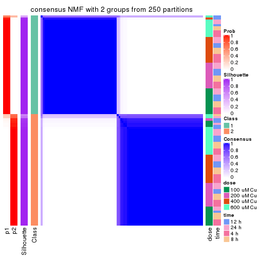</p>

</div>
<div id='tab-MAD-NMF-consensus-heatmap-2'>
<pre><code class="r">consensus_heatmap(res, k = 3)
</code></pre>

<p></p>

</div>
<div id='tab-MAD-NMF-consensus-heatmap-3'>
<pre><code class="r">consensus_heatmap(res, k = 4)
</code></pre>

<p></p>

</div>
<div id='tab-MAD-NMF-consensus-heatmap-4'>
<pre><code class="r">consensus_heatmap(res, k = 5)
</code></pre>

<p>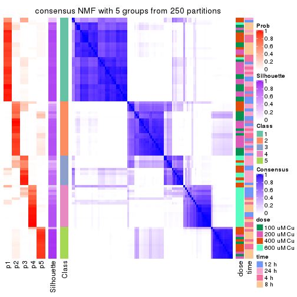</p>

</div>
<div id='tab-MAD-NMF-consensus-heatmap-5'>
<pre><code class="r">consensus_heatmap(res, k = 6)
</code></pre>

<p></p>

</div>
</div>

Heatmaps for the membership of samples in all partitions to see how consistent they are:


<script>
$( function() {
	$( '#tabs-MAD-NMF-membership-heatmap' ).tabs();
} );
</script>
<div id='tabs-MAD-NMF-membership-heatmap'>
<ul>
<li><a href='#tab-MAD-NMF-membership-heatmap-1'>k = 2</a></li>
<li><a href='#tab-MAD-NMF-membership-heatmap-2'>k = 3</a></li>
<li><a href='#tab-MAD-NMF-membership-heatmap-3'>k = 4</a></li>
<li><a href='#tab-MAD-NMF-membership-heatmap-4'>k = 5</a></li>
<li><a href='#tab-MAD-NMF-membership-heatmap-5'>k = 6</a></li>
</ul>
<div id='tab-MAD-NMF-membership-heatmap-1'>
<pre><code class="r">membership_heatmap(res, k = 2)
</code></pre>

<p></p>

</div>
<div id='tab-MAD-NMF-membership-heatmap-2'>
<pre><code class="r">membership_heatmap(res, k = 3)
</code></pre>

<p></p>

</div>
<div id='tab-MAD-NMF-membership-heatmap-3'>
<pre><code class="r">membership_heatmap(res, k = 4)
</code></pre>

<p></p>

</div>
<div id='tab-MAD-NMF-membership-heatmap-4'>
<pre><code class="r">membership_heatmap(res, k = 5)
</code></pre>

<p></p>

</div>
<div id='tab-MAD-NMF-membership-heatmap-5'>
<pre><code class="r">membership_heatmap(res, k = 6)
</code></pre>

<p>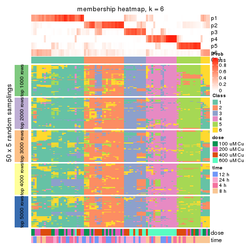</p>

</div>
</div>

As soon as we have had the classes for columns, we can look for signatures
which are significantly different between classes which can be candidate marks
for certain classes. Following are the heatmaps for signatures.


Signature heatmaps where rows are scaled:


<script>
$( function() {
	$( '#tabs-MAD-NMF-get-signatures' ).tabs();
} );
</script>
<div id='tabs-MAD-NMF-get-signatures'>
<ul>
<li><a href='#tab-MAD-NMF-get-signatures-1'>k = 2</a></li>
<li><a href='#tab-MAD-NMF-get-signatures-2'>k = 3</a></li>
<li><a href='#tab-MAD-NMF-get-signatures-3'>k = 4</a></li>
<li><a href='#tab-MAD-NMF-get-signatures-4'>k = 5</a></li>
<li><a href='#tab-MAD-NMF-get-signatures-5'>k = 6</a></li>
</ul>
<div id='tab-MAD-NMF-get-signatures-1'>
<pre><code class="r">get_signatures(res, k = 2)
</code></pre>

<p></p>

</div>
<div id='tab-MAD-NMF-get-signatures-2'>
<pre><code class="r">get_signatures(res, k = 3)
</code></pre>

<p></p>

</div>
<div id='tab-MAD-NMF-get-signatures-3'>
<pre><code class="r">get_signatures(res, k = 4)
</code></pre>

<p></p>

</div>
<div id='tab-MAD-NMF-get-signatures-4'>
<pre><code class="r">get_signatures(res, k = 5)
</code></pre>

<p></p>

</div>
<div id='tab-MAD-NMF-get-signatures-5'>
<pre><code class="r">get_signatures(res, k = 6)
</code></pre>

<p></p>

</div>
</div>


Signature heatmaps where rows are not scaled:


<script>
$( function() {
	$( '#tabs-MAD-NMF-get-signatures-no-scale' ).tabs();
} );
</script>
<div id='tabs-MAD-NMF-get-signatures-no-scale'>
<ul>
<li><a href='#tab-MAD-NMF-get-signatures-no-scale-1'>k = 2</a></li>
<li><a href='#tab-MAD-NMF-get-signatures-no-scale-2'>k = 3</a></li>
<li><a href='#tab-MAD-NMF-get-signatures-no-scale-3'>k = 4</a></li>
<li><a href='#tab-MAD-NMF-get-signatures-no-scale-4'>k = 5</a></li>
<li><a href='#tab-MAD-NMF-get-signatures-no-scale-5'>k = 6</a></li>
</ul>
<div id='tab-MAD-NMF-get-signatures-no-scale-1'>
<pre><code class="r">get_signatures(res, k = 2, scale_rows = FALSE)
</code></pre>

<p></p>

</div>
<div id='tab-MAD-NMF-get-signatures-no-scale-2'>
<pre><code class="r">get_signatures(res, k = 3, scale_rows = FALSE)
</code></pre>

<p></p>

</div>
<div id='tab-MAD-NMF-get-signatures-no-scale-3'>
<pre><code class="r">get_signatures(res, k = 4, scale_rows = FALSE)
</code></pre>

<p></p>

</div>
<div id='tab-MAD-NMF-get-signatures-no-scale-4'>
<pre><code class="r">get_signatures(res, k = 5, scale_rows = FALSE)
</code></pre>

<p></p>

</div>
<div id='tab-MAD-NMF-get-signatures-no-scale-5'>
<pre><code class="r">get_signatures(res, k = 6, scale_rows = FALSE)
</code></pre>

<p></p>

</div>
</div>


Compare the overlap of signatures from different k:

```r
compare_signatures(res)
```


`get_signature()` returns a data frame invisibly. TO get the list of signatures, the function
call should be assigned to a variable explicitly. In following code, if `plot` argument is set
to `FALSE`, no heatmap is plotted while only the differential analysis is performed.

```r
# code only for demonstration
tb = get_signature(res, k = ..., plot = FALSE)
```

An example of the output of `tb` is:

```
#>   which_row         fdr    mean_1    mean_2 scaled_mean_1 scaled_mean_2 km
#> 1        38 0.042760348  8.373488  9.131774    -0.5533452     0.5164555  1
#> 2        40 0.018707592  7.106213  8.469186    -0.6173731     0.5762149  1
#> 3        55 0.019134737 10.221463 11.207825    -0.6159697     0.5749050  1
#> 4        59 0.006059896  5.921854  7.869574    -0.6899429     0.6439467  1
#> 5        60 0.018055526  8.928898 10.211722    -0.6204761     0.5791110  1
#> 6        98 0.009384629 15.714769 14.887706     0.6635654    -0.6193277  2
...
```

The columns in `tb` are:

1. `which_row`: row indices corresponding to the input matrix.
2. `fdr`: FDR for the differential test. 
3. `mean_x`: The mean value in group x.
4. `scaled_mean_x`: The mean value in group x after rows are scaled.
5. `km`: Row groups if k-means clustering is applied to rows.


UMAP plot which shows how samples are separated.


<script>
$( function() {
	$( '#tabs-MAD-NMF-dimension-reduction' ).tabs();
} );
</script>
<div id='tabs-MAD-NMF-dimension-reduction'>
<ul>
<li><a href='#tab-MAD-NMF-dimension-reduction-1'>k = 2</a></li>
<li><a href='#tab-MAD-NMF-dimension-reduction-2'>k = 3</a></li>
<li><a href='#tab-MAD-NMF-dimension-reduction-3'>k = 4</a></li>
<li><a href='#tab-MAD-NMF-dimension-reduction-4'>k = 5</a></li>
<li><a href='#tab-MAD-NMF-dimension-reduction-5'>k = 6</a></li>
</ul>
<div id='tab-MAD-NMF-dimension-reduction-1'>
<pre><code class="r">dimension_reduction(res, k = 2, method = &quot;UMAP&quot;)
</code></pre>

<p></p>

</div>
<div id='tab-MAD-NMF-dimension-reduction-2'>
<pre><code class="r">dimension_reduction(res, k = 3, method = &quot;UMAP&quot;)
</code></pre>

<p></p>

</div>
<div id='tab-MAD-NMF-dimension-reduction-3'>
<pre><code class="r">dimension_reduction(res, k = 4, method = &quot;UMAP&quot;)
</code></pre>

<p></p>

</div>
<div id='tab-MAD-NMF-dimension-reduction-4'>
<pre><code class="r">dimension_reduction(res, k = 5, method = &quot;UMAP&quot;)
</code></pre>

<p></p>

</div>
<div id='tab-MAD-NMF-dimension-reduction-5'>
<pre><code class="r">dimension_reduction(res, k = 6, method = &quot;UMAP&quot;)
</code></pre>

<p></p>

</div>
</div>


Following heatmap shows how subgroups are split when increasing `k`:

```r
collect_classes(res)
```


Test correlation between subgroups and known annotations. If the known
annotation is numeric, one-way ANOVA test is applied, and if the known
annotation is discrete, chi-squared contingency table test is applied.

```r
test_to_known_factors(res)
```

```
#>          n  dose(p)  time(p) k
#> MAD:NMF 97 6.52e-01 0.974192 2
#> MAD:NMF 96 7.14e-11 0.376726 3
#> MAD:NMF 94 1.30e-12 0.000622 4
#> MAD:NMF 88 2.00e-12 0.000016 5
#> MAD:NMF 64 2.43e-11 0.000002 6
```


If matrix rows can be associated to genes, consider to use `GO_Enrichment(res,
...)` to perform function enrichment for the signature genes.


 

---------------------------------------------------


### ATC:hclust*


The object with results only for a single top-value method and a single partition method 
can be extracted as:

```r
res = res_list["ATC", "hclust"]
# you can also extract it by
# res = res_list["ATC:hclust"]
```

A summary of `res` and all the functions that can be applied to it:

```r
res
```

```
#> A 'ConsensusPartition' object with k = 2, 3, 4, 5, 6.
#>   On a matrix with 16250 rows and 98 columns.
#>   Top rows (1000, 2000, 3000, 4000, 5000) are extracted by 'ATC' method.
#>   Subgroups are detected by 'hclust' method.
#>   Performed in total 1250 partitions by row resampling.
#>   Best k for subgroups seems to be 3.
#> 
#> Following methods can be applied to this 'ConsensusPartition' object:
#>  [1] "cola_report"             "collect_classes"         "collect_plots"          
#>  [4] "collect_stats"           "colnames"                "compare_signatures"     
#>  [7] "consensus_heatmap"       "dimension_reduction"     "functional_enrichment"  
#> [10] "get_anno_col"            "get_anno"                "get_classes"            
#> [13] "get_consensus"           "get_matrix"              "get_membership"         
#> [16] "get_param"               "get_signatures"          "get_stats"              
#> [19] "is_best_k"               "is_stable_k"             "membership_heatmap"     
#> [22] "ncol"                    "nrow"                    "plot_ecdf"              
#> [25] "rownames"                "select_partition_number" "show"                   
#> [28] "suggest_best_k"          "test_to_known_factors"
```

`collect_plots()` function collects all the plots made from `res` for all `k` (number of partitions)
into one single page to provide an easy and fast comparison between different `k`.

```r
collect_plots(res)
```


The plots are:

- The first row: a plot of the ECDF (Empirical cumulative distribution
  function) curves of the consensus matrix for each `k` and the heatmap of
  predicted classes for each `k`.
- The second row: heatmaps of the consensus matrix for each `k`.
- The third row: heatmaps of the membership matrix for each `k`.
- The fouth row: heatmaps of the signatures for each `k`.

All the plots in panels can be made by individual functions and they are
plotted later in this section.

`select_partition_number()` produces several plots showing different
statistics for choosing "optimized" `k`. There are following statistics:

- ECDF curves of the consensus matrix for each `k`;
- 1-PAC. [The PAC
  score](https://en.wikipedia.org/wiki/Consensus_clustering#Over-interpretation_potential_of_consensus_clustering)
  measures the proportion of the ambiguous subgrouping.
- Mean silhouette score.
- Concordance. The mean probability of fiting the consensus class ids in all
  partitions.
- Area increased. Denote $A_k$ as the area under the ECDF curve for current
  `k`, the area increased is defined as $A_k - A_{k-1}$.
- Rand index. The percent of pairs of samples that are both in a same cluster
  or both are not in a same cluster in the partition of k and k-1.
- Jaccard index. The ratio of pairs of samples are both in a same cluster in
  the partition of k and k-1 and the pairs of samples are both in a same
  cluster in the partition k or k-1.

The detailed explanations of these statistics can be found in [the cola
vignette](http://bioconductor.org/packages/devel/bioc/vignettes/cola/inst/doc/cola.html#toc_13).

Generally speaking, lower PAC score, higher mean silhouette score or higher
concordance corresponds to better partition. Rand index and Jaccard index
measure how similar the current partition is compared to partition with `k-1`.
If they are too similar, we won't accept `k` is better than `k-1`.

```r
select_partition_number(res)
```


The numeric values for all these statistics can be obtained by `get_stats()`.

```r
get_stats(res)
```

```
#>   k 1-PAC mean_silhouette concordance area_increased  Rand Jaccard
#> 2 2 1.000           0.999       1.000         0.5056 0.495   0.495
#> 3 3 0.946           0.933       0.968         0.2132 0.886   0.769
#> 4 4 0.854           0.882       0.939         0.1914 0.875   0.671
#> 5 5 0.857           0.840       0.920         0.0258 0.985   0.942
#> 6 6 0.892           0.806       0.895         0.0342 0.990   0.957
```

`suggest_best_k()` suggests the best $k$ based on these statistics. The rules are as follows:

- All $k$ with Jaccard index larger than 0.95 are removed because the increase of
  the partition number does not provides enough extra information. If all $k$ are removed,
  the best $k$ is assigned by `NA`.
- For $k$ with 1-PAC larger than 0.9, the maximal $k$ is taken as the "best k". Other $k$ is called "optional k".
- If it does not fit the second rule. The $k$ with the highest vote of highest
  1-PAC, mean silhouette and concordance is taken as the "best k".

```r
suggest_best_k(res)
```

```
#> [1] 3
#> attr(,"optional")
#> [1] 2
```

There is also optional best $k$ = 2 that is worth to check.

Following shows the table of the partitions (You need to click the **show/hide
code output** link to see it). The membership matrix (columns with name `p*`)
is inferred by
[`clue::cl_consensus()`](https://www.rdocumentation.org/link/cl_consensus?package=clue)
function with the `SE` method. Basically the value in the membership matrix
represents the probability to belong to a certain group. The finall class
label for an item is determined with the group with highest probability it
belongs to.

In `get_classes()` function, the entropy is calculated from the membership
matrix and the silhouette score is calculated from the consensus matrix.


<script>
$( function() {
	$( '#tabs-ATC-hclust-get-classes' ).tabs();
} );
</script>
<div id='tabs-ATC-hclust-get-classes'>
<ul>
<li><a href='#tab-ATC-hclust-get-classes-1'>k = 2</a></li>
<li><a href='#tab-ATC-hclust-get-classes-2'>k = 3</a></li>
<li><a href='#tab-ATC-hclust-get-classes-3'>k = 4</a></li>
<li><a href='#tab-ATC-hclust-get-classes-4'>k = 5</a></li>
<li><a href='#tab-ATC-hclust-get-classes-5'>k = 6</a></li>
</ul>

<div id='tab-ATC-hclust-get-classes-1'>
<p><a id='tab-ATC-hclust-get-classes-1-a' style='color:#0366d6' href='#'>show/hide code output</a></p>
<pre><code class="r">cbind(get_classes(res, k = 2), get_membership(res, k = 2))
</code></pre>

<pre><code>#&gt;           class entropy silhouette    p1    p2
#&gt; GSM241451     2  0.0000      1.000 0.000 1.000
#&gt; GSM241452     1  0.0000      0.999 1.000 0.000
#&gt; GSM241453     2  0.0000      1.000 0.000 1.000
#&gt; GSM241454     1  0.0000      0.999 1.000 0.000
#&gt; GSM241455     2  0.0000      1.000 0.000 1.000
#&gt; GSM241456     1  0.0000      0.999 1.000 0.000
#&gt; GSM241457     2  0.0000      1.000 0.000 1.000
#&gt; GSM241458     1  0.0000      0.999 1.000 0.000
#&gt; GSM241459     2  0.0000      1.000 0.000 1.000
#&gt; GSM241460     1  0.0000      0.999 1.000 0.000
#&gt; GSM241461     2  0.0000      1.000 0.000 1.000
#&gt; GSM241462     1  0.0000      0.999 1.000 0.000
#&gt; GSM241463     2  0.0000      1.000 0.000 1.000
#&gt; GSM241464     1  0.0000      0.999 1.000 0.000
#&gt; GSM241465     2  0.0000      1.000 0.000 1.000
#&gt; GSM241466     1  0.0000      0.999 1.000 0.000
#&gt; GSM241467     1  0.0000      0.999 1.000 0.000
#&gt; GSM241468     2  0.0000      1.000 0.000 1.000
#&gt; GSM241469     1  0.0000      0.999 1.000 0.000
#&gt; GSM241470     2  0.0000      1.000 0.000 1.000
#&gt; GSM241471     2  0.0000      1.000 0.000 1.000
#&gt; GSM241472     1  0.0000      0.999 1.000 0.000
#&gt; GSM241473     2  0.0000      1.000 0.000 1.000
#&gt; GSM241474     1  0.0000      0.999 1.000 0.000
#&gt; GSM241475     2  0.0000      1.000 0.000 1.000
#&gt; GSM241476     1  0.0000      0.999 1.000 0.000
#&gt; GSM241477     2  0.0000      1.000 0.000 1.000
#&gt; GSM241478     2  0.0000      1.000 0.000 1.000
#&gt; GSM241479     1  0.0000      0.999 1.000 0.000
#&gt; GSM241480     1  0.0000      0.999 1.000 0.000
#&gt; GSM241481     2  0.0000      1.000 0.000 1.000
#&gt; GSM241482     1  0.0000      0.999 1.000 0.000
#&gt; GSM241483     2  0.0000      1.000 0.000 1.000
#&gt; GSM241484     1  0.0000      0.999 1.000 0.000
#&gt; GSM241485     1  0.0000      0.999 1.000 0.000
#&gt; GSM241486     2  0.0000      1.000 0.000 1.000
#&gt; GSM241487     2  0.0000      1.000 0.000 1.000
#&gt; GSM241488     2  0.0000      1.000 0.000 1.000
#&gt; GSM241489     1  0.0000      0.999 1.000 0.000
#&gt; GSM241490     1  0.0000      0.999 1.000 0.000
#&gt; GSM241491     2  0.0000      1.000 0.000 1.000
#&gt; GSM241492     1  0.0000      0.999 1.000 0.000
#&gt; GSM241493     2  0.0000      1.000 0.000 1.000
#&gt; GSM241494     1  0.0000      0.999 1.000 0.000
#&gt; GSM241495     2  0.0000      1.000 0.000 1.000
#&gt; GSM241496     2  0.0000      1.000 0.000 1.000
#&gt; GSM241497     1  0.0000      0.999 1.000 0.000
#&gt; GSM241498     1  0.0000      0.999 1.000 0.000
#&gt; GSM241499     1  0.0000      0.999 1.000 0.000
#&gt; GSM241500     2  0.0000      1.000 0.000 1.000
#&gt; GSM241501     2  0.0000      1.000 0.000 1.000
#&gt; GSM241502     2  0.0000      1.000 0.000 1.000
#&gt; GSM241503     1  0.0000      0.999 1.000 0.000
#&gt; GSM241504     1  0.0000      0.999 1.000 0.000
#&gt; GSM241505     1  0.0000      0.999 1.000 0.000
#&gt; GSM241506     2  0.0000      1.000 0.000 1.000
#&gt; GSM241507     1  0.0000      0.999 1.000 0.000
#&gt; GSM241508     2  0.0000      1.000 0.000 1.000
#&gt; GSM241509     2  0.0000      1.000 0.000 1.000
#&gt; GSM241510     2  0.0000      1.000 0.000 1.000
#&gt; GSM241511     1  0.0000      0.999 1.000 0.000
#&gt; GSM241512     1  0.0000      0.999 1.000 0.000
#&gt; GSM241513     2  0.0000      1.000 0.000 1.000
#&gt; GSM241514     1  0.0000      0.999 1.000 0.000
#&gt; GSM241515     2  0.0000      1.000 0.000 1.000
#&gt; GSM241516     1  0.0000      0.999 1.000 0.000
#&gt; GSM241517     2  0.0000      1.000 0.000 1.000
#&gt; GSM241518     1  0.0376      0.996 0.996 0.004
#&gt; GSM241519     2  0.0000      1.000 0.000 1.000
#&gt; GSM241520     1  0.0376      0.996 0.996 0.004
#&gt; GSM241521     2  0.0000      1.000 0.000 1.000
#&gt; GSM241522     1  0.0000      0.999 1.000 0.000
#&gt; GSM241523     2  0.0000      1.000 0.000 1.000
#&gt; GSM241524     1  0.0000      0.999 1.000 0.000
#&gt; GSM241525     1  0.0000      0.999 1.000 0.000
#&gt; GSM241526     2  0.0000      1.000 0.000 1.000
#&gt; GSM241527     1  0.0000      0.999 1.000 0.000
#&gt; GSM241528     2  0.0000      1.000 0.000 1.000
#&gt; GSM241529     2  0.0000      1.000 0.000 1.000
#&gt; GSM241530     1  0.0000      0.999 1.000 0.000
#&gt; GSM241531     1  0.0000      0.999 1.000 0.000
#&gt; GSM241532     2  0.0000      1.000 0.000 1.000
#&gt; GSM241533     2  0.0000      1.000 0.000 1.000
#&gt; GSM241534     2  0.0000      1.000 0.000 1.000
#&gt; GSM241535     1  0.0000      0.999 1.000 0.000
#&gt; GSM241536     1  0.0000      0.999 1.000 0.000
#&gt; GSM241537     2  0.0000      1.000 0.000 1.000
#&gt; GSM241538     1  0.0672      0.993 0.992 0.008
#&gt; GSM241539     2  0.0000      1.000 0.000 1.000
#&gt; GSM241540     1  0.0000      0.999 1.000 0.000
#&gt; GSM241541     2  0.0000      1.000 0.000 1.000
#&gt; GSM241542     1  0.0672      0.993 0.992 0.008
#&gt; GSM241543     2  0.0000      1.000 0.000 1.000
#&gt; GSM241544     1  0.0000      0.999 1.000 0.000
#&gt; GSM241545     2  0.0000      1.000 0.000 1.000
#&gt; GSM241546     1  0.0000      0.999 1.000 0.000
#&gt; GSM241547     2  0.0000      1.000 0.000 1.000
#&gt; GSM241548     1  0.0672      0.993 0.992 0.008
</code></pre>

<script>
$('#tab-ATC-hclust-get-classes-1-a').parent().next().next().hide();
$('#tab-ATC-hclust-get-classes-1-a').click(function(){
  $('#tab-ATC-hclust-get-classes-1-a').parent().next().next().toggle();
  return(false);
});
</script>
</div>

<div id='tab-ATC-hclust-get-classes-2'>
<p><a id='tab-ATC-hclust-get-classes-2-a' style='color:#0366d6' href='#'>show/hide code output</a></p>
<pre><code class="r">cbind(get_classes(res, k = 3), get_membership(res, k = 3))
</code></pre>

<pre><code>#&gt;           class entropy silhouette    p1    p2    p3
#&gt; GSM241451     2  0.0000      0.998 0.000 1.000 0.000
#&gt; GSM241452     1  0.0000      0.970 1.000 0.000 0.000
#&gt; GSM241453     2  0.0000      0.998 0.000 1.000 0.000
#&gt; GSM241454     1  0.0000      0.970 1.000 0.000 0.000
#&gt; GSM241455     2  0.0000      0.998 0.000 1.000 0.000
#&gt; GSM241456     1  0.0000      0.970 1.000 0.000 0.000
#&gt; GSM241457     2  0.0000      0.998 0.000 1.000 0.000
#&gt; GSM241458     1  0.0000      0.970 1.000 0.000 0.000
#&gt; GSM241459     2  0.0000      0.998 0.000 1.000 0.000
#&gt; GSM241460     1  0.0000      0.970 1.000 0.000 0.000
#&gt; GSM241461     2  0.0000      0.998 0.000 1.000 0.000
#&gt; GSM241462     1  0.0000      0.970 1.000 0.000 0.000
#&gt; GSM241463     2  0.0000      0.998 0.000 1.000 0.000
#&gt; GSM241464     1  0.0592      0.958 0.988 0.000 0.012
#&gt; GSM241465     2  0.0000      0.998 0.000 1.000 0.000
#&gt; GSM241466     1  0.0000      0.970 1.000 0.000 0.000
#&gt; GSM241467     1  0.0000      0.970 1.000 0.000 0.000
#&gt; GSM241468     2  0.0000      0.998 0.000 1.000 0.000
#&gt; GSM241469     1  0.0000      0.970 1.000 0.000 0.000
#&gt; GSM241470     2  0.0000      0.998 0.000 1.000 0.000
#&gt; GSM241471     2  0.0000      0.998 0.000 1.000 0.000
#&gt; GSM241472     1  0.0000      0.970 1.000 0.000 0.000
#&gt; GSM241473     2  0.0000      0.998 0.000 1.000 0.000
#&gt; GSM241474     1  0.0000      0.970 1.000 0.000 0.000
#&gt; GSM241475     2  0.0000      0.998 0.000 1.000 0.000
#&gt; GSM241476     1  0.0000      0.970 1.000 0.000 0.000
#&gt; GSM241477     2  0.0000      0.998 0.000 1.000 0.000
#&gt; GSM241478     2  0.0000      0.998 0.000 1.000 0.000
#&gt; GSM241479     1  0.0000      0.970 1.000 0.000 0.000
#&gt; GSM241480     1  0.0000      0.970 1.000 0.000 0.000
#&gt; GSM241481     2  0.0000      0.998 0.000 1.000 0.000
#&gt; GSM241482     1  0.0000      0.970 1.000 0.000 0.000
#&gt; GSM241483     2  0.0000      0.998 0.000 1.000 0.000
#&gt; GSM241484     1  0.0000      0.970 1.000 0.000 0.000
#&gt; GSM241485     1  0.0000      0.970 1.000 0.000 0.000
#&gt; GSM241486     2  0.0000      0.998 0.000 1.000 0.000
#&gt; GSM241487     2  0.0000      0.998 0.000 1.000 0.000
#&gt; GSM241488     2  0.0000      0.998 0.000 1.000 0.000
#&gt; GSM241489     1  0.0000      0.970 1.000 0.000 0.000
#&gt; GSM241490     1  0.0000      0.970 1.000 0.000 0.000
#&gt; GSM241491     2  0.0000      0.998 0.000 1.000 0.000
#&gt; GSM241492     1  0.0592      0.958 0.988 0.000 0.012
#&gt; GSM241493     2  0.0000      0.998 0.000 1.000 0.000
#&gt; GSM241494     1  0.0000      0.970 1.000 0.000 0.000
#&gt; GSM241495     2  0.0000      0.998 0.000 1.000 0.000
#&gt; GSM241496     2  0.0000      0.998 0.000 1.000 0.000
#&gt; GSM241497     1  0.0000      0.970 1.000 0.000 0.000
#&gt; GSM241498     1  0.0000      0.970 1.000 0.000 0.000
#&gt; GSM241499     1  0.0000      0.970 1.000 0.000 0.000
#&gt; GSM241500     2  0.0000      0.998 0.000 1.000 0.000
#&gt; GSM241501     2  0.0000      0.998 0.000 1.000 0.000
#&gt; GSM241502     2  0.0000      0.998 0.000 1.000 0.000
#&gt; GSM241503     1  0.0000      0.970 1.000 0.000 0.000
#&gt; GSM241504     1  0.0000      0.970 1.000 0.000 0.000
#&gt; GSM241505     1  0.0000      0.970 1.000 0.000 0.000
#&gt; GSM241506     2  0.0000      0.998 0.000 1.000 0.000
#&gt; GSM241507     1  0.0000      0.970 1.000 0.000 0.000
#&gt; GSM241508     2  0.0000      0.998 0.000 1.000 0.000
#&gt; GSM241509     2  0.0000      0.998 0.000 1.000 0.000
#&gt; GSM241510     2  0.0000      0.998 0.000 1.000 0.000
#&gt; GSM241511     3  0.0592      0.851 0.012 0.000 0.988
#&gt; GSM241512     3  0.0592      0.851 0.012 0.000 0.988
#&gt; GSM241513     2  0.0424      0.995 0.000 0.992 0.008
#&gt; GSM241514     3  0.4796      0.782 0.220 0.000 0.780
#&gt; GSM241515     2  0.0424      0.995 0.000 0.992 0.008
#&gt; GSM241516     3  0.4796      0.782 0.220 0.000 0.780
#&gt; GSM241517     2  0.0237      0.997 0.000 0.996 0.004
#&gt; GSM241518     3  0.6192      0.334 0.420 0.000 0.580
#&gt; GSM241519     2  0.0237      0.997 0.000 0.996 0.004
#&gt; GSM241520     3  0.6192      0.334 0.420 0.000 0.580
#&gt; GSM241521     2  0.0424      0.995 0.000 0.992 0.008
#&gt; GSM241522     1  0.0000      0.970 1.000 0.000 0.000
#&gt; GSM241523     2  0.0424      0.995 0.000 0.992 0.008
#&gt; GSM241524     1  0.6026      0.215 0.624 0.000 0.376
#&gt; GSM241525     1  0.5948      0.289 0.640 0.000 0.360
#&gt; GSM241526     2  0.0237      0.997 0.000 0.996 0.004
#&gt; GSM241527     3  0.4842      0.779 0.224 0.000 0.776
#&gt; GSM241528     2  0.0237      0.997 0.000 0.996 0.004
#&gt; GSM241529     2  0.0237      0.997 0.000 0.996 0.004
#&gt; GSM241530     3  0.4842      0.779 0.224 0.000 0.776
#&gt; GSM241531     3  0.0592      0.851 0.012 0.000 0.988
#&gt; GSM241532     2  0.0237      0.997 0.000 0.996 0.004
#&gt; GSM241533     2  0.0237      0.997 0.000 0.996 0.004
#&gt; GSM241534     2  0.0237      0.997 0.000 0.996 0.004
#&gt; GSM241535     3  0.0592      0.851 0.012 0.000 0.988
#&gt; GSM241536     3  0.0592      0.851 0.012 0.000 0.988
#&gt; GSM241537     2  0.0237      0.997 0.000 0.996 0.004
#&gt; GSM241538     3  0.0000      0.846 0.000 0.000 1.000
#&gt; GSM241539     2  0.0237      0.997 0.000 0.996 0.004
#&gt; GSM241540     3  0.0424      0.850 0.008 0.000 0.992
#&gt; GSM241541     2  0.0237      0.997 0.000 0.996 0.004
#&gt; GSM241542     3  0.0000      0.846 0.000 0.000 1.000
#&gt; GSM241543     2  0.0424      0.995 0.000 0.992 0.008
#&gt; GSM241544     3  0.4796      0.782 0.220 0.000 0.780
#&gt; GSM241545     2  0.0424      0.995 0.000 0.992 0.008
#&gt; GSM241546     3  0.4796      0.782 0.220 0.000 0.780
#&gt; GSM241547     2  0.0237      0.997 0.000 0.996 0.004
#&gt; GSM241548     3  0.0000      0.846 0.000 0.000 1.000
</code></pre>

<script>
$('#tab-ATC-hclust-get-classes-2-a').parent().next().next().hide();
$('#tab-ATC-hclust-get-classes-2-a').click(function(){
  $('#tab-ATC-hclust-get-classes-2-a').parent().next().next().toggle();
  return(false);
});
</script>
</div>

<div id='tab-ATC-hclust-get-classes-3'>
<p><a id='tab-ATC-hclust-get-classes-3-a' style='color:#0366d6' href='#'>show/hide code output</a></p>
<pre><code class="r">cbind(get_classes(res, k = 4), get_membership(res, k = 4))
</code></pre>

<pre><code>#&gt;           class entropy silhouette    p1    p2    p3    p4
#&gt; GSM241451     2  0.0000      0.986 0.000 1.000 0.000 0.000
#&gt; GSM241452     1  0.0000      0.970 1.000 0.000 0.000 0.000
#&gt; GSM241453     2  0.0000      0.986 0.000 1.000 0.000 0.000
#&gt; GSM241454     1  0.0000      0.970 1.000 0.000 0.000 0.000
#&gt; GSM241455     2  0.0000      0.986 0.000 1.000 0.000 0.000
#&gt; GSM241456     1  0.0000      0.970 1.000 0.000 0.000 0.000
#&gt; GSM241457     2  0.0000      0.986 0.000 1.000 0.000 0.000
#&gt; GSM241458     1  0.0000      0.970 1.000 0.000 0.000 0.000
#&gt; GSM241459     2  0.0000      0.986 0.000 1.000 0.000 0.000
#&gt; GSM241460     1  0.0000      0.970 1.000 0.000 0.000 0.000
#&gt; GSM241461     2  0.0188      0.982 0.000 0.996 0.000 0.004
#&gt; GSM241462     1  0.0000      0.970 1.000 0.000 0.000 0.000
#&gt; GSM241463     2  0.0000      0.986 0.000 1.000 0.000 0.000
#&gt; GSM241464     1  0.0592      0.954 0.984 0.000 0.016 0.000
#&gt; GSM241465     2  0.0000      0.986 0.000 1.000 0.000 0.000
#&gt; GSM241466     1  0.0000      0.970 1.000 0.000 0.000 0.000
#&gt; GSM241467     1  0.0000      0.970 1.000 0.000 0.000 0.000
#&gt; GSM241468     2  0.0000      0.986 0.000 1.000 0.000 0.000
#&gt; GSM241469     1  0.0000      0.970 1.000 0.000 0.000 0.000
#&gt; GSM241470     2  0.0000      0.986 0.000 1.000 0.000 0.000
#&gt; GSM241471     2  0.0000      0.986 0.000 1.000 0.000 0.000
#&gt; GSM241472     1  0.0000      0.970 1.000 0.000 0.000 0.000
#&gt; GSM241473     2  0.0000      0.986 0.000 1.000 0.000 0.000
#&gt; GSM241474     1  0.0000      0.970 1.000 0.000 0.000 0.000
#&gt; GSM241475     2  0.0000      0.986 0.000 1.000 0.000 0.000
#&gt; GSM241476     1  0.0000      0.970 1.000 0.000 0.000 0.000
#&gt; GSM241477     2  0.0000      0.986 0.000 1.000 0.000 0.000
#&gt; GSM241478     2  0.0000      0.986 0.000 1.000 0.000 0.000
#&gt; GSM241479     1  0.0000      0.970 1.000 0.000 0.000 0.000
#&gt; GSM241480     1  0.0000      0.970 1.000 0.000 0.000 0.000
#&gt; GSM241481     2  0.0000      0.986 0.000 1.000 0.000 0.000
#&gt; GSM241482     1  0.0000      0.970 1.000 0.000 0.000 0.000
#&gt; GSM241483     2  0.0000      0.986 0.000 1.000 0.000 0.000
#&gt; GSM241484     1  0.0000      0.970 1.000 0.000 0.000 0.000
#&gt; GSM241485     1  0.0000      0.970 1.000 0.000 0.000 0.000
#&gt; GSM241486     2  0.0188      0.982 0.000 0.996 0.000 0.004
#&gt; GSM241487     2  0.0000      0.986 0.000 1.000 0.000 0.000
#&gt; GSM241488     2  0.0000      0.986 0.000 1.000 0.000 0.000
#&gt; GSM241489     1  0.0000      0.970 1.000 0.000 0.000 0.000
#&gt; GSM241490     1  0.0000      0.970 1.000 0.000 0.000 0.000
#&gt; GSM241491     2  0.0000      0.986 0.000 1.000 0.000 0.000
#&gt; GSM241492     1  0.0592      0.954 0.984 0.000 0.016 0.000
#&gt; GSM241493     2  0.0000      0.986 0.000 1.000 0.000 0.000
#&gt; GSM241494     1  0.0000      0.970 1.000 0.000 0.000 0.000
#&gt; GSM241495     2  0.0000      0.986 0.000 1.000 0.000 0.000
#&gt; GSM241496     2  0.0000      0.986 0.000 1.000 0.000 0.000
#&gt; GSM241497     1  0.0000      0.970 1.000 0.000 0.000 0.000
#&gt; GSM241498     1  0.0000      0.970 1.000 0.000 0.000 0.000
#&gt; GSM241499     1  0.0000      0.970 1.000 0.000 0.000 0.000
#&gt; GSM241500     4  0.4989      0.309 0.000 0.472 0.000 0.528
#&gt; GSM241501     2  0.4331      0.495 0.000 0.712 0.000 0.288
#&gt; GSM241502     2  0.0000      0.986 0.000 1.000 0.000 0.000
#&gt; GSM241503     1  0.0000      0.970 1.000 0.000 0.000 0.000
#&gt; GSM241504     1  0.0000      0.970 1.000 0.000 0.000 0.000
#&gt; GSM241505     1  0.0000      0.970 1.000 0.000 0.000 0.000
#&gt; GSM241506     2  0.0000      0.986 0.000 1.000 0.000 0.000
#&gt; GSM241507     1  0.0000      0.970 1.000 0.000 0.000 0.000
#&gt; GSM241508     4  0.4925      0.429 0.000 0.428 0.000 0.572
#&gt; GSM241509     4  0.3726      0.809 0.000 0.212 0.000 0.788
#&gt; GSM241510     4  0.3726      0.809 0.000 0.212 0.000 0.788
#&gt; GSM241511     3  0.0188      0.834 0.004 0.000 0.996 0.000
#&gt; GSM241512     3  0.0188      0.834 0.004 0.000 0.996 0.000
#&gt; GSM241513     4  0.2704      0.876 0.000 0.124 0.000 0.876
#&gt; GSM241514     3  0.3764      0.781 0.216 0.000 0.784 0.000
#&gt; GSM241515     4  0.2704      0.876 0.000 0.124 0.000 0.876
#&gt; GSM241516     3  0.3764      0.781 0.216 0.000 0.784 0.000
#&gt; GSM241517     4  0.1637      0.885 0.000 0.060 0.000 0.940
#&gt; GSM241518     3  0.5070      0.338 0.416 0.000 0.580 0.004
#&gt; GSM241519     4  0.1637      0.885 0.000 0.060 0.000 0.940
#&gt; GSM241520     3  0.5070      0.338 0.416 0.000 0.580 0.004
#&gt; GSM241521     4  0.4040      0.771 0.000 0.248 0.000 0.752
#&gt; GSM241522     1  0.0000      0.970 1.000 0.000 0.000 0.000
#&gt; GSM241523     4  0.3764      0.808 0.000 0.216 0.000 0.784
#&gt; GSM241524     1  0.4790      0.210 0.620 0.000 0.380 0.000
#&gt; GSM241525     1  0.4730      0.284 0.636 0.000 0.364 0.000
#&gt; GSM241526     4  0.1716      0.886 0.000 0.064 0.000 0.936
#&gt; GSM241527     3  0.3801      0.778 0.220 0.000 0.780 0.000
#&gt; GSM241528     4  0.1716      0.886 0.000 0.064 0.000 0.936
#&gt; GSM241529     4  0.1716      0.886 0.000 0.064 0.000 0.936
#&gt; GSM241530     3  0.3801      0.778 0.220 0.000 0.780 0.000
#&gt; GSM241531     3  0.0188      0.834 0.004 0.000 0.996 0.000
#&gt; GSM241532     4  0.0188      0.859 0.000 0.004 0.000 0.996
#&gt; GSM241533     4  0.0188      0.859 0.000 0.004 0.000 0.996
#&gt; GSM241534     4  0.0188      0.859 0.000 0.004 0.000 0.996
#&gt; GSM241535     3  0.0188      0.834 0.004 0.000 0.996 0.000
#&gt; GSM241536     3  0.0188      0.834 0.004 0.000 0.996 0.000
#&gt; GSM241537     4  0.0188      0.859 0.000 0.004 0.000 0.996
#&gt; GSM241538     3  0.0336      0.830 0.000 0.000 0.992 0.008
#&gt; GSM241539     4  0.0188      0.859 0.000 0.004 0.000 0.996
#&gt; GSM241540     3  0.0000      0.831 0.000 0.000 1.000 0.000
#&gt; GSM241541     4  0.0188      0.859 0.000 0.004 0.000 0.996
#&gt; GSM241542     3  0.0336      0.830 0.000 0.000 0.992 0.008
#&gt; GSM241543     4  0.2704      0.876 0.000 0.124 0.000 0.876
#&gt; GSM241544     3  0.3764      0.781 0.216 0.000 0.784 0.000
#&gt; GSM241545     4  0.2704      0.876 0.000 0.124 0.000 0.876
#&gt; GSM241546     3  0.3764      0.781 0.216 0.000 0.784 0.000
#&gt; GSM241547     4  0.1637      0.885 0.000 0.060 0.000 0.940
#&gt; GSM241548     3  0.0336      0.830 0.000 0.000 0.992 0.008
</code></pre>

<script>
$('#tab-ATC-hclust-get-classes-3-a').parent().next().next().hide();
$('#tab-ATC-hclust-get-classes-3-a').click(function(){
  $('#tab-ATC-hclust-get-classes-3-a').parent().next().next().toggle();
  return(false);
});
</script>
</div>

<div id='tab-ATC-hclust-get-classes-4'>
<p><a id='tab-ATC-hclust-get-classes-4-a' style='color:#0366d6' href='#'>show/hide code output</a></p>
<pre><code class="r">cbind(get_classes(res, k = 5), get_membership(res, k = 5))
</code></pre>

<pre><code>#&gt;           class entropy silhouette    p1    p2    p3    p4    p5
#&gt; GSM241451     2  0.0000     0.9787 0.000 1.000 0.000 0.000 0.000
#&gt; GSM241452     1  0.0000     0.9630 1.000 0.000 0.000 0.000 0.000
#&gt; GSM241453     2  0.0000     0.9787 0.000 1.000 0.000 0.000 0.000
#&gt; GSM241454     1  0.0000     0.9630 1.000 0.000 0.000 0.000 0.000
#&gt; GSM241455     2  0.0000     0.9787 0.000 1.000 0.000 0.000 0.000
#&gt; GSM241456     1  0.0000     0.9630 1.000 0.000 0.000 0.000 0.000
#&gt; GSM241457     2  0.0000     0.9787 0.000 1.000 0.000 0.000 0.000
#&gt; GSM241458     1  0.0000     0.9630 1.000 0.000 0.000 0.000 0.000
#&gt; GSM241459     2  0.0000     0.9787 0.000 1.000 0.000 0.000 0.000
#&gt; GSM241460     1  0.0000     0.9630 1.000 0.000 0.000 0.000 0.000
#&gt; GSM241461     2  0.0162     0.9756 0.000 0.996 0.000 0.000 0.004
#&gt; GSM241462     1  0.0000     0.9630 1.000 0.000 0.000 0.000 0.000
#&gt; GSM241463     2  0.0000     0.9787 0.000 1.000 0.000 0.000 0.000
#&gt; GSM241464     1  0.1800     0.8939 0.932 0.000 0.048 0.020 0.000
#&gt; GSM241465     2  0.0000     0.9787 0.000 1.000 0.000 0.000 0.000
#&gt; GSM241466     1  0.0000     0.9630 1.000 0.000 0.000 0.000 0.000
#&gt; GSM241467     1  0.0000     0.9630 1.000 0.000 0.000 0.000 0.000
#&gt; GSM241468     2  0.0000     0.9787 0.000 1.000 0.000 0.000 0.000
#&gt; GSM241469     1  0.0000     0.9630 1.000 0.000 0.000 0.000 0.000
#&gt; GSM241470     2  0.0000     0.9787 0.000 1.000 0.000 0.000 0.000
#&gt; GSM241471     2  0.0000     0.9787 0.000 1.000 0.000 0.000 0.000
#&gt; GSM241472     1  0.0000     0.9630 1.000 0.000 0.000 0.000 0.000
#&gt; GSM241473     2  0.0000     0.9787 0.000 1.000 0.000 0.000 0.000
#&gt; GSM241474     1  0.0000     0.9630 1.000 0.000 0.000 0.000 0.000
#&gt; GSM241475     2  0.0000     0.9787 0.000 1.000 0.000 0.000 0.000
#&gt; GSM241476     1  0.0000     0.9630 1.000 0.000 0.000 0.000 0.000
#&gt; GSM241477     2  0.0000     0.9787 0.000 1.000 0.000 0.000 0.000
#&gt; GSM241478     2  0.0000     0.9787 0.000 1.000 0.000 0.000 0.000
#&gt; GSM241479     1  0.0000     0.9630 1.000 0.000 0.000 0.000 0.000
#&gt; GSM241480     1  0.0000     0.9630 1.000 0.000 0.000 0.000 0.000
#&gt; GSM241481     2  0.0000     0.9787 0.000 1.000 0.000 0.000 0.000
#&gt; GSM241482     1  0.0000     0.9630 1.000 0.000 0.000 0.000 0.000
#&gt; GSM241483     2  0.1197     0.9386 0.000 0.952 0.000 0.000 0.048
#&gt; GSM241484     1  0.0000     0.9630 1.000 0.000 0.000 0.000 0.000
#&gt; GSM241485     1  0.0000     0.9630 1.000 0.000 0.000 0.000 0.000
#&gt; GSM241486     2  0.0162     0.9756 0.000 0.996 0.000 0.000 0.004
#&gt; GSM241487     2  0.0000     0.9787 0.000 1.000 0.000 0.000 0.000
#&gt; GSM241488     2  0.0000     0.9787 0.000 1.000 0.000 0.000 0.000
#&gt; GSM241489     1  0.0000     0.9630 1.000 0.000 0.000 0.000 0.000
#&gt; GSM241490     1  0.0000     0.9630 1.000 0.000 0.000 0.000 0.000
#&gt; GSM241491     2  0.0000     0.9787 0.000 1.000 0.000 0.000 0.000
#&gt; GSM241492     1  0.1800     0.8939 0.932 0.000 0.048 0.020 0.000
#&gt; GSM241493     2  0.0000     0.9787 0.000 1.000 0.000 0.000 0.000
#&gt; GSM241494     1  0.0000     0.9630 1.000 0.000 0.000 0.000 0.000
#&gt; GSM241495     2  0.0000     0.9787 0.000 1.000 0.000 0.000 0.000
#&gt; GSM241496     2  0.0000     0.9787 0.000 1.000 0.000 0.000 0.000
#&gt; GSM241497     1  0.0000     0.9630 1.000 0.000 0.000 0.000 0.000
#&gt; GSM241498     1  0.0000     0.9630 1.000 0.000 0.000 0.000 0.000
#&gt; GSM241499     1  0.0000     0.9630 1.000 0.000 0.000 0.000 0.000
#&gt; GSM241500     5  0.4227     0.3584 0.000 0.420 0.000 0.000 0.580
#&gt; GSM241501     2  0.3983     0.4235 0.000 0.660 0.000 0.000 0.340
#&gt; GSM241502     2  0.1197     0.9386 0.000 0.952 0.000 0.000 0.048
#&gt; GSM241503     1  0.0000     0.9630 1.000 0.000 0.000 0.000 0.000
#&gt; GSM241504     1  0.0000     0.9630 1.000 0.000 0.000 0.000 0.000
#&gt; GSM241505     1  0.0000     0.9630 1.000 0.000 0.000 0.000 0.000
#&gt; GSM241506     2  0.1197     0.9386 0.000 0.952 0.000 0.000 0.048
#&gt; GSM241507     1  0.0000     0.9630 1.000 0.000 0.000 0.000 0.000
#&gt; GSM241508     5  0.4114     0.4679 0.000 0.376 0.000 0.000 0.624
#&gt; GSM241509     5  0.2732     0.7955 0.000 0.160 0.000 0.000 0.840
#&gt; GSM241510     5  0.2732     0.7955 0.000 0.160 0.000 0.000 0.840
#&gt; GSM241511     4  0.0000     0.8388 0.000 0.000 0.000 1.000 0.000
#&gt; GSM241512     4  0.0000     0.8388 0.000 0.000 0.000 1.000 0.000
#&gt; GSM241513     5  0.1768     0.8602 0.000 0.072 0.004 0.000 0.924
#&gt; GSM241514     3  0.6351     0.4865 0.204 0.000 0.516 0.280 0.000
#&gt; GSM241515     5  0.1768     0.8602 0.000 0.072 0.004 0.000 0.924
#&gt; GSM241516     3  0.6351     0.4865 0.204 0.000 0.516 0.280 0.000
#&gt; GSM241517     5  0.0162     0.8659 0.000 0.004 0.000 0.000 0.996
#&gt; GSM241518     3  0.4626     0.3717 0.364 0.000 0.616 0.020 0.000
#&gt; GSM241519     5  0.0162     0.8659 0.000 0.004 0.000 0.000 0.996
#&gt; GSM241520     3  0.4626     0.3717 0.364 0.000 0.616 0.020 0.000
#&gt; GSM241521     5  0.3491     0.7412 0.000 0.228 0.004 0.000 0.768
#&gt; GSM241522     1  0.0000     0.9630 1.000 0.000 0.000 0.000 0.000
#&gt; GSM241523     5  0.3231     0.7760 0.000 0.196 0.004 0.000 0.800
#&gt; GSM241524     1  0.6043     0.0772 0.568 0.000 0.264 0.168 0.000
#&gt; GSM241525     1  0.4444     0.2859 0.624 0.000 0.012 0.364 0.000
#&gt; GSM241526     5  0.0290     0.8671 0.000 0.008 0.000 0.000 0.992
#&gt; GSM241527     4  0.3630     0.5353 0.204 0.000 0.016 0.780 0.000
#&gt; GSM241528     5  0.0290     0.8671 0.000 0.008 0.000 0.000 0.992
#&gt; GSM241529     5  0.0290     0.8671 0.000 0.008 0.000 0.000 0.992
#&gt; GSM241530     4  0.3630     0.5353 0.204 0.000 0.016 0.780 0.000
#&gt; GSM241531     4  0.0000     0.8388 0.000 0.000 0.000 1.000 0.000
#&gt; GSM241532     5  0.1732     0.8491 0.000 0.000 0.080 0.000 0.920
#&gt; GSM241533     5  0.1732     0.8491 0.000 0.000 0.080 0.000 0.920
#&gt; GSM241534     5  0.1732     0.8491 0.000 0.000 0.080 0.000 0.920
#&gt; GSM241535     4  0.0000     0.8388 0.000 0.000 0.000 1.000 0.000
#&gt; GSM241536     4  0.0000     0.8388 0.000 0.000 0.000 1.000 0.000
#&gt; GSM241537     5  0.1732     0.8491 0.000 0.000 0.080 0.000 0.920
#&gt; GSM241538     3  0.2377     0.5041 0.000 0.000 0.872 0.128 0.000
#&gt; GSM241539     5  0.1732     0.8491 0.000 0.000 0.080 0.000 0.920
#&gt; GSM241540     3  0.4114     0.3295 0.000 0.000 0.624 0.376 0.000
#&gt; GSM241541     5  0.1732     0.8491 0.000 0.000 0.080 0.000 0.920
#&gt; GSM241542     3  0.2377     0.5041 0.000 0.000 0.872 0.128 0.000
#&gt; GSM241543     5  0.1768     0.8602 0.000 0.072 0.004 0.000 0.924
#&gt; GSM241544     3  0.6351     0.4865 0.204 0.000 0.516 0.280 0.000
#&gt; GSM241545     5  0.1768     0.8602 0.000 0.072 0.004 0.000 0.924
#&gt; GSM241546     3  0.6351     0.4865 0.204 0.000 0.516 0.280 0.000
#&gt; GSM241547     5  0.0162     0.8659 0.000 0.004 0.000 0.000 0.996
#&gt; GSM241548     3  0.2377     0.5041 0.000 0.000 0.872 0.128 0.000
</code></pre>

<script>
$('#tab-ATC-hclust-get-classes-4-a').parent().next().next().hide();
$('#tab-ATC-hclust-get-classes-4-a').click(function(){
  $('#tab-ATC-hclust-get-classes-4-a').parent().next().next().toggle();
  return(false);
});
</script>
</div>

<div id='tab-ATC-hclust-get-classes-5'>
<p><a id='tab-ATC-hclust-get-classes-5-a' style='color:#0366d6' href='#'>show/hide code output</a></p>
<pre><code class="r">cbind(get_classes(res, k = 6), get_membership(res, k = 6))
</code></pre>

<pre><code>#&gt;           class entropy silhouette    p1    p2    p3    p4    p5    p6
#&gt; GSM241451     2  0.0000     0.9766 0.000 1.000 0.000 0.000 0.000 0.000
#&gt; GSM241452     1  0.0000     0.9391 1.000 0.000 0.000 0.000 0.000 0.000
#&gt; GSM241453     2  0.0000     0.9766 0.000 1.000 0.000 0.000 0.000 0.000
#&gt; GSM241454     1  0.0000     0.9391 1.000 0.000 0.000 0.000 0.000 0.000
#&gt; GSM241455     2  0.0000     0.9766 0.000 1.000 0.000 0.000 0.000 0.000
#&gt; GSM241456     1  0.0000     0.9391 1.000 0.000 0.000 0.000 0.000 0.000
#&gt; GSM241457     2  0.0146     0.9748 0.000 0.996 0.000 0.000 0.004 0.000
#&gt; GSM241458     1  0.0000     0.9391 1.000 0.000 0.000 0.000 0.000 0.000
#&gt; GSM241459     2  0.0146     0.9748 0.000 0.996 0.000 0.000 0.004 0.000
#&gt; GSM241460     1  0.0000     0.9391 1.000 0.000 0.000 0.000 0.000 0.000
#&gt; GSM241461     2  0.0260     0.9724 0.000 0.992 0.000 0.000 0.008 0.000
#&gt; GSM241462     1  0.0000     0.9391 1.000 0.000 0.000 0.000 0.000 0.000
#&gt; GSM241463     2  0.0000     0.9766 0.000 1.000 0.000 0.000 0.000 0.000
#&gt; GSM241464     1  0.5830    -0.1495 0.488 0.000 0.000 0.228 0.284 0.000
#&gt; GSM241465     2  0.0000     0.9766 0.000 1.000 0.000 0.000 0.000 0.000
#&gt; GSM241466     1  0.0000     0.9391 1.000 0.000 0.000 0.000 0.000 0.000
#&gt; GSM241467     1  0.0000     0.9391 1.000 0.000 0.000 0.000 0.000 0.000
#&gt; GSM241468     2  0.0000     0.9766 0.000 1.000 0.000 0.000 0.000 0.000
#&gt; GSM241469     1  0.0000     0.9391 1.000 0.000 0.000 0.000 0.000 0.000
#&gt; GSM241470     2  0.0000     0.9766 0.000 1.000 0.000 0.000 0.000 0.000
#&gt; GSM241471     2  0.0000     0.9766 0.000 1.000 0.000 0.000 0.000 0.000
#&gt; GSM241472     1  0.0000     0.9391 1.000 0.000 0.000 0.000 0.000 0.000
#&gt; GSM241473     2  0.0000     0.9766 0.000 1.000 0.000 0.000 0.000 0.000
#&gt; GSM241474     1  0.0000     0.9391 1.000 0.000 0.000 0.000 0.000 0.000
#&gt; GSM241475     2  0.0000     0.9766 0.000 1.000 0.000 0.000 0.000 0.000
#&gt; GSM241476     1  0.0000     0.9391 1.000 0.000 0.000 0.000 0.000 0.000
#&gt; GSM241477     2  0.0000     0.9766 0.000 1.000 0.000 0.000 0.000 0.000
#&gt; GSM241478     2  0.0000     0.9766 0.000 1.000 0.000 0.000 0.000 0.000
#&gt; GSM241479     1  0.0000     0.9391 1.000 0.000 0.000 0.000 0.000 0.000
#&gt; GSM241480     1  0.0000     0.9391 1.000 0.000 0.000 0.000 0.000 0.000
#&gt; GSM241481     2  0.0146     0.9748 0.000 0.996 0.000 0.000 0.004 0.000
#&gt; GSM241482     1  0.0000     0.9391 1.000 0.000 0.000 0.000 0.000 0.000
#&gt; GSM241483     2  0.1285     0.9299 0.000 0.944 0.052 0.000 0.004 0.000
#&gt; GSM241484     1  0.0000     0.9391 1.000 0.000 0.000 0.000 0.000 0.000
#&gt; GSM241485     1  0.0000     0.9391 1.000 0.000 0.000 0.000 0.000 0.000
#&gt; GSM241486     2  0.0260     0.9724 0.000 0.992 0.000 0.000 0.008 0.000
#&gt; GSM241487     2  0.0000     0.9766 0.000 1.000 0.000 0.000 0.000 0.000
#&gt; GSM241488     2  0.0000     0.9766 0.000 1.000 0.000 0.000 0.000 0.000
#&gt; GSM241489     1  0.0000     0.9391 1.000 0.000 0.000 0.000 0.000 0.000
#&gt; GSM241490     1  0.0000     0.9391 1.000 0.000 0.000 0.000 0.000 0.000
#&gt; GSM241491     2  0.0000     0.9766 0.000 1.000 0.000 0.000 0.000 0.000
#&gt; GSM241492     1  0.5830    -0.1495 0.488 0.000 0.000 0.228 0.284 0.000
#&gt; GSM241493     2  0.0000     0.9766 0.000 1.000 0.000 0.000 0.000 0.000
#&gt; GSM241494     1  0.0000     0.9391 1.000 0.000 0.000 0.000 0.000 0.000
#&gt; GSM241495     2  0.0000     0.9766 0.000 1.000 0.000 0.000 0.000 0.000
#&gt; GSM241496     2  0.0000     0.9766 0.000 1.000 0.000 0.000 0.000 0.000
#&gt; GSM241497     1  0.0000     0.9391 1.000 0.000 0.000 0.000 0.000 0.000
#&gt; GSM241498     1  0.0000     0.9391 1.000 0.000 0.000 0.000 0.000 0.000
#&gt; GSM241499     1  0.0000     0.9391 1.000 0.000 0.000 0.000 0.000 0.000
#&gt; GSM241500     3  0.4018     0.3380 0.000 0.412 0.580 0.000 0.008 0.000
#&gt; GSM241501     2  0.3819     0.4245 0.000 0.652 0.340 0.000 0.008 0.000
#&gt; GSM241502     2  0.1285     0.9299 0.000 0.944 0.052 0.000 0.004 0.000
#&gt; GSM241503     1  0.0000     0.9391 1.000 0.000 0.000 0.000 0.000 0.000
#&gt; GSM241504     1  0.0000     0.9391 1.000 0.000 0.000 0.000 0.000 0.000
#&gt; GSM241505     1  0.0000     0.9391 1.000 0.000 0.000 0.000 0.000 0.000
#&gt; GSM241506     2  0.1141     0.9317 0.000 0.948 0.052 0.000 0.000 0.000
#&gt; GSM241507     1  0.0000     0.9391 1.000 0.000 0.000 0.000 0.000 0.000
#&gt; GSM241508     3  0.3911     0.4488 0.000 0.368 0.624 0.000 0.008 0.000
#&gt; GSM241509     3  0.2631     0.7499 0.000 0.152 0.840 0.000 0.008 0.000
#&gt; GSM241510     3  0.2631     0.7499 0.000 0.152 0.840 0.000 0.008 0.000
#&gt; GSM241511     6  0.0000     0.8673 0.000 0.000 0.000 0.000 0.000 1.000
#&gt; GSM241512     6  0.0632     0.8669 0.000 0.000 0.000 0.024 0.000 0.976
#&gt; GSM241513     3  0.1531     0.8110 0.000 0.068 0.928 0.000 0.004 0.000
#&gt; GSM241514     4  0.3962     0.5601 0.004 0.000 0.000 0.772 0.128 0.096
#&gt; GSM241515     3  0.1531     0.8110 0.000 0.068 0.928 0.000 0.004 0.000
#&gt; GSM241516     4  0.3962     0.5601 0.004 0.000 0.000 0.772 0.128 0.096
#&gt; GSM241517     3  0.0000     0.8113 0.000 0.000 1.000 0.000 0.000 0.000
#&gt; GSM241518     5  0.4343     0.6744 0.120 0.000 0.000 0.156 0.724 0.000
#&gt; GSM241519     3  0.0000     0.8113 0.000 0.000 1.000 0.000 0.000 0.000
#&gt; GSM241520     5  0.4343     0.6744 0.120 0.000 0.000 0.156 0.724 0.000
#&gt; GSM241521     3  0.3136     0.6991 0.000 0.228 0.768 0.000 0.004 0.000
#&gt; GSM241522     1  0.0547     0.9181 0.980 0.000 0.000 0.020 0.000 0.000
#&gt; GSM241523     3  0.2902     0.7334 0.000 0.196 0.800 0.000 0.004 0.000
#&gt; GSM241524     5  0.6697     0.3226 0.124 0.000 0.000 0.380 0.412 0.084
#&gt; GSM241525     1  0.5865    -0.0816 0.476 0.000 0.000 0.228 0.000 0.296
#&gt; GSM241526     3  0.0146     0.8127 0.000 0.004 0.996 0.000 0.000 0.000
#&gt; GSM241527     6  0.3508     0.6464 0.004 0.000 0.000 0.292 0.000 0.704
#&gt; GSM241528     3  0.0146     0.8127 0.000 0.004 0.996 0.000 0.000 0.000
#&gt; GSM241529     3  0.0146     0.8127 0.000 0.004 0.996 0.000 0.000 0.000
#&gt; GSM241530     6  0.3508     0.6464 0.004 0.000 0.000 0.292 0.000 0.704
#&gt; GSM241531     6  0.0000     0.8673 0.000 0.000 0.000 0.000 0.000 1.000
#&gt; GSM241532     3  0.2969     0.7396 0.000 0.000 0.776 0.000 0.224 0.000
#&gt; GSM241533     3  0.2969     0.7396 0.000 0.000 0.776 0.000 0.224 0.000
#&gt; GSM241534     3  0.2969     0.7396 0.000 0.000 0.776 0.000 0.224 0.000
#&gt; GSM241535     6  0.0632     0.8669 0.000 0.000 0.000 0.024 0.000 0.976
#&gt; GSM241536     6  0.0000     0.8673 0.000 0.000 0.000 0.000 0.000 1.000
#&gt; GSM241537     3  0.3076     0.7268 0.000 0.000 0.760 0.000 0.240 0.000
#&gt; GSM241538     4  0.3508     0.4324 0.000 0.000 0.000 0.704 0.292 0.004
#&gt; GSM241539     3  0.3076     0.7268 0.000 0.000 0.760 0.000 0.240 0.000
#&gt; GSM241540     4  0.4099     0.4174 0.000 0.000 0.000 0.708 0.048 0.244
#&gt; GSM241541     3  0.3076     0.7268 0.000 0.000 0.760 0.000 0.240 0.000
#&gt; GSM241542     4  0.3508     0.4324 0.000 0.000 0.000 0.704 0.292 0.004
#&gt; GSM241543     3  0.1531     0.8110 0.000 0.068 0.928 0.000 0.004 0.000
#&gt; GSM241544     4  0.3962     0.5601 0.004 0.000 0.000 0.772 0.128 0.096
#&gt; GSM241545     3  0.1531     0.8110 0.000 0.068 0.928 0.000 0.004 0.000
#&gt; GSM241546     4  0.3962     0.5601 0.004 0.000 0.000 0.772 0.128 0.096
#&gt; GSM241547     3  0.0000     0.8113 0.000 0.000 1.000 0.000 0.000 0.000
#&gt; GSM241548     4  0.3986     0.3840 0.000 0.000 0.000 0.532 0.464 0.004
</code></pre>

<script>
$('#tab-ATC-hclust-get-classes-5-a').parent().next().next().hide();
$('#tab-ATC-hclust-get-classes-5-a').click(function(){
  $('#tab-ATC-hclust-get-classes-5-a').parent().next().next().toggle();
  return(false);
});
</script>
</div>
</div>

Heatmaps for the consensus matrix. It visualizes the probability of two
samples to be in a same group.


<script>
$( function() {
	$( '#tabs-ATC-hclust-consensus-heatmap' ).tabs();
} );
</script>
<div id='tabs-ATC-hclust-consensus-heatmap'>
<ul>
<li><a href='#tab-ATC-hclust-consensus-heatmap-1'>k = 2</a></li>
<li><a href='#tab-ATC-hclust-consensus-heatmap-2'>k = 3</a></li>
<li><a href='#tab-ATC-hclust-consensus-heatmap-3'>k = 4</a></li>
<li><a href='#tab-ATC-hclust-consensus-heatmap-4'>k = 5</a></li>
<li><a href='#tab-ATC-hclust-consensus-heatmap-5'>k = 6</a></li>
</ul>
<div id='tab-ATC-hclust-consensus-heatmap-1'>
<pre><code class="r">consensus_heatmap(res, k = 2)
</code></pre>

<p></p>

</div>
<div id='tab-ATC-hclust-consensus-heatmap-2'>
<pre><code class="r">consensus_heatmap(res, k = 3)
</code></pre>

<p></p>

</div>
<div id='tab-ATC-hclust-consensus-heatmap-3'>
<pre><code class="r">consensus_heatmap(res, k = 4)
</code></pre>

<p></p>

</div>
<div id='tab-ATC-hclust-consensus-heatmap-4'>
<pre><code class="r">consensus_heatmap(res, k = 5)
</code></pre>

<p></p>

</div>
<div id='tab-ATC-hclust-consensus-heatmap-5'>
<pre><code class="r">consensus_heatmap(res, k = 6)
</code></pre>

<p></p>

</div>
</div>

Heatmaps for the membership of samples in all partitions to see how consistent they are:


<script>
$( function() {
	$( '#tabs-ATC-hclust-membership-heatmap' ).tabs();
} );
</script>
<div id='tabs-ATC-hclust-membership-heatmap'>
<ul>
<li><a href='#tab-ATC-hclust-membership-heatmap-1'>k = 2</a></li>
<li><a href='#tab-ATC-hclust-membership-heatmap-2'>k = 3</a></li>
<li><a href='#tab-ATC-hclust-membership-heatmap-3'>k = 4</a></li>
<li><a href='#tab-ATC-hclust-membership-heatmap-4'>k = 5</a></li>
<li><a href='#tab-ATC-hclust-membership-heatmap-5'>k = 6</a></li>
</ul>
<div id='tab-ATC-hclust-membership-heatmap-1'>
<pre><code class="r">membership_heatmap(res, k = 2)
</code></pre>

<p></p>

</div>
<div id='tab-ATC-hclust-membership-heatmap-2'>
<pre><code class="r">membership_heatmap(res, k = 3)
</code></pre>

<p></p>

</div>
<div id='tab-ATC-hclust-membership-heatmap-3'>
<pre><code class="r">membership_heatmap(res, k = 4)
</code></pre>

<p></p>

</div>
<div id='tab-ATC-hclust-membership-heatmap-4'>
<pre><code class="r">membership_heatmap(res, k = 5)
</code></pre>

<p></p>

</div>
<div id='tab-ATC-hclust-membership-heatmap-5'>
<pre><code class="r">membership_heatmap(res, k = 6)
</code></pre>

<p></p>

</div>
</div>

As soon as we have had the classes for columns, we can look for signatures
which are significantly different between classes which can be candidate marks
for certain classes. Following are the heatmaps for signatures.


Signature heatmaps where rows are scaled:


<script>
$( function() {
	$( '#tabs-ATC-hclust-get-signatures' ).tabs();
} );
</script>
<div id='tabs-ATC-hclust-get-signatures'>
<ul>
<li><a href='#tab-ATC-hclust-get-signatures-1'>k = 2</a></li>
<li><a href='#tab-ATC-hclust-get-signatures-2'>k = 3</a></li>
<li><a href='#tab-ATC-hclust-get-signatures-3'>k = 4</a></li>
<li><a href='#tab-ATC-hclust-get-signatures-4'>k = 5</a></li>
<li><a href='#tab-ATC-hclust-get-signatures-5'>k = 6</a></li>
</ul>
<div id='tab-ATC-hclust-get-signatures-1'>
<pre><code class="r">get_signatures(res, k = 2)
</code></pre>

<p></p>

</div>
<div id='tab-ATC-hclust-get-signatures-2'>
<pre><code class="r">get_signatures(res, k = 3)
</code></pre>

<p></p>

</div>
<div id='tab-ATC-hclust-get-signatures-3'>
<pre><code class="r">get_signatures(res, k = 4)
</code></pre>

<p></p>

</div>
<div id='tab-ATC-hclust-get-signatures-4'>
<pre><code class="r">get_signatures(res, k = 5)
</code></pre>

<p></p>

</div>
<div id='tab-ATC-hclust-get-signatures-5'>
<pre><code class="r">get_signatures(res, k = 6)
</code></pre>

<p></p>

</div>
</div>


Signature heatmaps where rows are not scaled:


<script>
$( function() {
	$( '#tabs-ATC-hclust-get-signatures-no-scale' ).tabs();
} );
</script>
<div id='tabs-ATC-hclust-get-signatures-no-scale'>
<ul>
<li><a href='#tab-ATC-hclust-get-signatures-no-scale-1'>k = 2</a></li>
<li><a href='#tab-ATC-hclust-get-signatures-no-scale-2'>k = 3</a></li>
<li><a href='#tab-ATC-hclust-get-signatures-no-scale-3'>k = 4</a></li>
<li><a href='#tab-ATC-hclust-get-signatures-no-scale-4'>k = 5</a></li>
<li><a href='#tab-ATC-hclust-get-signatures-no-scale-5'>k = 6</a></li>
</ul>
<div id='tab-ATC-hclust-get-signatures-no-scale-1'>
<pre><code class="r">get_signatures(res, k = 2, scale_rows = FALSE)
</code></pre>

<p></p>

</div>
<div id='tab-ATC-hclust-get-signatures-no-scale-2'>
<pre><code class="r">get_signatures(res, k = 3, scale_rows = FALSE)
</code></pre>

<p></p>

</div>
<div id='tab-ATC-hclust-get-signatures-no-scale-3'>
<pre><code class="r">get_signatures(res, k = 4, scale_rows = FALSE)
</code></pre>

<p></p>

</div>
<div id='tab-ATC-hclust-get-signatures-no-scale-4'>
<pre><code class="r">get_signatures(res, k = 5, scale_rows = FALSE)
</code></pre>

<p></p>

</div>
<div id='tab-ATC-hclust-get-signatures-no-scale-5'>
<pre><code class="r">get_signatures(res, k = 6, scale_rows = FALSE)
</code></pre>

<p></p>

</div>
</div>


Compare the overlap of signatures from different k:

```r
compare_signatures(res)
```


`get_signature()` returns a data frame invisibly. TO get the list of signatures, the function
call should be assigned to a variable explicitly. In following code, if `plot` argument is set
to `FALSE`, no heatmap is plotted while only the differential analysis is performed.

```r
# code only for demonstration
tb = get_signature(res, k = ..., plot = FALSE)
```

An example of the output of `tb` is:

```
#>   which_row         fdr    mean_1    mean_2 scaled_mean_1 scaled_mean_2 km
#> 1        38 0.042760348  8.373488  9.131774    -0.5533452     0.5164555  1
#> 2        40 0.018707592  7.106213  8.469186    -0.6173731     0.5762149  1
#> 3        55 0.019134737 10.221463 11.207825    -0.6159697     0.5749050  1
#> 4        59 0.006059896  5.921854  7.869574    -0.6899429     0.6439467  1
#> 5        60 0.018055526  8.928898 10.211722    -0.6204761     0.5791110  1
#> 6        98 0.009384629 15.714769 14.887706     0.6635654    -0.6193277  2
...
```

The columns in `tb` are:

1. `which_row`: row indices corresponding to the input matrix.
2. `fdr`: FDR for the differential test. 
3. `mean_x`: The mean value in group x.
4. `scaled_mean_x`: The mean value in group x after rows are scaled.
5. `km`: Row groups if k-means clustering is applied to rows.


UMAP plot which shows how samples are separated.


<script>
$( function() {
	$( '#tabs-ATC-hclust-dimension-reduction' ).tabs();
} );
</script>
<div id='tabs-ATC-hclust-dimension-reduction'>
<ul>
<li><a href='#tab-ATC-hclust-dimension-reduction-1'>k = 2</a></li>
<li><a href='#tab-ATC-hclust-dimension-reduction-2'>k = 3</a></li>
<li><a href='#tab-ATC-hclust-dimension-reduction-3'>k = 4</a></li>
<li><a href='#tab-ATC-hclust-dimension-reduction-4'>k = 5</a></li>
<li><a href='#tab-ATC-hclust-dimension-reduction-5'>k = 6</a></li>
</ul>
<div id='tab-ATC-hclust-dimension-reduction-1'>
<pre><code class="r">dimension_reduction(res, k = 2, method = &quot;UMAP&quot;)
</code></pre>

<p></p>

</div>
<div id='tab-ATC-hclust-dimension-reduction-2'>
<pre><code class="r">dimension_reduction(res, k = 3, method = &quot;UMAP&quot;)
</code></pre>

<p></p>

</div>
<div id='tab-ATC-hclust-dimension-reduction-3'>
<pre><code class="r">dimension_reduction(res, k = 4, method = &quot;UMAP&quot;)
</code></pre>

<p></p>

</div>
<div id='tab-ATC-hclust-dimension-reduction-4'>
<pre><code class="r">dimension_reduction(res, k = 5, method = &quot;UMAP&quot;)
</code></pre>

<p></p>

</div>
<div id='tab-ATC-hclust-dimension-reduction-5'>
<pre><code class="r">dimension_reduction(res, k = 6, method = &quot;UMAP&quot;)
</code></pre>

<p></p>

</div>
</div>


Following heatmap shows how subgroups are split when increasing `k`:

```r
collect_classes(res)
```


Test correlation between subgroups and known annotations. If the known
annotation is numeric, one-way ANOVA test is applied, and if the known
annotation is discrete, chi-squared contingency table test is applied.

```r
test_to_known_factors(res)
```

```
#>             n  dose(p) time(p) k
#> ATC:hclust 98 1.00e+00   1.000 2
#> ATC:hclust 94 4.39e-06   0.838 3
#> ATC:hclust 91 3.30e-12   0.868 4
#> ATC:hclust 86 1.47e-10   0.213 5
#> ATC:hclust 87 8.71e-10   0.201 6
```


If matrix rows can be associated to genes, consider to use `GO_Enrichment(res,
...)` to perform function enrichment for the signature genes.


 

---------------------------------------------------


### ATC:kmeans**


The object with results only for a single top-value method and a single partition method 
can be extracted as:

```r
res = res_list["ATC", "kmeans"]
# you can also extract it by
# res = res_list["ATC:kmeans"]
```

A summary of `res` and all the functions that can be applied to it:

```r
res
```

```
#> A 'ConsensusPartition' object with k = 2, 3, 4, 5, 6.
#>   On a matrix with 16250 rows and 98 columns.
#>   Top rows (1000, 2000, 3000, 4000, 5000) are extracted by 'ATC' method.
#>   Subgroups are detected by 'kmeans' method.
#>   Performed in total 1250 partitions by row resampling.
#>   Best k for subgroups seems to be 2.
#> 
#> Following methods can be applied to this 'ConsensusPartition' object:
#>  [1] "cola_report"             "collect_classes"         "collect_plots"          
#>  [4] "collect_stats"           "colnames"                "compare_signatures"     
#>  [7] "consensus_heatmap"       "dimension_reduction"     "functional_enrichment"  
#> [10] "get_anno_col"            "get_anno"                "get_classes"            
#> [13] "get_consensus"           "get_matrix"              "get_membership"         
#> [16] "get_param"               "get_signatures"          "get_stats"              
#> [19] "is_best_k"               "is_stable_k"             "membership_heatmap"     
#> [22] "ncol"                    "nrow"                    "plot_ecdf"              
#> [25] "rownames"                "select_partition_number" "show"                   
#> [28] "suggest_best_k"          "test_to_known_factors"
```

`collect_plots()` function collects all the plots made from `res` for all `k` (number of partitions)
into one single page to provide an easy and fast comparison between different `k`.

```r
collect_plots(res)
```


The plots are:

- The first row: a plot of the ECDF (Empirical cumulative distribution
  function) curves of the consensus matrix for each `k` and the heatmap of
  predicted classes for each `k`.
- The second row: heatmaps of the consensus matrix for each `k`.
- The third row: heatmaps of the membership matrix for each `k`.
- The fouth row: heatmaps of the signatures for each `k`.

All the plots in panels can be made by individual functions and they are
plotted later in this section.

`select_partition_number()` produces several plots showing different
statistics for choosing "optimized" `k`. There are following statistics:

- ECDF curves of the consensus matrix for each `k`;
- 1-PAC. [The PAC
  score](https://en.wikipedia.org/wiki/Consensus_clustering#Over-interpretation_potential_of_consensus_clustering)
  measures the proportion of the ambiguous subgrouping.
- Mean silhouette score.
- Concordance. The mean probability of fiting the consensus class ids in all
  partitions.
- Area increased. Denote $A_k$ as the area under the ECDF curve for current
  `k`, the area increased is defined as $A_k - A_{k-1}$.
- Rand index. The percent of pairs of samples that are both in a same cluster
  or both are not in a same cluster in the partition of k and k-1.
- Jaccard index. The ratio of pairs of samples are both in a same cluster in
  the partition of k and k-1 and the pairs of samples are both in a same
  cluster in the partition k or k-1.

The detailed explanations of these statistics can be found in [the cola
vignette](http://bioconductor.org/packages/devel/bioc/vignettes/cola/inst/doc/cola.html#toc_13).

Generally speaking, lower PAC score, higher mean silhouette score or higher
concordance corresponds to better partition. Rand index and Jaccard index
measure how similar the current partition is compared to partition with `k-1`.
If they are too similar, we won't accept `k` is better than `k-1`.

```r
select_partition_number(res)
```


The numeric values for all these statistics can be obtained by `get_stats()`.

```r
get_stats(res)
```

```
#>   k 1-PAC mean_silhouette concordance area_increased  Rand Jaccard
#> 2 2 1.000           0.976       0.989         0.5018 0.500   0.500
#> 3 3 0.753           0.789       0.856         0.2738 0.838   0.679
#> 4 4 0.805           0.924       0.916         0.1438 0.865   0.636
#> 5 5 0.857           0.852       0.875         0.0577 1.000   1.000
#> 6 6 0.840           0.747       0.798         0.0384 1.000   1.000
```

`suggest_best_k()` suggests the best $k$ based on these statistics. The rules are as follows:

- All $k$ with Jaccard index larger than 0.95 are removed because the increase of
  the partition number does not provides enough extra information. If all $k$ are removed,
  the best $k$ is assigned by `NA`.
- For $k$ with 1-PAC larger than 0.9, the maximal $k$ is taken as the "best k". Other $k$ is called "optional k".
- If it does not fit the second rule. The $k$ with the highest vote of highest
  1-PAC, mean silhouette and concordance is taken as the "best k".

```r
suggest_best_k(res)
```

```
#> [1] 2
```


Following shows the table of the partitions (You need to click the **show/hide
code output** link to see it). The membership matrix (columns with name `p*`)
is inferred by
[`clue::cl_consensus()`](https://www.rdocumentation.org/link/cl_consensus?package=clue)
function with the `SE` method. Basically the value in the membership matrix
represents the probability to belong to a certain group. The finall class
label for an item is determined with the group with highest probability it
belongs to.

In `get_classes()` function, the entropy is calculated from the membership
matrix and the silhouette score is calculated from the consensus matrix.


<script>
$( function() {
	$( '#tabs-ATC-kmeans-get-classes' ).tabs();
} );
</script>
<div id='tabs-ATC-kmeans-get-classes'>
<ul>
<li><a href='#tab-ATC-kmeans-get-classes-1'>k = 2</a></li>
<li><a href='#tab-ATC-kmeans-get-classes-2'>k = 3</a></li>
<li><a href='#tab-ATC-kmeans-get-classes-3'>k = 4</a></li>
<li><a href='#tab-ATC-kmeans-get-classes-4'>k = 5</a></li>
<li><a href='#tab-ATC-kmeans-get-classes-5'>k = 6</a></li>
</ul>

<div id='tab-ATC-kmeans-get-classes-1'>
<p><a id='tab-ATC-kmeans-get-classes-1-a' style='color:#0366d6' href='#'>show/hide code output</a></p>
<pre><code class="r">cbind(get_classes(res, k = 2), get_membership(res, k = 2))
</code></pre>

<pre><code>#&gt;           class entropy silhouette    p1    p2
#&gt; GSM241451     2   0.000      0.980 0.000 1.000
#&gt; GSM241452     1   0.000      1.000 1.000 0.000
#&gt; GSM241453     2   0.000      0.980 0.000 1.000
#&gt; GSM241454     1   0.000      1.000 1.000 0.000
#&gt; GSM241455     2   0.000      0.980 0.000 1.000
#&gt; GSM241456     1   0.000      1.000 1.000 0.000
#&gt; GSM241457     2   0.000      0.980 0.000 1.000
#&gt; GSM241458     1   0.000      1.000 1.000 0.000
#&gt; GSM241459     2   0.000      0.980 0.000 1.000
#&gt; GSM241460     1   0.000      1.000 1.000 0.000
#&gt; GSM241461     2   0.000      0.980 0.000 1.000
#&gt; GSM241462     1   0.000      1.000 1.000 0.000
#&gt; GSM241463     2   0.000      0.980 0.000 1.000
#&gt; GSM241464     1   0.000      1.000 1.000 0.000
#&gt; GSM241465     2   0.000      0.980 0.000 1.000
#&gt; GSM241466     1   0.000      1.000 1.000 0.000
#&gt; GSM241467     1   0.000      1.000 1.000 0.000
#&gt; GSM241468     2   0.000      0.980 0.000 1.000
#&gt; GSM241469     1   0.000      1.000 1.000 0.000
#&gt; GSM241470     2   0.000      0.980 0.000 1.000
#&gt; GSM241471     2   0.000      0.980 0.000 1.000
#&gt; GSM241472     1   0.000      1.000 1.000 0.000
#&gt; GSM241473     2   0.000      0.980 0.000 1.000
#&gt; GSM241474     1   0.000      1.000 1.000 0.000
#&gt; GSM241475     2   0.000      0.980 0.000 1.000
#&gt; GSM241476     1   0.000      1.000 1.000 0.000
#&gt; GSM241477     2   0.000      0.980 0.000 1.000
#&gt; GSM241478     2   0.000      0.980 0.000 1.000
#&gt; GSM241479     1   0.000      1.000 1.000 0.000
#&gt; GSM241480     1   0.000      1.000 1.000 0.000
#&gt; GSM241481     2   0.000      0.980 0.000 1.000
#&gt; GSM241482     1   0.000      1.000 1.000 0.000
#&gt; GSM241483     2   0.000      0.980 0.000 1.000
#&gt; GSM241484     1   0.000      1.000 1.000 0.000
#&gt; GSM241485     1   0.000      1.000 1.000 0.000
#&gt; GSM241486     2   0.000      0.980 0.000 1.000
#&gt; GSM241487     2   0.000      0.980 0.000 1.000
#&gt; GSM241488     2   0.000      0.980 0.000 1.000
#&gt; GSM241489     1   0.000      1.000 1.000 0.000
#&gt; GSM241490     1   0.000      1.000 1.000 0.000
#&gt; GSM241491     2   0.000      0.980 0.000 1.000
#&gt; GSM241492     1   0.000      1.000 1.000 0.000
#&gt; GSM241493     2   0.000      0.980 0.000 1.000
#&gt; GSM241494     1   0.000      1.000 1.000 0.000
#&gt; GSM241495     2   0.000      0.980 0.000 1.000
#&gt; GSM241496     2   0.000      0.980 0.000 1.000
#&gt; GSM241497     1   0.000      1.000 1.000 0.000
#&gt; GSM241498     1   0.000      1.000 1.000 0.000
#&gt; GSM241499     1   0.000      1.000 1.000 0.000
#&gt; GSM241500     2   0.000      0.980 0.000 1.000
#&gt; GSM241501     2   0.000      0.980 0.000 1.000
#&gt; GSM241502     2   0.000      0.980 0.000 1.000
#&gt; GSM241503     1   0.000      1.000 1.000 0.000
#&gt; GSM241504     1   0.000      1.000 1.000 0.000
#&gt; GSM241505     1   0.000      1.000 1.000 0.000
#&gt; GSM241506     2   0.000      0.980 0.000 1.000
#&gt; GSM241507     1   0.000      1.000 1.000 0.000
#&gt; GSM241508     2   0.000      0.980 0.000 1.000
#&gt; GSM241509     2   0.000      0.980 0.000 1.000
#&gt; GSM241510     2   0.000      0.980 0.000 1.000
#&gt; GSM241511     1   0.000      1.000 1.000 0.000
#&gt; GSM241512     1   0.000      1.000 1.000 0.000
#&gt; GSM241513     2   0.000      0.980 0.000 1.000
#&gt; GSM241514     1   0.000      1.000 1.000 0.000
#&gt; GSM241515     2   0.000      0.980 0.000 1.000
#&gt; GSM241516     1   0.000      1.000 1.000 0.000
#&gt; GSM241517     2   0.000      0.980 0.000 1.000
#&gt; GSM241518     2   0.943      0.465 0.360 0.640
#&gt; GSM241519     2   0.000      0.980 0.000 1.000
#&gt; GSM241520     1   0.000      1.000 1.000 0.000
#&gt; GSM241521     2   0.000      0.980 0.000 1.000
#&gt; GSM241522     1   0.000      1.000 1.000 0.000
#&gt; GSM241523     2   0.000      0.980 0.000 1.000
#&gt; GSM241524     1   0.000      1.000 1.000 0.000
#&gt; GSM241525     1   0.000      1.000 1.000 0.000
#&gt; GSM241526     2   0.000      0.980 0.000 1.000
#&gt; GSM241527     1   0.000      1.000 1.000 0.000
#&gt; GSM241528     2   0.000      0.980 0.000 1.000
#&gt; GSM241529     2   0.000      0.980 0.000 1.000
#&gt; GSM241530     1   0.000      1.000 1.000 0.000
#&gt; GSM241531     1   0.000      1.000 1.000 0.000
#&gt; GSM241532     2   0.000      0.980 0.000 1.000
#&gt; GSM241533     2   0.000      0.980 0.000 1.000
#&gt; GSM241534     2   0.000      0.980 0.000 1.000
#&gt; GSM241535     2   0.767      0.724 0.224 0.776
#&gt; GSM241536     1   0.000      1.000 1.000 0.000
#&gt; GSM241537     2   0.000      0.980 0.000 1.000
#&gt; GSM241538     2   0.767      0.724 0.224 0.776
#&gt; GSM241539     2   0.000      0.980 0.000 1.000
#&gt; GSM241540     1   0.000      1.000 1.000 0.000
#&gt; GSM241541     2   0.000      0.980 0.000 1.000
#&gt; GSM241542     2   0.000      0.980 0.000 1.000
#&gt; GSM241543     2   0.000      0.980 0.000 1.000
#&gt; GSM241544     1   0.000      1.000 1.000 0.000
#&gt; GSM241545     2   0.000      0.980 0.000 1.000
#&gt; GSM241546     1   0.000      1.000 1.000 0.000
#&gt; GSM241547     2   0.000      0.980 0.000 1.000
#&gt; GSM241548     2   0.767      0.724 0.224 0.776
</code></pre>

<script>
$('#tab-ATC-kmeans-get-classes-1-a').parent().next().next().hide();
$('#tab-ATC-kmeans-get-classes-1-a').click(function(){
  $('#tab-ATC-kmeans-get-classes-1-a').parent().next().next().toggle();
  return(false);
});
</script>
</div>

<div id='tab-ATC-kmeans-get-classes-2'>
<p><a id='tab-ATC-kmeans-get-classes-2-a' style='color:#0366d6' href='#'>show/hide code output</a></p>
<pre><code class="r">cbind(get_classes(res, k = 3), get_membership(res, k = 3))
</code></pre>

<pre><code>#&gt;           class entropy silhouette    p1    p2    p3
#&gt; GSM241451     2  0.0000      0.959 0.000 1.000 0.000
#&gt; GSM241452     1  0.0000      0.879 1.000 0.000 0.000
#&gt; GSM241453     2  0.0000      0.959 0.000 1.000 0.000
#&gt; GSM241454     1  0.0000      0.879 1.000 0.000 0.000
#&gt; GSM241455     2  0.0000      0.959 0.000 1.000 0.000
#&gt; GSM241456     1  0.0000      0.879 1.000 0.000 0.000
#&gt; GSM241457     2  0.0237      0.957 0.000 0.996 0.004
#&gt; GSM241458     1  0.1031      0.874 0.976 0.000 0.024
#&gt; GSM241459     2  0.0237      0.957 0.000 0.996 0.004
#&gt; GSM241460     1  0.0892      0.875 0.980 0.000 0.020
#&gt; GSM241461     2  0.0237      0.957 0.000 0.996 0.004
#&gt; GSM241462     1  0.1031      0.874 0.976 0.000 0.024
#&gt; GSM241463     2  0.0000      0.959 0.000 1.000 0.000
#&gt; GSM241464     1  0.0000      0.879 1.000 0.000 0.000
#&gt; GSM241465     2  0.0000      0.959 0.000 1.000 0.000
#&gt; GSM241466     1  0.0000      0.879 1.000 0.000 0.000
#&gt; GSM241467     1  0.0000      0.879 1.000 0.000 0.000
#&gt; GSM241468     2  0.0000      0.959 0.000 1.000 0.000
#&gt; GSM241469     1  0.0000      0.879 1.000 0.000 0.000
#&gt; GSM241470     2  0.0000      0.959 0.000 1.000 0.000
#&gt; GSM241471     2  0.0000      0.959 0.000 1.000 0.000
#&gt; GSM241472     1  0.0000      0.879 1.000 0.000 0.000
#&gt; GSM241473     2  0.0000      0.959 0.000 1.000 0.000
#&gt; GSM241474     1  0.0000      0.879 1.000 0.000 0.000
#&gt; GSM241475     2  0.0000      0.959 0.000 1.000 0.000
#&gt; GSM241476     1  0.0000      0.879 1.000 0.000 0.000
#&gt; GSM241477     2  0.0000      0.959 0.000 1.000 0.000
#&gt; GSM241478     2  0.0000      0.959 0.000 1.000 0.000
#&gt; GSM241479     1  0.0000      0.879 1.000 0.000 0.000
#&gt; GSM241480     1  0.0000      0.879 1.000 0.000 0.000
#&gt; GSM241481     2  0.0237      0.957 0.000 0.996 0.004
#&gt; GSM241482     1  0.1031      0.874 0.976 0.000 0.024
#&gt; GSM241483     2  0.0237      0.957 0.000 0.996 0.004
#&gt; GSM241484     1  0.1031      0.874 0.976 0.000 0.024
#&gt; GSM241485     1  0.1031      0.874 0.976 0.000 0.024
#&gt; GSM241486     2  0.0237      0.957 0.000 0.996 0.004
#&gt; GSM241487     2  0.0000      0.959 0.000 1.000 0.000
#&gt; GSM241488     2  0.0000      0.959 0.000 1.000 0.000
#&gt; GSM241489     1  0.0000      0.879 1.000 0.000 0.000
#&gt; GSM241490     1  0.0000      0.879 1.000 0.000 0.000
#&gt; GSM241491     2  0.0000      0.959 0.000 1.000 0.000
#&gt; GSM241492     1  0.0000      0.879 1.000 0.000 0.000
#&gt; GSM241493     2  0.0000      0.959 0.000 1.000 0.000
#&gt; GSM241494     1  0.0000      0.879 1.000 0.000 0.000
#&gt; GSM241495     2  0.0000      0.959 0.000 1.000 0.000
#&gt; GSM241496     2  0.0000      0.959 0.000 1.000 0.000
#&gt; GSM241497     1  0.0000      0.879 1.000 0.000 0.000
#&gt; GSM241498     1  0.0000      0.879 1.000 0.000 0.000
#&gt; GSM241499     1  0.1031      0.874 0.976 0.000 0.024
#&gt; GSM241500     2  0.0237      0.957 0.000 0.996 0.004
#&gt; GSM241501     2  0.0237      0.957 0.000 0.996 0.004
#&gt; GSM241502     2  0.0237      0.957 0.000 0.996 0.004
#&gt; GSM241503     1  0.1031      0.874 0.976 0.000 0.024
#&gt; GSM241504     1  0.1031      0.874 0.976 0.000 0.024
#&gt; GSM241505     1  0.1031      0.874 0.976 0.000 0.024
#&gt; GSM241506     2  0.0000      0.959 0.000 1.000 0.000
#&gt; GSM241507     1  0.1031      0.874 0.976 0.000 0.024
#&gt; GSM241508     2  0.4605      0.561 0.000 0.796 0.204
#&gt; GSM241509     3  0.6252      0.691 0.000 0.444 0.556
#&gt; GSM241510     3  0.6252      0.691 0.000 0.444 0.556
#&gt; GSM241511     1  0.6235      0.634 0.564 0.000 0.436
#&gt; GSM241512     1  0.6192      0.635 0.580 0.000 0.420
#&gt; GSM241513     3  0.6244      0.699 0.000 0.440 0.560
#&gt; GSM241514     1  0.6180      0.636 0.584 0.000 0.416
#&gt; GSM241515     3  0.6235      0.700 0.000 0.436 0.564
#&gt; GSM241516     1  0.6180      0.636 0.584 0.000 0.416
#&gt; GSM241517     3  0.6260      0.691 0.000 0.448 0.552
#&gt; GSM241518     3  0.6829      0.247 0.168 0.096 0.736
#&gt; GSM241519     2  0.6302     -0.550 0.000 0.520 0.480
#&gt; GSM241520     1  0.6410      0.628 0.576 0.004 0.420
#&gt; GSM241521     2  0.0000      0.959 0.000 1.000 0.000
#&gt; GSM241522     1  0.0000      0.879 1.000 0.000 0.000
#&gt; GSM241523     2  0.2625      0.828 0.000 0.916 0.084
#&gt; GSM241524     1  0.6062      0.660 0.616 0.000 0.384
#&gt; GSM241525     1  0.0237      0.879 0.996 0.000 0.004
#&gt; GSM241526     3  0.6252      0.696 0.000 0.444 0.556
#&gt; GSM241527     1  0.6204      0.631 0.576 0.000 0.424
#&gt; GSM241528     3  0.6280      0.669 0.000 0.460 0.540
#&gt; GSM241529     3  0.6260      0.691 0.000 0.448 0.552
#&gt; GSM241530     1  0.6180      0.639 0.584 0.000 0.416
#&gt; GSM241531     1  0.6244      0.630 0.560 0.000 0.440
#&gt; GSM241532     3  0.6252      0.691 0.000 0.444 0.556
#&gt; GSM241533     3  0.6244      0.696 0.000 0.440 0.560
#&gt; GSM241534     3  0.6244      0.696 0.000 0.440 0.560
#&gt; GSM241535     3  0.1163      0.537 0.000 0.028 0.972
#&gt; GSM241536     1  0.6235      0.634 0.564 0.000 0.436
#&gt; GSM241537     3  0.5760      0.663 0.000 0.328 0.672
#&gt; GSM241538     3  0.1163      0.537 0.000 0.028 0.972
#&gt; GSM241539     3  0.5760      0.663 0.000 0.328 0.672
#&gt; GSM241540     3  0.6008     -0.294 0.372 0.000 0.628
#&gt; GSM241541     3  0.6204      0.698 0.000 0.424 0.576
#&gt; GSM241542     3  0.1163      0.537 0.000 0.028 0.972
#&gt; GSM241543     3  0.6235      0.700 0.000 0.436 0.564
#&gt; GSM241544     1  0.6192      0.632 0.580 0.000 0.420
#&gt; GSM241545     3  0.6235      0.700 0.000 0.436 0.564
#&gt; GSM241546     1  0.6180      0.636 0.584 0.000 0.416
#&gt; GSM241547     3  0.6244      0.699 0.000 0.440 0.560
#&gt; GSM241548     3  0.1163      0.537 0.000 0.028 0.972
</code></pre>

<script>
$('#tab-ATC-kmeans-get-classes-2-a').parent().next().next().hide();
$('#tab-ATC-kmeans-get-classes-2-a').click(function(){
  $('#tab-ATC-kmeans-get-classes-2-a').parent().next().next().toggle();
  return(false);
});
</script>
</div>

<div id='tab-ATC-kmeans-get-classes-3'>
<p><a id='tab-ATC-kmeans-get-classes-3-a' style='color:#0366d6' href='#'>show/hide code output</a></p>
<pre><code class="r">cbind(get_classes(res, k = 4), get_membership(res, k = 4))
</code></pre>

<pre><code>#&gt;           class entropy silhouette    p1    p2    p3    p4
#&gt; GSM241451     2  0.0000      0.966 0.000 1.000 0.000 0.000
#&gt; GSM241452     1  0.0000      0.942 1.000 0.000 0.000 0.000
#&gt; GSM241453     2  0.0000      0.966 0.000 1.000 0.000 0.000
#&gt; GSM241454     1  0.0000      0.942 1.000 0.000 0.000 0.000
#&gt; GSM241455     2  0.0000      0.966 0.000 1.000 0.000 0.000
#&gt; GSM241456     1  0.0000      0.942 1.000 0.000 0.000 0.000
#&gt; GSM241457     2  0.2216      0.931 0.000 0.908 0.092 0.000
#&gt; GSM241458     1  0.3533      0.898 0.864 0.000 0.080 0.056
#&gt; GSM241459     2  0.2216      0.931 0.000 0.908 0.092 0.000
#&gt; GSM241460     1  0.2011      0.914 0.920 0.000 0.080 0.000
#&gt; GSM241461     2  0.2216      0.931 0.000 0.908 0.092 0.000
#&gt; GSM241462     1  0.3533      0.898 0.864 0.000 0.080 0.056
#&gt; GSM241463     2  0.0000      0.966 0.000 1.000 0.000 0.000
#&gt; GSM241464     1  0.0592      0.931 0.984 0.000 0.016 0.000
#&gt; GSM241465     2  0.0000      0.966 0.000 1.000 0.000 0.000
#&gt; GSM241466     1  0.0000      0.942 1.000 0.000 0.000 0.000
#&gt; GSM241467     1  0.0000      0.942 1.000 0.000 0.000 0.000
#&gt; GSM241468     2  0.0000      0.966 0.000 1.000 0.000 0.000
#&gt; GSM241469     1  0.0000      0.942 1.000 0.000 0.000 0.000
#&gt; GSM241470     2  0.0000      0.966 0.000 1.000 0.000 0.000
#&gt; GSM241471     2  0.0000      0.966 0.000 1.000 0.000 0.000
#&gt; GSM241472     1  0.0000      0.942 1.000 0.000 0.000 0.000
#&gt; GSM241473     2  0.0000      0.966 0.000 1.000 0.000 0.000
#&gt; GSM241474     1  0.0000      0.942 1.000 0.000 0.000 0.000
#&gt; GSM241475     2  0.0000      0.966 0.000 1.000 0.000 0.000
#&gt; GSM241476     1  0.0000      0.942 1.000 0.000 0.000 0.000
#&gt; GSM241477     2  0.0000      0.966 0.000 1.000 0.000 0.000
#&gt; GSM241478     2  0.0000      0.966 0.000 1.000 0.000 0.000
#&gt; GSM241479     1  0.0000      0.942 1.000 0.000 0.000 0.000
#&gt; GSM241480     1  0.0000      0.942 1.000 0.000 0.000 0.000
#&gt; GSM241481     2  0.2216      0.931 0.000 0.908 0.092 0.000
#&gt; GSM241482     1  0.3533      0.898 0.864 0.000 0.080 0.056
#&gt; GSM241483     2  0.2216      0.931 0.000 0.908 0.092 0.000
#&gt; GSM241484     1  0.3533      0.898 0.864 0.000 0.080 0.056
#&gt; GSM241485     1  0.3533      0.898 0.864 0.000 0.080 0.056
#&gt; GSM241486     2  0.2216      0.931 0.000 0.908 0.092 0.000
#&gt; GSM241487     2  0.0000      0.966 0.000 1.000 0.000 0.000
#&gt; GSM241488     2  0.0000      0.966 0.000 1.000 0.000 0.000
#&gt; GSM241489     1  0.0000      0.942 1.000 0.000 0.000 0.000
#&gt; GSM241490     1  0.0000      0.942 1.000 0.000 0.000 0.000
#&gt; GSM241491     2  0.0000      0.966 0.000 1.000 0.000 0.000
#&gt; GSM241492     1  0.0000      0.942 1.000 0.000 0.000 0.000
#&gt; GSM241493     2  0.0000      0.966 0.000 1.000 0.000 0.000
#&gt; GSM241494     1  0.0000      0.942 1.000 0.000 0.000 0.000
#&gt; GSM241495     2  0.0000      0.966 0.000 1.000 0.000 0.000
#&gt; GSM241496     2  0.0000      0.966 0.000 1.000 0.000 0.000
#&gt; GSM241497     1  0.0000      0.942 1.000 0.000 0.000 0.000
#&gt; GSM241498     1  0.0000      0.942 1.000 0.000 0.000 0.000
#&gt; GSM241499     1  0.3533      0.898 0.864 0.000 0.080 0.056
#&gt; GSM241500     2  0.3117      0.909 0.000 0.880 0.092 0.028
#&gt; GSM241501     2  0.2216      0.931 0.000 0.908 0.092 0.000
#&gt; GSM241502     2  0.2216      0.931 0.000 0.908 0.092 0.000
#&gt; GSM241503     1  0.3533      0.898 0.864 0.000 0.080 0.056
#&gt; GSM241504     1  0.3533      0.898 0.864 0.000 0.080 0.056
#&gt; GSM241505     1  0.3533      0.898 0.864 0.000 0.080 0.056
#&gt; GSM241506     2  0.0000      0.966 0.000 1.000 0.000 0.000
#&gt; GSM241507     1  0.3533      0.898 0.864 0.000 0.080 0.056
#&gt; GSM241508     4  0.5174      0.848 0.000 0.152 0.092 0.756
#&gt; GSM241509     4  0.4426      0.905 0.000 0.092 0.096 0.812
#&gt; GSM241510     4  0.2676      0.967 0.000 0.092 0.012 0.896
#&gt; GSM241511     3  0.3435      0.864 0.100 0.000 0.864 0.036
#&gt; GSM241512     3  0.3852      0.900 0.180 0.000 0.808 0.012
#&gt; GSM241513     4  0.2401      0.968 0.000 0.092 0.004 0.904
#&gt; GSM241514     3  0.3725      0.901 0.180 0.000 0.812 0.008
#&gt; GSM241515     4  0.4122      0.810 0.000 0.236 0.004 0.760
#&gt; GSM241516     3  0.3725      0.901 0.180 0.000 0.812 0.008
#&gt; GSM241517     4  0.2676      0.966 0.000 0.092 0.012 0.896
#&gt; GSM241518     3  0.5130      0.863 0.084 0.040 0.800 0.076
#&gt; GSM241519     4  0.2988      0.953 0.000 0.112 0.012 0.876
#&gt; GSM241520     3  0.4360      0.894 0.140 0.032 0.816 0.012
#&gt; GSM241521     2  0.0188      0.963 0.000 0.996 0.000 0.004
#&gt; GSM241522     1  0.0000      0.942 1.000 0.000 0.000 0.000
#&gt; GSM241523     2  0.3306      0.783 0.000 0.840 0.004 0.156
#&gt; GSM241524     3  0.3852      0.894 0.192 0.000 0.800 0.008
#&gt; GSM241525     1  0.3764      0.713 0.816 0.000 0.172 0.012
#&gt; GSM241526     4  0.2401      0.968 0.000 0.092 0.004 0.904
#&gt; GSM241527     3  0.3925      0.902 0.176 0.000 0.808 0.016
#&gt; GSM241528     4  0.2675      0.964 0.000 0.100 0.008 0.892
#&gt; GSM241529     4  0.2216      0.968 0.000 0.092 0.000 0.908
#&gt; GSM241530     3  0.3852      0.900 0.180 0.000 0.808 0.012
#&gt; GSM241531     3  0.3143      0.870 0.100 0.000 0.876 0.024
#&gt; GSM241532     4  0.2676      0.967 0.000 0.092 0.012 0.896
#&gt; GSM241533     4  0.2401      0.968 0.000 0.092 0.004 0.904
#&gt; GSM241534     4  0.2401      0.968 0.000 0.092 0.004 0.904
#&gt; GSM241535     3  0.3893      0.793 0.000 0.008 0.796 0.196
#&gt; GSM241536     3  0.4010      0.845 0.100 0.000 0.836 0.064
#&gt; GSM241537     4  0.2593      0.958 0.000 0.080 0.016 0.904
#&gt; GSM241538     3  0.3528      0.790 0.000 0.000 0.808 0.192
#&gt; GSM241539     4  0.2593      0.958 0.000 0.080 0.016 0.904
#&gt; GSM241540     3  0.4477      0.883 0.108 0.000 0.808 0.084
#&gt; GSM241541     4  0.2480      0.966 0.000 0.088 0.008 0.904
#&gt; GSM241542     3  0.3528      0.790 0.000 0.000 0.808 0.192
#&gt; GSM241543     4  0.2401      0.968 0.000 0.092 0.004 0.904
#&gt; GSM241544     3  0.3681      0.902 0.176 0.000 0.816 0.008
#&gt; GSM241545     4  0.2401      0.968 0.000 0.092 0.004 0.904
#&gt; GSM241546     3  0.3725      0.901 0.180 0.000 0.812 0.008
#&gt; GSM241547     4  0.2401      0.968 0.000 0.092 0.004 0.904
#&gt; GSM241548     3  0.3852      0.793 0.000 0.008 0.800 0.192
</code></pre>

<script>
$('#tab-ATC-kmeans-get-classes-3-a').parent().next().next().hide();
$('#tab-ATC-kmeans-get-classes-3-a').click(function(){
  $('#tab-ATC-kmeans-get-classes-3-a').parent().next().next().toggle();
  return(false);
});
</script>
</div>

<div id='tab-ATC-kmeans-get-classes-4'>
<p><a id='tab-ATC-kmeans-get-classes-4-a' style='color:#0366d6' href='#'>show/hide code output</a></p>
<pre><code class="r">cbind(get_classes(res, k = 5), get_membership(res, k = 5))
</code></pre>

<pre><code>#&gt;           class entropy silhouette    p1    p2    p3    p4 p5
#&gt; GSM241451     2  0.0000      0.896 0.000 1.000 0.000 0.000 NA
#&gt; GSM241452     1  0.0000      0.905 1.000 0.000 0.000 0.000 NA
#&gt; GSM241453     2  0.0000      0.896 0.000 1.000 0.000 0.000 NA
#&gt; GSM241454     1  0.0000      0.905 1.000 0.000 0.000 0.000 NA
#&gt; GSM241455     2  0.0000      0.896 0.000 1.000 0.000 0.000 NA
#&gt; GSM241456     1  0.0000      0.905 1.000 0.000 0.000 0.000 NA
#&gt; GSM241457     2  0.3752      0.770 0.000 0.708 0.000 0.000 NA
#&gt; GSM241458     1  0.3940      0.823 0.756 0.000 0.024 0.000 NA
#&gt; GSM241459     2  0.3730      0.772 0.000 0.712 0.000 0.000 NA
#&gt; GSM241460     1  0.1267      0.893 0.960 0.000 0.024 0.004 NA
#&gt; GSM241461     2  0.4339      0.730 0.000 0.652 0.000 0.012 NA
#&gt; GSM241462     1  0.4000      0.819 0.748 0.000 0.024 0.000 NA
#&gt; GSM241463     2  0.0000      0.896 0.000 1.000 0.000 0.000 NA
#&gt; GSM241464     1  0.2158      0.853 0.920 0.000 0.052 0.008 NA
#&gt; GSM241465     2  0.0000      0.896 0.000 1.000 0.000 0.000 NA
#&gt; GSM241466     1  0.0000      0.905 1.000 0.000 0.000 0.000 NA
#&gt; GSM241467     1  0.0162      0.905 0.996 0.000 0.000 0.004 NA
#&gt; GSM241468     2  0.0000      0.896 0.000 1.000 0.000 0.000 NA
#&gt; GSM241469     1  0.0000      0.905 1.000 0.000 0.000 0.000 NA
#&gt; GSM241470     2  0.0000      0.896 0.000 1.000 0.000 0.000 NA
#&gt; GSM241471     2  0.0000      0.896 0.000 1.000 0.000 0.000 NA
#&gt; GSM241472     1  0.0162      0.905 0.996 0.000 0.000 0.004 NA
#&gt; GSM241473     2  0.0000      0.896 0.000 1.000 0.000 0.000 NA
#&gt; GSM241474     1  0.0162      0.905 0.996 0.000 0.000 0.004 NA
#&gt; GSM241475     2  0.0000      0.896 0.000 1.000 0.000 0.000 NA
#&gt; GSM241476     1  0.0000      0.905 1.000 0.000 0.000 0.000 NA
#&gt; GSM241477     2  0.0000      0.896 0.000 1.000 0.000 0.000 NA
#&gt; GSM241478     2  0.0000      0.896 0.000 1.000 0.000 0.000 NA
#&gt; GSM241479     1  0.0000      0.905 1.000 0.000 0.000 0.000 NA
#&gt; GSM241480     1  0.0000      0.905 1.000 0.000 0.000 0.000 NA
#&gt; GSM241481     2  0.3730      0.772 0.000 0.712 0.000 0.000 NA
#&gt; GSM241482     1  0.3940      0.823 0.756 0.000 0.024 0.000 NA
#&gt; GSM241483     2  0.3816      0.763 0.000 0.696 0.000 0.000 NA
#&gt; GSM241484     1  0.3940      0.823 0.756 0.000 0.024 0.000 NA
#&gt; GSM241485     1  0.3970      0.821 0.752 0.000 0.024 0.000 NA
#&gt; GSM241486     2  0.4339      0.730 0.000 0.652 0.000 0.012 NA
#&gt; GSM241487     2  0.0000      0.896 0.000 1.000 0.000 0.000 NA
#&gt; GSM241488     2  0.0000      0.896 0.000 1.000 0.000 0.000 NA
#&gt; GSM241489     1  0.0162      0.905 0.996 0.000 0.000 0.004 NA
#&gt; GSM241490     1  0.0000      0.905 1.000 0.000 0.000 0.000 NA
#&gt; GSM241491     2  0.0000      0.896 0.000 1.000 0.000 0.000 NA
#&gt; GSM241492     1  0.0324      0.903 0.992 0.000 0.000 0.004 NA
#&gt; GSM241493     2  0.0000      0.896 0.000 1.000 0.000 0.000 NA
#&gt; GSM241494     1  0.0000      0.905 1.000 0.000 0.000 0.000 NA
#&gt; GSM241495     2  0.0000      0.896 0.000 1.000 0.000 0.000 NA
#&gt; GSM241496     2  0.0000      0.896 0.000 1.000 0.000 0.000 NA
#&gt; GSM241497     1  0.0000      0.905 1.000 0.000 0.000 0.000 NA
#&gt; GSM241498     1  0.0000      0.905 1.000 0.000 0.000 0.000 NA
#&gt; GSM241499     1  0.4000      0.819 0.748 0.000 0.024 0.000 NA
#&gt; GSM241500     2  0.4921      0.696 0.000 0.620 0.000 0.040 NA
#&gt; GSM241501     2  0.4323      0.734 0.000 0.656 0.000 0.012 NA
#&gt; GSM241502     2  0.3816      0.763 0.000 0.696 0.000 0.000 NA
#&gt; GSM241503     1  0.4000      0.819 0.748 0.000 0.024 0.000 NA
#&gt; GSM241504     1  0.4000      0.819 0.748 0.000 0.024 0.000 NA
#&gt; GSM241505     1  0.4000      0.819 0.748 0.000 0.024 0.000 NA
#&gt; GSM241506     2  0.0000      0.896 0.000 1.000 0.000 0.000 NA
#&gt; GSM241507     1  0.4029      0.816 0.744 0.000 0.024 0.000 NA
#&gt; GSM241508     4  0.5606      0.599 0.000 0.088 0.000 0.568 NA
#&gt; GSM241509     4  0.3124      0.872 0.000 0.016 0.004 0.844 NA
#&gt; GSM241510     4  0.2984      0.880 0.000 0.016 0.004 0.856 NA
#&gt; GSM241511     3  0.2912      0.851 0.028 0.000 0.876 0.008 NA
#&gt; GSM241512     3  0.2504      0.871 0.064 0.000 0.900 0.004 NA
#&gt; GSM241513     4  0.3357      0.870 0.000 0.016 0.012 0.836 NA
#&gt; GSM241514     3  0.3715      0.874 0.064 0.000 0.824 0.004 NA
#&gt; GSM241515     4  0.5570      0.721 0.000 0.168 0.012 0.676 NA
#&gt; GSM241516     3  0.3715      0.874 0.064 0.000 0.824 0.004 NA
#&gt; GSM241517     4  0.2331      0.891 0.000 0.016 0.008 0.908 NA
#&gt; GSM241518     3  0.4979      0.828 0.024 0.004 0.704 0.028 NA
#&gt; GSM241519     4  0.2521      0.890 0.000 0.024 0.008 0.900 NA
#&gt; GSM241520     3  0.4389      0.853 0.040 0.000 0.772 0.020 NA
#&gt; GSM241521     2  0.2149      0.839 0.000 0.916 0.000 0.036 NA
#&gt; GSM241522     1  0.0000      0.905 1.000 0.000 0.000 0.000 NA
#&gt; GSM241523     2  0.5113      0.581 0.000 0.700 0.008 0.208 NA
#&gt; GSM241524     3  0.3827      0.872 0.068 0.000 0.816 0.004 NA
#&gt; GSM241525     1  0.4747      0.486 0.676 0.000 0.284 0.004 NA
#&gt; GSM241526     4  0.0798      0.897 0.000 0.016 0.000 0.976 NA
#&gt; GSM241527     3  0.2519      0.871 0.060 0.000 0.900 0.004 NA
#&gt; GSM241528     4  0.2278      0.894 0.000 0.032 0.000 0.908 NA
#&gt; GSM241529     4  0.1914      0.896 0.000 0.016 0.000 0.924 NA
#&gt; GSM241530     3  0.2740      0.869 0.064 0.000 0.888 0.004 NA
#&gt; GSM241531     3  0.3077      0.849 0.028 0.000 0.864 0.008 NA
#&gt; GSM241532     4  0.2792      0.883 0.000 0.016 0.016 0.884 NA
#&gt; GSM241533     4  0.2861      0.883 0.000 0.016 0.024 0.884 NA
#&gt; GSM241534     4  0.2861      0.883 0.000 0.016 0.024 0.884 NA
#&gt; GSM241535     3  0.3615      0.830 0.000 0.000 0.808 0.036 NA
#&gt; GSM241536     3  0.4237      0.772 0.028 0.000 0.752 0.008 NA
#&gt; GSM241537     4  0.2949      0.880 0.000 0.012 0.036 0.880 NA
#&gt; GSM241538     3  0.3577      0.818 0.000 0.000 0.808 0.032 NA
#&gt; GSM241539     4  0.2949      0.880 0.000 0.012 0.036 0.880 NA
#&gt; GSM241540     3  0.2907      0.853 0.016 0.000 0.876 0.016 NA
#&gt; GSM241541     4  0.2674      0.885 0.000 0.012 0.032 0.896 NA
#&gt; GSM241542     3  0.4065      0.796 0.000 0.000 0.772 0.048 NA
#&gt; GSM241543     4  0.3357      0.870 0.000 0.016 0.012 0.836 NA
#&gt; GSM241544     3  0.3584      0.873 0.056 0.000 0.832 0.004 NA
#&gt; GSM241545     4  0.3357      0.870 0.000 0.016 0.012 0.836 NA
#&gt; GSM241546     3  0.3715      0.874 0.064 0.000 0.824 0.004 NA
#&gt; GSM241547     4  0.2507      0.890 0.000 0.016 0.012 0.900 NA
#&gt; GSM241548     3  0.4730      0.807 0.000 0.000 0.688 0.052 NA
</code></pre>

<script>
$('#tab-ATC-kmeans-get-classes-4-a').parent().next().next().hide();
$('#tab-ATC-kmeans-get-classes-4-a').click(function(){
  $('#tab-ATC-kmeans-get-classes-4-a').parent().next().next().toggle();
  return(false);
});
</script>
</div>

<div id='tab-ATC-kmeans-get-classes-5'>
<p><a id='tab-ATC-kmeans-get-classes-5-a' style='color:#0366d6' href='#'>show/hide code output</a></p>
<pre><code class="r">cbind(get_classes(res, k = 6), get_membership(res, k = 6))
</code></pre>

<pre><code>#&gt;           class entropy silhouette    p1    p2    p3    p4    p5 p6
#&gt; GSM241451     2  0.0000     0.8456 0.000 1.000 0.000 0.000 0.000 NA
#&gt; GSM241452     1  0.0000     0.8229 1.000 0.000 0.000 0.000 0.000 NA
#&gt; GSM241453     2  0.0000     0.8456 0.000 1.000 0.000 0.000 0.000 NA
#&gt; GSM241454     1  0.0000     0.8229 1.000 0.000 0.000 0.000 0.000 NA
#&gt; GSM241455     2  0.0146     0.8449 0.000 0.996 0.000 0.000 0.004 NA
#&gt; GSM241456     1  0.0000     0.8229 1.000 0.000 0.000 0.000 0.000 NA
#&gt; GSM241457     2  0.5184     0.6514 0.000 0.584 0.000 0.000 0.120 NA
#&gt; GSM241458     1  0.3860     0.6280 0.528 0.000 0.000 0.000 0.000 NA
#&gt; GSM241459     2  0.5137     0.6593 0.000 0.596 0.000 0.000 0.120 NA
#&gt; GSM241460     1  0.0520     0.8198 0.984 0.000 0.000 0.000 0.008 NA
#&gt; GSM241461     2  0.5463     0.6149 0.000 0.540 0.000 0.000 0.148 NA
#&gt; GSM241462     1  0.4214     0.6273 0.528 0.000 0.004 0.000 0.008 NA
#&gt; GSM241463     2  0.0146     0.8449 0.000 0.996 0.000 0.000 0.004 NA
#&gt; GSM241464     1  0.2479     0.7477 0.892 0.000 0.000 0.064 0.028 NA
#&gt; GSM241465     2  0.0405     0.8433 0.000 0.988 0.000 0.000 0.008 NA
#&gt; GSM241466     1  0.0000     0.8229 1.000 0.000 0.000 0.000 0.000 NA
#&gt; GSM241467     1  0.0146     0.8222 0.996 0.000 0.000 0.000 0.004 NA
#&gt; GSM241468     2  0.0000     0.8456 0.000 1.000 0.000 0.000 0.000 NA
#&gt; GSM241469     1  0.0000     0.8229 1.000 0.000 0.000 0.000 0.000 NA
#&gt; GSM241470     2  0.0000     0.8456 0.000 1.000 0.000 0.000 0.000 NA
#&gt; GSM241471     2  0.0000     0.8456 0.000 1.000 0.000 0.000 0.000 NA
#&gt; GSM241472     1  0.0146     0.8222 0.996 0.000 0.000 0.000 0.004 NA
#&gt; GSM241473     2  0.0000     0.8456 0.000 1.000 0.000 0.000 0.000 NA
#&gt; GSM241474     1  0.0260     0.8213 0.992 0.000 0.000 0.000 0.008 NA
#&gt; GSM241475     2  0.0000     0.8456 0.000 1.000 0.000 0.000 0.000 NA
#&gt; GSM241476     1  0.0000     0.8229 1.000 0.000 0.000 0.000 0.000 NA
#&gt; GSM241477     2  0.0000     0.8456 0.000 1.000 0.000 0.000 0.000 NA
#&gt; GSM241478     2  0.0000     0.8456 0.000 1.000 0.000 0.000 0.000 NA
#&gt; GSM241479     1  0.0000     0.8229 1.000 0.000 0.000 0.000 0.000 NA
#&gt; GSM241480     1  0.0000     0.8229 1.000 0.000 0.000 0.000 0.000 NA
#&gt; GSM241481     2  0.5137     0.6593 0.000 0.596 0.000 0.000 0.120 NA
#&gt; GSM241482     1  0.3860     0.6280 0.528 0.000 0.000 0.000 0.000 NA
#&gt; GSM241483     2  0.5219     0.6485 0.000 0.580 0.000 0.000 0.124 NA
#&gt; GSM241484     1  0.3860     0.6280 0.528 0.000 0.000 0.000 0.000 NA
#&gt; GSM241485     1  0.4214     0.6273 0.528 0.000 0.004 0.000 0.008 NA
#&gt; GSM241486     2  0.5463     0.6149 0.000 0.540 0.000 0.000 0.148 NA
#&gt; GSM241487     2  0.0405     0.8433 0.000 0.988 0.000 0.000 0.008 NA
#&gt; GSM241488     2  0.0000     0.8456 0.000 1.000 0.000 0.000 0.000 NA
#&gt; GSM241489     1  0.0405     0.8198 0.988 0.000 0.000 0.000 0.008 NA
#&gt; GSM241490     1  0.0000     0.8229 1.000 0.000 0.000 0.000 0.000 NA
#&gt; GSM241491     2  0.0146     0.8449 0.000 0.996 0.000 0.000 0.004 NA
#&gt; GSM241492     1  0.0914     0.8101 0.968 0.000 0.000 0.000 0.016 NA
#&gt; GSM241493     2  0.0000     0.8456 0.000 1.000 0.000 0.000 0.000 NA
#&gt; GSM241494     1  0.0000     0.8229 1.000 0.000 0.000 0.000 0.000 NA
#&gt; GSM241495     2  0.0000     0.8456 0.000 1.000 0.000 0.000 0.000 NA
#&gt; GSM241496     2  0.0000     0.8456 0.000 1.000 0.000 0.000 0.000 NA
#&gt; GSM241497     1  0.0000     0.8229 1.000 0.000 0.000 0.000 0.000 NA
#&gt; GSM241498     1  0.0000     0.8229 1.000 0.000 0.000 0.000 0.000 NA
#&gt; GSM241499     1  0.3860     0.6280 0.528 0.000 0.000 0.000 0.000 NA
#&gt; GSM241500     2  0.6749     0.5037 0.000 0.456 0.084 0.000 0.144 NA
#&gt; GSM241501     2  0.5428     0.6143 0.000 0.540 0.000 0.000 0.140 NA
#&gt; GSM241502     2  0.5222     0.6513 0.000 0.584 0.000 0.000 0.128 NA
#&gt; GSM241503     1  0.3860     0.6280 0.528 0.000 0.000 0.000 0.000 NA
#&gt; GSM241504     1  0.3860     0.6280 0.528 0.000 0.000 0.000 0.000 NA
#&gt; GSM241505     1  0.3860     0.6280 0.528 0.000 0.000 0.000 0.000 NA
#&gt; GSM241506     2  0.0405     0.8427 0.000 0.988 0.000 0.000 0.004 NA
#&gt; GSM241507     1  0.3864     0.6210 0.520 0.000 0.000 0.000 0.000 NA
#&gt; GSM241508     3  0.6413     0.4514 0.000 0.056 0.492 0.000 0.140 NA
#&gt; GSM241509     3  0.2249     0.7785 0.000 0.004 0.900 0.000 0.032 NA
#&gt; GSM241510     3  0.2173     0.7811 0.000 0.004 0.904 0.000 0.028 NA
#&gt; GSM241511     4  0.3055     0.7657 0.000 0.000 0.000 0.840 0.064 NA
#&gt; GSM241512     4  0.2146     0.7864 0.008 0.000 0.000 0.908 0.060 NA
#&gt; GSM241513     3  0.4242     0.7503 0.000 0.004 0.572 0.000 0.412 NA
#&gt; GSM241514     4  0.3852     0.7944 0.008 0.000 0.000 0.788 0.116 NA
#&gt; GSM241515     3  0.5785     0.6419 0.000 0.124 0.448 0.000 0.416 NA
#&gt; GSM241516     4  0.3852     0.7944 0.008 0.000 0.000 0.788 0.116 NA
#&gt; GSM241517     3  0.3265     0.8055 0.000 0.004 0.748 0.000 0.248 NA
#&gt; GSM241518     4  0.5284     0.7411 0.000 0.000 0.008 0.600 0.280 NA
#&gt; GSM241519     3  0.3265     0.8055 0.000 0.004 0.748 0.000 0.248 NA
#&gt; GSM241520     4  0.4522     0.7782 0.008 0.000 0.000 0.720 0.168 NA
#&gt; GSM241521     2  0.2809     0.7171 0.000 0.824 0.004 0.000 0.168 NA
#&gt; GSM241522     1  0.0000     0.8229 1.000 0.000 0.000 0.000 0.000 NA
#&gt; GSM241523     2  0.5965     0.1500 0.000 0.500 0.176 0.000 0.312 NA
#&gt; GSM241524     4  0.3947     0.7926 0.008 0.000 0.000 0.780 0.116 NA
#&gt; GSM241525     1  0.5178     0.0571 0.508 0.000 0.000 0.424 0.052 NA
#&gt; GSM241526     3  0.2191     0.8101 0.000 0.004 0.876 0.000 0.120 NA
#&gt; GSM241527     4  0.2146     0.7864 0.008 0.000 0.000 0.908 0.060 NA
#&gt; GSM241528     3  0.3533     0.8022 0.000 0.004 0.748 0.000 0.236 NA
#&gt; GSM241529     3  0.3533     0.8022 0.000 0.004 0.748 0.000 0.236 NA
#&gt; GSM241530     4  0.2146     0.7864 0.008 0.000 0.000 0.908 0.060 NA
#&gt; GSM241531     4  0.3509     0.7585 0.000 0.000 0.000 0.804 0.084 NA
#&gt; GSM241532     3  0.1623     0.7813 0.000 0.004 0.940 0.004 0.020 NA
#&gt; GSM241533     3  0.1647     0.7813 0.000 0.004 0.940 0.008 0.016 NA
#&gt; GSM241534     3  0.1647     0.7813 0.000 0.004 0.940 0.008 0.016 NA
#&gt; GSM241535     4  0.4443     0.7231 0.000 0.000 0.000 0.664 0.276 NA
#&gt; GSM241536     4  0.4586     0.6876 0.000 0.000 0.004 0.692 0.088 NA
#&gt; GSM241537     3  0.3265     0.7639 0.000 0.004 0.824 0.008 0.140 NA
#&gt; GSM241538     4  0.4515     0.6831 0.000 0.000 0.000 0.640 0.304 NA
#&gt; GSM241539     3  0.3265     0.7639 0.000 0.004 0.824 0.008 0.140 NA
#&gt; GSM241540     4  0.3488     0.7568 0.000 0.000 0.000 0.780 0.184 NA
#&gt; GSM241541     3  0.2841     0.7790 0.000 0.004 0.860 0.008 0.108 NA
#&gt; GSM241542     4  0.5126     0.6250 0.000 0.000 0.016 0.564 0.364 NA
#&gt; GSM241543     3  0.4165     0.7496 0.000 0.004 0.568 0.000 0.420 NA
#&gt; GSM241544     4  0.3936     0.7934 0.008 0.000 0.000 0.780 0.124 NA
#&gt; GSM241545     3  0.4256     0.7484 0.000 0.004 0.564 0.000 0.420 NA
#&gt; GSM241546     4  0.3894     0.7943 0.008 0.000 0.000 0.784 0.120 NA
#&gt; GSM241547     3  0.3547     0.7968 0.000 0.004 0.696 0.000 0.300 NA
#&gt; GSM241548     4  0.5405     0.7213 0.000 0.000 0.008 0.552 0.336 NA
</code></pre>

<script>
$('#tab-ATC-kmeans-get-classes-5-a').parent().next().next().hide();
$('#tab-ATC-kmeans-get-classes-5-a').click(function(){
  $('#tab-ATC-kmeans-get-classes-5-a').parent().next().next().toggle();
  return(false);
});
</script>
</div>
</div>

Heatmaps for the consensus matrix. It visualizes the probability of two
samples to be in a same group.


<script>
$( function() {
	$( '#tabs-ATC-kmeans-consensus-heatmap' ).tabs();
} );
</script>
<div id='tabs-ATC-kmeans-consensus-heatmap'>
<ul>
<li><a href='#tab-ATC-kmeans-consensus-heatmap-1'>k = 2</a></li>
<li><a href='#tab-ATC-kmeans-consensus-heatmap-2'>k = 3</a></li>
<li><a href='#tab-ATC-kmeans-consensus-heatmap-3'>k = 4</a></li>
<li><a href='#tab-ATC-kmeans-consensus-heatmap-4'>k = 5</a></li>
<li><a href='#tab-ATC-kmeans-consensus-heatmap-5'>k = 6</a></li>
</ul>
<div id='tab-ATC-kmeans-consensus-heatmap-1'>
<pre><code class="r">consensus_heatmap(res, k = 2)
</code></pre>

<p></p>

</div>
<div id='tab-ATC-kmeans-consensus-heatmap-2'>
<pre><code class="r">consensus_heatmap(res, k = 3)
</code></pre>

<p></p>

</div>
<div id='tab-ATC-kmeans-consensus-heatmap-3'>
<pre><code class="r">consensus_heatmap(res, k = 4)
</code></pre>

<p></p>

</div>
<div id='tab-ATC-kmeans-consensus-heatmap-4'>
<pre><code class="r">consensus_heatmap(res, k = 5)
</code></pre>

<p></p>

</div>
<div id='tab-ATC-kmeans-consensus-heatmap-5'>
<pre><code class="r">consensus_heatmap(res, k = 6)
</code></pre>

<p></p>

</div>
</div>

Heatmaps for the membership of samples in all partitions to see how consistent they are:


<script>
$( function() {
	$( '#tabs-ATC-kmeans-membership-heatmap' ).tabs();
} );
</script>
<div id='tabs-ATC-kmeans-membership-heatmap'>
<ul>
<li><a href='#tab-ATC-kmeans-membership-heatmap-1'>k = 2</a></li>
<li><a href='#tab-ATC-kmeans-membership-heatmap-2'>k = 3</a></li>
<li><a href='#tab-ATC-kmeans-membership-heatmap-3'>k = 4</a></li>
<li><a href='#tab-ATC-kmeans-membership-heatmap-4'>k = 5</a></li>
<li><a href='#tab-ATC-kmeans-membership-heatmap-5'>k = 6</a></li>
</ul>
<div id='tab-ATC-kmeans-membership-heatmap-1'>
<pre><code class="r">membership_heatmap(res, k = 2)
</code></pre>

<p></p>

</div>
<div id='tab-ATC-kmeans-membership-heatmap-2'>
<pre><code class="r">membership_heatmap(res, k = 3)
</code></pre>

<p></p>

</div>
<div id='tab-ATC-kmeans-membership-heatmap-3'>
<pre><code class="r">membership_heatmap(res, k = 4)
</code></pre>

<p></p>

</div>
<div id='tab-ATC-kmeans-membership-heatmap-4'>
<pre><code class="r">membership_heatmap(res, k = 5)
</code></pre>

<p></p>

</div>
<div id='tab-ATC-kmeans-membership-heatmap-5'>
<pre><code class="r">membership_heatmap(res, k = 6)
</code></pre>

<p></p>

</div>
</div>

As soon as we have had the classes for columns, we can look for signatures
which are significantly different between classes which can be candidate marks
for certain classes. Following are the heatmaps for signatures.


Signature heatmaps where rows are scaled:


<script>
$( function() {
	$( '#tabs-ATC-kmeans-get-signatures' ).tabs();
} );
</script>
<div id='tabs-ATC-kmeans-get-signatures'>
<ul>
<li><a href='#tab-ATC-kmeans-get-signatures-1'>k = 2</a></li>
<li><a href='#tab-ATC-kmeans-get-signatures-2'>k = 3</a></li>
<li><a href='#tab-ATC-kmeans-get-signatures-3'>k = 4</a></li>
<li><a href='#tab-ATC-kmeans-get-signatures-4'>k = 5</a></li>
<li><a href='#tab-ATC-kmeans-get-signatures-5'>k = 6</a></li>
</ul>
<div id='tab-ATC-kmeans-get-signatures-1'>
<pre><code class="r">get_signatures(res, k = 2)
</code></pre>

<p></p>

</div>
<div id='tab-ATC-kmeans-get-signatures-2'>
<pre><code class="r">get_signatures(res, k = 3)
</code></pre>

<p></p>

</div>
<div id='tab-ATC-kmeans-get-signatures-3'>
<pre><code class="r">get_signatures(res, k = 4)
</code></pre>

<p></p>

</div>
<div id='tab-ATC-kmeans-get-signatures-4'>
<pre><code class="r">get_signatures(res, k = 5)
</code></pre>

<p></p>

</div>
<div id='tab-ATC-kmeans-get-signatures-5'>
<pre><code class="r">get_signatures(res, k = 6)
</code></pre>

<p></p>

</div>
</div>


Signature heatmaps where rows are not scaled:


<script>
$( function() {
	$( '#tabs-ATC-kmeans-get-signatures-no-scale' ).tabs();
} );
</script>
<div id='tabs-ATC-kmeans-get-signatures-no-scale'>
<ul>
<li><a href='#tab-ATC-kmeans-get-signatures-no-scale-1'>k = 2</a></li>
<li><a href='#tab-ATC-kmeans-get-signatures-no-scale-2'>k = 3</a></li>
<li><a href='#tab-ATC-kmeans-get-signatures-no-scale-3'>k = 4</a></li>
<li><a href='#tab-ATC-kmeans-get-signatures-no-scale-4'>k = 5</a></li>
<li><a href='#tab-ATC-kmeans-get-signatures-no-scale-5'>k = 6</a></li>
</ul>
<div id='tab-ATC-kmeans-get-signatures-no-scale-1'>
<pre><code class="r">get_signatures(res, k = 2, scale_rows = FALSE)
</code></pre>

<p></p>

</div>
<div id='tab-ATC-kmeans-get-signatures-no-scale-2'>
<pre><code class="r">get_signatures(res, k = 3, scale_rows = FALSE)
</code></pre>

<p></p>

</div>
<div id='tab-ATC-kmeans-get-signatures-no-scale-3'>
<pre><code class="r">get_signatures(res, k = 4, scale_rows = FALSE)
</code></pre>

<p></p>

</div>
<div id='tab-ATC-kmeans-get-signatures-no-scale-4'>
<pre><code class="r">get_signatures(res, k = 5, scale_rows = FALSE)
</code></pre>

<p></p>

</div>
<div id='tab-ATC-kmeans-get-signatures-no-scale-5'>
<pre><code class="r">get_signatures(res, k = 6, scale_rows = FALSE)
</code></pre>

<p></p>

</div>
</div>


Compare the overlap of signatures from different k:

```r
compare_signatures(res)
```


`get_signature()` returns a data frame invisibly. TO get the list of signatures, the function
call should be assigned to a variable explicitly. In following code, if `plot` argument is set
to `FALSE`, no heatmap is plotted while only the differential analysis is performed.

```r
# code only for demonstration
tb = get_signature(res, k = ..., plot = FALSE)
```

An example of the output of `tb` is:

```
#>   which_row         fdr    mean_1    mean_2 scaled_mean_1 scaled_mean_2 km
#> 1        38 0.042760348  8.373488  9.131774    -0.5533452     0.5164555  1
#> 2        40 0.018707592  7.106213  8.469186    -0.6173731     0.5762149  1
#> 3        55 0.019134737 10.221463 11.207825    -0.6159697     0.5749050  1
#> 4        59 0.006059896  5.921854  7.869574    -0.6899429     0.6439467  1
#> 5        60 0.018055526  8.928898 10.211722    -0.6204761     0.5791110  1
#> 6        98 0.009384629 15.714769 14.887706     0.6635654    -0.6193277  2
...
```

The columns in `tb` are:

1. `which_row`: row indices corresponding to the input matrix.
2. `fdr`: FDR for the differential test. 
3. `mean_x`: The mean value in group x.
4. `scaled_mean_x`: The mean value in group x after rows are scaled.
5. `km`: Row groups if k-means clustering is applied to rows.


UMAP plot which shows how samples are separated.


<script>
$( function() {
	$( '#tabs-ATC-kmeans-dimension-reduction' ).tabs();
} );
</script>
<div id='tabs-ATC-kmeans-dimension-reduction'>
<ul>
<li><a href='#tab-ATC-kmeans-dimension-reduction-1'>k = 2</a></li>
<li><a href='#tab-ATC-kmeans-dimension-reduction-2'>k = 3</a></li>
<li><a href='#tab-ATC-kmeans-dimension-reduction-3'>k = 4</a></li>
<li><a href='#tab-ATC-kmeans-dimension-reduction-4'>k = 5</a></li>
<li><a href='#tab-ATC-kmeans-dimension-reduction-5'>k = 6</a></li>
</ul>
<div id='tab-ATC-kmeans-dimension-reduction-1'>
<pre><code class="r">dimension_reduction(res, k = 2, method = &quot;UMAP&quot;)
</code></pre>

<p></p>

</div>
<div id='tab-ATC-kmeans-dimension-reduction-2'>
<pre><code class="r">dimension_reduction(res, k = 3, method = &quot;UMAP&quot;)
</code></pre>

<p></p>

</div>
<div id='tab-ATC-kmeans-dimension-reduction-3'>
<pre><code class="r">dimension_reduction(res, k = 4, method = &quot;UMAP&quot;)
</code></pre>

<p></p>

</div>
<div id='tab-ATC-kmeans-dimension-reduction-4'>
<pre><code class="r">dimension_reduction(res, k = 5, method = &quot;UMAP&quot;)
</code></pre>

<p></p>

</div>
<div id='tab-ATC-kmeans-dimension-reduction-5'>
<pre><code class="r">dimension_reduction(res, k = 6, method = &quot;UMAP&quot;)
</code></pre>

<p></p>

</div>
</div>


Following heatmap shows how subgroups are split when increasing `k`:

```r
collect_classes(res)
```


Test correlation between subgroups and known annotations. If the known
annotation is numeric, one-way ANOVA test is applied, and if the known
annotation is discrete, chi-squared contingency table test is applied.

```r
test_to_known_factors(res)
```

```
#>             n  dose(p) time(p) k
#> ATC:kmeans 97 5.96e-01   0.899 2
#> ATC:kmeans 95 1.44e-08   0.571 3
#> ATC:kmeans 98 7.21e-11   0.691 4
#> ATC:kmeans 97 1.79e-11   0.743 5
#> ATC:kmeans 95 1.54e-11   0.789 6
```


If matrix rows can be associated to genes, consider to use `GO_Enrichment(res,
...)` to perform function enrichment for the signature genes.


 

---------------------------------------------------


### ATC:skmeans*


The object with results only for a single top-value method and a single partition method 
can be extracted as:

```r
res = res_list["ATC", "skmeans"]
# you can also extract it by
# res = res_list["ATC:skmeans"]
```

A summary of `res` and all the functions that can be applied to it:

```r
res
```

```
#> A 'ConsensusPartition' object with k = 2, 3, 4, 5, 6.
#>   On a matrix with 16250 rows and 98 columns.
#>   Top rows (1000, 2000, 3000, 4000, 5000) are extracted by 'ATC' method.
#>   Subgroups are detected by 'skmeans' method.
#>   Performed in total 1250 partitions by row resampling.
#>   Best k for subgroups seems to be 6.
#> 
#> Following methods can be applied to this 'ConsensusPartition' object:
#>  [1] "cola_report"             "collect_classes"         "collect_plots"          
#>  [4] "collect_stats"           "colnames"                "compare_signatures"     
#>  [7] "consensus_heatmap"       "dimension_reduction"     "functional_enrichment"  
#> [10] "get_anno_col"            "get_anno"                "get_classes"            
#> [13] "get_consensus"           "get_matrix"              "get_membership"         
#> [16] "get_param"               "get_signatures"          "get_stats"              
#> [19] "is_best_k"               "is_stable_k"             "membership_heatmap"     
#> [22] "ncol"                    "nrow"                    "plot_ecdf"              
#> [25] "rownames"                "select_partition_number" "show"                   
#> [28] "suggest_best_k"          "test_to_known_factors"
```

`collect_plots()` function collects all the plots made from `res` for all `k` (number of partitions)
into one single page to provide an easy and fast comparison between different `k`.

```r
collect_plots(res)
```


The plots are:

- The first row: a plot of the ECDF (Empirical cumulative distribution
  function) curves of the consensus matrix for each `k` and the heatmap of
  predicted classes for each `k`.
- The second row: heatmaps of the consensus matrix for each `k`.
- The third row: heatmaps of the membership matrix for each `k`.
- The fouth row: heatmaps of the signatures for each `k`.

All the plots in panels can be made by individual functions and they are
plotted later in this section.

`select_partition_number()` produces several plots showing different
statistics for choosing "optimized" `k`. There are following statistics:

- ECDF curves of the consensus matrix for each `k`;
- 1-PAC. [The PAC
  score](https://en.wikipedia.org/wiki/Consensus_clustering#Over-interpretation_potential_of_consensus_clustering)
  measures the proportion of the ambiguous subgrouping.
- Mean silhouette score.
- Concordance. The mean probability of fiting the consensus class ids in all
  partitions.
- Area increased. Denote $A_k$ as the area under the ECDF curve for current
  `k`, the area increased is defined as $A_k - A_{k-1}$.
- Rand index. The percent of pairs of samples that are both in a same cluster
  or both are not in a same cluster in the partition of k and k-1.
- Jaccard index. The ratio of pairs of samples are both in a same cluster in
  the partition of k and k-1 and the pairs of samples are both in a same
  cluster in the partition k or k-1.

The detailed explanations of these statistics can be found in [the cola
vignette](http://bioconductor.org/packages/devel/bioc/vignettes/cola/inst/doc/cola.html#toc_13).

Generally speaking, lower PAC score, higher mean silhouette score or higher
concordance corresponds to better partition. Rand index and Jaccard index
measure how similar the current partition is compared to partition with `k-1`.
If they are too similar, we won't accept `k` is better than `k-1`.

```r
select_partition_number(res)
```


The numeric values for all these statistics can be obtained by `get_stats()`.

```r
get_stats(res)
```

```
#>   k 1-PAC mean_silhouette concordance area_increased  Rand Jaccard
#> 2 2 1.000           0.978       0.990         0.5047 0.495   0.495
#> 3 3 1.000           0.971       0.988         0.2961 0.817   0.643
#> 4 4 1.000           0.979       0.991         0.1386 0.870   0.645
#> 5 5 0.930           0.804       0.909         0.0378 0.991   0.963
#> 6 6 0.906           0.910       0.922         0.0407 0.942   0.768
```

`suggest_best_k()` suggests the best $k$ based on these statistics. The rules are as follows:

- All $k$ with Jaccard index larger than 0.95 are removed because the increase of
  the partition number does not provides enough extra information. If all $k$ are removed,
  the best $k$ is assigned by `NA`.
- For $k$ with 1-PAC larger than 0.9, the maximal $k$ is taken as the "best k". Other $k$ is called "optional k".
- If it does not fit the second rule. The $k$ with the highest vote of highest
  1-PAC, mean silhouette and concordance is taken as the "best k".

```r
suggest_best_k(res)
```

```
#> [1] 6
#> attr(,"optional")
#> [1] 2 3 4
```

There is also optional best $k$ = 2 3 4 that is worth to check.

Following shows the table of the partitions (You need to click the **show/hide
code output** link to see it). The membership matrix (columns with name `p*`)
is inferred by
[`clue::cl_consensus()`](https://www.rdocumentation.org/link/cl_consensus?package=clue)
function with the `SE` method. Basically the value in the membership matrix
represents the probability to belong to a certain group. The finall class
label for an item is determined with the group with highest probability it
belongs to.

In `get_classes()` function, the entropy is calculated from the membership
matrix and the silhouette score is calculated from the consensus matrix.


<script>
$( function() {
	$( '#tabs-ATC-skmeans-get-classes' ).tabs();
} );
</script>
<div id='tabs-ATC-skmeans-get-classes'>
<ul>
<li><a href='#tab-ATC-skmeans-get-classes-1'>k = 2</a></li>
<li><a href='#tab-ATC-skmeans-get-classes-2'>k = 3</a></li>
<li><a href='#tab-ATC-skmeans-get-classes-3'>k = 4</a></li>
<li><a href='#tab-ATC-skmeans-get-classes-4'>k = 5</a></li>
<li><a href='#tab-ATC-skmeans-get-classes-5'>k = 6</a></li>
</ul>

<div id='tab-ATC-skmeans-get-classes-1'>
<p><a id='tab-ATC-skmeans-get-classes-1-a' style='color:#0366d6' href='#'>show/hide code output</a></p>
<pre><code class="r">cbind(get_classes(res, k = 2), get_membership(res, k = 2))
</code></pre>

<pre><code>#&gt;           class entropy silhouette    p1    p2
#&gt; GSM241451     2   0.000      0.995 0.000 1.000
#&gt; GSM241452     1   0.000      0.984 1.000 0.000
#&gt; GSM241453     2   0.000      0.995 0.000 1.000
#&gt; GSM241454     1   0.000      0.984 1.000 0.000
#&gt; GSM241455     2   0.000      0.995 0.000 1.000
#&gt; GSM241456     1   0.000      0.984 1.000 0.000
#&gt; GSM241457     2   0.000      0.995 0.000 1.000
#&gt; GSM241458     1   0.000      0.984 1.000 0.000
#&gt; GSM241459     2   0.000      0.995 0.000 1.000
#&gt; GSM241460     1   0.000      0.984 1.000 0.000
#&gt; GSM241461     2   0.000      0.995 0.000 1.000
#&gt; GSM241462     1   0.000      0.984 1.000 0.000
#&gt; GSM241463     2   0.000      0.995 0.000 1.000
#&gt; GSM241464     1   0.000      0.984 1.000 0.000
#&gt; GSM241465     2   0.000      0.995 0.000 1.000
#&gt; GSM241466     1   0.000      0.984 1.000 0.000
#&gt; GSM241467     1   0.000      0.984 1.000 0.000
#&gt; GSM241468     2   0.000      0.995 0.000 1.000
#&gt; GSM241469     1   0.000      0.984 1.000 0.000
#&gt; GSM241470     2   0.000      0.995 0.000 1.000
#&gt; GSM241471     2   0.000      0.995 0.000 1.000
#&gt; GSM241472     1   0.000      0.984 1.000 0.000
#&gt; GSM241473     2   0.000      0.995 0.000 1.000
#&gt; GSM241474     1   0.000      0.984 1.000 0.000
#&gt; GSM241475     2   0.000      0.995 0.000 1.000
#&gt; GSM241476     1   0.000      0.984 1.000 0.000
#&gt; GSM241477     2   0.000      0.995 0.000 1.000
#&gt; GSM241478     2   0.000      0.995 0.000 1.000
#&gt; GSM241479     1   0.000      0.984 1.000 0.000
#&gt; GSM241480     1   0.000      0.984 1.000 0.000
#&gt; GSM241481     2   0.000      0.995 0.000 1.000
#&gt; GSM241482     1   0.000      0.984 1.000 0.000
#&gt; GSM241483     2   0.000      0.995 0.000 1.000
#&gt; GSM241484     1   0.000      0.984 1.000 0.000
#&gt; GSM241485     1   0.000      0.984 1.000 0.000
#&gt; GSM241486     2   0.000      0.995 0.000 1.000
#&gt; GSM241487     2   0.000      0.995 0.000 1.000
#&gt; GSM241488     2   0.000      0.995 0.000 1.000
#&gt; GSM241489     1   0.000      0.984 1.000 0.000
#&gt; GSM241490     1   0.000      0.984 1.000 0.000
#&gt; GSM241491     2   0.000      0.995 0.000 1.000
#&gt; GSM241492     1   0.000      0.984 1.000 0.000
#&gt; GSM241493     2   0.000      0.995 0.000 1.000
#&gt; GSM241494     1   0.000      0.984 1.000 0.000
#&gt; GSM241495     2   0.000      0.995 0.000 1.000
#&gt; GSM241496     2   0.000      0.995 0.000 1.000
#&gt; GSM241497     1   0.000      0.984 1.000 0.000
#&gt; GSM241498     1   0.000      0.984 1.000 0.000
#&gt; GSM241499     1   0.000      0.984 1.000 0.000
#&gt; GSM241500     2   0.000      0.995 0.000 1.000
#&gt; GSM241501     2   0.000      0.995 0.000 1.000
#&gt; GSM241502     2   0.000      0.995 0.000 1.000
#&gt; GSM241503     1   0.000      0.984 1.000 0.000
#&gt; GSM241504     1   0.000      0.984 1.000 0.000
#&gt; GSM241505     1   0.000      0.984 1.000 0.000
#&gt; GSM241506     2   0.000      0.995 0.000 1.000
#&gt; GSM241507     1   0.000      0.984 1.000 0.000
#&gt; GSM241508     2   0.000      0.995 0.000 1.000
#&gt; GSM241509     2   0.000      0.995 0.000 1.000
#&gt; GSM241510     2   0.000      0.995 0.000 1.000
#&gt; GSM241511     1   0.000      0.984 1.000 0.000
#&gt; GSM241512     1   0.000      0.984 1.000 0.000
#&gt; GSM241513     2   0.000      0.995 0.000 1.000
#&gt; GSM241514     1   0.000      0.984 1.000 0.000
#&gt; GSM241515     2   0.000      0.995 0.000 1.000
#&gt; GSM241516     1   0.000      0.984 1.000 0.000
#&gt; GSM241517     2   0.000      0.995 0.000 1.000
#&gt; GSM241518     1   0.430      0.899 0.912 0.088
#&gt; GSM241519     2   0.000      0.995 0.000 1.000
#&gt; GSM241520     1   0.000      0.984 1.000 0.000
#&gt; GSM241521     2   0.000      0.995 0.000 1.000
#&gt; GSM241522     1   0.000      0.984 1.000 0.000
#&gt; GSM241523     2   0.000      0.995 0.000 1.000
#&gt; GSM241524     1   0.000      0.984 1.000 0.000
#&gt; GSM241525     1   0.000      0.984 1.000 0.000
#&gt; GSM241526     2   0.000      0.995 0.000 1.000
#&gt; GSM241527     1   0.000      0.984 1.000 0.000
#&gt; GSM241528     2   0.000      0.995 0.000 1.000
#&gt; GSM241529     2   0.000      0.995 0.000 1.000
#&gt; GSM241530     1   0.000      0.984 1.000 0.000
#&gt; GSM241531     1   0.000      0.984 1.000 0.000
#&gt; GSM241532     2   0.000      0.995 0.000 1.000
#&gt; GSM241533     2   0.000      0.995 0.000 1.000
#&gt; GSM241534     2   0.000      0.995 0.000 1.000
#&gt; GSM241535     1   0.827      0.663 0.740 0.260
#&gt; GSM241536     1   0.000      0.984 1.000 0.000
#&gt; GSM241537     2   0.000      0.995 0.000 1.000
#&gt; GSM241538     1   0.722      0.760 0.800 0.200
#&gt; GSM241539     2   0.000      0.995 0.000 1.000
#&gt; GSM241540     1   0.000      0.984 1.000 0.000
#&gt; GSM241541     2   0.000      0.995 0.000 1.000
#&gt; GSM241542     2   0.775      0.694 0.228 0.772
#&gt; GSM241543     2   0.000      0.995 0.000 1.000
#&gt; GSM241544     1   0.000      0.984 1.000 0.000
#&gt; GSM241545     2   0.000      0.995 0.000 1.000
#&gt; GSM241546     1   0.000      0.984 1.000 0.000
#&gt; GSM241547     2   0.000      0.995 0.000 1.000
#&gt; GSM241548     1   0.722      0.760 0.800 0.200
</code></pre>

<script>
$('#tab-ATC-skmeans-get-classes-1-a').parent().next().next().hide();
$('#tab-ATC-skmeans-get-classes-1-a').click(function(){
  $('#tab-ATC-skmeans-get-classes-1-a').parent().next().next().toggle();
  return(false);
});
</script>
</div>

<div id='tab-ATC-skmeans-get-classes-2'>
<p><a id='tab-ATC-skmeans-get-classes-2-a' style='color:#0366d6' href='#'>show/hide code output</a></p>
<pre><code class="r">cbind(get_classes(res, k = 3), get_membership(res, k = 3))
</code></pre>

<pre><code>#&gt;           class entropy silhouette    p1    p2    p3
#&gt; GSM241451     2  0.0000      0.991 0.000 1.000 0.000
#&gt; GSM241452     1  0.0000      0.990 1.000 0.000 0.000
#&gt; GSM241453     2  0.0000      0.991 0.000 1.000 0.000
#&gt; GSM241454     1  0.0000      0.990 1.000 0.000 0.000
#&gt; GSM241455     2  0.0000      0.991 0.000 1.000 0.000
#&gt; GSM241456     1  0.0000      0.990 1.000 0.000 0.000
#&gt; GSM241457     2  0.0000      0.991 0.000 1.000 0.000
#&gt; GSM241458     1  0.0000      0.990 1.000 0.000 0.000
#&gt; GSM241459     2  0.0000      0.991 0.000 1.000 0.000
#&gt; GSM241460     1  0.0000      0.990 1.000 0.000 0.000
#&gt; GSM241461     2  0.0000      0.991 0.000 1.000 0.000
#&gt; GSM241462     1  0.0000      0.990 1.000 0.000 0.000
#&gt; GSM241463     2  0.0000      0.991 0.000 1.000 0.000
#&gt; GSM241464     1  0.0000      0.990 1.000 0.000 0.000
#&gt; GSM241465     2  0.0000      0.991 0.000 1.000 0.000
#&gt; GSM241466     1  0.0000      0.990 1.000 0.000 0.000
#&gt; GSM241467     1  0.0000      0.990 1.000 0.000 0.000
#&gt; GSM241468     2  0.0000      0.991 0.000 1.000 0.000
#&gt; GSM241469     1  0.0000      0.990 1.000 0.000 0.000
#&gt; GSM241470     2  0.0000      0.991 0.000 1.000 0.000
#&gt; GSM241471     2  0.0000      0.991 0.000 1.000 0.000
#&gt; GSM241472     1  0.0000      0.990 1.000 0.000 0.000
#&gt; GSM241473     2  0.0000      0.991 0.000 1.000 0.000
#&gt; GSM241474     1  0.0000      0.990 1.000 0.000 0.000
#&gt; GSM241475     2  0.0000      0.991 0.000 1.000 0.000
#&gt; GSM241476     1  0.0000      0.990 1.000 0.000 0.000
#&gt; GSM241477     2  0.0000      0.991 0.000 1.000 0.000
#&gt; GSM241478     2  0.0000      0.991 0.000 1.000 0.000
#&gt; GSM241479     1  0.0000      0.990 1.000 0.000 0.000
#&gt; GSM241480     1  0.0000      0.990 1.000 0.000 0.000
#&gt; GSM241481     2  0.0000      0.991 0.000 1.000 0.000
#&gt; GSM241482     1  0.0000      0.990 1.000 0.000 0.000
#&gt; GSM241483     2  0.0000      0.991 0.000 1.000 0.000
#&gt; GSM241484     1  0.0000      0.990 1.000 0.000 0.000
#&gt; GSM241485     1  0.0000      0.990 1.000 0.000 0.000
#&gt; GSM241486     2  0.0000      0.991 0.000 1.000 0.000
#&gt; GSM241487     2  0.0000      0.991 0.000 1.000 0.000
#&gt; GSM241488     2  0.0000      0.991 0.000 1.000 0.000
#&gt; GSM241489     1  0.0000      0.990 1.000 0.000 0.000
#&gt; GSM241490     1  0.0000      0.990 1.000 0.000 0.000
#&gt; GSM241491     2  0.0000      0.991 0.000 1.000 0.000
#&gt; GSM241492     1  0.0000      0.990 1.000 0.000 0.000
#&gt; GSM241493     2  0.0000      0.991 0.000 1.000 0.000
#&gt; GSM241494     1  0.0000      0.990 1.000 0.000 0.000
#&gt; GSM241495     2  0.0000      0.991 0.000 1.000 0.000
#&gt; GSM241496     2  0.0000      0.991 0.000 1.000 0.000
#&gt; GSM241497     1  0.0000      0.990 1.000 0.000 0.000
#&gt; GSM241498     1  0.0000      0.990 1.000 0.000 0.000
#&gt; GSM241499     1  0.0000      0.990 1.000 0.000 0.000
#&gt; GSM241500     2  0.0000      0.991 0.000 1.000 0.000
#&gt; GSM241501     2  0.0000      0.991 0.000 1.000 0.000
#&gt; GSM241502     2  0.0000      0.991 0.000 1.000 0.000
#&gt; GSM241503     1  0.0000      0.990 1.000 0.000 0.000
#&gt; GSM241504     1  0.0000      0.990 1.000 0.000 0.000
#&gt; GSM241505     1  0.0000      0.990 1.000 0.000 0.000
#&gt; GSM241506     2  0.0000      0.991 0.000 1.000 0.000
#&gt; GSM241507     1  0.0000      0.990 1.000 0.000 0.000
#&gt; GSM241508     3  0.6140      0.306 0.000 0.404 0.596
#&gt; GSM241509     3  0.0237      0.980 0.000 0.004 0.996
#&gt; GSM241510     3  0.0237      0.980 0.000 0.004 0.996
#&gt; GSM241511     1  0.0237      0.988 0.996 0.000 0.004
#&gt; GSM241512     1  0.0237      0.988 0.996 0.000 0.004
#&gt; GSM241513     3  0.0237      0.980 0.000 0.004 0.996
#&gt; GSM241514     1  0.0237      0.988 0.996 0.000 0.004
#&gt; GSM241515     3  0.0000      0.980 0.000 0.000 1.000
#&gt; GSM241516     1  0.0237      0.988 0.996 0.000 0.004
#&gt; GSM241517     3  0.0237      0.980 0.000 0.004 0.996
#&gt; GSM241518     3  0.0000      0.980 0.000 0.000 1.000
#&gt; GSM241519     3  0.0237      0.980 0.000 0.004 0.996
#&gt; GSM241520     1  0.0237      0.988 0.996 0.000 0.004
#&gt; GSM241521     2  0.4931      0.688 0.000 0.768 0.232
#&gt; GSM241522     1  0.0000      0.990 1.000 0.000 0.000
#&gt; GSM241523     3  0.0424      0.977 0.000 0.008 0.992
#&gt; GSM241524     1  0.0000      0.990 1.000 0.000 0.000
#&gt; GSM241525     1  0.0000      0.990 1.000 0.000 0.000
#&gt; GSM241526     3  0.0237      0.980 0.000 0.004 0.996
#&gt; GSM241527     1  0.0237      0.988 0.996 0.000 0.004
#&gt; GSM241528     3  0.0237      0.980 0.000 0.004 0.996
#&gt; GSM241529     3  0.0237      0.980 0.000 0.004 0.996
#&gt; GSM241530     1  0.0237      0.988 0.996 0.000 0.004
#&gt; GSM241531     1  0.0237      0.988 0.996 0.000 0.004
#&gt; GSM241532     3  0.0237      0.980 0.000 0.004 0.996
#&gt; GSM241533     3  0.0237      0.980 0.000 0.004 0.996
#&gt; GSM241534     3  0.0237      0.980 0.000 0.004 0.996
#&gt; GSM241535     3  0.0000      0.980 0.000 0.000 1.000
#&gt; GSM241536     1  0.0237      0.988 0.996 0.000 0.004
#&gt; GSM241537     3  0.0000      0.980 0.000 0.000 1.000
#&gt; GSM241538     3  0.0000      0.980 0.000 0.000 1.000
#&gt; GSM241539     3  0.0000      0.980 0.000 0.000 1.000
#&gt; GSM241540     1  0.6126      0.343 0.600 0.000 0.400
#&gt; GSM241541     3  0.0000      0.980 0.000 0.000 1.000
#&gt; GSM241542     3  0.0000      0.980 0.000 0.000 1.000
#&gt; GSM241543     3  0.0000      0.980 0.000 0.000 1.000
#&gt; GSM241544     1  0.0237      0.988 0.996 0.000 0.004
#&gt; GSM241545     3  0.0000      0.980 0.000 0.000 1.000
#&gt; GSM241546     1  0.0237      0.988 0.996 0.000 0.004
#&gt; GSM241547     3  0.0237      0.980 0.000 0.004 0.996
#&gt; GSM241548     3  0.0000      0.980 0.000 0.000 1.000
</code></pre>

<script>
$('#tab-ATC-skmeans-get-classes-2-a').parent().next().next().hide();
$('#tab-ATC-skmeans-get-classes-2-a').click(function(){
  $('#tab-ATC-skmeans-get-classes-2-a').parent().next().next().toggle();
  return(false);
});
</script>
</div>

<div id='tab-ATC-skmeans-get-classes-3'>
<p><a id='tab-ATC-skmeans-get-classes-3-a' style='color:#0366d6' href='#'>show/hide code output</a></p>
<pre><code class="r">cbind(get_classes(res, k = 4), get_membership(res, k = 4))
</code></pre>

<pre><code>#&gt;           class entropy silhouette    p1    p2    p3    p4
#&gt; GSM241451     2  0.0000      0.999 0.000 1.000 0.000 0.000
#&gt; GSM241452     1  0.0000      0.996 1.000 0.000 0.000 0.000
#&gt; GSM241453     2  0.0000      0.999 0.000 1.000 0.000 0.000
#&gt; GSM241454     1  0.0000      0.996 1.000 0.000 0.000 0.000
#&gt; GSM241455     2  0.0000      0.999 0.000 1.000 0.000 0.000
#&gt; GSM241456     1  0.0000      0.996 1.000 0.000 0.000 0.000
#&gt; GSM241457     2  0.0000      0.999 0.000 1.000 0.000 0.000
#&gt; GSM241458     1  0.0000      0.996 1.000 0.000 0.000 0.000
#&gt; GSM241459     2  0.0000      0.999 0.000 1.000 0.000 0.000
#&gt; GSM241460     1  0.0000      0.996 1.000 0.000 0.000 0.000
#&gt; GSM241461     2  0.0188      0.997 0.000 0.996 0.000 0.004
#&gt; GSM241462     1  0.0000      0.996 1.000 0.000 0.000 0.000
#&gt; GSM241463     2  0.0000      0.999 0.000 1.000 0.000 0.000
#&gt; GSM241464     1  0.0000      0.996 1.000 0.000 0.000 0.000
#&gt; GSM241465     2  0.0188      0.997 0.000 0.996 0.000 0.004
#&gt; GSM241466     1  0.0000      0.996 1.000 0.000 0.000 0.000
#&gt; GSM241467     1  0.0000      0.996 1.000 0.000 0.000 0.000
#&gt; GSM241468     2  0.0000      0.999 0.000 1.000 0.000 0.000
#&gt; GSM241469     1  0.0000      0.996 1.000 0.000 0.000 0.000
#&gt; GSM241470     2  0.0000      0.999 0.000 1.000 0.000 0.000
#&gt; GSM241471     2  0.0000      0.999 0.000 1.000 0.000 0.000
#&gt; GSM241472     1  0.0000      0.996 1.000 0.000 0.000 0.000
#&gt; GSM241473     2  0.0000      0.999 0.000 1.000 0.000 0.000
#&gt; GSM241474     1  0.0000      0.996 1.000 0.000 0.000 0.000
#&gt; GSM241475     2  0.0000      0.999 0.000 1.000 0.000 0.000
#&gt; GSM241476     1  0.0000      0.996 1.000 0.000 0.000 0.000
#&gt; GSM241477     2  0.0000      0.999 0.000 1.000 0.000 0.000
#&gt; GSM241478     2  0.0000      0.999 0.000 1.000 0.000 0.000
#&gt; GSM241479     1  0.0000      0.996 1.000 0.000 0.000 0.000
#&gt; GSM241480     1  0.0000      0.996 1.000 0.000 0.000 0.000
#&gt; GSM241481     2  0.0000      0.999 0.000 1.000 0.000 0.000
#&gt; GSM241482     1  0.0000      0.996 1.000 0.000 0.000 0.000
#&gt; GSM241483     2  0.0188      0.997 0.000 0.996 0.000 0.004
#&gt; GSM241484     1  0.0000      0.996 1.000 0.000 0.000 0.000
#&gt; GSM241485     1  0.0000      0.996 1.000 0.000 0.000 0.000
#&gt; GSM241486     2  0.0188      0.997 0.000 0.996 0.000 0.004
#&gt; GSM241487     2  0.0188      0.997 0.000 0.996 0.000 0.004
#&gt; GSM241488     2  0.0000      0.999 0.000 1.000 0.000 0.000
#&gt; GSM241489     1  0.0000      0.996 1.000 0.000 0.000 0.000
#&gt; GSM241490     1  0.0000      0.996 1.000 0.000 0.000 0.000
#&gt; GSM241491     2  0.0000      0.999 0.000 1.000 0.000 0.000
#&gt; GSM241492     1  0.0000      0.996 1.000 0.000 0.000 0.000
#&gt; GSM241493     2  0.0000      0.999 0.000 1.000 0.000 0.000
#&gt; GSM241494     1  0.0000      0.996 1.000 0.000 0.000 0.000
#&gt; GSM241495     2  0.0000      0.999 0.000 1.000 0.000 0.000
#&gt; GSM241496     2  0.0000      0.999 0.000 1.000 0.000 0.000
#&gt; GSM241497     1  0.0000      0.996 1.000 0.000 0.000 0.000
#&gt; GSM241498     1  0.0000      0.996 1.000 0.000 0.000 0.000
#&gt; GSM241499     1  0.0000      0.996 1.000 0.000 0.000 0.000
#&gt; GSM241500     2  0.0188      0.997 0.000 0.996 0.000 0.004
#&gt; GSM241501     2  0.0188      0.997 0.000 0.996 0.000 0.004
#&gt; GSM241502     2  0.0188      0.997 0.000 0.996 0.000 0.004
#&gt; GSM241503     1  0.0000      0.996 1.000 0.000 0.000 0.000
#&gt; GSM241504     1  0.0000      0.996 1.000 0.000 0.000 0.000
#&gt; GSM241505     1  0.0000      0.996 1.000 0.000 0.000 0.000
#&gt; GSM241506     2  0.0188      0.997 0.000 0.996 0.000 0.004
#&gt; GSM241507     1  0.0000      0.996 1.000 0.000 0.000 0.000
#&gt; GSM241508     4  0.0000      1.000 0.000 0.000 0.000 1.000
#&gt; GSM241509     4  0.0000      1.000 0.000 0.000 0.000 1.000
#&gt; GSM241510     4  0.0000      1.000 0.000 0.000 0.000 1.000
#&gt; GSM241511     3  0.0188      0.951 0.004 0.000 0.996 0.000
#&gt; GSM241512     3  0.0000      0.951 0.000 0.000 1.000 0.000
#&gt; GSM241513     4  0.0000      1.000 0.000 0.000 0.000 1.000
#&gt; GSM241514     3  0.0188      0.951 0.004 0.000 0.996 0.000
#&gt; GSM241515     4  0.0000      1.000 0.000 0.000 0.000 1.000
#&gt; GSM241516     3  0.0188      0.951 0.004 0.000 0.996 0.000
#&gt; GSM241517     4  0.0000      1.000 0.000 0.000 0.000 1.000
#&gt; GSM241518     3  0.0000      0.951 0.000 0.000 1.000 0.000
#&gt; GSM241519     4  0.0000      1.000 0.000 0.000 0.000 1.000
#&gt; GSM241520     3  0.0000      0.951 0.000 0.000 1.000 0.000
#&gt; GSM241521     4  0.0188      0.995 0.000 0.004 0.000 0.996
#&gt; GSM241522     1  0.0000      0.996 1.000 0.000 0.000 0.000
#&gt; GSM241523     4  0.0000      1.000 0.000 0.000 0.000 1.000
#&gt; GSM241524     3  0.4643      0.501 0.344 0.000 0.656 0.000
#&gt; GSM241525     1  0.2345      0.882 0.900 0.000 0.100 0.000
#&gt; GSM241526     4  0.0000      1.000 0.000 0.000 0.000 1.000
#&gt; GSM241527     3  0.0000      0.951 0.000 0.000 1.000 0.000
#&gt; GSM241528     4  0.0000      1.000 0.000 0.000 0.000 1.000
#&gt; GSM241529     4  0.0000      1.000 0.000 0.000 0.000 1.000
#&gt; GSM241530     3  0.3569      0.760 0.196 0.000 0.804 0.000
#&gt; GSM241531     3  0.0188      0.951 0.004 0.000 0.996 0.000
#&gt; GSM241532     4  0.0000      1.000 0.000 0.000 0.000 1.000
#&gt; GSM241533     4  0.0000      1.000 0.000 0.000 0.000 1.000
#&gt; GSM241534     4  0.0000      1.000 0.000 0.000 0.000 1.000
#&gt; GSM241535     3  0.0000      0.951 0.000 0.000 1.000 0.000
#&gt; GSM241536     3  0.0188      0.951 0.004 0.000 0.996 0.000
#&gt; GSM241537     4  0.0000      1.000 0.000 0.000 0.000 1.000
#&gt; GSM241538     3  0.0000      0.951 0.000 0.000 1.000 0.000
#&gt; GSM241539     4  0.0000      1.000 0.000 0.000 0.000 1.000
#&gt; GSM241540     3  0.0000      0.951 0.000 0.000 1.000 0.000
#&gt; GSM241541     4  0.0000      1.000 0.000 0.000 0.000 1.000
#&gt; GSM241542     3  0.3569      0.746 0.000 0.000 0.804 0.196
#&gt; GSM241543     4  0.0000      1.000 0.000 0.000 0.000 1.000
#&gt; GSM241544     3  0.0000      0.951 0.000 0.000 1.000 0.000
#&gt; GSM241545     4  0.0000      1.000 0.000 0.000 0.000 1.000
#&gt; GSM241546     3  0.0188      0.951 0.004 0.000 0.996 0.000
#&gt; GSM241547     4  0.0000      1.000 0.000 0.000 0.000 1.000
#&gt; GSM241548     3  0.0000      0.951 0.000 0.000 1.000 0.000
</code></pre>

<script>
$('#tab-ATC-skmeans-get-classes-3-a').parent().next().next().hide();
$('#tab-ATC-skmeans-get-classes-3-a').click(function(){
  $('#tab-ATC-skmeans-get-classes-3-a').parent().next().next().toggle();
  return(false);
});
</script>
</div>

<div id='tab-ATC-skmeans-get-classes-4'>
<p><a id='tab-ATC-skmeans-get-classes-4-a' style='color:#0366d6' href='#'>show/hide code output</a></p>
<pre><code class="r">cbind(get_classes(res, k = 5), get_membership(res, k = 5))
</code></pre>

<pre><code>#&gt;           class entropy silhouette    p1    p2    p3    p4    p5
#&gt; GSM241451     2  0.4201      0.851 0.000 0.592 0.408 0.000 0.000
#&gt; GSM241452     1  0.0000      0.994 1.000 0.000 0.000 0.000 0.000
#&gt; GSM241453     2  0.4201      0.851 0.000 0.592 0.408 0.000 0.000
#&gt; GSM241454     1  0.0000      0.994 1.000 0.000 0.000 0.000 0.000
#&gt; GSM241455     2  0.4201      0.851 0.000 0.592 0.408 0.000 0.000
#&gt; GSM241456     1  0.0000      0.994 1.000 0.000 0.000 0.000 0.000
#&gt; GSM241457     2  0.0000      0.710 0.000 1.000 0.000 0.000 0.000
#&gt; GSM241458     1  0.0000      0.994 1.000 0.000 0.000 0.000 0.000
#&gt; GSM241459     2  0.0000      0.710 0.000 1.000 0.000 0.000 0.000
#&gt; GSM241460     1  0.0000      0.994 1.000 0.000 0.000 0.000 0.000
#&gt; GSM241461     2  0.0000      0.710 0.000 1.000 0.000 0.000 0.000
#&gt; GSM241462     1  0.0000      0.994 1.000 0.000 0.000 0.000 0.000
#&gt; GSM241463     2  0.4201      0.851 0.000 0.592 0.408 0.000 0.000
#&gt; GSM241464     1  0.0000      0.994 1.000 0.000 0.000 0.000 0.000
#&gt; GSM241465     2  0.4150      0.846 0.000 0.612 0.388 0.000 0.000
#&gt; GSM241466     1  0.0000      0.994 1.000 0.000 0.000 0.000 0.000
#&gt; GSM241467     1  0.0000      0.994 1.000 0.000 0.000 0.000 0.000
#&gt; GSM241468     2  0.4201      0.851 0.000 0.592 0.408 0.000 0.000
#&gt; GSM241469     1  0.0000      0.994 1.000 0.000 0.000 0.000 0.000
#&gt; GSM241470     2  0.4201      0.851 0.000 0.592 0.408 0.000 0.000
#&gt; GSM241471     2  0.4201      0.851 0.000 0.592 0.408 0.000 0.000
#&gt; GSM241472     1  0.0000      0.994 1.000 0.000 0.000 0.000 0.000
#&gt; GSM241473     2  0.4201      0.851 0.000 0.592 0.408 0.000 0.000
#&gt; GSM241474     1  0.0000      0.994 1.000 0.000 0.000 0.000 0.000
#&gt; GSM241475     2  0.4201      0.851 0.000 0.592 0.408 0.000 0.000
#&gt; GSM241476     1  0.0000      0.994 1.000 0.000 0.000 0.000 0.000
#&gt; GSM241477     2  0.4201      0.851 0.000 0.592 0.408 0.000 0.000
#&gt; GSM241478     2  0.4201      0.851 0.000 0.592 0.408 0.000 0.000
#&gt; GSM241479     1  0.0000      0.994 1.000 0.000 0.000 0.000 0.000
#&gt; GSM241480     1  0.0000      0.994 1.000 0.000 0.000 0.000 0.000
#&gt; GSM241481     2  0.0000      0.710 0.000 1.000 0.000 0.000 0.000
#&gt; GSM241482     1  0.0000      0.994 1.000 0.000 0.000 0.000 0.000
#&gt; GSM241483     2  0.0000      0.710 0.000 1.000 0.000 0.000 0.000
#&gt; GSM241484     1  0.0000      0.994 1.000 0.000 0.000 0.000 0.000
#&gt; GSM241485     1  0.0000      0.994 1.000 0.000 0.000 0.000 0.000
#&gt; GSM241486     2  0.0000      0.710 0.000 1.000 0.000 0.000 0.000
#&gt; GSM241487     2  0.4150      0.846 0.000 0.612 0.388 0.000 0.000
#&gt; GSM241488     2  0.4201      0.851 0.000 0.592 0.408 0.000 0.000
#&gt; GSM241489     1  0.0000      0.994 1.000 0.000 0.000 0.000 0.000
#&gt; GSM241490     1  0.0000      0.994 1.000 0.000 0.000 0.000 0.000
#&gt; GSM241491     2  0.4201      0.851 0.000 0.592 0.408 0.000 0.000
#&gt; GSM241492     1  0.0000      0.994 1.000 0.000 0.000 0.000 0.000
#&gt; GSM241493     2  0.4201      0.851 0.000 0.592 0.408 0.000 0.000
#&gt; GSM241494     1  0.0000      0.994 1.000 0.000 0.000 0.000 0.000
#&gt; GSM241495     2  0.4201      0.851 0.000 0.592 0.408 0.000 0.000
#&gt; GSM241496     2  0.4201      0.851 0.000 0.592 0.408 0.000 0.000
#&gt; GSM241497     1  0.0000      0.994 1.000 0.000 0.000 0.000 0.000
#&gt; GSM241498     1  0.0000      0.994 1.000 0.000 0.000 0.000 0.000
#&gt; GSM241499     1  0.0000      0.994 1.000 0.000 0.000 0.000 0.000
#&gt; GSM241500     2  0.0404      0.699 0.000 0.988 0.012 0.000 0.000
#&gt; GSM241501     2  0.0000      0.710 0.000 1.000 0.000 0.000 0.000
#&gt; GSM241502     2  0.0000      0.710 0.000 1.000 0.000 0.000 0.000
#&gt; GSM241503     1  0.0000      0.994 1.000 0.000 0.000 0.000 0.000
#&gt; GSM241504     1  0.0000      0.994 1.000 0.000 0.000 0.000 0.000
#&gt; GSM241505     1  0.0000      0.994 1.000 0.000 0.000 0.000 0.000
#&gt; GSM241506     2  0.0000      0.710 0.000 1.000 0.000 0.000 0.000
#&gt; GSM241507     1  0.0000      0.994 1.000 0.000 0.000 0.000 0.000
#&gt; GSM241508     3  0.4201      0.478 0.000 0.408 0.592 0.000 0.000
#&gt; GSM241509     3  0.5382      0.907 0.000 0.072 0.592 0.000 0.336
#&gt; GSM241510     3  0.4201      0.974 0.000 0.000 0.592 0.000 0.408
#&gt; GSM241511     4  0.0000      0.587 0.000 0.000 0.000 1.000 0.000
#&gt; GSM241512     4  0.0000      0.587 0.000 0.000 0.000 1.000 0.000
#&gt; GSM241513     3  0.4210      0.973 0.000 0.000 0.588 0.000 0.412
#&gt; GSM241514     4  0.4242     -0.491 0.000 0.000 0.000 0.572 0.428
#&gt; GSM241515     3  0.4210      0.973 0.000 0.000 0.588 0.000 0.412
#&gt; GSM241516     4  0.4242     -0.491 0.000 0.000 0.000 0.572 0.428
#&gt; GSM241517     3  0.4210      0.973 0.000 0.000 0.588 0.000 0.412
#&gt; GSM241518     5  0.4210      1.000 0.000 0.000 0.000 0.412 0.588
#&gt; GSM241519     3  0.4210      0.973 0.000 0.000 0.588 0.000 0.412
#&gt; GSM241520     5  0.4210      1.000 0.000 0.000 0.000 0.412 0.588
#&gt; GSM241521     3  0.4201      0.970 0.000 0.000 0.592 0.000 0.408
#&gt; GSM241522     1  0.0000      0.994 1.000 0.000 0.000 0.000 0.000
#&gt; GSM241523     3  0.4210      0.973 0.000 0.000 0.588 0.000 0.412
#&gt; GSM241524     4  0.5850     -0.447 0.096 0.000 0.000 0.476 0.428
#&gt; GSM241525     1  0.2852      0.793 0.828 0.000 0.000 0.172 0.000
#&gt; GSM241526     3  0.4201      0.974 0.000 0.000 0.592 0.000 0.408
#&gt; GSM241527     4  0.0000      0.587 0.000 0.000 0.000 1.000 0.000
#&gt; GSM241528     3  0.4201      0.974 0.000 0.000 0.592 0.000 0.408
#&gt; GSM241529     3  0.4201      0.974 0.000 0.000 0.592 0.000 0.408
#&gt; GSM241530     4  0.0510      0.570 0.016 0.000 0.000 0.984 0.000
#&gt; GSM241531     4  0.0000      0.587 0.000 0.000 0.000 1.000 0.000
#&gt; GSM241532     3  0.4201      0.974 0.000 0.000 0.592 0.000 0.408
#&gt; GSM241533     3  0.4201      0.974 0.000 0.000 0.592 0.000 0.408
#&gt; GSM241534     3  0.4201      0.974 0.000 0.000 0.592 0.000 0.408
#&gt; GSM241535     4  0.2732      0.424 0.000 0.000 0.000 0.840 0.160
#&gt; GSM241536     4  0.0000      0.587 0.000 0.000 0.000 1.000 0.000
#&gt; GSM241537     3  0.4201      0.974 0.000 0.000 0.592 0.000 0.408
#&gt; GSM241538     4  0.2852      0.415 0.000 0.000 0.000 0.828 0.172
#&gt; GSM241539     3  0.4201      0.974 0.000 0.000 0.592 0.000 0.408
#&gt; GSM241540     4  0.0404      0.579 0.000 0.000 0.000 0.988 0.012
#&gt; GSM241541     3  0.4201      0.974 0.000 0.000 0.592 0.000 0.408
#&gt; GSM241542     4  0.3988      0.349 0.000 0.000 0.036 0.768 0.196
#&gt; GSM241543     3  0.4210      0.973 0.000 0.000 0.588 0.000 0.412
#&gt; GSM241544     4  0.4242     -0.491 0.000 0.000 0.000 0.572 0.428
#&gt; GSM241545     3  0.4210      0.973 0.000 0.000 0.588 0.000 0.412
#&gt; GSM241546     4  0.4242     -0.491 0.000 0.000 0.000 0.572 0.428
#&gt; GSM241547     3  0.4210      0.973 0.000 0.000 0.588 0.000 0.412
#&gt; GSM241548     5  0.4210      1.000 0.000 0.000 0.000 0.412 0.588
</code></pre>

<script>
$('#tab-ATC-skmeans-get-classes-4-a').parent().next().next().hide();
$('#tab-ATC-skmeans-get-classes-4-a').click(function(){
  $('#tab-ATC-skmeans-get-classes-4-a').parent().next().next().toggle();
  return(false);
});
</script>
</div>

<div id='tab-ATC-skmeans-get-classes-5'>
<p><a id='tab-ATC-skmeans-get-classes-5-a' style='color:#0366d6' href='#'>show/hide code output</a></p>
<pre><code class="r">cbind(get_classes(res, k = 6), get_membership(res, k = 6))
</code></pre>

<pre><code>#&gt;           class entropy silhouette    p1    p2    p3    p4    p5    p6
#&gt; GSM241451     2  0.0000      0.968 0.000 1.000 0.000 0.000 0.000 0.000
#&gt; GSM241452     1  0.0000      0.968 1.000 0.000 0.000 0.000 0.000 0.000
#&gt; GSM241453     2  0.0146      0.969 0.000 0.996 0.000 0.000 0.004 0.000
#&gt; GSM241454     1  0.0000      0.968 1.000 0.000 0.000 0.000 0.000 0.000
#&gt; GSM241455     2  0.0146      0.969 0.000 0.996 0.000 0.000 0.004 0.000
#&gt; GSM241456     1  0.0000      0.968 1.000 0.000 0.000 0.000 0.000 0.000
#&gt; GSM241457     5  0.2003      0.975 0.000 0.116 0.000 0.000 0.884 0.000
#&gt; GSM241458     1  0.1644      0.946 0.932 0.000 0.000 0.000 0.028 0.040
#&gt; GSM241459     5  0.2003      0.975 0.000 0.116 0.000 0.000 0.884 0.000
#&gt; GSM241460     1  0.0260      0.966 0.992 0.000 0.000 0.000 0.008 0.000
#&gt; GSM241461     5  0.1957      0.977 0.000 0.112 0.000 0.000 0.888 0.000
#&gt; GSM241462     1  0.1713      0.945 0.928 0.000 0.000 0.000 0.028 0.044
#&gt; GSM241463     2  0.1075      0.931 0.000 0.952 0.000 0.000 0.048 0.000
#&gt; GSM241464     1  0.0000      0.968 1.000 0.000 0.000 0.000 0.000 0.000
#&gt; GSM241465     2  0.2762      0.746 0.000 0.804 0.000 0.000 0.196 0.000
#&gt; GSM241466     1  0.0000      0.968 1.000 0.000 0.000 0.000 0.000 0.000
#&gt; GSM241467     1  0.0000      0.968 1.000 0.000 0.000 0.000 0.000 0.000
#&gt; GSM241468     2  0.0000      0.968 0.000 1.000 0.000 0.000 0.000 0.000
#&gt; GSM241469     1  0.0000      0.968 1.000 0.000 0.000 0.000 0.000 0.000
#&gt; GSM241470     2  0.0146      0.969 0.000 0.996 0.000 0.000 0.004 0.000
#&gt; GSM241471     2  0.0146      0.969 0.000 0.996 0.000 0.000 0.004 0.000
#&gt; GSM241472     1  0.0000      0.968 1.000 0.000 0.000 0.000 0.000 0.000
#&gt; GSM241473     2  0.0146      0.969 0.000 0.996 0.000 0.000 0.004 0.000
#&gt; GSM241474     1  0.0000      0.968 1.000 0.000 0.000 0.000 0.000 0.000
#&gt; GSM241475     2  0.0000      0.968 0.000 1.000 0.000 0.000 0.000 0.000
#&gt; GSM241476     1  0.0000      0.968 1.000 0.000 0.000 0.000 0.000 0.000
#&gt; GSM241477     2  0.0146      0.969 0.000 0.996 0.000 0.000 0.004 0.000
#&gt; GSM241478     2  0.0000      0.968 0.000 1.000 0.000 0.000 0.000 0.000
#&gt; GSM241479     1  0.0000      0.968 1.000 0.000 0.000 0.000 0.000 0.000
#&gt; GSM241480     1  0.0000      0.968 1.000 0.000 0.000 0.000 0.000 0.000
#&gt; GSM241481     5  0.2003      0.975 0.000 0.116 0.000 0.000 0.884 0.000
#&gt; GSM241482     1  0.1257      0.954 0.952 0.000 0.000 0.000 0.028 0.020
#&gt; GSM241483     5  0.1957      0.977 0.000 0.112 0.000 0.000 0.888 0.000
#&gt; GSM241484     1  0.1644      0.946 0.932 0.000 0.000 0.000 0.028 0.040
#&gt; GSM241485     1  0.1713      0.945 0.928 0.000 0.000 0.000 0.028 0.044
#&gt; GSM241486     5  0.1957      0.977 0.000 0.112 0.000 0.000 0.888 0.000
#&gt; GSM241487     2  0.2793      0.740 0.000 0.800 0.000 0.000 0.200 0.000
#&gt; GSM241488     2  0.0000      0.968 0.000 1.000 0.000 0.000 0.000 0.000
#&gt; GSM241489     1  0.0000      0.968 1.000 0.000 0.000 0.000 0.000 0.000
#&gt; GSM241490     1  0.0000      0.968 1.000 0.000 0.000 0.000 0.000 0.000
#&gt; GSM241491     2  0.0146      0.969 0.000 0.996 0.000 0.000 0.004 0.000
#&gt; GSM241492     1  0.0000      0.968 1.000 0.000 0.000 0.000 0.000 0.000
#&gt; GSM241493     2  0.0146      0.969 0.000 0.996 0.000 0.000 0.004 0.000
#&gt; GSM241494     1  0.0000      0.968 1.000 0.000 0.000 0.000 0.000 0.000
#&gt; GSM241495     2  0.0146      0.969 0.000 0.996 0.000 0.000 0.004 0.000
#&gt; GSM241496     2  0.0000      0.968 0.000 1.000 0.000 0.000 0.000 0.000
#&gt; GSM241497     1  0.0000      0.968 1.000 0.000 0.000 0.000 0.000 0.000
#&gt; GSM241498     1  0.0000      0.968 1.000 0.000 0.000 0.000 0.000 0.000
#&gt; GSM241499     1  0.1713      0.945 0.928 0.000 0.000 0.000 0.028 0.044
#&gt; GSM241500     5  0.2070      0.969 0.000 0.100 0.000 0.008 0.892 0.000
#&gt; GSM241501     5  0.1910      0.977 0.000 0.108 0.000 0.000 0.892 0.000
#&gt; GSM241502     5  0.1910      0.977 0.000 0.108 0.000 0.000 0.892 0.000
#&gt; GSM241503     1  0.1713      0.945 0.928 0.000 0.000 0.000 0.028 0.044
#&gt; GSM241504     1  0.1713      0.945 0.928 0.000 0.000 0.000 0.028 0.044
#&gt; GSM241505     1  0.1780      0.942 0.924 0.000 0.000 0.000 0.028 0.048
#&gt; GSM241506     5  0.1910      0.977 0.000 0.108 0.000 0.000 0.892 0.000
#&gt; GSM241507     1  0.1845      0.940 0.920 0.000 0.000 0.000 0.028 0.052
#&gt; GSM241508     5  0.1957      0.816 0.000 0.000 0.000 0.112 0.888 0.000
#&gt; GSM241509     4  0.2527      0.766 0.000 0.000 0.000 0.832 0.168 0.000
#&gt; GSM241510     4  0.0260      0.921 0.000 0.000 0.000 0.992 0.008 0.000
#&gt; GSM241511     6  0.0632      0.815 0.000 0.000 0.000 0.000 0.024 0.976
#&gt; GSM241512     6  0.0858      0.829 0.000 0.000 0.028 0.000 0.004 0.968
#&gt; GSM241513     4  0.2889      0.912 0.000 0.000 0.108 0.848 0.044 0.000
#&gt; GSM241514     3  0.3515      0.832 0.000 0.000 0.676 0.000 0.000 0.324
#&gt; GSM241515     4  0.2889      0.912 0.000 0.000 0.108 0.848 0.044 0.000
#&gt; GSM241516     3  0.3547      0.826 0.000 0.000 0.668 0.000 0.000 0.332
#&gt; GSM241517     4  0.2889      0.912 0.000 0.000 0.108 0.848 0.044 0.000
#&gt; GSM241518     3  0.2605      0.745 0.000 0.000 0.864 0.000 0.028 0.108
#&gt; GSM241519     4  0.2889      0.912 0.000 0.000 0.108 0.848 0.044 0.000
#&gt; GSM241520     3  0.2358      0.751 0.000 0.000 0.876 0.000 0.016 0.108
#&gt; GSM241521     4  0.2889      0.912 0.000 0.000 0.108 0.848 0.044 0.000
#&gt; GSM241522     1  0.0260      0.966 0.992 0.000 0.000 0.000 0.008 0.000
#&gt; GSM241523     4  0.2889      0.912 0.000 0.000 0.108 0.848 0.044 0.000
#&gt; GSM241524     3  0.3969      0.818 0.020 0.000 0.668 0.000 0.000 0.312
#&gt; GSM241525     1  0.4029      0.616 0.680 0.000 0.000 0.000 0.028 0.292
#&gt; GSM241526     4  0.0260      0.921 0.000 0.000 0.000 0.992 0.008 0.000
#&gt; GSM241527     6  0.1075      0.817 0.000 0.000 0.048 0.000 0.000 0.952
#&gt; GSM241528     4  0.0260      0.921 0.000 0.000 0.000 0.992 0.008 0.000
#&gt; GSM241529     4  0.0260      0.921 0.000 0.000 0.000 0.992 0.008 0.000
#&gt; GSM241530     6  0.0665      0.830 0.004 0.000 0.008 0.000 0.008 0.980
#&gt; GSM241531     6  0.0405      0.830 0.000 0.000 0.004 0.000 0.008 0.988
#&gt; GSM241532     4  0.0260      0.921 0.000 0.000 0.000 0.992 0.008 0.000
#&gt; GSM241533     4  0.0260      0.921 0.000 0.000 0.000 0.992 0.008 0.000
#&gt; GSM241534     4  0.0260      0.921 0.000 0.000 0.000 0.992 0.008 0.000
#&gt; GSM241535     6  0.3721      0.692 0.000 0.000 0.252 0.004 0.016 0.728
#&gt; GSM241536     6  0.0260      0.828 0.000 0.000 0.000 0.000 0.008 0.992
#&gt; GSM241537     4  0.0000      0.922 0.000 0.000 0.000 1.000 0.000 0.000
#&gt; GSM241538     6  0.4079      0.650 0.000 0.000 0.288 0.000 0.032 0.680
#&gt; GSM241539     4  0.0000      0.922 0.000 0.000 0.000 1.000 0.000 0.000
#&gt; GSM241540     6  0.1951      0.795 0.000 0.000 0.076 0.000 0.016 0.908
#&gt; GSM241541     4  0.0000      0.922 0.000 0.000 0.000 1.000 0.000 0.000
#&gt; GSM241542     6  0.4994      0.608 0.000 0.000 0.288 0.040 0.036 0.636
#&gt; GSM241543     4  0.2889      0.912 0.000 0.000 0.108 0.848 0.044 0.000
#&gt; GSM241544     3  0.3515      0.832 0.000 0.000 0.676 0.000 0.000 0.324
#&gt; GSM241545     4  0.2889      0.912 0.000 0.000 0.108 0.848 0.044 0.000
#&gt; GSM241546     3  0.3531      0.830 0.000 0.000 0.672 0.000 0.000 0.328
#&gt; GSM241547     4  0.2889      0.912 0.000 0.000 0.108 0.848 0.044 0.000
#&gt; GSM241548     3  0.2605      0.745 0.000 0.000 0.864 0.000 0.028 0.108
</code></pre>

<script>
$('#tab-ATC-skmeans-get-classes-5-a').parent().next().next().hide();
$('#tab-ATC-skmeans-get-classes-5-a').click(function(){
  $('#tab-ATC-skmeans-get-classes-5-a').parent().next().next().toggle();
  return(false);
});
</script>
</div>
</div>

Heatmaps for the consensus matrix. It visualizes the probability of two
samples to be in a same group.


<script>
$( function() {
	$( '#tabs-ATC-skmeans-consensus-heatmap' ).tabs();
} );
</script>
<div id='tabs-ATC-skmeans-consensus-heatmap'>
<ul>
<li><a href='#tab-ATC-skmeans-consensus-heatmap-1'>k = 2</a></li>
<li><a href='#tab-ATC-skmeans-consensus-heatmap-2'>k = 3</a></li>
<li><a href='#tab-ATC-skmeans-consensus-heatmap-3'>k = 4</a></li>
<li><a href='#tab-ATC-skmeans-consensus-heatmap-4'>k = 5</a></li>
<li><a href='#tab-ATC-skmeans-consensus-heatmap-5'>k = 6</a></li>
</ul>
<div id='tab-ATC-skmeans-consensus-heatmap-1'>
<pre><code class="r">consensus_heatmap(res, k = 2)
</code></pre>

<p></p>

</div>
<div id='tab-ATC-skmeans-consensus-heatmap-2'>
<pre><code class="r">consensus_heatmap(res, k = 3)
</code></pre>

<p></p>

</div>
<div id='tab-ATC-skmeans-consensus-heatmap-3'>
<pre><code class="r">consensus_heatmap(res, k = 4)
</code></pre>

<p></p>

</div>
<div id='tab-ATC-skmeans-consensus-heatmap-4'>
<pre><code class="r">consensus_heatmap(res, k = 5)
</code></pre>

<p></p>

</div>
<div id='tab-ATC-skmeans-consensus-heatmap-5'>
<pre><code class="r">consensus_heatmap(res, k = 6)
</code></pre>

<p></p>

</div>
</div>

Heatmaps for the membership of samples in all partitions to see how consistent they are:


<script>
$( function() {
	$( '#tabs-ATC-skmeans-membership-heatmap' ).tabs();
} );
</script>
<div id='tabs-ATC-skmeans-membership-heatmap'>
<ul>
<li><a href='#tab-ATC-skmeans-membership-heatmap-1'>k = 2</a></li>
<li><a href='#tab-ATC-skmeans-membership-heatmap-2'>k = 3</a></li>
<li><a href='#tab-ATC-skmeans-membership-heatmap-3'>k = 4</a></li>
<li><a href='#tab-ATC-skmeans-membership-heatmap-4'>k = 5</a></li>
<li><a href='#tab-ATC-skmeans-membership-heatmap-5'>k = 6</a></li>
</ul>
<div id='tab-ATC-skmeans-membership-heatmap-1'>
<pre><code class="r">membership_heatmap(res, k = 2)
</code></pre>

<p></p>

</div>
<div id='tab-ATC-skmeans-membership-heatmap-2'>
<pre><code class="r">membership_heatmap(res, k = 3)
</code></pre>

<p></p>

</div>
<div id='tab-ATC-skmeans-membership-heatmap-3'>
<pre><code class="r">membership_heatmap(res, k = 4)
</code></pre>

<p></p>

</div>
<div id='tab-ATC-skmeans-membership-heatmap-4'>
<pre><code class="r">membership_heatmap(res, k = 5)
</code></pre>

<p></p>

</div>
<div id='tab-ATC-skmeans-membership-heatmap-5'>
<pre><code class="r">membership_heatmap(res, k = 6)
</code></pre>

<p></p>

</div>
</div>

As soon as we have had the classes for columns, we can look for signatures
which are significantly different between classes which can be candidate marks
for certain classes. Following are the heatmaps for signatures.


Signature heatmaps where rows are scaled:


<script>
$( function() {
	$( '#tabs-ATC-skmeans-get-signatures' ).tabs();
} );
</script>
<div id='tabs-ATC-skmeans-get-signatures'>
<ul>
<li><a href='#tab-ATC-skmeans-get-signatures-1'>k = 2</a></li>
<li><a href='#tab-ATC-skmeans-get-signatures-2'>k = 3</a></li>
<li><a href='#tab-ATC-skmeans-get-signatures-3'>k = 4</a></li>
<li><a href='#tab-ATC-skmeans-get-signatures-4'>k = 5</a></li>
<li><a href='#tab-ATC-skmeans-get-signatures-5'>k = 6</a></li>
</ul>
<div id='tab-ATC-skmeans-get-signatures-1'>
<pre><code class="r">get_signatures(res, k = 2)
</code></pre>

<p></p>

</div>
<div id='tab-ATC-skmeans-get-signatures-2'>
<pre><code class="r">get_signatures(res, k = 3)
</code></pre>

<p></p>

</div>
<div id='tab-ATC-skmeans-get-signatures-3'>
<pre><code class="r">get_signatures(res, k = 4)
</code></pre>

<p></p>

</div>
<div id='tab-ATC-skmeans-get-signatures-4'>
<pre><code class="r">get_signatures(res, k = 5)
</code></pre>

<p></p>

</div>
<div id='tab-ATC-skmeans-get-signatures-5'>
<pre><code class="r">get_signatures(res, k = 6)
</code></pre>

<p></p>

</div>
</div>


Signature heatmaps where rows are not scaled:


<script>
$( function() {
	$( '#tabs-ATC-skmeans-get-signatures-no-scale' ).tabs();
} );
</script>
<div id='tabs-ATC-skmeans-get-signatures-no-scale'>
<ul>
<li><a href='#tab-ATC-skmeans-get-signatures-no-scale-1'>k = 2</a></li>
<li><a href='#tab-ATC-skmeans-get-signatures-no-scale-2'>k = 3</a></li>
<li><a href='#tab-ATC-skmeans-get-signatures-no-scale-3'>k = 4</a></li>
<li><a href='#tab-ATC-skmeans-get-signatures-no-scale-4'>k = 5</a></li>
<li><a href='#tab-ATC-skmeans-get-signatures-no-scale-5'>k = 6</a></li>
</ul>
<div id='tab-ATC-skmeans-get-signatures-no-scale-1'>
<pre><code class="r">get_signatures(res, k = 2, scale_rows = FALSE)
</code></pre>

<p></p>

</div>
<div id='tab-ATC-skmeans-get-signatures-no-scale-2'>
<pre><code class="r">get_signatures(res, k = 3, scale_rows = FALSE)
</code></pre>

<p></p>

</div>
<div id='tab-ATC-skmeans-get-signatures-no-scale-3'>
<pre><code class="r">get_signatures(res, k = 4, scale_rows = FALSE)
</code></pre>

<p></p>

</div>
<div id='tab-ATC-skmeans-get-signatures-no-scale-4'>
<pre><code class="r">get_signatures(res, k = 5, scale_rows = FALSE)
</code></pre>

<p></p>

</div>
<div id='tab-ATC-skmeans-get-signatures-no-scale-5'>
<pre><code class="r">get_signatures(res, k = 6, scale_rows = FALSE)
</code></pre>

<p></p>

</div>
</div>


Compare the overlap of signatures from different k:

```r
compare_signatures(res)
```


`get_signature()` returns a data frame invisibly. TO get the list of signatures, the function
call should be assigned to a variable explicitly. In following code, if `plot` argument is set
to `FALSE`, no heatmap is plotted while only the differential analysis is performed.

```r
# code only for demonstration
tb = get_signature(res, k = ..., plot = FALSE)
```

An example of the output of `tb` is:

```
#>   which_row         fdr    mean_1    mean_2 scaled_mean_1 scaled_mean_2 km
#> 1        38 0.042760348  8.373488  9.131774    -0.5533452     0.5164555  1
#> 2        40 0.018707592  7.106213  8.469186    -0.6173731     0.5762149  1
#> 3        55 0.019134737 10.221463 11.207825    -0.6159697     0.5749050  1
#> 4        59 0.006059896  5.921854  7.869574    -0.6899429     0.6439467  1
#> 5        60 0.018055526  8.928898 10.211722    -0.6204761     0.5791110  1
#> 6        98 0.009384629 15.714769 14.887706     0.6635654    -0.6193277  2
...
```

The columns in `tb` are:

1. `which_row`: row indices corresponding to the input matrix.
2. `fdr`: FDR for the differential test. 
3. `mean_x`: The mean value in group x.
4. `scaled_mean_x`: The mean value in group x after rows are scaled.
5. `km`: Row groups if k-means clustering is applied to rows.


UMAP plot which shows how samples are separated.


<script>
$( function() {
	$( '#tabs-ATC-skmeans-dimension-reduction' ).tabs();
} );
</script>
<div id='tabs-ATC-skmeans-dimension-reduction'>
<ul>
<li><a href='#tab-ATC-skmeans-dimension-reduction-1'>k = 2</a></li>
<li><a href='#tab-ATC-skmeans-dimension-reduction-2'>k = 3</a></li>
<li><a href='#tab-ATC-skmeans-dimension-reduction-3'>k = 4</a></li>
<li><a href='#tab-ATC-skmeans-dimension-reduction-4'>k = 5</a></li>
<li><a href='#tab-ATC-skmeans-dimension-reduction-5'>k = 6</a></li>
</ul>
<div id='tab-ATC-skmeans-dimension-reduction-1'>
<pre><code class="r">dimension_reduction(res, k = 2, method = &quot;UMAP&quot;)
</code></pre>

<p></p>

</div>
<div id='tab-ATC-skmeans-dimension-reduction-2'>
<pre><code class="r">dimension_reduction(res, k = 3, method = &quot;UMAP&quot;)
</code></pre>

<p></p>

</div>
<div id='tab-ATC-skmeans-dimension-reduction-3'>
<pre><code class="r">dimension_reduction(res, k = 4, method = &quot;UMAP&quot;)
</code></pre>

<p></p>

</div>
<div id='tab-ATC-skmeans-dimension-reduction-4'>
<pre><code class="r">dimension_reduction(res, k = 5, method = &quot;UMAP&quot;)
</code></pre>

<p></p>

</div>
<div id='tab-ATC-skmeans-dimension-reduction-5'>
<pre><code class="r">dimension_reduction(res, k = 6, method = &quot;UMAP&quot;)
</code></pre>

<p></p>

</div>
</div>


Following heatmap shows how subgroups are split when increasing `k`:

```r
collect_classes(res)
```


Test correlation between subgroups and known annotations. If the known
annotation is numeric, one-way ANOVA test is applied, and if the known
annotation is discrete, chi-squared contingency table test is applied.

```r
test_to_known_factors(res)
```

```
#>              n  dose(p) time(p) k
#> ATC:skmeans 98 9.89e-01 0.98856 2
#> ATC:skmeans 96 2.70e-08 0.50459 3
#> ATC:skmeans 98 2.56e-11 0.68525 4
#> ATC:skmeans 89 5.33e-09 0.41198 5
#> ATC:skmeans 98 3.11e-11 0.00168 6
```


If matrix rows can be associated to genes, consider to use `GO_Enrichment(res,
...)` to perform function enrichment for the signature genes.


 

---------------------------------------------------


### ATC:pam*


The object with results only for a single top-value method and a single partition method 
can be extracted as:

```r
res = res_list["ATC", "pam"]
# you can also extract it by
# res = res_list["ATC:pam"]
```

A summary of `res` and all the functions that can be applied to it:

```r
res
```

```
#> A 'ConsensusPartition' object with k = 2, 3, 4, 5, 6.
#>   On a matrix with 16250 rows and 98 columns.
#>   Top rows (1000, 2000, 3000, 4000, 5000) are extracted by 'ATC' method.
#>   Subgroups are detected by 'pam' method.
#>   Performed in total 1250 partitions by row resampling.
#>   Best k for subgroups seems to be 6.
#> 
#> Following methods can be applied to this 'ConsensusPartition' object:
#>  [1] "cola_report"             "collect_classes"         "collect_plots"          
#>  [4] "collect_stats"           "colnames"                "compare_signatures"     
#>  [7] "consensus_heatmap"       "dimension_reduction"     "functional_enrichment"  
#> [10] "get_anno_col"            "get_anno"                "get_classes"            
#> [13] "get_consensus"           "get_matrix"              "get_membership"         
#> [16] "get_param"               "get_signatures"          "get_stats"              
#> [19] "is_best_k"               "is_stable_k"             "membership_heatmap"     
#> [22] "ncol"                    "nrow"                    "plot_ecdf"              
#> [25] "rownames"                "select_partition_number" "show"                   
#> [28] "suggest_best_k"          "test_to_known_factors"
```

`collect_plots()` function collects all the plots made from `res` for all `k` (number of partitions)
into one single page to provide an easy and fast comparison between different `k`.

```r
collect_plots(res)
```


The plots are:

- The first row: a plot of the ECDF (Empirical cumulative distribution
  function) curves of the consensus matrix for each `k` and the heatmap of
  predicted classes for each `k`.
- The second row: heatmaps of the consensus matrix for each `k`.
- The third row: heatmaps of the membership matrix for each `k`.
- The fouth row: heatmaps of the signatures for each `k`.

All the plots in panels can be made by individual functions and they are
plotted later in this section.

`select_partition_number()` produces several plots showing different
statistics for choosing "optimized" `k`. There are following statistics:

- ECDF curves of the consensus matrix for each `k`;
- 1-PAC. [The PAC
  score](https://en.wikipedia.org/wiki/Consensus_clustering#Over-interpretation_potential_of_consensus_clustering)
  measures the proportion of the ambiguous subgrouping.
- Mean silhouette score.
- Concordance. The mean probability of fiting the consensus class ids in all
  partitions.
- Area increased. Denote $A_k$ as the area under the ECDF curve for current
  `k`, the area increased is defined as $A_k - A_{k-1}$.
- Rand index. The percent of pairs of samples that are both in a same cluster
  or both are not in a same cluster in the partition of k and k-1.
- Jaccard index. The ratio of pairs of samples are both in a same cluster in
  the partition of k and k-1 and the pairs of samples are both in a same
  cluster in the partition k or k-1.

The detailed explanations of these statistics can be found in [the cola
vignette](http://bioconductor.org/packages/devel/bioc/vignettes/cola/inst/doc/cola.html#toc_13).

Generally speaking, lower PAC score, higher mean silhouette score or higher
concordance corresponds to better partition. Rand index and Jaccard index
measure how similar the current partition is compared to partition with `k-1`.
If they are too similar, we won't accept `k` is better than `k-1`.

```r
select_partition_number(res)
```


The numeric values for all these statistics can be obtained by `get_stats()`.

```r
get_stats(res)
```

```
#>   k 1-PAC mean_silhouette concordance area_increased  Rand Jaccard
#> 2 2 1.000           0.967       0.987         0.5022 0.500   0.500
#> 3 3 0.921           0.915       0.964         0.2889 0.852   0.704
#> 4 4 0.951           0.935       0.973         0.1425 0.879   0.670
#> 5 5 0.823           0.779       0.854         0.0613 0.926   0.726
#> 6 6 0.922           0.879       0.934         0.0482 0.924   0.671
```

`suggest_best_k()` suggests the best $k$ based on these statistics. The rules are as follows:

- All $k$ with Jaccard index larger than 0.95 are removed because the increase of
  the partition number does not provides enough extra information. If all $k$ are removed,
  the best $k$ is assigned by `NA`.
- For $k$ with 1-PAC larger than 0.9, the maximal $k$ is taken as the "best k". Other $k$ is called "optional k".
- If it does not fit the second rule. The $k$ with the highest vote of highest
  1-PAC, mean silhouette and concordance is taken as the "best k".

```r
suggest_best_k(res)
```

```
#> [1] 6
#> attr(,"optional")
#> [1] 2 3 4
```

There is also optional best $k$ = 2 3 4 that is worth to check.

Following shows the table of the partitions (You need to click the **show/hide
code output** link to see it). The membership matrix (columns with name `p*`)
is inferred by
[`clue::cl_consensus()`](https://www.rdocumentation.org/link/cl_consensus?package=clue)
function with the `SE` method. Basically the value in the membership matrix
represents the probability to belong to a certain group. The finall class
label for an item is determined with the group with highest probability it
belongs to.

In `get_classes()` function, the entropy is calculated from the membership
matrix and the silhouette score is calculated from the consensus matrix.


<script>
$( function() {
	$( '#tabs-ATC-pam-get-classes' ).tabs();
} );
</script>
<div id='tabs-ATC-pam-get-classes'>
<ul>
<li><a href='#tab-ATC-pam-get-classes-1'>k = 2</a></li>
<li><a href='#tab-ATC-pam-get-classes-2'>k = 3</a></li>
<li><a href='#tab-ATC-pam-get-classes-3'>k = 4</a></li>
<li><a href='#tab-ATC-pam-get-classes-4'>k = 5</a></li>
<li><a href='#tab-ATC-pam-get-classes-5'>k = 6</a></li>
</ul>

<div id='tab-ATC-pam-get-classes-1'>
<p><a id='tab-ATC-pam-get-classes-1-a' style='color:#0366d6' href='#'>show/hide code output</a></p>
<pre><code class="r">cbind(get_classes(res, k = 2), get_membership(res, k = 2))
</code></pre>

<pre><code>#&gt;           class entropy silhouette    p1    p2
#&gt; GSM241451     2  0.0000      0.975 0.000 1.000
#&gt; GSM241452     1  0.0000      1.000 1.000 0.000
#&gt; GSM241453     2  0.0000      0.975 0.000 1.000
#&gt; GSM241454     1  0.0000      1.000 1.000 0.000
#&gt; GSM241455     2  0.0000      0.975 0.000 1.000
#&gt; GSM241456     1  0.0000      1.000 1.000 0.000
#&gt; GSM241457     2  0.0000      0.975 0.000 1.000
#&gt; GSM241458     1  0.0000      1.000 1.000 0.000
#&gt; GSM241459     2  0.0000      0.975 0.000 1.000
#&gt; GSM241460     1  0.0000      1.000 1.000 0.000
#&gt; GSM241461     2  0.0000      0.975 0.000 1.000
#&gt; GSM241462     1  0.0000      1.000 1.000 0.000
#&gt; GSM241463     2  0.0000      0.975 0.000 1.000
#&gt; GSM241464     1  0.0000      1.000 1.000 0.000
#&gt; GSM241465     2  0.0000      0.975 0.000 1.000
#&gt; GSM241466     1  0.0000      1.000 1.000 0.000
#&gt; GSM241467     1  0.0000      1.000 1.000 0.000
#&gt; GSM241468     2  0.0000      0.975 0.000 1.000
#&gt; GSM241469     1  0.0000      1.000 1.000 0.000
#&gt; GSM241470     2  0.0000      0.975 0.000 1.000
#&gt; GSM241471     2  0.0000      0.975 0.000 1.000
#&gt; GSM241472     1  0.0000      1.000 1.000 0.000
#&gt; GSM241473     2  0.0000      0.975 0.000 1.000
#&gt; GSM241474     1  0.0000      1.000 1.000 0.000
#&gt; GSM241475     2  0.0000      0.975 0.000 1.000
#&gt; GSM241476     1  0.0000      1.000 1.000 0.000
#&gt; GSM241477     2  0.0000      0.975 0.000 1.000
#&gt; GSM241478     2  0.0000      0.975 0.000 1.000
#&gt; GSM241479     1  0.0000      1.000 1.000 0.000
#&gt; GSM241480     1  0.0000      1.000 1.000 0.000
#&gt; GSM241481     2  0.0000      0.975 0.000 1.000
#&gt; GSM241482     1  0.0000      1.000 1.000 0.000
#&gt; GSM241483     2  0.0000      0.975 0.000 1.000
#&gt; GSM241484     1  0.0000      1.000 1.000 0.000
#&gt; GSM241485     1  0.0000      1.000 1.000 0.000
#&gt; GSM241486     2  0.0000      0.975 0.000 1.000
#&gt; GSM241487     2  0.0000      0.975 0.000 1.000
#&gt; GSM241488     2  0.0000      0.975 0.000 1.000
#&gt; GSM241489     1  0.0000      1.000 1.000 0.000
#&gt; GSM241490     1  0.0000      1.000 1.000 0.000
#&gt; GSM241491     2  0.0000      0.975 0.000 1.000
#&gt; GSM241492     1  0.0000      1.000 1.000 0.000
#&gt; GSM241493     2  0.0000      0.975 0.000 1.000
#&gt; GSM241494     1  0.0000      1.000 1.000 0.000
#&gt; GSM241495     2  0.0000      0.975 0.000 1.000
#&gt; GSM241496     2  0.0000      0.975 0.000 1.000
#&gt; GSM241497     1  0.0000      1.000 1.000 0.000
#&gt; GSM241498     1  0.0000      1.000 1.000 0.000
#&gt; GSM241499     1  0.0000      1.000 1.000 0.000
#&gt; GSM241500     2  0.0000      0.975 0.000 1.000
#&gt; GSM241501     2  0.0000      0.975 0.000 1.000
#&gt; GSM241502     2  0.0000      0.975 0.000 1.000
#&gt; GSM241503     1  0.0000      1.000 1.000 0.000
#&gt; GSM241504     1  0.0000      1.000 1.000 0.000
#&gt; GSM241505     1  0.0000      1.000 1.000 0.000
#&gt; GSM241506     2  0.0000      0.975 0.000 1.000
#&gt; GSM241507     1  0.0000      1.000 1.000 0.000
#&gt; GSM241508     2  0.0000      0.975 0.000 1.000
#&gt; GSM241509     2  0.0000      0.975 0.000 1.000
#&gt; GSM241510     2  0.0000      0.975 0.000 1.000
#&gt; GSM241511     1  0.0000      1.000 1.000 0.000
#&gt; GSM241512     1  0.0000      1.000 1.000 0.000
#&gt; GSM241513     2  0.0000      0.975 0.000 1.000
#&gt; GSM241514     1  0.0000      1.000 1.000 0.000
#&gt; GSM241515     2  0.0000      0.975 0.000 1.000
#&gt; GSM241516     1  0.0000      1.000 1.000 0.000
#&gt; GSM241517     2  0.0000      0.975 0.000 1.000
#&gt; GSM241518     2  0.9635      0.397 0.388 0.612
#&gt; GSM241519     2  0.0000      0.975 0.000 1.000
#&gt; GSM241520     1  0.0376      0.996 0.996 0.004
#&gt; GSM241521     2  0.0000      0.975 0.000 1.000
#&gt; GSM241522     1  0.0000      1.000 1.000 0.000
#&gt; GSM241523     2  0.0000      0.975 0.000 1.000
#&gt; GSM241524     1  0.0000      1.000 1.000 0.000
#&gt; GSM241525     1  0.0000      1.000 1.000 0.000
#&gt; GSM241526     2  0.0000      0.975 0.000 1.000
#&gt; GSM241527     1  0.0000      1.000 1.000 0.000
#&gt; GSM241528     2  0.0000      0.975 0.000 1.000
#&gt; GSM241529     2  0.0000      0.975 0.000 1.000
#&gt; GSM241530     1  0.0000      1.000 1.000 0.000
#&gt; GSM241531     1  0.0000      1.000 1.000 0.000
#&gt; GSM241532     2  0.0000      0.975 0.000 1.000
#&gt; GSM241533     2  0.0000      0.975 0.000 1.000
#&gt; GSM241534     2  0.0000      0.975 0.000 1.000
#&gt; GSM241535     2  0.5946      0.823 0.144 0.856
#&gt; GSM241536     1  0.0000      1.000 1.000 0.000
#&gt; GSM241537     2  0.0000      0.975 0.000 1.000
#&gt; GSM241538     2  0.9608      0.407 0.384 0.616
#&gt; GSM241539     2  0.0000      0.975 0.000 1.000
#&gt; GSM241540     1  0.0000      1.000 1.000 0.000
#&gt; GSM241541     2  0.0000      0.975 0.000 1.000
#&gt; GSM241542     2  0.0000      0.975 0.000 1.000
#&gt; GSM241543     2  0.0000      0.975 0.000 1.000
#&gt; GSM241544     1  0.0000      1.000 1.000 0.000
#&gt; GSM241545     2  0.0000      0.975 0.000 1.000
#&gt; GSM241546     1  0.0000      1.000 1.000 0.000
#&gt; GSM241547     2  0.0000      0.975 0.000 1.000
#&gt; GSM241548     2  0.9608      0.407 0.384 0.616
</code></pre>

<script>
$('#tab-ATC-pam-get-classes-1-a').parent().next().next().hide();
$('#tab-ATC-pam-get-classes-1-a').click(function(){
  $('#tab-ATC-pam-get-classes-1-a').parent().next().next().toggle();
  return(false);
});
</script>
</div>

<div id='tab-ATC-pam-get-classes-2'>
<p><a id='tab-ATC-pam-get-classes-2-a' style='color:#0366d6' href='#'>show/hide code output</a></p>
<pre><code class="r">cbind(get_classes(res, k = 3), get_membership(res, k = 3))
</code></pre>

<pre><code>#&gt;           class entropy silhouette    p1    p2    p3
#&gt; GSM241451     2  0.0000     0.9366 0.000 1.000 0.000
#&gt; GSM241452     1  0.0000     0.9846 1.000 0.000 0.000
#&gt; GSM241453     2  0.0000     0.9366 0.000 1.000 0.000
#&gt; GSM241454     1  0.0000     0.9846 1.000 0.000 0.000
#&gt; GSM241455     2  0.0000     0.9366 0.000 1.000 0.000
#&gt; GSM241456     1  0.0000     0.9846 1.000 0.000 0.000
#&gt; GSM241457     2  0.0000     0.9366 0.000 1.000 0.000
#&gt; GSM241458     1  0.0000     0.9846 1.000 0.000 0.000
#&gt; GSM241459     2  0.0000     0.9366 0.000 1.000 0.000
#&gt; GSM241460     1  0.0000     0.9846 1.000 0.000 0.000
#&gt; GSM241461     2  0.1753     0.8948 0.000 0.952 0.048
#&gt; GSM241462     1  0.0000     0.9846 1.000 0.000 0.000
#&gt; GSM241463     2  0.0000     0.9366 0.000 1.000 0.000
#&gt; GSM241464     1  0.0000     0.9846 1.000 0.000 0.000
#&gt; GSM241465     2  0.0000     0.9366 0.000 1.000 0.000
#&gt; GSM241466     1  0.0000     0.9846 1.000 0.000 0.000
#&gt; GSM241467     1  0.0000     0.9846 1.000 0.000 0.000
#&gt; GSM241468     2  0.0000     0.9366 0.000 1.000 0.000
#&gt; GSM241469     1  0.0000     0.9846 1.000 0.000 0.000
#&gt; GSM241470     2  0.0000     0.9366 0.000 1.000 0.000
#&gt; GSM241471     2  0.0000     0.9366 0.000 1.000 0.000
#&gt; GSM241472     1  0.0000     0.9846 1.000 0.000 0.000
#&gt; GSM241473     2  0.0000     0.9366 0.000 1.000 0.000
#&gt; GSM241474     1  0.0000     0.9846 1.000 0.000 0.000
#&gt; GSM241475     2  0.0000     0.9366 0.000 1.000 0.000
#&gt; GSM241476     1  0.0000     0.9846 1.000 0.000 0.000
#&gt; GSM241477     2  0.0000     0.9366 0.000 1.000 0.000
#&gt; GSM241478     2  0.0000     0.9366 0.000 1.000 0.000
#&gt; GSM241479     1  0.0000     0.9846 1.000 0.000 0.000
#&gt; GSM241480     1  0.0000     0.9846 1.000 0.000 0.000
#&gt; GSM241481     2  0.0000     0.9366 0.000 1.000 0.000
#&gt; GSM241482     1  0.0000     0.9846 1.000 0.000 0.000
#&gt; GSM241483     2  0.0237     0.9334 0.000 0.996 0.004
#&gt; GSM241484     1  0.0000     0.9846 1.000 0.000 0.000
#&gt; GSM241485     1  0.0000     0.9846 1.000 0.000 0.000
#&gt; GSM241486     2  0.6168     0.2255 0.000 0.588 0.412
#&gt; GSM241487     2  0.0000     0.9366 0.000 1.000 0.000
#&gt; GSM241488     2  0.0000     0.9366 0.000 1.000 0.000
#&gt; GSM241489     1  0.0000     0.9846 1.000 0.000 0.000
#&gt; GSM241490     1  0.0000     0.9846 1.000 0.000 0.000
#&gt; GSM241491     2  0.0000     0.9366 0.000 1.000 0.000
#&gt; GSM241492     1  0.0000     0.9846 1.000 0.000 0.000
#&gt; GSM241493     2  0.0000     0.9366 0.000 1.000 0.000
#&gt; GSM241494     1  0.0000     0.9846 1.000 0.000 0.000
#&gt; GSM241495     2  0.0000     0.9366 0.000 1.000 0.000
#&gt; GSM241496     2  0.0000     0.9366 0.000 1.000 0.000
#&gt; GSM241497     1  0.0000     0.9846 1.000 0.000 0.000
#&gt; GSM241498     1  0.0000     0.9846 1.000 0.000 0.000
#&gt; GSM241499     1  0.0000     0.9846 1.000 0.000 0.000
#&gt; GSM241500     3  0.3412     0.8809 0.000 0.124 0.876
#&gt; GSM241501     2  0.1964     0.8868 0.000 0.944 0.056
#&gt; GSM241502     2  0.0000     0.9366 0.000 1.000 0.000
#&gt; GSM241503     1  0.0000     0.9846 1.000 0.000 0.000
#&gt; GSM241504     1  0.0000     0.9846 1.000 0.000 0.000
#&gt; GSM241505     1  0.0000     0.9846 1.000 0.000 0.000
#&gt; GSM241506     2  0.0000     0.9366 0.000 1.000 0.000
#&gt; GSM241507     1  0.0000     0.9846 1.000 0.000 0.000
#&gt; GSM241508     3  0.1753     0.9240 0.000 0.048 0.952
#&gt; GSM241509     3  0.0000     0.9401 0.000 0.000 1.000
#&gt; GSM241510     3  0.0000     0.9401 0.000 0.000 1.000
#&gt; GSM241511     1  0.0000     0.9846 1.000 0.000 0.000
#&gt; GSM241512     1  0.1964     0.9263 0.944 0.056 0.000
#&gt; GSM241513     3  0.3482     0.8777 0.000 0.128 0.872
#&gt; GSM241514     1  0.0000     0.9846 1.000 0.000 0.000
#&gt; GSM241515     2  0.5591     0.5174 0.000 0.696 0.304
#&gt; GSM241516     1  0.0000     0.9846 1.000 0.000 0.000
#&gt; GSM241517     3  0.2356     0.9125 0.000 0.072 0.928
#&gt; GSM241518     2  0.6305     0.0452 0.484 0.516 0.000
#&gt; GSM241519     3  0.4842     0.7423 0.000 0.224 0.776
#&gt; GSM241520     1  0.5529     0.5654 0.704 0.296 0.000
#&gt; GSM241521     2  0.0000     0.9366 0.000 1.000 0.000
#&gt; GSM241522     1  0.0000     0.9846 1.000 0.000 0.000
#&gt; GSM241523     2  0.0000     0.9366 0.000 1.000 0.000
#&gt; GSM241524     1  0.0000     0.9846 1.000 0.000 0.000
#&gt; GSM241525     1  0.0000     0.9846 1.000 0.000 0.000
#&gt; GSM241526     3  0.0000     0.9401 0.000 0.000 1.000
#&gt; GSM241527     1  0.0000     0.9846 1.000 0.000 0.000
#&gt; GSM241528     3  0.3482     0.8777 0.000 0.128 0.872
#&gt; GSM241529     3  0.0000     0.9401 0.000 0.000 1.000
#&gt; GSM241530     1  0.0000     0.9846 1.000 0.000 0.000
#&gt; GSM241531     1  0.0000     0.9846 1.000 0.000 0.000
#&gt; GSM241532     3  0.0000     0.9401 0.000 0.000 1.000
#&gt; GSM241533     3  0.0000     0.9401 0.000 0.000 1.000
#&gt; GSM241534     3  0.0000     0.9401 0.000 0.000 1.000
#&gt; GSM241535     3  0.2711     0.8999 0.000 0.088 0.912
#&gt; GSM241536     1  0.0000     0.9846 1.000 0.000 0.000
#&gt; GSM241537     3  0.0000     0.9401 0.000 0.000 1.000
#&gt; GSM241538     3  0.0000     0.9401 0.000 0.000 1.000
#&gt; GSM241539     3  0.0000     0.9401 0.000 0.000 1.000
#&gt; GSM241540     1  0.5254     0.6265 0.736 0.000 0.264
#&gt; GSM241541     3  0.0000     0.9401 0.000 0.000 1.000
#&gt; GSM241542     3  0.0000     0.9401 0.000 0.000 1.000
#&gt; GSM241543     3  0.3482     0.8777 0.000 0.128 0.872
#&gt; GSM241544     1  0.0000     0.9846 1.000 0.000 0.000
#&gt; GSM241545     2  0.6026     0.3366 0.000 0.624 0.376
#&gt; GSM241546     1  0.0000     0.9846 1.000 0.000 0.000
#&gt; GSM241547     3  0.0000     0.9401 0.000 0.000 1.000
#&gt; GSM241548     3  0.6678     0.7137 0.064 0.208 0.728
</code></pre>

<script>
$('#tab-ATC-pam-get-classes-2-a').parent().next().next().hide();
$('#tab-ATC-pam-get-classes-2-a').click(function(){
  $('#tab-ATC-pam-get-classes-2-a').parent().next().next().toggle();
  return(false);
});
</script>
</div>

<div id='tab-ATC-pam-get-classes-3'>
<p><a id='tab-ATC-pam-get-classes-3-a' style='color:#0366d6' href='#'>show/hide code output</a></p>
<pre><code class="r">cbind(get_classes(res, k = 4), get_membership(res, k = 4))
</code></pre>

<pre><code>#&gt;           class entropy silhouette   p1    p2    p3    p4
#&gt; GSM241451     2  0.0000      0.960 0.00 1.000 0.000 0.000
#&gt; GSM241452     1  0.0000      0.995 1.00 0.000 0.000 0.000
#&gt; GSM241453     2  0.0000      0.960 0.00 1.000 0.000 0.000
#&gt; GSM241454     1  0.0000      0.995 1.00 0.000 0.000 0.000
#&gt; GSM241455     2  0.0000      0.960 0.00 1.000 0.000 0.000
#&gt; GSM241456     1  0.0000      0.995 1.00 0.000 0.000 0.000
#&gt; GSM241457     2  0.0000      0.960 0.00 1.000 0.000 0.000
#&gt; GSM241458     1  0.0000      0.995 1.00 0.000 0.000 0.000
#&gt; GSM241459     2  0.0000      0.960 0.00 1.000 0.000 0.000
#&gt; GSM241460     1  0.0000      0.995 1.00 0.000 0.000 0.000
#&gt; GSM241461     2  0.0817      0.940 0.00 0.976 0.000 0.024
#&gt; GSM241462     1  0.0000      0.995 1.00 0.000 0.000 0.000
#&gt; GSM241463     2  0.0000      0.960 0.00 1.000 0.000 0.000
#&gt; GSM241464     1  0.2345      0.890 0.90 0.000 0.100 0.000
#&gt; GSM241465     2  0.0000      0.960 0.00 1.000 0.000 0.000
#&gt; GSM241466     1  0.0000      0.995 1.00 0.000 0.000 0.000
#&gt; GSM241467     1  0.0000      0.995 1.00 0.000 0.000 0.000
#&gt; GSM241468     2  0.0000      0.960 0.00 1.000 0.000 0.000
#&gt; GSM241469     1  0.0000      0.995 1.00 0.000 0.000 0.000
#&gt; GSM241470     2  0.0000      0.960 0.00 1.000 0.000 0.000
#&gt; GSM241471     2  0.0000      0.960 0.00 1.000 0.000 0.000
#&gt; GSM241472     1  0.0000      0.995 1.00 0.000 0.000 0.000
#&gt; GSM241473     2  0.0000      0.960 0.00 1.000 0.000 0.000
#&gt; GSM241474     1  0.0000      0.995 1.00 0.000 0.000 0.000
#&gt; GSM241475     2  0.0000      0.960 0.00 1.000 0.000 0.000
#&gt; GSM241476     1  0.0000      0.995 1.00 0.000 0.000 0.000
#&gt; GSM241477     2  0.0000      0.960 0.00 1.000 0.000 0.000
#&gt; GSM241478     2  0.0000      0.960 0.00 1.000 0.000 0.000
#&gt; GSM241479     1  0.0000      0.995 1.00 0.000 0.000 0.000
#&gt; GSM241480     1  0.0000      0.995 1.00 0.000 0.000 0.000
#&gt; GSM241481     2  0.0000      0.960 0.00 1.000 0.000 0.000
#&gt; GSM241482     1  0.0000      0.995 1.00 0.000 0.000 0.000
#&gt; GSM241483     2  0.0188      0.957 0.00 0.996 0.000 0.004
#&gt; GSM241484     1  0.0000      0.995 1.00 0.000 0.000 0.000
#&gt; GSM241485     1  0.0000      0.995 1.00 0.000 0.000 0.000
#&gt; GSM241486     2  0.4277      0.572 0.00 0.720 0.000 0.280
#&gt; GSM241487     2  0.0000      0.960 0.00 1.000 0.000 0.000
#&gt; GSM241488     2  0.0000      0.960 0.00 1.000 0.000 0.000
#&gt; GSM241489     1  0.0000      0.995 1.00 0.000 0.000 0.000
#&gt; GSM241490     1  0.0000      0.995 1.00 0.000 0.000 0.000
#&gt; GSM241491     2  0.0000      0.960 0.00 1.000 0.000 0.000
#&gt; GSM241492     1  0.0000      0.995 1.00 0.000 0.000 0.000
#&gt; GSM241493     2  0.0000      0.960 0.00 1.000 0.000 0.000
#&gt; GSM241494     1  0.0000      0.995 1.00 0.000 0.000 0.000
#&gt; GSM241495     2  0.0000      0.960 0.00 1.000 0.000 0.000
#&gt; GSM241496     2  0.0000      0.960 0.00 1.000 0.000 0.000
#&gt; GSM241497     1  0.0000      0.995 1.00 0.000 0.000 0.000
#&gt; GSM241498     1  0.0000      0.995 1.00 0.000 0.000 0.000
#&gt; GSM241499     1  0.0000      0.995 1.00 0.000 0.000 0.000
#&gt; GSM241500     4  0.3610      0.782 0.00 0.200 0.000 0.800
#&gt; GSM241501     2  0.0921      0.936 0.00 0.972 0.000 0.028
#&gt; GSM241502     2  0.0000      0.960 0.00 1.000 0.000 0.000
#&gt; GSM241503     1  0.0000      0.995 1.00 0.000 0.000 0.000
#&gt; GSM241504     1  0.0000      0.995 1.00 0.000 0.000 0.000
#&gt; GSM241505     1  0.0000      0.995 1.00 0.000 0.000 0.000
#&gt; GSM241506     2  0.0000      0.960 0.00 1.000 0.000 0.000
#&gt; GSM241507     1  0.0000      0.995 1.00 0.000 0.000 0.000
#&gt; GSM241508     4  0.0336      0.920 0.00 0.008 0.000 0.992
#&gt; GSM241509     4  0.0000      0.923 0.00 0.000 0.000 1.000
#&gt; GSM241510     4  0.0000      0.923 0.00 0.000 0.000 1.000
#&gt; GSM241511     3  0.0000      0.977 0.00 0.000 1.000 0.000
#&gt; GSM241512     3  0.0000      0.977 0.00 0.000 1.000 0.000
#&gt; GSM241513     4  0.3688      0.773 0.00 0.208 0.000 0.792
#&gt; GSM241514     3  0.0000      0.977 0.00 0.000 1.000 0.000
#&gt; GSM241515     2  0.4643      0.433 0.00 0.656 0.000 0.344
#&gt; GSM241516     3  0.0000      0.977 0.00 0.000 1.000 0.000
#&gt; GSM241517     4  0.0707      0.915 0.00 0.020 0.000 0.980
#&gt; GSM241518     3  0.0000      0.977 0.00 0.000 1.000 0.000
#&gt; GSM241519     4  0.3764      0.731 0.00 0.216 0.000 0.784
#&gt; GSM241520     3  0.0000      0.977 0.00 0.000 1.000 0.000
#&gt; GSM241521     2  0.0000      0.960 0.00 1.000 0.000 0.000
#&gt; GSM241522     1  0.0000      0.995 1.00 0.000 0.000 0.000
#&gt; GSM241523     2  0.0000      0.960 0.00 1.000 0.000 0.000
#&gt; GSM241524     3  0.0000      0.977 0.00 0.000 1.000 0.000
#&gt; GSM241525     1  0.1637      0.936 0.94 0.000 0.060 0.000
#&gt; GSM241526     4  0.0000      0.923 0.00 0.000 0.000 1.000
#&gt; GSM241527     3  0.0000      0.977 0.00 0.000 1.000 0.000
#&gt; GSM241528     4  0.3688      0.773 0.00 0.208 0.000 0.792
#&gt; GSM241529     4  0.0000      0.923 0.00 0.000 0.000 1.000
#&gt; GSM241530     3  0.0000      0.977 0.00 0.000 1.000 0.000
#&gt; GSM241531     3  0.0000      0.977 0.00 0.000 1.000 0.000
#&gt; GSM241532     4  0.0000      0.923 0.00 0.000 0.000 1.000
#&gt; GSM241533     4  0.0000      0.923 0.00 0.000 0.000 1.000
#&gt; GSM241534     4  0.0000      0.923 0.00 0.000 0.000 1.000
#&gt; GSM241535     3  0.0336      0.971 0.00 0.000 0.992 0.008
#&gt; GSM241536     3  0.0000      0.977 0.00 0.000 1.000 0.000
#&gt; GSM241537     4  0.0000      0.923 0.00 0.000 0.000 1.000
#&gt; GSM241538     3  0.0000      0.977 0.00 0.000 1.000 0.000
#&gt; GSM241539     4  0.0000      0.923 0.00 0.000 0.000 1.000
#&gt; GSM241540     3  0.0000      0.977 0.00 0.000 1.000 0.000
#&gt; GSM241541     4  0.0000      0.923 0.00 0.000 0.000 1.000
#&gt; GSM241542     3  0.4776      0.410 0.00 0.000 0.624 0.376
#&gt; GSM241543     4  0.3688      0.773 0.00 0.208 0.000 0.792
#&gt; GSM241544     3  0.0000      0.977 0.00 0.000 1.000 0.000
#&gt; GSM241545     2  0.4817      0.307 0.00 0.612 0.000 0.388
#&gt; GSM241546     3  0.0000      0.977 0.00 0.000 1.000 0.000
#&gt; GSM241547     4  0.0000      0.923 0.00 0.000 0.000 1.000
#&gt; GSM241548     3  0.0000      0.977 0.00 0.000 1.000 0.000
</code></pre>

<script>
$('#tab-ATC-pam-get-classes-3-a').parent().next().next().hide();
$('#tab-ATC-pam-get-classes-3-a').click(function(){
  $('#tab-ATC-pam-get-classes-3-a').parent().next().next().toggle();
  return(false);
});
</script>
</div>

<div id='tab-ATC-pam-get-classes-4'>
<p><a id='tab-ATC-pam-get-classes-4-a' style='color:#0366d6' href='#'>show/hide code output</a></p>
<pre><code class="r">cbind(get_classes(res, k = 5), get_membership(res, k = 5))
</code></pre>

<pre><code>#&gt;           class entropy silhouette    p1    p2    p3    p4    p5
#&gt; GSM241451     2  0.0000      0.869 0.000 1.000 0.000 0.000 0.000
#&gt; GSM241452     1  0.0000      0.987 1.000 0.000 0.000 0.000 0.000
#&gt; GSM241453     2  0.0000      0.869 0.000 1.000 0.000 0.000 0.000
#&gt; GSM241454     1  0.0000      0.987 1.000 0.000 0.000 0.000 0.000
#&gt; GSM241455     2  0.0000      0.869 0.000 1.000 0.000 0.000 0.000
#&gt; GSM241456     1  0.0000      0.987 1.000 0.000 0.000 0.000 0.000
#&gt; GSM241457     2  0.4210      0.512 0.000 0.588 0.000 0.000 0.412
#&gt; GSM241458     4  0.4291      0.627 0.464 0.000 0.000 0.536 0.000
#&gt; GSM241459     2  0.3336      0.702 0.000 0.772 0.000 0.000 0.228
#&gt; GSM241460     1  0.0000      0.987 1.000 0.000 0.000 0.000 0.000
#&gt; GSM241461     2  0.4227      0.500 0.000 0.580 0.000 0.000 0.420
#&gt; GSM241462     4  0.4210      0.713 0.412 0.000 0.000 0.588 0.000
#&gt; GSM241463     2  0.0000      0.869 0.000 1.000 0.000 0.000 0.000
#&gt; GSM241464     1  0.2020      0.809 0.900 0.000 0.100 0.000 0.000
#&gt; GSM241465     2  0.0000      0.869 0.000 1.000 0.000 0.000 0.000
#&gt; GSM241466     1  0.0000      0.987 1.000 0.000 0.000 0.000 0.000
#&gt; GSM241467     1  0.0000      0.987 1.000 0.000 0.000 0.000 0.000
#&gt; GSM241468     2  0.0000      0.869 0.000 1.000 0.000 0.000 0.000
#&gt; GSM241469     1  0.0000      0.987 1.000 0.000 0.000 0.000 0.000
#&gt; GSM241470     2  0.0000      0.869 0.000 1.000 0.000 0.000 0.000
#&gt; GSM241471     2  0.0000      0.869 0.000 1.000 0.000 0.000 0.000
#&gt; GSM241472     1  0.0000      0.987 1.000 0.000 0.000 0.000 0.000
#&gt; GSM241473     2  0.0000      0.869 0.000 1.000 0.000 0.000 0.000
#&gt; GSM241474     1  0.0000      0.987 1.000 0.000 0.000 0.000 0.000
#&gt; GSM241475     2  0.0000      0.869 0.000 1.000 0.000 0.000 0.000
#&gt; GSM241476     1  0.0000      0.987 1.000 0.000 0.000 0.000 0.000
#&gt; GSM241477     2  0.0000      0.869 0.000 1.000 0.000 0.000 0.000
#&gt; GSM241478     2  0.0000      0.869 0.000 1.000 0.000 0.000 0.000
#&gt; GSM241479     1  0.0000      0.987 1.000 0.000 0.000 0.000 0.000
#&gt; GSM241480     1  0.0000      0.987 1.000 0.000 0.000 0.000 0.000
#&gt; GSM241481     2  0.4030      0.582 0.000 0.648 0.000 0.000 0.352
#&gt; GSM241482     1  0.1341      0.908 0.944 0.000 0.000 0.056 0.000
#&gt; GSM241483     2  0.4219      0.507 0.000 0.584 0.000 0.000 0.416
#&gt; GSM241484     4  0.4210      0.713 0.412 0.000 0.000 0.588 0.000
#&gt; GSM241485     4  0.4249      0.687 0.432 0.000 0.000 0.568 0.000
#&gt; GSM241486     5  0.4306     -0.370 0.000 0.492 0.000 0.000 0.508
#&gt; GSM241487     2  0.0000      0.869 0.000 1.000 0.000 0.000 0.000
#&gt; GSM241488     2  0.0000      0.869 0.000 1.000 0.000 0.000 0.000
#&gt; GSM241489     1  0.0000      0.987 1.000 0.000 0.000 0.000 0.000
#&gt; GSM241490     1  0.0000      0.987 1.000 0.000 0.000 0.000 0.000
#&gt; GSM241491     2  0.0000      0.869 0.000 1.000 0.000 0.000 0.000
#&gt; GSM241492     1  0.0000      0.987 1.000 0.000 0.000 0.000 0.000
#&gt; GSM241493     2  0.0000      0.869 0.000 1.000 0.000 0.000 0.000
#&gt; GSM241494     1  0.0000      0.987 1.000 0.000 0.000 0.000 0.000
#&gt; GSM241495     2  0.0000      0.869 0.000 1.000 0.000 0.000 0.000
#&gt; GSM241496     2  0.0000      0.869 0.000 1.000 0.000 0.000 0.000
#&gt; GSM241497     1  0.0000      0.987 1.000 0.000 0.000 0.000 0.000
#&gt; GSM241498     1  0.0000      0.987 1.000 0.000 0.000 0.000 0.000
#&gt; GSM241499     4  0.4210      0.713 0.412 0.000 0.000 0.588 0.000
#&gt; GSM241500     5  0.0404      0.697 0.000 0.012 0.000 0.000 0.988
#&gt; GSM241501     2  0.4227      0.500 0.000 0.580 0.000 0.000 0.420
#&gt; GSM241502     2  0.4192      0.522 0.000 0.596 0.000 0.000 0.404
#&gt; GSM241503     4  0.4210      0.713 0.412 0.000 0.000 0.588 0.000
#&gt; GSM241504     4  0.4210      0.713 0.412 0.000 0.000 0.588 0.000
#&gt; GSM241505     4  0.4210      0.713 0.412 0.000 0.000 0.588 0.000
#&gt; GSM241506     2  0.0404      0.862 0.000 0.988 0.000 0.000 0.012
#&gt; GSM241507     4  0.4210      0.713 0.412 0.000 0.000 0.588 0.000
#&gt; GSM241508     5  0.0290      0.698 0.000 0.008 0.000 0.000 0.992
#&gt; GSM241509     5  0.3424      0.752 0.000 0.000 0.000 0.240 0.760
#&gt; GSM241510     5  0.3424      0.752 0.000 0.000 0.000 0.240 0.760
#&gt; GSM241511     4  0.4287      0.168 0.000 0.000 0.460 0.540 0.000
#&gt; GSM241512     3  0.0000      0.975 0.000 0.000 1.000 0.000 0.000
#&gt; GSM241513     5  0.4235      0.358 0.000 0.424 0.000 0.000 0.576
#&gt; GSM241514     3  0.0000      0.975 0.000 0.000 1.000 0.000 0.000
#&gt; GSM241515     2  0.3966      0.332 0.000 0.664 0.000 0.000 0.336
#&gt; GSM241516     3  0.0000      0.975 0.000 0.000 1.000 0.000 0.000
#&gt; GSM241517     5  0.3242      0.729 0.000 0.012 0.000 0.172 0.816
#&gt; GSM241518     3  0.0000      0.975 0.000 0.000 1.000 0.000 0.000
#&gt; GSM241519     5  0.5752      0.520 0.000 0.208 0.000 0.172 0.620
#&gt; GSM241520     3  0.0000      0.975 0.000 0.000 1.000 0.000 0.000
#&gt; GSM241521     2  0.0000      0.869 0.000 1.000 0.000 0.000 0.000
#&gt; GSM241522     1  0.0000      0.987 1.000 0.000 0.000 0.000 0.000
#&gt; GSM241523     2  0.0000      0.869 0.000 1.000 0.000 0.000 0.000
#&gt; GSM241524     3  0.0000      0.975 0.000 0.000 1.000 0.000 0.000
#&gt; GSM241525     4  0.4287      0.646 0.460 0.000 0.000 0.540 0.000
#&gt; GSM241526     5  0.3983      0.762 0.000 0.000 0.000 0.340 0.660
#&gt; GSM241527     3  0.0000      0.975 0.000 0.000 1.000 0.000 0.000
#&gt; GSM241528     5  0.0510      0.698 0.000 0.016 0.000 0.000 0.984
#&gt; GSM241529     5  0.0000      0.699 0.000 0.000 0.000 0.000 1.000
#&gt; GSM241530     4  0.4287      0.168 0.000 0.000 0.460 0.540 0.000
#&gt; GSM241531     4  0.4287      0.168 0.000 0.000 0.460 0.540 0.000
#&gt; GSM241532     5  0.4210      0.762 0.000 0.000 0.000 0.412 0.588
#&gt; GSM241533     5  0.4210      0.762 0.000 0.000 0.000 0.412 0.588
#&gt; GSM241534     5  0.4210      0.762 0.000 0.000 0.000 0.412 0.588
#&gt; GSM241535     3  0.0290      0.967 0.000 0.000 0.992 0.000 0.008
#&gt; GSM241536     4  0.4210      0.250 0.000 0.000 0.412 0.588 0.000
#&gt; GSM241537     5  0.4210      0.762 0.000 0.000 0.000 0.412 0.588
#&gt; GSM241538     3  0.0000      0.975 0.000 0.000 1.000 0.000 0.000
#&gt; GSM241539     5  0.4210      0.762 0.000 0.000 0.000 0.412 0.588
#&gt; GSM241540     3  0.0000      0.975 0.000 0.000 1.000 0.000 0.000
#&gt; GSM241541     5  0.4210      0.762 0.000 0.000 0.000 0.412 0.588
#&gt; GSM241542     3  0.4519      0.628 0.000 0.000 0.720 0.228 0.052
#&gt; GSM241543     5  0.3966      0.487 0.000 0.336 0.000 0.000 0.664
#&gt; GSM241544     3  0.0000      0.975 0.000 0.000 1.000 0.000 0.000
#&gt; GSM241545     2  0.3857      0.393 0.000 0.688 0.000 0.000 0.312
#&gt; GSM241546     3  0.0000      0.975 0.000 0.000 1.000 0.000 0.000
#&gt; GSM241547     5  0.4210      0.762 0.000 0.000 0.000 0.412 0.588
#&gt; GSM241548     3  0.0000      0.975 0.000 0.000 1.000 0.000 0.000
</code></pre>

<script>
$('#tab-ATC-pam-get-classes-4-a').parent().next().next().hide();
$('#tab-ATC-pam-get-classes-4-a').click(function(){
  $('#tab-ATC-pam-get-classes-4-a').parent().next().next().toggle();
  return(false);
});
</script>
</div>

<div id='tab-ATC-pam-get-classes-5'>
<p><a id='tab-ATC-pam-get-classes-5-a' style='color:#0366d6' href='#'>show/hide code output</a></p>
<pre><code class="r">cbind(get_classes(res, k = 6), get_membership(res, k = 6))
</code></pre>

<pre><code>#&gt;           class entropy silhouette    p1    p2    p3    p4    p5    p6
#&gt; GSM241451     2  0.0000      0.966 0.000 1.000 0.000 0.000 0.000 0.000
#&gt; GSM241452     1  0.0000      0.978 1.000 0.000 0.000 0.000 0.000 0.000
#&gt; GSM241453     2  0.0000      0.966 0.000 1.000 0.000 0.000 0.000 0.000
#&gt; GSM241454     1  0.0000      0.978 1.000 0.000 0.000 0.000 0.000 0.000
#&gt; GSM241455     2  0.0000      0.966 0.000 1.000 0.000 0.000 0.000 0.000
#&gt; GSM241456     1  0.0000      0.978 1.000 0.000 0.000 0.000 0.000 0.000
#&gt; GSM241457     5  0.1327      0.872 0.000 0.064 0.000 0.000 0.936 0.000
#&gt; GSM241458     6  0.1556      0.809 0.080 0.000 0.000 0.000 0.000 0.920
#&gt; GSM241459     5  0.3288      0.681 0.000 0.276 0.000 0.000 0.724 0.000
#&gt; GSM241460     1  0.0000      0.978 1.000 0.000 0.000 0.000 0.000 0.000
#&gt; GSM241461     5  0.1327      0.872 0.000 0.064 0.000 0.000 0.936 0.000
#&gt; GSM241462     6  0.0713      0.842 0.028 0.000 0.000 0.000 0.000 0.972
#&gt; GSM241463     2  0.0000      0.966 0.000 1.000 0.000 0.000 0.000 0.000
#&gt; GSM241464     1  0.0000      0.978 1.000 0.000 0.000 0.000 0.000 0.000
#&gt; GSM241465     2  0.0000      0.966 0.000 1.000 0.000 0.000 0.000 0.000
#&gt; GSM241466     1  0.0000      0.978 1.000 0.000 0.000 0.000 0.000 0.000
#&gt; GSM241467     1  0.0000      0.978 1.000 0.000 0.000 0.000 0.000 0.000
#&gt; GSM241468     2  0.0000      0.966 0.000 1.000 0.000 0.000 0.000 0.000
#&gt; GSM241469     1  0.0000      0.978 1.000 0.000 0.000 0.000 0.000 0.000
#&gt; GSM241470     2  0.0000      0.966 0.000 1.000 0.000 0.000 0.000 0.000
#&gt; GSM241471     2  0.0000      0.966 0.000 1.000 0.000 0.000 0.000 0.000
#&gt; GSM241472     1  0.0000      0.978 1.000 0.000 0.000 0.000 0.000 0.000
#&gt; GSM241473     2  0.0000      0.966 0.000 1.000 0.000 0.000 0.000 0.000
#&gt; GSM241474     1  0.0000      0.978 1.000 0.000 0.000 0.000 0.000 0.000
#&gt; GSM241475     2  0.0000      0.966 0.000 1.000 0.000 0.000 0.000 0.000
#&gt; GSM241476     1  0.0000      0.978 1.000 0.000 0.000 0.000 0.000 0.000
#&gt; GSM241477     2  0.0000      0.966 0.000 1.000 0.000 0.000 0.000 0.000
#&gt; GSM241478     2  0.0000      0.966 0.000 1.000 0.000 0.000 0.000 0.000
#&gt; GSM241479     1  0.0000      0.978 1.000 0.000 0.000 0.000 0.000 0.000
#&gt; GSM241480     1  0.0000      0.978 1.000 0.000 0.000 0.000 0.000 0.000
#&gt; GSM241481     5  0.2092      0.839 0.000 0.124 0.000 0.000 0.876 0.000
#&gt; GSM241482     1  0.3765      0.307 0.596 0.000 0.000 0.000 0.000 0.404
#&gt; GSM241483     5  0.1327      0.872 0.000 0.064 0.000 0.000 0.936 0.000
#&gt; GSM241484     6  0.0713      0.842 0.028 0.000 0.000 0.000 0.000 0.972
#&gt; GSM241485     6  0.1663      0.805 0.088 0.000 0.000 0.000 0.000 0.912
#&gt; GSM241486     5  0.1327      0.872 0.000 0.064 0.000 0.000 0.936 0.000
#&gt; GSM241487     2  0.0000      0.966 0.000 1.000 0.000 0.000 0.000 0.000
#&gt; GSM241488     2  0.0000      0.966 0.000 1.000 0.000 0.000 0.000 0.000
#&gt; GSM241489     1  0.0000      0.978 1.000 0.000 0.000 0.000 0.000 0.000
#&gt; GSM241490     1  0.0000      0.978 1.000 0.000 0.000 0.000 0.000 0.000
#&gt; GSM241491     2  0.0000      0.966 0.000 1.000 0.000 0.000 0.000 0.000
#&gt; GSM241492     1  0.0000      0.978 1.000 0.000 0.000 0.000 0.000 0.000
#&gt; GSM241493     2  0.0000      0.966 0.000 1.000 0.000 0.000 0.000 0.000
#&gt; GSM241494     1  0.0000      0.978 1.000 0.000 0.000 0.000 0.000 0.000
#&gt; GSM241495     2  0.0000      0.966 0.000 1.000 0.000 0.000 0.000 0.000
#&gt; GSM241496     2  0.0000      0.966 0.000 1.000 0.000 0.000 0.000 0.000
#&gt; GSM241497     1  0.0000      0.978 1.000 0.000 0.000 0.000 0.000 0.000
#&gt; GSM241498     1  0.0000      0.978 1.000 0.000 0.000 0.000 0.000 0.000
#&gt; GSM241499     6  0.0713      0.842 0.028 0.000 0.000 0.000 0.000 0.972
#&gt; GSM241500     5  0.1007      0.830 0.000 0.000 0.000 0.044 0.956 0.000
#&gt; GSM241501     5  0.1327      0.872 0.000 0.064 0.000 0.000 0.936 0.000
#&gt; GSM241502     5  0.1444      0.870 0.000 0.072 0.000 0.000 0.928 0.000
#&gt; GSM241503     6  0.0713      0.842 0.028 0.000 0.000 0.000 0.000 0.972
#&gt; GSM241504     6  0.0790      0.840 0.032 0.000 0.000 0.000 0.000 0.968
#&gt; GSM241505     6  0.0713      0.842 0.028 0.000 0.000 0.000 0.000 0.972
#&gt; GSM241506     2  0.3175      0.593 0.000 0.744 0.000 0.000 0.256 0.000
#&gt; GSM241507     6  0.0713      0.842 0.028 0.000 0.000 0.000 0.000 0.972
#&gt; GSM241508     5  0.1007      0.830 0.000 0.000 0.000 0.044 0.956 0.000
#&gt; GSM241509     4  0.2854      0.782 0.000 0.000 0.000 0.792 0.208 0.000
#&gt; GSM241510     4  0.2854      0.782 0.000 0.000 0.000 0.792 0.208 0.000
#&gt; GSM241511     6  0.3756      0.421 0.000 0.000 0.400 0.000 0.000 0.600
#&gt; GSM241512     3  0.0000      0.958 0.000 0.000 1.000 0.000 0.000 0.000
#&gt; GSM241513     2  0.2318      0.886 0.000 0.904 0.000 0.048 0.020 0.028
#&gt; GSM241514     3  0.0000      0.958 0.000 0.000 1.000 0.000 0.000 0.000
#&gt; GSM241515     2  0.2252      0.889 0.000 0.908 0.000 0.044 0.020 0.028
#&gt; GSM241516     3  0.0000      0.958 0.000 0.000 1.000 0.000 0.000 0.000
#&gt; GSM241517     5  0.5288      0.633 0.000 0.096 0.000 0.232 0.644 0.028
#&gt; GSM241518     3  0.0000      0.958 0.000 0.000 1.000 0.000 0.000 0.000
#&gt; GSM241519     5  0.5591      0.668 0.000 0.160 0.000 0.188 0.624 0.028
#&gt; GSM241520     3  0.0000      0.958 0.000 0.000 1.000 0.000 0.000 0.000
#&gt; GSM241521     2  0.0000      0.966 0.000 1.000 0.000 0.000 0.000 0.000
#&gt; GSM241522     1  0.0000      0.978 1.000 0.000 0.000 0.000 0.000 0.000
#&gt; GSM241523     2  0.0713      0.948 0.000 0.972 0.000 0.000 0.000 0.028
#&gt; GSM241524     3  0.0000      0.958 0.000 0.000 1.000 0.000 0.000 0.000
#&gt; GSM241525     6  0.3756      0.376 0.400 0.000 0.000 0.000 0.000 0.600
#&gt; GSM241526     4  0.1765      0.886 0.000 0.000 0.000 0.904 0.096 0.000
#&gt; GSM241527     3  0.0000      0.958 0.000 0.000 1.000 0.000 0.000 0.000
#&gt; GSM241528     5  0.3610      0.791 0.000 0.100 0.000 0.052 0.820 0.028
#&gt; GSM241529     5  0.3139      0.735 0.000 0.000 0.000 0.160 0.812 0.028
#&gt; GSM241530     6  0.3756      0.421 0.000 0.000 0.400 0.000 0.000 0.600
#&gt; GSM241531     6  0.3756      0.421 0.000 0.000 0.400 0.000 0.000 0.600
#&gt; GSM241532     4  0.0547      0.921 0.000 0.000 0.000 0.980 0.020 0.000
#&gt; GSM241533     4  0.0547      0.921 0.000 0.000 0.000 0.980 0.020 0.000
#&gt; GSM241534     4  0.0547      0.921 0.000 0.000 0.000 0.980 0.020 0.000
#&gt; GSM241535     3  0.2795      0.852 0.000 0.000 0.856 0.100 0.044 0.000
#&gt; GSM241536     6  0.0713      0.822 0.000 0.000 0.028 0.000 0.000 0.972
#&gt; GSM241537     4  0.1007      0.897 0.000 0.000 0.000 0.956 0.044 0.000
#&gt; GSM241538     3  0.1549      0.925 0.000 0.000 0.936 0.020 0.044 0.000
#&gt; GSM241539     4  0.1007      0.897 0.000 0.000 0.000 0.956 0.044 0.000
#&gt; GSM241540     3  0.1007      0.936 0.000 0.000 0.956 0.000 0.044 0.000
#&gt; GSM241541     4  0.0000      0.918 0.000 0.000 0.000 1.000 0.000 0.000
#&gt; GSM241542     3  0.4173      0.601 0.000 0.000 0.688 0.268 0.044 0.000
#&gt; GSM241543     2  0.4146      0.728 0.000 0.768 0.000 0.052 0.152 0.028
#&gt; GSM241544     3  0.0000      0.958 0.000 0.000 1.000 0.000 0.000 0.000
#&gt; GSM241545     2  0.1332      0.933 0.000 0.952 0.000 0.012 0.008 0.028
#&gt; GSM241546     3  0.0000      0.958 0.000 0.000 1.000 0.000 0.000 0.000
#&gt; GSM241547     4  0.1074      0.910 0.000 0.000 0.000 0.960 0.012 0.028
#&gt; GSM241548     3  0.0000      0.958 0.000 0.000 1.000 0.000 0.000 0.000
</code></pre>

<script>
$('#tab-ATC-pam-get-classes-5-a').parent().next().next().hide();
$('#tab-ATC-pam-get-classes-5-a').click(function(){
  $('#tab-ATC-pam-get-classes-5-a').parent().next().next().toggle();
  return(false);
});
</script>
</div>
</div>

Heatmaps for the consensus matrix. It visualizes the probability of two
samples to be in a same group.


<script>
$( function() {
	$( '#tabs-ATC-pam-consensus-heatmap' ).tabs();
} );
</script>
<div id='tabs-ATC-pam-consensus-heatmap'>
<ul>
<li><a href='#tab-ATC-pam-consensus-heatmap-1'>k = 2</a></li>
<li><a href='#tab-ATC-pam-consensus-heatmap-2'>k = 3</a></li>
<li><a href='#tab-ATC-pam-consensus-heatmap-3'>k = 4</a></li>
<li><a href='#tab-ATC-pam-consensus-heatmap-4'>k = 5</a></li>
<li><a href='#tab-ATC-pam-consensus-heatmap-5'>k = 6</a></li>
</ul>
<div id='tab-ATC-pam-consensus-heatmap-1'>
<pre><code class="r">consensus_heatmap(res, k = 2)
</code></pre>

<p></p>

</div>
<div id='tab-ATC-pam-consensus-heatmap-2'>
<pre><code class="r">consensus_heatmap(res, k = 3)
</code></pre>

<p></p>

</div>
<div id='tab-ATC-pam-consensus-heatmap-3'>
<pre><code class="r">consensus_heatmap(res, k = 4)
</code></pre>

<p></p>

</div>
<div id='tab-ATC-pam-consensus-heatmap-4'>
<pre><code class="r">consensus_heatmap(res, k = 5)
</code></pre>

<p></p>

</div>
<div id='tab-ATC-pam-consensus-heatmap-5'>
<pre><code class="r">consensus_heatmap(res, k = 6)
</code></pre>

<p></p>

</div>
</div>

Heatmaps for the membership of samples in all partitions to see how consistent they are:


<script>
$( function() {
	$( '#tabs-ATC-pam-membership-heatmap' ).tabs();
} );
</script>
<div id='tabs-ATC-pam-membership-heatmap'>
<ul>
<li><a href='#tab-ATC-pam-membership-heatmap-1'>k = 2</a></li>
<li><a href='#tab-ATC-pam-membership-heatmap-2'>k = 3</a></li>
<li><a href='#tab-ATC-pam-membership-heatmap-3'>k = 4</a></li>
<li><a href='#tab-ATC-pam-membership-heatmap-4'>k = 5</a></li>
<li><a href='#tab-ATC-pam-membership-heatmap-5'>k = 6</a></li>
</ul>
<div id='tab-ATC-pam-membership-heatmap-1'>
<pre><code class="r">membership_heatmap(res, k = 2)
</code></pre>

<p></p>

</div>
<div id='tab-ATC-pam-membership-heatmap-2'>
<pre><code class="r">membership_heatmap(res, k = 3)
</code></pre>

<p></p>

</div>
<div id='tab-ATC-pam-membership-heatmap-3'>
<pre><code class="r">membership_heatmap(res, k = 4)
</code></pre>

<p></p>

</div>
<div id='tab-ATC-pam-membership-heatmap-4'>
<pre><code class="r">membership_heatmap(res, k = 5)
</code></pre>

<p></p>

</div>
<div id='tab-ATC-pam-membership-heatmap-5'>
<pre><code class="r">membership_heatmap(res, k = 6)
</code></pre>

<p></p>

</div>
</div>

As soon as we have had the classes for columns, we can look for signatures
which are significantly different between classes which can be candidate marks
for certain classes. Following are the heatmaps for signatures.


Signature heatmaps where rows are scaled:


<script>
$( function() {
	$( '#tabs-ATC-pam-get-signatures' ).tabs();
} );
</script>
<div id='tabs-ATC-pam-get-signatures'>
<ul>
<li><a href='#tab-ATC-pam-get-signatures-1'>k = 2</a></li>
<li><a href='#tab-ATC-pam-get-signatures-2'>k = 3</a></li>
<li><a href='#tab-ATC-pam-get-signatures-3'>k = 4</a></li>
<li><a href='#tab-ATC-pam-get-signatures-4'>k = 5</a></li>
<li><a href='#tab-ATC-pam-get-signatures-5'>k = 6</a></li>
</ul>
<div id='tab-ATC-pam-get-signatures-1'>
<pre><code class="r">get_signatures(res, k = 2)
</code></pre>

<p></p>

</div>
<div id='tab-ATC-pam-get-signatures-2'>
<pre><code class="r">get_signatures(res, k = 3)
</code></pre>

<p></p>

</div>
<div id='tab-ATC-pam-get-signatures-3'>
<pre><code class="r">get_signatures(res, k = 4)
</code></pre>

<p></p>

</div>
<div id='tab-ATC-pam-get-signatures-4'>
<pre><code class="r">get_signatures(res, k = 5)
</code></pre>

<p></p>

</div>
<div id='tab-ATC-pam-get-signatures-5'>
<pre><code class="r">get_signatures(res, k = 6)
</code></pre>

<p></p>

</div>
</div>


Signature heatmaps where rows are not scaled:


<script>
$( function() {
	$( '#tabs-ATC-pam-get-signatures-no-scale' ).tabs();
} );
</script>
<div id='tabs-ATC-pam-get-signatures-no-scale'>
<ul>
<li><a href='#tab-ATC-pam-get-signatures-no-scale-1'>k = 2</a></li>
<li><a href='#tab-ATC-pam-get-signatures-no-scale-2'>k = 3</a></li>
<li><a href='#tab-ATC-pam-get-signatures-no-scale-3'>k = 4</a></li>
<li><a href='#tab-ATC-pam-get-signatures-no-scale-4'>k = 5</a></li>
<li><a href='#tab-ATC-pam-get-signatures-no-scale-5'>k = 6</a></li>
</ul>
<div id='tab-ATC-pam-get-signatures-no-scale-1'>
<pre><code class="r">get_signatures(res, k = 2, scale_rows = FALSE)
</code></pre>

<p></p>

</div>
<div id='tab-ATC-pam-get-signatures-no-scale-2'>
<pre><code class="r">get_signatures(res, k = 3, scale_rows = FALSE)
</code></pre>

<p></p>

</div>
<div id='tab-ATC-pam-get-signatures-no-scale-3'>
<pre><code class="r">get_signatures(res, k = 4, scale_rows = FALSE)
</code></pre>

<p></p>

</div>
<div id='tab-ATC-pam-get-signatures-no-scale-4'>
<pre><code class="r">get_signatures(res, k = 5, scale_rows = FALSE)
</code></pre>

<p></p>

</div>
<div id='tab-ATC-pam-get-signatures-no-scale-5'>
<pre><code class="r">get_signatures(res, k = 6, scale_rows = FALSE)
</code></pre>

<p></p>

</div>
</div>


Compare the overlap of signatures from different k:

```r
compare_signatures(res)
```


`get_signature()` returns a data frame invisibly. TO get the list of signatures, the function
call should be assigned to a variable explicitly. In following code, if `plot` argument is set
to `FALSE`, no heatmap is plotted while only the differential analysis is performed.

```r
# code only for demonstration
tb = get_signature(res, k = ..., plot = FALSE)
```

An example of the output of `tb` is:

```
#>   which_row         fdr    mean_1    mean_2 scaled_mean_1 scaled_mean_2 km
#> 1        38 0.042760348  8.373488  9.131774    -0.5533452     0.5164555  1
#> 2        40 0.018707592  7.106213  8.469186    -0.6173731     0.5762149  1
#> 3        55 0.019134737 10.221463 11.207825    -0.6159697     0.5749050  1
#> 4        59 0.006059896  5.921854  7.869574    -0.6899429     0.6439467  1
#> 5        60 0.018055526  8.928898 10.211722    -0.6204761     0.5791110  1
#> 6        98 0.009384629 15.714769 14.887706     0.6635654    -0.6193277  2
...
```

The columns in `tb` are:

1. `which_row`: row indices corresponding to the input matrix.
2. `fdr`: FDR for the differential test. 
3. `mean_x`: The mean value in group x.
4. `scaled_mean_x`: The mean value in group x after rows are scaled.
5. `km`: Row groups if k-means clustering is applied to rows.


UMAP plot which shows how samples are separated.


<script>
$( function() {
	$( '#tabs-ATC-pam-dimension-reduction' ).tabs();
} );
</script>
<div id='tabs-ATC-pam-dimension-reduction'>
<ul>
<li><a href='#tab-ATC-pam-dimension-reduction-1'>k = 2</a></li>
<li><a href='#tab-ATC-pam-dimension-reduction-2'>k = 3</a></li>
<li><a href='#tab-ATC-pam-dimension-reduction-3'>k = 4</a></li>
<li><a href='#tab-ATC-pam-dimension-reduction-4'>k = 5</a></li>
<li><a href='#tab-ATC-pam-dimension-reduction-5'>k = 6</a></li>
</ul>
<div id='tab-ATC-pam-dimension-reduction-1'>
<pre><code class="r">dimension_reduction(res, k = 2, method = &quot;UMAP&quot;)
</code></pre>

<p></p>

</div>
<div id='tab-ATC-pam-dimension-reduction-2'>
<pre><code class="r">dimension_reduction(res, k = 3, method = &quot;UMAP&quot;)
</code></pre>

<p></p>

</div>
<div id='tab-ATC-pam-dimension-reduction-3'>
<pre><code class="r">dimension_reduction(res, k = 4, method = &quot;UMAP&quot;)
</code></pre>

<p></p>

</div>
<div id='tab-ATC-pam-dimension-reduction-4'>
<pre><code class="r">dimension_reduction(res, k = 5, method = &quot;UMAP&quot;)
</code></pre>

<p></p>

</div>
<div id='tab-ATC-pam-dimension-reduction-5'>
<pre><code class="r">dimension_reduction(res, k = 6, method = &quot;UMAP&quot;)
</code></pre>

<p></p>

</div>
</div>


Following heatmap shows how subgroups are split when increasing `k`:

```r
collect_classes(res)
```


Test correlation between subgroups and known annotations. If the known
annotation is numeric, one-way ANOVA test is applied, and if the known
annotation is discrete, chi-squared contingency table test is applied.

```r
test_to_known_factors(res)
```

```
#>          n  dose(p)  time(p) k
#> ATC:pam 95 7.61e-01 0.935256 2
#> ATC:pam 95 1.66e-07 0.773430 3
#> ATC:pam 95 1.70e-10 0.835206 4
#> ATC:pam 89 4.85e-10 0.052599 5
#> ATC:pam 93 1.39e-07 0.000184 6
```


If matrix rows can be associated to genes, consider to use `GO_Enrichment(res,
...)` to perform function enrichment for the signature genes.


 

---------------------------------------------------


### ATC:mclust


The object with results only for a single top-value method and a single partition method 
can be extracted as:

```r
res = res_list["ATC", "mclust"]
# you can also extract it by
# res = res_list["ATC:mclust"]
```

A summary of `res` and all the functions that can be applied to it:

```r
res
```

```
#> A 'ConsensusPartition' object with k = 2, 3, 4, 5, 6.
#>   On a matrix with 16250 rows and 98 columns.
#>   Top rows (1000, 2000, 3000, 4000, 5000) are extracted by 'ATC' method.
#>   Subgroups are detected by 'mclust' method.
#>   Performed in total 1250 partitions by row resampling.
#>   Best k for subgroups seems to be 3.
#> 
#> Following methods can be applied to this 'ConsensusPartition' object:
#>  [1] "cola_report"             "collect_classes"         "collect_plots"          
#>  [4] "collect_stats"           "colnames"                "compare_signatures"     
#>  [7] "consensus_heatmap"       "dimension_reduction"     "functional_enrichment"  
#> [10] "get_anno_col"            "get_anno"                "get_classes"            
#> [13] "get_consensus"           "get_matrix"              "get_membership"         
#> [16] "get_param"               "get_signatures"          "get_stats"              
#> [19] "is_best_k"               "is_stable_k"             "membership_heatmap"     
#> [22] "ncol"                    "nrow"                    "plot_ecdf"              
#> [25] "rownames"                "select_partition_number" "show"                   
#> [28] "suggest_best_k"          "test_to_known_factors"
```

`collect_plots()` function collects all the plots made from `res` for all `k` (number of partitions)
into one single page to provide an easy and fast comparison between different `k`.

```r
collect_plots(res)
```


The plots are:

- The first row: a plot of the ECDF (Empirical cumulative distribution
  function) curves of the consensus matrix for each `k` and the heatmap of
  predicted classes for each `k`.
- The second row: heatmaps of the consensus matrix for each `k`.
- The third row: heatmaps of the membership matrix for each `k`.
- The fouth row: heatmaps of the signatures for each `k`.

All the plots in panels can be made by individual functions and they are
plotted later in this section.

`select_partition_number()` produces several plots showing different
statistics for choosing "optimized" `k`. There are following statistics:

- ECDF curves of the consensus matrix for each `k`;
- 1-PAC. [The PAC
  score](https://en.wikipedia.org/wiki/Consensus_clustering#Over-interpretation_potential_of_consensus_clustering)
  measures the proportion of the ambiguous subgrouping.
- Mean silhouette score.
- Concordance. The mean probability of fiting the consensus class ids in all
  partitions.
- Area increased. Denote $A_k$ as the area under the ECDF curve for current
  `k`, the area increased is defined as $A_k - A_{k-1}$.
- Rand index. The percent of pairs of samples that are both in a same cluster
  or both are not in a same cluster in the partition of k and k-1.
- Jaccard index. The ratio of pairs of samples are both in a same cluster in
  the partition of k and k-1 and the pairs of samples are both in a same
  cluster in the partition k or k-1.

The detailed explanations of these statistics can be found in [the cola
vignette](http://bioconductor.org/packages/devel/bioc/vignettes/cola/inst/doc/cola.html#toc_13).

Generally speaking, lower PAC score, higher mean silhouette score or higher
concordance corresponds to better partition. Rand index and Jaccard index
measure how similar the current partition is compared to partition with `k-1`.
If they are too similar, we won't accept `k` is better than `k-1`.

```r
select_partition_number(res)
```


The numeric values for all these statistics can be obtained by `get_stats()`.

```r
get_stats(res)
```

```
#>   k 1-PAC mean_silhouette concordance area_increased  Rand Jaccard
#> 2 2 0.667           0.900       0.943         0.4299 0.597   0.597
#> 3 3 0.812           0.900       0.955         0.4178 0.783   0.639
#> 4 4 0.709           0.822       0.888         0.1608 0.904   0.759
#> 5 5 0.776           0.807       0.856         0.1044 0.870   0.606
#> 6 6 0.776           0.721       0.812         0.0468 0.935   0.719
```

`suggest_best_k()` suggests the best $k$ based on these statistics. The rules are as follows:

- All $k$ with Jaccard index larger than 0.95 are removed because the increase of
  the partition number does not provides enough extra information. If all $k$ are removed,
  the best $k$ is assigned by `NA`.
- For $k$ with 1-PAC larger than 0.9, the maximal $k$ is taken as the "best k". Other $k$ is called "optional k".
- If it does not fit the second rule. The $k$ with the highest vote of highest
  1-PAC, mean silhouette and concordance is taken as the "best k".

```r
suggest_best_k(res)
```

```
#> [1] 3
```


Following shows the table of the partitions (You need to click the **show/hide
code output** link to see it). The membership matrix (columns with name `p*`)
is inferred by
[`clue::cl_consensus()`](https://www.rdocumentation.org/link/cl_consensus?package=clue)
function with the `SE` method. Basically the value in the membership matrix
represents the probability to belong to a certain group. The finall class
label for an item is determined with the group with highest probability it
belongs to.

In `get_classes()` function, the entropy is calculated from the membership
matrix and the silhouette score is calculated from the consensus matrix.


<script>
$( function() {
	$( '#tabs-ATC-mclust-get-classes' ).tabs();
} );
</script>
<div id='tabs-ATC-mclust-get-classes'>
<ul>
<li><a href='#tab-ATC-mclust-get-classes-1'>k = 2</a></li>
<li><a href='#tab-ATC-mclust-get-classes-2'>k = 3</a></li>
<li><a href='#tab-ATC-mclust-get-classes-3'>k = 4</a></li>
<li><a href='#tab-ATC-mclust-get-classes-4'>k = 5</a></li>
<li><a href='#tab-ATC-mclust-get-classes-5'>k = 6</a></li>
</ul>

<div id='tab-ATC-mclust-get-classes-1'>
<p><a id='tab-ATC-mclust-get-classes-1-a' style='color:#0366d6' href='#'>show/hide code output</a></p>
<pre><code class="r">cbind(get_classes(res, k = 2), get_membership(res, k = 2))
</code></pre>

<pre><code>#&gt;           class entropy silhouette    p1    p2
#&gt; GSM241451     2   0.000      0.915 0.000 1.000
#&gt; GSM241452     1   0.000      0.997 1.000 0.000
#&gt; GSM241453     2   0.000      0.915 0.000 1.000
#&gt; GSM241454     1   0.000      0.997 1.000 0.000
#&gt; GSM241455     2   0.000      0.915 0.000 1.000
#&gt; GSM241456     1   0.000      0.997 1.000 0.000
#&gt; GSM241457     2   0.000      0.915 0.000 1.000
#&gt; GSM241458     1   0.000      0.997 1.000 0.000
#&gt; GSM241459     2   0.000      0.915 0.000 1.000
#&gt; GSM241460     1   0.000      0.997 1.000 0.000
#&gt; GSM241461     2   0.000      0.915 0.000 1.000
#&gt; GSM241462     2   0.998      0.298 0.476 0.524
#&gt; GSM241463     2   0.000      0.915 0.000 1.000
#&gt; GSM241464     2   0.788      0.776 0.236 0.764
#&gt; GSM241465     2   0.000      0.915 0.000 1.000
#&gt; GSM241466     1   0.000      0.997 1.000 0.000
#&gt; GSM241467     1   0.000      0.997 1.000 0.000
#&gt; GSM241468     2   0.000      0.915 0.000 1.000
#&gt; GSM241469     1   0.000      0.997 1.000 0.000
#&gt; GSM241470     2   0.000      0.915 0.000 1.000
#&gt; GSM241471     2   0.000      0.915 0.000 1.000
#&gt; GSM241472     1   0.000      0.997 1.000 0.000
#&gt; GSM241473     2   0.000      0.915 0.000 1.000
#&gt; GSM241474     1   0.000      0.997 1.000 0.000
#&gt; GSM241475     2   0.000      0.915 0.000 1.000
#&gt; GSM241476     1   0.000      0.997 1.000 0.000
#&gt; GSM241477     2   0.000      0.915 0.000 1.000
#&gt; GSM241478     2   0.000      0.915 0.000 1.000
#&gt; GSM241479     1   0.000      0.997 1.000 0.000
#&gt; GSM241480     1   0.000      0.997 1.000 0.000
#&gt; GSM241481     2   0.000      0.915 0.000 1.000
#&gt; GSM241482     1   0.000      0.997 1.000 0.000
#&gt; GSM241483     2   0.000      0.915 0.000 1.000
#&gt; GSM241484     1   0.000      0.997 1.000 0.000
#&gt; GSM241485     1   0.000      0.997 1.000 0.000
#&gt; GSM241486     2   0.000      0.915 0.000 1.000
#&gt; GSM241487     2   0.000      0.915 0.000 1.000
#&gt; GSM241488     2   0.000      0.915 0.000 1.000
#&gt; GSM241489     1   0.358      0.915 0.932 0.068
#&gt; GSM241490     1   0.000      0.997 1.000 0.000
#&gt; GSM241491     2   0.000      0.915 0.000 1.000
#&gt; GSM241492     2   0.866      0.708 0.288 0.712
#&gt; GSM241493     2   0.000      0.915 0.000 1.000
#&gt; GSM241494     1   0.000      0.997 1.000 0.000
#&gt; GSM241495     2   0.000      0.915 0.000 1.000
#&gt; GSM241496     2   0.000      0.915 0.000 1.000
#&gt; GSM241497     1   0.000      0.997 1.000 0.000
#&gt; GSM241498     1   0.000      0.997 1.000 0.000
#&gt; GSM241499     1   0.000      0.997 1.000 0.000
#&gt; GSM241500     2   0.000      0.915 0.000 1.000
#&gt; GSM241501     2   0.000      0.915 0.000 1.000
#&gt; GSM241502     2   0.000      0.915 0.000 1.000
#&gt; GSM241503     1   0.000      0.997 1.000 0.000
#&gt; GSM241504     1   0.000      0.997 1.000 0.000
#&gt; GSM241505     1   0.000      0.997 1.000 0.000
#&gt; GSM241506     2   0.000      0.915 0.000 1.000
#&gt; GSM241507     1   0.000      0.997 1.000 0.000
#&gt; GSM241508     2   0.000      0.915 0.000 1.000
#&gt; GSM241509     2   0.000      0.915 0.000 1.000
#&gt; GSM241510     2   0.000      0.915 0.000 1.000
#&gt; GSM241511     2   0.788      0.776 0.236 0.764
#&gt; GSM241512     2   0.788      0.776 0.236 0.764
#&gt; GSM241513     2   0.000      0.915 0.000 1.000
#&gt; GSM241514     2   0.788      0.776 0.236 0.764
#&gt; GSM241515     2   0.000      0.915 0.000 1.000
#&gt; GSM241516     2   0.788      0.776 0.236 0.764
#&gt; GSM241517     2   0.000      0.915 0.000 1.000
#&gt; GSM241518     2   0.788      0.776 0.236 0.764
#&gt; GSM241519     2   0.000      0.915 0.000 1.000
#&gt; GSM241520     2   0.788      0.776 0.236 0.764
#&gt; GSM241521     2   0.000      0.915 0.000 1.000
#&gt; GSM241522     1   0.000      0.997 1.000 0.000
#&gt; GSM241523     2   0.000      0.915 0.000 1.000
#&gt; GSM241524     2   0.788      0.776 0.236 0.764
#&gt; GSM241525     2   0.788      0.776 0.236 0.764
#&gt; GSM241526     2   0.000      0.915 0.000 1.000
#&gt; GSM241527     2   0.788      0.776 0.236 0.764
#&gt; GSM241528     2   0.000      0.915 0.000 1.000
#&gt; GSM241529     2   0.000      0.915 0.000 1.000
#&gt; GSM241530     2   0.788      0.776 0.236 0.764
#&gt; GSM241531     2   0.788      0.776 0.236 0.764
#&gt; GSM241532     2   0.000      0.915 0.000 1.000
#&gt; GSM241533     2   0.000      0.915 0.000 1.000
#&gt; GSM241534     2   0.000      0.915 0.000 1.000
#&gt; GSM241535     2   0.788      0.776 0.236 0.764
#&gt; GSM241536     2   0.788      0.776 0.236 0.764
#&gt; GSM241537     2   0.000      0.915 0.000 1.000
#&gt; GSM241538     2   0.788      0.776 0.236 0.764
#&gt; GSM241539     2   0.000      0.915 0.000 1.000
#&gt; GSM241540     2   0.788      0.776 0.236 0.764
#&gt; GSM241541     2   0.000      0.915 0.000 1.000
#&gt; GSM241542     2   0.788      0.776 0.236 0.764
#&gt; GSM241543     2   0.000      0.915 0.000 1.000
#&gt; GSM241544     2   0.788      0.776 0.236 0.764
#&gt; GSM241545     2   0.000      0.915 0.000 1.000
#&gt; GSM241546     2   0.788      0.776 0.236 0.764
#&gt; GSM241547     2   0.000      0.915 0.000 1.000
#&gt; GSM241548     2   0.788      0.776 0.236 0.764
</code></pre>

<script>
$('#tab-ATC-mclust-get-classes-1-a').parent().next().next().hide();
$('#tab-ATC-mclust-get-classes-1-a').click(function(){
  $('#tab-ATC-mclust-get-classes-1-a').parent().next().next().toggle();
  return(false);
});
</script>
</div>

<div id='tab-ATC-mclust-get-classes-2'>
<p><a id='tab-ATC-mclust-get-classes-2-a' style='color:#0366d6' href='#'>show/hide code output</a></p>
<pre><code class="r">cbind(get_classes(res, k = 3), get_membership(res, k = 3))
</code></pre>

<pre><code>#&gt;           class entropy silhouette    p1    p2    p3
#&gt; GSM241451     2  0.0000      0.956 0.000 1.000 0.000
#&gt; GSM241452     1  0.0000      0.928 1.000 0.000 0.000
#&gt; GSM241453     2  0.0000      0.956 0.000 1.000 0.000
#&gt; GSM241454     1  0.0000      0.928 1.000 0.000 0.000
#&gt; GSM241455     2  0.0000      0.956 0.000 1.000 0.000
#&gt; GSM241456     1  0.0000      0.928 1.000 0.000 0.000
#&gt; GSM241457     3  0.4399      0.789 0.000 0.188 0.812
#&gt; GSM241458     1  0.0747      0.924 0.984 0.000 0.016
#&gt; GSM241459     3  0.4399      0.789 0.000 0.188 0.812
#&gt; GSM241460     1  0.0000      0.928 1.000 0.000 0.000
#&gt; GSM241461     3  0.4399      0.789 0.000 0.188 0.812
#&gt; GSM241462     3  0.6168      0.321 0.412 0.000 0.588
#&gt; GSM241463     2  0.5621      0.529 0.000 0.692 0.308
#&gt; GSM241464     3  0.4452      0.767 0.192 0.000 0.808
#&gt; GSM241465     2  0.0000      0.956 0.000 1.000 0.000
#&gt; GSM241466     1  0.0000      0.928 1.000 0.000 0.000
#&gt; GSM241467     1  0.0000      0.928 1.000 0.000 0.000
#&gt; GSM241468     2  0.2711      0.878 0.000 0.912 0.088
#&gt; GSM241469     1  0.0000      0.928 1.000 0.000 0.000
#&gt; GSM241470     2  0.0000      0.956 0.000 1.000 0.000
#&gt; GSM241471     2  0.0000      0.956 0.000 1.000 0.000
#&gt; GSM241472     1  0.0000      0.928 1.000 0.000 0.000
#&gt; GSM241473     2  0.0000      0.956 0.000 1.000 0.000
#&gt; GSM241474     1  0.0000      0.928 1.000 0.000 0.000
#&gt; GSM241475     2  0.0000      0.956 0.000 1.000 0.000
#&gt; GSM241476     1  0.0000      0.928 1.000 0.000 0.000
#&gt; GSM241477     2  0.0000      0.956 0.000 1.000 0.000
#&gt; GSM241478     2  0.0000      0.956 0.000 1.000 0.000
#&gt; GSM241479     1  0.0000      0.928 1.000 0.000 0.000
#&gt; GSM241480     1  0.0000      0.928 1.000 0.000 0.000
#&gt; GSM241481     3  0.4399      0.789 0.000 0.188 0.812
#&gt; GSM241482     1  0.0747      0.924 0.984 0.000 0.016
#&gt; GSM241483     3  0.4399      0.789 0.000 0.188 0.812
#&gt; GSM241484     1  0.0747      0.924 0.984 0.000 0.016
#&gt; GSM241485     1  0.0747      0.924 0.984 0.000 0.016
#&gt; GSM241486     3  0.4399      0.789 0.000 0.188 0.812
#&gt; GSM241487     2  0.3551      0.819 0.000 0.868 0.132
#&gt; GSM241488     2  0.0000      0.956 0.000 1.000 0.000
#&gt; GSM241489     1  0.0000      0.928 1.000 0.000 0.000
#&gt; GSM241490     1  0.0747      0.924 0.984 0.000 0.016
#&gt; GSM241491     2  0.1643      0.921 0.000 0.956 0.044
#&gt; GSM241492     1  0.4555      0.705 0.800 0.000 0.200
#&gt; GSM241493     2  0.0000      0.956 0.000 1.000 0.000
#&gt; GSM241494     1  0.0000      0.928 1.000 0.000 0.000
#&gt; GSM241495     2  0.0000      0.956 0.000 1.000 0.000
#&gt; GSM241496     2  0.0000      0.956 0.000 1.000 0.000
#&gt; GSM241497     1  0.0000      0.928 1.000 0.000 0.000
#&gt; GSM241498     1  0.0000      0.928 1.000 0.000 0.000
#&gt; GSM241499     1  0.0747      0.924 0.984 0.000 0.016
#&gt; GSM241500     3  0.4399      0.789 0.000 0.188 0.812
#&gt; GSM241501     3  0.4399      0.789 0.000 0.188 0.812
#&gt; GSM241502     3  0.4399      0.789 0.000 0.188 0.812
#&gt; GSM241503     1  0.0747      0.924 0.984 0.000 0.016
#&gt; GSM241504     1  0.5363      0.660 0.724 0.000 0.276
#&gt; GSM241505     1  0.5431      0.650 0.716 0.000 0.284
#&gt; GSM241506     3  0.0000      0.950 0.000 0.000 1.000
#&gt; GSM241507     1  0.5760      0.587 0.672 0.000 0.328
#&gt; GSM241508     3  0.0000      0.950 0.000 0.000 1.000
#&gt; GSM241509     3  0.0000      0.950 0.000 0.000 1.000
#&gt; GSM241510     3  0.0000      0.950 0.000 0.000 1.000
#&gt; GSM241511     3  0.0237      0.948 0.004 0.000 0.996
#&gt; GSM241512     3  0.0237      0.948 0.004 0.000 0.996
#&gt; GSM241513     3  0.0000      0.950 0.000 0.000 1.000
#&gt; GSM241514     3  0.0237      0.948 0.004 0.000 0.996
#&gt; GSM241515     3  0.0000      0.950 0.000 0.000 1.000
#&gt; GSM241516     3  0.0237      0.948 0.004 0.000 0.996
#&gt; GSM241517     3  0.0000      0.950 0.000 0.000 1.000
#&gt; GSM241518     3  0.0000      0.950 0.000 0.000 1.000
#&gt; GSM241519     3  0.0000      0.950 0.000 0.000 1.000
#&gt; GSM241520     3  0.0000      0.950 0.000 0.000 1.000
#&gt; GSM241521     3  0.0000      0.950 0.000 0.000 1.000
#&gt; GSM241522     1  0.5431      0.650 0.716 0.000 0.284
#&gt; GSM241523     3  0.0000      0.950 0.000 0.000 1.000
#&gt; GSM241524     3  0.0237      0.948 0.004 0.000 0.996
#&gt; GSM241525     3  0.0237      0.948 0.004 0.000 0.996
#&gt; GSM241526     3  0.0000      0.950 0.000 0.000 1.000
#&gt; GSM241527     3  0.0000      0.950 0.000 0.000 1.000
#&gt; GSM241528     3  0.0000      0.950 0.000 0.000 1.000
#&gt; GSM241529     3  0.0000      0.950 0.000 0.000 1.000
#&gt; GSM241530     3  0.0237      0.948 0.004 0.000 0.996
#&gt; GSM241531     3  0.0237      0.948 0.004 0.000 0.996
#&gt; GSM241532     3  0.0000      0.950 0.000 0.000 1.000
#&gt; GSM241533     3  0.0000      0.950 0.000 0.000 1.000
#&gt; GSM241534     3  0.0000      0.950 0.000 0.000 1.000
#&gt; GSM241535     3  0.0000      0.950 0.000 0.000 1.000
#&gt; GSM241536     3  0.0000      0.950 0.000 0.000 1.000
#&gt; GSM241537     3  0.0000      0.950 0.000 0.000 1.000
#&gt; GSM241538     3  0.0000      0.950 0.000 0.000 1.000
#&gt; GSM241539     3  0.0000      0.950 0.000 0.000 1.000
#&gt; GSM241540     3  0.0000      0.950 0.000 0.000 1.000
#&gt; GSM241541     3  0.0000      0.950 0.000 0.000 1.000
#&gt; GSM241542     3  0.0000      0.950 0.000 0.000 1.000
#&gt; GSM241543     3  0.0000      0.950 0.000 0.000 1.000
#&gt; GSM241544     3  0.0237      0.948 0.004 0.000 0.996
#&gt; GSM241545     3  0.0000      0.950 0.000 0.000 1.000
#&gt; GSM241546     3  0.0237      0.948 0.004 0.000 0.996
#&gt; GSM241547     3  0.0000      0.950 0.000 0.000 1.000
#&gt; GSM241548     3  0.0000      0.950 0.000 0.000 1.000
</code></pre>

<script>
$('#tab-ATC-mclust-get-classes-2-a').parent().next().next().hide();
$('#tab-ATC-mclust-get-classes-2-a').click(function(){
  $('#tab-ATC-mclust-get-classes-2-a').parent().next().next().toggle();
  return(false);
});
</script>
</div>

<div id='tab-ATC-mclust-get-classes-3'>
<p><a id='tab-ATC-mclust-get-classes-3-a' style='color:#0366d6' href='#'>show/hide code output</a></p>
<pre><code class="r">cbind(get_classes(res, k = 4), get_membership(res, k = 4))
</code></pre>

<pre><code>#&gt;           class entropy silhouette    p1    p2    p3    p4
#&gt; GSM241451     2  0.0000      0.950 0.000 1.000 0.000 0.000
#&gt; GSM241452     1  0.0000      0.918 1.000 0.000 0.000 0.000
#&gt; GSM241453     2  0.0000      0.950 0.000 1.000 0.000 0.000
#&gt; GSM241454     1  0.0000      0.918 1.000 0.000 0.000 0.000
#&gt; GSM241455     2  0.0000      0.950 0.000 1.000 0.000 0.000
#&gt; GSM241456     1  0.0000      0.918 1.000 0.000 0.000 0.000
#&gt; GSM241457     4  0.4105      0.933 0.000 0.156 0.032 0.812
#&gt; GSM241458     1  0.0817      0.910 0.976 0.000 0.024 0.000
#&gt; GSM241459     4  0.4105      0.933 0.000 0.156 0.032 0.812
#&gt; GSM241460     1  0.0000      0.918 1.000 0.000 0.000 0.000
#&gt; GSM241461     4  0.4105      0.933 0.000 0.156 0.032 0.812
#&gt; GSM241462     3  0.4761      0.413 0.372 0.000 0.628 0.000
#&gt; GSM241463     2  0.5113      0.375 0.000 0.684 0.292 0.024
#&gt; GSM241464     3  0.4941      0.290 0.436 0.000 0.564 0.000
#&gt; GSM241465     2  0.0921      0.922 0.000 0.972 0.000 0.028
#&gt; GSM241466     1  0.0000      0.918 1.000 0.000 0.000 0.000
#&gt; GSM241467     1  0.0000      0.918 1.000 0.000 0.000 0.000
#&gt; GSM241468     2  0.0000      0.950 0.000 1.000 0.000 0.000
#&gt; GSM241469     1  0.0000      0.918 1.000 0.000 0.000 0.000
#&gt; GSM241470     2  0.0000      0.950 0.000 1.000 0.000 0.000
#&gt; GSM241471     2  0.0000      0.950 0.000 1.000 0.000 0.000
#&gt; GSM241472     1  0.0000      0.918 1.000 0.000 0.000 0.000
#&gt; GSM241473     2  0.0000      0.950 0.000 1.000 0.000 0.000
#&gt; GSM241474     1  0.0000      0.918 1.000 0.000 0.000 0.000
#&gt; GSM241475     2  0.0000      0.950 0.000 1.000 0.000 0.000
#&gt; GSM241476     1  0.0000      0.918 1.000 0.000 0.000 0.000
#&gt; GSM241477     2  0.0000      0.950 0.000 1.000 0.000 0.000
#&gt; GSM241478     2  0.0000      0.950 0.000 1.000 0.000 0.000
#&gt; GSM241479     1  0.0000      0.918 1.000 0.000 0.000 0.000
#&gt; GSM241480     1  0.0000      0.918 1.000 0.000 0.000 0.000
#&gt; GSM241481     4  0.4105      0.933 0.000 0.156 0.032 0.812
#&gt; GSM241482     1  0.0817      0.910 0.976 0.000 0.024 0.000
#&gt; GSM241483     4  0.4105      0.933 0.000 0.156 0.032 0.812
#&gt; GSM241484     1  0.0817      0.910 0.976 0.000 0.024 0.000
#&gt; GSM241485     1  0.0817      0.910 0.976 0.000 0.024 0.000
#&gt; GSM241486     4  0.4105      0.933 0.000 0.156 0.032 0.812
#&gt; GSM241487     2  0.3528      0.673 0.000 0.808 0.000 0.192
#&gt; GSM241488     2  0.0000      0.950 0.000 1.000 0.000 0.000
#&gt; GSM241489     1  0.0188      0.916 0.996 0.000 0.004 0.000
#&gt; GSM241490     1  0.3024      0.810 0.852 0.000 0.148 0.000
#&gt; GSM241491     2  0.0707      0.929 0.000 0.980 0.000 0.020
#&gt; GSM241492     1  0.2814      0.809 0.868 0.000 0.132 0.000
#&gt; GSM241493     2  0.0000      0.950 0.000 1.000 0.000 0.000
#&gt; GSM241494     1  0.0000      0.918 1.000 0.000 0.000 0.000
#&gt; GSM241495     2  0.0000      0.950 0.000 1.000 0.000 0.000
#&gt; GSM241496     2  0.0000      0.950 0.000 1.000 0.000 0.000
#&gt; GSM241497     1  0.0000      0.918 1.000 0.000 0.000 0.000
#&gt; GSM241498     1  0.0000      0.918 1.000 0.000 0.000 0.000
#&gt; GSM241499     1  0.2921      0.819 0.860 0.000 0.140 0.000
#&gt; GSM241500     4  0.3626      0.793 0.000 0.004 0.184 0.812
#&gt; GSM241501     4  0.4105      0.933 0.000 0.156 0.032 0.812
#&gt; GSM241502     4  0.3626      0.793 0.000 0.004 0.184 0.812
#&gt; GSM241503     1  0.3024      0.811 0.852 0.000 0.148 0.000
#&gt; GSM241504     1  0.4746      0.558 0.632 0.000 0.368 0.000
#&gt; GSM241505     1  0.4746      0.558 0.632 0.000 0.368 0.000
#&gt; GSM241506     3  0.3837      0.688 0.000 0.000 0.776 0.224
#&gt; GSM241507     3  0.3266      0.695 0.168 0.000 0.832 0.000
#&gt; GSM241508     3  0.4817      0.381 0.000 0.000 0.612 0.388
#&gt; GSM241509     3  0.3764      0.697 0.000 0.000 0.784 0.216
#&gt; GSM241510     3  0.3764      0.697 0.000 0.000 0.784 0.216
#&gt; GSM241511     3  0.0000      0.819 0.000 0.000 1.000 0.000
#&gt; GSM241512     3  0.0000      0.819 0.000 0.000 1.000 0.000
#&gt; GSM241513     3  0.3837      0.796 0.000 0.000 0.776 0.224
#&gt; GSM241514     3  0.3486      0.792 0.000 0.000 0.812 0.188
#&gt; GSM241515     3  0.3837      0.796 0.000 0.000 0.776 0.224
#&gt; GSM241516     3  0.0000      0.819 0.000 0.000 1.000 0.000
#&gt; GSM241517     3  0.3837      0.796 0.000 0.000 0.776 0.224
#&gt; GSM241518     3  0.3528      0.793 0.000 0.000 0.808 0.192
#&gt; GSM241519     3  0.3837      0.796 0.000 0.000 0.776 0.224
#&gt; GSM241520     3  0.3528      0.793 0.000 0.000 0.808 0.192
#&gt; GSM241521     3  0.4277      0.773 0.000 0.000 0.720 0.280
#&gt; GSM241522     1  0.4746      0.558 0.632 0.000 0.368 0.000
#&gt; GSM241523     3  0.3837      0.796 0.000 0.000 0.776 0.224
#&gt; GSM241524     3  0.3486      0.792 0.000 0.000 0.812 0.188
#&gt; GSM241525     3  0.0000      0.819 0.000 0.000 1.000 0.000
#&gt; GSM241526     3  0.3764      0.697 0.000 0.000 0.784 0.216
#&gt; GSM241527     3  0.0000      0.819 0.000 0.000 1.000 0.000
#&gt; GSM241528     3  0.3764      0.697 0.000 0.000 0.784 0.216
#&gt; GSM241529     3  0.3764      0.697 0.000 0.000 0.784 0.216
#&gt; GSM241530     3  0.0000      0.819 0.000 0.000 1.000 0.000
#&gt; GSM241531     3  0.0000      0.819 0.000 0.000 1.000 0.000
#&gt; GSM241532     3  0.3764      0.697 0.000 0.000 0.784 0.216
#&gt; GSM241533     3  0.3764      0.697 0.000 0.000 0.784 0.216
#&gt; GSM241534     3  0.3764      0.697 0.000 0.000 0.784 0.216
#&gt; GSM241535     3  0.0188      0.819 0.000 0.000 0.996 0.004
#&gt; GSM241536     3  0.0000      0.819 0.000 0.000 1.000 0.000
#&gt; GSM241537     3  0.2149      0.794 0.000 0.000 0.912 0.088
#&gt; GSM241538     3  0.0188      0.819 0.000 0.000 0.996 0.004
#&gt; GSM241539     3  0.2149      0.794 0.000 0.000 0.912 0.088
#&gt; GSM241540     3  0.0188      0.819 0.000 0.000 0.996 0.004
#&gt; GSM241541     3  0.1118      0.814 0.000 0.000 0.964 0.036
#&gt; GSM241542     3  0.0592      0.818 0.000 0.000 0.984 0.016
#&gt; GSM241543     3  0.3837      0.796 0.000 0.000 0.776 0.224
#&gt; GSM241544     3  0.3486      0.792 0.000 0.000 0.812 0.188
#&gt; GSM241545     3  0.3837      0.796 0.000 0.000 0.776 0.224
#&gt; GSM241546     3  0.3486      0.792 0.000 0.000 0.812 0.188
#&gt; GSM241547     3  0.3837      0.796 0.000 0.000 0.776 0.224
#&gt; GSM241548     3  0.3528      0.793 0.000 0.000 0.808 0.192
</code></pre>

<script>
$('#tab-ATC-mclust-get-classes-3-a').parent().next().next().hide();
$('#tab-ATC-mclust-get-classes-3-a').click(function(){
  $('#tab-ATC-mclust-get-classes-3-a').parent().next().next().toggle();
  return(false);
});
</script>
</div>

<div id='tab-ATC-mclust-get-classes-4'>
<p><a id='tab-ATC-mclust-get-classes-4-a' style='color:#0366d6' href='#'>show/hide code output</a></p>
<pre><code class="r">cbind(get_classes(res, k = 5), get_membership(res, k = 5))
</code></pre>

<pre><code>#&gt;           class entropy silhouette    p1    p2    p3    p4    p5
#&gt; GSM241451     2  0.0000      0.962 0.000 1.000 0.000 0.000 0.000
#&gt; GSM241452     1  0.0510      0.910 0.984 0.000 0.000 0.016 0.000
#&gt; GSM241453     2  0.0000      0.962 0.000 1.000 0.000 0.000 0.000
#&gt; GSM241454     1  0.0000      0.911 1.000 0.000 0.000 0.000 0.000
#&gt; GSM241455     2  0.0000      0.962 0.000 1.000 0.000 0.000 0.000
#&gt; GSM241456     1  0.0000      0.911 1.000 0.000 0.000 0.000 0.000
#&gt; GSM241457     5  0.0290      1.000 0.000 0.000 0.008 0.000 0.992
#&gt; GSM241458     1  0.2463      0.895 0.888 0.000 0.004 0.100 0.008
#&gt; GSM241459     5  0.0290      1.000 0.000 0.000 0.008 0.000 0.992
#&gt; GSM241460     1  0.0404      0.911 0.988 0.000 0.000 0.012 0.000
#&gt; GSM241461     5  0.0290      1.000 0.000 0.000 0.008 0.000 0.992
#&gt; GSM241462     1  0.3796      0.794 0.768 0.000 0.008 0.216 0.008
#&gt; GSM241463     2  0.5290      0.651 0.000 0.732 0.140 0.080 0.048
#&gt; GSM241464     1  0.4251      0.586 0.672 0.000 0.012 0.316 0.000
#&gt; GSM241465     2  0.1942      0.902 0.000 0.920 0.012 0.000 0.068
#&gt; GSM241466     1  0.0000      0.911 1.000 0.000 0.000 0.000 0.000
#&gt; GSM241467     1  0.0000      0.911 1.000 0.000 0.000 0.000 0.000
#&gt; GSM241468     2  0.0000      0.962 0.000 1.000 0.000 0.000 0.000
#&gt; GSM241469     1  0.0000      0.911 1.000 0.000 0.000 0.000 0.000
#&gt; GSM241470     2  0.0000      0.962 0.000 1.000 0.000 0.000 0.000
#&gt; GSM241471     2  0.0000      0.962 0.000 1.000 0.000 0.000 0.000
#&gt; GSM241472     1  0.0000      0.911 1.000 0.000 0.000 0.000 0.000
#&gt; GSM241473     2  0.0000      0.962 0.000 1.000 0.000 0.000 0.000
#&gt; GSM241474     1  0.0000      0.911 1.000 0.000 0.000 0.000 0.000
#&gt; GSM241475     2  0.0000      0.962 0.000 1.000 0.000 0.000 0.000
#&gt; GSM241476     1  0.0000      0.911 1.000 0.000 0.000 0.000 0.000
#&gt; GSM241477     2  0.0000      0.962 0.000 1.000 0.000 0.000 0.000
#&gt; GSM241478     2  0.0000      0.962 0.000 1.000 0.000 0.000 0.000
#&gt; GSM241479     1  0.0000      0.911 1.000 0.000 0.000 0.000 0.000
#&gt; GSM241480     1  0.0000      0.911 1.000 0.000 0.000 0.000 0.000
#&gt; GSM241481     5  0.0290      1.000 0.000 0.000 0.008 0.000 0.992
#&gt; GSM241482     1  0.2463      0.895 0.888 0.000 0.004 0.100 0.008
#&gt; GSM241483     5  0.0290      1.000 0.000 0.000 0.008 0.000 0.992
#&gt; GSM241484     1  0.2463      0.895 0.888 0.000 0.004 0.100 0.008
#&gt; GSM241485     1  0.2463      0.895 0.888 0.000 0.004 0.100 0.008
#&gt; GSM241486     5  0.0290      1.000 0.000 0.000 0.008 0.000 0.992
#&gt; GSM241487     2  0.3242      0.774 0.000 0.816 0.012 0.000 0.172
#&gt; GSM241488     2  0.0000      0.962 0.000 1.000 0.000 0.000 0.000
#&gt; GSM241489     1  0.1478      0.904 0.936 0.000 0.000 0.064 0.000
#&gt; GSM241490     1  0.2280      0.883 0.880 0.000 0.000 0.120 0.000
#&gt; GSM241491     2  0.1597      0.919 0.000 0.940 0.012 0.000 0.048
#&gt; GSM241492     1  0.2583      0.867 0.864 0.000 0.004 0.132 0.000
#&gt; GSM241493     2  0.0000      0.962 0.000 1.000 0.000 0.000 0.000
#&gt; GSM241494     1  0.0000      0.911 1.000 0.000 0.000 0.000 0.000
#&gt; GSM241495     2  0.0000      0.962 0.000 1.000 0.000 0.000 0.000
#&gt; GSM241496     2  0.0000      0.962 0.000 1.000 0.000 0.000 0.000
#&gt; GSM241497     1  0.0000      0.911 1.000 0.000 0.000 0.000 0.000
#&gt; GSM241498     1  0.0000      0.911 1.000 0.000 0.000 0.000 0.000
#&gt; GSM241499     1  0.3044      0.875 0.840 0.000 0.004 0.148 0.008
#&gt; GSM241500     5  0.0290      1.000 0.000 0.000 0.008 0.000 0.992
#&gt; GSM241501     5  0.0290      1.000 0.000 0.000 0.008 0.000 0.992
#&gt; GSM241502     5  0.0290      1.000 0.000 0.000 0.008 0.000 0.992
#&gt; GSM241503     1  0.3044      0.875 0.840 0.000 0.004 0.148 0.008
#&gt; GSM241504     1  0.3167      0.862 0.820 0.000 0.004 0.172 0.004
#&gt; GSM241505     1  0.3289      0.860 0.816 0.000 0.004 0.172 0.008
#&gt; GSM241506     3  0.5742      0.464 0.000 0.000 0.508 0.088 0.404
#&gt; GSM241507     1  0.6584      0.320 0.512 0.000 0.200 0.280 0.008
#&gt; GSM241508     3  0.5439      0.514 0.000 0.000 0.560 0.068 0.372
#&gt; GSM241509     3  0.4411      0.703 0.000 0.000 0.764 0.116 0.120
#&gt; GSM241510     3  0.4411      0.703 0.000 0.000 0.764 0.116 0.120
#&gt; GSM241511     4  0.3177      0.792 0.000 0.000 0.208 0.792 0.000
#&gt; GSM241512     4  0.3177      0.792 0.000 0.000 0.208 0.792 0.000
#&gt; GSM241513     3  0.4096      0.644 0.000 0.000 0.760 0.200 0.040
#&gt; GSM241514     4  0.0703      0.728 0.000 0.000 0.024 0.976 0.000
#&gt; GSM241515     3  0.4339      0.653 0.000 0.000 0.652 0.336 0.012
#&gt; GSM241516     4  0.3177      0.792 0.000 0.000 0.208 0.792 0.000
#&gt; GSM241517     3  0.3109      0.642 0.000 0.000 0.800 0.200 0.000
#&gt; GSM241518     4  0.3143      0.610 0.000 0.000 0.204 0.796 0.000
#&gt; GSM241519     3  0.3109      0.642 0.000 0.000 0.800 0.200 0.000
#&gt; GSM241520     4  0.3109      0.615 0.000 0.000 0.200 0.800 0.000
#&gt; GSM241521     3  0.5804      0.649 0.000 0.000 0.576 0.304 0.120
#&gt; GSM241522     1  0.3086      0.858 0.816 0.000 0.000 0.180 0.004
#&gt; GSM241523     3  0.3690      0.644 0.000 0.000 0.780 0.200 0.020
#&gt; GSM241524     4  0.1732      0.685 0.000 0.000 0.080 0.920 0.000
#&gt; GSM241525     4  0.3421      0.786 0.008 0.000 0.204 0.788 0.000
#&gt; GSM241526     3  0.4269      0.703 0.000 0.000 0.776 0.116 0.108
#&gt; GSM241527     4  0.3274      0.792 0.000 0.000 0.220 0.780 0.000
#&gt; GSM241528     3  0.4411      0.703 0.000 0.000 0.764 0.120 0.116
#&gt; GSM241529     3  0.4411      0.703 0.000 0.000 0.764 0.116 0.120
#&gt; GSM241530     4  0.3177      0.792 0.000 0.000 0.208 0.792 0.000
#&gt; GSM241531     4  0.3534      0.785 0.000 0.000 0.256 0.744 0.000
#&gt; GSM241532     3  0.3898      0.699 0.000 0.000 0.804 0.116 0.080
#&gt; GSM241533     3  0.3898      0.699 0.000 0.000 0.804 0.116 0.080
#&gt; GSM241534     3  0.3898      0.699 0.000 0.000 0.804 0.116 0.080
#&gt; GSM241535     4  0.3857      0.746 0.000 0.000 0.312 0.688 0.000
#&gt; GSM241536     4  0.3752      0.776 0.000 0.000 0.292 0.708 0.000
#&gt; GSM241537     3  0.3535      0.661 0.000 0.000 0.808 0.164 0.028
#&gt; GSM241538     4  0.3876      0.743 0.000 0.000 0.316 0.684 0.000
#&gt; GSM241539     3  0.3535      0.661 0.000 0.000 0.808 0.164 0.028
#&gt; GSM241540     4  0.3876      0.743 0.000 0.000 0.316 0.684 0.000
#&gt; GSM241541     3  0.2930      0.650 0.000 0.000 0.832 0.164 0.004
#&gt; GSM241542     3  0.4262     -0.185 0.000 0.000 0.560 0.440 0.000
#&gt; GSM241543     3  0.4021      0.645 0.000 0.000 0.764 0.200 0.036
#&gt; GSM241544     4  0.1792      0.684 0.000 0.000 0.084 0.916 0.000
#&gt; GSM241545     3  0.4622      0.662 0.000 0.000 0.692 0.264 0.044
#&gt; GSM241546     4  0.0510      0.725 0.000 0.000 0.016 0.984 0.000
#&gt; GSM241547     3  0.3109      0.642 0.000 0.000 0.800 0.200 0.000
#&gt; GSM241548     4  0.3143      0.610 0.000 0.000 0.204 0.796 0.000
</code></pre>

<script>
$('#tab-ATC-mclust-get-classes-4-a').parent().next().next().hide();
$('#tab-ATC-mclust-get-classes-4-a').click(function(){
  $('#tab-ATC-mclust-get-classes-4-a').parent().next().next().toggle();
  return(false);
});
</script>
</div>

<div id='tab-ATC-mclust-get-classes-5'>
<p><a id='tab-ATC-mclust-get-classes-5-a' style='color:#0366d6' href='#'>show/hide code output</a></p>
<pre><code class="r">cbind(get_classes(res, k = 6), get_membership(res, k = 6))
</code></pre>

<pre><code>#&gt;           class entropy silhouette    p1    p2    p3    p4    p5    p6
#&gt; GSM241451     2  0.0000     0.9572 0.000 1.000 0.000 0.000 0.000 0.000
#&gt; GSM241452     1  0.1074     0.8138 0.960 0.000 0.012 0.000 0.000 0.028
#&gt; GSM241453     2  0.0000     0.9572 0.000 1.000 0.000 0.000 0.000 0.000
#&gt; GSM241454     1  0.0146     0.8152 0.996 0.000 0.000 0.004 0.000 0.000
#&gt; GSM241455     2  0.0000     0.9572 0.000 1.000 0.000 0.000 0.000 0.000
#&gt; GSM241456     1  0.0146     0.8152 0.996 0.000 0.000 0.004 0.000 0.000
#&gt; GSM241457     5  0.0260     0.8988 0.000 0.008 0.000 0.000 0.992 0.000
#&gt; GSM241458     1  0.5142     0.7161 0.624 0.000 0.204 0.000 0.000 0.172
#&gt; GSM241459     5  0.0260     0.8988 0.000 0.008 0.000 0.000 0.992 0.000
#&gt; GSM241460     1  0.0858     0.8151 0.968 0.000 0.028 0.000 0.000 0.004
#&gt; GSM241461     5  0.0000     0.9010 0.000 0.000 0.000 0.000 1.000 0.000
#&gt; GSM241462     1  0.5546     0.6746 0.576 0.000 0.192 0.004 0.000 0.228
#&gt; GSM241463     2  0.4626     0.7017 0.000 0.736 0.156 0.064 0.044 0.000
#&gt; GSM241464     1  0.5287     0.5131 0.588 0.000 0.120 0.004 0.000 0.288
#&gt; GSM241465     2  0.3130     0.8470 0.000 0.852 0.072 0.016 0.060 0.000
#&gt; GSM241466     1  0.0146     0.8152 0.996 0.000 0.000 0.004 0.000 0.000
#&gt; GSM241467     1  0.0000     0.8155 1.000 0.000 0.000 0.000 0.000 0.000
#&gt; GSM241468     2  0.0000     0.9572 0.000 1.000 0.000 0.000 0.000 0.000
#&gt; GSM241469     1  0.0146     0.8152 0.996 0.000 0.000 0.004 0.000 0.000
#&gt; GSM241470     2  0.0000     0.9572 0.000 1.000 0.000 0.000 0.000 0.000
#&gt; GSM241471     2  0.0000     0.9572 0.000 1.000 0.000 0.000 0.000 0.000
#&gt; GSM241472     1  0.0146     0.8152 0.996 0.000 0.000 0.004 0.000 0.000
#&gt; GSM241473     2  0.0000     0.9572 0.000 1.000 0.000 0.000 0.000 0.000
#&gt; GSM241474     1  0.0000     0.8155 1.000 0.000 0.000 0.000 0.000 0.000
#&gt; GSM241475     2  0.0000     0.9572 0.000 1.000 0.000 0.000 0.000 0.000
#&gt; GSM241476     1  0.0146     0.8152 0.996 0.000 0.000 0.004 0.000 0.000
#&gt; GSM241477     2  0.0000     0.9572 0.000 1.000 0.000 0.000 0.000 0.000
#&gt; GSM241478     2  0.0000     0.9572 0.000 1.000 0.000 0.000 0.000 0.000
#&gt; GSM241479     1  0.0146     0.8152 0.996 0.000 0.000 0.004 0.000 0.000
#&gt; GSM241480     1  0.0146     0.8152 0.996 0.000 0.000 0.004 0.000 0.000
#&gt; GSM241481     5  0.0260     0.8988 0.000 0.008 0.000 0.000 0.992 0.000
#&gt; GSM241482     1  0.5142     0.7161 0.624 0.000 0.204 0.000 0.000 0.172
#&gt; GSM241483     5  0.0146     0.9005 0.000 0.004 0.000 0.000 0.996 0.000
#&gt; GSM241484     1  0.5252     0.7059 0.608 0.000 0.204 0.000 0.000 0.188
#&gt; GSM241485     1  0.5253     0.7044 0.608 0.000 0.192 0.000 0.000 0.200
#&gt; GSM241486     5  0.0000     0.9010 0.000 0.000 0.000 0.000 1.000 0.000
#&gt; GSM241487     2  0.4588     0.7009 0.000 0.728 0.092 0.020 0.160 0.000
#&gt; GSM241488     2  0.0000     0.9572 0.000 1.000 0.000 0.000 0.000 0.000
#&gt; GSM241489     1  0.4589     0.7186 0.696 0.000 0.132 0.000 0.000 0.172
#&gt; GSM241490     1  0.2558     0.7709 0.840 0.000 0.004 0.000 0.000 0.156
#&gt; GSM241491     2  0.1633     0.9115 0.000 0.932 0.024 0.000 0.044 0.000
#&gt; GSM241492     1  0.4680     0.7079 0.684 0.000 0.132 0.000 0.000 0.184
#&gt; GSM241493     2  0.0000     0.9572 0.000 1.000 0.000 0.000 0.000 0.000
#&gt; GSM241494     1  0.0000     0.8155 1.000 0.000 0.000 0.000 0.000 0.000
#&gt; GSM241495     2  0.0000     0.9572 0.000 1.000 0.000 0.000 0.000 0.000
#&gt; GSM241496     2  0.0000     0.9572 0.000 1.000 0.000 0.000 0.000 0.000
#&gt; GSM241497     1  0.0937     0.8128 0.960 0.000 0.000 0.000 0.000 0.040
#&gt; GSM241498     1  0.0146     0.8152 0.996 0.000 0.000 0.004 0.000 0.000
#&gt; GSM241499     1  0.5328     0.6968 0.596 0.000 0.204 0.000 0.000 0.200
#&gt; GSM241500     5  0.0146     0.8985 0.000 0.000 0.000 0.004 0.996 0.000
#&gt; GSM241501     5  0.0000     0.9010 0.000 0.000 0.000 0.000 1.000 0.000
#&gt; GSM241502     5  0.0000     0.9010 0.000 0.000 0.000 0.000 1.000 0.000
#&gt; GSM241503     1  0.5328     0.6968 0.596 0.000 0.204 0.000 0.000 0.200
#&gt; GSM241504     1  0.5415     0.7075 0.620 0.000 0.164 0.012 0.000 0.204
#&gt; GSM241505     1  0.5802     0.6541 0.556 0.000 0.196 0.012 0.000 0.236
#&gt; GSM241506     5  0.3483     0.5516 0.000 0.000 0.016 0.236 0.748 0.000
#&gt; GSM241507     6  0.5711     0.3714 0.160 0.000 0.196 0.032 0.000 0.612
#&gt; GSM241508     5  0.5396    -0.0636 0.000 0.000 0.116 0.396 0.488 0.000
#&gt; GSM241509     4  0.2482     0.6619 0.000 0.000 0.000 0.848 0.148 0.004
#&gt; GSM241510     4  0.3232     0.6454 0.000 0.000 0.020 0.812 0.160 0.008
#&gt; GSM241511     6  0.0865     0.7707 0.000 0.000 0.000 0.036 0.000 0.964
#&gt; GSM241512     6  0.0865     0.7707 0.000 0.000 0.000 0.036 0.000 0.964
#&gt; GSM241513     3  0.3390     0.7744 0.000 0.000 0.704 0.296 0.000 0.000
#&gt; GSM241514     6  0.2994     0.6244 0.000 0.000 0.208 0.004 0.000 0.788
#&gt; GSM241515     3  0.5096     0.6930 0.000 0.000 0.600 0.316 0.012 0.072
#&gt; GSM241516     6  0.1995     0.7578 0.000 0.000 0.052 0.036 0.000 0.912
#&gt; GSM241517     3  0.3390     0.7744 0.000 0.000 0.704 0.296 0.000 0.000
#&gt; GSM241518     3  0.4285     0.3800 0.000 0.000 0.644 0.036 0.000 0.320
#&gt; GSM241519     3  0.3390     0.7744 0.000 0.000 0.704 0.296 0.000 0.000
#&gt; GSM241520     3  0.4249     0.3733 0.000 0.000 0.640 0.032 0.000 0.328
#&gt; GSM241521     3  0.5602     0.7077 0.000 0.004 0.620 0.256 0.052 0.068
#&gt; GSM241522     1  0.5481     0.5624 0.520 0.000 0.140 0.000 0.000 0.340
#&gt; GSM241523     3  0.3390     0.7744 0.000 0.000 0.704 0.296 0.000 0.000
#&gt; GSM241524     6  0.3872     0.3119 0.000 0.000 0.392 0.004 0.000 0.604
#&gt; GSM241525     6  0.1944     0.7495 0.024 0.000 0.016 0.036 0.000 0.924
#&gt; GSM241526     4  0.3743     0.6421 0.000 0.000 0.032 0.792 0.152 0.024
#&gt; GSM241527     6  0.0865     0.7707 0.000 0.000 0.000 0.036 0.000 0.964
#&gt; GSM241528     4  0.6639    -0.0662 0.000 0.000 0.316 0.464 0.152 0.068
#&gt; GSM241529     4  0.5361     0.4521 0.000 0.000 0.156 0.660 0.152 0.032
#&gt; GSM241530     6  0.0865     0.7707 0.000 0.000 0.000 0.036 0.000 0.964
#&gt; GSM241531     6  0.0937     0.7698 0.000 0.000 0.000 0.040 0.000 0.960
#&gt; GSM241532     4  0.0508     0.6983 0.000 0.000 0.000 0.984 0.012 0.004
#&gt; GSM241533     4  0.0508     0.6983 0.000 0.000 0.000 0.984 0.012 0.004
#&gt; GSM241534     4  0.0508     0.6983 0.000 0.000 0.000 0.984 0.012 0.004
#&gt; GSM241535     6  0.4925     0.1354 0.000 0.000 0.064 0.424 0.000 0.512
#&gt; GSM241536     6  0.2384     0.7459 0.000 0.000 0.048 0.064 0.000 0.888
#&gt; GSM241537     4  0.2520     0.6749 0.000 0.000 0.004 0.844 0.000 0.152
#&gt; GSM241538     4  0.4899     0.0447 0.000 0.000 0.064 0.532 0.000 0.404
#&gt; GSM241539     4  0.2520     0.6749 0.000 0.000 0.004 0.844 0.000 0.152
#&gt; GSM241540     6  0.4936     0.1059 0.000 0.000 0.064 0.436 0.000 0.500
#&gt; GSM241541     4  0.2730     0.6709 0.000 0.000 0.012 0.836 0.000 0.152
#&gt; GSM241542     4  0.4422     0.5034 0.000 0.000 0.068 0.680 0.000 0.252
#&gt; GSM241543     3  0.3390     0.7744 0.000 0.000 0.704 0.296 0.000 0.000
#&gt; GSM241544     6  0.3508     0.5014 0.000 0.000 0.292 0.004 0.000 0.704
#&gt; GSM241545     3  0.3729     0.7644 0.000 0.000 0.692 0.296 0.012 0.000
#&gt; GSM241546     6  0.2772     0.6616 0.000 0.000 0.180 0.004 0.000 0.816
#&gt; GSM241547     3  0.3464     0.7624 0.000 0.000 0.688 0.312 0.000 0.000
#&gt; GSM241548     3  0.4621     0.3995 0.000 0.000 0.632 0.064 0.000 0.304
</code></pre>

<script>
$('#tab-ATC-mclust-get-classes-5-a').parent().next().next().hide();
$('#tab-ATC-mclust-get-classes-5-a').click(function(){
  $('#tab-ATC-mclust-get-classes-5-a').parent().next().next().toggle();
  return(false);
});
</script>
</div>
</div>

Heatmaps for the consensus matrix. It visualizes the probability of two
samples to be in a same group.


<script>
$( function() {
	$( '#tabs-ATC-mclust-consensus-heatmap' ).tabs();
} );
</script>
<div id='tabs-ATC-mclust-consensus-heatmap'>
<ul>
<li><a href='#tab-ATC-mclust-consensus-heatmap-1'>k = 2</a></li>
<li><a href='#tab-ATC-mclust-consensus-heatmap-2'>k = 3</a></li>
<li><a href='#tab-ATC-mclust-consensus-heatmap-3'>k = 4</a></li>
<li><a href='#tab-ATC-mclust-consensus-heatmap-4'>k = 5</a></li>
<li><a href='#tab-ATC-mclust-consensus-heatmap-5'>k = 6</a></li>
</ul>
<div id='tab-ATC-mclust-consensus-heatmap-1'>
<pre><code class="r">consensus_heatmap(res, k = 2)
</code></pre>

<p></p>

</div>
<div id='tab-ATC-mclust-consensus-heatmap-2'>
<pre><code class="r">consensus_heatmap(res, k = 3)
</code></pre>

<p></p>

</div>
<div id='tab-ATC-mclust-consensus-heatmap-3'>
<pre><code class="r">consensus_heatmap(res, k = 4)
</code></pre>

<p></p>

</div>
<div id='tab-ATC-mclust-consensus-heatmap-4'>
<pre><code class="r">consensus_heatmap(res, k = 5)
</code></pre>

<p></p>

</div>
<div id='tab-ATC-mclust-consensus-heatmap-5'>
<pre><code class="r">consensus_heatmap(res, k = 6)
</code></pre>

<p></p>

</div>
</div>

Heatmaps for the membership of samples in all partitions to see how consistent they are:


<script>
$( function() {
	$( '#tabs-ATC-mclust-membership-heatmap' ).tabs();
} );
</script>
<div id='tabs-ATC-mclust-membership-heatmap'>
<ul>
<li><a href='#tab-ATC-mclust-membership-heatmap-1'>k = 2</a></li>
<li><a href='#tab-ATC-mclust-membership-heatmap-2'>k = 3</a></li>
<li><a href='#tab-ATC-mclust-membership-heatmap-3'>k = 4</a></li>
<li><a href='#tab-ATC-mclust-membership-heatmap-4'>k = 5</a></li>
<li><a href='#tab-ATC-mclust-membership-heatmap-5'>k = 6</a></li>
</ul>
<div id='tab-ATC-mclust-membership-heatmap-1'>
<pre><code class="r">membership_heatmap(res, k = 2)
</code></pre>

<p>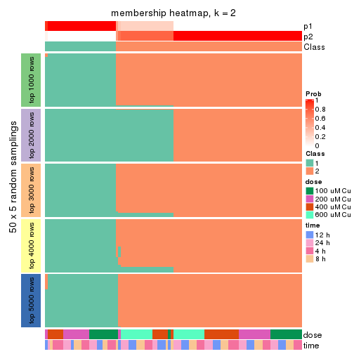</p>

</div>
<div id='tab-ATC-mclust-membership-heatmap-2'>
<pre><code class="r">membership_heatmap(res, k = 3)
</code></pre>

<p></p>

</div>
<div id='tab-ATC-mclust-membership-heatmap-3'>
<pre><code class="r">membership_heatmap(res, k = 4)
</code></pre>

<p></p>

</div>
<div id='tab-ATC-mclust-membership-heatmap-4'>
<pre><code class="r">membership_heatmap(res, k = 5)
</code></pre>

<p></p>

</div>
<div id='tab-ATC-mclust-membership-heatmap-5'>
<pre><code class="r">membership_heatmap(res, k = 6)
</code></pre>

<p></p>

</div>
</div>

As soon as we have had the classes for columns, we can look for signatures
which are significantly different between classes which can be candidate marks
for certain classes. Following are the heatmaps for signatures.


Signature heatmaps where rows are scaled:


<script>
$( function() {
	$( '#tabs-ATC-mclust-get-signatures' ).tabs();
} );
</script>
<div id='tabs-ATC-mclust-get-signatures'>
<ul>
<li><a href='#tab-ATC-mclust-get-signatures-1'>k = 2</a></li>
<li><a href='#tab-ATC-mclust-get-signatures-2'>k = 3</a></li>
<li><a href='#tab-ATC-mclust-get-signatures-3'>k = 4</a></li>
<li><a href='#tab-ATC-mclust-get-signatures-4'>k = 5</a></li>
<li><a href='#tab-ATC-mclust-get-signatures-5'>k = 6</a></li>
</ul>
<div id='tab-ATC-mclust-get-signatures-1'>
<pre><code class="r">get_signatures(res, k = 2)
</code></pre>

<p></p>

</div>
<div id='tab-ATC-mclust-get-signatures-2'>
<pre><code class="r">get_signatures(res, k = 3)
</code></pre>

<p></p>

</div>
<div id='tab-ATC-mclust-get-signatures-3'>
<pre><code class="r">get_signatures(res, k = 4)
</code></pre>

<p></p>

</div>
<div id='tab-ATC-mclust-get-signatures-4'>
<pre><code class="r">get_signatures(res, k = 5)
</code></pre>

<p></p>

</div>
<div id='tab-ATC-mclust-get-signatures-5'>
<pre><code class="r">get_signatures(res, k = 6)
</code></pre>

<p></p>

</div>
</div>


Signature heatmaps where rows are not scaled:


<script>
$( function() {
	$( '#tabs-ATC-mclust-get-signatures-no-scale' ).tabs();
} );
</script>
<div id='tabs-ATC-mclust-get-signatures-no-scale'>
<ul>
<li><a href='#tab-ATC-mclust-get-signatures-no-scale-1'>k = 2</a></li>
<li><a href='#tab-ATC-mclust-get-signatures-no-scale-2'>k = 3</a></li>
<li><a href='#tab-ATC-mclust-get-signatures-no-scale-3'>k = 4</a></li>
<li><a href='#tab-ATC-mclust-get-signatures-no-scale-4'>k = 5</a></li>
<li><a href='#tab-ATC-mclust-get-signatures-no-scale-5'>k = 6</a></li>
</ul>
<div id='tab-ATC-mclust-get-signatures-no-scale-1'>
<pre><code class="r">get_signatures(res, k = 2, scale_rows = FALSE)
</code></pre>

<p></p>

</div>
<div id='tab-ATC-mclust-get-signatures-no-scale-2'>
<pre><code class="r">get_signatures(res, k = 3, scale_rows = FALSE)
</code></pre>

<p></p>

</div>
<div id='tab-ATC-mclust-get-signatures-no-scale-3'>
<pre><code class="r">get_signatures(res, k = 4, scale_rows = FALSE)
</code></pre>

<p></p>

</div>
<div id='tab-ATC-mclust-get-signatures-no-scale-4'>
<pre><code class="r">get_signatures(res, k = 5, scale_rows = FALSE)
</code></pre>

<p></p>

</div>
<div id='tab-ATC-mclust-get-signatures-no-scale-5'>
<pre><code class="r">get_signatures(res, k = 6, scale_rows = FALSE)
</code></pre>

<p></p>

</div>
</div>


Compare the overlap of signatures from different k:

```r
compare_signatures(res)
```


`get_signature()` returns a data frame invisibly. TO get the list of signatures, the function
call should be assigned to a variable explicitly. In following code, if `plot` argument is set
to `FALSE`, no heatmap is plotted while only the differential analysis is performed.

```r
# code only for demonstration
tb = get_signature(res, k = ..., plot = FALSE)
```

An example of the output of `tb` is:

```
#>   which_row         fdr    mean_1    mean_2 scaled_mean_1 scaled_mean_2 km
#> 1        38 0.042760348  8.373488  9.131774    -0.5533452     0.5164555  1
#> 2        40 0.018707592  7.106213  8.469186    -0.6173731     0.5762149  1
#> 3        55 0.019134737 10.221463 11.207825    -0.6159697     0.5749050  1
#> 4        59 0.006059896  5.921854  7.869574    -0.6899429     0.6439467  1
#> 5        60 0.018055526  8.928898 10.211722    -0.6204761     0.5791110  1
#> 6        98 0.009384629 15.714769 14.887706     0.6635654    -0.6193277  2
...
```

The columns in `tb` are:

1. `which_row`: row indices corresponding to the input matrix.
2. `fdr`: FDR for the differential test. 
3. `mean_x`: The mean value in group x.
4. `scaled_mean_x`: The mean value in group x after rows are scaled.
5. `km`: Row groups if k-means clustering is applied to rows.


UMAP plot which shows how samples are separated.


<script>
$( function() {
	$( '#tabs-ATC-mclust-dimension-reduction' ).tabs();
} );
</script>
<div id='tabs-ATC-mclust-dimension-reduction'>
<ul>
<li><a href='#tab-ATC-mclust-dimension-reduction-1'>k = 2</a></li>
<li><a href='#tab-ATC-mclust-dimension-reduction-2'>k = 3</a></li>
<li><a href='#tab-ATC-mclust-dimension-reduction-3'>k = 4</a></li>
<li><a href='#tab-ATC-mclust-dimension-reduction-4'>k = 5</a></li>
<li><a href='#tab-ATC-mclust-dimension-reduction-5'>k = 6</a></li>
</ul>
<div id='tab-ATC-mclust-dimension-reduction-1'>
<pre><code class="r">dimension_reduction(res, k = 2, method = &quot;UMAP&quot;)
</code></pre>

<p></p>

</div>
<div id='tab-ATC-mclust-dimension-reduction-2'>
<pre><code class="r">dimension_reduction(res, k = 3, method = &quot;UMAP&quot;)
</code></pre>

<p></p>

</div>
<div id='tab-ATC-mclust-dimension-reduction-3'>
<pre><code class="r">dimension_reduction(res, k = 4, method = &quot;UMAP&quot;)
</code></pre>

<p></p>

</div>
<div id='tab-ATC-mclust-dimension-reduction-4'>
<pre><code class="r">dimension_reduction(res, k = 5, method = &quot;UMAP&quot;)
</code></pre>

<p></p>

</div>
<div id='tab-ATC-mclust-dimension-reduction-5'>
<pre><code class="r">dimension_reduction(res, k = 6, method = &quot;UMAP&quot;)
</code></pre>

<p></p>

</div>
</div>


Following heatmap shows how subgroups are split when increasing `k`:

```r
collect_classes(res)
```


Test correlation between subgroups and known annotations. If the known
annotation is numeric, one-way ANOVA test is applied, and if the known
annotation is discrete, chi-squared contingency table test is applied.

```r
test_to_known_factors(res)
```

```
#>             n  dose(p) time(p) k
#> ATC:mclust 97 1.02e-03 0.39038 2
#> ATC:mclust 97 1.28e-10 0.11443 3
#> ATC:mclust 94 9.40e-13 0.01335 4
#> ATC:mclust 95 1.32e-11 0.05667 5
#> ATC:mclust 87 7.28e-11 0.00111 6
```


If matrix rows can be associated to genes, consider to use `GO_Enrichment(res,
...)` to perform function enrichment for the signature genes.


 

---------------------------------------------------


### ATC:NMF*


The object with results only for a single top-value method and a single partition method 
can be extracted as:

```r
res = res_list["ATC", "NMF"]
# you can also extract it by
# res = res_list["ATC:NMF"]
```

A summary of `res` and all the functions that can be applied to it:

```r
res
```

```
#> A 'ConsensusPartition' object with k = 2, 3, 4, 5, 6.
#>   On a matrix with 16250 rows and 98 columns.
#>   Top rows (1000, 2000, 3000, 4000, 5000) are extracted by 'ATC' method.
#>   Subgroups are detected by 'NMF' method.
#>   Performed in total 1250 partitions by row resampling.
#>   Best k for subgroups seems to be 3.
#> 
#> Following methods can be applied to this 'ConsensusPartition' object:
#>  [1] "cola_report"             "collect_classes"         "collect_plots"          
#>  [4] "collect_stats"           "colnames"                "compare_signatures"     
#>  [7] "consensus_heatmap"       "dimension_reduction"     "functional_enrichment"  
#> [10] "get_anno_col"            "get_anno"                "get_classes"            
#> [13] "get_consensus"           "get_matrix"              "get_membership"         
#> [16] "get_param"               "get_signatures"          "get_stats"              
#> [19] "is_best_k"               "is_stable_k"             "membership_heatmap"     
#> [22] "ncol"                    "nrow"                    "plot_ecdf"              
#> [25] "rownames"                "select_partition_number" "show"                   
#> [28] "suggest_best_k"          "test_to_known_factors"
```

`collect_plots()` function collects all the plots made from `res` for all `k` (number of partitions)
into one single page to provide an easy and fast comparison between different `k`.

```r
collect_plots(res)
```


The plots are:

- The first row: a plot of the ECDF (Empirical cumulative distribution
  function) curves of the consensus matrix for each `k` and the heatmap of
  predicted classes for each `k`.
- The second row: heatmaps of the consensus matrix for each `k`.
- The third row: heatmaps of the membership matrix for each `k`.
- The fouth row: heatmaps of the signatures for each `k`.

All the plots in panels can be made by individual functions and they are
plotted later in this section.

`select_partition_number()` produces several plots showing different
statistics for choosing "optimized" `k`. There are following statistics:

- ECDF curves of the consensus matrix for each `k`;
- 1-PAC. [The PAC
  score](https://en.wikipedia.org/wiki/Consensus_clustering#Over-interpretation_potential_of_consensus_clustering)
  measures the proportion of the ambiguous subgrouping.
- Mean silhouette score.
- Concordance. The mean probability of fiting the consensus class ids in all
  partitions.
- Area increased. Denote $A_k$ as the area under the ECDF curve for current
  `k`, the area increased is defined as $A_k - A_{k-1}$.
- Rand index. The percent of pairs of samples that are both in a same cluster
  or both are not in a same cluster in the partition of k and k-1.
- Jaccard index. The ratio of pairs of samples are both in a same cluster in
  the partition of k and k-1 and the pairs of samples are both in a same
  cluster in the partition k or k-1.

The detailed explanations of these statistics can be found in [the cola
vignette](http://bioconductor.org/packages/devel/bioc/vignettes/cola/inst/doc/cola.html#toc_13).

Generally speaking, lower PAC score, higher mean silhouette score or higher
concordance corresponds to better partition. Rand index and Jaccard index
measure how similar the current partition is compared to partition with `k-1`.
If they are too similar, we won't accept `k` is better than `k-1`.

```r
select_partition_number(res)
```


The numeric values for all these statistics can be obtained by `get_stats()`.

```r
get_stats(res)
```

```
#>   k 1-PAC mean_silhouette concordance area_increased  Rand Jaccard
#> 2 2 0.979           0.964       0.984         0.5038 0.497   0.497
#> 3 3 0.914           0.907       0.958         0.3020 0.801   0.617
#> 4 4 0.619           0.532       0.775         0.0834 0.968   0.911
#> 5 5 0.598           0.595       0.748         0.0690 0.848   0.574
#> 6 6 0.576           0.507       0.694         0.0455 0.930   0.723
```

`suggest_best_k()` suggests the best $k$ based on these statistics. The rules are as follows:

- All $k$ with Jaccard index larger than 0.95 are removed because the increase of
  the partition number does not provides enough extra information. If all $k$ are removed,
  the best $k$ is assigned by `NA`.
- For $k$ with 1-PAC larger than 0.9, the maximal $k$ is taken as the "best k". Other $k$ is called "optional k".
- If it does not fit the second rule. The $k$ with the highest vote of highest
  1-PAC, mean silhouette and concordance is taken as the "best k".

```r
suggest_best_k(res)
```

```
#> [1] 3
#> attr(,"optional")
#> [1] 2
```

There is also optional best $k$ = 2 that is worth to check.

Following shows the table of the partitions (You need to click the **show/hide
code output** link to see it). The membership matrix (columns with name `p*`)
is inferred by
[`clue::cl_consensus()`](https://www.rdocumentation.org/link/cl_consensus?package=clue)
function with the `SE` method. Basically the value in the membership matrix
represents the probability to belong to a certain group. The finall class
label for an item is determined with the group with highest probability it
belongs to.

In `get_classes()` function, the entropy is calculated from the membership
matrix and the silhouette score is calculated from the consensus matrix.


<script>
$( function() {
	$( '#tabs-ATC-NMF-get-classes' ).tabs();
} );
</script>
<div id='tabs-ATC-NMF-get-classes'>
<ul>
<li><a href='#tab-ATC-NMF-get-classes-1'>k = 2</a></li>
<li><a href='#tab-ATC-NMF-get-classes-2'>k = 3</a></li>
<li><a href='#tab-ATC-NMF-get-classes-3'>k = 4</a></li>
<li><a href='#tab-ATC-NMF-get-classes-4'>k = 5</a></li>
<li><a href='#tab-ATC-NMF-get-classes-5'>k = 6</a></li>
</ul>

<div id='tab-ATC-NMF-get-classes-1'>
<p><a id='tab-ATC-NMF-get-classes-1-a' style='color:#0366d6' href='#'>show/hide code output</a></p>
<pre><code class="r">cbind(get_classes(res, k = 2), get_membership(res, k = 2))
</code></pre>

<pre><code>#&gt;           class entropy silhouette    p1    p2
#&gt; GSM241451     2  0.0000      0.974 0.000 1.000
#&gt; GSM241452     1  0.0000      0.994 1.000 0.000
#&gt; GSM241453     2  0.0000      0.974 0.000 1.000
#&gt; GSM241454     1  0.0000      0.994 1.000 0.000
#&gt; GSM241455     2  0.0000      0.974 0.000 1.000
#&gt; GSM241456     1  0.0000      0.994 1.000 0.000
#&gt; GSM241457     2  0.0000      0.974 0.000 1.000
#&gt; GSM241458     1  0.0000      0.994 1.000 0.000
#&gt; GSM241459     2  0.0000      0.974 0.000 1.000
#&gt; GSM241460     1  0.0000      0.994 1.000 0.000
#&gt; GSM241461     2  0.0000      0.974 0.000 1.000
#&gt; GSM241462     1  0.0000      0.994 1.000 0.000
#&gt; GSM241463     2  0.0000      0.974 0.000 1.000
#&gt; GSM241464     1  0.0000      0.994 1.000 0.000
#&gt; GSM241465     2  0.0000      0.974 0.000 1.000
#&gt; GSM241466     1  0.0000      0.994 1.000 0.000
#&gt; GSM241467     1  0.0000      0.994 1.000 0.000
#&gt; GSM241468     1  0.7602      0.703 0.780 0.220
#&gt; GSM241469     1  0.0000      0.994 1.000 0.000
#&gt; GSM241470     2  0.0000      0.974 0.000 1.000
#&gt; GSM241471     2  0.0376      0.971 0.004 0.996
#&gt; GSM241472     1  0.0000      0.994 1.000 0.000
#&gt; GSM241473     2  0.3431      0.919 0.064 0.936
#&gt; GSM241474     1  0.0000      0.994 1.000 0.000
#&gt; GSM241475     2  0.0000      0.974 0.000 1.000
#&gt; GSM241476     1  0.0000      0.994 1.000 0.000
#&gt; GSM241477     2  0.0000      0.974 0.000 1.000
#&gt; GSM241478     2  0.0000      0.974 0.000 1.000
#&gt; GSM241479     1  0.0000      0.994 1.000 0.000
#&gt; GSM241480     1  0.0000      0.994 1.000 0.000
#&gt; GSM241481     2  0.0000      0.974 0.000 1.000
#&gt; GSM241482     1  0.0000      0.994 1.000 0.000
#&gt; GSM241483     2  0.0000      0.974 0.000 1.000
#&gt; GSM241484     1  0.0000      0.994 1.000 0.000
#&gt; GSM241485     1  0.0000      0.994 1.000 0.000
#&gt; GSM241486     2  0.0000      0.974 0.000 1.000
#&gt; GSM241487     2  0.0000      0.974 0.000 1.000
#&gt; GSM241488     2  0.9209      0.526 0.336 0.664
#&gt; GSM241489     1  0.0000      0.994 1.000 0.000
#&gt; GSM241490     1  0.0000      0.994 1.000 0.000
#&gt; GSM241491     2  0.0000      0.974 0.000 1.000
#&gt; GSM241492     1  0.0000      0.994 1.000 0.000
#&gt; GSM241493     2  0.2778      0.934 0.048 0.952
#&gt; GSM241494     1  0.0000      0.994 1.000 0.000
#&gt; GSM241495     2  0.0000      0.974 0.000 1.000
#&gt; GSM241496     2  0.7376      0.753 0.208 0.792
#&gt; GSM241497     1  0.0000      0.994 1.000 0.000
#&gt; GSM241498     1  0.0000      0.994 1.000 0.000
#&gt; GSM241499     1  0.0000      0.994 1.000 0.000
#&gt; GSM241500     2  0.0000      0.974 0.000 1.000
#&gt; GSM241501     2  0.0000      0.974 0.000 1.000
#&gt; GSM241502     2  0.0000      0.974 0.000 1.000
#&gt; GSM241503     1  0.0000      0.994 1.000 0.000
#&gt; GSM241504     1  0.0000      0.994 1.000 0.000
#&gt; GSM241505     1  0.0000      0.994 1.000 0.000
#&gt; GSM241506     2  0.0000      0.974 0.000 1.000
#&gt; GSM241507     1  0.0000      0.994 1.000 0.000
#&gt; GSM241508     2  0.0000      0.974 0.000 1.000
#&gt; GSM241509     2  0.0000      0.974 0.000 1.000
#&gt; GSM241510     2  0.0000      0.974 0.000 1.000
#&gt; GSM241511     1  0.0000      0.994 1.000 0.000
#&gt; GSM241512     1  0.0000      0.994 1.000 0.000
#&gt; GSM241513     2  0.0000      0.974 0.000 1.000
#&gt; GSM241514     1  0.0000      0.994 1.000 0.000
#&gt; GSM241515     2  0.0000      0.974 0.000 1.000
#&gt; GSM241516     1  0.0000      0.994 1.000 0.000
#&gt; GSM241517     2  0.0000      0.974 0.000 1.000
#&gt; GSM241518     1  0.2423      0.953 0.960 0.040
#&gt; GSM241519     2  0.0000      0.974 0.000 1.000
#&gt; GSM241520     1  0.0000      0.994 1.000 0.000
#&gt; GSM241521     2  0.0000      0.974 0.000 1.000
#&gt; GSM241522     1  0.0000      0.994 1.000 0.000
#&gt; GSM241523     2  0.0000      0.974 0.000 1.000
#&gt; GSM241524     1  0.0000      0.994 1.000 0.000
#&gt; GSM241525     1  0.0000      0.994 1.000 0.000
#&gt; GSM241526     2  0.0000      0.974 0.000 1.000
#&gt; GSM241527     1  0.0000      0.994 1.000 0.000
#&gt; GSM241528     2  0.0000      0.974 0.000 1.000
#&gt; GSM241529     2  0.0000      0.974 0.000 1.000
#&gt; GSM241530     1  0.0000      0.994 1.000 0.000
#&gt; GSM241531     1  0.0000      0.994 1.000 0.000
#&gt; GSM241532     2  0.0000      0.974 0.000 1.000
#&gt; GSM241533     2  0.0000      0.974 0.000 1.000
#&gt; GSM241534     2  0.0000      0.974 0.000 1.000
#&gt; GSM241535     2  0.7883      0.711 0.236 0.764
#&gt; GSM241536     1  0.0000      0.994 1.000 0.000
#&gt; GSM241537     2  0.0000      0.974 0.000 1.000
#&gt; GSM241538     2  0.5737      0.844 0.136 0.864
#&gt; GSM241539     2  0.0000      0.974 0.000 1.000
#&gt; GSM241540     1  0.0000      0.994 1.000 0.000
#&gt; GSM241541     2  0.0000      0.974 0.000 1.000
#&gt; GSM241542     2  0.0000      0.974 0.000 1.000
#&gt; GSM241543     2  0.0000      0.974 0.000 1.000
#&gt; GSM241544     1  0.0000      0.994 1.000 0.000
#&gt; GSM241545     2  0.0000      0.974 0.000 1.000
#&gt; GSM241546     1  0.0000      0.994 1.000 0.000
#&gt; GSM241547     2  0.0000      0.974 0.000 1.000
#&gt; GSM241548     2  0.8713      0.616 0.292 0.708
</code></pre>

<script>
$('#tab-ATC-NMF-get-classes-1-a').parent().next().next().hide();
$('#tab-ATC-NMF-get-classes-1-a').click(function(){
  $('#tab-ATC-NMF-get-classes-1-a').parent().next().next().toggle();
  return(false);
});
</script>
</div>

<div id='tab-ATC-NMF-get-classes-2'>
<p><a id='tab-ATC-NMF-get-classes-2-a' style='color:#0366d6' href='#'>show/hide code output</a></p>
<pre><code class="r">cbind(get_classes(res, k = 3), get_membership(res, k = 3))
</code></pre>

<pre><code>#&gt;           class entropy silhouette    p1    p2    p3
#&gt; GSM241451     2  0.0000     0.9633 0.000 1.000 0.000
#&gt; GSM241452     1  0.0237     0.9706 0.996 0.004 0.000
#&gt; GSM241453     2  0.0000     0.9633 0.000 1.000 0.000
#&gt; GSM241454     1  0.0237     0.9706 0.996 0.004 0.000
#&gt; GSM241455     2  0.0000     0.9633 0.000 1.000 0.000
#&gt; GSM241456     1  0.0592     0.9672 0.988 0.012 0.000
#&gt; GSM241457     2  0.0237     0.9630 0.000 0.996 0.004
#&gt; GSM241458     1  0.0000     0.9705 1.000 0.000 0.000
#&gt; GSM241459     2  0.0000     0.9633 0.000 1.000 0.000
#&gt; GSM241460     1  0.0237     0.9706 0.996 0.004 0.000
#&gt; GSM241461     2  0.0592     0.9615 0.000 0.988 0.012
#&gt; GSM241462     1  0.0000     0.9705 1.000 0.000 0.000
#&gt; GSM241463     2  0.0892     0.9594 0.000 0.980 0.020
#&gt; GSM241464     1  0.0424     0.9697 0.992 0.008 0.000
#&gt; GSM241465     2  0.0892     0.9594 0.000 0.980 0.020
#&gt; GSM241466     1  0.0237     0.9706 0.996 0.004 0.000
#&gt; GSM241467     1  0.0424     0.9697 0.992 0.008 0.000
#&gt; GSM241468     2  0.0237     0.9602 0.004 0.996 0.000
#&gt; GSM241469     1  0.0592     0.9672 0.988 0.012 0.000
#&gt; GSM241470     2  0.0000     0.9633 0.000 1.000 0.000
#&gt; GSM241471     2  0.0000     0.9633 0.000 1.000 0.000
#&gt; GSM241472     1  0.0424     0.9697 0.992 0.008 0.000
#&gt; GSM241473     2  0.0000     0.9633 0.000 1.000 0.000
#&gt; GSM241474     1  0.0592     0.9672 0.988 0.012 0.000
#&gt; GSM241475     2  0.0000     0.9633 0.000 1.000 0.000
#&gt; GSM241476     1  0.0424     0.9697 0.992 0.008 0.000
#&gt; GSM241477     2  0.0000     0.9633 0.000 1.000 0.000
#&gt; GSM241478     2  0.0000     0.9633 0.000 1.000 0.000
#&gt; GSM241479     1  0.0424     0.9697 0.992 0.008 0.000
#&gt; GSM241480     1  0.0237     0.9706 0.996 0.004 0.000
#&gt; GSM241481     2  0.0000     0.9633 0.000 1.000 0.000
#&gt; GSM241482     1  0.0000     0.9705 1.000 0.000 0.000
#&gt; GSM241483     2  0.0747     0.9606 0.000 0.984 0.016
#&gt; GSM241484     1  0.0000     0.9705 1.000 0.000 0.000
#&gt; GSM241485     1  0.0000     0.9705 1.000 0.000 0.000
#&gt; GSM241486     2  0.0747     0.9606 0.000 0.984 0.016
#&gt; GSM241487     2  0.0892     0.9594 0.000 0.980 0.020
#&gt; GSM241488     2  0.0000     0.9633 0.000 1.000 0.000
#&gt; GSM241489     1  0.0424     0.9697 0.992 0.008 0.000
#&gt; GSM241490     1  0.0237     0.9706 0.996 0.004 0.000
#&gt; GSM241491     2  0.0237     0.9630 0.000 0.996 0.004
#&gt; GSM241492     1  0.0592     0.9672 0.988 0.012 0.000
#&gt; GSM241493     2  0.0000     0.9633 0.000 1.000 0.000
#&gt; GSM241494     1  0.0424     0.9697 0.992 0.008 0.000
#&gt; GSM241495     2  0.0000     0.9633 0.000 1.000 0.000
#&gt; GSM241496     2  0.0000     0.9633 0.000 1.000 0.000
#&gt; GSM241497     1  0.0424     0.9697 0.992 0.008 0.000
#&gt; GSM241498     1  0.0424     0.9697 0.992 0.008 0.000
#&gt; GSM241499     1  0.0000     0.9705 1.000 0.000 0.000
#&gt; GSM241500     2  0.0892     0.9594 0.000 0.980 0.020
#&gt; GSM241501     2  0.0892     0.9594 0.000 0.980 0.020
#&gt; GSM241502     2  0.0892     0.9594 0.000 0.980 0.020
#&gt; GSM241503     1  0.0000     0.9705 1.000 0.000 0.000
#&gt; GSM241504     1  0.0000     0.9705 1.000 0.000 0.000
#&gt; GSM241505     1  0.0000     0.9705 1.000 0.000 0.000
#&gt; GSM241506     2  0.0424     0.9625 0.000 0.992 0.008
#&gt; GSM241507     1  0.0000     0.9705 1.000 0.000 0.000
#&gt; GSM241508     2  0.1753     0.9405 0.000 0.952 0.048
#&gt; GSM241509     2  0.3192     0.8805 0.000 0.888 0.112
#&gt; GSM241510     3  0.4842     0.6647 0.000 0.224 0.776
#&gt; GSM241511     1  0.0237     0.9688 0.996 0.000 0.004
#&gt; GSM241512     1  0.4974     0.6800 0.764 0.000 0.236
#&gt; GSM241513     3  0.0424     0.9088 0.000 0.008 0.992
#&gt; GSM241514     1  0.3879     0.8087 0.848 0.000 0.152
#&gt; GSM241515     3  0.0000     0.9098 0.000 0.000 1.000
#&gt; GSM241516     1  0.1031     0.9544 0.976 0.000 0.024
#&gt; GSM241517     3  0.6260     0.0969 0.000 0.448 0.552
#&gt; GSM241518     3  0.2796     0.8567 0.092 0.000 0.908
#&gt; GSM241519     2  0.6026     0.4405 0.000 0.624 0.376
#&gt; GSM241520     1  0.0000     0.9705 1.000 0.000 0.000
#&gt; GSM241521     2  0.1753     0.9405 0.000 0.952 0.048
#&gt; GSM241522     1  0.0000     0.9705 1.000 0.000 0.000
#&gt; GSM241523     2  0.4504     0.7796 0.000 0.804 0.196
#&gt; GSM241524     1  0.0000     0.9705 1.000 0.000 0.000
#&gt; GSM241525     1  0.0000     0.9705 1.000 0.000 0.000
#&gt; GSM241526     3  0.0424     0.9088 0.000 0.008 0.992
#&gt; GSM241527     3  0.4796     0.7082 0.220 0.000 0.780
#&gt; GSM241528     2  0.4974     0.7205 0.000 0.764 0.236
#&gt; GSM241529     3  0.1411     0.8919 0.000 0.036 0.964
#&gt; GSM241530     1  0.1411     0.9434 0.964 0.000 0.036
#&gt; GSM241531     1  0.6305     0.0208 0.516 0.000 0.484
#&gt; GSM241532     3  0.1860     0.8790 0.000 0.052 0.948
#&gt; GSM241533     3  0.0237     0.9099 0.000 0.004 0.996
#&gt; GSM241534     3  0.0592     0.9071 0.000 0.012 0.988
#&gt; GSM241535     3  0.1289     0.8993 0.032 0.000 0.968
#&gt; GSM241536     1  0.0747     0.9613 0.984 0.000 0.016
#&gt; GSM241537     3  0.0000     0.9098 0.000 0.000 1.000
#&gt; GSM241538     3  0.1031     0.9030 0.024 0.000 0.976
#&gt; GSM241539     3  0.0000     0.9098 0.000 0.000 1.000
#&gt; GSM241540     3  0.4555     0.7364 0.200 0.000 0.800
#&gt; GSM241541     3  0.0237     0.9099 0.000 0.004 0.996
#&gt; GSM241542     3  0.0592     0.9070 0.012 0.000 0.988
#&gt; GSM241543     3  0.0237     0.9099 0.000 0.004 0.996
#&gt; GSM241544     3  0.5926     0.4475 0.356 0.000 0.644
#&gt; GSM241545     3  0.0000     0.9098 0.000 0.000 1.000
#&gt; GSM241546     1  0.0747     0.9609 0.984 0.000 0.016
#&gt; GSM241547     3  0.0237     0.9099 0.000 0.004 0.996
#&gt; GSM241548     3  0.1163     0.9014 0.028 0.000 0.972
</code></pre>

<script>
$('#tab-ATC-NMF-get-classes-2-a').parent().next().next().hide();
$('#tab-ATC-NMF-get-classes-2-a').click(function(){
  $('#tab-ATC-NMF-get-classes-2-a').parent().next().next().toggle();
  return(false);
});
</script>
</div>

<div id='tab-ATC-NMF-get-classes-3'>
<p><a id='tab-ATC-NMF-get-classes-3-a' style='color:#0366d6' href='#'>show/hide code output</a></p>
<pre><code class="r">cbind(get_classes(res, k = 4), get_membership(res, k = 4))
</code></pre>

<pre><code>#&gt;           class entropy silhouette    p1    p2    p3    p4
#&gt; GSM241451     2  0.0921     0.6371 0.000 0.972 0.000 0.028
#&gt; GSM241452     1  0.0895     0.8780 0.976 0.004 0.000 0.020
#&gt; GSM241453     2  0.2831     0.6168 0.000 0.876 0.004 0.120
#&gt; GSM241454     1  0.1389     0.8787 0.952 0.000 0.000 0.048
#&gt; GSM241455     2  0.1082     0.6267 0.004 0.972 0.004 0.020
#&gt; GSM241456     1  0.2530     0.8605 0.896 0.004 0.000 0.100
#&gt; GSM241457     2  0.4889     0.4066 0.000 0.636 0.004 0.360
#&gt; GSM241458     1  0.0817     0.8764 0.976 0.000 0.000 0.024
#&gt; GSM241459     2  0.4817     0.3709 0.000 0.612 0.000 0.388
#&gt; GSM241460     1  0.1389     0.8806 0.952 0.000 0.000 0.048
#&gt; GSM241461     2  0.5040     0.4027 0.000 0.628 0.008 0.364
#&gt; GSM241462     1  0.1867     0.8654 0.928 0.000 0.000 0.072
#&gt; GSM241463     2  0.2197     0.5876 0.000 0.916 0.004 0.080
#&gt; GSM241464     1  0.4055     0.7912 0.832 0.060 0.000 0.108
#&gt; GSM241465     2  0.2412     0.5604 0.000 0.908 0.008 0.084
#&gt; GSM241466     1  0.1902     0.8744 0.932 0.000 0.004 0.064
#&gt; GSM241467     1  0.1489     0.8780 0.952 0.004 0.000 0.044
#&gt; GSM241468     2  0.5036     0.5089 0.024 0.696 0.000 0.280
#&gt; GSM241469     1  0.2675     0.8615 0.892 0.008 0.000 0.100
#&gt; GSM241470     2  0.2281     0.6298 0.000 0.904 0.000 0.096
#&gt; GSM241471     2  0.4360     0.5416 0.008 0.744 0.000 0.248
#&gt; GSM241472     1  0.1978     0.8745 0.928 0.004 0.000 0.068
#&gt; GSM241473     2  0.1716     0.6388 0.000 0.936 0.000 0.064
#&gt; GSM241474     1  0.2976     0.8585 0.872 0.008 0.000 0.120
#&gt; GSM241475     2  0.1637     0.6156 0.000 0.940 0.000 0.060
#&gt; GSM241476     1  0.2480     0.8656 0.904 0.008 0.000 0.088
#&gt; GSM241477     2  0.1940     0.6377 0.000 0.924 0.000 0.076
#&gt; GSM241478     2  0.1584     0.6282 0.012 0.952 0.000 0.036
#&gt; GSM241479     1  0.2401     0.8660 0.904 0.004 0.000 0.092
#&gt; GSM241480     1  0.1576     0.8775 0.948 0.000 0.004 0.048
#&gt; GSM241481     2  0.4730     0.4075 0.000 0.636 0.000 0.364
#&gt; GSM241482     1  0.0817     0.8766 0.976 0.000 0.000 0.024
#&gt; GSM241483     2  0.4422     0.4172 0.000 0.736 0.008 0.256
#&gt; GSM241484     1  0.0817     0.8764 0.976 0.000 0.000 0.024
#&gt; GSM241485     1  0.1474     0.8717 0.948 0.000 0.000 0.052
#&gt; GSM241486     2  0.5110     0.4012 0.000 0.636 0.012 0.352
#&gt; GSM241487     2  0.2124     0.5842 0.000 0.924 0.008 0.068
#&gt; GSM241488     2  0.4462     0.5514 0.064 0.804 0.000 0.132
#&gt; GSM241489     1  0.1661     0.8726 0.944 0.004 0.000 0.052
#&gt; GSM241490     1  0.1722     0.8786 0.944 0.000 0.008 0.048
#&gt; GSM241491     2  0.1151     0.6260 0.000 0.968 0.008 0.024
#&gt; GSM241492     1  0.1940     0.8653 0.924 0.000 0.000 0.076
#&gt; GSM241493     2  0.1042     0.6382 0.008 0.972 0.000 0.020
#&gt; GSM241494     1  0.1576     0.8778 0.948 0.004 0.000 0.048
#&gt; GSM241495     2  0.1792     0.6379 0.000 0.932 0.000 0.068
#&gt; GSM241496     2  0.4139     0.5718 0.040 0.816 0.000 0.144
#&gt; GSM241497     1  0.1489     0.8762 0.952 0.004 0.000 0.044
#&gt; GSM241498     1  0.2266     0.8681 0.912 0.004 0.000 0.084
#&gt; GSM241499     1  0.0707     0.8766 0.980 0.000 0.000 0.020
#&gt; GSM241500     2  0.4999     0.2584 0.000 0.660 0.012 0.328
#&gt; GSM241501     2  0.4606     0.3864 0.000 0.724 0.012 0.264
#&gt; GSM241502     2  0.4978     0.2532 0.000 0.664 0.012 0.324
#&gt; GSM241503     1  0.0895     0.8768 0.976 0.000 0.004 0.020
#&gt; GSM241504     1  0.1042     0.8768 0.972 0.000 0.020 0.008
#&gt; GSM241505     1  0.1520     0.8752 0.956 0.000 0.020 0.024
#&gt; GSM241506     2  0.5229    -0.0133 0.000 0.564 0.008 0.428
#&gt; GSM241507     1  0.2002     0.8712 0.936 0.000 0.020 0.044
#&gt; GSM241508     2  0.5883    -0.2451 0.000 0.572 0.040 0.388
#&gt; GSM241509     4  0.7463     0.0000 0.000 0.384 0.176 0.440
#&gt; GSM241510     3  0.7738    -0.3437 0.000 0.300 0.440 0.260
#&gt; GSM241511     1  0.2586     0.8603 0.912 0.000 0.048 0.040
#&gt; GSM241512     1  0.5723     0.6054 0.684 0.000 0.244 0.072
#&gt; GSM241513     3  0.7002     0.1364 0.000 0.388 0.492 0.120
#&gt; GSM241514     1  0.6275     0.1369 0.484 0.000 0.460 0.056
#&gt; GSM241515     3  0.4274     0.4925 0.000 0.108 0.820 0.072
#&gt; GSM241516     3  0.5781    -0.2166 0.480 0.000 0.492 0.028
#&gt; GSM241517     2  0.5990     0.1021 0.000 0.688 0.124 0.188
#&gt; GSM241518     3  0.5863     0.4690 0.180 0.000 0.700 0.120
#&gt; GSM241519     2  0.5850     0.1268 0.000 0.700 0.116 0.184
#&gt; GSM241520     1  0.7387     0.1253 0.468 0.004 0.384 0.144
#&gt; GSM241521     2  0.3107     0.5702 0.000 0.884 0.036 0.080
#&gt; GSM241522     1  0.1042     0.8770 0.972 0.000 0.020 0.008
#&gt; GSM241523     2  0.6921     0.1177 0.000 0.580 0.260 0.160
#&gt; GSM241524     1  0.6549     0.4530 0.612 0.000 0.268 0.120
#&gt; GSM241525     1  0.2048     0.8641 0.928 0.000 0.064 0.008
#&gt; GSM241526     3  0.7224     0.1040 0.000 0.216 0.548 0.236
#&gt; GSM241527     3  0.6050     0.4193 0.232 0.000 0.668 0.100
#&gt; GSM241528     2  0.6134    -0.1473 0.000 0.660 0.104 0.236
#&gt; GSM241529     3  0.7571    -0.1278 0.000 0.272 0.484 0.244
#&gt; GSM241530     1  0.4635     0.7091 0.756 0.000 0.216 0.028
#&gt; GSM241531     1  0.6362     0.3508 0.560 0.000 0.368 0.072
#&gt; GSM241532     3  0.7536    -0.0857 0.000 0.264 0.492 0.244
#&gt; GSM241533     3  0.7196     0.1007 0.000 0.212 0.552 0.236
#&gt; GSM241534     3  0.7250     0.0823 0.000 0.220 0.544 0.236
#&gt; GSM241535     3  0.4417     0.5011 0.044 0.000 0.796 0.160
#&gt; GSM241536     1  0.3834     0.8234 0.848 0.000 0.076 0.076
#&gt; GSM241537     3  0.4307     0.4743 0.000 0.024 0.784 0.192
#&gt; GSM241538     3  0.1406     0.5288 0.024 0.000 0.960 0.016
#&gt; GSM241539     3  0.4079     0.4765 0.000 0.020 0.800 0.180
#&gt; GSM241540     3  0.3497     0.4977 0.124 0.000 0.852 0.024
#&gt; GSM241541     3  0.6308     0.3422 0.000 0.120 0.648 0.232
#&gt; GSM241542     3  0.0524     0.5302 0.008 0.000 0.988 0.004
#&gt; GSM241543     3  0.6403     0.3339 0.000 0.260 0.628 0.112
#&gt; GSM241544     3  0.6141     0.3401 0.300 0.000 0.624 0.076
#&gt; GSM241545     3  0.5609     0.4064 0.000 0.200 0.712 0.088
#&gt; GSM241546     1  0.6265     0.2068 0.500 0.000 0.444 0.056
#&gt; GSM241547     3  0.7369     0.2364 0.000 0.228 0.524 0.248
#&gt; GSM241548     3  0.3266     0.5233 0.040 0.000 0.876 0.084
</code></pre>

<script>
$('#tab-ATC-NMF-get-classes-3-a').parent().next().next().hide();
$('#tab-ATC-NMF-get-classes-3-a').click(function(){
  $('#tab-ATC-NMF-get-classes-3-a').parent().next().next().toggle();
  return(false);
});
</script>
</div>

<div id='tab-ATC-NMF-get-classes-4'>
<p><a id='tab-ATC-NMF-get-classes-4-a' style='color:#0366d6' href='#'>show/hide code output</a></p>
<pre><code class="r">cbind(get_classes(res, k = 5), get_membership(res, k = 5))
</code></pre>

<pre><code>#&gt;           class entropy silhouette    p1    p2    p3    p4    p5
#&gt; GSM241451     5  0.6324    -0.4952 0.000 0.412 0.000 0.156 0.432
#&gt; GSM241452     1  0.1270     0.8944 0.948 0.052 0.000 0.000 0.000
#&gt; GSM241453     2  0.5541     0.6078 0.000 0.552 0.000 0.076 0.372
#&gt; GSM241454     1  0.0404     0.8969 0.988 0.000 0.012 0.000 0.000
#&gt; GSM241455     2  0.5629     0.6783 0.000 0.644 0.004 0.132 0.220
#&gt; GSM241456     1  0.1405     0.8967 0.956 0.008 0.016 0.000 0.020
#&gt; GSM241457     5  0.0798     0.6154 0.000 0.016 0.000 0.008 0.976
#&gt; GSM241458     1  0.2304     0.8827 0.908 0.068 0.020 0.004 0.000
#&gt; GSM241459     5  0.0807     0.6079 0.000 0.012 0.000 0.012 0.976
#&gt; GSM241460     1  0.3218     0.8554 0.844 0.128 0.024 0.004 0.000
#&gt; GSM241461     5  0.0955     0.5957 0.000 0.004 0.000 0.028 0.968
#&gt; GSM241462     1  0.3786     0.8089 0.776 0.204 0.016 0.004 0.000
#&gt; GSM241463     2  0.5455     0.6511 0.000 0.680 0.008 0.176 0.136
#&gt; GSM241464     1  0.5730     0.5583 0.628 0.296 0.016 0.016 0.044
#&gt; GSM241465     2  0.6380     0.5540 0.000 0.516 0.000 0.260 0.224
#&gt; GSM241466     1  0.0566     0.8948 0.984 0.012 0.004 0.000 0.000
#&gt; GSM241467     1  0.1270     0.8937 0.948 0.052 0.000 0.000 0.000
#&gt; GSM241468     5  0.4614     0.2926 0.012 0.252 0.004 0.020 0.712
#&gt; GSM241469     1  0.2569     0.8836 0.904 0.012 0.020 0.004 0.060
#&gt; GSM241470     2  0.5415     0.5978 0.000 0.552 0.000 0.064 0.384
#&gt; GSM241471     5  0.4223     0.3222 0.000 0.248 0.000 0.028 0.724
#&gt; GSM241472     1  0.1673     0.8976 0.944 0.032 0.016 0.000 0.008
#&gt; GSM241473     2  0.5697     0.4332 0.000 0.480 0.004 0.068 0.448
#&gt; GSM241474     1  0.2961     0.8850 0.888 0.064 0.020 0.008 0.020
#&gt; GSM241475     2  0.6733     0.4639 0.004 0.416 0.000 0.212 0.368
#&gt; GSM241476     1  0.1059     0.8979 0.968 0.004 0.008 0.000 0.020
#&gt; GSM241477     5  0.5658    -0.1505 0.000 0.332 0.000 0.096 0.572
#&gt; GSM241478     2  0.5072     0.6687 0.000 0.704 0.004 0.100 0.192
#&gt; GSM241479     1  0.1016     0.8962 0.972 0.012 0.004 0.004 0.008
#&gt; GSM241480     1  0.0162     0.8948 0.996 0.000 0.004 0.000 0.000
#&gt; GSM241481     5  0.0798     0.6144 0.000 0.016 0.000 0.008 0.976
#&gt; GSM241482     1  0.2233     0.8845 0.904 0.080 0.016 0.000 0.000
#&gt; GSM241483     5  0.3622     0.5823 0.000 0.048 0.000 0.136 0.816
#&gt; GSM241484     1  0.1197     0.8973 0.952 0.048 0.000 0.000 0.000
#&gt; GSM241485     1  0.3351     0.8451 0.828 0.148 0.020 0.004 0.000
#&gt; GSM241486     5  0.1282     0.6197 0.000 0.004 0.000 0.044 0.952
#&gt; GSM241487     2  0.6623     0.4819 0.000 0.452 0.000 0.300 0.248
#&gt; GSM241488     2  0.4314     0.5716 0.016 0.772 0.008 0.020 0.184
#&gt; GSM241489     1  0.3470     0.8621 0.864 0.072 0.012 0.028 0.024
#&gt; GSM241490     1  0.1334     0.8930 0.960 0.012 0.020 0.004 0.004
#&gt; GSM241491     2  0.5499     0.6826 0.000 0.652 0.004 0.112 0.232
#&gt; GSM241492     1  0.4097     0.8201 0.804 0.144 0.008 0.028 0.016
#&gt; GSM241493     2  0.5916     0.6021 0.000 0.528 0.004 0.096 0.372
#&gt; GSM241494     1  0.1205     0.8959 0.956 0.040 0.004 0.000 0.000
#&gt; GSM241495     2  0.5952     0.5345 0.000 0.480 0.000 0.108 0.412
#&gt; GSM241496     2  0.4845     0.5861 0.012 0.700 0.008 0.024 0.256
#&gt; GSM241497     1  0.1731     0.8917 0.932 0.060 0.004 0.000 0.004
#&gt; GSM241498     1  0.0960     0.8975 0.972 0.004 0.016 0.000 0.008
#&gt; GSM241499     1  0.1202     0.8983 0.960 0.032 0.004 0.004 0.000
#&gt; GSM241500     5  0.3916     0.5464 0.000 0.012 0.000 0.256 0.732
#&gt; GSM241501     5  0.4873     0.4957 0.000 0.068 0.000 0.244 0.688
#&gt; GSM241502     5  0.5405     0.3287 0.000 0.064 0.000 0.380 0.556
#&gt; GSM241503     1  0.0609     0.8975 0.980 0.020 0.000 0.000 0.000
#&gt; GSM241504     1  0.0566     0.8975 0.984 0.004 0.012 0.000 0.000
#&gt; GSM241505     1  0.1173     0.8964 0.964 0.020 0.012 0.004 0.000
#&gt; GSM241506     5  0.5068     0.3024 0.000 0.032 0.004 0.384 0.580
#&gt; GSM241507     1  0.2437     0.8682 0.904 0.032 0.060 0.004 0.000
#&gt; GSM241508     4  0.5359     0.0405 0.000 0.056 0.000 0.532 0.412
#&gt; GSM241509     4  0.4780     0.3978 0.000 0.048 0.000 0.672 0.280
#&gt; GSM241510     4  0.4288     0.4920 0.000 0.032 0.004 0.740 0.224
#&gt; GSM241511     1  0.3625     0.8233 0.840 0.048 0.096 0.016 0.000
#&gt; GSM241512     1  0.5018     0.6827 0.728 0.012 0.100 0.160 0.000
#&gt; GSM241513     3  0.7202     0.0481 0.000 0.336 0.392 0.252 0.020
#&gt; GSM241514     3  0.3530     0.6613 0.204 0.012 0.784 0.000 0.000
#&gt; GSM241515     3  0.5346     0.5352 0.000 0.132 0.692 0.168 0.008
#&gt; GSM241516     3  0.4674     0.6215 0.244 0.016 0.712 0.028 0.000
#&gt; GSM241517     4  0.7374    -0.1653 0.000 0.348 0.100 0.452 0.100
#&gt; GSM241518     3  0.5078     0.6615 0.064 0.108 0.756 0.072 0.000
#&gt; GSM241519     4  0.7450    -0.2492 0.000 0.348 0.068 0.432 0.152
#&gt; GSM241520     3  0.6334     0.6082 0.124 0.208 0.628 0.036 0.004
#&gt; GSM241521     2  0.7083     0.5771 0.000 0.528 0.048 0.224 0.200
#&gt; GSM241522     1  0.1901     0.8765 0.928 0.012 0.056 0.004 0.000
#&gt; GSM241523     2  0.6895     0.4384 0.000 0.588 0.188 0.140 0.084
#&gt; GSM241524     3  0.6276     0.6077 0.232 0.100 0.628 0.032 0.008
#&gt; GSM241525     1  0.2906     0.8522 0.880 0.028 0.080 0.012 0.000
#&gt; GSM241526     4  0.3437     0.6082 0.000 0.032 0.044 0.860 0.064
#&gt; GSM241527     3  0.7019     0.2744 0.208 0.020 0.448 0.324 0.000
#&gt; GSM241528     4  0.5607     0.3532 0.000 0.228 0.000 0.632 0.140
#&gt; GSM241529     4  0.3913     0.5988 0.000 0.032 0.036 0.824 0.108
#&gt; GSM241530     1  0.5181     0.6944 0.724 0.020 0.152 0.104 0.000
#&gt; GSM241531     1  0.6922     0.4088 0.568 0.060 0.204 0.168 0.000
#&gt; GSM241532     4  0.3570     0.5881 0.000 0.044 0.004 0.828 0.124
#&gt; GSM241533     4  0.3051     0.6005 0.000 0.000 0.028 0.852 0.120
#&gt; GSM241534     4  0.3122     0.6019 0.000 0.004 0.024 0.852 0.120
#&gt; GSM241535     3  0.5447     0.2096 0.008 0.044 0.532 0.416 0.000
#&gt; GSM241536     1  0.4657     0.7578 0.764 0.068 0.148 0.020 0.000
#&gt; GSM241537     4  0.4331    -0.0247 0.000 0.004 0.400 0.596 0.000
#&gt; GSM241538     3  0.3031     0.6179 0.004 0.016 0.852 0.128 0.000
#&gt; GSM241539     4  0.4794    -0.1855 0.000 0.012 0.464 0.520 0.004
#&gt; GSM241540     3  0.3912     0.6318 0.040 0.036 0.828 0.096 0.000
#&gt; GSM241541     4  0.3970     0.3896 0.000 0.024 0.224 0.752 0.000
#&gt; GSM241542     3  0.3203     0.5979 0.000 0.012 0.820 0.168 0.000
#&gt; GSM241543     3  0.6332     0.4472 0.000 0.208 0.596 0.176 0.020
#&gt; GSM241544     3  0.3902     0.6773 0.152 0.028 0.804 0.016 0.000
#&gt; GSM241545     3  0.4219     0.6209 0.004 0.068 0.792 0.132 0.004
#&gt; GSM241546     3  0.3762     0.6342 0.244 0.004 0.748 0.004 0.000
#&gt; GSM241547     4  0.6359     0.3307 0.000 0.196 0.236 0.560 0.008
#&gt; GSM241548     3  0.3798     0.6625 0.044 0.032 0.836 0.088 0.000
</code></pre>

<script>
$('#tab-ATC-NMF-get-classes-4-a').parent().next().next().hide();
$('#tab-ATC-NMF-get-classes-4-a').click(function(){
  $('#tab-ATC-NMF-get-classes-4-a').parent().next().next().toggle();
  return(false);
});
</script>
</div>

<div id='tab-ATC-NMF-get-classes-5'>
<p><a id='tab-ATC-NMF-get-classes-5-a' style='color:#0366d6' href='#'>show/hide code output</a></p>
<pre><code class="r">cbind(get_classes(res, k = 6), get_membership(res, k = 6))
</code></pre>

<pre><code>#&gt;           class entropy silhouette    p1    p2    p3    p4    p5    p6
#&gt; GSM241451     6  0.6265    -0.3160 0.000 0.176 0.032 0.004 0.256 0.532
#&gt; GSM241452     1  0.3007     0.7771 0.836 0.012 0.140 0.004 0.008 0.000
#&gt; GSM241453     2  0.6192     0.7690 0.000 0.476 0.008 0.004 0.232 0.280
#&gt; GSM241454     1  0.0972     0.7896 0.964 0.008 0.028 0.000 0.000 0.000
#&gt; GSM241455     2  0.5534     0.7730 0.000 0.596 0.004 0.004 0.176 0.220
#&gt; GSM241456     1  0.4635     0.7385 0.708 0.036 0.044 0.000 0.212 0.000
#&gt; GSM241457     5  0.1320     0.6046 0.000 0.016 0.000 0.000 0.948 0.036
#&gt; GSM241458     1  0.3761     0.7316 0.764 0.196 0.032 0.008 0.000 0.000
#&gt; GSM241459     5  0.1442     0.6060 0.000 0.012 0.004 0.000 0.944 0.040
#&gt; GSM241460     1  0.4490     0.6050 0.604 0.360 0.032 0.004 0.000 0.000
#&gt; GSM241461     5  0.1285     0.6095 0.000 0.004 0.000 0.000 0.944 0.052
#&gt; GSM241462     1  0.4497     0.6012 0.600 0.368 0.012 0.020 0.000 0.000
#&gt; GSM241463     2  0.5061     0.7437 0.000 0.644 0.008 0.004 0.088 0.256
#&gt; GSM241464     1  0.7094     0.4975 0.448 0.268 0.184 0.004 0.096 0.000
#&gt; GSM241465     2  0.5727     0.6698 0.000 0.456 0.000 0.004 0.144 0.396
#&gt; GSM241466     1  0.2744     0.7918 0.876 0.012 0.052 0.000 0.060 0.000
#&gt; GSM241467     1  0.3162     0.7949 0.856 0.040 0.064 0.000 0.040 0.000
#&gt; GSM241468     5  0.6509     0.0208 0.024 0.316 0.008 0.004 0.480 0.168
#&gt; GSM241469     1  0.5346     0.6727 0.612 0.020 0.096 0.000 0.272 0.000
#&gt; GSM241470     2  0.6435     0.7388 0.000 0.444 0.016 0.004 0.248 0.288
#&gt; GSM241471     5  0.5913     0.0614 0.000 0.280 0.004 0.000 0.496 0.220
#&gt; GSM241472     1  0.3753     0.7907 0.808 0.084 0.020 0.000 0.088 0.000
#&gt; GSM241473     2  0.5839     0.6829 0.000 0.524 0.000 0.008 0.284 0.184
#&gt; GSM241474     1  0.5540     0.6760 0.608 0.172 0.008 0.004 0.208 0.000
#&gt; GSM241475     6  0.6269    -0.4994 0.016 0.292 0.004 0.000 0.204 0.484
#&gt; GSM241476     1  0.4323     0.7557 0.740 0.028 0.044 0.000 0.188 0.000
#&gt; GSM241477     5  0.6190    -0.3531 0.000 0.264 0.004 0.000 0.376 0.356
#&gt; GSM241478     2  0.5472     0.7560 0.020 0.640 0.004 0.004 0.104 0.228
#&gt; GSM241479     1  0.3721     0.7812 0.804 0.012 0.084 0.000 0.100 0.000
#&gt; GSM241480     1  0.1155     0.7896 0.956 0.004 0.036 0.000 0.004 0.000
#&gt; GSM241481     5  0.1528     0.6108 0.000 0.016 0.000 0.000 0.936 0.048
#&gt; GSM241482     1  0.3239     0.7516 0.808 0.164 0.024 0.004 0.000 0.000
#&gt; GSM241483     5  0.4292     0.4513 0.000 0.024 0.000 0.000 0.588 0.388
#&gt; GSM241484     1  0.1364     0.7846 0.944 0.048 0.004 0.004 0.000 0.000
#&gt; GSM241485     1  0.4444     0.6422 0.644 0.316 0.032 0.008 0.000 0.000
#&gt; GSM241486     5  0.1958     0.6130 0.000 0.004 0.000 0.000 0.896 0.100
#&gt; GSM241487     6  0.5887    -0.5549 0.000 0.340 0.004 0.000 0.184 0.472
#&gt; GSM241488     2  0.6983     0.7230 0.020 0.504 0.076 0.004 0.120 0.276
#&gt; GSM241489     1  0.5469     0.7380 0.664 0.052 0.144 0.000 0.140 0.000
#&gt; GSM241490     1  0.3924     0.7754 0.788 0.008 0.124 0.004 0.076 0.000
#&gt; GSM241491     2  0.5780     0.7884 0.000 0.532 0.008 0.000 0.172 0.288
#&gt; GSM241492     1  0.6345     0.6300 0.532 0.272 0.048 0.004 0.144 0.000
#&gt; GSM241493     2  0.6275     0.7782 0.012 0.496 0.004 0.004 0.200 0.284
#&gt; GSM241494     1  0.2890     0.7882 0.860 0.012 0.096 0.000 0.032 0.000
#&gt; GSM241495     6  0.6515    -0.6476 0.000 0.336 0.016 0.004 0.248 0.396
#&gt; GSM241496     2  0.7238     0.7237 0.016 0.468 0.080 0.004 0.168 0.264
#&gt; GSM241497     1  0.4152     0.7727 0.772 0.028 0.140 0.000 0.060 0.000
#&gt; GSM241498     1  0.3139     0.7901 0.852 0.020 0.048 0.000 0.080 0.000
#&gt; GSM241499     1  0.1841     0.7804 0.920 0.064 0.008 0.008 0.000 0.000
#&gt; GSM241500     5  0.3706     0.4206 0.000 0.000 0.000 0.000 0.620 0.380
#&gt; GSM241501     5  0.4657     0.3516 0.000 0.032 0.004 0.000 0.508 0.456
#&gt; GSM241502     6  0.4161     0.0111 0.000 0.016 0.000 0.004 0.348 0.632
#&gt; GSM241503     1  0.1010     0.7844 0.960 0.036 0.000 0.004 0.000 0.000
#&gt; GSM241504     1  0.1148     0.7786 0.960 0.016 0.020 0.004 0.000 0.000
#&gt; GSM241505     1  0.1167     0.7792 0.960 0.020 0.012 0.008 0.000 0.000
#&gt; GSM241506     5  0.4395     0.4478 0.000 0.016 0.000 0.008 0.580 0.396
#&gt; GSM241507     1  0.2103     0.7657 0.916 0.024 0.020 0.040 0.000 0.000
#&gt; GSM241508     6  0.3778     0.1480 0.000 0.016 0.000 0.000 0.288 0.696
#&gt; GSM241509     6  0.3043     0.3937 0.000 0.012 0.000 0.012 0.148 0.828
#&gt; GSM241510     6  0.2473     0.3925 0.000 0.000 0.000 0.008 0.136 0.856
#&gt; GSM241511     1  0.4661     0.5380 0.688 0.048 0.024 0.240 0.000 0.000
#&gt; GSM241512     1  0.3540     0.7101 0.812 0.020 0.036 0.132 0.000 0.000
#&gt; GSM241513     3  0.5717     0.4983 0.000 0.124 0.608 0.028 0.004 0.236
#&gt; GSM241514     3  0.4184     0.6557 0.124 0.000 0.752 0.120 0.004 0.000
#&gt; GSM241515     4  0.6466     0.0341 0.000 0.036 0.248 0.480 0.000 0.236
#&gt; GSM241516     4  0.6016     0.0903 0.192 0.004 0.320 0.480 0.004 0.000
#&gt; GSM241517     6  0.4431     0.2745 0.000 0.136 0.100 0.004 0.012 0.748
#&gt; GSM241518     3  0.3835     0.7191 0.028 0.016 0.804 0.132 0.000 0.020
#&gt; GSM241519     6  0.4830     0.2903 0.000 0.116 0.168 0.000 0.016 0.700
#&gt; GSM241520     3  0.2744     0.7186 0.068 0.024 0.884 0.016 0.004 0.004
#&gt; GSM241521     6  0.7003    -0.3588 0.000 0.292 0.168 0.004 0.088 0.448
#&gt; GSM241522     1  0.3444     0.7514 0.800 0.020 0.168 0.004 0.008 0.000
#&gt; GSM241523     3  0.6019     0.3486 0.000 0.224 0.556 0.000 0.028 0.192
#&gt; GSM241524     3  0.2747     0.6947 0.108 0.000 0.860 0.028 0.004 0.000
#&gt; GSM241525     1  0.3562     0.7570 0.828 0.032 0.076 0.064 0.000 0.000
#&gt; GSM241526     6  0.4087     0.2925 0.000 0.004 0.000 0.276 0.028 0.692
#&gt; GSM241527     4  0.5479     0.4809 0.244 0.000 0.020 0.612 0.000 0.124
#&gt; GSM241528     6  0.3399     0.4145 0.000 0.088 0.000 0.064 0.016 0.832
#&gt; GSM241529     6  0.4660     0.2518 0.000 0.008 0.000 0.308 0.048 0.636
#&gt; GSM241530     1  0.4561     0.3519 0.568 0.000 0.040 0.392 0.000 0.000
#&gt; GSM241531     4  0.4243     0.4817 0.272 0.008 0.032 0.688 0.000 0.000
#&gt; GSM241532     6  0.2358     0.4145 0.000 0.000 0.000 0.016 0.108 0.876
#&gt; GSM241533     6  0.4154     0.4153 0.000 0.000 0.000 0.164 0.096 0.740
#&gt; GSM241534     6  0.3985     0.4190 0.000 0.000 0.000 0.140 0.100 0.760
#&gt; GSM241535     4  0.3522     0.6435 0.040 0.008 0.028 0.836 0.000 0.088
#&gt; GSM241536     1  0.5741    -0.0930 0.460 0.084 0.028 0.428 0.000 0.000
#&gt; GSM241537     4  0.3659     0.4241 0.000 0.000 0.000 0.636 0.000 0.364
#&gt; GSM241538     4  0.1471     0.6384 0.000 0.000 0.064 0.932 0.000 0.004
#&gt; GSM241539     4  0.3351     0.5192 0.000 0.000 0.000 0.712 0.000 0.288
#&gt; GSM241540     4  0.2039     0.6313 0.020 0.000 0.076 0.904 0.000 0.000
#&gt; GSM241541     6  0.4225    -0.1270 0.000 0.004 0.004 0.440 0.004 0.548
#&gt; GSM241542     4  0.1951     0.6353 0.000 0.000 0.076 0.908 0.000 0.016
#&gt; GSM241543     3  0.4216     0.6473 0.000 0.048 0.752 0.024 0.000 0.176
#&gt; GSM241544     3  0.3557     0.7046 0.056 0.000 0.800 0.140 0.004 0.000
#&gt; GSM241545     3  0.4271     0.6794 0.000 0.036 0.772 0.076 0.000 0.116
#&gt; GSM241546     3  0.4449     0.6369 0.088 0.000 0.712 0.196 0.004 0.000
#&gt; GSM241547     6  0.5140    -0.0756 0.000 0.052 0.396 0.016 0.000 0.536
#&gt; GSM241548     3  0.3121     0.6878 0.004 0.000 0.796 0.192 0.000 0.008
</code></pre>

<script>
$('#tab-ATC-NMF-get-classes-5-a').parent().next().next().hide();
$('#tab-ATC-NMF-get-classes-5-a').click(function(){
  $('#tab-ATC-NMF-get-classes-5-a').parent().next().next().toggle();
  return(false);
});
</script>
</div>
</div>

Heatmaps for the consensus matrix. It visualizes the probability of two
samples to be in a same group.


<script>
$( function() {
	$( '#tabs-ATC-NMF-consensus-heatmap' ).tabs();
} );
</script>
<div id='tabs-ATC-NMF-consensus-heatmap'>
<ul>
<li><a href='#tab-ATC-NMF-consensus-heatmap-1'>k = 2</a></li>
<li><a href='#tab-ATC-NMF-consensus-heatmap-2'>k = 3</a></li>
<li><a href='#tab-ATC-NMF-consensus-heatmap-3'>k = 4</a></li>
<li><a href='#tab-ATC-NMF-consensus-heatmap-4'>k = 5</a></li>
<li><a href='#tab-ATC-NMF-consensus-heatmap-5'>k = 6</a></li>
</ul>
<div id='tab-ATC-NMF-consensus-heatmap-1'>
<pre><code class="r">consensus_heatmap(res, k = 2)
</code></pre>

<p></p>

</div>
<div id='tab-ATC-NMF-consensus-heatmap-2'>
<pre><code class="r">consensus_heatmap(res, k = 3)
</code></pre>

<p></p>

</div>
<div id='tab-ATC-NMF-consensus-heatmap-3'>
<pre><code class="r">consensus_heatmap(res, k = 4)
</code></pre>

<p></p>

</div>
<div id='tab-ATC-NMF-consensus-heatmap-4'>
<pre><code class="r">consensus_heatmap(res, k = 5)
</code></pre>

<p></p>

</div>
<div id='tab-ATC-NMF-consensus-heatmap-5'>
<pre><code class="r">consensus_heatmap(res, k = 6)
</code></pre>

<p></p>

</div>
</div>

Heatmaps for the membership of samples in all partitions to see how consistent they are:


<script>
$( function() {
	$( '#tabs-ATC-NMF-membership-heatmap' ).tabs();
} );
</script>
<div id='tabs-ATC-NMF-membership-heatmap'>
<ul>
<li><a href='#tab-ATC-NMF-membership-heatmap-1'>k = 2</a></li>
<li><a href='#tab-ATC-NMF-membership-heatmap-2'>k = 3</a></li>
<li><a href='#tab-ATC-NMF-membership-heatmap-3'>k = 4</a></li>
<li><a href='#tab-ATC-NMF-membership-heatmap-4'>k = 5</a></li>
<li><a href='#tab-ATC-NMF-membership-heatmap-5'>k = 6</a></li>
</ul>
<div id='tab-ATC-NMF-membership-heatmap-1'>
<pre><code class="r">membership_heatmap(res, k = 2)
</code></pre>

<p></p>

</div>
<div id='tab-ATC-NMF-membership-heatmap-2'>
<pre><code class="r">membership_heatmap(res, k = 3)
</code></pre>

<p></p>

</div>
<div id='tab-ATC-NMF-membership-heatmap-3'>
<pre><code class="r">membership_heatmap(res, k = 4)
</code></pre>

<p></p>

</div>
<div id='tab-ATC-NMF-membership-heatmap-4'>
<pre><code class="r">membership_heatmap(res, k = 5)
</code></pre>

<p></p>

</div>
<div id='tab-ATC-NMF-membership-heatmap-5'>
<pre><code class="r">membership_heatmap(res, k = 6)
</code></pre>

<p></p>

</div>
</div>

As soon as we have had the classes for columns, we can look for signatures
which are significantly different between classes which can be candidate marks
for certain classes. Following are the heatmaps for signatures.


Signature heatmaps where rows are scaled:


<script>
$( function() {
	$( '#tabs-ATC-NMF-get-signatures' ).tabs();
} );
</script>
<div id='tabs-ATC-NMF-get-signatures'>
<ul>
<li><a href='#tab-ATC-NMF-get-signatures-1'>k = 2</a></li>
<li><a href='#tab-ATC-NMF-get-signatures-2'>k = 3</a></li>
<li><a href='#tab-ATC-NMF-get-signatures-3'>k = 4</a></li>
<li><a href='#tab-ATC-NMF-get-signatures-4'>k = 5</a></li>
<li><a href='#tab-ATC-NMF-get-signatures-5'>k = 6</a></li>
</ul>
<div id='tab-ATC-NMF-get-signatures-1'>
<pre><code class="r">get_signatures(res, k = 2)
</code></pre>

<p></p>

</div>
<div id='tab-ATC-NMF-get-signatures-2'>
<pre><code class="r">get_signatures(res, k = 3)
</code></pre>

<p></p>

</div>
<div id='tab-ATC-NMF-get-signatures-3'>
<pre><code class="r">get_signatures(res, k = 4)
</code></pre>

<p></p>

</div>
<div id='tab-ATC-NMF-get-signatures-4'>
<pre><code class="r">get_signatures(res, k = 5)
</code></pre>

<p></p>

</div>
<div id='tab-ATC-NMF-get-signatures-5'>
<pre><code class="r">get_signatures(res, k = 6)
</code></pre>

<p></p>

</div>
</div>


Signature heatmaps where rows are not scaled:


<script>
$( function() {
	$( '#tabs-ATC-NMF-get-signatures-no-scale' ).tabs();
} );
</script>
<div id='tabs-ATC-NMF-get-signatures-no-scale'>
<ul>
<li><a href='#tab-ATC-NMF-get-signatures-no-scale-1'>k = 2</a></li>
<li><a href='#tab-ATC-NMF-get-signatures-no-scale-2'>k = 3</a></li>
<li><a href='#tab-ATC-NMF-get-signatures-no-scale-3'>k = 4</a></li>
<li><a href='#tab-ATC-NMF-get-signatures-no-scale-4'>k = 5</a></li>
<li><a href='#tab-ATC-NMF-get-signatures-no-scale-5'>k = 6</a></li>
</ul>
<div id='tab-ATC-NMF-get-signatures-no-scale-1'>
<pre><code class="r">get_signatures(res, k = 2, scale_rows = FALSE)
</code></pre>

<p></p>

</div>
<div id='tab-ATC-NMF-get-signatures-no-scale-2'>
<pre><code class="r">get_signatures(res, k = 3, scale_rows = FALSE)
</code></pre>

<p></p>

</div>
<div id='tab-ATC-NMF-get-signatures-no-scale-3'>
<pre><code class="r">get_signatures(res, k = 4, scale_rows = FALSE)
</code></pre>

<p></p>

</div>
<div id='tab-ATC-NMF-get-signatures-no-scale-4'>
<pre><code class="r">get_signatures(res, k = 5, scale_rows = FALSE)
</code></pre>

<p></p>

</div>
<div id='tab-ATC-NMF-get-signatures-no-scale-5'>
<pre><code class="r">get_signatures(res, k = 6, scale_rows = FALSE)
</code></pre>

<p></p>

</div>
</div>


Compare the overlap of signatures from different k:

```r
compare_signatures(res)
```


`get_signature()` returns a data frame invisibly. TO get the list of signatures, the function
call should be assigned to a variable explicitly. In following code, if `plot` argument is set
to `FALSE`, no heatmap is plotted while only the differential analysis is performed.

```r
# code only for demonstration
tb = get_signature(res, k = ..., plot = FALSE)
```

An example of the output of `tb` is:

```
#>   which_row         fdr    mean_1    mean_2 scaled_mean_1 scaled_mean_2 km
#> 1        38 0.042760348  8.373488  9.131774    -0.5533452     0.5164555  1
#> 2        40 0.018707592  7.106213  8.469186    -0.6173731     0.5762149  1
#> 3        55 0.019134737 10.221463 11.207825    -0.6159697     0.5749050  1
#> 4        59 0.006059896  5.921854  7.869574    -0.6899429     0.6439467  1
#> 5        60 0.018055526  8.928898 10.211722    -0.6204761     0.5791110  1
#> 6        98 0.009384629 15.714769 14.887706     0.6635654    -0.6193277  2
...
```

The columns in `tb` are:

1. `which_row`: row indices corresponding to the input matrix.
2. `fdr`: FDR for the differential test. 
3. `mean_x`: The mean value in group x.
4. `scaled_mean_x`: The mean value in group x after rows are scaled.
5. `km`: Row groups if k-means clustering is applied to rows.


UMAP plot which shows how samples are separated.


<script>
$( function() {
	$( '#tabs-ATC-NMF-dimension-reduction' ).tabs();
} );
</script>
<div id='tabs-ATC-NMF-dimension-reduction'>
<ul>
<li><a href='#tab-ATC-NMF-dimension-reduction-1'>k = 2</a></li>
<li><a href='#tab-ATC-NMF-dimension-reduction-2'>k = 3</a></li>
<li><a href='#tab-ATC-NMF-dimension-reduction-3'>k = 4</a></li>
<li><a href='#tab-ATC-NMF-dimension-reduction-4'>k = 5</a></li>
<li><a href='#tab-ATC-NMF-dimension-reduction-5'>k = 6</a></li>
</ul>
<div id='tab-ATC-NMF-dimension-reduction-1'>
<pre><code class="r">dimension_reduction(res, k = 2, method = &quot;UMAP&quot;)
</code></pre>

<p></p>

</div>
<div id='tab-ATC-NMF-dimension-reduction-2'>
<pre><code class="r">dimension_reduction(res, k = 3, method = &quot;UMAP&quot;)
</code></pre>

<p></p>

</div>
<div id='tab-ATC-NMF-dimension-reduction-3'>
<pre><code class="r">dimension_reduction(res, k = 4, method = &quot;UMAP&quot;)
</code></pre>

<p></p>

</div>
<div id='tab-ATC-NMF-dimension-reduction-4'>
<pre><code class="r">dimension_reduction(res, k = 5, method = &quot;UMAP&quot;)
</code></pre>

<p></p>

</div>
<div id='tab-ATC-NMF-dimension-reduction-5'>
<pre><code class="r">dimension_reduction(res, k = 6, method = &quot;UMAP&quot;)
</code></pre>

<p></p>

</div>
</div>


Following heatmap shows how subgroups are split when increasing `k`:

```r
collect_classes(res)
```

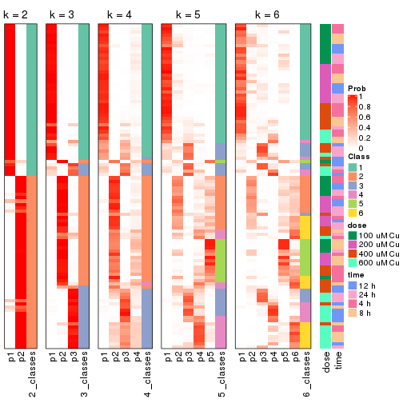


Test correlation between subgroups and known annotations. If the known
annotation is numeric, one-way ANOVA test is applied, and if the known
annotation is discrete, chi-squared contingency table test is applied.

```r
test_to_known_factors(res)
```

```
#>          n  dose(p)  time(p) k
#> ATC:NMF 98 4.80e-01 9.88e-01 2
#> ATC:NMF 94 8.47e-10 4.44e-01 3
#> ATC:NMF 58 3.19e-06 1.11e-01 4
#> ATC:NMF 72 2.29e-06 9.24e-05 5
#> ATC:NMF 62 3.10e-07 1.74e-05 6
```


If matrix rows can be associated to genes, consider to use `GO_Enrichment(res,
...)` to perform function enrichment for the signature genes.


 

## Session info


```r
sessionInfo()
```

```
#> R version 3.6.0 (2019-04-26)
#> Platform: x86_64-pc-linux-gnu (64-bit)
#> Running under: CentOS Linux 7 (Core)
#> 
#> Matrix products: default
#> BLAS:   /usr/lib64/libblas.so.3.4.2
#> LAPACK: /usr/lib64/liblapack.so.3.4.2
#> 
#> locale:
#>  [1] LC_CTYPE=en_GB.UTF-8       LC_NUMERIC=C               LC_TIME=en_GB.UTF-8       
#>  [4] LC_COLLATE=en_GB.UTF-8     LC_MONETARY=en_GB.UTF-8    LC_MESSAGES=en_GB.UTF-8   
#>  [7] LC_PAPER=en_GB.UTF-8       LC_NAME=C                  LC_ADDRESS=C              
#> [10] LC_TELEPHONE=C             LC_MEASUREMENT=en_GB.UTF-8 LC_IDENTIFICATION=C       
#> 
#> attached base packages:
#> [1] grid      parallel  stats     graphics  grDevices utils     datasets  methods   base     
#> 
#> other attached packages:
#> [1] genefilter_1.66.0    ComplexHeatmap_2.1.1 markdown_1.1         knitr_1.26          
#> [5] cola_1.3.2           GEOquery_2.52.0      Biobase_2.44.0       BiocGenerics_0.30.0 
#> [9] GetoptLong_0.1.7    
#> 
#> loaded via a namespace (and not attached):
#>  [1] bitops_1.0-6         matrixStats_0.55.0   bit64_0.9-7          doParallel_1.0.15   
#>  [5] RColorBrewer_1.1-2   httr_1.4.1           tools_3.6.0          backports_1.1.5     
#>  [9] R6_2.4.1             DBI_1.0.0            lazyeval_0.2.2       colorspace_1.4-1    
#> [13] withr_2.1.2          tidyselect_0.2.5     gridExtra_2.3        bit_1.1-14          
#> [17] compiler_3.6.0       xml2_1.2.2           microbenchmark_1.4-7 pkgmaker_0.28       
#> [21] slam_0.1-46          scales_1.1.0         readr_1.3.1          NMF_0.23.6          
#> [25] stringr_1.4.0        digest_0.6.23        pkgconfig_2.0.3      bibtex_0.4.2        
#> [29] highr_0.8            limma_3.40.6         rlang_0.4.2          GlobalOptions_0.1.1 
#> [33] RSQLite_2.1.2        impute_1.58.0        shape_1.4.4          mclust_5.4.5        
#> [37] dendextend_1.12.0    dplyr_0.8.3          RCurl_1.95-4.12      magrittr_1.5        
#> [41] Matrix_1.2-17        Rcpp_1.0.3           munsell_0.5.0        S4Vectors_0.22.1    
#> [45] viridis_0.5.1        lifecycle_0.1.0      stringi_1.4.3        plyr_1.8.4          
#> [49] blob_1.2.0           crayon_1.3.4         lattice_0.20-38      splines_3.6.0       
#> [53] annotate_1.62.0      circlize_0.4.9       hms_0.5.2            zeallot_0.1.0       
#> [57] pillar_1.4.2         rjson_0.2.20         rngtools_1.4         reshape2_1.4.3      
#> [61] codetools_0.2-16     stats4_3.6.0         XML_3.98-1.20        glue_1.3.1          
#> [65] evaluate_0.14        png_0.1-7            vctrs_0.2.0          foreach_1.4.7       
#> [69] polyclip_1.10-0      gtable_0.3.0         purrr_0.3.3          tidyr_1.0.0         
#> [73] clue_0.3-57          assertthat_0.2.1     ggplot2_3.2.1        xfun_0.11           
#> [77] gridBase_0.4-7       eulerr_6.0.0         xtable_1.8-4         skmeans_0.2-11      
#> [81] survival_2.44-1.1    viridisLite_0.3.0    tibble_2.1.3         iterators_1.0.12    
#> [85] AnnotationDbi_1.46.1 registry_0.5-1       memoise_1.1.0        IRanges_2.18.3      
#> [89] cluster_2.1.0        brew_1.0-6
```


